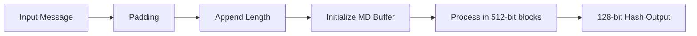
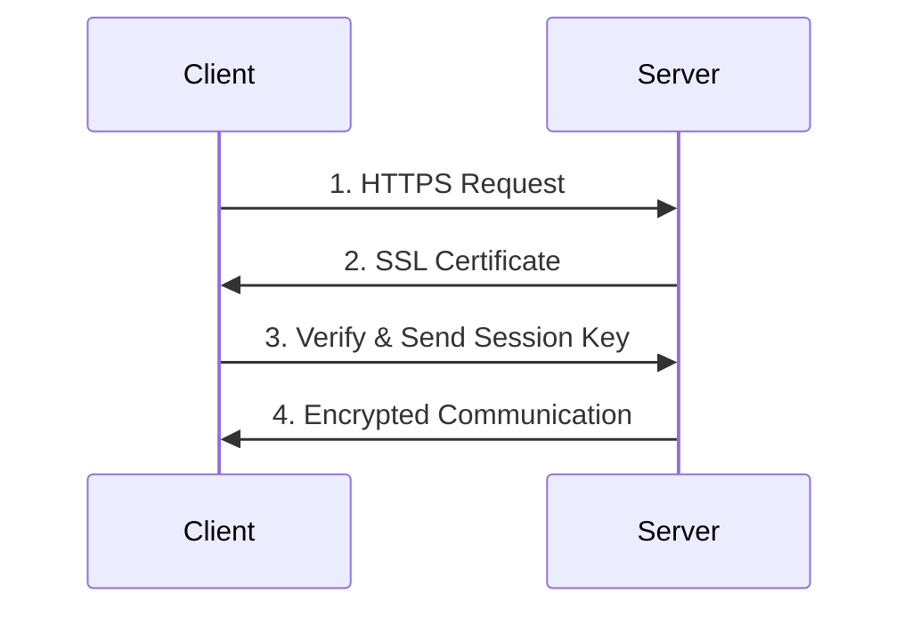
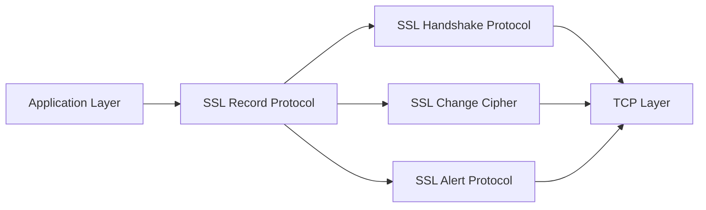
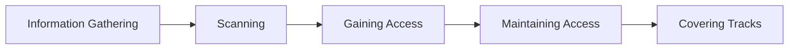
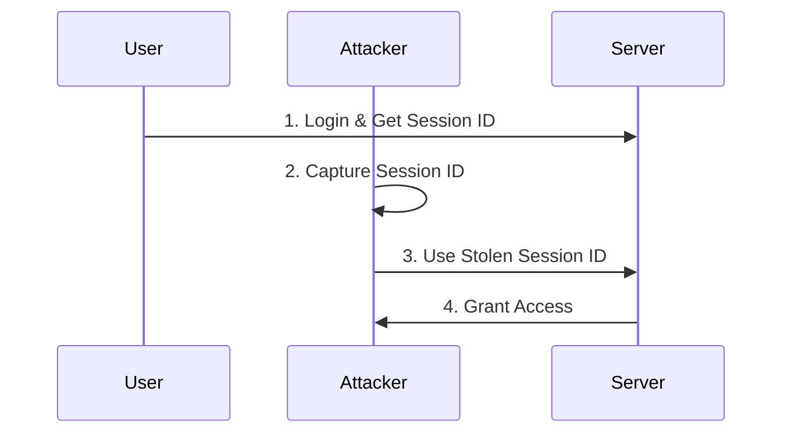
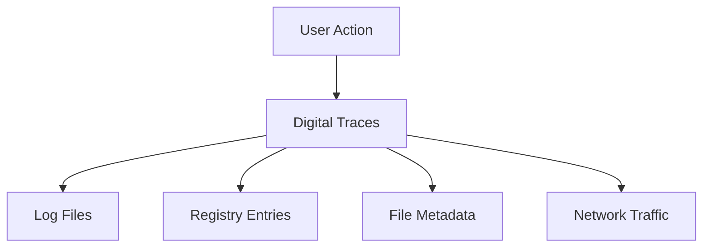
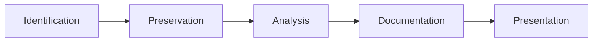

## Question 1(a) [3 marks]

**Describe CIA triad with example.**

**Answer**:

**CIA Triad Comparison Table:**

| Component | Definition | Example |
|-----------|------------|---------|
| **Confidentiality** | Ensures data is accessible only to authorized users | Bank account details should only be viewed by account holder |
| **Integrity** | Ensures data remains accurate and unmodified | Medical records must not be altered without authorization |
| **Availability** | Ensures systems and data are accessible when needed | ATM services must be available 24/7 for customers |

**Mnemonic:** "Can I Access" - Confidentiality, Integrity, Availability

---

## Question 1(b) [4 marks]

**Explain Public key and Private Key cryptography.**

**Answer**:

**Key Differences Table:**

| Aspect | Public Key Cryptography | Private Key Cryptography |
|--------|------------------------|-------------------------|
| **Keys Used** | Two keys (public + private) | Single shared key |
| **Key Distribution** | Public key can be shared openly | Key must be shared secretly |
| **Speed** | Slower encryption/decryption | Faster operations |
| **Security** | Higher security, no key sharing problem | Lower security due to key distribution |

**Key Points:**

- **Public Key**: Uses asymmetric encryption with key pairs
- **Private Key**: Uses symmetric encryption with shared secrets
- **Digital Signatures**: Public key enables non-repudiation
- **Key Management**: Private key requires secure distribution

**Mnemonic:** "PASS" - Public Asymmetric, Symmetric Secret

---

## Question 1(c) [7 marks]

**Explain various security services and security mechanism.**

**Answer**:

**Security Services Table:**

| Service | Purpose | Mechanism Example |
|---------|---------|------------------|
| **Authentication** | Verify user identity | Passwords, Biometrics |
| **Authorization** | Control access permissions | Access Control Lists |
| **Confidentiality** | Protect data privacy | Encryption (AES, RSA) |
| **Integrity** | Ensure data accuracy | Digital signatures, Hashing |
| **Non-repudiation** | Prevent denial of actions | Digital certificates |
| **Availability** | Ensure service accessibility | Firewalls, Backup systems |

**Security Mechanisms:**

- **Encryption**: Transforms plaintext to ciphertext
- **Digital Signatures**: Provides authentication and integrity
- **Access Control**: Restricts unauthorized access
- **Audit Trails**: Monitor and log security events

**Mnemonic:** "ACIANA" - Authentication, Confidentiality, Integrity, Authorization, Non-repudiation, Availability

---

## Question 1(c) OR [7 marks]

**Explain MD5 hashing algorithm.**

**Answer**:

**MD5 Algorithm Process:**

**MD5 Characteristics Table:**

| Property | Value |
|----------|-------|
| **Hash Size** | 128 bits (16 bytes) |
| **Block Size** | 512 bits |
| **Rounds** | 64 rounds |
| **Security Status** | Cryptographically broken |

**Key Features:**

- **One-way Function**: Cannot reverse hash to original
- **Fixed Output**: Always produces 128-bit hash
- **Avalanche Effect**: Small input change creates large output change
- **Collision Vulnerable**: Multiple inputs can produce same hash

**Mnemonic:** "MD5 FORB" - Message Digest 5, Fixed Output, Rounds 64, Broken security

---

## Question 2(a) [3 marks]

**What is firewall? List out types of firewall.**

**Answer**:

**Firewall Definition:** Network security device that monitors and controls incoming/outgoing traffic based on predetermined rules.

**Firewall Types Table:**

| Type | Operation Level | Example |
|------|----------------|---------|
| **Packet Filtering** | Network Layer | iptables |
| **Stateful Inspection** | Session Layer | Cisco ASA |
| **Application Gateway** | Application Layer | Proxy servers |
| **Next-Gen Firewall** | Multiple Layers | Palo Alto |

**Mnemonic:** "PSAN" - Packet, Stateful, Application, Next-gen

---

## Question 2(b) [4 marks]

**Define: HTTPS and describe working of HTTPS.**

**Answer**:

**HTTPS Definition:** HTTP Secure - encrypted version of HTTP using SSL/TLS protocols.

**HTTPS Working Process:**

**Key Components:**

- **SSL/TLS**: Provides encryption layer
- **Digital Certificates**: Verify server identity
- **Port 443**: Default HTTPS port
- **End-to-end Encryption**: Protects data in transit

**Mnemonic:** "HTTPS SDP4" - Secure, Digital certs, Port 443

---

## Question 2(c) [7 marks]

**Give explanation of active attack and passive attack in detail.**

**Answer**:

**Attack Types Comparison:**

| Aspect | Active Attack | Passive Attack |
|--------|---------------|----------------|
| **Detection** | Easily detectable | Difficult to detect |
| **System Impact** | Modifies system/data | Only observes data |
| **Examples** | DoS, Man-in-middle | Eavesdropping, Traffic analysis |
| **Prevention** | Firewalls, IDS | Encryption, Physical security |

**Active Attack Types:**

- **Masquerade**: Impersonating authorized user
- **Replay**: Retransmitting valid data transmissions
- **Modification**: Altering message contents
- **Denial of Service**: Preventing legitimate access

**Passive Attack Types:**

- **Traffic Analysis**: Studying communication patterns
- **Eavesdropping**: Monitoring communications
- **Footprinting**: Gathering system information

**Mnemonic:** "Active MRMD, Passive TEF" - Masquerade/Replay/Modify/DoS, Traffic/Eavesdrop/Footprint

---

## Question 2(a) OR [3 marks]

**What is digital signature? Explain digital signature properties.**

**Answer**:

**Digital Signature:** Cryptographic mechanism providing authentication, integrity, and non-repudiation.

**Properties Table:**

| Property | Description |
|----------|-------------|
| **Authentication** | Verifies sender identity |
| **Integrity** | Ensures message unchanged |
| **Non-repudiation** | Prevents sender denial |
| **Unforgeable** | Cannot be created without private key |

**Mnemonic:** "AINU" - Authentication, Integrity, Non-repudiation, Unforgeable

---

## Question 2(b) OR [4 marks]

**Define: Trojans, Rootkit, Backdoors, Keylogger**

**Answer**:

**Malware Types Table:**

| Type | Definition | Primary Function |
|------|------------|------------------|
| **Trojans** | Malicious code disguised as legitimate software | Provide unauthorized access |
| **Rootkit** | Software hiding presence of other malware | Conceal malicious activities |
| **Backdoors** | Secret entry point bypassing security | Remote unauthorized access |
| **Keylogger** | Records user keystrokes | Steal passwords/sensitive data |

**Mnemonic:** "TRBK" - Trojans hide, Rootkits conceal, Backdoors bypass, Keyloggers record

---

## Question 2(c) OR [7 marks]

**Explain Secure Socket Layer.**

**Answer**:

**SSL Architecture:**

**SSL Components Table:**

| Component | Function |
|-----------|----------|
| **Record Protocol** | Provides basic security services |
| **Handshake Protocol** | Establishes security parameters |
| **Change Cipher** | Signals encryption changes |
| **Alert Protocol** | Handles error conditions |

**SSL Process:**

- **Handshake**: Negotiate security parameters
- **Authentication**: Verify server identity
- **Key Exchange**: Establish session keys
- **Encryption**: Secure data transmission

**Mnemonic:** "SSL RHCA-HAKE" - Record/Handshake/Change/Alert, Handshake/Auth/Key/Encrypt

---

## Question 3(a) [3 marks]

**Explain in detail cybercrime and cybercriminal.**

**Answer**:

**Definitions Table:**

| Term | Definition |
|------|------------|
| **Cybercrime** | Criminal activities carried out using computers/internet |
| **Cybercriminal** | Individual who commits crimes using digital technology |

**Cybercriminal Types:**

- **Script Kiddies**: Use existing tools without deep knowledge
- **Hacktivists**: Motivated by political/social causes
- **Organized Crime**: Professional criminal groups
- **State-sponsored**: Government-backed attackers

**Mnemonic:** "SSHT" - Script kiddies, State-sponsored, Hacktivists, Teams organized

---

## Question 3(b) [4 marks]

**Describe cyber stalking and cyber bullying in detail.**

**Answer**:

**Comparison Table:**

| Aspect | Cyber Stalking | Cyber Bullying |
|--------|----------------|----------------|
| **Target** | Specific individual (often adult) | Often minors/peers |
| **Duration** | Long-term harassment | Can be one-time or repeated |
| **Intent** | Intimidation, control | Humiliation, social exclusion |
| **Methods** | Monitoring, threatening messages | Social media harassment, spreading rumors |

**Common Characteristics:**

- **Digital Platforms**: Social media, email, messaging apps
- **Anonymity**: Perpetrators often hide identity
- **Psychological Impact**: Causes emotional distress
- **Legal Consequences**: Violates cyber laws

**Mnemonic:** "STAL-BULL DPAL" - Digital platforms, Psychological impact, Anonymity, Legal issues

---

## Question 3(c) [7 marks]

**Explain Property based classification in cybercrime.**

**Answer**:

**Property-Based Cybercrime Classification:**

| Crime Type | Description | Example |
|------------|-------------|---------|
| **Credit Card Fraud** | Unauthorized use of payment cards | Online shopping with stolen cards |
| **Software Piracy** | Illegal copying/distribution of software | Downloading copyrighted software |
| **Copyright Infringement** | Violating intellectual property rights | Sharing movies/music illegally |
| **Trademark Violations** | Misusing registered trademarks | Creating fake brand websites |

**Impact Assessment:**

- **Financial Loss**: Direct monetary damage
- **Intellectual Property Theft**: Loss of competitive advantage
- **Brand Reputation**: Damage to company image
- **Legal Costs**: Expenses for prosecution/defense

**Prevention Measures:**

- **Digital Rights Management**: Protect copyrighted content
- **Secure Payment Systems**: Implement fraud detection
- **Legal Enforcement**: Prosecute violators
- **Public Awareness**: Educate about legitimate software

**Mnemonic:** "CSCT-FILP" - Credit/Software/Copyright/Trademark, Financial/Intellectual/Legal/Public

---

## Question 3(a) OR [3 marks]

**Explain Data diddling.**

**Answer**:

**Data Diddling Definition:** Unauthorized alteration of data before/during input into computer system.

**Characteristics Table:**

| Aspect | Details |
|--------|---------|
| **Method** | Changing data values slightly |
| **Detection** | Very difficult to detect |
| **Target** | Financial/sensitive data |
| **Impact** | Cumulative significant loss |

**Mnemonic:** "DIDDL" - Data alteration, Input manipulation, Difficult detection, Dollar losses

---

## Question 3(b) OR [4 marks]

**Explain cyber spying and cyber terrorism.**

**Answer**:

**Comparison Table:**

| Aspect | Cyber Spying | Cyber Terrorism |
|--------|--------------|-----------------|
| **Purpose** | Intelligence gathering | Cause fear/disruption |
| **Targets** | Government, corporations | Critical infrastructure |
| **Methods** | Stealth, long-term infiltration | Destructive attacks |
| **Impact** | Information theft | Physical/economic damage |

**Key Characteristics:**

- **Cyber Spying**: State-sponsored, corporate espionage
- **Cyber Terrorism**: Ideologically motivated, mass disruption
- **Common Tools**: Malware, social engineering, zero-day exploits

**Mnemonic:** "SPY-TER IGSD" - Intelligence/Government/Stealth/Disruption, Terror/Economic/Rapid/Damage

---

## Question 3(c) OR [7 marks]

**Explain article section 65 and section 66 of cyber law.**

**Answer**:

**IT Act 2008 Sections:**

| Section | Offense | Punishment |
|---------|---------|------------|
| **Section 65** | Computer source code tampering | Up to 3 years imprisonment or fine up to ₹2 lakh |
| **Section 66** | Computer-related offenses | Up to 3 years imprisonment or fine up to ₹5 lakh |

**Section 65 Details:**

- **Scope**: Knowingly/intentionally concealing, destroying, altering computer source code
- **Intent**: When computer source code required to be kept/maintained by law
- **Application**: Protects integrity of essential software systems

**Section 66 Details:**

- **Computer Hacking**: Unauthorized access to computer systems
- **Data Theft**: Downloading, copying, extracting data dishonestly
- **System Damage**: Destroying, deleting, altering information
- **Service Disruption**: Denying access to authorized persons

**Mnemonic:** "65-66 CDHD" - Code tampering, Damage, Hacking, Data theft

---

## Question 4(a) [3 marks]

**What is Hacking? List out types of Hackers.**

**Answer**:

**Hacking Definition:** Unauthorized access to computer systems/networks to exploit vulnerabilities.

**Hacker Types Table:**

| Type | Motivation | Activity |
|------|------------|----------|
| **White Hat** | Security improvement | Ethical penetration testing |
| **Black Hat** | Malicious intent | Criminal activities |
| **Grey Hat** | Mixed motives | Unauthorized but non-malicious |
| **Script Kiddie** | Recognition | Using existing tools |

**Mnemonic:** "WBGS Hat" - White, Black, Grey, Script kiddie

---

## Question 4(b) [4 marks]

**Explain Vulnerability and 0-Day terminology of Hacking.**

**Answer**:

**Terminology Table:**

| Term | Definition | Risk Level |
|------|------------|------------|
| **Vulnerability** | Security weakness that can be exploited | Medium-High |
| **0-Day Vulnerability** | Unknown security flaw | Critical |
| **0-Day Exploit** | Attack code for 0-day vulnerability | Critical |
| **0-Day Attack** | Active exploitation of 0-day | Critical |

**Key Characteristics:**

- **Unknown to Vendors**: No patches available
- **High Value**: Sold in dark markets
- **Stealthy**: Difficult to detect
- **Time-Critical**: Value decreases after disclosure

**Mnemonic:** "0-Day UHST" - Unknown, High-value, Stealthy, Time-critical

---

## Question 4(c) [7 marks]

**Explain Five Steps of Hacking.**

**Answer**:

**Hacking Process Flow:**

**Five Steps Detailed:**

| Step | Purpose | Tools/Techniques |
|------|---------|------------------|
| **1. Information Gathering** | Collect target information | OSINT, Social engineering |
| **2. Scanning** | Identify live systems, ports | Nmap, Port scanners |
| **3. Gaining Access** | Exploit vulnerabilities | Metasploit, Custom exploits |
| **4. Maintaining Access** | Establish persistent presence | Backdoors, Rootkits |
| **5. Covering Tracks** | Remove evidence | Log deletion, File cleanup |

**Each Step Details:**

- **Information Gathering**: Passive/Active reconnaissance
- **Scanning**: Network mapping, vulnerability assessment
- **Gaining Access**: Password attacks, buffer overflows
- **Maintaining Access**: Privilege escalation, backdoor installation
- **Covering Tracks**: Anti-forensics techniques

**Mnemonic:** "ISGMC" - Information, Scanning, Gaining, Maintaining, Covering

---

## Question 4(a) OR [3 marks]

**Explain any three basic commands of kali Linux with suitable example.**

**Answer**:

**Kali Linux Commands Table:**

| Command | Purpose | Example |
|---------|---------|---------|
| **nmap** | Network scanning | `nmap -sS 192.168.1.1` |
| **netcat** | Network utility | `nc -l -p 4444` |
| **john** | Password cracking | `john --wordlist=passwords.txt hashes.txt` |

**Command Details:**

- **nmap**: Stealth SYN scan on target IP
- **netcat**: Listen on port 4444 for connections
- **john**: Dictionary attack on password hashes

**Mnemonic:** "NNJ" - Nmap scans, Netcat listens, John cracks

---

## Question 4(b) OR [4 marks]

**Describe Session Hijacking in detail.**

**Answer**:

**Session Hijacking Process:**

**Types and Methods:**

- **Active Hijacking**: Attacker actively participates
- **Passive Hijacking**: Monitor and capture sessions
- **Network Level**: IP spoofing, ARP poisoning
- **Application Level**: Session ID prediction, XSS

**Prevention Measures:**

- **HTTPS**: Encrypt session data
- **Session Timeouts**: Limit session duration
- **IP Binding**: Tie sessions to IP addresses
- **Strong Session IDs**: Use unpredictable tokens

**Mnemonic:** "APNA-HSIS" - Active/Passive/Network/Application, HTTPS/Strong/IP/Session

---

## Question 4(c) OR [7 marks]

**Explain Remote Administration Tools.**

**Answer**:

**RAT Definition:** Software allowing remote control of computer systems, often used maliciously.

**RAT Functionality Table:**

| Function | Description | Risk Level |
|----------|-------------|------------|
| **Screen Capture** | Take screenshots remotely | Medium |
| **Keylogging** | Record keystrokes | High |
| **File Transfer** | Upload/download files | High |
| **Camera Access** | Activate webcam/microphone | Critical |

**Legitimate vs Malicious Use:**

| Aspect | Legitimate | Malicious |
|--------|------------|-----------|
| **Purpose** | IT support, administration | Espionage, theft |
| **Consent** | User aware and consenting | Installed without knowledge |
| **Access** | Authorized personnel only | Unauthorized attackers |

**Detection and Prevention:**

- **Antivirus**: Detect known RAT signatures
- **Network Monitoring**: Unusual outbound connections
- **User Education**: Avoid suspicious downloads
- **Firewall Rules**: Block unauthorized connections

**Common RATs:**

- **TeamViewer**: Legitimate remote access
- **DarkComet**: Malicious RAT
- **Poison Ivy**: Advanced persistent threat tool

**Mnemonic:** "RAT SKFC-ANUM" - Screen/Key/File/Camera, Antivirus/Network/User/Monitoring

---

## Question 5(a) [3 marks]

**Explain Mobile forensics.**

**Answer**:

**Mobile Forensics Definition:** Process of recovering digital evidence from mobile devices using scientifically accepted methods.

**Key Aspects Table:**

| Aspect | Description |
|--------|-------------|
| **Data Types** | Call logs, SMS, photos, app data |
| **Challenges** | Encryption, anti-forensics, variety of OS |
| **Tools** | Cellebrite, XRY, Oxygen Suite |
| **Legal** | Chain of custody, court admissibility |

**Mnemonic:** "DCTL" - Data types, Challenges, Tools, Legal requirements

---

## Question 5(b) [4 marks]

**What is Digital forensics? Write down advantages of Digital forensics.**

**Answer**:

**Digital Forensics Definition:** Scientific examination of digital devices to recover and analyze evidence for legal proceedings.

**Advantages Table:**

| Advantage | Description |
|-----------|-------------|
| **Evidence Recovery** | Retrieve deleted/hidden data |
| **Crime Solving** | Provide crucial evidence for cases |
| **Cost Effective** | Cheaper than traditional investigation |
| **Accurate Results** | Scientific methods ensure reliability |

**Additional Benefits:**

- **Time Efficient**: Faster than manual investigation
- **Non-destructive**: Preserves original evidence
- **Comprehensive**: Analyzes multiple data sources
- **Court Acceptable**: Legally admissible evidence

**Mnemonic:** "ECCA-TNCA" - Evidence/Crime/Cost/Accurate, Time/Non-destructive/Comprehensive/Admissible

---

## Question 5(c) [7 marks]

**Describe in detail Locard's Principle of exchange in Digital Forensics.**

**Answer**:

**Locard's Principle:** "Every contact leaves a trace" - any interaction between objects results in exchange of materials.

**Digital Application:**

**Digital Traces Table:**

| Action | Digital Trace | Location |
|--------|---------------|----------|
| **File Access** | Access timestamps | File system metadata |
| **Web Browsing** | Browser history | Browser databases |
| **Email Sending** | Email headers | Mail server logs |
| **USB Connection** | Device registry | Windows registry |

**Forensic Implications:**

- **Persistence**: Digital traces often persist longer
- **Accuracy**: Precise timestamps and data
- **Volume**: Large amounts of trace evidence
- **Recovery**: Deleted data can be recovered

**Evidence Types:**

- **Temporal**: When actions occurred
- **Spatial**: Where actions took place
- **Relational**: Connections between entities
- **Behavioral**: Patterns of user activity

**Applications:**

- **Criminal Cases**: Prove presence/actions
- **Civil Litigation**: Business disputes
- **Internal Investigations**: Employee misconduct
- **Incident Response**: Security breach analysis

**Mnemonic:** "LOCARD PVAR-TREB" - Persistence/Volume/Accuracy/Recovery, Temporal/Relational/Evidence/Behavioral

---

## Question 5(a) OR [3 marks]

**Explain Network forensics.**

**Answer**:

**Network Forensics Definition:** Monitoring and analysis of network traffic to gather information and evidence.

**Key Components Table:**

| Component | Function |
|-----------|----------|
| **Packet Capture** | Record network traffic |
| **Traffic Analysis** | Examine communication patterns |
| **Protocol Analysis** | Decode network protocols |
| **Timeline Creation** | Establish sequence of events |

**Mnemonic:** "PTTP" - Packet capture, Traffic analysis, Timeline, Protocol analysis

---

## Question 5(b) OR [4 marks]

**Explain why CCTV plays an important role as evidence in digital forensics investigations.**

**Answer**:

**CCTV Evidence Value:**

| Aspect | Importance |
|--------|------------|
| **Visual Proof** | Direct evidence of events |
| **Timestamp** | Precise time correlation |
| **Location Verification** | Proves presence at scene |
| **Behavior Analysis** | Shows actions and intent |

**Digital Forensics Integration:**

- **Metadata Extraction**: Camera settings, timestamps
- **Video Enhancement**: Improve image quality
- **Format Analysis**: Understand compression artifacts
- **Authentication**: Verify video integrity

**Legal Considerations:**

- **Chain of Custody**: Maintain evidence integrity
- **Court Admissibility**: Follow legal procedures
- **Privacy Rights**: Respect surveillance laws
- **Technical Validation**: Prove authenticity

**Mnemonic:** "VTLB-MFAC" - Visual/Timestamp/Location/Behavior, Metadata/Format/Authentication/Chain

---

## Question 5(c) OR [7 marks]

**Explain phases of Digital forensic investigation.**

**Answer**:

**Digital Forensic Investigation Phases:**

**Phase Details Table:**

| Phase | Activities | Tools/Methods |
|-------|------------|---------------|
| **Identification** | Locate potential evidence sources | Initial assessment, Scene survey |
| **Preservation** | Secure evidence without alteration | Imaging, Hash verification |
| **Analysis** | Examine evidence for relevant data | Forensic software, Manual review |
| **Documentation** | Record findings and procedures | Reports, Screenshots, Logs |
| **Presentation** | Present findings to stakeholders | Court testimony, Expert reports |

**Detailed Activities:**

**1. Identification Phase:**

- **Evidence Sources**: Computers, phones, servers, network logs
- **Scope Definition**: Determine investigation boundaries
- **Legal Authorization**: Obtain warrants/permissions
- **Initial Photography**: Document scene condition

**2. Preservation Phase:**

- **Bit-by-bit Imaging**: Create exact copies
- **Hash Calculation**: Verify integrity (MD5, SHA)
- **Chain of Custody**: Maintain evidence trail
- **Write Protection**: Prevent evidence modification

**3. Analysis Phase:**

- **Data Recovery**: Retrieve deleted files
- **Keyword Searching**: Find relevant information
- **Timeline Analysis**: Reconstruct events
- **Pattern Recognition**: Identify suspicious activities

**4. Documentation Phase:**

- **Methodology Recording**: Document procedures used
- **Evidence Cataloging**: List all findings
- **Screenshot Capture**: Visual evidence documentation
- **Report Preparation**: Comprehensive investigation report

**5. Presentation Phase:**

- **Expert Testimony**: Court appearances
- **Visual Aids**: Charts, diagrams, demonstrations
- **Technical Translation**: Explain complex concepts
- **Cross-examination**: Answer defense questions

**Quality Assurance:**

- **Peer Review**: Second examiner verification
- **Tool Validation**: Ensure software accuracy
- **Procedure Adherence**: Follow standard protocols
- **Continuous Training**: Keep skills current

**Legal Considerations:**

- **Admissibility Rules**: Meet court standards
- **Privacy Protection**: Respect individual rights
- **International Law**: Cross-border investigations
- **Professional Ethics**: Maintain objectivity

**Mnemonic:** "IPADP-ESLR-HTVC-MSCR-ETVI" - Identification/Preservation/Analysis/Documentation/Presentation with detailed sub-activities
