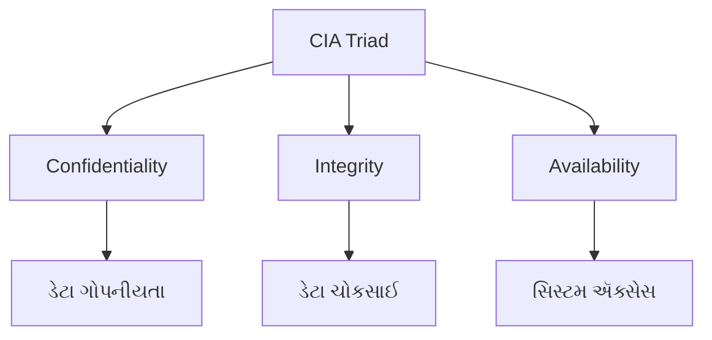
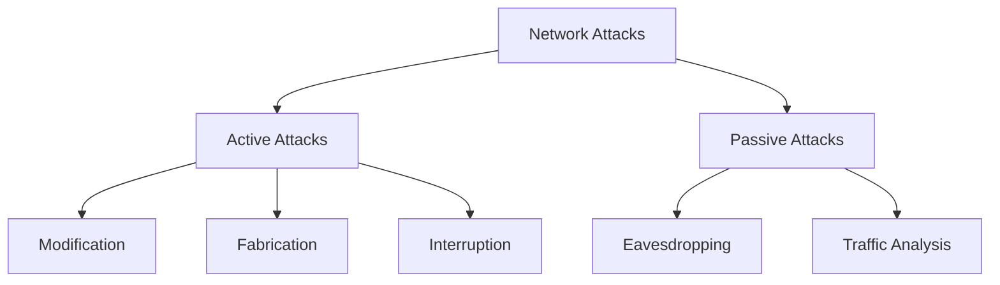
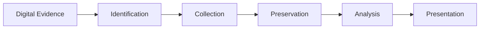
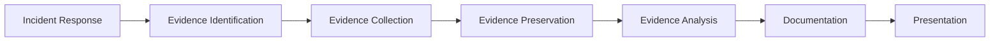

## પ્રશ્ન 1(અ) [3 ગુણ]

**Public key અને Private Key cryptography વચ્ચેનો તફાવત આપો.**

**જવાબ:**

| પાસાં | Private Key Cryptography | Public Key Cryptography |
|--------|-------------------------|------------------------|
| **Key Management** | એક જ key encryption/decryption માટે | અલગ keys encryption/decryption માટે |
| **Key Distribution** | સુરક્ષિત channel જરૂરી | સુરક્ષિત channel જરૂરી નથી |
| **Speed** | ઝડપી processing | Private key કરતાં ધીમી |
| **Security Level** | key ગુપ્ત રાખવાથી ઉચ્ચ | ગાણિતિક સુરક્ષા ઉચ્ચ |
| **ઉદાહરણ** | DES, AES | RSA, ECC |

**મેમરી ટ્રીક:** "Private Personal, Public Pair"

---

## પ્રશ્ન 1(બ) [4 ગુણ]

**CIA Triad સમજાવો.**

**જવાબ:**

CIA Triad એ માહિતી સુરક્ષાનો પાયો છે જેમાં ત્રણ મુખ્ય સિદ્ધાંતો છે:

**આકૃતિ:**



- **Confidentiality (ગોપનીયતા)**: ડેટા ફક્ત અધિકૃત વપરાશકર્તાઓ માટે ઉપલબ્ધ હોય
- **Integrity (અખંડિતતા)**: ડેટાની સચોટતા અને સંપૂર્ણતા જાળવે
- **Availability (ઉપલબ્ધતા)**: જરૂર પડે ત્યારે સિસ્ટમ્સ ઉપલબ્ધ હોય

**મેમરી ટ્રીક:** "Can I Access" (Confidentiality, Integrity, Availability)

---

## પ્રશ્ન 1(ક) [7 ગુણ]

**Md5 અલ્ગોરિધમના પગલાં સમજાવો.**

**જવાબ:**

MD5 (Message Digest 5) એ 128-bit hash value બનાવતું cryptographic hash function છે.

**અલ્ગોરિધમ પગલાં:**

| પગલું | પ્રક્રિયા | વર્ણન |
|------|---------|-------------|
| 1 | **Padding** | message length ≡ 448 (mod 512) બનાવવા bits ઉમેરવા |
| 2 | **Length Addition** | મૂળ message ની 64-bit length ઉમેરવી |
| 3 | **Initialize Buffers** | ચાર 32-bit buffers (A, B, C, D) સેટ કરવા |
| 4 | **Process Blocks** | 512-bit blocks માં message process કરવો |
| 5 | **Round Functions** | 16 operations ના 4 rounds લાગુ કરવા |

**કોડ બ્લોક:**

```python
# MD5 Processing Steps
def md5_process():
    # Step 1: Padding
    padded_message = original + padding_bits
    # Step 2: Process in 512-bit chunks  
    for chunk in chunks:
        # Step 3: Apply round functions
        result = round_functions(chunk)
    return final_hash
```

- **Round 1**: F(X,Y,Z) = (X∧Y) ∨ (¬X∧Z)
- **Round 2**: G(X,Y,Z) = (X∧Z) ∨ (Y∧¬Z)
- **Round 3**: H(X,Y,Z) = X⊕Y⊕Z
- **Round 4**: I(X,Y,Z) = Y⊕(X∨¬Z)

**મેમરી ટ્રીક:** "My Data Needs Proper Processing"

---

## પ્રશ્ન 1(ક અથવા) [7 ગુણ]

**RSA ના શોધકોની યાદી બનાવો. RSA અલ્ગોરિધમના સ્ટેપ્સ લખો.**

**જવાબ:**

**RSA શોધકો:**

- **Ron Rivest** (MIT)
- **Adi Shamir** (MIT) 
- **Leonard Adleman** (MIT)

**RSA અલ્ગોરિધમ પગલાં:**

| પગલું | પ્રક્રિયા | સૂત્ર |
|------|---------|---------|
| 1 | **Primes પસંદ કરો** | p, q (મોટા primes) પસંદ કરો |
| 2 | **n ગણતરી** | n = p × q |
| 3 | **φ(n) ગણતરી** | φ(n) = (p-1) × (q-1) |
| 4 | **e પસંદ કરો** | gcd(e, φ(n)) = 1 |
| 5 | **d ગણતરી** | d × e ≡ 1 (mod φ(n)) |
| 6 | **Encryption** | C = M^e mod n |
| 7 | **Decryption** | M = C^d mod n |

**Key Pairs:**

- **Public Key**: (n, e)
- **Private Key**: (n, d)

**મેમરી ટ્રીક:** "RSA: Rivest Shamir Adleman"

---

## પ્રશ્ન 2(અ) [3 ગુણ]

**વ્યાખ્યા આપો: Firewall. Firewall ની મર્યાદાઓની યાદી બનાવો.**

**જવાબ:**

**વ્યાખ્યા:** Firewall એ network security device છે જે પૂર્વ-નિર્ધારિત સુરક્ષા નિયમોના આધારે આવતા/જતા network traffic ને monitor અને control કરે છે.

**મર્યાદાઓ:**

| મર્યાદા | વર્ણન |
|------------|-------------|
| **આંતરિક ધમકીઓ** | insider attacks થી સુરક્ષા આપી શકતી નથી |
| **Application Layer** | application-specific attacks સામે મર્યાદિત સુરક્ષા |
| **Performance** | network traffic ધીમી કરી શકે છે |
| **Configuration** | યોગ્ય setup અને maintenance જરૂરી |
| **Encrypted Traffic** | encrypted content ને અસરકારક રીતે inspect કરી શકતી નથી |

**મેમરી ટ્રીક:** "Fire Walls Limit Internal Protection"

---

## પ્રશ્ન 2(બ) [4 ગુણ]

**IPsec Tunnel Mode અને Transport mode નું સ્કેચ કરો.**

**જવાબ:**

**IPsec Modes Comparison:**

```goat
Transport Mode:
+----------+----------+----------+
| Original | IPsec    | Original |
| IP Header| Header   | Payload  |
+----------+----------+----------+

Tunnel Mode:
+----------+----------+----------+----------+
| New IP   | IPsec    | Original | Original |
| Header   | Header   | IP Header| Payload  |
+----------+----------+----------+----------+
```

**મુખ્ય તફાવતો:**

| પાસું | Transport Mode | Tunnel Mode |
|--------|---------------|-------------|
| **સુરક્ષા** | ફક્ત Payload | સંપૂર્ણ packet |
| **ઉપયોગ** | End-to-end | Gateway-to-gateway |
| **Overhead** | ઓછું | વધારે |
| **IP Header** | મૂળ જાળવાયેલું | નવું header ઉમેર્યું |

**મેમરી ટ્રીક:** "Transport Travels, Tunnel Total"

---

## પ્રશ્ન 2(ક) [7 ગુણ]

**વિવિધ પ્રકારના Active અને Passive attacks નું વિગતવાર વર્ણન કરો.**

**જવાબ:**

**Attack વર્ગીકરણ:**



**Active Attacks:**

| પ્રકાર | વર્ણન | ઉદાહરણ |
|------|-------------|---------|
| **Masquerade** | અન્ય entity નો નકલી અવતાર | Fake identity |
| **Replay** | captured data ને ફરીથી transmit કરવું | Session replay |
| **Modification** | message content ને બદલવું | Data tampering |
| **DoS** | service availability નો ઇનકાર | Server flooding |

**Passive Attacks:**

| પ્રકાર | વર્ણન | અસર |
|------|-------------|--------|
| **Eavesdropping** | communications સાંભળવું | Data theft |
| **Traffic Analysis** | communication patterns નું analysis | Privacy breach |
| **Monitoring** | network activity નું observation | Information gathering |

- **Active attacks** system resources અથવા data ને modify કરે છે
- **Passive attacks** માહિતી observe અને collect કરે છે
- **Detection**: Active attacks passive કરતાં વધારે detect થાય છે

**મેમરી ટ્રીક:** "Active Acts, Passive Peeks"

---

## પ્રશ્ન 2(અ અથવા) [3 ગુણ]

**વ્યાખ્યા આપો: Digital Signature. Digital Signature ના વિવિધ એપ્લિકેશન ક્ષેત્રોરની ચર્ચા કરો.**

**જવાબ:**

**વ્યાખ્યા:** Digital Signature એ cryptographic technique છે જે public key cryptography ના ઉપયોગથી digital messages અથવા documents ની authenticity અને integrity ને validate કરે છે.

**એપ્લિકેશન ક્ષેત્રો:**

| ક્ષેત્ર | ઉપયોગ |
|------|----------|
| **E-commerce** | Online transactions, contracts |
| **Banking** | Electronic fund transfers, cheques |
| **Government** | Digital certificates, સરકારી documents |
| **Healthcare** | Patient records, prescriptions |
| **Legal** | Electronic contracts, court documents |

**મેમરી ટ્રીક:** "Digital Documents Demand Authentic Approval"

---

## પ્રશ્ન 2(બ અથવા) [4 ગુણ]

**HTTP અને HTTPS વચ્ચેનો તફાવત આપો.**

**જવાબ:**

| પેરામીટર | HTTP | HTTPS |
|-----------|------|-------|
| **સુરક્ષા** | કોઈ encryption નથી | SSL/TLS encryption |
| **Port** | 80 | 443 |
| **Protocol** | Hypertext Transfer Protocol | HTTP + SSL/TLS |
| **ડેટા સુરક્ષા** | Plain text | Encrypted |
| **Authentication** | Server verification નથી | Server certificate validation |
| **Speed** | વધારે ઝડપી | થોડી ધીમી |
| **URL Prefix** | http:// | https:// |

**આકૃતિ:**

```goat
HTTP:
Client ----Plain Text----> Server

HTTPS:
Client ----Encrypted-----> Server
       <---Certificate----
```

**મેમરી ટ્રીક:** "HTTPS Has Security"

---

## પ્રશ્ન 2(ક અથવા) [7 ગુણ]

**વ્યાખ્યા આપો: Malicious software. Virus, Worm, Keylogger, Trojans ને વિગતવાર સમજાવો.**

**જવાબ:**

**વ્યાખ્યા:** Malicious software (Malware) એ એવા software છે જે computer systems ને નુકસાન પહોંચાડવા, exploit કરવા અથવા unauthorized access મેળવવા માટે design કરવામાં આવે છે.

**Malware ના પ્રકારો:**

| પ્રકાર | લક્ષણો | વર્તન |
|------|----------------|----------|
| **Virus** | Host file જરૂરી | Programs સાથે attach થાય, execute થતાં spread થાય |
| **Worm** | Self-replicating | Networks દ્વારા સ્વતંત્ર રીતે spread થાય |
| **Keylogger** | Keystrokes record કરે | Passwords અને sensitive data steal કરે |
| **Trojan** | Legitimate તરીકે disguise | Attackers ને backdoor access આપે |

**વિગતવાર સમજૂતી:**

**Virus:**

- Execute થવા માટે host program જરૂરી
- Infected files દ્વારા spread થાય
- Data corrupt અથવા delete કરી શકે

**Worm:**

- Self-propagating malware
- Network vulnerabilities exploit કરે
- Network bandwidth consume કરે

**Keylogger:**

- User keystrokes record કરે
- Login credentials capture કરે
- Hardware અથવા software-based હોઈ શકે

**Trojan:**

- Legitimate software તરીકે દેખાય
- Remote access માટે backdoor બનાવે
- Self-replicate થતું નથી

**મેમરી ટ્રીક:** "Viruses Visit, Worms Wander, Keys Captured, Trojans Trick"

---

## પ્રશ્ન 3(અ) [3 ગુણ]

**વ્યાખ્યા આપો: Cybercrime. Cyber Law ની જરૂરિયાતો વિશે ચર્ચા કરો.**

**જવાબ:**

**વ્યાખ્યા:** Cybercrime એ computers, networks અથવા digital devices ને tools અથવા targets તરીકે ઉપયોગ કરીને કરવામાં આવતી ગુનાહિત પ્રવૃત્તિઓ છે.

**Cyber Law ની જરૂરિયાતો:**

| જરૂરિયાત | સમર્થન |
|------|---------------|
| **કાનૂની માળખું** | Cyber અપરાધોની સ્પષ્ટ વ્યાખ્યા સ્થાપિત કરવી |
| **અધિકારક્ષેત્ર** | ભૌગોલિક સીમાઓમાં સત્તાની વ્યાખ્યા |
| **પુરાવા** | Digital evidence collection માટે guidelines |
| **સજા** | Cybercriminals માટે deterrent પગલાં |
| **સુરક્ષા** | વ્યક્તિગત અને સંસ્થાકીય અધિકારોનું રક્ષણ |

**મેમરી ટ્રીક:** "Cyber Laws Create Legal Protection"

---

## પ્રશ્ન 3(બ) [4 ગુણ]

**Cyber spying અને Cyber theft સમજાવો.**

**જવાબ:**

**Cyber Spying:**

- **વ્યાખ્યા**: Digital communications અને activities ની unauthorized surveillance
- **પદ્ધતિઓ**: Malware, phishing, social engineering
- **લક્ષ્યો**: Government, corporate secrets, personal data
- **અસર**: National security threats, competitive disadvantage

**Cyber Theft:**

- **વ્યાખ્યા**: Digital assets અથવા information નું unauthorized taking
- **પ્રકારો**: Identity theft, financial fraud, intellectual property theft
- **પદ્ધતિઓ**: Hacking, social engineering, insider threats
- **પરિણામો**: Financial loss, reputation damage

**તુલના કોષ્ટક:**

| પાસું | Cyber Spying | Cyber Theft |
|--------|--------------|-------------|
| **હેતુ** | Information gathering | Asset acquisition |
| **Detection** | ઘણીવાર undetected | Notice થઈ શકે |
| **અવધિ** | Long-term monitoring | One-time અથવા periodic |
| **પ્રેરણા** | Intelligence/espionage | Financial gain |

**મેમરી ટ્રીક:** "Spies Spy, Thieves Take"

---

## પ્રશ્ન 3(ક) [7 ગુણ]

**Cyber Law ની કલમ 66 સમજાવો.**

**જવાબ:**

**કલમ 66 - Computer Related Offences (IT Act 2008):**

**મુખ્ય જોગવાઈઓ:**

| પેટા-કલમ | અપરાધ | સજા |
|-------------|---------|------------|
| **66(1)** | બેઈમાનીથી/છેતરપિંડીથી computer resource damage | 3 વર્ષ સુધી કેદ + ₹5 લાખ સુધી દંડ |
| **66A** | અપમાનજનક સંદેશા મોકલવા | 3 વર્ષ સુધી + દંડ |
| **66B** | ચોરેલા computer resource receive કરવા | 3 વર્ષ + ₹1 લાખ સુધી દંડ |
| **66C** | Identity theft | 3 વર્ષ + ₹1 લાખ સુધી દંડ |
| **66D** | Computer વાપરીને personation દ્વારા છેતરપિંડી | 3 વર્ષ + ₹1 લાખ સુધી દંડ |
| **66E** | Privacy નું ઉલ્લંઘન | 3 વર્ષ + ₹2 લાખ સુધી દંડ |
| **66F** | Cyber terrorism | આજીવન કેદ |

**વિગતવાર કવરેજ:**

**કલમ 66 મુખ્ય અપરાધો:**

- **Hacking**: Computer systems માં unauthorized access
- **Data Theft**: પરવાનગી વિના data steal અથવા copy કરવું
- **System Damage**: Computer data destroy અથવા alter કરવું
- **વાયરસ પ્રવેશ**: Malicious code દાખલ કરવું

**જરૂરી તત્વો:**

- **ઈરાદો**: બેઈમાન અથવા છેતરપિંડીનો ઈરાદો
- **પ્રવેશ**: માલિકની પરવાનગી વિના
- **નુકસાન**: System અથવા data ને હાનિ પહોંચાડવી
- **જાણકારી**: Unauthorized access ની જાણકારી

**કાનૂની માળખું:**

- **Cognizable**: Police warrant વિના arrest કરી શકે
- **Non-bailable**: Court ના વિવેકબુદ્ધિથી bail
- **પુરાવા**: Digital evidence court માં admissible

**મેમરી ટ્રીક:** "Section 66 Stops Cyber Sins"

---

## પ્રશ્ન 3(અ અથવા) [3 ગુણ]

**Cyber terrorism સમજાવો.**

**જવાબ:**

**વ્યાખ્યા:** Cyber terrorism એ રાજકીય, ધાર્મિક અથવા વૈચારિક હેતુઓ માટે ભય, વિક્ષેપ અથવા નુકસાન સર્જવા માટે digital technologies નો ઉપયોગ છે.

**લક્ષણો:**

| પાસું | વર્ણન |
|--------|-------------|
| **લક્ષ્ય** | Critical infrastructure, government systems |
| **પદ્ધતિ** | DDoS attacks, system infiltration, data destruction |
| **પ્રેરણા** | Political, religious, ideological goals |
| **અસર** | Public fear, economic disruption, national security |

**ઉદાહરણો:**

- Power grid પર attacks
- Transportation system disruption
- Financial system targeting

**મેમરી ટ્રીક:** "Terror Through Technology"

---

## પ્રશ્ન 3(બ અથવા) [4 ગુણ]

**Cyber bullying & Cyber stalking સમજાવો.**

**જવાબ:**

**Cyber Bullying:**

- **વ્યાખ્યા**: અન્યોને harass, intimidate અથવા harm કરવા માટે digital platforms નો ઉપયોગ
- **પ્લેટફોર્મ**: Social media, messaging apps, online forums
- **લક્ષણો**: Repetitive, intentional harm, power imbalance
- **અસર**: Psychological trauma, depression, social isolation

**Cyber Stalking:**

- **વ્યાખ્યા**: ભય અથવા emotional distress ઉત્પન્ન કરતું persistent online harassment
- **પદ્ધતિઓ**: Unwanted messages, tracking, identity theft
- **અવધિ**: Long-term, continuous behavior
- **કાનૂની**: ઘણા jurisdictions માં criminal offense

**તુલના:**

| પાસું | Cyber Bullying | Cyber Stalking |
|--------|----------------|----------------|
| **અવધિ** | Episodes | Persistent |
| **વયજૂથ** | મુખ્યત્વે minors | બધી ઉંમર |
| **પ્રેરણા** | Social dominance | Obsession/control |
| **પ્લેટફોર્મ** | Public/semi-public | Private/public |

**મેમરી ટ્રીક:** "Bullies Bother, Stalkers Stalk"

---

## પ્રશ્ન 3(ક અથવા) [7 ગુણ]

**Cyber Law ની કલમ 67 સમજાવો.**

**જવાબ:**

**કલમ 67 - અશ્લીલ માહિતી પ્રકાશિત કરવું (IT Act 2008):**

**મુખ્ય જોગવાઈઓ:**

| કલમ | વિષય-વસ્તુ | સજા |
|---------|---------|------------|
| **67** | અશ્લીલ સામગ્રી પ્રકાશિત કરવી | પ્રથમ દોષિત: 3 વર્ષ + ₹5 લાખ દંડ |
| **67A** | લૈંગિક સ્પષ્ટ સામગ્રી | 5 વર્ષ સુધી + ₹10 લાખ દંડ |
| **67B** | બાળ અશ્લીલતા | પ્રથમ: 5 વર્ષ + ₹10 લાખ, આવર્તક: 7 વર્ષ + ₹10 લાખ |
| **67C** | મધ્યવર્તી જવાબદારી | ગેરકાયદેસર content remove કરવામાં નિષ્ફળતા |

**મુખ્ય તત્વો:**

**કલમ 67 - અશ્લીલતા:**

- **પ્રકાશન**: Electronic form માં ઉપલબ્ધ કરાવવું
- **વિષય-વસ્તુ**: કામુક, લૈંગિક સ્પષ્ટ સામગ્રી
- **માધ્યમ**: Website, email, social media
- **ઈરાદો**: દર્શકોને corrupt અથવા deprave કરવાનો

**કલમ 67A - લૈંગિક સ્પષ્ટ:**

- સામાન્ય અશ્લીલતા કરતાં **વધારે સજા**
- સ્પષ્ટ sexual content માટે **વ્યાપક અવકાશ**
- **વ્યાવસાયિક હેતુ** aggravating factor તરીકે ગણાય

**કલમ 67B - બાળ સુરક્ષા:**

- બાળ શોષણ માટે **શૂન્ય સહનશીલતા**
- Possession અને distribution માટે **કડક જવાબદારી**
- ગંભીરતા દર્શાવતી **ઉચ્ચ સજાઓ**
- Platforms માટે **વય ચકાસણી** જરૂરિયાતો

**ઉપલબ્ધ બચાવ:**

- **વૈજ્ઞાનિક/શિક્ષણિક** હેતુ
- **કલાત્મક ગુણવત્તા** ની ધ્યાનમાં લેવાઈ
- કેટલાક કિસ્સાઓમાં **ખાનગી જોવાઈ**
- Content ના **સ્વભાવ વિશે જાણકારીનો** અભાવ

**ડિજિટલ પુરાવાની જરૂરિયાતો:**

- **Chain of custody** ની જાળવણી
- **તકનીકી અધિકૃતતા** નો પુરાવો
- **સ્રોત ઓળખ** પદ્ધતિઓ
- Electronic evidence નું **સંરક્ષણ**

**મેમરી ટ્રીક:** "Section 67 Stops Shameful Sharing"

---

## પ્રશ્ન 4(અ) [3 ગુણ]

**હેકર્સના પ્રકારોની ચર્ચા કરો.**

**જવાબ:**

**હેકર વર્ગીકરણ:**

| પ્રકાર | પ્રેરણા | પ્રવૃત્તિઓ |
|------|------------|------------|
| **White Hat** | નૈતિક સુરક્ષા પરીક્ષણ | અધિકૃત penetration testing |
| **Black Hat** | દુર્ભાવનાપૂર્ણ ઈરાદો | ગેરકાયદેસર system breaking |
| **Gray Hat** | મિશ્ર પ્રેરણાઓ | Unauthorized પણ non-malicious |
| **Script Kiddie** | માન્યતા/મજા | હાલના tools નો ઉપયોગ |
| **Hacktivist** | રાજકીય/સામાજિક કારણો | Hacking દ્વારા વિરોધ |

**વિગતવાર પ્રકારો:**

- **White Hat**: નૈતિક hackers, સુરક્ષા વ્યાવસાયિકો
- **Black Hat**: નફો અથવા નુકસાન શોધતા cybercriminals
- **Gray Hat**: નૈતિક અને દુર્ભાવનાપૂર્ણ વચ્ચે

**મેમરી ટ્રીક:** "Hats Have Hacker Hierarchy"

---

## પ્રશ્ન 4(બ) [4 ગુણ]

**RAT સમજાવો.**

**જવાબ:**

**RAT (Remote Administration Tool):**

**વ્યાખ્યા:** Software જે computer system ના remote control ની મંજૂરી આપે છે, ઘણીવાર unauthorized access માટે દુર્ભાવનાપૂર્ણ રીતે ઉપયોગ થાય છે.

**લક્ષણો:**

| ફીચર | વર્ણન |
|---------|-------------|
| **Remote Control** | અંતરથી સંપૂર્ણ system access |
| **Stealth Mode** | User detection થી છુપાયેલું |
| **Data Theft** | ફાઈલ access અને transfer ક્ષમતાઓ |
| **Keylogging** | Keystroke recording |
| **Screen Capture** | Desktop monitoring |

**સામાન્ય RATs:**

- **BackOrifice**
- **NetBus**
- **DarkComet**
- **Poison Ivy**

**Detection પદ્ધતિઓ:**

- Antivirus software
- Network monitoring
- Process analysis
- Behavioral detection

**મેમરી ટ્રીક:** "RATs Run Remote Access Tactics"

---

## પ્રશ્ન 4(ક) [7 ગુણ]

**હેકિંગના પાંચ સ્ટેપ્સ સમજાવો.**

**જવાબ:**

**પાંચ-તબક્કાની હેકિંગ પદ્ધતિ:**


**વિગતવાર પગલાં:**

| તબક્કો | હેતુ | તકનીકો | સાધનો |
|-------|---------|------------|-------|
| **1. Reconnaissance** | માહિતી એકત્રીકરણ | OSINT, Social Engineering | Google, Shodan, WHOIS |
| **2. Scanning** | Vulnerabilities ઓળખવી | Port scanning, Network mapping | Nmap, Nessus |
| **3. Gaining Access** | Vulnerabilities નો દુરુપયોગ | Password attacks, Code injection | Metasploit, Hydra |
| **4. Maintaining Access** | સતત નિયંત્રણ | Backdoors, Rootkits | RATs, Trojans |
| **5. Covering Tracks** | પુરાવા છુપાવવા | Log deletion, Steganography | CCleaner, File wipers |

**તબક્કો 1 - Reconnaissance:**

- **Passive**: જાહેર માહિતી એકત્રીકરણ
- **Active**: પ્રત્યક્ષ target interaction
- **લક્ષ્ય**: Target infrastructure નું mapping

**તબક્કો 2 - Scanning:**

- **Network scanning**: Live system identification
- **Port scanning**: Service discovery  
- **Vulnerability scanning**: Weakness identification

**તબક્કો 3 - Gaining Access:**

- **Exploitation**: Vulnerability utilization
- **Authentication attacks**: Password cracking
- **Privilege escalation**: Higher access levels

**તબક્કો 4 - Maintaining Access:**

- **Backdoor installation**: ભવિષ્ય access
- **System modification**: Persistence mechanisms
- **Data collection**: Information harvesting

**તબક્કો 5 - Covering Tracks:**

- **Log manipulation**: Evidence removal
- **File deletion**: Trace elimination
- **Timeline modification**: Activity concealment

**મેમરી ટ્રીક:** "Real Smart Guys Make Choices" (Reconnaissance, Scanning, Gaining, Maintaining, Covering)

---

## પ્રશ્ન 4(અ અથવા) [3 ગુણ]

**Brute force attack સમજાવો.**

**જવાબ:**

**વ્યાખ્યા:** Brute force attack એ trial-and-error પદ્ધતિ છે જે બધા સંભવિત combinations ને વ્યવસ્થિત રીતે try કરીને encrypted data ને decode કરવા માટે ઉપયોગ થાય છે.

**લક્ષણો:**

| પાસું | વર્ણન |
|--------|-------------|
| **પદ્ધતિ** | Exhaustive key search |
| **સમય** | Computationally intensive |
| **સફળતા** | બાંયધરી આપેલી પણ સમય લેવાડતી |
| **લક્ષ્ય** | Passwords, encryption keys |
| **સાધનો** | Automated software |

**પ્રકારો:**

- **Simple Brute Force**: બધા સંભવિત combinations
- **Dictionary Attack**: સામાન્ય passwords
- **Hybrid Attack**: Dictionary + variations

**મેમરી ટ્રીક:** "Brute Force Breaks By Trying"

---

## પ્રશ્ન 4(બ અથવા) [4 ગુણ]

**વ્યાખ્યા આપો: Vulnerability, Threat, Exploit**

**જવાબ:**

**સુરક્ષા પરિભાષા:**

| શબ્દ | વ્યાખ્યા | ઉદાહરણ |
|------|------------|---------|
| **Vulnerability** | System/software માં નબળાઈ | Unpatched software bug |
| **Threat** | Asset માટે સંભવિત ખતરો | Malicious hacker |
| **Exploit** | Vulnerability નો ફાયદો ઉઠાવતો code | Buffer overflow attack |

**સંબંધ:**

```goat
Threat ----uses----> Exploit ----targets----> Vulnerability
   |                    |                        |
   v                    v                        v
Hacker              Attack Code            System Weakness
```

**ઉદાહરણો:**

- **Vulnerability**: SQL injection ખામી
- **Threat**: Cybercriminal
- **Exploit**: SQL injection payload

**જોખમ સૂત્ર:**
Risk = Threat × Vulnerability × Asset Value

**મેમરી ટ્રીક:** "Threats Target Vulnerable Exploits"

---

## પ્રશ્ન 4(ક અથવા) [7 ગુણ]

**kali Linux ના કોઈપણ ત્રણ કમાન્ડ ઉદાહરણ આપીને સમજાવો.**

**જવાબ:**

**આવશ્યક Kali Linux કમાન્ડ્સ:**

**1. NMAP (Network Mapper):**

```bash
# Port scanning
nmap -sS target_ip
nmap -A -T4 192.168.1.1
```

| વિકલ્પ | હેતુ | ઉદાહરણ |
|--------|---------|---------|
| **-sS** | SYN scan | nmap -sS 192.168.1.1 |
| **-A** | Aggressive scan | nmap -A target.com |
| **-p** | Specific ports | nmap -p 80,443 target.com |

**2. Metasploit:**

```bash
# Metasploit શરૂ કરો
msfconsole
# Exploits શોધો
search apache
# Exploit ઉપયોગ કરો
use exploit/windows/smb/ms17_010_eternalblue
```

**કમાન્ડ્સ:**

- **search**: Exploits/payloads શોધવા
- **use**: Module પસંદ કરવું
- **set**: Options configure કરવા
- **exploit**: Attack લોંચ કરવા

**3. Wireshark:**

```bash
# Command line version
tshark -i eth0
# Traffic filter કરો
tshark -i eth0 -f "port 80"
```

**ફીચર્સ:**

- **Packet capture**: Real-time network monitoring
- **Protocol analysis**: Deep packet inspection  
- **Filter options**: Targeted traffic analysis
- **GUI interface**: User-friendly analysis

**વધારાની કમાન્ડ્સ:**

**4. Hydra (Password Cracking):**

```bash
hydra -l admin -P passwords.txt ssh://192.168.1.1
```

**5. John the Ripper:**

```bash
john --wordlist=rockyou.txt hashes.txt
```

**6. Aircrack-ng (WiFi Security):**

```bash
airmon-ng start wlan0
airodump-ng wlan0mon
```

**કમાન્ડ કેટેગરીઝ:**

| કેટેગરી | સાધનો | હેતુ |
|----------|-------|---------|
| **Network Scanning** | nmap, masscan | Host/port discovery |
| **Vulnerability Assessment** | OpenVAS, Nessus | Security scanning |
| **Exploitation** | Metasploit, SQLmap | Vulnerability exploitation |
| **Password Attacks** | Hydra, John | Credential cracking |
| **Wireless Security** | Aircrack-ng | WiFi penetration testing |

**મેમરી ટ્રીક:** "Network Maps Make Security"

---

## પ્રશ્ન 5(અ) [3 ગુણ]

**Digital Forensics ની શાખાઓની સૂચિ બનાવો**

**જવાબ:**

**Digital Forensics શાખાઓ:**

| શાખા | ફોકસ વિસ્તાર | એપ્લિકેશન્સ |
|--------|------------|--------------|
| **Computer Forensics** | Desktop/laptop systems | Hard drive analysis |
| **Network Forensics** | Network traffic analysis | Intrusion investigation |
| **Mobile Forensics** | Smartphones/tablets | Call logs, messages |
| **Database Forensics** | Database systems | Data integrity verification |
| **Malware Forensics** | Malicious software | Malware analysis |
| **Email Forensics** | Email communications | Email header analysis |
| **Memory Forensics** | RAM analysis | Live system investigation |

**વિશેષિત વિસ્તારો:**

- **Cloud Forensics**
- **IoT Forensics**
- **Blockchain Forensics**

**મેમરી ટ્રીક:** "Digital Detectives Discover Many Clues"

---

## પ્રશ્ન 5(બ) [4 ગુણ]

**Digital Forensics માં લોકાર્ડના વિનિમયના સિદ્ધાંતની ચર્ચા કરો.**

**જવાબ:**

**લોકાર્ડનો વિનિમય સિદ્ધાંત:**

**મૂળ સિદ્ધાંત:** "દરેક સંપર્ક નિશાન છોડે છે"

**ડિજિટલ એપ્લિકેશન:**

| ડિજિટલ પ્રવૃત્તિ | છોડવામાં આવેલ નિશાન | સ્થાન |
|------------------|------------|----------|
| **File Access** | Access timestamps | File metadata |
| **Web Browsing** | Browser history, cookies | Browser cache |
| **Email Communication** | Headers, logs | Mail servers |
| **Network Activity** | Connection logs | Network devices |
| **USB Usage** | Device artifacts | Registry/logs |

**ડિજિટલ પુરાવાના નિશાનો:**

**સિસ્ટમ સ્તર:**

- **Registry entries**: સિસ્ટમ ફેરફારો
- **Log files**: પ્રવૃત્તિ રેકોર્ડ્સ
- **Temporary files**: Process artifacts
- **Metadata**: ફાઈલ માહિતી

**નેટવર્ક સ્તર:**

- **Router logs**: Traffic records
- **Firewall logs**: Connection attempts
- **DNS queries**: Website visits
- **Packet captures**: Communication content

**એપ્લિકેશન સ્તર:**

- **Browser artifacts**: Web activity
- **Application logs**: Software usage
- **Database changes**: Data modifications
- **Cache files**: Temporary storage

**ફોરેન્સિક અસરો:**

- **સંપૂર્ણ ગુનો નથી**: ડિજિટલ નિશાનો હંમેશા અસ્તિત્વમાં છે
- **પુરાવાનું સ્થાન**: અનેક સ્રોતો ઉપલબ્ધ
- **સમર્થન**: અનેક નિશાન validation
- **Timeline પુનર્નિર્માણ**: પ્રવૃત્તિ ક્રમ

**મેમરી ટ્રીક:** "Every Exchange Exists Electronically"

---

## પ્રશ્ન 5(ક) [7 ગુણ]

**Digital Evidence સાચવવા માટેના મહત્વના પગલાઓની યાદી બનાવો.**

**જવાબ:**

**ડિજિટલ પુરાવા સંરક્ષણ પ્રક્રિયા:**



**મહત્વપૂર્ણ સંરક્ષણ પગલાં:**

| પગલું | પ્રક્રિયા | હેતુ | સાધનો |
|------|---------|---------|-------|
| **1. ઓળખ** | સંભવિત પુરાવા શોધવા | અવકાશ નક્કી કરવો | દ્રશ્ય નિરીક્ષણ |
| **2. દસ્તાવેજીકરણ** | દ્રશ્ય વિગતો record કરવી | Chain of custody જાળવવું | ફોટોગ્રાફી, નોંધો |
| **3. અલગીકરણ** | દૂષણ અટકાવવું | અખંડિતતા જાળવવી | Network disconnection |
| **4. Imaging** | Bit-by-bit copy બનાવવી | મૂળ સાચવવું | dd, FTK Imager |
| **5. Hashing** | Integrity checks બનાવવા | અધિકૃતતા ચકાસવી | MD5, SHA-256 |
| **6. સંગ્રહ** | સુરક્ષિત પુરાવા સંગ્રહ | છેડછાડ અટકાવવી | Write-protected media |
| **7. Chain of Custody** | Handling દસ્તાવેજીકરણ | કાનૂની સ્વીકાર્યતા | Forensic forms |

**વિગતવાર સંરક્ષણ પદ્ધતિઓ:**

**ભૌતિક સંરક્ષણ:**

- **Power management**: યોગ્ય shutdown procedures
- **Hardware protection**: Anti-static પગલાં
- **પર્યાવરણીય નિયંત્રણ**: તાપમાન/ભેજ
- **પ્રવેશ પ્રતિબંધ**: અધિકૃત કર્મચારીઓ માત્ર

**તર્કસંગત સંરક્ષણ:**

- **Bit-stream imaging**: હૂબહૂ disk copies
- **Hash verification**: અખંડિતતા પુષ્ટિ
- **Write blocking**: ફેરફારો અટકાવવા
- **Metadata preservation**: Timestamp સુરક્ષા

**કાનૂની સંરક્ષણ:**

- **દસ્તાવેજીકરણ ધોરણો**: વિગતવાર રેકોર્ડ્સ
- **Chain of custody**: Handling log
- **પ્રામાણિકતા**: પુરાવા ચકાસણી
- **સ્વીકાર્યતા**: કોર્ટ જરૂરિયાતો

**શ્રેષ્ઠ પ્રથાઓ:**

**કરવા જેવું:**

- પુરાવાની **અનેક નકલો બનાવવી**
- **Forensically sound સાધનો** ઉપયોગ કરવા
- **દરેક ક્રિયા નોંધવી**
- **Chain of custody જાળવવું**
- Hash સાથે **અખંડિતતા ચકાસવી**

**ન કરવા જેવું:**

- **કદી મૂળ પુરાવા પર કામ ન કરવું**
- દ્રશ્યનું **દૂષણ ટાળવું**
- Suspect systems ને **power on ન કરવા**
- પુરાવાને **modify ન કરવા**
- **Chain of custody તોડવું નહીં**

**ગુણવત્તા ખાતરી:**

| ચેક | ચકાસણી પદ્ધતિ | આવર્તન |
|-------|-------------------|-----------|
| **Hash Validation** | Original vs copy સરખામણી | પહેલાં/પછી operations |
| **Tool Calibration** | Tool accuracy ચકાસવી | Regular intervals |
| **Process Review** | Procedures audit કરવી | Case completion |
| **Documentation Check** | સંપૂર્ણતા ચકાસવી | દરેક પગલે |

**કાનૂની વિચારણાઓ:**

- **સ્વીકાર્યતા જરૂરિયાતો**: કોર્ટ ધોરણો
- **નિષ્ણાત સાક્ષી**: તકનીકી સમજૂતી
- **ઉલટ-સવાલ**: પ્રક્રિયા validation
- **ધોરણ અનુપાલન**: ઉદ્યોગ શ્રેષ્ઠ પ્રથાઓ

**મેમરી ટ્રીક:** "Proper Preservation Prevents Problems"

---

## પ્રશ્ન 5(અ અથવા) [3 ગુણ]

**Malware forensics સમજાવો.**

**જવાબ:**

**વ્યાખ્યા:** Malware forensics માં infected systems પર તેના વર્તન, મૂળ અને અસરને સમજવા માટે malicious software નું analysis કરવામાં આવે છે.

**મુખ્ય ઘટકો:**

| ઘટક | વર્ણન |
|-----------|-------------|
| **Static Analysis** | Execution વિના malware ની તપાસ |
| **Dynamic Analysis** | Controlled environment માં malware ચલાવવું |
| **Code Analysis** | Malware code નું reverse engineering |
| **Behavioral Analysis** | Malware actions નો અભ્યાસ |

**પ્રક્રિયા:**

- **Sample collection**: Malware acquisition
- **Isolation**: Sandbox environment
- **Analysis**: Behavior observation
- **Reporting**: Findings documentation

**મેમરી ટ્રીક:** "Malware Makes Mysteries"

---

## પ્રશ્ન 5(બ અથવા) [4 ગુણ]

**Digital Forensics તપાસમાં પુરાવા તરીકે CCTV શા માટે મહત્વની ભૂમિકા ભજવે છે તે સમજાવો.**

**જવાબ:**

**Digital Forensics માં CCTV:**

**CCTV પુરાવાનું મહત્વ:**

| ભૂમિકા | વર્ણન | ફાયદો |
|------|-------------|---------|
| **દ્રશ્ય દસ્તાવેજીકરણ** | વાસ્તવિક ઘટનાઓ record કરે | Objective પુરાવા |
| **Timeline સ્થાપના** | પ્રવૃત્તિઓ timestamps કરે | કાલક્રમિક ક્રમ |
| **ઓળખ ચકાસણી** | Suspect images capture કરે | વ્યક્તિ ઓળખ |
| **સમર્થન** | અન્ય પુરાવાઓને support કરે | કેસ મજબૂત બનાવે |

**ડિજિટલ પુરાવા ગુણધર્મો:**

**તકનીકી પાસાઓ:**

- **Metadata preservation**: Timestamp, camera ID, settings
- **Chain of custody**: સુરક્ષિત handling procedures
- **Format integrity**: મૂળ file structure maintenance
- **Authentication**: Digital signatures, hash values

**ફોરેન્સિક મૂલ્ય:**

- **Real-time documentation**: Live incident recording
- **Unbiased testimony**: યાંત્રિક સાક્ષી
- **High resolution**: સ્પષ્ટ image quality
- **Audio capture**: વધારાના sensory પુરાવા

**Analysis પદ્ધતિઓ:**

- **Frame-by-frame examination**: વિગતવાર scrutiny
- **Enhancement techniques**: Image improvement
- **Comparison analysis**: Multiple angle correlation
- **Motion tracking**: Subject movement patterns

**કાનૂની સ્વીકાર્યતા:**

- **Authenticity verification**: Chain of custody
- **Technical validation**: Equipment calibration
- **Expert testimony**: Forensic analysis explanation
- **Standard compliance**: Industry best practices

**મેમરી ટ્રીક:** "CCTV Captures Criminal Conduct Clearly"

---

## પ્રશ્ન 5(ક અથવા) [7 ગુણ]

**Digital forensic તપાસના તબક્કાઓ સમજાવો.**

**જવાબ:**

**Digital Forensic તપાસ પ્રક્રિયા:**



**તબક્કાવાર વિભાજન:**

| તબક્કો | હેતુ | પ્રવૃત્તિઓ | આઉટપુટ |
|-------|-----------|------------|--------|
| **1. તૈયારી** | તત્પરતા સ્થાપના | Tool setup, training | Forensic kit |
| **2. ઓળખ** | પુરાવાનું સ્થાન | Survey, documentation | Evidence list |
| **3. સંગ્રહ** | પુરાવા પ્રાપ્તિ | Imaging, copying | Digital copies |
| **4. સંરક્ષણ** | અખંડિતતા જાળવણી | Hashing, storage | Verified evidence |
| **5. વિશ્લેષણ** | ડેટા તપાસ | Investigation, correlation | Findings |
| **6. પ્રસ્તુતિ** | પરિણામો સંપ્રેષણ | Reporting, testimony | Final report |

**વિગતવાર તબક્કો વિશ્લેષણ:**

**તબક્કો 1 - તૈયારી:**

- **Tool readiness**: Forensic software installation
- **Hardware setup**: Write blockers, imaging devices
- **Documentation templates**: Chain of custody forms
- **Team preparation**: Role assignments, training
- **Legal preparation**: Warrant requirements, permissions

**તબક્કો 2 - ઓળખ:**

- **Scene survey**: Evidence location mapping
- **Device inventory**: System identification
- **Volatile evidence**: Memory, network connections
- **Priority assessment**: Critical evidence first
- **Photography**: Scene documentation

**તબક્કો 3 - સંગ્રહ:**

- **Live system analysis**: Memory acquisition
- **Disk imaging**: Bit-for-bit copies
- **Network evidence**: Log files, packet captures
- **Mobile devices**: Physical/logical extraction
- **Cloud evidence**: Remote data acquisition

**તબક્કો 4 - સંરક્ષણ:**

- **Hash generation**: MD5, SHA-256 checksums
- **Write protection**: Hardware/software blocking
- **Storage security**: Tamper-evident containers
- **Chain of custody**: Handling documentation
- **Backup creation**: Multiple evidence copies

**તબક્કો 5 - વિશ્લેષણ:**

- **File system examination**: Directory structure analysis
- **Deleted data recovery**: Unallocated space searching
- **Timeline creation**: Event chronology
- **Keyword searching**: Relevant content identification
- **Pattern recognition**: Behavioral analysis

**તબક્કો 6 - પ્રસ્તુતિ:**

- **Report writing**: Findings documentation
- **Visual aids**: Charts, diagrams, screenshots
- **Expert testimony**: Court presentation
- **Peer review**: Quality assurance
- **Archive maintenance**: Case file storage

**શ્રેષ્ઠ પ્રથાઓ:**

**તકનીકી ધોરણો:**

- **Tool validation**: Regular calibration
- **Methodology consistency**: Standard procedures
- **Quality control**: Verification checks
- **Documentation completeness**: Detailed records

**કાનૂની જરૂરિયાતો:**

- **Admissibility standards**: Court requirements
- **Chain of custody**: Unbroken documentation
- **Expert qualifications**: Professional certification
- **Cross-examination preparation**: Defense against challenges

**ગુણવત્તા ખાતરી:**

| ચેક પોઈન્ટ | ચકાસણી | દસ્તાવેજીકરણ |
|-------------|--------------|---------------|
| **Evidence integrity** | Hash comparison | Verification logs |
| **Tool reliability** | Calibration tests | Certification records |
| **Process compliance** | Standard adherence | Procedure checklists |
| **Report accuracy** | Peer review | Review signatures |

**સામાન્ય પડકારો:**

- **Encryption**: Data protection barriers
- **Anti-forensics**: Evidence hiding techniques
- **Volume**: Large data sets
- **Volatility**: Temporary evidence
- **Legal complexity**: Jurisdiction issues

**સફળતાના પરિબળો:**

- **Systematic approach**: Methodical investigation
- **Technical expertise**: Skilled personnel
- **Proper tools**: Adequate resources
- **Legal knowledge**: Compliance understanding
- **Documentation discipline**: Thorough records

**મેમરી ટ્રીક:** "Proper Planning Prevents Poor Performance" (Preparation, Preservation, Processing, Presentation, Proof)
