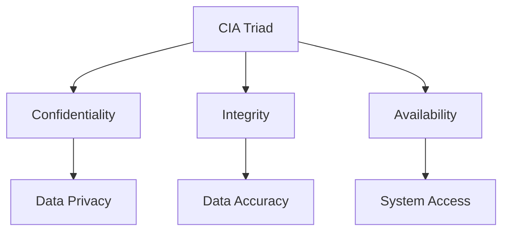
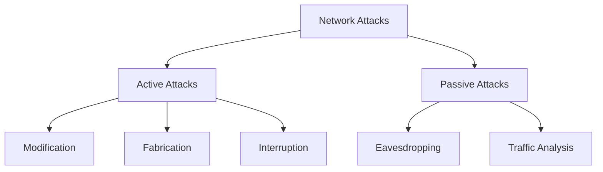
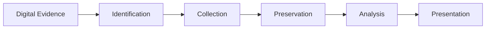
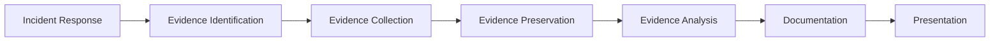

## Question 1(a) [3 marks]

**Give comparison between Public key and Private Key cryptography.**

**Answer:**

| Aspect | Private Key Cryptography | Public Key Cryptography |
|--------|-------------------------|------------------------|
| **Key Management** | Same key for encryption/decryption | Different keys for encryption/decryption |
| **Key Distribution** | Secure channel required | No secure channel needed |
| **Speed** | Fast processing | Slower than private key |
| **Security Level** | High if key is secret | High mathematical security |
| **Example** | DES, AES | RSA, ECC |

**Mnemonic:** "Private Personal, Public Pair"

---

## Question 1(b) [4 marks]

**Explain CIA Triad in detail.**

**Answer:**

CIA Triad is the foundation of information security with three core principles:

**Diagram:**



- **Confidentiality**: Ensures data is accessible only to authorized users
- **Integrity**: Maintains accuracy and completeness of data
- **Availability**: Ensures systems are accessible when needed

**Mnemonic:** "Can I Access" (Confidentiality, Integrity, Availability)

---

## Question 1(c) [7 marks]

**Explain Md5 algorithm steps.**

**Answer:**

MD5 (Message Digest 5) is a cryptographic hash function producing 128-bit hash value.

**Algorithm Steps:**

| Step | Process | Description |
|------|---------|-------------|
| 1 | **Padding** | Add bits to make message length ≡ 448 (mod 512) |
| 2 | **Length Addition** | Append 64-bit length of original message |
| 3 | **Initialize Buffers** | Set four 32-bit buffers (A, B, C, D) |
| 4 | **Process Blocks** | Process message in 512-bit blocks |
| 5 | **Round Functions** | Apply 4 rounds of 16 operations each |

**Code Block:**

```python
# MD5 Processing Steps
def md5_process():
    # Step 1: Padding
    padded_message = original + padding_bits
    # Step 2: Process in 512-bit chunks  
    for chunk in chunks:
        # Step 3: Apply round functions
        result = round_functions(chunk)
    return final_hash
```

- **Round 1**: F(X,Y,Z) = (X∧Y) ∨ (¬X∧Z)
- **Round 2**: G(X,Y,Z) = (X∧Z) ∨ (Y∧¬Z)
- **Round 3**: H(X,Y,Z) = X⊕Y⊕Z
- **Round 4**: I(X,Y,Z) = Y⊕(X∨¬Z)

**Mnemonic:** "My Data Needs Proper Processing" (Message, Digest, Needs, Proper, Processing)

---

## Question 1(c OR) [7 marks]

**List inventors of RSA. Write steps of RSA algorithm.**

**Answer:**

**RSA Inventors:**

- **Ron Rivest** (MIT)
- **Adi Shamir** (MIT) 
- **Leonard Adleman** (MIT)

**RSA Algorithm Steps:**

| Step | Process | Formula |
|------|---------|---------|
| 1 | **Select Primes** | Choose p, q (large primes) |
| 2 | **Calculate n** | n = p × q |
| 3 | **Calculate φ(n)** | φ(n) = (p-1) × (q-1) |
| 4 | **Choose e** | gcd(e, φ(n)) = 1 |
| 5 | **Calculate d** | d × e ≡ 1 (mod φ(n)) |
| 6 | **Encryption** | C = M^e mod n |
| 7 | **Decryption** | M = C^d mod n |

**Key Pairs:**

- **Public Key**: (n, e)
- **Private Key**: (n, d)

**Mnemonic:** "RSA: Rivest Shamir Adleman"

---

## Question 2(a) [3 marks]

**Define: Firewall. List limitations of firewall.**

**Answer:**

**Definition:** Firewall is a network security device that monitors and controls incoming/outgoing network traffic based on predetermined security rules.

**Limitations:**

| Limitation | Description |
|------------|-------------|
| **Internal Threats** | Cannot protect against insider attacks |
| **Application Layer** | Limited protection against application-specific attacks |
| **Performance** | Can slow down network traffic |
| **Configuration** | Requires proper setup and maintenance |
| **Encrypted Traffic** | Cannot inspect encrypted content effectively |

**Mnemonic:** "Fire Walls Limit Internal Protection" 

---

## Question 2(b) [4 marks]

**Sketch IPsec Tunnel Mode and Transport mode.**

**Answer:**

**IPsec Modes Comparison:**

```goat
Transport Mode:
+----------+----------+----------+
| Original | IPsec    | Original |
| IP Header| Header   | Payload  |
+----------+----------+----------+

Tunnel Mode:
+----------+----------+----------+----------+
| New IP   | IPsec    | Original | Original |
| Header   | Header   | IP Header| Payload  |
+----------+----------+----------+----------+
```

**Key Differences:**

| Aspect | Transport Mode | Tunnel Mode |
|--------|---------------|-------------|
| **Protection** | Payload only | Entire packet |
| **Use Case** | End-to-end | Gateway-to-gateway |
| **Overhead** | Lower | Higher |
| **IP Header** | Original preserved | New header added |

**Mnemonic:** "Transport Travels, Tunnel Total"

---

## Question 2(c) [7 marks]

**Explain various types of Active & Passive attacks in detail.**

**Answer:**

**Attack Classification:**



**Active Attacks:**

| Type | Description | Example |
|------|-------------|---------|
| **Masquerade** | Impersonating another entity | Fake identity |
| **Replay** | Retransmitting captured data | Session replay |
| **Modification** | Altering message content | Data tampering |
| **DoS** | Denying service availability | Server flooding |

**Passive Attacks:**

| Type | Description | Impact |
|------|-------------|--------|
| **Eavesdropping** | Listening to communications | Data theft |
| **Traffic Analysis** | Analyzing communication patterns | Privacy breach |
| **Monitoring** | Observing network activity | Information gathering |

- **Active attacks** modify system resources or data
- **Passive attacks** observe and collect information
- **Detection**: Active attacks easier to detect than passive

**Mnemonic:** "Active Acts, Passive Peeks"

---

## Question 2(a OR) [3 marks]

**Define: Digital Signature. Also discuss various application areas of Digital Signature.**

**Answer:**

**Definition:** Digital Signature is a cryptographic technique that validates authenticity and integrity of digital messages or documents using public key cryptography.

**Application Areas:**

| Area | Use Case |
|------|----------|
| **E-commerce** | Online transactions, contracts |
| **Banking** | Electronic fund transfers, cheques |
| **Government** | Digital certificates, official documents |
| **Healthcare** | Patient records, prescriptions |
| **Legal** | Electronic contracts, court documents |

**Mnemonic:** "Digital Documents Demand Authentic Approval"

---

## Question 2(b OR) [4 marks]

**Differentiate HTTP & HTTPS.**

**Answer:**

| Parameter | HTTP | HTTPS |
|-----------|------|-------|
| **Security** | No encryption | SSL/TLS encryption |
| **Port** | 80 | 443 |
| **Protocol** | Hypertext Transfer Protocol | HTTP + SSL/TLS |
| **Data Protection** | Plain text | Encrypted |
| **Authentication** | No server verification | Server certificate validation |
| **Speed** | Faster | Slightly slower |
| **URL Prefix** | http:// | https:// |

**Diagram:**

```goat
HTTP:
Client ----Plain Text----> Server

HTTPS:
Client ----Encrypted-----> Server
       <---Certificate----
```

**Mnemonic:** "HTTPS Has Security"

---

## Question 2(c OR) [7 marks]

**Define: Malicious software. Explain Virus, Worm, Keylogger, Trojans in detail.**

**Answer:**

**Definition:** Malicious software (Malware) is any software designed to harm, exploit, or gain unauthorized access to computer systems.

**Types of Malware:**

| Type | Characteristics | Behavior |
|------|----------------|----------|
| **Virus** | Requires host file | Attaches to programs, spreads when executed |
| **Worm** | Self-replicating | Spreads independently through networks |
| **Keylogger** | Records keystrokes | Steals passwords and sensitive data |
| **Trojan** | Disguised as legitimate | Provides backdoor access to attackers |

**Detailed Explanation:**

**Virus:**

- Requires host program to execute
- Spreads through infected files
- Can corrupt or delete data

**Worm:**

- Self-propagating malware
- Exploits network vulnerabilities
- Consumes network bandwidth

**Keylogger:**

- Records user keystrokes
- Captures login credentials
- Can be hardware or software-based

**Trojan:**

- Appears as legitimate software
- Creates backdoor for remote access
- Does not self-replicate

**Mnemonic:** "Viruses Visit, Worms Wander, Keys Captured, Trojans Trick"

---

## Question 3(a) [3 marks]

**Define: Cybercrime. Also discuss needs of Cyber Law.**

**Answer:**

**Definition:** Cybercrime refers to criminal activities carried out using computers, networks, or digital devices as tools or targets.

**Needs of Cyber Law:**

| Need | Justification |
|------|---------------|
| **Legal Framework** | Establish clear definitions of cyber offenses |
| **Jurisdiction** | Define authority across geographical boundaries |
| **Evidence** | Guidelines for digital evidence collection |
| **Punishment** | Deterrent measures for cybercriminals |
| **Protection** | Safeguard individual and organizational rights |

**Mnemonic:** "Cyber Laws Create Legal Protection"

---

## Question 3(b) [4 marks]

**Explain Cyber spying and Cyber theft.**

**Answer:**

**Cyber Spying:**

- **Definition**: Unauthorized surveillance of digital communications and activities
- **Methods**: Malware, phishing, social engineering
- **Targets**: Government, corporate secrets, personal data
- **Impact**: National security threats, competitive disadvantage

**Cyber Theft:**

- **Definition**: Unauthorized taking of digital assets or information
- **Types**: Identity theft, financial fraud, intellectual property theft
- **Methods**: Hacking, social engineering, insider threats
- **Consequences**: Financial loss, reputation damage

**Comparison Table:**

| Aspect | Cyber Spying | Cyber Theft |
|--------|--------------|-------------|
| **Purpose** | Information gathering | Asset acquisition |
| **Detection** | Often undetected | May be noticed |
| **Duration** | Long-term monitoring | One-time or periodic |
| **Motivation** | Intelligence/espionage | Financial gain |

**Mnemonic:** "Spies Spy, Thieves Take"

---

## Question 3(c) [7 marks]

**Explain article section 66 of cyber law.**

**Answer:**

**Section 66 - Computer Related Offences (IT Act 2008):**

**Key Provisions:**

| Sub-section | Offense | Punishment |
|-------------|---------|------------|
| **66(1)** | Dishonestly/fraudulently computer resource damage | Up to 3 years imprisonment + fine up to ₹5 lakh |
| **66A** | Sending offensive messages | Up to 3 years + fine |
| **66B** | Receiving stolen computer resource | Up to 3 years + fine up to ₹1 lakh |
| **66C** | Identity theft | Up to 3 years + fine up to ₹1 lakh |
| **66D** | Cheating by personation using computer | Up to 3 years + fine up to ₹1 lakh |
| **66E** | Violation of privacy | Up to 3 years + fine up to ₹2 lakh |
| **66F** | Cyber terrorism | Life imprisonment |

**Detailed Coverage:**

**Section 66 Main Offenses:**

- **Hacking**: Unauthorized access to computer systems
- **Data Theft**: Stealing or copying data without permission
- **System Damage**: Destroying or altering computer data
- **Virus Introduction**: Introducing malicious code

**Elements Required:**

- **Intent**: Dishonest or fraudulent intention
- **Access**: Without permission of owner
- **Damage**: Causing harm to system or data
- **Knowledge**: Awareness of unauthorized access

**Legal Framework:**

- **Cognizable**: Police can arrest without warrant
- **Non-bailable**: Bail at court's discretion
- **Evidence**: Digital evidence admissible in court

**Mnemonic:** "Section 66 Stops Cyber Sins"

---

## Question 3(a OR) [3 marks]

**Explain Cyber terrorism.**

**Answer:**

**Definition:** Cyber terrorism involves the use of digital technologies to create fear, disruption, or harm for political, religious, or ideological purposes.

**Characteristics:**

| Aspect | Description |
|--------|-------------|
| **Target** | Critical infrastructure, government systems |
| **Method** | DDoS attacks, system infiltration, data destruction |
| **Motivation** | Political, religious, ideological goals |
| **Impact** | Public fear, economic disruption, national security |

**Examples:**

- Power grid attacks
- Transportation system disruption
- Financial system targeting

**Mnemonic:** "Terror Through Technology"

---

## Question 3(b OR) [4 marks]

**Explain Cyber bullying & Cyber stalking.**

**Answer:**

**Cyber Bullying:**

- **Definition**: Using digital platforms to harass, intimidate, or harm others
- **Platforms**: Social media, messaging apps, online forums
- **Characteristics**: Repetitive, intentional harm, power imbalance
- **Impact**: Psychological trauma, depression, social isolation

**Cyber Stalking:**

- **Definition**: Persistent online harassment causing fear or emotional distress
- **Methods**: Unwanted messages, tracking, identity theft
- **Duration**: Long-term, continuous behavior
- **Legal**: Criminal offense in many jurisdictions

**Comparison:**

| Aspect | Cyber Bullying | Cyber Stalking |
|--------|----------------|----------------|
| **Duration** | Episodes | Persistent |
| **Age Group** | Mainly minors | All ages |
| **Motivation** | Social dominance | Obsession/control |
| **Platform** | Public/semi-public | Private/public |

**Mnemonic:** "Bullies Bother, Stalkers Stalk"

---

## Question 3(c OR) [7 marks]

**Explain article section 67 of cyber law.**

**Answer:**

**Section 67 - Publishing Obscene Information (IT Act 2008):**

**Main Provisions:**

| Section | Content | Punishment |
|---------|---------|------------|
| **67** | Publishing obscene material | First conviction: 3 years + ₹5 lakh fine |
| **67A** | Sexually explicit material | Up to 5 years + ₹10 lakh fine |
| **67B** | Child pornography | First: 5 years + ₹10 lakh, Subsequent: 7 years + ₹10 lakh |
| **67C** | Intermediate liability** | Failure to remove illegal content |

**Key Elements:**

**Section 67 - Obscenity:**

- **Publishing**: Making available in electronic form
- **Content**: Lascivious, sexually explicit material
- **Medium**: Website, email, social media
- **Intent**: Corrupt or deprave viewers

**Section 67A - Sexually Explicit:**

- **Enhanced punishment** for explicit sexual content
- **Broader scope** than general obscenity
- **Commercial purpose** considered aggravating factor

**Section 67B - Child Protection:**

- **Zero tolerance** for child exploitation
- **Strict liability** for possession and distribution
- **Higher penalties** reflecting seriousness
- **Age verification** requirements for platforms

**Defenses Available:**

- **Scientific/educational** purpose
- **Artistic merit** consideration
- **Private viewing** in some cases
- **Lack of knowledge** about content nature

**Digital Evidence Requirements:**

- **Chain of custody** maintenance
- **Technical authenticity** proof
- **Source identification** methods
- **Preservation** of electronic evidence

**Mnemonic:** "Section 67 Stops Shameful Sharing"

---

## Question 4(a) [3 marks]

**Discuss types of Hackers.**

**Answer:**

**Hacker Classification:**

| Type | Motivation | Activities |
|------|------------|------------|
| **White Hat** | Ethical security testing | Authorized penetration testing |
| **Black Hat** | Malicious intent | Illegal system breaking |
| **Gray Hat** | Mixed motivations | Unauthorized but non-malicious |
| **Script Kiddie** | Recognition/fun | Using existing tools |
| **Hacktivist** | Political/social causes | Protest through hacking |

**Detailed Types:**

- **White Hat**: Ethical hackers, security professionals
- **Black Hat**: Cybercriminals seeking profit or damage
- **Gray Hat**: Between ethical and malicious

**Mnemonic:** "Hats Have Hacker Hierarchy"

---

## Question 4(b) [4 marks]

**Explain RAT.**

**Answer:**

**RAT (Remote Administration Tool):**

**Definition:** Software that allows remote control of a computer system, often used maliciously for unauthorized access.

**Characteristics:**

| Feature | Description |
|---------|-------------|
| **Remote Control** | Complete system access from distance |
| **Stealth Mode** | Hidden from user detection |
| **Data Theft** | File access and transfer capabilities |
| **Keylogging** | Keystroke recording |
| **Screen Capture** | Desktop monitoring |

**Common RATs:**

- **BackOrifice**
- **NetBus**
- **DarkComet**
- **Poison Ivy**

**Detection Methods:**

- Antivirus software
- Network monitoring
- Process analysis
- Behavioral detection

**Mnemonic:** "RATs Run Remote Access Tactics"

---

## Question 4(c) [7 marks]

**Explain Five Steps of Hacking.**

**Answer:**

**The Five-Phase Hacking Methodology:**


**Detailed Steps:**

| Phase | Purpose | Techniques | Tools |
|-------|---------|------------|-------|
| **1. Reconnaissance** | Information Gathering | OSINT, Social Engineering | Google, Shodan, WHOIS |
| **2. Scanning** | Identify Vulnerabilities | Port scanning, Network mapping | Nmap, Nessus |
| **3. Gaining Access** | Exploit Vulnerabilities | Password attacks, Code injection | Metasploit, Hydra |
| **4. Maintaining Access** | Persistent Control | Backdoors, Rootkits | RATs, Trojans |
| **5. Covering Tracks** | Hide Evidence | Log deletion, Steganography | CCleaner, File wipers |

**Phase 1 - Reconnaissance:**

- **Passive**: Public information gathering
- **Active**: Direct target interaction
- **Goal**: Map target infrastructure

**Phase 2 - Scanning:**

- **Network scanning**: Live system identification
- **Port scanning**: Service discovery  
- **Vulnerability scanning**: Weakness identification

**Phase 3 - Gaining Access:**

- **Exploitation**: Vulnerability utilization
- **Authentication attacks**: Password cracking
- **Privilege escalation**: Higher access levels

**Phase 4 - Maintaining Access:**

- **Backdoor installation**: Future access
- **System modification**: Persistence mechanisms
- **Data collection**: Information harvesting

**Phase 5 - Covering Tracks:**

- **Log manipulation**: Evidence removal
- **File deletion**: Trace elimination
- **Timeline modification**: Activity concealment

**Mnemonic:** "Real Smart Guys Make Choices" (Reconnaissance, Scanning, Gaining, Maintaining, Covering)

---

## Question 4(a OR) [3 marks]

**Explain Brute force attack.**

**Answer:**

**Definition:** Brute force attack is a trial-and-error method used to decode encrypted data by systematically trying all possible combinations.

**Characteristics:**

| Aspect | Description |
|--------|-------------|
| **Method** | Exhaustive key search |
| **Time** | Computationally intensive |
| **Success** | Guaranteed but time-consuming |
| **Target** | Passwords, encryption keys |
| **Tools** | Automated software |

**Types:**

- **Simple Brute Force**: All possible combinations
- **Dictionary Attack**: Common passwords
- **Hybrid Attack**: Dictionary + variations

**Mnemonic:** "Brute Force Breaks By Trying"

---

## Question 4(b OR) [4 marks]

**Define: Vulnerability, Threat, Exploit**

**Answer:**

**Security Terminology:**

| Term | Definition | Example |
|------|------------|---------|
| **Vulnerability** | Weakness in system/software | Unpatched software bug |
| **Threat** | Potential danger to asset | Malicious hacker |
| **Exploit** | Code taking advantage of vulnerability | Buffer overflow attack |

**Relationship:**

```goat
Threat ----uses----> Exploit ----targets----> Vulnerability
   |                    |                        |
   v                    v                        v
Hacker              Attack Code            System Weakness
```

**Examples:**

- **Vulnerability**: SQL injection flaw
- **Threat**: Cybercriminal
- **Exploit**: SQL injection payload

**Risk Formula:**
Risk = Threat × Vulnerability × Asset Value

**Mnemonic:** "Threats Target Vulnerable Exploits"

---

## Question 4(c OR) [7 marks]

**Explain any three basic commands of kali Linux with suitable example.**

**Answer:**

**Essential Kali Linux Commands:**

**1. NMAP (Network Mapper):**

```bash
# Port scanning
nmap -sS target_ip
nmap -A -T4 192.168.1.1
```

| Option | Purpose | Example |
|--------|---------|---------|
| **-sS** | SYN scan | nmap -sS 192.168.1.1 |
| **-A** | Aggressive scan | nmap -A target.com |
| **-p** | Specific ports | nmap -p 80,443 target.com |

**2. Metasploit:**

```bash
# Start Metasploit
msfconsole
# Search exploits
search apache
# Use exploit
use exploit/windows/smb/ms17_010_eternalblue
```

**Commands:**

- **search**: Find exploits/payloads
- **use**: Select module
- **set**: Configure options
- **exploit**: Launch attack

**3. Wireshark:**

```bash
# Command line version
tshark -i eth0
# Filter traffic
tshark -i eth0 -f "port 80"
```

**Features:**

- **Packet capture**: Real-time network monitoring
- **Protocol analysis**: Deep packet inspection  
- **Filter options**: Targeted traffic analysis
- **GUI interface**: User-friendly analysis

**Additional Commands:**

**4. Hydra (Password Cracking):**

```bash
hydra -l admin -P passwords.txt ssh://192.168.1.1
```

**5. John the Ripper:**

```bash
john --wordlist=rockyou.txt hashes.txt
```

**6. Aircrack-ng (WiFi Security):**

```bash
airmon-ng start wlan0
airodump-ng wlan0mon
```

**Command Categories:**

| Category | Tools | Purpose |
|----------|-------|---------|
| **Network Scanning** | nmap, masscan | Host/port discovery |
| **Vulnerability Assessment** | OpenVAS, Nessus | Security scanning |
| **Exploitation** | Metasploit, SQLmap | Vulnerability exploitation |
| **Password Attacks** | Hydra, John | Credential cracking |
| **Wireless Security** | Aircrack-ng | WiFi penetration testing |

**Mnemonic:** "Network Maps Make Security"

---

## Question 5(a) [3 marks]

**List the branches of Digital Forensics.**

**Answer:**

**Digital Forensics Branches:**

| Branch | Focus Area | Applications |
|--------|------------|--------------|
| **Computer Forensics** | Desktop/laptop systems | Hard drive analysis |
| **Network Forensics** | Network traffic analysis | Intrusion investigation |
| **Mobile Forensics** | Smartphones/tablets | Call logs, messages |
| **Database Forensics** | Database systems | Data integrity verification |
| **Malware Forensics** | Malicious software | Malware analysis |
| **Email Forensics** | Email communications | Email header analysis |
| **Memory Forensics** | RAM analysis | Live system investigation |

**Specialized Areas:**

- **Cloud Forensics**
- **IoT Forensics**
- **Blockchain Forensics**

**Mnemonic:** "Digital Detectives Discover Many Clues"

---

## Question 5(b) [4 marks]

**Discuss Locard's Principle of Exchange in Digital Forensics.**

**Answer:**

**Locard's Exchange Principle:**

**Original Principle:** "Every contact leaves a trace"

**Digital Application:**

| Digital Activity | Trace Left | Location |
|------------------|------------|----------|
| **File Access** | Access timestamps | File metadata |
| **Web Browsing** | Browser history, cookies | Browser cache |
| **Email Communication** | Headers, logs | Mail servers |
| **Network Activity** | Connection logs | Network devices |
| **USB Usage** | Device artifacts | Registry/logs |

**Digital Evidence Traces:**

**System Level:**

- **Registry entries**: System changes
- **Log files**: Activity records
- **Temporary files**: Process artifacts
- **Metadata**: File information

**Network Level:**

- **Router logs**: Traffic records
- **Firewall logs**: Connection attempts
- **DNS queries**: Website visits
- **Packet captures**: Communication content

**Application Level:**

- **Browser artifacts**: Web activity
- **Application logs**: Software usage
- **Database changes**: Data modifications
- **Cache files**: Temporary storage

**Forensic Implications:**

- **No perfect crime**: Digital traces always exist
- **Evidence location**: Multiple sources available
- **Corroboration**: Multiple trace validation
- **Timeline reconstruction**: Activity sequencing

**Mnemonic:** "Every Exchange Exists Electronically"

---

## Question 5(c) [7 marks]

**List the critical steps in preserving Digital Evidence.**

**Answer:**

**Digital Evidence Preservation Process:**



**Critical Preservation Steps:**

| Step | Process | Purpose | Tools |
|------|---------|---------|-------|
| **1. Identification** | Locate potential evidence | Determine scope | Visual inspection |
| **2. Documentation** | Record scene details | Maintain chain of custody | Photography, notes |
| **3. Isolation** | Prevent contamination | Preserve integrity | Network disconnection |
| **4. Imaging** | Create bit-by-bit copy | Preserve original | dd, FTK Imager |
| **5. Hashing** | Generate integrity checks | Verify authenticity | MD5, SHA-256 |
| **6. Storage** | Secure evidence storage | Prevent tampering | Write-protected media |
| **7. Chain of Custody** | Document handling | Legal admissibility | Forensic forms |

**Detailed Preservation Methods:**

**Physical Preservation:**

- **Power management**: Proper shutdown procedures
- **Hardware protection**: Anti-static measures
- **Environmental control**: Temperature/humidity
- **Access restriction**: Authorized personnel only

**Logical Preservation:**

- **Bit-stream imaging**: Exact disk copies
- **Hash verification**: Integrity confirmation
- **Write blocking**: Prevent modifications
- **Metadata preservation**: Timestamp protection

**Legal Preservation:**

- **Documentation standards**: Detailed records
- **Chain of custody**: Handling log
- **Authentication**: Evidence verification
- **Admissibility**: Court requirements

**Best Practices:**

**Do's:**

- **Create multiple copies** of evidence
- **Use forensically sound tools**
- **Document every action**
- **Maintain chain of custody**
- **Verify integrity** with hashes

**Don'ts:**

- **Never work on original** evidence
- **Avoid contamination** of scene
- **Don't power on** suspect systems
- **Never modify** evidence
- **Don't break** chain of custody

**Quality Assurance:**

| Check | Verification Method | Frequency |
|-------|-------------------|-----------|
| **Hash Validation** | Compare original vs copy | Before/after operations |
| **Tool Calibration** | Verify tool accuracy | Regular intervals |
| **Process Review** | Audit procedures | Case completion |
| **Documentation Check** | Verify completeness | Each step |

**Legal Considerations:**

- **Admissibility requirements**: Court standards
- **Expert testimony**: Technical explanation
- **Cross-examination**: Process validation
- **Standard compliance**: Industry best practices

**Mnemonic:** "Proper Preservation Prevents Problems" (Plan, Preserve, Protect, Prove)

---

## Question 5(a OR) [3 marks]

**Explain Malware forensics.**

**Answer:**

**Definition:** Malware forensics involves the analysis of malicious software to understand its behavior, origin, and impact on infected systems.

**Key Components:**

| Component | Description |
|-----------|-------------|
| **Static Analysis** | Examining malware without execution |
| **Dynamic Analysis** | Running malware in controlled environment |
| **Code Analysis** | Reverse engineering malware code |
| **Behavioral Analysis** | Studying malware actions |

**Process:**

- **Sample collection**: Malware acquisition
- **Isolation**: Sandbox environment
- **Analysis**: Behavior observation
- **Reporting**: Findings documentation

**Mnemonic:** "Malware Makes Mysteries"

---

## Question 5(b OR) [4 marks]

**Explain why CCTV plays an important role as evidence in digital forensics investigations.**

**Answer:**

**CCTV in Digital Forensics:**

**Importance of CCTV Evidence:**

| Role | Description | Benefit |
|------|-------------|---------|
| **Visual Documentation** | Records actual events | Objective evidence |
| **Timeline Establishment** | Timestamps activities | Chronological sequence |
| **Identity Verification** | Captures suspect images | Person identification |
| **Corroboration** | Supports other evidence | Strengthens case |

**Digital Evidence Properties:**

**Technical Aspects:**

- **Metadata preservation**: Timestamp, camera ID, settings
- **Chain of custody**: Secure handling procedures
- **Format integrity**: Original file structure maintenance
- **Authentication**: Digital signatures, hash values

**Forensic Value:**

- **Real-time documentation**: Live incident recording
- **Unbiased testimony**: Mechanical witness
- **High resolution**: Clear image quality
- **Audio capture**: Additional sensory evidence

**Analysis Methods:**

- **Frame-by-frame examination**: Detailed scrutiny
- **Enhancement techniques**: Image improvement
- **Comparison analysis**: Multiple angle correlation
- **Motion tracking**: Subject movement patterns

**Legal Admissibility:**

- **Authenticity verification**: Chain of custody
- **Technical validation**: Equipment calibration
- **Expert testimony**: Forensic analysis explanation
- **Standard compliance**: Industry best practices

**Mnemonic:** "CCTV Captures Criminal Conduct Clearly"

---

## Question 5(c OR) [7 marks]

**Explain phases of Digital forensic investigation.**

**Answer:**

**Digital Forensic Investigation Process:**



**Phase-wise Breakdown:**

| Phase | Objective | Activities | Output |
|-------|-----------|------------|--------|
| **1. Preparation** | Readiness establishment | Tool setup, training | Forensic kit |
| **2. Identification** | Evidence location | Survey, documentation | Evidence list |
| **3. Collection** | Evidence acquisition | Imaging, copying | Digital copies |
| **4. Preservation** | Integrity maintenance | Hashing, storage | Verified evidence |
| **5. Analysis** | Data examination | Investigation, correlation | Findings |
| **6. Presentation** | Results communication | Reporting, testimony | Final report |

**Detailed Phase Analysis:**

**Phase 1 - Preparation:**

- **Tool readiness**: Forensic software installation
- **Hardware setup**: Write blockers, imaging devices
- **Documentation templates**: Chain of custody forms
- **Team preparation**: Role assignments, training
- **Legal preparation**: Warrant requirements, permissions

**Phase 2 - Identification:**

- **Scene survey**: Evidence location mapping
- **Device inventory**: System identification
- **Volatile evidence**: Memory, network connections
- **Priority assessment**: Critical evidence first
- **Photography**: Scene documentation

**Phase 3 - Collection:**

- **Live system analysis**: Memory acquisition
- **Disk imaging**: Bit-for-bit copies
- **Network evidence**: Log files, packet captures
- **Mobile devices**: Physical/logical extraction
- **Cloud evidence**: Remote data acquisition

**Phase 4 - Preservation:**

- **Hash generation**: MD5, SHA-256 checksums
- **Write protection**: Hardware/software blocking
- **Storage security**: Tamper-evident containers
- **Chain of custody**: Handling documentation
- **Backup creation**: Multiple evidence copies

**Phase 5 - Analysis:**

- **File system examination**: Directory structure analysis
- **Deleted data recovery**: Unallocated space searching
- **Timeline creation**: Event chronology
- **Keyword searching**: Relevant content identification
- **Pattern recognition**: Behavioral analysis

**Phase 6 - Presentation:**

- **Report writing**: Findings documentation
- **Visual aids**: Charts, diagrams, screenshots
- **Expert testimony**: Court presentation
- **Peer review**: Quality assurance
- **Archive maintenance**: Case file storage

**Best Practices:**

**Technical Standards:**

- **Tool validation**: Regular calibration
- **Methodology consistency**: Standard procedures
- **Quality control**: Verification checks
- **Documentation completeness**: Detailed records

**Legal Requirements:**

- **Admissibility standards**: Court requirements
- **Chain of custody**: Unbroken documentation
- **Expert qualifications**: Professional certification
- **Cross-examination preparation**: Defense against challenges

**Quality Assurance:**

| Check Point | Verification | Documentation |
|-------------|--------------|---------------|
| **Evidence integrity** | Hash comparison | Verification logs |
| **Tool reliability** | Calibration tests | Certification records |
| **Process compliance** | Standard adherence | Procedure checklists |
| **Report accuracy** | Peer review | Review signatures |

**Common Challenges:**

- **Encryption**: Data protection barriers
- **Anti-forensics**: Evidence hiding techniques
- **Volume**: Large data sets
- **Volatility**: Temporary evidence
- **Legal complexity**: Jurisdiction issues

**Success Factors:**

- **Systematic approach**: Methodical investigation
- **Technical expertise**: Skilled personnel
- **Proper tools**: Adequate resources
- **Legal knowledge**: Compliance understanding
- **Documentation discipline**: Thorough records

**Mnemonic:** "Proper Planning Prevents Poor Performance" (Preparation, Preservation, Processing, Presentation, Proof)
