## પ્રશ્ન 1(a) [3 ગુણ]

**દરેક પ્રશ્નોના જવાબ આપો**

**i) ઇન્ફર્મેશન સિક્યુરિટી શું છે?**

**જવાબ**: Information Security એ ડિજિટલ ડેટાને અનધિકૃત પ્રવેશ, ઉપયોગ, જાહેરાત, વિક્ષેપ, ફેરફાર અથવા વિનાશથી સુરક્ષિત રાખે છે.

**મુખ્ય ઘટકો:**

- **ગુપ્તિયતા (Confidentiality)**: માત્ર અધિકૃત વપરાશકર્તાઓ ડેટા પ્રાપ્ત કરી શકે
- **અખંડિતતા (Integrity)**: ડેટા ચોક્કસ અને સંપૂર્ણ રહે
- **ઉપલબ્ધતા (Availability)**: જરૂર પડે ત્યારે ડેટા મળી શકે

**મેમરી ટ્રીક:** "CIA ડેટાને સુરક્ષિત રાખે છે"

**ii) હેકર્સના પ્રકારોની યાદી લખો**

**જવાબ**:

| હેકર પ્રકાર | વિવરણ | હેતુ |
|-------------|--------|------|
| White Hat | નૈતિક હેકર્સ | સારા ઈરાદા |
| Black Hat | દુષ્ટ હેકર્સ | ગુનાહિત પ્રવૃત્તિઓ |
| Gray Hat | બન્નેનું મિશ્રણ | તટસ્થ હેતુ |
| Script Kiddies | હાલના tools વાપરે | મર્યાદિત કુશળતા |

**iii) Kali Linux માટે default username અને password શું હોય છે?**

**જવાબ**:

- **Username**: kali
- **Password**: kali (નવા versions માં root/toor થી બદલાયું)

---

## પ્રશ્ન 1(b) [4 ગુણ]

**CIA triad ઉદાહરણ સાથે સમજાવો**

**જવાબ**: CIA Triad એ information security નો પાયો છે જેમાં ત્રણ મુખ્ય સિદ્ધાંતો છે:

| સિદ્ધાંત | વ્યાખ્યા | ઉદાહરણ |
|----------|---------|----------|
| **ગુપ્તિયતા (Confidentiality)** | માત્ર અધિકૃત વપરાશકર્તાઓ ડેટા પ્રાપ્ત કરી શકે | Password protection, encryption |
| **અખંડિતતા (Integrity)** | ડેટા ચોક્કસ અને અપરિવર્તિત રહે | Digital signatures, checksums |
| **ઉપલબ્ધતા (Availability)** | જરૂર પડે ત્યારે ડેટા મળી શકે | Backup systems, redundancy |

**વાસ્તવિક ઉદાહરણ**: બેંકિંગ સિસ્ટમ login credentials દ્વારા ગુપ્તિયતા, transaction verification દ્વારા અખંડિતતા, અને 24/7 સેવા દ્વારા ઉપલબ્ધતા જાળવે છે.

**મેમરી ટ્રીક:** "CIA માહિતીને ગુપ્ત એજન્ટની જેમ સુરક્ષિત રાખે છે"

---

## પ્રશ્ન 1(c) [7 ગુણ]

**MD5 hashing algorithm સમજાવો**

**જવાબ**: MD5 (Message Digest 5) એ cryptographic hash function છે જે 128-bit hash values બનાવે છે.

**MD5 પ્રક્રિયા કોષ્ટક:**

| પગલું | પ્રક્રિયા | વિગતો |
|------|----------|--------|
| 1 | **Padding** | લેન્થ ≡ 448 (mod 512) બનાવવા bits ઉમેરો |
| 2 | **Length Addition** | 64-bit લેન્થ append કરો |
| 3 | **Initialize** | ચાર 32-bit variables સેટ કરો |
| 4 | **Processing** | ચાર rounds ના operations |
| 5 | **Output** | 128-bit hash value |

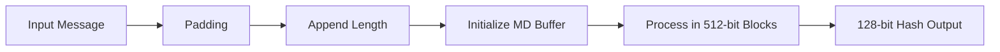

**મુખ્ય લક્ષણો:**

- **નિશ્ચિત Output**: હંમેશા 128 bits
- **એક-તરફી**: hash ને original માં પાછું ફેરવી શકાતું નથી
- **Collision Prone**: આક્રમણો માટે સંવેદનશીલ

**મેમરી ટ્રીક:** "MD5 ડેટાને 5-પગલાંના hash માં બનાવે છે"

---

## પ્રશ્ન 1(c) OR [7 ગુણ]

**SHA algorithm સમજાવો**

**જવાબ**: SHA (Secure Hash Algorithm) એ NSA દ્વારા ડિઝાઇન કરાયેલ cryptographic hash functions નું પરિવાર છે.

**SHA વેરિઅન્ટ્સ તુલના:**

| સંસ્કરણ | Output Size | Block Size | Security Level |
|----------|-------------|------------|----------------|
| SHA-1 | 160 bits | 512 bits | Deprecated |
| SHA-256 | 256 bits | 512 bits | મજબૂત |
| SHA-512 | 512 bits | 1024 bits | ખૂબ મજબૂત |

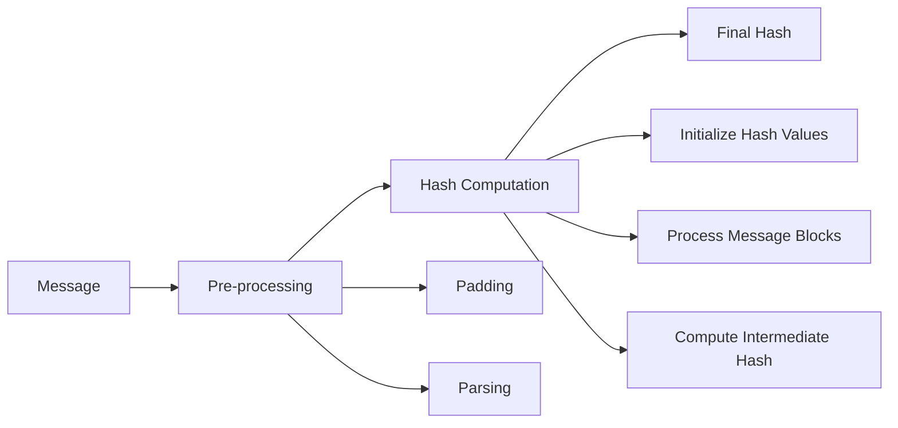

**SHA-256 પ્રક્રિયા:**

- **Preprocessing**: Message ને padding અને parsing
- **Hash Computation**: 64 rounds ના operations
- **Final Hash**: 256-bit output

**MD5 કરતાં ફાયદા:**

- **મજબૂત સુરક્ષા**: Collision attacks સામે પ્રતિરોધક
- **મોટું Output**: સુરક્ષા માટે વધુ bits
- **સરકારી માનક**: NIST દ્વારા મંજૂર

**મેમરી ટ્રીક:** "SHA બધા ડેટાને સુરક્ષિત રીતે hash કરે છે"

---

## પ્રશ્ન 2(a) [3 ગુણ]

**વાઈરસ શું છે? વાઈરસની લાઈફ સાયકલ સમજાવો.**

**જવાબ**: Computer virus એ દુષ્ટ software છે જે પોતાની નકલો અન્ય programs અથવા files માં મૂકીને પ્રતિકૃતિ બનાવે છે.

**વાઈરસ લાઈફ સાયકલ:**

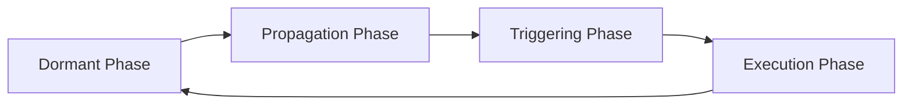

**તબક્કાની વિગતો:**

- **Dormant**: વાઈરસ નિષ્ક્રિય રહે છે
- **Propagation**: અન્ય સિસ્ટમ્સમાં પોતાની નકલ કરે છે
- **Triggering**: ચોક્કસ પરિસ્થિતિઓ દ્વારા સક્રિય થાય છે
- **Execution**: દુષ્ટ પ્રવૃત્તિઓ કરે છે

**મેમરી ટ્રીક:** "વાઈરસ ડાન્સ કરે, ફેલાવે, ચાલુ કરે, ચલાવે"

---

## પ્રશ્ન 2(b) [4 ગુણ]

**દરેક પ્રશ્નોના જવાબ આપો**

**i) Private key અને Public Key cryptography વચ્ચેના તફાવત જણાવો**

**જવાબ**:

| પાસાં | Private Key | Public Key |
|-------|-------------|------------|
| **Keys** | એક જ shared key | Key pair (public/private) |
| **ઝડપ** | ઝડપી encryption | ધીમી encryption |
| **Key Distribution** | મુશ્કેલ | સરળ વિતરણ |
| **Scalability** | વિશાળ networks માટે ખરાબ | સારી scalability |

**ii) Database Forensics ની વ્યાખ્યા આપો અને Database Forensics દરમ્યાન કરવામાં આવતી વિવિધ પ્રવૃત્તિઓની યાદી લખો.**

**જવાબ**: Database forensics એ કાનૂની કાર્યવાહી માટે ડિજિટલ પુરાવા મેળવવા database systems ની તપાસ કરે છે.

**કરવામાં આવતી પ્રવૃત્તિઓ:**

- **Log Analysis**: Transaction logs ની તપાસ
- **Metadata Extraction**: Database structure ની પુનઃપ્રાપ્તિ
- **Deleted Data Recovery**: દૂર કરેલા records ની પુનઃપ્રાપ્તિ
- **Timeline Analysis**: ડેટા modifications ને track કરવું

---

## પ્રશ્ન 2(c) [7 ગુણ]

**Proxy server વિશે સમજાવો અને શા માટે તેની જરૂરિયાત છે?**

**જવાબ**: Proxy server એ client અને server વચ્ચે મધ્યસ્થી તરીકે કામ કરે છે, requests અને responses ને forward કરે છે.

**Proxy Server આર્કિટેક્ચર:**

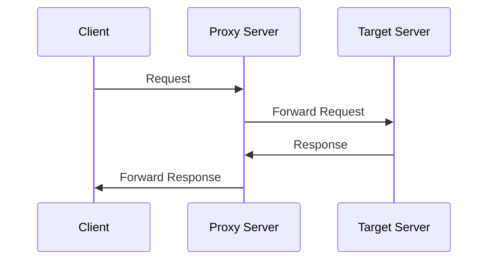

**Proxy Servers ના પ્રકારો:**

| પ્રકાર | કાર્ય | ઉપયોગ |
|-------|-------|-------|
| **Forward Proxy** | Client-side મધ્યસ્થી | Web filtering |
| **Reverse Proxy** | Server-side મધ્યસ્થી | Load balancing |
| **Transparent Proxy** | Client ને અદ્રશ્ય | Content caching |

**Proxy Servers ની જરૂરિયાત:**

- **સુરક્ષા**: Client IP addresses છુપાવે છે
- **Performance**: વારંવાર access કરવામાં આવતું content cache કરે છે
- **Control**: Traffic ને filter અને monitor કરે છે
- **Anonymity**: વપરાશકર્તાની privacy સુરક્ષિત રાખે છે

**ફાયદા:**

- **Bandwidth Saving**: Caching દ્વારા traffic ઘટે છે
- **Access Control**: અનિચ્છિત sites ને block કરે છે
- **Load Distribution**: Server requests ને balance કરે છે

**મેમરી ટ્રીક:** "Proxy Privacy અને Performance ને સુરક્ષિત રાખે છે"

---

## પ્રશ્ન 2(a) OR [3 ગુણ]

**વ્યાખ્યા આપો: Trojans, Rootkit, Backdoors, Keylogger**

**જવાબ**:

| Malware પ્રકાર | વ્યાખ્યા |
|----------------|----------|
| **Trojans** | કાયદેસર programs તરીકે વેશમાં રહેલા દુષ્ટ software |
| **Rootkit** | સિસ્ટમમાં malware ની હાજરી છુપાવતા software |
| **Backdoors** | સામાન્ય authentication ને bypass કરતા ગુપ્ત પ્રવેશ બિંદુઓ |
| **Keylogger** | Passwords ચોરવા keystrokes record કરતા software |

**મેમરી ટ્રીક:** "TRBK - Trojans, Rootkits, Backdoors આક્રમણ કરતા રહે છે"

---

## પ્રશ્ન 2(b) OR [4 ગુણ]

**દરેક પ્રશ્નોના જવાબ આપો**

**i) Firewall ના ફાયદા અને ગેરફાયદા જણાવો.**

**જવાબ**:

| ફાયદા | ગેરફાયદા |
|--------|-----------|
| **Network Protection** | **Performance Impact** |
| **Access Control** | **Configuration Complexity** |
| **Traffic Monitoring** | **Cannot Stop All Attacks** |
| **Log Generation** | **Maintenance Required** |

**ii) ડિજિટલ પુરાવાઓને સાચવવા માટેના મહત્વપૂર્ણ પગલાઓની યાદી બનાવો.**

**જવાબ**:

- **Identification**: સંભવિત પુરાવા શોધવા
- **Documentation**: પુરાવાની વિગતો record કરવી
- **Collection**: પુરાવાને સુરક્ષિત રીતે એકત્રિત કરવા
- **Preservation**: પુરાવાની અખંડિતતા જાળવવી
- **Chain of Custody**: પુરાવાના handling ને track કરવું

---

## પ્રશ્ન 2(c) OR [7 ગુણ]

**IP Security Architecture સમજાવો.**

**જવાબ**: IPSec એ IP communications માટે network layer પર security services પૂરી પાડે છે.

**IPSec આર્કિટેક્ચર ઘટકો:**

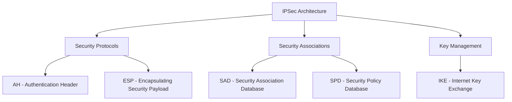

**Security Services:**

| Service | Protocol | કાર્ય |
|---------|----------|-------|
| **Authentication** | AH | Packet origin ને verify કરવું |
| **Confidentiality** | ESP | Packet data ને encrypt કરવું |
| **Integrity** | બન્ને | Modifications detect કરવા |
| **Anti-replay** | બન્ને | Replay attacks ને અટકાવવા |

**IPSec Modes:**

- **Transport Mode**: માત્ર payload ને protect કરે છે
- **Tunnel Mode**: સંપૂર્ણ IP packet ને protect કરે છે

**મુખ્ય ઘટકો:**

- **Security Association (SA)**: Security parameters
- **Security Policy Database (SPD)**: Security policies
- **Key Management**: Automated key exchange

**મેમરી ટ્રીક:** "IPSec સંપૂર્ણ રીતે Protection, Security, Encryption ને integrate કરે છે"

---

## પ્રશ્ન 3(a) [3 ગુણ]

**સાયબર ક્રાઈમના પ્રકારો લખો અને કોઈપણ એક વિશે સમજાવો**

**જવાબ**:

**સાયબર ક્રાઈમ પ્રકારો:**

- **Financial Crimes**: Credit card fraud, online banking theft
- **Identity Theft**: વ્યક્તિગત માહિતી ચોરી
- **Cyber Bullying**: Online harassment
- **Data Breach**: અનધિકૃત ડેટા access

**Email Bombing (વિગતવાર સમજૂતી):**
Email bombing માં victim ના mailbox અને server resources ને overwhelm કરવા માટે મોટી માત્રામાં emails મોકલવામાં આવે છે.

**Attack Process:**

- **Target Selection**: Victim email પસંદ કરવું
- **Volume Generation**: હજારો emails મોકલવા
- **Resource Exhaustion**: Mail server ને overwhelm કરવું
- **Service Disruption**: Email ને unusable બનાવવું

**મેમરી ટ્રીક:** "સાયબર ક્રાઈમ્સ સતત અંધાધૂંધ મચાવે છે"

---

## પ્રશ્ન 3(b) [4 ગુણ]

**વ્યાખ્યા આપો: Web Jacking, Data Diddling, DoS Attack અને DDoS Attack**

**જવાબ**:

| Attack પ્રકાર | વ્યાખ્યા |
|---------------|----------|
| **Web Jacking** | Content બદલીને website પર અનધિકૃત control |
| **Data Diddling** | Processing પહેલાં ડેટાનું અનધિકૃત modification |
| **DoS Attack** | Service ને unavailable બનાવવા single source attack |
| **DDoS Attack** | Target system ને overwhelm કરવા multiple sources attack |

**Attack Comparison:**

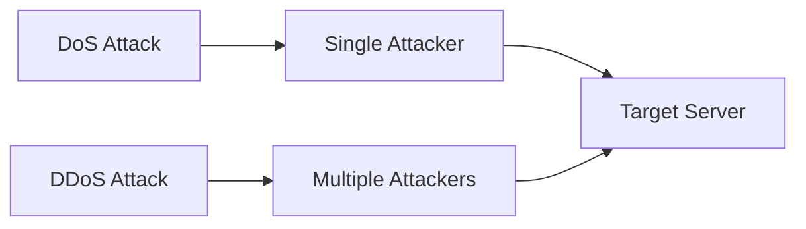

---

## પ્રશ્ન 3(c) [7 ગુણ]

**Man in the middle attack યોગ્ય ઉદાહરણ સાથે સમજાવો.**

**જવાબ**: Man-in-the-Middle (MITM) attack ત્યારે થાય છે જ્યારે આક્રમણકર્તા બે પક્ષો વચ્ચેના communications ને ગુપ્ત રીતે intercept કરે અને relay કરે છે.

**MITM Attack Process:**

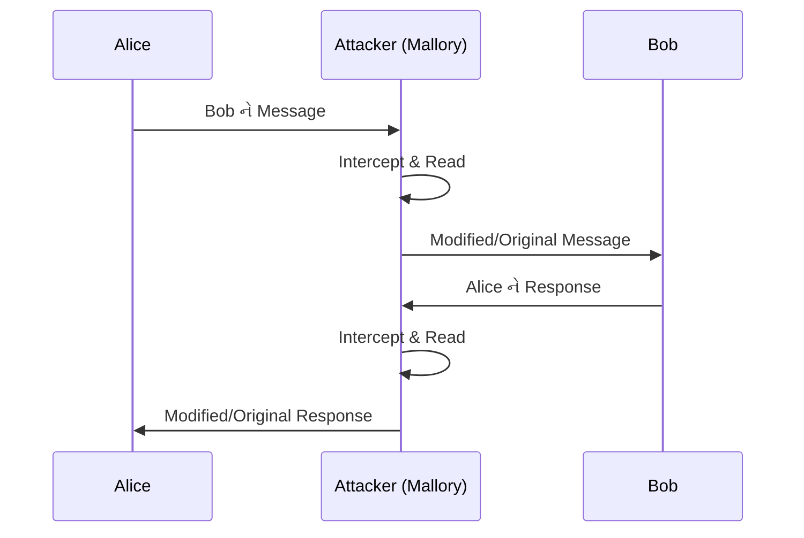

**Attack પ્રકારો:**

| પ્રકાર | પદ્ધતિ | ઉદાહરણ |
|-------|-------|---------|
| **Wi-Fi Eavesdropping** | Fake hotspots | Coffee shop Wi-Fi |
| **Email Hijacking** | Compromised accounts | Business email |
| **DNS Spoofing** | Fake DNS responses | Fake sites પર redirect |
| **HTTPS Spoofing** | Fake certificates | Banking websites |

**વાસ્તવિક ઉદાહરણ - Wi-Fi Attack:**

1. આક્રમણકર્તા fake "Free_WiFi" hotspot બનાવે છે
2. Victim malicious network સાથે connect થાય છે
3. બધો traffic આક્રમણકર્તા મારફતે જાય છે
4. Passwords જેવા sensitive data ચોરાય છે

**Prevention Measures:**

- **HTTPS ઉપયોગ**: Encrypted connections
- **VPN Usage**: વધારાનું encryption layer
- **Certificate Verification**: SSL certificates check કરવા
- **Secure Networks**: Sensitive tasks માટે public Wi-Fi ટાળવું

**મેમરી ટ્રીક:** "MITM દુષ્ટતાથી Intercept કરે, Messages ને Tamper કરે"

---

## પ્રશ્ન 3(a) OR [3 ગુણ]

**Salami attack વિશે સમજાવો**

**જવાબ**: Salami attack માં detection ટાળવા માટે ઘણા accounts માંથી નાની રકમો ચોરવામાં આવે છે.

**Attack Mechanism:**

- **નાની રકમો**: Currency ના fractions ચોરવા
- **વિશાળ પાયે**: હજારો accounts ને target કરવા
- **Rounding Errors**: Calculation differences નો ફાયદો ઉઠાવવો
- **Accumulation**: નાની ચોરીઓ મોટો નફો બનાવે છે

**ઉદાહરણ**: Banking system interest ને nearest cent સુધી round કરે છે. આક્રમણકર્તા લાખો accounts માંથી બાકી રહેલા fractions collect કરે છે.

**મેમરી ટ્રીક:** "Salami નાના ટુકડા કરે, મોટી રકમ ચોરે"

---

## પ્રશ્ન 3(b) OR [4 ગુણ]

**Cyber bullying, Phishing, spyware અને logic bomb ની વ્યાખ્યા આપો.**

**જવાબ**:

| શબ્દ | વ્યાખ્યા |
|------|---------|
| **Cyber Bullying** | Emotional distress પેદા કરતું online harassment |
| **Phishing** | Sensitive information મેળવવાના fraudulent પ્રયત્નો |
| **Spyware** | User activities ને ગુપ્ત રીતે monitor કરતા software |
| **Logic Bomb** | ચોક્કસ conditions દ્વારા trigger થતા malicious code |

---

## પ્રશ્ન 3(c) OR [7 ગુણ]

**Ransomware વિશે વિસ્તારપૂર્વક સમજાવો**

**જવાબ**: Ransomware victim ની files ને encrypt કરે છે અને decryption key માટે payment ની માંગ કરે છે.

**Ransomware Attack Process:**

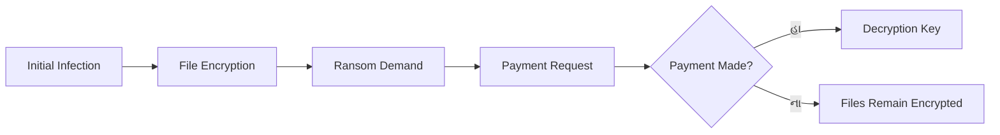

**Ransomware પ્રકારો:**

| પ્રકાર | વર્તન | ઉદાહરણ |
|-------|-------|---------|
| **Crypto Ransomware** | Files ને encrypt કરે | WannaCry |
| **Locker Ransomware** | System access lock કરે | Police-themed |
| **Scareware** | Fake threats | Fake antivirus |
| **Doxware** | Data publication ની ધમકી | Personal photos |

**Attack Vectors:**

- **Email Attachments**: દુષ્ટ documents
- **Drive-by Downloads**: Compromised websites
- **Exploit Kits**: Vulnerability exploitation
- **RDP Attacks**: Remote desktop compromise

**Prevention Strategies:**

- **નિયમિત Backups**: Offline data copies
- **Security Updates**: Vulnerabilities ને patch કરવા
- **Email Filtering**: દુષ્ટ attachments ને block કરવા
- **User Training**: Threats ને ઓળખવા
- **Network Segmentation**: Spread ને limit કરવા

**Impact Assessment:**

- **નાણાકીય નુકસાન**: Ransom payments અને downtime
- **ડેટા Loss**: કાયમ માટે encrypted files
- **પ્રતિષ્ઠાને નુકસાન**: Customer trust loss
- **Operational Disruption**: Business shutdown

**મેમરી ટ્રીક:** "Ransomware ખરેખર Recovery ને બરબાદ કરે, મજબૂત Response જોઈએ"

---

## પ્રશ્ન 4(a) [3 ગુણ]

**Kali Linux ના કોઈપણ ૬ મૂળભૂત commands લખો**

**જવાબ**:

| Command | કાર્ય |
|---------|-------|
| **ls** | Directory contents list કરવા |
| **cd** | Directory બદલવા |
| **pwd** | Working directory print કરવા |
| **mkdir** | Directory બનાવવા |
| **cp** | Files copy કરવા |
| **nmap** | Network scanning |

**મેમરી ટ્રીક:** "Linux Commands Navigation ને શક્ય બનાવે છે"

---

## પ્રશ્ન 4(b) [4 ગુણ]

**Zero day attack ઉદાહરણ આપી સમજાવો**

**જવાબ**: Zero-day attack એ અજ્ઞાત vulnerability નો ઉપયોગ કરીને security patch ઉપલબ્ધ થાય તે પહેલાં હુમલો કરે છે.

**Zero-Day Timeline:**

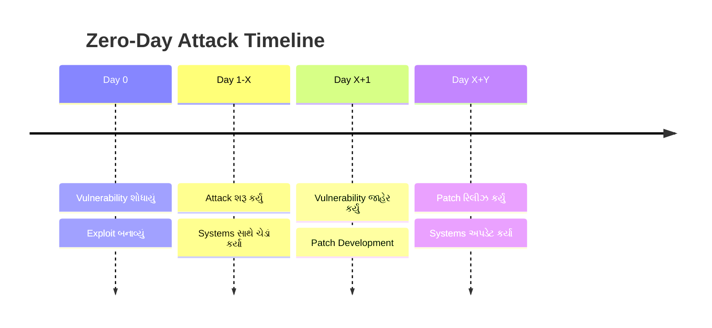

**ઉદાહરણ - Stuxnet Worm:**

- **Target**: ઈરાની પરમાણુ સુવિધાઓ
- **Exploit**: Windows zero-day vulnerabilities
- **Impact**: Centrifuges ને ભૌતિક નુકસાન
- **Duration**: શોધાય તે પહેલાં મહિનાઓ સુધી સક્રિય

**લાક્ષણિકતાઓ:**

- **અજ્ઞાત Vulnerability**: હાલના patches નથી
- **ઉચ્ચ સફળતા દર**: કોઈ defenses તૈયાર નથી
- **કિંમતી**: Dark markets માં મોંઘા
- **મર્યાદિત આયુષ્ય**: શોધાયા પછી patch થઈ જાય

**મેમરી ટ્રીક:** "Zero-day કોઈ જાણે તે પહેલાં માર્યા કરે"

---

## પ્રશ્ન 4(c) [7 ગુણ]

**Remote Access Tools સમજાવો અને કેવી રીતે આપણે RAT થી system નું રક્ષણ કરી શકીએ છે?**

**જવાબ**: Remote Access Tool (RAT) એ computer systems ના remote control ની મંજૂરી આપે છે, ઘણીવાર દુષ્ટતાપૂર્વક વપરાય છે.

**RAT Functionality:**

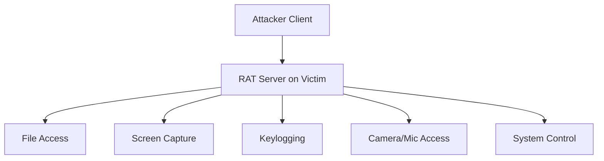

**સામાન્ય RATs:**

| RAT નામ | Features | Detection મુશ્કેલી |
|---------|----------|---------------------|
| **DarkComet** | સંપૂર્ણ system control | મધ્યમ |
| **Poison Ivy** | Stealth operations | ઉચ્ચ |
| **Back Orifice** | Windows targeting | નીચી |
| **NetBus** | સરળ interface | નીચી |

**RAT Infection પદ્ધતિઓ:**

- **Email Attachments**: Trojanized files
- **Software Bundling**: કાયદેસર software માં છુપાયેલ
- **Drive-by Downloads**: દુષ્ટ websites
- **Social Engineering**: વપરાશકર્તાઓને installation માટે છેતરવા

**સુરક્ષા વ્યૂહરચનાઓ:**

**ટેકનિકલ પગલાં:**

- **Antivirus Software**: Real-time scanning
- **Firewall Rules**: અનધિકૃત connections ને block કરવા
- **Network Monitoring**: અસામાન્ય traffic detect કરવા
- **System Updates**: Vulnerabilities ને patch કરવા

**વર્તણૂકીય પગલાં:**

- **Email સાવધાની**: Attachments ને verify કરવા
- **Download Sources**: માત્ર વિશ્વસનીય sites વાપરવી
- **નિયમિત Scans**: સમયાંતરે malware checks
- **User Training**: Threats ને ઓળખવા

**Detection ના સંકેતો:**

- **ધીમી Performance**: અસામાન્ય system lag
- **Network Activity**: અનપેક્ષિત connections
- **File Changes**: બદલાયેલી અથવા નવી files
- **વિચિત્ર વર્તન**: અનપેક્ષિત system actions

**Incident Response:**

1. **System ને Isolate કરવું**: Network થી disconnect કરવું
2. **પુરાવા Document કરવા**: દુષ્ટ activity record કરવી
3. **System સાફ કરવું**: RAT ને સંપૂર્ણ remove કરવું
4. **Data Restore કરવું**: સાફ backups માંથી
5. **Security મજબૂત કરવી**: Defenses સુધારવા

**મેમરી ટ્રીક:** "RATs દૂરથી Access કરે, મજબૂત Response જોઈએ"

---

## પ્રશ્ન 4(a) OR [3 ગુણ]

**Hacking તેમજ Blackhat અને White hat hacker વિશે ટૂંકમાં સમજાવો**

**જવાબ**:

| શબ્દ | વ્યાખ્યા |
|------|---------|
| **Hacking** | Systems અથવા networks માં અનધિકૃત પ્રવેશ મેળવવો |
| **Black Hat** | ગુનાહિત હેતુ સાથે દુષ્ટ hackers |
| **White Hat** | Security સુધારવામાં મદદ કરતા નૈતિક hackers |

**તુલના:**

- **હેતુ**: White hat મદદ કરે, Black hat નુકસાન કરે
- **અધિકૃતતા**: White hat ને permission હોય છે
- **હેતુ**: White hat સુરક્ષા આપે, Black hat exploit કરે

**મેમરી ટ્રીક:** "Hats અલગ અલગ Hacking ટેવો ધરાવે છે"

---

## પ્રશ્ન 4(b) OR [4 ગુણ]

**Port Scanning શું છે? કોઈપણ બે Port Scanning techniques સમજાવો**

**જવાબ**: Port scanning એ target systems પર open ports અને services શોધે છે.

**Port Scanning Techniques:**

| Technique | પદ્ધતિ | Stealth Level |
|-----------|-------|---------------|
| **TCP Connect** | સંપૂર્ણ connection | નીચી stealth |
| **SYN Scan** | અર્ધ-ખુલ્લું connection | ઉચ્ચી stealth |

**TCP Connect Scan:**

- સંપૂર્ણ TCP handshake પૂર્ણ કરે
- વિશ્વસનીય પણ સહેલાઈથી detect થાય
- Target systems દ્વારા log થાય

**SYN Scan (Half-Open):**

- SYN મોકલે, SYN-ACK મળે, RST મોકલે
- Stealthy, ઘણીવાર unlogged
- Connect scan કરતાં ઝડપી

**મેમરી ટ્રીક:** "Port Scanning સિસ્ટમ Services ને Probe કરે"

---

## પ્રશ્ન 4(c) OR [7 ગુણ]

**Hacking માટેની પ્રક્રિયા વિસ્તારપૂર્વક સમજાવો**

**જવાબ**: Hacking એ અનધિકૃત system access મેળવવા માટે વ્યવસ્થિત પાંચ-તબક્કાની પદ્ધતિ અનુસરે છે.

**Hacking ના પાંચ તબક્કા:**

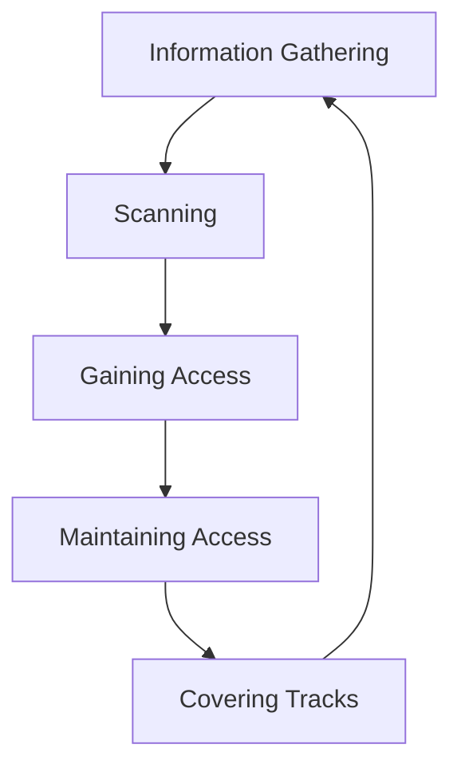

**તબક્કાની વિગતો:**

**1. Information Gathering (Reconnaissance):**

- **Passive**: OSINT, social media research
- **Active**: Network queries, DNS lookups
- **Tools**: Google dorking, Whois, social engineering

**2. Scanning:**

- **Network Scanning**: Live hosts શોધવા
- **Port Scanning**: Open services શોધવા
- **Vulnerability Scanning**: Weaknesses ઓળખવા
- **Tools**: Nmap, Nessus, OpenVAS

**3. Gaining Access:**

- **Exploit Vulnerabilities**: શોધાયેલા weaknesses વાપરવા
- **Password Attacks**: Brute force, dictionary
- **Social Engineering**: Humans ને manipulate કરવા
- **Tools**: Metasploit, custom exploits

**4. Maintaining Access:**

- **Install Backdoors**: સતત access સુનિશ્ચિત કરવા
- **Create User Accounts**: છુપાયેલ administrator
- **Rootkits**: હાજરી છુપાવવા
- **Tools**: Netcat, custom backdoors

**5. Covering Tracks:**

- **Log Deletion**: પુરાવા દૂર કરવા
- **File Hiding**: દુષ્ટ files છુપાવવા
- **Process Hiding**: ચાલતા programs છુપાવવા
- **Tools**: Log cleaners, steganography

**વિગતવાર પ્રક્રિયા Flow:**

| તબક્કો | પ્રવૃત્તિઓ | સમય | જોખમ સ્તર |
|--------|------------|------|-----------|
| **Reconnaissance** | Passive info gathering | દિવસો/અઠવાડિયા | નીચું |
| **Scanning** | Active probing | કલાકો/દિવસો | મધ્યમ |
| **Gaining Access** | Exploitation | મિનિટો/કલાકો | ઉચ્ચું |
| **Maintaining Access** | Persistence | ચાલુ | મધ્યમ |
| **Covering Tracks** | Evidence removal | કલાકો | ઉચ્ચું |

**કાયદેસર vs ગેરકાયદેસર Hacking:**

- **Ethical Hacking**: અધિકૃત penetration testing
- **Malicious Hacking**: અનધિકૃત ગુનાહિત પ્રવૃત્તિ
- **Bug Bounty**: કાયદેસર vulnerability discovery

**મેમરી ટ્રીક:** "Hackers તપાસ કરે, Scan કરે, પ્રવેશ મેળવે, જાળવે, છુપાવે"

---

## પ્રશ્ન 5(a) [3 ગુણ]

**Locard's principal લખો અને તે સાયબર ક્રાઈમ સાથે કેવી રીતે સંબંધિત છે તે સમજાવો?**

**જવાબ**: Locard's Principle કહે છે કે "દરેક સંપર્ક નિશાન છોડે છે" - forensic science નો મૂળભૂત સિદ્ધાંત.

**Digital Application:**

- **Log Files**: સિસ્ટમ પ્રવૃત્તિઓ record થાય છે
- **Network Traffic**: Communication traces
- **File Metadata**: બનાવટ, ફેરફારના સમય
- **Memory Dumps**: Runtime evidence

**Cybercrime સાથે સંબંધ:**
ડિજિટલ પ્રવૃત્તિઓ electronic traces બનાવે છે જેનું વિશ્લેષણ કરીને investigators ગુનાહિત પ્રવૃત્તિઓનું પુનર્નિર્માણ કરી શકે છે.

**મેમરી ટ્રીક:** "Locard નો કાયદો: લાસ્ટિંગ Logs છોડે છે"

---

## પ્રશ્ન 5(b) [4 ગુણ]

**Software forensics શું છે? તે સાયબર ક્રાઈમમાં કેવી રીતે યોગદાન આપી રહ્યું છે?**

**જવાબ**: Software forensics એ authorship નક્કી કરવા, plagiarism detect કરવા, અથવા malicious code ની તપાસ કરવા software artifacts નું વિશ્લેષણ કરે છે.

**Software Forensics Applications:**

| Application | હેતુ | Cybercrime ઉપયોગ |
|-------------|------|-------------------|
| **Code Analysis** | Programmer ઓળખવા | Malware attribution |
| **Binary Analysis** | Reverse engineering | Attacks સમજવા |
| **License Compliance** | Software piracy | IP theft cases |
| **Plagiarism Detection** | Academic integrity | Copyright violation |

**Cybercrime Investigation માં યોગદાન:**

- **Malware Attribution**: Code ને specific authors સાથે link કરવું
- **Attack Reconstruction**: Attacks કેવી રીતે થયા તે સમજવું
- **Evidence Collection**: ડિજિટલ proof એકત્રિત કરવા
- **Pattern Recognition**: પુનરાવર્તિત ગુનેગારો ઓળખવા

---

## પ્રશ્ન 5(c) [7 ગુણ]

**Drive imaging, Chain of custody અને hash values વિસ્તારપૂર્વક સમજાવો.**

**જવાબ**:

**Drive Imaging:**
Storage device નું ભૌતિક bit-by-bit copy જે deleted files અને slack space સહિત બધો ડેટા સાચવે છે.

**Imaging Process:**

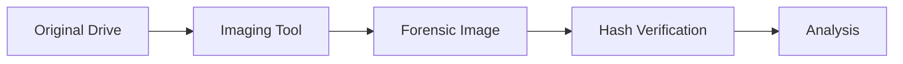

**Chain of Custody:**
પુરાવાને seizure થી court presentation સુધી handling track કરતું documentation.

**Chain of Custody Elements:**

| Element | વિગતો |
|---------|-------|
| **કોણ** | પુરાવા handle કરતી વ્યક્તિ |
| **શું** | પુરાવાનું વર્ણન |
| **ક્યારે** | તારીખ અને સમય |
| **ક્યાં** | પુરાવાનું સ્થાન |
| **શા માટે** | Handling નું કારણ |

**Hash Values:**
ડેટા integrity verify કરવા unique fingerprints બનાવતા ગાણિતિક algorithms.

**સામાન્ય Hash Algorithms:**

| Algorithm | Output Size | ઉપયોગ |
|-----------|-------------|-------|
| **MD5** | 128 bits | ઝડપી verification |
| **SHA-1** | 160 bits | Legacy systems |
| **SHA-256** | 256 bits | આધુનિક માનક |

**Forensic Implementation:**

1. **Image બનાવવું**: Bit-by-bit copy
2. **Hash Generate કરવું**: Original drive hash calculate કરવું
3. **Integrity Verify કરવી**: Image hash compare કરવું
4. **Process Document કરવી**: Chain of custody
5. **સુરક્ષિત Analysis**: Copy પર જ કામ કરવું

**Digital Forensics માં મહત્વ:**

- **Data Integrity**: પુરાવાની authenticity સુનિશ્ચિત કરે
- **Legal Admissibility**: Court verified પુરાવા સ્વીકારે
- **Non-Repudiation**: ડેટા અપરિવર્તિત હોવાનું સાબિત કરે
- **Forensic Soundness**: પુરાવાની ગુણવત્તા જાળવે

**મેમરી ટ્રીક:** "Drive Images ડિજિટલ ડેટાને નિશ્ચિતપણે Document કરે"

---

## પ્રશ્ન 5(a) OR [3 ગુણ]

**Malware analysis ના ચાર તબક્કાઓને ટૂંકમાં સમજાવો.**

**જવાબ**:

**Malware Analysis તબક્કાઓ:**

| તબક્કો | વર્ણન | વપરાતા Tools |
|--------|-------|--------------|
| **Static Analysis** | Execution વગર તપાસ | Hex editors, disassemblers |
| **Dynamic Analysis** | Runtime behavior નિરીક્ષણ | Sandboxes, debuggers |
| **Code Analysis** | Source reverse engineer | IDA Pro, Ghidra |
| **Network Analysis** | Communications monitor | Wireshark, tcpdump |

**મેમરી ટ્રીક:** "Static, Dynamic, Code, Network - SDCN"

---

## પ્રશ્ન 5(b) OR [4 ગુણ]

**Network forensic કેવી રીતે કાર્ય કરે છે?**

**જવાબ**: Network forensics એ security incidents ની તપાસ કરવા network traffic ને capture, record અને analyze કરે છે.

**Network Forensics Process:**

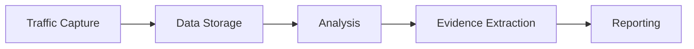

**મુખ્ય કાર્યો:**

- **Packet Capture**: Network communications record કરવા
- **Protocol Analysis**: Communication protocols ની તપાસ
- **Flow Analysis**: ડેટા movement patterns track કરવા
- **Content Inspection**: Payload data નું વિશ્લેષણ

**Tools અને Techniques:**

- **Network Taps**: Hardware monitoring
- **Packet Analyzers**: Software inspection
- **Flow Collectors**: Traffic summarization
- **SIEM Systems**: Correlation અને alerting

---

## પ્રશ્ન 5(c) OR [7 ગુણ]

**Digital forensic investigation ની પ્રક્રિયા સમજાવો**

**જવાબ**: Digital forensic investigation એ ડિજિટલ પુરાવા collect, preserve, analyze અને present કરવા વ્યવસ્થિત પદ્ધતિ અનુસરે છે.

**Investigation Process તબક્કાઓ:**

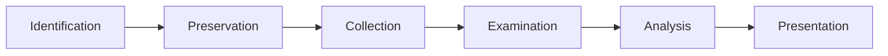

**વિગતવાર પ્રક્રિયા:**

**1. Identification તબક્કો:**

- **Evidence Location**: સંભવિત ડિજિટલ પુરાવા શોધવા
- **Scope Definition**: તપાસની સીમાઓ નક્કી કરવી
- **Resource Planning**: કર્મચારીઓ અને tools allocate કરવા
- **Legal Considerations**: જરૂરી warrants મેળવવા

**2. Preservation તબક્કો:**

- **Scene Securing**: પુરાવા contamination અટકાવવા
- **System Isolation**: Networks થી disconnect કરવું
- **Evidence Documentation**: ફોટોગ્રાફ અને catalog
- **Chain of Custody**: Documentation trail શરૂ કરવી

**3. Collection તબક્કો:**

- **Imaging Process**: Forensic copies બનાવવી
- **Hash Generation**: ડેટા integrity સુનિશ્ચિત કરવી
- **Metadata Capture**: File properties record કરવા
- **Live Data Collection**: Volatile information capture કરવા

**4. Examination તબક્કો:**

- **Data Recovery**: Deleted files retrieve કરવી
- **File System Analysis**: Storage structures ની તપાસ
- **Timeline Creation**: Event sequence સ્થાપિત કરવું
- **Keyword Searching**: સંબંધિત content શોધવા

**5. Analysis તબક્કો:**

- **Evidence Correlation**: સંબંધિત findings link કરવા
- **Pattern Recognition**: Trends ઓળખવા
- **Hypothesis Testing**: Theories validate કરવા
- **Timeline Analysis**: Events reconstruct કરવા

**6. Presentation તબક્કો:**

- **Report Writing**: Findings document કરવા
- **Evidence Preparation**: Court માટે organize કરવા
- **Expert Testimony**: કાનૂની કાર્યવાહીમાં present કરવા
- **Visualization**: Demonstrative aids બનાવવા

**Investigation સિદ્ધાંતો:**

| સિદ્ધાંત | વર્ણન | મહત્વ |
|---------|-------|-------|
| **Reliability** | પુરાવા ભરોસાપાત્ર હોવા જોઈએ | Court acceptance |
| **Repeatability** | પરિણામો reproduce થઈ શકે | Scientific validity |
| **Integrity** | ડેટા અપરિવર્તિત રહે | Legal admissibility |
| **Documentation** | સંપૂર્ણ રેકોર્ડ keeping | Audit trail |

**મુખ્ય પડકારો:**

- **Encryption**: Password-protected ડેટા
- **Anti-Forensics**: પુરાવા છુપાવવાની techniques
- **Volume**: મોટી માત્રામાં ડેટા
- **Technology**: ઝડપથી બદલાતા systems

**Best Practices:**

- **Standard Procedures**: સ્થાપિત protocols અનુસરવા
- **Tool Validation**: Tested forensic tools વાપરવા
- **Continuous Training**: Technology સાથે current રહેવું
- **Quality Assurance**: Peer review processes

**કાનૂની ફ્રેમવર્ક:**

- **Evidence Rules**: Admissibility requirements
- **Privacy Laws**: ડેટા protection compliance
- **Chain of Custody**: અખંડ documentation
- **Expert Qualifications**: Forensic examiner credentials

**મેમરી ટ્રીક:** "ડિજિટલ તપાસ: ઓળખો, સાચવો, એકત્રિત કરો, તપાસો, વિશ્લેષણ કરો, રજૂ કરો"
