## Question 1(a) [3 marks]

**Answer All Questions**

**i) What is Information Security?**

**Answer**: Information Security protects digital data from unauthorized access, use, disclosure, disruption, modification, or destruction.

**Key Components:**

- **Confidentiality**: Data accessible only to authorized users
- **Integrity**: Data remains accurate and complete
- **Availability**: Data accessible when needed

**Mnemonic**: "CIA keeps data safe"

**ii) List Types of hackers**

**Answer**:

| Hacker Type | Description | Intent |
|-------------|-------------|--------|
| White Hat | Ethical hackers | Good intentions |
| Black Hat | Malicious hackers | Criminal activities |
| Gray Hat | Mix of both | Neutral motives |
| Script Kiddies | Use existing tools | Limited skills |

**iii) What is the default username and password for Kali Linux?**

**Answer**:

- **Username**: kali
- **Password**: kali (changed from root/toor in newer versions)

---

## Question 1(b) [4 marks]

**Describe CIA triad with example.**

**Answer**: CIA Triad is the foundation of information security with three core principles:

| Principle | Definition | Example |
|-----------|------------|---------|
| **Confidentiality** | Data accessible only to authorized users | Password protection, encryption |
| **Integrity** | Data remains accurate and unmodified | Digital signatures, checksums |
| **Availability** | Data accessible when needed | Backup systems, redundancy |

**Real-world Example**: Banking system maintains confidentiality through login credentials, integrity through transaction verification, and availability through 24/7 service.

**Mnemonic**: "CIA protects information like secret agents"

---

## Question 1(c) [7 marks]

**Explain MD5 hashing algorithm**

**Answer**: MD5 (Message Digest 5) is a cryptographic hash function producing 128-bit hash values.

**MD5 Process Table:**

| Step | Process | Details |
|------|---------|---------|
| 1 | **Padding** | Add bits to make length ≡ 448 (mod 512) |
| 2 | **Length Addition** | Append 64-bit length |
| 3 | **Initialize** | Set four 32-bit variables |
| 4 | **Processing** | Four rounds of operations |
| 5 | **Output** | 128-bit hash value |

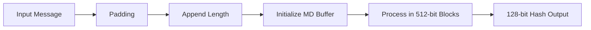

**Key Features:**

- **Fixed Output**: Always 128 bits
- **One-way**: Cannot reverse hash to original
- **Collision Prone**: Vulnerable to attacks

**Mnemonic**: "MD5 Makes Data into 5-step hash"

---

## Question 1(c) OR [7 marks]

**Explain SHA algorithm**

**Answer**: SHA (Secure Hash Algorithm) is a family of cryptographic hash functions designed by NSA.

**SHA Variants Comparison:**

| Version | Output Size | Block Size | Security Level |
|---------|-------------|------------|----------------|
| SHA-1 | 160 bits | 512 bits | Deprecated |
| SHA-256 | 256 bits | 512 bits | Strong |
| SHA-512 | 512 bits | 1024 bits | Very Strong |

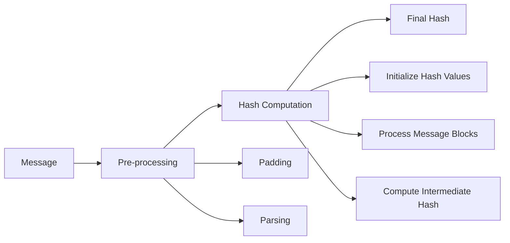

**SHA-256 Process:**

- **Preprocessing**: Padding and parsing message
- **Hash Computation**: 64 rounds of operations
- **Final Hash**: 256-bit output

**Advantages over MD5:**

- **Stronger Security**: Resistant to collision attacks
- **Larger Output**: More bits for security
- **Government Standard**: NIST approved

**Mnemonic**: "SHA Securely Hashes All data"

---

## Question 2(a) [3 marks]

**What is virus? Explain Virus Life cycle.**

**Answer**: Computer virus is malicious software that replicates by inserting copies into other programs or files.

**Virus Life Cycle:**

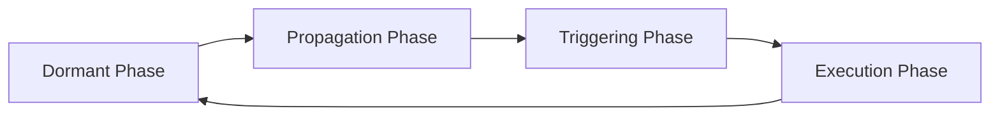

**Phase Details:**

- **Dormant**: Virus remains inactive
- **Propagation**: Copies itself to other systems
- **Triggering**: Activated by specific conditions
- **Execution**: Performs malicious activities

**Mnemonic**: "Viruses Dance, Propagate, Trigger, Execute"

---

## Question 2(b) [4 marks]

**Answer All Questions**

**i) Difference between Private key and Public Key cryptography**

**Answer**:

| Aspect | Private Key | Public Key |
|--------|------------|------------|
| **Keys** | Single shared key | Key pair (public/private) |
| **Speed** | Fast encryption | Slower encryption |
| **Key Distribution** | Difficult | Easy distribution |
| **Scalability** | Poor for large networks | Good scalability |

**ii) Define database forensics and list different kind of activities performed during database forensics.**

**Answer**: Database forensics examines database systems to extract digital evidence for legal proceedings.

**Activities Performed:**

- **Log Analysis**: Examining transaction logs
- **Metadata Extraction**: Recovering database structure
- **Deleted Data Recovery**: Retrieving removed records
- **Timeline Analysis**: Tracking data modifications

---

## Question 2(c) [7 marks]

**Explain proxy server in details and why we need it?**

**Answer**: Proxy server acts as intermediary between client and server, forwarding requests and responses.

**Proxy Server Architecture:**

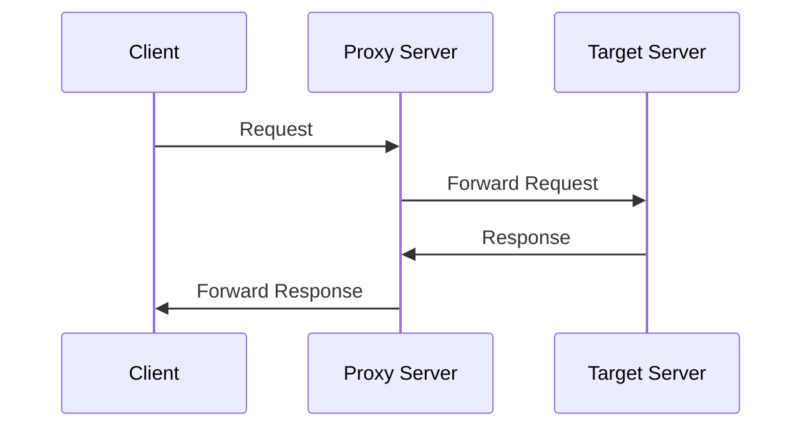

**Types of Proxy Servers:**

| Type | Function | Use Case |
|------|----------|----------|
| **Forward Proxy** | Client-side intermediary | Web filtering |
| **Reverse Proxy** | Server-side intermediary | Load balancing |
| **Transparent Proxy** | Invisible to client | Content caching |

**Why We Need Proxy Servers:**

- **Security**: Hide client IP addresses
- **Performance**: Cache frequently accessed content
- **Control**: Filter and monitor traffic
- **Anonymity**: Protect user privacy

**Benefits:**

- **Bandwidth Saving**: Caching reduces traffic
- **Access Control**: Block unwanted sites
- **Load Distribution**: Balance server requests

**Mnemonic**: "Proxy Protects Privacy and Performance"

---

## Question 2(a) OR [3 marks]

**Define: Trojans, Rootkit, Backdoors, Keylogger**

**Answer**:

| Malware Type | Definition |
|--------------|------------|
| **Trojans** | Malicious software disguised as legitimate programs |
| **Rootkit** | Software hiding presence of malware in system |
| **Backdoors** | Secret entry points bypassing normal authentication |
| **Keylogger** | Software recording keystrokes to steal passwords |

**Mnemonic**: "TRBK - Trojans, Rootkits, Backdoors Keep attacking"

---

## Question 2(b) OR [4 marks]

**Answer All Questions**

**i) Write advantages and disadvantages of firewall.**

**Answer**:

| Advantages | Disadvantages |
|------------|---------------|
| **Network Protection** | **Performance Impact** |
| **Access Control** | **Configuration Complexity** |
| **Traffic Monitoring** | **Cannot Stop All Attacks** |
| **Log Generation** | **Maintenance Required** |

**ii) List critical steps in preserving digital evidence.**

**Answer**:

- **Identification**: Locate potential evidence
- **Documentation**: Record evidence details
- **Collection**: Gather evidence safely
- **Preservation**: Maintain evidence integrity
- **Chain of Custody**: Track evidence handling

---

## Question 2(c) OR [7 marks]

**Explain IP Security Architecture.**

**Answer**: IPSec provides security services at network layer for IP communications.

**IPSec Architecture Components:**

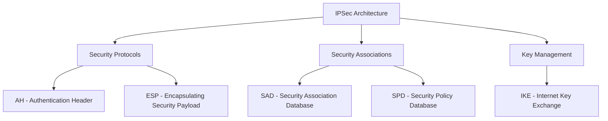

**Security Services:**

| Service | Protocol | Function |
|---------|----------|----------|
| **Authentication** | AH | Verify packet origin |
| **Confidentiality** | ESP | Encrypt packet data |
| **Integrity** | Both | Detect modifications |
| **Anti-replay** | Both | Prevent replay attacks |

**IPSec Modes:**

- **Transport Mode**: Protects payload only
- **Tunnel Mode**: Protects entire IP packet

**Key Components:**

- **Security Association (SA)**: Security parameters
- **Security Policy Database (SPD)**: Security policies
- **Key Management**: Automated key exchange

**Mnemonic**: "IPSec Integrates Protection, Security, Encryption Completely"

---

## Question 3(a) [3 marks]

**List out various types of cybercrime and explain anyone.**

**Answer**:

**Cybercrime Types:**

- **Financial Crimes**: Credit card fraud, online banking theft
- **Identity Theft**: Stealing personal information
- **Cyber Bullying**: Online harassment
- **Data Breach**: Unauthorized data access

**Email Bombing (Detailed Explanation):**
Email bombing involves sending large volumes of emails to overwhelm victim's mailbox and server resources.

**Attack Process:**

- **Target Selection**: Choose victim email
- **Volume Generation**: Send thousands of emails
- **Resource Exhaustion**: Overwhelm mail server
- **Service Disruption**: Make email unusable

**Mnemonic**: "Cyber Crimes Create Chaos Constantly"

---

## Question 3(b) [4 marks]

**Define Web Jacking, Data Diddling, Dos Attack and DDOS Attack**

**Answer**:

| Attack Type | Definition |
|-------------|------------|
| **Web Jacking** | Unauthorized control of website by changing content |
| **Data Diddling** | Unauthorized modification of data before processing |
| **DoS Attack** | Single source attack to make service unavailable |
| **DDoS Attack** | Multiple sources attack to overwhelm target system |

**Attack Comparison:**

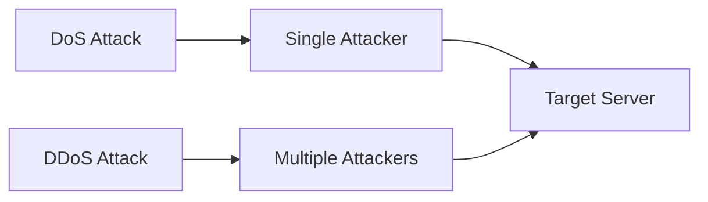

---

## Question 3(c) [7 marks]

**Explain Main in the middle attack with suitable examples.**

**Answer**: Man-in-the-Middle (MITM) attack occurs when attacker secretly intercepts and relays communications between two parties.

**MITM Attack Process:**

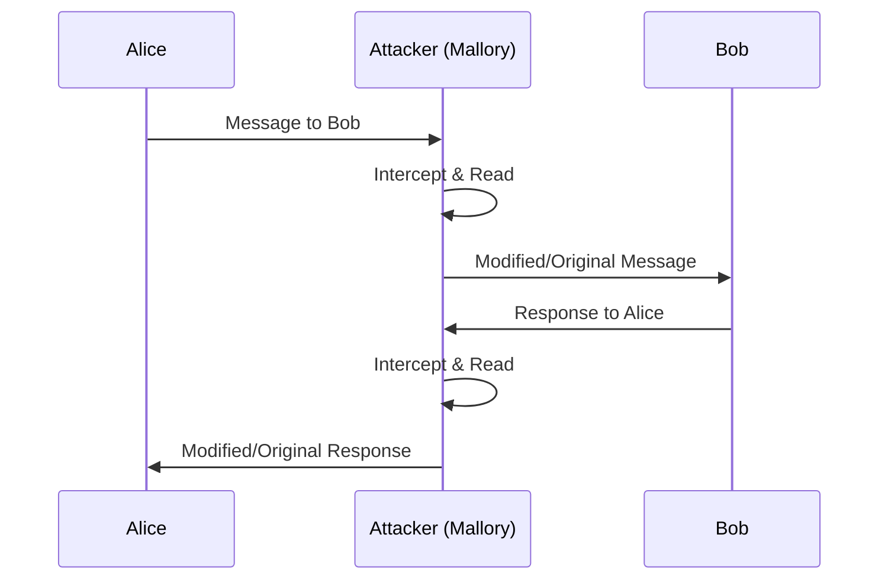

**Attack Types:**

| Type | Method | Example |
|------|--------|---------|
| **Wi-Fi Eavesdropping** | Fake hotspots | Coffee shop Wi-Fi |
| **Email Hijacking** | Compromised accounts | Business email |
| **DNS Spoofing** | Fake DNS responses | Redirect to fake sites |
| **HTTPS Spoofing** | Fake certificates | Banking websites |

**Real Example - Wi-Fi Attack:**

1. Attacker creates fake "Free_WiFi" hotspot
2. Victim connects to malicious network
3. All traffic passes through attacker
4. Sensitive data like passwords stolen

**Prevention Measures:**

- **Use HTTPS**: Encrypted connections
- **VPN Usage**: Additional encryption layer
- **Certificate Verification**: Check SSL certificates
- **Secure Networks**: Avoid public Wi-Fi for sensitive tasks

**Mnemonic**: "MITM Maliciously Intercepts, Tampers Messages"

---

## Question 3(a) OR [3 marks]

**Explain Salami attack in detail**

**Answer**: Salami attack involves stealing small amounts of money from many accounts to avoid detection.

**Attack Mechanism:**

- **Small Amounts**: Steal fractions of currency
- **Large Scale**: Target thousands of accounts
- **Rounding Errors**: Exploit calculation differences
- **Accumulation**: Small thefts create large profit

**Example**: Banking system rounds interest to nearest cent. Attacker collects remaining fractions from millions of accounts.

**Mnemonic**: "Salami Slices Small, Steals Significantly"

---

## Question 3(b) OR [4 marks]

**Define Cyber bullying, Phishing, spyware and logic bomb**

**Answer**:

| Term | Definition |
|------|------------|
| **Cyber Bullying** | Online harassment causing emotional distress |
| **Phishing** | Fraudulent attempts to obtain sensitive information |
| **Spyware** | Software secretly monitoring user activities |
| **Logic Bomb** | Malicious code triggered by specific conditions |

---

## Question 3(c) OR [7 marks]

**Explain ransomware in detail?**

**Answer**: Ransomware encrypts victim's files and demands payment for decryption key.

**Ransomware Attack Process:**

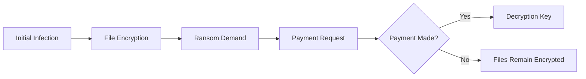

**Ransomware Types:**

| Type | Behavior | Example |
|------|----------|---------|
| **Crypto Ransomware** | Encrypts files | WannaCry |
| **Locker Ransomware** | Locks system access | Police-themed |
| **Scareware** | Fake threats | Fake antivirus |
| **Doxware** | Threatens data publication | Personal photos |

**Attack Vectors:**

- **Email Attachments**: Malicious documents
- **Drive-by Downloads**: Compromised websites
- **Exploit Kits**: Vulnerability exploitation
- **RDP Attacks**: Remote desktop compromise

**Prevention Strategies:**

- **Regular Backups**: Offline data copies
- **Security Updates**: Patch vulnerabilities
- **Email Filtering**: Block malicious attachments
- **User Training**: Recognize threats
- **Network Segmentation**: Limit spread

**Impact Assessment:**

- **Financial Loss**: Ransom payments and downtime
- **Data Loss**: Permanently encrypted files
- **Reputation Damage**: Customer trust loss
- **Operational Disruption**: Business shutdown

**Mnemonic**: "Ransomware Really Ruins Recovery, Requires Robust Response"

---

## Question 4(a) [3 marks]

**List out any six basic kali Linux commands.**

**Answer**:

| Command | Function |
|---------|----------|
| **ls** | List directory contents |
| **cd** | Change directory |
| **pwd** | Print working directory |
| **mkdir** | Create directory |
| **cp** | Copy files |
| **nmap** | Network scanning |

**Mnemonic**: "Linux Commands Make Navigation Possible"

---

## Question 4(b) [4 marks]

**Explain Zero day attack with example**

**Answer**: Zero-day attack exploits unknown vulnerability before security patch is available.

**Zero-Day Timeline:**

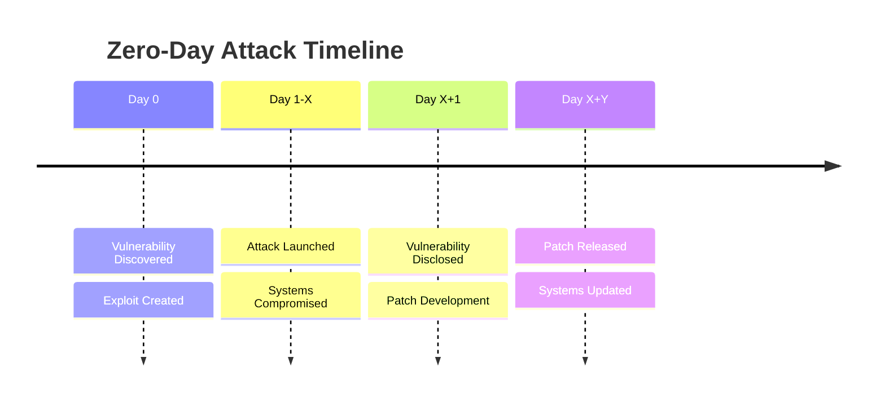

**Example - Stuxnet Worm:**

- **Target**: Iranian nuclear facilities
- **Exploit**: Windows zero-day vulnerabilities
- **Impact**: Physical damage to centrifuges
- **Duration**: Active for months before detection

**Characteristics:**

- **Unknown Vulnerability**: No existing patches
- **High Success Rate**: No defenses prepared
- **Valuable**: Expensive in dark markets
- **Limited Lifespan**: Once discovered, patched

**Mnemonic**: "Zero-day Zaps before Anyone Notices"

---

## Question 4(c) [7 marks]

**Explain Remote Access Tools and how we protect system from RAT?**

**Answer**: Remote Access Tool (RAT) allows remote control of computer systems, often used maliciously.

**RAT Functionality:**

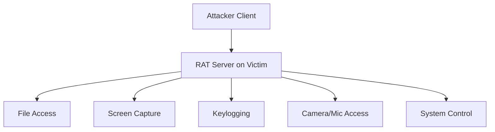

**Common RATs:**

| RAT Name | Features | Detection Difficulty |
|----------|----------|---------------------|
| **DarkComet** | Full system control | Medium |
| **Poison Ivy** | Stealth operations | High |
| **Back Orifice** | Windows targeting | Low |
| **NetBus** | Simple interface | Low |

**RAT Infection Methods:**

- **Email Attachments**: Trojanized files
- **Software Bundling**: Hidden in legitimate software
- **Drive-by Downloads**: Malicious websites
- **Social Engineering**: Trick users into installation

**Protection Strategies:**

**Technical Measures:**

- **Antivirus Software**: Real-time scanning
- **Firewall Rules**: Block unauthorized connections
- **Network Monitoring**: Detect unusual traffic
- **System Updates**: Patch vulnerabilities

**Behavioral Measures:**

- **Email Caution**: Verify attachments
- **Download Sources**: Use trusted sites only
- **Regular Scans**: Periodic malware checks
- **User Training**: Recognize threats

**Detection Signs:**

- **Slow Performance**: Unusual system lag
- **Network Activity**: Unexpected connections
- **File Changes**: Modified or new files
- **Strange Behavior**: Unexpected system actions

**Incident Response:**

1. **Isolate System**: Disconnect from network
2. **Document Evidence**: Record malicious activity
3. **Clean System**: Remove RAT completely
4. **Restore Data**: From clean backups
5. **Strengthen Security**: Improve defenses

**Mnemonic**: "RATs Remotely Access, Require Robust Response"

---

## Question 4(a) OR [3 marks]

**Describe Hacking, Blackhat, and White hat hacker in short.**

**Answer**:

| Term | Definition |
|------|------------|
| **Hacking** | Gaining unauthorized access to systems or networks |
| **Black Hat** | Malicious hackers with criminal intent |
| **White Hat** | Ethical hackers helping improve security |

**Comparison:**

- **Intent**: White hat helps, Black hat harms
- **Authorization**: White hat has permission
- **Purpose**: White hat protects, Black hat exploits

**Mnemonic**: "Hats Have Different Hacking Habits"

---

## Question 4(b) OR [4 marks]

**What is Port Scanning? Explain any two port scanning techniques.**

**Answer**: Port scanning discovers open ports and services on target systems.

**Port Scanning Techniques:**

| Technique | Method | Stealth Level |
|-----------|--------|---------------|
| **TCP Connect** | Full connection | Low stealth |
| **SYN Scan** | Half-open connection | High stealth |

**TCP Connect Scan:**

- Completes full TCP handshake
- Reliable but easily detected
- Logged by target systems

**SYN Scan (Half-Open):**

- Sends SYN, receives SYN-ACK, sends RST
- Stealthy, often unlogged
- Faster than connect scan

**Mnemonic**: "Port Scanning Probes System Services"

---

## Question 4(c) OR [7 marks]

**Explain the hacking process in detail.**

**Answer**: Hacking follows systematic five-phase methodology for gaining unauthorized system access.

**Five Phases of Hacking:**

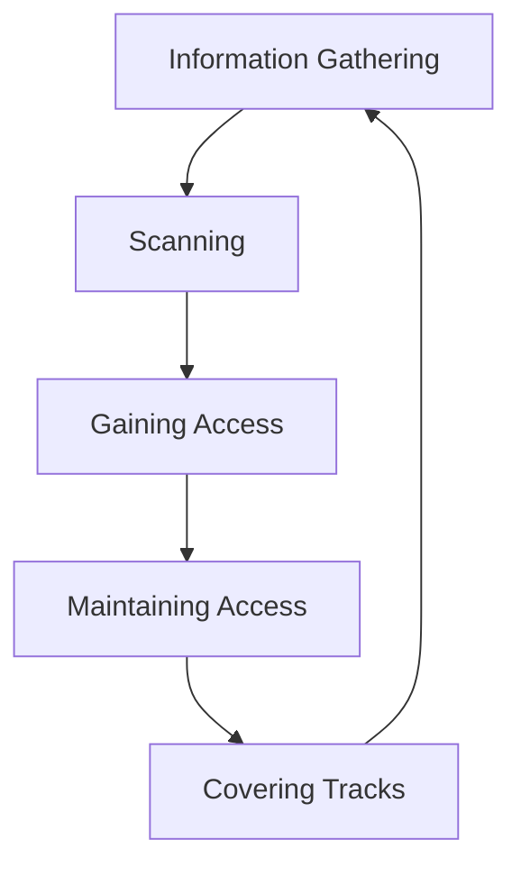

**Phase Details:**

**1. Information Gathering (Reconnaissance):**

- **Passive**: OSINT, social media research
- **Active**: Network queries, DNS lookups
- **Tools**: Google dorking, Whois, social engineering

**2. Scanning:**

- **Network Scanning**: Discover live hosts
- **Port Scanning**: Find open services
- **Vulnerability Scanning**: Identify weaknesses
- **Tools**: Nmap, Nessus, OpenVAS

**3. Gaining Access:**

- **Exploit Vulnerabilities**: Use discovered weaknesses
- **Password Attacks**: Brute force, dictionary
- **Social Engineering**: Manipulate humans
- **Tools**: Metasploit, custom exploits

**4. Maintaining Access:**

- **Install Backdoors**: Ensure continued access
- **Create User Accounts**: Hidden administrator
- **Rootkits**: Hide presence
- **Tools**: Netcat, custom backdoors

**5. Covering Tracks:**

- **Log Deletion**: Remove evidence
- **File Hiding**: Conceal malicious files
- **Process Hiding**: Hide running programs
- **Tools**: Log cleaners, steganography

**Detailed Process Flow:**

| Phase | Activities | Duration | Risk Level |
|-------|------------|----------|------------|
| **Reconnaissance** | Passive info gathering | Days/Weeks | Low |
| **Scanning** | Active probing | Hours/Days | Medium |
| **Gaining Access** | Exploitation | Minutes/Hours | High |
| **Maintaining Access** | Persistence | Ongoing | Medium |
| **Covering Tracks** | Evidence removal | Hours | High |

**Legal vs Illegal Hacking:**

- **Ethical Hacking**: Authorized penetration testing
- **Malicious Hacking**: Unauthorized criminal activity
- **Bug Bounty**: Legal vulnerability discovery

**Mnemonic**: "Hackers Investigate, Scan, Gain, Maintain, Cover"

---

## Question 5(a) [3 marks]

**Write Locards's principal and explain how it is related to cybercrime?**

**Answer**: Locard's Principle states "Every contact leaves a trace" - fundamental principle in forensic science.

**Digital Application:**

- **Log Files**: System activities recorded
- **Network Traffic**: Communication traces
- **File Metadata**: Creation, modification times
- **Memory Dumps**: Runtime evidence

**Cybercrime Relevance:**
Digital activities create electronic traces that investigators can analyze to reconstruct criminal activities.

**Mnemonic**: "Locard's Law: Leave Lasting Logs"

---

## Question 5(b) [4 marks]

**What is software forensics? How it is contributing in cybercrime?**

**Answer**: Software forensics analyzes software artifacts to determine authorship, detect plagiarism, or investigate malicious code.

**Software Forensics Applications:**

| Application | Purpose | Cybercrime Use |
|-------------|---------|----------------|
| **Code Analysis** | Identify programmer | Malware attribution |
| **Binary Analysis** | Reverse engineering | Understand attacks |
| **License Compliance** | Software piracy | IP theft cases |
| **Plagiarism Detection** | Academic integrity | Copyright violation |

**Contribution to Cybercrime Investigation:**

- **Malware Attribution**: Link code to specific authors
- **Attack Reconstruction**: Understand how attacks occurred
- **Evidence Collection**: Gather digital proof
- **Pattern Recognition**: Identify repeat offenders

---

## Question 5(c) [7 marks]

**Explain in detail: Drive imaging, Chain of custody and hash values**

**Answer**:

**Drive Imaging:**
Physical bit-by-bit copy of storage device preserving all data including deleted files and slack space.

**Imaging Process:**

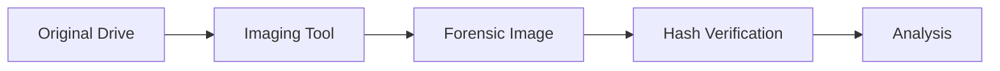

**Chain of Custody:**
Documentation tracking evidence handling from seizure to court presentation.

**Chain of Custody Elements:**

| Element | Details |
|---------|---------|
| **Who** | Person handling evidence |
| **What** | Evidence description |
| **When** | Date and time |
| **Where** | Location of evidence |
| **Why** | Reason for handling |

**Hash Values:**
Mathematical algorithms creating unique fingerprints to verify data integrity.

**Common Hash Algorithms:**

| Algorithm | Output Size | Use Case |
|-----------|-------------|----------|
| **MD5** | 128 bits | Quick verification |
| **SHA-1** | 160 bits | Legacy systems |
| **SHA-256** | 256 bits | Modern standard |

**Forensic Implementation:**

1. **Create Image**: Bit-by-bit copy
2. **Generate Hash**: Calculate original drive hash
3. **Verify Integrity**: Compare image hash
4. **Document Process**: Chain of custody
5. **Analyze Safely**: Work on copy only

**Importance in Digital Forensics:**

- **Data Integrity**: Ensures evidence authenticity
- **Legal Admissibility**: Court accepts verified evidence
- **Non-Repudiation**: Proves data unchanged
- **Forensic Soundness**: Maintains evidence quality

**Mnemonic**: "Drive Images Document Digital Data Definitively"

---

## Question 5(a) OR [3 marks]

**Explain four stage of malware analysis in short.**

**Answer**:

**Malware Analysis Stages:**

| Stage | Description | Tools Used |
|-------|-------------|------------|
| **Static Analysis** | Examine without execution | Hex editors, disassemblers |
| **Dynamic Analysis** | Observe runtime behavior | Sandboxes, debuggers |
| **Code Analysis** | Reverse engineer source | IDA Pro, Ghidra |
| **Network Analysis** | Monitor communications | Wireshark, tcpdump |

**Mnemonic**: "Static, Dynamic, Code, Network - SDCN"

---

## Question 5(b) OR [4 marks]

**How does network forensic functions?**

**Answer**: Network forensics captures, records, and analyzes network traffic to investigate security incidents.

**Network Forensics Process:**

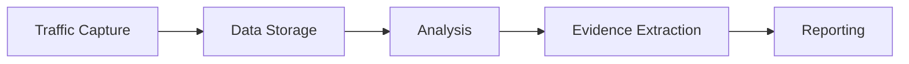

**Key Functions:**

- **Packet Capture**: Record network communications
- **Protocol Analysis**: Examine communication protocols
- **Flow Analysis**: Track data movement patterns
- **Content Inspection**: Analyze payload data

**Tools and Techniques:**

- **Network Taps**: Hardware monitoring
- **Packet Analyzers**: Software inspection
- **Flow Collectors**: Traffic summarization
- **SIEM Systems**: Correlation and alerting

---

## Question 5(c) OR [7 marks]

**Explain digital forensic investigation process**

**Answer**: Digital forensic investigation follows systematic methodology to collect, preserve, analyze, and present digital evidence.

**Investigation Process Phases:**

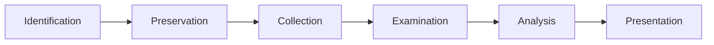

**Detailed Process:**

**1. Identification Phase:**

- **Evidence Location**: Find potential digital evidence
- **Scope Definition**: Determine investigation boundaries
- **Resource Planning**: Allocate personnel and tools
- **Legal Considerations**: Obtain necessary warrants

**2. Preservation Phase:**

- **Scene Securing**: Prevent evidence contamination
- **System Isolation**: Disconnect from networks
- **Evidence Documentation**: Photograph and catalog
- **Chain of Custody**: Begin documentation trail

**3. Collection Phase:**

- **Imaging Process**: Create forensic copies
- **Hash Generation**: Ensure data integrity
- **Metadata Capture**: Record file properties
- **Live Data Collection**: Capture volatile information

**4. Examination Phase:**

- **Data Recovery**: Retrieve deleted files
- **File System Analysis**: Examine storage structures
- **Timeline Creation**: Establish event sequence
- **Keyword Searching**: Find relevant content

**5. Analysis Phase:**

- **Evidence Correlation**: Link related findings
- **Pattern Recognition**: Identify trends
- **Hypothesis Testing**: Validate theories
- **Timeline Analysis**: Reconstruct events

**6. Presentation Phase:**

- **Report Writing**: Document findings
- **Evidence Preparation**: Organize for court
- **Expert Testimony**: Present in legal proceedings
- **Visualization**: Create demonstrative aids

**Investigation Principles:**

| Principle | Description | Importance |
|-----------|-------------|------------|
| **Reliability** | Evidence must be dependable | Court acceptance |
| **Repeatability** | Results can be reproduced | Scientific validity |
| **Integrity** | Data remains unchanged | Legal admissibility |
| **Documentation** | Complete record keeping | Audit trail |

**Key Challenges:**

- **Encryption**: Password-protected data
- **Anti-Forensics**: Evidence hiding techniques
- **Volume**: Large amounts of data
- **Technology**: Rapidly changing systems

**Best Practices:**

- **Standard Procedures**: Follow established protocols
- **Tool Validation**: Use tested forensic tools
- **Continuous Training**: Stay current with technology
- **Quality Assurance**: Peer review processes

**Legal Framework:**

- **Evidence Rules**: Admissibility requirements
- **Privacy Laws**: Data protection compliance
- **Chain of Custody**: Unbroken documentation
- **Expert Qualifications**: Forensic examiner credentials

**Mnemonic**: "Digital Investigation: Identify, Preserve, Collect, Examine, Analyze, Present"
