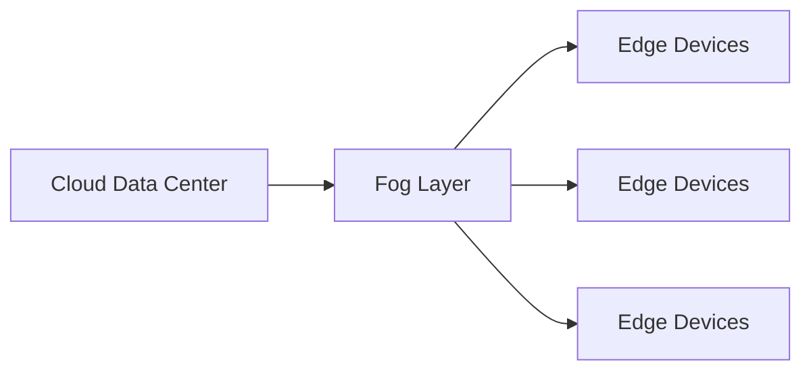
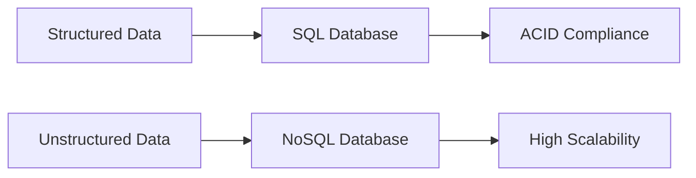
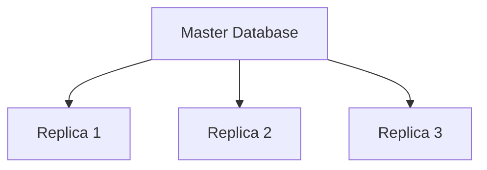
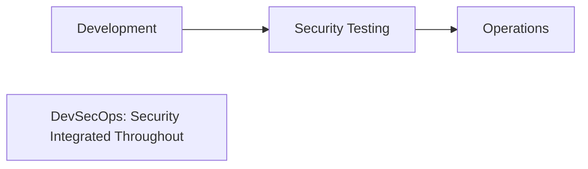

## પ્રશ્ન 1(અ) [3 ગુણ]

**Cloud computing ની વ્યાખ્યા આપો. Cloud computing ઉપયોગ કરવાના કોઈપણ બે ફાયદા સમજાવો.**

**જવાબ**:

**Cloud Computing** એ ઈન્ટરનેટ દ્વારા computing services જેમ કે servers, storage, databases અને software પ્રદાન કરવાની સેવા છે.

**ટેબલ: Cloud Computing ના ફાયદા**

| ફાયદો | વર્ણન |
|-------|-------|
| **કિંમત અસરકારક** | કોઈ upfront hardware ખર્ચ નથી, ઉપયોગ પ્રમાણે ચુકવણી |
| **સ્કેલેબિલિટી** | માંગ પ્રમાણે resources વધારી કે ઘટાડી શકાય |

**મેમરી ટ્રીક:** "Cloud Saves Cash" (કિંમત અસરકારક, સ્કેલેબલ)

---

## પ્રશ્ન 1(બ) [4 ગુણ]

**Cloud service models ની યાદી બનાવો. જસ્ટિફાઈ કરો: Infrastructure as a service model એ cloud computing structure નો આધાર છે.**

**જવાબ**:

**ટેબલ: Cloud Service Models**

| મોડલ | પૂરું નામ | વર્ણન |
|------|---------|-------|
| **IaaS** | Infrastructure as a Service | Virtual machines, storage, networks |
| **PaaS** | Platform as a Service | Development platforms અને tools |
| **SaaS** | Software as a Service | તૈયાર applications |

**જસ્ટિફિકેશન**: IaaS એ foundation છે કારણ કે તે basic computing infrastructure (servers, storage, networking) પ્રદાન કરે છે જેના ઉપર PaaS અને SaaS બનાવવામાં આવે છે.

**મેમરી ટ્રીક:** "I Pay for Software" (IaaS, PaaS, SaaS)

---

## પ્રશ્ન 1(ક) [7 ગુણ]

**Edge અને fog computing વચ્ચે તફાવત કરો.**

**જવાબ**:

**ટેબલ: Edge vs Fog Computing**

| પાસું | **Edge Computing** | **Fog Computing** |
|------|-------------------|-------------------|
| **સ્થાન** | Device level પર (endpoints) | Cloud અને edge વચ્ચે |
| **Latency** | અત્યંત ઓછી (milliseconds) | ઓછી (થોડી seconds) |
| **Processing** | મર્યાદિત local processing | વિતરિત processing |
| **Storage** | ન્યૂનતમ local storage | મધ્યમ storage capacity |
| **ઉપયોગ** | IoT sensors, autonomous vehicles | Smart cities, industrial IoT |

**ડાયાગ્રામ:**



**મેમરી ટ્રીક:** "Edge is Extremely close, Fog is Further"

---

## પ્રશ્ન 1(ક) OR [7 ગુણ]

**Cloud computing માં વપરાતી distributed ledger technology સમજાવો.**

**જવાબ**:

**Distributed Ledger Technology (DLT)** એ cloud computing માં multiple nodes પર ફેલાયેલ decentralized database છે.

**મુખ્ય લક્ષણો:**

- **Decentralization**: કોઈ single point of failure નથી
- **Immutability**: એકવાર add કર્યા પછી records બદલી શકાતા નથી
- **Transparency**: બધા participants transactions જોઈ શકે છે
- **Consensus**: નવી entries માટે agreement જરૂરી

**ટેબલ: Cloud માં DLT ના ફાયદા**

| ફાયદો | વર્ણન |
|-------|-------|
| **સુરક્ષા** | Cryptography દ્વારા વધુ data protection |
| **વિશ્વાસ** | Intermediaries ની જરૂર નથી |
| **Audit Trail** | સંપૂર્ણ transaction history |

**મેમરી ટ્રીક:** "DLT Delivers Trusted Security"

---

## પ્રશ્ન 2(અ) [3 ગુણ]

**Virtualization environment ના મુખ્ય components ની યાદી બનાવો અને સમજાવો.**

**જવાબ**:

**ટેબલ: Virtualization Components**

| Component | વર્ણન |
|-----------|-------|
| **Hypervisor** | Virtual machines manage કરતું software |
| **Virtual Machines** | અલગ computing environments |
| **Host OS** | Hypervisor ચલાવતું operating system |

**મેમરી ટ્રીક:** "Hypervisor Handles Virtual Machines"

---

## પ્રશ્ન 2(બ) [4 ગુણ]

**ઉદાહરણ સાથે વાજબી જવાબ આપો: Small અને midcap કંપનીઓ માટે resources ખરીદવા કરતાં cloud ઉપર ભાડે લેવા વધુ હિતાવહ છે.**

**જવાબ**:

**Cloud Renting ના ફાયદા:**

- **ઓછો પ્રારંભિક ખર્ચ**: Hardware માં upfront investment નહીં
- **લવચીકતા**: માંગ પ્રમાણે resources scale કરી શકાય
- **Maintenance-Free**: Provider updates અને repairs સંભાળે છે

**ઉદાહરણ**: એક startup ને peak season દરમિયાન જ servers જોઈએ છે. ખરીદવાનો ખર્ચ ₹10 લાખ છે, જ્યારે cloud renting નો ખર્ચ 3 મહિનાના ઉપયોગ માટે ₹50,000 છે.

**મેમરી ટ્રીક:** "Rent for Flexibility, Buy for Permanency"

---

## પ્રશ્ન 2(ક) [7 ગુણ]

**Hypervisor ને તેના પ્રકારો સાથે સમજાવો.**

**જવાબ**:

**Hypervisor** એ software છે જે hardware resources ને abstract કરીને virtual machines બનાવે અને manage કરે છે.

**ટેબલ: Hypervisor પ્રકારો**

| પ્રકાર | નામ | વર્ણન | ઉદાહરણો |
|------|-----|-------|--------|
| **Type 1** | Bare Metal | Hardware પર સીધું ચાલે છે | VMware ESXi, Hyper-V |
| **Type 2** | Hosted | Host operating system પર ચાલે છે | VirtualBox, VMware Workstation |

**ડાયાગ્રામ:**

```goat
Type 1 (Bare Metal)          Type 2 (Hosted)
┌─────────────────┐          ┌─────────────────┐
│    VM1  │  VM2  │          │    VM1  │  VM2  │
├─────────┼───────┤          ├─────────┼───────┤
│   Hypervisor    │          │   Hypervisor    │
├─────────────────┤          ├─────────────────┤
│    Hardware     │          │    Host OS      │
└─────────────────┘          ├─────────────────┤
                             │    Hardware     │
                             └─────────────────┘
```

**મેમરી ટ્રીક:** "Type 1 Touches Hardware, Type 2 Touches OS"

---

## પ્રશ્ન 2(અ) OR [3 ગુણ]

**Virtualization ઉપયોગ કરવાના ફાયદાઓની યાદી બનાવો. કોઈપણ એક સમજાવો.**

**જવાબ**:

**Virtualization ના ફાયદા:**

- **Resource Optimization**: બહેતર hardware ઉપયોગ
- **ખર્ચમાં ઘટાડો**: ઓછા physical servers જોઈએ
- **Isolation**: Applications સ્વતંત્ર રીતે ચાલે છે

**Resource Optimization**: એક physical server પર ઘણા virtual machines ચાલી શકે છે, hardware capacity નો 80-90% ઉપયોગ થાય છે સામાન્ય 15-20% ને બદલે.

**મેમરી ટ્રીક:** "Virtualization Optimizes Resources"

---

## પ્રશ્ન 2(બ) OR [4 ગુણ]

**Application-level virtualization સમજાવો.**

**જવાબ**:

**Application-level virtualization** applications ને host OS પર install કર્યા વિના isolated environments માં ચલાવવાની મંજૂરી આપે છે.

**ટેબલ: Application Virtualization Features**

| લક્ષણ | વર્ણન |
|-------|-------|
| **Isolation** | Apps એકબીજાને અસર કરતા નથી |
| **Portability** | Apps વિવિધ OS પર modification વિના ચાલે છે |
| **Security** | Sandboxed execution environment |

**ઉદાહરણ**: Docker containers જે applications ને તેમની dependencies સાથે package કરીને ચલાવે છે.

**મેમરી ટ્રીક:** "Apps Are Isolated and Portable"

---

## પ્રશ્ન 2(ક) OR [7 ગુણ]

**Cloud માં hardware virtualization સમજાવો.**

**જવાબ**:

**Hardware virtualization** cloud environments માં physical hardware components ના virtual versions બનાવે છે.

**મુખ્ય Components:**

- **CPU Virtualization**: ઘણા VMs physical processor share કરે છે
- **Memory Virtualization**: VMs ને virtual memory allocation
- **Storage Virtualization**: Storage resources ને abstract કરે છે
- **Network Virtualization**: Virtual network interfaces

**ટેબલ: Hardware Virtualization ના ફાયદા**

| ફાયદો | વર્ણન |
|-------|-------|
| **Resource Sharing** | ઘણા VMs સમાન hardware વાપરે છે |
| **Isolation** | VMs સ્વતંત્ર રીતે કામ કરે છે |
| **Migration** | VMs hosts વચ્ચે move કરી શકાય છે |

**મેમરી ટ્રીક:** "Hardware Hosts Multiple Virtual Machines"

---

## પ્રશ્ન 3(અ) [3 ગુણ]

**Data Center ની વ્યાખ્યા આપો. Data center ના પ્રકારોની યાદી બનાવો.**

**જવાબ**:

**Data Center** એ computing અને networking equipment રાખવાની સુવિધા છે જે data store, process અને distribute કરે છે.

**ટેબલ: Data Center પ્રકારો**

| પ્રકાર | વર્ણન |
|-------|-------|
| **Enterprise** | Organizations માટે private data centers |
| **Colocation** | ઘણા clients માટે shared facilities |
| **Cloud** | Virtualized, scalable data centers |

**મેમરી ટ્રીક:** "Enterprise, Colocation, Cloud Centers"

---

## પ્રશ્ન 3(બ) [4 ગુણ]

**Data centre automation કેમ મહત્વનું છે?**

**જવાબ**:

**Data Center Automation ના ફાયદા:**

- **કાર્યક્ષમતા**: Manual tasks અને errors ઘટાડે છે
- **ખર્ચમાં બચત**: ઓછા operational expenses
- **Scalability**: ઝડપી resource provisioning
- **વિશ્વસનીયતા**: સતત operations અને monitoring

**ટેબલ: Automation ક્ષેત્રો**

| ક્ષેત્ર | ફાયદો |
|------|-------|
| **Provisioning** | ઝડપી server deployment |
| **Monitoring** | Real-time performance tracking |
| **Maintenance** | Automated updates અને patches |

**મેમરી ટ્રીક:** "Automation Enhances Efficiency"

---

## પ્રશ્ન 3(ક) [7 ગુણ]

**SDN (Software Defined Networking) આર્કિટેક્ચર સમજાવો.**

**જવાબ**:

**SDN** network control plane ને data plane થી અલગ કરે છે, centralized network management શક્ય બનાવે છે.

**SDN Architecture Layers:**


**ટેબલ: SDN Components**

| Component | કાર્ય |
|-----------|------|
| **Controller** | Centralized network control |
| **Switches** | Controller આધારિત packets forward કરે છે |
| **Applications** | Network services અને policies |

**ફાયદા:**

- **Centralized Control**: Single point of network management
- **Programmability**: Dynamic network configuration
- **Flexibility**: સરળ policy implementation

**મેમરી ટ્રીક:** "SDN Separates Control from Data"

---

## પ્રશ્ન 3(અ) OR [3 ગુણ]

**વ્યાખ્યાયિત કરો: (1) Cloud Elasticity (2) Cloud Scalability**

**જવાબ**:

**ટેબલ: Cloud Elasticity vs Scalability**

| શબ્દ | વ્યાખ્યા |
|-----|--------|
| **Cloud Elasticity** | માંગ આધારિત automatic resource adjustment |
| **Cloud Scalability** | Resources add કરીને વધતી workload handle કરવાની ક્ષમતા |

**મુખ્ય તફાવત**: Elasticity automatic છે, scalability manual કે automatic હોઈ શકે છે.

**મેમરી ટ્રીક:** "Elasticity is Automatic, Scalability is Adaptable"

---

## પ્રશ્ન 3(બ) OR [4 ગુણ]

**કારણ સાથે સમજાવો: Cloud computing માં Vendor lock-in એ એક મોટી સમસ્યા છે.**

**જવાબ**:

**Vendor Lock-in** ત્યારે થાય છે જ્યારે specific services પર dependency ના કારણે cloud providers બદલવું મુશ્કેલ બને છે.

**સમસ્યાઓ:**

- **ઊંચા Migration Costs**: Data transfer અને application modification ખર્ચ
- **મર્યાદિત લવચીકતા**: Providers ની મર્યાદિત પસંદગી
- **Dependency**: Single vendor ની technologies પર આધારિતતા

**ઉદાહરણ**: AWS-specific services વાપરવાથી Google Cloud પર migration મોંઘું અને જટિલ બને છે.

**મેમરી ટ્રીક:** "Lock-in Limits Liberty"

---

## પ્રશ્ન 3(ક) OR [7 ગુણ]

**Infrastructure as Code (IaC) ને તેના different approaches સાથે સમજાવો.**

**જવાબ**:

**Infrastructure as Code (IaC)** manual processes ને બદલે code દ્વારા infrastructure manage કરે છે.

**ટેબલ: IaC Approaches**

| Approach | વર્ણન | Tools |
|----------|-------|-------|
| **Declarative** | ઇચ્છિત end state define કરે છે | Terraform, ARM templates |
| **Imperative** | Step-by-step instructions define કરે છે | Scripts, Ansible |
| **Hybrid** | બંને approaches નું combination | Pulumi |

**ફાયદા:**

- **Consistency**: Repeatable infrastructure deployment
- **Version Control**: Infrastructure changes track કરે છે
- **Automation**: Manual configuration errors ઘટાડે છે

**ડાયાગ્રામ:**


**મેમરી ટ્રીક:** "IaC Codes Infrastructure"

---

## પ્રશ્ન 4(અ) [3 ગુણ]

**Cloud storage ની વ્યાખ્યા આપો. મુખ્ય cloud storage સોલ્યુશન્સ આપતી સર્વિસીસની યાદી બનાવો.**

**જવાબ**:

**Cloud Storage** એ ઈન્ટરનેટ દ્વારા accessible remote servers પર data store કરવાની સેવા છે.

**ટેબલ: મુખ્ય Cloud Storage Solutions**

| Provider | Service | પ્રકાર |
|----------|---------|-------|
| **Amazon** | S3 | Object Storage |
| **Google** | Cloud Storage | Object Storage |
| **Microsoft** | Azure Blob | Object Storage |

**મેમરી ટ્રીક:** "Amazon, Google, Microsoft Store Objects"

---

## પ્રશ્ન 4(બ) [4 ગુણ]

**ઉદાહરણ સાથે સમર્થન આપો: Data consistency એ cloud storage ની આવશ્યક વિશેષતા છે.**

**જવાબ**:

**Data Consistency** ખાતરી કરે છે કે distributed systems માં data ની બધી copies સમાન value બતાવે છે.

**મહત્વ:**

- **વિશ્વસનીયતા**: Users ને હંમેશા સાચો data મળે છે
- **Integrity**: Data corruption અટકાવે છે
- **Synchronization**: ઘણા users સમાન information જુએ છે

**ઉદાહરણ**: Banking system માં account balance બધા ATMs અને branches માં consistent હોવું જોઈએ double spending અટકાવવા માટે.

**મેમરી ટ્રીક:** "Consistency Creates Confidence"

---

## પ્રશ્ન 4(ક) [7 ગુણ]

**Cloud databases ના પ્રકારો વિગતવાર સમજાવો.**

**જવાબ**:

**ટેબલ: Cloud Database પ્રકારો**

| પ્રકાર | વર્ણન | ઉદાહરણો | ઉપયોગ |
|------|-------|---------|------|
| **SQL Databases** | ACID properties સાથે relational databases | Amazon RDS, Azure SQL | Transaction processing |
| **NoSQL Databases** | Non-relational, flexible schema | MongoDB Atlas, DynamoDB | Big data, real-time web apps |
| **In-Memory** | ઝડપ માટે RAM માં data stored | Redis, Memcached | Caching, real-time analytics |
| **Graph Databases** | Relationship-focused data storage | Neo4j, Amazon Neptune | Social networks, recommendations |

**SQL vs NoSQL તુલના:**



**મેમરી ટ્રીક:** "SQL for Structure, NoSQL for Scale"

---

## પ્રશ્ન 4(અ) OR [3 ગુણ]

**Cloud માં database services ની વ્યાખ્યા આપો. Database services ના મુખ્ય લક્ષણોની યાદી બનાવો.**

**જવાબ**:

**Cloud Database Services** એ cloud vendors દ્વારા પ્રદાન કરવામાં આવતા managed database solutions છે.

**ટેબલ: મુખ્ય લક્ષણો**

| લક્ષણ | વર્ણન |
|-------|-------|
| **Auto-scaling** | Automatic resource adjustment |
| **Backup & Recovery** | Automated data protection |
| **High Availability** | 99.9% uptime guarantee |

**મેમરી ટ્રીક:** "Databases Auto-scale, Backup, and stay Available"

---

## પ્રશ્ન 4(બ) OR [4 ગુણ]

**ઉદાહરણ સાથે સમર્થન આપો: Data durability એ cloud storage ની આવશ્યક વિશેષતા છે.**

**જવાબ**:

**Data Durability** ખાતરી કરે છે કે data loss કે corruption વિના સમય સાથે ટકી રહે છે.

**મહત્વ:**

- **Data Protection**: કાયમી data loss અટકાવે છે
- **Business Continuity**: Operations માટે જરૂરી છે
- **Compliance**: Regulations દ્વારા જરૂરી છે

**ઉદાહરણ**: Amazon S3 multiple facilities માં data store કરીને અને multiple copies બનાવીને 99.999999999% (11 9's) durability પ્રદાન કરે છે.

**મેમરી ટ્રીક:** "Durability Delivers Data Protection"

---

## પ્રશ્ન 4(ક) OR [7 ગુણ]

**Data scaling અને replication વિગતવાર સમજાવો.**

**જવાબ**:

**Data Scaling** એ resources add કરીને વધતા data load ને handle કરવાની ક્ષમતા છે.

**ટેબલ: Scaling પ્રકારો**

| પ્રકાર | વર્ણન | પદ્ધતિ |
|------|-------|------|
| **Vertical Scaling** | વર્તમાન machine માં વધુ power add કરવું | CPU, RAM વધારવું |
| **Horizontal Scaling** | વધુ machines add કરવા | વધુ servers add કરવા |

**Data Replication** ઘણા સ્થળોએ data ની copies બનાવે છે.

**ટેબલ: Replication પ્રકારો**

| પ્રકાર | વર્ણન | ઉપયોગ |
|------|-------|------|
| **Synchronous** | Real-time data copying | Critical applications |
| **Asynchronous** | Delayed data copying | Backup systems |

**ડાયાગ્રામ:**



**મેમરી ટ્રીક:** "Scale Up or Scale Out, Replicate for Reliability"

---

## પ્રશ્ન 5(અ) [3 ગુણ]

**જસ્ટિફાઈ કરો: Cloud computing માં authentication અને access control એ સુરક્ષાના બે અલગ અલગ પાસાઓ છે.**

**જવાબ**:

**ટેબલ: Authentication vs Access Control**

| પાસું | **Authentication** | **Access Control** |
|------|-------------------|--------------------|
| **હેતુ** | User identity verify કરવું | Permissions નક્કી કરવા |
| **પ્રશ્ન** | "તમે કોણ છો?" | "તમે શું કરી શકો છો?" |
| **પદ્ધતિઓ** | Passwords, biometrics | Roles, policies |

**જસ્ટિફિકેશન**: Authentication પહેલા identity verify કરે છે, પછી access control નક્કી કરે છે કે authenticated user શું access કરી શકે છે.

**મેમરી ટ્રીક:** "Authenticate first, Authorize second"

---

## પ્રશ્ન 5(બ) [4 ગુણ]

**Cloud માં machine learning ની ભૂમિકા જણાવો. જસ્ટિફાઈ કરો: Cloud computing એ machine learning ના કાર્યમાં મદદ કરે છે.**

**જવાબ**:

**Cloud માં ML ની ભૂમિકા:**

- **Data Processing**: મોટા datasets ને કાર્યક્ષમ રીતે handle કરે છે
- **Model Training**: જટિલ algorithms માટે scalable computing
- **Deployment**: સરળ model hosting અને serving

**જસ્ટિફિકેશન**: Cloud જરૂરી computational power, storage અને tools પ્રદાન કરે છે જે મોટા infrastructure investment વિના ML ને accessible બનાવે છે.

**ટેબલ: Cloud ML ના ફાયદા**

| ફાયદો | વર્ણન |
|-------|-------|
| **Scalability** | વિશાળ datasets handle કરે છે |
| **Cost-Effective** | Pay-per-use model |
| **Accessibility** | Pre-built ML services |

**મેમરી ટ્રીક:** "Cloud Computes ML Models"

---

## પ્રશ્ન 5(ક) [7 ગુણ]

**Cloud માં security પડકારો સમજાવો.**

**જવાબ**:

**ટેબલ: મુખ્ય Cloud Security Challenges**

| પડકાર | વર્ણન | અસર |
|-------|-------|-----|
| **Data Breaches** | Sensitive data માં unauthorized access | નાણાકીય નુકસાન, reputation damage |
| **Identity Management** | User access અને permissions manage કરવા | Security vulnerabilities |
| **Compliance** | Regulatory requirements પૂરા કરવા | કાનૂની મુદ્દાઓ, penalties |
| **Multi-tenancy** | Users વચ્ચે shared resources | Data isolation concerns |
| **Vendor Lock-in** | Single provider પર dependency | મર્યાદિત security options |

**Security Layers:**


**Mitigation Strategies:**

- **Encryption**: Transit અને rest માં data protect કરવું
- **Monitoring**: સતત security assessment
- **Access Controls**: Role-based permissions

**મેમરી ટ્રીક:** "Data, Identity, Compliance Challenges"

---

## પ્રશ્ન 5(અ) OR [3 ગુણ]

**Identity access management ની ભૂમિકા જણાવો.**

**જવાબ**:

**Identity Access Management (IAM)** cloud systems માં કોણ કયા resources access કરી શકે છે તે control કરે છે.

**ટેબલ: IAM કાર્યો**

| કાર્ય | વર્ણન |
|------|-------|
| **Authentication** | User identity verify કરવું |
| **Authorization** | યોગ્ય permissions આપવા |
| **Audit** | Access activities track કરવા |

**મેમરી ટ્રીક:** "IAM Identifies, Authorizes, Audits"

---

## પ્રશ્ન 5(બ) OR [4 ગુણ]

**Kubernetes ની વ્યાખ્યા આપો. કારણ સાથે સમજાવો: Kubernetes એ cloud computing નો આવશ્યક ભાગ છે.**

**જવાબ**:

**Kubernetes** એ open-source container orchestration platform છે જે applications ની deployment, scaling અને management automate કરે છે.

**જસ્ટિફિકેશન**: Kubernetes આવશ્યક છે કારણ કે તે:

- **Automates Deployment**: Application management સરળ બનાવે છે
- **Ensures Scalability**: વિવિધ workloads automatically handle કરે છે
- **Provides Reliability**: Self-healing capabilities છે

**ટેબલ: Kubernetes ના ફાયદા**

| ફાયદો | વર્ણન |
|-------|-------|
| **Portability** | કોઈપણ જગ્યાએ consistently ચાલે છે |
| **Efficiency** | Optimal resource utilization |
| **Automation** | Manual operations ઘટાડે છે |

**મેમરી ટ્રીક:** "Kubernetes Orchestrates Containers"

---

## પ્રશ્ન 5(ક) OR [7 ગુણ]

**DevSecOps (Development Security and Operations) સમજાવો.**

**જવાબ**:

**DevSecOps** development થી deployment સુધી DevOps pipeline માં security practices integrate કરે છે.

**Traditional vs DevSecOps:**



**ટેબલ: DevSecOps સિદ્ધાંતો**

| સિદ્ધાંત | વર્ણન | અમલીકરણ |
|---------|-------|---------|
| **Shift Left** | પ્રારંભિક security testing | Code review માં security |
| **Automation** | Automated security scans | CI/CD security tools |
| **Collaboration** | Security shared responsibility તરીકે | Cross-team security training |
| **Continuous Monitoring** | સતત security assessment | Real-time threat detection |

**ફાયદા:**

- **ઝડપી Delivery**: Security development ધીમું કરતું નથી
- **ઘટાડેલ Risks**: પ્રારંભિક vulnerability detection
- **ખર્ચમાં બચત**: Production પહેલા issues fix કરવા

**Tools:**

- **SAST**: Static Application Security Testing
- **DAST**: Dynamic Application Security Testing
- **Container Scanning**: Docker security tools

**મેમરી ટ્રીક:** "DevSecOps Develops Securely from Start"
