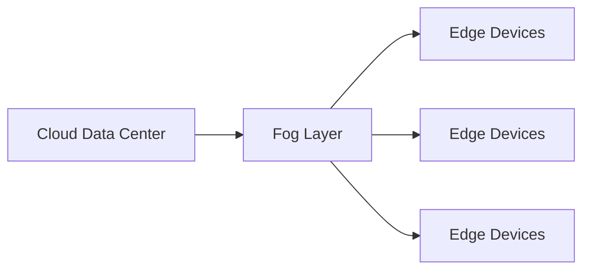
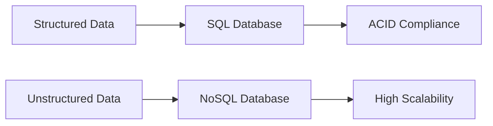
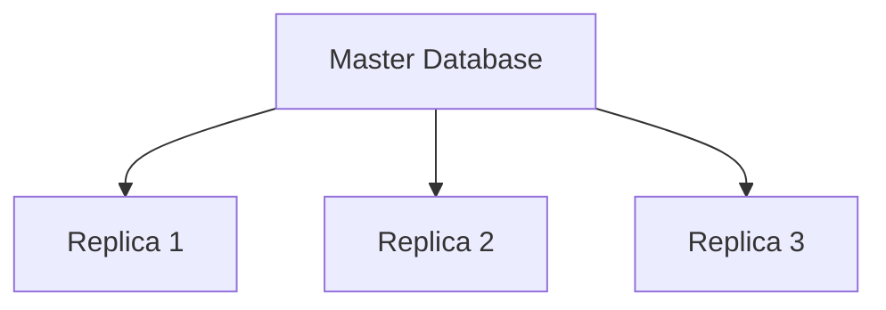
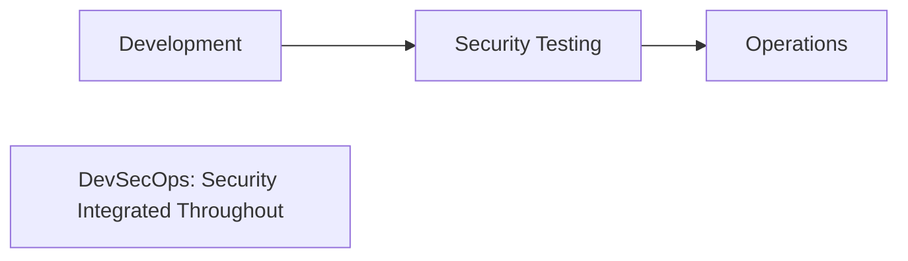

## Question 1(a) [3 marks]

**Define Cloud computing. Explain any two advantages of using cloud computing.**

**Answer**:

**Cloud Computing** is the delivery of computing services over the internet including servers, storage, databases, and software.

**Table: Cloud Computing Advantages**

| Advantage | Description |
|-----------|-------------|
| **Cost-Effective** | No upfront hardware costs, pay-as-you-use model |
| **Scalability** | Resources can be scaled up/down based on demand |

**Mnemonic:** "Cloud Saves Cash" (Cost-effective, Scalable)

---

## Question 1(b) [4 marks]

**List the cloud service models. Justify: Infrastructure as a service model is the base of cloud computing structure.**

**Answer**:

**Table: Cloud Service Models**

| Model | Full Form | Description |
|-------|-----------|-------------|
| **IaaS** | Infrastructure as a Service | Virtual machines, storage, networks |
| **PaaS** | Platform as a Service | Development platforms and tools |
| **SaaS** | Software as a Service | Ready-to-use applications |

**Justification**: IaaS is the foundation because it provides basic computing infrastructure (servers, storage, networking) upon which PaaS and SaaS are built.

**Mnemonic:** "I Pay for Software" (IaaS, PaaS, SaaS)

---

## Question 1(c) [7 marks]

**Differentiate between edge and fog computing.**

**Answer**:

**Table: Edge vs Fog Computing**

| Aspect | **Edge Computing** | **Fog Computing** |
|--------|-------------------|-------------------|
| **Location** | At device level (endpoints) | Between cloud and edge |
| **Latency** | Ultra-low (milliseconds) | Low (few seconds) |
| **Processing** | Limited local processing | Distributed processing |
| **Storage** | Minimal local storage | Moderate storage capacity |
| **Use Cases** | IoT sensors, autonomous vehicles | Smart cities, industrial IoT |

**Diagram:**



**Mnemonic:** "Edge is Extremely close, Fog is Further"

---

## Question 1(c) OR [7 marks]

**Explain distributed ledger technology used in cloud computing.**

**Answer**:

**Distributed Ledger Technology (DLT)** is a decentralized database spread across multiple nodes in cloud computing.

**Key Features:**

- **Decentralization**: No single point of failure
- **Immutability**: Records cannot be altered once added
- **Transparency**: All participants can view transactions
- **Consensus**: Agreement required for new entries

**Table: DLT Benefits in Cloud**

| Benefit | Description |
|---------|-------------|
| **Security** | Enhanced data protection through cryptography |
| **Trust** | Eliminates need for intermediaries |
| **Audit Trail** | Complete transaction history |

**Mnemonic:** "DLT Delivers Trusted Security"

---

## Question 2(a) [3 marks]

**List and explain the major components of virtualization environment.**

**Answer**:

**Table: Virtualization Components**

| Component | Description |
|-----------|-------------|
| **Hypervisor** | Software managing virtual machines |
| **Virtual Machines** | Isolated computing environments |
| **Host OS** | Operating system running hypervisor |

**Mnemonic:** "Hypervisor Handles Virtual Machines"

---

## Question 2(b) [4 marks]

**Justify with example: Renting resources on cloud is more beneficial than actually buying them for small and midcap companies.**

**Answer**:

**Benefits of Cloud Renting:**

- **Lower Initial Cost**: No upfront investment in hardware
- **Flexibility**: Scale resources based on demand
- **Maintenance-Free**: Provider handles updates and repairs

**Example**: A startup needs servers during peak season only. Buying costs ₹10 lakhs, while cloud renting costs ₹50,000 for 3 months usage.

**Mnemonic:** "Rent for Flexibility, Buy for Permanency"

---

## Question 2(c) [7 marks]

**Explain Hypervisor with its types.**

**Answer**:

**Hypervisor** is software that creates and manages virtual machines by abstracting hardware resources.

**Table: Hypervisor Types**

| Type | Name | Description | Examples |
|------|------|-------------|----------|
| **Type 1** | Bare Metal | Runs directly on hardware | VMware ESXi, Hyper-V |
| **Type 2** | Hosted | Runs on host operating system | VirtualBox, VMware Workstation |

**Diagram:**

```goat
Type 1 (Bare Metal)          Type 2 (Hosted)
┌─────────────────┐          ┌─────────────────┐
│    VM1  │  VM2  │          │    VM1  │  VM2  │
├─────────┼───────┤          ├─────────┼───────┤
│   Hypervisor    │          │   Hypervisor    │
├─────────────────┤          ├─────────────────┤
│    Hardware     │          │    Host OS      │
└─────────────────┘          ├─────────────────┤
                             │    Hardware     │
                             └─────────────────┘
```

**Mnemonic:** "Type 1 Touches Hardware, Type 2 Touches OS"

---

## Question 2(a) OR [3 marks]

**State the advantages of using virtualization. Explain any one.**

**Answer**:

**Virtualization Advantages:**

- **Resource Optimization**: Better hardware utilization
- **Cost Reduction**: Fewer physical servers needed
- **Isolation**: Applications run independently

**Resource Optimization**: Multiple virtual machines can run on single physical server, utilizing 80-90% of hardware capacity instead of typical 15-20%.

**Mnemonic:** "Virtualization Optimizes Resources"

---

## Question 2(b) OR [4 marks]

**Explain Application-level virtualization.**

**Answer**:

**Application-level virtualization** allows applications to run in isolated environments without installing them on the host OS.

**Table: Application Virtualization Features**

| Feature | Description |
|---------|-------------|
| **Isolation** | Apps don't interfere with each other |
| **Portability** | Apps run on different OS without modification |
| **Security** | Sandboxed execution environment |

**Example**: Docker containers running applications with their dependencies packaged together.

**Mnemonic:** "Apps Are Isolated and Portable"

---

## Question 2(c) OR [7 marks]

**Explain hardware virtualization in cloud.**

**Answer**:

**Hardware virtualization** creates virtual versions of physical hardware components in cloud environments.

**Key Components:**

- **CPU Virtualization**: Multiple VMs share physical processor
- **Memory Virtualization**: Virtual memory allocation to VMs
- **Storage Virtualization**: Abstract storage resources
- **Network Virtualization**: Virtual network interfaces

**Table: Hardware Virtualization Benefits**

| Benefit | Description |
|---------|-------------|
| **Resource Sharing** | Multiple VMs use same hardware |
| **Isolation** | VMs operate independently |
| **Migration** | VMs can move between hosts |

**Mnemonic:** "Hardware Hosts Multiple Virtual Machines"

---

## Question 3(a) [3 marks]

**Define Data Center. List types of Data center.**

**Answer**:

**Data Center** is a facility housing computing and networking equipment to store, process, and distribute data.

**Table: Data Center Types**

| Type | Description |
|------|-------------|
| **Enterprise** | Private data centers for organizations |
| **Colocation** | Shared facilities for multiple clients |
| **Cloud** | Virtualized, scalable data centers |

**Mnemonic:** "Enterprise, Colocation, Cloud Centers"

---

## Question 3(b) [4 marks]

**Why data centre automation is important?**

**Answer**:

**Data Center Automation Benefits:**

- **Efficiency**: Reduces manual tasks and errors
- **Cost Savings**: Lower operational expenses
- **Scalability**: Quick resource provisioning
- **Reliability**: Consistent operations and monitoring

**Table: Automation Areas**

| Area | Benefit |
|------|---------|
| **Provisioning** | Faster server deployment |
| **Monitoring** | Real-time performance tracking |
| **Maintenance** | Automated updates and patches |

**Mnemonic:** "Automation Enhances Efficiency"

---

## Question 3(c) [7 marks]

**Explain SDN (Software Defined Networking) architecture.**

**Answer**:

**SDN** separates network control plane from data plane, enabling centralized network management.

**SDN Architecture Layers:**


**Table: SDN Components**

| Component | Function |
|-----------|----------|
| **Controller** | Centralized network control |
| **Switches** | Forward packets based on controller |
| **Applications** | Network services and policies |

**Benefits:**

- **Centralized Control**: Single point of network management
- **Programmability**: Dynamic network configuration
- **Flexibility**: Easy policy implementation

**Mnemonic:** "SDN Separates Control from Data"

---

## Question 3(a) OR [3 marks]

**Define the following: (i) Cloud Elasticity (ii) Cloud Scalability**

**Answer**:

**Table: Cloud Elasticity vs Scalability**

| Term | Definition |
|------|------------|
| **Cloud Elasticity** | Automatic resource adjustment based on demand |
| **Cloud Scalability** | Ability to handle increased workload by adding resources |

**Key Difference**: Elasticity is automatic, scalability can be manual or automatic.

**Mnemonic:** "Elasticity is Automatic, Scalability is Adaptable"

---

## Question 3(b) OR [4 marks]

**Explain with reason: Vendor lock-in is a major problem in cloud computing services.**

**Answer**:

**Vendor Lock-in** occurs when switching cloud providers becomes difficult due to dependency on specific services.

**Problems:**

- **High Migration Costs**: Data transfer and application modification expenses
- **Limited Flexibility**: Restricted choice of providers
- **Dependency**: Reliance on single vendor's technologies

**Example**: Using AWS-specific services makes migration to Google Cloud expensive and complex.

**Mnemonic:** "Lock-in Limits Liberty"

---

## Question 3(c) OR [7 marks]

**Explain Infrastructure as Code (IaC) with its different approaches.**

**Answer**:

**Infrastructure as Code (IaC)** manages infrastructure through code rather than manual processes.

**Table: IaC Approaches**

| Approach | Description | Tools |
|----------|-------------|-------|
| **Declarative** | Define desired end state | Terraform, ARM templates |
| **Imperative** | Define step-by-step instructions | Scripts, Ansible |
| **Hybrid** | Combination of both approaches | Pulumi |

**Benefits:**

- **Consistency**: Repeatable infrastructure deployment
- **Version Control**: Track infrastructure changes
- **Automation**: Reduce manual configuration errors

**Diagram:**


**Mnemonic:** "IaC Codes Infrastructure"

---

## Question 4(a) [3 marks]

**Define cloud storage. List the major cloud storage solutions.**

**Answer**:

**Cloud Storage** is a service that stores data on remote servers accessible via internet.

**Table: Major Cloud Storage Solutions**

| Provider | Service | Type |
|----------|---------|------|
| **Amazon** | S3 | Object Storage |
| **Google** | Cloud Storage | Object Storage |
| **Microsoft** | Azure Blob | Object Storage |

**Mnemonic:** "Amazon, Google, Microsoft Store Objects"

---

## Question 4(b) [4 marks]

**Justify with example: Data consistency is an essential feature of cloud storage**

**Answer**:

**Data Consistency** ensures all copies of data across distributed systems show the same value.

**Importance:**

- **Reliability**: Users get correct data always
- **Integrity**: Prevents data corruption
- **Synchronization**: Multiple users see same information

**Example**: In banking system, account balance must be consistent across all ATMs and branches to prevent double spending.

**Mnemonic:** "Consistency Creates Confidence"

---

## Question 4(c) [7 marks]

**Explain types of cloud databases in detail.**

**Answer**:

**Table: Cloud Database Types**

| Type | Description | Examples | Use Cases |
|------|-------------|----------|-----------|
| **SQL Databases** | Relational databases with ACID properties | Amazon RDS, Azure SQL | Transaction processing |
| **NoSQL Databases** | Non-relational, flexible schema | MongoDB Atlas, DynamoDB | Big data, real-time web apps |
| **In-Memory** | Data stored in RAM for speed | Redis, Memcached | Caching, real-time analytics |
| **Graph Databases** | Relationship-focused data storage | Neo4j, Amazon Neptune | Social networks, recommendations |

**SQL vs NoSQL Comparison:**



**Mnemonic:** "SQL for Structure, NoSQL for Scale"

---

## Question 4(a) OR [3 marks]

**Define database services in cloud. List the major features of database services**

**Answer**:

**Cloud Database Services** are managed database solutions provided by cloud vendors.

**Table: Major Features**

| Feature | Description |
|---------|-------------|
| **Auto-scaling** | Automatic resource adjustment |
| **Backup & Recovery** | Automated data protection |
| **High Availability** | 99.9% uptime guarantee |

**Mnemonic:** "Databases Auto-scale, Backup, and stay Available"

---

## Question 4(b) OR [4 marks]

**Justify with example: Data durability is an essential feature of cloud storage.**

**Answer**:

**Data Durability** ensures data persists over time without loss or corruption.

**Importance:**

- **Data Protection**: Prevents permanent data loss
- **Business Continuity**: Critical for operations
- **Compliance**: Required by regulations

**Example**: Amazon S3 provides 99.999999999% (11 9's) durability by storing data across multiple facilities and creating multiple copies.

**Mnemonic:** "Durability Delivers Data Protection"

---

## Question 4(c) OR [7 marks]

**Explain data scaling and replication in detail.**

**Answer**:

**Data Scaling** is the ability to handle increased data load by adding resources.

**Table: Scaling Types**

| Type | Description | Method |
|------|-------------|--------|
| **Vertical Scaling** | Adding more power to existing machine | Increase CPU, RAM |
| **Horizontal Scaling** | Adding more machines | Add more servers |

**Data Replication** creates copies of data across multiple locations.

**Table: Replication Types**

| Type | Description | Use Case |
|------|-------------|----------|
| **Synchronous** | Real-time data copying | Critical applications |
| **Asynchronous** | Delayed data copying | Backup systems |

**Diagram:**



**Mnemonic:** "Scale Up or Scale Out, Replicate for Reliability"

---

## Question 5(a) [3 marks]

**Justify: Authentication and access control are two different aspects of security in cloud computing.**

**Answer**:

**Table: Authentication vs Access Control**

| Aspect | **Authentication** | **Access Control** |
|--------|-------------------|--------------------|
| **Purpose** | Verify user identity | Determine permissions |
| **Question** | "Who are you?" | "What can you do?" |
| **Methods** | Passwords, biometrics | Roles, policies |

**Justification**: Authentication verifies identity first, then access control determines what authenticated user can access.

**Mnemonic:** "Authenticate first, Authorize second"

---

## Question 5(b) [4 marks]

**State the role of machine learning in the cloud. Justify: Cloud computing aids in the task of machine learning.**

**Answer**:

**ML Role in Cloud:**

- **Data Processing**: Handle large datasets efficiently
- **Model Training**: Scalable computing for complex algorithms
- **Deployment**: Easy model hosting and serving

**Justification**: Cloud provides necessary computational power, storage, and tools that make ML accessible without huge infrastructure investment.

**Table: Cloud ML Benefits**

| Benefit | Description |
|---------|-------------|
| **Scalability** | Handle massive datasets |
| **Cost-Effective** | Pay-per-use model |
| **Accessibility** | Pre-built ML services |

**Mnemonic:** "Cloud Computes ML Models"

---

## Question 5(c) [7 marks]

**Explain cloud security challenges.**

**Answer**:

**Table: Major Cloud Security Challenges**

| Challenge | Description | Impact |
|-----------|-------------|---------|
| **Data Breaches** | Unauthorized access to sensitive data | Financial loss, reputation damage |
| **Identity Management** | Managing user access and permissions | Security vulnerabilities |
| **Compliance** | Meeting regulatory requirements | Legal issues, penalties |
| **Multi-tenancy** | Shared resources among users | Data isolation concerns |
| **Vendor Lock-in** | Dependency on single provider | Limited security options |

**Security Layers:**


**Mitigation Strategies:**

- **Encryption**: Protect data in transit and at rest
- **Monitoring**: Continuous security assessment
- **Access Controls**: Role-based permissions

**Mnemonic:** "Data, Identity, Compliance Challenges"

---

## Question 5(a) OR [3 marks]

**State the role of identity access management.**

**Answer**:

**Identity Access Management (IAM)** controls who can access what resources in cloud systems.

**Table: IAM Functions**

| Function | Description |
|----------|-------------|
| **Authentication** | Verify user identity |
| **Authorization** | Grant appropriate permissions |
| **Audit** | Track access activities |

**Mnemonic:** "IAM Identifies, Authorizes, Audits"

---

## Question 5(b) OR [4 marks]

**Define Kubernetes. Explain with reason: Kubernetes is an essential component of cloud computing.**

**Answer**:

**Kubernetes** is an open-source container orchestration platform that automates deployment, scaling, and management of applications.

**Justification**: Kubernetes is essential because it:

- **Automates Deployment**: Simplifies application management
- **Ensures Scalability**: Handles varying workloads automatically
- **Provides Reliability**: Self-healing capabilities

**Table: Kubernetes Benefits**

| Benefit | Description |
|---------|-------------|
| **Portability** | Run anywhere consistently |
| **Efficiency** | Optimal resource utilization |
| **Automation** | Reduces manual operations |

**Mnemonic:** "Kubernetes Orchestrates Containers"

---

## Question 5(c) OR [7 marks]

**Explain DevSecOps (Development Security and Operations).**

**Answer**:

**DevSecOps** integrates security practices into DevOps pipeline from development to deployment.

**Traditional vs DevSecOps:**



**Table: DevSecOps Principles**

| Principle | Description | Implementation |
|-----------|-------------|----------------|
| **Shift Left** | Early security testing | Security in code review |
| **Automation** | Automated security scans | CI/CD security tools |
| **Collaboration** | Security as shared responsibility | Cross-team security training |
| **Continuous Monitoring** | Ongoing security assessment | Real-time threat detection |

**Benefits:**

- **Faster Delivery**: Security doesn't slow development
- **Reduced Risks**: Early vulnerability detection
- **Cost Savings**: Fix issues before production

**Tools:**

- **SAST**: Static Application Security Testing
- **DAST**: Dynamic Application Security Testing
- **Container Scanning**: Docker security tools

**Mnemonic:** "DevSecOps Develops Securely from Start"
