## પ્રશ્ન 1(અ) [3 ગુણ]

**ક્લાઉડ કમ્પ્યુટિંગની વ્યાખ્યા આપો. ક્લાઉડ કમ્પ્યુટિંગના ઉપયોગો સમજાવો.**

**જવાબ**:

**ક્લાઉડ કમ્પ્યુટિંગ** એ ઇન્ટરનેટ ("ક્લાઉડ") દ્વારા કમ્પ્યુટિંગ સેવાઓ જેવી કે સર્વર, સ્ટોરેજ, ડેટાબેઝ, નેટવર્કિંગ, સોફ્ટવેર અને વિશ્લેષણની ડિલિવરી છે.

**ક્લાઉડ કમ્પ્યુટિંગના ઉપયોગો:**

| ઉપયોગ | વર્ણન |
|--------|--------|
| **ડેટા સ્ટોરેજ** | ફાઇલો અને દસ્તાવેજો ઓનલાઇન સ્ટોર કરવા |
| **વેબ એપ્લિકેશન** | વેબ બ્રાઉઝર દ્વારા સોફ્ટવેર ચલાવવા |
| **ઇમેઇલ સેવાઓ** | Gmail, Outlook ક્લાઉડ પર હોસ્ટ કરવા |
| **બેકઅપ અને રિકવરી** | ઓટોમેટિક ડેટા બેકઅપ અને આપત્તિ પુનઃપ્રાપ્તિ |

**મેમરી ટ્રીક:** "SWEB" - Storage, Web apps, Email, Backup

---

## પ્રશ્ન 1(બ) [4 ગુણ]

**ક્લાઉડ સ્ટોરેજ સોલ્યુશન શું છે? ઓબ્જેક્ટ સ્ટોરેજ વિગતે સમજાવો.**

**જવાબ**:

**ક્લાઉડ સ્ટોરેજ સોલ્યુશન** એ ઓનલાઇન સેવાઓ છે જે ઇન્ટરનેટ-કનેક્ટેડ ઉપકરણો દ્વારા ડેટા સ્ટોરેજ, મેનેજમેન્ટ અને એક્સેસ પ્રદાન કરે છે.

**ઓબ્જેક્ટ સ્ટોરેજની વિગતો:**

| વિશેષતા | વર્ણન |
|----------|--------|
| **સ્ટ્રક્ચર** | બકેટ/કન્ટેનરમાં ઓબ્જેક્ટ તરીકે ડેટા સ્ટોર કરે છે |
| **મેટાડેટા** | દરેક ઓબ્જેક્ટમાં ડેટા, મેટાડેટા અને યુનિક ID હોય છે |
| **સ્કેલેબિલિટી** | વર્ચ્યુઅલી અનલિમિટેડ સ્ટોરેજ ક્ષમતા |
| **એક્સેસ** | પ્રોગ્રામેટિક એક્સેસ માટે RESTful APIs |

**ડાયાગ્રામ:**

```goat
┌─────────────────┐    ┌─────────────────┐    ┌─────────────────┐
│    Object 1     │    │    Object 2     │    │    Object 3     │
│                 │    │                 │    │                 │
│ Data + Metadata │    │ Data + Metadata │    │ Data + Metadata │
│ Unique ID: 001  │    │ Unique ID: 002  │    │ Unique ID: 003  │
└─────────────────┘    └─────────────────┘    └─────────────────┘
        │                       │                       │
        └───────────────────────┼───────────────────────┘
                                │
                    ┌─────────────────┐
                    │     Bucket      │
                    │   (Container)   │
                    └─────────────────┘
```

**મેમરી ટ્રીક:** "SMAR" - Scalable, Metadata-rich, API-accessible, Resilient

---

## પ્રશ્ન 1(ક) [7 ગુણ]

**હાર્ડવેર વર્ચ્યુઅલાઇઝેશન અને સોફ્ટવેર વર્ચ્યુઅલાઇઝેશન વિગતે સમજાવો.**

**જવાબ**:

**હાર્ડવેર વર્ચ્યુઅલાઇઝેશન:**

- **ભૌતિક સ્તર અમૂર્તીકરણ** જે ભૌતિક હાર્ડવેર ઘટકોના વર્ચ્યુઅલ વર્ઝન બનાવે છે
- **હાઇપરવાઇઝર** એક જ ભૌતિક સર્વર પર બહુવિધ વર્ચ્યુઅલ મશીનોનું સંચાલન કરે છે

**સોફ્ટવેર વર્ચ્યુઅલાઇઝેશન:**

- **એપ્લિકેશન સ્તર અમૂર્તીકરણ** જે સોફ્ટવેરને અલગ વાતાવરણમાં ચલાવવાની મંજૂરી આપે છે
- **રનટાઇમ વાતાવરણ** વિવિધ પ્લેટફોર્મ પર સુસંગતતા પ્રદાન કરે છે

**તુલના કોષ્ટક:**

| પાસું | હાર્ડવેર વર્ચ્યુઅલાઇઝેશન | સોફ્ટવેર વર્ચ્યુઅલાઇઝેશન |
|------|--------------------------|----------------------------|
| **સ્તર** | હાર્ડવેર/OS સ્તર | એપ્લિકેશન સ્તર |
| **પ્રદર્શન** | મૂળ જેવું | થોડું ઓવરહેડ |
| **રિસોર્સ ઉપયોગ** | ઊંચો | મધ્યમ |
| **આઇસોલેશન** | સંપૂર્ણ | એપ્લિકેશન-વિશિષ્ટ |

**આર્કિટેક્ચર ડાયાગ્રામ:**

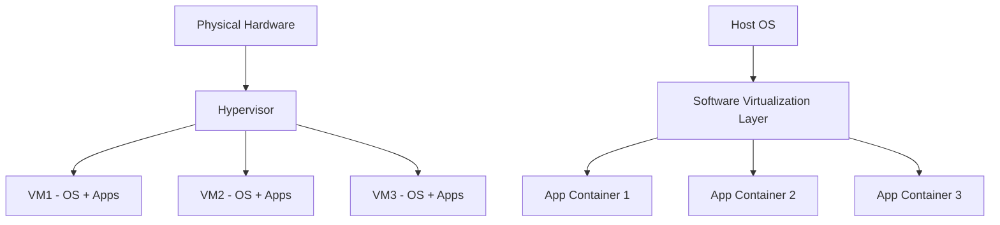

**મેમરી ટ્રીક:** "HAPI" - Hardware abstraction, Application isolation, Performance consideration, Infrastructure management

---

## પ્રશ્ન 1(ક) OR [7 ગુણ]

**ક્લાઉડ વર્ચ્યુઅલાઇઝેશન શું છે? વર્ચ્યુઅલાઇઝેશનની લાક્ષણિકતાઓ સમજાવો.**

**જવાબ**:

**ક્લાઉડ વર્ચ્યુઅલાઇઝેશન** એ ક્લાઉડ વાતાવરણમાં ગતિશીલ રીતે ફાળવી અને સંચાલિત કરી શકાય તેવા કમ્પ્યુટિંગ રિસોર્સ (સર્વર, સ્ટોરેજ, નેટવર્ક)ના વર્ચ્યુઅલ વર્ઝન બનાવવાની પ્રક્રિયા છે.

**વર્ચ્યુઅલાઇઝેશનની લાક્ષણિકતાઓ:**

| લાક્ષણિકતા | વર્ણન |
|-------------|--------|
| **રિસોર્સ પુલિંગ** | બહુવિધ ભૌતિક રિસોર્સને પુલમાં જોડવા |
| **આઇસોલેશન** | વર્ચ્યુઅલ મશીનો સ્વતંત્ર રીતે કામ કરે છે |
| **લાસ્ટિસિટી** | માંગ પર આધારિત ગતિશીલ સ્કેલિંગ |
| **કાર્યક્ષમતા** | બહેતર હાર્ડવેર ઉપયોગ |

**ફાયદાઓ:**

- હાર્ડવેર એકીકરણ દ્વારા **ખર્ચમાં ઘટાડો**
- રિસોર્સ ફાળવણીમાં **લવચીકતા**
- વધતી માંગ માટે **સ્કેલેબિલિટી**
- કેન્દ્રીકરણ દ્વારા સરળીકૃત **મેનેજમેન્ટ**

**વર્ચ્યુઅલાઇઝેશન સ્ટેક:**

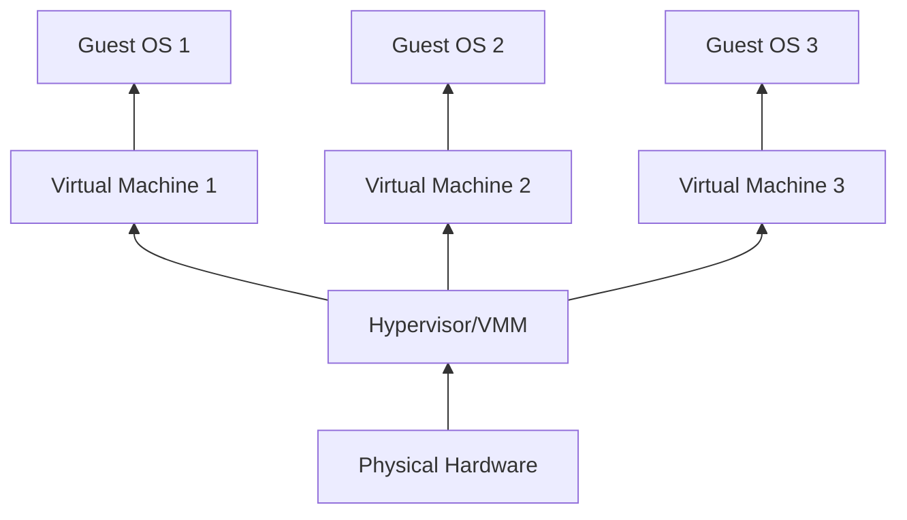

**મેમરી ટ્રીક:** "RIEM" - Resource pooling, Isolation, Elasticity, Management

---

## પ્રશ્ન 2(અ) [3 ગુણ]

**ક્લાઉડ સિક્યુરિટી ચેલેન્જીસ કયાં છે?**

**જવાબ**:

**ક્લાઉડ સિક્યુરિટી ચેલેન્જીસ:**

| ચેલેન્જ | વર્ણન |
|---------|--------|
| **ડેટા બ્રીચ** | સંવેદનશીલ માહિતીની અનધિકૃત ઍક્સેસ |
| **ઍક્સેસ મેનેજમેન્ટ** | યુઝર પરમિશન અને ઓથેન્ટિકેશન નિયંત્રણ |
| **કોમ્પ્લાયન્સ** | નિયમનકારી અને ઉદ્યોગ ધોરણો પૂરા કરવા |
| **વેન્ડર લોક-ઇન** | ચોક્કસ ક્લાઉડ પ્રોવાઇડર પર નિર્ભરતા |

**મેમરી ટ્રીક:** "DACV" - Data breaches, Access control, Compliance, Vendor dependency

---

## પ્રશ્ન 2(બ) [4 ગુણ]

**IaaS વિગતે સમજાવો.**

**જવાબ**:

**Infrastructure as a Service (IaaS)** ઇન્ટરનેટ પર વર્ચ્યુઅલાઇઝ્ડ કમ્પ્યુટિંગ ઇન્ફ્રાસ્ટ્રક્ચર પ્રદાન કરે છે, જેમાં સર્વર, સ્ટોરેજ અને નેટવર્કિંગ શામેલ છે.

**IaaS ઘટકો:**

| ઘટક | વર્ણન |
|------|--------|
| **કમ્પ્યુટ** | વર્ચ્યુઅલ મશીનો અને પ્રોસેસિંગ પાવર |
| **સ્ટોરેજ** | બ્લોક, ફાઇલ અને ઓબ્જેક્ટ સ્ટોરેજ |
| **નેટવર્કિંગ** | વર્ચ્યુઅલ નેટવર્ક, લોડ બેલેન્સર, ફાયરવૉલ |
| **મેનેજમેન્ટ** | મોનિટરિંગ, સિક્યુરિટી અને બેકઅપ ટૂલ્સ |

**IaaS આર્કિટેક્ચર:**

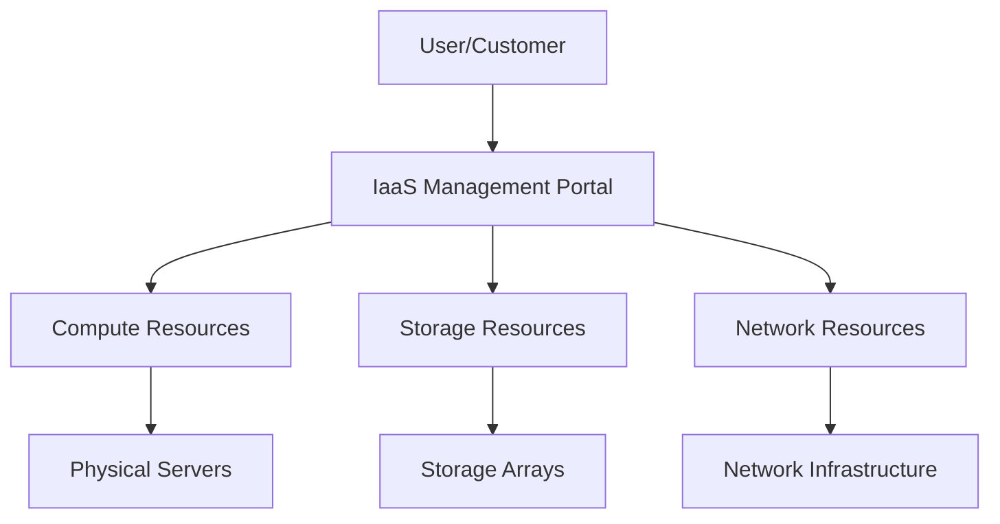

**ફાયદાઓ:**

- **પે-પ્રર-યુઝ** પ્રાઇસિંગ મોડલ
- માંગ પર **સ્કેલેબિલિટી**
- **ઘટેલા** મૂડી ખર્ચ

**મેમરી ટ્રીક:** "CSNM" - Compute, Storage, Network, Management

---

## પ્રશ્ન 2(ક) [7 ગુણ]

**Identity and access management વિગતે સમજાવો.**

**જવાબ**:

**Identity and Access Management (IAM)** એ ક્લાઉડ વાતાવરણમાં ડિજિટલ ઓળખ અને રિસોર્સની ઍક્સેસ નિયંત્રિત કરવા માટેનું ફ્રેમવર્ક છે.

**IAM ઘટકો:**

| ઘટક | કાર્ય |
|------|------|
| **ઓથેન્ટિકેશન** | યુઝર ઓળખ ચકાસવી |
| **ઓથરાઇઝેશન** | ઍક્સેસ પરમિશન નક્કી કરવી |
| **યુઝર મેનેજમેન્ટ** | યુઝર એકાઉન્ટ બનાવવા, બદલવા, ડિલીટ કરવા |
| **રોલ-બેઝ્ડ ઍક્સેસ** | ભૂમિકા પર આધારિત પરમિશન આપવી |

**IAM પ્રોસેસ ફ્લો:**

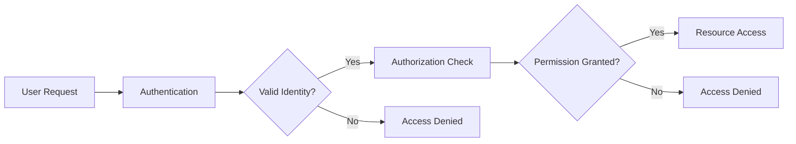

**મુખ્ય વિશેષતાઓ:**

- સીમલેસ ઍક્સેસ માટે **Single Sign-On (SSO)**
- વધારેલી સુરક્ષા માટે **Multi-Factor Authentication (MFA)**
- ઍક્સેસ નિયંત્રણ માટે **પોલિસી મેનેજમેન્ટ**
- કોમ્પ્લાયન્સ ટ્રેકિંગ માટે **ઓડિટ લોગિંગ**

**સુરક્ષા ફાયદાઓ:**

- **કેન્દ્રીકૃત** ઓળખ મેનેજમેન્ટ
- **ઘટેલા** સુરક્ષા જોખમો
- નિયમોનું **કોમ્પ્લાયન્સ**
- **સુધારેલ** યુઝર અનુભવ

**મેમરી ટ્રીક:** "AURU" - Authentication, Authorization, User management, Role-based access

---

## પ્રશ્ન 2(અ) OR [3 ગુણ]

**ક્લાઉડમાં Access control અને authentication ની જરૂરિયાત.**

**જવાબ**:

**Access Control અને Authentication ની જરૂરિયાત:**

| જરૂરિયાત | કારણ |
|----------|-------|
| **ડેટા પ્રોટેક્શન** | સંવેદનશીલ ડેટાની અનધિકૃત ઍક્સેસ અટકાવવા |
| **રેગ્યુલેટરી કોમ્પ્લાયન્સ** | કાનૂની અને ઉદ્યોગ આવશ્યકતાઓ પૂરી કરવા |
| **રિસોર્સ સિક્યુરિટી** | કોણ ક્લાઉડ રિસોર્સ વાપરી શકે તે નિયંત્રિત કરવા |
| **કોસ્ટ મેનેજમેન્ટ** | અનધિકૃત રિસોર્સ વપરાશ અટકાવવા |

**મેમરી ટ્રીક:** "DRRC" - Data protection, Regulatory compliance, Resource security, Cost management

---

## પ્રશ્ન 2(બ) OR [4 ગુણ]

**PaaS વિગતે સમજાવો.**

**જવાબ**:

**Platform as a Service (PaaS)** એ ક્લાઉડ-બેઝ્ડ પ્લેટફોર્મ છે જે ગ્રાહકોને અંતર્ગત ઇન્ફ્રાસ્ટ્રક્ચર સાથે વ્યવહાર કર્યા વગર એપ્લિકેશન ડેવલપ, ચલાવવા અને મેનેજ કરવાની મંજૂરી આપે છે.

**PaaS ઘટકો:**

| ઘટક | વર્ણન |
|------|--------|
| **ડેવલપમેન્ટ ટૂલ્સ** | IDEs, debuggers, compilers |
| **રનટાઇમ એન્વાયરનમેન્ટ** | એપ્લિકેશન એક્ઝિક્યુશન પ્લેટફોર્મ |
| **ડેટાબેઝ મેનેજમેન્ટ** | બિલ્ટ-ઇન ડેટાબેઝ સેવાઓ |
| **મિડલવેર** | ઇન્ટિગ્રેશન અને કોમ્યુનિકેશન સેવાઓ |

**PaaS આર્કિટેક્ચર:**

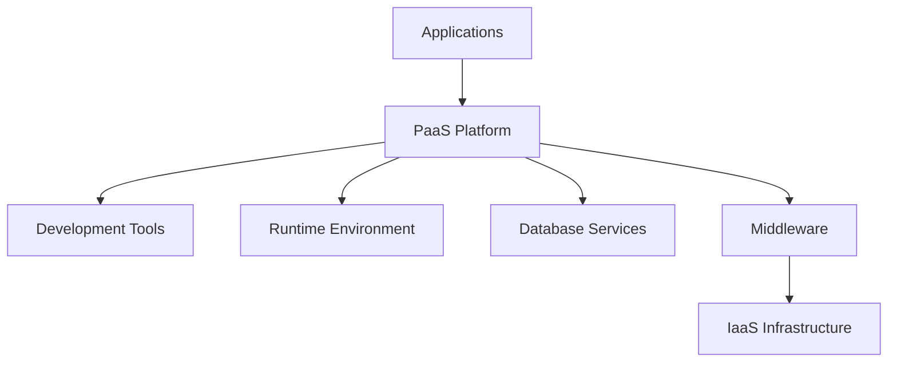

**ફાયદાઓ:**

- **ઝડપી** એપ્લિકેશન ડેવલપમેન્ટ
- **ઘટેલી** જટિલતા
- **બિલ્ટ-ઇન** સ્કેલેબિલિટી

**મેમરી ટ્રીક:** "DRDM" - Development tools, Runtime, Database, Middleware

---

## પ્રશ્ન 2(ક) OR [7 ગુણ]

**DevSecOps વિગતે સમજાવો.**

**જવાબ**:

**DevSecOps** એ DevOps પ્રક્રિયામાં સિક્યુરિટી પ્રેક્ટિસ ઇન્ટિગ્રેટ કરે છે, જે સમગ્ર ડેવલપમેન્ટ લાઇફસાઇકલ દરમિયાન સિક્યુરિટીને સહેજ જવાબદારી બનાવે છે.

**DevSecOps સિદ્ધાંતો:**

| સિદ્ધાંત | વર્ણન |
|---------|--------|
| **Shift Left** | ડેવલપમેન્ટમાં વહેલી સિક્યુરિટી ઇન્ટિગ્રેટ કરવી |
| **ઓટોમેશન** | ઓટોમેટેડ સિક્યુરિટી ટેસ્ટિંગ અને કોમ્પ્લાયન્સ |
| **કોલેબોરેશન** | સિક્યુરિટી ટીમો ડેવલપમેન્ટ અને ઓપરેશન સાથે કામ કરે છે |
| **સતત મોનિટરિંગ** | ચાલુ સિક્યુરિટી મૂલ્યાંકન |

**DevSecOps પાઇપલાઇન:**

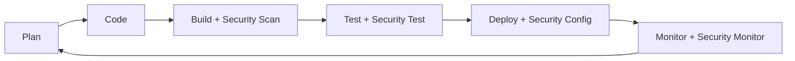

**સિક્યુરિટી ઇન્ટિગ્રેશન પોઇન્ટ્સ:**

- ડેવલપમેન્ટ દરમિયાન **કોડ એનાલિસિસ**
- CI/CD પાઇપલાઇનમાં **વલ્નરેબિલિટી સ્કેનિંગ**
- ડિપ્લોયમેન્ટ પહેલાં **કોમ્પ્લાયન્સ ચેક**
- પ્રોડક્શનમાં **રનટાઇમ પ્રોટેક્શન**

**ફાયદાઓ:**

- **વહેલી** વલ્નરેબિલિટી ડિટેક્શન
- **ઝડપી** સિક્યુરિટી ફિક્સ
- **ઘટેલો** સિક્યુરિટી ડેટ
- **સુધારેલ** કોમ્પ્લાયન્સ

**મેમરી ટ્રીક:** "SACM" - Shift left, Automation, Collaboration, Monitoring

---

## પ્રશ્ન 3(અ) [3 ગુણ]

**Edge Computing મહત્વનું કેમ છે?**

**જવાબ**:

**Edge Computing નું મહત્વ:**

| ફાયદો | વર્ણન |
|--------|--------|
| **ઘટાડેલ લેટન્સી** | સ્રોતની નજીક ડેટા પ્રોસેસિંગ |
| **બેન્ડવિડ્થ ઓપ્ટિમાઇઝેશન** | ક્લાઉડ પર ઓછા ડેટા ટ્રાન્સમિશન |
| **રિયલ-ટાઇમ પ્રોસેસિંગ** | ક્રિટિકલ એપ્લિકેશન માટે તત્કાલ પ્રતિસાદ |
| **ડેટા પ્રાઇવેસી** | સ્થાનિક પ્રોસેસિંગ સંવેદનશીલ ડેટાને સ્થાનિક રાખે છે |

**મેમરી ટ્રીક:** "RBRD" - Reduced latency, Bandwidth optimization, Real-time processing, Data privacy

---

## પ્રશ્ન 3(બ) [4 ગુણ]

**ડેટા સેન્ટર વ્યાખ્યાયિત કરો. ડેટા સેન્ટરના પ્રકારોની યાદી આપો. કોઈ એક સમજાવો.**

**જવાબ**:

**ડેટા સેન્ટર** એ IT ઓપરેશન માટે કમ્પ્યુટર સિસ્ટમ, સ્ટોરેજ સિસ્ટમ, નેટવર્કિંગ સાધનો અને સહાયક ઇન્ફ્રાસ્ટ્રક્ચર રાખતી સુવિધા છે.

**ડેટા સેન્ટરના પ્રકારો:**

| પ્રકાર | વર્ણન |
|------|--------|
| **એન્ટરપ્રાઇઝ** | સંસ્થાઓ દ્વારા માલિકી ધરાવતા ખાનગી ડેટા સેન્ટર |
| **કોલોકેશન** | બહુવિધ ભાડૂતોને જગ્યા ભાડે આપતી સહેજ સુવિધા |
| **હાઇપરસ્કેલ** | ક્લાઉડ પ્રદાતાઓ માટે મોટા પાયે સુવિધાઓ |
| **એજ** | અંતિમ વપરાશકર્તાઓની નજીક નાની સુવિધાઓ |

**એન્ટરપ્રાઇઝ ડેટા સેન્ટર (વિગતવાર):**

- ઇન્ફ્રાસ્ટ્રક્ચર પર **સંપૂર્ણ નિયંત્રણ**
- સંસ્થાની જરૂરિયાતો માટે **કસ્ટમાઇઝ્ડ**
- **ઉચ્ચ સુરક્ષા** અને કોમ્પ્લાયન્સ
- **નોંધપાત્ર** મૂડી રોકાણ જરૂરી

**ડેટા સેન્ટર આર્કિટેક્ચર:**

```goat
┌─────────────────────────────────────────┐
│              Data Center                │
│  ┌─────────┐  ┌─────────┐  ┌─────────┐  │
│  │ Server  │  │ Storage │  │ Network │  │
│  │  Racks  │  │  Systems│  │ Equip.  │  │
│  └─────────┘  └─────────┘  └─────────┘  │
│  ┌─────────────────────────────────────┐ │
│  │     Power & Cooling Systems         │ │
│  └─────────────────────────────────────┘ │
└─────────────────────────────────────────┘
```

**મેમરી ટ્રીક:** "ECHE" - Enterprise, Colocation, Hyperscale, Edge

---

## પ્રશ્ન 3(ક) [7 ગુણ]

**ક્લાઉડ ડેટાબેઝના પ્રકારો વિગતે સમજાવો.**

**જવાબ**:

**ક્લાઉડ ડેટાબેઝના પ્રકારો:**

**1. SQL ડેટાબેઝ (રિલેશનલ):**

- **સ્ટ્રક્ચર:** પૂર્વ-નિર્ધારિત સ્કીમા સાથે ટેબલ-આધારિત
- **ACID ગુણધર્મો:** ડેટા સુસંગતતા સુનિશ્ચિત કરે છે
- **ઉદાહરણો:** Amazon RDS, Google Cloud SQL

**2. NoSQL ડેટાબેઝ:**

| NoSQL પ્રકાર | વર્ણન | ઉપયોગ કેસ |
|-------------|--------|-----------|
| **ડોક્યુમેન્ટ** | JSON જેવા દસ્તાવેજો | કન્ટેન્ટ મેનેજમેન્ટ, કેટાલોગ |
| **કી-વેલ્યુ** | સરળ કી-વેલ્યુ જોડી | સેશન મેનેજમેન્ટ, કેશિંગ |
| **કોલમ-ફેમિલી** | વાઇડ કોલમ સ્ટોરેજ | એનાલિટિક્સ, ટાઇમ-સીરીઝ ડેટા |
| **ગ્રાફ** | નોડ્સ અને સંબંધો | સોશિયલ નેટવર્ક, રેકમેન્ડેશન |

**ડેટાબેઝ તુલના:**

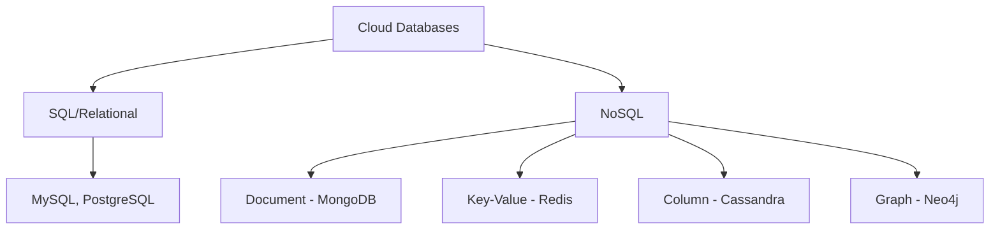

**પસંદગીના માપદંડો:**

- **ડેટા સ્ટ્રક્ચર** આવશ્યકતાઓ
- **સ્કેલેબિલિટી** જરૂરિયાતો
- **કોન્સિસ્ટન્સી** આવશ્યકતાઓ
- **પ્રદર્શન** અપેક્ષાઓ

**ફાયદાઓ:**

- **મેનેજ્ડ** સેવાઓ ઓપરેશનલ ઓવરહેડ ઘટાડે છે
- **ઓટોમેટિક** સ્કેલિંગ અને બેકઅપ
- **ગ્લોબલ** ડિસ્ટ્રિબ્યુશન ક્ષમતાઓ
- **કોસ્ટ-ઇફેક્ટિવ** પે-પર-યુઝ મોડલ

**મેમરી ટ્રીક:** "DKCG" - Document, Key-value, Column-family, Graph

---

## પ્રશ્ન 3(અ) OR [3 ગુણ]

**ક્લાઉડ કમ્પ્યુટિંગમાં મશીન લર્નિંગની ભૂમિકા શું છે? તે સમજાવો.**

**જવાબ**:

**ક્લાઉડ કમ્પ્યુટિંગમાં મશીન લર્નિંગની ભૂમિકા:**

| ભૂમિકા | વર્ણન |
|-------|--------|
| **રિસોર્સ ઓપ્ટિમાઇઝેશન** | રિસોર્સ ફાળવણીની આગાહી અને ઓપ્ટિમાઇઝેશન |
| **સિક્યુરિટી એન્હાન્સમેન્ટ** | અસામાન્યતા અને ધમકીઓ શોધવા |
| **કોસ્ટ મેનેજમેન્ટ** | ખર્ચ અને વપરાશ પેટર્ન ઓપ્ટિમાઇઝ કરવા |
| **પ્રદર્શન મોનિટરિંગ** | સિસ્ટમ નિષ્ફળતાની આગાહી અને અટકાવવી |

**મેમરી ટ્રીક:** "RSCP" - Resource optimization, Security enhancement, Cost management, Performance monitoring

---

## પ્રશ્ન 3(બ) OR [4 ગુણ]

**ક્લાઉડ સ્કેલેબિલિટી શું છે? વિગતે સમજાવો.**

**જવાબ**:

**ક્લાઉડ સ્કેલેબિલિટી** એ પ્રદર્શનને અસર કર્યા વગર માંગ પર આધારિત કમ્પ્યુટિંગ રિસોર્સ ગતિશીલ રીતે વધારવા અથવા ઘટાડવાની ક્ષમતા છે.

**સ્કેલેબિલિટી પ્રકારો:**

| પ્રકાર | વર્ણન | પદ્ધતિ |
|------|--------|--------|
| **વર્ટિકલ (સ્કેલ અપ)** | હાલના મશીનમાં વધુ પાવર ઉમેરવો | CPU, RAM, સ્ટોરેજ અપગ્રેડ |
| **હોરિઝોન્ટલ (સ્કેલ આઉટ)** | રિસોર્સ પુલમાં વધુ મશીનો ઉમેરવા | લોડ ડિસ્ટ્રિબ્યુશન |

**સ્કેલેબિલિટી પ્રક્રિયા:**

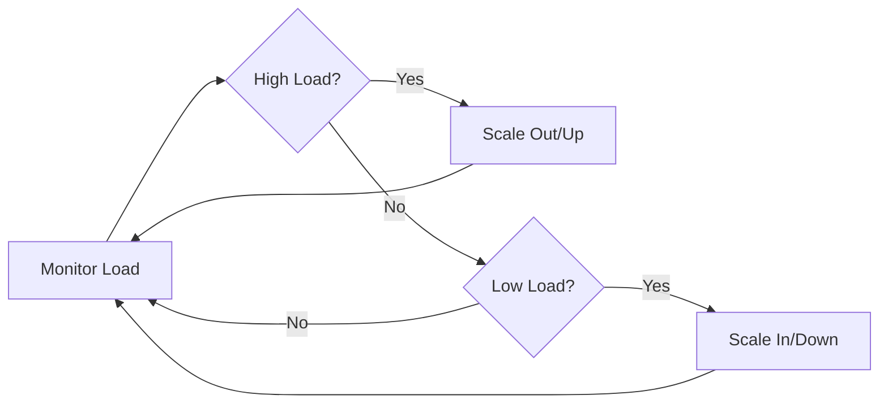

**ફાયદાઓ:**

- ગતિશીલ રિસોર્સ ફાળવણી દ્વારા **કોસ્ટ કાર્યક્ષમતા**
- પીક લોડ દરમિયાન **પ્રદર્શન** જાળવણી
- **ઉપલબ્ધતા** સુધારો

**મેમરી ટ્રીક:** "VH" - Vertical scaling, Horizontal scaling

---

## પ્રશ્ન 3(ક) OR [7 ગુણ]

**ડેટા કોન્સિસ્ટન્સી અને ડ્યુરેબિલિટી વિગતે સમજાવો.**

**જવાબ**:

**ડેટા કોન્સિસ્ટન્સી** એ ખાતરી કરે છે કે બધા નોડ્સ વિતરિત સિસ્ટમમાં એક જ સમયે સમાન ડેટા જુએ.

**ડેટા ડ્યુરેબિલિટી** એ સિસ્ટમ નિષ્ફળતાના કિસ્સામાં પણ ડેટા પર્સિસ્ટન્સની ગેરંટી આપે છે.

**કોન્સિસ્ટન્સી મોડલ્સ:**

| મોડલ | વર્ણન | ઉપયોગ કેસ |
|------|--------|-----------|
| **સ્ટ્રોંગ** | બધા રીડ્સ સૌથી તાજેતરના લેખન મેળવે છે | ફાઇનાન્શિયલ સિસ્ટમ |
| **ઇવેન્ચ્યુઅલ** | સમય સાથે સિસ્ટમ કોન્સિસ્ટન્ટ બને છે | સોશિયલ મીડિયા |
| **વીક** | કોન્સિસ્ટન્સી ક્યારે થશે તેની કોઈ ગેરંટી નથી | ગેમિંગ, રિયલ-ટાઇમ |

**ડ્યુરેબિલિટી મેકેનિઝમ્સ:**

| મેકેનિઝમ | વર્ણન |
|---------|--------|
| **રેપ્લિકેશન** | વિવિધ સ્થાનોમાં બહુવિધ કોપીઝ |
| **બેકઅપ** | નિયમિત ડેટા સ્નેપશોટ |
| **રિડન્ડન્સી** | RAID, erasure coding |
| **વર્ઝનિંગ** | ડેટાના બહુવિધ વર્ઝન |

**CAP થિયોરમ:**

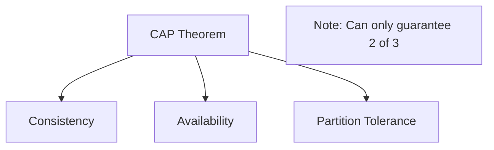

**અમલીકરણ વ્યૂહરચનાઓ:**

- ડ્યુરેબિલિટી માટે **મલ્ટી-રીજન** રેપ્લિકેશન
- ઉપલબ્ધતા માટે **કોરમ-આધારિત** કોન્સિસ્ટન્સી
- ડેટા ઇન્ટિગ્રિટી માટે **ચેકસમ્સ**
- રિકવરી માટે **ટ્રાન્ઝેક્શન લોગ્સ**

**મેમરી ટ્રીક:** "SEWR" - Strong consistency, Eventual consistency, Weak consistency, Replication strategies

---

## પ્રશ્ન 4(અ) [3 ગુણ]

**ડેટા સ્કેલિંગની ભૂમિકા લખો.**

**જવાબ**:

**ડેટા સ્કેલિંગની ભૂમિકા:**

| ભૂમિકા | વર્ણન |
|-------|--------|
| **પ્રદર્શન જાળવણી** | વધેલા ડેટા વોલ્યુમને કાર્યક્ષમ રીતે હેન્ડલ કરવું |
| **સ્ટોરેજ ઓપ્ટિમાઇઝેશન** | બહુવિધ સિસ્ટમ્સમાં ડેટા વિતરણ |
| **ક્વેરી પ્રદર્શન** | ઝડપી ડેટા રિટ્રીવલ સ્પીડ જાળવવી |
| **કોસ્ટ મેનેજમેન્ટ** | સ્ટોરેજ કોસ્ટ સાથે પ્રદર્શનનું સંતુલન |

**મેમરી ટ્રીક:** "PSQC" - Performance, Storage optimization, Query performance, Cost management

---

## પ્રશ્ન 4(બ) [4 ગુણ]

**Kubernetes વ્યાખ્યાયિત કરો. કારણ સાથે સમજાવો: Kubernetes એ cloud computing નો આવશ્યક ભાગ છે.**

**જવાબ**:

**Kubernetes** એ ઓપન-સોર્સ કન્ટેનર ઓર્કેસ્ટ્રેશન પ્લેટફોર્મ છે જે કન્ટેનરાઇઝ્ડ એપ્લિકેશનોના ડિપ્લોયમેન્ટ, સ્કેલિંગ અને મેનેજમેન્ટને ઓટોમેટ કરે છે.

**Kubernetes ક્લાઉડ કમ્પ્યુટિંગ માટે કેમ આવશ્યક છે:**

| કારણ | સમજાવટ |
|------|--------|
| **કન્ટેનર ઓર્કેસ્ટ્રેશન** | ક્લસ્ટર્સમાં બહુવિધ કન્ટેનરોનું સંચાલન |
| **ઓટો-સ્કેલિંગ** | માંગ પર આધારિત રિસોર્સ ગતિશીલ ગોઠવણી |
| **સર્વિસ ડિસ્કવરી** | ઓટોમેટિક લોડ બેલેન્સિંગ અને નેટવર્કિંગ |
| **સેલ્ફ-હીલિંગ** | નિષ્ફળ કન્ટેનર્સને ઓટોમેટિક રીતે બદલવા |

**Kubernetes આર્કિટેક્ચર:**

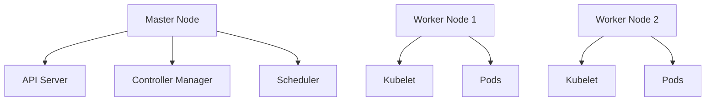

**આવશ્યક ફાયદાઓ:**

- ક્લાઉડ પ્રોવાઇડર્સમાં **પ્લેટફોર્મ સ્વતંત્રતા**
- કન્ટેનર ડેન્સિટી દ્વારા **રિસોર્સ કાર્યક્ષમતા**
- CI/CD પાઇપલાઇન્સ સાથે **DevOps ઇન્ટિગ્રેશન**

**મેમરી ટ્રીક:** "CASS" - Container orchestration, Auto-scaling, Service discovery, Self-healing

---

## પ્રશ્ન 4(ક) [7 ગુણ]

**ડેટા સેન્ટર નેટવર્ક ટોપોલોજીઝ સમજાવો.**

**જવાબ**:

**ડેટા સેન્ટર નેટવર્ક ટોપોલોજીઝ** એ ડેટા સેન્ટરની અંદર નેટવર્ક ઘટકો કેવી રીતે એકબીજા સાથે જોડાયેલા છે તે વ્યાખ્યાયિત કરે છે.

**સામાન્ય ટોપોલોજીઝ:**

| ટોપોલોજી | વર્ણન | ફાયદાઓ | નુકસાન |
|---------|--------|---------|---------|
| **થ્રી-ટાયર** | કોર, એગ્રિગેશન, એક્સેસ લેયર | સરળ, હાયરાર્કિકલ | મર્યાદિત સ્કેલેબિલિટી |
| **સ્પાઇન-લીફ** | નોન-બ્લોકિંગ, ફ્લેટ આર્કિટેક્ચર | ઉચ્ચ બેન્ડવિડ્થ, સ્કેલેબલ | જટિલ કોન્ફિગરેશન |
| **ફેટ ટ્રી** | બહુવિધ પાથ સાથે ટ્રી સ્ટ્રક્ચર | સારી ફોલ્ટ ટોલરન્સ | ઓવરસબસ્ક્રિપ્શન સમસ્યાઓ |

**સ્પાઇન-લીફ આર્કિટેક્ચર:**

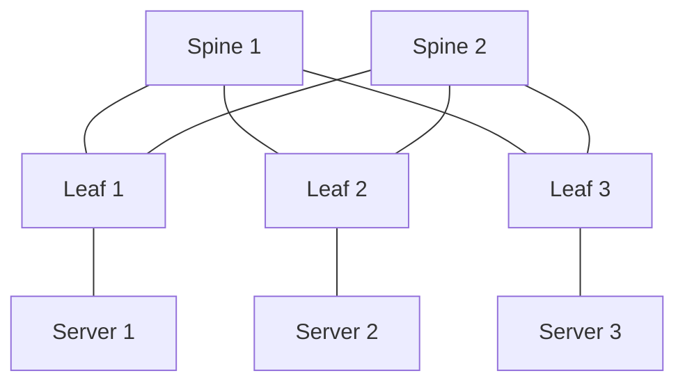

**આધુનિક ટ્રેન્ડ્સ:**

- પ્રોગ્રામેબલ નેટવર્ક માટે **Software-Defined Networking (SDN)**
- લવચીક સેવાઓ માટે **Network Function Virtualization (NFV)**
- વધારેલી સુરક્ષા માટે **માઇક્રો-સેગમેન્ટેશન**

**પસંદગીના માપદંડો:**

- **બેન્ડવિડ્થ** આવશ્યકતાઓ
- **લેટન્સી** સંવેદનશીલતા
- **સ્કેલેબિલિટી** જરૂરિયાતો
- **કોસ્ટ** વિચારણાઓ

**આધુનિક ટોપોલોજીઝના ફાયદાઓ:**

- **નોન-બ્લોકિંગ** કોમ્યુનિકેશન પાથ
- **ઇક્વલ-કોસ્ટ** મલ્ટિ-પાથ રાઉટિંગ
- **હોરિઝોન્ટલ** સ્કેલિંગ ક્ષમતા
- **ઘટાડેલ** નેટવર્ક કન્જેશન

**મેમરી ટ્રીક:** "TSF" - Three-tier, Spine-leaf, Fat tree

---

## પ્રશ્ન 4(અ) OR [3 ગુણ]

**ક્લાઉડમાં ફાઇલ સ્ટોરેજ સમજાવો.**

**જવાબ**:

**ક્લાઉડમાં ફાઇલ સ્ટોરેજ સમજાવો.**

**જવાબ**:

**ક્લાઉડ ફાઇલ સ્ટોરેજ** એ પરંપરાગત ફાઇલ સિસ્ટમ જેવું જ હાયરાર્કિકલ ફાઇલ સિસ્ટમ એક્સેસ નેટવર્ક પર પ્રદાન કરે છે.

**લાક્ષણિકતાઓ:**

| વિશેષતા | વર્ણન |
|---------|--------|
| **હાયરાર્કિકલ સ્ટ્રક્ચર** | ફોલ્ડર અને સબફોલ્ડર સંગઠન |
| **POSIX કોમ્પ્લાયન્સ** | સ્ટાન્ડર્ડ ફાઇલ સિસ્ટમ ઇન્ટરફેસ |
| **નેટવર્ક એક્સેસ** | SMB, NFS પ્રોટોકોલ સપોર્ટ |
| **શેર્ડ એક્સેસ** | બહુવિધ યુઝર્સ એક સાથે એક્સેસ કરી શકે છે |

**મેમરી ટ્રીક:** "HPNS" - Hierarchical, POSIX-compliant, Network access, Shared access

---

## પ્રશ્ન 4(બ) OR [4 ગુણ]

**સર્વરલેસ કમ્પ્યુટિંગ સમજાવો.**

**જવાબ**:

**સર્વરલેસ કમ્પ્યુટિંગ** એ ક્લાઉડ કમ્પ્યુટિંગ મોડલ છે જ્યાં ક્લાઉડ પ્રોવાઇડર્સ ઓટોમેટિક રીતે સર્વર ઇન્ફ્રાસ્ટ્રક્ચરનું સંચાલન કરે છે, જે ડેવલપર્સને કોડ પર ધ્યાન આપવાની મંજૂરી આપે છે.

**મુખ્ય વિશેષતાઓ:**

| વિશેષતા | વર્ણન |
|---------|--------|
| **ઇવેન્ટ-ડ્રિવન** | ઇવેન્ટ્સ દ્વારા ટ્રિગર થતા ફંક્શન્સ |
| **ઓટો-સ્કેલિંગ** | ઓટોમેટિક રિસોર્સ ફાળવણી |
| **પે-પર-એક્ઝિક્યુશન** | વાસ્તવિક ઉપયોગ પર આધારિત બિલિંગ |
| **સ્ટેટલેસ** | ફંક્શન્સ સ્ટેટ જાળવતા નથી |

**સર્વરલેસ આર્કિટેક્ચર:**

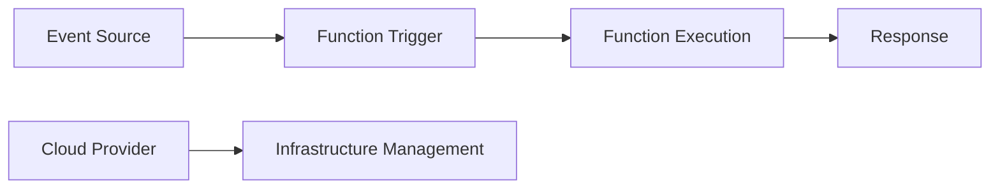

**ફાયદાઓ:**

- **કોઈ સર્વર મેનેજમેન્ટ** જરૂરી નથી
- વેરિયેબલ વર્કલોડ માટે **કોસ્ટ કાર્યક્ષમતા**
- **ઝડપી સ્કેલિંગ** ક્ષમતાઓ

**મેમરી ટ્રીક:** "EAPS" - Event-driven, Auto-scaling, Pay-per-execution, Stateless

---

## પ્રશ્ન 4(ક) OR [7 ગુણ]

**SDN (Software Defined Networking) આર્કિટેક્ચર સમજાવો.**

**જવાબ**:

**Software Defined Networking (SDN)** એ નેટવર્ક કંટ્રોલ પ્લેનને ડેટા પ્લેનથી અલગ કરે છે, જે સોફ્ટવેર દ્વારા કેન્દ્રીકૃત નેટવર્ક મેનેજમેન્ટને સક્ષમ બનાવે છે.

**SDN આર્કિટેક્ચર લેયર્સ:**

| લેયર | કાર્ય | ઘટકો |
|------|------|-------|
| **એપ્લિકેશન લેયર** | નેટવર્ક એપ્લિકેશન અને સેવાઓ | ફાયરવૉલ, લોડ બેલેન્સર |
| **કંટ્રોલ લેયર** | કેન્દ્રીકૃત નેટવર્ક ઇન્ટેલિજન્સ | SDN કંટ્રોલર |
| **ઇન્ફ્રાસ્ટ્રક્ચર લેયર** | નેટવર્ક ફોરવર્ડિંગ ઉપકરણો | સ્વિચ, રાઉટર |

**SDN આર્કિટેક્ચર ડાયાગ્રામ:**

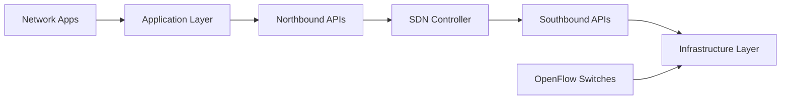

**મુખ્ય પ્રોટોકોલ્સ:**

- **OpenFlow:** કંટ્રોલર અને સ્વિચ વચ્ચે કોમ્યુનિકેશન
- **NETCONF:** નેટવર્ક કોન્ફિગરેશન પ્રોટોકોલ
- **REST APIs:** નોર્થબાઉન્ડ એપ્લિકેશન ઇન્ટરફેસ

**SDN ફાયદાઓ:**

| ફાયદો | વર્ણન |
|--------|--------|
| **કેન્દ્રીકૃત નિયંત્રણ** | નેટવર્ક મેનેજમેન્ટનું એક બિંદુ |
| **પ્રોગ્રામેબિલિટી** | સોફ્ટવેર-આધારિત નેટવર્ક કોન્ફિગરેશન |
| **લવચીકતા** | ગતિશીલ નેટવર્ક રિકોન્ફિગરેશન |
| **કોસ્ટ રિડક્શન** | કમોડિટી હાર્ડવેર ઉપયોગ |

**ઉપયોગ કેસ:**

- **ડેટા સેન્ટર** નેટવર્કિંગ
- **કેમ્પસ** નેટવર્ક
- **વાઇડ એરિયા** નેટવર્ક
- **નેટવર્ક ફંક્શન** વર્ચ્યુઅલાઇઝેશન

**પડકારો:**

- **સિંગલ પોઇન્ટ** ઓફ ફેલ્યોર (કંટ્રોલર)
- **સ્કેલેબિલિટી** ચિંતાઓ
- **સિક્યુરિટી** વિચારણાઓ
- **વેન્ડર** ઇન્ટરઓપરેબિલિટી

**મેમરી ટ્રીક:** "ACI" - Application layer, Control layer, Infrastructure layer

---

## પ્રશ્ન 5(અ) [3 ગુણ]

**Infrastructure as Code (IaC) વિગતે સમજાવો.**

**જવાબ**:

**Infrastructure as Code (IaC)** એ મેન્યુઅલ પ્રક્રિયાઓને બદલે મશીન-રીડેબલ ડેફિનિશન ફાઇલો દ્વારા કમ્પ્યુટિંગ ઇન્ફ્રાસ્ટ્રક્ચરનું સંચાલન અને પ્રોવિઝન કરે છે.

**IaC લાક્ષણિકતાઓ:**

| લાક્ષણિકતા | વર્ણન |
|-------------|--------|
| **વર્ઝન કંટ્રોલ** | રિપોઝિટરીમાં સ્ટોર થતી ઇન્ફ્રાસ્ટ્રક્ચર ડેફિનિશન |
| **ઓટોમેશન** | ઓટોમેટેડ ડિપ્લોયમેન્ટ અને મેનેજમેન્ટ |
| **કોન્સિસ્ટન્સી** | ડિપ્લોયમેન્ટ્સમાં સમાન વાતાવરણ |
| **રિપીટેબિલિટી** | પુનઃઉત્પાદનક્ષમ ઇન્ફ્રાસ્ટ્રક્ચર સેટઅપ |

**મેમરી ટ્રીક:** "VACR" - Version control, Automation, Consistency, Repeatability

---

## પ્રશ્ન 5(બ) [4 ગુણ]

**SLA નું ફુલ ફોર્મ આપો અને વિગતે સમજાવો.**

**જવાબ**:

**SLA - Service Level Agreement**

**SLA ડેફિનિશન:** સર્વિસ પ્રોવાઇડર અને ગ્રાહક વચ્ચેનો કરાર જે અપેક્ષિત સર્વિસ લેવલ અને પ્રદર્શન મેટ્રિક્સ વ્યાખ્યાયિત કરે છે.

**SLA ઘટકો:**

| ઘટક | વર્ણન |
|------|--------|
| **ઉપલબ્ધતા** | અપટાઇમ ટકાવારી (99.9%, 99.99%) |
| **પ્રદર્શન** | રિસ્પોન્સ ટાઇમ, થ્રુપુટ મેટ્રિક્સ |
| **સપોર્ટ** | સમસ્યાઓ માટે રિસ્પોન્સ ટાઇમ |
| **પેનાલ્ટીઝ** | SLA ઉલ્લંઘન માટે વળતર |

**SLA મેટ્રિક્સ:**

```goat
┌─────────────────┐    ┌─────────────────┐
│   Availability  │    │   Performance   │
│     99.99%      │    │   < 200ms       │
└─────────────────┘    └─────────────────┘
         │                       │
         └───────────┬───────────┘
                     │
            ┌─────────────────┐
            │       SLA       │
            │   Requirements  │
            └─────────────────┘
```

**ફાયદાઓ:**

- બન્ને પક્ષો માટે **સ્પષ્ટ અપેક્ષાઓ**
- **પ્રદર્શન** મેઝરમેન્ટ સ્ટાન્ડર્ડ્સ
- પેનાલ્ટીઝ દ્વારા **રિસ્ક મિટિગેશન**

**મેમરી ટ્રીક:** "APSP" - Availability, Performance, Support, Penalties

---

## પ્રશ્ન 5(ક) [7 ગુણ]

**હાઇપરવાઇઝર્સ વિગતે સમજાવો.**

**જવાબ**:

**હાઇપરવાઇઝર** (વર્ચ્યુઅલ મશીન મોનિટર) એ સોફ્ટવેર છે જે ભૌતિક હાર્ડવેરને અમૂર્ત બનાવીને વર્ચ્યુઅલ મશીનો બનાવે અને મેનેજ કરે છે.

**હાઇપરવાઇઝરના પ્રકારો:**

| પ્રકાર | વર્ણન | ઉદાહરણો | લાક્ષણિકતાઓ |
|------|--------|---------|---------------|
| **ટાઇપ 1 (બેર મેટલ)** | સીધું હાર્ડવેર પર ચાલે છે | VMware vSphere, Hyper-V | બહેતર પ્રદર્શન, એન્ટરપ્રાઇઝ ઉપયોગ |
| **ટાઇપ 2 (હોસ્ટેડ)** | હોસ્ટ ઓપરેટિંગ સિસ્ટમ પર ચાલે છે | VirtualBox, VMware Workstation | સરળ સેટઅપ, ડેસ્કટોપ ઉપયોગ |

**હાઇપરવાઇઝર આર્કિટેક્ચર:**

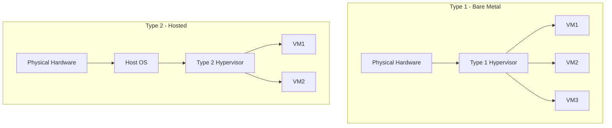

**હાઇપરવાઇઝર કાર્યો:**

| કાર્ય | વર્ણન |
|------|--------|
| **રિસોર્સ ફાળવણી** | CPU, મેમરી, સ્ટોરેજ વિતરણ |
| **આઇસોલેશન** | અલગ VM વાતાવરણ |
| **હાર્ડવેર અમૂર્તીકરણ** | વર્ચ્યુઅલ હાર્ડવેર પ્રેઝન્ટેશન |
| **VM લાઇફસાઇકલ મેનેજમેન્ટ** | VM બનાવવા, શરૂ કરવા, બંધ કરવા, ડિલીટ કરવા |

**વર્ચ્યુઅલાઇઝેશન તકનીકો:**

- **હાર્ડવેર-એસિસ્ટેડ** વર્ચ્યુઅલાઇઝેશન (Intel VT-x, AMD-V)
- સુધારેલ પ્રદર્શન માટે **પેરાવર્ચ્યુઅલાઇઝેશન**
- સુસંગતતા માટે **બાઇનરી ટ્રાન્સલેશન**

**પ્રદર્શન વિચારણાઓ:**

- વર્ચ્યુઅલાઇઝેશન લેયરથી **CPU ઓવરહેડ**
- વર્ચ્યુઅલ મેમરી સાથે **મેમરી મેનેજમેન્ટ**
- સ્ટોરેજ અને નેટવર્ક માટે **I/O ઓપ્ટિમાઇઝેશન**
- VM વચ્ચે **રિસોર્સ શેડ્યુલિંગ**

**ફાયદાઓ:**

- હાર્ડવેર કોસ્ટ ઘટાડીને **સર્વર કન્સોલિડેશન**
- VM સ્નેપશોટ દ્વારા **ડિઝાસ્ટર રિકવરી**
- ઝડપી પ્રોવિઝનિંગ **ટેસ્ટિંગ એન્વાયરનમેન્ટ**
- લીગેસી એપ્લિકેશન **સપોર્ટ**

**પડકારો:**

- બેર મેટલ સરખામણીમાં **પ્રદર્શન ઓવરહેડ**
- મેનેજમેન્ટમાં **જટિલતા**
- એન્ટરપ્રાઇઝ હાઇપરવાઇઝર્સ માટે **લાઇસન્સિંગ કોસ્ટ**
- શેર્ડ રિસોર્સીસ માટે **સિક્યુરિટી** વિચારણાઓ

**મેમરી ટ્રીક:** "RAIH" - Resource allocation, isolation, Hardware abstraction

---

## પ્રશ્ન 5(અ) OR [3 ગુણ]

**ડેટા સેન્ટર્સમાં ઓટોમેશન શું છે? વિગતે સમજાવો.**

**જવાબ**:

**ડેટા સેન્ટર ઓટોમેશન** એ મેન્યુઅલ હસ્તક્ષેપ વગર નિયમિત કાર્યો ઓટોમેટિક રીતે કરવા માટે સોફ્ટવેર અને ટેકનોલોજીઝનો ઉપયોગ છે.

**ઓટોમેશન વિસ્તારો:**

| વિસ્તાર | વર્ણન |
|--------|--------|
| **પ્રોવિઝનિંગ** | ઓટોમેટિક સર્વર અને સર્વિસ ડિપ્લોયમેન્ટ |
| **મોનિટરિંગ** | સતત પ્રદર્શન અને હેલ્થ ટ્રેકિંગ |
| **સ્કેલિંગ** | ગતિશીલ રિસોર્સ ગોઠવણી |
| **મેઇન્ટેનન્સ** | ઓટોમેટેડ પેચિંગ અને અપડેટ્સ |

**મેમરી ટ્રીક:** "PMSM" - Provisioning, Monitoring, Scaling, Maintenance

---

## પ્રશ્ન 5(બ) OR [4 ગુણ]

**ક્લાઉડમાં ડેટા સિક્યુરિટી શું છે? વિગતે સમજાવો.**

**જવાબ**:

**ક્લાઉડ ડેટા સિક્યુરિટી** એ ક્લાઉડ વાતાવરણમાં સ્ટોર, પ્રોસેસ અને ટ્રાન્સમિટ થતા ડેટાને અનધિકૃત એક્સેસ, ભ્રષ્ટાચાર અને ચોરીથી સુરક્ષિત રાખવાનો સમાવેશ કરે છે.

**સિક્યુરિટી પગલાં:**

| પગલું | વર્ણન |
|------|--------|
| **એન્ક્રિપ્શન** | રેસ્ટ અને ટ્રાન્ઝિટમાં ડેટા પ્રોટેક્શન |
| **એક્સેસ કંટ્રોલ** | યુઝર ઓથેન્ટિકેશન અને ઓથરાઇઝેશન |
| **બેકઅપ એન્ડ રિકવરી** | નુકસાન સામે ડેટા પ્રોટેક્શન |
| **કોમ્પ્લાયન્સ** | નિયમનકારી આવશ્યકતાઓનું પાલન |

**સિક્યુરિટી અમલીકરણ:**

```goat
┌─────────────┐    ┌─────────────┐    ┌─────────────┐
│ Encryption  │    │   Access    │    │   Backup    │
│             │    │  Controls   │    │             │
│ AES-256     │    │ IAM/RBAC    │    │ 3-2-1 Rule  │
└─────────────┘    └─────────────┘    └─────────────┘
       │                    │                    │
       └────────────────────┼────────────────────┘
                            │
                   ┌─────────────┐
                   │    Data     │
                   │  Security   │
                   └─────────────┘
```

**બેસ્ટ પ્રેક્ટિસ:**

- **ઝીરો-ટ્રસ્ટ** સિક્યુરિટી મોડલ
- **નિયમિત** સિક્યુરિટી ઓડિટ
- **ડેટા ક્લાસિફિકેશન** અને હેન્ડલિંગ

**મેમરી ટ્રીક:** "EABC" - Encryption, Access controls, Backup, Compliance

---

## પ્રશ્ન 5(ક) OR [7 ગુણ]

**વર્ચ્યુઅલ મશીન્સ શું છે? વર્ચ્યુઅલ મશીન્સ બનાવવા અને મેનેજ કરવાના સ્ટેપ્સ સમજાવો.**

**જવાબ**:

**વર્ચ્યુઅલ મશીન (VM)** એ ભૌતિક કમ્પ્યુટરના સોફ્ટવેર-આધારિત એમ્યુલેશન છે જે અલગ વાતાવરણમાં ઓપરેટિંગ સિસ્ટમ અને એપ્લિકેશન ચલાવે છે.

**VM ઘટકો:**

| ઘટક | વર્ણન |
|------|--------|
| **વર્ચ્યુઅલ CPU** | એમ્યુલેટેડ પ્રોસેસર કોર્સ |
| **વર્ચ્યુઅલ મેમરી** | VM માટે ફાળવેલ RAM |
| **વર્ચ્યુઅલ સ્ટોરેજ** | વર્ચ્યુઅલ હાર્ડ ડિસ્ક |
| **વર્ચ્યુઅલ નેટવર્ક** | નેટવર્ક ઇન્ટરફેસ એમ્યુલેશન |

**વર્ચ્યુઅલ મશીન બનાવવાના સ્ટેપ્સ:**

**1. પ્લાનિંગ ફેઝ:**

- **રિસોર્સ એસેસમેન્ટ:** CPU, RAM, સ્ટોરેજ આવશ્યકતાઓ નક્કી કરવી
- **OS પસંદગી:** ગેસ્ટ ઓપરેટિંગ સિસ્ટમ પસંદ કરવું
- **નેટવર્ક કોન્ફિગરેશન:** IP એડ્રેસિંગ અને કનેક્ટિવિટી પ્લાન કરવી

**2. VM બનાવવાની પ્રક્રિયા:**


**3. વિગતવાર બનાવવાના સ્ટેપ્સ:**

| સ્ટેપ | એક્શન | વિગતો |
|------|--------|--------|
| **1** | **VM કન્ટેનર બનાવવું** | VM નામ અને સ્થાન વ્યાખ્યાયિત કરવું |
| **2** | **CPU ફાળવવું** | વર્ચ્યુઅલ પ્રોસેસર કોર્સ એસાઇન કરવા |
| **3** | **મેમરી એસાઇન કરવી** | RAM ફાળવવી (2GB-16GB સામાન્ય) |
| **4** | **સ્ટોરેજ બનાવવું** | વર્ચ્યુઅલ હાર્ડ ડિસ્ક સેટ કરવી |
| **5** | **નેટવર્ક સેટઅપ** | વર્ચ્યુઅલ નેટવર્ક એડેપ્ટર કોન્ફિગર કરવું |
| **6** | **OS ઇન્સ્ટોલેશન** | ગેસ્ટ ઓપરેટિંગ સિસ્ટમ ઇન્સ્ટોલ કરવું

**VM મેનેજમેન્ટ ઓપરેશન્સ:**

**પાવર મેનેજમેન્ટ:**

- **સ્ટાર્ટ/સ્ટોપ:** VM પાવર સ્ટેટ કંટ્રોલ કરવું
- **સસ્પેન્ડ/રિઝ્યુમ:** VM એક્ઝિક્યુશન પોઝ અને રિઝ્યુમ કરવું
- **રીસેટ:** VM ને ફોર્સ રીસ્ટાર્ટ કરવું

**રિસોર્સ મેનેજમેન્ટ:**

- **હોટ-એડ CPU/મેમરી:** શટડાઉન વગર રિસોર્સ ઉમેરવા
- **સ્ટોરેજ એક્સપાન્શન:** ડિસ્ક કેપાસિટી વધારવી
- **નેટવર્ક રિકોન્ફિગરેશન:** નેટવર્ક સેટિંગ્સ બદલવી

**મેઇન્ટેનન્સ ઓપરેશન્સ:**

| ઓપરેશન | હેતુ | આવર્તન |
|---------|-----|--------|
| **સ્નેપશોટ્સ** | પૉઇન્ટ-ઇન-ટાઇમ બેકઅપ | મોટા ફેરફારો પહેલાં |
| **ક્લોનિંગ** | સમાન કોપીઝ બનાવવા | સ્કેલિંગ/ટેસ્ટિંગ માટે |
| **માઇગ્રેશન** | હોસ્ટ્સ વચ્ચે VM ખસેડવું | મેઇન્ટેનન્સ માટે |
| **બેકઅપ** | ડેટા પ્રોટેક્શન | દૈનિક/સાપ્તાહિક |

**VM લાઇફસાઇકલ મેનેજમેન્ટ:**

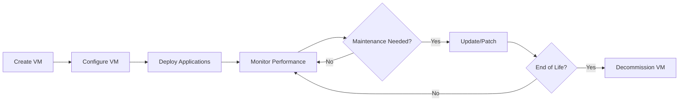

**બેસ્ટ પ્રેક્ટિસ:**

- **નિયમિત બેકઅપ** અને સ્નેપશોટ મેનેજમેન્ટ
- ઓપ્ટિમાઇઝેશન માટે **રિસોર્સ મોનિટરિંગ**
- **સિક્યુરિટી પેચિંગ** અને અપડેટ્સ
- વર્કલોડ આધારિત **પ્રદર્શન ટ્યુનિંગ**

**મોનિટરિંગ અને ટ્રબલશૂટિંગ:**

- **પ્રદર્શન મેટ્રિક્સ:** CPU, મેમરી, ડિસ્ક I/O
- **ઇવેન્ટ લોગ્સ:** સિસ્ટમ અને એપ્લિકેશન ઇવેન્ટ્સ
- **નેટવર્ક કનેક્ટિવિટી:** પિંગ, ટ્રેસરાઉટ ટેસ્ટ્સ
- **રિસોર્સ યુટિલાઇઝેશન:** કેપાસિટી પ્લાનિંગ

**VM સિક્યુરિટી:**

- **ગેસ્ટ OS હાર્ડનિંગ:** બિનજરૂરી સર્વિસ દૂર કરવી
- **નેટવર્ક આઇસોલેશન:** VLAN સેગમેન્ટેશન
- **એક્સેસ કંટ્રોલ:** યુઝર ઓથેન્ટિકેશન
- **એન્ટીવાઇરસ પ્રોટેક્શન:** મેલવેર સ્કેનિંગ

**મેમરી ટ્રીક:** "CVMN" - CPU, Virtual memory, Network, Storage
