## Question 1(a) [3 marks]

**Define Cloud Computing. Explain Applications of cloud computing.**

**Answer**:

**Cloud Computing** is the delivery of computing services including servers, storage, databases, networking, software, analytics, and intelligence over the Internet ("the cloud") to offer faster innovation, flexible resources, and economies of scale.

**Applications of Cloud Computing:**

| Application | Description |
|-------------|-------------|
| **Data Storage** | Storing files and documents online |
| **Web Applications** | Running software applications via web browsers |
| **Email Services** | Gmail, Outlook hosted on cloud |
| **Backup & Recovery** | Automatic data backup and disaster recovery |

**Mnemonic:** "SWEB" - Storage, Web apps, Email, Backup

---

## Question 1(b) [4 marks]

**What is Cloud Storage Solutions? Explain Object storage in detail.**

**Answer**:

**Cloud Storage Solutions** are online services that provide data storage, management, and access through internet-connected devices.

**Object Storage Details:**

| Feature | Description |
|---------|-------------|
| **Structure** | Stores data as objects in buckets/containers |
| **Metadata** | Each object contains data, metadata, and unique ID |
| **Scalability** | Virtually unlimited storage capacity |
| **Access** | RESTful APIs for programmatic access |

**Diagram:**

```goat
┌─────────────────┐    ┌─────────────────┐    ┌─────────────────┐
│    Object 1     │    │    Object 2     │    │    Object 3     │
│                 │    │                 │    │                 │
│ Data + Metadata │    │ Data + Metadata │    │ Data + Metadata │
│ Unique ID: 001  │    │ Unique ID: 002  │    │ Unique ID: 003  │
└─────────────────┘    └─────────────────┘    └─────────────────┘
        │                       │                       │
        └───────────────────────┼───────────────────────┘
                                │
                    ┌─────────────────┐
                    │     Bucket      │
                    │   (Container)   │
                    └─────────────────┘
```

**Mnemonic:** "SMAR" - Scalable, Metadata-rich, API-accessible, Resilient

---

## Question 1(c) [7 marks]

**Explain Hardware virtualization and Software Virtualization in detail.**

**Answer**:

**Hardware Virtualization:**

- **Physical layer abstraction** creating virtual versions of physical hardware components
- **Hypervisor** manages multiple virtual machines on single physical server

**Software Virtualization:**

- **Application layer abstraction** allowing software to run in isolated environments
- **Runtime environments** provide compatibility across different platforms

**Comparison Table:**

| Aspect | Hardware Virtualization | Software Virtualization |
|--------|------------------------|-------------------------|
| **Level** | Hardware/OS level | Application level |
| **Performance** | Near-native | Slight overhead |
| **Resource Usage** | High | Moderate |
| **Isolation** | Complete | Application-specific |

**Architecture Diagram:**

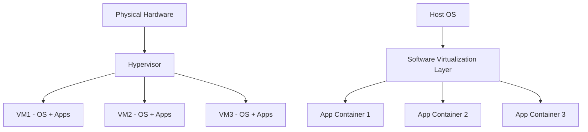

**Mnemonic:** "HAPI" - Hardware abstraction, Application isolation, Performance consideration, Infrastructure management

---

## Question 1(c) OR [7 marks]

**What is Cloud virtualization? Explain Characteristics of virtualization.**

**Answer**:

**Cloud Virtualization** is the process of creating virtual versions of computing resources (servers, storage, networks) that can be dynamically allocated and managed in cloud environments.

**Characteristics of Virtualization:**

| Characteristic | Description |
|----------------|-------------|
| **Resource Pooling** | Multiple physical resources combined into pools |
| **Isolation** | Virtual machines operate independently |
| **Elasticity** | Dynamic scaling based on demand |
| **Efficiency** | Better hardware utilization |

**Benefits:**

- **Cost reduction** through hardware consolidation
- **Flexibility** in resource allocation
- **Scalability** for growing demands
- **Management** simplified through centralization

**Virtualization Stack:**

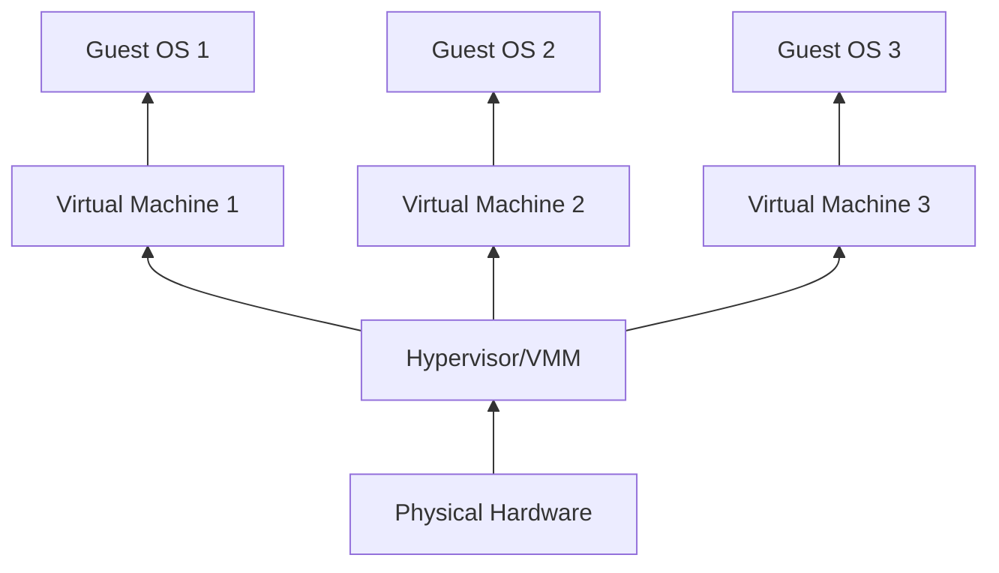

**Mnemonic:** "RIEM" - Resource pooling, Isolation, Elasticity, Management

---

## Question 2(a) [3 marks]

**Which are Cloud security challenges?**

**Answer**:

**Cloud Security Challenges:**

| Challenge | Description |
|-----------|-------------|
| **Data Breaches** | Unauthorized access to sensitive information |
| **Access Management** | Controlling user permissions and authentication |
| **Compliance** | Meeting regulatory and industry standards |
| **Vendor Lock-in** | Dependency on specific cloud provider |

**Mnemonic:** "DACV" - Data breaches, Access control, Compliance, Vendor dependency

---

## Question 2(b) [4 marks]

**Explain IaaS in detail.**

**Answer**:

**Infrastructure as a Service (IaaS)** provides virtualized computing infrastructure over the internet, including servers, storage, and networking.

**IaaS Components:**

| Component | Description |
|-----------|-------------|
| **Compute** | Virtual machines and processing power |
| **Storage** | Block, file, and object storage |
| **Networking** | Virtual networks, load balancers, firewalls |
| **Management** | Monitoring, security, and backup tools |

**IaaS Architecture:**

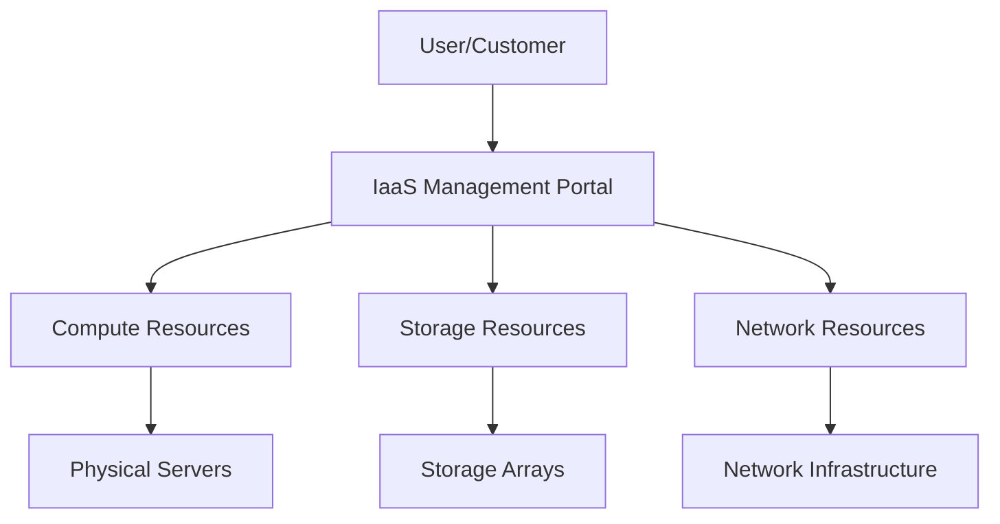

**Benefits:**

- **Pay-per-use** pricing model
- **Scalability** on demand
- **Reduced** capital expenditure

**Mnemonic:** "CSNM" - Compute, Storage, Network, Management

---

## Question 2(c) [7 marks]

**Explain Identity and access management in detail.**

**Answer**:

**Identity and Access Management (IAM)** is a framework for managing digital identities and controlling access to resources in cloud environments.

**IAM Components:**

| Component | Function |
|-----------|----------|
| **Authentication** | Verifying user identity |
| **Authorization** | Determining access permissions |
| **User Management** | Creating, modifying, deleting user accounts |
| **Role-Based Access** | Assigning permissions based on roles |

**IAM Process Flow:**

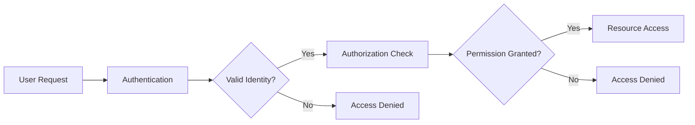

**Key Features:**

- **Single Sign-On (SSO)** for seamless access
- **Multi-Factor Authentication (MFA)** for enhanced security
- **Policy Management** for access control
- **Audit Logging** for compliance tracking

**Security Benefits:**

- **Centralized** identity management
- **Reduced** security risks
- **Compliance** with regulations
- **Improved** user experience

**Mnemonic:** "AURU" - Authentication, Authorization, User management, Role-based access

---

## Question 2(a) OR [3 marks]

**Need for Access control and authentication in cloud.**

**Answer**:

**Need for Access Control and Authentication:**

| Need | Reason |
|------|--------|
| **Data Protection** | Prevent unauthorized access to sensitive data |
| **Regulatory Compliance** | Meet legal and industry requirements |
| **Resource Security** | Control who can use cloud resources |
| **Cost Management** | Prevent unauthorized resource usage |

**Mnemonic:** "DRRC" - Data protection, Regulatory compliance, Resource security, Cost management

---

## Question 2(b) OR [4 marks]

**Explain PaaS in detail.**

**Answer**:

**Platform as a Service (PaaS)** provides a cloud-based platform allowing customers to develop, run, and manage applications without dealing with underlying infrastructure.

**PaaS Components:**

| Component | Description |
|-----------|-------------|
| **Development Tools** | IDEs, debuggers, compilers |
| **Runtime Environment** | Application execution platform |
| **Database Management** | Built-in database services |
| **Middleware** | Integration and communication services |

**PaaS Architecture:**

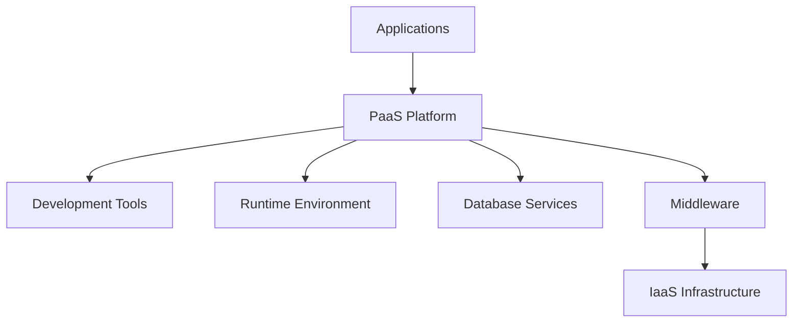

**Benefits:**

- **Faster** application development
- **Reduced** complexity
- **Built-in** scalability

**Mnemonic:** "DRDM" - Development tools, Runtime, Database, Middleware

---

## Question 2(c) OR [7 marks]

**Explain DevSecOps in detail.**

**Answer**:

**DevSecOps** integrates security practices into the DevOps process, making security a shared responsibility throughout the development lifecycle.

**DevSecOps Principles:**

| Principle | Description |
|-----------|-------------|
| **Shift Left** | Integrate security early in development |
| **Automation** | Automated security testing and compliance |
| **Collaboration** | Security teams work with development and operations |
| **Continuous Monitoring** | Ongoing security assessment |

**DevSecOps Pipeline:**

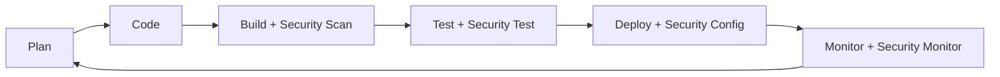

**Security Integration Points:**

- **Code Analysis** during development
- **Vulnerability Scanning** in CI/CD pipeline
- **Compliance Checks** before deployment
- **Runtime Protection** in production

**Benefits:**

- **Early** vulnerability detection
- **Faster** security fixes
- **Reduced** security debt
- **Improved** compliance

**Mnemonic:** "SACM" - Shift left, Automation, Collaboration, Monitoring

---

## Question 3(a) [3 marks]

**Why is Edge Computing important?**

**Answer**:

**Importance of Edge Computing:**

| Benefit | Description |
|---------|-------------|
| **Reduced Latency** | Processing data closer to source |
| **Bandwidth Optimization** | Less data transmission to cloud |
| **Real-time Processing** | Immediate response for critical applications |
| **Data Privacy** | Local processing keeps sensitive data local |

**Mnemonic:** "RBRD" - Reduced latency, Bandwidth optimization, Real-time processing, Data privacy

---

## Question 3(b) [4 marks]

**Define Data Center. List types of Data center. Explain anyone.**

**Answer**:

**Data Center** is a facility housing computer systems, storage systems, networking equipment, and supporting infrastructure for IT operations.

**Types of Data Centers:**

| Type | Description |
|------|-------------|
| **Enterprise** | Private data centers owned by organizations |
| **Colocation** | Shared facility renting space to multiple tenants |
| **Hyperscale** | Large-scale facilities for cloud providers |
| **Edge** | Small facilities closer to end users |

**Enterprise Data Center (Detailed):**

- **Complete control** over infrastructure
- **Customized** to organization needs
- **High security** and compliance
- **Significant** capital investment required

**Data Center Architecture:**

```goat
┌─────────────────────────────────────────┐
│              Data Center                │
│  ┌─────────┐  ┌─────────┐  ┌─────────┐  │
│  │ Server  │  │ Storage │  │ Network │  │
│  │  Racks  │  │  Systems│  │ Equip.  │  │
│  └─────────┘  └─────────┘  └─────────┘  │
│  ┌─────────────────────────────────────┐ │
│  │     Power & Cooling Systems         │ │
│  └─────────────────────────────────────┘ │
└─────────────────────────────────────────┘
```

**Mnemonic:** "ECHE" - Enterprise, Colocation, Hyperscale, Edge

---

## Question 3(c) [7 marks]

**Explain types of cloud databases in detail.**

**Answer**:

**Types of Cloud Databases:**

**1. SQL Databases (Relational):**

- **Structure:** Table-based with predefined schema
- **ACID Properties:** Ensure data consistency
- **Examples:** Amazon RDS, Google Cloud SQL

**2. NoSQL Databases:**

| NoSQL Type | Description | Use Cases |
|------------|-------------|-----------|
| **Document** | JSON-like documents | Content management, catalogs |
| **Key-Value** | Simple key-value pairs | Session management, caching |
| **Column-Family** | Wide column storage | Analytics, time-series data |
| **Graph** | Nodes and relationships | Social networks, recommendations |

**Database Comparison:**

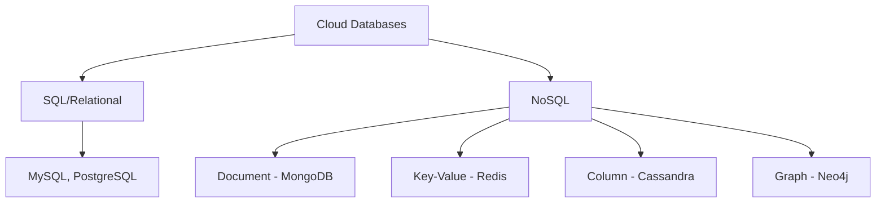

**Selection Criteria:**

- **Data Structure** requirements
- **Scalability** needs
- **Consistency** requirements
- **Performance** expectations

**Benefits:**

- **Managed** services reduce operational overhead
- **Automatic** scaling and backup
- **Global** distribution capabilities
- **Cost-effective** pay-per-use model

**Mnemonic:** "DKCG" - Document, Key-value, Column-family, Graph

---

## Question 3(a) OR [3 marks]

**What is the Role of Machine Learning in Cloud Computing? Explain it.**

**Answer**:

**Role of Machine Learning in Cloud Computing:**

| Role | Description |
|------|-------------|
| **Resource Optimization** | Predict and optimize resource allocation |
| **Security Enhancement** | Detect anomalies and threats |
| **Cost Management** | Optimize spending and usage patterns |
| **Performance Monitoring** | Predict and prevent system failures |

**Mnemonic:** "RSCP" - Resource optimization, Security enhancement, Cost management, Performance monitoring

---

## Question 3(b) OR [4 marks]

**What is Cloud Scalability? Explain in detail.**

**Answer**:

**Cloud Scalability** is the ability to increase or decrease computing resources dynamically based on demand without affecting performance.

**Types of Scalability:**

| Type | Description | Method |
|------|-------------|--------|
| **Vertical (Scale Up)** | Adding more power to existing machine | CPU, RAM, Storage upgrade |
| **Horizontal (Scale Out)** | Adding more machines to resource pool | Load distribution |

**Scalability Process:**

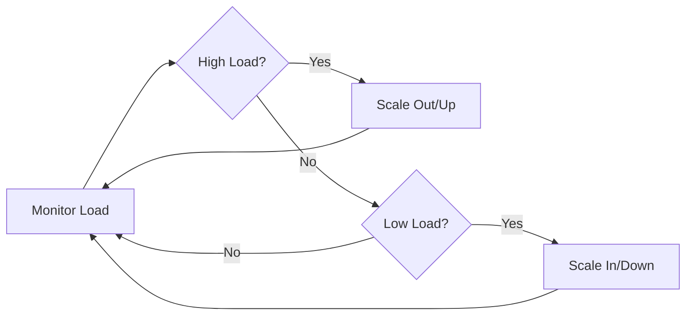

**Benefits:**

- **Cost efficiency** through dynamic resource allocation
- **Performance** maintenance during peak loads
- **Availability** improvement

**Mnemonic:** "VH" - Vertical scaling, Horizontal scaling

---

## Question 3(c) OR [7 marks]

**Explain Data consistency and durability in detail.**

**Answer**:

**Data Consistency** ensures all nodes see the same data simultaneously in distributed systems.

**Data Durability** guarantees data persistence even in case of system failures.

**Consistency Models:**

| Model | Description | Use Case |
|-------|-------------|----------|
| **Strong** | All reads get most recent write | Financial systems |
| **Eventual** | System becomes consistent over time | Social media |
| **Weak** | No guarantees about when consistency occurs | Gaming, real-time |

**Durability Mechanisms:**

| Mechanism | Description |
|-----------|-------------|
| **Replication** | Multiple copies across different locations |
| **Backup** | Regular data snapshots |
| **Redundancy** | RAID, erasure coding |
| **Versioning** | Multiple versions of data |

**CAP Theorem:**

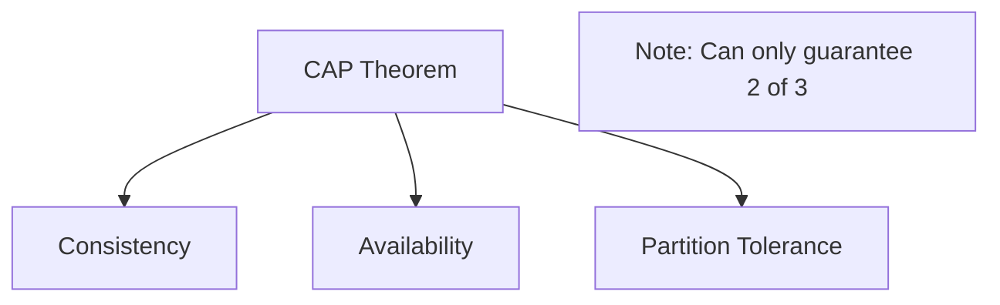

**Implementation Strategies:**

- **Multi-region** replication for durability
- **Quorum-based** consistency for availability
- **Checksums** for data integrity
- **Transaction logs** for recovery

**Mnemonic:** "SEWR" - Strong consistency, Eventual consistency, Weak consistency, Replication strategies

---

## Question 4(a) [3 marks]

**State the role of Data scaling.**

**Answer**:

**Role of Data Scaling:**

| Role | Description |
|------|-------------|
| **Performance Maintenance** | Handle increased data volume efficiently |
| **Storage Optimization** | Distribute data across multiple systems |
| **Query Performance** | Maintain fast data retrieval speeds |
| **Cost Management** | Balance performance with storage costs |

**Mnemonic:** "PSQC" - Performance, Storage optimization, Query performance, Cost management

---

## Question 4(b) [4 marks]

**Define Kubernetes. Explain with reason: Kubernetes is an essential component of cloud computing.**

**Answer**:

**Kubernetes** is an open-source container orchestration platform that automates deployment, scaling, and management of containerized applications.

**Why Kubernetes is Essential for Cloud Computing:**

| Reason | Explanation |
|--------|-------------|
| **Container Orchestration** | Manages multiple containers across clusters |
| **Auto-scaling** | Dynamically adjusts resources based on demand |
| **Service Discovery** | Automatic load balancing and networking |
| **Self-healing** | Automatically replaces failed containers |

**Kubernetes Architecture:**

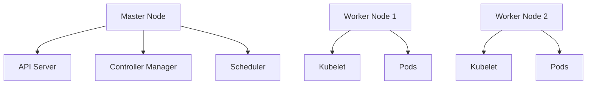

**Essential Benefits:**

- **Platform independence** across cloud providers
- **Resource efficiency** through container density
- **DevOps integration** with CI/CD pipelines

**Mnemonic:** "CASS" - Container orchestration, Auto-scaling, Service discovery, Self-healing

---

## Question 4(c) [7 marks]

**Explain Data center network topologies.**

**Answer**:

**Data Center Network Topologies** define how network components are interconnected within a data center.

**Common Topologies:**

| Topology | Description | Advantages | Disadvantages |
|----------|-------------|------------|---------------|
| **Three-Tier** | Core, Aggregation, Access layers | Simple, hierarchical | Limited scalability |
| **Spine-Leaf** | Non-blocking, flat architecture | High bandwidth, scalable | Complex configuration |
| **Fat Tree** | Tree structure with multiple paths | Good fault tolerance | Oversubscription issues |

**Spine-Leaf Architecture:**

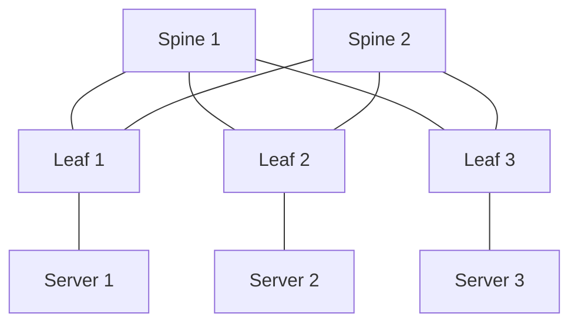

**Modern Trends:**

- **Software-Defined Networking (SDN)** for programmable networks
- **Network Function Virtualization (NFV)** for flexible services
- **Micro-segmentation** for enhanced security

**Selection Criteria:**

- **Bandwidth** requirements
- **Latency** sensitivity
- **Scalability** needs
- **Cost** considerations

**Benefits of Modern Topologies:**

- **Non-blocking** communication paths
- **Equal-cost** multi-path routing
- **Horizontal** scaling capability
- **Reduced** network congestion

**Mnemonic:** "TSF" - Three-tier, Spine-leaf, Fat tree

---

## Question 4(a) OR [3 marks]

**Explain file storage in the cloud.**

**Answer**:

**Cloud File Storage** provides hierarchical file system access over the network, similar to traditional file systems.

**Characteristics:**

| Feature | Description |
|---------|-------------|
| **Hierarchical Structure** | Folders and subfolders organization |
| **POSIX Compliance** | Standard file system interface |
| **Network Access** | SMB, NFS protocol support |
| **Shared Access** | Multiple users can access simultaneously |

**Mnemonic:** "HPNS" - Hierarchical, POSIX-compliant, Network access, Shared access

---

## Question 4(b) OR [4 marks]

**Explain Serverless Computing.**

**Answer**:

**Serverless Computing** is a cloud computing model where cloud providers automatically manage server infrastructure, allowing developers to focus on code.

**Key Features:**

| Feature | Description |
|---------|-------------|
| **Event-Driven** | Functions triggered by events |
| **Auto-Scaling** | Automatic resource allocation |
| **Pay-per-Execution** | Billing based on actual usage |
| **Stateless** | Functions don't maintain state |

**Serverless Architecture:**

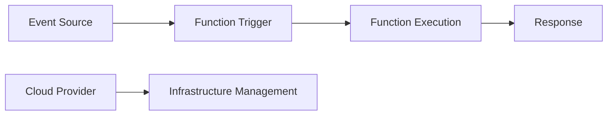

**Benefits:**

- **No server management** required
- **Cost efficiency** for variable workloads
- **Rapid scaling** capabilities

**Mnemonic:** "EAPS" - Event-driven, Auto-scaling, Pay-per-execution, Stateless

---

## Question 4(c) OR [7 marks]

**Explain SDN (Software Defined Networking) architecture.**

**Answer**:

**Software Defined Networking (SDN)** separates network control plane from data plane, enabling centralized network management through software.

**SDN Architecture Layers:**

| Layer | Function | Components |
|-------|----------|------------|
| **Application Layer** | Network applications and services | Firewalls, Load balancers |
| **Control Layer** | Centralized network intelligence | SDN Controller |
| **Infrastructure Layer** | Network forwarding devices | Switches, Routers |

**SDN Architecture Diagram:**

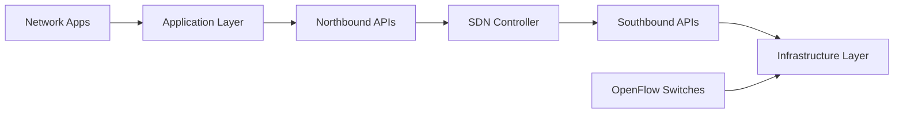

**Key Protocols:**

- **OpenFlow:** Communication between controller and switches
- **NETCONF:** Network configuration protocol
- **REST APIs:** Northbound application interfaces

**SDN Benefits:**

| Benefit | Description |
|---------|-------------|
| **Centralized Control** | Single point of network management |
| **Programmability** | Software-based network configuration |
| **Flexibility** | Dynamic network reconfiguration |
| **Cost Reduction** | Commodity hardware usage |

**Use Cases:**

- **Data center** networking
- **Campus** networks
- **Wide area** networks
- **Network function** virtualization

**Challenges:**

- **Single point** of failure (controller)
- **Scalability** concerns
- **Security** considerations
- **Vendor** interoperability

**Mnemonic:** "ACI" - Application layer, Control layer, Infrastructure layer

---

## Question 5(a) [3 marks]

**Explain Infrastructure as Code (IaC) in Detail.**

**Answer**:

**Infrastructure as Code (IaC)** manages and provisions computing infrastructure through machine-readable definition files rather than manual processes.

**IaC Characteristics:**

| Characteristic | Description |
|----------------|-------------|
| **Version Control** | Infrastructure definitions stored in repositories |
| **Automation** | Automated deployment and management |
| **Consistency** | Identical environments across deployments |
| **Repeatability** | Reproducible infrastructure setups |

**Mnemonic:** "VACR" - Version control, Automation, Consistency, Repeatability

---

## Question 5(b) [4 marks]

**Give full form of SLA. Explain in detail.**

**Answer**:

**SLA - Service Level Agreement**

**SLA Definition:** A contract between service provider and customer defining expected service levels and performance metrics.

**SLA Components:**

| Component | Description |
|-----------|-------------|
| **Availability** | Uptime percentage (99.9%, 99.99%) |
| **Performance** | Response time, throughput metrics |
| **Support** | Response time for issues |
| **Penalties** | Compensation for SLA violations |

**SLA Metrics:**

```goat
┌─────────────────┐    ┌─────────────────┐
│   Availability  │    │   Performance   │
│     99.99%      │    │   < 200ms       │
└─────────────────┘    └─────────────────┘
         │                       │
         └───────────┬───────────┘
                     │
            ┌─────────────────┐
            │       SLA       │
            │   Requirements  │
            └─────────────────┘
```

**Benefits:**

- **Clear expectations** for both parties
- **Performance** measurement standards
- **Risk mitigation** through penalties

**Mnemonic:** "APSP" - Availability, Performance, Support, Penalties

---

## Question 5(c) [7 marks]

**Explain Hypervisors in detail.**

**Answer**:

**Hypervisor** (Virtual Machine Monitor) is software that creates and manages virtual machines by abstracting physical hardware.

**Types of Hypervisors:**

| Type | Description | Examples | Characteristics |
|------|-------------|----------|-----------------|
| **Type 1 (Bare Metal)** | Runs directly on hardware | VMware vSphere, Hyper-V | Better performance, enterprise use |
| **Type 2 (Hosted)** | Runs on host operating system | VirtualBox, VMware Workstation | Easier setup, desktop use |

**Hypervisor Architecture:**

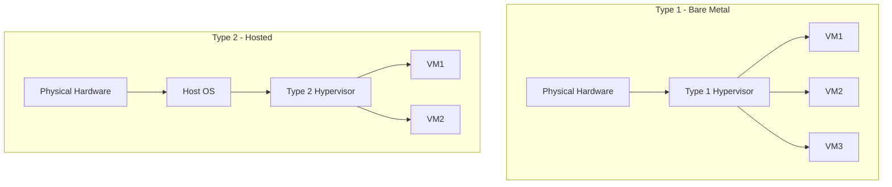

**Hypervisor Functions:**

| Function | Description |
|----------|-------------|
| **Resource Allocation** | CPU, memory, storage distribution |
| **Isolation** | Separate VM environments |
| **Hardware Abstraction** | Virtual hardware presentation |
| **VM Lifecycle Management** | Create, start, stop, delete VMs |

**Virtualization Techniques:**

- **Hardware-assisted** virtualization (Intel VT-x, AMD-V)
- **Paravirtualization** for improved performance
- **Binary translation** for compatibility

**Performance Considerations:**

- **CPU overhead** from virtualization layer
- **Memory management** with virtual memory
- **I/O optimization** for storage and network
- **Resource scheduling** among VMs

**Benefits:**

- **Server consolidation** reducing hardware costs
- **Disaster recovery** through VM snapshots
- **Testing environments** quick provisioning
- **Legacy application** support

**Challenges:**

- **Performance overhead** compared to bare metal
- **Complexity** in management
- **Licensing costs** for enterprise hypervisors
- **Security** considerations for shared resources

**Mnemonic:** "RAIH" - Resource allocation, isolation, Hardware abstraction

---

## Question 5(a) OR [3 marks]

**What is Automation in Data Centers? Explain in detail.**

**Answer**:

**Data Center Automation** uses software and technologies to perform routine tasks automatically without manual intervention.

**Automation Areas:**

| Area | Description |
|------|-------------|
| **Provisioning** | Automatic server and service deployment |
| **Monitoring** | Continuous performance and health tracking |
| **Scaling** | Dynamic resource adjustment |
| **Maintenance** | Automated patching and updates |

**Mnemonic:** "PMSM" - Provisioning, Monitoring, Scaling, Maintenance

---

## Question 5(b) OR [4 marks]

**What is Data Security in Cloud? Explain in detail.**

**Answer**:

**Cloud Data Security** involves protecting data stored, processed, and transmitted in cloud environments from unauthorized access, corruption, and theft.

**Security Measures:**

| Measure | Description |
|---------|-------------|
| **Encryption** | Data protection at rest and in transit |
| **Access Controls** | User authentication and authorization |
| **Backup & Recovery** | Data protection against loss |
| **Compliance** | Adherence to regulatory requirements |

**Security Implementation:**

```goat
┌─────────────┐    ┌─────────────┐    ┌─────────────┐
│ Encryption  │    │   Access    │    │   Backup    │
│             │    │  Controls   │    │             │
│ AES-256     │    │ IAM/RBAC    │    │ 3-2-1 Rule  │
└─────────────┘    └─────────────┘    └─────────────┘
       │                    │                    │
       └────────────────────┼────────────────────┘
                            │
                   ┌─────────────┐
                   │    Data     │
                   │  Security   │
                   └─────────────┘
```

**Best Practices:**

- **Zero-trust** security model
- **Regular** security audits
- **Data classification** and handling

**Mnemonic:** "EABC" - Encryption, Access controls, Backup, Compliance

---

## Question 5(c) OR [7 marks]

**What is Virtual Machines? Explain Steps to Create and manage Virtual machines.**

**Answer**:

**Virtual Machine (VM)** is a software-based emulation of a physical computer that runs an operating system and applications in an isolated environment.

**VM Components:**

| Component | Description |
|-----------|-------------|
| **Virtual CPU** | Emulated processor cores |
| **Virtual Memory** | Allocated RAM for VM |
| **Virtual Storage** | Virtual hard disks |
| **Virtual Network** | Network interface emulation |

**Steps to Create Virtual Machine:**

**1. Planning Phase:**

- **Resource Assessment:** Determine CPU, RAM, storage requirements
- **OS Selection:** Choose guest operating system
- **Network Configuration:** Plan IP addressing and connectivity

**2. VM Creation Process:**


**3. Detailed Creation Steps:**

| Step | Action | Details |
|------|--------|---------|
| **1** | **Create VM Container** | Define VM name and location |
| **2** | **Allocate CPU** | Assign virtual processor cores |
| **3** | **Assign Memory** | Allocate RAM (2GB-16GB typical) |
| **4** | **Create Storage** | Set up virtual hard disk |
| **5** | **Network Setup** | Configure virtual network adapter |
| **6** | **OS Installation** | Install guest operating system |

**VM Management Operations:**

**Power Management:**

- **Start/Stop:** Control VM power state
- **Suspend/Resume:** Pause and resume VM execution
- **Reset:** Force restart VM

**Resource Management:**

- **Hot-add CPU/Memory:** Add resources without shutdown
- **Storage Expansion:** Increase disk capacity
- **Network Reconfiguration:** Modify network settings

**Maintenance Operations:**

| Operation | Purpose | Frequency |
|-----------|---------|-----------|
| **Snapshots** | Point-in-time backup | Before major changes |
| **Cloning** | Create identical copies | For scaling/testing |
| **Migration** | Move VM between hosts | For maintenance |
| **Backup** | Data protection | Daily/Weekly |

**VM Lifecycle Management:**

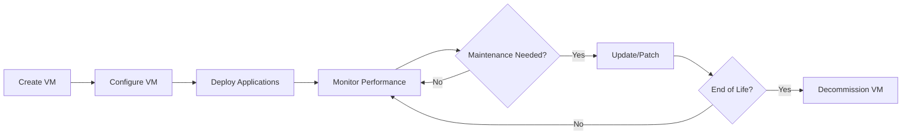

**Best Practices:**

- **Regular backups** and snapshot management
- **Resource monitoring** for optimization
- **Security patching** and updates
- **Performance tuning** based on workload

**Monitoring and Troubleshooting:**

- **Performance metrics:** CPU, memory, disk I/O
- **Event logs:** System and application events
- **Network connectivity:** Ping, traceroute tests
- **Resource utilization:** Capacity planning

**VM Security:**

- **Guest OS hardening:** Remove unnecessary services
- **Network isolation:** VLAN segmentation
- **Access control:** User authentication
- **Antivirus protection:** Malware scanning

**Mnemonic:** "CVMN" - CPU, Virtual memory, Network, Storage
