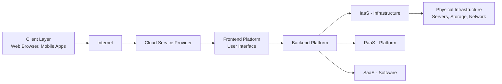
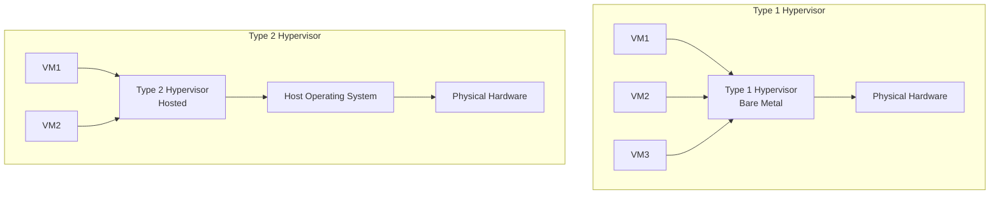
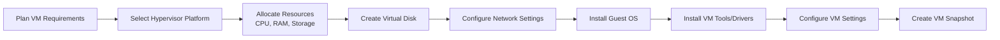
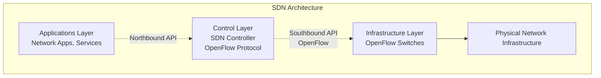
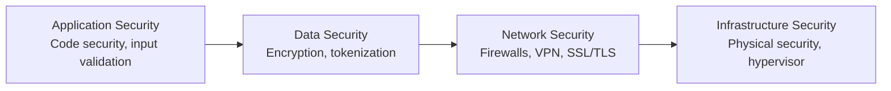
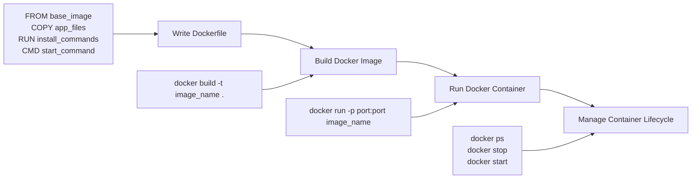

## પ્રશ્ન 1(અ) [3 ગુણ]

**ક્લાઉડ કમ્પ્યુટિંગને વ્યાખ્યાયિત કરો અને તેની ઇચ્છનીય વિશેષતાઓ જણાવો.**

**જવાબ**:

**ક્લાઉડ કમ્પ્યુટિંગ** એ એવી ટેકનોલોજી છે જે ઇન્ટરનેટ પર કમ્પ્યુટિંગ સેવાઓ જેવી કે servers, storage, databases અને software પ્રદાન કરે છે, જે વપરાશકર્તાઓને ભૌતિક infrastructure ના માલિકી વિના જરૂરિયાત મુજબ resources ઉપલબ્ધ કરાવે છે.

**ઇચ્છનીય વિશેષતાઓ**:

| વિશેષતા | વર્ણન |
|---------|-------|
| **On-demand self-service** | માનવી હસ્તક્ષેપ વિના તાત્કાલિક સંસાધન પ્રાપ્તિ |
| **Broad network access** | મુખ્ય platforms દ્વારા નેટવર્ક પર સેવાઓ ઉપલબ્ધ |
| **Resource pooling** | વિવિધ વપરાશકર્તાઓ માટે computing resources નું pooling |
| **Rapid elasticity** | ઝડપથી resources વધારવા-ઘટાડવાની સુવિધા |
| **Measured service** | ઉપયોગની નિગરાણી અને આપોઆપ billing |

**મેમરી ટ્રીક:** "On-Demand Broad Resources Rapidly Measured"

---

## પ્રશ્ન 1(બ) [4 ગુણ]

**ક્લાઉડ આર્કિટેક્ચર દોરો અને સમજાવો.**

**જવાબ**:



**ક્લાઉડ આર્કિટેક્ચરના ઘટકો**:

- **Client Layer**: અંતિમ વપરાશકર્તા devices જે ક્લાઉડ સેવાઓ access કરે છે
- **Internet**: નેટવર્ક કનેક્શન માધ્યમ  
- **Frontend**: વપરાશકર્તા interface અને સેવા management
- **Backend**: મુખ્ય processing અને resource management
- **Service Models**: IaaS, PaaS, SaaS layers
- **Physical Infrastructure**: Data centers માં hardware resources

**મેમરી ટ્રીક:** "Clients Connect Through Frontend Backend Services Infrastructure"

---

## પ્રશ્ન 1(ક) [7 ગુણ]

**ક્લાઉડ સર્વિસ મોડલ્સને વિગતવાર સમજાવો.**

**જવાબ**:

| Service Model | વર્ણન | ઉદાહરણો | User Control |
|---------------|-------|----------|--------------|
| **IaaS** | Infrastructure as a Service - Virtual machines, storage, networks | AWS EC2, Google Compute Engine | ઉચ્ચ - OS, Runtime, Apps |
| **PaaS** | Platform as a Service - Development platform with tools | Google App Engine, Heroku | મધ્યમ - Apps and Data |
| **SaaS** | Software as a Service - Ready-to-use applications | Gmail, Office 365, Salesforce | ઓછું - ફક્ત Data |

**વિગતવાર સમજૂતી**:

- **IaaS (Infrastructure as a Service)**: Virtualized computing resources પ્રદાન કરે છે જેમાં virtual machines, storage અને networking સામેલ છે. વપરાશકર્તાઓને operating systems અને applications પર સંપૂર્ણ નિયંત્રણ મળે છે.

- **PaaS (Platform as a Service)**: Programming tools, database management અને middleware સાથે development platform પ્રદાન કરે છે. Developers infrastructure management વિના application logic પર ધ્યાન કેન્દ્રિત કરી શકે છે.

- **SaaS (Software as a Service)**: ઇન્ટરનેટ પર સંપૂર્ણ applications પ્રદાન કરે છે. વપરાશકર્તાઓ installation કે maintenance વિના web browsers દ્વારા software access કરે છે.

**મેમરી ટ્રીક:** "Infrastructure Platforms Software - Increasing Abstraction"

---

## પ્રશ્ન 1(ક OR) [7 ગુણ]

**ક્લાઉડ કમ્પ્યુટિંગમાં સર્વિસ લેવલ એગ્રીમેન્ટ (SLA) ઉદાહરણ સાથે સમજાવો.**

**જવાબ**:

**Service Level Agreement (SLA)** એ ક્લાઉડ સર્વિસ પ્રદાતા અને ગ્રાહક વચ્ચેનો કરાર છે જે અપેક્ષિત સેવા સ્તર, performance metrics અને non-compliance માટે penalties વ્યાખ્યાયિત કરે છે.

**મુખ્ય ઘટકો**:

| ઘટક | વર્ણન | ઉદાહરણ |
|-----|-------|---------|
| **Availability** | Uptime ગેરંટી | 99.9% uptime |
| **Performance** | Response time metrics | <200ms response time |
| **Security** | Data protection standards | ISO 27001 compliance |
| **Support** | Help desk response time | 24/7 support, 4-hour response |
| **Penalties** | Failures માટે વળતર | Downtime માટે service credits |

**ઉદાહરણ - AWS SLA**:

- **EC2 SLA**: 99.99% monthly uptime
- **S3 SLA**: 99.9% availability, 99.999999999% durability  
- **Penalty**: Availability threshold નીચે જતાં 10% service credit

**ફાયદાઓ**:

- **Accountability**: બંને પક્ષો માટે સ્પષ્ટ અપેક્ષાઓ
- **Quality assurance**: ગેરંટીવાળા સેવા સ્તરો
- **Risk mitigation**: સેવા failures માટે વળતર

**મેમરી ટ્રીક:** "Availability Performance Security Support Penalties"

---

## પ્રશ્ન 2(અ) [3 ગુણ]

**વર્ચ્યુઅલાઈઝેશન વ્યાખ્યાયિત કરો. વર્ચ્યુઅલાઈઝેશનની લાક્ષણિકતાઓ આપો.**

**જવાબ**:

**વર્ચ્યુઅલાઈઝેશન** એ એવી ટેકનોલોજી છે જે કમ્પ્યુટિંગ resources જેવા કે servers, storage કે networks ના virtual versions બનાવે છે, જે એક જ ભૌતિક hardware પર અનેક virtual instances ચલાવવાની મંજૂરી આપે છે.

**લાક્ષણિકતાઓ**:

- **Resource sharing**: અનેક VMs ભૌતિક hardware ને કાર્યક્ષમતાથી share કરે છે
- **Isolation**: Virtual machines સ્વતંત્ર રીતે હસ્તક્ષેપ વિના કાર્ય કરે છે
- **Portability**: VMs ને વિવિધ ભૌતિક hosts વચ્ચે ખસેડી શકાય છે
- **Scalability**: જરૂરિયાત મુજબ resources ને dynamically allocate કરી શકાય છે
- **Cost efficiency**: Hardware આવશ્યકતાઓ અને operational costs ઘટાડે છે

**મેમરી ટ્રીક:** "Resources Isolated Portable Scalable Cost-effective"

---

## પ્રશ્ન 2(બ) [4 ગુણ]

**પેરાવર્ચ્યુઅલાઈઝેશન અને સંપૂર્ણ વર્ચ્યુઅલાઈઝેશન વચ્ચે તફાવત કરો.**

**જવાબ**:

| પાસું | Paravirtualization | Full Virtualization |
|------|-------------------|-------------------|
| **Guest OS Modification** | Hypervisor સાથે communicate કરવા માટે modified | કોઈ modification ની જરૂર નથી |
| **Performance** | ઉચ્ચ performance | થોડી ઓછી performance |
| **Hardware Support** | વિશેષ hardware ની જરૂર નથી | Hardware virtualization support જરૂરી |
| **Compatibility** | મર્યાદિત OS compatibility | કોઈપણ OS ને support કરે છે |
| **ઉદાહરણો** | Xen, VMware ESX | VMware Workstation, VirtualBox |

**મુખ્ય તફાવતો**:

- **Paravirtualization** માં guest OS ને virtualization ની જાણ હોય છે અને hypervisor સાથે સહકાર કરે છે
- **Full Virtualization** માં hardware નું સંપૂર્ણ emulation થાય છે, જેથી guest OS ને virtualization ની જાણ ન હોય

**મેમરી ટ્રીક:** "Para Cooperates, Full Emulates"

---

## પ્રશ્ન 2(ક) [7 ગુણ]

**હાઈપરવાઈઝર વ્યાખ્યાયિત કરો. પ્રકાર 1 અને પ્રકાર 2 હાઈપરવાઈઝર સમજાવો.**

**જવાબ**:

**Hypervisor** એ software છે જે ભૌતિક hardware ને abstract કરીને અને અનેક VMs ને resources allocate કરીને virtual machines બનાવે અને manage કરે છે.



**તુલના**:

| વિશેષતા | Type 1 (Bare Metal) | Type 2 (Hosted) |
|---------|-------------------|-----------------|
| **Installation** | Hardware પર સીધું | Host operating system પર |
| **Performance** | ઉચ્ચ performance | ઓછી performance |
| **Use Case** | Enterprise, data centers | Desktop virtualization, testing |
| **ઉદાહરણો** | VMware vSphere, Hyper-V | VMware Workstation, VirtualBox |
| **Resource Overhead** | ઓછું overhead | વધારે overhead |

**Type 1 ફાયદાઓ**: બેહતર performance, સીધું hardware access, enterprise-grade security
**Type 2 ફાયદાઓ**: સરળ setup, host OS સાથે parallel ચાલે છે, development માટે સારું

**મેમરી ટ્રીક:** "Type 1 Bare Metal, Type 2 Hosted"

---

## પ્રશ્ન 2(અ OR) [3 ગુણ]

**વર્ચ્યુઅલાઈઝેશનના પ્રકારોની યાદી બનાવો અને કોઈપણ એકને સંક્ષિપ્તમાં સમજાવો.**

**જવાબ**:

**વર્ચ્યુઅલાઈઝેશનના પ્રકારો**:

- Server Virtualization
- Storage Virtualization  
- Network Virtualization
- Desktop Virtualization
- Application Virtualization
- Memory Virtualization

**Server Virtualization (વિગતવાર)**:
Server virtualization એક જ ભૌતિક server પર અનેક virtual servers બનાવે છે. દરેક virtual server પોતાના operating system અને applications સાથે સ્વતંત્ર રીતે કાર્ય કરે છે.

**ફાયદાઓ**:

- **Resource optimization**: હાર્ડવેરનો બેહતર ઉપયોગ
- **Cost reduction**: ઓછા ભૌતિક servers ની જરૂર
- **Flexibility**: સરળ VM migration અને scaling

**મેમરી ટ્રીક:** "Server Storage Network Desktop Application Memory"

---

## પ્રશ્ન 2(બ OR) [4 ગુણ]

**હાર્ડવેર અને સોફ્ટવેર વર્ચ્યુઅલાઈઝેશનનું વર્ણન કરો.**

**જવાબ**:

| પ્રકાર | Hardware Virtualization | Software Virtualization |
|------|------------------------|--------------------------|
| **પદ્ધતિ** | CPU virtualization features ઉપયોગ કરે છે | Pure software emulation |
| **Performance** | Native performance ની નજીક | Emulation ને કારણે ધીમું |
| **CPU Support** | Intel VT-x કે AMD-V જરૂરી | કોઈપણ CPU પર કાર્ય કરે છે |
| **Guest OS** | Unmodified OS ચાલી શકે છે | OS modifications ની જરૂર પડી શકે છે |
| **ઉદાહરણો** | VMware vSphere, KVM | QEMU, VMware Workstation (software mode) |

**Hardware Virtualization**: CPU virtualization extensions નો લાભ લઈને guest instructions ને સીધા execute કરે છે, જે બેહતર performance અને security isolation પ્રદાન કરે છે.

**Software Virtualization**: Binary translation ઉપયોગ કરીને guest instructions ને host-compatible instructions માં convert કરે છે, જે વધુ compatibility પરંતુ performance overhead સાથે પ્રદાન કરે છે.

**મેમરી ટ્રીક:** "Hardware Fast, Software Compatible"

---

## પ્રશ્ન 2(ક OR) [7 ગુણ]

**વર્ચ્યુઅલ મશીન બનાવવા અને મેનેજ કરવાની પ્રક્રિયા સમજાવો.**

**જવાબ**:

**VM Creation Process**:



**વિગતવાર પગલાં**:

1. **Planning**: CPU cores, RAM, storage અને network requirements નક્કી કરવું
2. **Resource Allocation**: Virtual machine ને ભૌતિક resources assign કરવા
3. **Storage Setup**: Virtual disks બનાવવા (VMDK, VHD, QCOW2 formats)
4. **Network Configuration**: Virtual network adapters અને connectivity setup કરવા
5. **OS Installation**: ISO કે network boot ઉપયોગ કરીને operating system install કરવું
6. **Tools Installation**: બેહતર integration માટે hypervisor-specific tools install કરવા
7. **Management Tasks**: Performance monitor કરવું, snapshots બનાવવા, VMs નું backup કરવું

**VM Management Operations**:

- **Start/Stop/Restart**: Power operations
- **Snapshot Management**: Snapshots બનાવવા, restore કરવા, delete કરવા
- **Resource Scaling**: CPU, memory, storage add/remove કરવા
- **Migration**: Hosts વચ્ચે VMs ખસેડવા
- **Backup/Recovery**: Data protection strategies

**મેમરી ટ્રીક:** "Plan Select Allocate Create Configure Install Manage"

---

## પ્રશ્ન 3(અ) [3 ગુણ]

**ડેટા સેન્ટર વ્યાખ્યાયિત કરો. કોઈપણ બે પ્રકારના ડેટા સેન્ટરનું વર્ણન કરો.**

**જવાબ**:

**ડેટા સેન્ટર** એ એવી સુવિધા છે જે કમ્પ્યુટર સિસ્ટમ્સ, નેટવર્કિંગ સાધનો અને સ્ટોરેજ સિસ્ટમ્સ તથા power, cooling અને security systems જેવા supporting infrastructure સાથે રાખે છે.

**ડેટા સેન્ટરના પ્રકારો**:

| પ્રકાર | વર્ણન | લાક્ષણિકતાઓ |
|------|-------|--------------|
| **Enterprise Data Center** | એક જ સંસ્થાની માલિકીનું અને સંચાલિત | Private, customized, ઉચ્ચ security |
| **Colocation Data Center** | અનેક clients ને space ભાડે આપતી shared facility | Shared infrastructure, cost-effective |

**Enterprise Data Center**:

- સંસ્થા દ્વારા આંતરિક ઉપયોગ માટે બનાવેલું અને manage કરેલું
- Infrastructure અને security પર સંપૂર્ણ નિયંત્રણ
- વધુ પ્રારંભિક રોકાણ પરંતુ customized solutions

**Colocation Data Center**:

- Third-party facility જે space, power અને cooling પ્રદાન કરે છે
- અનેક સંસ્થાઓ સામાન્ય infrastructure share કરે છે
- ઓછા costs અને professional management

**મેમરી ટ્રીક:** "Enterprise Private, Colocation Shared"

---

## પ્રશ્ન 3(બ) [4 ગુણ]

**ક્લાઉડ ડેટા સેન્ટરમાં સ્કેલેબિલિટી અને ઇલાસ્ટિસિટી વચ્ચે તફાવત કરો.**

**જવાબ**:

| પાસું | Scalability | Elasticity |
|------|------------|------------|
| **વ્યાખ્યા** | વધેલા workload હેન્ડલ કરવાની ક્ષમતા | Demand આધારિત automatic scaling |
| **Response** | Manual કે આયોજિત scaling | Automatic અને ઝડપી response |
| **દિશા** | સામાન્ય રીતે upward scaling | Up અને down બંને scaling |
| **Time Frame** | લાંબા ગાળાની capacity planning | Real-time demand response |
| **Resource Usage** | અનુપયોગી resources હોઈ શકે છે | Optimal resource utilization |

**મુખ્ય તફાવતો**:

- **Scalability** વિકાસની ક્ષમતા પર ધ્યાન કેન્દ્રિત કરે છે, જ્યારે **Elasticity** automatic adjustment પર ભાર મૂકે છે
- **Scalability** માં માનવી હસ્તક્ષેપ જરૂરી, **Elasticity** automated છે
- **Scalability** રણનીતિક આયોજન છે, **Elasticity** operational કાર્યક્ષમતા છે

**ઉદાહરણો**:

- **Scalability**: અપેક્ષિત traffic વધારા દરમિયાન વધુ servers ઉમેરવા
- **Elasticity**: CPU usage આધારિત Auto-scaling groups જે instances ઉમેરે/દૂર કરે છે

**મેમરી ટ્રીક:** "Scalability Plans, Elasticity Adapts"

---

## પ્રશ્ન 3(ક) [7 ગુણ]

**ડાયાગ્રામ સાથે ડેટા સેન્ટરમાં SDN (સોફ્ટવેર-ડિફાઈન્ડ નેટવર્કિંગ) સમજાવો.**

**જવાબ**:



**SDN ઘટકો**:

| Layer | કાર્ય | ઉદાહરણો |
|-------|------|----------|
| **Application Layer** | Network applications અને services | Load balancers, firewalls, monitoring |
| **Control Layer** | Centralized network control અને management | OpenDaylight, ONOS, Floodlight |
| **Infrastructure Layer** | Controller દ્વારા controlled forwarding devices | OpenFlow switches, routers |

**મુખ્ય વિશેષતાઓ**:

- **Centralized Control**: Network management નું એક જ કેન્દ્ર
- **Programmability**: Software દ્વારા વ્યાખ્યાયિત network behavior
- **Abstraction**: Control અને data planes નો વિભાજન
- **Dynamic Configuration**: Real-time network policy changes

**ડેટા સેન્ટરમાં ફાયદાઓ**:

- **Flexibility**: સરળ network configuration changes
- **Automation**: Programmable network management
- **Cost Reduction**: Commodity hardware નો ઉપયોગ
- **Innovation**: નવી સેવાઓની ઝડપી deployment

**મેમરી ટ્રીક:** "Applications Control Infrastructure - Programmable Networks"

---

## પ્રશ્ન 3(અ OR) [3 ગુણ]

**ડેટા સેન્ટરના મુખ્ય ઘટકોને ઓળખો અને તેનું વર્ણન કરો.**

**જવાબ**:

**મુખ્ય ડેટા સેન્ટર ઘટકો**:

- **Servers**: Applications અને services ચલાવતા computing resources
- **Storage Systems**: Data storage arrays (SAN, NAS, DAS)
- **Network Equipment**: Connectivity માટે switches, routers, load balancers
- **Power Infrastructure**: વિશ્વસનીય power માટે UPS, generators, PDUs
- **Cooling Systems**: યોગ્ય તાપમાન જાળવતા HVAC systems
- **Security Systems**: ભૌતિક અને logical access controls

**Critical Infrastructure**:
દરેક ઘટક ડેટા સેન્ટરના સંચાલન માટે આવશ્યક છે, high availability અને disaster recovery માટે redundancy સાથે.

**મેમરી ટ્રીક:** "Servers Store Network Power Cool Secure"

---

## પ્રશ્ન 3(બ OR) [4 ગુણ]

**ડેટા સેન્ટર નેટવર્ક ટોપોલોજીઓની યાદી બનાવો અને તેમાંથી કોઈ એકને સમજાવો.**

**જવાબ**:

**ડેટા સેન્ટર નેટવર્ક ટોપોલોજીઓ**:

- Three-tier Architecture
- Spine-Leaf Architecture  
- Fat Tree Topology
- Mesh Topology

**Spine-Leaf Architecture (વિગતવાર)**:

```goat
    +-------+    +-------+    +-------+
    | Leaf1 |    | Leaf2 |    | Leaf3 |
    +-------+    +-------+    +-------+
       | |         | |         | |
       | +---------+ +---------+ |
       |             |           |
    +-------+    +-------+    +-------+
    |Spine1 |    |Spine2 |    |Spine3 |
    +-------+    +-------+    +-------+
```

**લાક્ષણિકતાઓ**:

- **Leaf switches** servers અને storage સાથે connect થાય છે
- **Spine switches** inter-leaf connectivity પ્રદાન કરે છે  
- **કોઈ leaf-to-leaf connections નથી** - બધો traffic spine મારફતે જાય છે
- **સમાન path lengths** કોઈપણ બે endpoints વચ્ચે
- **High bandwidth** અને **low latency** design

**મેમરી ટ્રીક:** "Three Spine Fat Mesh"

---

## પ્રશ્ન 3(ક OR) [7 ગુણ]

**ઈન્ફ્રાસ્ટ્રક્ચર એઝ કોડ (IaC) ને તેના લોકપ્રિય ઓટોમેશન ટૂલ્સ સાથે સમજાવો.**

**જવાબ**:

**Infrastructure as Code (IaC)** એ manual processes ને બદલે machine-readable definition files દ્વારા computing infrastructure ને manage અને provision કરવાની પ્રથા છે.

**મુખ્ય સિદ્ધાંતો**:

| સિદ્ધાંત | વર્ણન | ફાયદાઓ |
|---------|-------|---------|
| **Declarative** | પગલાં નહીં, પરંતુ desired state વ્યાખ્યાયિત કરવું | Predictable outcomes |
| **Version Control** | Git માં infrastructure definitions | Change tracking, rollback |
| **Automation** | Automated deployment અને updates | માનવી ભૂલો ઘટાડવી |
| **Consistency** | Environments વચ્ચે સમાન configuration | વિશ્વસનીય deployments |

**લોકપ્રિય IaC ટૂલ્સ**:

| ટૂલ | પ્રકાર | વર્ણન | ઉપયોગ |
|-----|------|-------|-------|
| **Terraform** | Declarative | Multi-cloud infrastructure provisioning | Cross-platform deployments |
| **Ansible** | Imperative | Configuration management અને automation | Server configuration |
| **CloudFormation** | Declarative | AWS-specific infrastructure templates | AWS resource management |
| **Puppet** | Declarative | Configuration management | Enterprise automation |
| **Chef** | Imperative | Infrastructure automation platform | જટિલ deployments |

**IaC ફાયદાઓ**:

- **Speed**: ઝડપી deployment અને scaling
- **Consistency**: Stages વચ્ચે સમાન environments
- **Cost Control**: Resource optimization અને tracking
- **Reliability**: Configuration drift ઘટાડવું
- **Collaboration**: Shared infrastructure definitions

**Implementation ઉદાહરણ**:

```
# Terraform ઉદાહરણ
resource "aws_instance" "web_server" {
  ami           = "ami-12345678"
  instance_type = "t2.micro"
  tags = {
    Name = "WebServer"
  }
}
```

**મેમરી ટ્રીક:** "Terraform Ansible CloudFormation Puppet Chef"

---

## પ્રશ્ન 4(અ) [3 ગુણ]

**ક્લાઉડ સ્ટોરેજ વ્યાખ્યાયિત કરો. ક્લાઉડ સ્ટોરેજ સેવાઓનું ઉદાહરણ લખો.**

**જવાબ**:

**ક્લાઉડ સ્ટોરેજ** એ એવી સેવા છે જે વપરાશકર્તાઓને local storage devices ને બદલે ઇન્ટરનેટ પર remote servers પર data store, access અને manage કરવાની મંજૂરી આપે છે.

**ક્લાઉડ સ્ટોરેજ સેવાઓના ઉદાહરણો**:

| પ્રદાતા | સેવા | પ્રકાર | ઉપયોગ |
|--------|-----|-------|-------|
| **Amazon** | S3 (Simple Storage Service) | Object Storage | Web applications, backup |
| **Google** | Google Drive | File Storage | Personal, collaboration |
| **Microsoft** | Azure Blob Storage | Object Storage | Enterprise applications |
| **Dropbox** | Dropbox | File Sync | File sharing, sync |
| **iCloud** | Apple iCloud | Personal Cloud | iOS device backup |

**મુખ્ય ફાયદાઓ**: Accessibility, scalability, cost-effectiveness, automatic backup

**મેમરી ટ્રીક:** "Amazon Google Microsoft Dropbox Apple"

---

## પ્રશ્ન 4(બ) [4 ગુણ]

**ડેટા કોન્સિસ્ટન્સી અને દૂરબીલિટી વચ્ચે તફાવત કરો.**

**જવાબ**:

| પાસું | Data Consistency | Data Durability |
|------|------------------|-----------------|
| **વ્યાખ્યા** | બધા nodes એક સાથે સમાન data જુએ છે | System failures છતાં data ટકી રહે છે |
| **ફોકસ** | Data accuracy અને synchronization | Data preservation અને recovery |
| **પડકાર** | Concurrent access conflicts | Hardware failures, disasters |
| **ઉકેલો** | ACID properties, eventual consistency | Replication, backups, redundancy |
| **ઉદાહરણો** | Bank transactions, inventory updates | File backups, disaster recovery |

**Data Consistency**: ખાતરી કરે છે કે બધા database nodes માં કોઈપણ સમયે સમાન data હોય છે, real-time accuracy જરૂરી applications માટે મહત્વપૂર્ણ.

**Data Durability**: ખાતરી આપે છે કે committed data system crashes, power failures કે hardware malfunctions પછી પણ ઉપલબ્ધ રહે છે.

**Trade-offs**: Strong consistency performance ને અસર કરી શકે છે, જ્યારે high durability માટે વધારાના storage costs જરૂરી.

**મેમરી ટ્રીક:** "Consistency Synchronizes, Durability Survives"

---

## પ્રશ્ન 4(ક) [7 ગુણ]

**ક્લાઉડ સ્ટોરેજના પ્રકારો વિગતવાર સમજાવો.**

**જવાબ**:

| Storage Type | વર્ણન | ઉપયોગ | ઉદાહરણો |
|--------------|-------|-------|----------|
| **Object Storage** | Metadata સાથે objects તરીકે files store કરે છે | Web apps, content distribution | Amazon S3, Google Cloud Storage |
| **Block Storage** | Databases માટે raw block-level storage | High-performance databases | Amazon EBS, Azure Disk |
| **File Storage** | પરંપરાગત hierarchical file system | File sharing, content management | Amazon EFS, Azure Files |

**વિગતવાર સમજૂતી**:

**Object Storage**:

- **Structure**: Unique object identifiers સાથે flat namespace
- **Scalability**: લગભગ અમર્યાદિત capacity
- **Access**: REST APIs, web interfaces
- **ફાયદાઓ**: Cost-effective, વૈશ્વિક રીતે accessible, metadata support

**Block Storage**:

- **Structure**: Compute instances સાથે attached raw storage blocks
- **Performance**: High IOPS, low latency
- **Access**: Direct block-level access
- **ફાયદાઓ**: High performance, database optimization

**File Storage**:

- **Structure**: પરંપરાગત directory/folder hierarchy
- **Sharing**: Multi-user concurrent access
- **Access**: Standard file system protocols (NFS, SMB)
- **ફાયદાઓ**: પરિચિત interface, application compatibility

**પસંદગીના માપદંડો**:

- **Performance જરૂરિયાતો**: Databases માટે Block, web માટે Object
- **Access patterns**: Shared access માટે File, web apps માટે Object
- **Cost considerations**: Object સૌથી સસ્તું, Block સૌથી મોંઘું

**મેમરી ટ્રીક:** "Objects Scale, Blocks Perform, Files Share"

---

## પ્રશ્ન 4(અ OR) [3 ગુણ]

**ક્લાઉડ ડેટાબેસેસ વ્યાખ્યાયિત કરો. ક્લાઉડ ડેટાબેઝ સેવાઓનું ઉદાહરણ લખો.**

**જવાબ**:

**ક્લાઉડ ડેટાબેસેસ** એ ક્લાઉડ પ્રદાતાઓ દ્વારા hosted અને managed database services છે, જે scalability, high availability અને ઓછા administration overhead પ્રદાન કરે છે.

**ક્લાઉડ ડેટાબેઝ સેવાઓના ઉદાહરણો**:

| પ્રદાતા | સેવા | પ્રકાર | વિશેષતાઓ |
|--------|-----|-------|----------|
| **Amazon** | RDS (Relational Database Service) | SQL | MySQL, PostgreSQL, Oracle |
| **Google** | Cloud SQL | SQL | Managed MySQL, PostgreSQL |
| **Microsoft** | Azure SQL Database | SQL | Cloud માં SQL Server |
| **MongoDB** | Atlas | NoSQL | Managed MongoDB |
| **Amazon** | DynamoDB | NoSQL | Key-value, document store |

**ફાયદાઓ**: Automatic scaling, backup management, security updates, global availability

**મેમરી ટ્રીક:** "Amazon Google Microsoft MongoDB"

---

## પ્રશ્ન 4(બ OR) [4 ગુણ]

**ડેટા સ્કેલિંગ અને રેપ્લિકેશનનું વર્ણન કરો.**

**જવાબ**:

**ડેટા સ્કેલિંગ**:

| Scaling Type | વર્ણન | પદ્ધતિ | ફાયદાઓ |
|--------------|-------|-------|----------|
| **Vertical Scaling** | Server capacity વધારવી | CPU, RAM, storage ઉમેરવું | સરળ, કોઈ code changes નથી |
| **Horizontal Scaling** | વધુ servers ઉમેરવા | Nodes વચ્ચે distribute કરવું | બેહતર fault tolerance |

**ડેટા રેપ્લિકેશન**:

| Replication Type | વર્ણન | ઉપયોગ | Consistency |
|------------------|-------|--------|-------------|
| **Master-Slave** | એક write node, અનેક read nodes | Read-heavy workloads | Eventual consistency |
| **Master-Master** | અનેક write nodes | High availability | Conflict resolution જરૂરી |
| **Peer-to-Peer** | બધા nodes સમાન | Distributed systems | જટિલ consistency |

**મુખ્ય ફાયદાઓ**:

- **Scaling**: વધેલા load અને data volume handle કરવા
- **Replication**: Availability અને disaster recovery સુધારવા
- **Performance**: અનેક systems વચ્ચે load વહેંચવું
- **Fault Tolerance**: Failures છતાં operations ચાલુ રાખવા

**મેમરી ટ્રીક:** "Vertical Horizontal, Master Slave Peer"

---

## પ્રશ્ન 4(ક OR) [7 ગુણ]

**ક્લાઉડ ડેટાબેઝના પ્રકારો સમજાવો.**

**જવાબ**:

| Database Type | વર્ણન | ઉદાહરણો | ઉપયોગ |
|---------------|-------|----------|-------|
| **Relational (SQL)** | ACID properties સાથે structured data | MySQL, PostgreSQL, Oracle | Financial systems, ERP |
| **Document** | JSON-like document storage | MongoDB, CouchDB | Content management, catalogs |
| **Key-Value** | સરળ key-value pairs | Redis, DynamoDB | Caching, session storage |
| **Column-Family** | Wide-column storage | Cassandra, HBase | Time-series, IoT data |
| **Graph** | Nodes અને relationships | Neo4j, Amazon Neptune | Social networks, recommendations |

**SQL vs NoSQL તુલના**:

| પાસું | SQL Databases | NoSQL Databases |
|------|---------------|-----------------|
| **Schema** | Fixed schema | Flexible schema |
| **Scaling** | Vertical scaling | Horizontal scaling |
| **ACID** | સંપૂર્ણ ACID compliance | BASE properties |
| **Queries** | SQL language | વિવિધ query methods |
| **Consistency** | Strong consistency | Eventual consistency |

**પસંદગીના માપદંડો**:

- **Data Structure**: Structured data → SQL, Unstructured → NoSQL  
- **Scalability**: Horizontal scaling → NoSQL
- **Consistency**: Strong consistency → SQL
- **Complexity**: જટિલ queries → SQL, સરળ access → NoSQL

**ક્લાઉડ ડેટાબેઝ સેવાઓ**:

- **Amazon**: RDS (SQL), DynamoDB (NoSQL), DocumentDB (Document)
- **Google**: Cloud SQL, Firestore, BigTable
- **Microsoft**: Azure SQL, Cosmos DB

**મેમરી ટ્રીક:** "Relational Document Key Column Graph"

---

## પ્રશ્ન 5(અ) [3 ગુણ]

**ક્લાઉડ સુરક્ષા વ્યાખ્યાયિત કરો. ક્લાઉડ સુરક્ષા માટે વિવિધ પડકારોની યાદી બનાવો.**

**જવાબ**:

**ક્લાઉડ સુરક્ષા** એ policies, technologies, applications અને controls નો સંદર્ભ આપે છે જેનો ઉપયોગ ક્લાઉડ કમ્પ્યુટિંગ સાથે સંકળાયેલ virtualized IP, data, applications, services અને infrastructure ને સુરક્ષિત કરવા માટે થાય છે.

**ક્લાઉડ સુરક્ષાના પડકારો**:

- **Data breaches અને privacy concerns**
- **Identity અને access management ની જટિલતા**  
- **Insider threats અને privileged user access**
- **Compliance અને regulatory requirements**
- **Shared responsibility model ની મૂંઝવણ**
- **API security vulnerabilities**

**મુખ્ય પડકારના ક્ષેત્રો**:
દરેક પડકાર માટે ક્લાઉડ environments માં જોખમોને ઘટાડવા અને data protection સુનિશ્ચિત કરવા માટે વિશિષ્ટ security strategies અને tools ની જરૂર છે.

**મેમરી ટ્રીક:** "Data Identity Insider Compliance Shared API"

---

## પ્રશ્ન 5(બ) [4 ગુણ]

**આઇડેન્ટિટી મેનેજમેન્ટ અને એક્સેસ કંટ્રોલ પર ટૂંકી નોંધ લખો.**

**જવાબ**:

**Identity and Access Management (IAM)**:

| ઘટક | વર્ણન | કાર્ય |
|-----|-------|------|
| **Authentication** | User identity verify કરવું | Username/password, MFA, biometrics |
| **Authorization** | યોગ્ય permissions આપવી | Role-based access control (RBAC) |
| **Accounting** | User activities track કરવી | Audit logs, compliance reporting |

**Access Control Models**:

- **Role-Based Access Control (RBAC)**: વિશિષ્ટ permissions સાથે users ને roles assign કરવા
- **Attribute-Based Access Control (ABAC)**: Attributes આધારિત dynamic permissions
- **Mandatory Access Control (MAC)**: System-enforced security policies

**Best Practices**:

- **Principle of least privilege**: લઘુત્તમ જરૂરી access
- **Multi-factor authentication**: વધારેલી security verification
- **Regular access reviews**: સમયાંતરે permissions ની audit
- **Zero trust model**: દરેક access request ને verify કરવી

**મેમરી ટ્રીક:** "Authenticate Authorize Account"

---

## પ્રશ્ન 5(ક) [7 ગુણ]

**ક્લાઉડમાં ડેટા સુરક્ષા માટે ઉપયોગમાં લેવાતી ટેકનોલોજીઓ સમજાવો.**

**જવાબ**:

| ટેકનોલોજી | હેતુ | વર્ણન | અમલીકરણ |
|-----------|-----|-------|-----------|
| **Encryption** | Data protection | Data ને અવાચનીય format માં convert કરે છે | AES-256, RSA encryption |
| **Key Management** | Secure key storage | Centralized key lifecycle management | AWS KMS, Azure Key Vault |
| **Digital Signatures** | Data integrity | Data authenticity verify કરે છે | PKI certificates |
| **Access Controls** | Permission management | Role-based access restrictions | IAM policies, RBAC |
| **Network Security** | Traffic protection | Secure data transmission | VPN, TLS/SSL, firewalls |
| **Data Loss Prevention** | Data leaks અટકાવવા | Data movement monitor અને control કરે છે | DLP tools, content inspection |
| **Backup & Recovery** | Data availability | Disaster recovery planning | Automated backups, replication |

**Security Implementation Layers**:



**મુખ્ય Security Practices**:

- **Data at Rest**: મજબૂત encryption algorithms ઉપયોગ કરીને stored data ને encrypt કરવું
- **Data in Transit**: TLS/SSL protocols ઉપયોગ કરીને secure transmission  
- **Data in Use**: Secure enclaves સાથે processing દરમિયાન data ને protect કરવું
- **Key Rotation**: નિયમિત cryptographic key updates
- **Compliance**: Regulatory requirements (GDPR, HIPAA, SOX) ને પૂરી કરવી

**Emerging Technologies**:

- **Homomorphic Encryption**: Encrypted data પર compute કરવું
- **Zero-Knowledge Proofs**: Data પ્રગટ કર્યા વિના verify કરવું
- **Confidential Computing**: Processing દરમિયાન data ને protect કરવું

**મેમરી ટ્રીક:** "Encrypt Keys Sign Control Network Prevent Backup"

---

## પ્રશ્ન 5(અ OR) [3 ગુણ]

**સર્વરલેસ કમ્પ્યુટિંગ વ્યાખ્યાયિત કરો. સર્વરલેસ કમ્પ્યુટિંગના ફાયદાઓની યાદી આપો.**

**જવાબ**:

**Serverless Computing** એ ક્લાઉડ execution model છે જેમાં ક્લાઉડ પ્રદાતાઓ server allocation અને scaling ને dynamically manage કરે છે, જે developers ને server management વિના ફક્ત code પર ધ્યાન કેન્દ્રિત કરવાની મંજૂરી આપે છે.

**Serverless Computing ના ફાયદાઓ**:

- **કોઈ server management નથી**: ક્લાઉડ પ્રદાતા infrastructure handle કરે છે
- **Automatic scaling**: જરૂરિયાત મુજબ આપોઆપ scale up/down થાય છે  
- **Pay-per-use pricing**: ફક્ત વાસ્તવિક execution time માટે ચૂકવણી
- **ઝડપી development**: Infrastructure નહીં, business logic પર ધ્યાન
- **High availability**: Built-in fault tolerance અને redundancy
- **ઓછું operational overhead**: Servers ને patch કે monitor કરવાની જરૂર નથી

**લોકપ્રિય ઉદાહરણો**: AWS Lambda, Azure Functions, Google Cloud Functions

**મેમરી ટ્રીક:** "No Automatic Pay Faster High Reduced"

---

## પ્રશ્ન 5(બ OR) [4 ગુણ]

**એજ અને ફોગ કમ્પ્યુટિંગ વચ્ચે તફાવત કરો.**

**જવાબ**:

| પાસું | Edge Computing | Fog Computing |
|------|----------------|---------------|
| **સ્થાન** | Network edge પર, devices ની નજીક | Cloud અને edge devices વચ્ચે |
| **Processing** | Edge devices પર local processing | Nodes વચ્ચે distributed processing |
| **Latency** | Ultra-low latency | Low થી medium latency |
| **Connectivity** | Direct device connection | Hierarchical network structure |
| **ઉપયોગ** | IoT sensors, autonomous vehicles | Smart cities, industrial automation |
| **ઉદાહરણો** | Smartphone apps, smart cameras | Router-based processing, gateways |

**મુખ્ય તફાવતો**:

- **Edge** data source ની સીધે નજીક compute લાવે છે
- **Fog** distributed computing layer બનાવે છે
- **Edge** તાત્કાલિક response માટે optimize કરે છે
- **Fog** વ્યાપક વિસ્તારને coverage પ્રદાન કરે છે

**બંનેના ફાયદાઓ**:

- ક્લાઉડ સુધી bandwidth usage ઘટાડે છે
- Response times સુધારે છે
- વધારેલી privacy અને security
- Critical applications માટે વધુ સારી reliability

**મેમરી ટ્રીક:** "Edge Direct, Fog Distributed"

---

## પ્રશ્ન 5(ક OR) [7 ગુણ]

**કન્ટેનર વ્યાખ્યાયિત કરો. ઉદાહરણ સાથે image બનાવવા અને ડોકર કન્ટેનર ચલાવવાના પગલાં સમજાવો.**

**જવાબ**:

**Containers** એ lightweight, portable packages છે જેમાં application code, runtime, system tools, libraries અને settings સામેલ છે જે વિવિધ environments વચ્ચે applications ને સતત ચલાવવા માટે જરૂરી છે.

**Docker Container Creation Steps**:



**પગલાબદ્ધ પ્રક્રિયા**:

**1. Dockerfile બનાવો**:

```dockerfile
# Base image
FROM node:14-alpine

# Working directory set કરો
WORKDIR /app

# Package files copy કરો
COPY package*.json ./

# Dependencies install કરો
RUN npm install

# Application code copy કરો
COPY . .

# Port expose કરો
EXPOSE 3000

# Start command
CMD ["npm", "start"]
```

**2. Docker Image Build કરો**:

```bash
# Dockerfile માંથી image build કરો
docker build -t my-web-app:latest .

# Images list કરો
docker images
```

**3. Docker Container Run કરો**:

```bash
# Port mapping સાથે container run કરો
docker run -d -p 8080:3000 --name web-app my-web-app:latest

# Running containers check કરો
docker ps
```

**4. Container Management**:

| Command | હેતુ | ઉદાહરણ |
|---------|-----|---------|
| **docker ps** | Running containers list કરવા | `docker ps -a` |
| **docker stop** | Container stop કરવા | `docker stop web-app` |
| **docker start** | Stopped container start કરવા | `docker start web-app` |
| **docker logs** | Container logs જોવા | `docker logs web-app` |
| **docker exec** | Container માં command execute કરવા | `docker exec -it web-app /bin/sh` |

**Container ફાયદાઓ**:

- **Portability**: Docker install થયેલ કોઈપણ જગ્યાએ run થાય છે
- **Consistency**: Development/production વચ્ચે સમાન environment
- **Isolation**: Applications સ્વતંત્ર રીતે run થાય છે
- **Efficiency**: OS kernel share કરે છે, VMs કરતાં lightweight
- **Scalability**: Orchestration સાથે સરળ horizontal scaling

**Docker vs VM તુલના**:

```goat
    Docker Containers              Virtual Machines
    +-------------------+          +-------------------+
    |   App A   App B   |          |   App A   App B   |
    |  Runtime Runtime  |          |   OS A    OS B    |
    +-------------------+          +-------------------+
    |   Docker Engine   |          |    Hypervisor     |
    +-------------------+          +-------------------+
    |    Host OS        |          |     Host OS       |
    +-------------------+          +-------------------+
    |    Hardware       |          |     Hardware      |
    +-------------------+          +-------------------+
```

**સામાન્ય Docker Commands**:

- **Image Management**: `docker pull`, `docker push`, `docker rmi`
- **Container Operations**: `docker create`, `docker kill`, `docker rm`
- **System Info**: `docker info`, `docker version`, `docker system df`

**ઉદાહરણ ઉપયોગ**:
Node.js backend સાથેનું web application containerize કરી શકાય છે જેથી development, testing અને production environments વચ્ચે સતત deployment સુનિશ્ચિત થાય છે, "works on my machine" સમસ્યાઓને દૂર કરે છે.

**Container Orchestration**:
Production deployments માટે, orchestration tools નો ઉપયોગ કરો:

- **Kubernetes**: Advanced container orchestration
- **Docker Swarm**: Native Docker clustering
- **Amazon ECS**: AWS container service

**મેમરી ટ્રીક:** "Create Build Run Manage - Dockerfile Commands Lifecycle"
