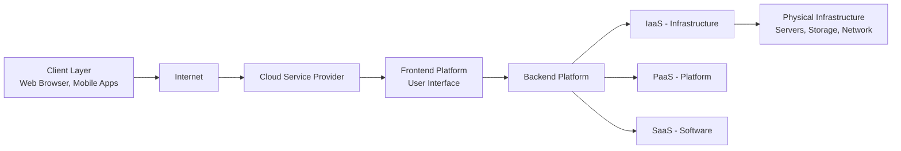
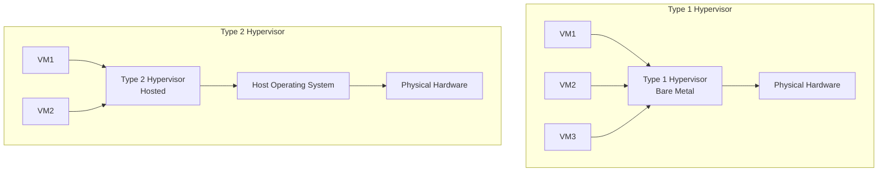
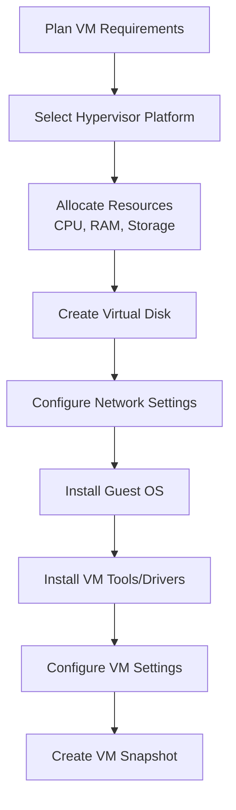
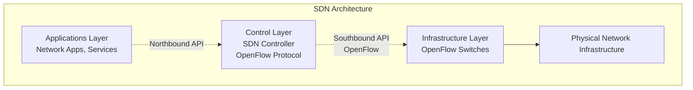
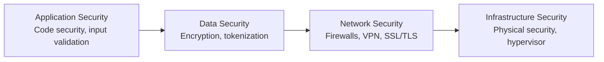
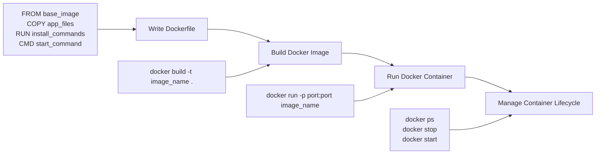

## Question 1(a) [3 marks]

**Define cloud computing and state it's desirable features.**

**Answer**:

**Cloud Computing** is a technology that delivers computing services like servers, storage, databases, and software over the internet, allowing users to access resources on-demand without owning physical infrastructure.

**Desirable Features**:

| Feature | Description |
|---------|-------------|
| **On-demand self-service** | Users can access resources instantly without human interaction |
| **Broad network access** | Services available over network through standard platforms |
| **Resource pooling** | Computing resources are pooled to serve multiple users |
| **Rapid elasticity** | Resources can be scaled up or down quickly |
| **Measured service** | Usage is monitored and billed automatically |

**Mnemonic**: "On-Demand Broad Resources Rapidly Measured"

---

## Question 1(b) [4 marks]

**Draw and explain cloud architecture.**

**Answer**:



**Cloud Architecture Components**:

- **Client Layer**: End-user devices accessing cloud services
- **Internet**: Network connection medium
- **Frontend**: User interface and service management
- **Backend**: Core processing and resource management
- **Service Models**: IaaS, PaaS, SaaS layers
- **Physical Infrastructure**: Hardware resources in data centers

**Mnemonic**: "Clients Connect Through Frontend Backend Services Infrastructure"

---

## Question 1(c) [7 marks]

**Explain the cloud service models in detail.**

**Answer**:

| Service Model | Description | Examples | User Control |
|---------------|-------------|----------|--------------|
| **IaaS** | Infrastructure as a Service - Virtual machines, storage, networks | AWS EC2, Google Compute Engine | High - OS, Runtime, Apps |
| **PaaS** | Platform as a Service - Development platform with tools | Google App Engine, Heroku | Medium - Apps and Data |
| **SaaS** | Software as a Service - Ready-to-use applications | Gmail, Office 365, Salesforce | Low - Only Data |

**Detailed Explanation**:

- **IaaS (Infrastructure as a Service)**: Provides virtualized computing resources including virtual machines, storage, and networking. Users have complete control over operating systems and applications.

- **PaaS (Platform as a Service)**: Offers a development platform with programming tools, database management, and middleware. Developers focus on application logic without infrastructure management.

- **SaaS (Software as a Service)**: Delivers complete applications over the internet. Users simply access the software through web browsers without installation or maintenance.

**Mnemonic**: "Infrastructure Platforms Software - Increasing Abstraction"

---

## Question 1(c OR) [7 marks]

**Explain service level agreement (SLA) in cloud computing with example.**

**Answer**:

**Service Level Agreement (SLA)** is a contract between cloud service provider and customer that defines the expected level of service, performance metrics, and penalties for non-compliance.

**Key Components**:

| Component | Description | Example |
|-----------|-------------|---------|
| **Availability** | Uptime guarantee | 99.9% uptime |
| **Performance** | Response time metrics | <200ms response time |
| **Security** | Data protection standards | ISO 27001 compliance |
| **Support** | Help desk response time | 24/7 support, 4-hour response |
| **Penalties** | Compensation for failures | Service credits for downtime |

**Example - AWS SLA**:

- **EC2 SLA**: 99.99% monthly uptime
- **S3 SLA**: 99.9% availability, 99.999999999% durability
- **Penalty**: 10% service credit if availability drops below threshold

**Benefits**:

- **Accountability**: Clear expectations for both parties
- **Quality assurance**: Guaranteed service levels
- **Risk mitigation**: Compensation for service failures

**Mnemonic**: "Availability Performance Security Support Penalties"

---

## Question 2(a) [3 marks]

**Define virtualization. Give characteristics of virtualization.**

**Answer**:

**Virtualization** is a technology that creates virtual versions of computing resources like servers, storage, or networks, allowing multiple virtual instances to run on single physical hardware.

**Characteristics**:

- **Resource sharing**: Multiple VMs share physical hardware efficiently
- **Isolation**: Virtual machines operate independently without interference
- **Portability**: VMs can be moved between different physical hosts
- **Scalability**: Resources can be allocated dynamically as needed
- **Cost efficiency**: Reduces hardware requirements and operational costs

**Mnemonic**: "Resources Isolated Portable Scalable Cost-effective"

---

## Question 2(b) [4 marks]

**Distinguish between paravirtualization and full virtualization.**

**Answer**:

| Aspect | Paravirtualization | Full Virtualization |
|--------|-------------------|-------------------|
| **Guest OS Modification** | Modified to communicate with hypervisor | No modification needed |
| **Performance** | Higher performance | Slightly lower performance |
| **Hardware Support** | Doesn't require special hardware | Requires hardware virtualization support |
| **Compatibility** | Limited OS compatibility | Supports any OS |
| **Examples** | Xen, VMware ESX | VMware Workstation, VirtualBox |

**Key Differences**:

- **Paravirtualization** requires guest OS to be aware of virtualization and cooperate with hypervisor
- **Full Virtualization** completely emulates hardware, making guest OS unaware of virtualization

**Mnemonic**: "Para Cooperates, Full Emulates"

---

## Question 2(c) [7 marks]

**Define hypervisors. Explain Type 1 and Type 2 hypervisors.**

**Answer**:

**Hypervisor** is software that creates and manages virtual machines by abstracting physical hardware and allocating resources to multiple VMs.



**Comparison**:

| Feature | Type 1 (Bare Metal) | Type 2 (Hosted) |
|---------|-------------------|-----------------|
| **Installation** | Directly on hardware | On host operating system |
| **Performance** | Higher performance | Lower performance |
| **Use Case** | Enterprise, data centers | Desktop virtualization, testing |
| **Examples** | VMware vSphere, Hyper-V | VMware Workstation, VirtualBox |
| **Resource Overhead** | Lower overhead | Higher overhead |

**Type 1 Advantages**: Better performance, direct hardware access, enterprise-grade security
**Type 2 Advantages**: Easier setup, runs alongside host OS, good for development

**Mnemonic**: "Type 1 Bare Metal, Type 2 Hosted"

---

## Question 2(a OR) [3 marks]

**List out types of virtualization and explain any one in brief.**

**Answer**:

**Types of Virtualization**:

- Server Virtualization
- Storage Virtualization  
- Network Virtualization
- Desktop Virtualization
- Application Virtualization
- Memory Virtualization

**Server Virtualization (Detailed)**:
Server virtualization creates multiple virtual servers on single physical server. Each virtual server operates independently with its own operating system and applications.

**Benefits**:

- **Resource optimization**: Better hardware utilization
- **Cost reduction**: Fewer physical servers needed
- **Flexibility**: Easy VM migration and scaling

**Mnemonic**: "Server Storage Network Desktop Application Memory"

---

## Question 2(b OR) [4 marks]

**Describe hardware and software virtualization.**

**Answer**:

| Type | Hardware Virtualization | Software Virtualization |
|------|------------------------|--------------------------|
| **Method** | Uses CPU virtualization features | Pure software emulation |
| **Performance** | Near-native performance | Slower due to emulation |
| **CPU Support** | Requires Intel VT-x or AMD-V | Works on any CPU |
| **Guest OS** | Unmodified OS can run | May require OS modifications |
| **Examples** | VMware vSphere, KVM | QEMU, VMware Workstation (software mode) |

**Hardware Virtualization**: Leverages CPU virtualization extensions to directly execute guest instructions, providing better performance and security isolation.

**Software Virtualization**: Uses binary translation to convert guest instructions to host-compatible instructions, offering broader compatibility but with performance overhead.

**Mnemonic**: "Hardware Fast, Software Compatible"

---

## Question 2(c OR) [7 marks]

**Explain the process of creating and managing virtual machines.**

**Answer**:

**VM Creation Process**:



**Detailed Steps**:

1. **Planning**: Determine CPU cores, RAM, storage, and network requirements
2. **Resource Allocation**: Assign physical resources to virtual machine
3. **Storage Setup**: Create virtual disks (VMDK, VHD, QCOW2 formats)
4. **Network Configuration**: Set up virtual network adapters and connectivity
5. **OS Installation**: Install operating system using ISO or network boot
6. **Tools Installation**: Install hypervisor-specific tools for better integration
7. **Management Tasks**: Monitor performance, create snapshots, backup VMs

**VM Management Operations**:

- **Start/Stop/Restart**: Power operations
- **Snapshot Management**: Create, restore, delete snapshots
- **Resource Scaling**: Add/remove CPU, memory, storage
- **Migration**: Move VMs between hosts
- **Backup/Recovery**: Data protection strategies

**Mnemonic**: "Plan Select Allocate Create Configure Install Manage"

---

## Question 3(a) [3 marks]

**Define Data Center. Describe any two types of data centers.**

**Answer**:

**Data Center** is a facility that houses computer systems, networking equipment, and storage systems along with supporting infrastructure like power, cooling, and security systems.

**Types of Data Centers**:

| Type | Description | Characteristics |
|------|-------------|-----------------|
| **Enterprise Data Center** | Owned and operated by single organization | Private, customized, high security |
| **Colocation Data Center** | Shared facility renting space to multiple clients | Shared infrastructure, cost-effective |

**Enterprise Data Center**:

- Built and managed by organization for internal use
- Complete control over infrastructure and security
- Higher initial investment but customized solutions

**Colocation Data Center**:

- Third-party facility providing space, power, and cooling
- Multiple organizations share common infrastructure
- Lower costs and professional management

**Mnemonic**: "Enterprise Private, Colocation Shared"

---

## Question 3(b) [4 marks]

**Differentiate between scalability and elasticity in cloud data center.**

**Answer**:

| Aspect | Scalability | Elasticity |
|--------|------------|------------|
| **Definition** | Ability to handle increased workload | Automatic scaling based on demand |
| **Response** | Manual or planned scaling | Automatic and rapid response |
| **Direction** | Usually upward scaling | Both up and down scaling |
| **Time Frame** | Long-term capacity planning | Real-time demand response |
| **Resource Usage** | May have unused resources | Optimal resource utilization |

**Key Differences**:

- **Scalability** focuses on capacity to grow, while **Elasticity** emphasizes automatic adjustment
- **Scalability** requires human intervention, **Elasticity** is automated
- **Scalability** is strategic planning, **Elasticity** is operational efficiency

**Examples**:

- **Scalability**: Adding more servers during expected traffic increase
- **Elasticity**: Auto-scaling groups that add/remove instances based on CPU usage

**Mnemonic**: "Scalability Plans, Elasticity Adapts"

---

## Question 3(c) [7 marks]

**Explain SDN (Software-Defined Networking) in data center with diagram.**

**Answer**:



**SDN Components**:

| Layer | Function | Examples |
|-------|----------|----------|
| **Application Layer** | Network applications and services | Load balancers, firewalls, monitoring |
| **Control Layer** | Centralized network control and management | OpenDaylight, ONOS, Floodlight |
| **Infrastructure Layer** | Forwarding devices controlled by controller | OpenFlow switches, routers |

**Key Features**:

- **Centralized Control**: Single point of network management
- **Programmability**: Network behavior defined through software
- **Abstraction**: Separation of control and data planes
- **Dynamic Configuration**: Real-time network policy changes

**Benefits in Data Centers**:

- **Flexibility**: Easy network configuration changes
- **Automation**: Programmable network management
- **Cost Reduction**: Commodity hardware usage
- **Innovation**: Rapid deployment of new services

**Mnemonic**: "Applications Control Infrastructure - Programmable Networks"

---

## Question 3(a OR) [3 marks]

**Identify and describe the key components of a data center.**

**Answer**:

**Key Data Center Components**:

- **Servers**: Computing resources running applications and services
- **Storage Systems**: Data storage arrays (SAN, NAS, DAS)
- **Network Equipment**: Switches, routers, load balancers for connectivity
- **Power Infrastructure**: UPS, generators, PDUs for reliable power
- **Cooling Systems**: HVAC systems maintaining optimal temperature
- **Security Systems**: Physical and logical access controls

**Critical Infrastructure**:
Each component is essential for data center operation, with redundancy built-in for high availability and disaster recovery.

**Mnemonic**: "Servers Store Network Power Cool Secure"

---

## Question 3(b OR) [4 marks]

**List data center network topologies and explain any one of them.**

**Answer**:

**Data Center Network Topologies**:

- Three-tier Architecture
- Spine-Leaf Architecture  
- Fat Tree Topology
- Mesh Topology

**Spine-Leaf Architecture (Detailed)**:

```goat
    +-------+    +-------+    +-------+
    | Leaf1 |    | Leaf2 |    | Leaf3 |
    +-------+    +-------+    +-------+
       | |         | |         | |
       | +---------+ +---------+ |
       |             |           |
    +-------+    +-------+    +-------+
    |Spine1 |    |Spine2 |    |Spine3 |
    +-------+    +-------+    +-------+
```

**Characteristics**:

- **Leaf switches** connect to servers and storage
- **Spine switches** provide inter-leaf connectivity  
- **No leaf-to-leaf connections** - all traffic goes through spine
- **Equal path lengths** between any two endpoints
- **High bandwidth** and **low latency** design

**Mnemonic**: "Three Spine Fat Mesh"

---

## Question 3(c OR) [7 marks]

**Explain Infrastructure as Code (IaC) with its popular automation tools.**

**Answer**:

**Infrastructure as Code (IaC)** is the practice of managing and provisioning computing infrastructure through machine-readable definition files rather than manual processes.

**Key Principles**:

| Principle | Description | Benefits |
|-----------|-------------|----------|
| **Declarative** | Define desired state, not steps | Predictable outcomes |
| **Version Control** | Infrastructure definitions in Git | Change tracking, rollback |
| **Automation** | Automated deployment and updates | Reduced human errors |
| **Consistency** | Same configuration across environments | Reliable deployments |

**Popular IaC Tools**:

| Tool | Type | Description | Use Case |
|------|------|-------------|----------|
| **Terraform** | Declarative | Multi-cloud infrastructure provisioning | Cross-platform deployments |
| **Ansible** | Imperative | Configuration management and automation | Server configuration |
| **CloudFormation** | Declarative | AWS-specific infrastructure templates | AWS resource management |
| **Puppet** | Declarative | Configuration management | Enterprise automation |
| **Chef** | Imperative | Infrastructure automation platform | Complex deployments |

**IaC Benefits**:

- **Speed**: Faster deployment and scaling
- **Consistency**: Identical environments across stages
- **Cost Control**: Resource optimization and tracking
- **Reliability**: Reduced configuration drift
- **Collaboration**: Shared infrastructure definitions

**Implementation Example**:

```
# Terraform example
resource "aws_instance" "web_server" {
  ami           = "ami-12345678"
  instance_type = "t2.micro"
  tags = {
    Name = "WebServer"
  }
}
```

**Mnemonic**: "Terraform Ansible CloudFormation Puppet Chef"

---

## Question 4(a) [3 marks]

**Define cloud storage. Write example of cloud storage services.**

**Answer**:

**Cloud Storage** is a service that allows users to store, access, and manage data on remote servers over the internet instead of local storage devices.

**Examples of Cloud Storage Services**:

| Provider | Service | Type | Use Case |
|----------|---------|------|----------|
| **Amazon** | S3 (Simple Storage Service) | Object Storage | Web applications, backup |
| **Google** | Google Drive | File Storage | Personal, collaboration |
| **Microsoft** | Azure Blob Storage | Object Storage | Enterprise applications |
| **Dropbox** | Dropbox | File Sync | File sharing, sync |
| **iCloud** | Apple iCloud | Personal Cloud | iOS device backup |

**Key Benefits**: Accessibility, scalability, cost-effectiveness, automatic backup

**Mnemonic**: "Amazon Google Microsoft Dropbox Apple"

---

## Question 4(b) [4 marks]

**Differentiate between data consistency and durability.**

**Answer**:

| Aspect | Data Consistency | Data Durability |
|--------|------------------|-----------------|
| **Definition** | All nodes see same data simultaneously | Data persists despite system failures |
| **Focus** | Data accuracy and synchronization | Data preservation and recovery |
| **Challenge** | Concurrent access conflicts | Hardware failures, disasters |
| **Solutions** | ACID properties, eventual consistency | Replication, backups, redundancy |
| **Examples** | Bank transactions, inventory updates | File backups, disaster recovery |

**Data Consistency**: Ensures all database nodes contain identical data at any given time, crucial for applications requiring real-time accuracy.

**Data Durability**: Guarantees that committed data remains available even after system crashes, power failures, or hardware malfunctions.

**Trade-offs**: Strong consistency may impact performance, while high durability requires additional storage costs.

**Mnemonic**: "Consistency Synchronizes, Durability Survives"

---

## Question 4(c) [7 marks]

**Explain types of cloud storage in detail.**

**Answer**:

| Storage Type | Description | Use Cases | Examples |
|--------------|-------------|-----------|----------|
| **Object Storage** | Stores files as objects with metadata | Web apps, content distribution | Amazon S3, Google Cloud Storage |
| **Block Storage** | Raw block-level storage for databases | High-performance databases | Amazon EBS, Azure Disk |
| **File Storage** | Traditional hierarchical file system | File sharing, content management | Amazon EFS, Azure Files |

**Detailed Explanation**:

**Object Storage**:

- **Structure**: Flat namespace with unique object identifiers
- **Scalability**: Virtually unlimited capacity
- **Access**: REST APIs, web interfaces
- **Benefits**: Cost-effective, globally accessible, metadata support

**Block Storage**:

- **Structure**: Raw storage blocks attached to compute instances
- **Performance**: High IOPS, low latency
- **Access**: Direct block-level access
- **Benefits**: High performance, database optimization

**File Storage**:

- **Structure**: Traditional directory/folder hierarchy
- **Sharing**: Multi-user concurrent access
- **Access**: Standard file system protocols (NFS, SMB)
- **Benefits**: Familiar interface, application compatibility

**Selection Criteria**:

- **Performance requirements**: Block for databases, Object for web
- **Access patterns**: File for shared access, Object for web apps
- **Cost considerations**: Object cheapest, Block most expensive

**Mnemonic**: "Objects Scale, Blocks Perform, Files Share"

---

## Question 4(a OR) [3 marks]

**Define cloud databases. Write example of cloud database services.**

**Answer**:

**Cloud Databases** are database services hosted and managed by cloud providers, offering scalability, high availability, and reduced administration overhead.

**Examples of Cloud Database Services**:

| Provider | Service | Type | Features |
|----------|---------|------|----------|
| **Amazon** | RDS (Relational Database Service) | SQL | MySQL, PostgreSQL, Oracle |
| **Google** | Cloud SQL | SQL | Managed MySQL, PostgreSQL |
| **Microsoft** | Azure SQL Database | SQL | SQL Server in cloud |
| **MongoDB** | Atlas | NoSQL | Managed MongoDB |
| **Amazon** | DynamoDB | NoSQL | Key-value, document store |

**Benefits**: Automatic scaling, backup management, security updates, global availability

**Mnemonic**: "Amazon Google Microsoft MongoDB"

---

## Question 4(b OR) [4 marks]

**Describe data scaling and replication.**

**Answer**:

**Data Scaling**:

| Scaling Type | Description | Method | Benefits |
|--------------|-------------|--------|----------|
| **Vertical Scaling** | Increase server capacity | Add CPU, RAM, storage | Simple, no code changes |
| **Horizontal Scaling** | Add more servers | Distribute across nodes | Better fault tolerance |

**Data Replication**:

| Replication Type | Description | Use Case | Consistency |
|------------------|-------------|----------|-------------|
| **Master-Slave** | One write node, multiple read nodes | Read-heavy workloads | Eventual consistency |
| **Master-Master** | Multiple write nodes | High availability | Conflict resolution needed |
| **Peer-to-Peer** | All nodes equal | Distributed systems | Complex consistency |

**Key Benefits**:

- **Scaling**: Handle increased load and data volume
- **Replication**: Improve availability and disaster recovery
- **Performance**: Distribute load across multiple systems
- **Fault Tolerance**: Continue operations despite failures

**Mnemonic**: "Vertical Horizontal, Master Slave Peer"

---

## Question 4(c OR) [7 marks]

**Explain types of cloud databases.**

**Answer**:

| Database Type | Description | Examples | Use Cases |
|---------------|-------------|----------|-----------|
| **Relational (SQL)** | Structured data with ACID properties | MySQL, PostgreSQL, Oracle | Financial systems, ERP |
| **Document** | JSON-like document storage | MongoDB, CouchDB | Content management, catalogs |
| **Key-Value** | Simple key-value pairs | Redis, DynamoDB | Caching, session storage |
| **Column-Family** | Wide-column storage | Cassandra, HBase | Time-series, IoT data |
| **Graph** | Nodes and relationships | Neo4j, Amazon Neptune | Social networks, recommendations |

**SQL vs NoSQL Comparison**:

| Aspect | SQL Databases | NoSQL Databases |
|--------|---------------|-----------------|
| **Schema** | Fixed schema | Flexible schema |
| **Scaling** | Vertical scaling | Horizontal scaling |
| **ACID** | Full ACID compliance | BASE properties |
| **Queries** | SQL language | Various query methods |
| **Consistency** | Strong consistency | Eventual consistency |

**Selection Criteria**:

- **Data Structure**: Structured data → SQL, Unstructured → NoSQL  
- **Scalability**: Horizontal scaling → NoSQL
- **Consistency**: Strong consistency → SQL
- **Complexity**: Complex queries → SQL, Simple access → NoSQL

**Cloud Database Services**:

- **Amazon**: RDS (SQL), DynamoDB (NoSQL), DocumentDB (Document)
- **Google**: Cloud SQL, Firestore, BigTable
- **Microsoft**: Azure SQL, Cosmos DB

**Mnemonic**: "Relational Document Key Column Graph"

---

## Question 5(a) [3 marks]

**Define cloud security. List out various Challenges for Cloud Security.**

**Answer**:

**Cloud Security** refers to the policies, technologies, applications, and controls utilized to protect virtualized IP, data, applications, services, and infrastructure associated with cloud computing.

**Cloud Security Challenges**:

- **Data breaches and privacy concerns**
- **Identity and access management complexity**  
- **Insider threats and privileged user access**
- **Compliance and regulatory requirements**
- **Shared responsibility model confusion**
- **API security vulnerabilities**

**Key Challenge Areas**:
Each challenge requires specific security strategies and tools to mitigate risks and ensure data protection in cloud environments.

**Mnemonic**: "Data Identity Insider Compliance Shared API"

---

## Question 5(b) [4 marks]

**Write a short note on Identity Management and Access Control.**

**Answer**:

**Identity and Access Management (IAM)**:

| Component | Description | Function |
|-----------|-------------|----------|
| **Authentication** | Verify user identity | Username/password, MFA, biometrics |
| **Authorization** | Grant appropriate permissions | Role-based access control (RBAC) |
| **Accounting** | Track user activities | Audit logs, compliance reporting |

**Access Control Models**:

- **Role-Based Access Control (RBAC)**: Users assigned roles with specific permissions
- **Attribute-Based Access Control (ABAC)**: Dynamic permissions based on attributes
- **Mandatory Access Control (MAC)**: System-enforced security policies

**Best Practices**:

- **Principle of least privilege**: Minimum necessary access
- **Multi-factor authentication**: Enhanced security verification
- **Regular access reviews**: Periodic permission audits
- **Zero trust model**: Verify every access request

**Mnemonic**: "Authenticate Authorize Account"

---

## Question 5(c) [7 marks]

**Explain the technologies used for data security in cloud.**

**Answer**:

| Technology | Purpose | Description | Implementation |
|------------|---------|-------------|----------------|
| **Encryption** | Data protection | Converts data to unreadable format | AES-256, RSA encryption |
| **Key Management** | Secure key storage | Centralized key lifecycle management | AWS KMS, Azure Key Vault |
| **Digital Signatures** | Data integrity | Verify data authenticity | PKI certificates |
| **Access Controls** | Permission management | Role-based access restrictions | IAM policies, RBAC |
| **Network Security** | Traffic protection | Secure data transmission | VPN, TLS/SSL, firewalls |
| **Data Loss Prevention** | Prevent data leaks | Monitor and control data movement | DLP tools, content inspection |
| **Backup & Recovery** | Data availability | Disaster recovery planning | Automated backups, replication |

**Security Implementation Layers**:



**Key Security Practices**:

- **Data at Rest**: Encrypt stored data using strong encryption algorithms
- **Data in Transit**: Secure transmission using TLS/SSL protocols  
- **Data in Use**: Protect data during processing with secure enclaves
- **Key Rotation**: Regular cryptographic key updates
- **Compliance**: Meet regulatory requirements (GDPR, HIPAA, SOX)

**Emerging Technologies**:

- **Homomorphic Encryption**: Compute on encrypted data
- **Zero-Knowledge Proofs**: Verify without revealing data
- **Confidential Computing**: Protect data during processing

**Mnemonic**: "Encrypt Keys Sign Control Network Prevent Backup"

---

## Question 5(a OR) [3 marks]

**Define serverless computing. List out advantages of serverless computing.**

**Answer**:

**Serverless Computing** is a cloud execution model where cloud providers dynamically manage server allocation and scaling, allowing developers to focus solely on code without server management.

**Advantages of Serverless Computing**:

- **No server management**: Cloud provider handles infrastructure
- **Automatic scaling**: Scales up/down based on demand automatically  
- **Pay-per-use pricing**: Only pay for actual execution time
- **Faster development**: Focus on business logic, not infrastructure
- **High availability**: Built-in fault tolerance and redundancy
- **Reduced operational overhead**: No patching, monitoring servers

**Popular Examples**: AWS Lambda, Azure Functions, Google Cloud Functions

**Mnemonic**: "No Automatic Pay Faster High Reduced"

---

## Question 5(b OR) [4 marks]

**Differentiate between edge and fog computing.**

**Answer**:

| Aspect | Edge Computing | Fog Computing |
|--------|----------------|---------------|
| **Location** | At network edge, close to devices | Between cloud and edge devices |
| **Processing** | Local processing on edge devices | Distributed processing across nodes |
| **Latency** | Ultra-low latency | Low to medium latency |
| **Connectivity** | Direct device connection | Hierarchical network structure |
| **Use Cases** | IoT sensors, autonomous vehicles | Smart cities, industrial automation |
| **Examples** | Smartphone apps, smart cameras | Router-based processing, gateways |

**Key Differences**:

- **Edge** brings compute directly to data source
- **Fog** creates a distributed computing layer
- **Edge** optimizes for immediate response
- **Fog** provides broader area coverage

**Benefits of Both**:

- Reduced bandwidth usage to cloud
- Improved response times
- Enhanced privacy and security
- Better reliability for critical applications

**Mnemonic**: "Edge Direct, Fog Distributed"

---

## Question 5(c OR) [7 marks]

**Define Containers. Explain steps to create image and execute the docker container with example.**

**Answer**:

**Containers** are lightweight, portable packages that include application code, runtime, system tools, libraries, and settings needed to run an application consistently across different environments.

**Docker Container Creation Steps**:



**Step-by-Step Process**:

**1. Create Dockerfile**:

```dockerfile
# Base image
FROM node:14-alpine

# Set working directory
WORKDIR /app

# Copy package files
COPY package*.json ./

# Install dependencies
RUN npm install

# Copy application code
COPY . .

# Expose port
EXPOSE 3000

# Start command
CMD ["npm", "start"]
```

**2. Build Docker Image**:

```bash
# Build image from Dockerfile
docker build -t my-web-app:latest .

# List images
docker images
```

**3. Run Docker Container**:

```bash
# Run container with port mapping
docker run -d -p 8080:3000 --name web-app my-web-app:latest

# Check running containers
docker ps
```

**4. Container Management**:

| Command | Purpose | Example |
|---------|---------|---------|
| **docker ps** | List running containers | `docker ps -a` |
| **docker stop** | Stop container | `docker stop web-app` |
| **docker start** | Start stopped container | `docker start web-app` |
| **docker logs** | View container logs | `docker logs web-app` |
| **docker exec** | Execute command in container | `docker exec -it web-app /bin/sh` |

**Container Benefits**:

- **Portability**: Run anywhere Docker is installed
- **Consistency**: Same environment across development/production
- **Isolation**: Applications run independently
- **Efficiency**: Share OS kernel, lightweight compared to VMs
- **Scalability**: Easy horizontal scaling with orchestration

**Docker vs VM Comparison**:

```goat
    Docker Containers              Virtual Machines
    +-------------------+          +-------------------+
    |   App A   App B   |          |   App A   App B   |
    |  Runtime Runtime  |          |   OS A    OS B    |
    +-------------------+          +-------------------+
    |   Docker Engine   |          |    Hypervisor     |
    +-------------------+          +-------------------+
    |    Host OS        |          |     Host OS       |
    +-------------------+          +-------------------+
    |    Hardware       |          |     Hardware      |
    +-------------------+          +-------------------+
```

**Common Docker Commands**:

- **Image Management**: `docker pull`, `docker push`, `docker rmi`
- **Container Operations**: `docker create`, `docker kill`, `docker rm`
- **System Info**: `docker info`, `docker version`, `docker system df`

**Example Use Case**:
A web application with Node.js backend can be containerized to ensure consistent deployment across development, testing, and production environments, eliminating "works on my machine" issues.

**Container Orchestration**:
For production deployments, use orchestration tools like:

- **Kubernetes**: Advanced container orchestration
- **Docker Swarm**: Native Docker clustering
- **Amazon ECS**: AWS container service

**Mnemonic**: "Create Build Run Manage - Dockerfile Commands Lifecycle"
