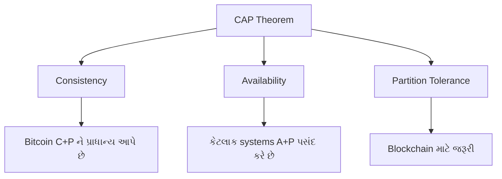
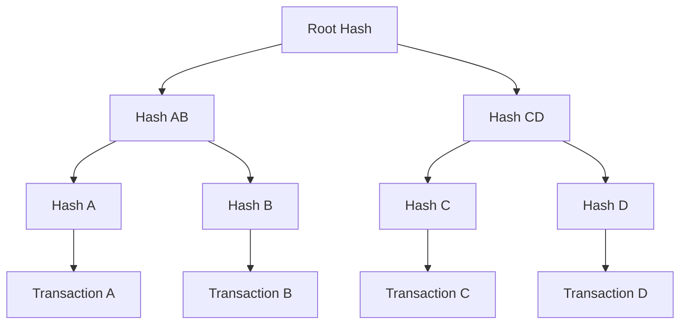
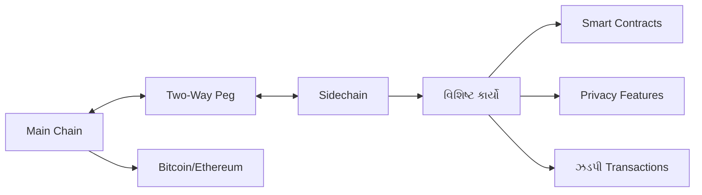
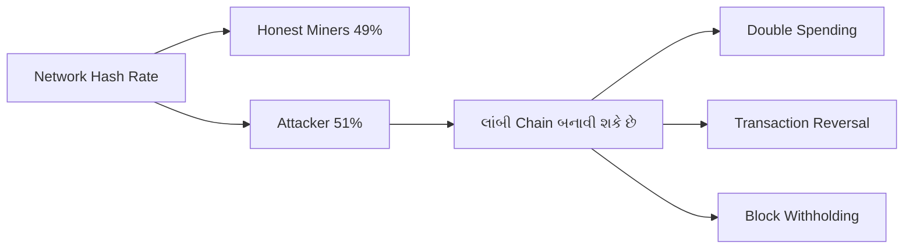
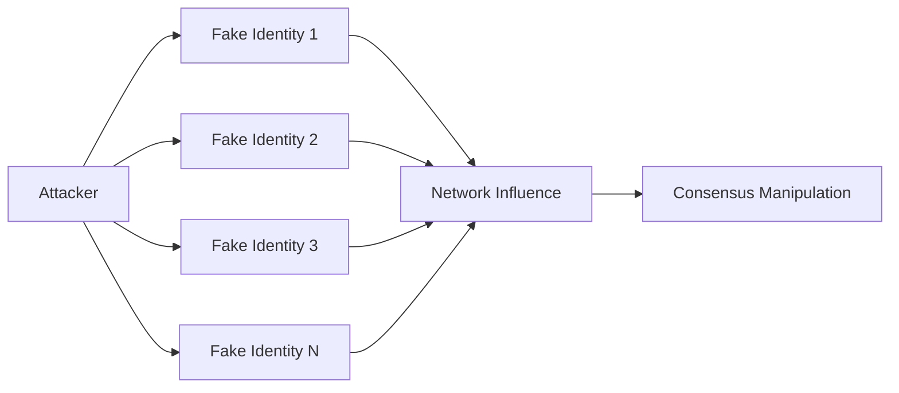
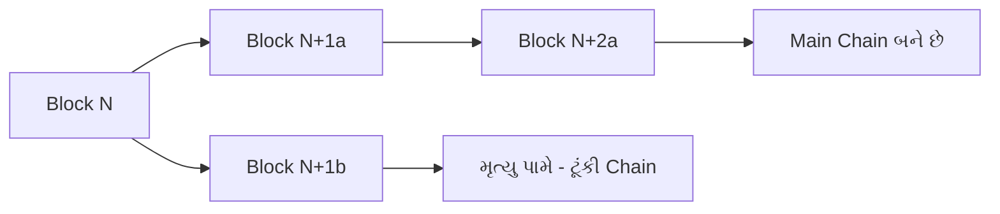
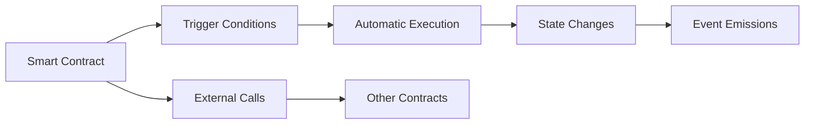

## પ્રશ્ન 1(અ) [3 ગુણ]

**Distributed ledger systems ના ઉપયોગમાં લેવાના ફાયદાઓ સમજાવો.**

**જવાબ**:

**ટેબલ: Distributed Ledger Systems ના ફાયદાઓ**

| ફાયદો | વર્ણન |
|-------|------|
| **પારદર્શિતા** | બધા સહભાગીઓ transaction history જોઈ શકે છે |
| **સુરક્ષા** | Cryptographic સુરક્ષા છેડછાડ સામે |
| **વિકેન્દ્રીકરણ** | એક જ નિયંત્રણ અથવા નિષ્ફળતાનું બિંદુ નથી |
| **અપરિવર્તનીયતા** | એકવાર confirm થયા પછી records બદલી શકાતા નથી |

**મેમરી ટ્રીક:** "T-S-D-I" (Transparent, Secure, Decentralized, Immutable)

## પ્રશ્ન 1(બ) [4 ગુણ]

**વ્યાખ્યાયિત કરો: 1) Blockchain 2) Distributed systems**

**જવાબ**:

**ટેબલ: મુખ્ય વ્યાખ્યાઓ**

| શબ્દ | વ્યાખ્યા |
|-----|-------|
| **Blockchain** | Transaction data ધરાવતા blocks ની chain, cryptographic hashes દ્વારા જોડાયેલ |
| **Distributed Systems** | સ્વતંત્ર computers નું network એક single system તરીકે કામ કરતું |

**મુખ્ય લાક્ષણિકતાઓ**:

- **Blockchain**: Hash pointers, consensus mechanisms, અને merkle trees વાપરે છે
- **Distributed Systems**: Fault tolerance, scalability, અને resource sharing

**મેમરી ટ્રીક:** Blockchain માટે "Chain-Hash-Consensus", Distributed માટે "Network-Independent-Together"

## પ્રશ્ન 1(ક) [7 ગુણ]

**Blockchain network વડે CAP theorem વર્ણવો.**

**જવાબ**:

**ટેબલ: CAP Theorem ના ઘટકો**

| ગુણધર્મ | વર્ણન | Blockchain સંદર્ભ |
|--------|------|-----------------|
| **Consistency** | બધા nodes એ જ data જુએ છે | બધા nodes પાસે સમાન ledger |
| **Availability** | System કાર્યરત રહે છે | Network accessible રહે છે |
| **Partition Tolerance** | Network failures છતાં કામ કરે છે | Node disconnections દર્મિયાન ચાલુ રહે છે |

**આકૃતિ:**



**મુખ્ય મુદ્દાઓ**:

- **Trade-off**: 3 માંથી માત્ર 2 properties એક સાથે મેળવી શકાય
- **Blockchain Choice**: મોટાભાગના blockchains Consistency + Partition Tolerance પસંદ કરે છે
- **ઉદાહરણ**: Bitcoin અસ્થાયી રૂપે unavailable બની શકે પણ consistency જાળવે છે

**મેમરી ટ્રીક:** "CAP-2-out-of-3" (3 માંથી કોઈ પણ 2 Properties પસંદ કરો)

## પ્રશ્ન 1(ક) OR [7 ગુણ]

**Blockchain network ની ઉપયોગિતાઓ યાદી બનાવો અને સમજાવો.**

**જવાબ**:

**ટેબલ: Blockchain Applications**

| Application | વર્ણન | ઉદાહરણ |
|-------------|-------|---------|
| **Cryptocurrency** | Digital money transactions | Bitcoin, Ethereum |
| **Supply Chain** | ઉત્પાદનો ને origin થી track કરવું | Walmart food tracing |
| **Healthcare** | સુરક્ષિત patient records | Medical data sharing |
| **Voting** | પારદર્શી elections | Estonia e-voting |
| **Real Estate** | Property ownership records | Land registries |

**મુખ્ય ફાયદાઓ**:

- **પારદર્શિતા**: બધા transactions સહભાગીઓને દૃશ્યમાન
- **સુરક્ષા**: છેતરપિંડી સામે cryptographic સુરક્ષા
- **કાર્યક્ષમતા**: મધ્યસ્થીઓ અને ખર્ચમાં ઘટાડો

**મેમરી ટ્રીક:** "C-S-H-V-R" (Crypto, Supply, Health, Vote, Real estate)

## પ્રશ્ન 2(અ) [3 ગુણ]

**Permissionless blockchain ની વ્યાખ્યા કરો અને સમજાવો.**

**જવાબ**:

**વ્યાખ્યા**: એક blockchain જ્યાં કોઈપણ વ્યક્તિ કેન્દ્રીય સત્તાધિકારીની પરવાનગી વગર ભાગ લઈ શકે છે.

**ટેબલ: Permissionless Blockchain ની લાક્ષણિકતાઓ**

| લાક્ષણિકતા | વર્ણન |
|-----------|------|
| **ખુલ્લી પહોંચ** | કોઈપણ join કરી અને ભાગ લઈ શકે છે |
| **જાહેર ચકાસણી** | બધા transactions જાહેરમાં verifiable છે |
| **વિકેન્દ્રીકૃત** | કોઈ કેન્દ્રીય નિયંત્રણ સત્તા નથી |

**મુખ્ય લાક્ષણિકતાઓ**:

- **Consensus**: Proof-of-work અથવા proof-of-stake વાપરે છે
- **ઉદાહરણો**: Bitcoin, Ethereum mainnet

**મેમરી ટ્રીક:** "Open-Public-Decentralized" (OPD)

## પ્રશ્ન 2(બ) [4 ગુણ]

**Blockchain ના data structure ની આકૃતિ દોરો અને સંક્ષિપ્તમાં સમજૂતી આપો.**

**જવાબ**:

**આકૃતિ: Blockchain Data Structure**

```goat
+-------------------+    +-------------------+    +-------------------+
|     Block 1       |    |     Block 2       |    |     Block 3       |
|-------------------|    |-------------------|    |-------------------|
| Previous Hash: 0  |--->| Previous Hash: H1 |--->| Previous Hash: H2 |
| Merkle Root: MR1  |    | Merkle Root: MR2  |    | Merkle Root: MR3  |
| Timestamp: T1     |    | Timestamp: T2     |    | Timestamp: T3     |
| Nonce: N1         |    | Nonce: N2         |    | Nonce: N3         |
| Transactions: TX1 |    | Transactions: TX2 |    | Transactions: TX3 |
+-------------------+    +-------------------+    +-------------------+
```

**મુખ્ય ઘટકો**:

- **Previous Hash**: Blocks ને એકસાથે જોડે છે અને chain બનાવે છે
- **Merkle Root**: Block માં બધા transactions નો સારાંશ
- **Timestamp**: Block ક્યારે બનાવ્યો તે સમય
- **Nonce**: Proof-of-work માટે એકવાર વાપરાતો આંકડો

**મેમરી ટ્રીક:** "P-M-T-N" (Previous, Merkle, Time, Nonce)

## પ્રશ્ન 2(ક) [7 ગુણ]

**Blockchain ના core components ની સમજૂતી યોગ્ય આકૃતિ સાથે આપો.**

**જવાબ**:

**ટેબલ: Blockchain ના મુખ્ય ઘટકો**

| ઘટક | કાર્ય | હેતુ |
|-----|-----|-----|
| **Blocks** | Data containers | Transaction માહિતી સ્ટોર કરવા |
| **Hash Functions** | Digital fingerprints બનાવવા | Data integrity સુનિશ્ચિત કરવા |
| **Merkle Trees** | Transaction summaries | કાર્યક્ષમ verification |
| **Consensus Mechanism** | Agreement protocol | નવા blocks validate કરવા |
| **Digital Signatures** | Identity verification | Transactions authenticate કરવા |

**આકૃતિ: Merkle Tree Structure**



**મુખ્ય મુદ્દાઓ**:

- **અપરિવર્તનીયતા**: Hash functions છેડછાડ શોધી શકાય એવું બનાવે છે
- **કાર્યક્ષમતા**: Merkle trees ઝડપી verification માટે પરવાનગી આપે છે
- **વિકેન્દ્રીકરણ**: Consensus mechanisms કેન્દ્રીય સત્તાને દૂર કરે છે

**મેમરી ટ્રીક:** "B-H-M-C-D" (Blocks, Hash, Merkle, Consensus, Digital)

## પ્રશ્ન 2(અ) OR [3 ગુણ]

**Permissioned blockchain ની વ્યાખ્યા કરો અને સમજાવો.**

**જવાબ**:

**વ્યાખ્યા**: એક blockchain જ્યાં ભાગ લેવા માટે શાસન સત્તાધિકારીની સ્પષ્ટ પરવાનગીની જરૂર હોય છે.

**ટેબલ: Permissioned Blockchain ની લાક્ષણિકતાઓ**

| લાક્ષણિકતા | વર્ણન |
|-----------|------|
| **પ્રતિબંધિત પહોંચ** | માત્ર અધિકૃત users ભાગ લઈ શકે છે |
| **ખાનગી Network** | નિયંત્રિત membership |
| **કેન્દ્રીકૃત નિયંત્રણ** | શાસન સંસ્થા permissions વ્યવસ્થાપિત કરે છે |

**મુખ્ય લાક્ષણિકતાઓ**:

- **ગોપનીયતા**: સંવેદનશીલ data માટે વધારેલી ગુપ્તતા
- **પ્રદર્શન**: ઓછા validators ને કારણે ઝડપી transactions
- **ઉદાહરણો**: Hyperledger Fabric, R3 Corda

**મેમરી ટ્રીક:** "Restricted-Private-Centralized" (RPC)

## પ્રશ્ન 2(બ) OR [4 ગુણ]

**Wallet ના પ્રકાર blockchain ના સંદર્ભમાં સમજાવો. તેમજ ચોક્કસ જરૂરિયાત માટે Wallet પસંદ કરતી વખતે ધ્યાનમાં લેવાના પરિબળોની ચર્ચા કરો.**

**જવાબ**:

**ટેબલ: Blockchain Wallets ના પ્રકારો**

| Wallet પ્રકાર | વર્ણન | સુરક્ષા સ્તર |
|-------------|------|-------------|
| **Hot Wallets** | Internet સાથે જોડાયેલ | મધ્યમ |
| **Cold Wallets** | Offline storage | ઊંચું |
| **Hardware Wallets** | ભૌતિક devices | ખૂબ ઊંચું |
| **Paper Wallets** | છાપેલી keys | ઊંચું (જો સુરક્ષિત રીતે સંગ્રહિત) |

**પસંદગીના પરિબળો**:

- **સુરક્ષા જરૂરિયાતો**: ઊંચું મૂલ્ય બહેતર સુરક્ષાની જરૂર પાડે છે
- **ઉપયોગની આવર્તન**: નિયમિત ઉપયોગ hot wallets ને તરફેણ કરે છે
- **તકનીકી કુશળતા**: શરૂઆતીઓ માટે સરળ wallets

**મેમરી ટ્રીક:** "H-C-H-P" (Hot, Cold, Hardware, Paper)

## પ્રશ્ન 2(ક) OR [7 ગુણ]

**Sidechain ને યોગ્ય આકૃતિ સાથે વિગતવાર સમજાવો.**

**જવાબ**:

**વ્યાખ્યા**: એક અલગ blockchain જે two-way peg વાપરીને parent blockchain સાથે જોડાયેલ છે.

**આકૃતિ: Sidechain Architecture**



**ટેબલ: Sidechain ના ફાયદાઓ**

| ફાયદો | વર્ણન |
|------|------|
| **માપનીયતા** | Main chain પરનો લોડ ઘટાડે છે |
| **પ્રયોગશીલતા** | નવી features સુરક્ષિત રીતે test કરે છે |
| **વિશિષ્ટ કાર્યો** | કસ્ટમ applications |
| **Interoperability** | વિવિધ blockchains ને જોડે છે |

**મુખ્ય પદ્ધતિઓ**:

- **Two-Way Peg**: Chains વચ્ચે asset transfer માટે પરવાનગી આપે છે
- **SPV Proofs**: Simplified payment verification
- **Federated Control**: બહુવિધ parties transfers નું વ્યવસ્થાપન કરે છે

**મેમરી ટ્રીક:** "S-E-S-I" (Scalability, Experimentation, Specialized, Interoperability)

## પ્રશ્ન 3(અ) [3 ગુણ]

**Blockchain network માં transaction ના સંદર્ભમાં "Confirmation" અને "Finality" ને વ્યાખ્યાયિત કરો.**

**જવાબ**:

**ટેબલ: Transaction States**

| શબ્દ | વ્યાખ્યા |
|-----|-------|
| **Confirmation** | Transaction block ની ઉપર બનાવાયેલા blocks ની સંખ્યા |
| **Finality** | જ્યાં transaction અપરિવર્તનીય બને છે તે બિંદુ |

**મુખ્ય મુદ્દાઓ**:

- **Confirmation Count**: વધુ confirmations = વધુ સુરક્ષા
- **Bitcoin Standard**: ઊંચા મૂલ્યના transactions માટે 6 confirmations
- **Finality પ્રકારો**: Probabilistic (Bitcoin) vs Absolute (કેટલાક PoS systems)

**મેમરી ટ્રીક:** Confirmation માટે "Count-Blocks-Security", Finality માટે "Irreversible-Point"

## પ્રશ્ન 3(બ) [4 ગુણ]

**Proof of Work અને Proof of Stake નો તફાવત આપો.**

**જવાબ**:

**ટેબલ: PoW vs PoS સરખામણી**

| પાસું | Proof of Work (PoW) | Proof of Stake (PoS) |
|------|-------------------|-------------------|
| **સંસાધન** | Computational power | Stake ownership |
| **Energy Use** | ઊંચું | નીચું |
| **સુરક્ષા** | Hash rate dependent | Stake dependent |
| **Rewards** | Mining rewards | Staking rewards |
| **ઉદાહરણો** | Bitcoin, Ethereum (જૂનું) | Ethereum 2.0, Cardano |

**મુખ્ય તફાવતો**:

- **પદ્ધતિ**: PoW mining વાપરે, PoS validators વાપરે
- **પર્યાવરણીય અસર**: PoS વધુ પર્યાવરણ-મિત્ર છે
- **પ્રવેશ અવરોધો**: PoS પ્રારંભિક stake જરૂરે, PoW hardware જરૂરે

**મેમરી ટ્રીક:** "Work-vs-Stake" (Computational Work vs Financial Stake)

## પ્રશ્ન 3(ક) [7 ગુણ]

**Blockchain network ના સંદર્ભમાં 51% attack સમજાવો.**

**જવાબ**:

**વ્યાખ્યા**: એક attack જ્યાં એક જ entity network ના mining power અથવા stake ના 50% થી વધુ પર નિયંત્રણ રાખે છે.

**આકૃતિ: 51% Attack Scenario**



**ટેબલ: Attack ની ક્ષમતાઓ અને મર્યાદાઓ**

| કરી શકે છે | કરી શકતું નથી |
|----------|-------------|
| પોતાના coins double spend કરવું | બીજાના coins ચોરી કરવું |
| તાજેતરના transactions reverse કરવું | કંઈ પણ માંથી coins બનાવવું |
| ચોક્કસ transactions block કરવું | Consensus rules બદલવા |
| Blockchain fork કરવું | Private keys ને access કરવા |

**રોકથામના પગલાં**:

- **વૈવિધ્યસભર Mining**: બહુવિધ mining pools ને પ્રોત્સાહન આપવું
- **Checkpoint Systems**: સમયાંતરે finality markers
- **આર્થિક પ્રોત્સાહનો**: Attacks ને અલાભકારક બનાવવા

**અસર**:

- **Network વિક્ષેપ**: અસ્થાયી સેવા વિક્ષેપ
- **આર્થિક નુકસાન**: ઘટેલો વિશ્વાસ અને મૂલ્ય
- **પુનઃપ્રાપ્તિ**: Attack સમાપ્ત થયા પછી network સામાન્યત: સ્વસ્થ થાય છે

**મેમરી ટ્રીક:** "Majority-Control-Attack" (51% = Majority Control = Attack Power)

## પ્રશ્ન 3(અ) OR [3 ગુણ]

**"Hard fork" અને "Soft fork" ની વ્યાખ્યા આપો.**

**જવાબ**:

**ટેબલ: Fork પ્રકારો**

| Fork પ્રકાર | વ્યાખ્યા | સુસંગતતા |
|-----------|--------|----------|
| **Hard Fork** | Non-backward compatible protocol change | સુસંગત નથી |
| **Soft Fork** | Backward compatible protocol change | સુસંગત છે |

**મુખ્ય લાક્ષણિકતાઓ**:

- **Hard Fork**: નવી blockchain branch બનાવે છે, બધા nodes ને upgrade જરૂરી
- **Soft Fork**: Rules ને tight કરે છે, જૂના nodes હજી પણ operate કરી શકે છે

**ઉદાહરણો**:

- **Hard Fork**: Bitcoin Cash નો Bitcoin માંથી વિભાજન
- **Soft Fork**: Bitcoin માં SegWit activation

**મેમરી ટ્રીક:** "Hard-Breaks-Compatibility" vs "Soft-Keeps-Compatibility"

## પ્રશ્ન 3(બ) OR [4 ગુણ]

**વિવિધ પ્રકારના consensus mechanisms ની યાદી બનાવો અને કોઈ પણ એકને વિગતવાર સમજાવો.**

**જવાબ**:

**ટેબલ: Consensus Mechanisms**

| પદ્ધતિ | વર્ણન | Energy Use |
|-------|-------|------------|
| **Proof of Work** | Computational puzzle solving | ઊંચું |
| **Proof of Stake** | Stake-based validation | નીચું |
| **Delegated PoS** | મત આપેલા પ્રતિનિધિઓ validate કરે છે | ખૂબ નીચું |
| **Proof of Authority** | પૂર્વ-મંજૂર validators | ન્યૂનતમ |

**વિગતવાર સમજૂતી - Proof of Stake (PoS)**:

**પ્રક્રિયા**:

- **Validator Selection**: Stake amount અને randomization આધારે
- **Block Creation**: પસંદ કરાયેલ validator નવો block propose કરે છે
- **Validation**: બીજા validators block verify કરે છે અને attest કરે છે
- **Rewards**: Validators fees અને નવા tokens મેળવે છે

**ફાયદાઓ**: ઓછું energy consumption, ઘટેલું centralization risk
**નુકસાનો**: "Nothing at stake" problem, પ્રારંભિક વિતરણ સમસ્યાઓ

**મેમરી ટ્રીક:** "Stake-Select-Validate-Reward" (PoS Process)

## પ્રશ્ન 3(ક) OR [7 ગુણ]

**Blockchain network ના સંદર્ભમાં sybil attack સમજાવો.**

**જવાબ**:

**વ્યાખ્યા**: એક attack જ્યાં એક જ શત્રુ network માં અપ્રમાણસર પ્રભાવ મેળવવા માટે બહુવિધ નકલી identities બનાવે છે.

**આકૃતિ: Sybil Attack Structure**



**ટેબલ: Attack પદ્ધતિઓ અને બચાવો**

| Attack પદ્ધતિ | વર્ણન | બચાવ |
|-------------|-------|-----|
| **Identity Flooding** | ઘણી નકલી nodes બનાવવી | Proof of Work/Stake |
| **Routing Manipulation** | Network paths નિયંત્રિત કરવા | Reputation systems |
| **Consensus Disruption** | Voting પ્રભાવિત કરવું | Resource requirements |

**Blockchain પર અસર**:

- **Network Partitioning**: Honest nodes ને અલગ પાડવા
- **Double Spending**: છેતરપિંડીવાળા transactions ને સહાય કરવી
- **Consensus Failure**: Network agreement અટકાવવું

**રોકથામ પદ્ધતિઓ**:

- **Resource Requirements**: PoW/PoS attacks ને મોંઘા બનાવે છે
- **Identity Verification**: KYC/AML પ્રક્રિયાઓ
- **Network Monitoring**: શંકાસ્પદ વર્તન patterns શોધવા
- **Reputation Systems**: સમય સાથે node behavior track કરવું

**વાસ્તવિક ઉદાહરણો**:

- **P2P Networks**: BitTorrent, Gnutella vulnerabilities
- **Social Networks**: Fake account creation
- **Blockchain**: Permissionless networks માટે સંભવિત ખતરો

**મેમરી ટ્રીક:** "Single-Multiple-Influence" (Single Attacker, Multiple Identities, Network Influence)

## પ્રશ્ન 4(અ) [3 ગુણ]

**"Merkle Tree" અને "Hyperledger" ને વ્યાખ્યાયિત કરો.**

**જવાબ**:

**ટેબલ: મુખ્ય વ્યાખ્યાઓ**

| શબ્દ | વ્યાખ્યા |
|-----|-------|
| **Merkle Tree** | Hashes નો binary tree જે બધા transactions ને કાર્યક્ષમ રીતે સારાંશિત કરે છે |
| **Hyperledger** | Linux Foundation દ્વારા hosted open-source blockchain platform |

**મુખ્ય લાક્ષણિકતાઓ**:

- **Merkle Tree**: સંપૂર્ણ blockchain download કર્યા વગર કાર્યક્ષમ verification સક્ષમ કરે છે
- **Hyperledger**: Enterprise-focused, modular architecture, બહુવિધ frameworks

**મેમરી ટ્રીક:** Merkle માટે "Tree-Hash-Efficient", Hyperledger માટે "Enterprise-Modular-Linux"

## પ્રશ્ન 4(બ) [4 ગુણ]

**Classic Byzantine generals problem ને વિગતવાર સમજાવો.**

**જવાબ**:

**પરિસ્થિતિ**: બહુવિધ generals એ શહેર પર હુમલાનું સંકલન કરવું જોઈએ, પરંતુ કેટલાક દગાબાજ હોઈ શકે છે.

**ટેબલ: Problem ના ઘટકો**

| ઘટક | વર્ણન |
|-----|------|
| **Generals** | Network nodes/સહભાગીઓ |
| **Messages** | Transactions/communications |
| **Traitors** | દુર્ભાવનાપૂર્ણ/ખરાબ nodes |
| **Consensus** | કાર્ય પર સમજૂતી |

**સોલ્યુશન જરૂરિયાતો**:

- **Agreement**: બધા પ્રામાણિક generals એ જ કાર્યનો નિર્ણય લે
- **Validity**: જો બધા પ્રામાણિક generals હુમલો કરવા માગે તો તેઓએ હુમલો કરવો જોઈએ
- **Termination**: મર્યાદિત સમયમાં નિર્ણય લેવાયો હોવો જોઈએ

**Blockchain સુસંગતતા**: દુર્ભાવનાપૂર્ણ nodes છતાં network agreement સુનિશ્ચિત કરે છે

**મેમરી ટ્રીક:** "Generals-Messages-Traitors-Consensus" (GMTC)

## પ્રશ્ન 4(ક) [7 ગુણ]

**Merkle tree creation ની પ્રક્રિયા યોગ્ય ઉદાહરણ અને આકૃતિ સાથે સમજાવો.**

**જવાબ**:

**પ્રક્રિયાના પગલાં**:

1. દરેક transaction ને વ્યક્તિગત રીતે hash કરો
2. Hashes ને જોડો અને pairs ને hash કરો
3. એક જ root hash બાકી રહેવા સુધી ચાલુ રાખો

**ઉદાહરણ: 4 Transactions**

```goat
                    Root Hash
                   /           \
              Hash(AB)         Hash(CD)
             /        \       /        \
        Hash(A)    Hash(B) Hash(C)  Hash(D)
           |          |       |        |
         Tx A       Tx B    Tx C     Tx D
```

**ટેબલ: Merkle Tree ના ફાયદાઓ**

| ફાયદો | વર્ણન |
|------|------|
| **કાર્યક્ષમતા** | સંપૂર્ણ data વગર transactions verify કરો |
| **સુરક્ષા** | કોઈપણ બદલાવ root hash ને અસર કરે છે |
| **માપનીયતા** | Log(n) verification complexity |

**Verification પ્રક્રિયા**:

- Tx A verify કરવા માટે: Hash(B), Hash(CD), અને Root Hash જરૂરી
- Path verification: Hash(A) + Hash(B) = Hash(AB)
- Hash(AB) + Hash(CD) = Root Hash

**Applications**:

- **Bitcoin**: Block headers માં Merkle root છે
- **SPV Clients**: Light wallets Merkle proofs વાપરે છે
- **Git**: Version control system સમાન structure વાપરે છે

**મેમરી ટ્રીક:** "Hash-Pair-Repeat-Root" (Merkle Tree Creation Process)

## પ્રશ્ન 4(અ) OR [3 ગુણ]

**Hyperledger projects ના વિવિધ પ્રકારની યાદી બનાવો.**

**જવાબ**:

**ટેબલ: Hyperledger Projects**

| Project | પ્રકાર | હેતુ |
|---------|------|-----|
| **Fabric** | Framework | Permissioned blockchain platform |
| **Sawtooth** | Framework | Modular blockchain suite |
| **Iroha** | Framework | Mobile/web માટે સરળ blockchain |
| **Burrow** | Framework | Ethereum Virtual Machine |
| **Caliper** | Tool | Blockchain performance benchmark |
| **Composer** | Tool | Business network development |

**શ્રેણીઓ**:

- **Frameworks**: મુખ્ય blockchain platforms
- **Tools**: Development અને testing utilities

**મેમરી ટ્રીક:** "F-S-I-B-C-C" (Fabric, Sawtooth, Iroha, Burrow, Caliper, Composer)

## પ્રશ્ન 4(બ) OR [4 ગુણ]

**Practical Byzantine Fault Tolerance algorithm વિગતવાર સમજાવો.**

**જવાબ**:

**વ્યાખ્યા**: Consensus algorithm જે 1/3 સુધી nodes ખરાબ અથવા દુર્ભાવનાપૂર્ણ હોય તો પણ યોગ્ય રીતે કામ કરે છે.

**ટેબલ: PBFT Phases**

| Phase | વર્ણન | હેતુ |
|-------|-------|-----|
| **Pre-prepare** | Primary request broadcast કરે છે | Consensus શરૂ કરવું |
| **Prepare** | Nodes validate કરે છે અને broadcast કરે છે | Proposal verify કરવું |
| **Commit** | Nodes નિર્ણય પર commit કરે છે | Agreement finalize કરવું |

**Algorithm પગલાં**:

1. Client primary replica ને request મોકલે છે
2. Primary pre-prepare message broadcast કરે છે
3. Valid હોય તો backups prepare messages મોકલે છે
4. 2f+1 prepares મળ્યા પછી commit મોકલે છે
5. 2f+1 commits મળ્યા પછી execute કરે છે

**મુખ્ય ગુણધર્મો**:

- **Safety**: ક્યારેય અસંગત પરિણામો ઉત્પન્ન કરતું નથી
- **Liveness**: આખરે પરિણામો ઉત્પન્ન કરે છે
- **Fault Tolerance**: f < n/3 ખરાબ nodes સાથે કામ કરે છે

**મેમરી ટ્રીક:** "Pre-Prepare-Commit" (PBFT ના 3 Phases)

## પ્રશ્ન 4(ક) OR [7 ગુણ]

**"Eventual consistency is evident in the context of bitcoin." આપેલ વાક્યને પુરવાર કરો.**

**જવાબ**:

**વ્યાખ્યા**: Eventual consistency નો અર્થ છે કે system સમય સાથે consistent બનશે, ભલે તે અસ્થાયી રૂપે inconsistent હોય.

**Bitcoin Implementation**:

**ટેબલ: Bitcoin Consistency Mechanisms**

| પદ્ધતિ | વર્ણન | હેતુ |
|-------|-------|-----|
| **Chain Reorganization** | લાંબી chain સાથે ટૂંકી chain replace કરવી | Consensus જાળવવું |
| **Confirmation Delays** | બહુવિધ blocks માટે રાહ જોવી | વિશ્વસનીયતા વધારવી |
| **Fork Resolution** | સૌથી લાંબી chain જીતે છે | સંઘર્ષો ઉકેલવા |

**Eventual Consistency દર્શાવતા દૃશ્યો**:

1. **અસ્થાયી Forks**: જ્યારે બે miners એકસાથે blocks શોધે છે
2. **Network Partitions**: અલગ પડેલા nodes જુદા જુદા views હોઈ શકે છે
3. **Double Spending Attempts**: વિવિધ blocks માં સંઘર્ષ કરતા transactions

**Resolution પ્રક્રિયા**:

- **Mining ચાલુ રહે છે**: Miners તેમની પસંદીદા chain પર build કરે છે
- **Longest Chain Rule**: Network સૌથી વધુ work વાળી chain અપનાવે છે
- **Automatic Convergence**: બધા nodes આખરે સહમત થાય છે

**આકૃતિ: Fork Resolution**



**વાજબીપણાના મુદ્દાઓ**:

- **Probabilistic Finality**: લાંબો confirmation time = વધારે વિશ્વસનીયતા
- **તાત્કાલિક Consistency નથી**: નવા transactions તરત final નથી
- **Convergence Guarantee**: Network આખરે એક જ chain પર સહમત થશે
- **Time-based Resolution**: સમય સાથે consistency સુધરે છે

**વ્યવહારિક અસરો**:

- **Merchant Waiting**: Payment accept કરતા પહેલાં confirmations માટે રાહ જોવી
- **Exchange Policies**: વિવિધ રકમો માટે વિવિધ confirmation requirements
- **Risk Management**: Transaction value આધારે speed vs security સંતુલિત કરવું

**મેમરી ટ્રીક:** "Time-Brings-Consistency" (Eventual Consistency = Time + Convergence)

## પ્રશ્ન 5(અ) [3 ગુણ]

**ERC 20 ના ફાયદાઓ સમજાવો.**

**જવાબ**:

**ટેબલ: ERC-20 Token ના ફાયદાઓ**

| ફાયદો | વર્ણન |
|------|------|
| **માનકીકરણ** | બધા tokens માટે સામાન્ય interface |
| **Interoperability** | બધા Ethereum wallets/exchanges સાથે કામ કરે છે |
| **તરલતા** | સરળ trading અને exchange |

**મુખ્ય ફાયદાઓ**:

- **Developer Friendly**: સરળ implementation standard
- **Market Adoption**: platforms પર વ્યાપક રીતે supported
- **Smart Contract Integration**: સરળ DeFi integration

**મેમરી ટ્રીક:** "Standard-Interoperable-Liquid" (SIL)

## પ્રશ્ન 5(બ) [4 ગુણ]

**Smart-contract ની working mechanism વિગતવાર સમજાવો.**

**જવાબ**:

**ટેબલ: Smart Contract Workflow**

| પગલું | વર્ણન |
|-------|------|
| **Code Deployment** | Contract blockchain પર upload કરવું |
| **Trigger Conditions** | પૂર્વ-નિર્ધારિત conditions નું monitoring |
| **Automatic Execution** | Conditions મળ્યે contract execute થાય છે |
| **State Update** | Blockchain state modify થાય છે |

**કાર્ય પ્રક્રિયા**:

1. **Development**: Solidity/Vyper માં contract લખવું
2. **Compilation**: Bytecode માં convert કરવું
3. **Deployment**: Blockchain network પર upload કરવું
4. **Execution**: Transactions અથવા events દ્વારા trigger થવું

**મેમરી ટ્રીક:** "Deploy-Trigger-Execute-Update" (DTEU)

## પ્રશ્ન 5(ક) [7 ગુણ]

**Smart-contract શું છે? Smart-contract ની વિશેષતા અને ઉપયોગીતા વિગતવાર સમજાવો.**

**જવાબ**:

**વ્યાખ્યા**: Self-executing contracts જેના terms સીધા code માં લખેલા હોય છે, blockchain પર ચાલે છે.

**ટેબલ: Smart Contract વિશેષતાઓ**

| વિશેષતા | વર્ણન | ફાયદો |
|---------|-------|-------|
| **સ્વાયત્ત** | મધ્યસ્થીઓ વગર execute થાય છે | ખર્ચમાં ઘટાડો |
| **પારદર્શી** | Code blockchain પર દૃશ્યમાન છે | વિશ્વાસ નિર્માણ |
| **અપરિવર્તનશીલ** | Deploy થયા પછી બદલાઈ શકતું નથી | સુરક્ષા |
| **નિર્ધારિત** | સમાન input સમાન output આપે છે | અનુમાનિતતા |

**આકૃતિ: Smart Contract Architecture**



**ઉપયોગિતાઓ**:

**ટેબલ: Smart Contract Applications**

| ક્ષેત્ર | ઉપયોગ | ઉદાહરણ |
|------|-------|---------|
| **Finance** | Automated lending | DeFi protocols |
| **Insurance** | Claim processing | Flight delay insurance |
| **Supply Chain** | Product tracking | Food provenance |
| **Real Estate** | Property transfers | Automated escrow |
| **Gaming** | Digital assets | NFT marketplaces |

**ફાયદાઓ**:

- **કાર્યક્ષમતા**: ઘટેલો processing time અને costs
- **વિશ્વાસ**: Trusted third parties ની જરૂર નથી
- **ચોકસાઈ**: માનવીય ભૂલો દૂર કરે છે
- **વૈશ્વિક પહોંચ**: 24/7 વિશ્વવ્યાપી ઉપલબ્ધ

**મર્યાદાઓ**:

- **અપરિવર્તનશીલતા**: Deployment પછી bugs ઠીક કરવા મુશ્કેલ
- **Oracle Problem**: બાહ્ય data sources ની જરૂર
- **Gas Costs**: Execution costs ઊંચા હોઈ શકે છે
- **જટિલતા**: તકનીકી નિપુણતા જરૂરી

**Development વિચારણા**:

- **Security Audits**: Deployment પહેલાં આવશ્યક
- **Testing**: Testnets પર વ્યાપક testing
- **Upgradability**: Updates માટે design patterns
- **Gas Optimization**: Execution costs ઘટાડવા

**મેમરી ટ્રીક:** વિશેષતાઓ માટે "Auto-Transparent-Immutable-Deterministic" (ATID)

## પ્રશ્ન 5(અ) OR [3 ગુણ]

**ERC 20 ના ગેરફાયદાઓ સમજાવો.**

**જવાબ**:

**ટેબલ: ERC-20 Token ના ગેરફાયદાઓ**

| ગેરફાયદો | વર્ણન |
|---------|------|
| **મર્યાદિત કાર્યક્ષમતા** | માત્ર બુનિયાદી token operations |
| **Built-in Security નથી** | સામાન્ય attacks માટે vulnerable |
| **Gas Dependency** | Transactions માટે ETH જરૂરી |

**મુખ્ય સમસ્યાઓ**:

- **Transfer મર્યાદાઓ**: જટિલ transfers handle કરી શકતું નથી
- **Approval Risks**: Double spending vulnerabilities
- **Network Congestion**: Peak times દરમિયાન ઊંચી fees

**મેમરી ટ્રીક:** "Limited-Vulnerable-Dependent" (LVD)

## પ્રશ્ન 5(બ) OR [4 ગુણ]

**Decentralized Autonomous Organization (DAO) ના Launching માટેના steps વર્ણવો.**

**જવાબ**:

**ટેબલ: DAO Launch Steps**

| પગલું | વર્ણન |
|-------|------|
| **Concept Design** | હેતુ અને governance rules વ્યાખ્યાયિત કરવા |
| **Smart Contract Development** | Governance mechanisms code કરવા |
| **Token Distribution** | Voting rights વહેંચવા |
| **Community Building** | સભ્યો અને contributors આકર્ષવા |

**વિગતવાર પ્રક્રિયા**:

1. **Whitepaper Creation**: Vision અને tokenomics નું document
2. **Technical Implementation**: Governance contracts deploy કરવા
3. **Initial Funding**: Token sales દ્વારા capital raise કરવું
4. **Operations Launch**: વિકેન્દ્રીકૃત operations શરૂ કરવા

**મેમરી ટ્રીક:** "Design-Develop-Distribute-Deploy" (4D Launch)

## પ્રશ્ન 5(ક) OR [7 ગુણ]

**Decentralized Autonomous Organization (DAO) શું છે? તેના ફાયદાઓ અને ગેરફાયદાઓ વિગતવાર સમજાવો.**

**જવાબ**:

**વ્યાખ્યા**: Blockchain-based organization જે પરંપરાગત management ને બદલે smart contracts અને token holders દ્વારા સંચાલિત થાય છે.

**ટેબલ: DAO Structure**

| ઘટક | વર્ણન | કાર્ય |
|-----|-------|-----|
| **Smart Contracts** | Code માં governance rules | Automated decision execution |
| **Tokens** | Voting rights અને ownership | લોકશાહી ભાગીદારી |
| **Proposals** | સૂચિત બદલાવો અથવા ક્રિયાઓ | Community-driven initiatives |
| **Treasury** | સહેજ funds | Resource allocation |

**આકૃતિ: DAO Governance Flow**

```memmaid
graph TD
    A[Token Holders] --> B[Submit Proposals]
    B --> C[Community Discussion]
    C --> D[Voting Period]
    D --> E[Passed હોય તો Execution]
    E --> F[Smart Contract Updates]
    F --> G[Treasury Actions]
```

**ફાયદાઓ**:

**ટેબલ: DAO ના ફાયદાઓ**

| ફાયદો | વર્ણન | અસર |
|------|-------|-----|
| **વિકેન્દ્રીકરણ** | નિયંત્રણનું એક જ બિંદુ નથી | ભ્રષ્ટાચાર જોખમ ઘટાડે છે |
| **પારદર્શિતા** | બધા નિર્ણયો blockchain પર | વધારેલી જવાબદારી |
| **વૈશ્વિક ભાગીદારી** | કોઈપણ join કરી શકે છે | વિવિધ દ્રષ્ટિકોણો |
| **કાર્યક્ષમતા** | Automated execution | ઝડપી નિર્ણય implementation |
| **લોકશાહી Governance** | Token-based voting | વાજબી પ્રતિનિધિત્વ |

**ગેરફાયદાઓ**:

**ટેબલ: DAO Challenges**

| ગેરફાયદો | વર્ણન | જોખમ |
|---------|-------|-----|
| **તકનીકી જટિલતા** | Smart contract bugs | System failures |
| **કાનૂની અનિશ્ચિતતા** | અસ્પષ્ટ regulatory status | Compliance issues |
| **સંકલન સમસ્યાઓ** | મુશ્કેલ નિર્ણય લેવું | ધીમી પ્રગતિ |
| **Token Concentration** | શ્રીમંત holders votes control કરે છે | Centralization જોખમ |
| **સુરક્ષા Vulnerabilities** | Code exploits શક્ય છે | નાણાકીય નુકસાન |

**DAO ના પ્રકારો**:

- **Investment DAOs**: સામૂહિક investment નિર્ણયો
- **Protocol DAOs**: Blockchain protocol governance
- **Social DAOs**: Community-driven organizations
- **Collector DAOs**: NFT અને art collecting

**સફળતાના પરિબળો**:

- **સ્પષ્ટ હેતુ**: સુ-વ્યાખ્યાયિત mission અને goals
- **મજબૂત Governance**: અસરકારક voting mechanisms
- **Community Engagement**: સક્રિય સભ્ય ભાગીદારી
- **તકનીકી સુરક્ષા**: Audited smart contracts
- **કાનૂની Compliance**: લાગુ પડતી જગ્યાએ regulatory compliance

**નોંધપાત્ર ઉદાહરણો**:

- **MakerDAO**: Decentralized finance protocol
- **Uniswap**: Decentralized exchange governance
- **Compound**: Money market protocol

**ભવિષ્યની દ્રષ્ટિ**:

- **Regulatory Clarity**: વિકસિત થતા કાનૂની frameworks
- **તકનીકી સુધારાઓ**: બહેતર governance tools
- **Mainstream Adoption**: વધતી corporate interest
- **Integration**: Hybrid traditional-DAO models

**મેમરી ટ્રીક:** "Decentralized-Autonomous-Organization" (DAO = Democratic Automated Ownership)
