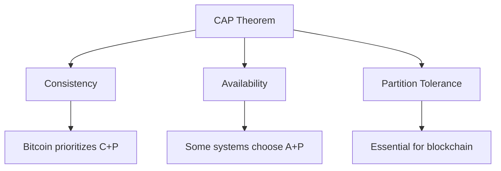
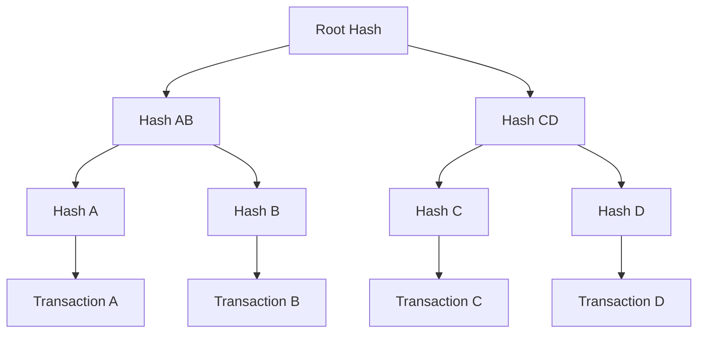
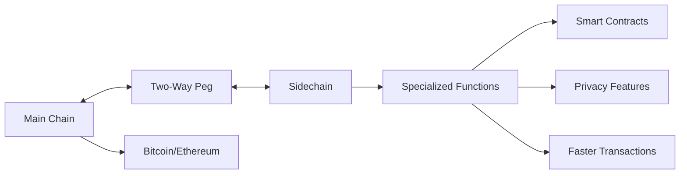
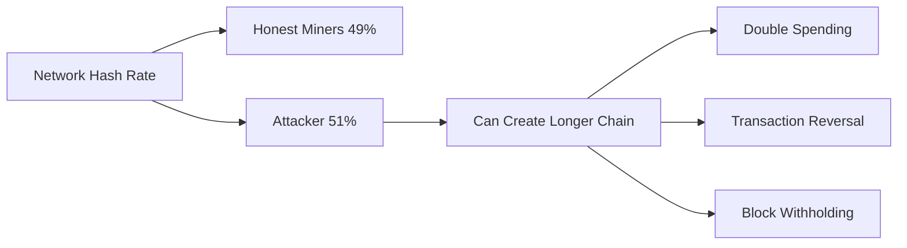
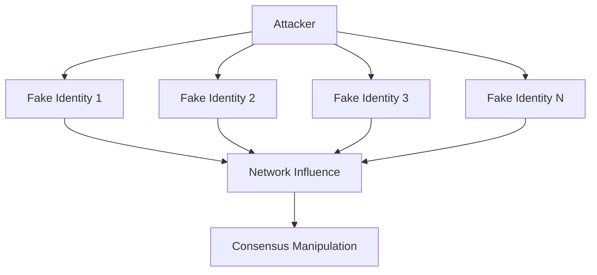
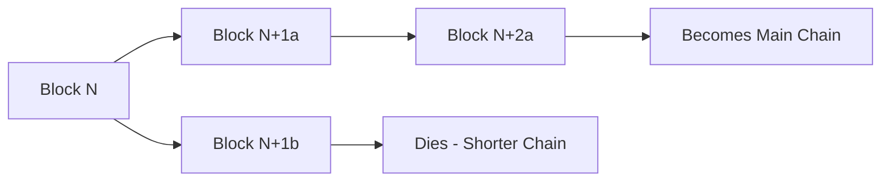
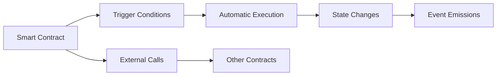
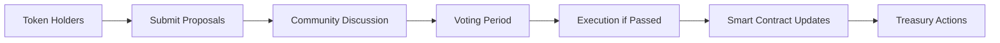

## Question 1(a) [3 marks]

**Explain benefits of using distributed ledger systems.**

**Answer**:

**Table: Benefits of Distributed Ledger Systems**

| Benefit | Description |
|---------|-------------|
| **Transparency** | All participants can view transaction history |
| **Security** | Cryptographic protection against tampering |
| **Decentralization** | No single point of failure or control |
| **Immutability** | Records cannot be altered once confirmed |

**Mnemonic**: "T-S-D-I" (Transparent, Secure, Decentralized, Immutable)

## Question 1(b) [4 marks]

**Define: 1) Blockchain 2) Distributed systems**

**Answer**:

**Table: Key Definitions**

| Term | Definition |
|------|------------|
| **Blockchain** | A chain of blocks containing transaction data, linked using cryptographic hashes |
| **Distributed Systems** | Network of independent computers working together as a single system |

**Key Features**:

- **Blockchain**: Uses hash pointers, consensus mechanisms, and merkle trees
- **Distributed Systems**: Fault tolerance, scalability, and resource sharing

**Mnemonic**: "Chain-Hash-Consensus" for Blockchain, "Network-Independent-Together" for Distributed

## Question 1(c) [7 marks]

**Illustrate CAP theorem with the help of Blockchain network.**

**Answer**:

**Table: CAP Theorem Components**

| Property | Description | Blockchain Context |
|----------|-------------|-------------------|
| **Consistency** | All nodes see same data | All nodes have identical ledger |
| **Availability** | System remains operational | Network stays accessible |
| **Partition Tolerance** | Works despite network failures | Continues during node disconnections |

**Diagram:**



**Key Points**:

- **Trade-off**: Can only achieve 2 out of 3 properties simultaneously
- **Blockchain Choice**: Most blockchains choose Consistency + Partition Tolerance
- **Example**: Bitcoin may become temporarily unavailable but maintains consistency

**Mnemonic**: "CAP-2-out-of-3" (Choose Any 2 Properties out of 3)

## Question 1(c) OR [7 marks]

**List and explain applications of blockchain network.**

**Answer**:

**Table: Blockchain Applications**

| Application | Description | Example |
|-------------|-------------|---------|
| **Cryptocurrency** | Digital money transactions | Bitcoin, Ethereum |
| **Supply Chain** | Track products from origin | Walmart food tracing |
| **Healthcare** | Secure patient records | Medical data sharing |
| **Voting** | Transparent elections | Estonia e-voting |
| **Real Estate** | Property ownership records | Land registries |

**Key Benefits**:

- **Transparency**: All transactions visible to participants
- **Security**: Cryptographic protection against fraud
- **Efficiency**: Reduced intermediaries and costs

**Mnemonic**: "C-S-H-V-R" (Crypto, Supply, Health, Vote, Real estate)

## Question 2(a) [3 marks]

**Define and explain a permissionless blockchain in detail.**

**Answer**:

**Definition**: A blockchain where anyone can participate without requiring permission from a central authority.

**Table: Permissionless Blockchain Features**

| Feature | Description |
|---------|-------------|
| **Open Access** | Anyone can join and participate |
| **Public Verification** | All transactions are publicly verifiable |
| **Decentralized** | No central controlling authority |

**Key Characteristics**:

- **Consensus**: Uses proof-of-work or proof-of-stake
- **Examples**: Bitcoin, Ethereum mainnet

**Mnemonic**: "Open-Public-Decentralized" (OPD)

## Question 2(b) [4 marks]

**Draw a figure and provide a brief explanation of a data structure of a blockchain.**

**Answer**:

**Diagram: Blockchain Data Structure**

```goat
+-------------------+    +-------------------+    +-------------------+
|     Block 1       |    |     Block 2       |    |     Block 3       |
|-------------------|    |-------------------|    |-------------------|
| Previous Hash: 0  |--->| Previous Hash: H1 |--->| Previous Hash: H2 |
| Merkle Root: MR1  |    | Merkle Root: MR2  |    | Merkle Root: MR3  |
| Timestamp: T1     |    | Timestamp: T2     |    | Timestamp: T3     |
| Nonce: N1         |    | Nonce: N2         |    | Nonce: N3         |
| Transactions: TX1 |    | Transactions: TX2 |    | Transactions: TX3 |
+-------------------+    +-------------------+    +-------------------+
```

**Key Components**:

- **Previous Hash**: Links blocks together creating chain
- **Merkle Root**: Summary of all transactions in block
- **Timestamp**: When block was created
- **Nonce**: Number used once for proof-of-work

**Mnemonic**: "P-M-T-N" (Previous, Merkle, Time, Nonce)

## Question 2(c) [7 marks]

**Explain the core components of blockchain with suitable diagrams.**

**Answer**:

**Table: Core Components of Blockchain**

| Component | Function | Purpose |
|-----------|----------|---------|
| **Blocks** | Data containers | Store transaction information |
| **Hash Functions** | Create digital fingerprints | Ensure data integrity |
| **Merkle Trees** | Transaction summaries | Efficient verification |
| **Consensus Mechanism** | Agreement protocol | Validate new blocks |
| **Digital Signatures** | Identity verification | Authenticate transactions |

**Diagram: Merkle Tree Structure**



**Key Points**:

- **Immutability**: Hash functions make tampering detectable
- **Efficiency**: Merkle trees allow fast verification
- **Decentralization**: Consensus mechanisms eliminate central authority

**Mnemonic**: "B-H-M-C-D" (Blocks, Hash, Merkle, Consensus, Digital)

## Question 2(a) OR [3 marks]

**Define and explain permissioned blockchain in detail.**

**Answer**:

**Definition**: A blockchain where participation requires explicit permission from a governing authority.

**Table: Permissioned Blockchain Features**

| Feature | Description |
|---------|-------------|
| **Restricted Access** | Only authorized users can participate |
| **Private Network** | Controlled membership |
| **Centralized Control** | Governing body manages permissions |

**Key Characteristics**:

- **Privacy**: Enhanced confidentiality for sensitive data
- **Performance**: Faster transactions due to fewer validators
- **Examples**: Hyperledger Fabric, R3 Corda

**Mnemonic**: "Restricted-Private-Centralized" (RPC)

## Question 2(b) OR [4 marks]

**Explain types of wallets in the context of blockchain. Also discuss the factors to be considered while selecting wallet for the specific need.**

**Answer**:

**Table: Types of Blockchain Wallets**

| Wallet Type | Description | Security Level |
|-------------|-------------|----------------|
| **Hot Wallets** | Connected to internet | Medium |
| **Cold Wallets** | Offline storage | High |
| **Hardware Wallets** | Physical devices | Very High |
| **Paper Wallets** | Printed keys | High (if stored safely) |

**Selection Factors**:

- **Security Requirements**: Higher value needs better security
- **Frequency of Use**: Regular use favors hot wallets
- **Technical Expertise**: Simple wallets for beginners

**Mnemonic**: "H-C-H-P" (Hot, Cold, Hardware, Paper)

## Question 2(c) OR [7 marks]

**Explain sidechain in detail with suitable diagrams.**

**Answer**:

**Definition**: A separate blockchain that is attached to a parent blockchain using a two-way peg.

**Diagram: Sidechain Architecture**



**Table: Sidechain Benefits**

| Benefit | Description |
|---------|-------------|
| **Scalability** | Reduces load on main chain |
| **Experimentation** | Test new features safely |
| **Specialized Functions** | Custom applications |
| **Interoperability** | Connect different blockchains |

**Key Mechanisms**:

- **Two-Way Peg**: Allows asset transfer between chains
- **SPV Proofs**: Simplified payment verification
- **Federated Control**: Multiple parties manage transfers

**Mnemonic**: "S-E-S-I" (Scalability, Experimentation, Specialized, Interoperability)

## Question 3(a) [3 marks]

**With respect to transaction in a blockchain network, define the terms "Confirmation" and "Finality".**

**Answer**:

**Table: Transaction States**

| Term | Definition |
|------|------------|
| **Confirmation** | Number of blocks built on top of transaction block |
| **Finality** | Point where transaction becomes irreversible |

**Key Points**:

- **Confirmation Count**: More confirmations = higher security
- **Bitcoin Standard**: 6 confirmations for high-value transactions
- **Finality Types**: Probabilistic (Bitcoin) vs Absolute (some PoS systems)

**Mnemonic**: "Count-Blocks-Security" for Confirmation, "Irreversible-Point" for Finality

## Question 3(b) [4 marks]

**Differentiate Proof of Work and Proof of Stake.**

**Answer**:

**Table: PoW vs PoS Comparison**

| Aspect | Proof of Work (PoW) | Proof of Stake (PoS) |
|--------|-------------------|-------------------|
| **Resource** | Computational power | Stake ownership |
| **Energy Use** | High | Low |
| **Security** | Hash rate dependent | Stake dependent |
| **Rewards** | Mining rewards | Staking rewards |
| **Examples** | Bitcoin, Ethereum (old) | Ethereum 2.0, Cardano |

**Key Differences**:

- **Mechanism**: PoW uses mining, PoS uses validators
- **Environmental Impact**: PoS is more eco-friendly
- **Barriers to Entry**: PoS requires initial stake, PoW needs hardware

**Mnemonic**: "Work-vs-Stake" (Computational Work vs Financial Stake)

## Question 3(c) [7 marks]

**With respect to blockchain network, explain 51% attack.**

**Answer**:

**Definition**: An attack where a single entity controls more than 50% of the network's mining power or stake.

**Diagram: 51% Attack Scenario**



**Table: Attack Capabilities and Limitations**

| Can Do | Cannot Do |
|--------|-----------|
| Double spend own coins | Steal others' coins |
| Reverse recent transactions | Create coins from nothing |
| Block specific transactions | Change consensus rules |
| Fork the blockchain | Access private keys |

**Prevention Measures**:

- **Diversified Mining**: Encourage multiple mining pools
- **Checkpoint Systems**: Periodic finality markers
- **Economic Incentives**: Make attacks unprofitable

**Impact**:

- **Network Disruption**: Temporary service interruption
- **Economic Loss**: Reduced trust and value
- **Recovery**: Network usually recovers after attack ends

**Mnemonic**: "Majority-Control-Attack" (51% = Majority Control = Attack Power)

## Question 3(a) OR [3 marks]

**Define the terms "Hard fork" and "Soft fork"**

**Answer**:

**Table: Fork Types**

| Fork Type | Definition | Compatibility |
|-----------|------------|---------------|
| **Hard Fork** | Non-backward compatible protocol change | Not compatible |
| **Soft Fork** | Backward compatible protocol change | Compatible |

**Key Characteristics**:

- **Hard Fork**: Creates new blockchain branch, requires all nodes to upgrade
- **Soft Fork**: Tightens rules, old nodes can still operate

**Examples**:

- **Hard Fork**: Bitcoin Cash split from Bitcoin
- **Soft Fork**: SegWit activation in Bitcoin

**Mnemonic**: "Hard-Breaks-Compatibility" vs "Soft-Keeps-Compatibility"

## Question 3(b) OR [4 marks]

**List various types of consensus mechanisms and explain any one in detail.**

**Answer**:

**Table: Consensus Mechanisms**

| Mechanism | Description | Energy Use |
|-----------|-------------|------------|
| **Proof of Work** | Computational puzzle solving | High |
| **Proof of Stake** | Stake-based validation | Low |
| **Delegated PoS** | Voted representatives validate | Very Low |
| **Proof of Authority** | Pre-approved validators | Minimal |

**Detailed Explanation - Proof of Stake (PoS)**:

**Process**:

- **Validator Selection**: Based on stake amount and randomization
- **Block Creation**: Selected validator proposes new block
- **Validation**: Other validators verify and attest to block
- **Rewards**: Validators earn fees and new tokens

**Advantages**: Lower energy consumption, reduced centralization risk
**Disadvantages**: "Nothing at stake" problem, initial distribution issues

**Mnemonic**: "Stake-Select-Validate-Reward" (PoS Process)

## Question 3(c) OR [7 marks]

**With respect to blockchain network, explain sybil attack.**

**Answer**:

**Definition**: An attack where a single adversary creates multiple fake identities to gain disproportionate influence in the network.

**Diagram: Sybil Attack Structure**



**Table: Attack Methods and Defenses**

| Attack Method | Description | Defense |
|---------------|-------------|---------|
| **Identity Flooding** | Create many fake nodes | Proof of Work/Stake |
| **Routing Manipulation** | Control network paths | Reputation systems |
| **Consensus Disruption** | Influence voting | Resource requirements |

**Impact on Blockchain**:

- **Network Partitioning**: Isolate honest nodes
- **Double Spending**: Facilitate fraudulent transactions
- **Consensus Failure**: Prevent network agreement

**Prevention Mechanisms**:

- **Resource Requirements**: PoW/PoS make attacks expensive
- **Identity Verification**: KYC/AML procedures
- **Network Monitoring**: Detect suspicious behavior patterns
- **Reputation Systems**: Track node behavior over time

**Real-world Examples**:

- **P2P Networks**: BitTorrent, Gnutella vulnerabilities
- **Social Networks**: Fake account creation
- **Blockchain**: Potential threat to permissionless networks

**Mnemonic**: "Single-Multiple-Influence" (Single Attacker, Multiple Identities, Network Influence)

## Question 4(a) [3 marks]

**Define the terms "Merkle Tree" and "Hyperledger".**

**Answer**:

**Table: Key Definitions**

| Term | Definition |
|------|------------|
| **Merkle Tree** | Binary tree of hashes that efficiently summarizes all transactions |
| **Hyperledger** | Open-source blockchain platform hosted by Linux Foundation |

**Key Features**:

- **Merkle Tree**: Enables efficient verification without downloading full blockchain
- **Hyperledger**: Enterprise-focused, modular architecture, multiple frameworks

**Mnemonic**: "Tree-Hash-Efficient" for Merkle, "Enterprise-Modular-Linux" for Hyperledger

## Question 4(b) [4 marks]

**Explain classic Byzantine generals problem in detail.**

**Answer**:

**Scenario**: Multiple generals must coordinate attack on a city, but some may be traitors.

**Table: Problem Components**

| Component | Description |
|-----------|-------------|
| **Generals** | Network nodes/participants |
| **Messages** | Transactions/communications |
| **Traitors** | Malicious/faulty nodes |
| **Consensus** | Agreement on action |

**Solution Requirements**:

- **Agreement**: All honest generals decide on same action
- **Validity**: If all honest generals want to attack, they should attack
- **Termination**: Decision must be reached in finite time

**Blockchain Relevance**: Ensures network agreement despite malicious nodes

**Mnemonic**: "Generals-Messages-Traitors-Consensus" (GMTC)

## Question 4(c) [7 marks]

**Explain the process of Merkle tree creation with suitable example and supporting diagrams.**

**Answer**:

**Process Steps**: 

1. Hash each transaction individually
2. Pair hashes and hash the pairs
3. Continue until single root hash remains

**Example: 4 Transactions**

```goat
                    Root Hash
                   /           \
              Hash(AB)         Hash(CD)
             /        \       /        \
        Hash(A)    Hash(B) Hash(C)  Hash(D)
           |          |       |        |
         Tx A       Tx B    Tx C     Tx D
```

**Table: Merkle Tree Benefits**

| Benefit | Description |
|---------|-------------|
| **Efficiency** | Verify transactions without full data |
| **Security** | Any change affects root hash |
| **Scalability** | Log(n) verification complexity |

**Verification Process**:

- To verify Tx A: Need Hash(B), Hash(CD), and Root Hash
- Path verification: Hash(A) + Hash(B) = Hash(AB)
- Hash(AB) + Hash(CD) = Root Hash

**Applications**:

- **Bitcoin**: Block headers contain Merkle root
- **SPV Clients**: Light wallets use Merkle proofs
- **Git**: Version control system uses similar structure

**Mnemonic**: "Hash-Pair-Repeat-Root" (Merkle Tree Creation Process)

## Question 4(a) OR [3 marks]

**List various types of Hyperledger projects.**

**Answer**:

**Table: Hyperledger Projects**

| Project | Type | Purpose |
|---------|------|---------|
| **Fabric** | Framework | Permissioned blockchain platform |
| **Sawtooth** | Framework | Modular blockchain suite |
| **Iroha** | Framework | Simple blockchain for mobile/web |
| **Burrow** | Framework | Ethereum Virtual Machine |
| **Caliper** | Tool | Blockchain performance benchmark |
| **Composer** | Tool | Business network development |

**Categories**:

- **Frameworks**: Core blockchain platforms
- **Tools**: Development and testing utilities

**Mnemonic**: "F-S-I-B-C-C" (Fabric, Sawtooth, Iroha, Burrow, Caliper, Composer)

## Question 4(b) OR [4 marks]

**Explain Practical Byzantine Fault Tolerance algorithm in detail.**

**Answer**:

**Definition**: Consensus algorithm that works correctly even when up to 1/3 of nodes are faulty or malicious.

**Table: PBFT Phases**

| Phase | Description | Purpose |
|-------|-------------|---------|
| **Pre-prepare** | Primary broadcasts request | Initiate consensus |
| **Prepare** | Nodes validate and broadcast | Verify proposal |
| **Commit** | Nodes commit to decision | Finalize agreement |

**Algorithm Steps**:

1. Client sends request to primary replica
2. Primary broadcasts pre-prepare message
3. Backups send prepare messages if valid
4. After receiving 2f+1 prepares, send commit
5. Execute after receiving 2f+1 commits

**Key Properties**:

- **Safety**: Never produces inconsistent results
- **Liveness**: Eventually produces results
- **Fault Tolerance**: Works with f < n/3 faulty nodes

**Mnemonic**: "Pre-Prepare-Commit" (3 Phases of PBFT)

## Question 4(c) OR [7 marks]

**"Eventual consistency is evident in the context of bitcoin." Justify the given statement.**

**Answer**:

**Definition**: Eventual consistency means the system will become consistent over time, even if it's temporarily inconsistent.

**Bitcoin Implementation**:

**Table: Bitcoin Consistency Mechanisms**

| Mechanism | Description | Purpose |
|-----------|-------------|---------|
| **Chain Reorganization** | Replace shorter chain with longer | Maintain consensus |
| **Confirmation Delays** | Wait for multiple blocks | Increase certainty |
| **Fork Resolution** | Longest chain wins | Resolve conflicts |

**Scenarios Demonstrating Eventual Consistency**:

1. **Temporary Forks**: When two miners find blocks simultaneously
2. **Network Partitions**: Isolated nodes may have different views
3. **Double Spending Attempts**: Conflicting transactions in different blocks

**Resolution Process**:

- **Mining Continues**: Miners build on their preferred chain
- **Longest Chain Rule**: Network adopts chain with most work
- **Automatic Convergence**: All nodes eventually agree

**Diagram: Fork Resolution**



**Justification Points**:

- **Probabilistic Finality**: Longer confirmation time = higher certainty
- **No Immediate Consistency**: New transactions aren't instantly final
- **Convergence Guarantee**: Network will eventually agree on single chain
- **Time-based Resolution**: Consistency improves with time

**Practical Implications**:

- **Merchant Waiting**: Wait for confirmations before accepting payment
- **Exchange Policies**: Different confirmation requirements for different amounts
- **Risk Management**: Balance speed vs security based on transaction value

**Mnemonic**: "Time-Brings-Consistency" (Eventual Consistency = Time + Convergence)

## Question 5(a) [3 marks]

**Explain advantages of ERC 20.**

**Answer**:

**Table: ERC-20 Token Advantages**

| Advantage | Description |
|-----------|-------------|
| **Standardization** | Common interface for all tokens |
| **Interoperability** | Works with all Ethereum wallets/exchanges |
| **Liquidity** | Easy trading and exchange |

**Key Benefits**:

- **Developer Friendly**: Simple implementation standard
- **Market Adoption**: Widely supported across platforms
- **Smart Contract Integration**: Easy DeFi integration

**Mnemonic**: "Standard-Interoperable-Liquid" (SIL)

## Question 5(b) [4 marks]

**Describe working mechanism of a smart-contract in detail.**

**Answer**:

**Table: Smart Contract Workflow**

| Step | Description |
|------|-------------|
| **Code Deployment** | Contract uploaded to blockchain |
| **Trigger Conditions** | Predefined conditions monitored |
| **Automatic Execution** | Contract executes when conditions met |
| **State Update** | Blockchain state modified |

**Working Process**:

1. **Development**: Write contract in Solidity/Vyper
2. **Compilation**: Convert to bytecode
3. **Deployment**: Upload to blockchain network
4. **Execution**: Triggered by transactions or events

**Mnemonic**: "Deploy-Trigger-Execute-Update" (DTEU)

## Question 5(c) [7 marks]

**What is smart-contract? Explain features and applications of smart-contract in detail.**

**Answer**:

**Definition**: Self-executing contracts with terms directly written into code, running on blockchain.

**Table: Smart Contract Features**

| Feature | Description | Benefit |
|---------|-------------|---------|
| **Autonomous** | Executes without intermediaries | Cost reduction |
| **Transparent** | Code visible on blockchain | Trust building |
| **Immutable** | Cannot be changed once deployed | Security |
| **Deterministic** | Same input produces same output | Predictability |

**Diagram: Smart Contract Architecture**



**Applications**:

**Table: Smart Contract Applications**

| Domain | Use Case | Example |
|--------|----------|---------|
| **Finance** | Automated lending | DeFi protocols |
| **Insurance** | Claim processing | Flight delay insurance |
| **Supply Chain** | Product tracking | Food provenance |
| **Real Estate** | Property transfers | Automated escrow |
| **Gaming** | Digital assets | NFT marketplaces |

**Advantages**:

- **Efficiency**: Reduced processing time and costs
- **Trust**: No need for trusted third parties
- **Accuracy**: Eliminates human errors
- **Global Access**: Available 24/7 worldwide

**Limitations**:

- **Immutability**: Difficult to fix bugs after deployment
- **Oracle Problem**: Need external data sources
- **Gas Costs**: Execution costs can be high
- **Complexity**: Requires technical expertise

**Development Considerations**:

- **Security Audits**: Essential before deployment
- **Testing**: Extensive testing on testnets
- **Upgradability**: Design patterns for updates
- **Gas Optimization**: Minimize execution costs

**Mnemonic**: "Auto-Transparent-Immutable-Deterministic" (ATID) for features

## Question 5(a) OR [3 marks]

**Explain disadvantages of ERC20.**

**Answer**:

**Table: ERC-20 Token Disadvantages**

| Disadvantage | Description |
|--------------|-------------|
| **Limited Functionality** | Only basic token operations |
| **No Built-in Security** | Vulnerable to common attacks |
| **Gas Dependency** | Requires ETH for transactions |

**Key Issues**:

- **Transfer Limitations**: Cannot handle complex transfers
- **Approval Risks**: Double spending vulnerabilities
- **Network Congestion**: High fees during peak times

**Mnemonic**: "Limited-Vulnerable-Dependent" (LVD)

## Question 5(b) OR [4 marks]

**Describe steps for Launching of a Decentralized Autonomous Organization (DAO)?**

**Answer**:

**Table: DAO Launch Steps**

| Step | Description |
|------|-------------|
| **Concept Design** | Define purpose and governance rules |
| **Smart Contract Development** | Code governance mechanisms |
| **Token Distribution** | Allocate voting rights |
| **Community Building** | Attract members and contributors |

**Detailed Process**:

1. **Whitepaper Creation**: Document vision and tokenomics
2. **Technical Implementation**: Deploy governance contracts
3. **Initial Funding**: Raise capital through token sales
4. **Operations Launch**: Begin decentralized operations

**Mnemonic**: "Design-Develop-Distribute-Deploy" (4D Launch)

## Question 5(c) OR [7 marks]

**What is Decentralized Autonomous Organization (DAO)? Explain its advantages and disadvantages in detail.**

**Answer**:

**Definition**: A blockchain-based organization governed by smart contracts and token holders rather than traditional management.

**Table: DAO Structure**

| Component | Description | Function |
|-----------|-------------|----------|
| **Smart Contracts** | Governance rules in code | Automated decision execution |
| **Tokens** | Voting rights and ownership | Democratic participation |
| **Proposals** | Suggested changes or actions | Community-driven initiatives |
| **Treasury** | Shared funds | Resource allocation |

**Diagram: DAO Governance Flow**



**Advantages**:

**Table: DAO Benefits**

| Advantage | Description | Impact |
|-----------|-------------|--------|
| **Decentralization** | No single point of control | Reduced corruption risk |
| **Transparency** | All decisions on blockchain | Enhanced accountability |
| **Global Participation** | Anyone can join | Diverse perspectives |
| **Efficiency** | Automated execution | Faster decision implementation |
| **Democratic Governance** | Token-based voting | Fair representation |

**Disadvantages**:

**Table: DAO Challenges**

| Disadvantage | Description | Risk |
|--------------|-------------|------|
| **Technical Complexity** | Smart contract bugs | System failures |
| **Legal Uncertainty** | Unclear regulatory status | Compliance issues |
| **Coordination Problems** | Difficult decision making | Slow progress |
| **Token Concentration** | Wealthy holders control votes | Centralization risk |
| **Security Vulnerabilities** | Code exploits possible | Financial losses |

**Types of DAOs**:

- **Investment DAOs**: Collective investment decisions
- **Protocol DAOs**: Blockchain protocol governance
- **Social DAOs**: Community-driven organizations
- **Collector DAOs**: NFT and art collecting

**Success Factors**:

- **Clear Purpose**: Well-defined mission and goals
- **Robust Governance**: Effective voting mechanisms
- **Community Engagement**: Active member participation
- **Technical Security**: Audited smart contracts
- **Legal Compliance**: Regulatory compliance where applicable

**Notable Examples**:

- **MakerDAO**: Decentralized finance protocol
- **Uniswap**: Decentralized exchange governance
- **Compound**: Money market protocol

**Future Outlook**:

- **Regulatory Clarity**: Evolving legal frameworks
- **Technical Improvements**: Better governance tools
- **Mainstream Adoption**: Growing corporate interest
- **Integration**: Hybrid traditional-DAO models

**Mnemonic**: "Decentralized-Autonomous-Organization" (DAO = Democratic Automated Ownership)
