## પ્રશ્ન 1(અ) [3 ગુણ]

**બ્લોકચેનમાં Private key અને Public key નો તફાવત આપો.**

**જવાબ**:

| **બાબત** | **Private Key** | **Public Key** |
|----------|-----------------|----------------|
| **હેતુ** | Transaction sign કરવા માટે | Verification માટે ઉપયોગ |
| **શેરિંગ** | ગુપ્ત રાખવી જોઈએ | બધાને આપી શકાય |
| **કામ** | Data decrypt કરે, signature બનાવે | Data encrypt કરે, signature verify કરે |
| **માલિકી** | ફક્ત માલિક જ જાણે | બધા access કરી શકે |

- **Private Key**: ગુપ્ત mathematical code જે ownership સાબિત કરે
- **Public Key**: ખુલ્લું address જેથી બીજા transaction મોકલી શકે
- **સુરક્ષા**: Private key ગુમાવવી = પૈસા હંમેશ માટે ગુમાવવા

**મેમરી ટ્રીક:** "Private છે Personal, Public છે Posted"

---

## પ્રશ્ન 1(બ) [4 ગુણ]

**Distributed Ledger ને વિગતવાર સમજાવો.**

**જવાબ**:

**Distributed Ledger** એ database છે જે ઘણી જગ્યાએ અને ઘણા લોકોમાં વહેંચાયેલું હોય છે.

**મુખ્ય લક્ષણો:**

| **લક્ષણ** | **વર્ણન** |
|----------|----------|
| **Decentralized** | કોઈ એક control point નથી |
| **Synchronized** | બધી copies updated રહે છે |
| **Transparent** | બધા participants જોઈ શકે છે |
| **Immutable** | સહેલાઈથી બદલાતું નથી |

**આકૃતિ:**

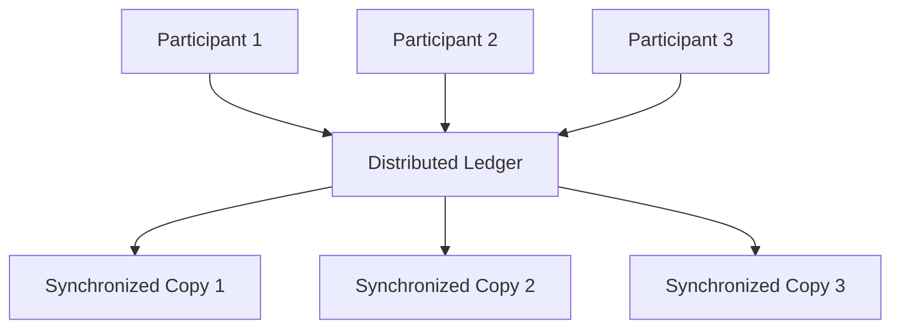

- **ફાયદા**: Intermediaries નાબૂદ કરે, trust વધારે, fraud ઓછું
- **કામ**: બધા participants પાસે records ની identical copies હોય

**મેમરી ટ્રીક:** "Distributed = વિભાજિત પણ સમાન"

---

## પ્રશ્ન 1(ક) [7 ગુણ]

**Blockchain વ્યાખ્યાયિત કરો. Blockchain ની એપ્લિકેશનો અને મર્યાદાઓનાં વર્ણન કરો.**

**જવાબ**:

**Blockchain વ્યાખ્યા**: Transaction records ધરાવતા blocks નો chain જે cryptography વાપરીને જોડાયેલા હોય.

**એપ્લિકેશન કોષ્ટક:**

| **ક્ષેત્ર** | **એપ્લિકેશન** | **ફાયદો** |
|----------|--------------|----------|
| **Finance** | Cryptocurrency, payments | ઝડપી, સસ્તી transfers |
| **Healthcare** | Patient records | સુરક્ષિત, accessible data |
| **Supply Chain** | Product tracking | પારદર્શિતા, authenticity |
| **Real Estate** | Property records | Fraud prevention |
| **Voting** | Digital elections | પારદર્શી, tamper-proof |

**મર્યાદાઓ કોષ્ટક:**

| **મર્યાદા** | **અસર** |
|-----------|---------|
| **Scalability** | ધીમી transaction processing |
| **Energy Usage** | વધુ electricity વપરાશ |
| **Complexity** | Users માટે સમજવું મુશ્કેલ |
| **Regulation** | કાયદાકીય અસ્પષ્ટતા |
| **Storage** | વધતો data size ની સમસ્યા |

**આર્કિટેક્ચર આકૃતિ:**

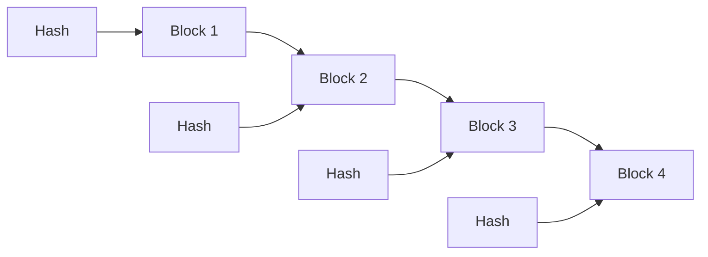

- **સુરક્ષા**: Cryptographic linking થી tampering મુશ્કેલ
- **પારદર્શિતા**: બધા transactions network participants ને દેખાય

**મેમરી ટ્રીક:** "Blocks Chained = Blockchain, Apps ઘણી = Limits ઘણી"

---

## પ્રશ્ન 1(ક) OR [7 ગુણ]

**ટૂંકી નોંધ લખો: બ્લોકચેનમાં CAP Theorem**

**જવાબ**:

**CAP Theorem** કહે છે કે distributed systems એ 3 properties માંથી માત્ર 2 જ simultaneously guarantee કરી શકે.

**CAP Components કોષ્ટક:**

| **Property** | **વર્ણન** | **ઉદાહરણ** |
|-------------|----------|------------|
| **Consistency** | બધા nodes પાસે same data | બર્યાને જગ્યાએ same balance દેખાય |
| **Availability** | System હંમેશા response આપે | Network કદી down ન જાય |
| **Partition Tolerance** | Network failures છતાં કામ કરે | Nodes disconnect થયા છતાં function કરે |

**Blockchain Trade-offs:**

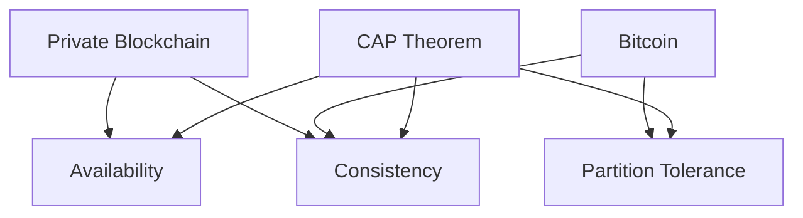

**વાસ્તવિક ઉપયોગ:**

| **Blockchain Type** | **પસંદ કરે** | **ત્યાગ કરે** |
|-------------------|-------------|-------------|
| **Bitcoin** | Consistency + Partition | Availability |
| **Ethereum** | Consistency + Partition | Availability |
| **Private Networks** | Consistency + Availability | Partition Tolerance |

- **અસર**: Blockchain designers એ કયા property sacrifice કરવી તે choose કરવું પડે
- **Trade-off**: Distributed networks માં perfect systems અશક્ય

**મેમરી ટ્રીક:** "કમ્પ્લીટ સિસ્ટમ શક્ય નથી - 3 માંથી 2 જ પસંદ કરો"

---

## પ્રશ્ન 2(અ) [3 ગુણ]

**બ્લોકચેનનાં Data Structure સમજાવો.**

**જવાબ**:

**Blockchain Data Structure** transaction data ધરાવતા linked blocks ધાયેલું હોય છે.

**Block Structure કોષ્ટક:**

| **Component** | **હેતુ** |
|--------------|----------|
| **Block Header** | Metadata રાખે છે |
| **Previous Hash** | Previous block સાથે link કરે |
| **Merkle Root** | બધા transactions નો summary |
| **Timestamp** | Block કયારે બન્યો તેની માહિતી |
| **Transactions** | વાસ્તવિક data/transfers |

**Visual Structure:**

```goat
+------------------+
|   Block Header   |
|------------------|
| Previous Hash    |
| Merkle Root      |
| Timestamp        |
| Nonce            |
+------------------+
|   Transactions   |
|  [TX1, TX2, TX3] |
+------------------+
```

- **Linking**: દરેક block previous block ને hash વાપરીને point કરે
- **Integrity**: એક block બદલાવવાથી આખી chain ટૂટી જાય

**મેમરી ટ્રીક:** "Header હોય છે, Transactions વાત કરે છે"

---

## પ્રશ્ન 2(બ) [4 ગુણ]

**Decentralization ના ફાયદા શું છે?**

**જવાબ**:

**Decentralization ફાયદા:**

| **ફાયદો** | **સમજૂતી** |
|----------|------------|
| **No Single Point of Failure** | એક node fail થયા છતાં network ચાલુ રહે |
| **Censorship Resistance** | કોઈ authority transactions block કરી શકે નહિ |
| **Transparency** | બધા participants સમાન માહિતી જુએ છે |
| **Reduced Costs** | Intermediary fees નાબૂદ થાય |
| **Trust** | Central authority પર trust કરવાની જરૂર નથી |

**સરખામણી આકૃતિ:**

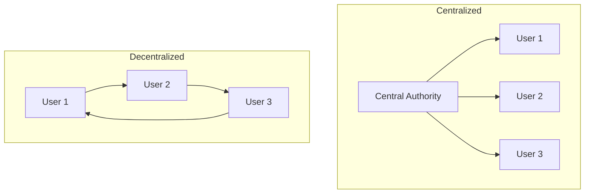

- **સુરક્ષા**: Multiple copies થી data loss અટકે
- **લોકશાહી**: બધા participants ને સમાન અધિકાર
- **મજબૂતાઈ**: Individual failures સામે system ટકે

**મેમરી ટ્રીક:** "વિકેન્દ્રિત = ટકાઉ, લોકશાહી, પ્રત્યક્ષ"

---

## પ્રશ્ન 2(ક) [7 ગુણ]

**Public બ્લોકચેન અને Private બ્લોકચેન વચ્ચે તફાવત કરો.**

**જવાબ**:

**વ્યાપક સરખામણી:**

| **બાબત** | **Public Blockchain** | **Private Blockchain** |
|----------|----------------------|----------------------|
| **Access** | બધા માટે ખુલ્લું | ખાસ users માટે મર્યાદિત |
| **Permission** | Permission ની જરૂર નથી | Permission આવશ્યક |
| **Control** | Decentralized | Centralized control |
| **Speed** | ધીમું (consensus જરૂરી) | ઝડપી (ઓછા validators) |
| **Security** | ઊંચી (ઘણા validators) | મધ્યમ (ઓછા validators) |
| **Cost** | Transaction fees જરૂરી | ઓછી operational costs |
| **Transparency** | સંપૂર્ણ પારદર્શિતા | મર્યાદિત પારદર્શિતા |
| **ઉદાહરણ** | Bitcoin, Ethereum | Hyperledger, R3 Corda |

**Network આર્કિટેક્ચર:**

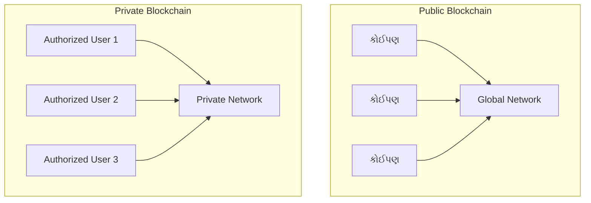

**ઉપયોગ કેસો:**

| **પ્રકાર** | **શ્રેષ્ઠ છે** |
|-----------|-------------|
| **Public** | Cryptocurrencies, public records |
| **Private** | Banking, supply chain, healthcare |

- **Trade-offs**: Public વધુ security આપે, Private વધુ control આપે
- **પસંદગી**: Transparency vs. privacy ની જરૂરિયાત પર નિર્ભર

**મેમરી ટ્રીક:** "Public = લોકોનું, Private = મંજૂરીવાળું"

---

## પ્રશ્ન 2(અ) OR [3 ગુણ]

**યોગ્ય આકૃતિ સાથે બ્લોક ચેઇનના Core Components નાં વર્ણન કરો.**

**જવાબ**:

**મુખ્ય Components:**

| **Component** | **કામ** |
|--------------|---------|
| **Blocks** | Transaction data store કરે |
| **Hash Functions** | Unique fingerprints બનાવે |
| **Digital Signatures** | Transaction authenticity verify કરે |
| **Consensus Mechanism** | Valid transactions પર સંમતિ કરે |
| **Peer-to-Peer Network** | બધા participants ને connect કરે |

**System આર્કિટેક્ચર:**

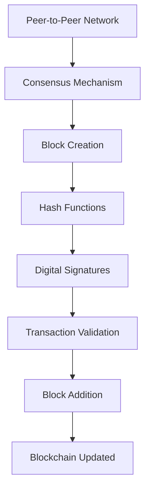

- **એકીકરણ**: બધા components મળીને security માટે કામ કરે
- **હેતુ**: દરેક component ખાસ blockchain function serve કરે

**મેમરી ટ્રીક:** "Blocks બનાવે, Hash પકડે, Signatures સુરક્ષિત કરે"

---

## પ્રશ્ન 2(બ) OR [4 ગુણ]

**Permissioned blockchain ને વ્યાખ્યાયિત કરો અને વિગતવાર સમજાવો.**

**જવાબ**:

**Permissioned Blockchain વ્યાખ્યા**: એવી blockchain જેમાં participation માટે network administrators પાસેથી સ્પષ્ટ permission જરૂરી હોય.

**લક્ષણો કોષ્ટક:**

| **લક્ષણ** | **વર્ણન** |
|----------|----------|
| **Access Control** | ફક્ત approved users જ join કરી શકે |
| **Validation Rights** | પસંદગીના nodes જ transactions validate કરે |
| **Governance** | Central authority network manage કરે |
| **Privacy** | Transaction details private હોઈ શકે |

**Permission સ્તરો:**

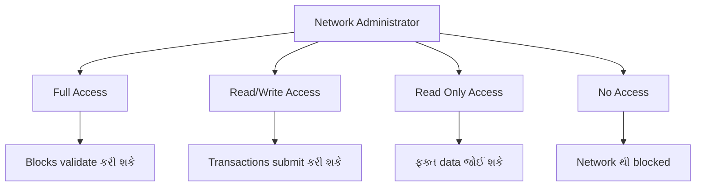

- **ફાયદા**: બહેતર privacy, regulatory compliance, ઝડપી processing
- **ગેરફાયદા**: ઓછું decentralized, administrators પર trust આવશ્યક

**મેમરી ટ્રીક:** "Permission = Participation માટે મંજૂરી"

---

## પ્રશ્ન 2(ક) OR [7 ગુણ]

**Sidechain ને સંક્ષિપ્તમાં સમજાવો.**

**જવાબ**:

**Sidechain વ્યાખ્યા**: Main blockchain સાથે connected અલગ blockchain જે chains વચ્ચે asset transfer કરવાની સુવિધા આપે.

**Sidechain આર્કિટેક્ચર:**

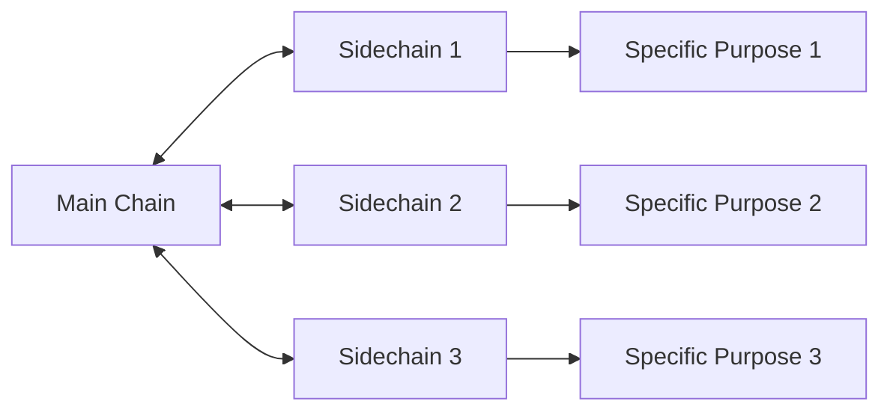

**ફાયદા અને લક્ષણો:**

| **બાબત** | **ફાયદો** |
|----------|----------|
| **Scalability** | Main chain નો load ઘટાડે |
| **Experimentation** | નવા features સુરક્ષિત રીતે test કરે |
| **Specialization** | ખાસ use cases માટે optimized |
| **Interoperability** | અલગ અલગ blockchains ને connect કરે |

**Transfer Process:**

| **પગલું** | **ક્રિયા** |
|----------|-----------|
| **1. Lock** | Main chain પર assets lock કરાય |
| **2. Proof** | Cryptographic proof generate કરાય |
| **3. Release** | Sidechain પર equivalent assets release કરાય |
| **4. Use** | Sidechain પર assets ઉપયોગ કરાય |
| **5. Return** | Assets પાછા લાવવા માટે reverse process |

**વાસ્તવિક ઉદાહરણો:**

| **Sidechain** | **હેતુ** |
|--------------|---------|
| **Lightning Network** | ઝડપી Bitcoin payments |
| **Plasma** | Ethereum scaling |
| **Liquid** | Bitcoin trading |

- **સુરક્ષા**: Secure main chain સાથેનું connection જાળવે
- **લવચિકતા**: દરેક sidechain ના અલગ rules હોઈ શકે
- **નવીનતા**: Blockchain ecosystem વિસ્તરણ માટે

**મેમરી ટ્રીક:** "Side સહાય કરે, Main જાળવે"

---

## પ્રશ્ન 3(અ) [3 ગુણ]

**Consensus Mechanism ને વ્યાખ્યાયિત કરો અને કોઈપણ એકને વિગતવાર સમજાવો.**

**જવાબ**:

**Consensus Mechanism વ્યાખ્યા**: એક protocol જે ખાતરી કરે કે બધા network participants blockchain ની current state પર સંમત હોય.

**Proof of Work (PoW) સમજૂતી:**

| **Component** | **કામ** |
|--------------|---------|
| **Mining** | જટિલ mathematical puzzles solve કરવું |
| **Competition** | Miners વચ્ચે પહેલા solve કરવાની સ્પર્ધા |
| **Verification** | Network solution verify કરે |
| **Reward** | Winner ને cryptocurrency reward મળે |

**PoW Process:**


- **સુરક્ષા**: Computational work થી tampering મોંઘું બને
- **ઉદાહરણ**: Bitcoin Proof of Work consensus વાપરે

**મેમરી ટ્રીક:** "Consensus = સામાન્ય બુદ્ધિ, Work = જીત"

---

## પ્રશ્ન 3(બ) [4 ગુણ]

**બ્લોકચેનમાં Forking શા માટે જરૂરી છે? બ્લોકચેનમાં વિવિધ પ્રકારના Forks ની યાદી બનાવો.**

**જવાબ**:

**Forking કેમ જરૂરી:**

| **કારણ** | **હેતુ** |
|----------|---------|
| **Upgrades** | Blockchain માં નવા features add કરવા |
| **Bug Fixes** | Security vulnerabilities સુધારવા |
| **Rule Changes** | Consensus rules modify કરવા |
| **Community Disagreement** | Consensus ન મળે ત્યારે split કરવા |

**Forks ના પ્રકારો:**

| **Fork Type** | **વર્ણન** | **Compatibility** |
|--------------|----------|------------------|
| **Soft Fork** | Rules tight કરે | Backward compatible |
| **Hard Fork** | Rules સંપૂર્ણ બદલે | Backward compatible નથી |
| **Accidental Fork** | અસ્થાયી split | આપોઆપ resolve થાય |
| **Contentious Fork** | Community disagreement | કાયમી split |

**Fork વિઝ્યુઅલાઈઝેશન:**

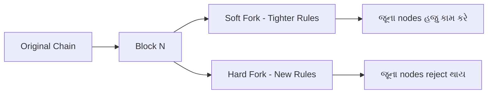

- **અસર**: Forks થી નવી cryptocurrencies બની શકે
- **ઉદાહરણો**: Bitcoin Cash (hard fork), Ethereum updates (soft forks)

**મેમરી ટ્રીક:** "Fork = ભવિષ્યના વિકલ્પો, Rules જાળવાય"

---

## પ્રશ્ન 3(ક) [7 ગુણ]

**Bitcoin Mining શું છે? Bitcoin Mining નાં કામકાજ, મુશ્કેલી અને ફાયદાઓ વિશે વિગતવાર જણાવો.**

**જવાબ**:

**Bitcoin Mining વ્યાખ્યા**: Computational puzzles solve કરીને Bitcoin blockchain માં નવા transactions add કરવાની પ્રક્રિયા.

**Mining Process:**

| **પગલું** | **ક્રિયા** | **વિગતો** |
|-----------|-----------|----------|
| **1. Collection** | Pending transactions ભેગા કરવા | Mempool માંથી |
| **2. Block Creation** | નવો block બનાવવો | Transactions સામેલ કરવા |
| **3. Puzzle Solving** | સાચો nonce શોધવો | Trial and error |
| **4. Verification** | Network solution check કરે | Block validate કરે |
| **5. Addition** | Chain માં block add કરવો | કાયમી record |
| **6. Reward** | Miner ને Bitcoin મળે | હાલમાં 6.25 BTC |

**Mining Workflow:**

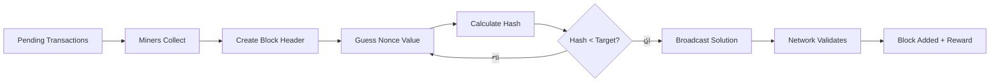

**Difficulty Adjustment:**

| **બાબત** | **પદ્ધતિ** |
|----------|-----------|
| **Target Time** | દરેક block માટે 10 મિનિટ |
| **Adjustment Period** | દરેક 2016 blocks (~2 અઠવાડિયા) |
| **Auto-Regulation** | Blocks ઝડપી આવે તો વધારે |
| **હેતુ** | Consistent block time જાળવવું |

**Mining ના ફાયદા:**

| **ફાયદો** | **વર્ણન** |
|----------|----------|
| **Financial Reward** | Successful mining માટે Bitcoin કમાવવું |
| **Network Security** | વધુ miners = વધુ secure network |
| **Transaction Processing** | Bitcoin transfers શક્ય બનાવવું |
| **Decentralization** | Central authority ની જરૂર નથી |

- **Energy**: Mining માં નોંધપાત્ર electricity જરૂરી
- **Competition**: વધુ miners સાથે difficulty વધે
- **Hardware**: Specialized ASIC miners સૌથી કાર્યક્ષમ

**મેમરી ટ્રીક:** "Mining = પૈસા, Math, Maintenance"

---

## પ્રશ્ન 3(અ) OR [3 ગુણ]

**Soft fork અને Hard fork નો તફાવત આપો.**

**જવાબ**:

**Fork સરખામણી:**

| **બાબત** | **Soft Fork** | **Hard Fork** |
|----------|---------------|---------------|
| **Compatibility** | Backward compatible | Backward compatible નથી |
| **Rules** | Rules વધુ સખત બનાવે | Rules સંપૂર્ણ બદલે |
| **Node Updates** | જૂના nodes માટે વૈકલ્પિક | બધા nodes માટે ફરજિયાત |
| **Chain Split** | કાયમી split નથી | કાયમી split કરી શકે |
| **Consensus** | Implement કરવું સરળ | Majority agreement જરૂરી |
| **ઉદાહરણો** | SegWit (Bitcoin) | Bitcoin Cash, Ethereum Classic |

**વિઝ્યુઅલ રજૂઆત:**

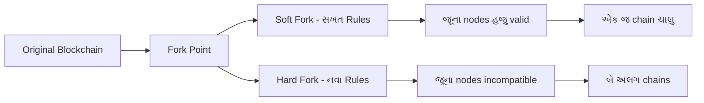

- **જોખમ**: Hard forks community split કરી શકે અને competing currencies બનાવી શકે
- **સુરક્ષા**: Soft forks સામાન્ય રીતે સુરક્ષિત અને ઓછા disruptive

**મેમરી ટ્રીક:** "Soft = સમાન દિશા, Hard = મોટો તફાવત"

---

## પ્રશ્ન 3(બ) OR [4 ગુણ]

**બ્લોકચેનની દુનિયામાં Finality નાં શું મહત્વ છે?**

**જવાબ**:

**Finality વ્યાખ્યા**: એક વાર transaction confirm થઈ ગયા પછી તે reverse કે alter ન થઈ શકે તેની ગેરંટી.

**મહત્વ કોષ્ટક:**

| **બાબત** | **મહત્વ** |
|----------|----------|
| **Trust** | Users ને વિશ્વાસ કે transactions કાયમી છે |
| **Business Use** | Companies completed transactions પર ભરોસો કરી શકે |
| **Legal Certainty** | Courts blockchain records enforce કરી શકે |
| **Settlement** | Financial institutions payments clear કરી શકે |

**Finality ના પ્રકારો:**

| **પ્રકાર** | **વર્ણન** | **સમય** |
|-----------|----------|---------|
| **Probabilistic** | સમય સાથે વધુ certain બને | Bitcoin: ~1 કલાક |
| **Absolute** | તુરંત guarantee | કેટલીક private chains |
| **Economic** | Reversal ની કિંમત ખૂબ વધારે | Network પ્રમાણે વિવિધ |

**Finality Process:**

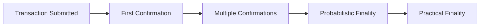

- **Bitcoin**: 6 confirmations સામાન્ય રીતે final ગણાય
- **Ethereum**: Proof of Stake સાથે ઝડપી finality તરફ જતું
- **પડકાર**: Speed અને security વચ્ચે સંતુલન

**મેમરી ટ્રીક:** "Final = હંમેશ માટે, મહત્વપૂર્ણ = પાછું ન બદલાય"

---

## પ્રશ્ન 3(ક) OR [7 ગુણ]

**બ્લોકચેનમાં 51% attack શું છે? ટૂંકમાં સમજાવો.**

**જવાબ**:

**51% Attack વ્યાખ્યા**: જ્યારે કોઈ એક entity network ની 50% થી વધુ mining power અથવા validators ને control કરે અને blockchain manipulate કરી શકે.

**Attack પદ્ધતિ:**

| **પગલું** | **Attacker ની ક્રિયા** | **અસર** |
|-----------|---------------------|---------|
| **1. Control** | >50% mining power મેળવવું | Network પર dominance |
| **2. Double Spend** | ગુપ્ત chain બનાવવી | Alternative history તૈયાર કરવી |
| **3. Execute** | લાંબી chain release કરવી | Network fake version accept કરે |
| **4. Profit** | Coins બે વાર spend કરવા | Victims પાસેથી ચોરી |

**Attack વિઝ્યુઅલાઈઝેશન:**

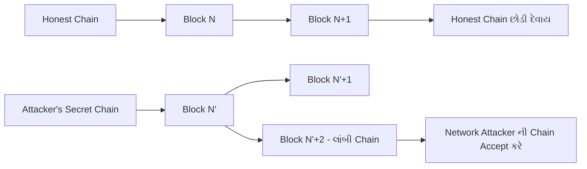

**શક્ય Attacks:**

| **Attack Type** | **વર્ણન** |
|-----------------|----------|
| **Double Spending** | સમાન coins બે વાર spend કરવા |
| **Transaction Reversal** | Confirmed transactions cancel કરવા |
| **Mining Monopoly** | બીજા miners નું કામ block કરવું |
| **Censorship** | ખાસ transactions prevent કરવા |

**બચાવના પદ્ધતિઓ:**

| **પદ્ધતિ** | **કેવી રીતે મદદ કરે** |
|-----------|---------------------|
| **Decentralization** | Mining ઘણા participants માં વહેંચવું |
| **High Hash Rate** | Attack ને economically અશક્ય બનાવવું |
| **Proof of Stake** | Attackers ના staked coins ગુમાવવા |
| **Monitoring** | Suspicious mining activity detect કરવી |

**વાસ્તવિક ઉદાહરણો:**

| **Blockchain** | **સ્થિતિ** |
|----------------|-----------|
| **Bitcoin** | કદી સફળ attack નથી થયો |
| **Ethereum Classic** | ઘણી વખત attack થયો |
| **નાની Altcoins** | Low hash rate થી વધુ vulnerable |

- **કિંમત**: મુખ્ય networks પર attack અત્યંત મોંઘું
- **શોધ**: Attacks સામાન્ય રીતે ઝડપથી detect થાય
- **Recovery**: Networks countermeasures implement કરી શકે

**મેમરી ટ્રીક:** "51% = બહુમતીની બદમાશી, Control = કોલાહલ"

---

## પ્રશ્ન 4(અ) [3 ગુણ]

**વિવિધ પ્રકારના Hyperledger પ્રોજેક્ટ્સનાં વર્ણન કરો.**

**જવાબ**:

**Hyperledger Project Types:**

| **Project** | **હેતુ** | **Use Case** |
|-------------|----------|--------------|
| **Fabric** | Modular blockchain platform | Enterprise applications |
| **Sawtooth** | Scalable blockchain suite | Supply chain, IoT |
| **Iroha** | Mobile-focused blockchain | Identity management |
| **Indy** | Digital identity platform | Self-sovereign identity |
| **Besu** | Ethereum-compatible client | Public/private Ethereum |
| **Burrow** | Smart contract platform | Permissioned networks |

**Project વર્ગીકરણ:**

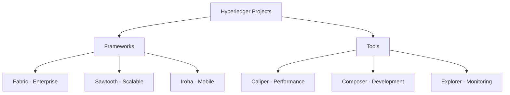

- **ફોકસ**: Enterprise અને business blockchain solutions
- **Open Source**: બધા projects મુફતમાં ઉપલબ્ધ

**મેમરી ટ્રીક:** "Hyper = High Performance, Ledger = Large Enterprise"

---

## પ્રશ્ન 4(બ) [4 ગુણ]

**Blockchain અને Bitcoin નો તફાવત આપો.**

**જવાબ**:

**વ્યાપક સરખામણી:**

| **બાબત** | **Blockchain** | **Bitcoin** |
|----------|----------------|-------------|
| **વ્યાખ્યા** | Technology/Platform | Digital Currency |
| **અવકાશ** | વ્યાપક concept | Specific application |
| **હેતુ** | Record keeping system | Peer-to-peer payments |
| **Applications** | ઘણા industries | મુખ્યત્વે financial |
| **લવચિકતા** | Customize કરી શકાય | Fixed protocol |
| **સર્જક** | ઘણા contributors | Satoshi Nakamoto |
| **શરૂઆત** | Concept સમય સાથે વિકસ્યો | 2009 માં launch |

**સંબંધ આકૃતિ:**

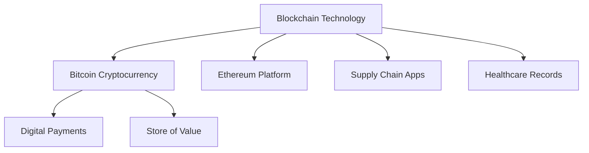

**મુખ્ય તફાવતો:**

| **વર્ગ** | **Blockchain** | **Bitcoin** |
|---------|----------------|-------------|
| **પ્રકાર** | Infrastructure | Application |
| **ઉપયોગ** | બહુવિધ હેતુઓ | ફક્ત currency |
| **ફેરફારો** | બદલી શકાય | Protocol fixed |

- **સમાનતા**: Blockchain ઈન્ટરનેટ જેવું, Bitcoin email જેવું
- **નિર્ભરતા**: Bitcoin ને blockchain જોઈએ, પણ blockchain ને Bitcoin જરૂરી નથી

**મેમરી ટ્રીક:** "Blockchain = બિલ્ડિંગ બ્લોક, Bitcoin = ખાસ ઈંટ"

---

## પ્રશ્ન 4(ક) [7 ગુણ]

**ટૂંકી નોંધ લખો: Merkle Tree**

**જવાબ**:

**Merkle Tree વ્યાખ્યા**: Binary tree structure જેમાં દરેક leaf transaction hash દર્શાવે અને દરેક internal node તેના children નો hash ધરાવે.

**Structure અને Components:**

| **Component** | **વર્ણન** |
|---------------|----------|
| **Leaf Nodes** | Individual transaction hashes |
| **Internal Nodes** | બે child nodes નો hash |
| **Root Hash** | આખા tree નો single hash |
| **Path** | Leaf થી root સુધીનો route |

**Merkle Tree આકૃતિ:**

```goat
                    Root Hash
                   /         \
              Hash AB       Hash CD
             /       \     /       \
        Hash A   Hash B Hash C   Hash D
          |        |      |        |
        TX A     TX B   TX C     TX D
```

**બાંધકામ પ્રક્રિયા:**

| **પગલું** | **ક્રિયા** |
|-----------|-----------|
| **1** | દરેક transaction ને અલગ અલગ hash કરવું |
| **2** | Hashes ને pair કરીને together hash કરવા |
| **3** | Single root સુધી pairing ચાલુ રાખવું |
| **4** | Block header માં root hash store કરવો |

**ફાયદા કોષ્ટક:**

| **ફાયદો** | **સમજૂતી** |
|----------|------------|
| **Efficiency** | બધા data download કર્યા વગર ઝડપી verification |
| **Security** | કોઈપણ change તુરંત detect થાય |
| **Scalability** | Verification time constant રહે |
| **Storage** | Block header માં ફક્ત root hash જરૂરી |

**Verification Process:**

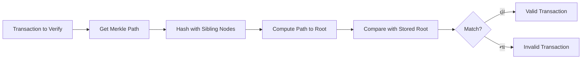

**વાસ્તવિક ઉપયોગ:**

| **Use Case** | **Application** |
|--------------|-----------------|
| **Bitcoin** | Transaction verification |
| **Git** | Version control |
| **IPFS** | Distributed storage |
| **Certificate Transparency** | SSL certificate logs |

- **શોધકર્તા**: Ralph Merkle (1988) ના નામ પરથી
- **કાર્યક્ષમતા**: O(log n) complexity સાથે verification
- **સુરક્ષા**: કોઈપણ transaction સાથે છેડછાડ કરવાથી root hash બદલાય

**મેમરી ટ્રીક:** "Merkle = ઘણા મળીને એક, Tree = વિશ્વસનીય"

---

## પ્રશ્ન 4(અ) OR [3 ગુણ]

**Hash pointer વિશે ટૂંકમાં ચર્ચા કરો અને Merkle tree માં તેનો ઉપયોગ કેવી રીતે થાય છે.**

**જવાબ**:

**Hash Pointer વ્યાખ્યા**: Data structure જેમાં data નું location અને તે data નો cryptographic hash બંને હોય.

**Components:**

| **Component** | **હેતુ** |
|---------------|---------|
| **Pointer** | Data ક્યાં stored છે તે બતાવે |
| **Hash** | Data બદલાયો નથી તે સાબિત કરે |
| **Combination** | Data ને integrity check સાથે link કરે |

**Merkle Tree માં Hash Pointer:**

```goat
        Root Hash Pointer
       /                 \
   Hash Ptr AB        Hash Ptr CD
   /         \        /         \
Hash A     Hash B  Hash C     Hash D
  |          |       |          |
 TX A       TX B    TX C       TX D
```

**Merkle Tree માં ઉપયોગ:**

| **Level** | **Hash Pointer Function** |
|-----------|---------------------------|
| **Leaf Level** | Transaction ને point કરે, transaction hash ધરાવે |
| **Internal Nodes** | Children ને point કરે, combined hash ધરાવે |
| **Root** | Tree structure ને point કરે, overall hash ધરાવે |

- **Verification**: Tree structure માં કોઈપણ change detect કરી શકે
- **Navigation**: Tree structure ની કાર્યક્ષમ traversal માટે

**મેમરી ટ્રીક:** "Hash Pointer = સ્થાન + Verification"

---

## પ્રશ્ન 4(બ) OR [4 ગુણ]

**બ્લોકચેનમાં Hashing શું છે? Bitcoin માં તે કેવી રીતે ઉપયોગી છે?**

**જવાબ**:

**Hashing વ્યાખ્યા**: Mathematical function જે input data ને fixed-size characters ના string માં convert કરે.

**Hashing Properties:**

| **Property** | **વર્ણન** |
|--------------|----------|
| **Deterministic** | સમાન input હંમેશા સમાન output આપે |
| **Fixed Size** | Output હંમેશા સમાન length (SHA-256 માટે 256 bits) |
| **Avalanche Effect** | નાનો input change = સંપૂર્ણ અલગ output |
| **One-way** | Original input શોધવા માટે reverse કરી શકાતું નથી |
| **Collision Resistant** | સમાન output આપતા બે inputs શોધવું અત્યંત મુશ્કેલ |

**Bitcoin માં ઉપયોગ:**

| **Use Case** | **હેતુ** |
|--------------|---------|
| **Block Linking** | દરેક block માં previous block નો hash હોય |
| **Mining** | Difficulty requirement પૂરો કરતો hash શોધવો |
| **Transaction IDs** | દરેક transaction માટે unique identifier |
| **Merkle Root** | Block માં બધા transactions નો summary |
| **Addresses** | Public keys માંથી Bitcoin addresses બનાવવા |

**Hashing Process:**

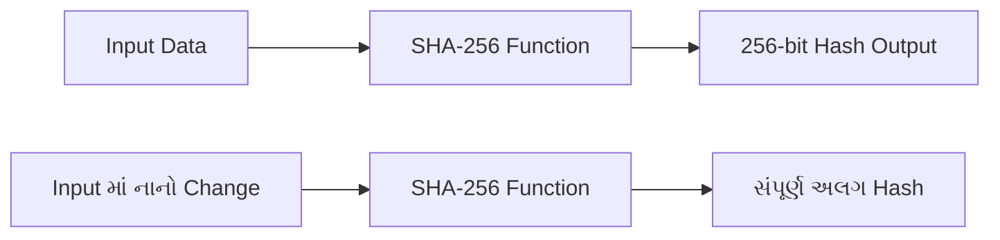

- **Algorithm**: Bitcoin SHA-256 hashing વાપરે
- **સુરક્ષા**: Blockchain ને tamper-evident બનાવે
- **કાર્યક્ષમતા**: Compute અને verify કરવું ઝડપી

**મેમરી ટ્રીક:** "Hash = Fingerprint, Bitcoin = Hashing પર આધારિત"

---

## પ્રશ્ન 4(ક) OR [7 ગુણ]

**Classic Byzantine generals problem અને Practical Byzantine Fault Tolerance ને વિગતવાર સમજાવો.**

**જવાબ**:

**Byzantine Generals Problem**: Distributed systems માં unreliable participants સાથે consensus achieve કરવાની classic computer science સમસ્યા.

**સમસ્યાનું Scenario:**

| **Element** | **વર્ણન** |
|-------------|----------|
| **Generals** | Network nodes દર્શાવે |
| **City** | System state દર્શાવે |
| **Attack Plan** | Consensus decision દર્શાવે |
| **Traitors** | Malicious/faulty nodes દર્શાવે |
| **Communication** | Nodes વચ્ચે messages |

**સમસ્યા વિઝ્યુઅલાઈઝેશન:**

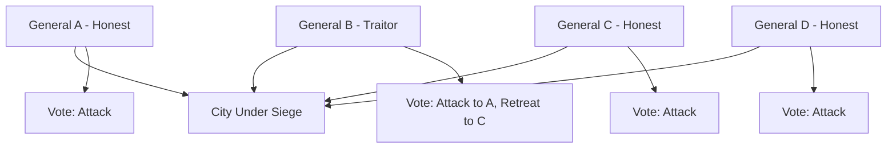

**Practical Byzantine Fault Tolerance (pBFT):**

**pBFT Algorithm ના તબક્કાઓ:**

| **તબક્કો** | **ક્રિયા** | **હેતુ** |
|-----------|-----------|---------|
| **Pre-prepare** | Leader proposal broadcast કરે | Consensus round શરૂ કરવો |
| **Prepare** | Nodes validate કરે અને agreement broadcast કરે | બધાને proposal દેખાડવું |
| **Commit** | Nodes decision પર commit કરે | Consensus finalize કરવું |

**pBFT Process Flow:**

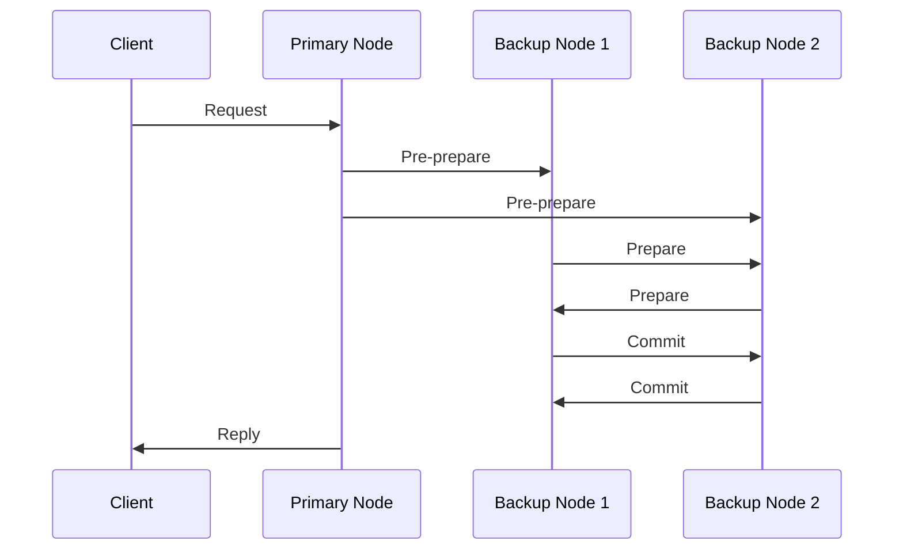

**Fault Tolerance:**

| **બાબત** | **ક્ષમતા** |
|----------|-----------|
| **Maximum Faulty Nodes** | 1/3 સુધી faulty nodes સહન કરી શકે |
| **Network Requirement** | Synchronous અથવા partially synchronous |
| **Message Complexity** | દરેક consensus માટે O(n²) messages |
| **Finality** | તુરંત finality મળે |

**Applications:**

| **System** | **ઉપયોગ** |
|------------|-----------|
| **Hyperledger Fabric** | Consensus mechanism |
| **Tendermint** | Byzantine fault tolerant consensus |
| **Zilliqa** | Practical Byzantine fault tolerance |

- **ફાયદો**: ઝડપી finality, permissioned networks માટે સારું
- **મર્યાદા**: ઊંચો communication overhead, સારી રીતે scale કરતું નથી

**મેમરી ટ્રીક:** "Byzantine = ખરાબ અભિનેતા, pBFT = વ્યાવહારિક ઉકેલ"

---

## પ્રશ્ન 5(અ) [3 ગુણ]

**બ્લોકચેનમાં cryptocurrency wallets ની યાદી બનાવો અને સમજાવો.**

**જવાબ**:

**Cryptocurrency Wallet પ્રકારો:**

| **Wallet Type** | **વર્ણન** | **Security Level** |
|-----------------|----------|-------------------|
| **Hardware Wallet** | Keys store કરતા physical device | ખૂબ ઊંચી |
| **Software Wallet** | Computer/phone પર application | મધ્યમ થી ઊંચી |
| **Paper Wallet** | કાગળ પર છપાયેલી keys | ઊંચી (સુરક્ષિત રીતે stored હોય તો) |
| **Web Wallet** | Online wallet service | મધ્યમ |
| **Brain Wallet** | યાદ રાખેલી keys | વિવિધ |

**Storage પદ્ધતિઓ:**

| **પદ્ધતિ** | **Accessibility** | **Security** |
|-----------|------------------|--------------|
| **Hot Wallet** | હંમેશા online | ઓછી security |
| **Cold Wallet** | Offline storage | વધુ security |

**Wallet કામો:**

```mermaid
graph TD
    A[Cryptocurrency Wallet] --> B[Private Keys Store કરે]
    A --> C[Addresses Generate કરે]
    A --> D[Transactions Sign કરે]
    A --> E[Balances Check કરે]
    A --> F[Crypto Send/Receive કરે]
```

- **મુખ્ય મુદ્દો**: Wallets coins store કરતા નથી, coins access કરવાની keys store કરે
- **Backup**: હંમેશા wallet seed phrase નો backup રાખવો

**મેમરી ટ્રીક:** "Wallet = Key Keeper, Coin Container નથી"

---

## પ્રશ્ન 5(બ) [4 ગુણ]

**ERC-20 ટોકનના ફાયદા અને ગેરફાયદા લખો.**

**જવાબ**:

**ERC-20 Token વ્યાખ્યા**: Ethereum blockchain પર tokens બનાવવા માટેનો standard protocol.

**ફાયદા:**

| **ફાયદો** | **લાભ** |
|----------|---------|
| **Standardization** | બધા tokens સમાન રીતે કામ કરે |
| **Interoperability** | બધા Ethereum wallets સાથે compatible |
| **Easy Development** | નવા tokens બનાવવા સરળ |
| **Wide Support** | Exchanges અને services દ્વારા support |
| **Smart Contract Integration** | DeFi protocols સાથે interact કરી શકે |

**ગેરફાયદા:**

| **ગેરફાયદા** | **સમસ્યા** |
|-------------|-----------|
| **Gas Fees** | Network congestion દરમિયાન મોંઘા transactions |
| **Scalability** | Ethereum ની transaction throughput દ્વારા મર્યાદિત |
| **Security Risks** | Smart contract bugs થી token loss |
| **Centralization** | ઘણા tokens નું centralized control |
| **Environmental Impact** | ઊંચો energy consumption |

**સરખામણી કોષ્ટક:**

| **બાબત** | **ફાયદો** | **ગેરફાયદા** |
|----------|----------|-------------|
| **Adoption** | બહોળો સ્વીકાર | Market oversaturation |
| **Development** | બનાવવા સરળ | Scam tokens બનાવવા પણ સરળ |
| **Functionality** | Standard features | મર્યાદિત customization |

- **ઉપયોગ**: Cryptocurrency tokens બનાવવા માટે સૌથી લોકપ્રિય standard
- **ઉદાહરણો**: USDT, LINK, UNI એ ERC-20 tokens છે

**મેમરી ટ્રીક:** "ERC-20 = Easy અને Expensive"

---

## પ્રશ્ન 5(ક) [7 ગુણ]

**dApps નો ઉપયોગ શેના માટે થાય છે? dApps ના ફાયદા અને ગેરફાયદા સમજાવો.**

**જવાબ**:

**dApps વ્યાખ્યા**: Decentralized Applications જે blockchain networks પર central authority વગર run થાય.

**dApps ઉપયોગ વર્ગીકરણ:**

| **વર્ગ** | **ઉદાહરણો** | **હેતુ** |
|---------|-------------|---------|
| **DeFi** | Uniswap, Compound | Financial services |
| **Gaming** | CryptoKitties, Axie Infinity | Blockchain games |
| **Social Media** | Steemit, Minds | Censorship-resistant platforms |
| **Marketplaces** | OpenSea, Rarible | NFT trading |
| **Governance** | Aragon, DAOstack | Decentralized organizations |
| **Storage** | Filecoin, Storj | Distributed file storage |

**dApp આર્કિટેક્ચર:**

```mermaid
graph LR
    A[Frontend - User Interface] --> B[Web3 Connection]
    B --> C[Smart Contracts]
    C --> D[Blockchain Network]
    D --> E[Distributed Storage]
    
    F[Traditional App] --> G[Central Server]
    G --> H[Central Database]
```

**ફાયદા:**

| **ફાયદો** | **વર્ણન** |
|----------|----------|
| **Censorship Resistance** | કોઈ એક control point નથી |
| **Transparency** | Code અને data publicly verifiable |
| **Global Access** | વિશ્વભરમાં restrictions વગર ઉપલબ્ધ |
| **No Downtime** | ઘણા nodes માં distributed |
| **User Ownership** | Users પોતાના data અને assets control કરે |
| **Trustless** | Intermediaries પર trust કરવાની જરૂર નથી |

**ગેરફાયદા:**

| **ગેરફાયદા** | **વર્ણન** |
|-------------|----------|
| **Poor User Experience** | જટિલ interfaces, ધીમા transactions |
| **Scalability Issues** | મર્યાદિત transaction throughput |
| **High Costs** | દરેક interaction માટે gas fees |
| **Technical Complexity** | Non-technical users માટે મુશ્કેલ |
| **Regulatory Uncertainty** | અસ્પષ્ટ કાયદાકીય સ્થિતિ |
| **Energy Consumption** | ઊંચો environmental impact |
| **Immutable Bugs** | Smart contract errors સહેલાઈથી fix ન કરી શકાય |

**Development પડકારો:**

| **પડકાર** | **અસર** |
|----------|---------|
| **Gas Optimization** | Transaction costs minimize કરવા જોઈએ |
| **Security Auditing** | Hacks અટકાવવા માટે જરૂરી |
| **User Onboarding** | Mainstream users આકર્ષવું મુશ્કેલ |
| **Scalability Solutions** | Layer 2 અથવા alternative chains જોઈએ |

**લોકપ્રિય dApp Platforms:**

| **Platform** | **લક્ષણો** |
|--------------|-----------|
| **Ethereum** | સૌથી વધુ સ્થાપિત, સૌથી વધુ fees |
| **Binance Smart Chain** | ઓછી fees, વધુ centralized |
| **Polygon** | Ethereum Layer 2, ઝડપી અને સસ્તું |
| **Solana** | ઊંચી throughput, નવું ecosystem |

- **ભવિષ્ય**: બહેતર user experience અને ઓછી costs તરફ જતું
- **અપનાવણ**: હજુ પણ early stage પણ ઝડપથી વધી રહ્યું

**મેમરી ટ્રીક:** "dApps = Decentralized પણ મુશ્કેલ"

---

## પ્રશ્ન 5(અ) OR [3 ગુણ]

**Tokenized અને token less બ્લોકચેનને વિગતવાર સમજાવો.**

**જવાબ**:

**Tokenized Blockchain:**

| **લક્ષણ** | **વર્ણન** |
|----------|----------|
| **વ્યાખ્યા** | Native cryptocurrency token સાથેની blockchain |
| **Token હેતુ** | Network participation incentivize કરવો |
| **ઉદાહરણો** | Bitcoin (BTC), Ethereum (ETH) |
| **કામ** | Transaction fees ચૂકવવા, miners/validators ને reward આપવા |

**Token-less Blockchain:**

| **લક્ષણ** | **વર્ણન** |
|----------|----------|
| **વ્યાખ્યા** | Native cryptocurrency વગરની blockchain |
| **Access** | Permission-based participation |
| **ઉદાહરણો** | Hyperledger Fabric, R3 Corda |
| **કામ** | Record keeping, process automation |

**સરખામણી કોષ્ટક:**

| **બાબત** | **Tokenized** | **Token-less** |
|----------|---------------|----------------|
| **Incentive Model** | Economic rewards | Permission-based |
| **Access** | Tokens હોય તો કોઈપણ | Restricted access |
| **Governance** | Token holder voting | Centralized control |
| **Use Case** | Public networks | Private/enterprise |
| **Security** | Economic game theory | Traditional security |

**આર્કિટેક્ચર તફાવતો:**

```mermaid
graph TD
    subgraph "Tokenized Blockchain"
        A[Token Rewards] --> B[Miners/Validators]
        B --> C[Secure Network]
        C --> D[Public Access]
    end
    
    subgraph "Token-less Blockchain"
        E[Permission System] --> F[Authorized Nodes]
        F --> G[Secure Network]
        G --> H[Private Access]
    end
```

- **પસંદગી**: Public participation જોઈએ કે private control તેના પર નિર્ભર
- **ટ્રેન્ડ**: મોટાભાગની public blockchains tokenized, મોટાભાગની private token-less

**મેમરી ટ્રીક:** "Token = Public Participation, Token-less = Private Permission"

---

## પ્રશ્ન 5(બ) OR [4 ગુણ]

**Hyperledger ના ફાયદા અને ગેરફાયદા લખો.**

**જવાબ**:

**Hyperledger વ્યાખ્યા**: Enterprise-grade blockchain solutions develop કરવા માટેનું open-source collaborative framework.

**ફાયદા:**

| **ફાયદો** | **વર્ણન** |
|----------|----------|
| **Enterprise Focus** | Business use cases માટે design |
| **Modular Architecture** | જરૂર પ્રમાણે components customize કરી શકાય |
| **Privacy** | Confidential transactions શક્ય |
| **Performance** | ઊંચી transaction throughput |
| **Governance** | Professional development standards |
| **No Cryptocurrency** | Regulatory crypto issues ટાળે |
| **Permissioned Network** | કોણ participate કરી શકે તેનું control |

**ગેરફાયદા:**

| **ગેરફાયદા** | **વર્ણન** |
|-------------|----------|
| **Centralization** | Public blockchains કરતાં ઓછું decentralized |
| **Complexity** | Implement કરવા માટે technical expertise જરૂરી |
| **Limited Adoption** | Ethereum કરતાં નાનું ecosystem |
| **Vendor Lock-in** | Specific technology providers પર નિર્ભરતા |
| **Scalability** | હજુ પણ કેટલીક scaling challenges |
| **No Token Economy** | Crypto incentives leverage કરી શકાતું નથી |

**Hyperledger Projects સરખામણી:**

| **Project** | **શક્તિઓ** | **મર્યાદાઓ** |
|-------------|----------|-------------|
| **Fabric** | Mature, flexible | Complex setup |
| **Sawtooth** | Scalable | ઓછું documentation |
| **Iroha** | Simple, mobile-friendly | મર્યાદિત features |

**Use Case યોગ્યતા:**

| **સારું છે** | **આદર્શ નથી** |
|------------|-------------|
| **Supply chain tracking** | Public cryptocurrencies |
| **Healthcare records** | સંપૂર્ણ decentralized systems |
| **Banking consortiums** | High-frequency trading |
| **Government systems** | Anonymous transactions |

- **લક્ષ્ય**: મોટી enterprises અને consortiums
- **સપોર્ટ**: Linux Foundation દ્વારા backed

**મેમરી ટ્રીક:** "Hyperledger = High Performance, Low Publicity"

---

## પ્રશ્ન 5(ક) OR [7 ગુણ]

**Smart contract સમજાવો. Smart contract ની વિવિધ એપ્લિકેશન્સ લખો.**

**જવાબ**:

**Smart Contract વ્યાખ્યા**: Self-executing contracts જેના terms સીધા code માં લખાયેલા હોય અને blockchain પર આપોઆપ enforce થાય.

**મુખ્ય લક્ષણો:**

| **લક્ષણ** | **વર્ણન** |
|----------|----------|
| **Automated** | Conditions પૂરી થાય ત્યારે આપોઆપ execute |
| **Immutable** | Deployment પછી બદલી શકાતું નથી |
| **Transparent** | Code publicly visible |
| **Trustless** | Intermediaries ની જરૂર નથી |
| **Deterministic** | સમાન input હંમેશા સમાન output |

**Smart Contract Workflow:**

```mermaid
graph LR
    A[Contract Created] --> B[Blockchain પર Deployed]
    B --> C[Conditions Monitored]
    C --> D{Conditions Met?}
    D -->|હા| E[Contract Executes]
    D -->|ના| F[Monitoring ચાલુ]
    E --> G[Automatic Settlement]
    F --> C
```

**Industry પ્રમાણે Applications:**

| **Industry** | **Application** | **ફાયદો** |
|--------------|-----------------|----------|
| **Finance** | Automated loans, insurance claims | ઝડપી processing, ઓછી costs |
| **Real Estate** | Property transfers, rental agreements | ફ્રોડ ઘટાડવું, instant settlements |
| **Supply Chain** | Product tracking, quality assurance | પારદર્શિતા, automated compliance |
| **Healthcare** | Patient consent, insurance claims | Privacy protection, automated payouts |
| **Entertainment** | Royalty distribution, content licensing | Fair payment, transparent accounting |
| **Gaming** | In-game assets, tournaments | True ownership, automated prizes |

**ખાસ Smart Contract ઉદાહરણો:**

| **Application** | **Function** | **Platform** |
|-----------------|--------------|--------------|
| **Uniswap** | Automated token trading | Ethereum |
| **Compound** | Lending અને borrowing | Ethereum |
| **CryptoKitties** | Digital pet ownership | Ethereum |
| **Chainlink** | Oracle data feeds | Multiple platforms |
| **Aave** | Flash loans | Ethereum |

**Development Platforms:**

| **Platform** | **Language** | **લક્ષણો** |
|--------------|--------------|-----------|
| **Ethereum** | Solidity | સૌથી mature ecosystem |
| **Binance Smart Chain** | Solidity | ઓછી fees, ઝડપી |
| **Cardano** | Plutus | Academic approach |
| **Solana** | Rust | High performance |

**ફાયદા:**

| **ફાયદો** | **Traditional Contract** | **Smart Contract** |
|----------|-------------------------|-------------------|
| **Speed** | દિવસો થી અઠવાડિયા | મિનિટો થી કલાકો |
| **Cost** | ઊંચી legal fees | ઓછી gas fees |
| **Trust** | Intermediaries જરૂરી | Trustless execution |
| **Accuracy** | Human error શક્ય | Coded precision |

**મર્યાદાઓ:**

| **મર્યાદા** | **વર્ણન** |
|-----------|----------|
| **Code Bugs** | Errors થી financial loss |
| **Oracle Problem** | Real-world data મેળવવાની મુશ્કેલી |
| **Immutability** | Deployment પછી fix કરવું મુશ્કેલ |
| **Gas Costs** | Congested networks પર મોંઘું |
| **Legal Status** | અસ્પષ્ટ regulatory framework |

**વાસ્તવિક અસર:**

| **ક્ષેત્ર** | **પરિવર્તન** |
|----------|-------------|
| **DeFi** | Smart contracts માં $100+ billion locked |
| **NFTs** | નવા digital ownership models |
| **DAOs** | Decentralized governance systems |
| **Insurance** | Parametric insurance products |

- **ભવિષ્ય**: IoT, AI અને traditional business systems સાથે integration
- **વિકાસ**: વધુ user-friendly development tools તરફ જતું

**મેમરી ટ્રીક:** "Smart Contract = Self-executing, સમસ્યાઓ હલ કરે"
