## Question 1(a) [3 marks]

**Differentiate between Private key and Public key in Blockchain.**

**Answer**:

| **Aspect** | **Private Key** | **Public Key** |
|------------|-----------------|----------------|
| **Purpose** | Used for signing transactions | Used for verification |
| **Sharing** | Must be kept secret | Can be shared publicly |
| **Function** | Decrypts data, creates signatures | Encrypts data, verifies signatures |
| **Ownership** | Only owner knows it | Everyone can access it |

- **Private Key**: Secret mathematical code that proves ownership
- **Public Key**: Open address that others use to send transactions
- **Security**: Private key loss = permanent fund loss

**Mnemonic:** "Private is Personal, Public is Posted"

---

## Question 1(b) [4 marks]

**Explain Distributed Ledger in detail.**

**Answer**:

**Distributed Ledger** is a database spread across multiple locations and participants.

**Table: Key Features**

| **Feature** | **Description** |
|-------------|-----------------|
| **Decentralized** | No single control point |
| **Synchronized** | All copies stay updated |
| **Transparent** | All participants can view |
| **Immutable** | Cannot be easily changed |

**Diagram:**

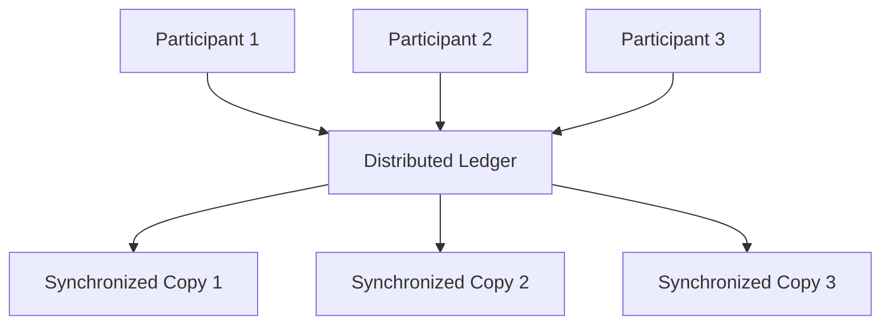

- **Benefits**: Eliminates intermediaries, increases trust, reduces fraud
- **Working**: All participants maintain identical copies of records

**Mnemonic:** "Distributed = Divided but Identical"

---

## Question 1(c) [7 marks]

**Define Blockchain. Describe applications and limits of Blockchain.**

**Answer**:

**Blockchain Definition**: A chain of blocks containing transaction records, linked using cryptography.

**Applications Table:**

| **Sector** | **Application** | **Benefit** |
|------------|-----------------|-------------|
| **Finance** | Cryptocurrency, payments | Faster, cheaper transfers |
| **Healthcare** | Patient records | Secure, accessible data |
| **Supply Chain** | Product tracking | Transparency, authenticity |
| **Real Estate** | Property records | Fraud prevention |
| **Voting** | Digital elections | Transparent, tamper-proof |

**Limits Table:**

| **Limitation** | **Impact** |
|----------------|------------|
| **Scalability** | Slow transaction processing |
| **Energy Usage** | High electricity consumption |
| **Complexity** | Difficult for users to understand |
| **Regulation** | Legal uncertainty |
| **Storage** | Growing data size problems |

**Architecture Diagram:**

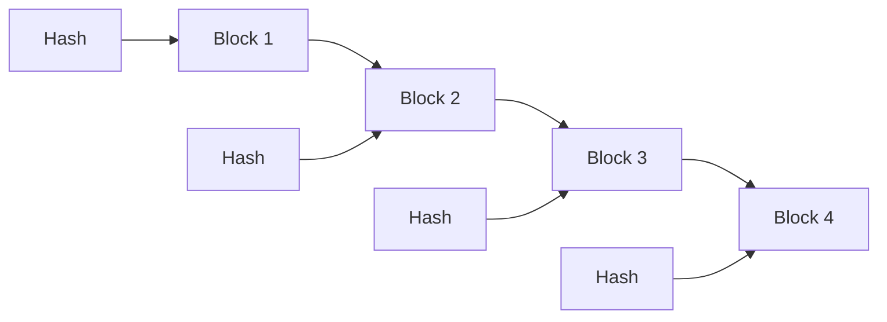

- **Security**: Cryptographic linking makes tampering difficult
- **Transparency**: All transactions visible to network participants

**Mnemonic:** "Blocks Chained = Blockchain, Apps Many = Limits Many"

---

## Question 1(c) OR [7 marks]

**Write a short note on: CAP Theorem in Blockchain**

**Answer**:

**CAP Theorem** states that distributed systems can only guarantee 2 out of 3 properties simultaneously.

**CAP Components Table:**

| **Property** | **Description** | **Example** |
|--------------|-----------------|-------------|
| **Consistency** | All nodes have same data | Same balance shown everywhere |
| **Availability** | System always responds | Network never goes down |
| **Partition Tolerance** | Works despite network failures | Functions even if nodes disconnect |

**Blockchain Trade-offs:**

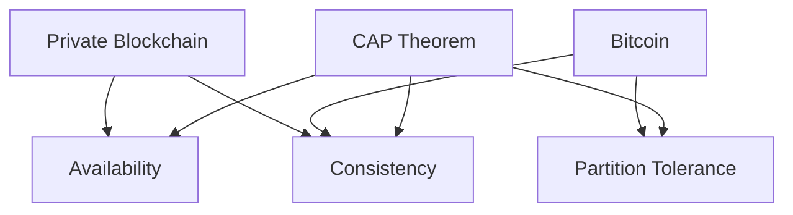

**Real-world Applications:**

| **Blockchain Type** | **Chooses** | **Sacrifices** |
|---------------------|-------------|----------------|
| **Bitcoin** | Consistency + Partition | Availability |
| **Ethereum** | Consistency + Partition | Availability |
| **Private Networks** | Consistency + Availability | Partition Tolerance |

- **Impact**: Blockchain designers must choose which property to sacrifice
- **Trade-off**: Perfect systems impossible in distributed networks

**Mnemonic:** "Can't Always Please - Choose 2 of 3"

---

## Question 2(a) [3 marks]

**Explain Data Structure of a Blockchain.**

**Answer**:

**Blockchain Data Structure** consists of linked blocks containing transaction data.

**Block Structure Table:**

| **Component** | **Purpose** |
|---------------|-------------|
| **Block Header** | Contains metadata |
| **Previous Hash** | Links to previous block |
| **Merkle Root** | Summary of all transactions |
| **Timestamp** | When block was created |
| **Transactions** | Actual data/transfers |

**Visual Structure:**

```goat
+------------------+
|   Block Header   |
|------------------|
| Previous Hash    |
| Merkle Root      |
| Timestamp        |
| Nonce            |
+------------------+
|   Transactions   |
|  [TX1, TX2, TX3] |
+------------------+
```

- **Linking**: Each block points to previous block using hash
- **Integrity**: Changing one block breaks the entire chain

**Mnemonic:** "Header Holds, Transactions Tell"

---

## Question 2(b) [4 marks]

**What are the benefits of Decentralization?**

**Answer**:

**Decentralization Benefits:**

| **Benefit** | **Explanation** |
|-------------|-----------------|
| **No Single Point of Failure** | Network continues if one node fails |
| **Censorship Resistance** | No authority can block transactions |
| **Transparency** | All participants see same information |
| **Reduced Costs** | Eliminates intermediary fees |
| **Trust** | No need to trust central authority |

**Comparison Diagram:**

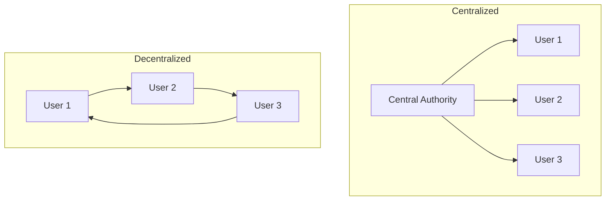

- **Security**: Multiple copies prevent data loss
- **Democracy**: All participants have equal rights
- **Resilience**: System survives individual failures

**Mnemonic:** "Distributed = Durable, Democratic, Direct"

---

## Question 2(c) [7 marks]

**Differentiate between Public Blockchain and Private Blockchain.**

**Answer**:

**Comprehensive Comparison:**

| **Aspect** | **Public Blockchain** | **Private Blockchain** |
|------------|----------------------|------------------------|
| **Access** | Open to everyone | Restricted to specific users |
| **Permission** | Permissionless | Requires permission |
| **Control** | Decentralized | Centralized control |
| **Speed** | Slower (consensus needed) | Faster (fewer validators) |
| **Security** | High (many validators) | Medium (fewer validators) |
| **Cost** | Transaction fees required | Lower operational costs |
| **Transparency** | Fully transparent | Limited transparency |
| **Examples** | Bitcoin, Ethereum | Hyperledger, R3 Corda |

**Network Architecture:**

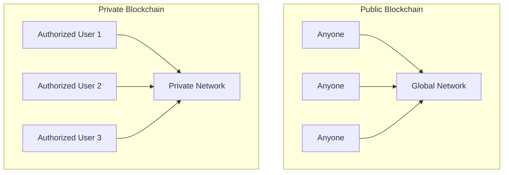

**Use Cases:**

| **Type** | **Best For** |
|----------|--------------|
| **Public** | Cryptocurrencies, public records |
| **Private** | Banking, supply chain, healthcare |

- **Trade-offs**: Public offers more security, Private offers more control
- **Choice**: Depends on transparency vs. privacy needs

**Mnemonic:** "Public = People's, Private = Permitted"

---

## Question 2(a) OR [3 marks]

**Describe Core Components of Block Chain with suitable diagram.**

**Answer**:

**Core Components:**

| **Component** | **Function** |
|---------------|--------------|
| **Blocks** | Store transaction data |
| **Hash Functions** | Create unique fingerprints |
| **Digital Signatures** | Verify transaction authenticity |
| **Consensus Mechanism** | Agree on valid transactions |
| **Peer-to-Peer Network** | Connect all participants |

**System Architecture:**


- **Integration**: All components work together for security
- **Purpose**: Each component serves specific blockchain function

**Mnemonic:** "Blocks Build, Hash Holds, Signatures Secure"

---

## Question 2(b) OR [4 marks]

**Define and explain permissioned blockchain in detail.**

**Answer**:

**Permissioned Blockchain Definition**: A blockchain where participation requires explicit permission from network administrators.

**Characteristics Table:**

| **Feature** | **Description** |
|-------------|-----------------|
| **Access Control** | Only approved users can join |
| **Validation Rights** | Selected nodes validate transactions |
| **Governance** | Central authority manages network |
| **Privacy** | Transaction details can be private |

**Permission Levels:**

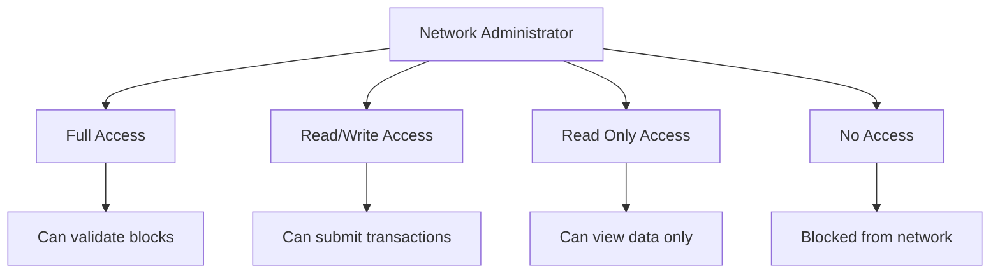

- **Benefits**: Better privacy, regulatory compliance, faster processing
- **Drawbacks**: Less decentralized, requires trust in administrators

**Mnemonic:** "Permission = Participation Permitted"

---

## Question 2(c) OR [7 marks]

**Explain sidechain in brief.**

**Answer**:

**Sidechain Definition**: A separate blockchain connected to main blockchain, allowing asset transfer between chains.

**Sidechain Architecture:**

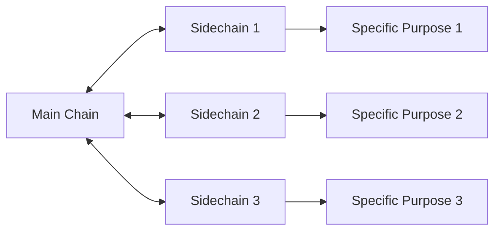

**Benefits and Features:**

| **Aspect** | **Benefit** |
|------------|-------------|
| **Scalability** | Reduces main chain load |
| **Experimentation** | Test new features safely |
| **Specialization** | Optimized for specific use cases |
| **Interoperability** | Connect different blockchains |

**Transfer Process:**

| **Step** | **Action** |
|----------|------------|
| **1. Lock** | Assets locked on main chain |
| **2. Proof** | Cryptographic proof generated |
| **3. Release** | Equivalent assets released on sidechain |
| **4. Use** | Assets used on sidechain |
| **5. Return** | Reverse process to return assets |

**Real Examples:**

| **Sidechain** | **Purpose** |
|---------------|-------------|
| **Lightning Network** | Fast Bitcoin payments |
| **Plasma** | Ethereum scaling |
| **Liquid** | Bitcoin trading |

- **Security**: Maintains connection to secure main chain
- **Flexibility**: Each sidechain can have different rules
- **Innovation**: Allows blockchain ecosystem expansion

**Mnemonic:** "Side Supports, Main Maintains"

---

## Question 3(a) [3 marks]

**Define Consensus Mechanism and explain any one in detail.**

**Answer**:

**Consensus Mechanism Definition**: A protocol that ensures all network participants agree on the blockchain's current state.

**Proof of Work (PoW) Explanation:**

| **Component** | **Function** |
|---------------|--------------|
| **Mining** | Solving complex mathematical puzzles |
| **Competition** | Miners compete to solve first |
| **Verification** | Network verifies solution |
| **Reward** | Winner gets cryptocurrency reward |

**PoW Process:**


- **Security**: Computational work makes tampering expensive
- **Example**: Bitcoin uses Proof of Work consensus

**Mnemonic:** "Consensus = Common Sense, Work = Win"

---

## Question 3(b) [4 marks]

**Why is Forking needed in Blockchain? List various types of Forks in Blockchain.**

**Answer**:

**Why Forking is Needed:**

| **Reason** | **Purpose** |
|------------|-------------|
| **Upgrades** | Add new features to blockchain |
| **Bug Fixes** | Correct security vulnerabilities |
| **Rule Changes** | Modify consensus rules |
| **Community Disagreement** | Split when no consensus reached |

**Types of Forks:**

| **Fork Type** | **Description** | **Compatibility** |
|---------------|-----------------|-------------------|
| **Soft Fork** | Tightens rules | Backward compatible |
| **Hard Fork** | Changes rules completely | Not backward compatible |
| **Accidental Fork** | Temporary split | Resolves automatically |
| **Contentious Fork** | Community disagreement | Permanent split |

**Fork Visualization:**

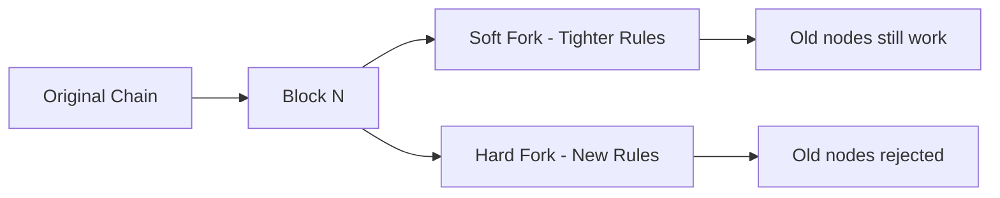

- **Impact**: Forks can create new cryptocurrencies
- **Examples**: Bitcoin Cash (hard fork), Ethereum updates (soft forks)

**Mnemonic:** "Fork = Future Options, Rules Kept"

---

## Question 3(c) [7 marks]

**What is Bitcoin Mining? Explain working, difficulty and benefits of Bitcoin mining in detail.**

**Answer**:

**Bitcoin Mining Definition**: Process of adding new transactions to Bitcoin blockchain by solving computational puzzles.

**Mining Process:**

| **Step** | **Action** | **Details** |
|----------|------------|-------------|
| **1. Collection** | Gather pending transactions | From mempool |
| **2. Block Creation** | Form new block | Include transactions |
| **3. Puzzle Solving** | Find correct nonce | Trial and error |
| **4. Verification** | Network checks solution | Validates block |
| **5. Addition** | Add block to chain | Permanent record |
| **6. Reward** | Miner gets Bitcoin | Currently 6.25 BTC |

**Mining Workflow:**

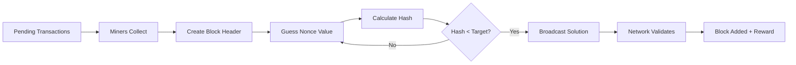

**Difficulty Adjustment:**

| **Aspect** | **Mechanism** |
|------------|---------------|
| **Target Time** | 10 minutes per block |
| **Adjustment Period** | Every 2016 blocks (~2 weeks) |
| **Auto-Regulation** | Increases if blocks too fast |
| **Purpose** | Maintain consistent block time |

**Benefits of Mining:**

| **Benefit** | **Description** |
|-------------|-----------------|
| **Financial Reward** | Earn Bitcoin for successful mining |
| **Network Security** | More miners = more secure network |
| **Transaction Processing** | Enables Bitcoin transfers |
| **Decentralization** | No central authority needed |

- **Energy**: Mining requires significant electricity
- **Competition**: Difficulty increases with more miners
- **Hardware**: Specialized ASIC miners most efficient

**Mnemonic:** "Mining = Money, Math, Maintenance"

---

## Question 3(a) OR [3 marks]

**Differentiate Soft fork and Hard fork.**

**Answer**:

**Fork Comparison:**

| **Aspect** | **Soft Fork** | **Hard Fork** |
|------------|---------------|---------------|
| **Compatibility** | Backward compatible | Not backward compatible |
| **Rules** | Makes rules stricter | Changes rules completely |
| **Node Updates** | Optional for old nodes | Mandatory for all nodes |
| **Chain Split** | No permanent split | Can create permanent split |
| **Consensus** | Easier to implement | Requires majority agreement |
| **Examples** | SegWit (Bitcoin) | Bitcoin Cash, Ethereum Classic |

**Visual Representation:**

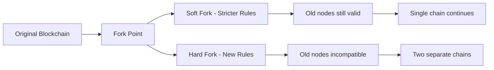

- **Risk**: Hard forks can split community and create competing currencies
- **Safety**: Soft forks are generally safer and less disruptive

**Mnemonic:** "Soft = Same Direction, Hard = Huge Difference"

---

## Question 3(b) OR [4 marks]

**What is the importance of Finality in the World of Blockchain?**

**Answer**:

**Finality Definition**: The guarantee that once a transaction is confirmed, it cannot be reversed or altered.

**Importance Table:**

| **Aspect** | **Importance** |
|------------|----------------|
| **Trust** | Users confident transactions are permanent |
| **Business Use** | Companies can rely on completed transactions |
| **Legal Certainty** | Courts can enforce blockchain records |
| **Settlement** | Financial institutions can clear payments |

**Types of Finality:**

| **Type** | **Description** | **Time** |
|----------|-----------------|----------|
| **Probabilistic** | Becomes more certain over time | Bitcoin: ~1 hour |
| **Absolute** | Immediate guarantee | Some private chains |
| **Economic** | Cost of reversal too high | Varies by network |

**Finality Process:**

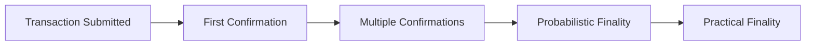

- **Bitcoin**: 6 confirmations generally considered final
- **Ethereum**: Moving toward faster finality with Proof of Stake
- **Challenge**: Balance between speed and security

**Mnemonic:** "Final = Forever, Important = Irreversible"

---

## Question 3(c) OR [7 marks]

**What is a 51% attack in Blockchain? Explain in brief.**

**Answer**:

**51% Attack Definition**: When a single entity controls more than 50% of network's mining power or validators, allowing them to manipulate the blockchain.

**Attack Mechanism:**

| **Step** | **Attacker Action** | **Impact** |
|----------|---------------------|------------|
| **1. Control** | Gain >50% mining power | Dominate network |
| **2. Double Spend** | Create secret chain | Prepare alternative history |
| **3. Execute** | Release longer chain | Network accepts fake version |
| **4. Profit** | Spend coins twice | Steal from victims |

**Attack Visualization:**

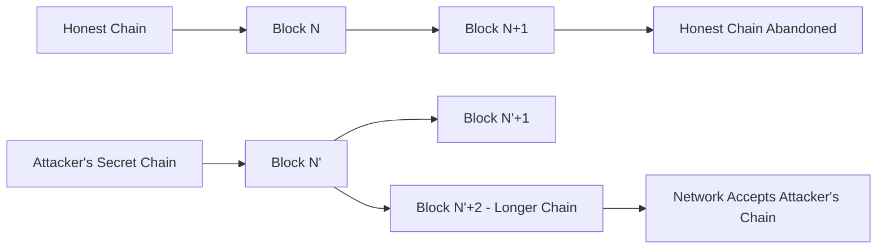

**Possible Attacks:**

| **Attack Type** | **Description** |
|-----------------|-----------------|
| **Double Spending** | Spend same coins twice |
| **Transaction Reversal** | Cancel confirmed transactions |
| **Mining Monopoly** | Block other miners' work |
| **Censorship** | Prevent specific transactions |

**Prevention Methods:**

| **Method** | **How It Helps** |
|------------|------------------|
| **Decentralization** | Spread mining across many participants |
| **High Hash Rate** | Make attack economically unfeasible |
| **Proof of Stake** | Attackers lose their staked coins |
| **Monitoring** | Detect suspicious mining activity |

**Real Examples:**

| **Blockchain** | **Status** |
|----------------|------------|
| **Bitcoin** | Never successfully attacked |
| **Ethereum Classic** | Attacked multiple times |
| **Small Altcoins** | More vulnerable due to low hash rate |

- **Cost**: Attacking major networks extremely expensive
- **Detection**: Attacks usually detected quickly
- **Recovery**: Networks can implement countermeasures

**Mnemonic:** "51% = Majority Mischief, Control = Chaos"

---

## Question 4(a) [3 marks]

**Describe various types of Hyperledger projects.**

**Answer**:

**Hyperledger Project Types:**

| **Project** | **Purpose** | **Use Case** |
|-------------|-------------|--------------|
| **Fabric** | Modular blockchain platform | Enterprise applications |
| **Sawtooth** | Scalable blockchain suite | Supply chain, IoT |
| **Iroha** | Mobile-focused blockchain | Identity management |
| **Indy** | Digital identity platform | Self-sovereign identity |
| **Besu** | Ethereum-compatible client | Public/private Ethereum |
| **Burrow** | Smart contract platform | Permissioned networks |

**Project Categories:**

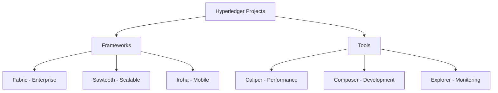

- **Focus**: Enterprise and business blockchain solutions
- **Open Source**: All projects are freely available

**Mnemonic:** "Hyper = High Performance, Ledger = Large Enterprise"

---

## Question 4(b) [4 marks]

**Differentiate between Blockchain and Bitcoin.**

**Answer**:

**Comprehensive Comparison:**

| **Aspect** | **Blockchain** | **Bitcoin** |
|------------|----------------|-------------|
| **Definition** | Technology/Platform | Digital Currency |
| **Scope** | Broader concept | Specific application |
| **Purpose** | Record keeping system | Peer-to-peer payments |
| **Applications** | Many industries | Primarily financial |
| **Flexibility** | Can be customized | Fixed protocol |
| **Creator** | Multiple contributors | Satoshi Nakamoto |
| **Launch** | Concept evolved over time | Launched 2009 |

**Relationship Diagram:**

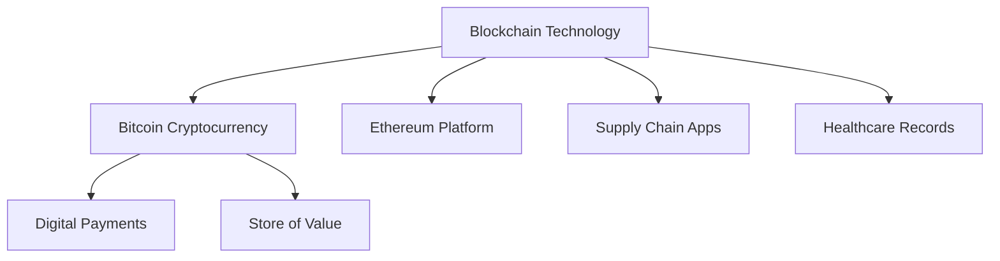

**Key Differences:**

| **Category** | **Blockchain** | **Bitcoin** |
|--------------|----------------|-------------|
| **Type** | Infrastructure | Application |
| **Usage** | Multiple purposes | Currency only |
| **Modifications** | Can be changed | Protocol fixed |

- **Analogy**: Blockchain is like the internet, Bitcoin is like email
- **Dependency**: Bitcoin needs blockchain, but blockchain doesn't need Bitcoin

**Mnemonic:** "Blockchain = Building Block, Bitcoin = Specific Brick"

---

## Question 4(c) [7 marks]

**Write a short note on: Merkle Tree**

**Answer**:

**Merkle Tree Definition**: A binary tree structure where each leaf represents a transaction hash, and each internal node contains the hash of its children.

**Structure and Components:**

| **Component** | **Description** |
|---------------|-----------------|
| **Leaf Nodes** | Individual transaction hashes |
| **Internal Nodes** | Hash of two child nodes |
| **Root Hash** | Single hash representing entire tree |
| **Path** | Route from leaf to root |

**Merkle Tree Diagram:**

```goat
                    Root Hash
                   /         \
              Hash AB       Hash CD
             /       \     /       \
        Hash A   Hash B Hash C   Hash D
          |        |      |        |
        TX A     TX B   TX C     TX D
```

**Construction Process:**

| **Step** | **Action** |
|----------|------------|
| **1** | Hash each transaction individually |
| **2** | Pair hashes and hash them together |
| **3** | Continue pairing until single root |
| **4** | Store root hash in block header |

**Benefits Table:**

| **Benefit** | **Explanation** |
|-------------|-----------------|
| **Efficiency** | Quick verification without downloading all data |
| **Security** | Any change detected immediately |
| **Scalability** | Verification time stays constant |
| **Storage** | Only root hash needed in block header |

**Verification Process:**

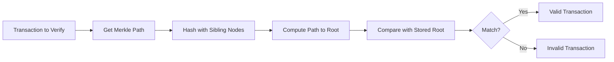

**Real-world Applications:**

| **Use Case** | **Application** |
|--------------|-----------------|
| **Bitcoin** | Transaction verification |
| **Git** | Version control |
| **IPFS** | Distributed storage |
| **Certificate Transparency** | SSL certificate logs |

- **Inventor**: Named after Ralph Merkle (1988)
- **Efficiency**: Allows verification with O(log n) complexity
- **Security**: Tampering with any transaction changes root hash

**Mnemonic:** "Merkle = Many Made One, Tree = Trustworthy"

---

## Question 4(a) OR [3 marks]

**Discuss briefly about Hash pointer and how it is used in Merkle tree.**

**Answer**:

**Hash Pointer Definition**: A data structure containing both the location of data and cryptographic hash of that data.

**Components:**

| **Component** | **Purpose** |
|---------------|-------------|
| **Pointer** | Shows where data is stored |
| **Hash** | Proves data hasn't changed |
| **Combination** | Links data with integrity check |

**Hash Pointer in Merkle Tree:**

```goat
        Root Hash Pointer
       /                 \
   Hash Ptr AB        Hash Ptr CD
   /         \        /         \
Hash A     Hash B  Hash C     Hash D
  |          |       |          |
 TX A       TX B    TX C       TX D
```

**Usage in Merkle Tree:**

| **Level** | **Hash Pointer Function** |
|-----------|---------------------------|
| **Leaf Level** | Points to transaction, contains transaction hash |
| **Internal Nodes** | Points to children, contains combined hash |
| **Root** | Points to tree structure, contains overall hash |

- **Verification**: Can detect any change in tree structure
- **Navigation**: Allows efficient traversal of tree

**Mnemonic:** "Hash Pointer = Location + Verification"

---

## Question 4(b) OR [4 marks]

**What is Hashing in Blockchain? How it is useful in Bitcoin?**

**Answer**:

**Hashing Definition**: Mathematical function that converts input data into fixed-size string of characters.

**Hashing Properties:**

| **Property** | **Description** |
|--------------|-----------------|
| **Deterministic** | Same input always produces same output |
| **Fixed Size** | Output always same length (256 bits for SHA-256) |
| **Avalanche Effect** | Small input change = completely different output |
| **One-way** | Cannot reverse to find original input |
| **Collision Resistant** | Extremely hard to find two inputs with same output |

**Bitcoin Usage:**

| **Use Case** | **Purpose** |
|--------------|-------------|
| **Block Linking** | Each block contains hash of previous block |
| **Mining** | Find hash meeting difficulty requirement |
| **Transaction IDs** | Unique identifier for each transaction |
| **Merkle Root** | Summarize all transactions in block |
| **Addresses** | Create Bitcoin addresses from public keys |

**Hashing Process:**

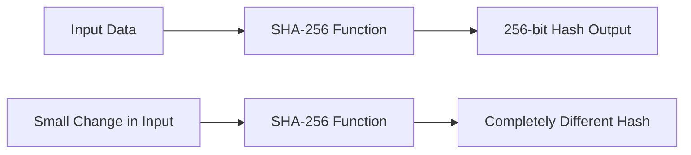

- **Algorithm**: Bitcoin uses SHA-256 hashing
- **Security**: Makes blockchain tamper-evident
- **Efficiency**: Quick to compute and verify

**Mnemonic:** "Hash = Fingerprint, Bitcoin = Built on Hashing"

---

## Question 4(c) OR [7 marks]

**Explain classic Byzantine generals problem and Practical Byzantine Fault Tolerance in detail.**

**Answer**:

**Byzantine Generals Problem**: A classic computer science problem about achieving consensus in distributed systems with potentially unreliable participants.

**Problem Scenario:**

| **Element** | **Description** |
|-------------|-----------------|
| **Generals** | Represent network nodes |
| **City** | Represents the system state |
| **Attack Plan** | Represents consensus decision |
| **Traitors** | Represent malicious/faulty nodes |
| **Communication** | Messages between nodes |

**Problem Visualization:**

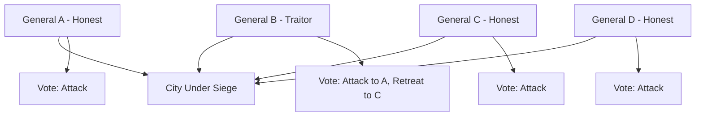

**Practical Byzantine Fault Tolerance (pBFT):**

**pBFT Algorithm Phases:**

| **Phase** | **Action** | **Purpose** |
|-----------|------------|-------------|
| **Pre-prepare** | Leader broadcasts proposal | Initiate consensus round |
| **Prepare** | Nodes validate and broadcast agreement | Ensure proposal is seen by all |
| **Commit** | Nodes commit to decision | Finalize consensus |

**pBFT Process Flow:**

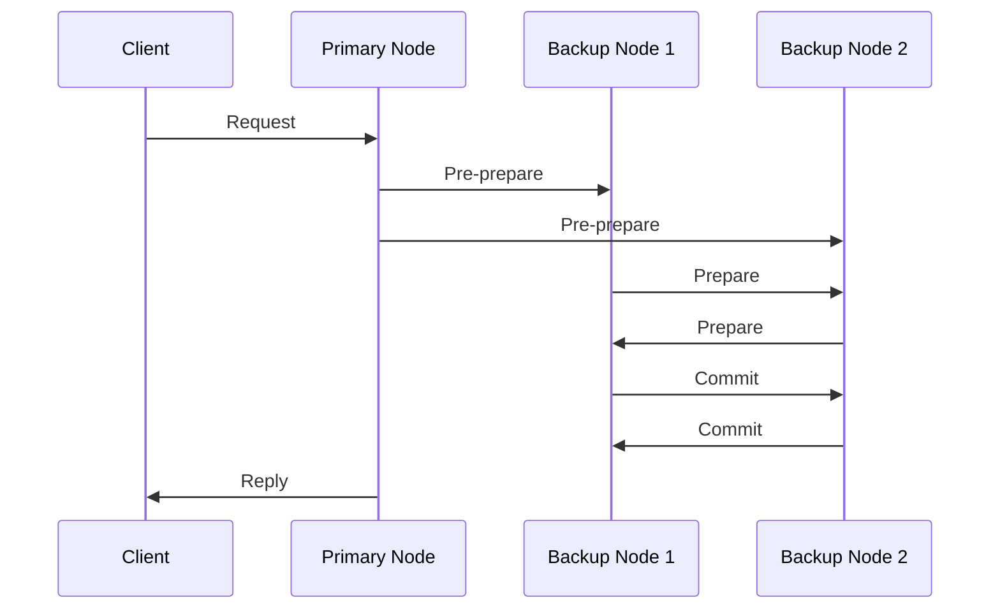

**Fault Tolerance:**

| **Aspect** | **Capability** |
|------------|----------------|
| **Maximum Faulty Nodes** | Can tolerate up to 1/3 faulty nodes |
| **Network Requirement** | Synchronous or partially synchronous |
| **Message Complexity** | O(n²) messages per consensus |
| **Finality** | Immediate finality achieved |

**Applications:**

| **System** | **Usage** |
|------------|-----------|
| **Hyperledger Fabric** | Consensus mechanism |
| **Tendermint** | Byzantine fault tolerant consensus |
| **Zilliqa** | Practical Byzantine fault tolerance |

- **Advantage**: Fast finality, good for permissioned networks
- **Limitation**: High communication overhead, doesn't scale well

**Mnemonic:** "Byzantine = Bad actors, pBFT = Practical Fix"

---

## Question 5(a) [3 marks]

**List and explain cryptocurrency wallets in blockchain.**

**Answer**:

**Cryptocurrency Wallet Types:**

| **Wallet Type** | **Description** | **Security Level** |
|-----------------|-----------------|-------------------|
| **Hardware Wallet** | Physical device storing keys | Very High |
| **Software Wallet** | Application on computer/phone | Medium to High |
| **Paper Wallet** | Keys printed on paper | High (if stored safely) |
| **Web Wallet** | Online wallet service | Medium |
| **Brain Wallet** | Keys memorized | Variable |

**Storage Methods:**

| **Method** | **Accessibility** | **Security** |
|------------|------------------|--------------|
| **Hot Wallet** | Always online | Lower security |
| **Cold Wallet** | Offline storage | Higher security |

**Wallet Functions:**

```mermaid
graph TD
    A[Cryptocurrency Wallet] --> B[Store Private Keys]
    A --> C[Generate Addresses]
    A --> D[Sign Transactions]
    A --> E[Check Balances]
    A --> F[Send/Receive Crypto]
```

- **Key Point**: Wallets don't store coins, they store keys to access coins
- **Backup**: Always backup wallet seed phrase

**Mnemonic:** "Wallet = Key Keeper, Not Coin Container"

---

## Question 5(b) [4 marks]

**Write advantages and disadvantages of ERC-20 token.**

**Answer**:

**ERC-20 Token Definition**: Standard protocol for creating tokens on Ethereum blockchain.

**Advantages:**

| **Advantage** | **Benefit** |
|---------------|-------------|
| **Standardization** | All tokens work the same way |
| **Interoperability** | Compatible with all Ethereum wallets |
| **Easy Development** | Simple to create new tokens |
| **Wide Support** | Supported by exchanges and services |
| **Smart Contract Integration** | Can interact with DeFi protocols |

**Disadvantages:**

| **Disadvantage** | **Problem** |
|------------------|-------------|
| **Gas Fees** | Expensive transactions during network congestion |
| **Scalability** | Limited by Ethereum's transaction throughput |
| **Security Risks** | Smart contract bugs can cause token loss |
| **Centralization** | Many tokens have centralized control |
| **Environmental Impact** | High energy consumption |

**Comparison Table:**

| **Aspect** | **Advantage** | **Disadvantage** |
|------------|---------------|------------------|
| **Adoption** | Widely accepted | Market oversaturation |
| **Development** | Easy to create | Easy to create scam tokens |
| **Functionality** | Standard features | Limited customization |

- **Usage**: Most popular standard for creating cryptocurrency tokens
- **Examples**: USDT, LINK, UNI are ERC-20 tokens

**Mnemonic:** "ERC-20 = Easy and Expensive"

---

## Question 5(c) [7 marks]

**What are dApps used for? Explain advantages and disadvantages of dApps.**

**Answer**:

**dApps Definition**: Decentralized Applications that run on blockchain networks without central authority.

**dApps Usage Categories:**

| **Category** | **Examples** | **Purpose** |
|--------------|--------------|-------------|
| **DeFi** | Uniswap, Compound | Financial services |
| **Gaming** | CryptoKitties, Axie Infinity | Blockchain games |
| **Social Media** | Steemit, Minds | Censorship-resistant platforms |
| **Marketplaces** | OpenSea, Rarible | NFT trading |
| **Governance** | Aragon, DAOstack | Decentralized organizations |
| **Storage** | Filecoin, Storj | Distributed file storage |

**dApp Architecture:**

```mermaid
graph LR
    A[Frontend - User Interface] --> B[Web3 Connection]
    B --> C[Smart Contracts]
    C --> D[Blockchain Network]
    D --> E[Distributed Storage]
    
    F[Traditional App] --> G[Central Server]
    G --> H[Central Database]
```

**Advantages:**

| **Advantage** | **Description** |
|---------------|-----------------|
| **Censorship Resistance** | No single point of control |
| **Transparency** | Code and data publicly verifiable |
| **Global Access** | Available worldwide without restrictions |
| **No Downtime** | Distributed across many nodes |
| **User Ownership** | Users control their data and assets |
| **Trustless** | No need to trust intermediaries |

**Disadvantages:**

| **Disadvantage** | **Description** |
|------------------|-----------------|
| **Poor User Experience** | Complex interfaces, slow transactions |
| **Scalability Issues** | Limited transaction throughput |
| **High Costs** | Gas fees for every interaction |
| **Technical Complexity** | Difficult for non-technical users |
| **Regulatory Uncertainty** | Unclear legal status |
| **Energy Consumption** | High environmental impact |
| **Immutable Bugs** | Cannot easily fix smart contract errors |

**Development Challenges:**

| **Challenge** | **Impact** |
|---------------|------------|
| **Gas Optimization** | Must minimize transaction costs |
| **Security Auditing** | Critical to prevent hacks |
| **User Onboarding** | Difficult to attract mainstream users |
| **Scalability Solutions** | Need Layer 2 or alternative chains |

**Popular dApp Platforms:**

| **Platform** | **Characteristics** |
|--------------|-------------------|
| **Ethereum** | Most established, highest fees |
| **Binance Smart Chain** | Lower fees, more centralized |
| **Polygon** | Ethereum Layer 2, faster and cheaper |
| **Solana** | High throughput, newer ecosystem |

- **Future**: Moving toward better user experience and lower costs
- **Adoption**: Still early stage but growing rapidly

**Mnemonic:** "dApps = Decentralized but Difficult"

---

## Question 5(a) OR [3 marks]

**Explain tokenized and token less Blockchain in detail.**

**Answer**:

**Tokenized Blockchain:**

| **Feature** | **Description** |
|-------------|-----------------|
| **Definition** | Blockchain with native cryptocurrency token |
| **Token Purpose** | Incentivize network participation |
| **Examples** | Bitcoin (BTC), Ethereum (ETH) |
| **Function** | Pay transaction fees, reward miners/validators |

**Token-less Blockchain:**

| **Feature** | **Description** |
|-------------|-----------------|
| **Definition** | Blockchain without native cryptocurrency |
| **Access** | Permission-based participation |
| **Examples** | Hyperledger Fabric, R3 Corda |
| **Function** | Record keeping, process automation |

**Comparison Table:**

| **Aspect** | **Tokenized** | **Token-less** |
|------------|---------------|----------------|
| **Incentive Model** | Economic rewards | Permission-based |
| **Access** | Open to anyone with tokens | Restricted access |
| **Governance** | Token holder voting | Centralized control |
| **Use Case** | Public networks | Private/enterprise |
| **Security** | Economic game theory | Traditional security |

**Architecture Differences:**

```mermaid
graph TD
    subgraph "Tokenized Blockchain"
        A[Token Rewards] --> B[Miners/Validators]
        B --> C[Secure Network]
        C --> D[Public Access]
    end
    
    subgraph "Token-less Blockchain"
        E[Permission System] --> F[Authorized Nodes]
        F --> G[Secure Network]
        G --> H[Private Access]
    end
```

- **Choice**: Depends on whether you need public participation or private control
- **Trend**: Most public blockchains are tokenized, most private ones are token-less

**Mnemonic:** "Token = Public Participation, Token-less = Private Permission"

---

## Question 5(b) OR [4 marks]

**Write advantages and disadvantages of Hyperledger.**

**Answer**:

**Hyperledger Definition**: Open-source collaborative framework for developing enterprise-grade blockchain solutions.

**Advantages:**

| **Advantage** | **Description** |
|---------------|-----------------|
| **Enterprise Focus** | Designed for business use cases |
| **Modular Architecture** | Customize components as needed |
| **Privacy** | Confidential transactions possible |
| **Performance** | Higher transaction throughput |
| **Governance** | Professional development standards |
| **No Cryptocurrency** | Avoids regulatory crypto issues |
| **Permissioned Network** | Control who can participate |

**Disadvantages:**

| **Disadvantage** | **Description** |
|------------------|-----------------|
| **Centralization** | Less decentralized than public blockchains |
| **Complexity** | Requires technical expertise to implement |
| **Limited Adoption** | Smaller ecosystem compared to Ethereum |
| **Vendor Lock-in** | May depend on specific technology providers |
| **Scalability** | Still faces some scaling challenges |
| **No Token Economy** | Cannot leverage crypto incentives |

**Hyperledger Projects Comparison:**

| **Project** | **Strengths** | **Limitations** |
|-------------|---------------|-----------------|
| **Fabric** | Mature, flexible | Complex setup |
| **Sawtooth** | Scalable | Less documentation |
| **Iroha** | Simple, mobile-friendly | Limited features |

**Use Case Suitability:**

| **Good For** | **Not Ideal For** |
|--------------|------------------|
| **Supply chain tracking** | Public cryptocurrencies |
| **Healthcare records** | Fully decentralized systems |
| **Banking consortiums** | High-frequency trading |
| **Government systems** | Anonymous transactions |

- **Target**: Large enterprises and consortiums
- **Support**: Backed by Linux Foundation

**Mnemonic:** "Hyperledger = High Performance, Low Publicity"

---

## Question 5(c) OR [7 marks]

**Explain Smart contract. Write various applications of smart contract.**

**Answer**:

**Smart Contract Definition**: Self-executing contracts with terms directly written into code, automatically enforced on blockchain.

**Key Characteristics:**

| **Feature** | **Description** |
|-------------|-----------------|
| **Automated** | Executes automatically when conditions met |
| **Immutable** | Cannot be changed after deployment |
| **Transparent** | Code is publicly visible |
| **Trustless** | No intermediaries needed |
| **Deterministic** | Same input always produces same output |

**Smart Contract Workflow:**

```mermaid
graph LR
    A[Contract Created] --> B[Deployed to Blockchain]
    B --> C[Conditions Monitored]
    C --> D{Conditions Met?}
    D -->|Yes| E[Contract Executes]
    D -->|No| F[Continue Monitoring]
    E --> G[Automatic Settlement]
    F --> C
```

**Applications by Industry:**

| **Industry** | **Application** | **Benefit** |
|--------------|-----------------|-------------|
| **Finance** | Automated loans, insurance claims | Faster processing, lower costs |
| **Real Estate** | Property transfers, rental agreements | Reduced fraud, instant settlements |
| **Supply Chain** | Product tracking, quality assurance | Transparency, automated compliance |
| **Healthcare** | Patient consent, insurance claims | Privacy protection, automated payouts |
| **Entertainment** | Royalty distribution, content licensing | Fair payment, transparent accounting |
| **Gaming** | In-game assets, tournaments | True ownership, automated prizes |

**Specific Smart Contract Examples:**

| **Application** | **Function** | **Platform** |
|-----------------|--------------|--------------|
| **Uniswap** | Automated token trading | Ethereum |
| **Compound** | Lending and borrowing | Ethereum |
| **CryptoKitties** | Digital pet ownership | Ethereum |
| **Chainlink** | Oracle data feeds | Multiple platforms |
| **Aave** | Flash loans | Ethereum |

**Development Platforms:**

| **Platform** | **Language** | **Features** |
|--------------|--------------|--------------|
| **Ethereum** | Solidity | Most mature ecosystem |
| **Binance Smart Chain** | Solidity | Lower fees, faster |
| **Cardano** | Plutus | Academic approach |
| **Solana** | Rust | High performance |

**Benefits:**

| **Benefit** | **Traditional Contract** | **Smart Contract** |
|-------------|-------------------------|-------------------|
| **Speed** | Days to weeks | Minutes to hours |
| **Cost** | High legal fees | Low gas fees |
| **Trust** | Requires intermediaries | Trustless execution |
| **Accuracy** | Human error possible | Coded precision |

**Limitations:**

| **Limitation** | **Description** |
|----------------|-----------------|
| **Code Bugs** | Errors can cause financial loss |
| **Oracle Problem** | Difficulty getting real-world data |
| **Immutability** | Hard to fix after deployment |
| **Gas Costs** | Can be expensive on congested networks |
| **Legal Status** | Unclear regulatory framework |

**Real-world Impact:**

| **Sector** | **Transformation** |
|------------|-------------------|
| **DeFi** | $100+ billion locked in smart contracts |
| **NFTs** | New digital ownership models |
| **DAOs** | Decentralized governance systems |
| **Insurance** | Parametric insurance products |

- **Future**: Integration with IoT, AI, and traditional business systems
- **Evolution**: Moving toward more user-friendly development tools

**Mnemonic:** "Smart Contract = Self-executing, Solves Problems"
