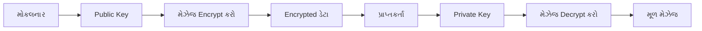
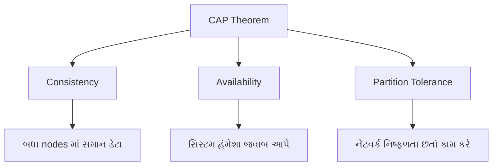
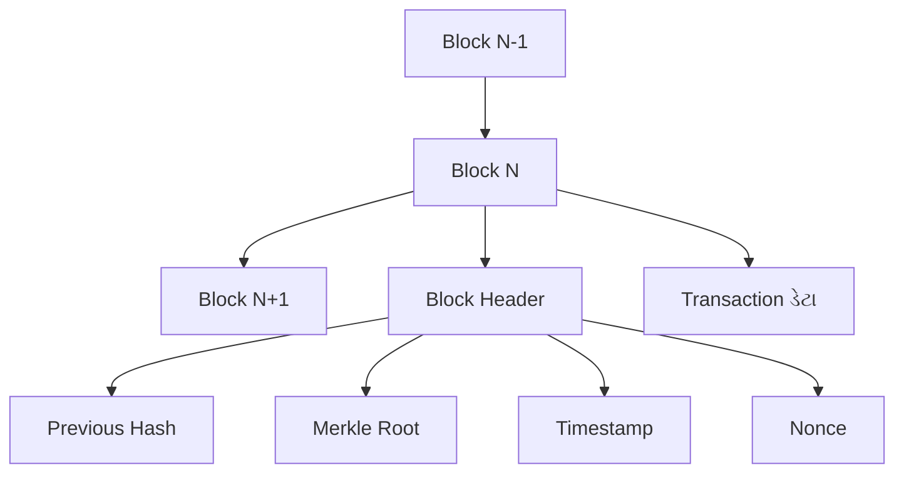
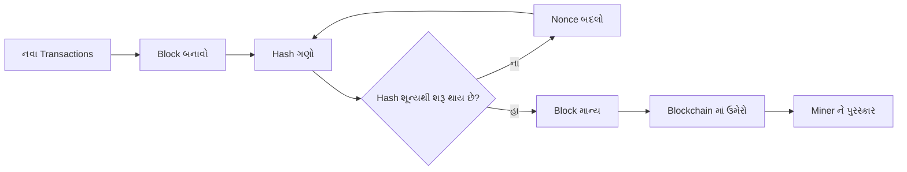
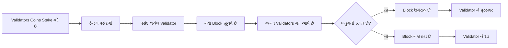
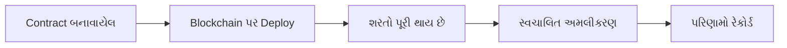
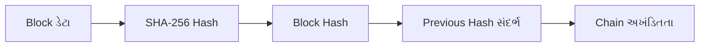
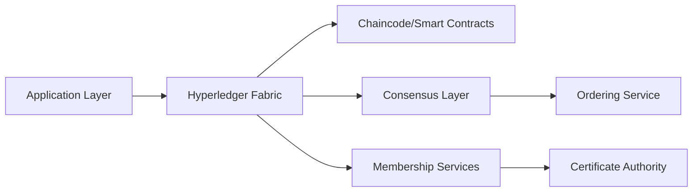
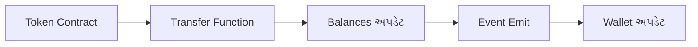

## પ્રશ્ન 1(અ) [3 ગુણ]

**આના પર ટૂંકી નોંધ લખો: ડિસ્ટ્રિબ્યુટેડ લેજર**

**જવાબ**:

**ટેબલ: ડિસ્ટ્રિબ્યુટેડ લેજર લક્ષણો**

| લક્ષણ | વર્ણન |
|-------|-------|
| **વ્યાખ્યા** | અનેક કમ્પ્યુટરમાં ફેલાયેલ ડેટાબેસ |
| **સંગ્રહ** | ડેટા અનેક જગ્યાએ સંગ્રહિત |
| **નિયંત્રણ** | કોઈ એક સત્તાધિકારીની માલિકી નથી |
| **અપડેટ** | બધી કોપી એકસાથે અપડેટ થાય |

- **વિકેન્દ્રીકરણ**: કેન્દ્રીય સર્વરની જરૂર નથી
- **પારદર્શિતા**: બધા સહભાગીઓ ટ્રાન્ઝેક્શન જોઈ શકે છે
- **સુરક્ષા**: સુરક્ષા માટે cryptography નો ઉપયોગ

**મેમરી ટ્રીક:** "ડેટા સુરક્ષિત પારદર્શી રીતે સંગ્રહિત" (DSPS)

---

## પ્રશ્ન 1(બ) [4 ગુણ]

**બ્લોકચેનની એપ્લિકેશનનું વર્ણન કરો.**

**જવાબ**:

**ટેબલ: બ્લોકચેન એપ્લિકેશન**

| એપ્લિકેશન | ઉપયોગ | ફાયદો |
|----------|-------|-------|
| **Cryptocurrency** | Bitcoin જેવા ડિજિટલ પૈસા | સુરક્ષિત પેમેન્ટ |
| **Supply Chain** | ઉત્પાદનોને સ્ત્રોતથી ટ્રેક કરવા | નકલી માલ અટકાવવા |
| **આરોગ્યસેવા** | તબીબી રેકોર્ડ સંગ્રહિત કરવા | ડેટા સુરક્ષા |
| **મતદાન** | ઇલેક્ટ્રોનિક મતદાન સિસ્ટમ | પારદર્શી ચૂંટણી |
| **રિયલ એસ્ટેટ** | મિલકતના રેકોર્ડ | છેતરપિંડી અટકાવવા |

- **નાણાકીય**: ઝડપી આંતરરાષ્ટ્રીય પેમેન્ટ
- **ઓળખ**: ડિજિટલ ID ચકાસણી
- **Smart Contract**: સ્વચાલિત કરાર

**મેમરી ટ્રીક:** "પૈસા, દવા, મતદાન, મિલકત" (PDMM)

---

## પ્રશ્ન 1(ક) [7 ગુણ]

**Asymmetric Encryption Model ને ઉદાહરણ સાથે સમજાવો.**

**જવાબ**:

**ડાયાગ્રામ: Asymmetric Encryption પ્રક્રિયા**



**ટેબલ: Key સરખામણી**

| Key પ્રકાર | હેતુ | શેરિંગ | ઉદાહરણ |
|---------|------|-------|--------|
| **Public Key** | Encryption | ખુલ્લેઆમ શેર કરવામાં આવે | RSA Public Key |
| **Private Key** | Decryption | ગુપ્ત રાખવામાં આવે | RSA Private Key |

**ઉદાહરણ પ્રક્રિયા:**

1. Alice એ Bob ને મેઝેજ મોકલવો છે
2. Alice એ Bob ની public key વાપરીને encrypt કરે છે
3. ફક્ત Bob ની private key decrypt કરી શકે છે
4. Bob મેઝેજ પ્રાપ્ત કરે છે અને decrypt કરે છે

- **સુરક્ષા**: Public key જાણીતી હોવા છતાં ડેટા સુરક્ષિત રહે છે
- **પ્રમાણીકરણ**: મોકલનારની ઓળખ સાબિત કરે છે
- **નોન-રિપ્યુડિએશન**: મોકલનાર મોકલવાનો ઇનકાર કરી શકતો નથી

**મેમરી ટ્રીક:** "Public Encrypt કરે, Private Decrypt કરે" (PEPD)

---

## પ્રશ્ન 1(ક) અથવા [7 ગુણ]

**બ્લોકચેનમાં Consistency, Availability અને Partition Tolerance (CAP) પ્રમેય સમજાવો.**

**જવાબ**:

**ડાયાગ્રામ: CAP Theorem ત્રિકોણ**



**ટેબલ: CAP ગુણધર્મો**

| ગુણધર્મ | વ્યાખ્યા | બ્લોકચેન ફોકસ |
|--------|----------|----------------|
| **Consistency** | બધા nodes માં સમાન ડેટા | મધ્યમ પ્રાધાન્યતા |
| **Availability** | સિસ્ટમ હંમેશા જવાબ આપે | ઉચ્ચ પ્રાધાન્યતા |
| **Partition Tolerance** | નેટવર્ક વિભાજન સાથે કામ કરે | ઉચ્ચ પ્રાધાન્યતા |

**મુખ્ય મુદ્દાઓ:**

- **Trade-off**: ફક્ત 3 માંથી 2 ગુણધર્મોની ખાતરી આપી શકાય
- **બ્લોકચેન પસંદગી**: સામાન્ય રીતે Availability + Partition Tolerance ને પ્રાધાન્યતા
- **વાસ્તવિક ઉદાહરણ**: Bitcoin એ C કરતાં AP પસંદ કરે છે (eventual consistency)

**મેમરી ટ્રીક:** "કોઈ પણ બે પસંદ કરો" (CAT)

---

## પ્રશ્ન 2(અ) [3 ગુણ]

**વ્યાખ્યાયિત કરો: Public key, Private key, Digital Signature.**

**જવાબ**:

**ટેબલ: Cryptographic ઘટકો**

| ઘટક | વ્યાખ્યા | ઉપયોગ |
|-----|--------|-------|
| **Public Key** | ખુલ્લેઆમ શેર કરાતી encryption key | ડેટા encrypt કરવા, signature ચકાસવા |
| **Private Key** | માલિક પાસે રાખેલી ગુપ્ત key | ડેટા decrypt કરવા, signature બનાવવા |
| **Digital Signature** | મેઝેજનું encrypted hash | વિશ્વસનીયતા અને અખંડિતતા સાબિત કરવા |

**મેમરી ટ્રીક:** "Public સુરક્ષા આપે, Private પુરાવો આપે" (PSPP)

---

## પ્રશ્ન 2(બ) [4 ગુણ]

**Public blockchain ને તેના ફાયદા અને ગેરફાયદા સાથે સમજાવો.**

**જવાબ**:

**ટેબલ: Public Blockchain વિશ્લેષણ**

| પાસું | વિગતો |
|------|-------|
| **વ્યાખ્યા** | દરેકને ઉપલબ્ધ ખુલ્લું નેટવર્ક |
| **ઉદાહરણો** | Bitcoin, Ethereum |

**ફાયદા:**

- **પારદર્શિતા**: બધા ટ્રાન્ઝેક્શન દેખાય છે
- **વિકેન્દ્રીકરણ**: કોઈ એક નિયંત્રણ નથી
- **સુરક્ષા**: ઘણા nodes ચકાસણી કરે છે

**ગેરફાયદા:**

- **ઝડપ**: ધીમી ટ્રાન્ઝેક્શન પ્રોસેસિંગ
- **ઊર્જા**: વધુ વીજળી વપરાશ
- **સ્કેલેબિલિટી**: મર્યાદિત ટ્રાન્ઝેક્શન પ્રતિ સેકન્ડ

**મેમરી ટ્રીક:** "પારદર્શી પણ ધીમું" (PD)

---

## પ્રશ્ન 2(ક) [7 ગુણ]

**બ્લોકચેનના મુખ્ય ઘટકનું વર્ણન કરો.**

**જવાબ**:

**ડાયાગ્રામ: બ્લોકચેન રચના**



**ટેબલ: મુખ્ય ઘટકો**

| ઘટક | કાર્ય | મહત્વ |
|-----|------|-------|
| **Block** | ટ્રાન્ઝેક્શન માટે કન્ટેનર | ડેટા સંગ્રહ |
| **Hash** | યુનિક ઓળખકર્તા | સુરક્ષા |
| **Merkle Tree** | ટ્રાન્ઝેક્શન સારાંશ | ચકાસણી |
| **Nonce** | Mining નંબર | Proof of work |
| **Timestamp** | સમય રેકોર્ડ | કાલક્રમિક ક્રમ |
| **Previous Hash** | પાછલા block ને લિંક | Chain અખંડિતતા |

- **અપરિવर્તનીયતા**: ભૂતકાળના રેકોર્ડ બદલી શકાતા નથી
- **પારદર્શિતા**: બધો ડેટા દેખાય છે
- **સર્વસંમતિ**: નેટવર્ક વેધતા પર સહમત થાય છે

**મેમરી ટ્રીક:** "Block Hash Merkle Nonce Time Previous" (BHMNTP)

---

## પ્રશ્ન 2(અ) અથવા [3 ગુણ]

**આના પર ટૂંકી નોંધ લખો: SideChain**

**જવાબ**:

**ટેબલ: SideChain લક્ષણો**

| લક્ષણ | વર્ણન |
|-------|-------|
| **વ્યાખ્યા** | મુખ્ય chain સાથે જોડાયેલ અલગ blockchain |
| **હેતુ** | મુખ્ય blockchain ની કાર્યક્ષમતા વધારવી |
| **જોડાણ** | Two-way peg મિકેનિઝમ |

- **સ્કેલેબિલિટી**: મુખ્ય chain નો લોડ ઘટાડે છે
- **લવચીકતા**: કસ્ટમ લક્ષણો શક્ય છે
- **સુરક્ષા**: મુખ્ય chain ની સુરક્ષા વારસામાં મળે છે

**મેમરી ટ્રીક:** "અલગ બાજુ વિસ્તરણ" (ABV)

---

## પ્રશ્ન 2(બ) અથવા [4 ગુણ]

**Private blockchain ને તેના ફાયદા અને ગેરફાયદા સાથે સમજાવો.**

**જવાબ**:

**ટેબલ: Private Blockchain વિશ્લેષણ**

| પાસું | વિગતો |
|------|-------|
| **વ્યાખ્યા** | નિયંત્રિત પ્રવેશ સાથે પ્રતિબંધિત નેટવર્ક |
| **નિયંત્રણ** | એક સંસ્થા સંચાલન કરે છે |

**ફાયદા:**

- **ઝડપ**: ઝડપી ટ્રાન્ઝેક્શન
- **ગોપનીયતા**: નિયંત્રિત ડેટા પ્રવેશ
- **કાર્યક્ષમતા**: ઓછો ઊર્જા વપરાશ
- **Compliance**: નિયામક આવશ્યકતાઓ પૂરી કરે છે

**ગેરફાયદા:**

- **કેન્દ્રીકરણ**: એક બિંદુ નિયંત્રણ
- **વિશ્વાસ**: નિયંત્રક સંસ્થા પર આધાર
- **મર્યાદિત**: ઓછા સહભાગીઓ

**મેમરી ટ્રીક:** "ઝડપી ખાનગી નિયંત્રિત" (ZKN)

---

## પ્રશ્ન 2(ક) અથવા [7 ગુણ]

**બ્લોકચેનનું ડેટા સ્ટ્રક્ચર સમજાવો.**

**જવાબ**:

**ડાયાગ્રામ: બ્લોકચેન ડેટા સ્ટ્રક્ચર**

```goat
+------------------+    +------------------+    +------------------+
|     Block 1      |    |     Block 2      |    |     Block 3      |
+------------------+    +------------------+    +------------------+
| Previous Hash: 0 |<---| Previous Hash    |<---| Previous Hash    |
| Merkle Root      |    | Merkle Root      |    | Merkle Root      |
| Timestamp        |    | Timestamp        |    | Timestamp        |
| Nonce            |    | Nonce            |    | Nonce            |
+------------------+    +------------------+    +------------------+
| Transaction 1    |    | Transaction 1    |    | Transaction 1    |
| Transaction 2    |    | Transaction 2    |    | Transaction 2    |
| Transaction 3    |    | Transaction 3    |    | Transaction 3    |
+------------------+    +------------------+    +------------------+
```

**ટેબલ: ડેટા સ્ટ્રક્ચર તત્વો**

| તત્વ | હેતુ | કદ |
|-----|------|-----|
| **Block Header** | મેટાડેટા સમાવે છે | નિશ્ચિત કદ |
| **Transaction List** | વાસ્તવિક ડેટા | પરિવર્તનશીલ કદ |
| **Hash Pointer** | Blocks ને જોડે છે | 256 bits |
| **Merkle Tree** | Transaction સારાંશ | Logarithmic |

**મુખ્ય લક્ષણો:**

- **રેખીય રચના**: Blocks ક્રમમાં જોડાયેલા
- **Hash લિંકિંગ**: દરેક block પૂર્વનો સંદર્ભ આપે છે
- **Merkle Trees**: કાર્યક્ષમ transaction ચકાસણી
- **અપરિવર્તનીય**: શોધ્યા વિના સુધારો કરી શકાતો નથી

**મેમરી ટ્રીક:** "રેખીય Hash Merkle અપરિવર્તનીય" (RHMA)

---

## પ્રશ્ન 3(અ) [3 ગુણ]

**આના પર ટૂંકી નોંધ લખો: બ્લોકચેનમાં Consensus Mechanism.**

**જવાબ**:

**ટેબલ: Consensus Mechanism**

| પાસું | વર્ણન |
|------|-------|
| **હેતુ** | નેટવર્ક સ્થિતિ પર સંમત થવું |
| **જરૂરિયાત** | ડબલ ખર્ચ અટકાવવો |
| **પ્રકારો** | PoW, PoS, DPoS |

- **કરાર**: બધા nodes સંમત થવા જોઈએ
- **વિકેન્દ્રીકરણ**: કોઈ કેન્દ્રીય સત્તા નથી
- **સુરક્ષા**: દુષ્ટ પ્રવૃત્તિઓ અટકાવે છે

**મેમરી ટ્રીક:** "કરાર અટકાવે સુરક્ષા" (KAS)

---

## પ્રશ્ન 3(બ) [4 ગુણ]

**બ્લોકચેનમાં Hard Fork અને Soft Fork ની સરખામણી કરો.**

**જવાબ**:

**ટેબલ: Fork સરખામણી**

| લક્ષણ | Hard Fork | Soft Fork |
|-------|-----------|-----------|
| **સુસંગતતા** | બેકવર્ડ સુસંગત નથી | બેકવર્ડ સુસંગત છે |
| **નિયમો** | નવા નિયમો બનાવે છે | હાલના નિયમો કડક કરે છે |
| **અપગ્રેડ** | બધા nodes અપગ્રેડ કરવા જોઈએ | વૈકલ્પિક અપગ્રેડ |
| **પરિણામ** | બે અલગ chains | એક chain ચાલુ રહે છે |
| **ઉદાહરણ** | Ethereum થી Ethereum Classic | Bitcoin SegWit |

**મુખ્ય તફાવતો:**

- **Hard Fork**: બ્લોકચેનમાં કાયમી વિભાજન
- **Soft Fork**: અસ્થાયી પ્રતિબંધ જે કાયમી બને છે

**મેમરી ટ્રીક:** "Hard વિભાજિત કરે, Soft પ્રતિબંધિત કરે" (HVSP)

---

## પ્રશ્ન 3(ક) [7 ગુણ]

**Proof of Work શું છે? તે કેવી રીતે કામ કરે છે? ઉદાહરણ સાથે સમજાવો.**

**જવાબ**:

**ડાયાગ્રામ: Proof of Work પ્રક્રિયા**



**ટેબલ: PoW ઘટકો**

| ઘટક | કાર્ય | ઉદાહરણ |
|-----|------|--------|
| **Hash Function** | યુનિક ફિંગરપ્રિન્ટ બનાવે છે | SHA-256 |
| **Nonce** | Hash બદલવા માટે રેન્ડમ નંબર | 12345 |
| **કઠિનાઈ** | જરૂરી શૂન્યોની સંખ્યા | 4 શૂન્ય |
| **Mining** | કમ્પ્યુટિંગ પ્રક્રિયા | Bitcoin mining |

**કાર્ય પ્રક્રિયા:**

1. બાકી transactions એકત્રિત કરો
2. Transactions સાથે block બનાવો
3. વિવિધ nonce વેલ્યુ કોશિશ કરો
4. વારંવાર hash ગણો
5. જરૂરી શૂન્યો સાથે hash શોધો
6. માન્ય block નેટવર્ક પર પ્રસારિત કરો

**Bitcoin ઉદાહરણ:**

- **લક્ષ્ય**: Hash ચોક્કસ શૂન્યથી શરૂ થવો જોઈએ
- **સમય**: ~10 મિનિટ પ્રતિ block
- **પુરસ્કાર**: 6.25 BTC (2024 મુજબ)

**મેમરી ટ્રીક:** "કોશિશ ગણતરી શૂન્ય સુધી" (KGSS)

---

## પ્રશ્ન 3(અ) અથવા [3 ગુણ]

**આના પર ટૂંકી નોંધ લખો: બ્લોકચેનમાં Block Rewards.**

**જવાબ**:

**ટેબલ: Block Rewards**

| લક્ષણ | વર્ણન |
|-------|-------|
| **હેતુ** | Miners ને પ્રોત્સાહન આપવા |
| **ઘટકો** | Block reward + transaction fees |
| **Bitcoin** | 50 BTC થી શરૂ, દર 4 વર્ષે અડધું |

- **પ્રેરણા**: નેટવર્ક સહભાગિતાને પ્રોત્સાહન આપે છે
- **અડધું કરવું**: સમય સાથે ફુગાવો ઘટાડે છે
- **ફી**: Miners માટે વધારાની આવક

**મેમરી ટ્રીક:** "Miners પ્રેરિત પૈસા" (MPP)

---

## પ્રશ્ન 3(બ) અથવા [4 ગુણ]

**51% attack શું છે અને તે કેવી રીતે કાયર્ કરે છે?**

**જવાબ**:

**ટેબલ: 51% Attack વિશ્લેષણ**

| પાસું | વિગતો |
|------|-------|
| **વ્યાખ્યા** | બહુમતી mining power નિયંત્રિત કરવું |
| **મર્યાદા** | 50% થી વધુ નેટવર્ક hash rate |
| **ક્ષમતા** | Transactions ઉલટાવી શકે છે |
| **મર્યાદા** | બીજાના coins ચોરી શકતો નથી |

**તે કેવી રીતે કામ કરે છે:**

1. આક્રમણકારી બહુમતી mining power મેળવે છે
2. ખાનગી blockchain fork બનાવે છે
3. પ્રામાણિક નેટવર્ક કરતાં ઝડપથી mine કરે છે
4. નેટવર્ક પર લાંબી chain છોડે છે
5. નેટવર્ક લાંબી chain ને માન્ય તરીકે સ્વીકારે છે

**પરિણામો:**

- **ડબલ ખર્ચ**: સમાન coins બે વાર ખર્ચ કરવા
- **Transaction ઉલટાવવા**: પુષ્ટિ થયેલા transactions રદ કરવા
- **નેટવર્ક વિશ્વાસ**: બ્લોકચેનની વિશ્વસનીયતાને નુકસાન

**મેમરી ટ્રીક:** "બહુમતી નિયંત્રણ Chain" (BNC)

---

## પ્રશ્ન 3(ક) અથવા [7 ગુણ]

**Proof of Stake શું છે? તે કેવી રીતે કામ કરે છે? ઉદાહરણ સાથે સમજાવો.**

**જવાબ**:

**ડાયાગ્રામ: Proof of Stake પ્રક્રિયા**



**ટેબલ: PoS vs PoW**

| લક્ષણ | Proof of Stake | Proof of Work |
|-------|----------------|---------------|
| **ઊર્જા** | ઓછો વપરાશ | વધુ વપરાશ |
| **પસંદગી** | Stake આધારિત | Computing power |
| **હાર્ડવેર** | સામાન્ય કમ્પ્યુટર | વિશેષ miners |
| **ઝડપ** | ઝડપી | ધીમી |

**કાર્ય પ્રક્રિયા:**

1. Validators coins stake તરીકે લોક કરે છે
2. Algorithm રેન્ડમ validator પસંદ કરે છે
3. પસંદગીની સંભાવના stake કદ પર આધારીત
4. પસંદ થયેલ validator block સૂચવે છે
5. અન્ય validators ચકાસણી કરે અને મત આપે છે
6. પ્રામાણિક validators ને પુરસ્કાર વહેંચવામાં આવે છે

**Ethereum ઉદાહરણ:**

- **લઘુત્તમ Stake**: 32 ETH જરૂરી
- **દંડ**: દુષ્ટ વર્તન માટે slashing
- **પુરસ્કાર**: વાર્ષિક ટકાવારી આવક

**મુખ્ય ફાયદા:**

- **ઊર્જા કાર્યક્ષમ**: કોઈ સઘન mining નથી
- **આર્થિક સુરક્ષા**: અપ્રામાણિક હોય તો validators stake ગુમાવે છે
- **સ્કેલેબિલિટી**: ઝડપી transaction પ્રોસેસિંગ

**મેમરી ટ્રીક:** "Stake પસંદ Validate પુરસ્કાર" (SPVP)

---

## પ્રશ્ન 4(અ) [3 ગુણ]

**Byzantine Fault Tolerance નું વર્ણન કરો.**

**જવાબ**:

**ટેબલ: Byzantine Fault Tolerance**

| પાસું | વર્ણન |
|------|-------|
| **સમસ્યા** | કેટલાક nodes દુષ્ટ રીતે વર્તે છે |
| **સહનશીલતા** | ખામીયુક્ત nodes છતાં સિસ્ટમ કામ કરે છે |
| **આવશ્યકતા** | 1/3 થી ઓછા nodes ખામીયુક્ત હોઈ શકે છે |

- **સર્વસંમતિ**: પ્રામાણિક nodes સંમત થવા જોઈએ
- **પ્રતિકાર**: નેટવર્ક હુમલાઓમાં ટકી રહે છે
- **ઉપયોગ**: બ્લોકચેન consensus માં વપરાય છે

**મેમરી ટ્રીક:** "ખામીયુક્ત Nodes સહન" (KNS)

---

## પ્રશ્ન 4(બ) [4 ગુણ]

**બ્લોકચેનમાં smart contract કેવી રીતે કામ કરે છે?**

**જવાબ**:

**ડાયાગ્રામ: Smart Contract અમલીકરણ**



**કાર્ય પ્રક્રિયા:**

- **નિર્માણ**: Developer contract code લખે છે
- **Deployment**: Contract બ્લોકચેન પર સંગ્રહિત થાય છે
- **Trigger**: બાહ્ય ઘટના contract સક્રિય કરે છે
- **અમલીકરણ**: Code સ્વચાલિત રીતે ચાલે છે
- **અપરિવર્તનીય**: Deployment પછી બદલી શકાતું નથી

**મુખ્ય લક્ષણો:**

- **સ્વ-અમલીકરણ**: મધ્યસ્થીની જરૂર નથી
- **પારદર્શિતા**: Code બધાને દેખાય છે
- **ખર્ચ-અસરકારક**: Transaction ખર્ચ ઘટાડે છે

**મેમરી ટ્રીક:** "Code સ્વચાલિત અમલ" (CSA)

---

## પ્રશ્ન 4(ક) [7 ગુણ]

**SHA-256 શું છે અને બ્લોકચેનમાં SHA-256 નો ઉપયોગ શું છે.**

**જવાબ**:

**ટેબલ: SHA-256 ગુણધર્મો**

| ગુણધર્મ | વર્ણન |
|--------|-------|
| **પૂરું નામ** | Secure Hash Algorithm 256-bit |
| **આઉટપુટ** | હંમેશા 256 bits (64 hex characters) |
| **ઇનપુટ** | કોઈ પણ કદનો ડેટા |
| **પ્રકૃતિ** | એક-માર્ગીય function |

**ડાયાગ્રામ: બ્લોકચેનમાં SHA-256**



**બ્લોકચેનમાં ઉપયોગ:**

1. **Block Hashing**: યુનિક block ઓળખકર્તા બનાવવા
2. **Merkle Trees**: બધા transactions નો સારાંશ આપવા
3. **Proof of Work**: Mining કઠિનતા લક્ષ્ય
4. **Digital Signatures**: સુરક્ષિત transaction હસ્તાક્ષર
5. **Wallet Addresses**: Bitcoin સરનામાં બનાવવા

**મુખ્ય ગુણધર્મો:**

- **નિર્ધાર્યવાદી**: સમાન input = સમાન output
- **Avalanche Effect**: નાનો ફેરફાર = સંપૂર્ણ જુદો hash
- **અનુલટાવી શકાય નહીં**: Output થી input શોધી શકાતું નથી
- **Collision પ્રતિરોધી**: બે inputs ભાગ્યે જ સમાન hash

**ઉદાહરણ:**

- Input: "Hello World"
- SHA-256: a591a6d40bf420404a011733cfb7b190d62c65bf0bcda32b57b277d9ad9f146e

**મેમરી ટ્રીક:** "Hash ઓળખે સુરક્ષિત કરે સાબિત કરે" (HOSK)

---

## પ્રશ્ન 4(અ) અથવા [3 ગુણ]

**Bitcoin અને eventual consistency સમજાવો.**

**જવાબ**:

**ટેબલ: Bitcoin Consistency**

| ખ્યાલ | વર્ણન |
|-------|-------|
| **Eventual Consistency** | બધા nodes આખરે સંમત થાય છે |
| **અસ્થાયી Forks** | અનેક માન્ય chains અસ્તિત્વ ધરાવે છે |
| **ઉકેલ** | સૌથી લાંબી chain જીતે છે |

- **સમય વિલંબ**: નેટવર્ક પ્રસારણમાં સમય લાગે છે
- **પુષ્ટિ**: વધુ blocks = વધુ નિશ્ચિતતા
- **અંતિમતા**: વ્યવહારિક રીતે અનુલટાવી શકાય તેવું બને છે

**મેમરી ટ્રીક:** "આખરે દરેક સંમત" (ADS)

---

## પ્રશ્ન 4(બ) અથવા [4 ગુણ]

**બ્લોકચેનમાં smart contract ના પ્રકારોની ચર્ચા કરો.**

**જવાબ**:

**ટેબલ: Smart Contract પ્રકારો**

| પ્રકાર | કાર્ય | ઉદાહરણ |
|------|------|--------|
| **કાનૂની Contract** | કાનૂની રીતે બંધનકર્તા કરાર | Real estate ટ્રાન્સફર |
| **Application Logic** | Decentralized app functions | Token એક્સચેન્જ |
| **Decentralized Autonomous** | સ્વ-શાસિત સંસ્થાઓ | DAO મતદાન |
| **Multi-signature** | અનેક મંજૂરીઓ જરૂરી | Escrow સેવાઓ |

**મુખ્ય વર્ગો:**

- **નાણાકીય**: પેમેન્ટ અને લેન્ડિંગ contracts
- **વીમો**: સ્વચાલિત દાવા પ્રોસેસિંગ
- **Supply Chain**: ઉત્પાદન અધિકૃતતા ટ્રેક કરવા
- **ગેમિંગ**: ગેમમાં asset મેનેજમેન્ટ

**મેમરી ટ્રીક:** "કાનૂની Logic સ્વાયત્ત બહુ" (KLSB)

---

## પ્રશ્ન 4(ક) અથવા [7 ગુણ]

**Merkle Tree વ્યાખ્યાયિત કરો અને સમજાવો કે તે બ્લોકચેનમાં કેવી રીતે કાર્ય કરે છે.**

**જવાબ**:

**ડાયાગ્રામ: Merkle Tree રચના**

```goat
                Root Hash (ABCD)
                /              \
          Hash(AB)              Hash(CD)
          /      \              /      \
     Hash(A)   Hash(B)    Hash(C)   Hash(D)
        |        |          |        |
      Tx A     Tx B       Tx C     Tx D
```

**ટેબલ: Merkle Tree ફાયદા**

| ફાયદો | વર્ણન |
|-------|-------|
| **કાર્યક્ષમતા** | બધો ડેટા ડાઉનલોડ કર્યા વિના transactions ચકાસો |
| **સુરક્ષા** | કોઈ પણ ફેરફાર તરત શોધાય જાય છે |
| **સ્કેલેબિલિટી** | Logarithmic ચકાસણી સમય |
| **સંગ્રહ** | કોમ્પેક્ટ પ્રતિનિધિત્વ |

**કાર્ય પ્રક્રિયા:**

1. **Hash Transactions**: દરેક transaction નો hash મેળવો
2. **જોડી Hashing**: નજીકના hashes ને મિલાવો
3. **પ્રક્રિયા પુનરાવર્તન**: એક root hash સુધી ચાલુ રાખો
4. **Root સંગ્રહ**: ફક્ત root block header માં સંગ્રહિત કરો
5. **ચકાસણી**: Root સુધીના path સાથે transaction સાબિત કરો

**બ્લોકચેન ઉપયોગ:**

- **Block Header**: Merkle root સમાવે છે
- **SPV ચકાસણી**: Light clients સંપૂર્ણ blockchain વિના ચકાસે છે
- **છેડછાડ શોધ**: કોઈ પણ ફેરફાર tree રચના તોડે છે
- **કાર્યક્ષમ Sync**: ફક્ત જરૂરી ભાગો ડાઉનલોડ કરો

**Bitcoin ઉદાહરણ:**

- Block હજારો transactions સમાવે છે
- ફક્ત 32-byte Merkle root header માં સંગ્રહિત
- ~10 hashes સાથે કોઈ પણ transaction ચકાસી શકાય

**મેમરી ટ્રીક:** "Tree ગોઠવે ચકાસે કાર્યક્ષમ રીતે" (TGCK)

---

## પ્રશ્ન 5(અ) [3 ગુણ]

**આના પર ટૂંકી નોંધ લખો: Bitcoin Scripting**

**જવાબ**:

**ટેબલ: Bitcoin Scripting**

| લક્ષણ | વર્ણન |
|-------|-------|
| **ભાષા** | Stack-based programming ભાષા |
| **હેતુ** | ખર્ચની શરતો વ્યાખ્યાયિત કરવી |
| **અમલીકરણ** | Coins ખર્ચ કરવામાં આવે ત્યારે ચાલે છે |

- **સરળ**: ફક્ત મૂળભૂત operations
- **સુરક્ષિત**: મર્યાદિત કાર્યક્ષમતા દુરુપયોગ અટકાવે છે
- **લવચીક**: વિવિધ transaction પ્રકારો શક્ય છે

**મેમરી ટ્રીક:** "Stack વ્યાખ્યા ખર્ચ" (SVK)

---

## પ્રશ્ન 5(બ) [4 ગુણ]

**બ્લોકચેનમાં Decentralized Applications (dApps) સમજાવો અને તે કેવી રીતે કાર્ય કરે છે?**

**જવાબ**:

**ટેબલ: dApp ઘટકો**

| ઘટક | કાર્ય |
|-----|------|
| **Frontend** | User interface |
| **Backend** | Blockchain પર smart contracts |
| **Storage** | Decentralized storage systems |
| **Network** | Peer-to-peer communication |

**કાર્ય પ્રક્રિયા:**

1. User web interface સાથે ક્રિયા કરે છે
2. Frontend બ્લોકચેન સાથે જોડાય છે
3. Smart contracts બિઝનેસ logic અમલ કરે છે
4. પરિણામો બ્લોકચેન પર સંગ્રહિત થાય છે
5. અપડેટ્સ સમગ્ર નેટવર્કમાં પ્રતિબિંબિત થાય છે

**મુખ્ય લક્ષણો:**

- **કોઈ કેન્દ્રીય સર્વર નથી**: વિતરિત નેટવર્ક પર ચાલે છે
- **Open Source**: Code જાહેરમાં ઉપલબ્ધ છે
- **સ્વાયત્ત**: કંપની નિયંત્રણ વિના કામ કરે છે

**મેમરી ટ્રીક:** "વિકેન્દ્રીત Apps દરેક જગ્યાએ ચાલે" (VADJ)

---

## પ્રશ્ન 5(ક) [7 ગુણ]

**Hyperledger ને તેના ફાયદા અને ગેરફાયદા સાથે સમજાવો.**

**જવાબ**:

**ટેબલ: Hyperledger ઝાંખી**

| પાસું | વર્ણન |
|------|-------|
| **પ્રકાર** | Private/Consortium blockchain platform |
| **વિકાસકર્તા** | Linux Foundation |
| **લક્ષ્ય** | Enterprise applications |
| **Consensus** | Pluggable consensus mechanisms |

**ડાયાગ્રામ: Hyperledger આર્કિટેક્ચર**



**ફાયદા:**

- **પ્રદર્શન**: ઉચ્ચ transaction throughput
- **ગોપનીયતા**: ગુપ્ત transactions
- **મોડ્યુલર**: Pluggable components
- **Enterprise Ready**: Production-grade લક્ષણો
- **ગવર્નન્સ**: નિયંત્રિત નેટવર્ક પ્રવેશ
- **Compliance**: નિયામક આવશ્યકતાઓ પૂરી કરે છે

**ગેરફાયદા:**

- **કેન્દ્રીકરણ**: સંપૂર્ણ વિકેન્દ્રીકૃત નથી
- **જટિલતા**: સેટ કરવું મુશ્કેલ છે
- **Vendor Lock-in**: પ્લેટફોર્મ નિર્ભરતા
- **મર્યાદિત પારદર્શિતા**: ખાનગી નેટવર્ક
- **ખર્ચ**: મોંઘું infrastructure

**ઉપયોગના કિસ્સાઓ:**

- Supply chain management
- Trade finance
- Healthcare records
- Identity management

**મેમરી ટ્રીક:** "ખાનગી પ્રદર્શન Enterprise" (KPE)

---

## પ્રશ્ન 5(અ) અથવા [3 ગુણ]

**આના પર ટૂંકી નોંધ લખો: Bitcoin Mining**

**જવાબ**:

**ટેબલ: Bitcoin Mining**

| પાસું | વર્ણન |
|------|-------|
| **હેતુ** | Transactions ચકાસણી અને blocks બનાવવા |
| **પ્રક્રિયા** | Cryptographic પઝલ હલ કરવા |
| **પુરસ્કાર** | BTC + transaction fees |

- **હાર્ડવેર**: વિશિષ્ટ ASIC miners
- **ઊર્જા** : ઉચ્ચ વીજળી વપરાશ
- **સ્પર્ધા**: વૈશ્વિક mining pools સ્પર્ધા કરે છે

**મેમરી ટ્રીક:** "ચકાસણી હલ પુરસ્કાર" (CHP)

---

## પ્રશ્ન 5(બ) અથવા [4 ગુણ]

**આના પર ટૂંકી નોંધ લખો: Decentralized Autonomous Organization (DAO)**

**જવાબ**:

**ટેબલ: DAO લક્ષણો**

| લક્ષણ | વર્ણન |
|-------|-------|
| **ગવર્નન્સ** | સમુદાય-સંચાલિત નિર્ણયો |
| **મતદાન** | Token-આધારિત મતદાન અધિકારો |
| **સ્વચાલન** | Smart contracts નિર્ણયો અમલ કરે છે |
| **પારદર્શિતા** | બધી પ્રવૃત્તિઓ બ્લોકચેન પર |

**મુખ્ય લાક્ષણિકતાઓ:**

- **કોઈ કેન્દ્રીય સત્તા નથી**: સમુદાય નિયંત્રિત
- **Token માલિકી**: Tokens આધારે મતદાન શક્તિ
- **પ્રસ્તાવ સિસ્ટમ**: સભ્યો ફેરફારો સૂચવે છે
- **સ્વચાલિત અમલીકરણ**: મંજૂર પ્રસ્તાવો સ્વચાલિત અમલ થાય છે

**ઉદાહરણો:**

- MakerDAO (DeFi protocol)
- Uniswap (Decentralized exchange)
- Aragon (DAO infrastructure)

**પડકારો:**

- **સુરક્ષા જોખમો**: Smart contract vulnerabilities
- **ગવર્નન્સ સમસ્યાઓ**: ઓછી મતદારોની સહભાગિતા
- **કાનૂની સ્થિતિ**: નિયામક અનિશ્ચિતતા

**મેમરી ટ્રીક:** "સમુદાય મત આપે સ્વચાલિત" (SMS)

---

## પ્રશ્ન 5(ક) અથવા [7 ગુણ]

**ERC-20 ને તેના ફાયદા અને ગેરફાયદા સાથે સમજાવો**

**જવાબ**:

**ટેબલ: ERC-20 Standard**

| પાસું | વર્ણન |
|------|-------|
| **પૂરું નામ** | Ethereum Request for Comments 20 |
| **પ્રકાર** | Ethereum પર token standard |
| **Functions** | માનકીકૃત token operations |
| **સુસંગતતા** | બધા Ethereum wallets સાથે કામ કરે છે |

**ડાયાગ્રામ: ERC-20 Token Flow**



**જરૂરી Functions:**

| Function | હેતુ |
|----------|------|
| **totalSupply()** | કુલ token supply પરત કરે |
| **balanceOf()** | Account balance ચકાસે |
| **transfer()** | Address પર tokens મોકલે |
| **approve()** | વતી ખર્ચની મંજૂરી આપે |
| **transferFrom()** | મંજૂર tokens ટ્રાન્સફર કરે |
| **allowance()** | મંજૂર રકમ ચકાસે |

**ફાયદા:**

- **માનકીકરણ**: બધા tokens માટે એકસમાન interface
- **Interoperability**: કોઈ પણ Ethereum wallet/exchange સાથે કામ કરે છે
- **સહેલું Integration**: Developers માટે અમલ કરવું સરળ
- **Liquidity**: Decentralized exchanges પર ટ્રેડ કરી શકાય છે
- **Smart Contract**: Programmable પૈસાના લક્ષણો
- **વૈશ્વિક પ્રવેશ**: દુનિયાભરમાં 24/7 ઉપલબ્ધ

**ગેરફાયદા:**

- **Gas Fees**: Ethereum transaction ખર્ચ
- **સ્કેલેબિલિટી**: નેટવર્ક congestion સમસ્યાઓ
- **લવચીકતા**: નવા standards કરતાં મર્યાદિત
- **સુરક્ષા**: Smart contract vulnerabilities
- **જટિલતા**: તકનીકી જ્ઞાન જરૂરી
- **નિયામક**: અસ્પષ્ટ કાનૂની સ્થિતિ

**લોકપ્રિય ERC-20 Tokens:**

- USDT (Tether)
- LINK (Chainlink)
- UNI (Uniswap)

**મેમરી ટ્રીક:** "Standard Tokens Trade Everywhere" (STTE)
