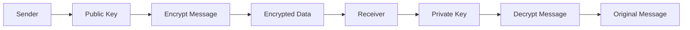
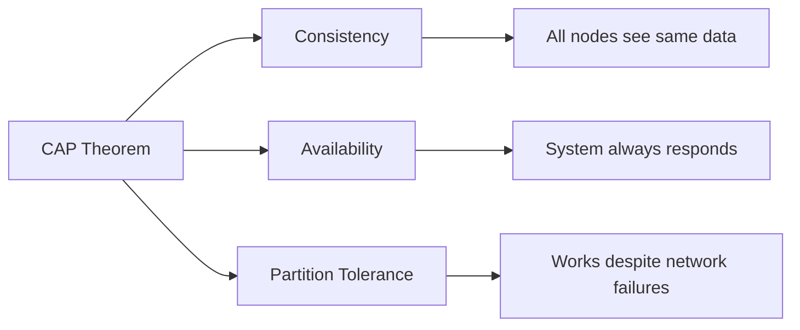
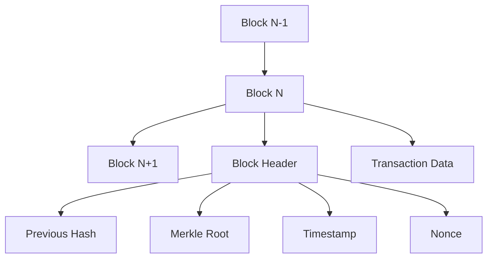
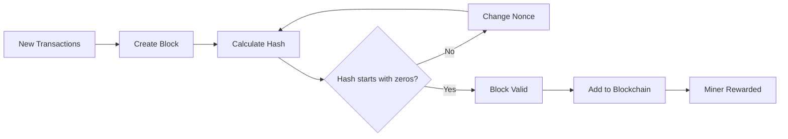
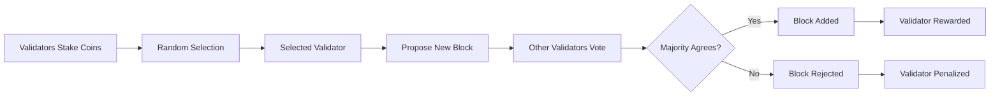
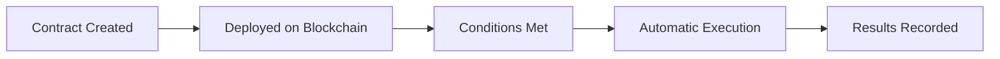
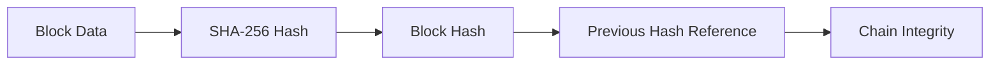
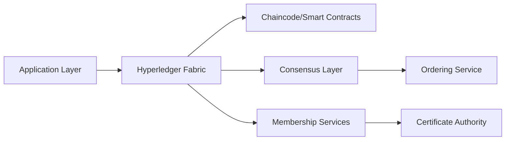
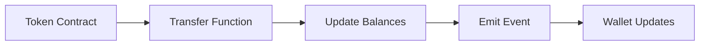

## Question 1(a) [3 marks]

**Short Note on: Distributed Ledger**

**Answer**:

**Table: Distributed Ledger Features**

| Feature | Description |
|---------|-------------|
| **Definition** | Database spread across multiple computers |
| **Storage** | Data stored in multiple locations |
| **Control** | No single authority owns it |
| **Updates** | All copies updated simultaneously |

- **Decentralized**: No central server needed
- **Transparent**: All participants can see transactions
- **Secure**: Uses cryptography for protection

**Mnemonic:** "Data Stored Transparently Securely" (DSTS)

---

## Question 1(b) [4 marks]

**Describe the applications of Blockchain.**

**Answer**:

**Table: Blockchain Applications**

| Application | Use Case | Benefit |
|-------------|----------|---------|
| **Cryptocurrency** | Digital money like Bitcoin | Secure payments |
| **Supply Chain** | Track products from source | Prevent fake goods |
| **Healthcare** | Store medical records | Data security |
| **Voting** | Electronic voting system | Transparent elections |
| **Real Estate** | Property records | Fraud prevention |

- **Finance**: Faster cross-border payments
- **Identity**: Digital ID verification
- **Smart Contracts**: Automated agreements

**Mnemonic:** "Money, Medicine, Voting, Property" (MMVP)

---

## Question 1(c) [7 marks]

**Explain Asymmetric Encryption Model with example.**

**Answer**:

**Diagram: Asymmetric Encryption Process**



**Table: Key Comparison**

| Key Type | Purpose | Sharing | Example |
|----------|---------|---------|---------|
| **Public Key** | Encryption | Shared openly | RSA Public Key |
| **Private Key** | Decryption | Kept secret | RSA Private Key |

**Example Process:**

1. Alice wants to send message to Bob
2. Alice uses Bob's public key to encrypt
3. Only Bob's private key can decrypt
4. Bob receives and decrypts message

- **Security**: Even if public key is known, data stays safe
- **Authentication**: Proves sender identity
- **Non-repudiation**: Sender cannot deny sending

**Mnemonic:** "Public Encrypts, Private Decrypts" (PEPD)

---

## Question 1(c OR) [7 marks]

**Explain Consistency, Availability and Partition Tolerance (CAP) theorem in Blockchain.**

**Answer**:

**Diagram: CAP Theorem Triangle**



**Table: CAP Properties**

| Property | Definition | Blockchain Focus |
|----------|------------|------------------|
| **Consistency** | All nodes have same data | Medium priority |
| **Availability** | System always responds | High priority |
| **Partition Tolerance** | Works with network splits | High priority |

**Key Points:**

- **Trade-off**: Can only guarantee 2 out of 3 properties
- **Blockchain Choice**: Usually prioritizes Availability + Partition Tolerance
- **Real Example**: Bitcoin chooses AP over C (eventual consistency)

**Mnemonic:** "Choose Any Two" (CAT)

---

## Question 2(a) [3 marks]

**Define: Public key, Private key, Digital Signature.**

**Answer**:

**Table: Cryptographic Components**

| Component | Definition | Usage |
|-----------|------------|-------|
| **Public Key** | Encryption key shared openly | Encrypt data, verify signatures |
| **Private Key** | Secret key kept by owner | Decrypt data, create signatures |
| **Digital Signature** | Encrypted hash of message | Prove authenticity and integrity |

**Mnemonic:** "Public Protects, Private Proves" (PPPP)

---

## Question 2(b) [4 marks]

**Explain Public blockchain with its advantage and disadvantage.**

**Answer**:

**Table: Public Blockchain Analysis**

| Aspect | Details |
|--------|---------|
| **Definition** | Open network accessible to everyone |
| **Examples** | Bitcoin, Ethereum |

**Advantages:**

- **Transparency**: All transactions visible
- **Decentralization**: No single control
- **Security**: Many nodes validate

**Disadvantages:**

- **Speed**: Slow transaction processing
- **Energy**: High power consumption
- **Scalability**: Limited transactions per second

**Mnemonic:** "Transparent but Slow" (TBS)

---

## Question 2(c) [7 marks]

**Describe Core components of Blockchain.**

**Answer**:

**Diagram: Blockchain Structure**



**Table: Core Components**

| Component | Function | Importance |
|-----------|----------|------------|
| **Block** | Container for transactions | Data storage |
| **Hash** | Unique identifier | Security |
| **Merkle Tree** | Transaction summary | Verification |
| **Nonce** | Mining number | Proof of work |
| **Timestamp** | Time record | Chronological order |
| **Previous Hash** | Links to previous block | Chain integrity |

- **Immutability**: Cannot change past records
- **Transparency**: All data visible
- **Consensus**: Network agrees on validity

**Mnemonic:** "Blocks Hash Merkle Nonce Time Previous" (BHMNTP)

---

## Question 2(a OR) [3 marks]

**Short Note on: SideChain**

**Answer**:

**Table: SideChain Features**

| Feature | Description |
|---------|-------------|
| **Definition** | Separate blockchain connected to main chain |
| **Purpose** | Extend main blockchain functionality |
| **Connection** | Two-way peg mechanism |

- **Scalability**: Reduces main chain load
- **Flexibility**: Custom features possible
- **Security**: Inherits main chain security

**Mnemonic:** "Separate Side Scales" (SSS)

---

## Question 2(b OR) [4 marks]

**Explain Private blockchain with its advantage and disadvantage.**

**Answer**:

**Table: Private Blockchain Analysis**

| Aspect | Details |
|--------|---------|
| **Definition** | Restricted network with controlled access |
| **Control** | Single organization manages |

**Advantages:**

- **Speed**: Faster transactions
- **Privacy**: Controlled data access
- **Efficiency**: Lower energy consumption
- **Compliance**: Meets regulatory requirements

**Disadvantages:**

- **Centralization**: Single point of control
- **Trust**: Relies on controlling organization
- **Limited**: Fewer participants

**Mnemonic:** "Fast Private Controlled" (FPC)

---

## Question 2(c OR) [7 marks]

**Explain Data structure of Blockchain.**

**Answer**:

**Diagram: Blockchain Data Structure**

```goat
+------------------+    +------------------+    +------------------+
|     Block 1      |    |     Block 2      |    |     Block 3      |
+------------------+    +------------------+    +------------------+
| Previous Hash: 0 |<---| Previous Hash    |<---| Previous Hash    |
| Merkle Root      |    | Merkle Root      |    | Merkle Root      |
| Timestamp        |    | Timestamp        |    | Timestamp        |
| Nonce            |    | Nonce            |    | Nonce            |
+------------------+    +------------------+    +------------------+
| Transaction 1    |    | Transaction 1    |    | Transaction 1    |
| Transaction 2    |    | Transaction 2    |    | Transaction 2    |
| Transaction 3    |    | Transaction 3    |    | Transaction 3    |
+------------------+    +------------------+    +------------------+
```

**Table: Data Structure Elements**

| Element | Purpose | Size |
|---------|---------|------|
| **Block Header** | Contains metadata | Fixed size |
| **Transaction List** | Actual data | Variable size |
| **Hash Pointer** | Links blocks | 256 bits |
| **Merkle Tree** | Transaction summary | Logarithmic |

**Key Features:**

- **Linear Structure**: Blocks linked in sequence
- **Hash Linking**: Each block references previous
- **Merkle Trees**: Efficient transaction verification
- **Immutable**: Cannot modify without detection

**Mnemonic:** "Linear Hash Merkle Immutable" (LHMI)

---

## Question 3(a) [3 marks]

**Short Note on: Consensus Mechanism in Blockchain.**

**Answer**:

**Table: Consensus Mechanism**

| Aspect | Description |
|--------|-------------|
| **Purpose** | Agree on network state |
| **Need** | Prevent double spending |
| **Types** | PoW, PoS, DPoS |

- **Agreement**: All nodes must agree
- **Decentralization**: No central authority
- **Security**: Prevents malicious activities

**Mnemonic:** "Agreement Prevents Security" (APS)

---

## Question 3(b) [4 marks]

**Compare Hard Fork and Soft Fork in Blockchain.**

**Answer**:

**Table: Fork Comparison**

| Feature | Hard Fork | Soft Fork |
|---------|-----------|-----------|
| **Compatibility** | Not backward compatible | Backward compatible |
| **Rules** | Creates new rules | Tightens existing rules |
| **Upgrade** | All nodes must upgrade | Optional upgrade |
| **Result** | Two separate chains | Single chain continues |
| **Example** | Ethereum to Ethereum Classic | Bitcoin SegWit |

**Key Differences:**

- **Hard Fork**: Permanent split in blockchain
- **Soft Fork**: Temporary restriction that becomes permanent

**Mnemonic:** "Hard Splits, Soft Restricts" (HSSR)

---

## Question 3(c) [7 marks]

**What is Proof of Work? How does it work? Explain with example.**

**Answer**:

**Diagram: Proof of Work Process**



**Table: PoW Components**

| Component | Function | Example |
|-----------|----------|---------|
| **Hash Function** | Creates unique fingerprint | SHA-256 |
| **Nonce** | Random number to change hash | 12345 |
| **Difficulty** | Required number of leading zeros | 4 zeros |
| **Mining** | Computing process | Bitcoin mining |

**Working Process:**

1. Collect pending transactions
2. Create block with transactions
3. Try different nonce values
4. Calculate hash repeatedly
5. Find hash with required zeros
6. Broadcast valid block to network

**Bitcoin Example:**

- **Target**: Hash must start with specific zeros
- **Time**: ~10 minutes per block
- **Reward**: 6.25 BTC (as of 2024)

**Mnemonic:** "Try Calculate Until Zero" (TCUZ)

---

## Question 3(a OR) [3 marks]

**Short Note on: Block Rewards in Blockchain.**

**Answer**:

**Table: Block Rewards**

| Feature | Description |
|---------|-------------|
| **Purpose** | Incentivize miners |
| **Components** | Block reward + transaction fees |
| **Bitcoin** | Started at 50 BTC, halves every 4 years |

- **Motivation**: Encourages network participation
- **Halving**: Reduces inflation over time
- **Fees**: Additional income for miners

**Mnemonic:** "Miners Motivated Money" (MMM)

---

## Question 3(b OR) [4 marks]

**What is 51% attack and how does it work?**

**Answer**:

**Table: 51% Attack Analysis**

| Aspect | Details |
|--------|---------|
| **Definition** | Controlling majority mining power |
| **Threshold** | More than 50% network hash rate |
| **Capability** | Can reverse transactions |
| **Limitation** | Cannot steal others' coins |

**How it Works:**

1. Attacker gains majority mining power
2. Creates private blockchain fork
3. Mines faster than honest network
4. Releases longer chain to network
5. Network accepts longer chain as valid

**Consequences:**

- **Double Spending**: Spend same coins twice
- **Transaction Reversal**: Cancel confirmed transactions
- **Network Trust**: Damages blockchain credibility

**Mnemonic:** "Majority Controls Chain" (MCC)

---

## Question 3(c OR) [7 marks]

**What is Proof of Stake? How does it work? Explain with example.**

**Answer**:

**Diagram: Proof of Stake Process**



**Table: PoS vs PoW**

| Feature | Proof of Stake | Proof of Work |
|---------|----------------|---------------|
| **Energy** | Low consumption | High consumption |
| **Selection** | Stake-based | Computing power |
| **Hardware** | Regular computer | Specialized miners |
| **Speed** | Faster | Slower |

**Working Process:**

1. Validators lock coins as stake
2. Algorithm selects validator randomly
3. Selection probability based on stake size
4. Chosen validator proposes block
5. Other validators verify and vote
6. Rewards distributed to honest validators

**Ethereum Example:**

- **Minimum Stake**: 32 ETH required
- **Penalties**: Slashing for malicious behavior
- **Rewards**: Annual percentage yield

**Key Benefits:**

- **Energy Efficient**: No intensive mining
- **Economic Security**: Validators lose stake if dishonest
- **Scalability**: Faster transaction processing

**Mnemonic:** "Stake Select Validate Reward" (SSVR)

---

## Question 4(a) [3 marks]

**Describe Byzantine Fault Tolerance.**

**Answer**:

**Table: Byzantine Fault Tolerance**

| Aspect | Description |
|--------|-------------|
| **Problem** | Some nodes may act maliciously |
| **Tolerance** | System works despite faulty nodes |
| **Requirement** | Less than 1/3 nodes can be faulty |

- **Consensus**: Honest nodes must agree
- **Resilience**: Network survives attacks
- **Application**: Used in blockchain consensus

**Mnemonic:** "Faulty Nodes Tolerated" (FNT)

---

## Question 4(b) [4 marks]

**How smart contract works in blockchain?**

**Answer**:

**Diagram: Smart Contract Execution**



**Working Process:**

- **Creation**: Developer writes contract code
- **Deployment**: Contract stored on blockchain
- **Trigger**: External event activates contract
- **Execution**: Code runs automatically
- **Immutable**: Cannot be changed after deployment

**Key Features:**

- **Self-executing**: No intermediary needed
- **Transparent**: Code visible to all
- **Cost-effective**: Reduces transaction costs

**Mnemonic:** "Code Executes Automatically" (CEA)

---

## Question 4(c) [7 marks]

**What is SHA-256 and what is the use of SHA-256 in Blockchain.**

**Answer**:

**Table: SHA-256 Properties**

| Property | Description |
|----------|-------------|
| **Full Name** | Secure Hash Algorithm 256-bit |
| **Output** | Always 256 bits (64 hex characters) |
| **Input** | Any size data |
| **Nature** | One-way function |

**Diagram: SHA-256 in Blockchain**



**Uses in Blockchain:**

1. **Block Hashing**: Create unique block identifier
2. **Merkle Trees**: Summarize all transactions
3. **Proof of Work**: Mining difficulty target
4. **Digital Signatures**: Secure transaction signing
5. **Wallet Addresses**: Generate Bitcoin addresses

**Key Properties:**

- **Deterministic**: Same input = same output
- **Avalanche Effect**: Small change = completely different hash
- **Irreversible**: Cannot find input from output
- **Collision Resistant**: Two inputs rarely same output

**Example:**

- Input: "Hello World"
- SHA-256: a591a6d40bf420404a011733cfb7b190d62c65bf0bcda32b57b277d9ad9f146e

**Mnemonic:** "Hash Identifies Secures Proves" (HISP)

---

## Question 4(a OR) [3 marks]

**Explain Bitcoin and eventual consistency.**

**Answer**:

**Table: Bitcoin Consistency**

| Concept | Description |
|---------|-------------|
| **Eventual Consistency** | All nodes eventually agree |
| **Temporary Forks** | Multiple valid chains exist |
| **Resolution** | Longest chain wins |

- **Time Delay**: Network propagation takes time
- **Confirmation**: More blocks = higher certainty
- **Finality**: Becomes practically irreversible

**Mnemonic:** "Eventually Everyone Agrees" (EEA)

---

## Question 4(b OR) [4 marks]

**Discuss types of smart contract in blockchain.**

**Answer**:

**Table: Smart Contract Types**

| Type | Function | Example |
|------|----------|---------|
| **Legal Contract** | Legally binding agreements | Real estate transfer |
| **Application Logic** | Decentralized app functions | Token exchange |
| **Decentralized Autonomous** | Self-governing organizations | DAO voting |
| **Multi-signature** | Require multiple approvals | Escrow services |

**Key Categories:**

- **Financial**: Payment and lending contracts
- **Insurance**: Automated claim processing
- **Supply Chain**: Track product authenticity
- **Gaming**: In-game asset management

**Mnemonic:** "Legal Logic Autonomous Multi" (LLAM)

---

## Question 4(c OR) [7 marks]

**Define Merkle Tree and explain how it works in blockchain.**

**Answer**:

**Diagram: Merkle Tree Structure**

```goat
                Root Hash (ABCD)
                /              \
          Hash(AB)              Hash(CD)
          /      \              /      \
     Hash(A)   Hash(B)    Hash(C)   Hash(D)
        |        |          |        |
      Tx A     Tx B       Tx C     Tx D
```

**Table: Merkle Tree Benefits**

| Benefit | Description |
|---------|-------------|
| **Efficiency** | Verify transactions without downloading all data |
| **Security** | Any change detected immediately |
| **Scalability** | Logarithmic verification time |
| **Storage** | Compact representation |

**Working Process:**

1. **Hash Transactions**: Each transaction gets hash
2. **Pair Hashing**: Combine adjacent hashes
3. **Repeat Process**: Continue until single root hash
4. **Root Storage**: Store only root in block header
5. **Verification**: Prove transaction with path to root

**Blockchain Usage:**

- **Block Header**: Contains Merkle root
- **SPV Verification**: Light clients verify without full blockchain
- **Tamper Detection**: Any change breaks tree structure
- **Efficient Sync**: Download only necessary parts

**Bitcoin Example:**

- Block contains thousands of transactions
- Only 32-byte Merkle root stored in header
- Can verify any transaction with ~10 hashes

**Mnemonic:** "Tree Organizes Verifies Efficiently" (TOVE)

---

## Question 5(a) [3 marks]

**Short Note on: Bitcoin Scripting**

**Answer**:

**Table: Bitcoin Scripting**

| Feature | Description |
|---------|-------------|
| **Language** | Stack-based programming language |
| **Purpose** | Define spending conditions |
| **Execution** | Runs when coins are spent |

- **Simple**: Basic operations only
- **Secure**: Limited functionality prevents abuse
- **Flexible**: Various transaction types possible

**Mnemonic:** "Stack Defines Spending" (SDS)

---

## Question 5(b) [4 marks]

**Explain Decentralized Applications (dApps) in Blockchain and how does it work?**

**Answer**:

**Table: dApp Components**

| Component | Function |
|-----------|----------|
| **Frontend** | User interface |
| **Backend** | Smart contracts on blockchain |
| **Storage** | Decentralized storage systems |
| **Network** | Peer-to-peer communication |

**Working Process:**

1. User interacts with web interface
2. Frontend connects to blockchain
3. Smart contracts execute business logic
4. Results stored on blockchain
5. Updates reflect across network

**Key Features:**

- **No Central Server**: Runs on distributed network
- **Open Source**: Code publicly available
- **Autonomous**: Operates without company control

**Mnemonic:** "Decentralized Apps Run Everywhere" (DARE)

---

## Question 5(c) [7 marks]

**Explain Hyperledger with its advantages and disadvantages.**

**Answer**:

**Table: Hyperledger Overview**

| Aspect | Description |
|--------|-------------|
| **Type** | Private/Consortium blockchain platform |
| **Developer** | Linux Foundation |
| **Target** | Enterprise applications |
| **Consensus** | Pluggable consensus mechanisms |

**Diagram: Hyperledger Architecture**



**Advantages:**

- **Performance**: High transaction throughput
- **Privacy**: Confidential transactions
- **Modular**: Pluggable components
- **Enterprise Ready**: Production-grade features
- **Governance**: Controlled network access
- **Compliance**: Meets regulatory requirements

**Disadvantages:**

- **Centralization**: Not fully decentralized
- **Complexity**: Difficult to set up
- **Vendor Lock-in**: Platform dependency
- **Limited Transparency**: Private network
- **Cost**: Expensive infrastructure

**Use Cases:**

- Supply chain management
- Trade finance
- Healthcare records
- Identity management

**Mnemonic:** "Private Performance Enterprise" (PPE)

---

## Question 5(a OR) [3 marks]

**Short Note on: Bitcoin Mining**

**Answer**:

**Table: Bitcoin Mining**

| Aspect | Description |
|--------|-------------|
| **Purpose** | Validate transactions and create blocks |
| **Process** | Solve cryptographic puzzles |
| **Reward** | BTC + transaction fees |

- **Hardware**: Specialized ASIC miners
- **Energy**: High electricity consumption
- **Competition**: Global mining pools compete

**Mnemonic:** "Validate Solve Reward" (VSR)

---

## Question 5(b OR) [4 marks]

**Short Note on: Decentralized Autonomous Organization (DAO)**

**Answer**:

**Table: DAO Features**

| Feature | Description |
|---------|-------------|
| **Governance** | Community-driven decisions |
| **Voting** | Token-based voting rights |
| **Automation** | Smart contracts execute decisions |
| **Transparency** | All activities on blockchain |

**Key Characteristics:**

- **No Central Authority**: Community controlled
- **Token Ownership**: Voting power based on tokens
- **Proposal System**: Members suggest changes
- **Automatic Execution**: Approved proposals execute automatically

**Examples:**

- MakerDAO (DeFi protocol)
- Uniswap (Decentralized exchange)
- Aragon (DAO infrastructure)

**Challenges:**

- **Security Risks**: Smart contract vulnerabilities
- **Governance Issues**: Low voter participation
- **Legal Status**: Regulatory uncertainty

**Mnemonic:** "Community Votes Automatically" (CVA)

---

## Question 5(c OR) [7 marks]

**Explain ERC-20 with its advantages and disadvantages**

**Answer**:

**Table: ERC-20 Standard**

| Aspect | Description |
|--------|-------------|
| **Full Name** | Ethereum Request for Comments 20 |
| **Type** | Token standard on Ethereum |
| **Functions** | Standardized token operations |
| **Compatibility** | Works with all Ethereum wallets |

**Diagram: ERC-20 Token Flow**



**Required Functions:**

| Function | Purpose |
|----------|---------|
| **totalSupply()** | Return total token supply |
| **balanceOf()** | Check account balance |
| **transfer()** | Send tokens to address |
| **approve()** | Allow spending on behalf |
| **transferFrom()** | Transfer approved tokens |
| **allowance()** | Check approved amount |

**Advantages:**

- **Standardization**: Uniform interface for all tokens
- **Interoperability**: Works with any Ethereum wallet/exchange
- **Easy Integration**: Simple for developers to implement
- **Liquidity**: Can trade on decentralized exchanges
- **Smart Contract**: Programmable money features
- **Global Access**: Available worldwide 24/7

**Disadvantages:**

- **Gas Fees**: Ethereum transaction costs
- **Scalability**: Network congestion issues
- **Flexibility**: Limited compared to newer standards
- **Security**: Smart contract vulnerabilities
- **Complexity**: Technical knowledge required
- **Regulatory**: Unclear legal status

**Popular ERC-20 Tokens:**

- USDT (Tether)
- LINK (Chainlink)
- UNI (Uniswap)

**Mnemonic:** "Standard Tokens Trade Everywhere" (STTE)
