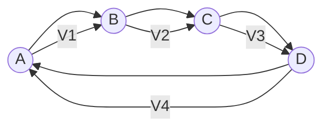
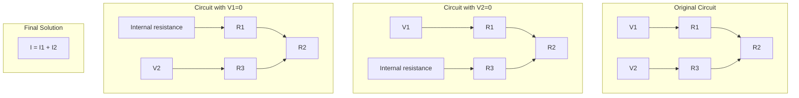
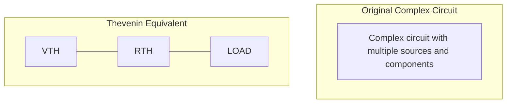
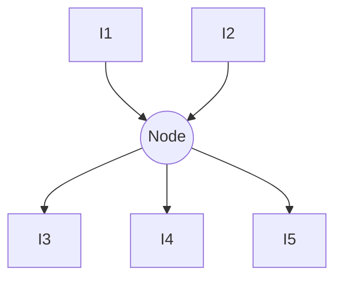
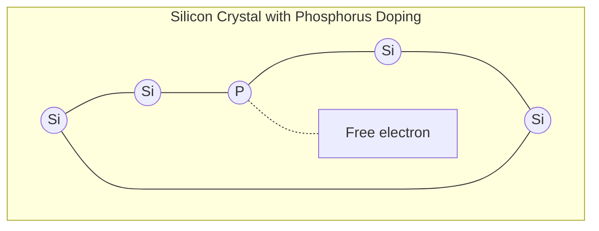
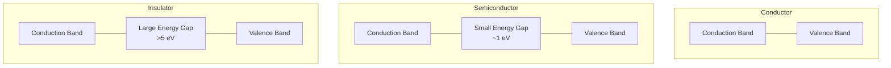
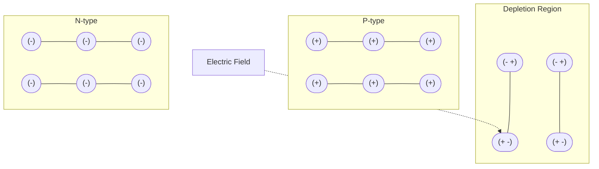

## પ્રશ્ન 1(અ) [3 marks]

**નીચેની સર્કિટમાં મેશ કરંટ શોધો.**

**જવાબ**:

**આકૃતિ:**

```
    2kΩ      2kΩ
    ┌───┐    ┌───┐
    │   │    │   │
    │   │    │   │
┌───┴───┴────┴───┴────┐
│   │               │ │
│  ┌┴┐             ┌┴┐
│  │ │   1kΩ       │ │
5V ┤ ├─────────────┤ ├ 2V
│  │ │   │         │ │
│  └┬┘   │         └┬┘
│   │    │          │ │
└───┴────┴──────────┴─┘
```

મેશ એનાલિસિસ લાગુ કરવા:

- બે મેશ માટે KVL સમીકરણો લખો
- I₁ ડાબા લૂપમાં ઘડિયાળના કાંટા દિશામાં વહે છે
- I₂ જમણા લૂપમાં ઘડિયાળના કાંટા દિશામાં વહે છે

**સોડવવાના સ્ટેપ:**

- **મેશ 1 સમીકરણ**: 5V - 2kΩ×I₁ - 1kΩ×(I₁-I₂) = 0
- **મેશ 2 સમીકરણ**: -2V + 2kΩ×I₂ + 1kΩ×(I₂-I₁) = 0

સરળીકરણ:

- 5 - 2000I₁ - 1000I₁ + 1000I₂ = 0
- -2 + 2000I₂ + 1000I₂ - 1000I₁ = 0

- 3000I₁ - 1000I₂ = 5
- -1000I₁ + 3000I₂ = 2

સોલ્યુશન:
I₁ = 2 mA
I₂ = 1 mA

**મેમરી ટ્રીક:** "મેશ મહત્વપૂર્ણ છે: KVL લખો, સિમલ્ટેનિયસ સોલ્વ કરો"

## પ્રશ્ન 1(બ) [4 marks]

**કીચોફનો વોલ્ટેજ (KVL) નો નિયમ લખો અને ડાયાગ્રામ દોરી સમજાવો.**

**જવાબ**:

કિરચોફનો વોલ્ટેજ નિયમ (KVL) કહે છે કે કોઈપણ બંધ લૂપમાં બધા વોલ્ટેજનો અલજેબ્રાઇક સરવાળો શૂન્ય હોય છે.

**આકૃતિ:**



**મુખ્ય મુદ્દાઓ:**

- **લૂપ નિયમ**: V₁ + V₂ + V₃ + V₄ = 0
- **સાઇન કન્વેન્શન**: વોલ્ટેજ રાઇઝ (બેટરી પોઝિટિવ ટર્મિનલ) પોઝિટિવ, વોલ્ટેજ ડ્રોપ (રેઝિસ્ટર પર) નેગેટિવ
- **કન્ઝર્વેશન પ્રિન્સિપલ**: કોઈપણ બંધ લૂપમાં કુલ ઊર્જા મેળવેલી = કુલ ઊર્જા ખર્ચાયેલી
- **ઉપયોગ**: મલ્ટીપલ વોલ્ટેજ સોર્સ વાળા જટિલ સર્કિટ્સને એનાલાઇઝ અને સોલ્વ કરવા માટે

**મેમરી ટ્રીક:** "લૂપમાં વોલ્ટેજનો સરવાળો શૂન્ય" (VALSZ)

## પ્રશ્ન 1(ક) [7 marks]

**સુપર પોઝીશનનો થિયરમ લખો અને સમજાવો.**

**જવાબ**:

સુપરપોઝિશન થિયરમ કહે છે કે લિનિયર સર્કિટમાં મલ્ટીપલ સોર્સ સાથે, કોઈપણ એલિમેન્ટમાં રિસ્પોન્સ દરેક સોર્સ દ્વારા પેદા થતા રિસ્પોન્સના સરવાળા બરાબર હોય છે, જ્યારે બધા અન્ય સોર્સને તેમના આંતરિક ઇમ્પેડન્સ દ્વારા બદલવામાં આવે છે.

**આકૃતિ:**



**લાગુ કરવાના સ્ટેપ્સ:**

- **સ્ટેપ 1**: એક સમયે એક સોર્સ ધ્યાનમાં લો
- **સ્ટેપ 2**: વોલ્ટેજ સોર્સને શોર્ટ સર્કિટ (0Ω) દ્વારા બદલો
- **સ્ટેપ 3**: કરંટ સોર્સને ઓપન સર્કિટ (∞Ω) દ્વારા બદલો
- **સ્ટેપ 4**: દરેક સોર્સ માટે રિસ્પોન્સ (વોલ્ટેજ/કરંટ) ગણો
- **સ્ટેપ 5**: બધા રિસ્પોન્સને એલજેબ્રાઇકલી એડ કરીને ટોટલ રિસ્પોન્સ મેળવો

**ઉપયોગ:**

- **સર્કિટ એનાલિસિસ**: મલ્ટીપલ સોર્સ વાળા જટિલ સર્કિટ્સને સરળ બનાવે છે
- **નેટવર્ક થિયરી**: વધુ એડવાન્સ્ડ એનાલિસિસ મેથડ્સ માટે પાયો
- **પ્રેક્ટિકલ સર્કિટ્સ**: કમ્યુનિકેશન સિસ્ટમ્સમાં સુપરઇમ્પોઝ્ડ સિગ્નલ્સનું એનાલિસિસ

**મેમરી ટ્રીક:** "સોર્સ અલગ અલગ, સરવાળો સફળતાપૂર્વક" (SSSS)

## પ્રશ્ન 1(ક) OR [7 marks]

**થેવેનિનનો થિયરમ લખો અને સમજાવો.**

**જવાબ**:

થેવેનિનનો થિયરમ કહે છે કે કોઈપણ લિનિયર સર્કિટ જેમાં વોલ્ટેજ અને કરંટ સોર્સ હોય તેને એક વોલ્ટેજ સોર્સ (VTH) અને સિરીઝમાં રેઝિસ્ટન્સ (RTH) વાળા સર્કિટ દ્વારા બદલી શકાય છે.

**આકૃતિ:**



**થેવેનિન ઇક્વિવેલન્ટ શોધવાના સ્ટેપ્સ:**

- **સ્ટેપ 1**: ઓરિજિનલ સર્કિટમાંથી લોડ રેઝિસ્ટર દૂર કરો
- **સ્ટેપ 2**: લોડ ટર્મિનલ્સ વચ્ચે ઓપન-સર્કિટ વોલ્ટેજ (VOC) ગણો (= VTH)
- **સ્ટેપ 3**: ઇક્વિવેલન્ટ રેઝિસ્ટન્સ (RTH) ગણો:
  - બધા સોર્સને નિષ્ક્રિય કરીને (વોલ્ટેજ સોર્સને શોર્ટ સર્કિટ અને કરંટ સોર્સને ઓપન સર્કિટ દ્વારા બદલીને)
  - લોડ ટર્મિનલ્સ વચ્ચે રેઝિસ્ટન્સ શોધો

**ઉપયોગ:**

- **સર્કિટ સિમ્પ્લિફિકેશન**: જટિલ નેટવર્ક્સને સરળ ઇક્વિવેલન્ટમાં ઘટાડે છે
- **લોડ એનાલિસિસ**: બદલાતા લોડની અસરોની ગણતરી સરળતાથી કરી શકાય છે
- **મેક્સિમમ પાવર ટ્રાન્સફર**: મહત્તમ પાવર માટેની શરતો નક્કી કરવા

**મેમરી ટ્રીક:** "બે હાથના તત્વો: વોલ્ટેજ અને રેઝિસ્ટન્સ" (THEVR)

## પ્રશ્ન 2(અ) [3 marks]

**ટ્રાયવેલેન્ટ, ટેટ્રાવેલેન્ટ અને પેન્ટાવેલેન્ટ મટીરીયલની સરખામણી કરો.**

**જવાબ**:

| ગુણધર્મ | ટ્રાયવેલેન્ટ મટીરીયલ | ટેટ્રાવેલેન્ટ મટીરીયલ | પેન્ટાવેલેન્ટ મટીરીયલ |
|----------|---------------------|----------------------|----------------------|
| **વેલેન્સ ઇલેક્ટ્રોન** | 3 | 4 | 5 |
| **ઉદાહરણો** | બોરોન, એલ્યુમિનિયમ, ગેલિયમ | સિલિકોન, જર્મેનિયમ, કાર્બન | ફોસ્ફરસ, આર્સેનિક, એન્ટિમોની |
| **ડોપિંગ પ્રકાર** | P-ટાઇપ ડોપન્ટ તરીકે વપરાય | બેઝ સેમિકન્ડક્ટર મટીરીયલ | N-ટાઇપ ડોપન્ટ તરીકે વપરાય |
| **બોન્ડ ફોર્મેશન** | 3 કોવેલન્ટ બોન્ડ બનાવે | 4 કોવેલન્ટ બોન્ડ બનાવે | 5 કોવેલન્ટ બોન્ડ બનાવે |
| **ચાર્જ કેરિયર** | હોલ્સ (પોઝિટિવ) બનાવે | બેલેન્સ્ડ સ્ટ્રક્ચર બનાવે | ફ્રી ઇલેક્ટ્રોન્સ (નેગેટિવ) બનાવે |

**મેમરી ટ્રીક:** "ત્રણ-ચાર-પાંચ: હોલ્સ-બેલેન્સ-ઇલેક્ટ્રોન્સ" (TFF:HBE)

## પ્રશ્ન 2(બ) [4 marks]

**કીચોફનો કરંટ (KCL) નો નિયમ લખો અને ડાયાગ્રામ દોરી સમજાવો.**

**જવાબ**:

કિરચોફનો કરંટ નિયમ (KCL) કહે છે કે ઇલેક્ટ્રિકલ સર્કિટમાં કોઈપણ નોડમાં પ્રવેશતા અને બહાર નીકળતા તમામ કરંટનો અલજેબ્રાઇક સરવાળો શૂન્ય હોય છે.

**આકૃતિ:**



**મુખ્ય મુદ્દાઓ:**

- **નોડ સમીકરણ**: I₁ + I₂ - I₃ - I₄ - I₅ = 0 (અથવા I₁ + I₂ = I₃ + I₄ + I₅)
- **સાઇન કન્વેન્શન**: નોડમાં પ્રવેશતા કરંટ પોઝિટિવ, બહાર નીકળતા નેગેટિવ
- **કન્ઝર્વેશન પ્રિન્સિપલ**: ઇલેક્ટ્રિક ચાર્જના સંરક્ષણ પર આધારિત
- **ઉપયોગ**: પેરેલલ કમ્પોનન્ટ્સ વાળા સર્કિટ્સ સોલ્વ કરવા માટે આવશ્યક

**મેમરી ટ્રીક:** "કરંટ ઇન ઈક્વલ્સ કરંટ આઉટ" (CIECO)

## પ્રશ્ન 2(ક) [7 marks]

**વ્યાખ્યા આપો: એક્સટ્રિન્સિક સેમિકન્ડક્ટર. N-પ્રકારના સેમિકન્ડક્ટર ની રચના ડાયાગ્રામ ની મદદથી સમજાવો.**

**જવાબ**:

**એક્સટ્રિન્સિક સેમિકન્ડક્ટર**: એક સેમિકન્ડક્ટર જેના ઇલેક્ટ્રિકલ ગુણધર્મો અશુદ્ધિ એટમ્સ (ડોપિંગ) ઉમેરીને તેની કન્ડક્ટિવિટી બદલવા માટે મોડિફાઈ કરવામાં આવે છે.

**N-ટાઇપ સેમિકન્ડક્ટર ફોર્મેશન:**

**આકૃતિ:**



**પ્રક્રિયા:**

- **ડોપિંગ પ્રક્રિયા**: ટેટ્રાવેલેન્ટ સેમિકન્ડક્ટર (Si, Ge)માં પેન્ટાવેલેન્ટ અશુદ્ધિ (P, As, Sb) ઉમેરવામાં આવે છે
- **બોન્ડ ફોર્મેશન**: અશુદ્ધિ એટમ આસપાસના Si એટમ્સ સાથે 4 કોવેલન્ટ બોન્ડ બનાવે છે
- **ફ્રી ઇલેક્ટ્રોન**: 5મો ઇલેક્ટ્રોન બોન્ડ બનાવવા માટે કોઈ જગ્યા ન હોવાથી ફ્રી થઈ જાય છે
- **ચાર્જ કેરિયર**: મેજોરિટી કેરિયર ઇલેક્ટ્રોન્સ, માઇનોરિટી કેરિયર હોલ્સ
- **કન્ડક્ટિવિટી**: ઇન્ટ્રિન્સિક સેમિકન્ડક્ટર કરતાં વધારે, કારણ કે વધુ ફ્રી ઇલેક્ટ્રોન્સ

**N-ટાઇપ સેમિકન્ડક્ટરના ગુણધર્મો:**

- **ફર્મી લેવલ**: કન્ડક્શન બેન્ડની નજીક
- **ડોનર લેવલ**: કન્ડક્શન બેન્ડની નજીક એનર્જી લેવલ બને છે
- **રૂમ ટેમ્પરેચર**: મોટાભાગના ડોનર એટમ્સ આયનાઇઝ્ડ હોય છે

**મેમરી ટ્રીક:** "ફોસ્ફરસ પ્રોવાઇડ્સ પ્લસ-વન ઇલેક્ટ્રોન" (PPP)

## પ્રશ્ન 2(અ) OR [3 marks]

**કન્ડક્ટર, સેમિકન્ડક્ટર અને ઇન્સ્યુલેટર માટે એનર્જી બેન્ડ ડાયાગ્રામ દોરો.**

**જવાબ**:

**આકૃતિ:**



**મુખ્ય લક્ષણો:**

- **કન્ડક્ટર**: ઓવરલેપિંગ બેન્ડ્સ અથવા પાર્શિયલી ફિલ્ડ બેન્ડ
- **સેમિકન્ડક્ટર**: નાનો એનર્જી ગેપ (~1 eV)
- **ઇન્સ્યુલેટર**: મોટો એનર્જી ગેપ (>5 eV)

**મેમરી ટ્રીક:** "ગેપ્સ ડિટરમાઇન ફ્લો: નન, સ્મોલ, હ્યુજ" (GDF:NSH)

## પ્રશ્ન 2(બ) OR [4 marks]

**EMF અને Potential difference વચ્ચેનો તફાવત લખો.**

**જવાબ**:

| પેરામીટર | EMF (ઇલેક્ટ્રોમોટિવ ફોર્સ) | પોટેન્શિયલ ડિફરન્સ |
|-----------|---------------------------|----------------------|
| **વ્યાખ્યા** | સોર્સ દ્વારા યુનિટ ચાર્જ દીઠ પ્રદાન કરવામાં આવતી ઊર્જા | કમ્પોનન્ટમાં યુનિટ ચાર્જ દીઠ વપરાયેલી ઊર્જા |
| **સિમ્બોલ અને યુનિટ** | ξ અથવા E, વોલ્ટમાં માપવામાં આવે છે | V, વોલ્ટમાં માપવામાં આવે છે |
| **કારણ** | રાસાયણિક, યાંત્રિક, થર્મલ અથવા પ્રકાશ ઊર્જા રૂપાંતરણ | રેઝિસ્ટન્સમાંથી વહેતા કરંટનું પરિણામ |
| **માપન** | કોઈ કરંટ ન વહેતો હોય ત્યારે સોર્સ ટર્મિનલ્સ વચ્ચે માપવામાં આવે છે | કરંટ વહેતો હોય ત્યારે કમ્પોનન્ટ્સ વચ્ચે માપવામાં આવે છે |
| **દિશા** | સોર્સની અંદર નેગેટિવથી પોઝિટિવ | સોર્સની બહાર પોઝિટિવથી નેગેટિવ |
| **ડિવાઇસ ઉદાહરણ** | બેટરી, જનરેટર, સોલાર સેલ | રેઝિસ્ટર, લેમ્પ, મોટર |
| **સંરક્ષણ** | સર્કિટમાં સંરક્ષિત નથી | બંધ સર્કિટમાં સંરક્ષિત છે (KVL) |

**મેમરી ટ્રીક:** "EMF ક્રિએટ્સ, PD કન્ઝ્યુમ્સ" (ECPC)

## પ્રશ્ન 2(ક) OR [7 marks]

**P-N જંકશનમાં ડીપ્લેશન રીજીયન અથવા સ્પેશ-ચાર્જ રીજીયન ની રચના સમજાવો.**

**જવાબ**:

**આકૃતિ:**



**ફોર્મેશન પ્રક્રિયા:**

- **જંક્શન ક્રિએશન**: જ્યારે P-ટાઇપ અને N-ટાઇપ સેમિકન્ડક્ટર્સ જોડવામાં આવે
- **ડિફ્યુઝન**: N-સાઇડથી ફ્રી ઇલેક્ટ્રોન્સ P-સાઇડ તરફ ડિફ્યુઝ થાય; P-સાઇડથી હોલ્સ N-સાઇડ તરફ ડિફ્યુઝ થાય
- **રિકોમ્બિનેશન**: ઇલેક્ટ્રોન્સ જંક્શનની નજીક હોલ્સ સાથે રિકોમ્બાઇન થાય
- **આયન ફોર્મેશન**: N-રીજીયનમાં ઇમોબાઇલ પોઝિટિવ આયન્સ બાકી રહે; P-રીજીયનમાં નેગેટિવ આયન્સ
- **ઇલેક્ટ્રિક ફિલ્ડ**: N થી P તરફ પોઇન્ટ કરતું જંક્શન પાર ઇલેક્ટ્રિક ફિલ્ડ ઉત્પન્ન થાય છે
- **ઇક્વિલિબ્રિયમ**: ડિફ્યુઝન કરંટ ઇલેક્ટ્રિક ફિલ્ડને કારણે ડ્રિફ્ટ કરંટ દ્વારા બેલેન્સ થાય
- **બેરિયર પોટેન્શિયલ**: સામાન્ય રીતે સિલિકોન માટે 0.7V, જર્મેનિયમ માટે 0.3V

**લક્ષણો:**

- **પહોળાઈ**: સામાન્ય રીતે 0.5 μm, ડોપિંગ કન્સન્ટ્રેશન પર આધાર રાખે છે
- **કેપેસિટન્સ**: વેરિએબલ કેપેસિટર તરીકે કાર્ય કરે છે
- **બેરિયર**: મેજોરિટી કેરિયર્સના વધુ ડિફ્યુઝનને અટકાવે છે

**મેમરી ટ્રીક:** "ડિફ્યુઝન ક્રિએટ્સ, ફિલ્ડ બેલેન્સિસ" (DCFB)

## પ્રશ્ન 3(અ) [3 marks]

**ફોરબિડન એનર્જી ગેપની વ્યાખ્યા આપો. તે કેવી રીતે થાય છે? Ge અને Si માટે તેનું મેગ્નીટયૂડ કેટલું છે?**

**જવાબ**:

**ફોરબિડન એનર્જી ગેપ** એટલે સેમિકન્ડક્ટરમાં વેલેન્સ બેન્ડ અને કન્ડક્શન બેન્ડ વચ્ચેની એનર્જી રેન્જ જ્યાં ઇલેક્ટ્રોન એનર્જી સ્ટેટ્સ અસ્તિત્વમાં નથી.

**ઉત્પત્તિ:**

- ક્રિસ્ટલ લેટિસમાં એટમ્સના ક્વોન્ટમ મિકેનિકલ ઇન્ટરેક્શનથી પરિણમે છે
- જ્યારે એટમ્સને નજીક લાવવામાં આવે ત્યારે એનર્જી લેવલના સ્પ્લિટિંગને કારણે ફોર્મ થાય છે
- અલાઉડ અને ફોરબિડન રીજન્સ સાથે બેન્ડ સ્ટ્રક્ચર બનાવે છે

**મેગ્નીટયૂડ:**

- **જર્મેનિયમ (Ge)**: 300K પર 0.67 eV
- **સિલિકોન (Si)**: 300K પર 1.1 eV

**મેમરી ટ્રીક:** "ગ્રેટર સિલિકોન, લોઅર જર્મેનિયમ" (GSLG)

## પ્રશ્ન 3(બ) [4 marks]

**નીચેના શબ્દોને વ્યાખ્યાયિત કરો:**
**(i) ની (Knee) વોલ્ટેજ (ii) રિવર્સ સેચ્યુરેશન કરંટ (iii) રિવર્સ બ્રેકડાઉન વોલ્ટેજ (iv) પીક ઇન્વર્સ વોલ્ટેજ (PIV)**

**જવાબ**:

**વ્યાખ્યાઓનું ટેબલ:**

| શબ્દ | વ્યાખ્યા |
|------|------------|
| **ની વોલ્ટેજ** | ફોરવર્ડ વોલ્ટેજ જ્યાં ડાયોડ દ્વારા કરંટ ઝડપથી વધવાનું શરૂ થાય છે (Ge માટે 0.3V, Si માટે 0.7V) |
| **રિવર્સ સેચ્યુરેશન કરંટ** | જ્યારે ડાયોડ રિવર્સ બાયસ્ડ હોય ત્યારે વહેતો નાનો કરંટ, માઇનોરિટી કેરિયર્સને કારણે (સામાન્ય રીતે nA અથવા μA) |
| **રિવર્સ બ્રેકડાઉન વોલ્ટેજ** | રિવર્સ વોલ્ટેજ જેના પર ડાયોડ બ્રેકડાઉન મિકેનિઝમ્સને કારણે રિવર્સ દિશામાં ભારે કન્ડક્ટ કરે છે |
| **પીક ઇન્વર્સ વોલ્ટેજ (PIV)** | મહત્તમ રિવર્સ વોલ્ટેજ જે રેક્ટિફાયર સર્કિટમાં ડાયોડ બ્રેકડાઉન વિના સહન કરી શકે છે |

**મેમરી ટ્રીક:** "ની રાઇઝિસ, સેચુરેશન ટ્રિકલ્સ, બ્રેકડાઉન બર્સ્ટ્સ, PIV પ્રોટેક્ટ્સ" (KRSBBP)

## પ્રશ્ન 3(ક) [7 marks]

**LASER ડાયોડનું બંધારણ, કાર્ય અને લાક્ષણિકતા સમજાવો અને તેના ઉપયોગો લખો.**

**જવાબ**:

**આકૃતિ:**

```goat
                  +-------+
+--------+        |       |  
| p-type |~~~~~~~~|       |----> Laser Beam
+--------+        |       |
| active |~~~~~~~~|       |
| layer  |        |       |
+--------+        |       |
| n-type |~~~~~~~~|       |
+--------+        |       |
                  +-------+
                Reflective Surfaces
```

**બંધારણ:**

- **P-N જંક્શન**: ડાયરેક્ટ બેન્ડગેપ સેમિકન્ડક્ટર (GaAs, InGaAsP)થી બનેલ
- **એક્ટિવ રીજીયન**: રિકોમ્બિનેશન થતું P અને N રીજન્સ વચ્ચેનું પાતળું લેયર
- **કેવિટી ડિઝાઈન**: પેરેલલ રિફ્લેક્ટિવ સરફેસિસ (ક્લીવ્ડ ફેસેટ્સ) ઑપ્ટિકલ રેઝોનેટર બનાવે છે
- **પેકેજિંગ**: હીટ સિંક, ઑપ્ટિકલ વિન્ડો, મોનિટરિંગ ફોટોડાયોડ સામેલ છે

**કાર્યરત સિદ્ધાંત:**

- **ઇન્જેક્શન**: ફોરવર્ડ બાયસિંગ એક્ટિવ રીજીયનમાં ઇલેક્ટ્રોન્સ અને હોલ્સ ઇન્જેક્ટ કરે છે
- **પોપ્યુલેશન ઇન્વર્ઝન**: ગ્રાઉન્ડ સ્ટેટ કરતાં એક્સાઇટેડ સ્ટેટમાં વધુ ઇલેક્ટ્રોન્સ
- **સ્ટિમ્યુલેટેડ એમિશન**: ફોટોન સરખા ફોટોન્સનો રિલીઝ ટ્રિગર કરે છે (સમાન વેવલેન્થ, ફેઝ)
- **ઑપ્ટિકલ ફીડબેક**: ફોટોન્સ મિરર વચ્ચે રિફ્લેક્ટ થઈને લાઇટને એમ્પ્લિફાય કરે છે
- **થ્રેશોલ્ડ કરંટ**: લેસિંગ એક્શન માટે મિનિમમ કરંટ

**લક્ષણો:**

- **કોહેરન્ટ લાઇટ**: સિંગલ વેવલેન્થ, ઇન-ફેઝ લાઇટ એમિશન
- **ડાયરેક્શનાલિટી**: હાઇલી ડાયરેક્શનલ, નેરો બીમ
- **હાઇ ઇન્ટેન્સિટી**: કોન્સન્ટ્રેટેડ એનર્જી આઉટપુટ
- **થ્રેશોલ્ડ બિહેવિયર**: થ્રેશોલ્ડ કરંટ ઉપર જ લેસર એક્શન

**અનુપ્રયોગો:**

- ઑપ્ટિકલ ફાઇબર કમ્યુનિકેશન્સ
- DVD/બ્લુ-રે પ્લેયર્સ
- લેસર પ્રિન્ટર્સ
- બારકોડ સ્કેનર્સ
- મેડિકલ સર્જરી ઇન્સ્ટ્રુમેન્ટ્સ

**મેમરી ટ્રીક:** "પોપ્યુલેશન ઇન્વર્ઝન ક્રિએટ્સ કોહેરન્ટ લાઇટ" (PICL)

## પ્રશ્ન 3(અ) OR [3 marks]

**P-N જંકશન ડાયોડ અને ઝીનર ડાયોડની V-I લાક્ષણિકતાઓ દોરો.**

**જવાબ**:

**આકૃતિ:**

```goat
   I↑
    |                 /
    |                /
    |               /
    |              /
    |             /
Forward |            /
    |           /
    |          /         P-N Junction Diode
    |         /
    |        /
----+-------------------- V →
    |       /
    |      /
    |     /
Reverse|
    |
    |
    |                     Zener
    |                     Breakdown
    |                     Region
    |                       |
    |                     \ |
    |                      \|
    |                       |
    |                       |
    |                       v
    
   I↑
    |                 /
    |                /
    |               /
    |              /
    |             /
Forward |            /
    |           /
    |          /         Zener Diode
    |         /
    |        /
----+-------------------- V →
    |       /
    |      /
    |     /
Reverse|
    |       ______
    |      /
    |     /
    |    /         Zener
    |   /          Region
    |  /
    | /
    |/
    
```

**મુખ્ય તફાવતો:**

- **P-N જંક્શન ડાયોડ**: ફોરવર્ડ બાયસમાં કન્ડક્ટ કરે છે, બ્રેકડાઉન સુધી રિવર્સમાં બ્લોક કરે છે
- **ઝીનર ડાયોડ**: વિશેષ રીતે ચોક્કસ વોલ્ટેજ પર રિવર્સ બ્રેકડાઉન રીજીયનમાં ઓપરેટ કરવા માટે ડિઝાઈન કરેલ

**મેમરી ટ્રીક:** "ફોરવર્ડ સેમ, રિવર્સ ડિફરન્ટ" (FSRD)

## પ્રશ્ન 3(બ) OR [4 marks]

**સર્કિટ ડાયાગ્રામ સાથે ફોરવર્ડ બાયસમાં P-N જંકશન ડાયોડનું કાર્ય સમજાવો.**

**જવાબ**:

**આકૃતિ:**

```goat
        +
    V   |     R
    ___/\/\/\__
   |            |
   |            |
   |    |>|     |
   |    D1      |
   |            |
   |____________|
        -
```

**ફોરવર્ડ બાયસમાં કાર્ય:**

- **કનેક્શન**: P-સાઇડ પોઝિટિવ ટર્મિનલ સાથે, N-સાઇડ નેગેટિવ ટર્મિનલ સાથે કનેક્ટ કરેલ
- **ડિપ્લેશન રીજીયન**: એપ્લાઇડ વોલ્ટેજ વધવાની સાથે પહોળાઈ ઘટે છે
- **બેરિયર પોટેન્શિયલ**: થ્રેશોલ્ડને પાર કરવું જરૂરી (Si માટે 0.7V, Ge માટે 0.3V)
- **કરંટ ફ્લો**: થ્રેશોલ્ડ ઉપર, કરંટ વોલ્ટેજ સાથે એક્સ્પોનેન્શિયલી વધે છે
- **મેજોરિટી કેરિયર્સ**: N-સાઇડથી ઇલેક્ટ્રોન્સ અને P-સાઇડથી હોલ્સ જંક્શન તરફ ધકેલાય છે
- **રિકોમ્બિનેશન**: ઇલેક્ટ્રોન્સ અને હોલ્સ રિકોમ્બાઇન થઈને સતત કરંટ ફ્લો બનાવે છે

**કરંટ સમીકરણ**: I = I₀(e^(qV/kT) - 1), જ્યાં I₀ રિવર્સ સેચુરેશન કરંટ છે

**મેમરી ટ્રીક:** "પોઝિટિવ ટુ P, રિડ્યૂસિસ બેરિયર, કરંટ ફ્લોઝ" (PPRBCF)

## પ્રશ્ન 3(ક) OR [7 marks]

**લાઈટ એમીટીંગ ડાયોડ (LED) અને ફોટોડાયોડ નું કાર્ય આકૃતિ દોરી સમજાવો.**

**જવાબ**:

**LED આકૃતિ:**

```goat
     Current
       flow
        ↓
    +-------+
    |       |
+---+       +---+
|   | P-type|   |
|   +-------+   |
|   | N-type|   |
|   |       |   |
+---+       +---+
    |       |
    +-------+
       ↑
     Photon
    Emission
```

**LED કાર્ય:**

- **ડાયરેક્ટ બેન્ડગેપ**: GaAs, GaP કમ્પાઉન્ડ્સથી બનેલ જેમાં ડાયરેક્ટ બેન્ડગેપ હોય છે
- **ફોરવર્ડ બાયસ**: જંક્શન પાર કેરિયર્સને ઇન્જેક્ટ કરવા લાગુ કરવામાં આવે છે
- **રિકોમ્બિનેશન**: N-સાઇડના ઇલેક્ટ્રોન્સ P-સાઇડના હોલ્સ સાથે રિકોમ્બાઇન થાય છે
- **ફોટોન એમિશન**: રિકોમ્બિનેશન દરમિયાન છૂટી પડતી ઊર્જા ફોટોન્સ તરીકે એમિટ થાય છે
- **વેવલેન્થ કંટ્રોલ**: અલગ-અલગ મટીરિયલ્સ અલગ-અલગ રંગો ઉત્પન્ન કરે છે
- **કાર્યક્ષમતા**: આધુનિક LEDsમાં 80-90% કાર્યક્ષમતા હાંસલ થાય છે

**ફોટોડાયોડ આકૃતિ:**

```goat
    +-------+
    |       |
+---+       +---+
|   | P-type|   |
|   +-------+   |
|   | N-type|   |
|   |       |   |
+---+       +---+
    |       |
    +-------+
       ↑
     Photon
    Absorption
```

**ફોટોડાયોડ કાર્ય:**

- **રિવર્સ બાયસ**: સામાન્ય રીતે રિવર્સ બાયસમાં ઓપરેટ કરવામાં આવે છે
- **લાઇટ એબ્સોર્પ્શન**: ડિપ્લેશન રીજીયનમાં ફોટોન્સ એબ્સોર્બ થાય છે
- **ઇલેક્ટ્રોન-હોલ પેર્સ**: ફોટોન એનર્જી દ્વારા બનાવવામાં આવે છે
- **કેરિયર સેપરેશન**: ઇલેક્ટ્રિક ફિલ્ડ ઇલેક્ટ્રોન્સ અને હોલ્સને અલગ કરે છે
- **કરંટ જનરેશન**: ફોટોકરંટ લાઇટની તીવ્રતાના પ્રમાણમાં હોય છે
- **રિસ્પોન્સ ટાઇમ**: ડિપ્લેશન રીજીયન વધુ પહોળી હોવાને કારણે રિવર્સ બાયસમાં ઝડપી

**તુલનાત્મક ટેબલ:**

| પેરામીટર | LED | ફોટોડાયોડ |
|-----------|-----|------------|
| **ફંક્શન** | ઇલેક્ટ્રિકલ એનર્જીને લાઇટમાં રૂપાંતરિત કરે છે | લાઇટને ઇલેક્ટ્રિકલ એનર્જીમાં રૂપાંતરિત કરે છે |
| **બાયસ મોડ** | ફોરવર્ડ બાયસ | રિવર્સ બાયસ (સામાન્ય રીતે) |
| **દિશા** | એનર્જી આઉટપુટ (એમિટર) | એનર્જી ઇનપુટ (ડિટેક્ટર) |
| **અનુપ્રયોગ** | ડિસ્પ્લે, ઇન્ડિકેટર્સ, લાઇટિંગ | લાઇટ સેન્સર્સ, ઑપ્ટિકલ કમ્યુનિકેશન્સ |

**મેમરી ટ્રીક:** "LEDs એમિટ, ફોટોડાયોડ્સ ડિટેક્ટ" (LEPD)

## પ્રશ્ન 4(અ) [3 marks]

**નીચેના શબ્દોને વ્યાખ્યાયિત કરો:**
**(i) રેક્ટિફાયર એફીસીયન્સી (η) (ii) રીપલ ફેક્ટર (γ) (iii) વોલ્ટેજ રેગ્યુલેશન**

**જવાબ**:

**વ્યાખ્યાઓનું ટેબલ:**

| શબ્દ | વ્યાખ્યા |
|------|------------|
| **રેક્ટિફાયર એફીસીયન્સી (η)** | રેક્ટિફાયર સર્કિટમાં DC પાવર આઉટપુટનો AC પાવર ઇનપુટ સાથેનો ગુણોત્તર (η = P_DC/P_AC × 100%) |
| **રીપલ ફેક્ટર (γ)** | રેક્ટિફાયર આઉટપુટમાં AC કમ્પોનન્ટના RMS વેલ્યુનો DC કમ્પોનન્ટ સાથેનો ગુણોત્તર (γ = V_rms(ac)/V_dc) |
| **વોલ્ટેજ રેગ્યુલેશન** | પાવર સપ્લાય લોડમાં ફેરફાર છતાં કેટલી સારી રીતે કોન્સ્ટન્ટ આઉટપુટ વોલ્ટેજ જાળવે છે તેનું માપ (VR = [(V_NL - V_FL)/V_FL] × 100%) |

**મેમરી ટ્રીક:** "એફિસિયન્સી પાવર્સ, રિપલ વેરીઝ, રેગ્યુલેશન સ્ટેબિલાઇઝિસ" (EPRVS)

## પ્રશ્ન 4(બ) [4 marks]

**ઝીનર ડાયોડને વોલ્ટેજ રેગ્યુલેટર તરીકે સમજાવો.**

**જવાબ**:

**આકૃતિ:**

```goat
    R
   /\/\/\
Vi +----+----+ Vout
    |    |    |
    |   [Z]   RL
    |    |    |
    +----+----+
         -
```

**કાર્યરત સિદ્ધાંત:**

- **ઝીનર બ્રેકડાઉન**: ચોક્કસ વોલ્ટેજ પર રિવર્સ બ્રેકડાઉન રીજીયનમાં ઓપરેટ કરે છે
- **સિરીઝ રેઝિસ્ટર**: કરંટને મર્યાદિત કરે છે અને વધારાના વોલ્ટેજને ડ્રોપ કરે છે
- **પેરેલલ કનેક્શન**: ઝીનર લોડ સાથે પેરેલલમાં કનેક્ટ કરેલ છે
- **રેગ્યુલેશન મિકેનિઝમ**: 
  - જ્યારે ઇનપુટ વોલ્ટેજ વધે: ઝીનરમાં વધુ કરંટ, લોડ પર વોલ્ટેજ સ્થિર રહે
  - જ્યારે લોડ કરંટ વધે: ઝીનરમાં ઓછો કરંટ, વોલ્ટેજ સ્થિર રહે

**લક્ષણો:**

- **લોડ રેગ્યુલેશન**: લોડમાં ફેરફાર છતાં સ્થિર વોલ્ટેજ જાળવે છે
- **લાઇન રેગ્યુલેશન**: ઇનપુટ વોલ્ટેજમાં ફેરફાર છતાં સ્થિર વોલ્ટેજ જાળવે છે
- **પાવર રેટિંગ**: ઝીનર મહત્તમ પાવર ડિસિપેશન હેન્ડલ કરી શકે (P = V_Z × I_Z)
- **ડિઝાઇન સમીકરણ**: R = (V_in - V_Z)/I_L + I_Z)

**મેમરી ટ્રીક:** "ઝીનર શન્ટ્સ એક્સેસ કરંટ" (ZSEC)

## પ્રશ્ન 4(ક) [7 marks]

**સર્કિટ ડાયાગ્રામ અને ઇનપુટ-આઉટપુટ વેવફોર્મ સાથે ફુલ વેવ બ્રિજ રેક્ટિફાયર સમજાવો.**

**જવાબ**:

**સર્કિટ ડાયાગ્રામ:**

```goat
         D1        D3
         |>|       |>|
          |         |
Vin ------+----+----+----- Vout
          |    |    |
          |    RL   |
          |    |    |
          +----+----+
         |>|       |>|
         D2        D4
```

**કાર્યરત સિદ્ધાંત:**

- **પ્રથમ હાફ સાયકલ (પોઝિટિવ)**: D1 અને D4 કન્ડક્ટ કરે, D2 અને D3 બ્લોક કરે
- **બીજા હાફ સાયકલ (નેગેટિવ)**: D2 અને D3 કન્ડક્ટ કરે, D1 અને D4 બ્લોક કરે
- **બંને હાફ સાયકલ**: કરંટ લોડમાં એક જ દિશામાં વહે છે

**વેવફોર્મ્સ:**

```goat
Input:         Output:
    ^              ^
    |              |
    |  /\    /\    |   /\    /\    /\
    | /  \  /  \   |  /  \  /  \  /  \
----+------+---+---+-+----+----+----+-->
    |      \  /    |
    |       \/     |
    |              |
    v              v
```

**લક્ષણો:**

- **રિપલ ફ્રિક્વન્સી**: ઇનપુટ ફ્રિક્વન્સીથી બે ગણી
- **આઉટપુટ વોલ્ટેજ**: V_dc = 2V_m/π ≈ 0.636V_m
- **PIV**: દરેક ડાયોડે V_m સહન કરવું પડે
- **એફિસિયન્સી**: η = 81.2%
- **રિપલ ફેક્ટર**: γ = 0.48
- **ઉપયોગ**: ઉચ્ચ કરંટ એપ્લિકેશન્સ, સેન્ટર-ટેપ્ડ ટ્રાન્સફોર્મરની જરૂર નથી

**સેન્ટર-ટેપ્ડ કરતાં ફાયદા:**

- સેન્ટર-ટેપ્ડ ટ્રાન્સફોર્મરની જરૂર નથી
- ડાયોડ્સ માટે ઓછી PIV જરૂરિયાત
- વધુ સારો ટ્રાન્સફોર્મર ઉપયોગ

**મેમરી ટ્રીક:** "બ્રિજ બ્રિંગ્સ બોથ હાલ્વ્સ" (BBBH)

## પ્રશ્ન 4(અ) OR [3 marks]

**રેક્ટિફાયર ના ઉપયોગો લખો.**

**જવાબ**:

**રેક્ટિફાયરના ઉપયોગો:**

| એપ્લિકેશન એરિયા | સ્પેસિફિક ઉપયોગો |
|------------------|---------------|
| **પાવર સપ્લાય** | ઇલેક્ટ્રોનિક ડિવાઇસિસ માટે DC પાવર સપ્લાય, બેટરી ચાર્જર્સ, એડાપ્ટર્સ |
| **ઇન્ડસ્ટ્રિયલ એપ્લિકેશન્સ** | ઇલેક્ટ્રોપ્લેટિંગ, વેલ્ડિંગ મશીન્સ, મોટર ડ્રાઇવ્સ, ઇન્ડક્શન હીટિંગ |
| **ટ્રાન્સપોર્ટ સિસ્ટમ્સ** | ઇલેક્ટ્રિક લોકોમોટિવ્સ, મેટ્રો ટ્રેન્સ, ઇલેક્ટ્રિક વાહનો |
| **રિન્યુએબલ એનર્જી** | સોલાર ઇન્વર્ટર્સ, વિન્ડ પાવર જનરેશન |
| **કન્ઝ્યુમર ઇલેક્ટ્રોનિક્સ** | મોબાઇલ ફોન ચાર્જર્સ, લેપટોપ એડાપ્ટર્સ, TV પાવર સપ્લાય |
| **ટેલિકમ્યુનિકેશન્સ** | બેઝ સ્ટેશન્સ, ટ્રાન્સમિશન ઇક્વિપમેન્ટ, સિગ્નલ પ્રોસેસિંગ ડિવાઇસિસ |

**મેમરી ટ્રીક:** "પાવર પરફેક્ટલી ટ્રાન્સફોર્મ્ડ ઇન કન્ઝ્યુમર ડિવાઇસિસ" (PPTICD)

## પ્રશ્ન 4(બ) OR [4 marks]

**હાફ વેવ, ફુલ વેવ સેન્ટર ટેપ અને ફુલ વેવ બ્રિજ રેક્ટિફાયરને ચાર પેરામીટર્સ સાથે સરખાવો.**

**જવાબ**:

| પેરામીટર | હાફ વેવ | ફુલ વેવ સેન્ટર ટેપ્ડ | ફુલ વેવ બ્રિજ |
|-----------|-----------|-------------------------|------------------|
| **ડાયોડની સંખ્યા** | 1 | 2 | 4 |
| **DC આઉટપુટ વોલ્ટેજ** | V_m/π (0.318V_m) | 2V_m/π (0.636V_m) | 2V_m/π (0.636V_m) |
| **રિપલ ફ્રિક્વન્સી** | ઇનપુટ જેટલી | ઇનપુટથી બમણી | ઇનપુટથી બમણી |
| **એફિસિયન્સી** | 40.6% | 81.2% | 81.2% |
| **ટ્રાન્સફોર્મર ઉપયોગ** | ખરાબ | મધ્યમ (સેન્ટર ટેપ જરૂરી) | સારો (સેન્ટર ટેપ જરૂરી નથી) |
| **ડાયોડ્સનું PIV** | V_m | 2V_m | V_m |
| **રિપલ ફેક્ટર** | 1.21 | 0.48 | 0.48 |
| **ફોર્મ ફેક્ટર** | 1.57 | 1.11 | 1.11 |

**મેમરી ટ્રીક:** "હાફ વેસ્ટ્સ, સેન્ટર ટેપ્ડ ઇમ્પ્રૂવ્ઝ, બ્રિજ ઓપ્ટિમાઇઝિસ" (HWCTIBO)

## પ્રશ્ન 4(ક) OR [7 marks]

**સર્કિટ ડાયાગ્રામ સાથે શન્ટ કેપેસિટર ફિલ્ટર અને π-ફિલ્ટર સમજાવો.**

**જવાબ**:

**શન્ટ કેપેસિટર ફિલ્ટર:**

**આકૃતિ:**

```goat
      Rectifier   C
         |        |
Vin --->|M|-------+------ Vout
         |        |
         |        RL
         |        |
         +--------+------
```

**કાર્યરત સિદ્ધાંત:**

- **ચાર્જિંગ**: રેક્ટિફાયર આઉટપુટમાં વોલ્ટેજ વધવા દરમિયાન કેપેસિટર ઝડપથી ચાર્જ થાય છે
- **ડિસ્ચાર્જિંગ**: વોલ્ટેજ ઘટવા દરમિયાન કેપેસિટર ધીમેથી લોડ દ્વારા ડિસ્ચાર્જ થાય છે
- **સ્મૂધિંગ ઇફેક્ટ**: વોલ્ટેજ હાઇ હોય ત્યારે એનર્જી સ્ટોર કરીને રિપલ ઘટાડે છે
- **ટાઇમ કોન્સ્ટન્ટ**: RC રિપલ પિરિયડ કરતાં ઘણું મોટું હોવું જોઈએ
- **પરફોર્મન્સ**: રિપલ ફેક્ટર γ = 1/(4√3·f·R·C)

**π-ફિલ્ટર:**

**આકૃતિ:**

```goat
      Rectifier    L
         |        /\/\/\
Vin --->|M|-------+------ Vout
         |        |
         |        |
         |        |
         +---||---+---||--+
             C1       C2  |
             |        |   RL
             |        |   |
             +--------+---+
```

**કાર્યરત સિદ્ધાંત:**

- **પ્રથમ કેપેસિટર (C1)**: શન્ટ કેપેસિટરની જેમ પ્રાથમિક ફિલ્ટરિંગ પ્રદાન કરે છે
- **ચોક (L)**: AC કમ્પોનન્ટ્સને બ્લોક કરે છે, DC ને પસાર થવા દે છે
- **બીજો કેપેસિટર (C2)**: બાકી રહેલ રિપલને વધુ ઘટાડે છે
- **સંયુક્ત અસર**: લો-પાસ ફિલ્ટર્સના કેસ્કેડ તરીકે કાર્ય કરે છે

**તુલના:**

| પેરામીટર | શન્ટ કેપેસિટર ફિલ્ટર | π-ફિલ્ટર |
|-----------|------------------------|----------|
| **કમ્પોનન્ટ્સ** | સિંગલ કેપેસિટર | બે કેપેસિટર અને ઇન્ડક્ટર |
| **રિપલ રિડક્શન** | મધ્યમ | ઉત્તમ |
| **કોસ્ટ** | ઓછો | ઊંચો |
| **સાઈઝ** | નાનો | મોટો |
| **વોલ્ટેજ રેગ્યુલેશન** | ખરાબ | સારું |
| **કયા માટે યોગ્ય** | ઓછા કરંટ એપ્લિકેશન્સ | ઊંચા કરંટ એપ્લિકેશન્સ |

**મેમરી ટ્રીક:** "કેપેસિટર સ્મૂધ્સ, પી-ફિલ્ટર પરફેક્ટ્સ" (CSPFP)

## પ્રશ્ન 5(અ) [3 marks]

**નીચેના components ની સંજ્ઞા દોરો:**
**(i) PNP ટ્રાન્ઝીસ્ટર (ii) N ચેનલ JFET (iii) N ચેનલ એન્હાન્સમેન્ટ મોડ MOSFET**

**જવાબ**:

**આકૃતિ:**

```goat
PNP Transistor:       N-channel JFET:      N-channel enhancement MOSFET:
     C                     D                        D
     |                     |                        |
     |                     |                        |
  >--+                     +---<                    |
 /    \                   /|                        |
|  E   |                 / |                     +--+
 \    /                 /  |                     |  |
  +--+--B              /   |                 G---+  |
  |                    |   |                     |  |
  |                 G--+   +--S                  +--+--S
  E                    |                            |
                       |                            |
                       S
```

**લક્ષણો:**

- **PNP ટ્રાન્ઝીસ્ટર**: તીર એમિટર પર અંદરની તરફ પોઇન્ટ કરે છે
- **N-ચેનલ JFET**: ગેટ સોર્સ અને ડ્રેન વચ્ચેના ચેનલને કંટ્રોલ કરે છે
- **N-ચેનલ એન્હાન્સમેન્ટ MOSFET**: ચેનલમાં ગેપ, પોઝિટિવ ગેટ વોલ્ટેજની જરૂર પડે છે

**મેમરી ટ્રીક:** "PNP પોઇન્ટ્સ ઇન, JFET જોઇન્સ ગેટ્સ, MOSFET મેક્સ ગેપ્સ" (PPIJJGMMG)

## પ્રશ્ન 5(બ) [4 marks]

**ડાયાગ્રામ સાથે NPN ટ્રાન્ઝીસ્ટરનું કાર્ય સમજાવો.**

**જવાબ**:

**આકૃતિ:**

```goat
        Collector (C)
            |
            |
    +-----------------+
    |      N-type     |
    +-----------------+
    |      P-type     |
    +-----------------+
    |      N-type     |
    +-----------------+
            |
            |
        Emitter (E)
            
  B---/\/\/\--+   +--/\/\/\--C
    (RB)      |   |  (RC)
              |   |
              V_BE|   V_CE
      +-------|---+-------+
      |       |           |
      |       +--[NPN]----+
      |          |        |
      |          |        |
      +----------+--------+
                 |
                 |
                 E
```

**કાર્યરત સિદ્ધાંત:**

- **સ્ટ્રક્ચર**: પાતળા P-ટાઇપ રીજીયન દ્વારા અલગ પાડેલા બે N-ટાઇપ રીજીયન્સ
- **બાયસિંગ**: E-B જંક્શન ફોરવર્ડ બાયસ્ડ, C-B જંક્શન રિવર્સ બાયસ્ડ
- **કરંટ ફ્લો**: 
  - એમિટરથી ઇલેક્ટ્રોન્સ બેઝમાં ક્રોસ કરે છે
  - પાતળા બેઝ રીજીયનને કારણે ~98% ઇલેક્ટ્રોન્સ કલેક્ટરમાં આગળ વધે છે
  - ~2% ઇલેક્ટ્રોન્સ બેઝ રીજીયનમાં રિકોમ્બાઇન થાય છે
- **એમ્પ્લિફિકેશન**: નાના બેઝ કરંટ મોટા કલેક્ટર કરંટને કંટ્રોલ કરે છે
- **કરંટ રિલેશનશિપ**: I_C = β × I_B (જ્યાં β કરંટ ગેઇન છે)

**જંક્શન બિહેવિયર:**

- **એમિટર-બેઝ જંક્શન**: ફોરવર્ડ બાયસ્ડ, લો રેઝિસ્ટન્સ પાથ
- **કલેક્ટર-બેઝ જંક્શન**: રિવર્સ બાયસ્ડ, હાઇ રેઝિસ્ટન્સ પાથ

**મેમરી ટ્રીક:** "ઇલેક્ટ્રોન્સ એન્ટર, બેરલી પોઝ, કલેક્ટ એબવ" (EEBPCA)

## પ્રશ્ન 5(ક) [7 marks]

**કોમન એમીટર(CE) ટ્રાન્ઝીસ્ટરને તેના ઇનપુટ આઉટપુટ લાક્ષણિકતા સાથે દોરો અને સમજાવો.**

**જવાબ**:

**સર્કિટ ડાયાગ્રામ:**

```goat
     +VCC
      |
      R_C
      |
      +-----o V_out
      |
      |
  B---+--[NPN]
  |      |
  R_B    |
  |      |
  +      E
V_in     |
  -      |
 GND    GND
```

**ઇનપુટ લાક્ષણિકતા (I_B vs V_BE સાથે V_CE કોન્સ્ટન્ટ):**

```goat
  I_B ↑
   |
   |            V_CE = 10V
   |           /
   |          /
   |         / V_CE = 5V
   |        /
   |       /
   |      /
   |     /
   |    /
   |   /
   |  /
   | /
   |/
   +--------------> V_BE
       0.7V
```

**આઉટપુટ લાક્ષણિકતા (I_C vs V_CE સાથે I_B કોન્સ્ટન્ટ):**

```goat
  I_C ↑
   |                   I_B = 50μA
   |                 /-----------
   |                /
   |               /  I_B = 40μA
   |              /------------
   |             /
   |            /   I_B = 30μA
   |           /--------------
   |          /
   |         /    I_B = 20μA
   |        /---------------
   |       /
   |      /     I_B = 10μA
   |     /----------------
   |    /
   |   /      I_B = 0
   |  /------------------
   | /
   |/
   +--+-----+----------> V_CE
      |     |
    Saturation|Active
      Region |Region
```

**ઓપરેટિંગ રીજીયન્સ:**

- **કટ-ઓફ**: I_B ≈ 0, I_C ≈ 0, ટ્રાન્ઝિસ્ટર OFF
- **એક્ટિવ**: E-B જંક્શન ફોરવર્ડ બાયસ્ડ, C-B જંક્શન રિવર્સ બાયસ્ડ, લિનિયર એમ્પ્લિફિકેશન
- **સેચુરેશન**: બંને જંક્શનો ફોરવર્ડ બાયસ્ડ, ટ્રાન્ઝિસ્ટર પૂર્ણપણે ON

**પેરામીટર્સ:**

- **કરંટ ગેઇન (β)**: કલેક્ટર કરંટનો બેઝ કરંટ સાથેનો ગુણોત્તર (β = I_C/I_B)
- **ઇનપુટ રેઝિસ્ટન્સ**: V_BEમાં ફેરફારનો I_Bમાં ફેરફાર સાથેનો ગુણોત્તર
- **આઉટપુટ રેઝિસ્ટન્સ**: V_CEમાં ફેરફારનો I_Cમાં ફેરફાર સાથેનો ગુણોત્તર

**અનુપ્રયોગો:**

- **એમ્પ્લિફિકેશન**: વોલ્ટેજ, કરંટ, અને પાવર એમ્પ્લિફિકેશન
- **સ્વિચિંગ**: ડિજિટલ સર્કિટ્સ, લોજિક ગેટ્સ
- **સિગ્નલ પ્રોસેસિંગ**: ઓસિલેટર્સ, ફિલ્ટર્સ, મોડ્યુલેટર્સ

**મેમરી ટ્રીક:** "કટ-એક્ટિવ-સેચુરેટ: ઓફ-એમ્પ્લિફાય-ઓન" (CASOAO)

## પ્રશ્ન 5(અ) OR [3 marks]

**કરંટ ગેઇન આલ્ફા (α) અને બીટા (β) વચ્ચેનો સંબંધ મેળવો.**

**મૂળભૂત વ્યાખ્યાઓ:**

- **આલ્ફા (α)**: કોમન-બેઝ કરંટ ગેઇન = I_C/I_E
- **બીટા (β)**: કોમન-એમિટર કરંટ ગેઇન = I_C/I_B

**આકૃતિ:**

```goat
         I_C
         ^
         |
    +----+----+
    |         |
I_E >    T    > I_B
    |         |
    +---------+
```

**ટ્રાન્ઝિસ્ટરમાં કરંટ સંબંધ:**

- I_E = I_B + I_C (કિરચોફનો કરંટ નિયમ)

**ડેરિવેશન સ્ટેપ્સ:**

1. α = I_C/I_E
2. I_E = I_B + I_C
3. α = I_C/(I_B + I_C)
4. β = I_C/I_B
5. I_C = β × I_B
6. સમીકરણ 3 માં સબ્સ્ટિટ્યૂટ કરતાં:
   α = (β × I_B)/(I_B + β × I_B)
   α = β/(1 + β)
7. β માટે સોલ્વ કરતાં:
   α(1 + β) = β
   α + αβ = β
   α = β - αβ
   α = β(1 - α)
   β = α/(1 - α)

**ફાઇનલ સંબંધો:**

- β = α/(1 - α)
- α = β/(1 + β)

**ટિપિકલ વેલ્યુ:**

- α હંમેશા 1 કરતાં ઓછી હોય છે (સામાન્ય રીતે 0.95 થી 0.99)
- β સામાન્ય રીતે 20 થી 200 હોય છે

**મેમરી ટ્રીક:** "આલ્ફા એપ્રોચિસ વન, બીટા બિકમ્સ ઇન્ફિનિટ" (AAOBBI)

## પ્રશ્ન 5(બ) OR [4 marks]

**ટ્રાન્ઝીસ્ટર માટે વિવિધ ઓપરેટીંગ રીજીયન સમજાવો.**

**જવાબ**:

**આકૃતિ:**

```goat
  I_C ↑
   |
   |      +-------------+
   |      |             |
   |      |             |
   |      |             |
   |      |   Active    |
   |      |   Region    |
   | Saturation         |
   | Region|            |
   |      |             |
   |      |             |
   |      |             |
   +------+-------------+-------> V_CE
   |                    |
   |                    |
   |   Cut-off Region   |
   |                    |
   |                    |
   +--------------------+
```

**ઓપરેટિંગ રીજીયન્સ:**

| રીજીયન | જંક્શન બાયસ | લક્ષણો | અનુપ્રયોગો |
|--------|---------------|----------------|-------------|
| **કટ-ઓફ** | E-B: OFF<br>C-B: OFF | • I_B ≈ 0, I_C ≈ 0<br>• ટ્રાન્ઝિસ્ટર OFF છે<br>• V_CE ≈ V_CC | ડિજિટલ સર્કિટ્સ (OFF સ્ટેટ)<br>સ્વિચિંગ એપ્લિકેશન્સ |
| **એક્ટિવ** | E-B: ON<br>C-B: OFF | • I_C અને I_B વચ્ચે લિનિયર સંબંધ<br>• I_C = β × I_B<br>• એમ્પ્લિફિકેશન માટે વપરાય છે | એનાલોગ એમ્પ્લિફાયર્સ<br>સિગ્નલ પ્રોસેસિંગ |
| **સેચુરેશન** | E-B: ON<br>C-B: ON | • બંને જંક્શનો ફોરવર્ડ બાયસ્ડ<br>• ટ્રાન્ઝિસ્ટર પૂર્ણપણે ON<br>• V_CE ≈ 0.2V | ડિજિટલ સર્કિટ્સ (ON સ્ટેટ)<br>સ્વિચિંગ એપ્લિકેશન્સ |
| **બ્રેકડાઉન** | E-B: OFF<br>C-B: બ્રેકડાઉન | • બ્રેકડાઉન વોલ્ટેજથી વધારે<br>• ટ્રાન્ઝિસ્ટરને નુકસાન થઈ શકે<br>• આ રીજીયન ટાળવી જોઈએ | સામાન્ય ઓપરેશનમાં આ રીજીયન ટાળો |

**મેમરી ટ્રીક:** "કટ એક્ટિવ સેચુરેટ: ઓફ એમ્પ્લિફાય સ્વિચ" (CASOAS)

## પ્રશ્ન 5(ક) OR [7 marks]

**MOSFET પર ટૂંકનોંધ લખો.**

**જવાબ**:

**MOSFET (મેટલ ઓક્સાઇડ સેમિકન્ડક્ટર ફિલ્ડ ઇફેક્ટ ટ્રાન્ઝિસ્ટર)**

**સ્ટ્રક્ચર ડાયાગ્રામ:**

```goat
    Gate (G)
       |
       v
    +-----+    Drain (D)
    |  M  |      |
    +-----+      v
    |  O  |    +---+
    +-----+    |   |
    |  S  |    | N |
    +-----+----+---+----+
    |                   |
    |        P          |
    |                   |
    +---+-------------+-+
        |             |
        v             v
    Source (S)    Substrate
```

**MOSFETના પ્રકારો:**

- **એન્હાન્સમેન્ટ મોડ**: ગેટ વોલ્ટેજ વિના ચેનલ અસ્તિત્વમાં નથી
  - N-ચેનલ: પોઝિટિવ ગેટ વોલ્ટેજ ચેનલ બનાવે છે
  - P-ચેનલ: નેગેટિવ ગેટ વોલ્ટેજ ચેનલ બનાવે છે
- **ડિપ્લેશન મોડ**: ગેટ વોલ્ટેજ વિના ચેનલ અસ્તિત્વમાં છે
  - N-ચેનલ: નેગેટિવ ગેટ વોલ્ટેજ ચેનલને ઘટાડે છે
  - P-ચેનલ: પોઝિટિવ ગેટ વોલ્ટેજ ચેનલને ઘટાડે છે

**કાર્યરત સિદ્ધાંત:**

- **ઇન્સુલેટેડ ગેટ**: ગેટ ઑક્સાઇડ લેયર દ્વારા ચેનલથી અલગ કરેલ છે
- **ફિલ્ડ ઇફેક્ટ**: ઇલેક્ટ્રિક ફિલ્ડ ચેનલ કન્ડક્ટિવિટીને કંટ્રોલ કરે છે
- **વોલ્ટેજ કંટ્રોલ્ડ**: ગેટ વોલ્ટેજ ડ્રેન કરંટને કંટ્રોલ કરે છે
- **નો ગેટ કરંટ**: અત્યંત ઊંચી ઇનપુટ ઇમ્પેડન્સ

**લક્ષણો:**

- **ટ્રાન્સફર લાક્ષણિકતા**: I_D vs V_GS
- **આઉટપુટ લક્ષણિકતા**: I_D vs V_DS
- **થ્રેશોલ્ડ વોલ્ટેજ**: ચેનલ બનાવવા માટે જરૂરી ન્યૂનતમ V_GS
- **ટ્રાન્સકન્ડક્ટન્સ**: V_GS માં યુનિટ ફેરફાર દીઠ I_D માં ફેરફાર

**BJT કરતાં ફાયદા:**

- **ઊંચી ઇનપુટ ઇમ્પેડન્સ**: પ્રાયઃ નગણ્ય ઇનપુટ કરંટ
- **ઝડપી સ્વિચિંગ**: ઓછી કેપેસિટન્સ, નો માઇનોરિટી કેરિયર સ્ટોરેજ
- **વધુ પેકિંગ ડેન્સિટી**: સમાન ફંક્શન માટે નાનો સાઇઝ
- **ઓછો પાવર કન્ઝમ્પ્શન**: ઓછી હીટ જનરેશન
- **સરળ બાયસિંગ**: સિંગલ પોલારિટી સપ્લાય ઘણીવાર પૂરતો

**અનુપ્રયોગો:**

- **ડિજિટલ સર્કિટ્સ**: CMOS લોજિક, મેમરી ડિવાઇસિસ
- **એનાલોગ સર્કિટ્સ**: એમ્પ્લિફાયર્સ, કરંટ સોર્સિસ
- **પાવર ઇલેક્ટ્રોનિક્સ**: હાઇ-પાવર સ્વિચિંગ
- **RF એપ્લિકેશન્સ**: લો-નોઇઝ એમ્પ્લિફાયર્સ
- **ઇન્ટિગ્રેટેડ સર્કિટ્સ**: પ્રોસેસર્સ, ASICs

**મેમરી ટ્રીક:** "મેટલ ઓક્સાઇડ સેપરેટ ગેટ એનેબલ્સ ફિલ્ડ કંટ્રોલ" (MOSGFC)
