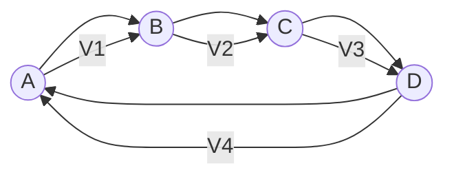
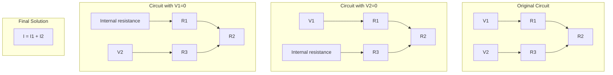
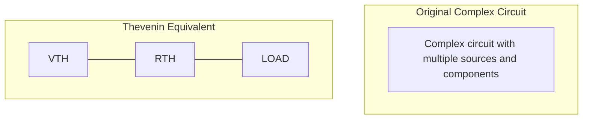
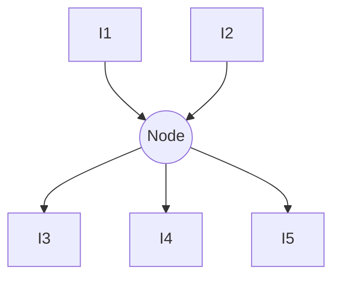
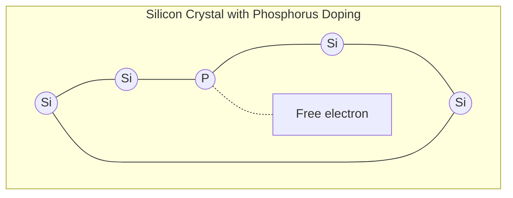
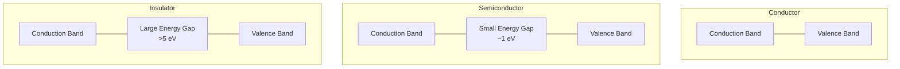
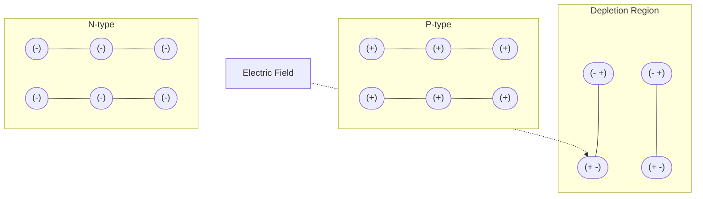

## Question 1(a) [3 marks]

**Find mesh currents in following circuit.**

**Answer**:

**Diagram/Table:**

```
    2kΩ      2kΩ
    ┌───┐    ┌───┐
    │   │    │   │
    │   │    │   │
┌───┴───┴────┴───┴───┐
│   │              │ │
│  ┌┴┐             ┌┴┐
│  │ │   1kΩ       │ │
5V ┤ ├─────────────┤ ├ 2V
│  │ │   │         │ │
│  └┬┘   │         └┬┘
│   │    │          │ │
└───┴────┴──────────┴─┘
```

Applying Mesh Analysis:

- Write KVL equations for two meshes
- I₁ flows clockwise in left loop
- I₂ flows clockwise in right loop

**Steps to solve:**

- **Mesh 1 equation**: 5V - 2kΩ×I₁ - 1kΩ×(I₁-I₂) = 0
- **Mesh 2 equation**: -2V + 2kΩ×I₂ + 1kΩ×(I₂-I₁) = 0

Simplifying:

- 5 - 2000I₁ - 1000I₁ + 1000I₂ = 0
- -2 + 2000I₂ + 1000I₂ - 1000I₁ = 0

- 3000I₁ - 1000I₂ = 5
- -1000I₁ + 3000I₂ = 2

Solving:
I₁ = 2 mA
I₂ = 1 mA

**Mnemonic:** "Mesh Matters: Write KVL, Solve Simultaneous"

## Question 1(b) [4 marks]

**State and explain Kirchhoff's Voltage Law (KVL) with the help of diagram.**

**Answer**:

Kirchhoff's Voltage Law (KVL) states that the algebraic sum of all voltages around any closed loop in a circuit is zero.

**Diagram:**



**Key points:**

- **Loop rule**: V₁ + V₂ + V₃ + V₄ = 0
- **Sign convention**: Voltage rise (battery positive terminal) is positive, voltage drop (across resistor) is negative
- **Conservation principle**: Total energy gained equals total energy lost in any closed loop
- **Application**: Used to analyze and solve complex circuits with multiple voltage sources

**Mnemonic:** "Voltages Around a Loop Sum to Zero" (VALSZ)

## Question 1(c) [7 marks]

**State and explain Superposition theorem.**

**Answer**:

Superposition theorem states that in a linear circuit with multiple sources, the response in any element is the sum of responses caused by each source acting alone, with all other sources replaced by their internal impedances.

**Diagram:**



**Steps to apply:**

- **Step 1**: Consider one source at a time
- **Step 2**: Replace voltage sources with short circuits (0Ω)
- **Step 3**: Replace current sources with open circuits (∞Ω)
- **Step 4**: Calculate the response (voltage/current) due to each source
- **Step 5**: Add all responses algebraically to get total response

**Applications:**

- **Circuit analysis**: Simplifies complex circuits with multiple sources
- **Network theory**: Foundation for more advanced analysis methods
- **Practical circuits**: Analyzing superimposed signals in communication systems

**Mnemonic:** "Sources Separately, Sum Successfully" (SSSS)

## Question 1(c) OR [7 marks]

**State and explain Thevenin's theorem.**

**Answer**:

Thevenin's theorem states that any linear circuit with voltage and current sources can be replaced by an equivalent circuit consisting of a voltage source (VTH) in series with a resistance (RTH).

**Diagram:**



**Steps to find Thevenin equivalent:**

- **Step 1**: Remove load resistor from original circuit
- **Step 2**: Calculate open-circuit voltage (VOC) across load terminals (= VTH)
- **Step 3**: Calculate equivalent resistance (RTH) by:
  - Deactivating all sources (replacing voltage sources with short circuits and current sources with open circuits)
  - Finding resistance between load terminals

**Applications:**

- **Circuit simplification**: Reduces complex networks to simple equivalent
- **Load analysis**: Easily calculate effects of changing loads
- **Maximum power transfer**: Determine conditions for maximum power

**Mnemonic:** "Two Handy Elements: Voltage and Resistance" (THEVR)

## Question 2(a) [3 marks]

**Give comparison of trivalent, tetravalent and pentavalent materials.**

**Answer**:

| Property | Trivalent Materials | Tetravalent Materials | Pentavalent Materials |
|----------|---------------------|----------------------|----------------------|
| **Valence electrons** | 3 | 4 | 5 |
| **Examples** | Boron, Aluminum, Gallium | Silicon, Germanium, Carbon | Phosphorus, Arsenic, Antimony |
| **Doping type** | Used as P-type dopants | Base semiconductor materials | Used as N-type dopants |
| **Bond formation** | Makes 3 covalent bonds | Makes 4 covalent bonds | Makes 5 covalent bonds |
| **Charge carriers** | Creates holes (positive) | Creates balanced structure | Creates free electrons (negative) |

**Mnemonic:** "Three-Four-Five: Holes-Balance-Electrons" (TFF:HBE)

## Question 2(b) [4 marks]

**State and explain Kirchhoff's Current Law (KCL) with the help of diagram.**

**Answer**:

Kirchhoff's Current Law (KCL) states that the algebraic sum of all currents entering and leaving any node in an electrical circuit is zero.

**Diagram:**



**Key points:**

- **Node equation**: I₁ + I₂ - I₃ - I₄ - I₅ = 0 (or I₁ + I₂ = I₃ + I₄ + I₅)
- **Sign convention**: Currents entering node are positive, leaving are negative
- **Conservation principle**: Based on conservation of electric charge
- **Application**: Essential for solving circuits with parallel components

**Mnemonic:** "Currents In Equals Currents Out" (CIECO)

## Question 2(c) [7 marks]

**Define: Extrinsic Semiconductor. Explain formation of N-type Semiconductor with the help of diagram.**

**Answer**:

**Extrinsic Semiconductor**: A semiconductor whose electrical properties are modified by adding impurity atoms (doping) to change its conductivity.

**N-type Semiconductor Formation:**

**Diagram:**



**Process:**

- **Doping process**: Pentavalent impurity (P, As, Sb) added to tetravalent semiconductor (Si, Ge)
- **Bond formation**: Impurity atom forms 4 covalent bonds with neighboring Si atoms
- **Free electron**: 5th electron has no bond to form and becomes free to move
- **Charge carriers**: Majority carriers are electrons, minority carriers are holes
- **Conductivity**: Higher than intrinsic semiconductor due to more free electrons

**Properties of N-type semiconductor:**

- **Fermi level**: Closer to conduction band
- **Donor level**: Energy level created near conduction band
- **Room temperature**: Most donor atoms are ionized

**Mnemonic:** "Phosphorus Provides Plus-one electron" (PPP)

## Question 2(a) OR [3 marks]

**Draw energy band diagrams for Conductor, Semiconductor and Insulator.**

**Answer**:

**Diagram:**



**Key characteristics:**

- **Conductor**: Overlapping bands or partially filled band
- **Semiconductor**: Small energy gap (~1 eV)
- **Insulator**: Large energy gap (>5 eV)

**Mnemonic:** "Gaps Determine Flow: None, Small, Huge" (GDF:NSH)

## Question 2(b) OR [4 marks]

**Give the difference between EMF and Potential difference.**

**Answer**:

| Parameter | EMF (Electromotive Force) | Potential Difference |
|-----------|---------------------------|----------------------|
| **Definition** | Energy supplied per unit charge by a source | Energy consumed per unit charge in a component |
| **Symbol & Unit** | ξ or E, measured in Volts | V, measured in Volts |
| **Cause** | Chemical, mechanical, thermal or light energy conversion | Result of current flowing through a resistance |
| **Measurement** | Measured across source terminals with no current flowing | Measured across components when current flows |
| **Direction** | From negative to positive inside source | From positive to negative outside source |
| **Device example** | Battery, generator, solar cell | Resistor, lamp, motor |
| **Conservation** | Not conserved in a circuit | Conserved in a closed circuit (KVL) |

**Mnemonic:** "EMF Creates, PD Consumes" (ECPC)

## Question 2(c) OR [7 marks]

**Explain the formation of depletion region or space-charge region in P-N junction.**

**Answer**:

**Diagram:**



**Formation process:**

- **Junction creation**: When P-type and N-type semiconductors are joined
- **Diffusion**: Free electrons from N-side diffuse to P-side; holes from P-side diffuse to N-side
- **Recombination**: Electrons recombine with holes near junction
- **Ion formation**: Immobile positive ions left in N-region; negative ions in P-region
- **Electric field**: Created across the junction pointing from N to P
- **Equilibrium**: Diffusion current balanced by drift current due to electric field
- **Barrier potential**: Typically 0.7V for silicon, 0.3V for germanium

**Characteristics:**

- **Width**: Typically 0.5 μm, depends on doping concentration
- **Capacitance**: Acts as variable capacitor
- **Barrier**: Prevents further diffusion of majority carriers

**Mnemonic:** "Diffusion Creates, Field Balances" (DCFB)

## Question 3(a) [3 marks]

**Define forbidden energy gap. How does it occur? What is its magnitude for Ge and Si?**

**Answer**:

**Forbidden energy gap** is the energy range between valence band and conduction band where no electron energy states exist in a semiconductor.

**Occurrence:**

- Results from quantum mechanical interaction of atoms in crystal lattice
- Forms due to splitting of energy levels when atoms are brought close together
- Creates band structure with allowed and forbidden regions

**Magnitude:**

- **Germanium (Ge)**: 0.67 eV at 300K
- **Silicon (Si)**: 1.1 eV at 300K

**Mnemonic:** "Greater Silicon, Lower Germanium" (GSLG)

## Question 3(b) [4 marks]

**Define the following terms:**
**(i) Knee voltage (ii) Reverse saturation current (iii) Reverse breakdown voltage (iv) Peak Inverse Voltage (PIV)**

**Answer**:

**Table of Definitions:**

| Term | Definition |
|------|------------|
| **Knee voltage** | The forward voltage at which current through diode starts increasing rapidly (0.3V for Ge, 0.7V for Si) |
| **Reverse saturation current** | The small current that flows when diode is reverse biased, due to minority carriers (typically nA or μA) |
| **Reverse breakdown voltage** | The reverse voltage at which the diode conducts heavily in reverse direction due to breakdown mechanisms |
| **Peak Inverse Voltage (PIV)** | Maximum reverse voltage a diode can withstand without breakdown in a rectifier circuit |

**Mnemonic:** "Knee Rises, Saturation Trickles, Breakdown Bursts, PIV Protects" (KRSBBP)

## Question 3(c) [7 marks]

**Explain construction, working and characteristics of LASER diode and write its applications.**

**Answer**:

**Diagram:**

```goat
                  +-------+
+--------+        |       |  
| p-type |~~~~~~~~|       |----> Laser Beam
+--------+        |       |
| active |~~~~~~~~|       |
| layer  |        |       |
+--------+        |       |
| n-type |~~~~~~~~|       |
+--------+        |       |
                  +-------+
                Reflective Surfaces
```

**Construction:**

- **P-N junction**: Made of direct bandgap semiconductor (GaAs, InGaAsP)
- **Active region**: Thin layer between P and N regions where recombination occurs
- **Cavity design**: Parallel reflective surfaces (cleaved facets) form optical resonator
- **Packaging**: Includes heat sink, optical window, monitoring photodiode

**Working principle:**

- **Injection**: Forward biasing injects electrons and holes into active region
- **Population inversion**: More electrons in excited state than ground state
- **Stimulated emission**: Photon triggers release of identical photons (same wavelength, phase)
- **Optical feedback**: Photons reflect between mirrors, amplifying light
- **Threshold current**: Minimum current for lasing action

**Characteristics:**

- **Coherent light**: Single wavelength, in-phase light emission
- **Directionality**: Highly directional, narrow beam
- **High intensity**: Concentrated energy output
- **Threshold behavior**: Laser action only above threshold current

**Applications:**

- Optical fiber communications
- DVD/Blu-ray players
- Laser printers
- Barcode scanners
- Medical surgery instruments

**Mnemonic:** "Population Inversion Creates Coherent Light" (PICL)

## Question 3(a) OR [3 marks]

**Draw V-I characteristics of P-N junction diode and Zener diode.**

**Answer**:

**Diagram:**

```goat
   I↑
    |                 /
    |                /
    |               /
    |              /
    |             /
Forward |            /
    |           /
    |          /         P-N Junction Diode
    |         /
    |        /
----+-------------------- V →
    |       /
    |      /
    |     /
Reverse|
    |
    |
    |                     Zener
    |                     Breakdown
    |                     Region
    |                       |
    |                     \ |
    |                      \|
    |                       |
    |                       |
    |                       v
    
   I↑
    |                 /
    |                /
    |               /
    |              /
    |             /
Forward |            /
    |           /
    |          /         Zener Diode
    |         /
    |        /
----+-------------------- V →
    |       /
    |      /
    |     /
Reverse|
    |       ______
    |      /
    |     /
    |    /         Zener
    |   /          Region
    |  /
    | /
    |/
    
```

**Key differences:**

- **P-N Junction diode**: Conducts in forward bias, blocks in reverse until breakdown
- **Zener diode**: Specially designed to operate in reverse breakdown region at precise voltage

**Mnemonic:** "Forward Same, Reverse Different" (FSRD)

## Question 3(b) OR [4 marks]

**Explain working of P-N junction diode in forward bias with circuit diagram.**

**Answer**:

**Diagram:**

```goat
        +
    V   |     R
    ___/\/\/\__
   |            |
   |            |
   |    |>|     |
   |    D1      |
   |            |
   |____________|
        -
```

**Working in forward bias:**

- **Connection**: P-side connected to positive terminal, N-side to negative terminal
- **Depletion region**: Width decreases as applied voltage increases
- **Barrier potential**: Must overcome threshold (0.7V for Si, 0.3V for Ge)
- **Current flow**: Above threshold, current increases exponentially with voltage
- **Majority carriers**: Electrons from N-side and holes from P-side are pushed toward junction
- **Recombination**: Electrons and holes recombine, creating continuous current flow

**Current equation**: I = I₀(e^(qV/kT) - 1), where I₀ is reverse saturation current

**Mnemonic:** "Positive to P, Reduces Barrier, Current Flows" (PPRBCF)

## Question 3(c) OR [7 marks]

**Explain working of Light Emitting diode (LED) and Photodiode with diagram.**

**Answer**:

**LED Diagram:**

```goat
     Current
       flow
        ↓
    +-------+
    |       |
+---+       +---+
|   | P-type|   |
|   +-------+   |
|   | N-type|   |
|   |       |   |
+---+       +---+
    |       |
    +-------+
       ↑
     Photon
    Emission
```

**LED Working:**

- **Direct bandgap**: Made of GaAs, GaP compounds with direct bandgap
- **Forward bias**: Applied to inject carriers across junction
- **Recombination**: Electrons from N-side recombine with holes from P-side
- **Photon emission**: Energy released during recombination emitted as photons
- **Wavelength control**: Different materials produce different colors
- **Efficiency**: Modern LEDs achieve 80-90% efficiency

**Photodiode Diagram:**

```goat
    +-------+
    |       |
+---+       +---+
|   | P-type|   |
|   +-------+   |
|   | N-type|   |
|   |       |   |
+---+       +---+
    |       |
    +-------+
       ↑
     Photon
    Absorption
```

**Photodiode Working:**

- **Reverse bias**: Operated in reverse bias typically
- **Light absorption**: Photons absorbed in depletion region
- **Electron-hole pairs**: Created by photon energy
- **Carrier separation**: Electric field separates electrons and holes
- **Current generation**: Photocurrent proportional to light intensity
- **Response time**: Faster in reverse bias due to wider depletion region

**Comparison table:**

| Parameter | LED | Photodiode |
|-----------|-----|------------|
| **Function** | Converts electrical energy to light | Converts light to electrical energy |
| **Bias mode** | Forward bias | Reverse bias (typically) |
| **Direction** | Energy output (emitter) | Energy input (detector) |
| **Application** | Displays, indicators, lighting | Light sensors, optical communications |

**Mnemonic:** "LEDs Emit, Photodiodes Detect" (LEPD)

## Question 4(a) [3 marks]

**Define the following terms:**
**(i) Rectifier efficiency (η) (ii) Ripple factor (γ) (iii) Voltage regulation**

**Answer**:

**Table of Definitions:**

| Term | Definition |
|------|------------|
| **Rectifier efficiency (η)** | Ratio of DC power output to AC power input in a rectifier circuit (η = P_DC/P_AC × 100%) |
| **Ripple factor (γ)** | Ratio of RMS value of AC component to DC component in rectifier output (γ = V_rms(ac)/V_dc) |
| **Voltage regulation** | Measure of how well a power supply maintains constant output voltage despite changes in load (VR = [(V_NL - V_FL)/V_FL] × 100%) |

**Mnemonic:** "Efficiency Powers, Ripple Varies, Regulation Stabilizes" (EPRVS)

## Question 4(b) [4 marks]

**Explain zener diode as a voltage regulator.**

**Answer**:

**Diagram:**

```goat
    R
   /\/\/\
Vi +----+----+ Vout
    |    |    |
    |   [Z]   RL
    |    |    |
    +----+----+
         -
```

**Working principle:**

- **Zener breakdown**: Operates in reverse breakdown region at specific voltage
- **Series resistor**: Limits current and drops excess voltage
- **Parallel connection**: Zener connected in parallel with load
- **Regulation mechanism**: 
  - When input voltage increases: More current through Zener, voltage across load remains constant
  - When load current increases: Less current through Zener, voltage remains constant

**Characteristics:**

- **Load regulation**: Maintains constant voltage despite load changes
- **Line regulation**: Maintains constant voltage despite input voltage changes
- **Power rating**: Zener must handle maximum power dissipation (P = V_Z × I_Z)
- **Design equation**: R = (V_in - V_Z)/I_L + I_Z)

**Mnemonic:** "Zener Shunts Excess Current" (ZSEC)

## Question 4(c) [7 marks]

**Explain full wave bridge rectifier with circuit diagram and input-output waveform.**

**Answer**:

**Circuit Diagram:**

```goat
         D1        D3
         |>|       |>|
          |         |
Vin ------+----+----+----- Vout
          |    |    |
          |    RL   |
          |    |    |
          +----+----+
         |>|       |>|
         D2        D4
```

**Working principle:**

- **First half cycle (positive)**: D1 and D4 conduct, D2 and D3 block
- **Second half cycle (negative)**: D2 and D3 conduct, D1 and D4 block
- **Both half cycles**: Current flows through load in same direction

**Waveforms:**

```goat
Input:         Output:
    ^              ^
    |              |
    |  /\    /\    |   /\    /\    /\
    | /  \  /  \   |  /  \  /  \  /  \
----+------+---+---+-+----+----+----+-->
    |      \  /    |
    |       \/     |
    |              |
    v              v
```

**Characteristics:**

- **Ripple frequency**: Twice the input frequency
- **Output voltage**: V_dc = 2V_m/π ≈ 0.636V_m
- **PIV**: Each diode must withstand V_m
- **Efficiency**: η = 81.2%
- **Ripple factor**: γ = 0.48
- **Uses**: Higher current applications, no center-tapped transformer needed

**Advantages over center-tapped:**

- No center-tapped transformer required
- Lower PIV requirement for diodes
- Better transformer utilization

**Mnemonic:** "Bridge Brings Both Halves" (BBBH)

## Question 4(a) OR [3 marks]

**Give the applications of rectifier.**

**Answer**:

**Applications of Rectifiers:**

| Application Area | Specific Uses |
|------------------|---------------|
| **Power supplies** | DC power supplies for electronic devices, battery chargers, adaptors |
| **Industrial applications** | Electroplating, welding machines, motor drives, induction heating |
| **Transport systems** | Electric locomotives, metro trains, electric vehicles |
| **Renewable energy** | Solar inverters, wind power generation |
| **Consumer electronics** | Mobile phone chargers, laptop adapters, TV power supplies |
| **Telecommunications** | Base stations, transmission equipment, signal processing devices |

**Mnemonic:** "Power Perfectly Transformed in Consumer Devices" (PPTICD)

## Question 4(b) OR [4 marks]

**Compare half wave, full wave center tapped and full wave bridge rectifier with four parameters.**

**Answer**:

| Parameter | Half Wave | Full Wave Center Tapped | Full Wave Bridge |
|-----------|-----------|-------------------------|------------------|
| **Number of diodes** | 1 | 2 | 4 |
| **DC output voltage** | V_m/π (0.318V_m) | 2V_m/π (0.636V_m) | 2V_m/π (0.636V_m) |
| **Ripple frequency** | Same as input | Twice the input | Twice the input |
| **Efficiency** | 40.6% | 81.2% | 81.2% |
| **Transformer utilization** | Poor | Medium (center tap needed) | Good (no center tap) |
| **PIV of diodes** | V_m | 2V_m | V_m |
| **Ripple factor** | 1.21 | 0.48 | 0.48 |
| **Form factor** | 1.57 | 1.11 | 1.11 |

**Mnemonic:** "Half Wastes, Center Tapped Improves, Bridge Optimizes" (HWCTIBO)

## Question 4(c) OR [7 marks]

**Explain Shunt capacitor filter and π-filter with circuit diagram.**

**Answer**:

**Shunt Capacitor Filter:**

**Diagram:**

```goat
      Rectifier   C
         |        |
Vin --->|M|-------+------ Vout
         |        |
         |        RL
         |        |
         +--------+------
```

**Working principle:**

- **Charging**: Capacitor charges rapidly during voltage rise in rectifier output
- **Discharging**: Capacitor discharges slowly through load during voltage fall
- **Smoothing effect**: Reduces ripple by storing energy when voltage is high
- **Time constant**: RC should be much larger than ripple period
- **Performance**: Ripple factor γ = 1/(4√3·f·R·C)

**π-Filter:**

**Diagram:**

```goat
      Rectifier    L
         |        /\/\/\
Vin --->|M|-------+------ Vout
         |        |
         |        |
         |        |
         +---||---+---||--+
             C1       C2  |
             |        |   RL
             |        |   |
             +--------+---+
```

**Working principle:**

- **First capacitor (C1)**: Provides initial filtering like shunt capacitor
- **Choke (L)**: Blocks AC components, allows DC to pass
- **Second capacitor (C2)**: Further reduces remaining ripple
- **Combined effect**: Acts as cascade of low-pass filters

**Comparison:**

| Parameter | Shunt Capacitor Filter | π-Filter |
|-----------|------------------------|----------|
| **Components** | Single capacitor | Two capacitors and inductor |
| **Ripple reduction** | Moderate | Excellent |
| **Cost** | Low | High |
| **Size** | Small | Large |
| **Voltage regulation** | Poor | Good |
| **Suitable for** | Low current applications | High current applications |

**Mnemonic:** "Capacitor Smooths, Pi-Filter Perfects" (CSPFP)

## Question 5(a) [3 marks]

**Draw the symbols of following components:**
**(i) PNP transistor (ii) N channel JFET (iii) N channel enhancement mode MOSFET**

**Answer**:

**Diagram:**

```goat
PNP Transistor:       N-channel JFET:      N-channel enhancement MOSFET:
     C                     D                        D
     |                     |                        |
     |                     |                        |
  >--+                     +---<                    |
 /    \                   /|                        |
|  E   |                 / |                     +--+
 \    /                 /  |                     |  |
  +--+--B              /   |                 G---+  |
  |                    |   |                     |  |
  |                 G--+   +--S                  +--+--S
  E                    |                            |
                       |                            |
                       S
```

**Characteristics:**

- **PNP Transistor**: Arrow points inward at emitter
- **N-channel JFET**: Gate controls channel between source and drain
- **N-channel enhancement MOSFET**: Gap in channel, requires positive gate voltage

**Mnemonic:** "PNP Points IN, JFET Joins Gates, MOSFET Makes Gaps" (PPIJJGMMG)

## Question 5(b) [4 marks]

**Explain working of NPN transistor with diagram.**

**Answer**:

**Diagram:**

```goat
        Collector (C)
            |
            |
    +-----------------+
    |      N-type     |
    +-----------------+
    |      P-type     |
    +-----------------+
    |      N-type     |
    +-----------------+
            |
            |
        Emitter (E)
            
  B---/\/\/\--+   +--/\/\/\--C
    (RB)      |   |  (RC)
              |   |
              V_BE|   V_CE
      +-------|---+-------+
      |       |           |
      |       +--[NPN]----+
      |          |        |
      |          |        |
      +----------+--------+
                 |
                 |
                 E
```

**Working principle:**

- **Structure**: Two N-type regions separated by thin P-type region
- **Biasing**: E-B junction forward biased, C-B junction reverse biased
- **Current flow**: 
  - Electrons from emitter cross into base
  - ~98% electrons continue to collector due to thin base region
  - ~2% electrons recombine in base region
- **Amplification**: Small base current controls larger collector current
- **Current relationship**: I_C = β × I_B (where β is current gain)

**Junction behavior:**

- **Emitter-Base junction**: Forward biased, low resistance path
- **Collector-Base junction**: Reverse biased, high resistance path

**Mnemonic:** "Electrons Enter, Barely Pause, Collect Above" (EEBPCA)

## Question 5(c) [7 marks]

**Draw and explain common emitter (CE) transistor with its input output characteristic.**

**Answer**:

**Circuit Diagram:**

```goat
     +VCC
      |
      R_C
      |
      +-----o V_out
      |
      |
  B---+--[NPN]
  |      |
  R_B    |
  |      |
  +      E
V_in     |
  -      |
 GND    GND
```

**Input Characteristics (I_B vs V_BE with V_CE constant):**

```goat
  I_B ↑
   |
   |            V_CE = 10V
   |           /
   |          /
   |         / V_CE = 5V
   |        /
   |       /
   |      /
   |     /
   |    /
   |   /
   |  /
   | /
   |/
   +--------------> V_BE
       0.7V
```

**Output Characteristics (I_C vs V_CE with I_B constant):**

```goat
  I_C ↑
   |                   I_B = 50μA
   |                 /-----------
   |                /
   |               /  I_B = 40μA
   |              /------------
   |             /
   |            /   I_B = 30μA
   |           /--------------
   |          /
   |         /    I_B = 20μA
   |        /---------------
   |       /
   |      /     I_B = 10μA
   |     /----------------
   |    /
   |   /      I_B = 0
   |  /------------------
   | /
   |/
   +--+-----+----------> V_CE
      |     |
    Saturation|Active
      Region |Region
```

**Operating regions:**

- **Cut-off**: I_B ≈ 0, I_C ≈ 0, transistor OFF
- **Active**: E-B junction forward biased, C-B junction reverse biased, linear amplification
- **Saturation**: Both junctions forward biased, transistor fully ON

**Parameters:**

- **Current gain (β)**: Ratio of collector current to base current (β = I_C/I_B)
- **Input resistance**: Ratio of change in V_BE to change in I_B
- **Output resistance**: Ratio of change in V_CE to change in I_C

**Applications:**

- **Amplification**: Voltage, current, and power amplification
- **Switching**: Digital circuits, logic gates
- **Signal processing**: Oscillators, filters, modulators

**Mnemonic:** "Cut-Active-Saturate: Off-Amplify-On" (CASOAO)

## Question 5(a) OR [3 marks]

**Derive relationship between current gain alpha (α) and beta (β).**

**Answer**:

**Key definitions:**

- **Alpha (α)**: Common-base current gain = I_C/I_E
- **Beta (β)**: Common-emitter current gain = I_C/I_B

**Diagram:**

```goat
         I_C
         ^
         |
    +----+----+
    |         |
I_E >    T    > I_B
    |         |
    +---------+
```

**Current relationship in transistor:**

- I_E = I_B + I_C (Kirchhoff's Current Law)

**Derivation steps:**

1. α = I_C/I_E
2. I_E = I_B + I_C
3. α = I_C/(I_B + I_C)
4. β = I_C/I_B
5. I_C = β × I_B
6. Substituting in equation 3:
   α = (β × I_B)/(I_B + β × I_B)
   α = β/(1 + β)
7. Solving for β:
   α(1 + β) = β
   α + αβ = β
   α = β - αβ
   α = β(1 - α)
   β = α/(1 - α)

**Final relationships:**

- β = α/(1 - α)
- α = β/(1 + β)

**Typical values:**

- α is always less than 1 (typically 0.95 to 0.99)
- β typically ranges from 20 to 200

**Mnemonic:** "Alpha Approaches One, Beta Becomes Infinite" (AAOBBI)

## Question 5(b) OR [4 marks]

**Explain different operating regions for transistor.**

**Answer**:

**Diagram:**

```goat
  I_C ↑
   |
   |      +-------------+
   |      |             |
   |      |             |
   |      |             |
   |      |   Active    |
   |      |   Region    |
   | Saturation         |
   | Region|            |
   |      |             |
   |      |             |
   |      |             |
   +------+-------------+-------> V_CE
   |                    |
   |                    |
   |   Cut-off Region   |
   |                    |
   |                    |
   +--------------------+
```

**Operating regions:**

| Region | Junction Bias | Characteristics | Applications |
|--------|---------------|----------------|-------------|
| **Cut-off** | E-B: OFF<br>C-B: OFF | • I_B ≈ 0, I_C ≈ 0<br>• Transistor is OFF<br>• V_CE ≈ V_CC | Digital circuits (OFF state)<br>Switching applications |
| **Active** | E-B: ON<br>C-B: OFF | • Linear relationship between I_C and I_B<br>• I_C = β × I_B<br>• Used for amplification | Analog amplifiers<br>Signal processing |
| **Saturation** | E-B: ON<br>C-B: ON | • Both junctions forward biased<br>• Transistor fully ON<br>• V_CE ≈ 0.2V | Digital circuits (ON state)<br>Switching applications |
| **Breakdown** | E-B: OFF<br>C-B: Breakdown | • Exceeds breakdown voltage<br>• Can damage transistor<br>• Should be avoided | Avoid this region in normal operation |

**Mnemonic:** "Cut Active Saturate: Off Amplify Switch" (CASOAS)

## Question 5(c) OR [7 marks]

**Write a short note on MOSFET.**

**Answer**:

**MOSFET (Metal Oxide Semiconductor Field Effect Transistor)**

**Structure Diagram:**

```goat
    Gate (G)
       |
       v
    +-----+    Drain (D)
    |  M  |      |
    +-----+      v
    |  O  |    +---+
    +-----+    |   |
    |  S  |    | N |
    +-----+----+---+----+
    |                   |
    |        P          |
    |                   |
    +---+-------------+-+
        |             |
        v             v
    Source (S)    Substrate
```

**Types of MOSFETs:**

- **Enhancement mode**: Channel does not exist without gate voltage
  - N-channel: Positive gate voltage creates channel
  - P-channel: Negative gate voltage creates channel
- **Depletion mode**: Channel exists without gate voltage
  - N-channel: Negative gate voltage depletes channel
  - P-channel: Positive gate voltage depletes channel

**Working principle:**

- **Insulated gate**: Gate isolated from channel by oxide layer
- **Field effect**: Electric field controls channel conductivity
- **Voltage controlled**: Gate voltage controls drain current
- **No gate current**: Extremely high input impedance

**Characteristics:**

- **Transfer characteristic**: I_D vs V_GS
- **Output characteristic**: I_D vs V_DS
- **Threshold voltage**: Minimum V_GS required to create channel
- **Transconductance**: Change in I_D per unit change in V_GS

**Advantages over BJT:**

- **High input impedance**: Virtually no input current
- **Faster switching**: Lower capacitance, no minority carrier storage
- **Higher packing density**: Smaller size for same function
- **Lower power consumption**: Less heat generation
- **Simpler biasing**: Single polarity supply often sufficient

**Applications:**

- **Digital circuits**: CMOS logic, memory devices
- **Analog circuits**: Amplifiers, current sources
- **Power electronics**: High-power switching
- **RF applications**: Low-noise amplifiers
- **Integrated circuits**: Processors, ASICs

**Mnemonic:** "Metal Oxide Separate Gate Enables Field Control" (MOSGFC)
