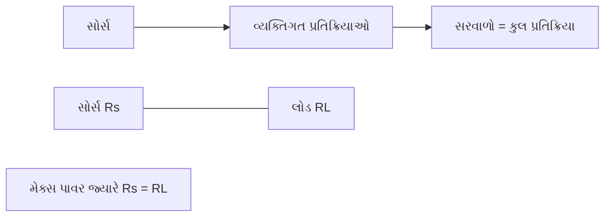
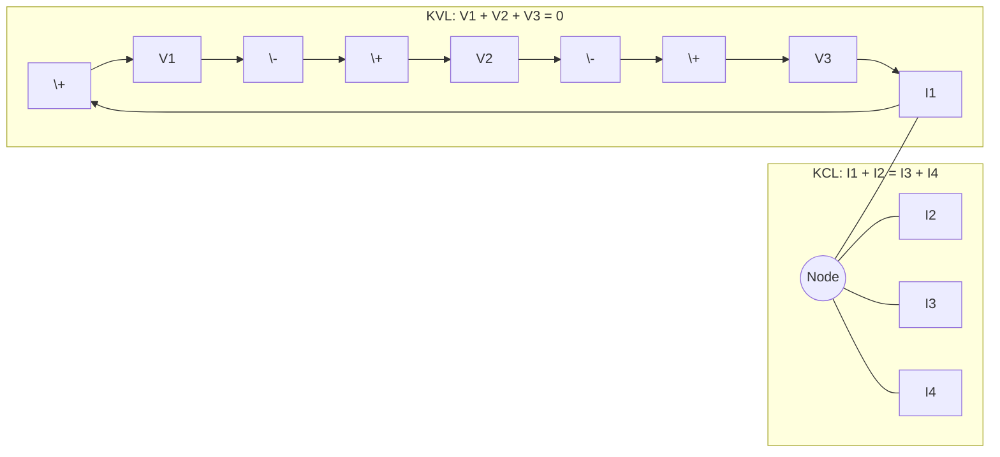
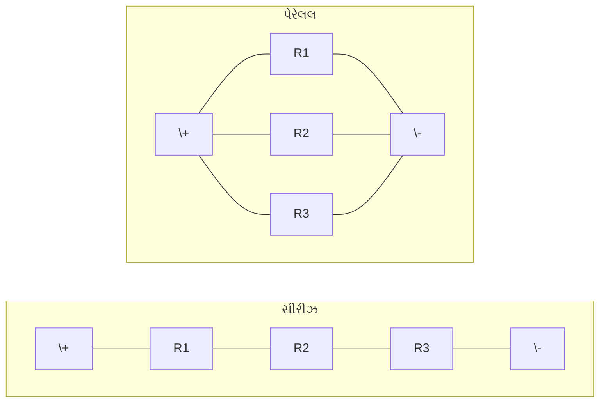
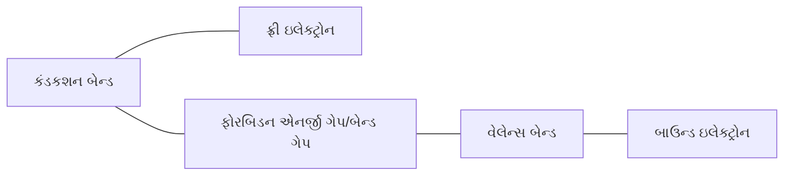
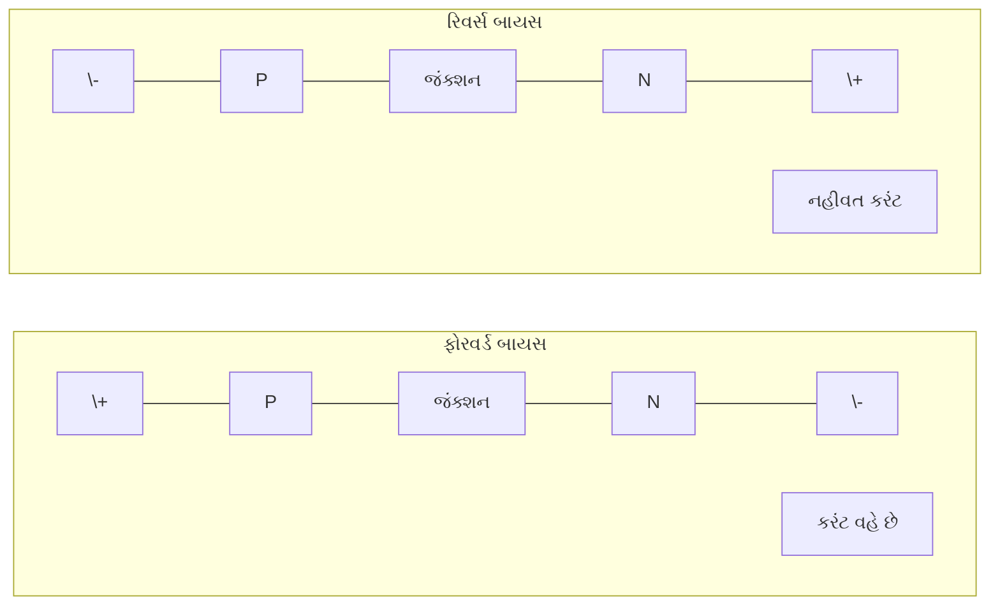
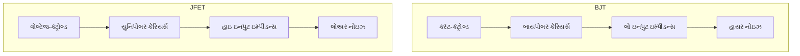
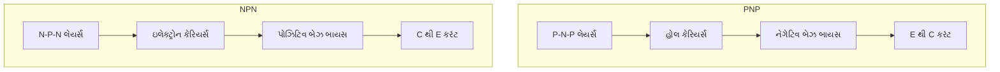

## પ્રશ્ન 1(અ) [3 માર્ક્સ]

**વ્યાખ્યા આપો: 1. નોડ, 2. લૂપ, 3. બ્રાંચ**

**જવાબ**:

| શબ્દ | વ્યાખ્યા |
|------|---------|
| **નોડ** | સર્કિટમાં એવો બિંદુ જ્યાં બે અથવા વધુ સર્કિટ એલિમેન્ટ મળે છે અથવા જોડાય છે |
| **લૂપ** | સર્કિટમાં એક બંધ માર્ગ જે એક જ બિંદુથી શરૂ થઈને એ જ બિંદુ પર પરત આવે છે, કોઈપણ નોડને એક વખતથી વધુ ઓળંગીને નહીં |
| **બ્રાંચ** | સર્કિટમાં બે નોડને જોડતો માર્ગ અથવા એલિમેન્ટ |

**મેમરી ટ્રીક:** "Never Loop Between" - નોડ લિંક, લૂપ બાઉન્ડ, બ્રાંચ કનેક્શન સ્થાપિત કરે છે

## પ્રશ્ન 1(બ) [4 માર્ક્સ]

**Superposition થીયરમ અને Maximum power transfer થીયરમ નું સ્ટેટમેંટ લખો.**

**જવાબ**:

| થીયરમ | સ્ટેટમેંટ |
|-------|---------|
| **Superposition થીયરમ** | લીનિયર સર્કિટમાં મલ્ટીપલ સોર્સ હોય ત્યારે, કોઈપણ એલિમેન્ટમાં રિસ્પોન્સ (વોલ્ટેજ અથવા કરંટ) એ દરેક સોર્સના એકલા કાર્ય કરવાથી થતા રિસ્પોન્સના બીજગણિતીય સરવાળાની બરાબર હોય છે, જ્યારે બીજા બધા સોર્સને તેમના આંતરિક ઇમ્પિડન્સથી બદલી દેવામાં આવે |
| **Maximum power transfer થીયરમ** | સોર્સથી લોડમાં મહત્તમ પાવર ત્યારે ટ્રાન્સફર થાય છે જ્યારે લોડ રેઝિસ્ટન્સ સોર્સના આંતરિક રેઝિસ્ટન્સની બરાબર હોય |

**આકૃતિ:**



**મેમરી ટ્રીક:** "Sum Powers Matched" - વ્યક્તિગત પાવરનો સરવાળો; મહત્તમ માટે રેઝિસ્ટન્સ મેચ

## પ્રશ્ન 1(ક) [7 માર્ક્સ]

**કિરચોફનો વોલ્ટેજ નો નિયમ અને કિરચોફનો કરંટનો નિયમ સમજાવો.**

**જવાબ**:

| નિયમ | સમજૂતી | ગાણિતિક સ્વરૂપ |
|------|--------|---------------|
| **કિરચોફનો વોલ્ટેજ નો નિયમ (KVL)** | સર્કિટમાં કોઈપણ બંધ લૂપમાં બધા વોલ્ટેજનો બીજગણિતીય સરવાળો શૂન્ય થાય છે | Σ V = 0 |
| **કિરચોફનો કરંટનો નિયમ (KCL)** | નોડમાં પ્રવેશતા અને નીકળતા બધા કરંટનો બીજગણિતીય સરવાળો શૂન્ય થાય છે | Σ I = 0 |

**આકૃતિ:**



- **KVL નું ભૌતિક અર્થઘટન**: સર્કિટ લૂપમાં ઊર્જા સંરક્ષિત રહે છે
- **KCL નું ભૌતિક અર્થઘટન**: સર્કિટ નોડમાં ચાર્જ સંરક્ષિત રહે છે
- **KVL નો ઉપયોગ**: સર્કિટ લૂપમાં અજ્ઞાત વોલ્ટેજ શોધવા
- **KCL નો ઉપયોગ**: સર્કિટ જંક્શનમાં અજ્ઞાત કરંટ શોધવા

**મેમરી ટ્રીક:** "Voltages Loop to Zero, Currents Node to Zero"

## પ્રશ્ન 1(ક) OR [7 માર્ક્સ]

**રેસિસ્ટન્સ ના સીરીઝ અને પેરેલલ કનેક્શન જરુરી સમીકરણો સાથે સમજાવો.**

**જવાબ**:

| કનેક્શન | લાક્ષણિકતાઓ | સમતુલ્ય રેસિસ્ટન્સ | કરંટ-વોલ્ટેજ સંબંધ |
|---------|------------|-------------------|------------------|
| **સીરીઝ કનેક્શન** | બધા રેસિસ્ટર્સમાંથી એક સરખો કરંટ વહે છે | Req = R1 + R2 + R3 + ... + Rn | I = V/Req |
| **પેરેલલ કનેક્શન** | બધા રેસિસ્ટર્સ પર એક સરખો વોલ્ટેજ આવે છે | 1/Req = 1/R1 + 1/R2 + 1/R3 + ... + 1/Rn | I = I1 + I2 + I3 + ... + In |

**આકૃતિ:**



- **સીરીઝમાં કરંટ**: I = I1 = I2 = I3 = ... = In
- **સીરીઝમાં વોલ્ટેજ**: V = V1 + V2 + V3 + ... + Vn
- **પેરેલલમાં કરંટ**: I = I1 + I2 + I3 + ... + In
- **પેરેલલમાં વોલ્ટેજ**: V = V1 = V2 = V3 = ... = Vn

**મેમરી ટ્રીક:** "Same Current Series, Same Voltage Parallel"

## પ્રશ્ન 2(અ) [3 માર્ક્સ]

**Ohm's law ની મર્યાદાઓ જણાવો.**

**જવાબ**:

| Ohm's Law ની મર્યાદાઓ |
|------------------------|
| **નોન-લિનિયર કંપોનન્ટ્સ**: ડાયોડ, ટ્રાન્ઝિસ્ટર જેવા કંપોનન્ટ્સને લાગુ પડતો નથી |
| **તાપમાન ફેરફાર**: જ્યારે તાપમાન નોંધપાત્ર રીતે બદલાય છે ત્યારે માન્ય રહેતો નથી |
| **ઉચ્ચ ફ્રિક્વન્સી**: ખૂબ ઊંચી ફ્રિક્વન્સી પર નિષ્ફળ જાય છે |

**મેમરી ટ્રીક:** "Ohm's Not Linear Thermal High" - નોન-લિનિયર, તાપમાન, હાઇ ફ્રિક્વન્સી

## પ્રશ્ન 2(બ) [4 માર્ક્સ]

**વ્યાખ્યા આપો: 1. ડોપીંગ, 2. ઈંટ્રાસીક સેમીકંડક્ટર, 3. એક્સ્ટ્રાસીક સેમીકંડક્ટર, 4. ડોપંટ**

**જવાબ**:

| શબ્દ | વ્યાખ્યા |
|------|---------|
| **ડોપીંગ** | શુદ્ધ સેમીકંડક્ટરમાં અશુદ્ધિના પરમાણુઓ ઉમેરવાની પ્રક્રિયા જેનાથી ઇલેક્ટ્રિકલ ગુણધર્મો બદલાય છે |
| **ઈંટ્રાસીક સેમીકંડક્ટર** | શુદ્ધ સેમીકંડક્ટર જેમાં ઇલેક્ટ્રોન અને હોલની સંખ્યા સરખી હોય છે |
| **એક્સ્ટ્રાસીક સેમીકંડક્ટર** | ડોપ કરેલા સેમીકંડક્ટર જેમાં ઇલેક્ટ્રોન અને હોલની સંખ્યા અસરખી હોય છે |
| **ડોપંટ** | ડોપિંગ પ્રક્રિયા દરમિયાન સેમીકંડક્ટરમાં ઉમેરાતા અશુદ્ધિના તત્વો |

**મેમરી ટ્રીક:** "Do In-Ex-Do" - ડોપિંગ ઇન્ટ્રોડ્યુસ એક્સટ્રિન્સિક પ્રોપર્ટીઝ થ્રુ ડોપન્ટ્સ

## પ્રશ્ન 2(ક) [7 માર્ક્સ]

**ટ્રાયવેલેંટ મટીરીયલ ની વ્યાખ્યા આપો અને તેના ઉદાહરણ આપો. P-type સેમીકંડક્ટરની રચના જરુરી આકૃતિ સાથે સમજાવો.**

**જવાબ**:

**ટ્રાયવેલેંટ મટીરીયલ**: એવા તત્વો જેમના બાહ્યતમ કોશમાં 3 વેલેન્સ ઇલેક્ટ્રોન હોય છે.

**ઉદાહરણો**: બોરોન (B), એલ્યુમિનિયમ (Al), ગેલિયમ (Ga), ઇન્ડિયમ (In)

**P-type સેમીકંડક્ટરની રચના**:

**આકૃતિ:**

```goat
          સિલિકોન એટમ (4 વેલેન્સ e-)    ટ્રાયવેલેંટ એટમ (3 વેલેન્સ e-)
             ┌───┐                          ┌───┐
             │   │                          │   │
          ┌──┤ Si├──┐                    ┌──┤ B ├──┐
          │  │   │  │                    │  │   │  │
       ───┼──┴───┴──┼───              ───┼──┴───┴──┼───
          │         │                    │         │
          │         │                    │    ↑    │
       ───┼─────────┼───              ───┼────┼────┼───
          │         │                    │    │    │
          │         │                    │    │    │
       ───┴─────────┴───              ───┴────┘────┴───
                                          હોલ
```

| પ્રક્રિયા | પરિણામ |
|----------|---------|
| **ડોપિંગ** | સિલિકોનમાં બોરોન જેવા ટ્રાયવેલેંટ એટમ સાથે ડોપિંગ |
| **બોન્ડ ફોર્મેશન** | ટ્રાયવેલેંટ એટમ 4 આસપાસના સિલિકોન એટમ સાથે 3 કોવેલેન્ટ બોન્ડ બનાવે છે |
| **હોલ ક્રિએશન** | એક બોન્ડ અપૂર્ણ રહે છે, જે હોલ (પોઝિટિવ ચાર્જ કેરિયર) બનાવે છે |
| **મેજોરિટી કેરિયર્સ** | હોલ મેજોરિટી કેરિયર્સ બને છે |
| **માઇનોરિટી કેરિયર્સ** | ઇલેક્ટ્રોન માઇનોરિટી કેરિયર્સ બને છે |

**મેમરી ટ્રીક:** "Three Makes Positive" - ત્રણ વેલેન્સ ઇલેક્ટ્રોન પોઝિટિવ હોલ બનાવે છે

## પ્રશ્ન 2(અ) OR [3 માર્ક્સ]

**રેસિસ્ટન્સને અસર કરતા પરિબળો જણાવો અને તેમાથી કોઈપણ એક સમજાવો.**

**જવાબ**:

| રેસિસ્ટન્સને અસર કરતા પરિબળો |
|------------------------------|
| **કન્ડક્ટરની લંબાઈ** |
| **ક્રોસ-સેક્શનલ એરિયા** |
| **મટીરિયલ (રેસિસ્ટિવિટી)** |
| **તાપમાન** |

**તાપમાનની અસરની સમજૂતી**:
મોટાભાગના મેટાલિક કન્ડક્ટરનો રેસિસ્ટન્સ તાપમાન સાથે વધે છે:
R = R₀[1 + α(T - T₀)]
જ્યાં:

- R = તાપમાન T પર રેસિસ્ટન્સ
- R₀ = રેફરન્સ તાપમાન T₀ પર રેસિસ્ટન્સ
- α = રેસિસ્ટન્સનો તાપમાન કોએફિશિયન્ટ

**મેમરી ટ્રીક:** "LAMT" - લેન્થ, એરિયા, મટીરિયલ, ટેમ્પરેચર રેસિસ્ટન્સને અસર કરે છે

## પ્રશ્ન 2(બ) OR [4 માર્ક્સ]

**વ્યાખ્યા આપો: 1. વેલેન્સ બેન્ડ, 2. કંડકશન બેન્ડ, 3. ફોરબિડન એનર્જી ગેપ, 4. ફ્રી ઇલેક્ટ્રોન**

**જવાબ**:

| શબ્દ | વ્યાખ્યા |
|------|---------|
| **વેલેન્સ બેન્ડ** | એનર્જી બેન્ડ જેમાં એટમ સાથે બંધાયેલા વેલેન્સ ઇલેક્ટ્રોન ભરેલા હોય છે |
| **કંડકશન બેન્ડ** | ઉચ્ચ એનર્જી બેન્ડ જ્યાં ઇલેક્ટ્રોન મુક્તપણે ફરી શકે છે અને વીજળી વહન કરી શકે છે |
| **ફોરબિડન એનર્જી ગેપ** | વેલેન્સ અને કંડકશન બેન્ડ વચ્ચેની એનર્જી રેન્જ જ્યાં કોઈ ઇલેક્ટ્રોન સ્ટેટ્સ અસ્તિત્વમાં નથી |
| **ફ્રી ઇલેક્ટ્રોન** | ઇલેક્ટ્રોન જે વેલેન્સ બેન્ડથી કંડકશન બેન્ડમાં જવા પૂરતી ઊર્જા મેળવે છે |

**આકૃતિ:**



**મેમરી ટ્રીક:** "Very Clearly Freedom Follows" - વેલેન્સ, કંડકશન, ફોરબિડન ગેપ, ફ્રી ઇલેક્ટ્રોન

## પ્રશ્ન 2(ક) OR [7 માર્ક્સ]

**પેન્ટાવેલેંટ મટીરીયલ ની વ્યાખ્યા આપો અને તેના ઉદાહરણ આપો. N-type સેમીકંડક્ટરની રચના જરુરી આકૃતિ સાથે સમજાવો.**

**જવાબ**:

**પેન્ટાવેલેંટ મટીરીયલ**: એવા તત્વો જેમના બાહ્યતમ કોશમાં 5 વેલેન્સ ઇલેક્ટ્રોન હોય છે.

**ઉદાહરણો**: ફોસ્ફરસ (P), આર્સેનિક (As), એન્ટિમની (Sb)

**N-type સેમીકંડક્ટરની રચના**:

**આકૃતિ:**

```goat
          સિલિકોન એટમ (4 વેલેન્સ e-)    પેન્ટાવેલેંટ એટમ (5 વેલેન્સ e-)
             ┌───┐                          ┌───┐
             │   │                          │   │
          ┌──┤ Si├──┐                    ┌──┤ P ├──┐
          │  │   │  │                    │  │   │  │
       ───┼──┴───┴──┼───              ───┼──┴───┴──┼───
          │         │                    │         │
          │         │                    │         │
       ───┼─────────┼───              ───┼─────────┼───
          │         │                    │    ↓    │
          │         │                    │    │    │
       ───┴─────────┴───              ───┴────┼────┴───
                                          ફ્રી ઇલેક્ટ્રોન
```

| પ્રક્રિયા | પરિણામ |
|----------|---------|
| **ડોપિંગ** | સિલિકોનમાં ફોસ્ફરસ જેવા પેન્ટાવેલેંટ એટમ સાથે ડોપિંગ |
| **બોન્ડ ફોર્મેશન** | પેન્ટાવેલેંટ એટમ 4 આસપાસના સિલિકોન એટમ સાથે 4 કોવેલેન્ટ બોન્ડ બનાવે છે |
| **ફ્રી ઇલેક્ટ્રોન** | પાંચમો વેલેન્સ ઇલેક્ટ્રોન મુક્ત રહે છે (નેગેટિવ ચાર્જ કેરિયર) |
| **મેજોરિટી કેરિયર્સ** | ઇલેક્ટ્રોન મેજોરિટી કેરિયર્સ બને છે |
| **માઇનોરિટી કેરિયર્સ** | હોલ માઇનોરિટી કેરિયર્સ બને છે |

**મેમરી ટ્રીક:** "Five Makes Negative" - પાંચ વેલેન્સ ઇલેક્ટ્રોન નેગેટિવ કેરિયર બનાવે છે

## પ્રશ્ન 3(અ) [3 માર્ક્સ]

**ડાયોડની સાપેક્ષમાં 1. ડીપ્લીશન રીજીયન, 2. ની વોલ્ટેજ, અને 3. બ્રેકડાઉન વોલ્ટેજની વ્યાખ્યા આપો**

**જવાબ**:

| શબ્દ | વ્યાખ્યા |
|------|---------|
| **ડીપ્લીશન રીજીયન** | P-N જંક્શન પર ડિફ્યુઝન અને રિકોમ્બિનેશનને કારણે મોબાઇલ ચાર્જ કેરિયર્સથી વિહીન પ્રદેશ |
| **ની વોલ્ટેજ** | ફોરવર્ડ વોલ્ટેજ જે પર કરંટ ઝડપથી વધવાનું શરૂ થાય છે (સામાન્ય રીતે સિલિકોન માટે 0.7V, જર્મેનિયમ માટે 0.3V) |
| **બ્રેકડાઉન વોલ્ટેજ** | રિવર્સ વોલ્ટેજ જે પર ડાયોડ રિવર્સ દિશામાં ઝડપથી કરંટ વહન કરે છે |

**મેમરી ટ્રીક:** "Depleted Knees Break" - ડીપ્લીશન થાય છે, ની પર કન્ડક્શન શરૂ થાય છે, બ્રેકડાઉન પર બ્લોકિંગ સમાપ્ત થાય છે

## પ્રશ્ન 3(બ) [4 માર્ક્સ]

**P-N જંક્શન ડાયોડ ની V-I લાક્ષણિકતા જરુરી ગ્રાફ સાથે સમજાવો.**

**જવાબ**:

**P-N જંક્શન ડાયોડની V-I લાક્ષણિકતા**:

**આકૃતિ:**

```goat
    I
    ↑                          
    │                        /
    │                      /
    │                    /
    │                  /
    │                /
    │              /
    │            /
    │          /
    │        /
    │      /
    │    /
    │ ની વોલ્ટેજ (≈0.7V)
    │  /
    │/
────┼────────────────────────── V
    │
    │
    │
    │
    │
    │          બ્રેકડાઉન
    │          વોલ્ટેજ
    │         /
    │       /
    │     /
    │   /
    v
```

| ક્ષેત્ર | વર્તન |
|-------|------|
| **ફોરવર્ડ બાયસ (V > 0)** | ની વોલ્ટેજ પછી કરંટ એક્સપોનેન્શિયલી વધે છે |
| **રિવર્સ બાયસ (V < 0)** | બ્રેકડાઉન વોલ્ટેજ સુધી ખૂબ જ નાનો લીકેજ કરંટ |
| **બ્રેકડાઉન ક્ષેત્ર** | બ્રેકડાઉન વોલ્ટેજ પર રિવર્સ કરંટમાં તીવ્ર વધારો |

- **ફોરવર્ડ સમીકરણ**: I = Is(e^(qV/nkT) - 1)
- **ની વોલ્ટેજ**: સિલિકોન માટે ~0.7V, જર્મેનિયમ માટે ~0.3V

**મેમરી ટ્રીક:** "Forward Flows, Reverse Restricts, Breakdown Bursts"

## પ્રશ્ન 3(ક) [7 માર્ક્સ]

**Varactor ડાયોડ ની લાક્ષણિકતા દોરો. Varactor ડાયોડની કાર્યપધ્ધતિ આકૃતિ સાથે સમજાવો અને તેની એપ્લીકેશન લખો.**

**જવાબ**:

**Varactor ડાયોડની લાક્ષણિકતા**:

**આકૃતિ:**

```goat
    C
    ↑                          
    │\
    │ \
    │  \
    │   \
    │    \
    │     \
    │      \
    │       \
    │        \
    │         \
    │          \
    │           \
    │            \
    │             \
    │              \
    │               \
────┼────────────────────────── VR
    │                            →
```

**Varactor ડાયોડની કાર્યપધ્ધતિ**:

**સર્કિટ સિમ્બોલ:**

```goat
    │
    ┌┴┐
  ──┤ ├──
    └┬┘
     │
```

| સિદ્ધાંત | સમજૂતી |
|---------|--------|
| **બેઝિક સ્ટ્રક્ચર** | વેરિએબલ કેપેસિટન્સ માટે ઓપ્ટિમાઈઝ કરેલ સ્પેશિયલ P-N જંક્શન ડાયોડ |
| **રિવર્સ બાયસ ઓપરેશન** | હંમેશા રિવર્સ બાયસ કન્ડિશનમાં ઓપરેટ કરાય છે |
| **ડીપ્લીશન રીજીયન** | વિડ્થ લાગુ રિવર્સ વોલ્ટેજ સાથે બદલાય છે |
| **કેપેસિટન્સ વેરિએશન** | રિવર્સ વોલ્ટેજ વધતા કેપેસિટન્સ ઘટે છે |
| **ગાણિતિક સંબંધ** | C ∝ 1/√VR જ્યાં VR રિવર્સ વોલ્ટેજ છે |

**Varactor ડાયોડની એપ્લીકેશન**:

- વોલ્ટેજ-કંટ્રોલ્ડ ઓસીલેટર્સ (VCOs)
- ફ્રિક્વન્સી મોડ્યુલેટર્સ
- ઇલેક્ટ્રોનિક ટ્યુનિંગ સર્કિટ્સ
- ઓટોમેટિક ફ્રિક્વન્સી કંટ્રોલ સર્કિટ્સ
- ફેઝ-લોક્ડ લૂપ્સ (PLLs)

**મેમરી ટ્રીક:** "Capacitance Varies Reversely" - કેપેસિટન્સ રિવર્સ વોલ્ટેજ સાથે બદલાય છે

## પ્રશ્ન 3(અ) OR [3 માર્ક્સ]

**નીચે દર્શાવેલ ડાયોડની એપ્લીકેશન લખો. 1. Varactor ડાયોડ, 2. Photo ડાયોડ, 3. Light Emitting ડાયોડ**

**જવાબ**:

| ડાયોડનો પ્રકાર | એપ્લીકેશન |
|---------------|-----------|
| **Varactor ડાયોડ** | વોલ્ટેજ-કંટ્રોલ્ડ ઓસીલેટર્સ, ફ્રિક્વન્સી મોડ્યુલેટર્સ, ઇલેક્ટ્રોનિક ટ્યુનિંગ સર્કિટ્સ |
| **Photo ડાયોડ** | લાઇટ સેન્સર્સ, ઓપ્ટિકલ કોમ્યુનિકેશન, સ્મોક ડિટેક્ટર્સ, કેમેરા લાઇટ મીટર્સ |
| **Light Emitting ડાયોડ (LED)** | ડિસ્પ્લે ડિવાઇસીસ, ઇન્ડીકેટર્સ, લાઇટિંગ સિસ્ટમ્સ, ઓપ્ટિકલ કોમ્યુનિકેશન |

**મેમરી ટ્રીક:** "Vary Photo Emit" - Varactor ફ્રિક્વન્સી બદલે છે, Photo લાઇટ ડિટેક્ટ કરે છે, LED લાઇટ ઉત્સર્જિત કરે છે

## પ્રશ્ન 3(બ) OR [4 માર્ક્સ]

**P-N junction ડાયોડની કાર્યપધ્ધતિ ફોરવર્ડ બાયસ અને રીવર્સ બાયસ માં સમજાવો.**

**જવાબ**:

| બાયસ કન્ડિશન | કાર્ય સિદ્ધાંત | લાક્ષણિકતાઓ |
|--------------|--------------|--------------|
| **ફોરવર્ડ બાયસ** | P-સાઇડ પોઝિટિવ ટર્મિનલ સાથે, N-સાઇડ નેગેટિવ ટર્મિનલ સાથે જોડાયેલ | ડીપ્લીશન રીજીયન સાંકડી થાય છે, ની વોલ્ટેજ (~0.7V) પછી કરંટ સરળતાથી વહે છે |
| **રિવર્સ બાયસ** | P-સાઇડ નેગેટિવ ટર્મિનલ સાથે, N-સાઇડ પોઝિટિવ ટર્મિનલ સાથે જોડાયેલ | ડીપ્લીશન રીજીયન પહોળી થાય છે, બ્રેકડાઉન સુધી માત્ર નાનો લીકેજ કરંટ વહે છે |

**આકૃતિ:**



**મેમરી ટ્રીક:** "Forward Flows, Reverse Resists"

## પ્રશ્ન 3(ક) OR [7 માર્ક્સ]

**Photo ડાયોડ ની લાક્ષણિકતા દોરો. Photo ડાયોડની કાર્યપધ્ધિત આકૃતિ સાથે સમજાવો અને તેની એપ્લીકેશન લખો.**

**જવાબ**:

**Photo ડાયોડની લાક્ષણિકતા**:

**આકૃતિ:**

```goat
     I
     ↑
     │                     લાઇટ ઇન્ટેન્સિટી
     │                     વધતી જાય છે
     │                /
     │              /
     │            /
     │          /
     │        /
     │      /
     │    /
     │  /
     │/
─────┼─────────────────────────── V
     │\                           →
     │ \
     │  \
     │   \
     │    \
     │     \
     │
     v
```

**Photo ડાયોડની કાર્યપધ્ધિત**:

**સર્કિટ સિમ્બોલ:**

```goat
     │   ↙↙
    ┌┴┐ ↙
  ──┤ ├──
    └┬┘
     │
```

| સિદ્ધાંત | સમજૂતી |
|---------|--------|
| **બેઝિક સ્ટ્રક્ચર** | ટ્રાન્સપેરન્ટ વિન્ડો અથવા લેન્સ સાથેનો P-N જંક્શન ડાયોડ |
| **રિવર્સ બાયસ ઓપરેશન** | સામાન્ય રીતે રિવર્સ બાયસ કન્ડિશનમાં ઓપરેટ કરાય છે |
| **લાઇટ એબ્સોર્પશન** | ફોટોન્સ ડીપ્લીશન રીજીયનમાં ઇલેક્ટ્રોન-હોલ પેર ઉત્પન્ન કરે છે |
| **કેરિયર જનરેશન** | લાઇટ ઇન્ટેન્સિટી ઉત્પન્ન કેરિયર્સના પ્રમાણમાં હોય છે |
| **કરંટ જનરેશન** | લાઇટ ઇન્ટેન્સિટી સાથે રિવર્સ કરંટ વધે છે |

**Photo ડાયોડની એપ્લીકેશન**:

- ઓપ્ટિકલ કોમ્યુનિકેશનમાં લાઇટ ડિટેક્ટર્સ
- ફોટોમીટર્સ અને લાઇટ મીટર્સ
- સ્મોક ડિટેક્ટર્સ
- બારકોડ રીડર્સ
- મેડિકલ ઇક્વિપમેન્ટ (પલ્સ ઓક્સિમીટર્સ)

**મેમરી ટ્રીક:** "Light In, Current Out" - લાઇટ ઇન્ટેન્સિટી કરંટ આઉટપુટને નિયંત્રિત કરે છે

## પ્રશ્ન 4(અ) [3 માર્ક્સ]

**Half wave rectifier સકીટ ડાયાગ્રામ સાથે સમજાવો.**

**જવાબ**:

**Half Wave Rectifier**:

**સર્કિટ ડાયાગ્રામ:**

```goat
           D
    AC    ┌─┬─┐     R    
    o─────┤>├─┼─────┳─────o
          └─┘ │     │     
              │     │     
    o─────────┘     ┗─────o
                      આઉટપુટ
```

| ઓપરેશન ફેઝ | વર્ણન |
|------------|------|
| **પોઝિટિવ હાફ સાયકલ** | ડાયોડ કન્ડક્ટ કરે છે, કરંટ લોડમાંથી વહે છે, આઉટપુટ ઇનપુટને અનુસરે છે |
| **નેગેટિવ હાફ સાયકલ** | ડાયોડ બ્લોક કરે છે, કરંટ વહેતો નથી, આઉટપુટ શૂન્ય હોય છે |

- **આઉટપુટ ફ્રિક્વન્સી**: ઇનપુટ ફ્રિક્વન્સી જેટલી જ
- **ફોર્મ ફેક્ટર**: 1.57
- **રિપલ ફેક્ટર**: 1.21
- **એફિશિયન્સી**: 40.6%
- **ડાયોડનો PIV**: Vmax

**મેમરી ટ્રીક:** "Half Passes Positive" - માત્ર પોઝિટિવ હાફ-સાયકલ જ પસાર થાય છે

## પ્રશ્ન 4(બ) [4 માર્ક્સ]

**Zener ડાયોડને વોલ્ટેજ રેગ્યુલેટર તરીકે સમજાવો.**

**જવાબ**:

**Zener ડાયોડ વોલ્ટેજ રેગ્યુલેટર**:

**સર્કિટ ડાયાગ્રામ:**

```goat
           Rs             
    o─────┳─────┐           
    Vin   │     │     
          │     │   Zener   RL    Vout
          │     ├──┐┌┬┐┌───┳─────o
          │     │  ││>││   │     
          │     │  │└┬┘│   │     
    o─────┴─────┴──┴─┴─┴───┴─────o
                      
```

| કંપોનન્ટ | ફંક્શન |
|---------|--------|
| **સીરીઝ રેઝિસ્ટર Rs** | કરંટને મર્યાદિત કરે છે અને વધારાનો વોલ્ટેજ ડ્રોપ કરે છે |
| **Zener ડાયોડ** | લોડ પર સ્થિર વોલ્ટેજ જાળવે છે |
| **લોડ રેઝિસ્ટર RL** | પાવર મેળવતા સર્કિટનું પ્રતિનિધિત્વ કરે છે |

**કાર્ય સિદ્ધાંત**:

- Zener રિવર્સ બ્રેકડાઉન ક્ષેત્રમાં કાર્ય કરે છે
- ઇનપુટમાં ફેરફાર થવા છતાં સ્થિર વોલ્ટેજ જાળવે છે
- વધારાનો કરંટ Zener ડાયોડ દ્વારા વહે છે
- વોલ્ટેજ રેગ્યુલેશન સમીકરણ: Vout = Vz (Zener વોલ્ટેજ)

**મેમરી ટ્રીક:** "Zener Zeros Voltage Variations"

## પ્રશ્ન 4(ક) [7 માર્ક્સ]

**Rectifier ની જરૂરીયાત લખો. Bridge wave rectifier સકીટ ડાયાગ્રામ સાથે સમજાવો અને તેના ઈનપુટ અને આઉટપુટ ના વેવફોર્મ દોરો.**

**જવાબ**:

**Rectifier ની જરૂરીયાત**:

- AC વોલ્ટેજને DC વોલ્ટેજમાં પરિવર્તિત કરવા
- મોટાભાગના ઇલેક્ટ્રોનિક ઉપકરણોને ઓપરેશન માટે DC જરૂરી છે
- પાવર સપ્લાય સિસ્ટમને AC મેઇન્સમાંથી DC આઉટપુટની જરૂર પડે છે

**Bridge Wave Rectifier**:

**સર્કિટ ડાયાગ્રામ:**

```goat
                D1      D3
              ┌─┬─┐    ┌─┬─┐
              │>├─┼────┤<├─┐
              └─┘ │    └─┘ │
    AC            │         RL   આઉટપુટ
    o─────────────┼────────┳────o
                  │        │
             ┌─┬─┐│   ┌─┬─┐
             │<├─┼────┤>├─┘
             └─┘      └─┘
                D2      D4
```

**ઈનપુટ અને આઉટપુટ વેવફોર્મ**:

```goat
    ઈનપુટ
      ↑
      │    /\      /\      /\
      │   /  \    /  \    /  \
      │  /    \  /    \  /    \
    ──┼─┼──────┼┼──────┼┼──────┼──────► t
      │ │\    /││\    /││\    /│
      │ │ \  / ││ \  / ││ \  / │
      │ │  \/  ││  \/  ││  \/  │
      v
    
    આઉટપુટ
      ↑
      │    /\      /\      /\
      │   /  \    /  \    /  \
      │  /    \  /    \  /    \
    ──┼─┼──────┼┼──────┼┼──────┼──────► t
      │
      │
      v
```

| પોઝિટિવ હાફ સાયકલમાં કાર્ય | નેગેટિવ હાફ સાયકલમાં કાર્ય |
|-----------------------------|---------------------------|
| D1 અને D4 કન્ડક્ટ કરે છે | D2 અને D3 કન્ડક્ટ કરે છે |
| કરંટ લોડમાં એક જ દિશામાં વહે છે | કરંટ લોડમાં એક જ દિશામાં વહે છે |

- **આઉટપુટ ફ્રિક્વન્સી**: ઇનપુટ ફ્રિક્વન્સીથી બમણી
- **ફોર્મ ફેક્ટર**: 1.11
- **રિપલ ફેક્ટર**: 0.48
- **એફિશિયન્સી**: 81.2%
- **ડાયોડનો PIV**: Vmax

**મેમરી ટ્રીક:** "Bridge Both Better" - બ્રિજ રેક્ટિફાયર બંને હાફ સાયકલનો ઉપયોગ કરે છે

## પ્રશ્ન 4(અ) OR [3 માર્ક્સ]

**Shunt capacitor filter ની કાર્યપધ્ધતિ સમજાવો.**

**જવાબ**:

**Shunt Capacitor Filter**:

**સર્કિટ ડાયાગ્રામ:**

```goat
                 D
               ┌─┬─┐
               │>├─┐
               └─┘ │
    AC             │       C    RL    
    o──────────────┼───────┳────┳────o
                   │       │    │   આઉટપુટ
                   │       │    │
    o──────────────┴───────┴────┴────o
```

| ઓપરેશન | વર્ણન |
|---------|------|
| **ચાર્જિંગ** | કેપેસિટર રેક્ટિફાઇડ આઉટપુટની ટોચ દરમિયાન ચાર્જ થાય છે |
| **ડિસ્ચાર્જિંગ** | જ્યારે વોલ્ટેજ ઘટે છે ત્યારે કેપેસિટર ધીમે ધીમે લોડ દ્વારા ડિસ્ચાર્જ થાય છે |
| **સ્મુધિંગ ઇફેક્ટ** | ગેપ્સને ભરીને લગભગ સ્થિર DC આઉટપુટ પ્રદાન કરે છે |

- **રિપલ રિડક્શન**: રિપલ વોલ્ટેજમાં નોંધપાત્ર ઘટાડો
- **ટાઇમ કોન્સ્ટન્ટ**: RC ઇનપુટના સમયગાળા કરતાં ઘણું મોટું હોવું જોઈએ
- **ડિસ્ચાર્જ સમીકરણ**: V = V₀e^(-t/RC)

**મેમરી ટ્રીક:** "Capacitor Catches Peaks" - કેપેસિટર પીક વોલ્ટેજને સ્ટોર કરે છે

## પ્રશ્ન 4(બ) OR [4 માર્ક્સ]

**Center tap full wave rectifier અને Bridge wave rectifier ની સરખામણી કરો.**

**જવાબ**:

| પેરામીટર | Center Tap Full Wave Rectifier | Bridge Wave Rectifier |
|-----------|--------------------------------|------------------------|
| **ડાયોડની સંખ્યા** | 2 | 4 |
| **ટ્રાન્સફોર્મર** | સેન્ટર-ટેપ્ડ ટ્રાન્સફોર્મર જરૂરી | સાદો ટ્રાન્સફોર્મર પૂરતો |
| **ડાયોડનો PIV** | 2Vmax | Vmax |
| **એફિશિયન્સી** | 81.2% | 81.2% |
| **આઉટપુટ ફ્રિક્વન્સી** | ઇનપુટ ફ્રિક્વન્સીથી બમણી | ઇનપુટ ફ્રિક્વન્સીથી બમણી |
| **ખર્ચ** | સેન્ટર-ટેપ્ડ ટ્રાન્સફોર્મરને કારણે વધારે | સરળ ટ્રાન્સફોર્મર પરંતુ વધુ ડાયોડને કારણે ઓછો |
| **સાઇઝ** | મોટો | નાનો |

**મેમરી ટ્રીક:** "Center Taps Transformer, Bridge Bypasses Tapping"

## પ્રશ્ન 4(ક) OR [7 માર્ક્સ]

**રેક્ટિફાયરમાં ફિલ્ટર સકીટની જરૂરિયાત લખો. π ફિલ્ટર સકીટ ડાયાગ્રામ સાથે સમજાવો અને તેના ઈનપુટ અને આઉટપુટ ના વેવફોર્મ દોરો.**

**જવાબ**:

**રેક્ટિફાયરમાં ફિલ્ટર સકીટની જરૂરિયાત**:

- રેક્ટિફાઇડ આઉટપુટમાં રિપલ ઘટાડે છે
- ઇલેક્ટ્રોનિક સર્કિટ માટે જરૂરી સ્થિર DC વોલ્ટેજ પ્રદાન કરે છે
- પાવર સપ્લાયની એફિશિયન્સી સુધારે છે
- સંવેદનશીલ ઇલેક્ટ્રોનિક કંપોનન્ટ્સને નુકસાન થતું અટકાવે છે

**π ફિલ્ટર**:

**સર્કિટ ડાયાગ્રામ:**

```goat
                 D
               ┌─┬─┐      L
               │>├─┼──────┳──────┐
               └─┘ │      │      │
    AC             │      │      │
    o──────────────┼──────┘      │
                   │             │
                   │  C1    C2   │  RL    
    o──────────────┴───┳────┳────┴───┳────o
                       │    │        │   આઉટપુટ
                       │    │        │
                       ┴────┴────────┴────o
```

**ઈનપુટ અને આઉટપુટ વેવફોર્મ**:

```goat
    ઈનપુટ (રેક્ટિફાઇડ)
      ↑
      │    /\      /\      /\
      │   /  \    /  \    /  \
      │  /    \  /    \  /    \
    ──┼─┼──────┼┼──────┼┼──────┼──────► t
      │
      │
      v
    
    આઉટપુટ
      ↑
      │─────────────────────────────
      │
      │
    ──┼─────────────────────────────► t
      │
      │
      v
```

| કંપોનન્ટ | ફંક્શન |
|---------|--------|
| **ઇનપુટ કેપેસિટર (C1)** | રેક્ટિફાઇડ આઉટપુટનું પ્રારંભિક ફિલ્ટરિંગ |
| **ચોક (L)** | AC રિપલ બ્લોક કરે છે અને DC પસાર થવા દે છે |
| **આઉટપુટ કેપેસિટર (C2)** | વધુ સારા આઉટપુટ માટે વધુ ફિલ્ટરિંગ |

- **સુપીરિયર ફિલ્ટરિંગ**: સિમ્પલ કેપેસિટર ફિલ્ટર કરતાં વધુ સારું રિપલ રિડક્શન
- **રિપલ ફેક્ટર**: માત્ર કેપેસિટર ફિલ્ટર કરતાં ઘણો ઓછો
- **વોલ્ટેજ રેગ્યુલેશન**: લોડ વેરિએશન હેઠળ વધુ સારું વોલ્ટેજ રેગ્યુલેશન

**મેમરી ટ્રીક:** "Capacitor-Inductor-Capacitor Perfectly Irons" (π આકાર CIC ફિલ્ટર જેવો દેખાય છે)

## પ્રશ્ન 5(અ) [3 માર્ક્સ]

**PNP Transistor ની કાર્યપધ્ધતિ જરુરી આકૃતિ સાથે સમજાવો.**

**જવાબ**:

**PNP Transistor કાર્યપધ્ધતિ**:

**આકૃતિ:**

```goat
              કલેક્ટર
                  ↑
                  │
                  P
              ┌───┴───┐
    બેઝ →     │       │
              N       │
              │       │
              P       │
                  │
                  ↓
              એમિટર
```

| બાયસિંગ | કાર્યપધ્ધતિ |
|---------|----------|
| **બેઝ-એમિટર જંક્શન** | ફોરવર્ડ બાયસ્ડ |
| **બેઝ-કલેક્ટર જંક્શન** | રિવર્સ બાયસ્ડ |
| **મેજોરિટી કેરિયર્સ** | હોલ |
| **કરંટ ફ્લો** | એમિટરથી કલેક્ટર તરફ |

- **એમિટર**: હેવિલી ડોપ્ડ P-રિજન જે હોલ એમિટ કરે છે
- **બેઝ**: પાતળો, લાઇટલી ડોપ્ડ N-રિજન જે કરંટ ફ્લોને નિયંત્રિત કરે છે
- **કલેક્ટર**: મોડરેટલી ડોપ્ડ P-રિજન જે હોલને કલેક્ટ કરે છે

**મેમરી ટ્રીક:** "Positive-Negative-Positive" - PNP સ્ટ્રક્ચર

## પ્રશ્ન 5(બ) [4 માર્ક્સ]

**N-channel JFET ની કાર્યપધ્ધતિ આકૃતિ સાથે સમજાવો.**

**જવાબ**:

**N-channel JFET કાર્યપધ્ધતિ**:

**આકૃતિ:**

```goat
                  ડ્રેન
                    ↑
                    │
           ┌────────┴────────┐
           │                 │
    ગેટ →  P               P  ← ગેટ
           │                 │
           │        N        │
           │                 │
           └────────┬────────┘
                    │
                    ↓
                  સોર્સ
```

| ટર્મિનલ | ફંક્શન |
|---------|--------|
| **સોર્સ** | ચાર્જ કેરિયર્સ (ઇલેક્ટ્રોન)નો સોર્સ |
| **ડ્રેન** | ચાર્જ કેરિયર્સને કલેક્ટ કરે છે |
| **ગેટ** | ચેનલની પહોળાઈને નિયંત્રિત કરે છે |

**કાર્ય સિદ્ધાંત**:

- સોર્સ અને ડ્રેન વચ્ચે N-ટાઈપ મટીરિયલના ચેનલ દ્વારા ફોર્મેશન
- P-ટાઈપ ગેટ રિજન ચેનલ સાથે PN જંક્શન બનાવે છે
- ગેટ-ટુ-સોર્સ જંક્શન હંમેશા રિવર્સ બાયસ્ડ રહે છે
- નેગેટિવ ગેટ વોલ્ટેજ વધારવાથી ડીપ્લીશન રીજન પહોળી થાય છે
- સાંકડા ચેનલથી સોર્સ અને ડ્રેન વચ્ચે રેસિસ્ટન્સ વધે છે
- FET વોલ્ટેજ-કંટ્રોલ્ડ રેસિસ્ટર તરીકે કાર્ય કરે છે

**મેમરી ટ્રીક:** "Negative Channel Junction Effect" - N-channel JFET

## પ્રશ્ન 5(ક) [7 માર્ક્સ]

**BJT અને JFET ની સરખામણી કરો.**

**જવાબ**:

| પેરામીટર | BJT (Bipolar Junction Transistor) | JFET (Junction Field Effect Transistor) |
|-----------|-----------------------------------|-----------------------------------------|
| **સ્ટ્રક્ચર** | ત્રણ-લેયર સ્ટ્રક્ચર (NPN અથવા PNP) | ગેટ જંક્શન સાથે સિંગલ ચેનલ |
| **કંટ્રોલ મેકેનિઝમ** | કરંટ-કંટ્રોલ્ડ ડિવાઇસ | વોલ્ટેજ-કંટ્રોલ્ડ ડિવાઇસ |
| **કેરિયર્સ** | મેજોરિટી અને માઇનોરિટી કેરિયર્સ બંને (બાયપોલર) | માત્ર મેજોરિટી કેરિયર્સ (યુનિપોલર) |
| **ઇનપુટ ઇમ્પીડન્સ** | લો થી મીડિયમ (1-10 kΩ) | ખૂબ જ હાઇ (10⁸-10¹² Ω) |
| **નોઇઝ** | વધારે નોઇઝ | ઓછો નોઇઝ |
| **પાવર કન્ઝમ્પશન** | વધારે | ઓછો |
| **સ્વિચિંગ સ્પીડ** | ચાર્જ સ્ટોરેજને કારણે ધીમી | ચાર્જ સ્ટોરેજની ગેરહાજરીને કારણે ઝડપી |
| **તાપમાન સ્ટેબિલિટી** | ઓછી સ્ટેબલ | વધુ સ્ટેબલ |

**આકૃતિ:**



**મેમરી ટ્રીક:** "Current Bipolar Low, Voltage Unipolar High" - BJT vs JFET ની મુખ્ય ભિન્નતાઓ

## પ્રશ્ન 5(અ) OR [3 માર્ક્સ]

**E-waste નેનાબૂદ કરવાની પદ્ધતિ જણાવો અને તેમાથી કોઈપણ એક સમજાવો.**

**જવાબ**:

| E-waste નાબૂદ કરવાની પદ્ધતિઓ |
|------------------------------|
| **રિસાયકલિંગ** |
| **રીયુઝ** |
| **ઇન્સિનરેશન** |
| **લેન્ડફિલિંગ** |
| **ટેક-બેક સિસ્ટમ્સ** |

**રિસાયકલિંગની સમજૂતી**:
E-waste રિસાયકલિંગમાં ઇલેક્ટ્રોનિક કચરાનું એકત્રીકરણ, ડિસમેન્ટલિંગ, અને રિકવરેબલ મટીરિયલમાં વિભાજન કરવાનો સમાવેશ થાય છે. કંપોનન્ટ્સને શ્રેડ કરીને પ્લાસ્ટિક, ગ્લાસ, અને મેટલ્સ (ગોલ્ડ, સિલ્વર, કોપર જેવા કિંમતી ધાતુઓ સહિત) જેવા કાચા માલમાં સોર્ટ કરવામાં આવે છે. આ સામગ્રીને પ્રોસેસ કરીને નવા ઉત્પાદનો બનાવવા માટે ઉપયોગ કરી શકાય છે. રિસાયકલિંગ પર્યાવરણીય અસરને ઘટાડે છે, સંસાધનોનું સંરક્ષણ કરે છે, અને કિંમતી મટીરિયલ્સનું પુનઃપ્રાપ્તિ કરે છે.

**મેમરી ટ્રીક:** "RRIL-T" - રિસાયકલિંગ, રીયુઝ, ઇન્સિનરેશન, લેન્ડફિલ, ટેક-બેક

## પ્રશ્ન 5(બ) OR [4 માર્ક્સ]

**PNP અને NPN Transistor ની સરખામણી કરો.**

**જવાબ**:

| પેરામીટર | PNP ટ્રાન્ઝિસ્ટર | NPN ટ્રાન્ઝિસ્ટર |
|-----------|----------------|-----------------|
| **સિમ્બોલ** | એરો બેઝ તરફ પોઇન્ટ કરે છે | એરો બેઝથી બહાર પોઇન્ટ કરે છે |
| **સ્ટ્રક્ચર** | P-ટાઈપ, N-ટાઈપ, P-ટાઈપ લેયર્સ | N-ટાઈપ, P-ટાઈપ, N-ટાઈપ લેયર્સ |
| **મેજોરિટી કેરિયર્સ** | હોલ | ઇલેક્ટ્રોન |
| **બાયસિંગ વોલ્ટેજ** | બેઝ એમિટરના સંદર્ભમાં નેગેટિવ | બેઝ એમિટરના સંદર્ભમાં પોઝિટિવ |
| **કરંટ દિશા** | એમિટરથી કલેક્ટર | કલેક્ટરથી એમિટર |
| **સ્પીડ** | ધીમી (હોલની મોબિલિટી ઓછી છે) | ઝડપી (ઇલેક્ટ્રોનની મોબિલિટી વધારે છે) |

**આકૃતિ:**



**મેમરી ટ્રીક:** "Positive-Negative-Positive (Holes), Negative-Positive-Negative (Electrons)"

## પ્રશ્ન 5(ક) OR [7 માર્ક્સ]

**CE કોંફીગરેશન ની ઈનપુટ અને આઉટપુટ લાક્ષણિકતા દોરો અને સમજાવો.**

**જવાબ**:

**CE કોંફીગરેશનની ઈનપુટ લાક્ષણિકતા**:

**આકૃતિ:**

```goat
   Ib(μA)
    ↑                          
    │                       VCE=10V
    │                     /
    │                   /
    │                 / VCE=5V
    │               /
    │             /
    │           / VCE=0V
    │         /
    │       /
    │     /
    │   /
    │ /
    │/
────┼───────────────────────── VBE(V)
    │                           →
```

**CE કોંફીગરેશનની આઉટપુટ લાક્ષણિકતા**:

**આકૃતિ:**

```goat
    Ic(mA)
    ↑                          
    │                  Ib=50μA
    │                /─────────────
    │               /
    │              / Ib=40μA
    │             /─────────────
    │            /
    │           / Ib=30μA
    │          /─────────────
    │         /
    │        / Ib=20μA
    │       /─────────────
    │      /
    │     / Ib=10μA
    │    /─────────────
    │   /
    │  / Ib=0
    │ /
    │/
────┼───────────────────────── VCE(V)
    │                           →
    │
    │ એક્ટિવ    |  સેચુરેશન
    │ રીજન     |  રીજન
    v           v
```

| લાક્ષણિકતા | વર્ણન |
|-----------|------|
| **ઈનપુટ લાક્ષણિકતા** | સ્થિર કલેક્ટર-એમિટર વોલ્ટેજ (VCE) પર બેઝ કરંટ (IB) અને બેઝ-એમિટર વોલ્ટેજ (VBE) વચ્ચેનો સંબંધ |
| **આઉટપુટ લાક્ષણિકતા** | સ્થિર બેઝ કરંટ (IB) પર કલેક્ટર કરંટ (IC) અને કલેક્ટર-એમિટર વોલ્ટેજ (VCE) વચ્ચેનો સંબંધ |

**આઉટપુટ લાક્ષણિકતામાં ક્ષેત્રો**:

| ક્ષેત્ર | વર્ણન |
|-------|------|
| **સેચુરેશન ક્ષેત્ર** | બંને જંક્શન ફોરવર્ડ બાયસ્ડ, VCE નાનું છે, IC VCE પર ધ્યાન આપ્યા વિના લગભગ સ્થિર રહે છે |
| **એક્ટિવ ક્ષેત્ર** | બેઝ-એમિટર જંક્શન ફોરવર્ડ બાયસ્ડ, બેઝ-કલેક્ટર જંક્શન રિવર્સ બાયસ્ડ, IC IB ના પ્રમાણમાં |
| **કટ-ઓફ ક્ષેત્ર** | બંને જંક્શન રિવર્સ બાયસ્ડ, નહીવત કરંટ વહે છે |

**મહત્વપૂર્ણ પેરામીટર્સ**:

- **કરંટ ગેઇન (β)**: કલેક્ટર કરંટ અને બેઝ કરંટ (IC/IB)નો ગુણોત્તર
- **ઈનપુટ રેઝિસ્ટન્સ**: સ્થિર VCE પર VBE માં ફેરફાર અને IB માં ફેરફારનો ગુણોત્તર
- **આઉટપુટ રેઝિસ્ટન્સ**: સ્થિર IB પર VCE માં ફેરફાર અને IC માં ફેરફારનો ગુણોત્તર

**મેમરી ટ્રીક:** "Input Shows Voltage Effects, Output Shows Current Control"
