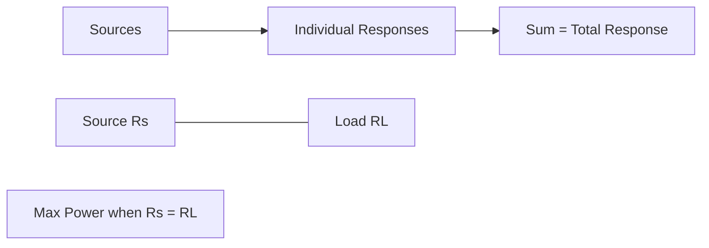
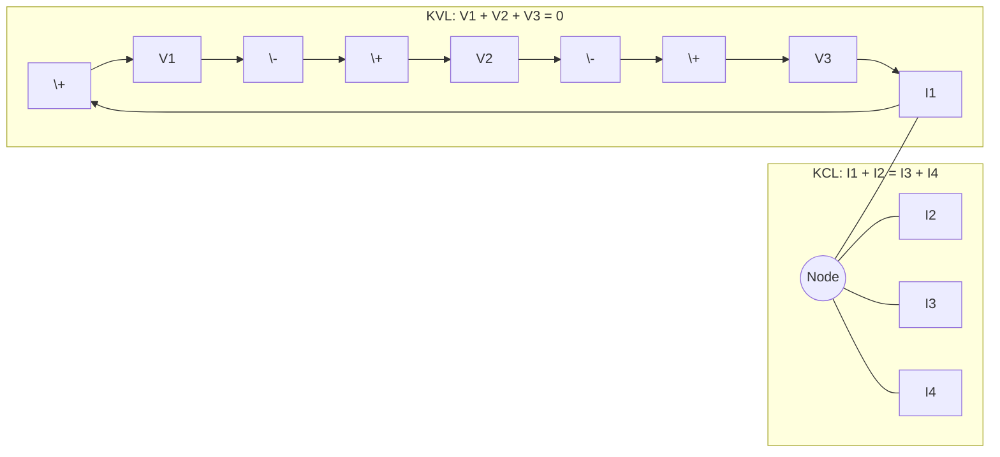
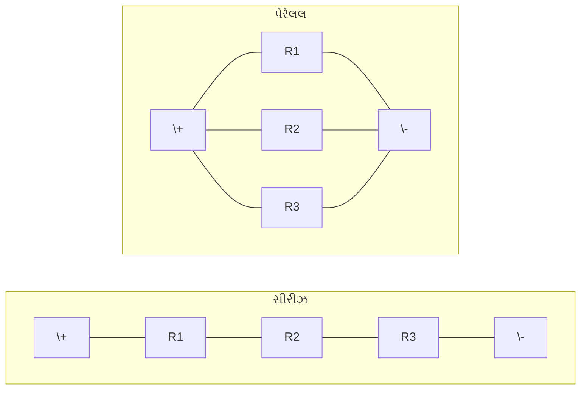
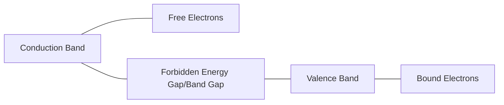
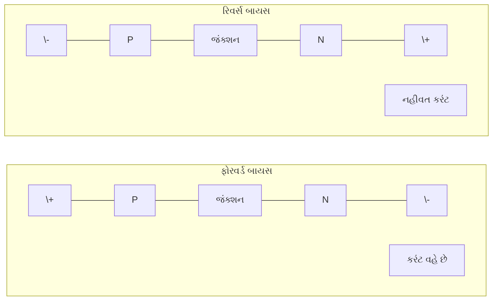
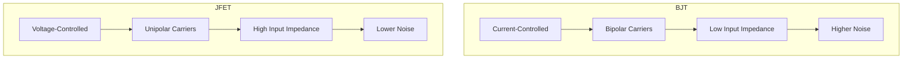
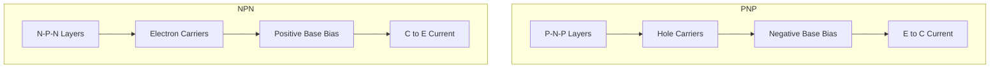

## Question 1(a) [3 marks]

**Define: 1. Node, 2. Loop, 3. Branch**

**Answer**:

| Term | Definition |
|------|------------|
| **Node** | A point in a circuit where two or more circuit elements meet or connect |
| **Loop** | A closed path in a circuit that starts and ends at the same point without passing through any node more than once |
| **Branch** | A path or element connecting two nodes in a circuit |

**Mnemonic:** "Never Loop Between" - Nodes Link, Loops Bound, Branches Establish connections

## Question 1(b) [4 marks]

**Write statement of Superposition theorem and Maximum power transfer theorem.**

**Answer**:

| Theorem | Statement |
|---------|-----------|
| **Superposition Theorem** | In a linear circuit with multiple sources, the response (voltage or current) in any element equals the algebraic sum of responses caused by each source acting alone, with all other sources replaced by their internal impedances |
| **Maximum Power Transfer Theorem** | Maximum power is transferred from source to load when the load resistance equals the source's internal resistance |

**Diagram:**



**Mnemonic:** "Sum Powers Matched" - Sum individual powers; Match resistance for maximum

## Question 1(c) [7 marks]

**Explain Kirchhoff's Voltage Law and Kirchhoff's current Law.**

**Answer**:

| Law | Explanation | Mathematical Form |
|-----|-------------|-------------------|
| **Kirchhoff's Voltage Law (KVL)** | The algebraic sum of all voltages around any closed loop in a circuit equals zero | Σ V = 0 |
| **Kirchhoff's Current Law (KCL)** | The algebraic sum of all currents entering and leaving a node equals zero | Σ I = 0 |

**Diagram:**



- **Physical interpretation of KVL**: Energy is conserved in a circuit loop
- **Physical interpretation of KCL**: Charge is conserved at circuit nodes
- **Application of KVL**: Finding unknown voltages in circuit loops
- **Application of KCL**: Finding unknown currents at circuit junctions

**Mnemonic:** "Voltages Loop to Zero, Currents Node to Zero"

## Question 1(c) OR [7 marks]

**Explain series and parallel connection of resistors with necessary equations.**

**Answer**:

| Connection | Characteristics | Equivalent Resistance | Current-Voltage Relationship |
|------------|----------------|----------------------|------------------------------|
| **Series Connection** | Same current flows through all resistors | Req = R1 + R2 + R3 + ... + Rn | I = V/Req |
| **Parallel Connection** | Same voltage appears across all resistors | 1/Req = 1/R1 + 1/R2 + 1/R3 + ... + 1/Rn | I = I1 + I2 + I3 + ... + In |

**Diagram:**



- **Current in series**: I = I1 = I2 = I3 = ... = In
- **Voltage in series**: V = V1 + V2 + V3 + ... + Vn
- **Current in parallel**: I = I1 + I2 + I3 + ... + In  
- **Voltage in parallel**: V = V1 = V2 = V3 = ... = Vn

**Mnemonic:** "Same Current Series, Same Voltage Parallel"

## Question 2(a) [3 marks]

**State limitations of Ohm's law.**

**Answer**:

| Limitations of Ohm's Law |
|--------------------------|
| **Non-linear components**: Does not apply to components like diodes, transistors |
| **Temperature changes**: Not valid when temperature varies significantly |
| **High frequencies**: Breaks down at very high frequencies |

**Mnemonic:** "Ohm's Not Linear Thermal High" - Non-linear, Temperature, High frequency

## Question 2(b) [4 marks]

**Define: 1. Doping, 2. Intrinsic Semiconductor, 3. Extrinsic Semiconductor, 4. Dopant**

**Answer**:

| Term | Definition |
|------|------------|
| **Doping** | Process of adding impurity atoms to pure semiconductor to modify electrical properties |
| **Intrinsic Semiconductor** | Pure semiconductor with equal number of electrons and holes |
| **Extrinsic Semiconductor** | Doped semiconductor with unequal number of electrons and holes |
| **Dopant** | Impurity element added to semiconductor during doping process |

**Mnemonic:** "Do In-Ex-Do" - Doping Introduces Extrinsic properties through Dopants

## Question 2(c) [7 marks]

**Define Trivalent material and give examples of it. Explain Formation of P-type Semiconductor with the help of proper diagram.**

**Answer**:

**Trivalent material**: Elements with 3 valence electrons in their outermost shell.

**Examples**: Boron (B), Aluminum (Al), Gallium (Ga), Indium (In)

**P-type Semiconductor Formation**:

**Diagram:**

```goat
          Silicon atom (4 valence e-)    Trivalent atom (3 valence e-)
             ┌───┐                          ┌───┐
             │   │                          │   │
          ┌──┤ Si├──┐                    ┌──┤ B ├──┐
          │  │   │  │                    │  │   │  │
       ───┼──┴───┴──┼───              ───┼──┴───┴──┼───
          │         │                    │         │
          │         │                    │    ↑    │
       ───┼─────────┼───              ───┼────┼────┼───
          │         │                    │    │    │
          │         │                    │    │    │
       ───┴─────────┴───              ───┴────┘────┴───
                                          hole
```

| Process | Result |
|---------|--------|
| **Doping** | Silicon doped with trivalent atoms like Boron |
| **Bond formation** | Trivalent atoms form 3 covalent bonds with 4 neighboring Silicon atoms |
| **Hole creation** | One bond remains incomplete, creating a hole (positive charge carrier) |
| **Majority carriers** | Holes become majority carriers |
| **Minority carriers** | Electrons become minority carriers |

**Mnemonic:** "Three Makes Positive" - Three valence electrons make a Positive hole

## Question 2(a) OR [3 marks]

**Enlist factors affecting Resistance and explain any one of them.**

**Answer**:

| Factors Affecting Resistance |
|------------------------------|
| **Length of conductor** |
| **Cross-sectional area** |
| **Material (resistivity)** |
| **Temperature** |

**Explanation of Temperature effect**:
The resistance of most metallic conductors increases with temperature as:
R = R₀[1 + α(T - T₀)]
where:

- R = Resistance at temperature T
- R₀ = Resistance at reference temperature T₀
- α = Temperature coefficient of resistance

**Mnemonic:** "LAMT" - Length, Area, Material, Temperature affect resistance

## Question 2(b) OR [4 marks]

**Define: 1. Valance band, 2. Conduction band, 3. Forbidden energy gap, 4. Free electron**

**Answer**:

| Term | Definition |
|------|------------|
| **Valence band** | Energy band filled with valence electrons that are bound to atoms |
| **Conduction band** | Higher energy band where electrons can move freely and conduct electricity |
| **Forbidden energy gap** | Energy range between valence and conduction bands where no electron states exist |
| **Free electron** | Electron that has gained enough energy to escape from valence band to conduction band |

**Diagram:**



**Mnemonic:** "Very Clearly Freedom Follows" - Valence, Conduction, Forbidden gap, Free electrons

## Question 2(c) OR [7 marks]

**Define Pentavalent material and give examples of it. Explain Formation of N-type material with the help of proper diagram.**

**Answer**:

**Pentavalent material**: Elements with 5 valence electrons in their outermost shell.

**Examples**: Phosphorus (P), Arsenic (As), Antimony (Sb)

**N-type Semiconductor Formation**:

**Diagram:**

```goat
          Silicon atom (4 valence e-)    Pentavalent atom (5 valence e-)
             ┌───┐                          ┌───┐
             │   │                          │   │
          ┌──┤ Si├──┐                    ┌──┤ P ├──┐
          │  │   │  │                    │  │   │  │
       ───┼──┴───┴──┼───              ───┼──┴───┴──┼───
          │         │                    │         │
          │         │                    │         │
       ───┼─────────┼───              ───┼─────────┼───
          │         │                    │    ↓    │
          │         │                    │    │    │
       ───┴─────────┴───              ───┴────┼────┴───
                                          free electron
```

| Process | Result |
|---------|--------|
| **Doping** | Silicon doped with pentavalent atoms like Phosphorus |
| **Bond formation** | Pentavalent atoms form 4 covalent bonds with 4 neighboring Silicon atoms |
| **Free electron** | Fifth valence electron remains free (negative charge carrier) |
| **Majority carriers** | Electrons become majority carriers |
| **Minority carriers** | Holes become minority carriers |

**Mnemonic:** "Five Makes Negative" - Five valence electrons make a Negative carrier

## Question 3(a) [3 marks]

**Define: 1. Depletion region, 2. Knee voltage, 3. Breakdown voltage in accordance of diode.**

**Answer**:

| Term | Definition |
|------|------------|
| **Depletion region** | Region at P-N junction devoid of mobile charge carriers due to diffusion and recombination |
| **Knee voltage** | Forward voltage at which current begins to increase rapidly (typically 0.7V for silicon, 0.3V for germanium) |
| **Breakdown voltage** | Reverse voltage at which diode rapidly conducts current in reverse direction |

**Mnemonic:** "Depleted Knees Break" - Depletion occurs, Knee begins conduction, Breakdown ends blocking

## Question 3(b) [4 marks]

**Explain V-I characteristics of P-N junction diode with necessary graph.**

**Answer**:

**V-I Characteristics of P-N Junction Diode**:

**Diagram:**

```goat
    I
    ↑                          
    │                        /
    │                      /
    │                    /
    │                  /
    │                /
    │              /
    │            /
    │          /
    │        /
    │      /
    │    /
    │ Knee voltage (≈0.7V)
    │  /
    │/
────┼────────────────────────── V
    │
    │
    │
    │
    │
    │          Breakdown
    │          voltage
    │         /
    │       /
    │     /
    │   /
    v
```

| Region | Behavior |
|--------|----------|
| **Forward Bias (V > 0)** | Current increases exponentially after knee voltage |
| **Reverse Bias (V < 0)** | Very small leakage current until breakdown voltage |
| **Breakdown Region** | Sharp increase in reverse current at breakdown voltage |

- **Forward equation**: I = Is(e^(qV/nkT) - 1)
- **Knee voltage**: ~0.7V for silicon, ~0.3V for germanium

**Mnemonic:** "Forward Flows, Reverse Restricts, Breakdown Bursts"

## Question 3(c) [7 marks]

**Draw characteristic of Varactor diode. Explain working of Varactor diode with diagram and write its application.**

**Answer**:

**Varactor Diode Characteristics**:

**Diagram:**

```goat
    C
    ↑                          
    │\
    │ \
    │  \
    │   \
    │    \
    │     \
    │      \
    │       \
    │        \
    │         \
    │          \
    │           \
    │            \
    │             \
    │              \
    │               \
────┼────────────────────────── VR
    │                            →
```

**Working of Varactor Diode**:

**Circuit Symbol:**

```goat
     │
    ┌┴┐
  ──┤ ├──
    └┬┘
     │
```

| Principle | Explanation |
|-----------|-------------|
| **Basic structure** | Special P-N junction diode optimized for variable capacitance |
| **Reverse bias operation** | Always operated in reverse bias condition |
| **Depletion region** | Width varies with applied reverse voltage |
| **Capacitance variation** | Capacitance decreases as reverse voltage increases |
| **Mathematical relation** | C ∝ 1/√VR where VR is reverse voltage |

**Applications of Varactor Diode**:

- Voltage-controlled oscillators (VCOs)
- Frequency modulators
- Electronic tuning circuits
- Automatic frequency control circuits
- Phase-locked loops (PLLs)

**Mnemonic:** "Capacitance Varies Reversely" - Capacitance Varies with Reverse voltage

## Question 3(a) OR [3 marks]

**Write application of following diode: 1. Varactor diode, 2. Photo diode, 3. Light Emitting Diode**

**Answer**:

| Diode Type | Applications |
|------------|--------------|
| **Varactor Diode** | Voltage-controlled oscillators, Frequency modulators, Electronic tuning circuits |
| **Photo Diode** | Light sensors, Optical communication, Smoke detectors, Camera light meters |
| **Light Emitting Diode (LED)** | Display devices, Indicators, Lighting systems, Optical communication |

**Mnemonic:** "Vary Photo Emit" - Varactor varies frequency, Photo detects light, LED emits light

## Question 3(b) OR [4 marks]

**Explain working of P-N junction diode in forward bias and reverse bias.**

**Answer**:

| Bias Condition | Working Principle | Characteristics |
|----------------|-------------------|----------------|
| **Forward Bias** | P-side connected to positive terminal, N-side to negative terminal | Depletion region narrows, current flows easily after knee voltage (~0.7V) |
| **Reverse Bias** | P-side connected to negative terminal, N-side to positive terminal | Depletion region widens, only small leakage current flows until breakdown |

**Diagram:**



**Mnemonic:** "Forward Flows, Reverse Resists"

## Question 3(c) OR [7 marks]

**Draw characteristic of Photo diode. Explain working of Photo diode with diagram and write its application.**

**Answer**:

**Photo Diode Characteristics**:

**Diagram:**

```goat
     I
     ↑
     │                     Light intensity
     │                     increasing
     │                /
     │              /
     │            /
     │          /
     │        /
     │      /
     │    /
     │  /
     │/
─────┼─────────────────────────── V
     │\                           →
     │ \
     │  \
     │   \
     │    \
     │     \
     │
     v
```

**Working of Photo Diode**:

**Circuit Symbol:**

```goat
     │   ↙↙
    ┌┴┐ ↙
  ──┤ ├──
    └┬┘
     │
```

| Principle | Explanation |
|-----------|-------------|
| **Basic structure** | P-N junction diode with transparent window or lens |
| **Reverse bias operation** | Typically operated in reverse bias condition |
| **Light absorption** | Photons create electron-hole pairs in depletion region |
| **Carrier generation** | Light intensity proportional to generated carriers |
| **Current generation** | Reverse current increases with light intensity |

**Applications of Photo Diode**:

- Light detectors in optical communication
- Photometers and light meters
- Smoke detectors
- Barcode readers
- Medical equipment (pulse oximeters)

**Mnemonic:** "Light In, Current Out" - Light intensity controls current output

## Question 4(a) [3 marks]

**Explain working of Half wave rectifier with circuit diagram.**

**Answer**:

**Half Wave Rectifier**:

**Circuit Diagram:**

```goat
           D
    AC    ┌─┬─┐     R    
    o─────┤>├─┼─────┳─────o
          └─┘ │     │     
              │     │     
    o─────────┘     ┗─────o
                      Output
```

| Operation Phase | Description |
|-----------------|-------------|
| **Positive Half Cycle** | Diode conducts, current flows through load, output follows input |
| **Negative Half Cycle** | Diode blocks, no current flows, output is zero |

- **Output frequency**: Same as input frequency
- **Form factor**: 1.57
- **Ripple factor**: 1.21
- **Efficiency**: 40.6%
- **PIV of diode**: Vmax

**Mnemonic:** "Half Passes Positive" - Only positive half-cycle passes through

## Question 4(b) [4 marks]

**Explain Zener diode as a voltage regulator.**

**Answer**:

**Zener Diode Voltage Regulator**:

**Circuit Diagram:**

```goat
           Rs             
    o─────┳─────┐           
    Vin   │     │     
          │     │   Zener   RL    Vout
          │     ├──┐┌┬┐┌───┳─────o
          │     │  ││>││   │     
          │     │  │└┬┘│   │     
    o─────┴─────┴──┴─┴─┴───┴─────o
                      
```

| Component | Function |
|-----------|----------|
| **Series resistor Rs** | Limits current and drops excess voltage |
| **Zener diode** | Maintains constant voltage across load |
| **Load resistor RL** | Represents the circuit being powered |

**Working Principle**:

- Zener operates in reverse breakdown region
- Maintains constant voltage regardless of input changes
- Excess current flows through Zener diode
- Voltage regulation equation: Vout = Vz (Zener voltage)

**Mnemonic:** "Zener Zeros Voltage Variations"

## Question 4(c) [7 marks]

**Write need of Rectifier. Explain Bridge wave rectifier with circuit diagram and draw its input and output waveform.**

**Answer**:

**Need of Rectifier**:

- To convert AC voltage to DC voltage
- Most electronic devices require DC for operation
- Power supply systems need DC output from AC mains

**Bridge Wave Rectifier**:

**Circuit Diagram:**

```goat
                 D1      D3
              ┌─┬─┐    ┌─┬─┐
              │>├─┼────┤<├─┐
              └─┘ │    └─┘ │
    AC            │         RL   Output
    o─────────────┼────────┳────o
                  │        │
             ┌─┬─┐│    ┌─┬─┐
             │<├─┼────┤>├─┘
             └─┘      └─┘
                D2      D4
```

**Input and Output Waveform**:

```goat
    Input
      ↑
      │    /\      /\      /\
      │   /  \    /  \    /  \
      │  /    \  /    \  /    \
    ──┼─┼──────┼┼──────┼┼──────┼──────► t
      │ │\    /││\    /││\    /│
      │ │ \  / ││ \  / ││ \  / │
      │ │  \/  ││  \/  ││  \/  │
      v
    
    Output
      ↑
      │    /\      /\      /\
      │   /  \    /  \    /  \
      │  /    \  /    \  /    \
    ──┼─┼──────┼┼──────┼┼──────┼──────► t
      │
      │
      v
```

| Working in Positive Half Cycle | Working in Negative Half Cycle |
|--------------------------------|--------------------------------|
| D1 and D4 conduct | D2 and D3 conduct |
| Current flows through load in same direction | Current flows through load in same direction |

- **Output frequency**: Twice the input frequency
- **Form factor**: 1.11
- **Ripple factor**: 0.48
- **Efficiency**: 81.2%
- **PIV of diode**: Vmax

**Mnemonic:** "Bridge Both Better" - Bridge rectifier uses both half cycles

## Question 4(a) OR [3 marks]

**Explain working of Shunt capacitor filter.**

**Answer**:

**Shunt Capacitor Filter**:

**Circuit Diagram:**

```goat
                  D
               ┌─┬─┐
               │>├─┐
               └─┘ │
    AC             │       C    RL    
    o──────────────┼───────┳────┳────o
                   │       │    │   Output
                   │       │    │
    o──────────────┴───────┴────┴────o
```

| Operation | Description |
|-----------|-------------|
| **Charging** | Capacitor charges during peak of rectified output |
| **Discharging** | Capacitor discharges slowly through load when voltage drops |
| **Smoothing effect** | Provides almost constant DC output by filling gaps |

- **Ripple reduction**: Significant reduction in ripple voltage
- **Time constant**: RC must be much larger than period of input
- **Discharge equation**: V = V₀e^(-t/RC)

**Mnemonic:** "Capacitor Catches Peaks" - Capacitor stores peak voltage

## Question 4(b) OR [4 marks]

**Compare Center tap full wave rectifier and Bridge wave rectifier**

**Answer**:

| Parameter | Center Tap Full Wave Rectifier | Bridge Wave Rectifier |
|-----------|--------------------------------|------------------------|
| **Number of diodes** | 2 | 4 |
| **Transformer** | Center-tapped transformer required | Simple transformer sufficient |
| **PIV of diode** | 2Vmax | Vmax |
| **Efficiency** | 81.2% | 81.2% |
| **Output frequency** | Twice input frequency | Twice input frequency |
| **Cost** | Higher due to center-tapped transformer | Lower, simpler transformer but more diodes |
| **Size** | Larger | Smaller |

**Mnemonic:** "Center Taps Transformer, Bridge Bypasses Tapping"

## Question 4(c) OR [7 marks]

**Write need of Filter circuit in rectifier. Explain π filter with circuit diagram and draw its input and output waveform.**

**Answer**:

**Need of Filter Circuit in Rectifier**:

- Reduces ripple in rectified output
- Provides steady DC voltage required by electronic circuits
- Improves efficiency of power supply
- Prevents damage to sensitive electronic components

**π Filter**:

**Circuit Diagram:**

```goat
                  D
               ┌─┬─┐      L
               │>├─┼──────┳──────┐
               └─┘ │      │      │
    AC             │      │      │
    o──────────────┼──────┘      │
                   │             │
                   │  C1    C2   │  RL    
    o──────────────┴───┳────┳────┴───┳────o
                       │    │        │   Output
                       │    │        │
                       ┴────┴────────┴────o
```

**Input and Output Waveform**:

```goat
    Input (Rectified)
      ↑
      │    /\      /\      /\
      │   /  \    /  \    /  \
      │  /    \  /    \  /    \
    ──┼─┼──────┼┼──────┼┼──────┼──────► t
      │
      │
      v
    
    Output
      ↑
      │─────────────────────────────
      │
      │
    ──┼─────────────────────────────► t
      │
      │
      v
```

| Component | Function |
|-----------|----------|
| **Input capacitor (C1)** | Initial filtering of rectified output |
| **Choke (L)** | Blocks AC ripple and allows DC to pass |
| **Output capacitor (C2)** | Further filtering for smoother output |

- **Superior filtering**: Better ripple reduction than simple capacitor filter
- **Ripple factor**: Much lower than capacitor filter alone
- **Voltage regulation**: Better voltage regulation under load variations

**Mnemonic:** "Capacitor-Inductor-Capacitor Perfectly Irons" (π shape resembling CIC filter)

## Question 5(a) [3 marks]

**Explain Working of PNP Transistor with the necessary diagram.**

**Answer**:

**PNP Transistor Working**:

**Diagram:**

```goat
              Collector
                  ↑
                  │
                  P
              ┌───┴───┐
    Base →    │       │
              N       │
              │       │
              P       │
                  │
                  ↓
              Emitter
```

| Biasing | Working |
|---------|---------|
| **Base-Emitter junction** | Forward biased |
| **Base-Collector junction** | Reverse biased |
| **Majority carriers** | Holes |
| **Current flow** | Emitter to Collector |

- **Emitter**: Heavily doped P-region that emits holes
- **Base**: Thin, lightly doped N-region that controls current flow
- **Collector**: Moderately doped P-region that collects holes

**Mnemonic:** "Positive-Negative-Positive" - PNP structure

## Question 5(b) [4 marks]

**Explain working of N-channel JFET with diagram.**

**Answer**:

**N-channel JFET Working**:

**Diagram:**

```goat
                  Drain
                    ↑
                    │
           ┌────────┴────────┐
           │                 │
    Gate →  P               P  ← Gate
           │                 │
           │        N        │
           │                 │
           └────────┬────────┘
                    │
                    ↓
                  Source
```

| Terminal | Function |
|----------|----------|
| **Source** | Source of charge carriers (electrons) |
| **Drain** | Collects charge carriers |
| **Gate** | Controls width of the channel |

**Working Principle**:

- Channel formed by N-type material between source and drain
- P-type gate regions form PN junctions with channel
- Gate-to-source junction always reverse biased
- Increasing negative gate voltage widens depletion region
- Narrower channel increases resistance between source and drain
- FET operates as voltage-controlled resistor

**Mnemonic:** "Negative Channel Junction Effect" - N-channel JFET

## Question 5(c) [7 marks]

**Compare BJT and JFET**

**Answer**:

| Parameter | BJT (Bipolar Junction Transistor) | JFET (Junction Field Effect Transistor) |
|-----------|-----------------------------------|-----------------------------------------|
| **Structure** | Three-layer structure (NPN or PNP) | Single channel with gate junctions |
| **Control mechanism** | Current-controlled device | Voltage-controlled device |
| **Carriers** | Both majority and minority carriers (bipolar) | Only majority carriers (unipolar) |
| **Input impedance** | Low to medium (1-10 kΩ) | Very high (10⁸-10¹² Ω) |
| **Noise** | Higher noise | Lower noise |
| **Power consumption** | Higher | Lower |
| **Switching speed** | Slower due to charge storage | Faster due to absence of charge storage |
| **Temperature stability** | Less stable | More stable |

**Diagram:**



**Mnemonic:** "Current Bipolar Low, Voltage Unipolar High" - BJT vs JFET key differences

## Question 5(a) OR [3 marks]

**Enlist methods to dispose E-waste and explain any one method of them.**

**Answer**:

| E-waste Disposal Methods |
|--------------------------|
| **Recycling** |
| **Reuse** |
| **Incineration** |
| **Landfilling** |
| **Take-back systems** |

**Explanation of Recycling**:
E-waste recycling involves collecting, dismantling, and separating electronic waste into recoverable materials. Components are shredded and sorted into raw materials like plastic, glass, and metals (including precious metals like gold, silver, copper). These materials are then processed and can be used to manufacture new products. Recycling reduces environmental impact, conserves resources, and recovers valuable materials.

**Mnemonic:** "RRIL-T" - Recycling, Reuse, Incineration, Landfill, Take-back

## Question 5(b) OR [4 marks]

**Compare PNP and NPN Transistor.**

**Answer**:

| Parameter | PNP Transistor | NPN Transistor |
|-----------|---------------|----------------|
| **Symbol** | Arrow points inward to base | Arrow points outward from base |
| **Structure** | P-type, N-type, P-type layers | N-type, P-type, N-type layers |
| **Majority carriers** | Holes | Electrons |
| **Biasing voltage** | Base negative with respect to emitter | Base positive with respect to emitter |
| **Current direction** | Emitter to collector | Collector to emitter |
| **Speed** | Slower (holes mobility is less) | Faster (electrons mobility is more) |

**Diagram:**



**Mnemonic:** "Positive-Negative-Positive (Holes), Negative-Positive-Negative (Electrons)"

## Question 5(c) OR [7 marks]

**Draw and explain Input and Output Characteristics of CE configuration.**

**Answer**:

**Input Characteristics of CE Configuration**:

**Diagram:**

```goat
   Ib(μA)
    ↑                          
    │                       VCE=10V
    │                     /
    │                   /
    │                 / VCE=5V
    │               /
    │             /
    │           / VCE=0V
    │         /
    │       /
    │     /
    │   /
    │ /
    │/
────┼───────────────────────── VBE(V)
    │                           →
```

**Output Characteristics of CE Configuration**:

**Diagram:**

```goat
    Ic(mA)
    ↑                          
    │                  Ib=50μA
    │                /─────────────
    │               /
    │              / Ib=40μA
    │             /─────────────
    │            /
    │           / Ib=30μA
    │          /─────────────
    │         /
    │        / Ib=20μA
    │       /─────────────
    │      /
    │     / Ib=10μA
    │    /─────────────
    │   /
    │  / Ib=0
    │ /
    │/
────┼───────────────────────── VCE(V)
    │                           →
    │
    │ Active    |  Saturation
    │ Region    |  Region
    v           v
```

| Characteristic | Description |
|----------------|-------------|
| **Input Characteristics** | Relationship between base current (IB) and base-emitter voltage (VBE) at constant collector-emitter voltage (VCE) |
| **Output Characteristics** | Relationship between collector current (IC) and collector-emitter voltage (VCE) at constant base current (IB) |

**Regions in Output Characteristics**:

| Region | Description |
|--------|-------------|
| **Saturation Region** | Both junctions forward biased, VCE is small, IC is almost constant regardless of VCE |
| **Active Region** | Base-emitter junction forward biased, base-collector junction reverse biased, IC proportional to IB |
| **Cutoff Region** | Both junctions reverse biased, negligible current flows |

**Important Parameters**:

- **Current gain (β)**: Ratio of collector current to base current (IC/IB)
- **Input resistance**: Ratio of change in VBE to change in IB at constant VCE
- **Output resistance**: Ratio of change in VCE to change in IC at constant IB

**Mnemonic:** "Input Shows Voltage Effects, Output Shows Current Control"
