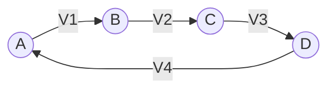
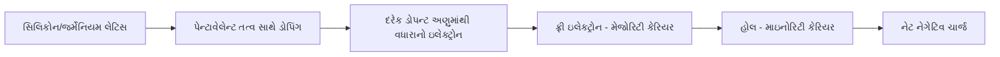
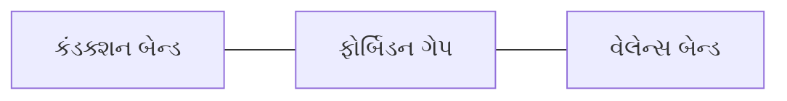
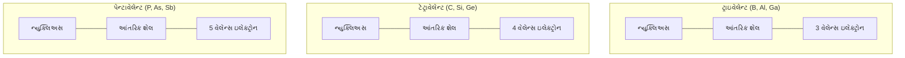
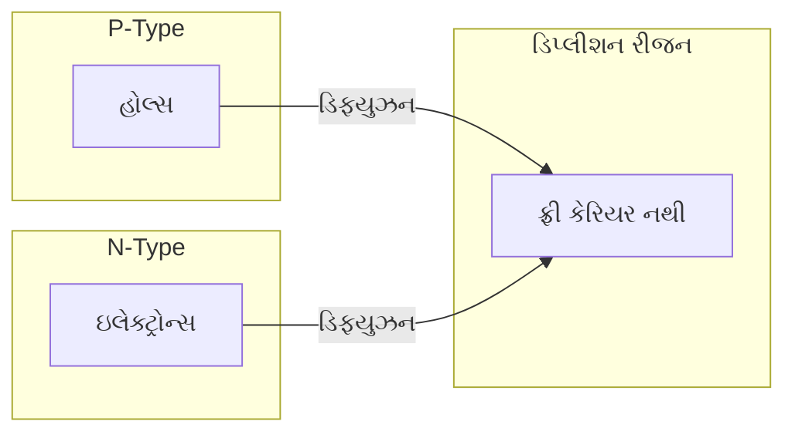
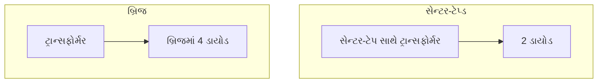
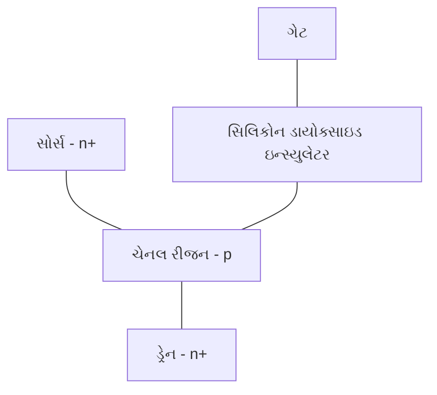
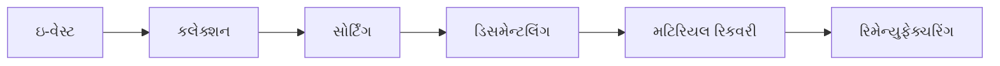

## પ્રશ્ન 1(અ) [3 ગુણ]

**એક્ટિવ અને પેસિવ નેટવર્કનો તફાવત સમજાવો.**

**ઉત્તર**:

| **એક્ટિવ નેટવર્ક** | **પેસિવ નેટવર્ક** |
|-------------------|---------------------|
| ઓછામાં ઓછા એક ઊર્જા સ્ત્રોત ધરાવે છે | કોઈ ઊર્જા સ્ત્રોત ધરાવતું નથી |
| અન્ય તત્વોને પાવર આપી શકે છે | અન્ય તત્વોને પાવર આપી શકતું નથી |
| ઉદાહરણ: ટ્રાન્ઝિસ્ટર, ઑપ-એમ્પ, બેટરી | ઉદાહરણ: રેઝિસ્ટર, કેપેસિટર, ઇન્ડક્ટર |

**મેમરી ટ્રીક:** "એક્ટિવ એડસ પાવર, પેસિવ પુલસ પાવર"

## પ્રશ્ન 1(બ) [4 ગુણ]

**કિર્ચોફનો વોલ્ટેજનો નિયમ જણાવો અને સમજાવો.**

**ઉત્તર**:

**કિર્ચોફનો વોલ્ટેજનો નિયમ (KVL)**: સર્કિટમાં કોઈપણ બંધ પથ (લૂપ) ની આસપાસના તમામ વોલ્ટેજનો બીજગણિતીય સરવાળો શૂન્ય હોય છે.

**આકૃતિ:**



**ગણિતીય સ્વરૂપ**: V₁ + V₂ + V₃ + V₄ = 0

- **સર્કિટ એપ્લિકેશન**: જ્યારે એક લૂપની આસપાસ ફરતી વખતે, વોલ્ટેજમાં વધારો (બેટરી) ધન અને વોલ્ટેજમાં ઘટાડો (ઘટકો) ઋણ હોય છે
- **ભૌતિક અર્થ**: બંધ લૂપમાં કુલ ઊર્જા સંરક્ષિત રહે છે

**મેમરી ટ્રીક:** "વોલ્ટેજ લૂપ સમ ઝીરો"

## પ્રશ્ન 1(ક) [7 ગુણ]

**નીચેના પદોની વ્યાખ્યા આપો: (1) ચાર્જ (2) કરંટ (3) પોટેન્શિયલ (4) E.M.F. (5) ઇન્ડક્ટન્સ (6) કેપેસિટન્સ (7) આવૃત્તિ.**

**ઉત્તર**:

| **પદ** | **વ્યાખ્યા** |
|----------|----------------|
| **ચાર્જ** | મૂળભૂત વિદ્યુત માત્રા જે કૂલોમ્બ (C)માં માપવામાં આવે છે; ઇલેક્ટ્રોનોનો પ્રવાહ વીજળી બનાવે છે |
| **કરંટ** | વિદ્યુત ચાર્જનો પ્રવાહ દર, એમ્પિયર (A)માં માપવામાં આવે છે; I = dQ/dt |
| **પોટેન્શિયલ** | એકમ ચાર્જ દીઠ વિદ્યુત પોટેન્શિયલ ઊર્જા, વોલ્ટ (V)માં માપવામાં આવે છે |
| **E.M.F.** | ઇલેક્ટ્રો મોટિવ ફોર્સ, સ્ત્રોત દ્વારા એકમ ચાર્જ દીઠ પૂરી પાડવામાં આવતી ઊર્જા, વોલ્ટ (V)માં |
| **ઇન્ડક્ટન્સ** | કરંટમાં ફેરફારનો વિરોધ કરવાની વાહકની ક્ષમતા, હેનરી (H)માં માપવામાં આવે છે |
| **કેપેસિટન્સ** | વિદ્યુત ચાર્જ સંગ્રહ કરવાની ઘટકની ક્ષમતા, ફેરડ (F)માં માપવામાં આવે છે |
| **આવૃત્તિ** | એક અલ્ટરનેટિંગ રાશિના એક સેકંડમાં થતા ચક્રોની સંખ્યા, હર્ટ્ઝ (Hz)માં |

**મેમરી ટ્રીક:** "ચાર્જના કરંટને પોટેન્શિયલ EMF ઇન્ડક્ટન્સ કેપેસિટન્સથી આવૃત્તિમાં ફેરવાય છે"

## પ્રશ્ન 1(ક) OR [7 ગુણ]

**ઓહમનો નિયમ જણાવો. તેના ઉપયોગો અને મર્યાદા લખો.**

**ઉત્તર**:

**ઓહમનો નિયમ**: વાહક વડે પસાર થતો કરંટ, તેના છેડા વચ્ચેના પોટેન્શિયલ ડિફરન્સના સમપ્રમાણમાં અને તેના રેઝિસ્ટન્સના વ્યસ્ત પ્રમાણમાં હોય છે.

**ગણિતીય સ્વરૂપ**: I = V/R

**આકૃતિ:**

```goat
            +
            |
            V
            |
  A---------/\/\/\---------B
            R
            |
            |
            -
```

**ઓહમના નિયમના ઉપયોગો**:

- સર્કિટમાં કરંટ, વોલ્ટેજ, રેઝિસ્ટન્સની ગણતરી
- વિદ્યુત નેટવર્કની ડિઝાઇન
- પાવર ગણતરી (P = VI = I²R = V²/R)
- વોલ્ટેજ ડિવિઝન અને કરંટ ડિવિઝન

**ઓહમના નિયમની મર્યાદાઓ**:

- નોન-લિનિયર ઘટકો (ડાયોડ, ટ્રાન્ઝિસ્ટર) માટે માન્ય નથી
- ખૂબ ઉચ્ચ આવૃત્તિઓ પર લાગુ પડતો નથી
- અર્ધવાહકો જેવા બિન-ધાતુના વાહકો માટે લાગુ પડતો નથી
- વેક્યુમ ટ્યુબ અને વાયુ ઉપકરણો માટે લાગુ પડતો નથી

**મેમરી ટ્રીક:** "વોલ્ટેજ ડ્રાઇવ્સ, રેઝિસ્ટન્સ રિસ્ટ્રિક્ટ્સ"

## પ્રશ્ન 2(અ) [3 ગુણ]

**વાહક, અવાહક અને અર્ધવાહક નો એનર્જી બેન્ડ ની આકૃતિ દોરી સમજાવો.**

**ઉત્તર**:

**એનર્જી બેન્ડ આરેખ**:


- **વાહક**: વેલેન્સ અને કન્ડકશન બેન્ડ ઓવરલેપ થાય છે, જે ઇલેક્ટ્રોનને સરળતાથી વહેવા દે છે
- **અર્ધવાહક**: બેન્ડ વચ્ચે નાનું એનર્જી ગેપ (~1eV), ઇલેક્ટ્રોન થર્મલ એનર્જી સાથે જંપ કરી શકે છે
- **અવાહક**: મોટું એનર્જી ગેપ (>5eV) બેન્ડ વચ્ચે ઇલેક્ટ્રોન મૂવમેન્ટને અટકાવે છે

**મેમરી ટ્રીક:** "વાહક વહાવે, અર્ધવાહક અમુક વખત, અવાહક અટકાવે"

## પ્રશ્ન 2(બ) [4 ગુણ]

**Maximum power transfer theorem અને reciprocity theorem નું સ્ટેટમેન્ટ લખો.**

**ઉત્તર**:

| **થિયરમ** | **સ્ટેટમેન્ટ** |
|-------------|---------------|
| **Maximum Power Transfer Theorem** | સ્ત્રોતમાંથી લોડમાં મહત્તમ પાવર ત્યારે ટ્રાન્સફર થાય જ્યારે લોડ રેઝિસ્ટન્સ સ્ત્રોતના આંતરિક રેઝિસ્ટન્સ જેટલો હોય (RL = RS) |
| **Reciprocity Theorem** | એક લિનિયર પેસિવ નેટવર્કમાં એક સિંગલ સ્ત્રોત સાથે, જો સ્ત્રોત પોઝિશન Aથી Bમાં ખસેડવામાં આવે, તો Bમાં સ્ત્રોત હોય ત્યારે Aમાં જે કરંટ મળે તે Aમાં સ્ત્રોત હોય ત્યારે Bમાં મળતા કરંટ જેટલો જ હશે |

**આકૃતિ:**

```goat
Maximum Power Transfer:
        +---[Source]---+
        |              |
        R(source)      R(load)
        |              |
        +------+-------+
```

**મેમરી ટ્રીક:** "મેચ રેઝિસ્ટન્સ ટુ મેક્સિમાઇઝ પાવર; સ્વિચ સોર્સ એન્ડ સિંક, કરંટ સ્ટેઝ સેમ"

## પ્રશ્ન 2(ક) [7 ગુણ]

**N-type મટીરીઅલ ની રચના અને તેનું કંડક્શન સમજાવો.**

**ઉત્તર**:

**N-type અર્ધવાહક રચના**:



- **ડોપિંગ પ્રક્રિયા**: સિલિકોન/જર્મેનિયમ (4 વેલેન્સ e⁻) પેન્ટાવેલેન્ટ તત્વો (P, As, Sb) સાથે ડોપ કરવામાં આવે છે
- **વધારાનો ઇલેક્ટ્રોન**: કોવેલન્ટ બોન્ડિંગ પછી દરેક ડોપન્ટ અણુ 1 વધારાનો ઇલેક્ટ્રોન આપે છે
- **કન્ડક્શન મેકેનિઝમ**: 
  - **મેજોરિટી કેરિયર**: ફ્રી ઇલેક્ટ્રોન (નેગેટિવ ચાર્જ કેરિયર)
  - **માઇનોરિટી કેરિયર**: હોલ (ખૂબ ઓછા)
- **વિદ્યુત ગુણધર્મો**: વધેલી વાહકતા અને નેગેટિવ ચાર્જ કેરિયર

**મેમરી ટ્રીક:** "પેન્ટાવેલેન્ટ પ્રોવાઇડ્સ પ્લસ વન ઇલેક્ટ્રોન, નેગેટિવ-ટાઇપ"

## પ્રશ્ન 2(અ) OR [3 ગુણ]

**વેલેન્સ બેન્ડ, કંડક્શન બેન્ડ અને ફોર્બિડન ગેપ ની વ્યાખ્યા આપો.**

**ઉત્તર**:

| **પદ** | **વ્યાખ્યા** |
|----------|----------------|
| **વેલેન્સ બેન્ડ** | ઇલેક્ટ્રોનથી ભરેલી સૌથી ઉચ્ચ ઊર્જા બેન્ડ, જ્યાં ઇલેક્ટ્રોન અણુઓ સાથે બંધાયેલા હોય છે |
| **કંડક્શન બેન્ડ** | વેલેન્સ બેન્ડની ઉપરની બેન્ડ જ્યાં ઇલેક્ટ્રોન મુક્તપણે ફરે છે અને વિદ્યુત વાહકતામાં યોગદાન આપે છે |
| **ફોર્બિડન ગેપ** | વેલેન્સ અને કંડક્શન બેન્ડ વચ્ચેની ઊર્જા શ્રેણી જ્યાં કોઈ ઇલેક્ટ્રોન સ્ટેટ્સ હોતા નથી |

**આકૃતિ:**



**મેમરી ટ્રીક:** "વેલેન્સ હોલ્ડ્સ, ફોર્બિડન બ્લોક્સ, કંડક્શન ફ્લોઝ"

## પ્રશ્ન 2(બ) OR [4 ગુણ]

**એક્ટીવ પાવર, રિએક્ટીવ પાવર અને પાવર ફેક્ટર ની વ્યાખ્યા આપો અને પાવર ત્રિકોણ દોરો.**

**ઉત્તર**:

**AC સર્કિટમાં પાવર સંબંધિત પદો**:

| **પદ** | **વ્યાખ્યા** |
|----------|----------------|
| **એક્ટિવ પાવર (P)** | વાસ્તવિક વપરાયેલી પાવર, વોટ (W)માં માપવામાં આવે છે; P = VI cosθ |
| **રિએક્ટિવ પાવર (Q)** | સ્ત્રોત અને લોડ વચ્ચે આગળ-પાછળ થતી પાવર, VAR માં માપવામાં આવે છે; Q = VI sinθ |
| **પાવર ફેક્ટર (PF)** | એક્ટિવ પાવરનો એપરન્ટ પાવર સાથેનો ગુણોત્તર; PF = cosθ |

**પાવર ત્રિકોણ:**

```goat
                S (VA)
               /|
              / |
             /  |
            /   |
           /θ   |
          /_____|
         P(W)   Q(VAR)
```

- **એપરન્ટ પાવર (S)**: એક્ટિવ અને રિએક્ટિવ પાવરનો વેક્ટર સરવાળો
- **પાવર ત્રિકોણ**: P, Q, અને S ને બાજુઓ તરીકે ધરાવતો કાટખૂણિયો ત્રિકોણ
- **પાવર ફેક્ટર**: cos θ = P/S (0 થી 1)

**મેમરી ટ્રીક:** "એક્ટિવ પાવર વર્ક્સ, રિએક્ટિવ પાવર વેઇટ્સ"

## પ્રશ્ન 2(ક) OR [7 ગુણ]

**ટ્રાઇવેલેન્ટ, ટેટ્રાવેલેન્ટ અને પેન્ટાવેલેન્ટ તત્વોના અણુની રચના સમજાવો.**

**ઉત્તર**:

**અણુ રચના:**

| **તત્વનો પ્રકાર** | **વેલેન્સ ઇલેક્ટ્રોન** | **ઉદાહરણ** | **ઇલેક્ટ્રોનિક કોન્ફિગરેશન** |
|------------------|----------------------|--------------|-------------------------------|
| **ટ્રાઇવેલેન્ટ** | 3 | બોરોન, એલ્યુમિનિયમ, ગેલિયમ | સૌથી બહારના શેલમાં 3 ઇલેક્ટ્રોન |
| **ટેટ્રાવેલેન્ટ** | 4 | કાર્બન, સિલિકોન, જર્મેનિયમ | સૌથી બહારના શેલમાં 4 ઇલેક્ટ્રોન |
| **પેન્ટાવેલેન્ટ** | 5 | નાઇટ્રોજન, ફોસ્ફરસ, આર્સેનિક | સૌથી બહારના શેલમાં 5 ઇલેક્ટ્રોન |

**આકૃતિ:**



- **ટ્રાઇવેલેન્ટ તત્વો**: અર્ધવાહકોમાં p-ટાઇપ ડોપન્ટ્સ તરીકે વપરાય છે
- **ટેટ્રાવેલેન્ટ તત્વો**: અર્ધવાહક બેઝ મટિરિયલ્સ બનાવે છે
- **પેન્ટાવેલેન્ટ તત્વો**: અર્ધવાહકોમાં n-ટાઇપ ડોપન્ટ્સ તરીકે વપરાય છે

**મેમરી ટ્રીક:** "ત્રણ ત્રાય બોન્ડિંગ, ચાર ફોર્મ્સ ફુલ બોન્ડ્સ, પાંચ ફ્રી એક ઇલેક્ટ્રોન"

## પ્રશ્ન 3(અ) [3 ગુણ]

**ફોટોડીઓડનું પ્રતીક દોરો અને તેનો ઉપયોગ જણાવો.**

**ઉત્તર**:

**ફોટોડાયોડ પ્રતીક:**

```goat
    --------|>|--------
             |
            / \
           /   \
```

**ફોટોડાયોડના ઉપયોગો:**

- લાઇટ સેન્સર અને ડિટેક્ટર
- ઓપ્ટિકલ કોમ્યુનિકેશન સિસ્ટમ્સ
- કેમેરા એક્સપોઝર કંટ્રોલ
- બારકોડ સ્કેનર
- મેડિકલ ઇન્સ્ટ્રુમેન્ટ્સ
- સોલાર સેલ

**મેમરી ટ્રીક:** "ફોટોન્સ પ્રોડ્યુસ કરંટ"

## પ્રશ્ન 3(બ) [4 ગુણ]

**LED પર ટૂંકી નોંધ લખો.**

**ઉત્તર**:

**LED (લાઇટ એમિટિંગ ડાયોડ)**:

| **પેરામીટર** | **વર્ણન** |
|---------------|-----------------|
| **બંધારણ** | વિશેષ ડોપિંગ મટિરિયલ્સ સાથે p-n જંક્શન |
| **કાર્યપદ્ધતિ** | ઇલેક્ટ્રોન હોલ્સ સાથે રિકોમ્બાઇન થઈને ફોટોન્સ રૂપે ઊર્જા છોડે છે |
| **મટિરિયલ્સ** | GaAs (લાલ), GaP (લીલો), GaN (વાદળી), વગેરે |
| **વોલ્ટેજ** | ફોરવર્ડ વોલ્ટેજ સામાન્ય રીતે 1.8V થી 3.3V (રંગ પર આધારિત) |

**ફાયદાઓ**:

- ઉચ્ચ કાર્યક્ષમતા (ઓછી પાવર વપરાશ)
- લાંબી લાઇફ (50,000+ કલાક)
- નાનું કદ અને મજબૂતાઈ
- વિવિધ રંગો ઉપલબ્ધ

**ઉપયોગો**:

- ઇન્ડિકેટર અને ડિસ્પ્લે
- લાઇટિંગ સિસ્ટમ્સ
- TV/મોનિટર બેકલાઇટ્સ
- ટ્રાફિક સિગ્નલ

**મેમરી ટ્રીક:** "લાઇટ એમિટ્સ વ્હેન ડાયોડ કન્ડક્ટ્સ"

## પ્રશ્ન 3(ક) [7 ગુણ]

**PN જંક્શન ડાયોડની લાક્ષણિકતા દોરીને સમજાવો.**

**ઉત્તર**:

**P-N જંક્શન ડાયોડની V-I લાક્ષણિકતા:**

```goat
                        |
                        |         /
                        |        /
                        |       /
                        |      /
                        |     /
                        |    /
-----------+------------+---+----------
           |            |  /|
           |            | / |
           |            |/  |
           |            |   |
           |            |   |
           +            +   +
       Reverse       Origin Forward
       Region               Region
       
```

**ફોરવર્ડ બાયસ રીજન:**

- **ની વોલ્ટેજ**: 0.3V (Ge), 0.7V (Si) જ્યાં કરંટ વહેવાનું શરૂ થાય છે
- **કરંટ સમીકરણ**: I = Is(e^(qV/kT) - 1)
- **વાહકતા**: ઉચ્ચ (ઓછો અવરોધ)

**રિવર્સ બાયસ રીજન:**

- **લીકેજ કરંટ**: ખૂબ જ નાનો રિવર્સ કરંટ (માઇક્રો-એમ્પિયર)
- **બ્રેકડાઉન રીજન**: બ્રેકડાઉન વોલ્ટેજ પર કરંટનો તીવ્ર વધારો
- **વાહકતા**: ખૂબ ઓછી (ઉચ્ચ અવરોધ)

**મુખ્ય પોઇન્ટ્સ**:

- **બેરિયર પોટેન્શિયલ**: ફોરવર્ડ બાયસમાં ઘટે છે, રિવર્સ બાયસમાં વધે છે
- **ડાયોડ રેઝિસ્ટન્સ**: ડાયનેમિક રેઝિસ્ટન્સ એપ્લાઇડ વોલ્ટેજ સાથે બદલાય છે
- **તાપમાન અસર**: તાપમાન વધવાથી વોલ્ટેજ ડ્રોપ ઘટે છે

**મેમરી ટ્રીક:** "ફોરવર્ડ ફ્લોઝ ફ્રીલી, રિવર્સ રેઝિસ્ટ્સ"

## પ્રશ્ન 3(અ) OR [3 ગુણ]

**PN જંક્શન ડાયોડના ઉપયોગોની યાદી બનાવો.**

**ઉત્તર**:

**PN જંક્શન ડાયોડના ઉપયોગો:**

| **ઉપયોગ કેટેગરી** | **ઉદાહરણો** |
|--------------------------|--------------|
| **રેક્ટિફિકેશન** | હાફ-વેવ રેક્ટિફાયર, ફુલ-વેવ રેક્ટિફાયર, બ્રિજ રેક્ટિફાયર |
| **સિગ્નલ પ્રોસેસિંગ** | સિગ્નલ ડિમોડ્યુલેશન, ક્લિપિંગ સર્કિટ્સ, ક્લેમ્પિંગ સર્કિટ્સ |
| **પ્રોટેક્શન** | વોલ્ટેજ સ્પાઇક પ્રોટેક્શન, રિવર્સ પોલારિટી પ્રોટેક્શન |
| **લોજિક ગેટ્સ** | ડાયોડ લોજિક સર્કિટ્સ, સ્વિચિંગ એપ્લિકેશન્સ |
| **વોલ્ટેજ રેગ્યુલેશન** | ઝેનર ડાયોડ વોલ્ટેજ રેફરન્સિસ |
| **લાઇટ એપ્લિકેશન્સ** | LEDs, ફોટોડાયોડ, સોલાર સેલ |

**મેમરી ટ્રીક:** "રેક્ટિફાય, પ્રોસેસ, પ્રોટેક્ટ, લોજિક, રેગ્યુલેટ, લાઇટ"

## પ્રશ્ન 3(બ) OR [4 ગુણ]

**અનબાયસ PN જંક્શન ડાયોડ ના ડિપ્લીશન રીજીયન ની રચના સમજાવો.**

**ઉત્તર**:

**ડિપ્લીશન રીજન ફોર્મેશન:**



**પ્રક્રિયા:**

- **ડિફ્યુઝન**: n-સાઇડમાંથી ઇલેક્ટ્રોન p-સાઇડ તરફ ડિફ્યુઝ થાય છે; p-સાઇડમાંથી હોલ્સ n-સાઇડ તરફ ડિફ્યુઝ થાય છે
- **રિકોમ્બિનેશન**: ઇલેક્ટ્રોન અને હોલ્સ જંક્શન પર રિકોમ્બાઇન થાય છે
- **ઇમોબાઇલ આયન્સ**: n-રિજનમાં એક્સપોઝ્ડ પોઝિટિવ આયન્સ, p-રિજનમાં નેગેટિવ આયન્સ
- **ઇલેક્ટ્રિક ફિલ્ડ**: પોઝિટિવ અને નેગેટિવ આયન્સ વચ્ચે બને છે, જે વધુ ડિફ્યુઝનનો વિરોધ કરે છે
- **ઇક્વિલિબ્રિયમ**: ડિફ્યુઝન કરંટ ડ્રિફ્ટ કરંટ જેટલો થાય છે; કોઈ નેટ કરંટ વહેતો નથી

**ડિપ્લીશન રીજનના ગુણધર્મો:**

- ફ્રી ચાર્જ કેરિયર નથી
- અવાહક તરીકે કામ કરે છે
- પહોળાઈ ડોપિંગ લેવલ પર આધાર રાખે છે
- બિલ્ટ-ઇન પોટેન્શિયલ બેરિયર ધરાવે છે

**મેમરી ટ્રીક:** "ડિફ્યુઝન ડિપ્લીટ્સ કેરિયર્સ, ક્રિએટિંગ ઇલેક્ટ્રિક બેરિયર"

## પ્રશ્ન 3(ક) OR [7 ગુણ]

**PN જંક્શન ડાયોડનું બાંધકામ, કાર્ય અને એપ્લિકેશન સમજાવો.**

**ઉત્તર**:

**PN જંક્શન ડાયોડનું બાંધકામ:**

```goat
    +--------+--------+
    |        |        |
    |  P-Type|N-Type  |
    |        |        |
    +--------+--------+
       |     |     |
       |Depletion|
       |  Region |
```

- **P-Type રીજન**: ટ્રાઇવેલેન્ટ અશુદ્ધિઓ (બોરોન, એલ્યુમિનિયમ) સાથે ડોપ કરેલ સિલિકોન/જર્મેનિયમ
- **N-Type રીજન**: પેન્ટાવેલેન્ટ અશુદ્ધિઓ (ફોસ્ફરસ, આર્સેનિક) સાથે ડોપ કરેલ સિલિકોન/જર્મેનિયમ
- **જંક્શન**: ડિપ્લીશન લેયર સાથે p અને n રીજન વચ્ચેનું ઇન્ટરફેસ
- **ટર્મિનલ્સ**: એનોડ (p-સાઇડ) અને કેથોડ (n-સાઇડ)

**કાર્યપદ્ધતિ:**

| **બાયસ કન્ડિશન** | **વર્તન** |
|--------------------|--------------|
| **ફોરવર્ડ બાયસ** | ડિપ્લીશન રીજન સાંકડી થાય છે, V > 0.7V (Si) થાય ત્યારે કરંટ વહે છે |
| **રિવર્સ બાયસ** | ડિપ્લીશન રીજન પહોળી થાય છે, માત્ર નાનો લીકેજ કરંટ વહે છે |

**ઉપયોગો:**

- પાવર સપ્લાયમાં રેક્ટિફિકેશન
- રેડિયોમાં સિગ્નલ ડિમોડ્યુલેશન
- વોલ્ટેજ રેગ્યુલેશન (ઝેનર)
- સિગ્નલ ક્લિપિંગ અને ક્લેમ્પિંગ
- લોજિક ગેટ્સ અને સ્વિચિંગ
- લાઇટ એમિશન અને ડિટેક્શન

**મેમરી ટ્રીક:** "ફોરવર્ડ ફ્લો, રિવર્સ રિસ્ટ્રિક્ટ, કન્વર્ટ AC ટુ DC"

## પ્રશ્ન 4(અ) [3 ગુણ]

**વ્યાખ્યા આપો: (1) રીપલ આવૃત્તિ (2) રીપલ ફેક્ટર (3) ડાયોડ નો PIV.**

**ઉત્તર**:

| **પદ** | **વ્યાખ્યા** |
|----------|----------------|
| **રીપલ આવૃત્તિ** | રેક્ટિફાઇડ DC આઉટપુટમાં હાજર AC ઘટકની આવૃત્તિ; હાફ-વેવ માટે f = સપ્લાય આવૃત્તિ, ફુલ-વેવ માટે f = 2 × સપ્લાય આવૃત્તિ |
| **રીપલ ફેક્ટર (γ)** | રેક્ટિફાયર આઉટપુટમાં AC ઘટકના RMS મૂલ્યનો DC ઘટક સાથેનો ગુણોત્તર; γ = Vac(rms)/Vdc |
| **ડાયોડનો PIV** | પીક ઇન્વર્સ વોલ્ટેજ - મહત્તમ રિવર્સ વોલ્ટેજ જે ડાયોડ બ્રેકડાઉન વિના સહન કરી શકે છે |

**મેમરી ટ્રીક:** "રિપલ્સ પર સેકન્ડ, રિપલ પ્રોપોર્શન, રિવર્સ પીક વોલ્ટેજ"

## પ્રશ્ન 4(બ) [4 ગુણ]

**બે ડાયોડ ફુલ વેવ રેક્ટિફાયર અને બ્રિજ રેક્ટિફાયર નો તફાવત આપો.**

**ઉત્તર**:

| **પેરામીટર** | **સેન્ટર-ટેપ્ડ ફુલ વેવ** | **બ્રિજ રેક્ટિફાયર** |
|---------------|------------------------------|----------------------|
| **ડાયોડ્સ** | 2 ડાયોડ | 4 ડાયોડ |
| **ટ્રાન્સફોર્મર** | સેન્ટર-ટેપ જરૂરી | સેન્ટર ટેપની જરૂર નથી |
| **ડાયોડનો PIV** | 2Vm | Vm |
| **આઉટપુટ વોલ્ટેજ** | Vdc = 0.637Vm | Vdc = 0.637Vm |
| **રીપલ ફેક્ટર** | 0.48 | 0.48 |
| **કાર્યક્ષમતા** | 81.2% | 81.2% |
| **TUF** | 0.693 | 0.693 |

**આકૃતિ:**



**મેમરી ટ્રીક:** "બ્રિજ બીટ્સ ટેપ વિથ લોઅર PIV બટ નીડ્સ મોર ડાયોડ્સ"

## પ્રશ્ન 4(ક) [7 ગુણ]

**ઝેનર ડાયોડને વોલ્ટેજ રેગ્યુલેટર તરીકે સમજાવો.**

**ઉત્તર**:

**ઝેનર ડાયોડ વોલ્ટેજ રેગ્યુલેટર:**

```goat
    Vin     Rs          
    +------|\/\/\|------+--------+ Vout
    |                   |        |
    |                   Z        RL
    |                   Z Zener  |
    |                   Z        |
    +-------------------+--------+
                        |
                       GND
```

**કાર્યપદ્ધતિ:**

- **રિવર્સ બાયસ્ડ**: ઝેનર બ્રેકડાઉન રીજનમાં કાર્ય કરે છે
- **કોન્સ્ટન્ટ વોલ્ટેજ**: તેના ટર્મિનલ્સ પર ફિક્સ્ડ વોલ્ટેજ (Vz) જાળવે છે
- **કરંટ રેગ્યુલેશન**: સીરીઝ રેઝિસ્ટર (Rs) કરંટને મર્યાદિત કરે છે
- **લોડ ચેન્જિસ**: જ્યારે લોડ કરંટ બદલાય છે, ત્યારે ઝેનર કરંટ કોન્સ્ટન્ટ આઉટપુટ વોલ્ટેજ જાળવવા બદલાય છે

**ડિઝાઇન ઇક્વેશન્સ:**

- Rs = (Vin - Vz) / (IL + Iz)
- ઝેનરની પાવર રેટિંગ: Pz = Vz × Iz(max)

**ફાયદાઓ:**

- સિમ્પલ સર્કિટ
- ઓછી કિંમત
- નાના લોડ માટે સારું રેગ્યુલેશન
- લોડ ચેન્જિસ માટે ઝડપી રિસ્પોન્સ

**મર્યાદાઓ:**

- Rs અને ઝેનરમાં પાવર વેસ્ટેજ
- મર્યાદિત આઉટપુટ કરંટ ક્ષમતા
- Vz ની તાપમાન પર નિર્ભરતા

**મેમરી ટ્રીક:** "ઝેનર સ્ટેઝ એટ બ્રેકડાઉન વોલ્ટેજ ડેસ્પાઇટ કરંટ ચેન્જિસ"

## પ્રશ્ન 4(અ) OR [3 ગુણ]

**રેક્ટિફાયર શું છે? ફુલ વેવ રેક્ટિફાયરને વેવફોર્મ્સ સાથે સમજાવો.**

**ઉત્તર**:

**રેક્ટિફાયર**: એક સર્કિટ જે AC વોલ્ટેજને પલ્સેટિંગ DC વોલ્ટેજમાં રૂપાંતરિત કરે છે, માત્ર એક દિશામાં કરંટ પ્રવાહની મંજૂરી આપીને.

**ફુલ વેવ રેક્ટિફાયર:**

```goat
                  D1
   AC     +--------->|-------+
   Input  |                  |
   o------+                  +-----o
          |                  |     DC
          |                  |     Output
   o------+                  +-----o
          |                  |
          +--------|<--------+
                  D2
```

**વેવફોર્મ્સ:**

```goat
Input:    ^     ^     ^
          |     |     |
   0 -----+-----+-----+----
          |     |     |
          v     v     v

Output:   ^     ^     ^
          |     |     |
   0 -----+-----+-----+----
          
```

- **ઓપરેશન**: AC ઇનપુટની બંને હાફ સાયકલ્સ સમાન પોલારિટીમાં રૂપાંતરિત થાય છે
- **આવૃત્તિ**: આઉટપુટ રિપલ આવૃત્તિ ઇનપુટ આવૃત્તિથી બમણી હોય છે
- **વોલ્ટેજ**: Vdc = 0.637Vm (જ્યાં Vm પીક ઇનપુટ વોલ્ટેજ છે)

**મેમરી ટ્રીક:** "ફુલ વેવ ફોર્મ્સ ફુલ આઉટપુટ"

## પ્રશ્ન 4(બ) OR [4 ગુણ]

**રેક્ટિફાયરમાં ફિલ્ટર શા માટે જરૂરી છે? ફિલ્ટરના વિવિધ પ્રકારો જણાવો અને કોઈપણ એક પ્રકારનું ફિલ્ટર સમજાવો.**

**ઉત્તર**:

**ફિલ્ટરની જરૂરિયાત**: રેક્ટિફાયર મોટા રિપલ્સ સાથે પલ્સેટિંગ DC ઉત્પન્ન કરે છે; ફિલ્ટર આ આઉટપુટને સ્મૂધ કરીને સ્થિર DC વોલ્ટેજ પ્રદાન કરે છે.

**ફિલ્ટરના પ્રકારો:**

- કેપેસિટર (C) ફિલ્ટર
- ઇન્ડક્ટર (L) ફિલ્ટર
- LC ફિલ્ટર
- π (પાઈ) ફિલ્ટર
- RC ફિલ્ટર

**કેપેસિટર ફિલ્ટર:**

```goat
    +-------+-----+
    |       |     |
    |       C     RL
    |       |     |
    +-------+-----+
```

**કાર્યપદ્ધતિ:**

- કેપેસિટર વોલ્ટેજ વૃદ્ધિ દરમિયાન ચાર્જ થાય છે
- વોલ્ટેજ ઘટાડા દરમિયાન લોડ દ્વારા ધીમે ધીમે ડિસ્ચાર્જ થાય છે
- અસ્થાયી સ્ટોરેજ એલિમેન્ટ તરીકે કાર્ય કરે છે
- ટાઇમ કોન્સ્ટન્ટ RC ડિસ્ચાર્જ દર નક્કી કરે છે
- ડિસ્ચાર્જ પાથ પ્રદાન કરીને રિપલને ઘટાડે છે

**ફાયદાઓ:**

- સરળ અને આર્થિક
- હળવા લોડ માટે સારું સ્મૂધિંગ
- DC આઉટપુટ વોલ્ટેજ વધારે છે

**મેમરી ટ્રીક:** "કેપેસિટર કેચિઝ ચાર્જ એન્ડ રિલીઝિઝ સ્લોલી"

## પ્રશ્ન 4(ક) OR [7 ગુણ]

**રેક્ટિફાયરની જરૂરિયાત લખો. સર્કિટ ડાયાગ્રામ વડે બ્રિજ રેક્ટિફાયર સમજાવો અને તેના ઇનપુટ અને આઉટપુટ વેવફોર્મ્સ દોરો.**

**ઉત્તર**:

**રેક્ટિફાયરની જરૂરિયાત:**

- ઇલેક્ટ્રોનિક ઉપકરણો માટે AC ને DC માં રૂપાંતરિત કરવા
- DC-ઓપરેટેડ ઉપકરણો માટે પાવર સપ્લાય
- બેટરી ચાર્જિંગ સર્કિટ્સ
- ઔદ્યોગિક ડ્રાઇવ્સ માટે DC પાવર
- કમ્યુનિકેશનમાં સિગ્નલ ડિમોડ્યુલેશન

**બ્રિજ રેક્ટિફાયર સર્કિટ:**

```goat
           D1       D3
     +----->|----+--|>----+
     |             |      |
AC   |             |      | DC
Input|             |      | Output
     |             |      |
     +------|<----+--|<---+
            D2       D4
```

**કાર્યપદ્ધતિ:**

- **પોઝિટિવ હાફ સાયકલ**: D1 અને D4 કન્ડક્ટ કરે છે, D2 અને D3 બ્લોક કરે છે
- **નેગેટિવ હાફ સાયકલ**: D2 અને D3 કન્ડક્ટ કરે છે, D1 અને D4 બ્લોક કરે છે
- **બંને હાફ સાયકલ્સ**: કરંટ લોડ દ્વારા એક જ દિશામાં વહે છે

**ઇનપુટ-આઉટપુટ વેવફોર્મ્સ:**

```goat
Input:     ^      ^      ^
           |      |      |
    0 -----+------+------+-----
           |      |      |
           v      v      v

Output:    ^      ^      ^      ^      ^
           |      |      |      |      |
    0 ------+----+------+------+------+----
```

**લાક્ષણિકતાઓ:**

- Vdc = 0.637Vm (Vm: પીક ઇનપુટ વોલ્ટેજ)
- દરેક ડાયોડનો PIV = Vm
- રીપલ ફેક્ટર = 0.48
- કાર્યક્ષમતા = 81.2%
- TUF = 0.693

**મેમરી ટ્રીક:** "બ્રિજ બ્રિંગ્સ બોથ હાલ્વ્સ ટુ ડાયરેક્ટ કરંટ"

## પ્રશ્ન 5(અ) [3 ગુણ]

**ઇલેક્ટ્રોનિક કચરાના કારણો સમજાવો.**

**ઉત્તર**:

**ઇલેક્ટ્રોનિક કચરાના કારણો:**

| **કારણ** | **વર્ણન** |
|-----------|-----------------|
| **ઝડપી ટેકનોલોજી ચેન્જ** | ઇલેક્ટ્રોનિક્સના વારંવાર અપગ્રેડ અને ઓબ્સોલેસન્સ |
| **ટૂંકો લાઇફસાયકલ** | મર્યાદિત ઉપયોગી જીવન સાથે ડિઝાઇન કરેલા ઉપકરણો |
| **ગ્રાહક વર્તન** | રિપેર કરતાં નવા ગેજેટ્સની પસંદગી |
| **મેન્યુફેક્ચરિંગ સમસ્યાઓ** | ઓછી ગુણવત્તાના કારણે વહેલા નિષ્ફળતા |
| **આર્થિક પરિબળો** | ક્યારેક રિપેર કરતાં રિપ્લેસ કરવું સસ્તું હોય છે |
| **માર્કેટિંગ સ્ટ્રેટેજીસ** | પ્લાન્ડ ઓબ્સોલેસન્સ દ્વારા નવા મોડેલ્સને પ્રમોટ કરવા |

**મેમરી ટ્રીક:** "અપગ્રેડ, યુઝ, થ્રો, રિપીટ"

## પ્રશ્ન 5(બ) [4 ગુણ]

**PNP અને NPN ટ્રાન્ઝિસ્ટરની સરખામણી કરો.**

**ઉત્તર**:

| **પેરામીટર** | **PNP ટ્રાન્ઝિસ્ટર** | **NPN ટ્રાન્ઝિસ્ટર** |
|---------------|--------------------|--------------------|
| **સિમ્બોલ** | <pre>    E<br>    &#124;<br>    &#124;\\<br>    &#124;  \\<br>    &#124;    >C<br>    &#124;  /<br>    &#124;/<br>    B</pre> | <pre>    C<br>    &#124;<br>    &#124;/<br>    &#124;  /<br>    &#124;    >E<br>    &#124;  \\<br>    &#124;\\<br>    B</pre> |
| **કરંટ ફ્લો** | એમિટરથી કલેક્ટર | કલેક્ટરથી એમિટર |
| **મેજોરિટી કેરિયર** | હોલ્સ | ઇલેક્ટ્રોન્સ |
| **બાયસિંગ** | એમિટર પોઝિટિવ, કલેક્ટર નેગેટિવ | કલેક્ટર પોઝિટિવ, એમિટર નેગેટિવ |
| **સ્વિચિંગ સ્પીડ** | ધીમી | ઝડપી |
| **વપરાશ** | ઓછો સામાન્ય | વધુ સામાન્ય |

**મેમરી ટ્રીક:** "PNP: પોઝિટિવ ટુ નેગેટિવ ટુ પોઝિટિવ; NPN: નેગેટિવ ટુ પોઝિટિવ ટુ નેગેટિવ"

## પ્રશ્ન 5(ક) [7 ગુણ]

**પ્રતીક દોરો, MOSFET નું બાંધકામ અને કાર્ય સમજાવો.**

**ઉત્તર**:

**MOSFET સિમ્બોલ (N-ચેનલ એન્હાન્સમેન્ટ):**

```goat
        D
        |
        |
    G---|
        |
        |
        S
```

**બાંધકામ:**



**ઘટકો:**

- **સબસ્ટ્રેટ**: P-ટાઇપ અર્ધવાહક બોડી
- **સોર્સ/ડ્રેન**: હેવિલી ડોપ્ડ n+ રીજન્સ
- **ગેટ**: ઇન્સ્યુલેટર (SiO2) દ્વારા અલગ કરાયેલ મેટલ ઇલેક્ટ્રોડ
- **ચેનલ**: બાયસ કરવામાં આવે ત્યારે સોર્સ અને ડ્રેન વચ્ચે બને છે

**કાર્યપદ્ધતિ:**

- **એન્હાન્સમેન્ટ મોડ**: શરૂઆતમાં કોઈ ચેનલ અસ્તિત્વમાં નથી; ગેટ વોલ્ટેજ ચેનલ બનાવે છે
- **થ્રેશોલ્ડ વોલ્ટેજ (VT)**: ચેનલ બનાવવા માટે જરૂરી ન્યૂનતમ ગેટ વોલ્ટેજ
- **કન્ડક્ટિંગ સ્ટેટ**: જ્યારે VGS > VT, ઇલેક્ટ્રોન્સ ચેનલ બનાવે છે, કરંટ પ્રવાહની મંજૂરી આપે છે
- **સેચ્યુરેશન રીજન**: VDS માં વધારો છતાં કરંટ સ્થિર રહે છે
- **લિનિયર રીજન**: ઓછા ડ્રેન વોલ્ટેજ પર કરંટ VDS ના સમપ્રમાણમાં

**ઉપયોગો:**

- ડિજિટલ સર્કિટ્સ (લોજિક ગેટ્સ)
- પાવર એમ્પ્લિફાયર
- સ્વિચિંગ એપ્લિકેશન્સ
- મેમરી ડિવાઇસીસ

**મેમરી ટ્રીક:** "ગેટ વોલ્ટેજ કંટ્રોલ્સ ઇલેક્ટ્રોન ચેનલ"

## પ્રશ્ન 5(અ) OR [3 ગુણ]

**ઈલેક્ટ્રોનિક કચરાને હેન્ડલ કરવાની પદ્ધતિઓ સમજાવો.**

**ઉત્તર**:

**ઇલેક્ટ્રોનિક કચરા હેન્ડલિંગની પદ્ધતિઓ:**

| **પદ્ધતિ** | **વર્ણન** |
|------------|-----------------|
| **રિડ્યુસ** | લાંબી લાઇફસાયકલ અને અપગ્રેડેબિલિટી સાથે પ્રોડક્ટ્સની ડિઝાઇન |
| **રિયુઝ** | સેકન્ડરી વપરાશ માટે ઇલેક્ટ્રોનિક્સને રિફર્બિશિંગ અને દાન |
| **રિસાયકલ** | મૂલ્યવાન સામગ્રી પુનઃપ્રાપ્ત કરવા માટે સિસ્ટમેટિક ડિસેસેમ્બલી |
| **રિસ્પોન્સિબલ ડિસ્પોઝલ** | સર્ટિફાઇડ સુવિધાઓ દ્વારા યોગ્ય સંગ્રહ અને પ્રોસેસિંગ |
| **એક્સટેન્ડેડ પ્રોડ્યુસર રિસ્પોન્સિબિલિટી** | ઉત્પાદકો વપરાયેલા ઉત્પાદનો પાછા લે છે |
| **અર્બન માઇનિંગ** | ત્યજેલા ઇલેક્ટ્રોનિક્સમાંથી કિંમતી ધાતુઓની પુનઃપ્રાપ્તિ |

**આકૃતિ:**



**મેમરી ટ્રીક:** "રિડ્યુસ, રિયુઝ, રિસાયકલ, રિકવર રિસોર્સીસ"

## પ્રશ્ન 5(બ) OR [4 ગુણ]

**αdc અને βdc વચ્ચેનો સંબંધ મેળવો.**

**ઉત્તર**:

**α અને β વચ્ચેનો સંબંધ:**

**આપેલ:**

- αdc = IC/IE (કોમન બેઝ કરંટ ગેઇન)
- βdc = IC/IB (કોમન એમિટર કરંટ ગેઇન)

**ગણતરી:**
કીરચોફના કરંટ લોને અનુસાર:
IE = IC + IB

બંને બાજુને IC વડે ભાગીએ:
IE/IC = 1 + IB/IC

αdc = IC/IE છે તેથી:
1/αdc = 1 + IB/IC

βdc = IC/IB છે તેથી:
1/αdc = 1 + 1/βdc

**અંતિમ સંબંધ:**

- αdc = βdc/(1 + βdc)
- βdc = αdc/(1 - αdc)

**ટેબલ:**
| **α મૂલ્ય** | **β મૂલ્ય** |
|-------------|-------------|
| 0.9 | 9 |
| 0.95 | 19 |
| 0.99 | 99 |

**મેમરી ટ્રીક:** "આલ્ફા એપ્રોચિઝ વન એઝ બીટા એપ્રોચિઝ ઇન્ફિનિટી"

## પ્રશ્ન 5(ક) OR [7 ગુણ]

**તેના ઇનપુટ અને આઉટપુટ લાક્ષણિકતાઓ સાથે CC ની રચના સમજાવો.**

**ઉત્તર**:

**કોમન કલેક્ટર (એમિટર ફોલોઅર) કોન્ફિગરેશન:**

```goat
                   +Vcc
                    |
                    |
                    R
                    |
                    |
    +------+--------+-------+
    |      |                |
    |    B |    C           E
    +-----|       |-------+-+
           |      |       |
         --+      +--     R
           |                |
           |                |
         +-+-+              |
         |   |              |
         GND GND            GND
```

**ઇનપુટ લાક્ષણિકતાઓ:**

```goat
   Ib
   ^
   |      -------
   |     /
   |    /
   |   /
   |  /
   | /
   |/
   +-----------------> Vbe
```

**આઉટપુટ લાક્ષણિકતાઓ:**

```goat
   Ie
   ^
   |       --------
   |      /
   |     /
   |    /
   |   /
   |  /
   | /
   |/
   +-----------------> Vce
```

**મુખ્ય લાક્ષણિકતાઓ:**

- **વોલ્ટેજ ગેઇન (Av)**: લગભગ 1 (યુનિટી)
- **કરંટ ગેઇન (Ai)**: ઉચ્ચ (β + 1)
- **ઇનપુટ ઇમ્પીડન્સ**: ઉચ્ચ (β × RE)
- **આઉટપુટ ઇમ્પીડન્સ**: નીચી (1/gm) જ્યાં gm ટ્રાન્સકન્ડક્ટન્સ છે
- **ફેઝ સંબંધ**: ઇનપુટ અને આઉટપુટ વચ્ચે કોઈ ફેઝ ઇન્વર્ઝન નથી
- **એપ્લિકેશન્સ**: ઇમ્પીડન્સ મેચિંગ, બફર્સ, વોલ્ટેજ રેગ્યુલેટર્સ

**લાક્ષણિકતાઓ:**

- **ઇનપુટ રેઝિસ્ટન્સ**: Ri = β × (re + RL)
- **આઉટપુટ રેઝિસ્ટન્સ**: Ro = (rs + re)/(β + 1)
- **વોલ્ટેજ ગેઇન**: Av = RL/(RL + re) ≈ 1
- **કરંટ ગેઇન**: Ai = (β + 1)

**ફાયદાઓ:**

- ખૂબ ઊંચી ઇનપુટ ઇમ્પીડન્સ
- નીચી આઉટપુટ ઇમ્પીડન્સ
- સારા ઇમ્પીડન્સ મેચિંગ ગુણધર્મો
- કોઈ ફેઝ ઇન્વર્ઝન નહીં

**મર્યાદાઓ:**

- કોઈ વોલ્ટેજ ગેઇન નહીં (1 કરતાં થોડો ઓછો)
- માત્ર ઇમ્પીડન્સ મેચિંગ માટે વપરાય છે

**મેમરી ટ્રીક:** "કલેક્ટર કોમન, કરંટ એમ્પ્લિફાઇઝ, વોલ્ટેજ ફોલોઝ"

આમ, ઇલેક્ટ્રિકલ અને ઇલેક્ટ્રોનિક્સ ઇજનેરીના તત્વો (1313202) શિયાળો 2023 પરીક્ષાના સંપૂર્ણ ઉકેલો પૂર્ણ થાય છે.
