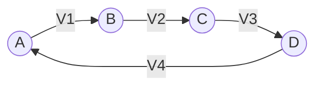
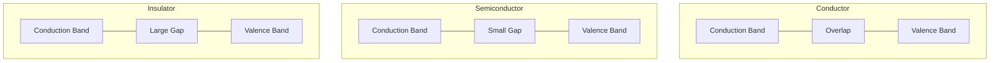
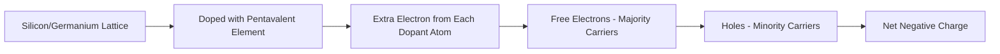
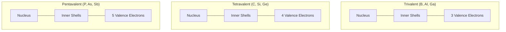
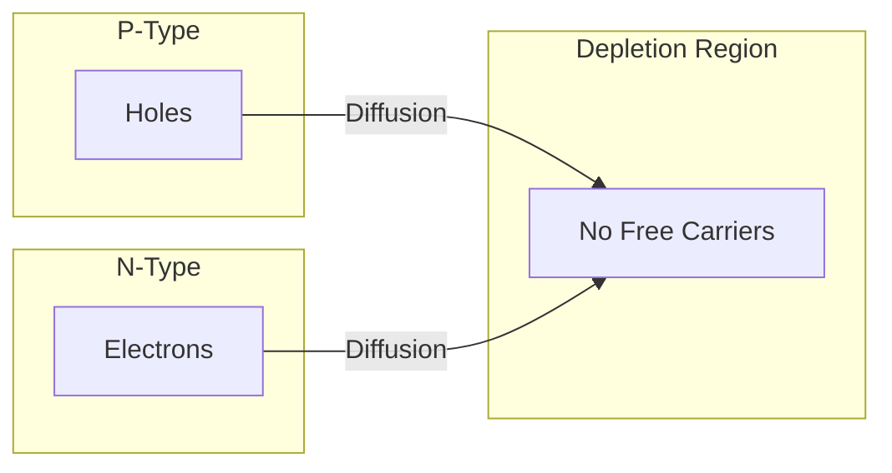
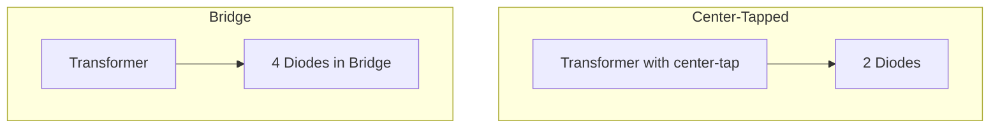
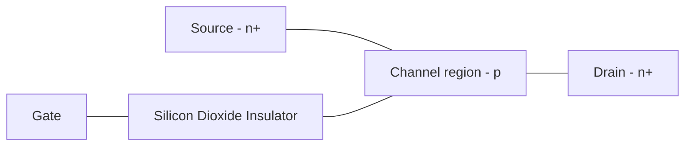

## Question 1(a) [3 marks]

**Explain difference between Active and passive network.**

**Answer**:

| **Active Network** | **Passive Network** |
|-------------------|---------------------|
| Contains at least one energy source | Contains no energy source |
| Can deliver power to other elements | Cannot deliver power to other elements |
| Examples: Transistors, Op-amps, Batteries | Examples: Resistors, Capacitors, Inductors |

**Mnemonic:** "Active Adds Power, Passive Pulls Power"

## Question 1(b) [4 marks]

**State and explain Kirchhoff's voltage law (KVL).**

**Answer**:

**Kirchhoff's Voltage Law (KVL)**: The algebraic sum of all voltages around any closed path (loop) in a circuit is zero.

**Diagram:**



**Mathematical Form**: V₁ + V₂ + V₃ + V₄ = 0

- **Circuit Application**: When moving around a loop, voltage rises (batteries) are positive and voltage drops (components) are negative
- **Physical Meaning**: Total energy in a closed loop is conserved

**Mnemonic:** "Voltage Loop Sum Zero"

## Question 1(c) [7 marks]

**Define the following terms: (1) Charge (2) Current (3) Potential (4) E.M.F. (5) Inductance (6) Capacitance (7) Frequency.**

**Answer**:

| **Term** | **Definition** |
|----------|----------------|
| **Charge** | The basic electrical quantity measured in coulombs (C); flow of electrons creates electricity |
| **Current** | The rate of flow of electric charge, measured in amperes (A); I = dQ/dt |
| **Potential** | Electric potential energy per unit charge, measured in volts (V) |
| **E.M.F.** | Electromotive force, energy supplied by source per unit charge, measured in volts (V) |
| **Inductance** | Property of a conductor to oppose change in current, measured in henry (H) |
| **Capacitance** | Ability of a component to store electric charge, measured in farad (F) |
| **Frequency** | Number of cycles per second of an alternating quantity, measured in hertz (Hz) |

**Mnemonic:** "Careful Currents Pass Easily Into Circuit Frequently"

## Question 1(c) OR [7 marks]

**State Ohm's law. Write its application and limitation.**

**Answer**:

**Ohm's Law**: The current flowing through a conductor is directly proportional to the potential difference across it and inversely proportional to its resistance.

**Mathematical Form**: I = V/R

**Diagram:**

```goat
            +
            |
            V
            |
  A---------/\/\/\---------B
            R
            |
            |
            -
```

**Applications of Ohm's Law**:

- Computing current, voltage, resistance in circuits
- Design of electrical networks
- Power calculations (P = VI = I²R = V²/R)
- Voltage division and current division

**Limitations of Ohm's Law**:

- Not valid for non-linear elements (diodes, transistors)
- Not applicable at very high frequencies
- Not valid for non-metallic conductors like semiconductors
- Not applicable for vacuum tubes and gaseous devices

**Mnemonic:** "Voltage Drives, Resistance Restricts"

## Question 2(a) [3 marks]

**Draw and explain energy band diagrams for insulator, conductor and Semiconductor.**

**Answer**:

**Energy Band Diagrams**:



- **Conductor**: Valence and conduction bands overlap, allowing easy electron flow
- **Semiconductor**: Small energy gap (~1eV) between bands; electrons can jump with thermal energy
- **Insulator**: Large energy gap (>5eV) prevents electron movement between bands

**Mnemonic:** "Conductors Connect, Semiconductors Sometimes, Insulators Impede"

## Question 2(b) [4 marks]

**Write statement of Maximum power transfer theorem and reciprocity theorem.**

**Answer**:

| **Theorem** | **Statement** |
|-------------|---------------|
| **Maximum Power Transfer Theorem** | Maximum power is transferred from source to load when load resistance equals the source internal resistance (RL = RS) |
| **Reciprocity Theorem** | In a linear passive network with a single source, if the source is moved from position A to B, the current at A due to source at B will equal the current at B when source was at A |

**Diagram:**

```goat
Maximum Power Transfer:
        +---[Source]---+
        |              |
        R(source)      R(load)
        |              |
        +------+-------+
```

**Mnemonic:** "Match Resistance to Maximize Power; Switch Source and Sink, Current Stays Same"

## Question 2(c) [7 marks]

**Explain the formation and conduction of N-type materials.**

**Answer**:

**N-type Semiconductor Formation**:



- **Doping Process**: Silicon/Germanium (4 valence e⁻) doped with pentavalent elements (P, As, Sb)
- **Extra Electron**: Each dopant atom provides 1 extra electron after covalent bonding
- **Conduction Mechanism**: 
  - **Majority Carriers**: Free electrons (negative charge carriers)
  - **Minority Carriers**: Holes (very few)
- **Electrical Properties**: Increased conductivity and negative charge carriers

**Mnemonic:** "Pentavalent Provides Plus one Electron, Negative-type"

## Question 2(a) OR [3 marks]

**Define valence band, conduction band and forbidden gap.**

**Answer**:

| **Term** | **Definition** |
|----------|----------------|
| **Valence Band** | The highest energy band filled with electrons, where electrons are bound to atoms |
| **Conduction Band** | The band above valence band where electrons move freely and contribute to electrical conduction |
| **Forbidden Gap** | The energy range between valence and conduction bands where no electron states exist |

**Diagram:**


**Mnemonic:** "Valence Holds, Forbidden Blocks, Conduction Flows"

## Question 2(b) OR [4 marks]

**Define the terms active power, reactive power and power factor with power triangle.**

**Answer**:

**Power Terms in AC Circuits**:

| **Term** | **Definition** |
|----------|----------------|
| **Active Power (P)** | Actual power consumed, measured in watts (W); P = VI cosθ |
| **Reactive Power (Q)** | Power oscillating between source and load, measured in VAR; Q = VI sinθ |
| **Power Factor (PF)** | Ratio of active power to apparent power; PF = cosθ |

**Power Triangle:**

```goat
                S (VA)
               /|
              / |
             /  |
            /   |
           /θ   |
          /_____|
         P(W)   Q(VAR)
```

- **Apparent Power (S)**: Vector sum of active and reactive power
- **Power Triangle**: Right triangle with P, Q, and S as sides
- **Power Factor**: cos θ = P/S (0 to 1)

**Mnemonic:** "Active Power Works, Reactive Power Waits"

## Question 2(c) OR [7 marks]

**Explain the structure of atom of trivalent, tetravalent and pentavalent elements.**

**Answer**:

**Atomic Structures:**

| **Element Type** | **Valence Electrons** | **Examples** | **Electronic Configuration** |
|------------------|----------------------|--------------|-------------------------------|
| **Trivalent** | 3 | Boron, Aluminum, Gallium | 3 electrons in outermost shell |
| **Tetravalent** | 4 | Carbon, Silicon, Germanium | 4 electrons in outermost shell |
| **Pentavalent** | 5 | Nitrogen, Phosphorus, Arsenic | 5 electrons in outermost shell |

**Diagram:**



- **Trivalent Elements**: Used as p-type dopants in semiconductors
- **Tetravalent Elements**: Form semiconductor base materials
- **Pentavalent Elements**: Used as n-type dopants in semiconductors

**Mnemonic:** "Three Tries to Bond, Four Forms Full bonds, Five Frees an Electron"

## Question 3(a) [3 marks]

**Draw the symbol of photodiode and state it's application.**

**Answer**:

**Photodiode Symbol:**

```goat
    --------|>|--------
             |
            / \
           /   \
```

**Applications of Photodiode:**

- Light sensors and detectors
- Optical communication systems
- Camera exposure controls
- Barcode scanners
- Medical instruments
- Solar cells

**Mnemonic:** "Photons Produce Current"

## Question 3(b) [4 marks]

**Write a Short note on LED.**

**Answer**:

**LED (Light Emitting Diode)**:

| **Parameter** | **Description** |
|---------------|-----------------|
| **Structure** | p-n junction with special doping materials |
| **Working** | Electrons recombine with holes, releasing energy as photons |
| **Materials** | GaAs (red), GaP (green), GaN (blue), etc. |
| **Voltage** | Forward voltage typically 1.8V to 3.3V depending on color |

**Advantages**:

- High efficiency (low power consumption)
- Long life (50,000+ hours)
- Small size and durability
- Various colors available

**Applications**:

- Indicators and displays
- Lighting systems
- TV/monitor backlights
- Traffic signals

**Mnemonic:** "Light Emits when Diode conducts"

## Question 3(c) [7 marks]

**Draw and explain VI characteristic of PN junction diode.**

**Answer**:

**P-N Junction Diode V-I Characteristic:**

```goat
                        |
                        |         /
                        |        /
                        |       /
                        |      /
                        |     /
                        |    /
-----------+------------+---+----------
           |            |  /|
           |            | / |
           |            |/  |
           |            |   |
           |            |   |
           +            +   +
       Reverse       Origin Forward
       Region               Region
       
```

**Forward Bias Region:**

- **Knee Voltage**: 0.3V (Ge), 0.7V (Si) where current starts flowing
- **Current Equation**: I = Is(e^(qV/kT) - 1)
- **Conductivity**: High (low resistance)

**Reverse Bias Region:**

- **Leakage Current**: Very small reverse current (micro-amps)
- **Breakdown Region**: Sharp increase in current at breakdown voltage
- **Conductivity**: Very low (high resistance)

**Key Points**:

- **Barrier Potential**: Decreases in forward bias, increases in reverse bias
- **Diode Resistance**: Dynamic resistance changes with applied voltage
- **Temperature Effect**: Voltage drop decreases with temperature increase

**Mnemonic:** "Forward Flows Freely, Reverse Resists"

## Question 3(a) OR [3 marks]

**List the applications of PN junction diode.**

**Answer**:

**Applications of PN Junction Diode:**

| **Application Category** | **Examples** |
|--------------------------|--------------|
| **Rectification** | Half-wave rectifier, Full-wave rectifier, Bridge rectifier |
| **Signal Processing** | Signal demodulation, Clipping circuits, Clamping circuits |
| **Protection** | Voltage spike protection, Reverse polarity protection |
| **Logic Gates** | Diode logic circuits, Switching applications |
| **Voltage Regulation** | Zener diodes for voltage references |
| **Light Applications** | LEDs, Photodiodes, Solar cells |

**Mnemonic:** "Rectify, Process, Protect, Logic, Regulate, Light"

## Question 3(b) OR [4 marks]

**Explain the formation of depletion region in unbiased P-N junction.**

**Answer**:

**Depletion Region Formation:**



**Process:**

- **Diffusion**: Electrons from n-side diffuse to p-side; holes from p-side diffuse to n-side
- **Recombination**: Electrons and holes recombine at the junction
- **Immobile Ions**: Exposed positive ions in n-region, negative ions in p-region
- **Electric Field**: Forms between positive and negative ions, opposing further diffusion
- **Equilibrium**: Diffusion current equals drift current; no net current flows

**Properties of Depletion Region:**

- No free charge carriers
- Acts as insulator
- Width depends on doping levels
- Contains built-in potential barrier

**Mnemonic:** "Diffusion Depletes Carriers, Creating Electric barrier"

## Question 3(c) OR [7 marks]

**Explain construction, working and applications of PN junction diode.**

**Answer**:

**Construction of PN Junction Diode:**

```goat
    +--------+--------+
    |        |        |
    |  P-Type|N-Type  |
    |        |        |
    +--------+--------+
       |     |     |
       |Depletion|
       |  Region |
```

- **P-Type Region**: Silicon/Germanium doped with trivalent impurities (boron, aluminum)
- **N-Type Region**: Silicon/Germanium doped with pentavalent impurities (phosphorus, arsenic)
- **Junction**: Interface between p and n regions with depletion layer
- **Terminals**: Anode (p-side) and Cathode (n-side)

**Working Principle:**

| **Bias Condition** | **Behavior** |
|--------------------|--------------|
| **Forward Bias** | Depletion region narrows, current flows when V > 0.7V (Si) |
| **Reverse Bias** | Depletion region widens, only small leakage current flows |

**Applications:**

- Rectification in power supplies
- Signal demodulation in radios
- Voltage regulation (Zener)
- Signal clipping and clamping
- Logic gates and switching
- Light emission and detection

**Mnemonic:** "Forward Flow, Reverse Restrict, Convert AC to DC"

## Question 4(a) [3 marks]

**Define: (1) Ripple frequency (2) Ripple factor (3) PIV of a diode.**

**Answer**:

| **Term** | **Definition** |
|----------|----------------|
| **Ripple Frequency** | The frequency of AC component present in rectified DC output; for half-wave f = supply frequency, for full-wave f = 2 × supply frequency |
| **Ripple Factor (γ)** | Ratio of RMS value of AC component to DC component in rectifier output; γ = Vac(rms)/Vdc |
| **PIV of Diode** | Peak Inverse Voltage - maximum reverse voltage a diode can withstand without breakdown |

**Mnemonic:** "Ripples Per second, Ripple Proportion, Reverse Peak Voltage"

## Question 4(b) [4 marks]

**Give comparison between full wave rectifier with two diodes and full wave bridge rectifier.**

**Answer**:

| **Parameter** | **Center-Tapped Full Wave** | **Bridge Rectifier** |
|---------------|------------------------------|----------------------|
| **Diodes Used** | 2 diodes | 4 diodes |
| **Transformer** | Center-tapped required | No center tap needed |
| **PIV of Diode** | 2Vm | Vm |
| **Output Voltage** | Vdc = 0.637Vm | Vdc = 0.637Vm |
| **Ripple Factor** | 0.48 | 0.48 |
| **Efficiency** | 81.2% | 81.2% |
| **TUF** | 0.693 | 0.693 |

**Diagram:**



**Mnemonic:** "Bridge Beats Tap with Lower PIV but Needs More Diodes"

## Question 4(c) [7 marks]

**Explain zener diode as voltage regulator.**

**Answer**:

**Zener Diode Voltage Regulator:**

```goat
    Vin     Rs          
    +------|\/\/\|------+--------+ Vout
    |                   |        |
    |                   Z        RL
    |                   Z Zener  |
    |                   Z        |
    +-------------------+--------+
                        |
                       GND
```

**Working Principle:**

- **Reverse Biased**: Zener operates in breakdown region
- **Constant Voltage**: Maintains fixed voltage (Vz) across its terminals
- **Current Regulation**: Series resistor (Rs) limits current
- **Load Changes**: When load current changes, Zener current changes to maintain constant output voltage

**Design Equations:**

- Rs = (Vin - Vz) / (IL + Iz)
- Power rating of Zener: Pz = Vz × Iz(max)

**Advantages:**

- Simple circuit
- Low cost
- Good regulation for small loads
- Fast response to load changes

**Limitations:**

- Power wastage in Rs and Zener
- Limited output current capability
- Temperature dependence of Vz

**Mnemonic:** "Zener Stays at breakdown Voltage despite Current changes"

## Question 4(a) OR [3 marks]

**What is rectifier? Explain full wave rectifier with waveforms.**

**Answer**:

**Rectifier**: A circuit that converts AC voltage to pulsating DC voltage by allowing current flow in one direction only.

**Full Wave Rectifier:**

```goat
                    D1
   AC     +--------->|-------+
   Input  |                  |
   o------+                  +-----o
          |                  |     DC
          |                  |     Output
   o------+                  +-----o
          |                  |
          +--------|<--------+
                   D2
```

**Waveforms:**

```goat
Input:    ^     ^     ^
          |     |     |
   0 -----+-----+-----+----
          |     |     |
          v     v     v

Output:   ^     ^     ^
          |     |     |
   0 -----+-----+-----+----
          
```

- **Operation**: Both half cycles of AC input are converted to same polarity
- **Frequency**: Output ripple frequency is twice the input frequency
- **Voltage**: Vdc = 0.637Vm (where Vm is peak input voltage)

**Mnemonic:** "Full Wave Forms Full Output"

## Question 4(b) OR [4 marks]

**Why filter is required in rectifier? State the different types of filter and explain any one type of filter.**

**Answer**:

**Need for Filters**: Rectifiers produce pulsating DC with large ripples; filters smooth this output to provide steady DC voltage.

**Types of Filters:**

- Capacitor (C) filter
- Inductor (L) filter
- LC filter
- π (Pi) filter
- RC filter

**Capacitor Filter:**

```goat
    +-------+-----+
    |       |     |
    |       C     RL
    |       |     |
    +-------+-----+
```

**Working:**

- Capacitor charges during voltage rise
- Discharges slowly through load during voltage fall
- Acts as temporary storage element
- Time constant RC determines discharge rate
- Reduces ripple by providing discharge path

**Advantages:**

- Simple and economical
- Good smoothing for light loads
- Increases DC output voltage

**Mnemonic:** "Capacitor Catches Charge and Releases Slowly"

## Question 4(c) OR [7 marks]

**Write the need of rectifier. Explain bridge rectifier with circuit diagram and draw its input and output waveforms.**

**Answer**:

**Need for Rectifiers:**

- Convert AC to DC for electronic devices
- Power supplies for DC-operated equipment
- Battery charging circuits
- DC power for industrial drives
- Signal demodulation in communication

**Bridge Rectifier Circuit:**

```goat
           D1       D3
     +----->|----+--|>----+
     |             |      |
AC   |             |      | DC
Input|             |      | Output
     |             |      |
     +------|<----+--|<---+
            D2       D4
```

**Working Principle:**

- **Positive Half Cycle**: D1 and D4 conduct, D2 and D3 block
- **Negative Half Cycle**: D2 and D3 conduct, D1 and D4 block
- **Both Half Cycles**: Current flows in same direction through load

**Input-Output Waveforms:**

```goat
Input:     ^      ^      ^
           |      |      |
    0 -----+------+------+-----
           |      |      |
           v      v      v

Output:    ^      ^      ^      ^      ^
           |      |      |      |      |
    0 ------+----+------+------+------+----
```

**Characteristics:**

- Vdc = 0.637Vm (Vm: peak input voltage)
- PIV of each diode = Vm
- Ripple factor = 0.48
- Efficiency = 81.2%
- TUF = 0.693

**Mnemonic:** "Bridge Brings Both halves to Direct Current"

## Question 5(a) [3 marks]

**Explain causes of electronic waste.**

**Answer**:

**Causes of Electronic Waste:**

| **Cause** | **Description** |
|-----------|-----------------|
| **Rapid Technology Change** | Frequent upgrades and obsolescence of electronics |
| **Short Lifecycle** | Devices designed with limited useful life |
| **Consumer Behavior** | Preference for new gadgets over repair |
| **Manufacturing Issues** | Poor quality leading to early failures |
| **Economic Factors** | Sometimes cheaper to replace than repair |
| **Marketing Strategies** | Promoting new models through planned obsolescence |

**Mnemonic:** "Upgrade, Use, Throw, Repeat"

## Question 5(b) [4 marks]

**Compare PNP and NPN transistors.**

**Answer**:

| **Parameter** | **PNP Transistor** | **NPN Transistor** |
|---------------|--------------------|--------------------|
| **Symbol** | <pre>    E<br>    &#124;<br>    &#124;\\<br>    &#124;  \\<br>    &#124;    >C<br>    &#124;  /<br>    &#124;/<br>    B</pre> | <pre>    C<br>    &#124;<br>    &#124;/<br>    &#124;  /<br>    &#124;    >E<br>    &#124;  \\<br>    &#124;\\<br>    B</pre> |
| **Current Flow** | Emitter to Collector | Collector to Emitter |
| **Majority Carriers** | Holes | Electrons |
| **Biasing** | Emitter positive, Collector negative | Collector positive, Emitter negative |
| **Switching Speed** | Slower | Faster |
| **Usage** | Less common | More common |

**Mnemonic:** "PNP: Positive to Negative to Positive; NPN: Negative to Positive to Negative"

## Question 5(c) [7 marks]

**Draw the symbol, explain the construction and working of MOSFET.**

**Answer**:

**MOSFET Symbol (N-Channel Enhancement):**

```goat
        D
        |
        |
    G---|
        |
        |
        S
```

**Construction:**



**Components:**

- **Substrate**: P-type semiconductor body
- **Source/Drain**: Heavily doped n+ regions
- **Gate**: Metal electrode separated by insulator (SiO2)
- **Channel**: Forms between source and drain when biased

**Working Principle:**

- **Enhancement Mode**: No channel exists initially; gate voltage creates channel
- **Threshold Voltage (VT)**: Minimum gate voltage needed to form channel
- **Conducting State**: When VGS > VT, electrons form channel, allowing current flow
- **Saturation Region**: Current remains constant despite increase in VDS
- **Linear Region**: Current proportional to VDS at low drain voltages

**Applications:**

- Digital circuits (logic gates)
- Power amplifiers
- Switching applications
- Memory devices

**Mnemonic:** "Gate Voltage Controls Electron Channel"

## Question 5(a) OR [3 marks]

**Explain methods to handle electronic waste.**

**Answer**:

**Methods to Handle Electronic Waste:**

| **Method** | **Description** |
|------------|-----------------|
| **Reduce** | Designing products with longer lifecycle and upgradability |
| **Reuse** | Refurbishing and donating electronics for secondary use |
| **Recycle** | Systematic disassembly to recover valuable materials |
| **Responsible Disposal** | Proper collection and processing by certified facilities |
| **Extended Producer Responsibility** | Manufacturers take back used products |
| **Urban Mining** | Recovering precious metals from discarded electronics |

**Diagram:**


**Mnemonic:** "Reduce, Reuse, Recycle, Recover Resources"

## Question 5(b) OR [4 marks]

**Derive the relationship between αdc and βdc.**

**Answer**:

**Relationship between α and β:**

**Given:**

- αdc = IC/IE (Common base current gain)
- βdc = IC/IB (Common emitter current gain)

**Derivation:**
From Kirchhoff's current law:
IE = IC + IB

Dividing both sides by IC:
IE/IC = 1 + IB/IC

Since αdc = IC/IE:
1/αdc = 1 + IB/IC

Since βdc = IC/IB:
1/αdc = 1 + 1/βdc

**Final Relations:**

- αdc = βdc/(1 + βdc)
- βdc = αdc/(1 - αdc)

**Table:**
| **α Value** | **β Value** |
|-------------|-------------|
| 0.9 | 9 |
| 0.95 | 19 |
| 0.99 | 99 |

**Mnemonic:** "Alpha approaches One as Beta approaches Infinity"

## Question 5(c) OR [7 marks]

**Explain common collector configuration with its input and output characteristics.**

**Answer**:

**Common Collector (Emitter Follower) Configuration:**

```goat
                   +Vcc
                    |
                    |
                    R
                    |
                    |
    +------+--------+-------+
    |      |                |
    |    B |    C           E
    +-----|       |-------+-+
           |      |       |
         --+      +--     R
           |                |
           |                |
         +-+-+              |
         |   |              |
         GND GND            GND
```

**Input Characteristics:**

```goat
   Ib
   ^
   |      -------
   |     /
   |    /
   |   /
   |  /
   | /
   |/
   +-----------------> Vbe
```

**Output Characteristics:**

```goat
   Ie
   ^
   |       --------
   |      /
   |     /
   |    /
   |   /
   |  /
   | /
   |/
   +-----------------> Vce
```

**Key Features:**

- **Voltage Gain (Av)**: Approximately 1 (unity)
- **Current Gain (Ai)**: High (β + 1)
- **Input Impedance**: High (β × RE)
- **Output Impedance**: Low (1/gm) where gm is transconductance
- **Phase Relationship**: No phase inversion between input and output
- **Applications**: Impedance matching, buffers, voltage regulators

**Characteristics:**

- **Input Resistance**: Ri = β × (re + RL)
- **Output Resistance**: Ro = (rs + re)/(β + 1)
- **Voltage Gain**: Av = RL/(RL + re) ≈ 1
- **Current Gain**: Ai = (β + 1)

**Advantages:**

- Very high input impedance
- Low output impedance
- Good impedance matching properties
- No phase inversion

**Limitations:**

- No voltage gain (slightly less than 1)
- Used only for impedance matching

**Mnemonic:** "Collector Common, Current amplifies, Voltage follows"

This completes the full solutions for the Elements of Electrical & Electronics Engineering (1313202) Winter 2023 examination.
