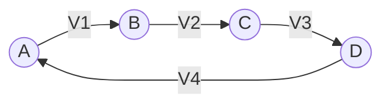
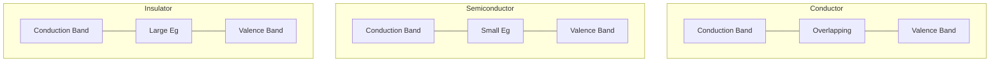
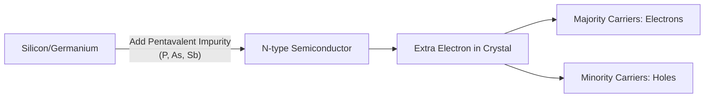
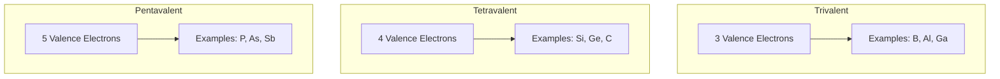
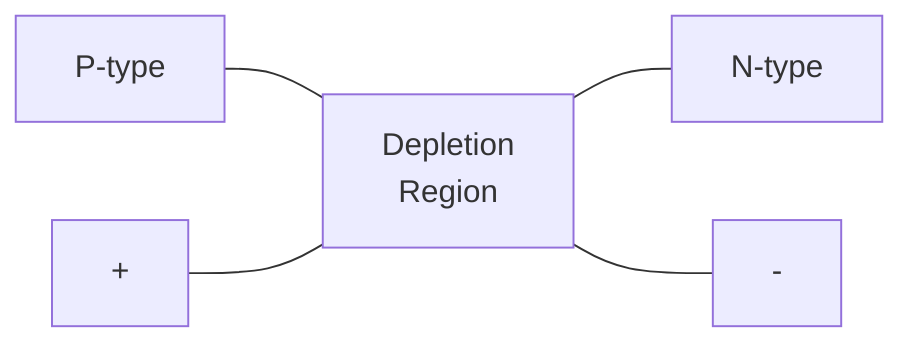
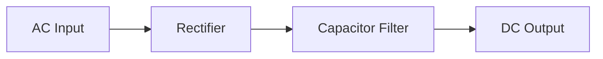
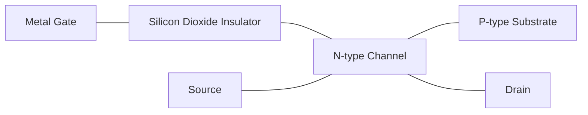

## પ્રશ્ન 1(અ) [3 માર્ક્સ]

**એક્ટિવ અને પેસિવ નેટવર્ક નો તફાવત સમજાવો.**

**જવાબ**:

| **એક્ટિવ નેટવર્ક** | **પેસિવ નેટવર્ક** |
|-------------------|---------------------|
| ઓછામાં ઓછું એક એક્ટિવ ઘટક (વોલ્ટેજ/કરંટ સ્ત્રોત) ધરાવે છે | માત્ર પેસિવ ઘટકો (R, L, C) ધરાવે છે |
| સર્કિટમાં ઊર્જા આપી શકે છે | સર્કિટમાં ઊર્જા આપી શકતું નથી |
| સિગ્નલ પાવરને વધારી શકે છે | સિગ્નલ પાવરને વધારી શકતું નથી |

**મેમરી ટ્રીક:** "એક્ટિવ ઊર્જા આપે, પેસિવ ઊર્જા લે"

## પ્રશ્ન 1(બ) [4 માર્ક્સ]

**કિર્ચોફનો વોલ્ટેજનો નિયમ જણાવો અને સમજાવો.**

**જવાબ**:

કિર્ચોફનો વોલ્ટેજનો નિયમ (KVL) કહે છે કે સર્કિટમાં કોઈપણ બંધ લૂપની અંદર બધા વોલ્ટેજનો બીજગણિતીય સરવાળો શૂન્ય થાય છે.

**આકૃતિ:**



ગણિતશાસ્ત્ર મુજબ: V1 + V2 + V3 + V4 = 0

- **વોલ્ટેજ ડ્રોપ**: જ્યારે કરંટની દિશામાં રેઝિસ્ટર વાટે પસાર થતાં વોલ્ટેજ નેગેટિવ છે
- **વોલ્ટેજ વધારો**: જ્યારે નેગેટિવથી પોઝિટિવ તરફ સ્ત્રોત વાટે પસાર થતાં વોલ્ટેજ પોઝિટિવ છે

**મેમરી ટ્રીક:** "વોલ્ટેજ લૂપનો સરવાળો શૂન્ય"

## પ્રશ્ન 1(ક) [7 માર્ક્સ]

**વ્યાખ્યા આપો: (1) ચાર્જ (2) કરંટ (3) પોટેન્શિયલ (4) E.M.F. (5) ઇન્ડક્ટન્સ (6) કેપેસિટન્સ (7) આવૃત્તિ.**

**જવાબ**:

| **શબ્દ** | **વ્યાખ્યા** |
|----------|----------------|
| **ચાર્જ** | કૂલમ્બ (C)માં માપવામાં આવતો વીજળીનો જથ્થો |
| **કરંટ** | એમ્પિયર (A)માં માપવામાં આવતો વીજળીના ચાર્જનો પ્રવાહ દર |
| **પોટેન્શિયલ** | વોલ્ટ (V)માં માપવામાં આવતું એકમ ચાર્જ દીઠ વીજળીય દબાણ અથવા ઊર્જા |
| **E.M.F.** | ઇલેક્ટ્રોમોટિવ ફોર્સ એટલે એકમ ચાર્જ દીઠ સ્ત્રોત દ્વારા પ્રદાન કરેલી ઊર્જા, જે વોલ્ટ (V)માં માપવામાં આવે છે |
| **ઇન્ડક્ટન્સ** | હેનરી (H)માં માપવામાં આવતો વીજળીય સર્કિટનો ગુણ જે કરંટમાં ફેરફારનો વિરોધ કરે છે |
| **કેપેસિટન્સ** | ફેરડ (F)માં માપવામાં આવતી કોઈ વસ્તુની વીજળીય ચાર્જ સંગ્રહ કરવાની ક્ષમતા |
| **આવૃત્તિ** | હર્ટ્ઝ (Hz)માં માપવામાં આવતી પ્રતિ સેકન્ડ પૂર્ણ થયેલા ચક્રોની સંખ્યા |

**મેમરી ટ્રીક:** "ચાર્જનો પ્રવાહ દબાણથી ઊર્જા ઇન્ડ્યુસ કરે કેપેસિટિવ ફ્લક્ચ્યુએશન"

## પ્રશ્ન 1(ક) OR [7 માર્ક્સ]

**ઓહમનો નિયમ જણાવો. તેના ઉપયોગો અને મર્યાદા લખો.**

**જવાબ**:

ઓહમનો નિયમ કહે છે કે વાહક દ્વારા વહેતો કરંટ પોટેન્શિયલ તફાવતના સમપ્રમાણમાં અને અવરોધના વ્યસ્ત પ્રમાણમાં હોય છે.

**આકૃતિ:**

```
V = I × R
```

જ્યાં:

- V = વોલ્ટેજ (વોલ્ટ)
- I = કરંટ (એમ્પિયર)
- R = અવરોધ (ઓહમ)

**ઉપયોગો:**

- સર્કિટ ડિઝાઇન અને વિશ્લેષણ
- પાવર વપરાશની ગણતરીઓ
- ઘટક મૂલ્ય નક્કી કરવા
- વોલ્ટેજ ડિવાઇડર નેટવર્ક
- કરંટ ડિવાઇડર નેટવર્ક

**મર્યાદાઓ:**

- માત્ર લીનિયર ઘટકો માટે માન્ય
- નોન-ઓહમિક ઉપકરણો (ડાયોડ, ટ્રાન્ઝિસ્ટર) માટે લાગુ પડતો નથી
- ઉચ્ચ તાપમાને અમાન્ય
- સેમિકન્ડક્ટર્સ માટે માન્ય નથી
- નોન-લીનિયર રેઝિસ્ટિવ ઘટકો માટે લાગુ કરી શકાતું નથી

**મેમરી ટ્રીક:** "વોલ્ટેજ કરંટને અવરોધ દ્વારા નિયંત્રિત કરે"

## પ્રશ્ન 2(અ) [3 માર્ક્સ]

**વાહક, અવાહક અને અર્ધવાહક નો એનર્જી બેન્ડ ની આકૃતિ દોરી સમજાવો.**

**જવાબ**:

**આકૃતિ:**



- **વાહક**: વેલેન્સ અને કન્ડક્શન બેન્ડ ઓવરલેપ થાય છે, જે ઇલેક્ટ્રોનને મુક્ત રીતે ફરવાની મંજૂરી આપે છે
- **અર્ધવાહક**: બેન્ડ વચ્ચે નાની ઊર્જા ગેપ (0.7-3 eV) મર્યાદિત કન્ડક્શનને મંજૂરી આપે છે
- **અવાહક**: મોટી ઊર્જા ગેપ (>3 eV) ઇલેક્ટ્રોનને કન્ડક્શન બેન્ડમાં જતાં અટકાવે છે

**મેમરી ટ્રીક:** "વાહક ઓવરલેપ, અર્ધવાહક નાનો ગેપ કૂદે, અવાહક બ્લોક કરે"

## પ્રશ્ન 2(બ) [4 માર્ક્સ]

**Maximum power transfer theorem અને reciprocity theorem નું સ્ટેટમેન્ટ લખો.**

**જવાબ**:

| **થિયરમ** | **સ્ટેટમેન્ટ** |
|-------------|---------------|
| **મેક્સિમમ પાવર ટ્રાન્સફર થિયરમ** | સ્ત્રોતથી લોડમાં મહત્તમ પાવર ત્યારે ટ્રાન્સફર થાય છે જ્યારે લોડ રેઝિસ્ટન્સ સ્ત્રોતના આંતરિક અવરોધ જેટલો હોય (RL = RS) |
| **રેસિપ્રોસિટી થિયરમ** | લીનિયર, બાઇલેટરલ નેટવર્કમાં, જો બ્રાન્ચ 1માં વોલ્ટેજ સ્ત્રોત E બ્રાન્ચ 2માં કરંટ I ઉત્પન્ન કરે છે, તો એ જ વોલ્ટેજ સ્ત્રોત E બ્રાન્ચ 2માં મૂકવાથી બ્રાન્ચ 1માં એ જ કરંટ I ઉત્પન્ન થશે |

**મેમરી ટ્રીક:** "અવરોધ મેળવો મહત્તમ પાવર માટે; સ્ત્રોત બદલો, કરંટ એક સરખો રહે"

## પ્રશ્ન 2(ક) [7 માર્ક્સ]

**N-type મટીરીઅલ ની રચના અને તેનું કંડક્શન સમજાવો.**

**જવાબ**:

**આકૃતિ:**



- **રચના પ્રક્રિયા**: 
  - શુદ્ધ સિલિકોન/જર્મેનિયમમાં પેન્ટાવેલેન્ટ અશુદ્ધિ અણુઓ (P, As, Sb) ઉમેરવામાં આવે છે
  - અશુદ્ધિ અણુઓમાં 5 વેલેન્સ ઇલેક્ટ્રોન હોય છે (સિલિકોનમાં 4 હોય છે)
  - ચાર ઇલેક્ટ્રોન કોવેલેન્ટ બોન્ડ બનાવે છે, પાંચમો ફ્રી ઇલેક્ટ્રોન બને છે
  - વધારાના નેગેટિવ ચાર્જ કેરિયર્સ બનાવે છે

- **કંડક્શન મેકેનિઝમ**:
  - મેજોરિટી કેરિયર્સ: ઇલેક્ટ્રોન
  - માઇનોરિટી કેરિયર્સ: હોલ્સ
  - ઇલેક્ટ્રોનની ગતિ વીજળીય કંડક્શન પ્રદાન કરે છે
  - રૂમ ટેમ્પરેચર પર પણ, ફ્રી ઇલેક્ટ્રોન કરંટ પ્રવાહને સક્ષમ બનાવે છે

**મેમરી ટ્રીક:** "પેન્ટાવેલેન્ટ એક વધારાનો ઇલેક્ટ્રોન આપે"

## પ્રશ્ન 2(અ) OR [3 માર્ક્સ]

**વેલેન્સ બેન્ડ, કંડક્શન બેન્ડ અને ફોર્બિડન ગેપ ની વ્યાખ્યા આપો.**

**જવાબ**:

| **શબ્દ** | **વ્યાખ્યા** |
|----------|----------------|
| **વેલેન્સ બેન્ડ** | ઊર્જા બેન્ડ જેમાં વેલેન્સ ઇલેક્ટ્રોન હોય છે જે ઘન પદાર્થમાં ચોક્કસ અણુઓ સાથે બંધાયેલા હોય છે |
| **કંડક્શન બેન્ડ** | ઉચ્ચ ઊર્જા બેન્ડ જ્યાં ઇલેક્ટ્રોન સમગ્ર પદાર્થમાં મુક્તપણે હરીફરી શકે છે, જે વીજળીય કંડક્શન સક્ષમ બનાવે છે |
| **ફોર્બિડન ગેપ** | વેલેન્સ અને કંડક્શન બેન્ડ વચ્ચેનો ઊર્જા પ્રદેશ જ્યાં કોઈ ઇલેક્ટ્રોન સ્ટેટ હોતા નથી |

**મેમરી ટ્રીક:** "વેલેન્સ બાંધે, કંડક્શન વહાવે, ફોર્બિડન રોકે"

## પ્રશ્ન 2(બ) OR [4 માર્ક્સ]

**એક્ટિવ પાવર, રિએક્ટિવ પાવર અને પાવર ફેક્ટર ની વ્યાખ્યા આપો અને પાવર ત્રિકોણ દોરો.**

**જવાબ**:

**આકૃતિ:**

```goat
    |    
    |   S (Apparent Power)
    |  /|
    | / |
    |/__|
    P   Q

P = Active Power
Q = Reactive Power
S = Apparent Power
cosθ = Power Factor
```

- **એક્ટિવ પાવર (P)**: વાસ્તવિક વપરાયેલો પાવર, વોટ (W)માં માપવામાં આવે છે, P = VI cosθ
- **રિએક્ટિવ પાવર (Q)**: સ્ત્રોત અને લોડ વચ્ચે આગળ-પાછળ થતો પાવર, વોલ્ટ-એમ્પિયર રિએક્ટિવ (VAR)માં માપવામાં આવે છે, Q = VI sinθ
- **પાવર ફેક્ટર**: એક્ટિવ પાવરનો એપેરન્ટ પાવર સાથેનો ગુણોત્તર, PF = cosθ = P/S

**મેમરી ટ્રીક:** "વાસ્તવિક પાવર કામ કરે, રિએક્ટિવ પાવર રાહ જુએ"

## પ્રશ્ન 2(ક) OR [7 માર્ક્સ]

**ટ્રાઇવેલેન્ટ, ટેટ્રાવેલેન્ટ અને પેન્ટાવેલેન્ટ તત્વોના અણુની રચના સમજાવો.**

**જવાબ**:

**આકૃતિ:**



| **તત્વનો પ્રકાર** | **રચના** | **ઉદાહરણો** | **સેમિકન્ડક્ટર ઉપયોગ** |
|------------------|---------------|--------------|------------------------|
| **ટ્રાઇવેલેન્ટ** | સૌથી બહારના શેલમાં 3 ઇલેક્ટ્રોન | B, Al, Ga, In | P-ટાઇપ ડોપન્ટ |
| **ટેટ્રાવેલેન્ટ** | સૌથી બહારના શેલમાં 4 ઇલેક્ટ્રોન | Si, Ge, C | સેમિકન્ડક્ટર બેઝ |
| **પેન્ટાવેલેન્ટ** | સૌથી બહારના શેલમાં 5 ઇલેક્ટ્રોન | P, As, Sb | N-ટાઇપ ડોપન્ટ |

**મેમરી ટ્રીક:** "ત્રણ સ્વીકારે, ચાર બનાવે, પાંચ આપે"

## પ્રશ્ન 3(અ) [3 માર્ક્સ]

**ફોટોડિઓડનું પ્રતીક દોરો અને તેનો ઉપયોગ જણાવો.**

**જવાબ**:

**આકૃતિ:**

```goat
    |\ 
    | \  
    |  \   
-->|| \--->
    |  /     
    | /   
    |/  
```

**ફોટોડિઓડના ઉપયોગો:**

- લાઇટ સેન્સર અને ડિટેક્ટર્સ
- ઓપ્ટિકલ કમ્યુનિકેશન સિસ્ટમ્સ
- સોલર સેલ્સ અને ફોટોવોલ્ટેઇક એપ્લિકેશન્સ
- કેમેરા એક્સપોઝર કંટ્રોલ્સ
- મેડિકલ ઉપકરણો (પલ્સ ઓક્સિમીટર)

**મેમરી ટ્રીક:** "પ્રકાશ કરંટને ઉત્તેજિત કરે"

## પ્રશ્ન 3(બ) [4 માર્ક્સ]

**LED પર ટૂંકી નોંધ લખો.**

**જવાબ**:

**આકૃતિ:**

```goat
    |\ 
    | \  
    |  \   
<---|| \--->
    |  /     
    | /   
    |/  
    ▼ ▼
   Light
```

- **રચના**: ફોરવર્ડ બાયસ થયેલ હોય ત્યારે પ્રકાશ ઉત્સર્જિત કરતો P-N જંક્શન ડાયોડ
- **કાર્ય સિદ્ધાંત**: ઇલેક્ટ્રોન-હોલ રીકોમ્બિનેશન ફોટોન્સના રૂપમાં ઊર્જા છોડે છે
- **પ્રકારો**: સેમિકન્ડક્ટર મટીરિયલ (GaAs, GaP, GaN) પર આધારિત વિવિધ રંગો
- **ફાયદાઓ**: ઓછો પાવર વપરાશ, લાંબી લાઇફ, નાનું કદ, ઝડપી સ્વિચિંગ
- **ઉપયોગો**: ડિસ્પ્લે, ઇન્ડિકેટર્સ, લાઇટિંગ, રિમોટ કંટ્રોલ, ઓપ્ટિકલ કમ્યુનિકેશન

**મેમરી ટ્રીક:** "ઇલેક્ટ્રોન કૂદે, ફોટોન નીકળે"

## પ્રશ્ન 3(ક) [7 માર્ક્સ]

**PN જંક્શન ડાયોડની VI લાક્ષણિકતા દોરીને સમજાવો.**

**જવાબ**:

**આકૃતિ:**

```goat
    Current
    ^
    |           /
    |          /
    |         /
    |        /
    |       /
    |      /
    |_____/_________> Voltage
    |    /|
    |   / |
    |  /  |
    | /   |
    |/    |
    |     |
    
    Forward bias  | Reverse bias
```

**P-N જંક્શન ડાયોડની V-I લાક્ષણિકતાઓ:**

- **ફોરવર્ડ બાયસ રીજન**:
  - ડાયોડ ત્યારે કંડક્ટ કરે છે જ્યારે વોલ્ટેજ ની/કટ-ઇન વોલ્ટેજને (Ge માટે 0.3V, Si માટે 0.7V) ઓળંગે
  - વોલ્ટેજની સાથે કરંટ એક્સપોનેન્શિયલી વધે છે
  - ઓછી રેઝિસ્ટન્સ સ્ટેટ

- **રિવર્સ બાયસ રીજન**:
  - ખૂબ જ નાનો લીકેજ કરંટ વહે છે
  - રિવર્સ વોલ્ટેજ વધવા છતાં કરંટ લગભગ સ્થિર રહે છે
  - ઉચ્ચ રેઝિસ્ટન્સ સ્ટેટ
  - ઉચ્ચ રિવર્સ વોલ્ટેજ પર બ્રેકડાઉન થાય છે

- **મુખ્ય બિંદુઓ**:
  - નોન-લીનિયર ઉપકરણ
  - એક દિશામાં કરંટ પ્રવાહ
  - તાપમાન પર આધારિત

**મેમરી ટ્રીક:** "ફોરવર્ડ સરળતાથી વહે, રિવર્સ દૃઢતાથી અટકાવે"

## પ્રશ્ન 3(અ) OR [3 માર્ક્સ]

**PN જંક્શન ડાયોડના ઉપયોગોની યાદી બનાવો.**

**જવાબ**:

**PN જંક્શન ડાયોડના ઉપયોગો:**

- પાવર સપ્લાયમાં રેક્ટિફિકેશન
- સિગ્નલ ડિમોડ્યુલેશન
- ડિજિટલ સર્કિટમાં લોજિક ગેટ્સ
- વોલ્ટેજ રેગ્યુલેશન (ઝેનર ડાયોડ સાથે)
- સિગ્નલ ક્લિપિંગ અને ક્લેમ્પિંગ સર્કિટ્સ
- રિવર્સ પોલારિટી સામે પ્રોટેક્શન સર્કિટ્સ

**મેમરી ટ્રીક:** "રેક્ટિફાય, ડિટેક્ટ, ક્લિપ, પ્રોટેક્ટ"

## પ્રશ્ન 3(બ) OR [4 માર્ક્સ]

**અનબાયસ PN જંક્શન ડાયોડ ના ડીપલીશન રીજીયન ની રચના સમજાવો.**

**જવાબ**:

**આકૃતિ:**



- **રચના પ્રક્રિયા**:
  - N-સાઇડના ઇલેક્ટ્રોન P-સાઇડમાં ડિફ્યુઝ થાય છે
  - P-સાઇડના હોલ્સ N-સાઇડમાં ડિફ્યુઝ થાય છે
  - જંક્શન પર રીકોમ્બિનેશન થાય છે
  - ઇમોબાઇલ આયન બાકી રહે છે (N-સાઇડમાં પોઝિટિવ, P-સાઇડમાં નેગેટિવ)
  - ઇલેક્ટ્રિક ફીલ્ડ વિકસે છે, જે વધુ ડિફ્યુઝનનો વિરોધ કરે છે
  - સમતુલન સ્થાપિત થાય છે, જે ડિપ્લેશન રીજિયન બનાવે છે

- **લાક્ષણિકતાઓ**: 
  - ચાર્જ કેરિયર્સથી મુક્ત
  - અવાહક/અવરોધક તરીકે કાર્ય કરે છે
  - બિલ્ટ-ઇન પોટેન્શિયલ બનાવે છે

**મેમરી ટ્રીક:** "ડિફ્યુઝન બેરિયર ફીલ્ડ બનાવે"

## પ્રશ્ન 3(ક) OR [7 માર્ક્સ]

**PN જંક્શન ડાયોડનું બાંધકામ, કાર્ય અને એપ્લિકેશન સમજાવો.**

**જવાબ**:

**આકૃતિ:**


**બાંધકામ:**

- P-ટાઇપ સેમિકન્ડક્ટરને N-ટાઇપ સેમિકન્ડક્ટર સાથે જોડવામાં આવે છે
- સિલિકોન અથવા જર્મેનિયમના સિંગલ ક્રિસ્ટલમાંથી બનાવવામાં આવે છે
- P અને N રીજન સાથે મેટલ કોન્ટેક્ટ્સ જોડાયેલા હોય છે

**કાર્ય:**

- **ફોરવર્ડ બાયસ**: 
  - P પર પોઝિટિવ, N પર નેગેટિવ
  - ડિપ્લેશન રીજિયન સાંકડો થાય છે
  - વોલ્ટેજ બેરિયર પોટેન્શિયલને ઓળંગે ત્યારે કરંટ વહે છે
  
- **રિવર્સ બાયસ**:
  - N પર પોઝિટિવ, P પર નેગેટિવ
  - ડિપ્લેશન રીજિયન પહોળો થાય છે
  - માત્ર નાનો લીકેજ કરંટ વહે છે

**એપ્લિકેશન:**

- પાવર રેક્ટિફિકેશન
- સિગ્નલ ડિટેક્શન
- વોલ્ટેજ રેગ્યુલેશન
- સ્વિચિંગ એપ્લિકેશન
- પ્રોટેક્શન સર્કિટ્સ
- લોજિક ગેટ્સ

**મેમરી ટ્રીક:** "P-N જોડો, કરંટ દિશા નિયંત્રિત કરો"

## પ્રશ્ન 4(અ) [3 માર્ક્સ]

**વ્યાખ્યા આપો (1) રીપપલ આવૃત્તિ (2) રીપપલ ફેક્ટર (3) ડાયોડ નો PIV.**

**જવાબ**:

| **શબ્દ** | **વ્યાખ્યા** |
|----------|----------------|
| **રીપપલ આવૃત્તિ** | રેક્ટિફાયડ DC આઉટપુટમાં બાકી રહેલ AC ઘટકની આવૃત્તિ (ફુલ-વેવ માટે 2× ઇનપુટ આવૃત્તિ, હાફ-વેવ માટે 1×) |
| **રીપપલ ફેક્ટર** | રેક્ટિફાયર આઉટપુટમાં DC ઘટક સાથે AC ઘટકના RMS મૂલ્યનો ગુણોત્તર (γ = Vac(rms)/Vdc) |
| **PIV of a diode** | પીક ઇન્વર્સ વોલ્ટેજ એ મહત્તમ રિવર્સ વોલ્ટેજ છે જે ડાયોડ બ્રેકડાઉન વિના સહન કરી શકે છે |

**મેમરી ટ્રીક:** "આવૃત્તિ ફ્લક્ચ્યુએટ કરે, ફેક્ટર માપે, PIV સુરક્ષા આપે"

## પ્રશ્ન 4(બ) [4 માર્ક્સ]

**બે ડાયોડ ફુલ વેવ રેક્ટિફાયર અને બ્રિજ રેક્ટિફાયર નો તફાવત આપો.**

**જવાબ**:

| **પેરામીટર** | **સેન્ટર-ટેપ્ડ ફુલ વેવ** | **બ્રિજ રેક્ટિફાયર** |
|---------------|------------------------------|----------------------|
| **ડાયોડની સંખ્યા** | 2 | 4 |
| **ટ્રાન્સફોર્મર** | સેન્ટર-ટેપ્ડ જરૂરી | સામાન્ય ટ્રાન્સફોર્મર |
| **PIV** | 2Vm | Vm |
| **કાર્યક્ષમતા** | 81.2% | 81.2% |
| **રીપપલ ફેક્ટર** | 0.48 | 0.48 |
| **આઉટપુટ** | Vm/π | 2Vm/π |
| **ખર્ચ** | ઊંચો ટ્રાન્સફોર્મર ખર્ચ | ઊંચો ડાયોડ ખર્ચ |

**મેમરી ટ્રીક:** "બે ડાયોડ સેન્ટર ટેપ, ચાર બ્રિજ બનાવે"

## પ્રશ્ન 4(ક) [7 માર્ક્સ]

**ઝેનર ડાયોડને વોલ્ટેજ રેગ્યુલેટર તરીકે સમજાવો.**

**જવાબ**:

**આકૃતિ:**

```goat
        Rs            
    +---www-----+
    |           |
Vin |           | Zener    RL    Vout
    |           Z Diode     R     
    |           |           R     
    +-----------+-----------+
```

**કાર્ય સિદ્ધાંત:**

- ઝેનર ડાયોડ રિવર્સ બ્રેકડાઉન રીજીયનમાં કાર્ય કરે છે
- તેના ટર્મિનલ્સ પર સ્થિર વોલ્ટેજ જાળવે છે
- વોલ્ટેજ રેફરન્સ તરીકે કાર્ય કરે છે

**સર્કિટ ઓપરેશન:**

- સીરીઝ રેઝિસ્ટર Rs કરંટને મર્યાદિત કરે છે
- જ્યારે ઇનપુટ બ્રેકડાઉન વોલ્ટેજથી વધે છે ત્યારે ઝેનર કંડક્ટ કરે છે
- વધારાનો કરંટ ઝેનર ડાયોડ મારફતે વહે છે
- આઉટપુટ વોલ્ટેજ ઝેનર વોલ્ટેજ પર સ્થિર રહે છે

**ફાયદાઓ:**

- સરળ સર્કિટ
- ઓછી કિંમત
- નાના લોડ ફેરફારો માટે સારું રેગ્યુલેશન

**મર્યાદાઓ:**

- ઝેનર અને સીરીઝ રેઝિસ્ટરમાં પાવર ડિસિપેશન
- મર્યાદિત કરંટ ક્ષમતા
- તાપમાન પર આધારિતતા

**મેમરી ટ્રીક:** "ઝેનર બ્રેકડાઉન થઈ વોલ્ટેજ સ્થિર રાખે"

## પ્રશ્ન 4(અ) OR [3 માર્ક્સ]

**રેક્ટિફાયર શું છે? ફુલ વેવ રેક્ટિફાયરને વેવફોર્મ્સ સાથે સમજાવો.**

**જવાબ**:

**રેક્ટિફાયર:** એક સર્કિટ જે AC વોલ્ટેજને પલ્સેટિંગ DC વોલ્ટેજમાં રૂપાંતરિત કરે છે.

**આકૃતિ:**

```goat
    +-------+
    |       |
A --+       +-- C
    | XFRMR |         D1
    |       |--+------|>|----+--+
    |       |  |             |  |
    |       |  |             |  |  RL   Output
    |       |  |             |  |  
B --+       +--+             |  |
    |       |  |             |  |
    |       |  |             |  |
    |       |--+------|<|----+--+
    |       |         D2
    +-------+
```

**વેવફોર્મ્સ:**

```goat
Input:    ^
          |   /\    /\    /\
          |  /  \  /  \  /  \
          | /    \/    \/    \
          +--------------------
          |
          |\    /\    /\    /
          | \  /  \  /  \  / 
          |  \/    \/    \/

Output:   ^
          |   /\    /\    /\
          |  /  \  /  \  /  \
          | /    \/    \/    \
          +--------------------
```

**મેમરી ટ્રીક:** "બંને હાફ-સાયકલ પોઝિટિવ બને"

## પ્રશ્ન 4(બ) OR [4 માર્ક્સ]

**રેક્ટિફાયરમાં ફિલ્ટર શા માટે જરૂરી છે? ફિલ્ટરના વિવિધ પ્રકારો જણાવો અને કોઈપણ એક પ્રકારનું ફિલ્ટર સમજાવો.**

**જવાબ**:

**ફિલ્ટરની જરૂરિયાત:**

- રેક્ટિફાયર આઉટપુટમાં AC રિપપલ ઘટક હોય છે
- ઇલેક્ટ્રોનિક સર્કિટ્સ માટે શુદ્ધ DC જરૂરી છે
- ફિલ્ટર્સ AC ઘટકોને દૂર કરીને પલ્સેટિંગ DCને સ્મૂધ કરે છે

**ફિલ્ટરના પ્રકારો:**

- કેપેસિટર ફિલ્ટર (C-ફિલ્ટર)
- ઇન્ડક્ટર ફિલ્ટર (L-ફિલ્ટર)
- LC ફિલ્ટર
- π (પાઇ) ફિલ્ટર
- CLC ફિલ્ટર

**કેપેસિટર ફિલ્ટર:**



**કાર્ય:**

- કેપેસિટર વોલ્ટેજ વધારા દરમિયાન ચાર્જ થાય છે
- વોલ્ટેજ ઘટાડા દરમિયાન ધીમે ધીમે ડિસ્ચાર્જ થાય છે
- ઇનપુટ ઘટે ત્યારે કરંટ પ્રદાન કરે છે
- રિપપલ વોલ્ટેજ ઘટાડે છે

**ફાયદાઓ:**

- સરળ અને સસ્તું
- હળવા લોડ માટે અસરકારક
- રિપપલ નોંધપાત્ર રીતે ઘટાડે છે

**મેમરી ટ્રીક:** "કેપેસિટર પીક્સ પકડે, ધીમેથી છોડે"

## પ્રશ્ન 4(ક) OR [7 માર્ક્સ]

**રેક્ટિફાયરની જરૂરિયાત લખો. સર્કિટ ડાયાગ્રામ વડે બ્રિજ રેક્ટિફાયર સમજાવો અને તેના ઇનપુટ અને આઉટપુટ વેવફોર્મ્સ દોરો.**

**જવાબ**:

**રેક્ટિફાયરની જરૂરિયાત:**

- ઇલેક્ટ્રોનિક ઉપકરણો માટે AC થી DC માં રૂપાંતર કરવા
- મોટાભાગના ઇલેક્ટ્રોનિક સર્કિટ્સને DC પાવરની જરૂર પડે છે
- બેટરી DC પ્રદાન કરે છે પરંતુ AC વિતરિત થાય છે
- પાવર સપ્લાયનો બિલ્ડિંગ બ્લોક
- ચાર્જિંગ સિસ્ટમ્સ માટે આવશ્યક

**બ્રિજ રેક્ટિફાયર સર્કિટ:**

```goat
          D1        D3
    +-----|>|--------+
    |                |
A --+                +-- DC+
    |                |
    |                |    RL
    |                |
B --+                +-- DC-
    |                |
    +-----|<|--------+
          D2        D4
```

**ઇનપુટ વેવફોર્મ:**

```goat
    ^
    |    /\      /\
    |   /  \    /  \
    |  /    \  /    \
    | /      \/      \
    +-------------------
    |       /\      /\
    |      /  \    /  \
    |     /    \  /    \
    |\   /      \/      
    | \ /
    |  V
```

**આઉટપુટ વેવફોર્મ:**

```goat
    ^
    |    /\      /\
    |   /  \    /  \
    |  /    \  /    \
    | /      \/      \
    +-------------------
```

**કાર્ય:**

- પોઝિટિવ હાફ સાયકલ દરમિયાન: D1 અને D4 કંડક્ટ કરે છે
- નેગેટિવ હાફ સાયકલ દરમિયાન: D2 અને D3 કંડક્ટ કરે છે
- લોડને બંને સાયકલમાં એક જ દિશામાં કરંટ મળે છે
- ઇનપુટ વેવફોર્મના બંને અર્ધ-ચક્રનો ઉપયોગ કરે છે

**મેમરી ટ્રીક:** "ચાર ડાયોડ બધા કરંટને એક દિશામાં વાળે"

## પ્રશ્ન 5(અ) [3 માર્ક્સ]

**ઇલેક્ટ્રોનિક કચરાના કારણો સમજાવો.**

**જવાબ**:

**ઇલેક્ટ્રોનિક કચરાના કારણો:**

- ઝડપી ટેકનોલોજીકલ અદ્યતનીકરણ
- ઉત્પાદનોની આયોજિત કાલગ્રસ્તતા
- ઉત્પાદનોનું ઘટતું જીવનકાળ
- નવા ઉપકરણોને પસંદ કરતી ગ્રાહક વર્તણૂક
- ઇલેક્ટ્રોનિક્સ માટે મર્યાદિત રિપેર વિકલ્પો
- રિપ્લેસમેન્ટની તુલનામાં ઊંચા રિપેર ખર્ચ

**મેમરી ટ્રીક:** "ટેક્નોલોજી આગળ વધે, ઉત્પાદન જલ્દી બગડે"

## પ્રશ્ન 5(બ) [4 માર્ક્સ]

**PNP અને NPN ટ્રાન્ઝિસ્ટરની સરખામણી કરો.**

**જવાબ**:

| **પેરામીટર** | **PNP ટ્રાન્ઝિસ્ટર** | **NPN ટ્રાન્ઝિસ્ટર** |
|---------------|--------------------|--------------------|
| **સિમ્બોલ** |  |  |
| **મેજોરિટી કેરિયર્સ** | હોલ્સ | ઇલેક્ટ્રોન્સ |
| **કરંટ પ્રવાહ** | એમિટરથી કલેક્ટર | કલેક્ટરથી એમિટર |
| **બાયસિંગ** | એમિટર બેઝ કરતાં વધુ પોઝિટિવ | બેઝ એમિટર કરતાં વધુ પોઝિટિવ |
| **સ્વિચિંગ સ્પીડ** | ધીમી | ઝડપી |
| **એપ્લિકેશન્સ** | લો ફ્રિક્વન્સી, હાઇ કરંટ | હાઇ ફ્રિક્વન્સી, સ્વિચિંગ |

**આકૃતિ:**

```goat
    NPN:         PNP:
    
    C            C
    |            |
    |            |
    B---->       <----B
    |            |
    |            |
    E            E
```

**મેમરી ટ્રીક:** "નેગેટિવ-પોઝિટિવ-નેગેટિવ વિરુદ્ધ પોઝિટિવ-નેગેટિવ-પોઝિટિવ"

## પ્રશ્ન 5(ક) [7 માર્ક્સ]

**પ્રતીક દોરો, MOSFET નું બાંધકામ અને કાર્ય સમજાવો.**

**જવાબ**:

**સિમ્બોલ:**

```goat
         D (Drain)
         |
         |
G (Gate) |
----||---+
         |
         |
         S (Source)
```

**બાંધકામ:**



**કાર્ય સિદ્ધાંત:**

- **એન્હાન્સમેન્ટ મોડ N-ચેનલ MOSFET:**
  - ગેટ વોલ્ટેજ વિના કોઈ ચેનલ અસ્તિત્વમાં નથી
  - પોઝિટિવ ગેટ વોલ્ટેજ સબસ્ટ્રેટમાંથી ઇલેક્ટ્રોન્સને આકર્ષે છે
  - ઉત્પન્ન થયેલી ચેનલ ડ્રેનથી સોર્સ સુધી કરંટ પ્રવાહને મંજૂરી આપે છે
  - ગેટ વોલ્ટેજ વધારવાથી કન્ડક્ટિવિટી વધે છે
  
- **મુખ્ય વિશેષતાઓ:**
  - વોલ્ટેજ-નિયંત્રિત ઉપકરણ (ઉચ્ચ ઇનપુટ ઇમ્પેડન્સ)
  - ગેટ કરંટની જરૂર નથી (BJT થી અલગ)
  - BJT કરતાં ઝડપી સ્વિચિંગ
  - ઓછુ પાવર ડિસિપેશન

**એપ્લિકેશન્સ:**

- ડિજિટલ લોજિક સર્કિટ્સ
- સ્વિચિંગ એપ્લિકેશન્સ
- એમ્પ્લિફાયર્સ
- પાવર કન્ટ્રોલ ડિવાઇસીસ

**મેમરી ટ્રીક:** "ગેટ વોલ્ટેજ ઇલેક્ટ્રોન ચેનલ બનાવે"

## પ્રશ્ન 5(અ) OR [3 માર્ક્સ]

**ઈલેક્ટ્રોનિક કચરાને હેન્ડલ કરવાની પદ્ધતિઓ સમજાવો.**

**જવાબ**:

**ઈલેક્ટ્રોનિક કચરાને હેન્ડલ કરવાની પદ્ધતિઓ:**

| **પદ્ધતિ** | **વર્ણન** |
|------------|-----------------|
| **ઘટાડો (Reduce)** | લાંબા સમય સુધી ચાલે તેવા ઇલેક્ટ્રોનિક્સનું ડિઝાઇન, અપગ્રેડ માટે મોડ્યુલર ડિઝાઇન |
| **પુન:ઉપયોગ (Reuse)** | કાર્યરત ઉપકરણોનું દાન અથવા વેચાણ, ઘટકોનો પુન:ઉપયોગ |
| **રિસાયકલ (Recycle)** | યોગ્ય વિઘટન અને સામગ્રી પુનઃપ્રાપ્તિ (કિંમતી ધાતુઓ, પ્લાસ્ટિક) |
| **નિયમન (Regulation)** | ઇ-વેસ્ટ મેનેજમેન્ટ નીતિઓ, વિસ્તારિત ઉત્પાદક જવાબદારી |
| **રિકવરી (Recovery)** | વિશિષ્ટ પ્રક્રિયાઓ દ્વારા મૂલ્યવાન સામગ્રીનું નિષ્કર્ષણ |

**મેમરી ટ્રીક:** "ઘટાડો, પુન:ઉપયોગ, રિસાયકલ, નિયમન, પુનઃપ્રાપ્તિ"

## પ્રશ્ન 5(બ) OR [4 માર્ક્સ]

**αdc અને βdc વચ્ચેનો સંબંધ મેળવો.**

**જવાબ**:

**આકૃતિ:**

```goat
               IC
              ↑
              |  
              |
    IB →      |      →  
        B ----+---- C
              |
              |
              |
              E
              ↓
              IE
```

**ટ્રાન્ઝિસ્ટર કરંટ સંબંધો:**

- IE = IC + IB (પ્રવેશ કરતો કરંટ નીકળતા કરંટ બરાબર)
- αdc = IC/IE (કોમન બેઝ કરંટ ગેઇન)
- βdc = IC/IB (કોમન એમિટર કરંટ ગેઇન)

**ડેરિવેશન:**

- IE = IC + IB માંથી
- બંને બાજુઓને IC થી ભાગો: IE/IC = 1 + IB/IC
- તેથી: 1/αdc = 1 + 1/βdc
- βdc માટે હલ કરતાં: βdc = αdc/(1-αdc)
- અને αdc માટે: αdc = βdc/(1+βdc)

**મૂલ્યોની ટેબલ:**

| αdc | βdc |
|-----|-----|
| 0.9 | 9 |
| 0.95 | 19 |
| 0.99 | 99 |

**મેમરી ટ્રીક:** "આલ્ફા-બીટા સંબંધિત છે αdc = βdc/(1+βdc)"

## પ્રશ્ન 5(ક) OR [7 માર્ક્સ]

**તેના ઇનપુટ અને આઉટપુટ લાક્ષણિકતાઓ સાથે CC ની રચના સમજાવો.**

**જવાબ**:

**કોમન કલેક્ટર સર્કિટ (એમિટર ફોલોઅર):**

```goat
              +VCC
               |
               R
               |
               C
    +----+     |
    |    |     |
    Vin  |     +---+ Output
    |    |     |
    +----+-----+
         |     |
         B     E
         |     |
         +-----+
               |
               RE
               |
              GND
```

**ઇનપુટ લાક્ષણિકતાઓ:** (IB vs VBE)

```goat
    IB ^
       |           /
       |          /
       |         /
       |        /
       |       /
       |      /
       |     /
       |    /
       |   /
       |  /
       | /
       |/
       +--------------> VBE
```

**આઉટપુટ લાક્ષણિકતાઓ:** (IE vs VCE)

```goat
    IE ^
       |    ---------------
       |   /
       |  /
       | /
       |/
       +--------------> VCE
       
       IB3 > IB2 > IB1 > 0
```

**મુખ્ય વિશેષતાઓ:**

- વોલ્ટેજ ગેઇન ≈ 1 (થોડો ઓછો)
- ઉચ્ચ કરંટ ગેઇન (β+1)
- ઉચ્ચ ઇનપુટ ઇમ્પેડન્સ
- નીચું આઉટપુટ ઇમ્પેડન્સ
- ઇનપુટ અને આઉટપુટ વચ્ચે કોઈ ફેઝ ઇન્વર્ઝન નહીં
- બફર/ઇમ્પેડન્સ મેચિંગ સર્કિટ તરીકે ઉપયોગ

**મેમરી ટ્રીક:** "એમિટર બેઝ વોલ્ટેજને અનુસરે છે"
