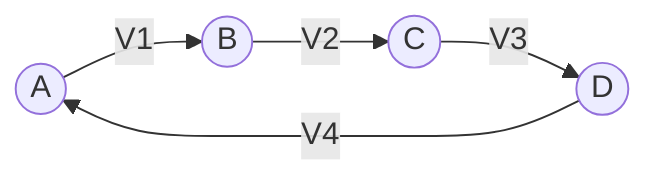
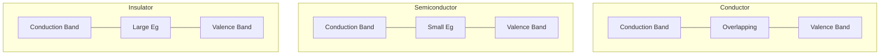
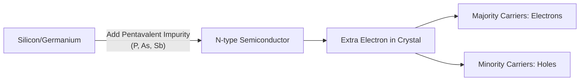
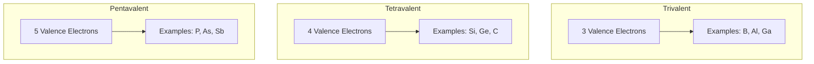
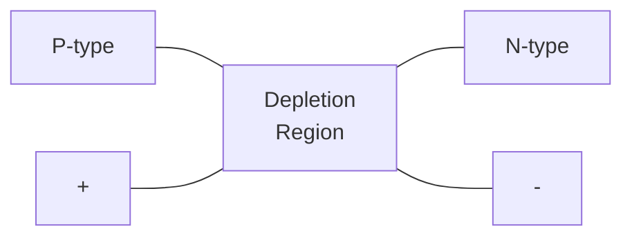
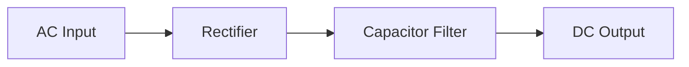
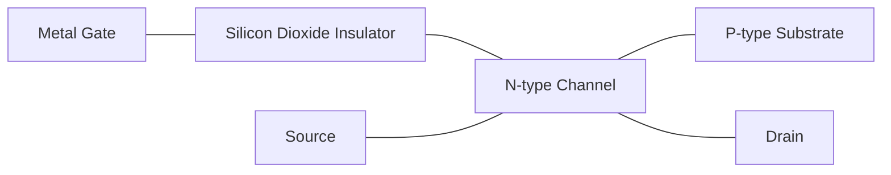

## Question 1(a) [3 marks]

**Explain difference between Active and passive network.**

**Answer**:

| **Active Network** | **Passive Network** |
|-------------------|---------------------|
| Contains at least one active element (voltage/current source) | Contains only passive elements (R, L, C) |
| Can deliver energy to the circuit | Cannot deliver energy to the circuit |
| Can amplify signal power | Cannot amplify signal power |

**Mnemonic:** "Active Adds Power, Passive Parts Take"

## Question 1(b) [4 marks]

**State and explain Kirchhoff's voltage law (KVL).**

**Answer**:

Kirchhoff's Voltage Law (KVL) states that the algebraic sum of all voltages around any closed loop in a circuit is zero.

**Diagram:**



Mathematically: V1 + V2 + V3 + V4 = 0

- **Voltage drops**: When passing through a resistor in direction of current, voltage is negative
- **Voltage rises**: When passing through a source from negative to positive, voltage is positive

**Mnemonic:** "Voltage Loop Equals Zero"

## Question 1(c) [7 marks]

**Define the following terms: (1) Charge (2) Current (3) Potential (4) E.M.F. (5) Inductance (6) Capacitance (7) Frequency.**

**Answer**:

| **Term** | **Definition** |
|----------|----------------|
| **Charge** | The quantity of electricity measured in coulombs (C) |
| **Current** | The rate of flow of electric charge measured in amperes (A) |
| **Potential** | The electrical pressure or energy per unit charge measured in volts (V) |
| **E.M.F.** | Electromotive Force is the energy supplied by a source per unit charge measured in volts (V) |
| **Inductance** | The property of an electric circuit that opposes change in current, measured in henries (H) |
| **Capacitance** | The ability of a body to store electrical charge, measured in farads (F) |
| **Frequency** | Number of complete cycles per second, measured in hertz (Hz) |

**Mnemonic:** "Coulombs' Flow Pressurized by Energy Induces Capacitive Fluctuations"

## Question 1(c) OR [7 marks]

**State Ohm's law. Write its application and limitation.**

**Answer**:

Ohm's Law states that the current flowing through a conductor is directly proportional to the potential difference and inversely proportional to the resistance.

**Diagram:**

```
V = I × R
```

Where:

- V = Voltage (volts)
- I = Current (amperes)
- R = Resistance (ohms)

**Applications:**

- Circuit design and analysis
- Power consumption calculations
- Component value determination
- Voltage divider networks
- Current divider networks

**Limitations:**

- Valid only for linear components
- Not applicable to non-ohmic devices (diodes, transistors)
- Invalid at high temperatures
- Not valid for semiconductors
- Cannot be applied to non-linear resistive elements

**Mnemonic:** "Volts Reveal Amps' Motion"

## Question 2(a) [3 marks]

**Draw and explain energy band diagrams for insulator, conductor and Semiconductor.**

**Answer**:

**Diagram:**



- **Conductor**: Valence and conduction bands overlap, allowing free electron movement
- **Semiconductor**: Small energy gap (0.7-3 eV) between bands allows limited conduction
- **Insulator**: Large energy gap (>3 eV) prevents electrons from moving to conduction band

**Mnemonic:** "Conductors Overlap, Semiconductors Jump Small, Insulators Block All"

## Question 2(b) [4 marks]

**Write statement of Maximum power transfer theorem and reciprocity theorem.**

**Answer**:

| **Theorem** | **Statement** |
|-------------|---------------|
| **Maximum Power Transfer Theorem** | Maximum power is transferred from source to load when the load resistance equals the source internal resistance (RL = RS) |
| **Reciprocity Theorem** | In a linear, bilateral network, if voltage source E in branch 1 produces current I in branch 2, then the same voltage source E in branch 2 will produce the same current I in branch 1 |

**Mnemonic:** "Match Resistance for Maximum Power; Swap Sources, Current Stays"

## Question 2(c) [7 marks]

**Explain the formation and conduction of N-type materials.**

**Answer**:

**Diagram:**



- **Formation Process**: 
  - Pure silicon/germanium doped with pentavalent impurity atoms (P, As, Sb)
  - Impurity atoms have 5 valence electrons (silicon has 4)
  - Four electrons form covalent bonds, fifth becomes free electron
  - Creates excess negative charge carriers

- **Conduction Mechanism**:
  - Majority carriers: Electrons
  - Minority carriers: Holes
  - Electron movement provides electrical conduction
  - Even at room temperature, free electrons enable current flow

**Mnemonic:** "Pentavalent Provides Plus-One Electron"

## Question 2(a) OR [3 marks]

**Define valence band, conduction band and forbidden gap.**

**Answer**:

| **Term** | **Definition** |
|----------|----------------|
| **Valence Band** | Energy band occupied by valence electrons that are bound to specific atoms in the solid |
| **Conduction Band** | Higher energy band where electrons can move freely throughout the material, enabling electrical conduction |
| **Forbidden Gap** | Energy region between valence and conduction bands where no electron states exist |

**Mnemonic:** "Valence Binds, Conduction Flows, Forbidden Gaps Block"

## Question 2(b) OR [4 marks]

**Define the terms active power, reactive power and power factor with power triangle.**

**Answer**:

**Diagram:**

```goat
    |    
    |   S (Apparent Power)
    |  /|
    | / |
    |/__|
    P   Q

P = Active Power
Q = Reactive Power
S = Apparent Power
cosθ = Power Factor
```

- **Active Power (P)**: Actual power consumed, measured in watts (W), P = VI cosθ
- **Reactive Power (Q)**: Power oscillating between source and load, measured in volt-amperes reactive (VAR), Q = VI sinθ
- **Power Factor**: Ratio of active power to apparent power, PF = cosθ = P/S

**Mnemonic:** "Real Power Works, Reactive Power Waits"

## Question 2(c) OR [7 marks]

**Explain the structure of atom of trivalent, tetravalent and pentavalent elements.**

**Answer**:

**Diagram:**



| **Element Type** | **Structure** | **Examples** | **Semiconductor Use** |
|------------------|---------------|--------------|------------------------|
| **Trivalent** | 3 electrons in outermost shell | B, Al, Ga, In | P-type dopant |
| **Tetravalent** | 4 electrons in outermost shell | Si, Ge, C | Semiconductor base |
| **Pentavalent** | 5 electrons in outermost shell | P, As, Sb | N-type dopant |

**Mnemonic:** "Three Accepts, Four Forms, Five Donates"

## Question 3(a) [3 marks]

**Draw the symbol of photodiode and state its application.**

**Answer**:

**Diagram:**

```goat
    |\ 
    | \  
    |  \   
-->|| \--->
    |  /     
    | /   
    |/  
```

**Applications of Photodiode:**

- Light sensors and detectors
- Optical communication systems
- Solar cells and photovoltaic applications
- Camera exposure controls
- Medical equipment (pulse oximeters)

**Mnemonic:** "Light Triggers Electric Current"

## Question 3(b) [4 marks]

**Write a Short note on LED.**

**Answer**:

**Diagram:**

```goat
    |\ 
    | \  
    |  \   
<---|| \--->
    |  /     
    | /   
    |/  
    ▼ ▼
   Light
```

- **Structure**: P-N junction diode that emits light when forward biased
- **Working Principle**: Electron-hole recombination releases energy as photons
- **Types**: Various colors based on semiconductor material (GaAs, GaP, GaN)
- **Advantages**: Low power consumption, long life, small size, fast switching
- **Applications**: Displays, indicators, lighting, remote controls, optical communications

**Mnemonic:** "Electrons Jump, Photons Emit"

## Question 3(c) [7 marks]

**Draw and explain VI characteristic of PN junction diode.**

**Answer**:

**Diagram:**

```goat
    Current
    ^
    |           /
    |          /
    |         /
    |        /
    |       /
    |      /
    |_____/_________> Voltage
    |    /|
    |   / |
    |  /  |
    | /   |
    |/    |
    |     |
    
    Forward bias  | Reverse bias
```

**P-N Junction Diode V-I Characteristics:**

- **Forward Bias Region**:
  - Diode conducts when voltage exceeds knee/cut-in voltage (0.3V for Ge, 0.7V for Si)
  - Current increases exponentially with voltage
  - Low resistance state

- **Reverse Bias Region**:
  - Very small leakage current flows
  - Current remains almost constant with increasing reverse voltage
  - High resistance state
  - Breakdown occurs at high reverse voltage

- **Key Points**:
  - Non-linear device
  - Unidirectional current flow
  - Temperature dependent

**Mnemonic:** "Forward Flows Freely, Reverse Resists Rigidly"

## Question 3(a) OR [3 marks]

**List the applications of PN junction diode.**

**Answer**:

**Applications of PN Junction Diode:**

- Rectification in power supplies
- Signal demodulation
- Logic gates in digital circuits
- Voltage regulation (with zener diodes)
- Signal clipping and clamping circuits
- Protection circuits against reverse polarity

**Mnemonic:** "Rectify, Detect, Clip, Protect"

## Question 3(b) OR [4 marks]

**Explain the formation of depletion region in unbiased P-N junction.**

**Answer**:

**Diagram:**



- **Formation Process**:
  - Electrons from N-side diffuse into P-side
  - Holes from P-side diffuse into N-side
  - Recombination occurs at junction
  - Immobile ions remain (positive in N-side, negative in P-side)
  - Electric field develops, opposing further diffusion
  - Equilibrium is established, creating depletion region

- **Characteristics**: 
  - Free of charge carriers
  - Acts as insulator/barrier
  - Creates built-in potential

**Mnemonic:** "Diffusion Creates Barrier Field"

## Question 3(c) OR [7 marks]

**Explain construction, working and applications of PN junction diode.**

**Answer**:

**Diagram:**


**Construction:**

- P-type semiconductor joined with N-type semiconductor
- Made from single crystal of silicon or germanium
- Metal contacts connected to P and N regions

**Working:**

- **Forward Bias**: 
  - Positive to P, negative to N
  - Depletion region narrows
  - Current flows when voltage exceeds barrier potential
  
- **Reverse Bias**:
  - Positive to N, negative to P
  - Depletion region widens
  - Only small leakage current flows

**Applications:**

- Power rectification
- Signal detection
- Voltage regulation
- Switching applications
- Protection circuits
- Logic gates

**Mnemonic:** "Join P-N, Control Current Direction"

## Question 4(a) [3 marks]

**Define: (1) Ripple frequency (2) Ripple factor (3) PIV of a diode.**

**Answer**:

| **Term** | **Definition** |
|----------|----------------|
| **Ripple Frequency** | Frequency of the AC component remaining in the rectified DC output (2× input frequency for full-wave, 1× for half-wave) |
| **Ripple Factor** | Ratio of RMS value of AC component to the DC component in rectifier output (γ = Vac(rms)/Vdc) |
| **PIV of a diode** | Peak Inverse Voltage is the maximum reverse voltage a diode can withstand without breakdown |

**Mnemonic:** "Frequency Fluctuates, Factor Measures, PIV Protects"

## Question 4(b) [4 marks]

**Give comparison between full wave rectifier with two diodes and full wave bridge rectifier.**

**Answer**:

| **Parameter** | **Center-Tapped Full Wave** | **Bridge Rectifier** |
|---------------|------------------------------|----------------------|
| **Number of Diodes** | 2 | 4 |
| **Transformer** | Center-tapped required | Simple transformer |
| **PIV** | 2Vm | Vm |
| **Efficiency** | 81.2% | 81.2% |
| **Ripple Factor** | 0.48 | 0.48 |
| **Output** | Vm/π | 2Vm/π |
| **Cost** | Higher transformer cost | Higher diode cost |

**Mnemonic:** "Two Diodes Tap Center, Four Make Bridge"

## Question 4(c) [7 marks]

**Explain zener diode as voltage regulator.**

**Answer**:

**Diagram:**

```goat
        Rs            
    +---www-----+
    |           |
Vin |           | Zener    RL    Vout
    |           Z Diode     R     
    |           |           R     
    +-----------+-----------+
```

**Working Principle:**

- Zener diode operates in reverse breakdown region
- Maintains constant voltage across its terminals
- Acts as voltage reference

**Circuit Operation:**

- Series resistor Rs limits current
- Zener conducts when input exceeds breakdown voltage
- Excess current flows through zener diode
- Output voltage remains constant at zener voltage

**Advantages:**

- Simple circuit
- Low cost
- Good regulation for small load changes

**Limitations:**

- Power dissipation in zener and series resistor
- Limited current capability
- Temperature dependency

**Mnemonic:** "Zener Breaks Down to Hold Voltage Steady"

## Question 4(a) OR [3 marks]

**What is rectifier? Explain full wave rectifier with waveforms.**

**Answer**:

**Rectifier:** A circuit that converts AC voltage to pulsating DC voltage.

**Diagram:**

```goat
    +-------+
    |       |
A --+       +-- C
    | XFRMR |         D1
    |       |--+------|>|----+--+
    |       |  |             |  |
    |       |  |             |  |  RL   Output
    |       |  |             |  |  
B --+       +--+             |  |
    |       |  |             |  |
    |       |  |             |  |
    |       |--+------|<|----+--+
    |       |         D2
    +-------+
```

**Waveforms:**

```goat
Input:    ^
          |   /\    /\    /\
          |  /  \  /  \  /  \
          | /    \/    \/    \
          +--------------------
          |
          |\    /\    /\    /
          | \  /  \  /  \  / 
          |  \/    \/    \/

Output:   ^
          |   /\    /\    /\
          |  /  \  /  \  /  \
          | /    \/    \/    \
          +--------------------
```

**Mnemonic:** "Both Half-Cycles Become Positive"

## Question 4(b) OR [4 marks]

**Why filter is required in rectifier? State the different types of filter and explain any one type of filter.**

**Answer**:

**Need for Filter:**

- Rectifier output contains AC ripple component
- Pure DC required for electronic circuits
- Filters smooth pulsating DC by removing AC components

**Types of Filters:**

- Capacitor filter (C-filter)
- Inductor filter (L-filter)
- LC filter
- π (Pi) filter
- CLC filter

**Capacitor Filter:**



**Working:**

- Capacitor charges during voltage rise
- Discharges slowly during voltage fall
- Provides current when input decreases
- Reduces ripple voltage

**Advantages:**

- Simple and inexpensive
- Effective for light loads
- Reduces ripple significantly

**Mnemonic:** "Capacitor Catches Peaks, Releases Slowly"

## Question 4(c) OR [7 marks]

**Write the need of rectifier. Explain bridge rectifier with circuit diagram and draw its input and output waveforms.**

**Answer**:

**Need of Rectifier:**

- Convert AC to DC for electronic devices
- Most electronic circuits require DC power
- Batteries provide DC but AC is distributed
- Building block of power supplies
- Essential for charging systems

**Bridge Rectifier Circuit:**

```goat
          D1        D3
    +-----|>|--------+
    |                |
A --+                +-- DC+
    |                |
    |                |    RL
    |                |
B --+                +-- DC-
    |                |
    +-----|<|--------+
          D2        D4
```

**Input Waveform:**

```goat
    ^
    |    /\      /\
    |   /  \    /  \
    |  /    \  /    \
    | /      \/      \
    +-------------------
    |       /\      /\
    |      /  \    /  \
    |     /    \  /    \
    |\   /      \/      
    | \ /
    |  V
```

**Output Waveform:**

```goat
    ^
    |    /\      /\
    |   /  \    /  \
    |  /    \  /    \
    | /      \/      \
    +-------------------
```

**Working:**

- During positive half cycle: D1 and D4 conduct
- During negative half cycle: D2 and D3 conduct
- Load receives unidirectional current in both cycles
- Utilizes both halves of input waveform

**Mnemonic:** "Four Diodes Direct All Current One Way"

## Question 5(a) [3 marks]

**Explain causes of electronic waste.**

**Answer**:

**Causes of Electronic Waste:**

- Rapid technological advancement
- Planned obsolescence of products
- Decreasing product lifespan
- Consumer behavior preferring new devices
- Limited repair options for electronics
- High repair costs compared to replacement

**Mnemonic:** "Technology Advances, Products Expire Rapidly"

## Question 5(b) [4 marks]

**Compare PNP and NPN transistors.**

**Answer**:

| **Parameter** | **PNP Transistor** | **NPN Transistor** |
|---------------|--------------------|--------------------|
| **Symbol** |  |  |
| **Majority Carriers** | Holes | Electrons |
| **Current Flow** | Emitter to Collector | Collector to Emitter |
| **Biasing** | Emitter more positive than Base | Base more positive than Emitter |
| **Switching Speed** | Slower | Faster |
| **Applications** | Low frequency, high current | High frequency, switching |

**Diagram:**

```goat
    NPN:         PNP:
    
    C            C
    |            |
    |            |
    B---->       <----B
    |            |
    |            |
    E            E
```

**Mnemonic:** "Negative-Positive-Negative vs Positive-Negative-Positive"

## Question 5(c) [7 marks]

**Draw the symbol, explain the construction and working of MOSFET.**

**Answer**:

**Symbol:**

```goat
         D (Drain)
         |
         |
G (Gate) |
----||---+
         |
         |
         S (Source)
```

**Construction:**



**Working Principle:**

- **Enhancement Mode N-Channel MOSFET:**
  - No channel exists without gate voltage
  - Positive gate voltage attracts electrons from substrate
  - Induced channel allows current flow from drain to source
  - Increasing gate voltage enhances conductivity
  
- **Key Features:**
  - Voltage-controlled device (high input impedance)
  - No gate current required (unlike BJT)
  - Faster switching than BJT
  - Lower power dissipation

**Applications:**

- Digital logic circuits
- Switching applications
- Amplifiers
- Power control devices

**Mnemonic:** "Gate Voltage Creates Electron Channel"

## Question 5(a) OR [3 marks]

**Explain methods to handle electronic waste.**

**Answer**:

**Methods to Handle Electronic Waste:**

| **Method** | **Description** |
|------------|-----------------|
| **Reduce** | Designing longer-lasting electronics, modular design for upgrading |
| **Reuse** | Donating or selling functional devices, repurposing components |
| **Recycle** | Proper dismantling and material recovery (precious metals, plastics) |
| **Regulation** | E-waste management policies, extended producer responsibility |
| **Recovery** | Extracting valuable materials through specialized processes |

**Mnemonic:** "Reduce, Reuse, Recycle, Regulate, Recover"

## Question 5(b) OR [4 marks]

**Derive the relationship between αdc and βdc.**

**Answer**:

**Diagram:**

```goat
               IC
              ↑
              |  
              |
    IB →      |      →  
        B ----+---- C
              |
              |
              |
              E
              ↓
              IE
```

**Transistor Current Relationships:**

- IE = IC + IB (Current entering equals current leaving)
- αdc = IC/IE (Common Base current gain)
- βdc = IC/IB (Common Emitter current gain)

**Derivation:**

- From IE = IC + IB
- Divide both sides by IC: IE/IC = 1 + IB/IC
- Therefore: 1/αdc = 1 + 1/βdc
- Solving for βdc: βdc = αdc/(1-αdc)
- And for αdc: αdc = βdc/(1+βdc)

**Table of Values:**
| αdc | βdc |
|-----|-----|
| 0.9 | 9 |
| 0.95 | 19 |
| 0.99 | 99 |

**Mnemonic:** "Alpha-Beta Relate as αdc = βdc/(1+βdc)"

## Question 5(c) OR [7 marks]

**Explain common collector configuration with its input and output characteristics.**

**Answer**:

**Common Collector Circuit (Emitter Follower):**

```goat
              +VCC
               |
               R
               |
               C
    +----+     |
    |    |     |
    Vin  |     +---+ Output
    |    |     |
    +----+-----+
         |     |
         B     E
         |     |
         +-----+
               |
               RE
               |
              GND
```

**Input Characteristics:** (IB vs VBE)

```goat
    IB ^
       |           /
       |          /
       |         /
       |        /
       |       /
       |      /
       |     /
       |    /
       |   /
       |  /
       | /
       |/
       +--------------> VBE
```

**Output Characteristics:** (IE vs VCE)

```goat
    IE ^
       |    ---------------
       |   /
       |  /
       | /
       |/
       +--------------> VCE
       
       IB3 > IB2 > IB1 > 0
```

**Key Features:**

- Voltage gain ≈ 1 (slightly less)
- High current gain (β+1)
- High input impedance
- Low output impedance
- No phase inversion between input and output
- Used as buffer/impedance matching circuit

**Mnemonic:** "Emitter Follows Base Voltage"
