## પ્રશ્ન 1(અ) [3 ગુણ]

**સંજ્ઞા દોરો(૧)એસ.સી.આર(૨)ડાયેક(૩)ટ્રાયેક**

**જવાબ**:

**આકૃતિ:**

```
SCR સંજ્ઞા:         DIAC સંજ્ઞા:         TRIAC સંજ્ઞા:
   A                   A1                  MT2
   |                    |                   |
   ▼                    ▼                   ▼
  ┌─┐                  ┌─┐                 ┌─┐
  │ │                  │ │                 │ │
──┤ ├──              ──┤ ├──             ──┤ ├──
  │ │                  │ │                 │ │
  └─┘                  └─┘                 └─┘
   ▲                    ▲                   ▲
   |                    |                   |
   K                   A2                  MT1
  /                                        /
 /                                        /
G                                        G
```

- **SCR (સિલિકોન કંટ્રોલ્ડ રેક્ટિફાયર)**: ત્રણ-ટર્મિનલવાળું ઉપકરણ - એનોડ, કેથોડ અને ગેટ
- **DIAC (ડાયોડ AC સ્વિચ)**: બે-ટર્મિનલવાળું બાયડાયરેક્શનલ ઉપકરણ - A1 અને A2 
- **TRIAC (ટ્રાયોડ AC સ્વિચ)**: ત્રણ-ટર્મિનલવાળું બાયડાયરેક્શનલ ઉપકરણ - MT1, MT2 અને ગેટ

**મેમરી ટ્રીક:** "AGK for SCR, AA for DIAC, MMG for TRIAC"

## પ્રશ્ન 1(બ) [4 ગુણ]

**પદો સમજાવો(૧)સી.એમ.આર.આર.(૨)સ્લૂરેટ્.**

**જવાબ**:

**કોષ્ટક: ઓપ-એમ્પ પેરામીટર્સ**

| પેરામીટર | વ્યાખ્યા | મહત્વ |
|-----------|------------|--------------|
| **CMRR (કોમન મોડ રિજેક્શન રેશિયો)** | ડિફરેન્શિઅલ ગેઈન અને કોમન મોડ ગેઈનનો ગુણોત્તર dB માં | ઊંચો CMRR એટલે કોમન ઇનપુટ સિગ્નલ્સનો વધુ સારો રિજેક્શન |
| **Slew Rate (સ્લૂ રેટ)** | આઉટપુટ વોલ્ટેજનો મહત્તમ પરિવર્તન દર (V/μs) | ઓપ-એમ્પ ઝડપથી બદલાતા ઇનપુટ્સને કેવી ઝડપે પ્રતિસાદ આપી શકે છે તે નક્કી કરે છે |

- **CMRR ફોર્મ્યુલા**: CMRR = 20 log₁₀(Ad/Acm) dB
- **Slew Rate મહત્વ**: ઊંચી ફ્રીક્વન્સી પરફોર્મન્સને અસર કરે છે અને વિકૃતિ અટકાવે છે

**મેમરી ટ્રીક:** "Common Mode Rejected Rapidly, Slew shows Signal Speed"

## પ્રશ્ન 1(ક) [7 ગુણ]

**સમીન્ગ એમ્પલીફાયર દોરો અને સમજાવો.**

**જવાબ**:

**આકૃતિ:**

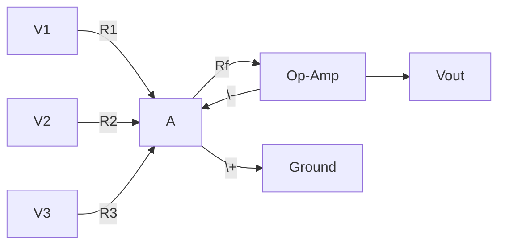

**સમિંગ એમ્પ્લિફાયરની કાર્યપ્રણાલી:**

- **સર્કિટ કાર્ય**: મલ્ટિપલ ઇનપુટ વોલ્ટેજને સ્કેલિંગ સાથે જોડે છે
- **આઉટપુટ સમીકરણ**: Vout = -(Rf/R1 × V1 + Rf/R2 × V2 + Rf/R3 × V3)
- **ઇન્વર્ટિંગ કન્ફિગરેશન**: ઇનપુટ સિગ્નલ્સ 180° ફેઝ શિફ્ટ અનુભવે છે
- **ગેઈન કંટ્રોલ**: Rf/Rn દરેક ઇનપુટ સિગ્નલનું વજન નક્કી કરે છે

- **ઉપયોગો**: ઓડિયો મિક્સિંગ, એનાલોગ કમ્પ્યુટેશન, સિગ્નલ પ્રોસેસિંગ
- **મુખ્ય વિશેષતા**: ઇન્વર્ટિંગ ઇનપુટ પર વર્ચ્યુઅલ ગ્રાઉન્ડ વિશ્લેષણને સરળ બનાવે છે

**મેમરી ટ્રીક:** "Sum with Weights: Vout = -Rf(V1/R1 + V2/R2 + V3/R3)"

## પ્રશ્ન 1(ક OR) [7 ગુણ]

**ડીએ કન્વટ્ટર દોરો અને સમજાવો.**

**જવાબ**:

**આકૃતિ:**

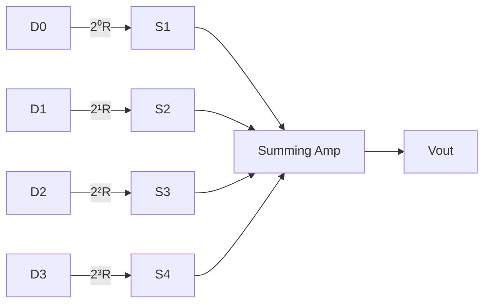

**R-2R લેડર DAC કાર્યપ્રણાલી:**

- **કાર્ય**: ડિજિટલ બાઇનરી ઇનપુટને એનાલોગ આઉટપુટ વોલ્ટેજમાં રૂપાંતરિત કરે છે
- **કાર્યસિદ્ધાંત**: વેઇટેડ રેસિસ્ટર નેટવર્ક સ્કેલ્ડ કરંટ બનાવે છે
- **બાઇનરી વેઇટિંગ**: દરેક બિટ તેના સ્થાન (2ⁿ) ના પ્રમાણમાં વોલ્ટેજમાં યોગદાન આપે છે
- **રિઝોલ્યુશન**: બિટ્સની સંખ્યા (N) દ્વારા 1/2ᴺ ફુલ સ્કેલ તરીકે નક્કી થાય છે

- **ફાયદા**: સરળ ડિઝાઇન, સારી ચોકસાઈ, ઝડપી રૂપાંતરણ
- **ઉપયોગો**: ઓડિયો ઉપકરણો, સિગ્નલ જનરેશન, કંટ્રોલ સિસ્ટમ્સ

**મેમરી ટ્રીક:** "Digital Bits to Analog Steps - R-2R makes the magic"

## પ્રશ્ન 2(અ) [3 ગુણ]

**ટ્રાન્જીસ્ટર નુ થર્મલ રન અવે વર્ણવો.**

**જવાબ**:

**થર્મલ રનઅવે પ્રક્રિયા:**


- **વ્યાખ્યા**: સ્વ-ત્વરણની પ્રક્રિયા જ્યાં ટ્રાન્ઝિસ્ટર ગરમ થાય છે અને વધુ કરંટ ખેંચે છે
- **કારણ**: બેઝ-એમિટર વોલ્ટેજનો નેગેટિવ તાપમાન કોએફિશિયન્ટ
- **નિવારણ**: યોગ્ય હીટ સિંક અને સ્ટેબિલાઈઝેશન સર્કિટનો ઉપયોગ

**મેમરી ટ્રીક:** "Heat feeds Current feeds Heat - a dangerous loop"

## પ્રશ્ન 2(બ) [4 ગુણ]

**વૉલ્ટેજ સીરીજ નેગેટીવ ફીડબેક દોરો અને સમજાવો.**

**જવાબ**:

**આકૃતિ:**

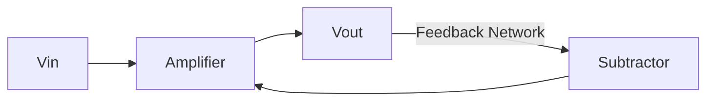

**વોલ્ટેજ સીરીઝ નેગેટિવ ફીડબેક:**

| પેરામીટર | નેગેટિવ ફીડબેકની અસર |
|-----------|----------------------------|
| **ગેઈન સ્ટેબિલિટી** | સુધારો, એમ્પ્લિફાયર પેરામીટર્સ પર ઓછો આધાર |
| **બેન્ડવિડ્થ** | ફીડબેક ફેક્ટરના પ્રમાણમાં વધારો |
| **ડિસ્ટોર્શન** | નોંધપાત્ર રીતે ઘટાડો |
| **ઇનપુટ ઇમ્પેડન્સ** | વધારો |

- **કાર્યસિદ્ધાંત**: આઉટપુટ વોલ્ટેજ સેમ્પલ કરીને ઇનપુટમાં પાછો ફીડ કરવામાં આવે છે
- **ગેઈન ફોર્મ્યુલા**: ક્લોઝ્ડ-લૂપ ગેઈન = ઓપન-લૂપ ગેઈન/(1 + βA)

**મેમરી ટ્રીક:** "Series says Sample Voltage, Stabilize Gain"

## પ્રશ્ન 2(ક) [7 ગુણ]

**કોમન એમીટર એમ્પલીફાયર માટે ડીસી લોડ લાઈન દોરો અને સમજાવો.**

**જવાબ**:

**આકૃતિ:**

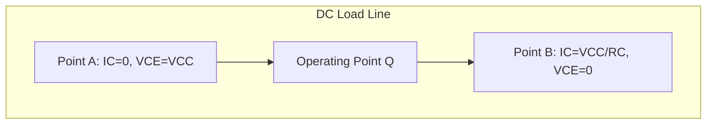

**DC લોડ લાઈનની વિશેષતાઓ:**

- **વ્યાખ્યા**: બધા સંભવિત ઓપરેટિંગ પોઇન્ટ્સની ગ્રાફિકલ રજૂઆત
- **સમીકરણ**: IC = VCC/RC - VCE/RC
- **ચાવીરૂપ બિંદુઓ**:
  * સેચ્યુરેશન પોઇન્ટ (VCE ≈ 0V, IC = VCC/RC)
  * કટ-ઓફ પોઇન્ટ (IC ≈ 0mA, VCE = VCC)
  * Q-પોઇન્ટ (એમ્પ્લિફિકેશન માટે પસંદ કરેલ ઓપરેટિંગ પોઇન્ટ)

- **મહત્વ**: બાયસિંગ સ્ટેબિલિટી અને આઉટપુટ સિગ્નલની મર્યાદા નક્કી કરે છે
- **સંબંધ**: DC લોડ લાઈન સર્કિટ કોમ્પોનન્ટ્સ (VCC અને RC) દ્વારા નિશ્ચિત થાય છે

**મેમરી ટ્રીક:** "Connect Cutoff to Saturation for DC Load Line"

## પ્રશ્ન 2(અ OR) [3 ગુણ]

**ટ્રાન્જીસ્ટર મા ઓપરેટીન્ગ પોઈન્ટ(ક્યુ પોઈન્ટ) સમજાવો.**

**જવાબ**:

**Q-પોઇન્ટ (ઓપરેટિંગ પોઇન્ટ):**

```
      |
  Ic  |      DC Load Line
      |          /
      |         /
      |        /
      |       * Q-Point
      |      /
      |     /
      |    /
      |___/____________
          Vce
```

- **વ્યાખ્યા**: એકટિવ રીજનમાં ટ્રાન્ઝિસ્ટર ઓપરેટ કરે તે માટેનો ચોક્કસ DC બાયસ પોઇન્ટ
- **મહત્વ**: વિકૃતિ વિના આઉટપુટ સિગ્નલની રેન્જ નક્કી કરે છે
- **પસંદગીના માપદંડ**: મહત્તમ સ્વિંગ માટે લોડ લાઈનનું મધ્ય બિંદુ

**મેમરી ટ્રીક:** "Quality amplification needs Quiet bias at Q-point"

## પ્રશ્ન 2(બ OR) [4 ગુણ]

**હાટટલે ઓસ્સીલેટર દોરો અને સમજાવો.**

**જવાબ**:

**આકૃતિ:**


**હાર્ટલે ઓસિલેટર:**

- **કન્ફિગરેશન**: ટેપ્ડ ઇન્ડક્ટર ફીડબેક સાથે કોમન એમિટર
- **ફ્રીક્વન્સી ફોર્મ્યુલા**: f = 1/[2π√(C×(L1+L2))]
- **ફેઝ શિફ્ટ**: ઓસિલેશન માટે 360° કુલ ફેઝ શિફ્ટની ખાતરી કરે છે
- **ફીડબેક**: ઇન્ડક્ટિવ વોલ્ટેજ ડિવાઇડર પોઝિટિવ ફીડબેક પ્રદાન કરે છે

**મેમરી ટ્રીક:** "Hartley Has two coils with inductance for LC oscillation"

## પ્રશ્ન 2(ક OR) [7 ગુણ]

**કોમન એમીટર એમ્પલીફાયર માટે એસી લોડ લાઈન દોરો અને સમજાવો.**

**જવાબ**:

**આકૃતિ:**

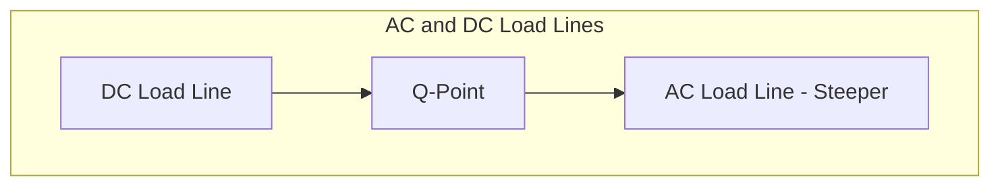

**AC લોડ લાઈનની વિશેષતાઓ:**

- **વ્યાખ્યા**: સિગ્નલ એમ્પ્લિફિકેશન દરમિયાન ડાયનેમિક ઓપરેશનનું પ્રતિનિધિત્વ કરે છે
- **સમીકરણ**: ic = (VCC-VCEQ)/R'c - vce/R'c જ્યાં R'c = RC||RL
- **DC લોડ લાઈન સાથે તુલના**:
  * AC લોડ લાઈન DC લોડ લાઈન કરતા વધુ તીવ્ર ઢાળવાળી હોય છે
  * Q-પોઇન્ટ પરથી પસાર થાય છે
  * વોલ્ટેજ અને કરંટ સિગ્નલ સ્વિંગ નક્કી કરે છે

- **મહત્વ**: વિકૃતિ વગરનો મહત્તમ આઉટપુટ સિગ્નલ વ્યાખ્યાયિત કરે છે
- **મર્યાદા પરિબળ**: સેચ્યુરેશન અને કટ-ઓફ ક્ષેત્રોને ટાળવું

**મેમરી ટ્રીક:** "AC Amplitude Controlled by Load line Angle"

## પ્રશ્ન 3(અ) [3 ગુણ]

**ફીક્સડ બાયાસ સર્કટટ દોરો અને તેનું કાયટ સમજાવો.**

**જવાબ**:

**આકૃતિ:**

```
      Vcc
       |
       R
       |
       |C
       |----Output
       |
      /|
     / |
    /--|
   /   |
  |    |
  B    E
  |    |
  Rb   |
  |    |
  |____|
  |
  Vin
```

- **સ્ટ્રક્ચર**: VCC સાથે જોડાયેલ બેઝ રેઝિસ્ટર, લોડ માટે કલેક્ટર રેઝિસ્ટર
- **ઓપરેશન**: ફિક્સ્ડ બેઝ કરંટ ટ્રાન્ઝિસ્ટરને બાયસ કરે છે
- **ગેરફાયદો**: તાપમાન પરિવર્તન સામે નબળી સ્થિરતા

**મેમરી ટ્રીક:** "Fixed Bias Feeds Base from power supply"

## પ્રશ્ન 3(બ) [4 ગુણ]

**હાટલે ઓસ્સીલેટરમા L1=5mH, L2=10mH, C=0.01µF. ઓસ્સીલેશન ની ફ્રીક્વન્સીની ગણતરી કરો.**

**જવાબ**:

**ઉકેલ:**

- **આપેલું**: L1=5mH, L2=10mH, C=0.01µF
- **ફ્રીક્વન્સી ફોર્મ્યુલા**: f = 1/[2π√(C×(L1+L2))]
- **ગણતરી**:
  * કુલ ઈન્ડક્ટન્સ LT = L1 + L2 = 5mH + 10mH = 15mH = 15×10⁻³ H
  * C = 0.01µF = 1×10⁻⁸ F
  * f = 1/[2π√(15×10⁻³ × 1×10⁻⁸)]
  * f = 1/[2π√(15×10⁻¹¹)]
  * f = 1/[2π×3.873×10⁻⁶]
  * f = 1/[24.33×10⁻⁶]
  * f = 41,101 Hz ≈ 41.1 kHz

**મેમરી ટ્રીક:** "For Hartley's frequency, add coils then take square root"

## પ્રશ્ન 3(ક) [7 ગુણ]

**બે સ્ટેજ આર.સી. કપલ્ડ એમ્પલીફાયરનો ફ્રીક્વન્સી રીસપોન્સ કવટ દોરો અને સમજાવો.**

**જવાબ**:

**આકૃતિ:**

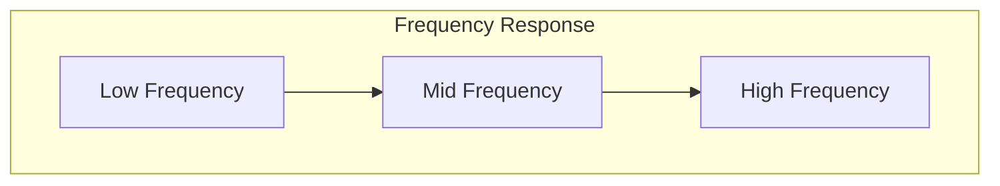

**બે-સ્ટેજ RC કપલ્ડ એમ્પ્લિફાયર ફ્રીક્વન્સી રિસ્પોન્સ:**

- **લો-ફ્રીક્વન્સી રીજન**: ફ્રીક્વન્સી સાથે ગેઈન વધે છે (< 50Hz)
  * કપલિંગ અને બાયપાસ કેપેસિટર્સથી મર્યાદિત
- **મિડ-ફ્રીક્વન્સી રીજન**: સતત મહત્તમ ગેઈન (50Hz-20kHz)
  * ફ્લેટ રિસ્પોન્સ, આદર્શ ઓપરેટિંગ રીજન
- **હાઈ-ફ્રીક્વન્સી રીજન**: ફ્રીક્વન્સી સાથે ગેઈન ઘટે છે (> 20kHz)
  * ટ્રાન્ઝિસ્ટર કેપેસિટન્સ અને મિલર ઇફેક્ટથી મર્યાદિત

- **બેન્ડવિડ્થ**: મહત્તમ ગેઈનના ≥ 70.7% ગેઈન સાથેની ફ્રીક્વન્સીની રેન્જ
- **કટ-ઓફ ફ્રીક્વન્સી**: એ બિંદુઓ જ્યાં ગેઈન 3dB (0.707 ગણો મહત્તમ ગેઈન) ઘટે છે

**મેમરી ટ્રીક:** "Low-flat-high: capacitors block, amplify well, then roll off"

## પ્રશ્ન 3(અ OR) [3 ગુણ]

**ઓસ્સીલેશન માટેનો બાખૌસેન ક્રાઈટીરીયા વિગતવાર સમજાવો.**

**જવાબ**:

**બાર્ખોસેન ક્રાઈટેરિયન:**

| શરત | આવશ્યકતા |
|-----------|-------------|
| **લૂપ ગેઈન** | ચોક્કસ 1 (Aβ = 1) હોવો જરૂરી |
| **ફેઝ શિફ્ટ** | લૂપની આસપાસ 0° અથવા 360° હોવો જરૂરી |

- **હેતુ**: ડેમ્પિંગ વિના સતત ઓસિલેશન સુનિશ્ચિત કરે છે
- **પરિણામો**: 
  * જો Aβ < 1: ઓસિલેશન ધીમે ધીમે ઓછા થાય છે
  * જો Aβ > 1: ઓસિલેશન વધતા રહે છે, નોન-લિનિયારિટી દ્વારા મર્યાદિત થાય ત્યાં સુધી
  * જો Aβ = 1: સ્થિર ઓસિલેશન જાળવી રાખવામાં આવે છે

**મેમરી ટ્રીક:** "Barkhausen's Balance: Loop Gain=1, Phase=360°"

## પ્રશ્ન 3(બ OR) [4 ગુણ]

**એમ્પલીફાયરના ગેઈન પર નેગેટીવ ફીડબેકની અસર સમજાવો.**

**જવાબ**:

**એમ્પ્લિફાયર ગેઈન પર નેગેટિવ ફીડબેકની અસર:**

| પેરામીટર | ફીડબેક વિના | ફીડબેક સાથે |
|-----------|------------------|---------------|
| **વોલ્ટેજ ગેઈન** | A | A/(1+Aβ) |
| **સ્ટેબિલિટી** | ઓછી સ્થિર | વધુ સ્થિર |
| **બેન્ડવિડ્થ** | નીચી | ઉંચી |
| **ડિસ્ટોર્શન** | વધારે | ઓછું |

- **ગેઈન ઘટાડો**: ગેઈન (1+Aβ) ફેક્ટર દ્વારા ઘટે છે
- **ગેઈન-બેન્ડવિડ્થ ટ્રેડઓફ**: ગેઈન ઘટતાં બેન્ડવિડ્થ વધે છે
- **ગેઈન સ્ટેબિલાઈઝેશન**: તાપમાન અને કોમ્પોનન્ટ વેરિએશન દ્વારા ઓછી અસરગ્રસ્ત

**મેમરી ટ્રીક:** "Negative Feedback: Less Gain, More Stability"

## પ્રશ્ન 3(ક OR) [7 ગુણ]

**ફેન રેગ્યુલેટરની સરકીટ દોરો અને તે ફેનની સ્પીડ કેવી રીતે કંટ્રોલ કરે છે તે સમજાવો**

**જવાબ**:

**આકૃતિ:**

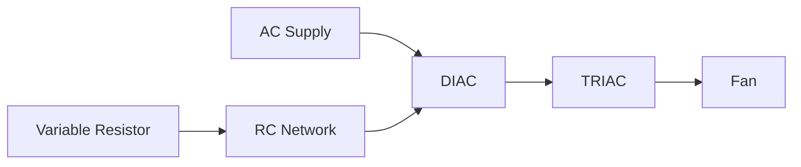

**ફેન રેગ્યુલેટર ઓપરેશન:**

- **કંટ્રોલ પદ્ધતિ**: TRIAC અને DIAC વાપરીને ફેઝ એંગલ કંટ્રોલ
- **કાર્યસિદ્ધાંત**: RC નેટવર્ક વેરિએબલ ફેઝ શિફ્ટ બનાવે છે
- **સ્પીડ કંટ્રોલ**: વેરિએબલ રેઝિસ્ટર RC ટાઈમ કોન્સ્ટન્ટ એડજસ્ટ કરે છે
- **ઓપરેશન સિક્વન્સ**:
  * RC નેટવર્ક DIAC ફાયરિંગમાં વિલંબ કરે છે
  * DIAC ટ્રાયકને AC સાઇકલમાં એડજસ્ટેબલ પોઇન્ટ પર ટ્રિગર કરે છે
  * TRIAC AC હાફ-સાઇકલના બાકીના ભાગ માટે કન્ડક્ટ કરે છે
  * ઓછો કન્ડક્શન સમય = ફેન પર ઓછી પાવર = ધીમી ગતિ

- **ફાયદા**: સરળ ડિઝાઇન, સુંવાળું નિયંત્રણ, ઊર્જા કાર્યક્ષમ
- **ઉપયોગો**: સિલિંગ ફેન, એક્ઝોસ્ટ ફેન, કૂલિંગ સિસ્ટમ્સ

**મેમરી ટ્રીક:** "Delay the TRIAC firing, control fan's speed"

## પ્રશ્ન 4(અ) [3 ગુણ]

**નેચરલ કોમ્યુટેશન પર ટૂંક નોંધ લખો.**

**જવાબ**:

**નેચરલ કોમ્યુટેશન:**

- **વ્યાખ્યા**: SCR જ્યારે કરંટ હોલ્ડિંગ કરંટ કરતાં નીચે પડે ત્યારે આપોઆપ બંધ થાય છે
- **પ્રક્રિયા**: AC સર્કિટમાં દરેક ઝીરો-ક્રોસિંગ પોઇન્ટ પર થાય છે
- **જરૂરિયાતો**: કોઈ બાહ્ય ઘટકોની જરૂર નથી, AC ઓપરેશનમાં સ્વાભાવિક છે

**મેમરી ટ્રીક:** "Natural Commutation: Zero Current Crossings Turn Off Thyristors"

## પ્રશ્ન 4(બ) [4 ગુણ]

**એમ્પલીફાયરના પેરામીટર ગેઈન અને બેન્ડવીડ્થ સમજાવો.**

**જવાબ**:

**એમ્પ્લિફાયર પેરામીટર્સ:**

| પેરામીટર | વ્યાખ્યા | ફોર્મ્યુલા |
|-----------|------------|---------|
| **ગેઈન (A)** | આઉટપુટનો ઇનપુટ સિગ્નલ સાથેનો ગુણોત્તર | A = Vout/Vin |
| **બેન્ડવિડ્થ (BW)** | ફ્રીક્વન્સી રેન્જ જ્યાં ગેઈન ≥ 70.7% મહત્તમ | BW = fH - fL |

- **ગેઈન-બેન્ડવિડ્થ પ્રોડક્ટ**: અચળ રહે છે (GBP = ગેઈન × બેન્ડવિડ્થ)
- **કટ-ઓફ ફ્રીક્વન્સી**: લોઅર (fL) અને હાયર (fH) ફ્રીક્વન્સી જ્યાં ગેઈન 3dB ઘટે છે
- **મહત્વ**: એમ્પ્લિફાયરની વિવિધ ફ્રીક્વન્સી સંભાળવાની ક્ષમતા નક્કી કરે છે

**મેમરી ટ્રીક:** "Good Amplifiers Balance Width and Magnitude"

## પ્રશ્ન 4(ક) [7 ગુણ]

**ટ્રાયેકનું કન્સ્ટ્રકશન અને લાક્ષણિકતા દોરો તેનું કાર્ય સમજાવો. ટ્રાયેકના ઉપયોગો લખો.**

**જવાબ**:

**TRIAC કન્સ્ટ્રક્શન અને લાક્ષણિકતા:**

```
           MT2
            |
      ------+------
     /      |      \
    /  P    |    N  \
   +--------+--------+
   |        |        |
   |    N   |    P   |
   +--------+--------+
   |        |        |
   |    P   |    N   |
   +--------+--------+
    \       |       /
     \      |      /
      ------+------
            |
           MT1
            |
            G
```

**I-V લાક્ષણિકતા:**

```
    I
    ^
    |      /|
    |     / |
    |    /  |
    |---+---|----> V
    |   /   |
    |  /    |
    | /     |
```

**TRIAC ઓપરેશન:**

- **સ્ટ્રક્ચર**: પાંચ-લેયર PNPN બાયડાયરેક્શનલ ડિવાઇસ
- **સ્વિચિંગ**: ટ્રિગર થયા પછી બંને દિશામાં કન્ડક્ટ કરે છે
- **ટ્રિગરિંગ મોડ્સ**: ફોર ક્વોડ્રન્ટ ઓપરેશન શક્ય
- **ટર્ન-ઓફ**: કરંટ ઝીરો-ક્રોસિંગ પર નેચરલ કોમ્યુટેશન

**ઉપયોગો:**

- **લાઇટ ડિમર્સ**
- **ફેન સ્પીડ કંટ્રોલર્સ**
- **હીટર કંટ્રોલ્સ**
- **મોટર સ્પીડ રેગ્યુલેશન**
- **AC પાવર સ્વિચિંગ**

**મેમરી ટ્રીક:** "TRIAC Takes AC Control in Both Directions"

## પ્રશ્ન 4(અ OR) [3 ગુણ]

**એસ.સી.આર ના કોઈપણ ત્રણ ઉપયોગો લખો**

**જવાબ**:

**SCR ના ઉપયોગો:**

| ઉપયોગ | કાર્ય |
|-------------|----------|
| **DC મોટર સ્પીડ કંટ્રોલ** | મોટર્સને વેરિએબલ DC પ્રદાન કરે છે |
| **બેટરી ચાર્જર્સ** | ચાર્જિંગ કરંટને નિયંત્રિત કરે છે |
| **પાવર ઈન્વર્ટર્સ** | DC ને AC માં કાર્યક્ષમતાથી રૂપાંતરિત કરે છે |

- **ફાયદા**: ઉચ્ચ પાવર હેન્ડલિંગ, કાર્યક્ષમ નિયંત્રણ, મજબૂત ઓપરેશન
- **મર્યાદાઓ**: DC સર્કિટ્સમાં ફોર્સ્ડ કોમ્યુટેશનની જરૂર પડે છે

**મેમરી ટ્રીક:** "SCR Controls DC - Motors, Batteries, Inverters"

## પ્રશ્ન 4(બ OR) [4 ગુણ]

**એસ.સી.આર ના સંદર્ભમાં હોલ્ડીંગ કરન્ટ અને લેચીંગ કરન્ટ સમજાવો**

**જવાબ**:

**SCR કરંટ પેરામીટર્સ:**

| પેરામીટર | વ્યાખ્યા | સામાન્ય મૂલ્યો |
|-----------|------------|----------------|
| **હોલ્ડિંગ કરંટ (IH)** | કન્ડક્શન જાળવવા માટેનો લઘુત્તમ કરંટ | 5-40 mA |
| **લેચિંગ કરંટ (IL)** | કન્ડક્શન સ્થાપિત કરવા માટેનો લઘુત્તમ કરંટ | 10-100 mA |

- **લેચિંગ કરંટ**: SCR લેચ થાય તે માટે ટ્રિગરિંગ પછી ટૂંક સમય માટે આટલો કરંટ વહેવો જોઈએ
- **હોલ્ડિંગ કરંટ**: SCR ને કન્ડક્શનમાં રાખવા માટે જાળવવો જોઈએ
- **સંબંધ**: સામાન્ય રીતે IL > IH
- **મહત્વ**: વિશ્વસનીય સ્વિચિંગ ઓપરેશન માટે મહત્વપૂર્ણ

**મેમરી ટ્રીક:** "Latch with more, Hold with less, both keep SCR conducting"

## પ્રશ્ન 4(ક OR) [7 ગુણ]

**ઓપરેશનલ એમ્પલીફાયરનો બ્લોક ડાયગ્રામ દોરો અને વિગતવાર સમજાવો**

**જવાબ**:

**ઓપરેશનલ એમ્પ્લિફાયર બ્લોક ડાયાગ્રામ:**

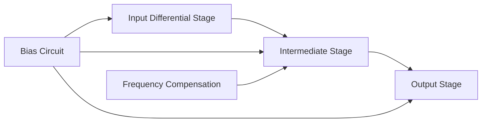

**ઓપ-એમ્પ બ્લોક્સ અને ફંક્શન્સ:**

- **ઇનપુટ ડિફરેન્શિયલ સ્ટેજ**:
  * ઉચ્ચ ઇનપુટ ઇમ્પેડન્સ
  * કોમન-મોડ સિગ્નલ્સને રિજેક્ટ કરે છે
  * ડિફરેન્શિયલ વોલ્ટેજ ગેઈન પ્રદાન કરે છે
- **ઇન્ટરમીડિએટ સ્ટેજ**:
  * વધારાનો વોલ્ટેજ ગેઈન
  * લેવલ શિફ્ટિંગ
  * ફ્રીક્વન્સી કોમ્પેન્સેશન
- **આઉટપુટ સ્ટેજ**:
  * ઓછી આઉટપુટ ઇમ્પેડન્સ
  * કરંટ એમ્પ્લિફિકેશન
  * લોડ્સ ચલાવવા માટે પાવર કેપેબિલિટી
- **બાયસ સર્કિટ**:
  * યોગ્ય ઓપરેટિંગ પોઇન્ટ્સ સ્થાપિત કરે છે
  * તાપમાન સ્થિરતા
- **ફ્રીક્વન્સી કોમ્પેન્સેશન**:
  * ઓસિલેશન અટકાવે છે
  * ફ્રીક્વન્સી રિસ્પોન્સ નિયંત્રિત કરે છે

**મેમરી ટ્રીક:** "Differential Input, Gain in Middle, Power at Output"

## પ્રશ્ન 5(અ) [3 ગુણ]

**ઇનવરટિંગ એમ્પલીફાયર દોરો અને ટૂંકમાં સમજાવો**

**જવાબ**:

**ઇન્વર્ટિંગ એમ્પ્લિફાયર સર્કિટ:**

```
          Rf
          ___
    Vin---| |-----+
          ---     |
                  |
                 _|_
    +------+    /   \
    |      |---+     +---Vout
    |      |    \___/
Vin-+      |      |
    |Op-Amp|      |
    +------+      |
                  |
                 ---
                 ///
```

- **ગેઈન ફોર્મ્યુલા**: Vout = -(Rf/Rin) × Vin
- **ઓપરેશન**: ઇનપુટ સિગ્નલ એમ્પ્લિફિકેશન સાથે ઇન્વર્ટ થાય છે
- **વર્ચ્યુઅલ ગ્રાઉન્ડ**: ઇન્વર્ટિંગ ઇનપુટ 0V પર જાળવવામાં આવે છે

**મેમરી ટ્રીક:** "Inverting means Negative Gain equals -Rf/Rin"

## પ્રશ્ન 5(બ) [4 ગુણ]

**રેગ્યુલેટેડ પાવર સપ્લાયનો બ્લોક ડાયગ્રામ દોરો અને સમજાવો**

**જવાબ**:

**રેગ્યુલેટેડ પાવર સપ્લાય બ્લોક ડાયાગ્રામ:**

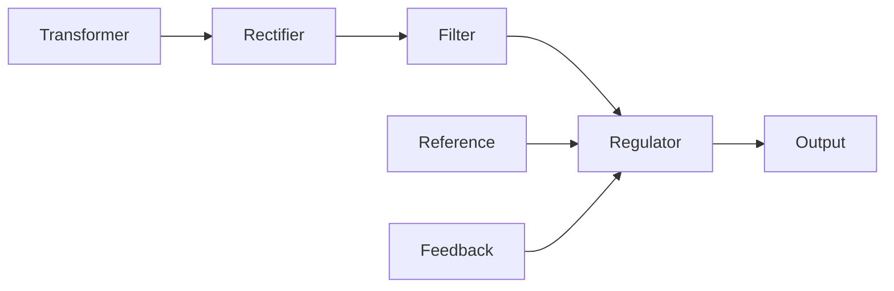

**રેગ્યુલેટેડ પાવર સપ્લાય સ્ટેજેસ:**

- **ટ્રાન્સફોર્મર**: AC વોલ્ટેજને જરૂરી લેવલ સુધી નીચે લાવે છે
- **રેક્ટિફાયર**: AC ને પલ્સેટિંગ DC માં રૂપાંતરિત કરે છે (ડાયોડ બ્રિજ)
- **ફિલ્ટર**: પલ્સેટિંગ DC ને સુંવાળો બનાવે છે (કેપેસિટર્સ)
- **રેગ્યુલેટર**: વેરિએશન હોવા છતાં સ્થિર આઉટપુટ જાળવે છે
- **રેફરન્સ**: સ્થિર તુલના વોલ્ટેજ પ્રદાન કરે છે
- **ફીડબેક**: આઉટપુટનું મોનિટરિંગ કરે છે અને રેગ્યુલેશન એડજસ્ટ કરે છે

**મેમરી ટ્રીક:** "Transform, Rectify, Filter, Regulate for Stable DC"

## પ્રશ્ન 5(ક) [7 ગુણ]

**એસ્ટેબલ મલ્ટીવાયબ્રેટર દોરો અને સમજાવો**

**જવાબ**:

**555 ટાઇમર વાપરીને એસ્ટેબલ મલ્ટીવાયબ્રેટર:**

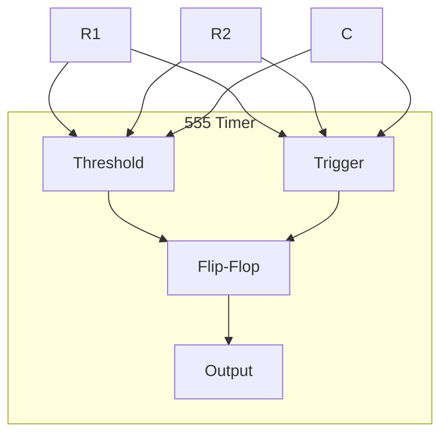

**એસ્ટેબલ મલ્ટીવાયબ્રેટરનું ઓપરેશન:**

- **કન્ફિગરેશન**: ફ્રી-રનિંગ ઓસિલેટર જેમાં કોઈ સ્ટેબલ સ્ટેટ્સ નથી
- **ટાઇમિંગ કોમ્પોનન્ટ્સ**: બાહ્ય R1, R2, અને C
- **ઓસિલેશન પ્રક્રિયા**:
  * કેપેસિટર R1+R2 દ્વારા ચાર્જ થાય છે
  * કેપેસિટર R2 દ્વારા ડિસ્ચાર્જ થાય છે
  * સતત ચાર્જિંગ/ડિસ્ચાર્જિંગ સાયકલ
- **આઉટપુટ વેવફોર્મ**: R1/R2 રેશિયો પર આધારિત ડ્યુટી સાયકલ સાથે રેક્ટેંગ્યુલર
- **ફ્રીક્વન્સી ફોર્મ્યુલા**: f = 1.44/((R1+2R2)×C)

- **ઉપયોગો**: ક્લોક જનરેશન, LED ફ્લેશર્સ, ટોન જનરેટર્સ
- **ફાયદા**: સરળ ડિઝાઇન, સ્ટેબલ ફ્રીક્વન્સી, એડજસ્ટેબલ ડ્યુટી સાયકલ

**મેમરી ટ્રીક:** "Always Switching, Time set by RC, Both states Least stable"

## પ્રશ્ન 5(અ OR) [3 ગુણ]

**ઓપી. એએમપી. નોનઇનવરટિંગ એમ્પલીફાયરમા R1=2kΩ અને Rf=200kΩ છે. નોનઇનવરટિંગ એમ્પલીફાયરનો ગેઈન શોધો.**

**જવાબ**:

**ઉકેલ:**

- **આપેલું**: R1 = 2kΩ, Rf = 200kΩ
- **નોન-ઇન્વર્ટિંગ એમ્પ્લિફાયર ગેઈન ફોર્મ્યુલા**: A = 1 + (Rf/R1)
- **ગણતરી**:
  * A = 1 + (200kΩ/2kΩ)
  * A = 1 + 100
  * A = 101

- **પરિણામ**: નોન-ઇન્વર્ટિંગ એમ્પ્લિફાયરનો વોલ્ટેજ ગેઈન 101 છે
- **મહત્વ**: આઉટપુટ વોલ્ટેજ ઇનપુટ વોલ્ટેજના 101 ગણો હશે

**મેમરી ટ્રીક:** "Non-inverting amplifier gain: One plus Feedback over Ground"

## પ્રશ્ન 5(બ OR) [4 ગુણ]

**-5V રેગ્યુલેટેડ ડીસી આઉટપુટ વૉલ્ટેજ મેળવવા માટેની સરકીટ દોરો અને ટૂંકમાં સમજાવો.**

**જવાબ**:

**નેગેટિવ વોલ્ટેજ રેગ્યુલેટર સર્કિટ:**

```
     +--------+
     |        |
Vin--+        +---Vout (-5V)
     | 7905   |
     |        |
     +--------+
         |
        ---
        ///
```

**સર્કિટ ઓપરેશન:**

- **મુખ્ય ઘટક**: 7905 નેગેટિવ વોલ્ટેજ રેગ્યુલેટર IC
- **ઇનપુટ આવશ્યકતા**: નેગેટિવ DC વોલ્ટેજ (સામાન્ય રીતે -7V થી -25V)
- **ફિલ્ટરિંગ**: સ્થિરતા માટે ઇનપુટ અને આઉટપુટ કેપેસિટર્સ
- **રેગ્યુલેશન પદ્ધતિ**: ફીડબેક કંટ્રોલ સાથે સીરીઝ પાસ એલિમેન્ટ
- **આઉટપુટ લાક્ષણિકતાઓ**: 1A સુધીના કરંટ સાથે ફિક્સ્ડ -5V

**મેમરી ટ્રીક:** "79XX for Negative, 78XX for Positive regulated voltage"

## પ્રશ્ન 5(ક OR) [7 ગુણ]

**એસ.એમ.પી.એસ. નો બ્લોક ડાયગ્રામ દોરો અને સમજાવો**

**જવાબ**:

**SMPS બ્લોક ડાયાગ્રામ:**

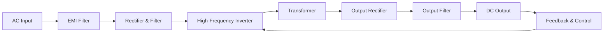

**SMPS ઓપરેશન:**

- **ઇનપુટ સ્ટેજ**: EMI ફિલ્ટર કરે છે, AC ને હાઈ-વોલ્ટેજ DC માં રેક્ટિફાય કરે છે
- **સ્વિચિંગ સ્ટેજ**: DC ને હાઈ-ફ્રીક્વન્સી AC માં રૂપાંતરિત કરે છે (20-100 kHz)
- **ટ્રાન્સફોર્મર**: આઇસોલેશન અને વોલ્ટેજ ટ્રાન્સફોર્મેશન પ્રદાન કરે છે
- **આઉટપુટ સ્ટેજ**: ક્લીન DC ઉત્પન્ન કરવા માટે રેક્ટિફાય અને ફિલ્ટર કરે છે
- **ફીડબેક કંટ્રોલ**: સ્વિચિંગ ડ્યુટી સાયકલ એડજસ્ટ કરીને આઉટપુટ રેગ્યુલેટ કરે છે

**SMPS ના ફાયદા:**

- **ઉચ્ચ કાર્યક્ષમતા** (80-90%) સ્વિચિંગ ઓપરેશનને કારણે
- **નાનું કદ અને વજન** હાઈ-ફ્રીક્વન્સી ટ્રાન્સફોર્મરથી
- **વિસ્તૃત ઇનપુટ વોલ્ટેજ રેન્જ** સ્થિર આઉટપુટ સાથે
- **સિંગલ ટ્રાન્સફોર્મરથી મલ્ટિપલ આઉટપુટ વોલ્ટેજ** શક્ય

**ઉપયોગો:**

- કમ્પ્યુટર પાવર સપ્લાય
- ઇલેક્ટ્રોનિક ડિવાઇસ ચાર્જર્સ
- ઔદ્યોગિક પાવર સિસ્ટમ્સ

**મેમરી ટ્રીક:** "Switch More Power Smartly: High frequency saves size and energy"
