## Question 1(a) [3 marks]

**Draw the symbol of (1)SCR (2)Diac(3)Triac**

**Answer**:

**Diagram:**

```
SCR Symbol:        DIAC Symbol:       TRIAC Symbol:
   A                   A1                  MT2
   |                    |                   |
   ▼                    ▼                   ▼
  ┌─┐                  ┌─┐                 ┌─┐
  │ │                  │ │                 │ │
──┤ ├──              ──┤ ├──             ──┤ ├──
  │ │                  │ │                 │ │
  └─┘                  └─┘                 └─┘
   ▲                    ▲                   ▲
   |                    |                   |
   K                   A2                  MT1
  /                                        /
 /                                        /
G                                        G
```

- **SCR (Silicon Controlled Rectifier)**: Three-terminal device with Anode, Cathode, and Gate
- **DIAC (Diode AC switch)**: Two-terminal bidirectional device with terminals A1 and A2
- **TRIAC (Triode AC switch)**: Three-terminal bidirectional device with MT1, MT2, and Gate

**Mnemonic:** "AGK for SCR, AA for DIAC, MMG for TRIAC"

## Question 1(b) [4 marks]

**Explain the term(1) CMRR (2) Slew rate**

**Answer**:

**Table: Op-Amp Parameters**

| Parameter | Definition | Significance |
|-----------|------------|--------------|
| **CMRR (Common Mode Rejection Ratio)** | Ratio of differential gain to common mode gain expressed in dB | Higher CMRR means better rejection of common input signals |
| **Slew Rate** | Maximum rate of change of output voltage (V/μs) | Determines how fast op-amp responds to rapidly changing inputs |

- **CMRR formula**: CMRR = 20 log₁₀(Ad/Acm) dB
- **Slew Rate importance**: Affects high-frequency performance and prevents distortion

**Mnemonic:** "Common Mode Rejected Rapidly, Slew shows Signal Speed"

## Question 1(c) [7 marks]

**Draw and explain summing amplifier.**

**Answer**:

**Diagram:**

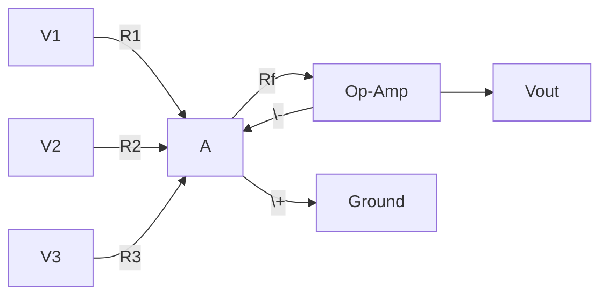

**Operation of Summing Amplifier:**

- **Circuit function**: Adds multiple input voltages with scaling
- **Output equation**: Vout = -(Rf/R1 × V1 + Rf/R2 × V2 + Rf/R3 × V3)
- **Inverting configuration**: Input signals undergo 180° phase shift
- **Gain control**: Rf/Rn determines weight of each input signal

- **Application**: Audio mixing, analog computation, signal processing
- **Key feature**: Virtual ground at inverting input simplifies analysis

**Mnemonic:** "Sum with Weights: Vout = -Rf(V1/R1 + V2/R2 + V3/R3)"

## Question 1(c OR) [7 marks]

**Draw and explain DA converter**

**Answer**:

**Diagram:**

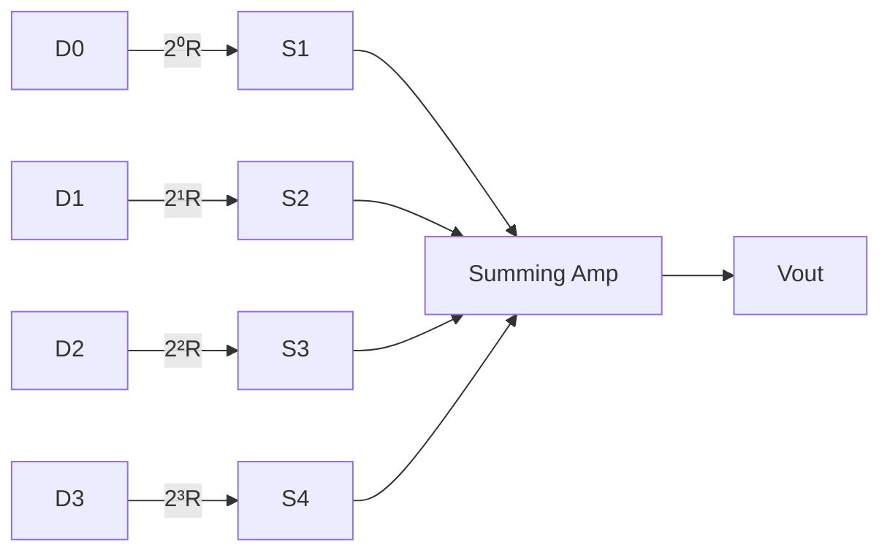

**R-2R Ladder DAC Operation:**

- **Function**: Converts digital binary input to analog output voltage
- **Working principle**: Weighted resistor network creates scaled currents
- **Binary weighting**: Each bit contributes voltage proportional to its position (2ⁿ)
- **Resolution**: Determined by number of bits (N) as 1/2ᴺ of full scale

- **Advantages**: Simple design, good accuracy, fast conversion
- **Applications**: Audio equipment, signal generation, control systems

**Mnemonic:** "Digital Bits to Analog Steps - R-2R makes the magic"

## Question 2(a) [3 marks]

**Describe thermal run away of transistor.**

**Answer**:

**Thermal Runaway Process:**


- **Definition**: Self-accelerating process where transistor heats up and draws more current
- **Cause**: Negative temperature coefficient of base-emitter voltage
- **Prevention**: Use proper heat sink and stabilization circuits

**Mnemonic:** "Heat feeds Current feeds Heat - a dangerous loop"

## Question 2(b) [4 marks]

**Draw and explain voltage series negative feedback.**

**Answer**:

**Diagram:**

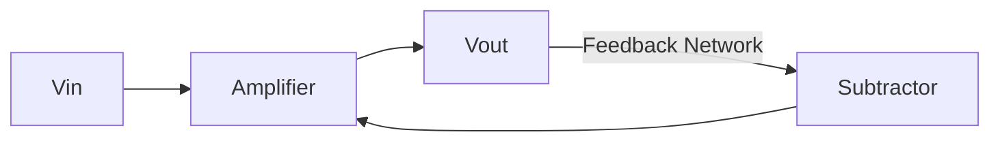

**Voltage Series Negative Feedback:**

| Parameter | Effect of Negative Feedback |
|-----------|----------------------------|
| **Gain stability** | Improved, less dependent on amplifier parameters |
| **Bandwidth** | Increased proportional to feedback factor |
| **Distortion** | Reduced significantly |
| **Input impedance** | Increased |

- **Working principle**: Output voltage is sampled and fed back to input
- **Gain formula**: Closed-loop gain = Open-loop gain/(1 + βA)

**Mnemonic:** "Series says Sample Voltage, Stabilize Gain"

## Question 2(c) [7 marks]

**Draw and explain DC load line for common emitter amplifier.**

**Answer**:

**Diagram:**

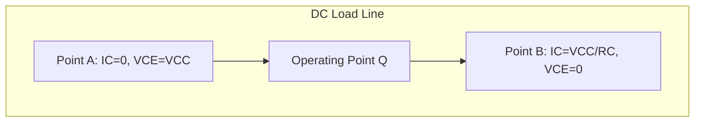

**DC Load Line Characteristics:**

- **Definition**: Graphical representation of all possible operating points
- **Equation**: IC = VCC/RC - VCE/RC
- **Key points**:
  * Saturation point (VCE ≈ 0V, IC = VCC/RC)
  * Cutoff point (IC ≈ 0mA, VCE = VCC)
  * Q-point (selected operating point for amplification)

- **Significance**: Determines biasing stability and output signal limits
- **Relationship**: DC load line is fixed by circuit components (VCC and RC)

**Mnemonic:** "Connect Cutoff to Saturation for DC Load Line"

## Question 2(a OR) [3 marks]

**Explain operating point(Q-point) in transistor**

**Answer**:

**Q-Point (Operating Point):**

```
      |
  Ic  |      DC Load Line
      |          /
      |         /
      |        /
      |       * Q-Point
      |      /
      |     /
      |    /
      |___/____________
          Vce
```

- **Definition**: Specific DC bias point where transistor operates in active region
- **Importance**: Determines output signal range without distortion
- **Selection criteria**: Center of load line for maximum swing

**Mnemonic:** "Quality amplification needs Quiet bias at Q-point"

## Question 2(b OR) [4 marks]

**Draw and explain hartley oscillator.**

**Answer**:

**Diagram:**


**Hartley Oscillator:**

- **Configuration**: Common emitter with tapped inductor feedback
- **Frequency formula**: f = 1/[2π√(C×(L1+L2))]
- **Phase shift**: Ensures 360° total phase shift for oscillation
- **Feedback**: Inductive voltage divider provides positive feedback

**Mnemonic:** "Hartley Has two coils with inductance for LC oscillation"

## Question 2(c OR) [7 marks]

**Draw and explain AC load line for common emitter amplifier.**

**Answer**:

**Diagram:**

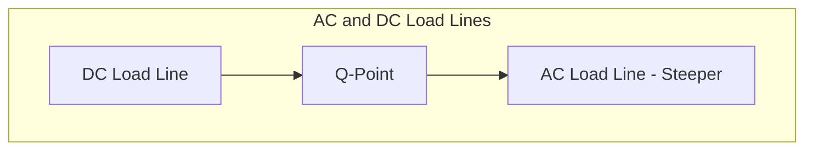

**AC Load Line Characteristics:**

- **Definition**: Represents dynamic operation during signal amplification
- **Equation**: ic = (VCC-VCEQ)/R'c - vce/R'c where R'c = RC||RL
- **Comparison with DC load line**:
  * AC load line is steeper than DC load line
  * Passes through Q-point
  * Determines voltage and current signal swings

- **Significance**: Defines maximum undistorted output signal
- **Limiting factor**: Avoiding saturation and cutoff regions

**Mnemonic:** "AC Amplitude Controlled by Load line Angle"

## Question 3(a) [3 marks]

**Draw the fixed bias circuit and explain working of it**

**Answer**:

**Diagram:**

```
      Vcc
       |
       R
       |
       |C
       |----Output
       |
      /|
     / |
    /--|
   /   |
  |    |
  B    E
  |    |
  Rb   |
  |    |
  |____|
  |
  Vin
```

- **Structure**: Base resistor connected to VCC, collector resistor for load
- **Operation**: Fixed base current biases transistor
- **Disadvantage**: Poor stability against temperature changes

**Mnemonic:** "Fixed Bias Feeds Base from power supply"

## Question 3(b) [4 marks]

**In hartley oscillator L1=5mH, L2=10mH, C=0.01µF. Calculate frequency of oscillations.**

**Answer**:

**Solution:**

- **Given**: L1=5mH, L2=10mH, C=0.01µF
- **Frequency formula**: f = 1/[2π√(C×(L1+L2))]
- **Calculation**:
  * Total inductance LT = L1 + L2 = 5mH + 10mH = 15mH = 15×10⁻³ H
  * C = 0.01µF = 1×10⁻⁸ F
  * f = 1/[2π√(15×10⁻³ × 1×10⁻⁸)]
  * f = 1/[2π√(15×10⁻¹¹)]
  * f = 1/[2π×3.873×10⁻⁶]
  * f = 1/[24.33×10⁻⁶]
  * f = 41,101 Hz ≈ 41.1 kHz

**Mnemonic:** "For Hartley's frequency, add coils then take square root"

## Question 3(c) [7 marks]

**Draw and explain the frequency response curve of two stage RC coupled amplifier.**

**Answer**:

**Diagram:**

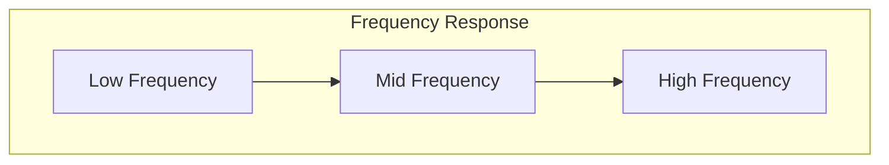

**Two-Stage RC Coupled Amplifier Frequency Response:**

- **Low-frequency region**: Gain rises with frequency (< 50Hz)
  * Limited by coupling and bypass capacitors
- **Mid-frequency region**: Constant maximum gain (50Hz-20kHz)
  * Flat response, ideal operating region
- **High-frequency region**: Gain drops with frequency (> 20kHz)
  * Limited by transistor capacitances and Miller effect

- **Bandwidth**: Range of frequencies with gain ≥ 70.7% of maximum gain
- **Cutoff frequencies**: Points where gain drops by 3dB (0.707 times max gain)

**Mnemonic:** "Low-flat-high: capacitors block, amplify well, then roll off"

## Question 3(a OR) [3 marks]

**Explain in detail barkhausen criterion for oscillation.**

**Answer**:

**Barkhausen Criterion:**

| Condition | Requirement |
|-----------|-------------|
| **Loop Gain** | Must equal exactly 1 (Aβ = 1) |
| **Phase Shift** | Must be 0° or 360° around loop |

- **Purpose**: Ensures sustained oscillations without damping
- **Consequences**: 
  * If Aβ < 1: Oscillations die out
  * If Aβ > 1: Oscillations grow until limited by nonlinearity
  * If Aβ = 1: Stable oscillations maintained

**Mnemonic:** "Barkhausen's Balance: Loop Gain=1, Phase=360°"

## Question 3(b OR) [4 marks]

**Explain the effect of negative feedback on the gain of amplifier**

**Answer**:

**Effect of Negative Feedback on Amplifier Gain:**

| Parameter | Without Feedback | With Feedback |
|-----------|------------------|---------------|
| **Voltage Gain** | A | A/(1+Aβ) |
| **Stability** | Less stable | More stable |
| **Bandwidth** | Lower | Higher |
| **Distortion** | Higher | Lower |

- **Gain reduction**: Gain decreases by factor (1+Aβ)
- **Gain-bandwidth tradeoff**: Bandwidth increases as gain decreases
- **Gain stabilization**: Less affected by temperature and component variations

**Mnemonic:** "Negative Feedback: Less Gain, More Stability"

## Question 3(c OR) [7 marks]

**Draw fan regulator circuit and explain how it will control the speed of fan.**

**Answer**:

**Diagram:**

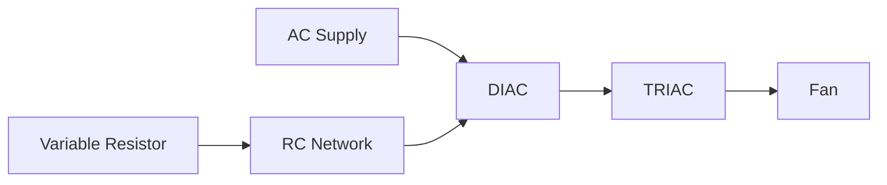

**Fan Regulator Operation:**

- **Control method**: Phase angle control using TRIAC and DIAC
- **Working principle**: RC network creates variable phase shift
- **Speed control**: Variable resistor adjusts RC time constant
- **Operation sequence**:
  * RC network delays DIAC firing
  * DIAC triggers TRIAC at adjustable point in AC cycle
  * TRIAC conducts for remaining portion of AC half-cycle
  * Less conduction time = lower power to fan = slower speed

- **Advantages**: Simple design, smooth control, energy efficient
- **Applications**: Ceiling fans, exhaust fans, cooling systems

**Mnemonic:** "Delay the TRIAC firing, control fan's speed"

## Question 4(a) [3 marks]

**Write short note on natural commutation**

**Answer**:

**Natural Commutation:**

- **Definition**: SCR turns off automatically when current falls below holding current
- **Process**: Occurs in AC circuits at each zero-crossing point
- **Requirements**: No external components needed, inherent to AC operation

**Mnemonic:** "Natural Commutation: Zero Current Crossings Turn Off Thyristors"

## Question 4(b) [4 marks]

**Explain the parameters gain and bandwidth of amplifier.**

**Answer**:

**Amplifier Parameters:**

| Parameter | Definition | Formula |
|-----------|------------|---------|
| **Gain (A)** | Ratio of output to input signal | A = Vout/Vin |
| **Bandwidth (BW)** | Frequency range with gain ≥ 70.7% of maximum | BW = fH - fL |

- **Gain-bandwidth product**: Remains constant (GBP = Gain × Bandwidth)
- **Cutoff frequencies**: Lower (fL) and higher (fH) frequencies where gain drops by 3dB
- **Significance**: Determines amplifier's ability to handle different frequencies

**Mnemonic:** "Good Amplifiers Balance Width and Magnitude"

## Question 4(c) [7 marks]

**Draw the construction and characteristics of triac and describe working of it, also write the application of triac.**

**Answer**:

**TRIAC Construction and Characteristics:**

```
           MT2
            |
      ------+------
     /      |      \
    /  P    |    N  \
   +--------+--------+
   |        |        |
   |    N   |    P   |
   +--------+--------+
   |        |        |
   |    P   |    N   |
   +--------+--------+
    \       |       /
     \      |      /
      ------+------
            |
           MT1
            |
            G
```

**I-V Characteristics:**

```
    I
    ^
    |      /|
    |     / |
    |    /  |
    |---+---|----> V
    |   /   |
    |  /    |
    | /     |
```

**TRIAC Operation:**

- **Structure**: Five-layer PNPN bidirectional device
- **Switching**: Conducts in both directions when triggered
- **Triggering modes**: Four quadrant operation possible
- **Turn-off**: Natural commutation at current zero-crossing

**Applications:**

- **Light dimmers**
- **Fan speed controllers**
- **Heater controls**
- **Motor speed regulation**
- **AC power switching**

**Mnemonic:** "TRIAC Takes AC Control in Both Directions"

## Question 4(a OR) [3 marks]

**Write any three application of SCR.**

**Answer**:

**Applications of SCR:**

| Application | Function |
|-------------|----------|
| **DC Motor Speed Control** | Provides variable DC to motors |
| **Battery Chargers** | Regulates charging current |
| **Power Inverters** | Converts DC to AC efficiently |

- **Advantages**: High power handling, efficient control, robust operation
- **Limitations**: Requires forced commutation in DC circuits

**Mnemonic:** "SCR Controls DC - Motors, Batteries, Inverters"

## Question 4(b OR) [4 marks]

**Explain holding current and latching current with reference to SCR**

**Answer**:

**SCR Current Parameters:**

| Parameter | Definition | Typical Values |
|-----------|------------|----------------|
| **Holding Current (IH)** | Minimum current to maintain conduction | 5-40 mA |
| **Latching Current (IL)** | Minimum current to establish conduction | 10-100 mA |

- **Latching current**: Must be exceeded briefly after triggering for SCR to latch
- **Holding current**: Must be maintained to keep SCR in conduction
- **Relationship**: Usually IL > IH
- **Significance**: Critical for reliable switching operation

**Mnemonic:** "Latch with more, Hold with less, both keep SCR conducting"

## Question 4(c OR) [7 marks]

**Draw and explain in detail block diagram of operational amplifier.**

**Answer**:

**Operational Amplifier Block Diagram:**

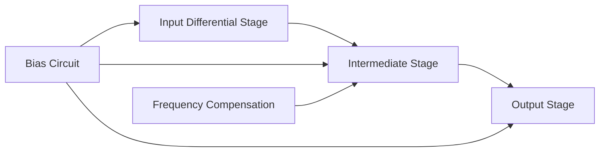

**Op-Amp Blocks and Functions:**

- **Input differential stage**:
  * High input impedance
  * Rejects common-mode signals
  * Provides differential voltage gain
- **Intermediate stage**:
  * Additional voltage gain
  * Level shifting
  * Frequency compensation
- **Output stage**:
  * Low output impedance
  * Current amplification
  * Power capability for driving loads
- **Bias circuit**:
  * Establishes proper operating points
  * Temperature stability
- **Frequency compensation**:
  * Prevents oscillation
  * Controls frequency response

**Mnemonic:** "Differential Input, Gain in Middle, Power at Output"

## Question 5(a) [3 marks]

**Draw and explain in brief inverting amplifier.**

**Answer**:

**Inverting Amplifier Circuit:**

```
          Rf
          ___
    Vin---| |-----+
          ---     |
                  |
                 _|_
    +------+    /   \
    |      |---+     +---Vout
    |      |    \___/
Vin-+      |      |
    |Op-Amp|      |
    +------+      |
                  |
                 ---
                 ///
```

- **Gain formula**: Vout = -(Rf/Rin) × Vin
- **Operation**: Input signal inverted with amplification
- **Virtual ground**: Inverting input maintained at 0V

**Mnemonic:** "Inverting means Negative Gain equals -Rf/Rin"

## Question 5(b) [4 marks]

**Draw and explain the block diagram of regulated power supply.**

**Answer**:

**Regulated Power Supply Block Diagram:**

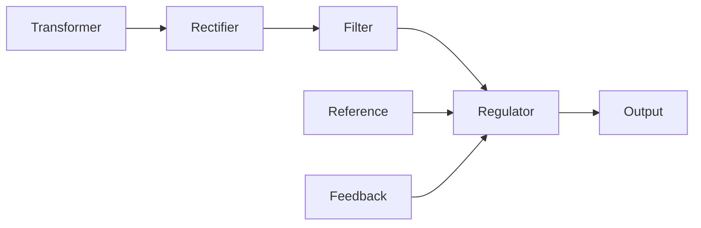

**Regulated Power Supply Stages:**

- **Transformer**: Steps down AC voltage to required level
- **Rectifier**: Converts AC to pulsating DC (diode bridge)
- **Filter**: Smooths pulsating DC (capacitors)
- **Regulator**: Maintains constant output despite variations
- **Reference**: Provides stable comparison voltage
- **Feedback**: Monitors output and adjusts regulation

**Mnemonic:** "Transform, Rectify, Filter, Regulate for Stable DC"

## Question 5(c) [7 marks]

**Draw and explain astable multivibrator.**

**Answer**:

**Astable Multivibrator Using 555 Timer:**

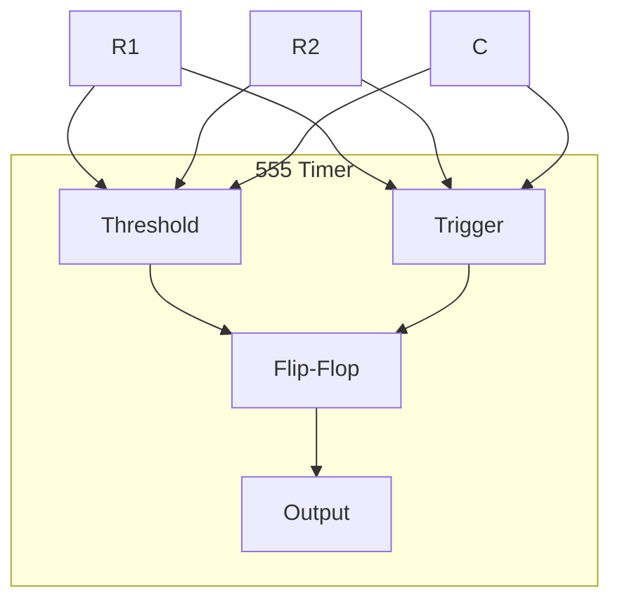

**Operation of Astable Multivibrator:**

- **Configuration**: Free-running oscillator with no stable states
- **Timing components**: External R1, R2, and C
- **Oscillation process**:
  * Capacitor charges through R1+R2
  * Capacitor discharges through R2
  * Continuous charging/discharging cycle
- **Output waveform**: Rectangular with duty cycle based on R1/R2 ratio
- **Frequency formula**: f = 1.44/((R1+2R2)×C)

- **Applications**: Clock generation, LED flashers, tone generators
- **Advantages**: Simple design, stable frequency, adjustable duty cycle

**Mnemonic:** "Always Switching, Time set by RC, Both states Least stable"

## Question 5(a OR) [3 marks]

**In an op amp non-inverting amplifier R1=2kΩ and Rf=200kΩ. Find the voltage gain of non-inverting amplifier.**

**Answer**:

**Solution:**

- **Given**: R1 = 2kΩ, Rf = 200kΩ
- **Non-inverting amplifier gain formula**: A = 1 + (Rf/R1)
- **Calculation**:
  * A = 1 + (200kΩ/2kΩ)
  * A = 1 + 100
  * A = 101

- **Result**: Voltage gain of non-inverting amplifier is 101
- **Significance**: Output voltage will be 101 times the input voltage

**Mnemonic:** "Non-inverting amplifier gain: One plus Feedback over Ground"

## Question 5(b OR) [4 marks]

**Draw and explain in brief circuit to get -5V regulated dc output voltage.**

**Answer**:

**Negative Voltage Regulator Circuit:**

```
     +--------+
     |        |
Vin--+        +---Vout (-5V)
     | 7905   |
     |        |
     +--------+
         |
        ---
        ///
```

**Circuit Operation:**

- **Key component**: 7905 negative voltage regulator IC
- **Input requirement**: Negative DC voltage (typically -7V to -25V)
- **Filtering**: Input and output capacitors for stability
- **Regulation method**: Series pass element with feedback control
- **Output characteristics**: Fixed -5V with current up to 1A

**Mnemonic:** "79XX for Negative, 78XX for Positive regulated voltage"

## Question 5(c OR) [7 marks]

**Draw and explain the block diagram of SMPS.**

**Answer**:

**SMPS Block Diagram:**

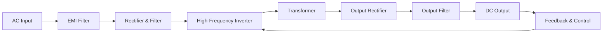

**SMPS Operation:**

- **Input stage**: Filters EMI, rectifies AC to high-voltage DC
- **Switching stage**: Converts DC to high-frequency AC (20-100 kHz)
- **Transformer**: Provides isolation and voltage transformation
- **Output stage**: Rectifies and filters to produce clean DC
- **Feedback control**: Regulates output by adjusting switching duty cycle

**Advantages of SMPS:**

- **High efficiency** (80-90%) due to switching operation
- **Small size and weight** from high-frequency transformer
- **Wide input voltage range** with stable output
- **Multiple output voltages** possible from single transformer

**Applications:**

- Computer power supplies
- Electronic device chargers
- Industrial power systems

**Mnemonic:** "Switch More Power Smartly: High frequency saves size and energy"
