## પ્રશ્ન 1(અ) [3 ગુણ]

**હીટ સિંક શું છે. તેના પ્રકારોની યાદી આપો.**

**જવાબ**:
હીટ સિંક એ એક પેસિવ ડિવાઈસ છે જે ઇલેક્ટ્રોનિક કોમ્પોનન્ટ્સમાંથી ગરમી શોષે અને ફેલાવે છે જેથી ઓવરહીટિંગ અટકાવી શકાય.

**કોષ્ટક: હીટ સિંકના પ્રકારો**

| પ્રકાર | વર્ણન |
|------|-------------|
| **પેસિવ** | બાહ્ય પાવર વિના નૈસર્ગિક કન્વેક્શનનો ઉપયોગ કરે છે |
| **એક્ટિવ** | ફેન અથવા લિક્વિડ કૂલિંગનો સમાવેશ કરે છે |
| **રેડિયલ** | સેન્ટરથી રેડિયલ પેટર્નમાં ગોઠવાયેલા ફિન્સ |
| **પિન-ફિન** | વધુ સપાટી ક્ષેત્રફળ માટે પિન અથવા રોડનો ઉપયોગ કરે છે |
| **એક્સટ્રુડેડ** | આકારવાળા ડાય દ્વારા એલ્યુમિનિયમને ફોર્સ કરીને બનાવવામાં આવે છે |

**મેમરી ટ્રીક:** "PAPER" (Passive, Active, Pin-fin, Extruded, Radial)

## પ્રશ્ન 1(બ) [4 ગુણ]

**નીચેનાને વ્યાખ્યાયિત કરો: 1. થર્મલ રનઅવે 2. થર્મલ સ્ટેબીલિટી.**

**જવાબ**:

**થર્મલ રનઅવે**: 
સ્વ-ત્વરિત વિનાશક પ્રક્રિયા જ્યાં વધતા તાપમાન કરંટ પ્રવાહમાં વધારો કરે છે, જે વધુ તાપમાન વધારે છે, જે ટ્રાન્ઝિસ્ટરને નુકસાન પહોંચાડી શકે છે.

**થર્મલ સ્ટેબીલિટી**:
તાપમાન ફેરફારો છતાં સ્થિર ઓપરેશન જાળવવા માટે ટ્રાન્ઝિસ્ટર સર્કિટની ક્ષમતા, જે થર્મલ રનઅવેને અટકાવે છે.

**આકૃતિ: થર્મલ રનઅવે પ્રક્રિયા**

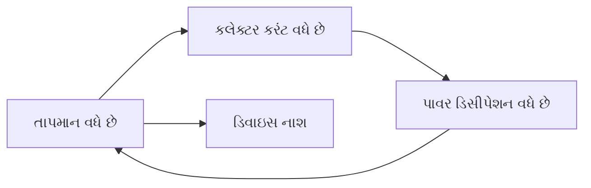

**મેમરી ટ્રીક:** "RISE" (Runaway Is Self-Escalating)

## પ્રશ્ન 1(ક) [7 ગુણ]

**વોલ્ટેજ ડિવાઈડર બાયસને વિગતવાર સમજાવો.**

**જવાબ**:
વોલ્ટેજ ડિવાઈડર બાયસ એ એક સામાન્ય ટ્રાન્ઝિસ્ટર બાયસિંગ ટેકનિક છે જે સ્થિર ઓપરેશન પ્રદાન કરે છે.

**સર્કિટ ડાયાગ્રામ:**

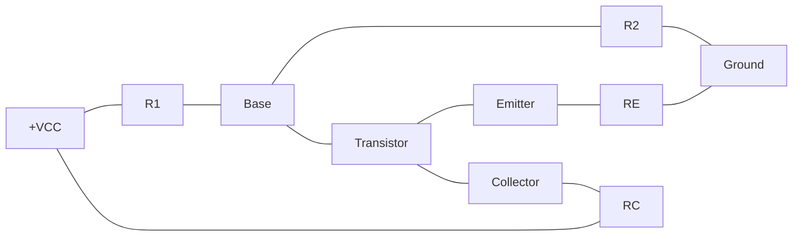

- **વોલ્ટેજ ડિવાઈડર નેટવર્ક**: R1 અને R2 એક નિશ્ચિત બેઝ વોલ્ટેજ સ્થાપિત કરે છે
- **સ્થિર Q-પોઈન્ટ**: તાપમાન વેરિએશન છતાં ઓપરેટિંગ પોઈન્ટને જાળવે છે
- **વધુ સારી સ્થિરતા**: ફિક્સ્ડ બાયસની તુલનામાં ઉચ્ચ સ્થિરતા ફેક્ટર
- **સ્વ-એડજસ્ટિંગ**: બેઝ કરંટ આપોઆપ તાપમાન ફેરફારોનો સામનો કરવા માટે એડજસ્ટ થાય છે

**મેમરી ટ્રીક:** "VSST" (Voltage divider, Stable, Self-adjusting, Temperature resistant)

## પ્રશ્ન 1(ક) OR [7 ગુણ]

**ડી.સી. લોડ લાઈનને વિગતવાર સમજાવો.**

**જવાબ**:
DC લોડ લાઈન એ ટ્રાન્ઝિસ્ટર બાયસ કંડીશન્સના વિશ્લેષણ માટેની ગ્રાફિકલ પદ્ધતિ છે.

**આકૃતિ: ટ્રાન્ઝિસ્ટર કેરેક્ટરિસ્ટિક કર્વ પર DC લોડ લાઈન**

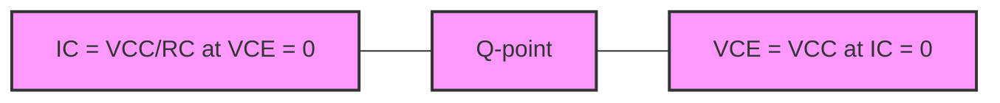

- **વ્યાખ્યા**: આપેલી સર્કિટ માટે તમામ સંભવિત ઓપરેટિંગ પોઇન્ટ્સ દર્શાવતી ગ્રાફિકલ લાઈન
- **એન્ડપોઈન્ટ**: (0, VCC/RC) અને (VCC, 0) IC-VCE પ્લેન પર
- **Q-પોઈન્ટ**: લોડ લાઈન અને ટ્રાન્ઝિસ્ટર કેરેક્ટરિસ્ટિક કર્વના છેદબિંદુ
- **સમીકરણ**: IC = (VCC - VCE)/RC

**મેમરી ટ્રીક:** "QECC" (Q-point Exists where Collector Current meets characteristics)

## પ્રશ્ન 2(અ) [3 ગુણ]

**ટ્રાન્ઝિસ્ટર સ્વીચ તરીકે કેવી રીતે કામ કરે છે તે સમજાવો.**

**જવાબ**:
ટ્રાન્ઝિસ્ટર સ્વિચ સેચુરેશન (ON) અથવા કટ-ઓફ (OFF) રીજનમાં કામ કરે છે.

**કોષ્ટક: ટ્રાન્ઝિસ્ટર સ્વિચ ઓપરેશન**

| સ્થિતિ | રીજન | બેઝ કરંટ | કલેક્ટર કરંટ | VCE |
|-------|--------|--------------|------------------|-----|
| OFF | કટ-ઓફ | IB ≈ 0 | IC ≈ 0 | VCE ≈ VCC |
| ON | સેચુરેશન | IB > IB(sat) | IC ≈ IC(sat) | VCE ≈ 0.2V |

**મેમરી ટ્રીક:** "COS" (Cutoff Off, Saturation on)

## પ્રશ્ન 2(બ) [4 ગુણ]

**કોલપીટ ઓસીલેટર દોરો અને સમજાવો.**

**જવાબ**:
કોલપીટ ઓસીલેટર એ LC ઓસીલેટર છે જે ફીડબેક માટે કેપેસિટિવ વોલ્ટેજ ડિવાઈડરનો ઉપયોગ કરે છે.

**સર્કિટ ડાયાગ્રામ:**

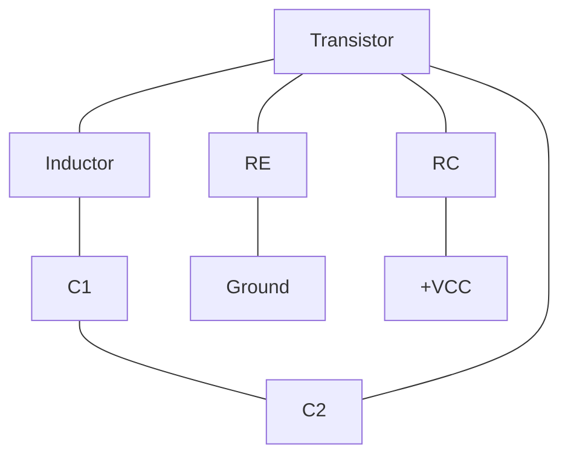

- **ફીડબેક**: કેપેસિટિવ વોલ્ટેજ ડિવાઈડર (C1, C2) દ્વારા પ્રદાન કરવામાં આવે છે
- **રેઝોનન્ટ ફ્રિક્વન્સી**: f = 1/(2π√(L×C)), જ્યાં C = (C1×C2)/(C1+C2)
- **ઓસિલેશન**: રિજનરેટિવ ફીડબેક દ્વારા જાળવી રાખે છે
- **ફેઝ શિફ્ટ**: લૂપની આસપાસ 360°

**મેમરી ટ્રીક:** "CFPO" (Capacitive Feedback Produces Oscillations)

## પ્રશ્ન 2(ક) [7 ગુણ]

**ટુ સ્ટેજ RC કપલ્ડ એમ્પ્લીફાયરનો ફ્રિક્વન્સી રિસ્પોન્સ સર્કિટ ડાયાગ્રામ સાથે સમજાવો.**

**જવાબ**:
બે-સ્ટેજ RC કપલ્ડ એમ્પ્લિફાયર બે એમ્પ્લિફાયર સ્ટેજને RC કપલિંગ સાથે જોડે છે.

**સર્કિટ ડાયાગ્રામ:**

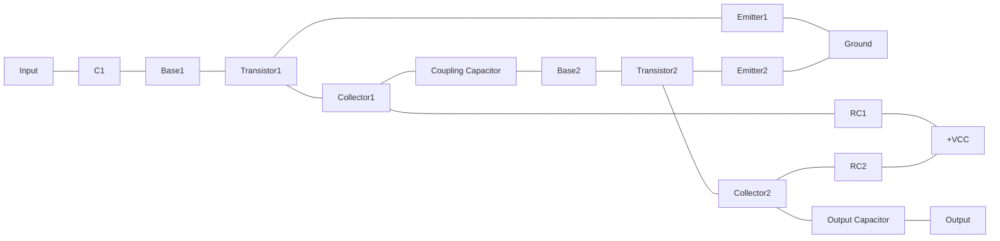

**ફ્રિક્વન્સી રિસ્પોન્સ:**

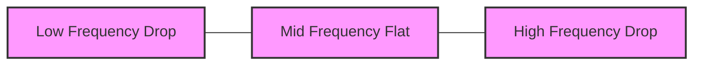

- **લો ફ્રિક્વન્સી**: કપલિંગ કેપેસિટર ઇમ્પિડન્સને કારણે ગેઇન ઘટે છે
- **મિડ ફ્રિક્વન્સી**: મહત્તમ ફ્લેટ ગેઇન રીજિયન (બેન્ડવિડ્થ)
- **હાઇ ફ્રિક્વન્સી**: ટ્રાન્ઝિસ્ટર કેપેસિટન્સ ઇફેક્ટ્સને કારણે ગેઇન ઘટે છે
- **ઓવરઓલ ગેઇન**: વ્યક્તિગત સ્ટેજ ગેઇનનો ગુણાકાર

**મેમરી ટ્રીક:** "LMH" (Low drops, Mid flat, High drops)

## પ્રશ્ન 2(અ) OR [3 ગુણ]

**હાર્ટલી ઓસિલેટરનું સર્કિટ ડાયાગ્રામ દોરો.**

**જવાબ**:

**હાર્ટલી ઓસિલેટરનું સર્કિટ ડાયાગ્રામ:**

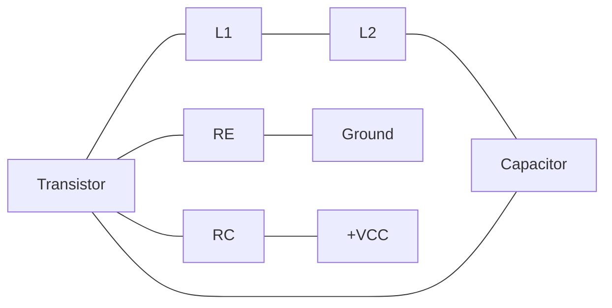

**મેમરી ટ્રીક:** "ITLC" (Inductor Tapped for LC Circuit)

## પ્રશ્ન 2(બ) OR [4 ગુણ]

**વિવિધ પ્રકારના નેગેટીવ ફીડબેકનું લિસ્ટ બનાવો.**

**જવાબ**:

**કોષ્ટક: નેગેટિવ ફીડબેકના પ્રકારો**

| પ્રકાર | કન્ફિગરેશન | પેરામીટર્સ પર અસર |
|------|---------------|---------------------|
| **વોલ્ટેજ સીરીઝ** | આઉટપુટ વોલ્ટેજ ઇનપુટમાં સીરીઝમાં ફીડ થાય છે | ઇનપુટ ઇમ્પેડન્સમાં વધારો, ડિસ્ટોર્શનમાં ઘટાડો |
| **વોલ્ટેજ શન્ટ** | આઉટપુટ વોલ્ટેજ ઇનપુટમાં પેરેલલમાં ફીડ થાય છે | ઇનપુટ ઇમ્પેડન્સમાં ઘટાડો, બેન્ડવિડ્થમાં વધારો |
| **કરંટ સીરીઝ** | આઉટપુટ કરંટ ઇનપુટમાં સીરીઝમાં ફીડ થાય છે | આઉટપુટ ઇમ્પેડન્સમાં વધારો, કરંટ ગેઇનને સ્થિર કરે છે |
| **કરંટ શન્ટ** | આઉટપુટ કરંટ ઇનપુટમાં પેરેલલમાં ફીડ થાય છે | આઉટપુટ ઇમ્પેડન્સમાં ઘટાડો, વોલ્ટેજ ગેઇનને સ્થિર કરે છે |

**મેમરી ટ્રીક:** "VSCS" (Voltage Series, Current Shunt)

## પ્રશ્ન 2(ક) OR [7 ગુણ]

**નેગેટિવ ફીડબેક એમ્પ્લીફાયરના ફાયદાઓની યાદી બનાવો અને વોલ્ટેજ સીરીઝ નેગેટિવ ફીડબેકને વિગતવાર સમજાવો.**

**જવાબ**:

**નેગેટિવ ફીડબેકના ફાયદાઓ:**
- કોમ્પોનન્ટ વેરિએશન સામે ગેઇન સ્થિર કરે છે
- ડિસ્ટોર્શન અને નોઇઝમાં ઘટાડો
- બેન્ડવિડ્થમાં વધારો
- ઇનપુટ/આઉટપુટ ઇમ્પેડન્સમાં ફેરફાર કરે છે
- લિનિયારિટીમાં સુધારો

**વોલ્ટેજ સીરીઝ નેગેટિવ ફીડબેક:**

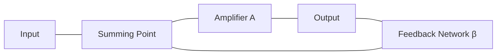

- **કન્ફિગરેશન**: આઉટપુટ વોલ્ટેજ સેમ્પલ કરવામાં આવે છે, ઇનપુટમાં સીરીઝમાં ફીડ બેક કરવામાં આવે છે
- **ક્લોઝ્ડ-લૂપ ગેઇન**: ACL = A/(1+Aβ), જ્યાં A ઓપન-લૂપ ગેઇન છે અને β ફીડબેક ફ્રેક્શન છે
- **ઇનપુટ ઇમ્પેડન્સ**: ફેક્ટર (1+Aβ) દ્વારા વધે છે
- **આઉટપુટ ઇમ્પેડન્સ**: ફેક્ટર (1+Aβ) દ્વારા ઘટે છે

**મેમરી ટ્રીક:** "SIGO" (Stable gain, Increased input impedance, Gain reduction, Output impedance reduction)

## પ્રશ્ન 3(અ) [3 ગુણ]

**બે ટ્રાન્ઝિસ્ટર એનેલોજીનો ઉપયોગ કરીને SCRની સર્કિટ દોરો.**

**જવાબ**:

**SCRનું બે ટ્રાન્ઝિસ્ટર એનેલોજી:**

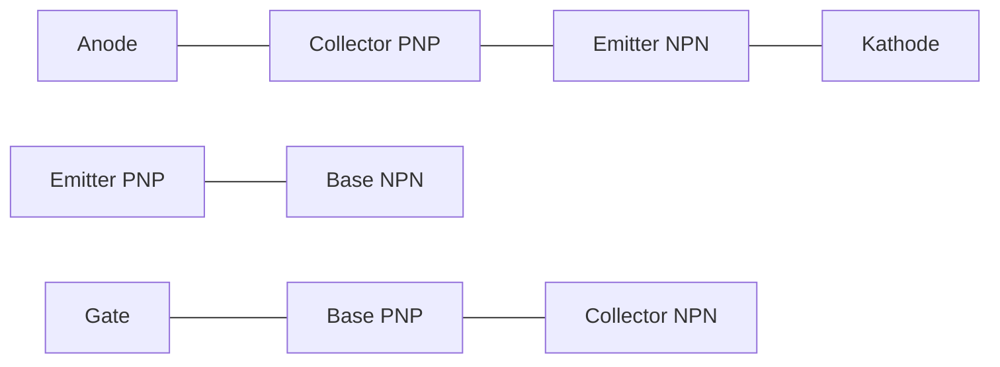

**મેમરી ટ્રીક:** "PNPNPN" (PNP and NPN structure)

## પ્રશ્ન 3(બ) [4 ગુણ]

**SCR ના નેચરલ કમ્યુટેશન સર્કિટ દોરી ને સમજાવો.**

**જવાબ**:
નેચરલ કમ્યુટેશન ત્યારે થાય છે જ્યારે SCR કરંટ કુદરતી રીતે હોલ્ડિંગ કરંટથી નીચે પડે છે.

**સર્કિટ ડાયાગ્રામ:**

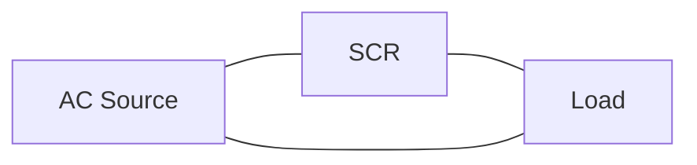

**કરંટ વેવફોર્મ:**

```
       ┌───┐     ┌───┐
       │   │     │   │
───────┘   └─────┘   └─────
  SCR OFF    SCR OFF
       SCR ON    SCR ON
```

- **વ્યાખ્યા**: કરંટ હોલ્ડિંગ કરંટથી નીચે પડે ત્યારે SCR આપોઆપ બંધ થાય છે
- **AC સર્કિટ**: દરેક પોઝિટિવ હાફ-સાયકલના અંતે કુદરતી રીતે થાય છે
- **ઝીરો ક્રોસિંગ**: AC વોલ્ટેજ શૂન્ય ક્રોસ કરે ત્યારે SCR બંધ થાય છે
- **કોઈ બાહ્ય સર્કિટ નથી**: ટર્ન-ઓફ માટે કોઈ વધારાના કોમ્પોનન્ટની જરૂર નથી

**મેમરી ટ્રીક:** "NAZC" (Natural At Zero Crossing)

## પ્રશ્ન 3(ક) [7 ગુણ]

**ટ્રાયાકનો ઉપયોગ પંખાના રેગ્યુલેટર તરીકે અને એસી પાવર માટે ઓન-ઓફ કંટ્રોલ તરીકે કેવી રીતે થઈ શકે છે તે સમજાવો.**

**જવાબ**:
TRIAC એ બાયડાયરેક્શનલ ડિવાઇસ છે જે AC પાવર કંટ્રોલ એપ્લિકેશન માટે આદર્શ છે.

**TRIAC ફેન રેગ્યુલેટર સર્કિટ:**

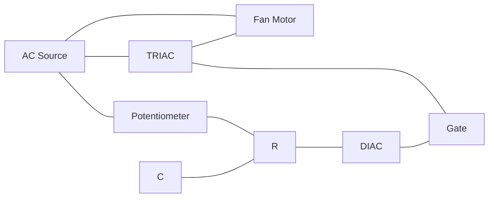

**TRIAC ઓન-ઓફ કંટ્રોલ:**

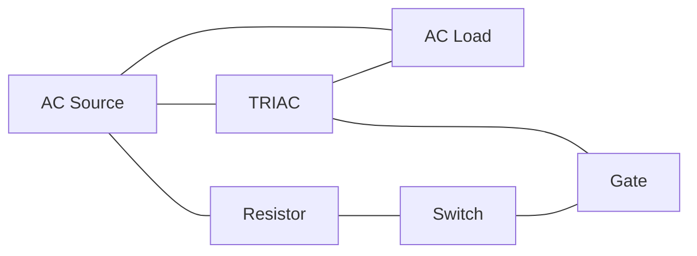

- **ફેન રેગ્યુલેશન**: ફેઝ કંટ્રોલ ટેકનિક ફેનમાં પાવર વેરી કરે છે
- **પોટેન્શિયોમીટર**: TRIACનો ફાયરિંગ એંગલ એડજસ્ટ કરે છે
- **ઓન-ઓફ કંટ્રોલ**: સરળ સ્વિચ TRIAC ગેટને ટ્રિગર કરે છે
- **બાયડાયરેક્શનલ**: બંને હાફ-સાયકલમાં કરંટ કંટ્રોલ કરે છે

**મેમરી ટ્રીક:** "FPOB" (Fan Power is controlled by Phase angle in both directions)

## પ્રશ્ન 3(અ) OR [3 ગુણ]

**એસ.સી.આર, ડાયાક અને ટ્રાયાક ના સિમ્બોલ દોરો.**

**જવાબ**:

**થાઇરિસ્ટરના સિમ્બોલ:**

```goat
    SCR            DIAC           TRIAC
    
    A              
    |              
   ┌┴┐            ┌─┐            ┌─┐
   │ │            │ │            │ │
   └┬┘            └─┘            └─┘
    │              |              |
    │              |              |
    G─┐            |              G─┐
      │            |                │
    K |            |                |
```

**મેમરી ટ્રીક:** "SDT" (SCR has gate on one side, DIAC has none, TRIAC has gate in middle)

## પ્રશ્ન 3(બ) OR [4 ગુણ]

**એસ.સી.આર નુ ગેટ ટ્રીગરીંગ સર્કિટ દોરી ને સમજાવો.**

**જવાબ**:
ગેટ ટ્રિગરિંગ એ SCRને ચાલુ કરવાની સૌથી સામાન્ય પદ્ધતિ છે.

**સર્કિટ ડાયાગ્રામ:**

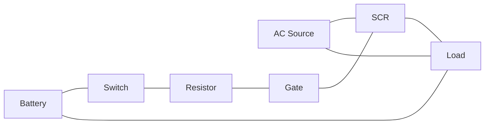

- **સિદ્ધાંત**: ગેટ અને કેથોડ વચ્ચે પોઝિટિવ વોલ્ટેજ એપ્લાય કરવું
- **કરંટ જરૂરિયાત**: નાનો ગેટ કરંટ મોટા એનોડ કરંટને ટ્રિગર કરે છે
- **લેચિંગ**: એકવાર ટ્રિગર થયા પછી, ગેટ સિગ્નલ દૂર કરવામાં આવે તો પણ SCR ચાલુ રહે છે
- **ટર્ન-ઓફ**: એનોડ કરંટને હોલ્ડિંગ કરંટથી નીચે ઘટાડવાની જરૂર પડે છે

**મેમરી ટ્રીક:** "GPLT" (Gate Pulse Latches Thyristor)

## પ્રશ્ન 3(ક) OR [7 ગુણ]

**SCRનું કંસ્ટ્રકશન અને V-I લાક્ષણિકતા દોરો અને V-I લાક્ષણિકતા સમજાવો.**

**જવાબ**:
SCR (સિલિકોન કંટ્રોલ્ડ રેક્ટિફાયર) એ ચાર-લેયર PNPN સેમિકન્ડક્ટર ડિવાઇસ છે.

**SCR કંસ્ટ્રકશન:**

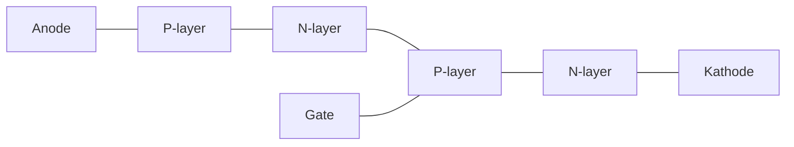

**V-I લાક્ષણિકતા:**

```
          I
          ↑
          │        ON State
          │       ┌────────
          │       │
          │       │
  Holding │       │
  current ├───────┤
          │       │
          │Forward│
          │breakover
          │voltage│
          │       │
          └───────┴──────→ V
                   Reverse
                   breakdown
                   voltage
```

- **ફોરવર્ડ બ્લોકિંગ રીજન**: બ્રેકઓવર વોલ્ટેજ સુધી SCR મિનિમલ કરંટ કન્ડક્ટ કરે છે
- **ફોરવર્ડ કન્ડક્શન રીજન**: ટ્રિગરિંગ પછી લો-રેઝિસ્ટન્સ સ્ટેટ
- **રિવર્સ બ્લોકિંગ રીજન**: રિવર્સ દિશામાં કરંટને બ્લોક કરે છે
- **ગેટ ટ્રિગરિંગ**: બ્રેકઓવર વોલ્ટેજને ઘટાડે છે, ટર્ન-ઓનને સરળ બનાવે છે

**મેમરી ટ્રીક:** "FBRH" (Forward Blocking, Reverse blocking, Holding current)

## પ્રશ્ન 4(અ) [3 ગુણ]

**OP-AMP ને સમિંગ એમ્પ્લીફાયર તરીકે સમજાવો.**

**જવાબ**:
સમિંગ એમ્પ્લિફાયર વેઇટેડ ગેઇન સાથે મલ્ટિપલ ઇનપુટ સિગ્નલ્સ એડ કરે છે.

**સર્કિટ ડાયાગ્રામ:**

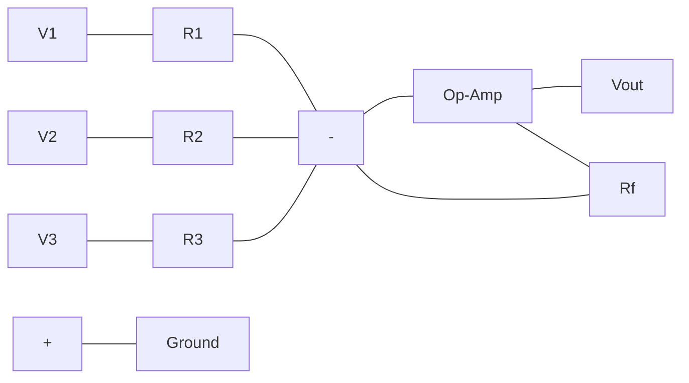

- **ફંક્શન**: ઇનપુટ વોલ્ટેજનો વેઇટેડ સમ આઉટપુટ કરે છે
- **આઉટપુટ સમીકરણ**: Vout = -(V1×Rf/R1 + V2×Rf/R2 + V3×Rf/R3)
- **સમાન ભાર**: જ્યારે R1 = R2 = R3, આઉટપુટ સરળ સમ ગુણાકાર -Rf/R છે
- **વર્ચ્યુઅલ ગ્રાઉન્ડ**: ઈન્વર્ટિંગ ઇનપુટ 0V પોટેન્શિયલ જાળવે છે

**મેમરી ટ્રીક:** "SWAP" (Sum Weighted And Proportional)

## પ્રશ્ન 4(બ) [4 ગુણ]

**નીચેના OP-AMP પેરામીટરને વ્યાખ્યાયિત કરો: 1. ઇનપુટ બાયસ કરંટ 2. CMRR**

**જવાબ**:

**ઇનપુટ બાયસ કરંટ**:
જ્યારે આઉટપુટ શૂન્ય હોય ત્યારે બે ઇનપુટ ટર્મિનલમાં પ્રવાહિત થતા કરંટની સરેરાશ.

**CMRR (કોમન મોડ રિજેક્શન રેશિયો)**:
ડિફરેન્શિયલ ગેઇનનો કોમન-મોડ ગેઇન સાથેનો ગુણોત્તર, જે દર્શાવે છે કે ઓપ-એમ્પ બંને ઇનપુટ માટે સામાન્ય સિગ્નલને કેટલી સારી રીતે રિજેક્ટ કરે છે.

**કોષ્ટક: ઓપ-એમ્પ પેરામીટર્સ**

| પેરામીટર | સામાન્ય મૂલ્ય | મહત્વ |
|-----------|---------------|------------|
| ઇનપુટ બાયસ કરંટ | 20-200 nA | હાઈ ઇમ્પિડન્સ સર્કિટ માટે ઓછું વધુ સારું |
| CMRR | 80-120 dB | નોઇઝ રિજેક્શન માટે વધુ સારું |

**મેમરી ટ્રીક:** "BIC-CMR" (Bias Is Current, Common Mode Rejection)

## પ્રશ્ન 4(ક) [7 ગુણ]

**555 ટાઈમરનો ઉપયોગ કરીને મોનોસ્ટેબલ મલ્ટિવાઇબ્રેટર દોરો અને સમજાવો.**

**જવાબ**:
મોનોસ્ટેબલ મલ્ટીવાઇબ્રેટર ટ્રિગર થતાં પૂર્વનિર્ધારિત અવધિનો એક પલ્સ જનરેટ કરે છે.

**સર્કિટ ડાયાગ્રામ:**

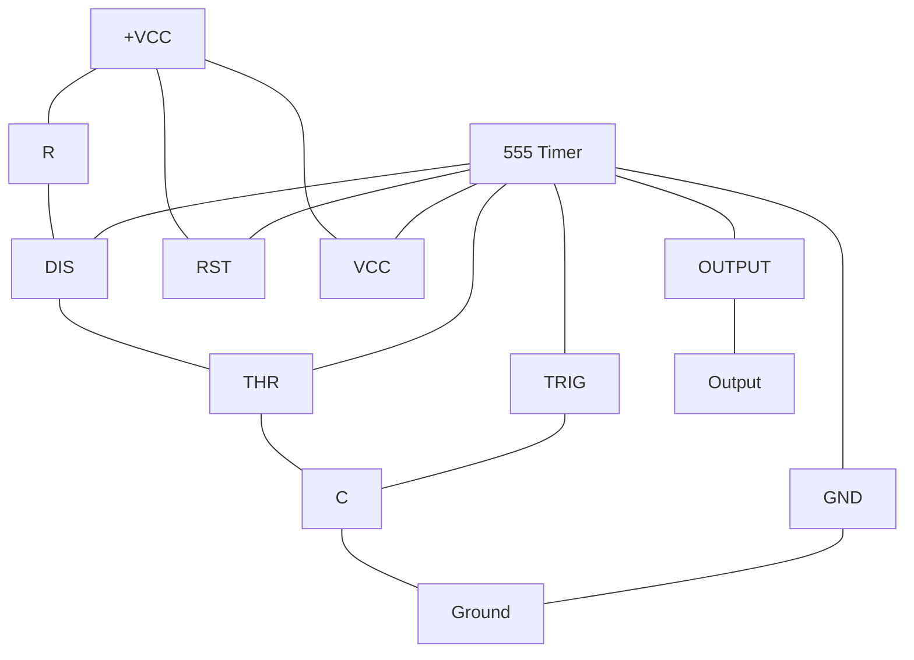

**આઉટપુટ વેવફોર્મ:**

```
Trigger  ___┐      ____________
             │______│
             
Output   ____┌──────┐__________
              │      │
              T = 1.1RC
```

- **ઓપરેશન**: સિંગલ સ્ટેબલ સ્ટેટ (આઉટપુટ LOW), ટ્રિગર થતાં અસ્થાયી રૂપે HIGH
- **પલ્સ વિડ્થ**: T = 1.1 × R × C (સેકન્ડ)
- **ટ્રિગરિંગ**: TRIG પિન (પિન 2) પર ફોલિંગ એજ
- **ટાઇમિંગ કોમ્પોનન્ટ્સ**: R અને C પલ્સ અવધિ નક્કી કરે છે

**મેમરી ટ્રીક:** "POST" (Pulse Output, Single Trigger)

## પ્રશ્ન 4(અ) OR [3 ગુણ]

**OP-AMP ના ઇન્વર્ટિંગ એમ્પ્લીફાયરનો સર્કિટ ડાયાગ્રામને દોરો.**

**જવાબ**:

**ઇન્વર્ટિંગ એમ્પ્લિફાયર સર્કિટ:**

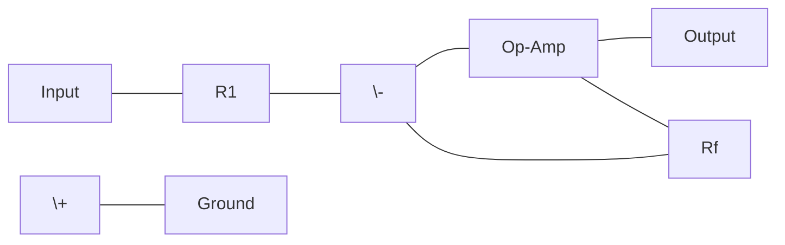

**મેમરી ટ્રીક:** "IRON" (Inverting Requires One Negative input)

## પ્રશ્ન 4(બ) OR [4 ગુણ]

**નીચેના OP-AMP પેરામીટરને વ્યાખ્યાયિત કરો: 1. ઇનપુટ ઓફસેટ કરંટ 2. સ્લ્યુ રેટ**

**જવાબ**:

**ઇનપુટ ઓફસેટ કરંટ**:
બે ઇનપુટ ટર્મિનલમાં પ્રવાહિત થતા કરંટ વચ્ચેનો તફાવત.

**સ્લ્યુ રેટ**:
આઉટપુટ વોલ્ટેજનો સમય પ્રતિ એકમ મહત્તમ ફેરફાર દર, સામાન્ય રીતે V/μs માં માપવામાં આવે છે.

**કોષ્ટક: ઓપ-એમ્પ પેરામીટર્સ**

| પેરામીટર | સામાન્ય મૂલ્ય | મહત્વ |
|-----------|---------------|------------|
| ઇનપુટ ઓફસેટ કરંટ | 2-50 nA | પ્રિસિઝન એપ્લિકેશન માટે ઓછું વધુ સારું |
| સ્લ્યુ રેટ | 0.5-20 V/μs | હાઈ-ફ્રિક્વન્સી ઓપરેશન માટે વધુ સારું |

**મેમરી ટ્રીક:** "IOSR" (Input Offset and Slew Rate)

## પ્રશ્ન 4(ક) OR [7 ગુણ]

**ઑપ-એમ્પને ઇન્વર્ટિંગ એમ્પ્લીફાયર તરીકે સમજાવો અને તેના વોલ્ટેજ ગેઇનનું સમીકરણ મેળવો.**

**જવાબ**:
ઇન્વર્ટિંગ એમ્પ્લિફાયર એક ઇન્વર્ટેડ અને એમ્પ્લિફાઇડ આઉટપુટ સિગ્નલ ઉત્પન્ન કરે છે.

**સર્કિટ ડાયાગ્રામ:**


**વોલ્ટેજ ગેઇન ડેરિવેશન:**

```
નોડ N (ઇન્વર્ટિંગ ઇનપુટ) પર:
I1 + If = 0  (કિરકોફનો કરંટ લો દ્વારા)
(Vin - VN)/R1 + (Vout - VN)/Rf = 0

જ્યારે VN ≈ 0 (વર્ચ્યુઅલ ગ્રાઉન્ડ):
Vin/R1 + Vout/Rf = 0
Vout/Vin = -Rf/R1
```

- **ગેઇન સમીકરણ**: Vout/Vin = -Rf/R1
- **વર્ચ્યુઅલ ગ્રાઉન્ડ**: ઇન્વર્ટિંગ ટર્મિનલ 0V પર જાળવવામાં આવે છે
- **ઇનપુટ ઇમ્પિડન્સ**: R1 ને સમાન
- **નેગેટિવ ફીડબેક**: સ્થિરતા અને લિનિયારિટી પ્રદાન કરે છે

**મેમરી ટ્રીક:** "GIVN" (Gain Is Negative, Virtual ground)

## પ્રશ્ન 5(અ) [3 ગુણ]

**IC 555 નો બ્લોક ડાયાગ્રામ દોરો.**

**જવાબ**:

**IC 555નો બ્લોક ડાયાગ્રામ:**

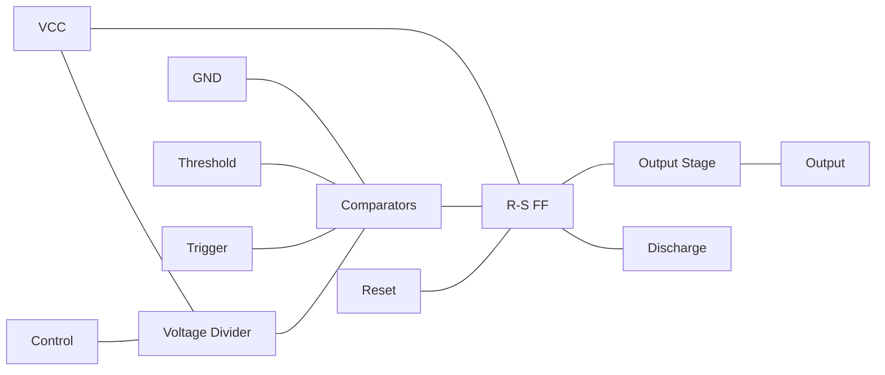

**મેમરી ટ્રીક:** "CVOT" (Comparators, Voltage divider, Output stage, Timer)

## પ્રશ્ન 5(બ) [4 ગુણ]

**વેઈન બ્રિજ ઓસીલેટર તરીકે OP-AMPનો સર્કિટ ડાયાગ્રામ દોરો.**

**જવાબ**:

**વેઈન બ્રિજ ઓસીલેટર સર્કિટ:**

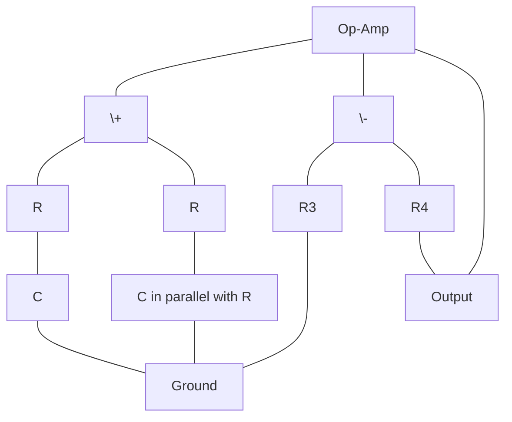

**મેમરી ટ્રીક:** "WPRC" (Wein Produces Resonant Circuit)

## પ્રશ્ન 5(ક) [7 ગુણ]

**વિવિધ પ્રકારના ફિક્સ્ડ અને વેરિયેબલ વોલ્ટેજ રેગ્યુલેટર IC ની કામગીરી સમજાવો.**

**જવાબ**:
વોલ્ટેજ રેગ્યુલેટર IC ઇનપુટ અથવા લોડ વેરિએશન છતાં સ્થિર આઉટપુટ વોલ્ટેજ જાળવે છે.

**ફિક્સ્ડ વોલ્ટેજ રેગ્યુલેટર:**

```mermaid
graph LR
    VIN[Input] --- IC[78XX/79XX] --- VOUT[Output]
    IC --- GND[Ground]
    C1[Input Cap] --- VIN
    C1 --- GND
    C2[Output Cap] --- VOUT
    C2 --- GND
```

**વેરિએબલ વોલ્ટેજ રેગ્યુલેટર:**

```mermaid
graph TD
    VIN[Input] --- IC[LM317]
    IC --- VOUT[Output]
    IC --- ADJ[Adjust]
    R1[R1] --- ADJ
    R1 --- VOUT
    R2[R2] --- ADJ
    R2 --- GND[Ground]
    C1[Input Cap] --- VIN
    C1 --- GND
    C2[Output Cap] --- VOUT
    C2 --- GND
```

- **ફિક્સ્ડ રેગ્યુલેટર**: 78XX (પોઝિટિવ) અને 79XX (નેગેટિવ) સીરીઝ ચોક્કસ વોલ્ટેજ પ્રદાન કરે છે
- **વેરિએબલ રેગ્યુલેટર**: LM317 (પોઝિટિવ) અને LM337 (નેગેટિવ) એડજસ્ટેબલ આઉટપુટની મંજૂરી આપે છે
- **થ્રી-ટર્મિનલ ડિઝાઇન**: ઇનપુટ, આઉટપુટ અને ગ્રાઉન્ડ/એડજસ્ટ ટર્મિનલ
- **LM317 માટે આઉટપુટ સમીકરણ**: Vout = 1.25V × (1 + R2/R1)
- **પ્રોટેક્શન ફીચર્સ**: શોર્ટ સર્કિટ, થર્મલ ઓવરલોડ અને સેફ એરિયા પ્રોટેક્શન

**મેમરી ટ્રીક:** "FAVOR" (Fixed And Variable Output Regulators)

## પ્રશ્ન 5(અ) OR [3 ગુણ]

**555 ટાઈમરનો ઉપયોગ કરીને એસ્ટેબલ મલ્ટિવાઈબ્રેટરનો બ્લોક ડાયાગ્રામ દોરો.**

**જવાબ**:

**એસ્ટેબલ મલ્ટિવાઇબ્રેટર બ્લોક ડાયાગ્રામ:**

```mermaid
graph LR
    VCC[VCC] --- R1[R1] --- R2[R2]
    R2 --- DIS[Discharge]
    DIS --- THR[Threshold]
    THR --- C[Capacitor]
    C --- GND[Ground]
    TRG[Trigger] --- THR
    RESET[Reset] --- VCC
    IC[555 Timer] --- THR
    IC --- TRG
    IC --- DIS
    IC --- RESET
    IC --- OUT[Output]
    IC --- VCC1[VCC]
    IC --- GND1[GND]
    VCC1 --- VCC
    GND1 --- GND
```

**મેમરી ટ્રીક:** "FOFT" (Free-running Oscillator From Timer)

## પ્રશ્ન 5(બ) OR [4 ગુણ]

**સૌર આધારિત બેટરી ચાર્જર સર્કિટ દોરો અને સમજાવો.**

**જવાબ**:
સોલર બેટરી ચાર્જર સૂર્ય ઊર્જાને બેટરી ચાર્જ કરવા માટે રૂપાંતરિત કરે છે.

**સર્કિટ ડાયાગ્રામ:**

```mermaid
graph LR
    SP[Solar Panel] --- D[Blocking Diode]
    D --- R[Regulator IC]
    R --- B[Battery]
    R --- LED[Charge Indicator]
    LED --- GND[Ground]
    B --- GND
```

- **સોલર પેનલ**: સૂર્યપ્રકાશને DC વીજળીમાં રૂપાંતરિત કરે છે
- **બ્લોકિંગ ડાયોડ**: રાત્રે પેનલ દ્વારા બેટરી ડિસ્ચાર્જને અટકાવે છે
- **રેગ્યુલેટર IC**: ચાર્જિંગ વોલ્ટેજ અને કરંટને નિયંત્રિત કરે છે
- **ચાર્જ ઇન્ડિકેટર**: ચાર્જિંગની સ્થિતિ દર્શાવે છે
- **પ્રોટેક્શન**: ઓવરચાર્જ અને રિવર્સ પોલારિટી પ્રોટેક્શન

**મેમરી ટ્રીક:** "SBRCP" (Solar, Blocking diode, Regulator, Charging, Protection)

## પ્રશ્ન 5(ક) OR [7 ગુણ]

**SMPS ના બ્લોક ડાયાગ્રામ દોરો અને સમજાવો**

**જવાબ**:
SMPS (સ્વિચ મોડ પાવર સપ્લાય) સ્વિચિંગ રેગ્યુલેટર્સનો ઉપયોગ કરીને વીજળી શક્તિને કુશળતાથી રૂપાંતરિત કરે છે.

**બ્લોક ડાયાગ્રામ:**

```mermaid
graph LR
    AC[AC Input] --- EMI[EMI Filter]
    EMI --- REC[Rectifier]
    REC --- C[Input Filter]
    C --- SW[Switching Circuit]
    SW --- TR[Transformer]
    TR --- OR[Output Rectifier]
    OR --- OF[Output Filter]
    OF --- O[DC Output]
    FB[Feedback] --- O
    FB --- CTRL[Control Circuit]
    CTRL --- SW
```

- **EMI ફિલ્ટર**: AC ઇનપુટમાંથી નોઇઝ દૂર કરે છે
- **રેક્ટિફાયર**: AC ને અનરેગ્યુલેટેડ DC માં રૂપાંતરિત કરે છે
- **સ્વિચિંગ સર્કિટ**: DC ને ઉચ્ચ ફ્રિક્વન્સી (20-100 kHz) પર ચોપ કરે છે
- **ટ્રાન્સફોર્મર**: આઇસોલેશન અને વોલ્ટેજ રૂપાંતરણ પ્રદાન કરે છે
- **આઉટપુટ રેક્ટિફાયર**: હાઈ-ફ્રિક્વન્સી AC ને ફરીથી DC માં કન્વર્ટ કરે છે
- **આઉટપુટ ફિલ્ટર**: DC આઉટપુટને સ્મૂથ કરે છે
- **ફીડબેક સર્કિટ**: રેગ્યુલેશન માટે આઉટપુટનું મોનિટરિંગ કરે છે
- **કંટ્રોલ સર્કિટ**: ફીડબેકના આધારે સ્વિચિંગ એડજસ્ટ કરે છે

**મેમરી ટ્રીક:** "ERST-FOFC" (EMI filter, Rectifier, Switching, Transformer, Feedback, Output rectifier, Filter, Control)
