## Question 1(a) [3 marks]

**What is heat sink. lists its types**

**Answer**:
A heat sink is a passive device that absorbs and dissipates heat from electronic components to prevent overheating.

**Table: Types of Heat Sinks**

| Type | Description |
|------|-------------|
| **Passive** | Uses natural convection without external power |
| **Active** | Incorporates fans or liquid cooling |
| **Radial** | Fins arranged in radial pattern from center |
| **Pin-fin** | Uses pins or rods for increased surface area |
| **Extruded** | Made by forcing aluminum through shaped die |

**Mnemonic:** "PAPER" (Passive, Active, Pin-fin, Extruded, Radial)

## Question 1(b) [4 marks]

**Define the Following: 1. Thermal Runaway 2. Thermal Stability**

**Answer**:

**Thermal Runaway**: 
The self-accelerating destructive process where increased temperature causes increased current flow, which further increases temperature, potentially destroying the transistor.

**Thermal Stability**:
The ability of a transistor circuit to maintain stable operation despite temperature changes, preventing thermal runaway.

**Diagram: Thermal Runaway Process**

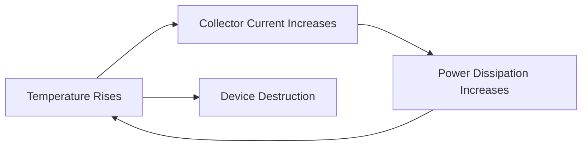

**Mnemonic:** "RISE" (Runaway Is Self-Escalating)

## Question 1(c) [7 marks]

**Explain voltage divider bias in details.**

**Answer**:
Voltage divider bias is a common transistor biasing technique that provides stable operation.

**Circuit Diagram:**

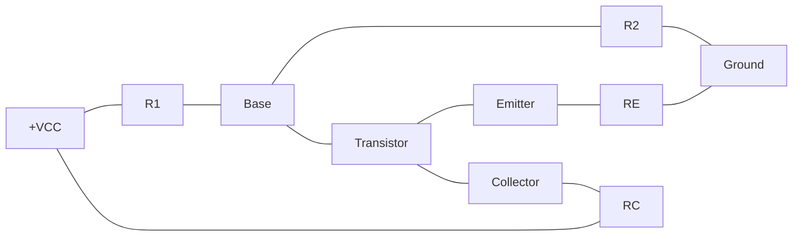

- **Voltage divider network**: R1 and R2 establish a fixed base voltage
- **Stable Q-point**: Maintains operating point despite temperature variations
- **Better stability**: Higher stability factor compared to fixed bias
- **Self-adjusting**: Base current automatically adjusts to counter temperature changes

**Mnemonic:** "VSST" (Voltage divider, Stable, Self-adjusting, Temperature resistant)

## Question 1(c) OR [7 marks]

**Explain D.C. Load Line in details.**

**Answer**:
DC Load Line is a graphical method for analyzing transistor bias conditions.

**Diagram: DC Load Line on Transistor Characteristic Curves**

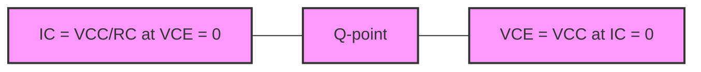

- **Definition**: Graphical line showing all possible operating points for a given circuit
- **Endpoints**: (0, VCC/RC) and (VCC, 0) on IC-VCE plane
- **Q-point**: Intersection of load line with transistor characteristic curve
- **Equation**: IC = (VCC - VCE)/RC

**Mnemonic:** "QECC" (Q-point Exists where Collector Current meets characteristics)

## Question 2(a) [3 marks]

**Explain how transistor works as a switch.**

**Answer**:
A transistor switch operates in either saturation (ON) or cutoff (OFF) regions.

**Table: Transistor Switch Operation**

| State | Region | Base Current | Collector Current | VCE |
|-------|--------|--------------|------------------|-----|
| OFF | Cutoff | IB ≈ 0 | IC ≈ 0 | VCE ≈ VCC |
| ON | Saturation | IB > IB(sat) | IC ≈ IC(sat) | VCE ≈ 0.2V |

**Mnemonic:** "COS" (Cutoff Off, Saturation on)

## Question 2(b) [4 marks]

**Draw and explain colpitt oscillator.**

**Answer**:
Colpitt oscillator is an LC oscillator using a capacitive voltage divider for feedback.

**Circuit Diagram:**

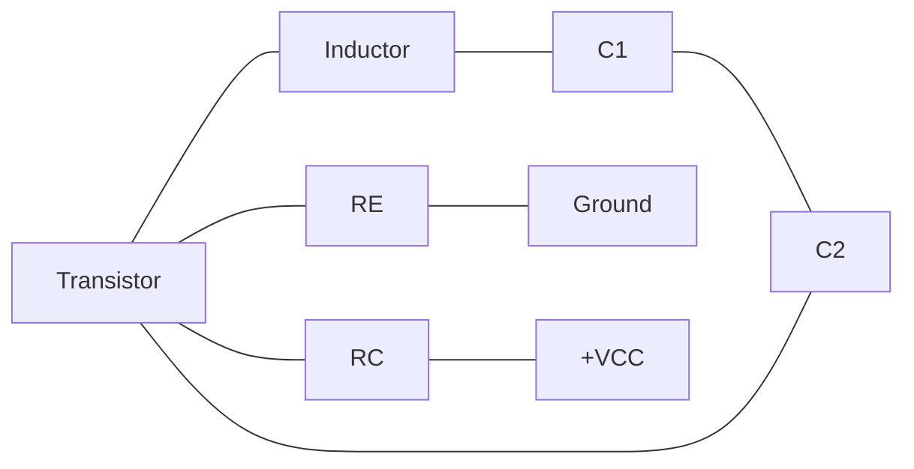

- **Feedback**: Provided by capacitive voltage divider (C1, C2)
- **Resonant frequency**: f = 1/(2π√(L×C)), where C = (C1×C2)/(C1+C2)
- **Oscillation**: Maintains through regenerative feedback
- **Phase shift**: 360° around the loop

**Mnemonic:** "CFPO" (Capacitive Feedback Produces Oscillations)

## Question 2(c) [7 marks]

**Explain Frequency Response Two Stage RC Coupled Amplifier with circuit diagram.**

**Answer**:
Two-stage RC coupled amplifier combines two amplifier stages with RC coupling.

**Circuit Diagram:**

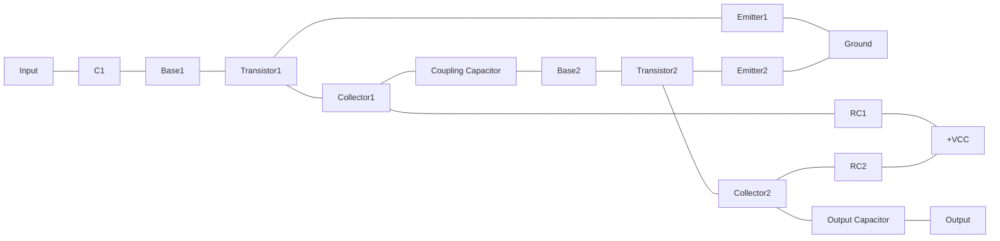

**Frequency Response:**

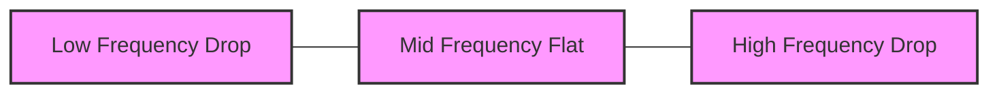

- **Low frequency**: Gain drops due to coupling capacitor impedance
- **Mid frequency**: Maximum flat gain region (bandwidth)
- **High frequency**: Gain drops due to transistor capacitance effects
- **Overall gain**: Product of individual stage gains

**Mnemonic:** "LMH" (Low drops, Mid flat, High drops)

## Question 2(a) OR [3 marks]

**Draw circuit diagram of Hartley oscillator.**

**Answer**:

**Circuit Diagram of Hartley Oscillator:**

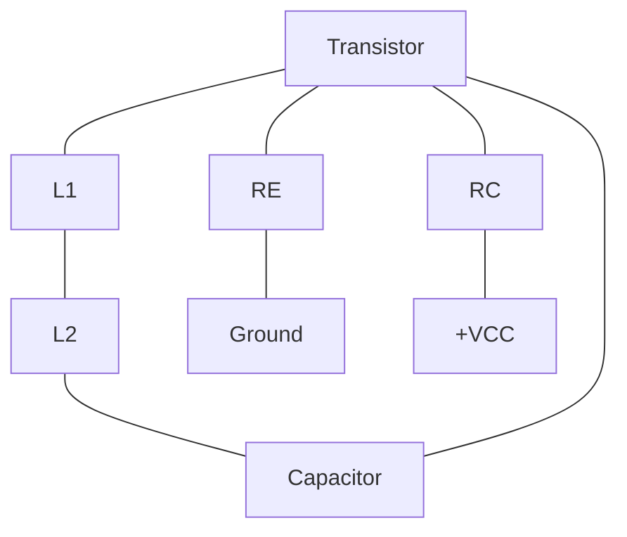

**Mnemonic:** "ITLC" (Inductor Tapped for LC Circuit)

## Question 2(b) OR [4 marks]

**List different types of negative feedback.**

**Answer**:

**Table: Types of Negative Feedback**

| Type | Configuration | Effect on Parameters |
|------|---------------|---------------------|
| **Voltage Series** | Output voltage fed to input in series | Increases input impedance, reduces distortion |
| **Voltage Shunt** | Output voltage fed to input in parallel | Decreases input impedance, increases bandwidth |
| **Current Series** | Output current fed to input in series | Increases output impedance, stabilizes current gain |
| **Current Shunt** | Output current fed to input in parallel | Decreases output impedance, stabilizes voltage gain |

**Mnemonic:** "VSCS" (Voltage Series, Current Shunt)

## Question 2(c) OR [7 marks]

**List advantages of Negative feedback amplifier and Explain voltage series negative feedback in details.**

**Answer**:

**Advantages of Negative Feedback:**

- Stabilizes gain against component variations
- Reduces distortion and noise
- Increases bandwidth
- Modifies input/output impedance
- Improves linearity

**Voltage Series Negative Feedback:**

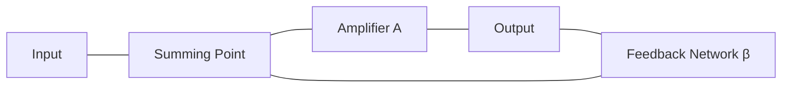

- **Configuration**: Output voltage sampled, fed back in series with input
- **Closed-loop gain**: ACL = A/(1+Aβ), where A is open-loop gain and β is feedback fraction
- **Input impedance**: Increases by factor (1+Aβ)
- **Output impedance**: Decreases by factor (1+Aβ)

**Mnemonic:** "SIGO" (Stable gain, Increased input impedance, Gain reduction, Output impedance reduction)

## Question 3(a) [3 marks]

**Draw circuit of SCR using two transistor analogy.**

**Answer**:

**Two Transistor Analogy of SCR:**

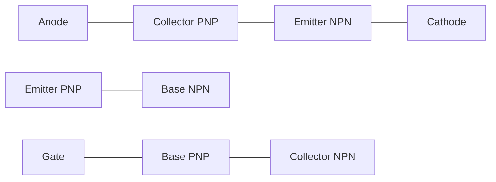

**Mnemonic:** "PNPNPN" (PNP and NPN structure)

## Question 3(b) [4 marks]

**Draw and explain Natural Commutation of SCR.**

**Answer**:
Natural commutation occurs when the SCR current naturally falls below the holding current.

**Circuit Diagram:**

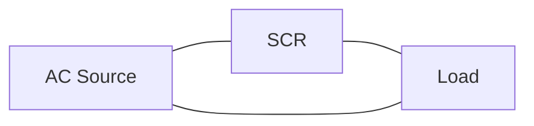

**Current Waveform:**

```
       ┌───┐     ┌───┐
       │   │     │   │
───────┘   └─────┘   └─────
  SCR OFF    SCR OFF
       SCR ON    SCR ON
```

- **Definition**: SCR turns off automatically when current falls below holding current
- **AC circuit**: Occurs naturally at end of each positive half-cycle
- **Zero crossing**: SCR turns off when AC voltage crosses zero
- **No external circuit**: No additional components needed for turn-off

**Mnemonic:** "NAZC" (Natural At Zero Crossing)

## Question 3(c) [7 marks]

**Explain how TRIAC can be used as fan regulator and on-off control for ac power.**

**Answer**:
TRIAC is a bidirectional device ideal for AC power control applications.

**TRIAC Fan Regulator Circuit:**

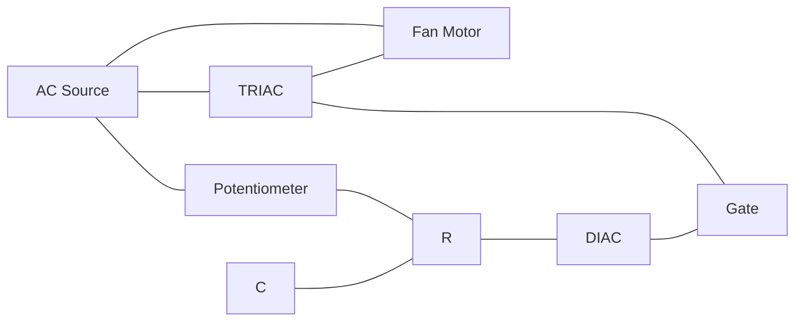

**TRIAC On-Off Control:**

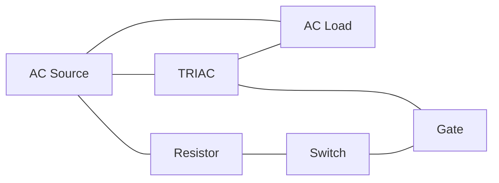

- **Fan Regulation**: Phase control technique varies power to fan
- **Potentiometer**: Adjusts firing angle of TRIAC
- **On-Off Control**: Simple switch triggers TRIAC gate
- **Bidirectional**: Controls current in both half-cycles

**Mnemonic:** "FPOB" (Fan Power is controlled by Phase angle in both directions)

## Question 3(a) OR [3 marks]

**Draw symbol of SCR, DIAC and TRIAC.**

**Answer**:

**Symbols of Thyristors:**

```goat
    SCR            DIAC           TRIAC
    
    A              
    |              
   ┌┴┐            ┌─┐            ┌─┐
   │ │            │ │            │ │
   └┬┘            └─┘            └─┘
    │              |              |
    │              |              |
    G─┐            |              G─┐
      │            |                │
    K |            |                |
```

**Mnemonic:** "SDT" (SCR has gate on one side, DIAC has none, TRIAC has gate in middle)

## Question 3(b) OR [4 marks]

**Draw and explain Gate triggering of SCR.**

**Answer**:
Gate triggering is the most common method to turn on an SCR.

**Circuit Diagram:**

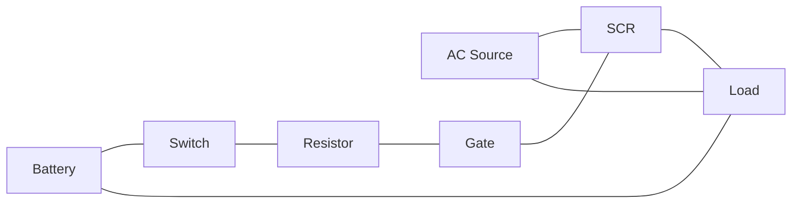

- **Principle**: Applying positive voltage between gate and cathode
- **Current requirement**: Small gate current triggers much larger anode current
- **Latching**: Once triggered, SCR remains ON even if gate signal is removed
- **Turn-off**: Requires reducing anode current below holding current

**Mnemonic:** "GPLT" (Gate Pulse Latches Thyristor)

## Question 3(c) OR [7 marks]

**Draw Construction and Voltage Vs Current characteristic of SCR and explain V-I characteristic.**

**Answer**:
SCR (Silicon Controlled Rectifier) is a four-layer PNPN semiconductor device.

**SCR Construction:**

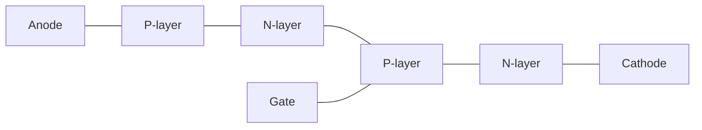

**V-I Characteristic:**

```
          I
          ↑
          │        ON State
          │       ┌────────
          │       │
          │       │
  Holding │       │
  current ├───────┤
          │       │
          │Forward│
          │breakover
          │voltage│
          │       │
          └───────┴──────→ V
                   Reverse
                   breakdown
                   voltage
```

- **Forward blocking region**: SCR conducts minimal current until breakover voltage
- **Forward conduction region**: Low resistance state after triggering
- **Reverse blocking region**: Blocks current in reverse direction
- **Gate triggering**: Reduces breakover voltage, facilitating turn-on

**Mnemonic:** "FBRH" (Forward Blocking, Reverse blocking, Holding current)

## Question 4(a) [3 marks]

**Explain OP-AMP as a summing amplifier.**

**Answer**:
Summing amplifier adds multiple input signals with weighted gains.

**Circuit Diagram:**

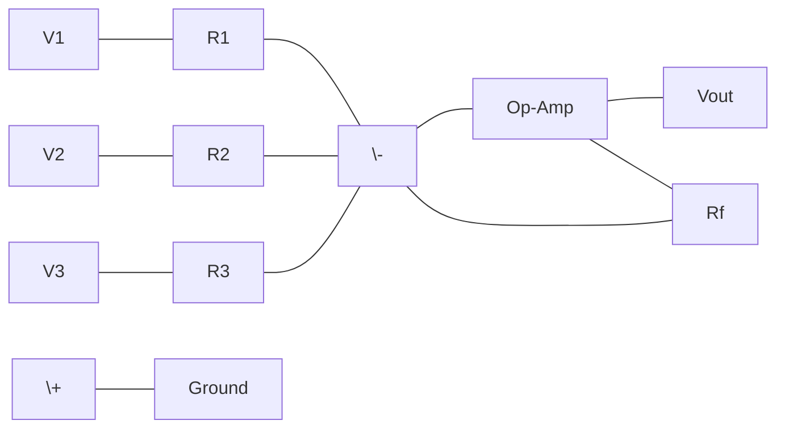

- **Function**: Outputs weighted sum of input voltages
- **Output equation**: Vout = -(V1×Rf/R1 + V2×Rf/R2 + V3×Rf/R3)
- **Equal weights**: When R1 = R2 = R3, output is simple sum multiplied by -Rf/R
- **Virtual ground**: Inverting input maintains 0V potential

**Mnemonic:** "SWAP" (Sum Weighted And Proportional)

## Question 4(b) [4 marks]

**Define the following OP-AMP parameters: 1. input bias current 2. CMRR**

**Answer**:

**Input Bias Current**:
The average of the currents flowing into the two input terminals of an op-amp when the output is at zero.

**CMRR (Common Mode Rejection Ratio)**:
The ratio of differential gain to common-mode gain, indicating how well an op-amp rejects signals common to both inputs.

**Table: Op-Amp Parameters**

| Parameter | Typical Value | Importance |
|-----------|---------------|------------|
| Input Bias Current | 20-200 nA | Lower is better for high impedance circuits |
| CMRR | 80-120 dB | Higher is better for noise rejection |

**Mnemonic:** "BIC-CMR" (Bias Is Current, Common Mode Rejection)

## Question 4(c) [7 marks]

**Draw and explain monostable multivibrator using 555 Timer.**

**Answer**:
Monostable multivibrator generates a single pulse of predetermined duration when triggered.

**Circuit Diagram:**

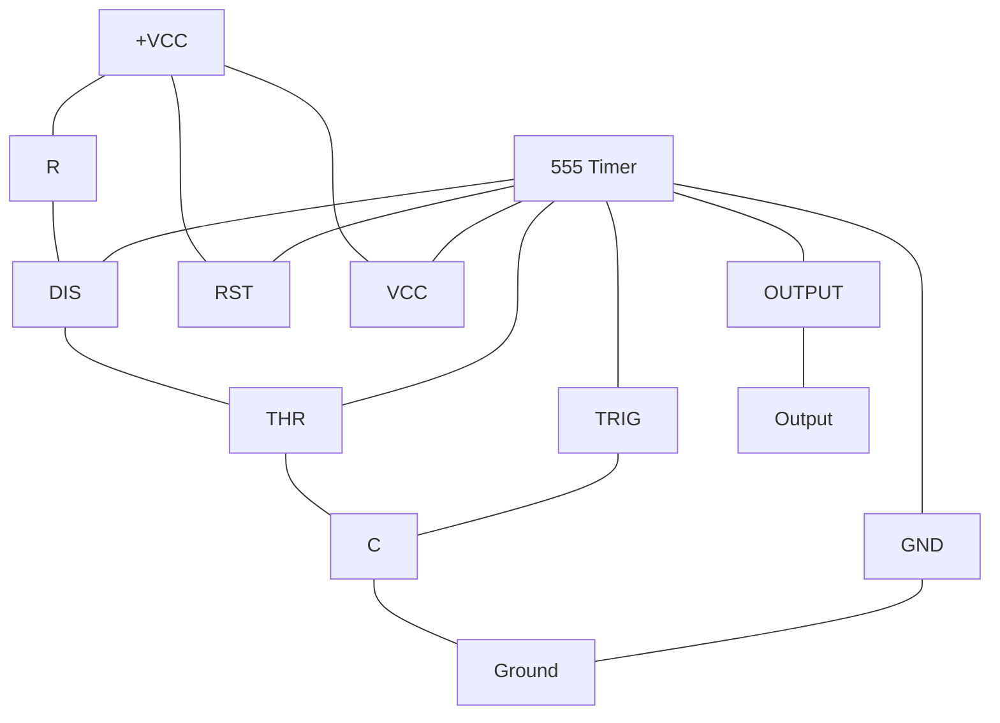

**Output Waveform:**

```
Trigger  ___┐      ____________
             │______│
             
Output   ____┌──────┐__________
              │      │
              T = 1.1RC
```

- **Operation**: Single stable state (output LOW), temporarily HIGH when triggered
- **Pulse width**: T = 1.1 × R × C (seconds)
- **Triggering**: Falling edge on TRIG pin (pin 2)
- **Timing components**: R and C determine pulse duration

**Mnemonic:** "POST" (Pulse Output, Single Trigger)

## Question 4(a) OR [3 marks]

**Draw the circuit diagram of OP-AMP as a inverting amplifier.**

**Answer**:

**Inverting Amplifier Circuit:**

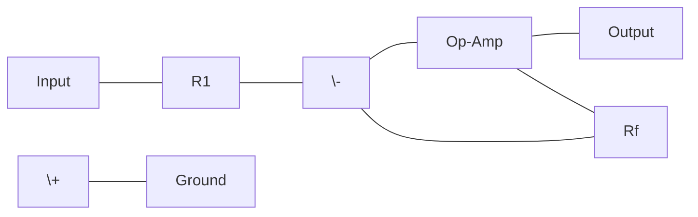

**Mnemonic:** "IRON" (Inverting Requires One Negative input)

## Question 4(b) OR [4 marks]

**Define the following OP-AMP parameters: 1. input offset current 2. slew rate**

**Answer**:

**Input Offset Current**:
The difference between the currents flowing into the two input terminals of an op-amp.

**Slew Rate**:
The maximum rate of change of output voltage per unit of time, typically measured in V/μs.

**Table: Op-Amp Parameters**

| Parameter | Typical Value | Importance |
|-----------|---------------|------------|
| Input Offset Current | 2-50 nA | Lower is better for precision applications |
| Slew Rate | 0.5-20 V/μs | Higher is better for high-frequency operation |

**Mnemonic:** "IOSR" (Input Offset and Slew Rate)

## Question 4(c) OR [7 marks]

**Explain op-amp as Inverting amplifier and obtain equation of its Voltage gain.**

**Answer**:
Inverting amplifier produces an output signal that is inverted and amplified.

**Circuit Diagram:**


**Voltage Gain Derivation:**

```
At node N (inverting input):
I1 + If = 0  (By Kirchhoff's Current Law)
(Vin - VN)/R1 + (Vout - VN)/Rf = 0

Since VN ≈ 0 (virtual ground):
Vin/R1 + Vout/Rf = 0
Vout/Vin = -Rf/R1
```

- **Gain equation**: Vout/Vin = -Rf/R1
- **Virtual ground**: Inverting terminal maintained at 0V
- **Input impedance**: Equal to R1
- **Negative feedback**: Provides stability and linearity

**Mnemonic:** "GIVN" (Gain Is Negative, Virtual ground)

## Question 5(a) [3 marks]

**Draw the block diagram of IC 555.**

**Answer**:

**Block Diagram of IC 555:**

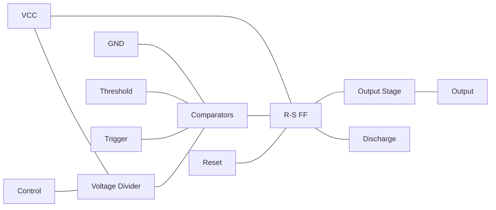

**Mnemonic:** "CVOT" (Comparators, Voltage divider, Output stage, Timer)

## Question 5(b) [4 marks]

**Draw the circuit diagram of OP-AMP as a wein bridge oscillator.**

**Answer**:

**Wein Bridge Oscillator Circuit:**

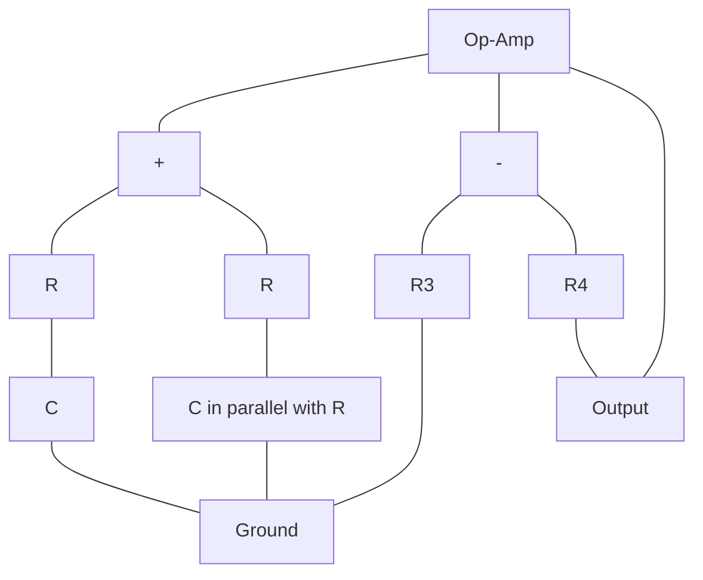

**Mnemonic:** "WPRC" (Wein Produces Resonant Circuit)

## Question 5(c) [7 marks]

**Explain working of different types of Fixed and variable voltage regulator IC.**

**Answer**:
Voltage regulator ICs maintain stable output voltage despite input or load variations.

**Fixed Voltage Regulators:**

```mermaid
graph LR
    VIN[Input] --- IC[78XX/79XX] --- VOUT[Output]
    IC --- GND[Ground]
    C1[Input Cap] --- VIN
    C1 --- GND
    C2[Output Cap] --- VOUT
    C2 --- GND
```

**Variable Voltage Regulator:**

```mermaid
graph TD
    VIN[Input] --- IC[LM317]
    IC --- VOUT[Output]
    IC --- ADJ[Adjust]
    R1[R1] --- ADJ
    R1 --- VOUT
    R2[R2] --- ADJ
    R2 --- GND[Ground]
    C1[Input Cap] --- VIN
    C1 --- GND
    C2[Output Cap] --- VOUT
    C2 --- GND
```

- **Fixed regulators**: 78XX (positive) and 79XX (negative) series provide specific voltages
- **Variable regulators**: LM317 (positive) and LM337 (negative) allow adjustable output
- **Three-terminal design**: Input, output, and ground/adjust terminals
- **Output equation for LM317**: Vout = 1.25V × (1 + R2/R1)
- **Protection features**: Short circuit, thermal overload, and safe area protection

**Mnemonic:** "FAVOR" (Fixed And Variable Output Regulators)

## Question 5(a) OR [3 marks]

**Draw the block diagram of astable multivibrator using 555 timer.**

**Answer**:

**Astable Multivibrator Block Diagram:**

```mermaid
graph LR
    VCC[VCC] --- R1[R1] --- R2[R2]
    R2 --- DIS[Discharge]
    DIS --- THR[Threshold]
    THR --- C[Capacitor]
    C --- GND[Ground]
    TRG[Trigger] --- THR
    RESET[Reset] --- VCC
    IC[555 Timer] --- THR
    IC --- TRG
    IC --- DIS
    IC --- RESET
    IC --- OUT[Output]
    IC --- VCC1[VCC]
    IC --- GND1[GND]
    VCC1 --- VCC
    GND1 --- GND
```

**Mnemonic:** "FOFT" (Free-running Oscillator From Timer)

## Question 5(b) OR [4 marks]

**Draw and explain solar based battery charger circuits.**

**Answer**:
Solar battery charger converts solar energy to charge batteries.

**Circuit Diagram:**

```mermaid
graph LR
    SP[Solar Panel] --- D[Blocking Diode]
    D --- R[Regulator IC]
    R --- B[Battery]
    R --- LED[Charge Indicator]
    LED --- GND[Ground]
    B --- GND
```

- **Solar panel**: Converts sunlight to DC electricity
- **Blocking diode**: Prevents battery discharge through panel at night
- **Regulator IC**: Controls charging voltage and current
- **Charge indicator**: Shows charging status
- **Protection**: Overcharge and reverse polarity protection

**Mnemonic:** "SBRCP" (Solar, Blocking diode, Regulator, Charging, Protection)

## Question 5(c) OR [7 marks]

**Draw and explain the block diagram of SMPS.**

**Answer**:
SMPS (Switch Mode Power Supply) converts electrical power efficiently using switching regulators.

**Block Diagram:**

```mermaid
graph LR
    AC[AC Input] --- EMI[EMI Filter]
    EMI --- REC[Rectifier]
    REC --- C[Input Filter]
    C --- SW[Switching Circuit]
    SW --- TR[Transformer]
    TR --- OR[Output Rectifier]
    OR --- OF[Output Filter]
    OF --- O[DC Output]
    FB[Feedback] --- O
    FB --- CTRL[Control Circuit]
    CTRL --- SW
```

- **EMI filter**: Removes noise from AC input
- **Rectifier**: Converts AC to unregulated DC
- **Switching circuit**: Chops DC at high frequency (20-100 kHz)
- **Transformer**: Provides isolation and voltage conversion
- **Output rectifier**: Converts high-frequency AC back to DC
- **Output filter**: Smooths DC output
- **Feedback circuit**: Monitors output for regulation
- **Control circuit**: Adjusts switching based on feedback

**Mnemonic:** "ERST-FOFC" (EMI filter, Rectifier, Switching, Transformer, Feedback, Output rectifier, Filter, Control)
