## પ્રશ્ન 1(અ) [3 ગુણ]

**સ્વચ્છ આકૃતિ સાથે ડીસી લોડ લાઈન વિષે સમજાવો.**

**જવાબ**:
DC લોડ લાઈન ટ્રાન્ઝિસ્ટરના આઉટપુટ ખાસિયતો પર એક સીધી રેખા છે જે બધા સંભવિત ઓપરેટિંગ પોઇન્ટ્સ બતાવે છે.

**આકૃતિ:**

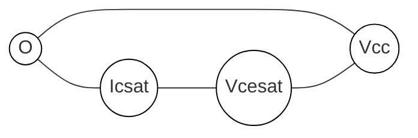

- **કલેક્ટર સેચુરેશન કરંટ**: જ્યારે VCE = 0, ત્યારે IC = VCC/RC
- **કટઓફ વોલ્ટેજ**: જ્યારે IC = 0, ત્યારે VCE = VCC
- **Q-પોઇન્ટ**: લોડ લાઈન પર ઓપરેટિંગ પોઇન્ટ

**મેમરી ટ્રીક:** "LEVEL" - "Load line દરેક લોડ સ્થિતિ માટે વોલ્ટેજ અને કરંટ સ્થાપિત કરે છે"

## પ્રશ્ન 1(બ) [4 ગુણ]

**થર્મલ રનઅવે વિગતવાર સમજાવો.**

**જવાબ**:
થર્મલ રનઅવે એક એવી સ્થિતિ છે જ્યાં ગરમી ટ્રાન્ઝિસ્ટરના કલેક્ટર કરંટમાં વધારો કરે છે, જે વધુ ગરમી ઉત્પન્ન કરે છે, જે ટ્રાન્ઝિસ્ટરને નુકસાન તરફ દોરી જાય છે.

**આકૃતિ:**


- **ગરમી ઉત્પાદન**: પાવર વપરાશ = VCE × IC
- **મહત્વપૂર્ણ અસર**: વધારેલ જંક્શન તાપમાન VBE ઘટાડે છે
- **નિવારણ**: હીટ સિંક, થર્મલ સ્ટેબલાઇઝેશન સર્કિટ્સ, યોગ્ય બાયસિંગ
- **ખતરો**: નિયંત્રિત ન કરવામાં આવે તો ટ્રાન્ઝિસ્ટરને નષ્ટ કરી શકે છે

**મેમરી ટ્રીક:** "HEAT" - "વધુ ઉત્સર્જન તાપમાનમાં વધારો કરે છે"

## પ્રશ્ન 1(ક) [7 ગુણ]

**ટુ સ્ટેજ R-C કપલ્ડ એમ્પ્લીફાયરનો સર્કિટ ડાયાગ્રામ અને ફ્રીક્વન્શી રિસ્પોન્સ દોરો. દરેક કમ્પોનન્ટનું મહત્વ સમજાવો.**

**જવાબ**:
R-C કપલ્ડ એમ્પ્લીફાયર મલ્ટીપલ ટ્રાન્ઝિસ્ટર સ્ટેજ્સને જોડવા માટે કેપેસિટર્સનો ઉપયોગ કરે છે જેથી ઉચ્ચ ગેઇન મેળવી શકાય.

**આકૃતિ:**

```goat
+------+            +------+
|      |            |      |
|  Q1  |            |  Q2  |
|      |            |      |
+------+            +------+
   |                   |
   |                   |
   R1       C2         R2
   |        ||         |
   +---||---+----------+
        C1             

Vin o----||---+        +------o Vout
             |         |
             R3        R4
             |         |
             +         +
```

**ફ્રીક્વન્સી રિસ્પોન્સ:**

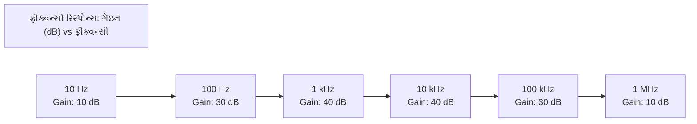

- **કપલિંગ કેપેસિટર્સ**: DC બ્લોક કરે છે, સ્ટેજ્સ વચ્ચે AC સિગ્નલ ટ્રાન્સફર કરે છે
- **બાયસિંગ રેસિસ્ટર્સ**: ટ્રાન્ઝિસ્ટર ઓપરેશન માટે યોગ્ય Q-પોઇન્ટ સ્થાપિત કરે છે
- **બાયપાસ કેપેસિટર્સ**: નેગેટિવ ફીડબેકથી ગેઇન ઘટાડો રોકે છે
- **બેન્ડવિડ્થ**: લો અને હાઈ કટઓફ ફ્રીક્વન્સી વચ્ચેનો રેન્જ

**મેમરી ટ્રીક:** "CARS" - "કપલિંગ કેપેસિટર્સ રેસિસ્ટન્સ સેપરેશન માટે મદદ કરે છે"

## અથવા

## પ્રશ્ન 1(ક) [7 ગુણ]

**એમ્પ્લીફાયરમાં નેગેટીવ અને પોઝીટીવ ફીડબેક સરખાવો.**

**જવાબ**:
ફીડબેક સિસ્ટમ્સ આઉટપુટના એક ભાગને ઇનપુટ પર પાછો મોકલે છે જેમાં ધ્રુવીયતાના આધારે અલગ અસરો થાય છે.

**કોષ્ટક:**

| પેરામીટર | નેગેટિવ ફીડબેક | પોઝિટિવ ફીડબેક |
|-----------|-------------------|-------------------|
| ગેઇન | ઘટાડે છે | વધારે છે |
| બેન્ડવિડ્થ | વધારે છે | ઘટાડે છે |
| સ્ટેબિલિટી | સુધારે છે | ઘટાડે છે |
| ડિસ્ટોર્શન | ઘટાડે છે | વધારે છે |
| નોઇઝ | ઘટાડે છે | વધારે છે |
| ઇનપુટ/આઉટપુટ ઇમ્પીડન્સ | નિયંત્રિત કરી શકાય છે | અનિશ્ચિત |
| એપ્લિકેશન્સ | એમ્પ્લિફાયર, રેગ્યુલેટર | ઓસિલેટર, શ્મિટ ટ્રિગર |

- **નેગેટિવ ફીડબેક**: આઉટપુટ ઇનપુટથી 180° શિફ્ટ હોય છે
- **પોઝિટિવ ફીડબેક**: આઉટપુટ ઇનપુટથી 0° શિફ્ટ હોય છે
- **બાર્ખાઉસન ક્રાઇટેરિયા**: યુનિટી ગેઇન સાથે પોઝિટિવ ફીડબેક ઓસિલેશન ઉત્પન્ન કરે છે

**મેમરી ટ્રીક:** "SIGN" - "સ્ટેબિલિટી ગેઇન નિગેશન સાથે વધે છે"

## પ્રશ્ન 2(અ) [3 ગુણ]

**ઓસિલેશન માટે બારખૌસન ક્રાઈટરીઆ (Barkhausen's criteria) જણાવો અને સમજાવો.**

**જવાબ**:
બાર્ખાઉસન ક્રાઇટેરિયા ફીડબેક સિસ્ટમમાં સતત ઓસિલેશન માટેની શરતો નિર્ધારિત કરે છે.

**આકૃતિ:**

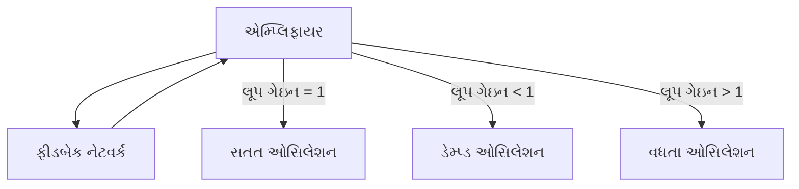

- **ગેઇન શરત**: લૂપ ગેઇન (A×β) 1 (યુનિટી) હોવી જોઈએ
- **ફેઝ શરત**: કુલ ફેઝ શિફ્ટ 0° અથવા 360° હોવી જોઈએ
- **વ્યવહારિક અમલીકરણ**: પ્રારંભિક લૂપ ગેઇન > 1, પછી 1 પર સ્થિર થાય છે

**મેમરી ટ્રીક:** "LOOP" - "લૂપની સમગ્ર આઉટપુટ ફેઝ"

## પ્રશ્ન 2(બ) [4 ગુણ]

**ફિક્સ્ડ બાયસ, કલેક્ટર ટુ બેઝ બાયસ અને વોલ્ટેજ ડિવાઈડર બાયસ પદ્ધતિઓની સરખામણી કરો.**

**જવાબ**:
વિવિધ બાયસિંગ તકનીકો સ્થિરતા અને તાપમાન ક્ષતિપૂર્તિના વિવિધ સ્તરો પ્રદાન કરે છે.

**કોષ્ટક:**

| પેરામીટર | ફિક્સ્ડ બાયસ | કલેક્ટર-બેઝ બાયસ | વોલ્ટેજ ડિવાઇડર બાયસ |
|-----------|------------|-------------------|----------------------|
| સ્ટેબિલિટી | નબળી | વધુ સારી | ઉત્તમ |
| સર્કિટ જટિલતા | સરળ | મધ્યમ | જટિલ |
| તાપમાન સ્ટેબિલિટી | નબળી | મધ્યમ | સારી |
| કોમ્પોનેન્ટ્સ | 1 રેસિસ્ટર | 1 રેસિસ્ટર | 3-4 રેસિસ્ટર |
| સ્ટેબિલિટી ફેક્ટર (S) | ઉચ્ચ | મધ્યમ | નીચો |

- **ફિક્સ્ડ બાયસ**: બેઝથી VCC સુધી એક રેસિસ્ટર
- **કલેક્ટર-બેઝ બાયસ**: કલેક્ટરથી બેઝ સુધી ફીડબેક રેસિસ્ટર
- **વોલ્ટેજ ડિવાઇડર**: બે રેસિસ્ટર સ્થિર રેફરન્સ વોલ્ટેજ બનાવે છે

**મેમરી ટ્રીક:** "STORM" - "સ્ટેબિલિટી રેસિસ્ટર મેથડ્સ દ્વારા ઓપ્ટિમાઇઝ થાય છે"

## પ્રશ્ન 2(ક) [7 ગુણ]

**હાર્ટલી ઓસીલેટર પર ટૂંક નોંધ લખો.**

**જવાબ**:
હાર્ટલી ઓસિલેટર એક LC ઓસિલેટર છે જેમાં ફીડબેક માટે એક ટેપ્ડ ઇન્ડક્ટર હોય છે.

**આકૃતિ:**

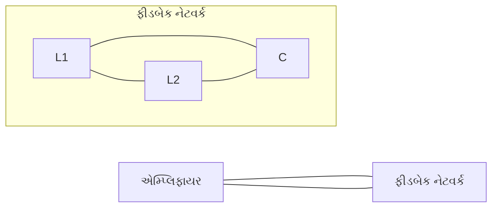

- **સર્કિટ કોમ્પોનેન્ટ્સ**: એમ્પ્લિફાયર, ટેપ્ડ ઇન્ડક્ટર (L1+L2), કેપેસિટર C
- **ફ્રીક્વન્સી ફોર્મ્યુલા**: f = 1/[2π√(LC)] જ્યાં L = L1+L2
- **લાભ**: સરળ ડિઝાઇન, સારી ફ્રીક્વન્સી સ્ટેબિલિટી
- **નુકસાન**: ઇન્ડક્ટર્સનું કદ, મર્યાદિત ફ્રીક્વન્સી રેન્જ
- **એપ્લિકેશન્સ**: RF સિગ્નલ જનરેટર, રેડિયો રિસીવર, કોમ્યુનિકેશન

**મેમરી ટ્રીક:** "TILC" - "ટેપ્ડ ઇન્ડક્ટર LC સર્કિટ સાથે"

## અથવા

## પ્રશ્ન 2(અ) [3 ગુણ]

**ટ્રાન્ઝિસ્ટરનું સ્વિચ તરીકે કાર્ય સમજાવો.**

**જવાબ**:
ટ્રાન્ઝિસ્ટર કટઓફ (OFF) અને સેચુરેશન (ON) રીજન્સ વચ્ચે ડિજિટલ એપ્લિકેશન્સ માટે સ્વિચ તરીકે કામ કરે છે.

**આકૃતિ:**

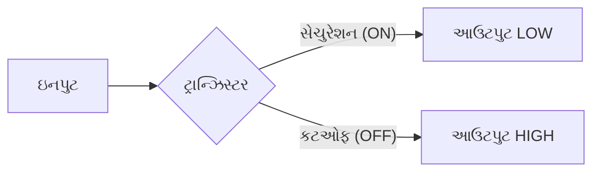

- **કટઓફ રીજન**: VBE < 0.7V, ઓપન સ્વિચ તરીકે કાર્ય કરે છે, VCE ≈ VCC
- **સેચુરેશન રીજન**: VBE > 0.7V, ક્લોઝ્ડ સ્વિચ તરીકે કાર્ય કરે છે, VCE ≈ 0.2V
- **સ્વિચિંગ ટાઇમ**: જંક્શન કેપેસિટન્સ દ્વારા મર્યાદિત

**મેમરી ટ્રીક:** "COPS" - "કટઓફ-સેચુરેશન-સ્વિચિંગ ઉત્પન્ન કરે છે"

## પ્રશ્ન 2(બ) [4 ગુણ]

**હીટ સિંક વ્યાખ્યાયિત કરો. હીટ સિંકના પ્રકારોની યાદી બનાવો અને તેની એપ્લિકેશન લખો.**

**જવાબ**:
હીટ સિંક એક થર્મલ કન્ડક્ટર છે જે ઇલેક્ટ્રોનિક કોમ્પોનેન્ટ્સમાંથી ગરમી દૂર કરે છે.

**આકૃતિ:**

```goat
     ||||||||
    /||||||||\ હીટ સિંક
   /||||||||||\
  /||||||||||||\
 /|||||||||||||\
+--------------+
| ટ્રાન્ઝિસ્ટર  |
+--------------+
```

**હીટ સિંકના પ્રકારો:**

| પ્રકાર | વર્ણન | એપ્લિકેશન |
|------|-------------|-------------|
| પેસિવ | કોઈ ચલિત ભાગો નહીં, કુદરતી કન્વેક્શન | ઓછી પાવર ડિવાઇસીસ |
| એક્ટિવ | ફેન અથવા પંપ સાથે | હાઈ પાવર એમ્પ્લિફાયર |
| લિક્વિડ-કૂલ્ડ | હીટ ટ્રાન્સફર માટે પ્રવાહી વાપરે છે | કોમ્પ્યુટિંગ સિસ્ટમ |
| ફિન્ડ | મલ્ટીપલ ફિન્સ સરફેસ એરિયા વધારે છે | પાવર ટ્રાન્ઝિસ્ટર |

- **હેતુ**: થર્મલ રનઅવે અને કોમ્પોનેન્ટ નિષ્ફળતા રોકે છે
- **મટીરિયલ**: એલ્યુમિનિયમ, કોપર, અથવા હાઈ થર્મલ કન્ડક્ટિવિટી વાળા એલોય

**મેમરી ટ્રીક:** "COOL" - "કન્ડક્ટિંગ લોકલ હીટને બહાર લઈ જાય છે"

## પ્રશ્ન 2(ક) [7 ગુણ]

**એમ્પ્લીફાયરમાં નેગેટીવ ફીડબેક ના ફાયદા અને ગેરફાયદાને વિગતવાર સમજાવો.**

**જવાબ**:
નેગેટિવ ફીડબેક આઉટપુટ સિગ્નલના એક ભાગને વિરુદ્ધ ફેઝમાં ઇનપુટ પર પાછો મોકલે છે.

**કોષ્ટક:**

| ફાયદા | ગેરફાયદા |
|------------|---------------|
| ગેઇન સ્ટેબિલાઇઝ કરે છે | સમગ્ર ગેઇન ઘટાડે છે |
| બેન્ડવિડ્થ વધારે છે | વધુ કોમ્પોનેન્ટ્સની જરૂર પડે છે |
| ડિસ્ટોર્શન ઘટાડે છે | વધુ પાવરનો વપરાશ |
| નોઇઝ ઘટાડે છે | જટિલ સર્કિટ ડિઝાઇન |
| ઇનપુટ/આઉટપુટ ઇમ્પીડન્સ નિયંત્રિત કરે છે | અયોગ્ય ડિઝાઇન થાય તો સંભવિત ઓસિલેશન |
| લિનિયરિટી સુધારે છે | ફીડબેક નેટવર્કમાં સિગ્નલ લોસ |

**આકૃતિ:**

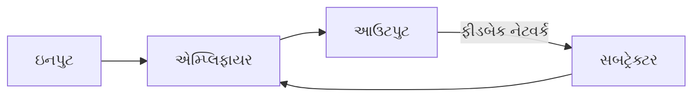

- **ગેઇન સ્ટેબિલાઇઝેશન**: ગેઇનને પેસિવ કોમ્પોનેન્ટ્સ પર આધારિત બનાવે છે
- **બેન્ડવિડ્થ એક્સટેન્શન**: ગેઇન ઘટાડા ફેક્ટર જેટલી વધે છે
- **ફીડબેક ફેક્ટર**: β સુધારાની માત્રા નક્કી કરે છે

**મેમરી ટ્રીક:** "STABLE" - "સ્ટેબિલાઇઝ્ડ ટ્રાન્સમિશન એન્ડ બેન્ડવિડ્થ વિથ લેસ એરર"

## પ્રશ્ન 3(અ) [3 ગુણ]

**SCR નો સિમ્બોલ દોરો અને SCR નું કાર્ય સમજાવો.**

**જવાબ**:
સિલિકોન કંટ્રોલ્ડ રેક્ટિફાયર (SCR) એ ત્રણ ટર્મિનલ વાળું PNPN ચાર-લેયર ડિવાઇસ છે.

**સિમ્બોલ:**

```goat
      A(એનોડ)
       |
       |
       v
    +-----+
    |     |
G-->|     |
    |     |
    +-----+
       ^
       |
       |
      K(કેથોડ)
```

- **સ્ટ્રક્ચર**: P-N-P-N ચાર-લેયર સેમિકન્ડક્ટર ડિવાઇસ
- **ઓપરેશન**: ગેટ ટ્રિગર ન થાય ત્યાં સુધી OFF રહે છે, ત્યારબાદ કરંટ હોલ્ડિંગ વેલ્યુથી નીચે ન જાય ત્યાં સુધી કન્ડક્ટ કરે છે
- **ટર્મિનલ્સ**: એનોડ, કેથોડ, ગેટ

**મેમરી ટ્રીક:** "AGK" - "એનોડ-ગેટ કેથોડ કરંટને નિયંત્રિત કરે છે"

## પ્રશ્ન 3(બ) [4 ગુણ]

**સર્કિટ ડાયાગ્રામ સાથે SCR ની ટુ ટ્રાન્ઝિસ્ટર એનાલોજી સમજાવો**

**જવાબ**:
SCRને જંક્શન શેર કરતા ઇન્ટરકનેક્ટેડ PNP અને NPN ટ્રાન્ઝિસ્ટર તરીકે રજૂ કરી શકાય છે.

**આકૃતિ:**

```goat
       એનોડ
         |
    +----|----+
    |    v    |
    |  +--->  |
    |  | PNP  |
    |  +----+ |
    |       | |
ગેટ |       v |
 ----|---+  +-->
    |   |  | NPN
    |   +--+----+
    |          |
    +----------|--
              |
              v
            કેથોડ
```

- **PNP સેક્શન**: ઉપરનો ટ્રાન્ઝિસ્ટર જેનો કલેક્ટર NPN બેઝ સાથે જોડાયેલો છે
- **NPN સેક્શન**: નીચેનો ટ્રાન્ઝિસ્ટર જેનો કલેક્ટર PNP બેઝ સાથે જોડાયેલો છે
- **ટ્રિગરિંગ**: નાનો ગેટ કરંટ NPN ચાલુ કરે છે, જે PNP ચાલુ કરે છે
- **રિજનરેટિવ એક્શન**: દરેક ટ્રાન્ઝિસ્ટર બીજાને બેઝ કરંટ આપે છે

**મેમરી ટ્રીક:** "PNPN" - "પોઝિટિવ-નેગેટિવ-પોઝિટિવ-નેગેટિવ લેયર્સ"

## પ્રશ્ન 3(ક) [7 ગુણ]

**સર્કિટ ડાયાગ્રામ સાથે TRIAC આધારિત ફેન રેગ્યુલેટરનું કાર્ય સમજાવો.**

**જવાબ**:
TRIAC-આધારિત ફેન રેગ્યુલેટર ફેઝ કંટ્રોલ દ્વારા AC પાવર નિયંત્રિત કરે છે.

**સર્કિટ ડાયાગ્રામ:**

```goat
        +---+  R1
AC o----+   +--/\/\--+
        |           |
        | C1        |
        +---||------+----+
                    |    |
                    Z   MT1
                    |    |
                   G|    |
                    |   _V_
                    +--|   |--+--o ફેન
                       |___|  |
                        MT2   |
                              |
                              |
AC o--------------------------|
```

- **ફેઝ કંટ્રોલ**: TRIAC નો ફાયરિંગ એંગલ બદલીને પાવર કંટ્રોલ કરે છે
- **ડાયક**: TRIAC માટે બાયડાયરેક્શનલ ટ્રિગરિંગ આપે છે
- **RC ટાઇમિંગ સર્કિટ**: R1 અને C1 ફેઝ ડિલે સેટ કરે છે
- **વેરિયેબલ રેસિસ્ટર**: સ્પીડ કંટ્રોલ માટે ફેઝ ડિલે એડજસ્ટ કરે છે
- **પ્રોટેક્શન**: RC સ્નબર ખોટા ટ્રિગરિંગને રોકે છે

**મેમરી ટ્રીક:** "TRIAC" - "ટ્રિગર્ડ રિસ્પોન્સ ઇન AC સર્કિટ્સ"

## અથવા

## પ્રશ્ન 3(અ) [3 ગુણ]

**DIAC અને TRIAC ની V-I લાક્ષણિકતાઓ દોરો.**

**જવાબ**:
DIACs અને TRIACs બાયડાયરેક્શનલ ડિવાઇસીસ છે જેમાં સિમેટ્રિકલ લાક્ષણિકતાઓ હોય છે.

**DIAC ખાસિયતો:**

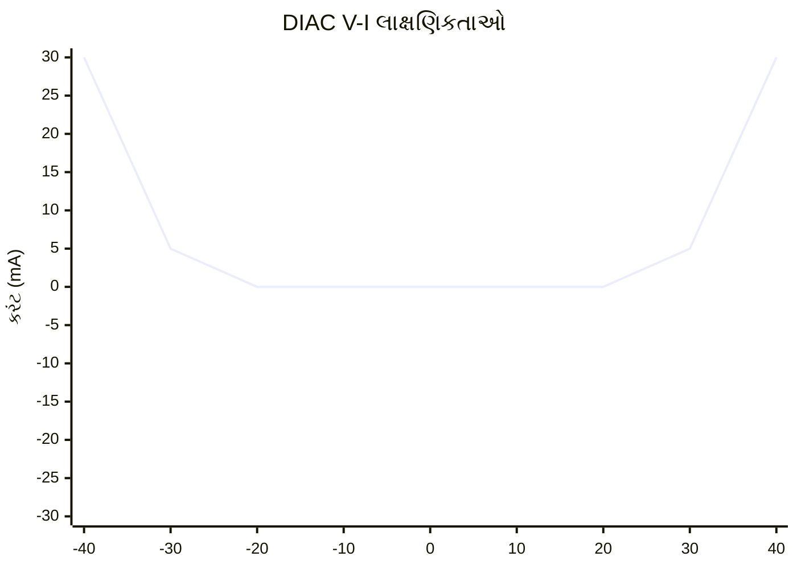

**TRIAC ખાસિયતો:**

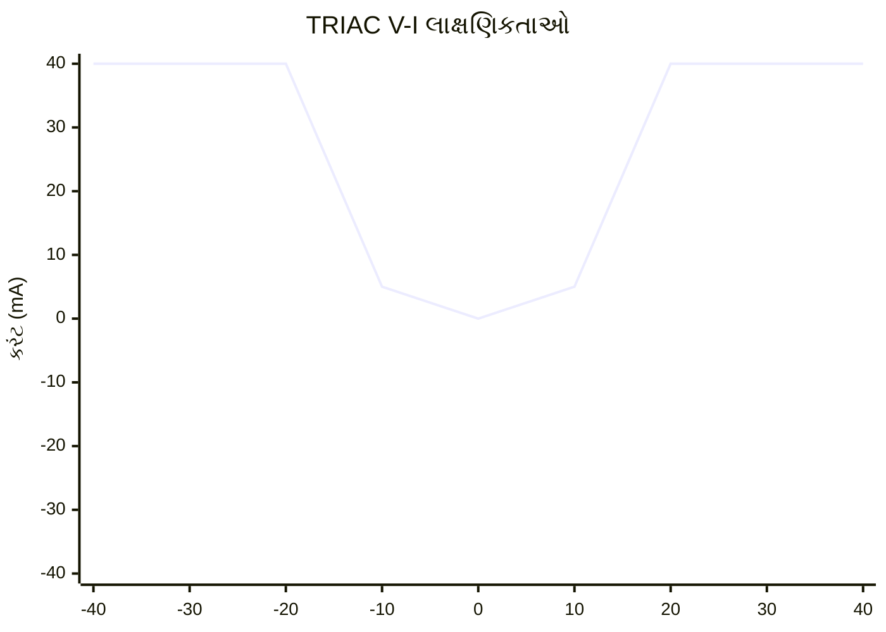

- **DIAC**: બાયડાયરેક્શનલ ડાયોડ જે બ્રેકઓવર વોલ્ટેજ પછી કન્ડક્ટ કરે છે
- **TRIAC**: ત્રણ-ટર્મિનલ ડિવાઇસ જે ટ્રિગર થાય ત્યારે બંને દિશામાં કન્ડક્ટ કરે છે

**મેમરી ટ્રીક:** "BIBO" - "બાયડાયરેક્શનલ ઇન, બાયડાયરેક્શનલ આઉટ"

## પ્રશ્ન 3(બ) [4 ગુણ]

**SCR ની ગેટ ટ્રિગરિંગ પદ્ધતિ સમજાવો**

**જવાબ**:
ગેટ ટ્રિગરિંગ SCRને સક્રિય કરવાની સૌથી સામાન્ય પદ્ધતિ છે.

**આકૃતિ:**

```goat
        A
        |
     +-----+
     |     |
     |     |
     |  +->|
RC --|--+  |
     |     |
     +-----+
        |
        K
```

- **ગેટ પલ્સ**: ગેટ અને કેથોડ વચ્ચે નાનો કરંટ લાગુ કરવામાં આવે છે
- **ટ્રિગરિંગ મેથડ્સ**: DC, AC, અથવા પલ્સ સિગ્નલ્સ
- **કરંટ જરૂરિયાતો**: સામાન્ય રીતે 5-20mA ગેટ કરંટ
- **ફાયદા**: હાઈ-પાવર સર્કિટ્સનું લો પાવર કંટ્રોલ

**મેમરી ટ્રીક:** "GATE" - "ગેઇન એક્ટિવેશન થ્રુ ઇલેક્ટ્રોન ફ્લો"

## પ્રશ્ન 3(ક) [7 ગુણ]

**ડીસી પાવર કંટ્રોલ માટે SCRની એપ્લિકેશન સમજાવો.**

**જવાબ**:
SCR વેરિયેબલ ડ્યુટી સાયકલ્સ પર સપ્લાય વોલ્ટેજને ચોપિંગ કરીને DC પાવર નિયંત્રિત કરે છે.

**સર્કિટ:**

```goat
    +-------+       SCR
    |       |       / |
DC--|-------|------/--|--+---o આઉટપુટ
    |       |          |   |
    | PWM   |          |   |
    | Ctrl  |----.     |   |
    |       |    |     |   |
    +-------+    +-----|---+
                       |
                       |
    +------------------|
    |                  |
    GND----------------+
```

- **ફેઝ કંટ્રોલ**: સરેરાશ પાવર નિયંત્રિત કરવા માટે ફાયરિંગ એંગલ બદલે છે
- **PWM કંટ્રોલ**: કાર્યક્ષમ નિયંત્રણ માટે પલ્સ વિડ્થ મોડ્યુલેશન
- **એપ્લિકેશન્સ**: DC મોટર સ્પીડ કંટ્રોલ, ડિમિંગ, હીટિંગ
- **ફાયદા**: હાઈ એફિશિયન્સી, કોઈ મૂવિંગ પાર્ટ્સ નહીં, વિશ્વસનીય
- **મર્યાદાઓ**: યુનિડાયરેક્શનલ કરંટ ફ્લો, કોમ્યુટેશનની જરૂર પડે છે

**મેમરી ટ્રીક:** "POWER" - "પલ્સ ઓપરેશન વિથ ઇલેક્ટ્રોનિક રેગ્યુલેશન"

## પ્રશ્ન 4(અ) [3 ગુણ]

**Ideal OP-AMP ની લાક્ષણિકતાઓની સૂચિ બનાવો.**

**જવાબ**:
આદર્શ ઓપરેશનલ એમ્પ્લિફાયર્સ સંપૂર્ણ લાક્ષણિકતાઓ ધરાવે છે જેને વાસ્તવિક ઉપકરણો અનુમાનિત કરે છે.

**કોષ્ટક:**

| લાક્ષણિકતા | આદર્શ મૂલ્ય |
|----------------|-------------|
| ઓપન લૂપ ગેઇન | અનંત |
| ઇનપુટ ઇમ્પીડન્સ | અનંત |
| આઉટપુટ ઇમ્પીડન્સ | શૂન્ય |
| બેન્ડવિડ્થ | અનંત |
| CMRR | અનંત |
| સ્લ્યુ રેટ | અનંત |
| ઓફસેટ વોલ્ટેજ | શૂન્ય |

- **પ્રેક્ટિકલ વેલ્યુ**: વાસ્તવિક ઓપ-એમ્પ્સની મર્યાદાઓ હોય છે
- **નિહિતાર્થ**: સર્કિટ ડિઝાઇનમાં વાસ્તવિક મર્યાદાઓને ધ્યાનમાં લેવી જોઈએ

**મેમરી ટ્રીક:** "IBOCSS" - "અનંત બેન્ડવિડ્થ, ઓપન-લૂપ ગેઇન, CMRR, સ્લ્યુ રેટ, અને સેન્સિટિવિટી"

## પ્રશ્ન 4(બ) [4 ગુણ]

**સર્કિટ ડાયાગ્રામ સાથે OP-AMP નો ઉપયોગ કરીને ડીફરન્સીઅલ એમ્પ્લીફાયરનું કાર્ય સમજાવો.**

**જવાબ**:
ડિફરેન્શિયલ એમ્પ્લિફાયર બે ઇનપુટ્સ વચ્ચેના વોલ્ટેજ તફાવતને એમ્પ્લિફાય કરે છે.

**સર્કિટ:**

```goat
              R2
       +------/\/\------+
       |                |
       |           +----+
       |           |    |
       |    R1     |    |
  V1 o-+---/\/\----+    +----o Vout
                  _|+   |
                 /      |
                /       |
               /______  |
                  -|    |
       |    R1     |    |
  V2 o-+---/\/\----+    |
       |                |
       |                |
       +------/\/\------+
              R2
```

- **ગેઇન ફોર્મ્યુલા**: Vout = (V1-V2) × (R2/R1)
- **કોમન મોડ રિજેક્શન**: બંને ઇનપુટ્સ માટે સામાન્ય સિગ્નલ્સને દબાવે છે
- **એપ્લિકેશન્સ**: ઇન્સ્ટ્રુમેન્ટેશન, મેડિકલ ઇક્વિપમેન્ટ, ઓડિયો

**મેમરી ટ્રીક:** "DIFF" - "ડ્યુઅલ ઇનપુટ ફોર ફીડબેક"

## પ્રશ્ન 4(ક) [7 ગુણ]

**OP-AMP ને ઇન્વર્ટિંગ એમ્પ્લીફાયર (ક્લોઝ્ડ લૂપ) તરીકે સમજાવો અને વોલ્ટેજ ગેઇન નું સમીકરણ મેળવો.**

**જવાબ**:
ઇન્વર્ટિંગ એમ્પ્લિફાયર ઇનપુટનું ઇન્વર્ટેડ અને એમ્પ્લિફાઇડ વર્ઝન આઉટપુટ તરીકે આપે છે.

**સર્કિટ:**

```goat
          Rf
     +----/\/\----+
     |            |
     |            |
     |    +-------+----o Vout
     |    |       |
     |    |   +---+
Vin o+----+---|+  |
     |        |   |
     |  Ri    |   |
     +--/\/\--+---+
                -|
                 |
                 |
                 |
     +-----------+
     |
    GND
```

**ગેઇન ડેરિવેશન:**

- ઇન્વર્ટિંગ ઇનપુટ પર KCL લાગુ કરો: I₁ + I₂ = 0
- I₁ = (Vin - V⁻)/Ri અને I₂ = (Vout - V⁻)/Rf
- વર્ચ્યુઅલ ગ્રાઉન્ડ પર, V⁻ ≈ 0
- તેથી: Vin/Ri + Vout/Rf = 0
- Vout/Vin માટે સોલ્વિંગ: Av = -Rf/Ri

- **લાક્ષણિકતાઓ**: આઉટપુટ ઇનપુટથી 180° ફેઝમાં હોય છે
- **ફીડબેક**: ઇન્વર્ટિંગ ઇનપુટ પર વર્ચ્યુઅલ ગ્રાઉન્ડ બનાવે છે
- **ક્લોઝ્ડ લૂપ ગેઇન**: બાહ્ય રેસિસ્ટર્સ દ્વારા નિયંત્રિત

**મેમરી ટ્રીક:** "VAIN" - "વર્ચ્યુઅલ ગ્રાઉન્ડ એમ્પ્લિફિકેશન ઇન્વર્ટ્સ નેગેટિવ"

## અથવા

## પ્રશ્ન 4(અ) [3 ગુણ]

**OPAMP ના નીચેના પેરામીટર્સ વ્યાખ્યાયિત કરો.**
**1) સી.એમ.આર.આર.(CMRR)
2) સ્લૂ રેટ(Slew rate)
3) ગેઇન બેન્ડવિડ્થ પ્રોડક્ટ**

**જવાબ**:
આ પેરામીટર્સ ઓપરેશનલ એમ્પ્લિફાયર્સની કીપરફોર્મન્સ લાક્ષણિકતાઓ નક્કી કરે છે.

**કોષ્ટક:**

| પેરામીટર | વ્યાખ્યા | મહત્વ |
|-----------|------------|------------|
| CMRR | ડિફરેન્શિયલ ગેઇનનો કોમન-મોડ ગેઇન સાથેનો ગુણોત્તર | ઊંચું હોય તે નોઇઝ રિજેક્શન માટે વધુ સારું |
| સ્લ્યુ રેટ | આઉટપુટ વોલ્ટેજ ચેન્જનો મહત્તમ દર (V/μs) | લાર્જ-સિગ્નલ બેન્ડવિડ્થ નક્કી કરે છે |
| ગેઇન-બેન્ડવિડ્થ પ્રોડક્ટ | ગેઇન અને ફ્રીક્વન્સીનો ગુણાકાર (MHz) | હાઈ-ફ્રીક્વન્સી પરફોર્મન્સ માપે છે |

- **CMRR**: ગુણવત્તાપૂર્ણ ઓપ-એમ્પ્સમાં સામાન્ય રીતે 80-120dB
- **સ્લ્યુ રેટ**: હાઈ-ફ્રીક્વન્સી, હાઈ-એમ્પ્લિટ્યુડ સિગ્નલ્સ માટે આઉટપુટને મર્યાદિત કરે છે
- **GBP**: ફ્રીક્વન્સી વધતાં કોન્સ્ટન્ટ રહે છે

**મેમરી ટ્રીક:** "CSG" - "કોમન-મોડ રિજેક્શન, સ્પીડ, અને ગેઇન"

## પ્રશ્ન 4(બ) [4 ગુણ]

**OPAMP નો ઉપયોગ કરી સમિંગ એમ્પ્લીફાયર દોરો અને સમજાવો.**

**જવાબ**:
સમિંગ એમ્પ્લિફાયર ઇનપુટ વોલ્ટેજના વેઇટેડ સમના પ્રમાણમાં આઉટપુટ ઉત્પન્ન કરે છે.

**સર્કિટ:**

```goat
              Rf
       +------/\/\------+
       |                |
       |           +----+
       |           |    |
       |    R1     |    |
  V1 o-+---/\/\----+    +----o Vout
       |           |+   |
       |    R2    /     |
  V2 o-+---/\/\---+     |
       |          \_____|
       |    R3     |-   |
  V3 o-+---/\/\----+    |
       |                |
       |                |
     -----              |
      ---               |
       -                |
```

- **આઉટપુટ ફોર્મ્યુલા**: Vout = -Rf(V₁/R₁ + V₂/R₂ + V₃/R₃)
- **એપ્લિકેશન્સ**: ઓડિયો મિક્સર, એનાલોગ કોમ્પ્યુટર, સિગ્નલ પ્રોસેસિંગ
- **ફાયદા**: મલ્ટીપલ ઇનપુટ્સ એક સાથે પ્રોસેસ થઈ શકે છે

**મેમરી ટ્રીક:** "SUM" - "સેવરલ યુનિફાઇડ મલ્ટિપ્લાયર્સ"

## પ્રશ્ન 4(ક) [7 ગુણ]

**IC 555 નો પિન ડાયાગ્રામ દોરો અને વેવફોર્મ સાથે IC555 નો ઉપયોગ કરીને મોનોસ્ટેબલ મલ્ટિવાઇબ્રેટર સમજાવો.**

**જવાબ**:
IC 555 ટાઇમર મોનોસ્ટેબલ મોડમાં ટ્રિગર થાય ત્યારે ફિક્સ્ડ અવધિનો સિંગલ પલ્સ ઉત્પન્ન કરે છે.

**પિન ડાયાગ્રામ:**

```goat
    +-------+
  1 |o      | 8
    |       |
  2 |o      | 7
    |  555  |
  3 |o      | 6
    |       |
  4 |o      | 5
    +-------+

1: GND     5: કંટ્રોલ
2: ટ્રિગર  6: થ્રેશોલ્ડ
3: આઉટપુટ   7: ડિસ્ચાર્જ
4: રીસેટ    8: VCC
```

**સર્કિટ અને વેવફોર્મ:**

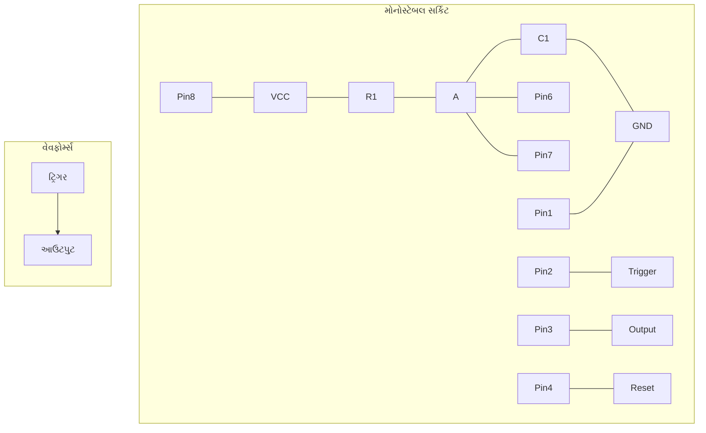

- **ઓપરેશન**: નેગેટિવ ટ્રિગર ટાઇમિંગ સાયકલ શરૂ કરે છે
- **ટાઇમ પીરિયડ**: T = 1.1 × R × C
- **એપ્લિકેશન્સ**: ટાઇમર્સ, પલ્સ જનરેશન, ડિબાઉન્સિંગ
- **ફાયદા**: સરળ, વિશ્વસનીય, વ્યાપકપણે ઉપલબ્ધ

**મેમરી ટ્રીક:** "TIMER" - "ટ્રિગર્ડ ઇનપુટ મેક્સ એક્સટેન્ડેડ રિસ્પોન્સ"

## પ્રશ્ન 5(અ) [3 ગુણ]

**SMPS નો બ્લોક ડાયાગ્રામ દોરો અને તેની એપ્લીકેશન લખો.**

**જવાબ**:
સ્વિચ મોડ પાવર સપ્લાય (SMPS) કાર્યક્ષમ પાવર રૂપાંતરણ માટે સ્વિચિંગ એલિમેન્ટ્સનો ઉપયોગ કરે છે.

**બ્લોક ડાયાગ્રામ:**

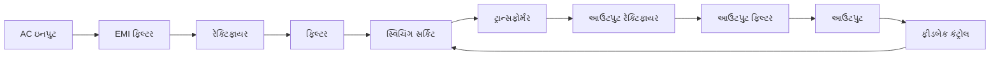

**એપ્લિકેશન્સ:**

- કોમ્પ્યુટર પાવર સપ્લાય
- મોબાઇલ ફોન ચાર્જર
- TV પાવર સપ્લાય
- ઔદ્યોગિક પાવર સિસ્ટમ્સ
- LED લાઇટિંગ ડ્રાઇવર્સ

- **ફાયદા**: ઉચ્ચ કાર્યક્ષમતા, નાનું કદ, હલકું વજન
- **પ્રકારો**: બક, બૂસ્ટ, બક-બૂસ્ટ, ફ્લાયબેક કન્વર્ટર્સ

**મેમરી ટ્રીક:** "SAFE" - "સ્વિચિંગ એચિવ્સ ફિલ્ટર્ડ એનર્જી"

## પ્રશ્ન 5(બ) [4 ગુણ]

**ડાયાગ્રામ સાથે રેગ્યુલેટેડ પાવર સ્પ્લાયનું કાર્ય સમજાવો.**

**જવાબ**:
રેગ્યુલેટેડ પાવર સપ્લાય ઇનપુટ અથવા લોડમાં ફેરફાર થવા છતાં સ્થિર આઉટપુટ જાળવે છે.

**બ્લોક ડાયાગ્રામ:**

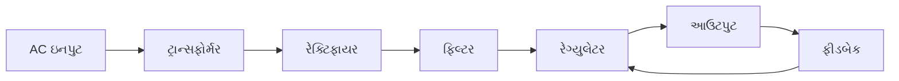

- **ટ્રાન્સફોર્મર**: AC વોલ્ટેજને જરૂરી લેવલ સુધી ઘટાડે છે
- **રેક્ટિફાયર**: AC ને પલ્સેટિંગ DC માં રૂપાંતરિત કરે છે (ડાયોડ બ્રિજ)
- **ફિલ્ટર**: કેપેસિટર્સ સાથે DC ને સ્મૂથ કરે છે
- **રેગ્યુલેટર**: સ્થિર આઉટપુટ વોલ્ટેજ જાળવે છે
- **ફીડબેક**: ઇનપુટ/લોડ વેરિએશન માટે ક્ષતિપૂર્તિ કરે છે

**મેમરી ટ્રીક:** "TRFRO" - "ટ્રાન્સફોર્મ, રેક્ટિફાય, ફિલ્ટર, રેગ્યુલેટ, આઉટપુટ"

## પ્રશ્ન 5(ક) [7 ગુણ]

**OP-AMP નો મૂળભૂત બ્લોક ડાયાગ્રામ દોરી સમજાવો.**

**જવાબ**:
ઓપરેશનલ એમ્પ્લિફાયરનું આંતરિક માળખું ચોક્કસ કાર્યો કરતા ઘણા તબક્કાઓમાંથી બનેલું છે.

**બ્લોક ડાયાગ્રામ:**

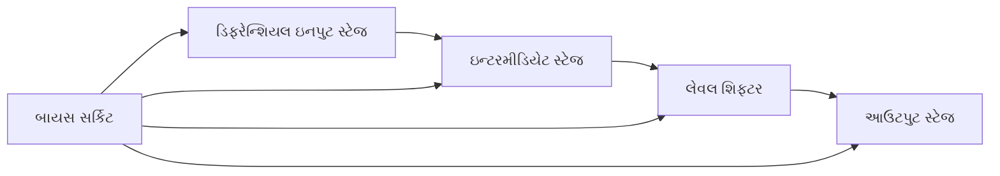

- **ડિફરેન્શિયલ ઇનપુટ સ્ટેજ**: હાઈ ઇમ્પીડન્સ, તફાવતને એમ્પ્લિફાય કરે છે
- **ઇન્ટરમીડિયેટ સ્ટેજ**: વધારાનો ગેઇન પ્રદાન કરે છે
- **લેવલ શિફ્ટર**: સ્ટેજ્સ વચ્ચે DC લેવલ એડજસ્ટ કરે છે
- **આઉટપુટ સ્ટેજ**: લો ઇમ્પીડન્સ, કરંટ એમ્પ્લિફિકેશન
- **બાયસ સર્કિટ**: બધા સ્ટેજ્સ માટે ઓપરેટિંગ પોઇન્ટ સ્થાપિત કરે છે
- **કોમ્પેનસેશન**: સ્ટેબિલિટી માટે આંતરિક કેપેસિટર

**મેમરી ટ્રીક:** "DILO" - "ડિફરેન્શિયલ ઇનપુટ, લેવલ શિફ્ટ, આઉટપુટ"

## અથવા

## પ્રશ્ન 5(અ) [3 ગુણ]

**ડાયાગ્રામ સાથે LM317 નો ઉપયોગ કરીને એડજસ્ટેબલ વોલ્ટેજ રેગ્યુલેટર સમજાવો.**

**જવાબ**:
LM317 એક બહુવિધ એડજસ્ટેબલ પોઝિટિવ વોલ્ટેજ રેગ્યુલેટર છે જેની આઉટપુટ રેન્જ 1.25V થી 37V છે.

**સર્કિટ:**

```goat
    Vin             LM317            Vout
     o-----+--------+-------+--------o
           |       Vin     |
           |        |      |
           |      +---+    |
           |      |317|    |
           |      +---+    |  C2
           |     Adj|Out   +--||--+
           |        |         |   |
           |        +---------+   |
           |                  |   |
     C1    |       R1         |   |
     ||    +------/\/\--------+   |
     ||    |                  |   |
     ||    |                  |   |
     ++----+       R2         |   |
      |            /\/\-------+   |
      |            |          |   |
     GND          GND        GND GND
```

- **ફોર્મ્યુલા**: Vout = 1.25(1 + R2/R1)
- **ફાયદા**: સરળ એડજસ્ટમેન્ટ, બિલ્ટ-ઇન પ્રોટેક્શન
- **એપ્લિકેશન્સ**: વેરિયેબલ પાવર સપ્લાય, બેટરી ચાર્જર્સ

**મેમરી ટ્રીક:** "AVR" - "એડજસ્ટેબલ વોલ્ટેજ રેગ્યુલેશન"

## પ્રશ્ન 5(બ) [4 ગુણ]

**ફિક્સ્ડ વોલ્ટેજ રેગ્યુલેટર IC અને વેરીએબલ વોલ્ટેજ રેગ્યુલેટર IC વચ્ચેનો તફાવત આપો.**

**જવાબ**:
વોલ્ટેજ રેગ્યુલેટર IC તેમની કોન્ફિગર કરવાની ક્ષમતા અને એપ્લિકેશન જરૂરિયાતોમાં ભિન્ન હોય છે.

**કોષ્ટક:**

| પેરામીટર | ફિક્સ્ડ વોલ્ટેજ રેગ્યુલેટર | વેરિયેબલ વોલ્ટેજ રેગ્યુલેટર |
|-----------|-------------------------|----------------------------|
| આઉટપુટ વોલ્ટેજ | પૂર્વનિર્ધારિત (દા.ત., 5V, 12V) | રેન્જ પર એડજસ્ટેબલ |
| બાહ્ય કોમ્પોનેન્ટ્સ | મિનિમલ (માત્ર કેપેસિટર્સ) | સેટિંગ માટે રેસિસ્ટર્સની જરૂર |
| સીરીઝ | 78xx (પોઝિટિવ), 79xx (નેગેટિવ) | LM317 (પોઝિટિવ), LM337 (નેગેટિવ) |
| એપ્લિકેશન્સ | સ્ટાન્ડર્ડ ઇક્વિપમેન્ટ | કસ્ટમ ડિઝાઇન, લેબોરેટરી સપ્લાય |
| ફ્લેક્સિબિલિટી | ફિક્સ્ડ મૂલ્યો સુધી મર્યાદિત | અત્યંત એડાપ્ટેબલ |
| પિન કાઉન્ટ | સામાન્ય રીતે 3 પિન | 3 અથવા વધુ પિન |

- **ફિક્સ્ડ રેગ્યુલેટર્સ**: ઉપયોગમાં સરળ, મર્યાદિત એડજસ્ટમેન્ટ
- **વેરિયેબલ રેગ્યુલેટર્સ**: વધુ બહુમુખી, ગણતરીની જરૂર પડે છે

**મેમરી ટ્રીક:** "FOCUS" - "ફિક્સ્ડ આઉટપુટ કમ્પેર્ડ ટુ યુઝર-સેટ"

## પ્રશ્ન 5(ક) [7 ગુણ]

**OP-AMP ની એપ્લિકેશન લખો. OP-AMP નો ઉપયોગ કરી સર્કિટ ડાયાગ્રામ સાથે D ટુ A (ડીજીટલ ટુ એનાલોગ) કન્વટર્રનું કાર્ય સમજાવો.**

**જવાબ**:
ઓપ-એમ્પ્સની ઘણી એપ્લિકેશન્સ છે; D/A કન્વર્ટર્સ ડિજિટલ સિગ્નલ્સને એનાલોગમાં રૂપાંતરિત કરે છે.

**OP-AMP ની એપ્લિકેશન્સ:**

- એમ્પ્લિફાયર્સ (ઇન્વર્ટિંગ, નોન-ઇન્વર્ટિંગ)
- ફિલ્ટર્સ (એક્ટિવ ફિલ્ટર્સ)
- ઓસિલેટર્સ
- કમ્પેરેટર્સ
- ઇન્ટિગ્રેટર્સ અને ડિફરેનશિયેટર્સ
- વોલ્ટેજ ફોલોવર્સ
- ઇન્સ્ટ્રુમેન્ટેશન સર્કિટ્સ

**R-2R લેડર DAC સર્કિટ:**

```goat
    D3   D2   D1   D0
     |    |    |    |
     v    v    v    v
     SW   SW   SW   SW
     |    |    |    |
   2R|   2R|  2R|  2R|
     |    |    |    |
     +----+----+----+
     |    |    |    |
     R    R    R    R
     |    |    |    |
     +----+----+----+---+
                      _|+
                     /
                    /
                   /___
                      -|
                       |
              Rf       |
              /\/\-----+----o Vout
              |        |
              |        |
             GND      GND
```

- **કાર્ય સિદ્ધાંત**: ડિજિટલ ઇનપુટ્સ રેસિસ્ટર નેટવર્ક દ્વારા કરંટને વેઇટ કરે છે
- **રેસિસ્ટન્સ વેલ્યુ**: બાઇનરી-વેઇટેડ અથવા R-2R લેડર નેટવર્ક
- **રૂપાંતરણ**: આઉટપુટ વોલ્ટેજ ડિજિટલ ઇનપુટ વેલ્યુના પ્રમાણમાં
- **રેઝોલ્યુશન**: બિટ્સની સંખ્યા દ્વારા નિર્ધારિત (2ⁿ લેવલ્સ)

**મેમરી ટ્રીક:** "DART" - "ડિજિટલ ટુ એનાલોગ રેસિસ્ટર ટ્રાન્સલેશન"
