## Question 1(a) [3 marks]

**Explain the concept of dc load line with the help of neat diagram.**

**Answer**:
DC load line is a straight line on output characteristics that shows all possible operating points of a transistor.

**Diagram:**

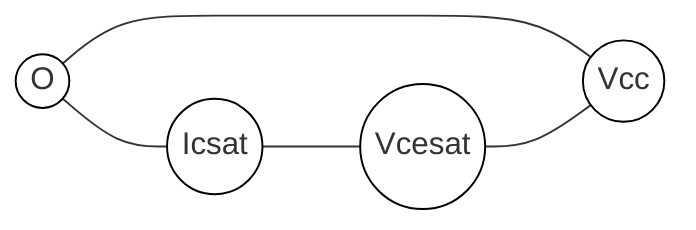

- **Collector saturation current**: When VCE = 0, IC = VCC/RC
- **Cutoff voltage**: When IC = 0, VCE = VCC
- **Q-point**: Operating point along load line

**Mnemonic:** "LEVEL" - "Load line Establishes Voltage and current for Every Load condition"

## Question 1(b) [4 marks]

**Explain thermal runaway in detail.**

**Answer**:
Thermal runaway is a condition where heat causes transistor's collector current to increase, which generates more heat, leading to destruction.

**Diagram:**


- **Heat generation**: Power dissipation = VCE × IC
- **Critical effect**: Increased junction temperature decreases VBE
- **Prevention**: Heat sinks, thermal stabilization circuits, proper biasing
- **Danger**: Can destroy transistor if not controlled

**Mnemonic:** "HEAT" - "Higher Emission Amplifies Temperature"

## Question 1(c) [7 marks]

**Draw the circuit diagram and frequency response of a two stage R-C coupled amplifier. Explain the importance of each component.**

**Answer**:
R-C coupled amplifier uses capacitors to connect multiple transistor stages for higher gain.

**Diagram:**

```goat
+------+            +------+
|      |            |      |
|  Q1  |            |  Q2  |
|      |            |      |
+------+            +------+
   |                   |
   |                   |
   R1       C2         R2
   |        ||         |
   +---||---+----------+
        C1             

Vin o----||---+        +------o Vout
             |         |
             R3        R4
             |         |
             +         +
```

**Frequency Response:**

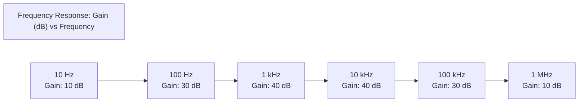

- **Coupling capacitors**: Block DC, allow AC signal transfer between stages
- **Biasing resistors**: Establish proper Q-point for transistor operation
- **Bypass capacitors**: Prevent gain reduction from negative feedback
- **Bandwidth**: Range between low and high cutoff frequencies

**Mnemonic:** "CARS" - "Coupling capacitors Allow Resistance Separation"

## OR

## Question 1(c) [7 marks]

**Compare negative and positive feedback in amplifier.**

**Answer**:
Feedback systems return a portion of output to the input with different effects based on polarity.

**Table:**

| Parameter | Negative Feedback | Positive Feedback |
|-----------|-------------------|-------------------|
| Gain | Decreases | Increases |
| Bandwidth | Increases | Decreases |
| Stability | Improves | Decreases |
| Distortion | Reduces | Increases |
| Noise | Reduces | Amplifies |
| Input/Output impedance | Can be controlled | Unpredictable |
| Applications | Amplifiers, regulators | Oscillators, Schmitt triggers |

- **Negative feedback**: Output is out of phase with input (180° shifted)
- **Positive feedback**: Output is in phase with input (0° shifted)
- **Barkhausen criteria**: Positive feedback with unity gain creates oscillation

**Mnemonic:** "SIGN" - "Stability Increases with Gain Negation"

## Question 2(a) [3 marks]

**State and explain Barkhausen's criteria for oscillations.**

**Answer**:
Barkhausen's criteria define conditions for sustained oscillations in a feedback system.

**Diagram:**

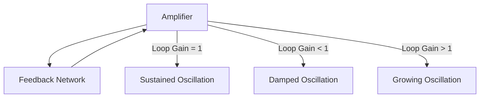

- **Gain condition**: Loop gain (A×β) must equal 1 (unity)
- **Phase condition**: Total phase shift must be 0° or 360°
- **Practical implementation**: Initial loop gain > 1, then stabilizes at 1

**Mnemonic:** "LOOP" - "Loop's Overall Output Phase"

## Question 2(b) [4 marks]

**Compare Fixed bias, Collector to base bias & Voltage divider bias methods.**

**Answer**:
Different biasing techniques provide varying degrees of stability and temperature compensation.

**Table:**

| Parameter | Fixed Bias | Collector-Base Bias | Voltage Divider Bias |
|-----------|------------|-------------------|----------------------|
| Stability | Poor | Better | Excellent |
| Circuit complexity | Simple | Medium | Complex |
| Temperature stability | Poor | Medium | Good |
| Components | 1 Resistor | 1 Resistor | 3-4 Resistors |
| Stability factor (S) | High | Medium | Low |

- **Fixed bias**: Single resistor from base to VCC
- **Collector-base bias**: Feedback resistor from collector to base
- **Voltage divider**: Two resistors create stable reference voltage

**Mnemonic:** "STORM" - "Stability Through Optimized Resistor Methods"

## Question 2(c) [7 marks]

**Write short note on Hartley oscillator.**

**Answer**:
Hartley oscillator is an LC oscillator with a tapped inductor for feedback.

**Diagram:**

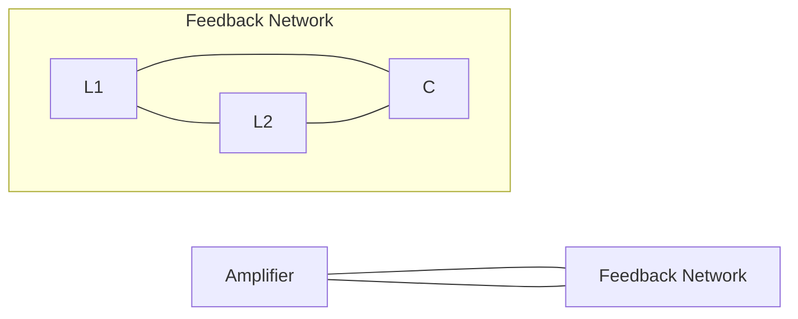

- **Circuit components**: Amplifier, tapped inductor (L1+L2), capacitor C
- **Frequency formula**: f = 1/[2π√(LC)] where L = L1+L2
- **Advantages**: Simple design, good frequency stability
- **Drawbacks**: Size of inductors, limited frequency range
- **Applications**: RF signal generators, radio receivers, communication

**Mnemonic:** "TILC" - "Tapped Inductor with LC Circuit"

## OR

## Question 2(a) [3 marks]

**Explain working of transistor as a switch.**

**Answer**:
Transistor switches between cutoff (OFF) and saturation (ON) regions for digital applications.

**Diagram:**

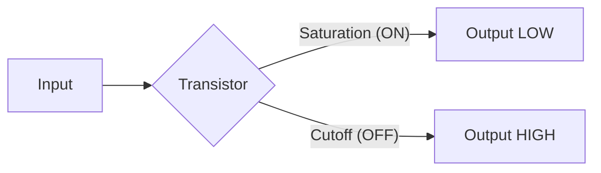

- **Cutoff region**: VBE < 0.7V, acts as open switch, VCE ≈ VCC
- **Saturation region**: VBE > 0.7V, acts as closed switch, VCE ≈ 0.2V
- **Switching time**: Limited by junction capacitance

**Mnemonic:** "COPS" - "Cutoff-On-Produces Switching"

## Question 2(b) [4 marks]

**Define heat sink. List types of heat sink and give its applications.**

**Answer**:
Heat sink is a thermal conductor that transfers heat away from electronic components.

**Diagram:**

```goat
     ||||||||
    /||||||||\ Heat Sink
   /||||||||||\
  /||||||||||||\
 /|||||||||||||\
+--------------+
|  Transistor  |
+--------------+
```

**Types of Heat Sinks:**

| Type | Description | Application |
|------|-------------|-------------|
| Passive | No moving parts, natural convection | Low-power devices |
| Active | With fans or pumps | High-power amplifiers |
| Liquid-cooled | Uses fluid for heat transfer | Computing systems |
| Finned | Multiple fins increase surface area | Power transistors |

- **Purpose**: Prevents thermal runaway and component failure
- **Materials**: Aluminum, copper, or alloys with high thermal conductivity

**Mnemonic:** "COOL" - "Conducting Out Of Local heat"

## Question 2(c) [7 marks]

**Explain advantages and disadvantages of negative feedback in amplifiers in detail.**

**Answer**:
Negative feedback returns a portion of output signal to input with opposite phase.

**Table:**

| Advantages | Disadvantages |
|------------|---------------|
| Stabilizes gain | Reduces overall gain |
| Increases bandwidth | More components needed |
| Reduces distortion | More power consumption |
| Decreases noise | Complex circuit design |
| Controls input/output impedance | Potential oscillation if improperly designed |
| Improves linearity | Signal loss in feedback network |

**Diagram:**

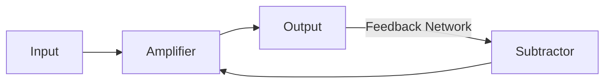

- **Gain stabilization**: Makes gain dependent on passive components
- **Bandwidth extension**: Increases by factor equal to gain reduction
- **Feedback factor**: β determines amount of improvement

**Mnemonic:** "STABLE" - "Stabilized Transmission And Bandwidth with Less Error"

## Question 3(a) [3 marks]

**Draw symbol of SCR and explain working of SCR.**

**Answer**:
Silicon Controlled Rectifier (SCR) is a four-layer PNPN device with three terminals.

**Symbol:**

```goat
      A(Anode)
       |
       |
       v
    +-----+
    |     |
G-->|     |
    |     |
    +-----+
       ^
       |
       |
      K(Cathode)
```

- **Structure**: P-N-P-N four-layer semiconductor device
- **Operation**: Remains OFF until gate triggered, then conducts until current falls below holding value
- **Terminals**: Anode, Cathode, Gate

**Mnemonic:** "AGK" - "Anode-Gate controls Kathode current"

## Question 3(b) [4 marks]

**Explain two transistor analogy of SCR with circuit diagram.**

**Answer**:
SCR can be represented as interconnected PNP and NPN transistors sharing junctions.

**Diagram:**

```goat
       Anode
         |
    +----|----+
    |    v    |
    |  +--->  |
    |  | PNP  |
    |  +----+ |
    |       | |
Gate |       v |
 ----|---+  +-->
    |   |  | NPN
    |   +--+----+
    |          |
    +----------|--
              |
              v
            Cathode
```

- **PNP section**: Upper transistor with collector connected to NPN base
- **NPN section**: Lower transistor with collector connected to PNP base
- **Triggering**: Small gate current turns on NPN, which turns on PNP
- **Regenerative action**: Each transistor supplies base current to other

**Mnemonic:** "PNPN" - "Positive-Negative-Positive-Negative layers"

## Question 3(c) [7 marks]

**Explain the working of TRIAC based fan regulator with circuit diagram.**

**Answer**:
TRIAC-based fan regulator controls AC power through phase control.

**Circuit Diagram:**

```goat
        +---+  R1
AC o----+   +--/\/\--+
        |           |
        | C1        |
        +---||------+----+
                    |    |
                    Z   MT1
                    |    |
                   G|    |
                    |   _V_
                    +--|   |--+--o Fan
                       |___|  |
                        MT2   |
                              |
                              |
AC o--------------------------|
```

- **Phase control**: Varies firing angle of TRIAC to control power
- **Diac**: Provides bidirectional triggering for TRIAC
- **RC timing circuit**: R1 and C1 set phase delay
- **Variable resistor**: Adjusts phase delay for speed control
- **Protection**: RC snubber prevents false triggering

**Mnemonic:** "TRIAC" - "Triggered Response In AC Circuits"

## OR

## Question 3(a) [3 marks]

**Draw V-I characteristics of DIAC and TRIAC.**

**Answer**:
DIACs and TRIACs are bidirectional devices with symmetrical characteristics.

**DIAC Characteristics:**

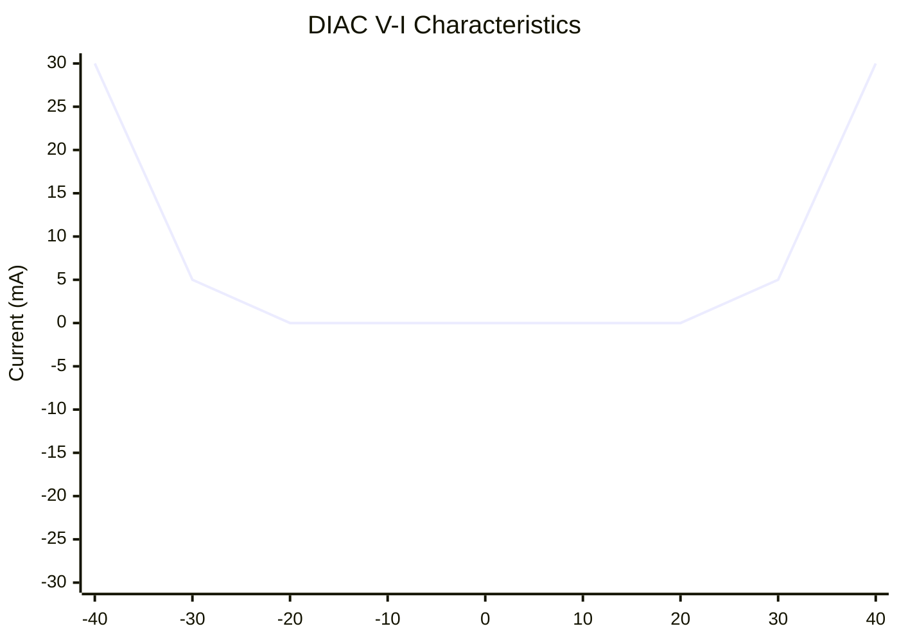

**TRIAC Characteristics:**

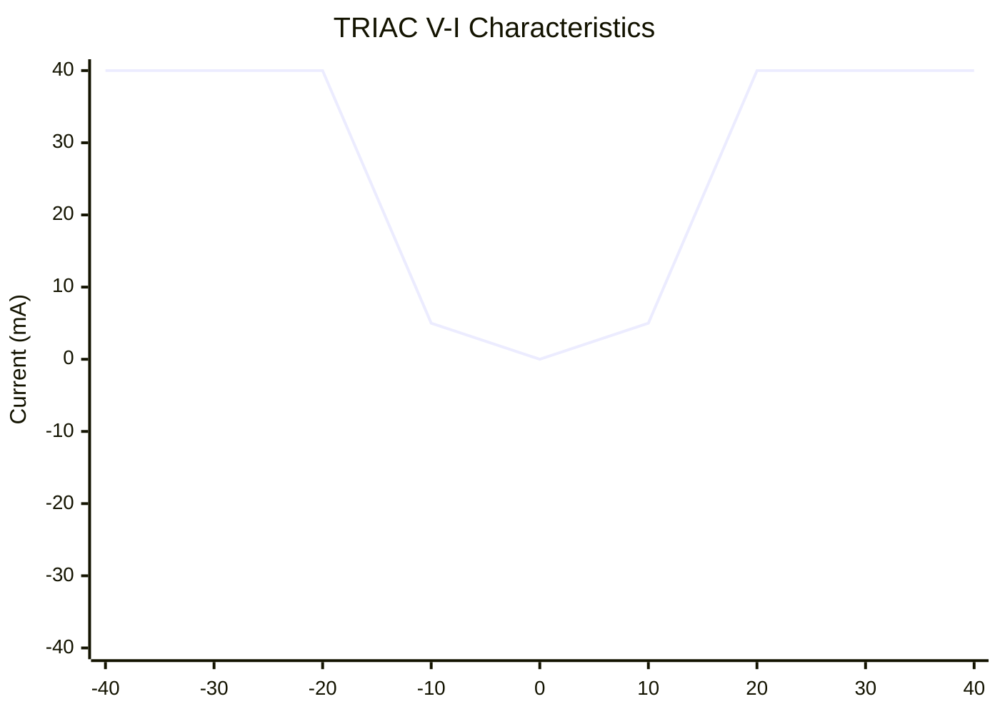

- **DIAC**: Bidirectional diode that conducts after breakover voltage
- **TRIAC**: Three-terminal device that conducts in both directions when triggered

**Mnemonic:** "BIBO" - "Bidirectional In, Bidirectional Out"

## Question 3(b) [4 marks]

**Explain the Gate triggering method of SCR.**

**Answer**:
Gate triggering is the most common method to activate an SCR.

**Diagram:**

```goat
        A
        |
     +-----+
     |     |
     |     |
     |  +->|
RC --|--+  |
     |     |
     +-----+
        |
        K
```

- **Gate pulse**: Small current applied between gate and cathode
- **Triggering methods**: DC, AC, or pulse signals
- **Current requirements**: Typically 5-20mA gate current
- **Advantages**: Low power control of high-power circuits

**Mnemonic:** "GATE" - "Gain Activation Through Electron flow"

## Question 3(c) [7 marks]

**Explain SCR application for DC power control.**

**Answer**:
SCR controls DC power by chopping the supply voltage at variable duty cycles.

**Circuit:**

```goat
    +-------+       SCR
    |       |       / |
DC--|-------|------/--|--+---o Output
    |       |          |   |
    | PWM   |          |   |
    | Ctrl  |----.     |   |
    |       |    |     |   |
    +-------+    +-----|---+
                       |
                       |
    +------------------|
    |                  |
    GND----------------+
```

- **Phase control**: Varies firing angle to control average power
- **PWM control**: Pulse width modulation for efficient control
- **Applications**: DC motor speed control, dimming, heating
- **Advantages**: High efficiency, no moving parts, reliable
- **Limitations**: Unidirectional current flow, needs commutation

**Mnemonic:** "POWER" - "Pulse Operation With Electronic Regulation"

## Question 4(a) [3 marks]

**List characteristics of Ideal OP-AMP.**

**Answer**:
Ideal operational amplifiers have perfect characteristics that real devices approximate.

**Table:**

| Characteristic | Ideal Value |
|----------------|-------------|
| Open loop gain | Infinite |
| Input impedance | Infinite |
| Output impedance | Zero |
| Bandwidth | Infinite |
| CMRR | Infinite |
| Slew rate | Infinite |
| Offset voltage | Zero |

- **Practical values**: Actual op-amps have limitations
- **Implications**: Circuit design must account for real limitations

**Mnemonic:** "IBOCSS" - "Infinite Bandwidth, Open-loop gain, CMRR, Slew rate, and Sensitivity"

## Question 4(b) [4 marks]

**Explain working of differential amplifier using OP-AMP with circuit diagram.**

**Answer**:
Differential amplifier amplifies the voltage difference between two inputs.

**Circuit:**

```goat
              R2
       +------/\/\------+
       |                |
       |           +----+
       |           |    |
       |    R1     |    |
  V1 o-+---/\/\----+    +----o Vout
                  _|+   |
                 /      |
                /       |
               /______  |
                  -|    |
       |    R1     |    |
  V2 o-+---/\/\----+    |
       |                |
       |                |
       +------/\/\------+
              R2
```

- **Gain formula**: Vout = (V1-V2) × (R2/R1)
- **Common mode rejection**: Suppresses signals common to both inputs
- **Applications**: Instrumentation, medical equipment, audio

**Mnemonic:** "DIFF" - "Dual Input For Feedback"

## Question 4(c) [7 marks]

**Explain OP-AMP as an inverting amplifier (Closed loop) and derive the formula of voltage gain.**

**Answer**:
Inverting amplifier produces output that is inverted and amplified version of input.

**Circuit:**

```goat
          Rf
     +----/\/\----+
     |            |
     |            |
     |    +-------+----o Vout
     |    |       |
     |    |   +---+
Vin o+----+---|+  |
     |        |   |
     |  Ri    |   |
     +--/\/\--+---+
                -|
                 |
                 |
                 |
     +-----------+
     |
    GND
```

**Gain Derivation:**

- Apply KCL at inverting input: I₁ + I₂ = 0
- I₁ = (Vin - V⁻)/Ri and I₂ = (Vout - V⁻)/Rf
- At virtual ground, V⁻ ≈ 0
- Therefore: Vin/Ri + Vout/Rf = 0
- Solving for Vout/Vin: Av = -Rf/Ri

- **Characteristics**: Output 180° out of phase with input
- **Feedback**: Creates virtual ground at inverting input
- **Closed loop gain**: Controlled by external resistors

**Mnemonic:** "VAIN" - "Virtual ground Amplification Inverts Negative"

## OR

## Question 4(a) [3 marks]

**Define the following parameters of OPAMP:**
**1) CMRR  
2) Slew rate  
3) Gain Bandwidth Product**

**Answer**:
These parameters define key performance characteristics of operational amplifiers.

**Table:**

| Parameter | Definition | Importance |
|-----------|------------|------------|
| CMRR | Ratio of differential gain to common-mode gain | Higher is better for rejecting noise |
| Slew Rate | Maximum rate of output voltage change (V/μs) | Determines large-signal bandwidth |
| Gain-Bandwidth Product | Product of gain and frequency (MHz) | Measures high-frequency performance |

- **CMRR**: Typically 80-120dB in quality op-amps
- **Slew Rate**: Limits output for high-frequency, high-amplitude signals
- **GBP**: Remains constant as frequency increases

**Mnemonic:** "CSG" - "Common-mode rejection, Speed, and Gain"

## Question 4(b) [4 marks]

**Draw and explain summing amplifier using OP-AMP.**

**Answer**:
Summing amplifier produces output proportional to weighted sum of input voltages.

**Circuit:**

```goat
              Rf
       +------/\/\------+
       |                |
       |           +----+
       |           |    |
       |    R1     |    |
  V1 o-+---/\/\----+    +----o Vout
       |           |+   |
       |    R2    /     |
  V2 o-+---/\/\---+     |
       |          \_____|
       |    R3     |-   |
  V3 o-+---/\/\----+    |
       |                |
       |                |
     -----              |
      ---               |
       -                |
```

- **Output formula**: Vout = -Rf(V₁/R₁ + V₂/R₂ + V₃/R₃)
- **Applications**: Audio mixer, analog computers, signal processing
- **Advantage**: Multiple inputs can be processed simultaneously

**Mnemonic:** "SUM" - "Several Unified Multipliers"

## Question 4(c) [7 marks]

**Draw the pin diagram of IC 555 and explain Monostable multivibrator using IC555 with waveform.**

**Answer**:
IC 555 timer in monostable mode produces a single pulse of fixed duration when triggered.

**Pin Diagram:**

```goat
    +-------+
  1 |o      | 8
    |       |
  2 |o      | 7
    |  555  |
  3 |o      | 6
    |       |
  4 |o      | 5
    +-------+

1: GND     5: Control
2: Trigger  6: Threshold
3: Output   7: Discharge
4: Reset    8: VCC
```

**Circuit and Waveform:**

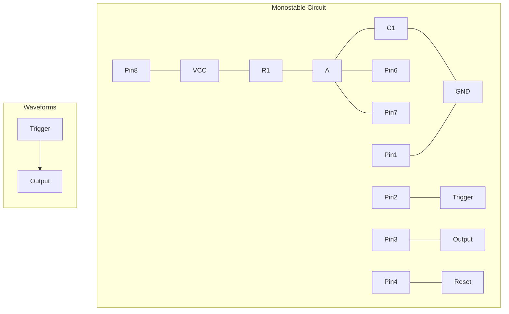

- **Operation**: Negative trigger starts timing cycle
- **Time period**: T = 1.1 × R × C
- **Applications**: Timers, pulse generation, debouncing
- **Advantages**: Simple, reliable, widely available

**Mnemonic:** "TIMER" - "Triggered Input Makes Extended Response"

## Question 5(a) [3 marks]

**Draw block diagram of SMPS and give its applications.**

**Answer**:
Switch Mode Power Supply (SMPS) uses switching elements for efficient power conversion.

**Block Diagram:**

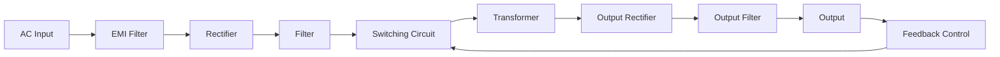

**Applications:**

- Computer power supplies
- Mobile phone chargers
- TV power supplies
- Industrial power systems
- LED lighting drivers

- **Advantages**: High efficiency, small size, lightweight
- **Types**: Buck, boost, buck-boost, flyback converters

**Mnemonic:** "SAFE" - "Switching Achieves Filtered Energy"

## Question 5(b) [4 marks]

**Explain working of Regulated Power Supply with diagram.**

**Answer**:
Regulated power supply maintains constant output despite input or load variations.

**Block Diagram:**

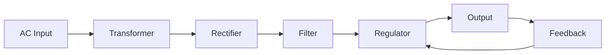

- **Transformer**: Steps down AC voltage to required level
- **Rectifier**: Converts AC to pulsating DC (diode bridge)
- **Filter**: Smooths DC with capacitors
- **Regulator**: Maintains constant output voltage
- **Feedback**: Compensates for input/load variations

**Mnemonic:** "TRFRO" - "Transform, Rectify, Filter, Regulate, Output"

## Question 5(c) [7 marks]

**Explain basic block diagram of OP-AMP with diagram.**

**Answer**:
Operational amplifier's internal structure consists of several stages performing specific functions.

**Block Diagram:**

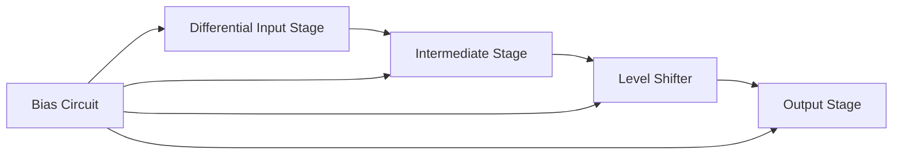

- **Differential input stage**: High impedance, amplifies difference
- **Intermediate stage**: Provides additional gain
- **Level shifter**: Adjusts DC level between stages
- **Output stage**: Low impedance, current amplification
- **Bias circuit**: Establishes operating points for all stages
- **Compensation**: Internal capacitor for stability

**Mnemonic:** "DILO" - "Differential Input, Level shift, Output"

## OR

## Question 5(a) [3 marks]

**Explain adjustable voltage regulator using LM317 with diagram.**

**Answer**:
LM317 is a versatile adjustable positive voltage regulator with output range of 1.25V to 37V.

**Circuit:**

```goat
    Vin             LM317            Vout
     o-----+--------+-------+--------o
           |       Vin     |
           |        |      |
           |      +---+    |
           |      |317|    |
           |      +---+    |  C2
           |     Adj|Out   +--||--+
           |        |         |   |
           |        +---------+   |
           |                  |   |
     C1    |       R1         |   |
     ||    +------/\/\--------+   |
     ||    |                  |   |
     ||    |                  |   |
     ++----+       R2         |   |
      |            /\/\-------+   |
      |            |          |   |
     GND          GND        GND GND
```

- **Formula**: Vout = 1.25(1 + R2/R1)
- **Advantages**: Simple adjustment, built-in protection
- **Applications**: Variable power supplies, battery chargers

**Mnemonic:** "AVR" - "Adjustable Voltage Regulation"

## Question 5(b) [4 marks]

**Give the difference between Fixed voltage regulator IC and Variable voltage regulator IC.**

**Answer**:
Voltage regulator ICs differ in their configurability and application requirements.

**Table:**

| Parameter | Fixed Voltage Regulator | Variable Voltage Regulator |
|-----------|-------------------------|----------------------------|
| Output voltage | Predetermined (e.g., 5V, 12V) | Adjustable over a range |
| External components | Minimal (capacitors only) | Requires resistors for setting |
| Series | 78xx (positive), 79xx (negative) | LM317 (positive), LM337 (negative) |
| Applications | Standard equipment | Custom designs, laboratory supplies |
| Flexibility | Limited to fixed values | Highly adaptable |
| Pin count | Typically 3 pins | 3 or more pins |

- **Fixed regulators**: Simple to use, limited adjustment
- **Variable regulators**: More versatile, require calculation

**Mnemonic:** "FOCUS" - "Fixed Output Compared to User-Set"

## Question 5(c) [7 marks]

**List applications of OP-AMP. Explain working operation of D to A converter with circuit diagram using OP-AMP.**

**Answer**:
Op-amps have numerous applications; D/A converters transform digital signals to analog.

**Applications of OP-AMP:**

- Amplifiers (inverting, non-inverting)
- Filters (active filters)
- Oscillators
- Comparators
- Integrators and differentiators
- Voltage followers
- Instrumentation circuits

**R-2R Ladder DAC Circuit:**

```goat
    D3   D2   D1   D0
     |    |    |    |
     v    v    v    v
     SW   SW   SW   SW
     |    |    |    |
   2R|   2R|  2R|  2R|
     |    |    |    |
     +----+----+----+
     |    |    |    |
     R    R    R    R
     |    |    |    |
     +----+----+----+---+
                      _|+
                     /
                    /
                   /___
                      -|
                       |
              Rf       |
              /\/\-----+----o Vout
              |        |
              |        |
             GND      GND
```

- **Working principle**: Digital inputs weight currents through resistor network
- **Resistance values**: Binary-weighted or R-2R ladder network
- **Conversion**: Output voltage proportional to digital input value
- **Resolution**: Determined by number of bits (2ⁿ levels)

**Mnemonic:** "DART" - "Digital to Analog Resistor Translation"
