## પ્રશ્ન 1(a) [3 marks]

**થર્મલ રનઅવે વિગતવાર સમજાવો.**

**ઉત્તર**:
થર્મલ રનઅવે એક વિનાશક પ્રક્રિયા છે જેમાં ટ્રાન્ઝિસ્ટર વધુને વધુ ગરમ થાય છે જ્યાં સુધી તે નિષ્ફળ ન જાય.

**આકૃતિ:**


- **કારણ**: તાપમાન વધવાથી બેઝ-એમિટર વોલ્ટેજ ઘટે છે
- **અસર**: તાપમાન વધવાથી કલેક્ટર કરંટ વધે છે
- **પરિણામ**: સ્વ-મજબૂત થતી ગરમીની સાયકલ વિનાશ તરફ દોરી જાય છે

**મેમરી ટ્રીક:** "ગરમી વધે, કરંટ ચડે, ટ્રાન્ઝિસ્ટર મરે"

## પ્રશ્ન 1(b) [4 marks]

**ફિક્સડ બાયસ પદ્ધતિ દોરો અને સમજાવો.**

**ઉત્તર**:
ફિક્સડ બાયસ માટે બેઝને વોલ્ટેજ સપ્લાય સાથે જોડવા માટે એક જ રેસિસ્ટરનો ઉપયોગ થાય છે.

**સર્કિટ આકૃતિ:**

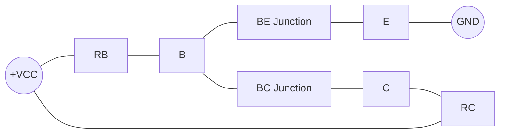

- **કાર્યપદ્ધતિ**: બેઝ કરંટ (IB) = (VCC - VBE)/RB
- **લક્ષણો**: સરળ સર્કિટ પરંતુ ઓછી સ્થિરતા
- **ગેરલાભ**: તાપમાન ફેરફારો પ્રત્યે અતિસંવેદનશીલ
- **ઉપયોગ**: નાના સિગ્નલ સર્કિટ જ્યાં સ્થિરતા મહત્વની નથી

**મેમરી ટ્રીક:** "ફિક્સડ બાયસ: એક રેસિસ્ટર, ઓછી સ્થિરતા"

## પ્રશ્ન 1(c) [7 marks]

**બાયસ પદ્ધતિઓની સૂચિ બનાવો. વોલ્ટેજ ડિવાઇડર પ્રકારની બાયસ પદ્ધતિની સર્કિટ દોરો અને સમજાવો.**

**ઉત્તર**:
ટ્રાન્ઝિસ્ટર માટે બાયસિંગ પદ્ધતિઓમાં યોગ્ય ઓપરેટિંગ પોઇન્ટ સ્થાપિત કરવા માટે કેટલીક તકનીકો શામેલ છે.

**કોષ્ટક: ટ્રાન્ઝિસ્ટર બાયસિંગ પદ્ધતિઓ**

| પદ્ધતિ | સ્થિરતા | જટિલતા | તાપમાન સંવેદનશીલતા |
|--------|-----------|------------|------------------------|
| ફિક્સડ બાયસ | નબળી | સરળ | ઊંચી |
| કલેક્ટર-ટુ-બેઝ બાયસ | મધ્યમ | મધ્યમ | મધ્યમ |
| વોલ્ટેજ ડિવાઇડર બાયસ | ઉત્તમ | જટિલ | નીચી |
| એમિટર બાયસ | સારી | મધ્યમ | નીચી |

**સર્કિટ આકૃતિ:**

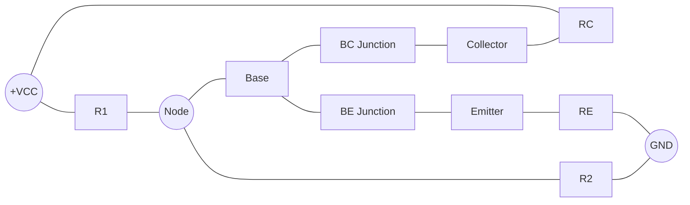

- **કાર્યપદ્ધતિ**: R1-R2 ડિવાઇડર સ્થિર બેઝ વોલ્ટેજ બનાવે છે
- **ફાયદો**: β વેરિએશન અને તાપમાનથી ઓછો પ્રભાવિત
- **મુખ્ય લક્ષણ**: RE નેગેટિવ ફીડબેક સ્થિરીકરણ પ્રદાન કરે છે
- **ઉપયોગ**: એમ્પલિફાયર સર્કિટમાં સૌથી વધુ વપરાય છે

**મેમરી ટ્રીક:** "વિભાજીત કરો અને સ્થિર બાયસ માટે રાજ કરો"

## પ્રશ્ન 1(c OR) [7 marks]

**કોમન એમીટર એમ્પલીફાયર માટે ડીસી લોડ લાઈન દોરો અને સમજાવો.**

**ઉત્તર**:
ડીસી લોડ લાઈન ટ્રાન્ઝિસ્ટરના તમામ સંભવિત ઓપરેટિંગ પોઇન્ટ્સને દર્શાવે છે.

**ગ્રાફ:**

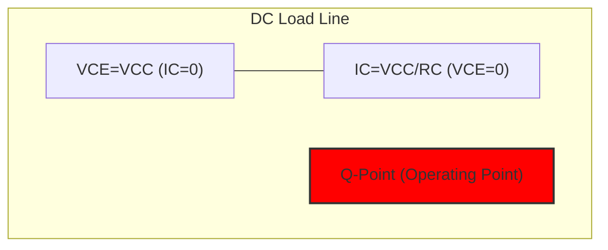

**ઇક્વેશન કોષ્ટક:**

| પેરામીટર | સમીકરણ | વર્ણન |
|-----------|----------|-------------|
| મહત્તમ VCE | VCC | જ્યારે IC = 0 |
| મહત્તમ IC | VCC/RC | જ્યારે VCE = 0 |
| લોડ લાઈન સમીકરણ | IC = (VCC - VCE)/RC | બધા સંભવિત ઓપરેટિંગ પોઇન્ટ |
| Q-પોઇન્ટ | બાયસિંગ દ્વારા નિર્ધારિત | સ્થિર ઓપરેશન પોઇન્ટ |

- **હેતુ**: IC અને VCE વચ્ચેના સંબંધને ગ્રાફિકલી બતાવે છે
- **મહત્વ**: ઓપરેટિંગ પોઇન્ટ (Q-પોઇન્ટ) નક્કી કરવામાં મદદ કરે છે
- **ઉપયોગ**: એમ્પલિફાયરની ડિઝાઇન અને વિશ્લેષણ માટે આવશ્યક

**મેમરી ટ્રીક:** "મહત્તમ કરંટ અથવા મહત્તમ વોલ્ટેજ, બંને ક્યારેય નહિં"

## પ્રશ્ન 2(a) [3 marks]

**પદો સમજાવો (i) ગેઈન (ii) બેન્ડવિડ્થ.**

**ઉત્તર**:
આ એમ્પલિફાયર પરફોરમન્સને વર્ણવતા મુખ્ય પેરામીટર્સ છે.

**કોષ્ટક: એમ્પલિફાયર પેરામીટર્સ**

| પેરામીટર | વ્યાખ્યા | એકમ | મહત્વ |
|-----------|------------|------|-------------|
| ગેઈન | આઉટપુટનો ઇનપુટ સિગ્નલ સાથેનો ગુણોત્તર | dB | એમ્પ્લિફિકેશન પાવર |
| બેન્ડવિડ્થ | ફ્રીક્વન્સીની રેન્જ જેમાં ગેઈન મહત્તમના 70.7% કરતાં ઓછો ન હોય | Hz | ઉપયોગી ફ્રીક્વન્સી રેન્જ |

- **ગેઈનના પ્રકાર**: વોલ્ટેજ ગેઈન (Av), કરંટ ગેઈન (Ai), પાવર ગેઈન (Ap)
- **બેન્ડવિડ્થ ફોર્મ્યુલા**: BW = fH - fL (ઉચ્ચ કટઓફ - નીચા કટઓફ)
- **સંબંધિત પેરામીટર**: ગેઈન-બેન્ડવિડ્થ પ્રોડક્ટ (ચોક્કસ એમ્પલિફાયર માટે અચળ)

**મેમરી ટ્રીક:** "ગેઈન મોટું બનાવે, બેન્ડવિડ્થ પહોળું બનાવે"

## પ્રશ્ન 2(b) [4 marks]

**એમ્પલીફાયરમાં નેગેટીવ ફીડબેકના ફાયદા અને ગેરફાયદાની સૂચિ બનાવો.**

**ઉત્તર**:
નેગેટિવ ફીડબેક એમ્પલિફાયર પરફોરમન્સમાં નોંધપાત્ર સુધારો કરે છે પરંતુ ટ્રેડઓફ સાથે.

**કોષ્ટક: નેગેટિવ ફીડબેક લક્ષણો**

| ફાયદા | ગેરફાયદા |
|------------|---------------|
| બેન્ડવિડ્થમાં વધારો | ગેઈનમાં ઘટાડો |
| ડિસ્ટોર્શનમાં ઘટાડો | વધુ ઇનપુટ સિગ્નલની જરૂર |
| સ્થિરતામાં સુધારો | વધુ જટિલ સર્કિટ |
| ઘોંઘાટ સામે વધુ ઈમ્યુનિટી | અયોગ્ય ડિઝાઇન થાય તો ઓસિલેશનની સંભાવના |
| ઇનપુટ/આઉટપુટ ઇમ્પીડન્સ નિયંત્રિત | વધુ પાવર વપરાશ |

**મેમરી ટ્રીક:** "સ્થિર, પહોળું અને ચોખ્ખું, માત્ર ગેઈન છોડો"

## પ્રશ્ન 2(c) [7 marks]

**હાર્ટલી ઓસ્સીલેટર દોરો અને સમજાવો.**

**ઉત્તર**:
હાર્ટલી ઓસિલેટર ઇન્ડક્ટિવ ફીડબેકનો ઉપયોગ કરીને સાઇન વેવ્સ જનરેટ કરે છે.

**સર્કિટ આકૃતિ:**

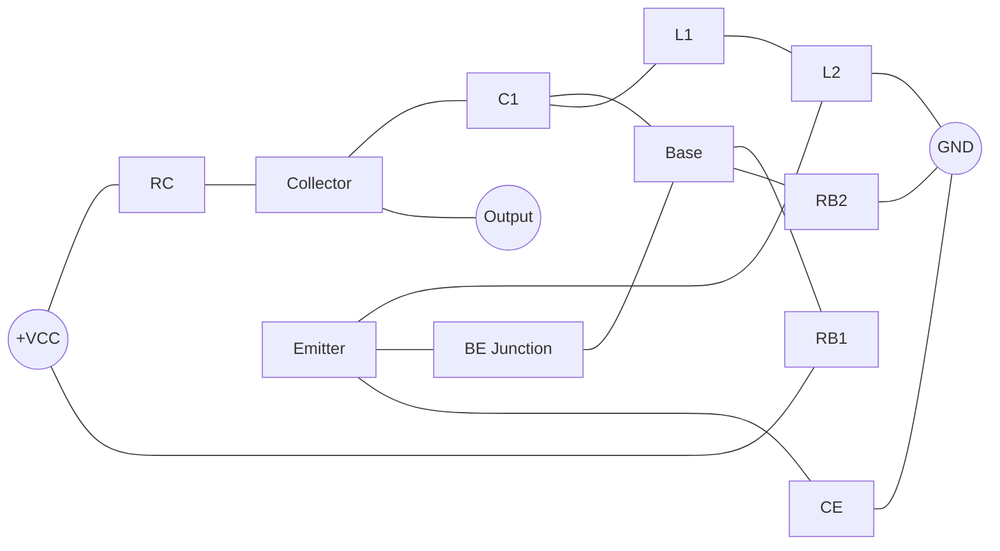

- **ફ્રીક્વન્સી નિર્ધારણ**: L1, L2 અને C1 મૂલ્યો દ્વારા (f = 1/2π√(L × C))
- **ફીડબેક મેકેનિઝમ**: ઇન્ડક્ટિવ વોલ્ટેજ ડિવાઇડર (L1 અને L2)
- **ઓળખ લક્ષણ**: ટેપ કરેલ ઇન્ડક્ટર અથવા શ્રેણીમાં બે ઇન્ડક્ટર્સ
- **ઉપયોગ**: RF સિગ્નલ જનરેશન, રેડિયો ટ્રાન્સમિટર્સ, કોમ્યુનિકેશન સિસ્ટમ્સ

**મેમરી ટ્રીક:** "હાર્ટલી હેલ્પફુલ ઇન્ડક્ટર્સ ધરાવે છે"

## પ્રશ્ન 2(a OR) [3 marks]

**ઓસ્સીલેટર માટે બારખૌસન ક્રાઈટરીઆ (Barkhausen's criteria) જણાવો અને સમજાવો.**

**ઉત્તર**:
બારખૌસન ક્રાઈટેરિયા સતત ઓસિલેશન માટેની શરતો નિર્ધારિત કરે છે.

**બે મુખ્ય માપદંડ:**

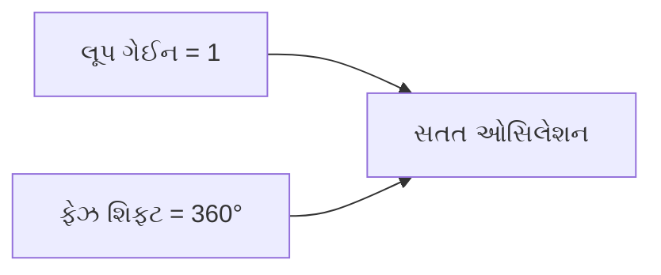

- **લૂપ ગેઈન કન્ડિશન**: |Aβ| = 1 (સતત ઓસિલેશન માટે ચોક્કસ 1)
- **ફેઝ શિફ્ટ કન્ડિશન**: ∠Aβ = 0° અથવા 360° (સિગ્નલ રિઇન્ફોર્સમેન્ટ)
- **પ્રેક્ટિકલ ડિઝાઇન**: પ્રારંભિક |Aβ| > 1, અંતે |Aβ| = 1 પર સ્થિર થાય છે

**મેમરી ટ્રીક:** "ઓસિલેશન માટે: યુનિટ ગેઈન, ઝીરો ફેઝ"

## પ્રશ્ન 2(b OR) [4 marks]

**નેગેટીવ અને પોસીટીવ ફીડબેક એમ્પલીફાયરને સરખાવો.**

**ઉત્તર**:
ફીડબેકનો પ્રકાર એમ્પલિફાયરના વર્તનને નાટકીય રીતે બદલે છે.

**તુલના કોષ્ટક:**

| પેરામીટર | નેગેટિવ ફીડબેક | પોઝિટિવ ફીડબેક |
|-----------|-------------------|-------------------|
| ગેઈન | ઘટે છે | વધે છે |
| બેન્ડવિડ્થ | વધે છે | ઘટે છે |
| ડિસ્ટોર્શન | ઘટાડે છે | વધારે છે |
| સ્થિરતા | સુધારે છે | ઘટાડે છે (ઓસિલેટ કરી શકે) |
| ઘોંઘાટ | ઘટાડે છે | વધારે છે |
| ઉપયોગ | સ્થિર એમ્પલિફાયર | ઓસિલેટર, ટ્રિગર સર્કિટ |
| ઇનપુટ/આઉટપુટ ઇમ્પીડન્સ | નિયંત્રિત | ઓછી અનુમાનિત |

**મેમરી ટ્રીક:** "નેગેટિવ સ્થિર કરે, પોઝિટિવ ઓસિલેટ કરે"

## પ્રશ્ન 2(c OR) [7 marks]

**કોલપીટ્ટ્સ ઓસ્સીલેટર દોરો અને સમજાવો.**

**ઉત્તર**:
કોલપિટ્સ ઓસિલેટર ફીડબેક માટે કેપેસિટિવ વોલ્ટેજ ડિવાઇડરનો ઉપયોગ કરે છે.

**સર્કિટ આકૃતિ:**

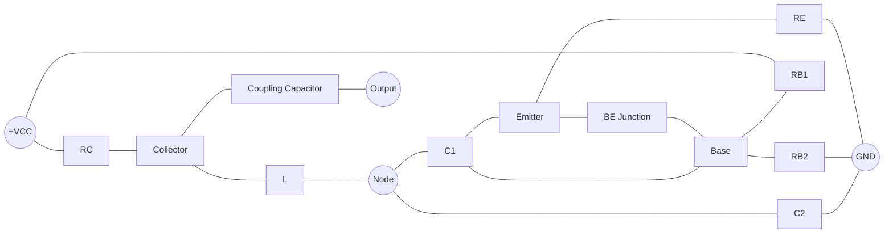

- **ફ્રીક્વન્સી નિર્ધારણ**: L, C1 અને C2 મૂલ્યો દ્વારા (f = 1/2π√(L × Ceq))
- **ફીડબેક મેકેનિઝમ**: કેપેસિટિવ વોલ્ટેજ ડિવાઇડર (C1 અને C2)
- **ઓળખ લક્ષણ**: ઇન્ડક્ટર સામે શ્રેણીમાં બે કેપેસિટર
- **ફાયદો**: હાર્ટલી કરતાં વધુ સ્થિર ફ્રીક્વન્સી

**મેમરી ટ્રીક:** "કોલપિટ્સ કેપેસિટિવ કરંટ કેચ કરે છે"

## પ્રશ્ન 3(a) [3 marks]

**ડાયક વિષે સમજાવો.**

**ઉત્તર**:
DIAC (Diode for Alternating Current) એ બાઇડિરેક્શનલ ટ્રિગર ડાયોડ છે.

**સિમ્બોલ અને સંરચના:**

```goat
    A       K
    |       |
    +-------+
    |       |
    +-------+
    |       |
    K       A
```

- **ઓપરેશન**: બ્રેકડાઉન વોલ્ટેજ પછી બંને દિશામાં વહન કરે છે
- **લક્ષણ**: બંને દિશામાં સિમેટ્રિકલ V-I કર્વ
- **કી પેરામીટર**: બ્રેકઓવર વોલ્ટેજ (સામાન્ય રીતે 30-40V)
- **મુખ્ય ઉપયોગ**: AC પાવર કંટ્રોલમાં TRIAC ટ્રિગરિંગ

**મેમરી ટ્રીક:** "DIAC: બેવડી દિશા બ્રેકડાઉન ડિવાઇસ"

## પ્રશ્ન 3(b) [4 marks]

**SCRની ટ્રીગરિંગ પદ્ધતિઓ સમજાવો.**

**ઉત્તર**:
SCR વહન માટે ઘણી પદ્ધતિઓ દ્વારા ટ્રિગર થઈ શકે છે.

**કોષ્ટક: SCR ટ્રિગરિંગ પદ્ધતિઓ**

| પદ્ધતિ | વર્ણન | ફાયદા | મર્યાદાઓ |
|--------|-------------|------------|-------------|
| ગેટ ટ્રિગરિંગ | ગેટ પર કરંટ પલ્સ | સૌથી સામાન્ય, નિયંત્રિત | કંટ્રોલ સર્કિટની જરૂર |
| તાપમાન | ઉચ્ચ તાપમાન | કોઈ બાહ્ય સર્કિટ નહીં | અનિયંત્રિત, અવિશ્વસનીય |
| વોલ્ટેજ | બ્રેકઓવર વોલ્ટેજથી વધારે | કોઈ બાહ્ય સર્કિટ નહીં | ડિવાઇસ પર તણાવ, અનિયંત્રિત |
| dv/dt | ઝડપી વોલ્ટેજ વૃદ્ધિ | સરળ | અનિચ્છનીય ટ્રિગરિંગ થઈ શકે |
| પ્રકાશ | જંક્શન પર ફોટોન્સ | ઇલેક્ટ્રિકલ અલગતા | વિશેષ પેકેજિંગની જરૂર |

**મેમરી ટ્રીક:** "ગેટ વોલ્ટેજ તાપમાન રેટ લાઇટ"

## પ્રશ્ન 3(c) [7 marks]

**SCRનો સિમ્બોલ અને કન્સ્ટ્રક્શન દોરો. ઉપરાંત SCRની V-I લાક્ષણિકતા દોરો અને સમજાવો.**

**ઉત્તર**:
SCR (Silicon Controlled Rectifier) એ ત્રણ ટર્મિનલવાળી ચાર-લેયર PNPN સેમિકન્ડક્ટર ડિવાઇસ છે.

**સિમ્બોલ:**

```goat
      A (Anode)
      |
      |
      v
    -----
    |   |
G -->|   |
    |   |
    -----
      ^
      |
      |
      K (Cathode)
```

**કન્સ્ટ્રક્શન:**

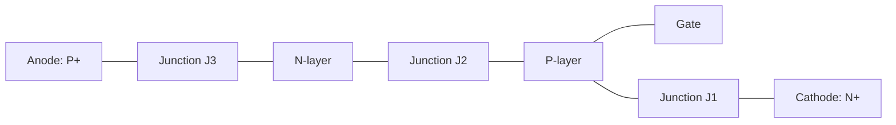

**V-I લાક્ષણિકતા:**

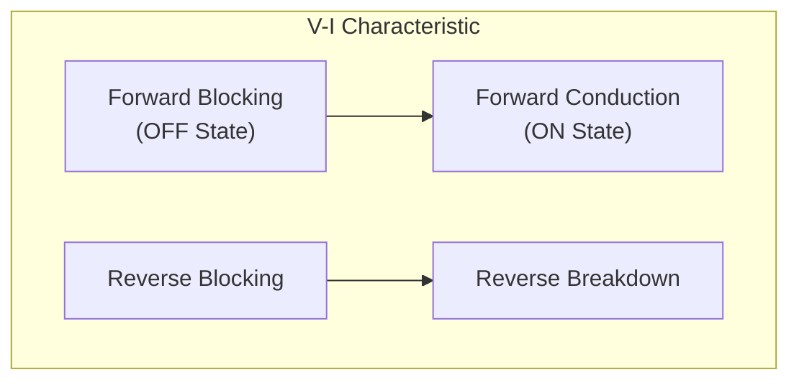

- **ફોરવર્ડ બ્લોકિંગ**: ટ્રિગરિંગ સુધી ઓછો કરંટ
- **ફોરવર્ડ કન્ડક્શન**: ટ્રિગરિંગ પછી ઉચ્ચ કરંટ (લેચડ)
- **હોલ્ડિંગ કરંટ**: કન્ડક્શન જાળવવા માટે ન્યૂનતમ કરંટ
- **લેચિંગ કરંટ**: લેચિંગ શરૂ કરવા માટે ન્યૂનતમ કરંટ
- **રિવર્સ બ્લોકિંગ**: રિવર્સ દિશામાં કરંટને અવરોધે છે

**મેમરી ટ્રીક:** "એક વાર ટ્રિગર, હંમેશા કન્ડક્ટ, જ્યાં સુધી કરંટ ન ઘટે"

## પ્રશ્ન 3(a OR) [3 marks]

**SCRની નેચરલ કોમ્યુટેશન પદ્ધતિ વિષે સમજાવો.**

**ઉત્તર**:
નેચરલ કોમ્યુટેશન AC કરંટ કુદરતી રીતે શૂન્ય પર પહોંચે ત્યારે બાહ્ય સર્કિટ વિના SCRને બંધ કરે છે.

**પ્રક્રિયા આકૃતિ:**

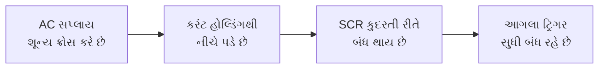

- **સિદ્ધાંત**: AC સપ્લાયના કુદરતી શૂન્ય-ક્રોસિંગનો ઉપયોગ કરે છે
- **ફાયદો**: કોઈ વધારાની કોમ્યુટેશન સર્કિટની જરૂર નથી
- **ઉપયોગ**: AC પાવર કંટ્રોલ સર્કિટ, લાઇટ ડિમર્સ
- **મર્યાદા**: માત્ર AC સપ્લાય સાથે કામ કરે છે, DC સાથે નહીં

**મેમરી ટ્રીક:** "નેચરલ કોમ્યુટેશન: શૂન્ય કરંટ, શૂન્ય પ્રયત્ન"

## પ્રશ્ન 3(b OR) [4 marks]

**ઓપ્ટો-કપ્લર વિશે સમજાવો.**

**ઉત્તર**:
ઓપ્ટો-કપ્લર પ્રકાશ ટ્રાન્સમિશનનો ઉપયોગ કરીને ઇલેક્ટ્રિકલ આઈસોલેશન પ્રદાન કરે છે.

**સંરચના:**

```goat
  .---------.
  |  LED    |\\
  |         | \\
  '---------'  \\
                >
  .---------.  //
  |PhotoDet | //
  |         |//
  '---------'
```

**કોષ્ટક: ઓપ્ટો-કપ્લર પ્રકારો**

| પ્રકાર | ફોટોડિટેક્ટર | સ્પીડ | CTR | ઉપયોગો |
|------|---------------|-------|-----|-------------|
| સ્ટાન્ડર્ડ | ફોટોટ્રાન્ઝિસ્ટર | મધ્યમ | 20-100% | સામાન્ય આઈસોલેશન |
| હાઈ-સ્પીડ | ફોટોડાયોડ | ઝડપી | 10-50% | ડિજિટલ કોમ્યુનિકેશન |
| TRIAC | ફોટો-TRIAC | ધીમું | N/A | AC પાવર કંટ્રોલ |
| લિનિયર | ફોટોડાર્લિંગટન | ધીમું | 100-1000% | એનાલોગ સિગ્નલ્સ |

- **CTR**: કરંટ ટ્રાન્સફર રેશિયો (આઉટપુટ/ઇનપુટ કરંટ)
- **મુખ્ય લક્ષણ**: સર્કિટ્સ વચ્ચે સંપૂર્ણ ઇલેક્ટ્રિકલ આઈસોલેશન
- **ફાયદા**: નોઈઝ ઈમ્યુનિટી, વોલ્ટેજ લેવલ શિફ્ટિંગ, સલામતી

**મેમરી ટ્રીક:** "પ્રકાશ કૂદે છે જ્યાં ઇલેક્ટ્રોન્સ નથી કૂદી શકતા"

## પ્રશ્ન 3(c OR) [7 marks]

**TRIACનો સિમ્બોલ અને કન્સ્ટ્રક્શન દોરો. ઉપરાંત TRIACની V-I લાક્ષણિકતા દોરો અને સમજાવો.**

**ઉત્તર**:
TRIAC (Triode for Alternating Current) એ બાઇડિરેક્શનલ ત્રણ-ટર્મિનલવાળી સેમિકન્ડક્ટર ડિવાઇસ છે.

**સિમ્બોલ:**

```goat
    MT2
     |
     |
   -----
   |   |
G--|   |
   |   |
   -----
     |
     |
    MT1
```

**કન્સ્ટ્રક્શન:**


**V-I લાક્ષણિકતા:**

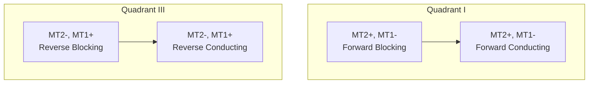

- **બાઇડિરેક્શનલ**: ટ્રિગરિંગ પછી બંને દિશામાં વહન કરે છે
- **ક્વોડ્રન્ટ ઓપરેશન**: પોલેરિટી પર આધારિત ચાર ટ્રિગરિંગ મોડ
- **ઉપયોગો**: AC પાવર કંટ્રોલ, લાઇટ ડિમર્સ, મોટર કંટ્રોલ
- **SCR કરતાં ફાયદો**: AC સાયકલના બંને અર્ધભાગોને નિયંત્રિત કરે છે

**મેમરી ટ્રીક:** "TRIAC: AC સર્કિટમાં બેવડી દિશાનો રસ્તો"

## પ્રશ્ન 4(a) [3 marks]

**Ideal Op-Ampની લાક્ષણિકતા જણાવો.**

**ઉત્તર**:
આદર્શ Op-Amp એવી સંપૂર્ણ લાક્ષણિકતાઓ ધરાવે છે જેને વાસ્તવિક Op-Amps આશરે છે.

**કોષ્ટક: આદર્શ Op-Amp લાક્ષણિકતાઓ**

| પેરામીટર | આદર્શ મૂલ્ય | અર્થ |
|-----------|-------------|---------|
| ઓપન-લૂપ ગેઈન | અનંત | નાનામાં નાના ઇનપુટ તફાવતને એમ્પ્લિફાય કરે છે |
| ઇનપુટ ઇમ્પીડન્સ | અનંત | સ્ત્રોતમાંથી કોઈ કરંટ લેતું નથી |
| આઉટપુટ ઇમ્પીડન્સ | શૂન્ય | કોઈપણ લોડને ડ્રાઇવ કરી શકે છે |
| બેન્ડવિડ્થ | અનંત | બધી ફ્રીક્વન્સી પર કામ કરે છે |
| CMRR | અનંત | કોમન-મોડ સિગ્નલ્સને નકારે છે |
| સ્લ્યૂ રેટ | અનંત | તાત્કાલિક આઉટપુટ ફેરફાર |
| ઓફસેટ વોલ્ટેજ | શૂન્ય | શૂન્ય ઇનપુટ સાથે કોઈ આઉટપુટ નહીં |

**મેમરી ટ્રીક:** "અનંત ગેઈન, ઇમ્પીડન્સ, બેન્ડવિડ્થ; શૂન્ય ઓફસેટ, આઉટપુટ Z"

## પ્રશ્ન 4(b) [4 marks]

**555 ટાઈમર ICની મદદથી મોનોસ્ટેબલ મલ્ટીવાઇબ્રેટર દોરો અને સમજાવો.**

**ઉત્તર**:
મોનોસ્ટેબલ મલ્ટીવાઇબ્રેટર ટ્રિગર થાય ત્યારે નિશ્ચિત સમયગાળાનો એક પલ્સ ઉત્પન્ન કરે છે.

**સર્કિટ:**

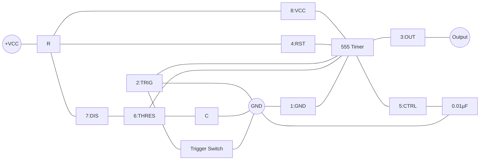

- **ઓપરેશન**: નેગેટિવ ટ્રિગર T = 1.1RC સમયગાળાનો આઉટપુટ પલ્સ ઉત્પન્ન કરે છે
- **સ્ટેબલ સ્ટેટ**: ટ્રિગર થાય ત્યાં સુધી આઉટપુટ LOW
- **ટાઇમિંગ કંટ્રોલ**: R અને C મૂલ્યો પલ્સ પહોળાઈ નક્કી કરે છે
- **રિટ્રિગરિંગ**: ટાઇમઆઉટ પછી ફરીથી ટ્રિગર થઈ શકે છે

**મેમરી ટ્રીક:** "વન શોટ વન્ડર: એક વાર ટ્રિગર, એક વાર પલ્સ"

## પ્રશ્ન 4(c) [7 marks]

**741 ICની મદદથી ઇન્વર્ટિંગ એમ્પલીફાયર દોરો અને સમજાવો. ઉપરાંત તેના ઈનપુટ અને આઉટપુટ વેવફોર્મ્સ દોરો.**

**ઉત્તર**:
ઇન્વર્ટિંગ એમ્પલિફાયર ઇનપુટ સિગ્નલને એમ્પ્લિફાય કરતી વખતે પોલેરિટી ઉલટાવે છે.

**સર્કિટ:**

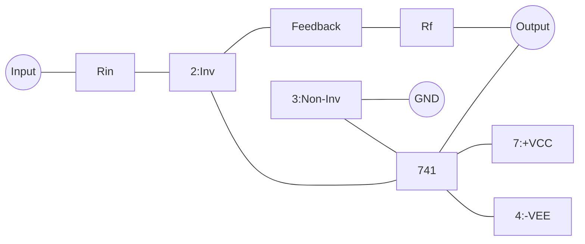

**વેવફોર્મ્સ:**

```goat
Input:     /-\      /-\
          /   \    /   \
     ____/     \__/     \____

Output:   \    /\    /
           \  /  \  /
     ______\/____\/________
            
            180° ફેઝ શિફ્ટ
```

- **ગેઈન સમીકરણ**: Av = -Rf/Rin (નેગેટિવ ચિહ્ન ઇન્વર્ઝન સૂચવે છે)
- **ઇનપુટ ઇમ્પીડન્સ**: Rin જેટલી
- **વર્ચ્યુઅલ ગ્રાઉન્ડ**: ઇન્વર્ટિંગ ઇનપુટ લગભગ 0V પર જળવાય છે
- **બેન્ડવિડ્થ**: ગેઈન પર આધારિત (ઉચ્ચ ગેઈન = ઓછી બેન્ડવિડ્થ)
- **ઉપયોગો**: સિગ્નલ કન્ડિશનિંગ, ઓડિયો એમ્પલિફાયર

**મેમરી ટ્રીક:** "ઉલટાવે અને Rf/Rin વડે ગુણાકાર કરે છે"

## પ્રશ્ન 4(a OR) [3 marks]

**IC 741નો સિમ્બોલ અને પીન ડાયગ્રામ દોરો.**

**ઉત્તર**:
741 એક લોકપ્રિય જનરલ-પરપસ ઓપરેશનલ એમ્પલિફાયર છે.

**સિમ્બોલ:**

```goat
        |\ 
        | \
Input --|+ \
        |   \
        |    |---- Output
        |   /
Input --|− /
        | /
        |/
```

**8-Pin DIP પેકેજ:**

```goat
       _______
      |       |
NC 1--|       |--8 Vcc+
      |       |
-IN 2--|  741  |--7 Output
      |       |
+IN 3--|       |--6 NC
      |       |
Vcc- 4--|_______|--5 Offset Null
```

- **પિન ફંક્શન્સ**: ઇન્વર્ટિંગ ઇનપુટ, નોન-ઇન્વર્ટિંગ ઇનપુટ, આઉટપુટ, પાવર સપ્લાય
- **ઓપ્શનલ પિન્સ**: ઓફસેટ નલ, નો કનેક્શન
- **પાવર સપ્લાય**: સામાન્ય રીતે ±15V અથવા ±12V ડ્યુઅલ સપ્લાય

**મેમરી ટ્રીક:** "કદી ઉલટાવશો નહિં પ્લસ, વેરી આઉટપુટ નોટ કનેક્ટેડ"

## પ્રશ્ન 4(b OR) [4 marks]

**પદો સમજાવો (i) સી.એમ.આર.આર (II) સ્લૂ રેટ.**

**ઉત્તર**:
આ પેરામીટર્સ ઓપરેશનલ એમ્પલિફાયરની કાર્યક્ષમતાની મર્યાદાઓ નિર્ધારિત કરે છે.

**કોષ્ટક: મુખ્ય Op-Amp પેરામીટર્સ**

| પેરામીટર | વ્યાખ્યા | સામાન્ય મૂલ્ય | મહત્વ |
|-----------|------------|---------------|-------------|
| CMRR (Common Mode Rejection Ratio) | ડિફરેન્શિયલ ગેઈનનો કોમન-મોડ ગેઈન સાથેનો ગુણોત્તર | 90-120 dB | ઉચ્ચ હોય તે વધુ સારું |
| સ્લ્યૂ રેટ | આઉટપુટ વોલ્ટેજના ફેરફારનો મહત્તમ દર | 0.5-50 V/μs | ઝડપી સિગ્નલ્સ માટે ઉચ્ચ |

- **CMRR ફોર્મ્યુલા**: CMRR = 20 log₁₀(Ad/Acm) dB
- **CMRR મહત્વ**: બંને ઇનપુટ પર સામાન્ય ઘોંઘાટને નકારે છે
- **સ્લ્યૂ રેટ ફોર્મ્યુલા**: SR = dVo/dt (max)
- **સ્લ્યૂ રેટ મર્યાદા**: ઉચ્ચ ફ્રીક્વન્સી પર ડિસ્ટોર્શન કરે છે

**મેમરી ટ્રીક:** "CMRR કોમન નોઈઝને ક્રશ કરે છે, સ્લ્યૂ રેટ સ્પીડ બતાવે છે"

## પ્રશ્ન 4(c OR) [7 marks]

**555 ટાઈમર ICની મદદથી આસ્ટેબલ મલ્ટીવાઇબ્રેટર દોરો અને સમજાવો.**

**ઉત્તર**:
આસ્ટેબલ મલ્ટીવાઇબ્રેટર બાહ્ય ટ્રિગર વિના સતત સ્ક્વેર વેવ્સ ઉત્પન્ન કરે છે.

**સર્કિટ:**

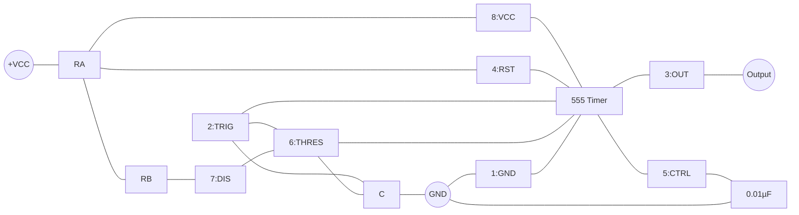

**આઉટપુટ વેવફોર્મ:**

```goat
   HIGH  ____      ____      ____
        |    |    |    |    |    |
        |    |    |    |    |    |
   LOW  |____|    |____|    |____|
        
        | T1 | T2 | T1 | T2 | T1 |
```

- **ટાઇમિંગ**: T1 = 0.693(RA+RB)C, T2 = 0.693(RB)C
- **ફ્રીક્વન્સી**: f = 1.44/((RA+2RB)C)
- **ડ્યુટી સાયકલ**: RA અને RB દ્વારા એડજસ્ટ થઈ શકે છે
- **ઉપયોગો**: ક્લોક જનરેટર, LED ફ્લેશર, ટોન જનરેટર

**મેમરી ટ્રીક:** "હંમેશા ઓસિલેટિંગ, ક્યારેય સ્ટોપિંગ નહીં"

## પ્રશ્ન 5(a) [3 marks]

**રેગ્યુલેટેડ પાવર સપ્લાયનો બેઝીક બ્લોક ડાયગ્રામ દોરો અને તેને સમજાવો.**

**ઉત્તર**:
રેગ્યુલેટેડ પાવર સપ્લાય AC ને સ્થિર DC વોલ્ટેજમાં રૂપાંતરિત કરે છે.

**બ્લોક ડાયગ્રામ:**


- **ટ્રાન્સફોર્મર**: AC વોલ્ટેજને જરૂરી લેવલ સુધી ઘટાડે છે
- **રેક્ટિફાયર**: AC ને પલ્સેટિંગ DC માં રૂપાંતરિત કરે છે (ડાયોડ બ્રિજ)
- **ફિલ્ટર**: પલ્સેટિંગ DC ને સ્મૂધ કરે છે (કેપેસિટર્સ)
- **રેગ્યુલેટર**: ફેરફારો છતાં સતત આઉટપુટ જાળવે છે
- **આઉટપુટ**: ઇલેક્ટ્રોનિક સર્કિટ્સ માટે સ્થિર DC વોલ્ટેજ

**મેમરી ટ્રીક:** "ટ્રાન્સફોર્મર રેક્ટિફાય ફિલ્ટર રેગ્યુલેટ"

## પ્રશ્ન 5(b) [4 marks]

**Op-ampની મદદથી સમિંગ એમ્પલીફાયર દોરો અને સમજાવો.**

**ઉત્તર**:
સમિંગ એમ્પલિફાયર વજનદાર અનુપાત સાથે બહુવિધ ઇનપુટ સિગ્નલ્સને ઉમેરે છે.

**સર્કિટ:**

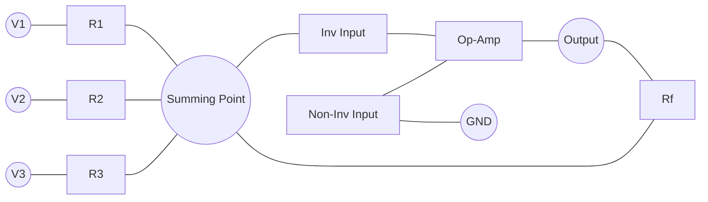

- **આઉટપુટ સમીકરણ**: Vout = -Rf(V1/R1 + V2/R2 + V3/R3)
- **વિશેષ કેસ**: જ્યારે બધા રેસિસ્ટર સમાન હોય, Vout = -Rf/R × (V1 + V2 + V3)
- **ઉપયોગો**: ઓડિયો મિક્સિંગ, એનાલોગ કમ્પ્યુટર, સિગ્નલ એવરેજિંગ
- **વેરિએશન્સ**: ઇન્વર્ટિંગ અને નોન-ઇન્વર્ટિંગ કોન્ફિગરેશન ઉપલબ્ધ

**મેમરી ટ્રીક:** "મલ્ટિપલ ઇનપુટ, વન આઉટપુટ, વેઇટેડ એડિશન"

## પ્રશ્ન 5(c) [7 marks]

**IC LM317ની મદદથી 3 ટર્મિનલવાળા એડજસ્ટેબલ આઉટપુટ વોલ્ટેજ રેગ્યુલેટરનો સર્કિટ ડાયગ્રામ દોરો અને સમજાવો.**

**ઉત્તર**:
LM317 એ 1.25V થી 37V સુધીની આઉટપુટ રેન્જ સાથે વર્સેટાઇલ એડજસ્ટેબલ વોલ્ટેજ રેગ્યુલેટર છે.

**સર્કિટ:**

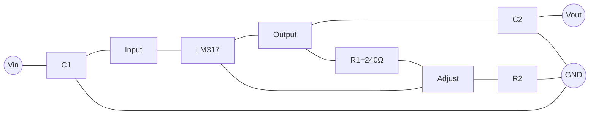

- **આઉટપુટ વોલ્ટેજ**: VOUT = 1.25V(1 + R2/R1)
- **ફિક્સ્ડ કમ્પોનન્ટ્સ**: R1 = 240Ω, રેફરન્સ વોલ્ટેજ = 1.25V
- **એડજસ્ટેબિલિટી**: R2 બદલવાથી ઇચ્છિત આઉટપુટ વોલ્ટેજ સેટ થાય છે
- **પ્રોટેક્શન ફીચર્સ**: કરંટ લિમિટિંગ, થર્મલ શટડાઉન
- **ઉપયોગો**: વેરિએબલ પાવર સપ્લાય, બેટરી ચાર્જર
- **ફાયદા**: ઓછા બાહ્ય ઘટકો, મજબૂત સુરક્ષા

**મેમરી ટ્રીક:** "R2 વડે એડજસ્ટ કરો, રેફરન્સ 1.25 પર રહે છે"

## પ્રશ્ન 5(a OR) [3 marks]

**એસ.એમ.પી.એસનું સંપૂર્ણ ફોર્મ જણાવો. ઉપરાંત એસ.એમ.પી.એસના કાર્યો જણાવો.**

**ઉત્તર**:
SMPS એટલે Switch Mode Power Supply, એક આધુનિક કાર્યક્ષમ પાવર રૂપાંતરણ ટેકનોલોજી.

**ઉપયોગ કોષ્ટક:**

| ઉપયોગ | SMPS પ્રકાર | ફાયદા |
|-------------|-----------|------------|
| કમ્પ્યુટર પાવર સપ્લાય | ATX | ઉચ્ચ કાર્યક્ષમતા, મલ્ટિપલ આઉટપુટ |
| મોબાઇલ ફોન ચાર્જર | ફ્લાયબૅક | કોમ્પેક્ટ સાઇઝ, હળવું વજન |
| LED ડ્રાઇવર | બક | કાર્યક્ષમ ડિમિંગ ક્ષમતા |
| TV પાવર સપ્લાય | ફોરવર્ડ | સારી રેગ્યુલેશન, મલ્ટિપલ આઉટપુટ |
| ઔદ્યોગિક કંટ્રોલ | પુશ-પુલ | ઉચ્ચ પાવર ક્ષમતા |
| બેટરી ચાર્જર | બૂસ્ટ | એડજસ્ટેબલ ચાર્જિંગ પ્રોફાઇલ |

- **મુખ્ય ફાયદા**: ઉચ્ચ કાર્યક્ષમતા (80-95%), નાનો આકાર, હળવું
- **નુકસાન**: EMI ઉત્પાદન, વધુ જટિલ સર્કિટ

**મેમરી ટ્રીક:** "સ્વિચ મોડ નાના ઉપકરણોને પાવર આપે છે"

## પ્રશ્ન 5(b OR) [4 marks]

**Op-ampની મદદથી ડિફ્રન્સીએટર દોરો અને સમજાવો.**

**ઉત્તર**:
ડિફરન્શિએટર ઇનપુટના ફેરફારના દરના સમપ્રમાણમાં આઉટપુટ ઉત્પન્ન કરે છે.

**સર્કિટ:**

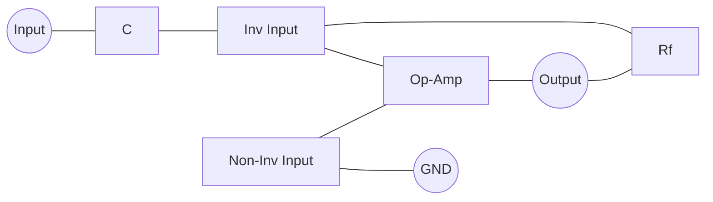

**ઇનપુટ/આઉટપુટ વેવફોર્મ્સ:**

```goat
Input:      ___
           /   \
          /     \___
         /
________/

Output:   |
          |
     _____|_____
         / \
        /   \
```

- **સમીકરણ**: Vout = -RC × d(Vin)/dt
- **ફંક્શન**: સ્ક્વેર વેવને સ્પાઇક્સમાં, ટ્રાયેંગલને સ્ક્વેરમાં રૂપાંતરિત કરે છે
- **પ્રેક્ટિકલ સમસ્યા**: ઉચ્ચ નોઈઝ સેન્સિટિવિટી
- **મોડિફિકેશન**: ઉચ્ચ-ફ્રીક્વન્સી ગેઈન મર્યાદિત કરવા માટે C સાથે શ્રેણીમાં નાનો રેસિસ્ટર
- **ઉપયોગો**: વેવશેપિંગ, ફેરફાર-દરની શોધ

**મેમરી ટ્રીક:** "ફેરફારનો દર અંદર જાય, એમ્પલિટ્યુડ બહાર આવે"

## પ્રશ્ન 5(c OR) [7 marks]

**-12 V રેગ્યુલેટેડ પાવર સપ્લાયનો સર્કિટ ડાયગ્રામ દોરો અને સમજાવો.**

**ઉત્તર**:
-12V રેગ્યુલેટેડ સપ્લાય એનાલોગ સર્કિટ્સ માટે સ્થિર નેગેટિવ વોલ્ટેજ પ્રદાન કરે છે.

**સર્કિટ ડાયગ્રામ:**

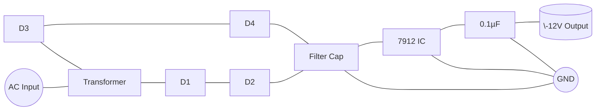

- **કાર્યસિદ્ધાંત**: ફુલ-વેવ રેક્ટિફાયર નેગેટિવ વોલ્ટેજ બનાવે છે
- **ઘટકો**: ટ્રાન્સફોર્મર, બ્રિજ રેક્ટિફાયર, ફિલ્ટર કેપેસિટર, 7912 રેગ્યુલેટર
- **રેગ્યુલેટર IC**: 7912 આંતરિક સુરક્ષા સાથે ફિક્સ્ડ -12V આઉટપુટ પ્રદાન કરે છે
- **ફિલ્ટર કેપેસિટર**: ઇનપુટ કેપેસિટર રિપલ ફિલ્ટર કરે છે, આઉટપુટ કેપેસિટર ટ્રાન્ઝિયન્ટ રિસ્પોન્સ સુધારે છે
- **ઉપયોગો**: Op-amp નેગેટિવ રેલ, એનાલોગ સર્કિટ્સ, ઓડિયો ઇક્વિપમેન્ટ

**મેમરી ટ્રીક:** "ફુલ બ્રિજ, મોટો કેપેસિટર, 7912 નેગેટિવ રેગ્યુલેટ કરે છે"

આ સાથે ઇલેક્ટ્રોનિક્સ ડિવાઇસીસ એન્ડ સર્કિટ્સ વિન્ટર 2024 પરીક્ષા પેપરના બધા પ્રશ્નોના ઉકેલ, બધા OR પ્રશ્નો સહિત પૂર્ણ થાય છે.
