## Question 1(a) [3 marks]

**Explain thermal runaway in detail.**

**Answer**:
Thermal runaway is a destructive process where a transistor gets increasingly hotter until it fails.

**Diagram:**


- **Cause**: Increased temperature decreases base-emitter voltage
- **Effect**: Collector current increases with temperature
- **Result**: Self-reinforcing cycle of heating leads to destruction

**Mnemonic:** "Heat Rises, Current Climbs, Transistor Dies"

## Question 1(b) [4 marks]

**Draw and explain fixed bias method.**

**Answer**:
Fixed bias uses a single resistor from base to voltage supply for biasing.

**Circuit Diagram:**

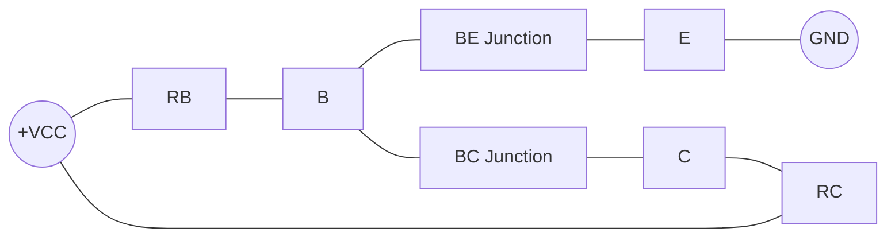

- **Working**: Base current (IB) = (VCC - VBE)/RB
- **Characteristics**: Simple circuit but poor stability
- **Disadvantage**: Highly sensitive to temperature variations
- **Application**: Used in small signal circuits where stability isn't critical

**Mnemonic:** "Fixed Bias: One Resistor, Poor Stability"

## Question 1(c) [7 marks]

**List the biasing methods. Draw the circuit of voltage divider type bias method and explain it.**

**Answer**:
The biasing methods for transistors include several techniques for establishing proper operating points.

**Table: Transistor Biasing Methods**

| Method | Stability | Complexity | Temperature Sensitivity |
|--------|-----------|------------|------------------------|
| Fixed Bias | Poor | Simple | High |
| Collector-to-Base Bias | Medium | Medium | Medium |
| Voltage Divider Bias | Excellent | Complex | Low |
| Emitter Bias | Good | Medium | Low |

**Circuit Diagram:**

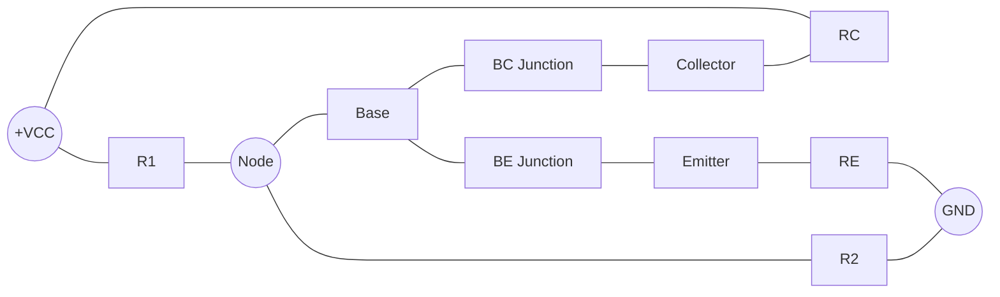

- **Working**: R1-R2 divider creates stable base voltage
- **Advantage**: Less affected by β variations and temperature
- **Key feature**: RE provides negative feedback stabilization
- **Application**: Most widely used in amplifier circuits

**Mnemonic:** "Divide and Rule for Stable Bias"

## Question 1(c OR) [7 marks]

**Draw and explain DC load line for common emitter amplifier.**

**Answer**:
DC load line represents all possible operating points of a transistor.

**Graph:**

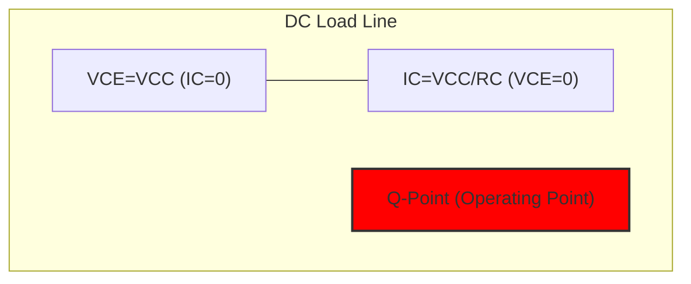

**Equation Table:**

| Parameter | Equation | Description |
|-----------|----------|-------------|
| Maximum VCE | VCC | When IC = 0 |
| Maximum IC | VCC/RC | When VCE = 0 |
| Load Line Equation | IC = (VCC - VCE)/RC | All possible operating points |
| Q-point | Set by biasing | Stable operation point |

- **Purpose**: Graphically shows relationship between IC and VCE
- **Significance**: Helps determine operating point (Q-point)
- **Application**: Essential for amplifier design and analysis

**Mnemonic:** "Maximum Current or Maximum Voltage, Never Both"

## Question 2(a) [3 marks]

**Explain term (i) Gain (ii) Bandwidth.**

**Answer**:
These are key parameters that describe amplifier performance.

**Table: Amplifier Parameters**

| Parameter | Definition | Unit | Significance |
|-----------|------------|------|-------------|
| Gain | Ratio of output to input signal | dB | Amplification power |
| Bandwidth | Range of frequencies with gain not less than 70.7% of maximum | Hz | Useful frequency range |

- **Gain Types**: Voltage gain (Av), Current gain (Ai), Power gain (Ap)
- **Bandwidth Formula**: BW = fH - fL (Higher cutoff - Lower cutoff)
- **Related Parameter**: Gain-Bandwidth Product (constant for a specific amplifier)

**Mnemonic:** "Gain Makes Bigger, Bandwidth Makes Broader"

## Question 2(b) [4 marks]

**List advantages and disadvantages of negative feedback in amplifier.**

**Answer**:
Negative feedback significantly improves amplifier performance but with tradeoffs.

**Table: Negative Feedback Characteristics**

| Advantages | Disadvantages |
|------------|---------------|
| Increased bandwidth | Reduced gain |
| Reduced distortion | More input signal required |
| Improved stability | More complex circuit |
| Better noise immunity | Potential oscillation if improperly designed |
| Controlled input/output impedances | Higher power consumption |

**Mnemonic:** "Stabilize Wide And Clean, Just Give Up Gain"

## Question 2(c) [7 marks]

**Draw and explain Hartley oscillator.**

**Answer**:
Hartley oscillator generates sine waves using inductive feedback.

**Circuit Diagram:**

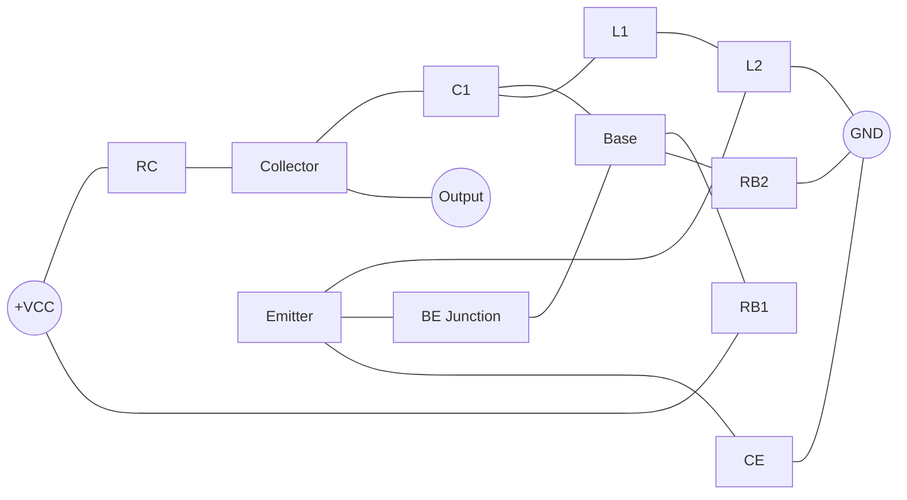

- **Frequency Determination**: By L1, L2 and C1 values (f = 1/2π√(L × C))
- **Feedback Mechanism**: Inductive voltage divider (L1 and L2)
- **Identifying Feature**: Tapped inductor or two inductors in series
- **Applications**: RF signal generation, radio transmitters, communication systems

**Mnemonic:** "Hartley Has Helpful Inductors"

## Question 2(a OR) [3 marks]

**State and explain Barkhausen criterion of oscillation.**

**Answer**:
Barkhausen criteria define conditions for sustained oscillations.

**The Two Main Criteria:**

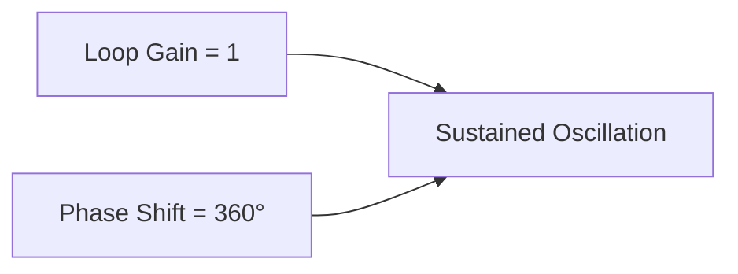

- **Loop Gain Condition**: |Aβ| = 1 (exactly 1 for sustained oscillation)
- **Phase Shift Condition**: ∠Aβ = 0° or 360° (signal reinforcement)
- **Practical Design**: Initial |Aβ| > 1, eventually stabilizes at |Aβ| = 1

**Mnemonic:** "For Oscillation: Unit Gain, Zero Phase"

## Question 2(b OR) [4 marks]

**Compare negative and positive feedback amplifier.**

**Answer**:
Feedback type dramatically changes amplifier behavior.

**Comparison Table:**

| Parameter | Negative Feedback | Positive Feedback |
|-----------|-------------------|-------------------|
| Gain | Decreases | Increases |
| Bandwidth | Increases | Decreases |
| Distortion | Reduces | Increases |
| Stability | Improves | Reduced (may oscillate) |
| Noise | Reduces | Amplifies |
| Applications | Stable amplifiers | Oscillators, triggers |
| Input/Output impedance | Controllable | Less predictable |

**Mnemonic:** "Negative Stabilizes, Positive Oscillates"

## Question 2(c OR) [7 marks]

**Draw and explain colpitt's oscillator.**

**Answer**:
Colpitt's oscillator uses capacitive voltage divider for feedback.

**Circuit Diagram:**

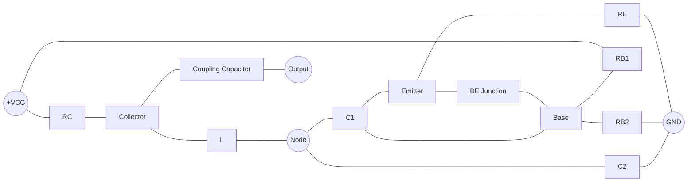

- **Frequency Determination**: By L, C1 and C2 values (f = 1/2π√(L × Ceq))
- **Feedback Mechanism**: Capacitive voltage divider (C1 and C2)
- **Identifying Feature**: Two capacitors in series across inductor
- **Advantage**: More stable frequency than Hartley

**Mnemonic:** "Colpitts Catches Capacitive Current"

## Question 3(a) [3 marks]

**Explain about DIAC.**

**Answer**:
DIAC (Diode for Alternating Current) is a bidirectional trigger diode.

**Symbol and Structure:**

```goat
    A       K
    |       |
    +-------+
    |       |
    +-------+
    |       |
    K       A
```

- **Operation**: Conducts in both directions after breakdown voltage
- **Characteristic**: Symmetrical V-I curve in both directions
- **Key Parameter**: Breakover voltage (typically 30-40V)
- **Main Application**: Triggering TRIACs in AC power control

**Mnemonic:** "DIAC: Double Direction Breakdown Device"

## Question 3(b) [4 marks]

**Explain triggering methods of SCR.**

**Answer**:
SCR can be triggered to conduct by several methods.

**Table: SCR Triggering Methods**

| Method | Description | Advantages | Limitations |
|--------|-------------|------------|-------------|
| Gate Triggering | Current pulse at gate | Most common, controllable | Requires control circuit |
| Temperature | High temperature | No external circuit | Uncontrolled, unreliable |
| Voltage | Exceeding breakover voltage | No external circuit | Stresses device, uncontrolled |
| dv/dt | Rapid voltage rise | Simple | Can cause unwanted triggering |
| Light | Photons hitting junction | Electrical isolation | Requires special packaging |

**Mnemonic:** "Gate Voltage Temperature Rate Light"

## Question 3(c) [7 marks]

**Draw symbol and construction of SCR. Also draw and explain V-I characteristic of SCR.**

**Answer**:
SCR (Silicon Controlled Rectifier) is a four-layer PNPN semiconductor device with three terminals.

**Symbol:**

```goat
      A (Anode)
      |
      |
      v
    -----
    |   |
G -->|   |
    |   |
    -----
      ^
      |
      |
      K (Cathode)
```

**Construction:**

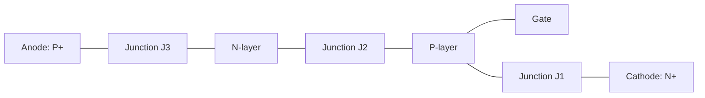

**V-I Characteristic:**

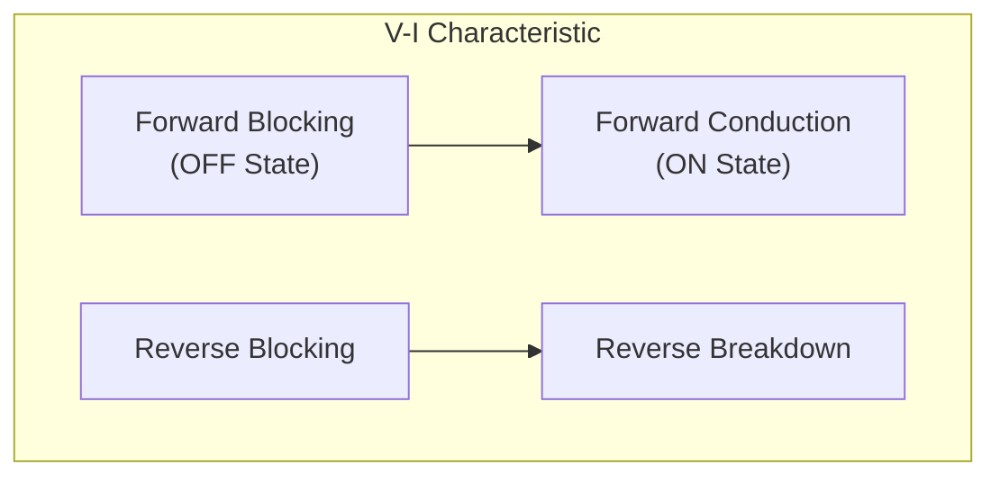

- **Forward Blocking**: Low current until triggering
- **Forward Conduction**: High current after triggering (latched)
- **Holding Current**: Minimum current to maintain conduction
- **Latching Current**: Minimum current to start latching
- **Reverse Blocking**: Blocks current in reverse direction

**Mnemonic:** "Trigger Once, Conducts Forever, Until Current Falls"

## Question 3(a OR) [3 marks]

**Explain about natural commutation technique of SCR.**

**Answer**:
Natural commutation turns off SCR without external circuit when AC current naturally reaches zero.

**Process Diagram:**


- **Principle**: Uses natural zero-crossing of AC supply
- **Advantage**: No additional commutation circuit required
- **Application**: AC power control circuits, light dimmers
- **Limitation**: Only works with AC supplies, not DC

**Mnemonic:** "Natural Commutation: Zero Current, Zero Effort"

## Question 3(b OR) [4 marks]

**Explain about Opto-couplers.**

**Answer**:
Opto-couplers provide electrical isolation using light transmission.

**Structure:**

```goat
  .---------.
  |  LED    |\\
  |         | \\
  '---------'  \\
                >
  .---------.  //
  |PhotoDet | //
  |         |//
  '---------'
```

**Table: Opto-coupler Types**

| Type | Photodetector | Speed | CTR | Applications |
|------|---------------|-------|-----|-------------|
| Standard | Phototransistor | Medium | 20-100% | General isolation |
| High-speed | Photodiode | Fast | 10-50% | Digital communication |
| TRIAC | Photo-TRIAC | Slow | N/A | AC power control |
| Linear | Photodarlington | Slow | 100-1000% | Analog signals |

- **CTR**: Current Transfer Ratio (output/input current)
- **Key Feature**: Complete electrical isolation between circuits
- **Benefits**: Noise immunity, voltage level shifting, safety

**Mnemonic:** "Light Leaps gaps Electrons Can't"

## Question 3(c OR) [7 marks]

**Draw symbol and construction of TRIAC. Also draw and explain V-I characteristic of TRIAC.**

**Answer**:
TRIAC (Triode for Alternating Current) is a bidirectional three-terminal semiconductor device.

**Symbol:**

```goat
    MT2
     |
     |
   -----
   |   |
G--|   |
   |   |
   -----
     |
     |
    MT1
```

**Construction:**


**V-I Characteristic:**

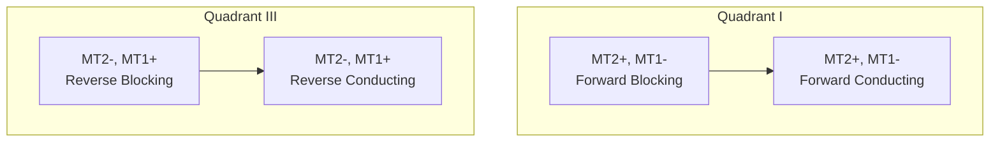

- **Bidirectional**: Conducts in both directions after triggering
- **Quadrant Operation**: Four triggering modes based on polarities
- **Applications**: AC power control, light dimmers, motor control
- **Advantage over SCR**: Controls both halves of AC cycle

**Mnemonic:** "TRIAC: Two-way Road In AC Circuits"

## Question 4(a) [3 marks]

**State characteristics of ideal Op-Amp.**

**Answer**:
An ideal Op-Amp has perfect characteristics that real Op-Amps approximate.

**Table: Ideal Op-Amp Characteristics**

| Parameter | Ideal Value | Meaning |
|-----------|-------------|---------|
| Open-loop gain | Infinite | Amplifies smallest input difference |
| Input impedance | Infinite | Draws no current from source |
| Output impedance | Zero | Can drive any load |
| Bandwidth | Infinite | Works at all frequencies |
| CMRR | Infinite | Rejects common-mode signals |
| Slew rate | Infinite | Instantaneous output change |
| Offset voltage | Zero | No output with zero input |

**Mnemonic:** "Infinite Gain, Impedance, Bandwidth; Zero Offset, Output Z"

## Question 4(b) [4 marks]

**Draw and explain monostable multivibrator using 555 timer IC.**

**Answer**:
Monostable multivibrator produces single pulse of fixed duration when triggered.

**Circuit:**

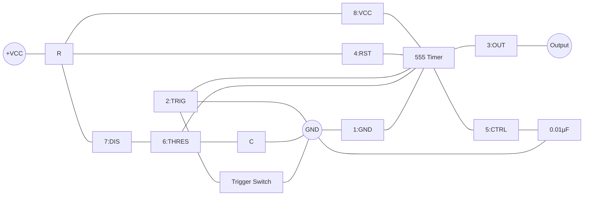

- **Operation**: Negative trigger produces output pulse with duration T = 1.1RC
- **Stable State**: Output LOW until triggered
- **Timing Control**: R and C values determine pulse width
- **Retriggering**: Can be retriggered after timeout

**Mnemonic:** "One Shot Wonder: Trigger Once, Pulse Once"

## Question 4(c) [7 marks]

**Draw and explain Inverting amplifier using IC 741. Also draw input and output waveforms.**

**Answer**:
Inverting amplifier reverses polarity while amplifying input signal.

**Circuit:**

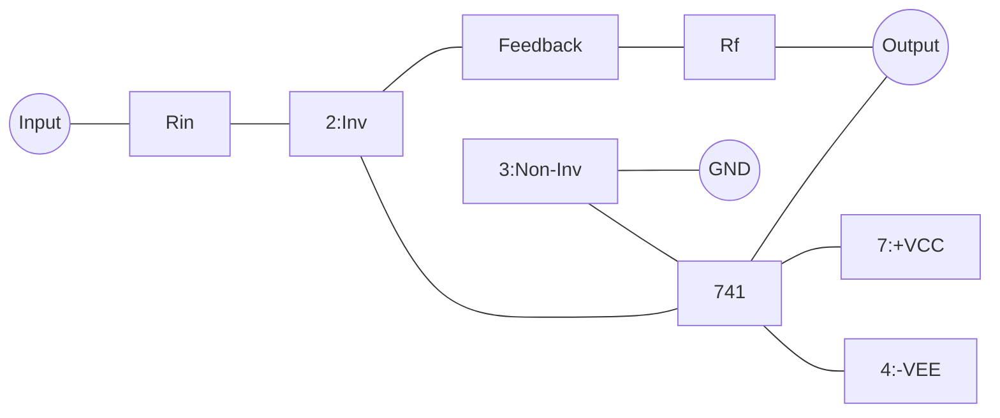

**Waveforms:**

```goat
Input:     /-\      /-\
          /   \    /   \
     ____/     \__/     \____

Output:   \    /\    /
           \  /  \  /
     ______\/____\/________
            
            180° phase shift
```

- **Gain Equation**: Av = -Rf/Rin (negative sign indicates inversion)
- **Input Impedance**: Equal to Rin
- **Virtual Ground**: Inverting input maintained near 0V
- **Bandwidth**: Depends on gain (higher gain = lower bandwidth)
- **Applications**: Signal conditioning, audio amplifiers

**Mnemonic:** "Flips and Multiplies by Rf/Rin"

## Question 4(a OR) [3 marks]

**Draw symbol and pin diagram of IC 741.**

**Answer**:
The 741 is a popular general-purpose operational amplifier.

**Symbol:**

```goat
        |\ 
        | \
Input --|+ \
        |   \
        |    |---- Output
        |   /
Input --|− /
        | /
        |/
```

**8-Pin DIP Package:**

```goat
       _______
      |       |
NC 1--|       |--8 Vcc+
      |       |
-IN 2--|  741  |--7 Output
      |       |
+IN 3--|       |--6 NC
      |       |
Vcc- 4--|_______|--5 Offset Null
```

- **Pin Functions**: Inverting input, non-inverting input, output, power supplies
- **Optional Pins**: Offset null, no connection
- **Power Supply**: Typically ±15V or ±12V dual supply

**Mnemonic:** "Never Invert Plus, Very Output Not Connected"

## Question 4(b OR) [4 marks]

**Explain term (i) CMRR (II) Slew Rate.**

**Answer**:
These parameters define operational amplifier performance limits.

**Table: Key Op-Amp Parameters**

| Parameter | Definition | Typical Value | Significance |
|-----------|------------|---------------|-------------|
| CMRR (Common Mode Rejection Ratio) | Ratio of differential gain to common-mode gain | 90-120 dB | Higher is better |
| Slew Rate | Maximum rate of output voltage change | 0.5-50 V/μs | Higher for faster signals |

- **CMRR Formula**: CMRR = 20 log₁₀(Ad/Acm) dB
- **CMRR Importance**: Rejects noise common to both inputs
- **Slew Rate Formula**: SR = dVo/dt (max)
- **Slew Rate Limitation**: Causes distortion at high frequencies

**Mnemonic:** "CMRR Crushes Common Noise, Slew Rate Shows Speed"

## Question 4(c OR) [7 marks]

**Draw and explain Astable multivibrator using 555 timer IC.**

**Answer**:
Astable multivibrator generates continuous square waves without external trigger.

**Circuit:**

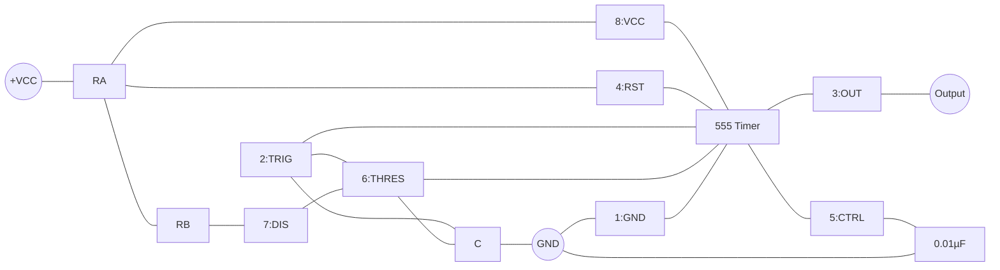

**Output Waveform:**

```goat
   HIGH  ____      ____      ____
        |    |    |    |    |    |
        |    |    |    |    |    |
   LOW  |____|    |____|    |____|
        
        | T1 | T2 | T1 | T2 | T1 |
```

- **Timing**: T1 = 0.693(RA+RB)C, T2 = 0.693(RB)C
- **Frequency**: f = 1.44/((RA+2RB)C)
- **Duty Cycle**: Can be adjusted by RA and RB
- **Applications**: Clock generators, LED flashers, tone generators

**Mnemonic:** "Always Oscillating, Never Stopping"

## Question 5(a) [3 marks]

**Draw basic block diagram of regulated power supply and explain it.**

**Answer**:
A regulated power supply converts AC to stable DC voltage.

**Block Diagram:**


- **Transformer**: Steps down AC voltage to required level
- **Rectifier**: Converts AC to pulsating DC (diode bridge)
- **Filter**: Smooths pulsating DC (capacitors)
- **Regulator**: Maintains constant output despite variations
- **Output**: Stable DC voltage for electronic circuits

**Mnemonic:** "Transformer Rectifies Filters Regulates"

## Question 5(b) [4 marks]

**Draw and explain summing amplifier using Op-amp.**

**Answer**:
Summing amplifier adds multiple input signals with weighted proportions.

**Circuit:**

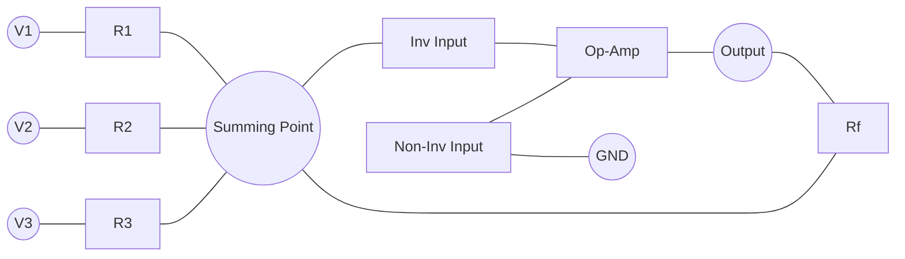

- **Output Equation**: Vout = -Rf(V1/R1 + V2/R2 + V3/R3)
- **Special Case**: When all resistors equal, Vout = -Rf/R × (V1 + V2 + V3)
- **Applications**: Audio mixing, analog computers, signal averaging
- **Variations**: Inverting and non-inverting configurations available

**Mnemonic:** "Multiple Inputs, One Output, Weighted Addition"

## Question 5(c) [7 marks]

**Draw and explain the circuit diagram of 3 terminal voltage regulator using IC LM317 with adjustable output voltage.**

**Answer**:
LM317 is a versatile adjustable voltage regulator with output range of 1.25V to 37V.

**Circuit:**

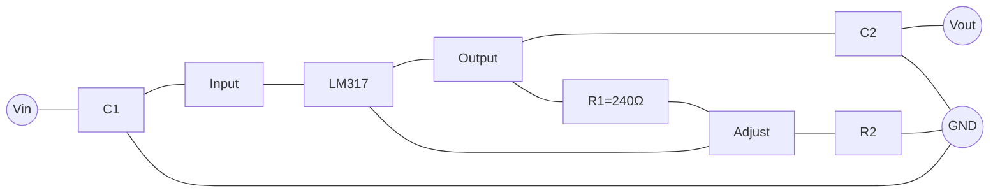

- **Output Voltage**: VOUT = 1.25V(1 + R2/R1)
- **Fixed Components**: R1 = 240Ω, reference voltage = 1.25V
- **Adjustability**: Changing R2 sets desired output voltage
- **Protection Features**: Current limiting, thermal shutdown
- **Applications**: Variable power supplies, battery chargers
- **Advantages**: Few external components, robust protection

**Mnemonic:** "Adjust with R2, Reference Stays at 1.25"

## Question 5(a OR) [3 marks]

**State full form of SMPS. Also state applications of SMPS.**

**Answer**:
SMPS stands for Switch Mode Power Supply, a modern efficient power conversion technology.

**Applications Table:**

| Application | SMPS Type | Advantages |
|-------------|-----------|------------|
| Computer Power Supply | ATX | High efficiency, multiple outputs |
| Mobile Phone Chargers | Flyback | Compact size, lightweight |
| LED Drivers | Buck | Efficient dimming capability |
| TV Power Supply | Forward | Good regulation, multiple outputs |
| Industrial Controls | Push-Pull | High power capability |
| Battery Chargers | Boost | Adjustable charging profiles |

- **Key Benefits**: High efficiency (80-95%), small size, lightweight
- **Drawbacks**: EMI generation, more complex circuits

**Mnemonic:** "Switch Mode Powers Small devices"

## Question 5(b OR) [4 marks]

**Draw and explain differentiator using Op-amp.**

**Answer**:
Differentiator produces output proportional to rate of change of input.

**Circuit:**

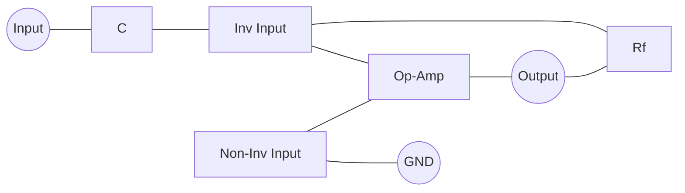

**Input/Output Waveforms:**

```goat
Input:      ___
           /   \
          /     \___
         /
________/

Output:   |
          |
     _____|_____
         / \
        /   \
```

- **Equation**: Vout = -RC × d(Vin)/dt
- **Function**: Converts square wave to spikes, triangle to square
- **Practical Issue**: High noise sensitivity
- **Modification**: Small resistor in series with C to limit high-frequency gain
- **Applications**: Waveshaping, rate-of-change detection

**Mnemonic:** "Rate of Change Goes In, Amplitude Comes Out"

## Question 5(c OR) [7 marks]

**Draw and explain the circuit diagram of -12 V regulated dc power supply.**

**Answer**:
A -12V regulated supply provides stable negative voltage for analog circuits.

**Circuit Diagram:**

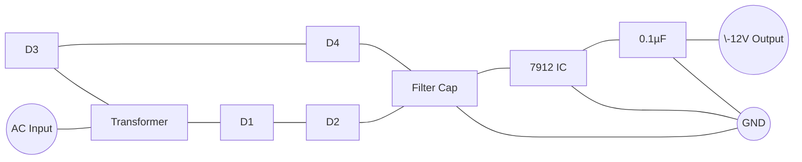

- **Working Principle**: Full-wave rectifier creates negative voltage
- **Components**: Transformer, bridge rectifier, filter capacitors, 7912 regulator
- **Regulator IC**: 7912 provides fixed -12V output with internal protection
- **Filter Capacitors**: Input capacitor filters ripple, output capacitor improves transient response
- **Applications**: Op-amp negative rail, analog circuits, audio equipment

**Mnemonic:** "Full Bridge, Big Capacitor, 7912 Regulates Negative"
