## પ્રશ્ન 1(અ) [3 ગુણ]

**અલગોરીધમ વ્યાખ્યાયિત કરો. અલગોરીધમનાં ફાયદા શું છે?**

**જવાબ**:
અલગોરીધમ એ ચોક્કસ સમસ્યાને ઉકેલવા માટે પગલાઓના ક્રમબદ્ધ સમૂહ અથવા નિયમોનો સેટ છે.

**અલગોરીધમના ફાયદા:**

- **સ્પષ્ટતા**: સ્પષ્ટ, અસંદિગ્ધ સૂચનાઓ પ્રદાન કરે છે
- **કાર્યક્ષમતા**: સમય અને સંસાધનોને અનુકૂળ બનાવવામાં મદદ કરે છે
- **પુન:ઉપયોગ**: સમાન સમસ્યાઓ માટે વારંવાર ઉપયોગ કરી શકાય છે
- **ચકાસણી**: અમલીકરણ પહેલાં પરીક્ષણ અને ડિબગ કરવું સરળ
- **સંદેશાવ્યવહાર**: ઉકેલને સંદેશાવ્યવહાર કરવા માટે બ્લુપ્રિન્ટ તરીકે કામ કરે છે

**મેમરી ટ્રીક:** "CERVC" (Clarity, Efficiency, Reusability, Verification, Communication)

## પ્રશ્ન 1(બ) [4 ગુણ]

**ફલોચાર્ટનો ઉપયોગ કરીને સમસ્યા ઉકેલવાના નિયમો શું છે? સાદું વ્યાજ શોધવા માટેનો ફલોચાર્ટ ડીઝાઈન કરો.**

**જવાબ**:
ફલોચાર્ટનો ઉપયોગ કરીને સમસ્યા ઉકેલવાના નિયમો:

- **યોગ્ય સિમ્બોલ**: વિવિધ ઓપરેશન માટે માનક સિમ્બોલનો ઉપયોગ કરવો
- **દિશાનો પ્રવાહ**: હંમેશા ઉપરથી નીચે, ડાબેથી જમણે સ્પષ્ટ પ્રવાહ જાળવવો
- **એક એન્ટ્રી/એક્ઝિટ**: સ્પષ્ટ શરૂઆત અને અંત બિંદુ હોવા જોઈએ
- **સ્પષ્ટતા**: પગલાં સ્પષ્ટ અને સંક્ષિપ્ત રાખવા
- **સુસંગતતા**: વિગતોનું સુસંગત સ્તર જાળવવું

**સાદું વ્યાજ ગણતરી માટેનો ફલોચાર્ટ:**

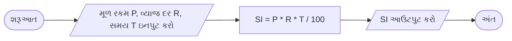

**મેમરી ટ્રીક:** "PDRSC" (Proper symbols, Direction flow, Required entry/exit, Simplicity, Consistency)

## પ્રશ્ન 1(ક) [7 ગુણ]

**પાયથોનનાં અસાઇમેંટ ઓપરટેરની યાદી બનાવો અને કોઈપણ ત્રણ અસાઇમેંટ ઓપરટેરોની કામગીરી દશાર્વવા માટે પાયથોન કોડ બનાવો.**

**જવાબ**:
પાયથોન અસાઇમેંટ ઓપરેટર્સ:

| ઓપરેટર | ઉદાહરણ | સમકક્ષ |
|----------|---------|---------------|
| =        | x = 5   | x = 5         |
| +=       | x += 5  | x = x + 5     |
| -=       | x -= 5  | x = x - 5     |
| *=       | x *= 5  | x = x * 5     |
| /=       | x /= 5  | x = x / 5     |
| %=       | x %= 5  | x = x % 5     |
| //=      | x //= 5 | x = x // 5    |
| **=      | x **= 5 | x = x ** 5    |
| &=       | x &= 5  | x = x & 5     |
| \|=      | x \|= 5 | x = x \| 5    |
| ^=       | x ^= 5  | x = x ^ 5     |
| >>=      | x >>= 5 | x = x >> 5    |
| <<=      | x <<= 5 | x = x << 5    |

**અસાઇમેંટ ઓપરેટર્સ દર્શાવતો કોડ:**

```python
# અસાઇમેંટ ઓપરેટર્સનું પ્રદર્શન
num = 10
print("પ્રારંભિક મૂલ્ય:", num)

# += ઓપરેટરનો ઉપયોગ
num += 5
print("+= 5 પછી:", num)  # આઉટપુટ: 15

# -= ઓપરેટરનો ઉપયોગ
num -= 3
print("-= 3 પછી:", num)  # આઉટપુટ: 12

# *= ઓપરેટરનો ઉપયોગ
num *= 2
print("*= 2 પછી:", num)  # આઉટપુટ: 24
```

**મેમરી ટ્રીક:** "VALUE" (Variable Assignment is Like Updating Existing values)

## પ્રશ્ન 1(ક) OR [7 ગુણ]

**પાયથોનનાં ડેટા ટાઇપ્સની યાદી બનાવો અને કોઈપણ ત્રણ ડેટા ટાઇપ્સને ઓળખવા માટેનો પાયથોન કોડ બનાવો.**

**જવાબ**:
પાયથોન ડેટા ટાઇપ્સ:

| ડેટા ટાઇપ | વર્ણન | ઉદાહરણ |
|-----------|-------------|---------|
| int | ઇન્ટીજર (પૂર્ણાંક સંખ્યાઓ) | 42 |
| float | ફ્લોટિંગ પોઇન્ટ (દશાંશ) | 3.14 |
| str | સ્ટ્રિંગ (ટેક્સ્ટ) | "Hello" |
| bool | બૂલિયન (True/False) | True |
| list | ક્રમિક, પરિવર્તનશીલ સંગ્રહ | [1, 2, 3] |
| tuple | ક્રમિક, અપરિવર્તનીય સંગ્રહ | (1, 2, 3) |
| set | અક્રમિક સંગ્રહ | {1, 2, 3} |
| dict | કી-વેલ્યુ જોડી | {"name": "John"} |
| complex | કોમ્પ્લેક્સ નંબર | 2+3j |
| NoneType | None દર્શાવે છે | None |

**ત્રણ ડેટા ટાઇપ્સ ઓળખવા માટેનો કોડ:**

```python
# ડેટા ટાઇપ્સ ઓળખવાનો પ્રોગ્રામ
def identify_data_type(value):
    data_type = type(value).__name__
    print(f"મૂલ્ય: {value}")
    print(f"ડેટા ટાઇપ: {data_type}")
    print("-" * 20)

# 3 અલગ-અલગ ડેટા ટાઇપ્સ સાથે ટેસ્ટિંગ
identify_data_type(42)            # Integer
identify_data_type(3.14)          # Float
identify_data_type("Hello World") # String

# આઉટપુટ:
# મૂલ્ય: 42
# ડેટા ટાઇપ: int
# --------------------
# મૂલ્ય: 3.14
# ડેટા ટાઇપ: float
# --------------------
# મૂલ્ય: Hello World
# ડેટા ટાઇપ: str
# --------------------
```

**મેમરી ટ્રીક:** "TYPE-ID" (Tell Your Python Elements - Identify Data)

## પ્રશ્ન 2(અ) [3 ગુણ]

**સ્યુડોકોડ વ્યાખ્યાયિત કરો. કોઈપણ બે સંખ્યા માંથી સૌથી નાની સંખ્યા શોધવા માટે સ્યુડોકોડ લખો.**

**જવાબ**:
સ્યુડોકોડ એ એલ્ગોરિધમનું ઉચ્ચ-સ્તરીય વર્ણન છે જે પ્રોગ્રામિંગ ભાષાના માળખાકીય સંકેતોનો ઉપયોગ કરે છે પરંતુ મશીન વાંચન કરતાં માનવ વાંચન માટે ડિઝાઇન કરેલ છે.

**બે સંખ્યાઓમાંથી સૌથી નાની શોધવા માટે સ્યુડોકોડ:**

```
BEGIN
    INPUT first_number, second_number
    IF first_number < second_number THEN
        smallest = first_number
    ELSE
        smallest = second_number
    END IF
    OUTPUT smallest
END
```

**મેમરી ટ્રીક:** "RISE" (Read Input, Select smallest, Echo result)

## પ્રશ્ન 2(બ) [4 ગુણ]

**યુઝર્સ પાસેથી ત્રણ ઇનપુટ વાંચો અને સંખ્યાઓની સરેરાશ શોધવા માટેનો પાયથોન કોડ વિકસાવો.**

**જવાબ**:

```python
# ત્રણ સંખ્યાઓની સરેરાશ ગણવા માટેનો પ્રોગ્રામ
# વપરાશકર્તા પાસેથી ત્રણ સંખ્યાઓ લો
num1 = float(input("પ્રથમ સંખ્યા દાખલ કરો: "))
num2 = float(input("બીજી સંખ્યા દાખલ કરો: "))
num3 = float(input("ત્રીજી સંખ્યા દાખલ કરો: "))

# સરેરાશની ગણતરી
average = (num1 + num2 + num3) / 3

# પરિણામ દર્શાવો
print(f"{num1}, {num2}, અને {num3}ની સરેરાશ: {average}")
```

**આકૃતિ:**

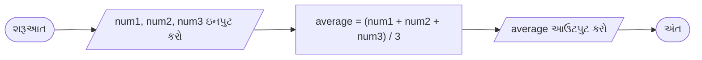

**મેમરી ટ્રીક:** "I-ADD-D" (Input three, ADD them up, Divide by 3)

## પ્રશ્ન 2(ક) [7 ગુણ]

**દાખલ કરેલ સંખ્યા prime છે કે નહીં તે બતાવવા પાયથોન કોડ લખો.**

**જવાબ**:

```python
# સંખ્યા પ્રાઇમ છે કે નહીં તે તપાસવાનો પ્રોગ્રામ
# વપરાશકર્તા પાસેથી સંખ્યા લો
num = int(input("એક સંખ્યા દાખલ કરો: "))

# 2થી ઓછી સંખ્યા છે કે નહીં તપાસો
if num < 2:
    print(f"{num} એક પ્રાઇમ સંખ્યા નથી")
else:
    # is_prime ને True તરીકે આરંભો
    is_prime = True
    
    # 2 થી sqrt(num) સુધી તપાસો
    for i in range(2, int(num**0.5) + 1):
        if num % i == 0:
            is_prime = False
            break
    
    # પરિણામ દર્શાવો
    if is_prime:
        print(f"{num} એક પ્રાઇમ સંખ્યા છે")
    else:
        print(f"{num} એક પ્રાઇમ સંખ્યા નથી")
```

**આકૃતિ:**

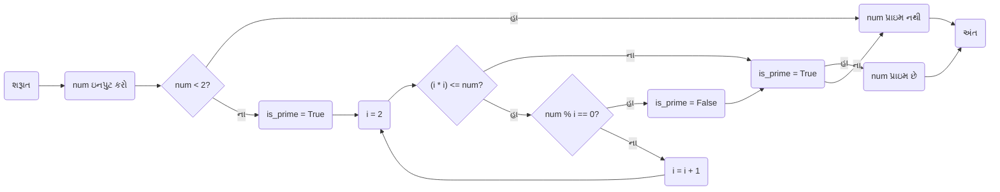

**મેમરી ટ્રીક:** "PRIME" (Positive number, Range check from 2 to √n, If divisible it's Multiple, Else it's prime)

## પ્રશ્ન 2(અ) OR [3 ગુણ]

**ફલોચાર્ટ અને એલ્ગોરિધમ વચ્ચેનો તફાવત લખો.**

**જવાબ**:

| ફલોચાર્ટ | એલ્ગોરિધમ |
|------------|-----------|
| માનક સિમ્બોલ અને આકારોનો ઉપયોગ કરીને **દૃશ્ય પ્રતિનિધિત્વ** | **લેખિત વર્ણન** માળખાકીય ભાષાનો ઉપયોગ કરીને |
| ગ્રાફિકલ પ્રકૃતિને કારણે **સમજવું સરળ** | સિન્ટેક્સ અને શબ્દાવલીનું જ્ઞાન જરૂરી |
| **તાર્કિક પ્રવાહ** અને સંબંધોને સ્પષ્ટ રીતે દર્શાવે | ક્રમિક ક્રમમાં **વિગતવાર પગલાં** પ્રદાન કરે |
| બનાવવા માટે **સમય-લેતી** પરંતુ સમજવા માટે સરળ | **ઝડપથી ડ્રાફ્ટ** પરંતુ સમજવામાં મુશ્કેલ હોઈ શકે |
| ફેરફાર કરવા કે અપડેટ કરવા વધુ મુશ્કેલ | ફેરફાર કરવા કે અપડેટ કરવા વધુ સરળ |

**મેમરી ટ્રીક:** "VITAL" (Visual vs Textual, Interpretation ease, Time to create, Alteration flexibility, Logical representation)

## પ્રશ્ન 2(બ) OR [4 ગુણ]

**નીચેનાં કોડનું આઉટપુટ શું છે?**

```python
x=10
y=2
print (x*y)
print (x ** y)
print (x//y)
print (x % y)
```

**જવાબ**:

| ઓપરેશન | સમજૂતી | આઉટપુટ |
|-----------|-------------|--------|
| x*y | ગુણાકાર: 10 × 2 | 20 |
| x**y | ઘાતાંક: 10² | 100 |
| x//y | પૂર્ણાંક ભાગાકાર: 10 ÷ 2 | 5 |
| x%y | મોડ્યુલસ (શેષ): 10 ÷ 2 | 0 |

**મેમરી ટ્રીક:** "MEMO" (Multiply, Exponent, Modulo, Operations)

## પ્રશ્ન 2(ક) OR [7 ગુણ]

**નીચેની પેટર્ન દર્શાવવા પાયથોન કોડ લખો:**

```
A)                    B)
1                    * * * *
1 2                  * * *
1 2 3                * *
1 2 3 4              *
```

**જવાબ**:

```python
# પેટર્ન A: સંખ્યા પેટર્ન
print("પેટર્ન A:")
for i in range(1, 5):
    for j in range(1, i + 1):
        print(j, end=" ")
    print()

# પેટર્ન B: તારા પેટર્ન
print("\nપેટર્ન B:")
for i in range(4, 0, -1):
    for j in range(i):
        print("*", end=" ")
    print()
```

**આકૃતિ:**

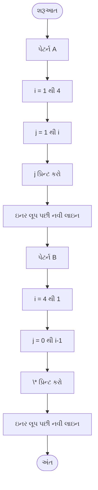

**મેમરી ટ્રીક:** "LOOP-NED" (Loop Outer, Order Pattern, Nested loops, End with newline, Display)

## પ્રશ્ન 3(અ) [3 ગુણ]

**જરૂરી ઉદાહરણો સાથે break statementનાં ઉપયોગનું વર્ણન કરો.**

**જવાબ**:
break સ્ટેટમેન્ટનો ઉપયોગ લૂપને વચ્ચેથી સમાપ્ત કરવા માટે થાય છે, જ્યારે કોઈ ચોક્કસ શરત પૂરી થાય.

**ઉદાહરણ:**

```python
# લિસ્ટમાં પ્રથમ વિષમ સંખ્યા શોધવી
numbers = [2, 4, 6, 7, 8, 10]
for num in numbers:
    if num % 2 != 0:
        print(f"વિષમ સંખ્યા મળી: {num}")
        break
    print(f"{num} તપાસી રહ્યા છીએ")
```

**આઉટપુટ:**

```
2 તપાસી રહ્યા છીએ
4 તપાસી રહ્યા છીએ
6 તપાસી રહ્યા છીએ
વિષમ સંખ્યા મળી: 7
```

**મેમરી ટ્રીક:** "EXIT" (EXecute until condition, Immediately Terminate)

## પ્રશ્ન 3(બ) [4 ગુણ]

**યોગ્ય ઉદાહરણ સાથે if...else statement સમજાવો.**

**જવાબ**:
if...else સ્ટેટમેન્ટ એ એક કન્ડિશનલ સ્ટેટમેન્ટ છે જે નિર્દિષ્ટ શરત True કે False હોવાના આધારે અલગ-અલગ કોડ બ્લોક્સ એક્ઝિક્યુટ કરે છે.

**સિન્ટેક્સ:**

```python
if શરત:
    # જો શરત True હોય તો આ કોડ એક્ઝિક્યુટ થશે
else:
    # જો શરત False હોય તો આ કોડ એક્ઝિક્યુટ થશે
```

**ઉદાહરણ:**

```python
# સંખ્યા સમ છે કે વિષમ તે તપાસવું
number = int(input("એક સંખ્યા દાખલ કરો: "))

if number % 2 == 0:
    print(f"{number} એક સમ સંખ્યા છે")
else:
    print(f"{number} એક વિષમ સંખ્યા છે")
```

**આકૃતિ:**


**મેમરી ટ્રીક:** "CITE" (Check condition, If True Execute this, Else execute that)

## પ્રશ્ન 3(ક) [7 ગુણ]

**0 થી N સંખ્યા સુધીની ફીબોનાકી શ્રેણી પ્રિન્ટ કરવા માટે યુઝર ડેફાઇન ફંકશન બનાવો જેમાં N એ પૂર્ણાંક સંખ્યા છે અને આરગયુમેન્ટ તરીકે પાસ થાય છે.**

**જવાબ**:

```python
# ફીબોનાકી શ્રેણી પ્રિન્ટ કરવા માટેનું ફંકશન
def print_fibonacci(n):
    """
    0 થી n સુધીની ફીબોનાકી શ્રેણી પ્રિન્ટ કરે છે
    આરગયુમેન્ટ:
        n: ઉપરની લિમિટ (inclusive)
    """
    # પ્રથમ બે પદો ઇનિશિયલાઇઝ કરો
    a, b = 0, 1
    
    # n માન્ય છે કે નહીં તે તપાસો
    if n < 0:
        print("કૃપા કરીને એક હકારાત્મક સંખ્યા દાખલ કરો")
        return
    
    # ફીબોનાકી શ્રેણી પ્રિન્ટ કરો
    print(n, "સુધીની ફીબોનાકી શ્રેણી:")
    
    if n >= 0:
        print(a, end=" ")  # પ્રથમ પદ પ્રિન્ટ કરો
    
    if n >= 1:
        print(b, end=" ")  # બીજો પદ પ્રિન્ટ કરો
    
    # બાકીની શ્રેણી બનાવો અને પ્રિન્ટ કરો
    while a + b <= n:
        next_term = a + b
        print(next_term, end=" ")
        a, b = b, next_term

# ફંકશનનું ટેસ્ટિંગ
print_fibonacci(55)
```

**આકૃતિ:**

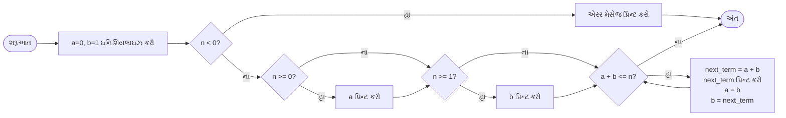

**મેમરી ટ્રીક:** "FIBER" (First terms set, Initialize variables, Build next term, Echo results, Repeat until limit)

## પ્રશ્ન 3(અ) OR [3 ગુણ]

**જરૂરી ઉદાહરણો સાથે continue statementનાં ઉપયોગનું વર્ણન કરો.**

**જવાબ**:
continue સ્ટેટમેન્ટનો ઉપયોગ લૂપની વર્તમાન ઇટરેશન છોડીને આગળની ઇટરેશન પર જવા માટે થાય છે.

**ઉદાહરણ:**

```python
# 1 થી 10 સુધીની માત્ર વિષમ સંખ્યાઓ પ્રિન્ટ કરવી
for i in range(1, 11):
    if i % 2 == 0:
        continue  # સમ સંખ્યાઓ છોડી દો
    print(i)
```

**આઉટપુટ:**

```
1
3
5
7
9
```

**મેમરી ટ્રીક:** "SKIP" (Skip current iteration, Keep looping, Ignore remaining statements, Proceed to next iteration)

## પ્રશ્ન 3(બ) OR [4 ગુણ]

**ઉદાહરણ સાથે For loop statement સમજાવો.**

**જવાબ**:
For લૂપનો ઉપયોગ કોઈ સિક્વન્સ (જેમ કે લિસ્ટ, ટપલ, સ્ટ્રિંગ) કે અન્ય ઇટરેબલ ઓબ્જેક્ટ પર ઇટરેશન કરવા અને દરેક આઇટમ માટે કોડનો બ્લોક એક્ઝિક્યુટ કરવા માટે થાય છે.

**સિન્ટેક્સ:**

```python
for વેરિએબલ in સિક્વન્સ:
    # દરેક આઇટમ માટે એક્ઝિક્યુટ થનાર કોડ
```

**ઉદાહરણ:**

```python
# 1 થી 5 સુધીની સંખ્યાઓના વર્ગ પ્રિન્ટ કરવા
for num in range(1, 6):
    square = num ** 2
    print(f"{num}નો વર્ગ {square} છે")
```

**આઉટપુટ:**

```
1નો વર્ગ 1 છે
2નો વર્ગ 4 છે
3નો વર્ગ 9 છે
4નો વર્ગ 16 છે
5નો વર્ગ 25 છે
```

**આકૃતિ:**

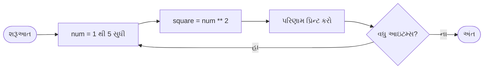

**મેમરી ટ્રીક:** "FIRE" (For each Item, Run commands, Execute until end)

## પ્રશ્ન 3(ક) OR [7 ગુણ]

**યુઝર ડિફાઇન ફંકશનની મદદથી આપેલ નંબર આર્મસ્ટ્રોંગ નંબર છે કે પેલિન્ડ્રોમ તે નિર્ધારિત કરવા પાયથોન કોડ લખો.**

**જવાબ**:

```python
# સંખ્યા આર્મસ્ટ્રોંગ નંબર છે કે નહીં તે તપાસવાનું ફંકશન
def is_armstrong(num):
    # ડિજિટ્સની સંખ્યા ગણવા માટે સ્ટ્રિંગમાં રૂપાંતરિત કરો
    num_str = str(num)
    n = len(num_str)
    
    # દરેક ડિજિટને n ઘાત પર ઊંચકી તેનો સરવાળો કરો
    sum_of_powers = sum(int(digit) ** n for digit in num_str)
    
    # સરવાળો મૂળ સંખ્યા સાથે સરખાવો
    return sum_of_powers == num

# સંખ્યા પેલિન્ડ્રોમ છે કે નહીં તે તપાસવાનું ફંકશન
def is_palindrome(num):
    # સ્ટ્રિંગમાં રૂપાંતરિત કરો
    num_str = str(num)
    
    # સ્ટ્રિંગ તેના રિવર્સ સાથે સરખાવો
    return num_str == num_str[::-1]

# બંને સ્થિતિઓ તપાસવા માટેનું મુખ્ય ફંકશન
def check_number(num):
    if is_armstrong(num):
        print(f"{num} એક આર્મસ્ટ્રોંગ નંબર છે")
    else:
        print(f"{num} એક આર્મસ્ટ્રોંગ નંબર નથી")
    
    if is_palindrome(num):
        print(f"{num} એક પેલિન્ડ્રોમ છે")
    else:
        print(f"{num} એક પેલિન્ડ્રોમ નથી")

# ફંકશનનું ટેસ્ટિંગ
number = int(input("એક સંખ્યા દાખલ કરો: "))
check_number(number)
```

**આકૃતિ:**

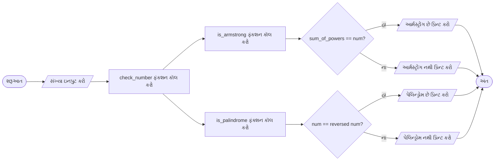

**મેમરી ટ્રીક:** "APC" (Armstrong check: Power sum of digits, Palindrome check: Compare with reverse)

## પ્રશ્ન 4(અ) [3 ગુણ]

**સ્કેન કરેલ નંબર even છે કે odd તે શોધવા પાયથોન કોડ વિકસાવો અને યોગ્ય મેસેજ પ્રિન્ટ કરો.**

**જવાબ**:

```python
# સંખ્યા સમ છે કે વિષમ તે તપાસવાનો પ્રોગ્રામ
# વપરાશકર્તા પાસેથી સંખ્યા લો
number = int(input("એક સંખ્યા દાખલ કરો: "))

# સંખ્યા સમ છે કે વિષમ તે તપાસો
if number % 2 == 0:
    print(f"{number} એક સમ સંખ્યા છે")
else:
    print(f"{number} એક વિષમ સંખ્યા છે")
```

**આકૃતિ:**

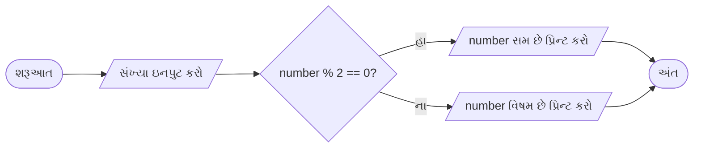

**મેમરી ટ્રીક:** "MODE" (Modulo Operation Determines Even-odd)

## પ્રશ્ન 4(બ) [4 ગુણ]

**ફંકશનની વ્યાખ્યા આપો. યુઝર ડિફાઇન ફંકશન યોગ્ય ઉદાહરણ આપી સમજાવો.**

**જવાબ**:
ફંકશન એ કોડનો એવો બ્લોક છે જે ચોક્કસ કાર્ય કરવા માટે વ્યવસ્થિત અને ફરીથી ઉપયોગ કરી શકાય છે. યુઝર-ડિફાઇન ફંકશન એ પ્રોગ્રામર દ્વારા બનાવવામાં આવેલા ફંકશન છે જે કસ્ટમ ઓપરેશન કરે છે.

**યુઝર-ડિફાઇન ફંકશનના ઘટકો:**

- **def કીવર્ડ**: ફંકશન વ્યાખ્યાની શરૂઆત દર્શાવે છે
- **ફંકશન નામ**: ફંકશન માટે ઓળખકર્તા
- **પેરામીટર્સ**: ઇનપુટ વેલ્યુઝ (વૈકલ્પિક)
- **ડોકસ્ટ્રિંગ**: ફંકશનનું વર્ણન (વૈકલ્પિક)
- **ફંકશન બોડી**: એક્ઝિક્યુટ થનાર કોડ
- **રિટર્ન સ્ટેટમેન્ટ**: આઉટપુટ વેલ્યુ (વૈકલ્પિક)

**ઉદાહરણ:**

```python
# લંબચોરસનું ક્ષેત્રફળ ગણવા માટેનું યુઝર-ડિફાઇન ફંકશન
def calculate_area(length, width):
    """
    લંબચોરસનું ક્ષેત્રફળ ગણે છે
    આરગ્યુમેન્ટ્સ:
        length: લંબચોરસની લંબાઈ
        width: લંબચોરસની પહોળાઈ
    રિટર્ન:
        લંબચોરસનું ક્ષેત્રફળ
    """
    area = length * width
    return area

# ફંકશન કૉલ કરો
result = calculate_area(5, 3)
print(f"લંબચોરસનું ક્ષેત્રફળ: {result}")
```

**મેમરી ટ્રીક:** "DRAPE" (Define function, Receive parameters, Acquire result, Process data, End with return)

## પ્રશ્ન 4(ક) [7 ગુણ]

**વિવિધ સ્ટ્રિંગ ઓપરેશનની યાદી બનાવો અને કોઈપણ ત્રણ ઉદાહરણનો ઉપયોગ કરીને સમજાવો.**

**જવાબ**:
પાયથોનમાં સ્ટ્રિંગ ઓપરેશન્સ:

| ઓપરેશન | વર્ણન |
|-----------|-------------|
| Concatenation | + નો ઉપયોગ કરીને સ્ટ્રિંગ્સ જોડવી |
| Repetition | * નો ઉપયોગ કરીને સ્ટ્રિંગ રિપીટ કરવી |
| Indexing | પોઝિશન દ્વારા કેરેક્ટર એક્સેસ કરવા |
| Slicing | સ્ટ્રિંગનો ભાગ એક્સટ્રેક્ટ કરવો |
| Methods (len, upper, lower, વગેરે) | સ્ટ્રિંગ મેનિપ્યુલેશન માટે બિલ્ટ-ઇન ફંકશન્સ |
| Membership Testing | સ્ટ્રિંગમાં સબસ્ટ્રિંગ છે કે નહીં તે તપાસવું |
| Formatting | ફોર્મેટેડ સ્ટ્રિંગ્સ બનાવવી |
| Escape Sequences | \ થી શરૂ થતા સ્પેશિયલ કેરેક્ટર્સ |

**ત્રણ સ્ટ્રિંગ ઓપરેશન્સ વિથ ઉદાહરણ:**

1. **સ્ટ્રિંગ Concatenation:**

```python
first_name = "John"
last_name = "Doe"
full_name = first_name + " " + last_name
print(full_name)  # આઉટપુટ: John Doe
```

2. **સ્ટ્રિંગ Slicing:**

```python
message = "Python Programming"
print(message[0:6])    # આઉટપુટ: Python
print(message[7:])     # આઉટપુટ: Programming
print(message[-11:])   # આઉટપુટ: Programming
```

3. **સ્ટ્રિંગ Methods:**

```python
text = "python programming"
print(text.upper())    # આઉટપુટ: PYTHON PROGRAMMING
print(text.capitalize())  # આઉટપુટ: Python programming
print(text.replace("python", "Java"))  # આઉટપુટ: Java programming
```

**મેમરી ટ્રીક:** "CSM" (Concatenate strings, Slice portions, Manipulate with methods)

## પ્રશ્ન 4(અ) OR [3 ગુણ]

**પોઝિટિવ અને નેગેટિવ નંબર તપાસવા પાયથોન કોડ બનાવો.**

**જવાબ**:

```python
# સંખ્યા પોઝિટિવ છે કે નેગેટિવ તે તપાસવાનો પ્રોગ્રામ
# વપરાશકર્તા પાસેથી સંખ્યા લો
number = float(input("એક સંખ્યા દાખલ કરો: "))

# સંખ્યા પોઝિટિવ, નેગેટિવ, કે શૂન્ય છે તે તપાસો
if number > 0:
    print(f"{number} એક પોઝિટિવ સંખ્યા છે")
elif number < 0:
    print(f"{number} એક નેગેટિવ સંખ્યા છે")
else:
    print("સંખ્યા શૂન્ય છે")
```

**આકૃતિ:**

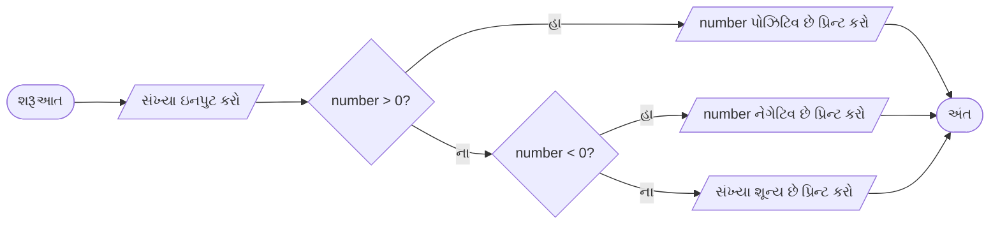

**મેમરી ટ્રીક:** "SIGN" (See If Greater than 0, Negative otherwise)

## પ્રશ્ન 4(બ) OR [4 ગુણ]

**યોગ્ય ઉદાહરણો સાથે local અને global વેરિએબલ સમજાવો.**

**જવાબ**:
પાયથોનમાં વેરિએબલ્સના અલગ-અલગ સ્કોપ્સ હોઈ શકે છે:

| વેરિએબલ પ્રકાર | વર્ણન |
|---------------|-------------|
| Local Variable | ફંકશનની અંદર વ્યાખ્યાયિત અને માત્ર તે ફંકશનની અંદર જ એક્સેસિબલ |
| Global Variable | ફંકશનની બહાર વ્યાખ્યાયિત અને પ્રોગ્રામના તમામ ભાગમાં એક્સેસિબલ |

**ઉદાહરણ:**

```python
# Global વેરિએબલ
count = 0  # આ Global વેરિએબલ છે

def update_count():
    # Local વેરિએબલ
    local_var = 5  # આ Local વેરિએબલ છે
    
    # ફંકશનની અંદર Global વેરિએબલ એક્સેસ કરવો
    global count
    count += 1
    
    print(f"Local વેરિએબલ: {local_var}")
    print(f"Global વેરિએબલ (ફંકશનની અંદર): {count}")
    
# ફંકશન કૉલ કરો
update_count()

# ફંકશનની બહાર વેરિએબલ એક્સેસ કરવા
print(f"Global વેરિએબલ (ફંકશનની બહાર): {count}")

# આ અનકમેન્ટ કરવાથી એરર આવશે
# print(local_var)  # NameError: name 'local_var' is not defined
```

**આઉટપુટ:**

```
Local વેરિએબલ: 5
Global વેરિએબલ (ફંકશનની અંદર): 1
Global વેરિએબલ (ફંકશનની બહાર): 1
```

**મેમરી ટ્રીક:** "SCOPE" (Some variables Confined to function Only, Program-wide Exposure for others)

## પ્રશ્ન 4(ક) OR [7 ગુણ]

**વિવિધ લિસ્ટ ઓપરેશનની યાદી બનાવો અને કોઈપણ ત્રણ ઉદાહરણનો ઉપયોગ કરીને સમજાવો.**

**જવાબ**:
પાયથોનમાં લિસ્ટ ઓપરેશન્સ:

| ઓપરેશન | વર્ણન |
|-----------|-------------|
| લિસ્ટ બનાવવી | સ્ક્વેર બ્રેકેટ્સ [] નો ઉપયોગ |
| ઇન્ડેક્સિંગ | પોઝિશન દ્વારા એલિમેન્ટ એક્સેસ કરવા |
| સ્લાઇસિંગ | લિસ્ટના ભાગો એક્સટ્રેક્ટ કરવા |
| એપેન્ડ | છેલ્લે એલિમેન્ટ ઉમેરવા |
| ઇન્સર્ટ | ચોક્કસ પોઝિશન પર એલિમેન્ટ ઉમેરવા |
| રિમૂવ | ચોક્કસ એલિમેન્ટ દૂર કરવા |
| પોપ | એલિમેન્ટ દૂર કરવું અને પાછું મેળવવું |
| સોર્ટ | લિસ્ટ એલિમેન્ટ્સ ઓર્ડર કરવા |
| રિવર્સ | લિસ્ટનો ક્રમ ઊલટાવવો |
| એક્સ્ટેન્ડ | લિસ્ટ્સ જોડવી |
| લિસ્ટ કોમ્પ્રિહેન્શન્સ | એક્સપ્રેશન્સનો ઉપયોગ કરીને લિસ્ટ બનાવવી |

**ત્રણ લિસ્ટ ઓપરેશન્સ વિથ ઉદાહરણ:**

1. **લિસ્ટ ઇન્ડેક્સિંગ અને સ્લાઇસિંગ:**

```python
fruits = ["apple", "banana", "cherry", "orange", "kiwi"]
print(fruits[1])        # આઉટપુટ: banana
print(fruits[-1])       # આઉટપુટ: kiwi
print(fruits[1:4])      # આઉટપુટ: ['banana', 'cherry', 'orange']
```

2. **લિસ્ટ મેથડ્સ (append, insert, remove):**

```python
numbers = [1, 2, 3]
numbers.append(4)       # છેલ્લે 4 ઉમેરો
print(numbers)          # આઉટપુટ: [1, 2, 3, 4]

numbers.insert(0, 0)    # પોઝિશન 0 પર 0 ઇન્સર્ટ કરો
print(numbers)          # આઉટપુટ: [0, 1, 2, 3, 4]

numbers.remove(2)       # 2 વેલ્યુ ધરાવતો એલિમેન્ટ દૂર કરો
print(numbers)          # આઉટપુટ: [0, 1, 3, 4]
```

3. **લિસ્ટ કોમ્પ્રિહેન્શન્સ:**

```python
# સ્ક્વેર્સની લિસ્ટ બનાવવી
squares = [x**2 for x in range(1, 6)]
print(squares)  # આઉટપુટ: [1, 4, 9, 16, 25]

# સમ સંખ્યાઓ ફિલ્ટર કરવી
numbers = [1, 2, 3, 4, 5, 6, 7, 8, 9, 10]
evens = [x for x in numbers if x % 2 == 0]
print(evens)    # આઉટપુટ: [2, 4, 6, 8, 10]
```

**મેમરી ટ્રીક:** "AIM" (Access with index, Insert/modify elements, Make using comprehensions)

## પ્રશ્ન 5(અ) [3 ગુણ]

**લિસ્ટમાં આપેલ બે એલિમેન્ટ્સને સ્વેપ કરવા પાયથોન કોડ લખો.**

**જવાબ**:

```python
# લિસ્ટમાં બે એલિમેન્ટ્સને સ્વેપ કરવાનો પ્રોગ્રામ
def swap_elements(my_list, pos1, pos2):
    """
    લિસ્ટમાં pos1 અને pos2 પોઝિશન પરના એલિમેન્ટ્સને સ્વેપ કરે છે
    """
    # પોઝિશન્સ માન્ય છે કે નહીં તે તપાસો
    if 0 <= pos1 < len(my_list) and 0 <= pos2 < len(my_list):
        # એલિમેન્ટ્સ સ્વેપ કરો
        my_list[pos1], my_list[pos2] = my_list[pos2], my_list[pos1]
        return True
    else:
        return False

# ઉદાહરણ
numbers = [10, 20, 30, 40, 50]
print("મૂળ લિસ્ટ:", numbers)

# પોઝિશન 1 અને 3 પરના એલિમેન્ટ્સ સ્વેપ કરો
if swap_elements(numbers, 1, 3):
    print("સ્વેપ પછી:", numbers)
else:
    print("અમાન્ય પોઝિશન્સ")
```

**આઉટપુટ:**

```
મૂળ લિસ્ટ: [10, 20, 30, 40, 50]
સ્વેપ પછી: [10, 40, 30, 20, 50]
```

**મેમરી ટ્રીક:** "SWAP" (Select positions, Watch boundaries, Assign simultaneously, Print result)

## પ્રશ્ન 5(બ) [4 ગુણ]

**પાયથોનનાં Math મોડ્યુલ અને random મોડ્યુલ ઉદાહરણનાં ઉપયોગ કરીને સમજાવો.**

**જવાબ**:
Math અને random મોડ્યુલ મેથેમેટિકલ ઓપરેશન્સ અને રેન્ડમ નંબર જનરેશન માટેના ફંકશન્સ પ્રદાન કરે છે.

**Math મોડ્યુલ:**

```python
import math

# કોન્સ્ટન્ટ્સ
print(math.pi)          # આઉટપુટ: 3.141592653589793
print(math.e)           # આઉટપુટ: 2.718281828459045

# મેથેમેટિકલ ફંકશન્સ
print(math.sqrt(16))    # આઉટપુટ: 4.0
print(math.ceil(4.2))   # આઉટપુટ: 5
print(math.floor(4.8))  # આઉટપુટ: 4
print(math.pow(2, 3))   # આઉટપુટ: 8.0
```

**Random મોડ્યુલ:**

```python
import random

# 0 અને 1 વચ્ચેની રેન્ડમ ફ્લોટ
print(random.random())       # આઉટપુટ: 0.123... (રેન્ડમ)

# રેન્જની અંદર રેન્ડમ ઇન્ટીજર
print(random.randint(1, 10)) # આઉટપુટ: 7 (1 અને 10 વચ્ચે રેન્ડમ)

# સીક્વન્સમાંથી રેન્ડમ પસંદગી
colors = ["red", "green", "blue"]
print(random.choice(colors)) # આઉટપુટ: "green" (રેન્ડમ)

# લિસ્ટને શફલ કરવી
numbers = [1, 2, 3, 4, 5]
random.shuffle(numbers)
print(numbers)               # આઉટપુટ: [3, 1, 5, 2, 4] (રેન્ડમ)
```

**મેમરી ટ્રીક:** "MR-CS" (Math for Calculations, Random for Choice and Shuffling)

## પ્રશ્ન 5(ક) [7 ગુણ]

**Tuple ફંકશન અને ઓપરેશન દર્શાવવા પાયથોન કોડ લખો.**

**જવાબ**:

```python
# Tuple ફંકશન અને ઓપરેશનનું પ્રદર્શન

# Tuples બનાવવા
empty_tuple = ()
single_item_tuple = (1,)  # અહીં કોમા અગત્યનો છે
mixed_tuple = (1, "Hello", 3.14, True)
nested_tuple = (1, 2, (3, 4))

# Tuple એલિમેન્ટને એક્સેસ કરવા
print("એલિમેન્ટ એક્સેસ કરવા:")
print(mixed_tuple[0])      # આઉટપુટ: 1
print(mixed_tuple[-1])     # આઉટપુટ: True
print(nested_tuple[2][0])  # આઉટપુટ: 3

# Tuple સ્લાઇસિંગ
print("\nTuple સ્લાઇસિંગ:")
print(mixed_tuple[1:3])    # આઉટપુટ: ("Hello", 3.14)

# Tuple જોડવા (concatenation)
tuple1 = (1, 2, 3)
tuple2 = (4, 5, 6)
tuple3 = tuple1 + tuple2
print("\nજોડાયેલ tuple:", tuple3)  # આઉટપુટ: (1, 2, 3, 4, 5, 6)

# Tuple રિપિટિશન
repeated_tuple = tuple1 * 3
print("\nરિપીટ થયેલ tuple:", repeated_tuple)  # આઉટપુટ: (1, 2, 3, 1, 2, 3, 1, 2, 3)

# Tuple મેથડ્સ
numbers = (1, 2, 3, 2, 4, 2)
print("\n2ની સંખ્યા:", numbers.count(2))  # આઉટપુટ: 3
print("3નો ઇન્ડેક્સ:", numbers.index(3))    # આઉટપુટ: 2

# Tuple અનપૅકિંગ
print("\nTuple અનપૅકિંગ:")
x, y, z = (10, 20, 30)
print(f"x={x}, y={y}, z={z}")  # આઉટપુટ: x=10, y=20, z=30

# Tupleમાં એલિમેન્ટ છે કે નહીં તે તપાસવું
print("\nમેમ્બરશિપ ટેસ્ટિંગ:")
print(3 in numbers)     # આઉટપુટ: True
print(5 in numbers)     # આઉટપુટ: False

# લિસ્ટને tupleમાં અને tupleને લિસ્ટમાં રૂપાંતરિત કરવું
my_list = [1, 2, 3]
my_tuple = tuple(my_list)
print("\nલિસ્ટથી tuple:", my_tuple)

back_to_list = list(my_tuple)
print("tupleથી લિસ્ટ:", back_to_list)
```

**આકૃતિ:**


**મેમરી ટ્રીક:** "CASC-RUMTC" (Create, Access, Slice, Concatenate, Repeat, Use methods, Membership test, Tuple conversion)

## પ્રશ્ન 5(અ) OR [3 ગુણ]

**લિસ્ટમાં સામેલ એલિમેંટનો સરવાળો કરવા પાયથોન કોડ લખો.**

**જવાબ**:

```python
# લિસ્ટના એલિમેન્ટ્સનો સરવાળો કરવા માટેનો પ્રોગ્રામ
def sum_of_elements(numbers):
    """
    લિસ્ટના બધા એલિમેન્ટ્સનો સરવાળો કરે છે
    """
    total = 0
    for num in numbers:
        total += num
    return total

# ઉદાહરણ
my_list = [10, 20, 30, 40, 50]
print("લિસ્ટ:", my_list)
print("એલિમેન્ટ્સનો સરવાળો:", sum_of_elements(my_list))  # આઉટપુટ: 150

# બિલ્ટ-ઇન sum() ફંકશનનો ઉપયોગ કરીને વૈકલ્પિક રીત
print("બિલ્ટ-ઇન ફંકશનનો ઉપયોગ કરીને સરવાળો:", sum(my_list))  # આઉટપુટ: 150
```

**આકૃતિ:**

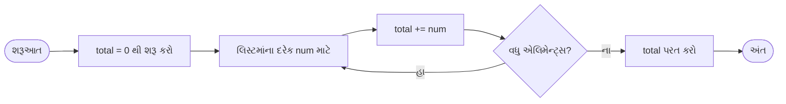

**મેમરી ટ્રીક:** "SITE" (Sum Initialized To zero, Elements added one by one)

## પ્રશ્ન 5(બ) OR [4 ગુણ]

**નીચે આપેલ built in functionsનો ઉપયોગ સમજાવો:**
**૧) Print() ૨) Min() ૩) Sum() ૪) Input()**

**જવાબ**:

| ફંકશન | હેતુ | ઉદાહરણ | આઉટપુટ |
|----------|---------|---------|--------|
| **print()** | કન્સોલ પર આઉટપુટ દર્શાવે છે | `print("Hello World")` | Hello World |
| **min()** | iterableમાંથી સૌથી નાના આઇટમને પરત કરે છે | `min([5, 3, 8, 1])` | 1 |
| **sum()** | iterableમાંના તમામ આઇટમ્સનો સરવાળો આપે છે | `sum([1, 2, 3, 4])` | 10 |
| **input()** | વપરાશકર્તા પાસેથી ઇનપુટ વાંચે છે | `name = input("નામ દાખલ કરો: ")` | (વપરાશકર્તાની ઇનપુટની રાહ જુએ છે) |

**ઉદાહરણ કોડ:**

```python
# print() ફંકશન
print("હેલો, પાયથોન!")  # મૂળભૂત આઉટપુટ
print("a", "b", "c", sep="-")  # સેપરેટર સાથે આઉટપુટ: a-b-c
print("નવી લાઇન નહીં", end=" ")  # કસ્ટમ end કેરેક્ટર
print("એક જ લાઇનમાં")  # આઉટપુટ: નવી લાઇન નહીં એક જ લાઇનમાં

# min() ફંકશન
numbers = [15, 8, 23, 4, 42]
print("ન્યૂનતમ મૂલ્ય:", min(numbers))  # આઉટપુટ: 4
print("5, 2, 9 માંથી ન્યૂનતમ:", min(5, 2, 9))  # આઉટપુટ: 2
chars = "wxyz"
print("ન્યૂનતમ અક્ષર:", min(chars))  # આઉટપુટ: w

# sum() ફંકશન
print("સંખ્યાઓનો સરવાળો:", sum(numbers))  # આઉટપુટ: 92
print("પ્રારંભિક મૂલ્ય સાથે સરવાળો:", sum(numbers, 10))  # આઉટપુટ: 102

# input() ફંકશન
user_input = input("કંઈક દાખલ કરો: ")  # વપરાશકર્તાને ઇનપુટ માટે પ્રોમ્પ્ટ કરે છે
print("તમે દાખલ કર્યું:", user_input)  # વપરાશકર્તાનો ઇનપુટ દર્શાવે છે
```

**મેમરી ટ્રીક:** "PMSI" (Print to display, Min for smallest, Sum for total, Input for reading)

## પ્રશ્ન 5(ક) OR [7 ગુણ]

**સેટ ફંકશન અને ઓપરેશન દર્શાવવા પાયથોન કોડ લખો.**

**જવાબ**:

```python
# સેટ ફંકશન અને ઓપરેશનનું પ્રદર્શન

# સેટ બનાવવા
empty_set = set()  # ખાલી સેટ
numbers = {1, 2, 3, 4, 5}
duplicates = {1, 2, 2, 3, 4, 4, 5}  # ડુપ્લિકેટ આપોઆપ દૂર થાય છે
print("મૂળ સેટ:", numbers)
print("ડુપ્લિકેટ સાથેનો સેટ:", duplicates)  # આઉટપુટ: {1, 2, 3, 4, 5}

# એલિમેન્ટ ઉમેરવા
numbers.add(6)
print("\n6 ઉમેર્યા પછી:", numbers)  # આઉટપુટ: {1, 2, 3, 4, 5, 6}

# અનેક એલિમેન્ટ્સ સાથે અપડેટ કરવું
numbers.update([7, 8, 9])
print("અપડેટ કર્યા પછી:", numbers)  # આઉટપુટ: {1, 2, 3, 4, 5, 6, 7, 8, 9}

# એલિમેન્ટ્સ દૂર કરવા
numbers.remove(5)  # એલિમેન્ટ ન મળે તો એરર આપે
print("\n5 દૂર કર્યા પછી:", numbers)

numbers.discard(10)  # એલિમેન્ટ ન મળે તો કોઈ એરર નહીં
print("10 discard કર્યા પછી:", numbers)  # કોઈ ફેરફાર નહીં

popped = numbers.pop()  # આપમેળે એક એલિમેન્ટ દૂર કરે અને પરત કરે
print("pop કરેલ એલિમેન્ટ:", popped)
print("pop પછી:", numbers)

# સેટ ઓપરેશન્સ
set1 = {1, 2, 3, 4, 5}
set2 = {4, 5, 6, 7, 8}

# યુનિયન
union_set = set1 | set2  # અથવા set1.union(set2)
print("\nયુનિયન:", union_set)  # આઉટપુટ: {1, 2, 3, 4, 5, 6, 7, 8}

# ઇન્ટરસેક્શન
intersection_set = set1 & set2  # અથવા set1.intersection(set2)
print("ઇન્ટરસેક્શન:", intersection_set)  # આઉટપુટ: {4, 5}

# ડિફરન્સ
difference_set = set1 - set2  # અથવા set1.difference(set2)
print("ડિફરન્સ (set1 - set2):", difference_set)  # આઉટપુટ: {1, 2, 3}

# સિમેટ્રિક ડિફરન્સ
symmetric_diff = set1 ^ set2  # અથવા set1.symmetric_difference(set2)
print("સિમેટ્રિક ડિફરન્સ:", symmetric_diff)  # આઉટપુટ: {1, 2, 3, 6, 7, 8}

# સબસેટ અને સુપરસેટ
subset = {1, 2}
print("\nશું {1, 2} એ set1નો સબસેટ છે?", subset.issubset(set1))  # આઉટપુટ: True
print("શું set1 એ {1, 2}નો સુપરસેટ છે?", set1.issuperset(subset))  # આઉટપુટ: True
```

**આકૃતિ:**

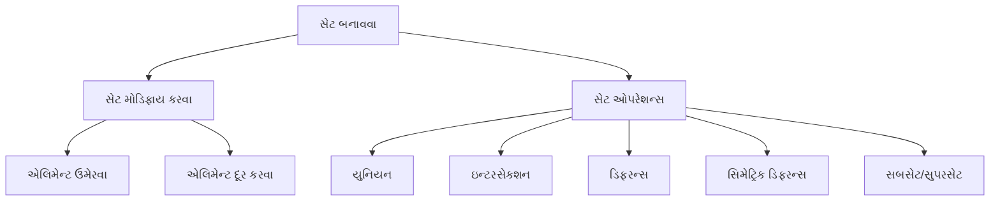

**મેમરી ટ્રીક:** "CARDS-UI" (Create, Add, Remove, Discard elements, Set operations - Union, Intersection)
