## Question 1(a) [3 marks]

**Define algorithm. What are the advantages of Algorithm?**

**Answer**:
An algorithm is a step-by-step procedure or a set of rules to solve a specific problem in a finite sequence of steps.

**Advantages of Algorithm:**

- **Clarity**: Provides clear, unambiguous instructions
- **Efficiency**: Helps in optimizing time and resources
- **Reusability**: Can be used repeatedly for similar problems
- **Verification**: Easy to test and debug before implementation
- **Communication**: Acts as a blueprint to communicate the solution

**Mnemonic:** "CERVC" (Clarity, Efficiency, Reusability, Verification, Communication)

## Question 1(b) [4 marks]

**What are the rules for problem solving using flowchart? Design a flowchart to find simple interest.**

**Answer**:
Rules for problem solving using flowchart:

- **Proper symbols**: Use standard symbols for different operations
- **Direction flow**: Always maintain clear top-to-bottom, left-to-right flow
- **Single entry/exit**: Have a clear start and end point
- **Clarity**: Keep steps clear and concise
- **Consistency**: Maintain consistent level of detail

**Flowchart for Simple Interest Calculation:**

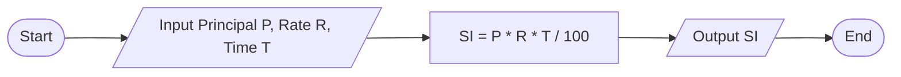

**Mnemonic:** "PDRSC" (Proper symbols, Direction flow, Required entry/exit, Simplicity, Consistency)

## Question 1(c) [7 marks]

**List out assignment operator in python and build a python code to demonstrate an operation of any three assignment operators.**

**Answer**:
Python assignment operators:

| Operator | Example | Equivalent To |
|----------|---------|---------------|
| =        | x = 5   | x = 5         |
| +=       | x += 5  | x = x + 5     |
| -=       | x -= 5  | x = x - 5     |
| *=       | x *= 5  | x = x * 5     |
| /=       | x /= 5  | x = x / 5     |
| %=       | x %= 5  | x = x % 5     |
| //=      | x //= 5 | x = x // 5    |
| **=      | x **= 5 | x = x ** 5    |
| &=       | x &= 5  | x = x & 5     |
| \|=      | x \|= 5 | x = x \| 5    |
| ^=       | x ^= 5  | x = x ^ 5     |
| >>=      | x >>= 5 | x = x >> 5    |
| <<=      | x <<= 5 | x = x << 5    |

**Code demonstrating assignment operators:**

```python
# Demonstrating Assignment Operators
num = 10
print("Initial value:", num)

# Using += operator
num += 5
print("After += 5:", num)  # Output: 15

# Using -= operator
num -= 3
print("After -= 3:", num)  # Output: 12

# Using *= operator
num *= 2
print("After *= 2:", num)  # Output: 24
```

**Mnemonic:** "VALUE" (Variable Assignment is Like Updating Existing values)

## Question 1(c) OR [7 marks]

**List out data types in python and Develop a Program to identify any three data types in python.**

**Answer**:
Python data types:

| Data Type | Description | Example |
|-----------|-------------|---------|
| int | Integer (whole numbers) | 42 |
| float | Floating point (decimal) | 3.14 |
| str | String (text) | "Hello" |
| bool | Boolean (True/False) | True |
| list | Ordered, mutable collection | [1, 2, 3] |
| tuple | Ordered, immutable collection | (1, 2, 3) |
| set | Unordered collection of unique items | {1, 2, 3} |
| dict | Key-value pairs | {"name": "John"} |
| complex | Complex numbers | 2+3j |
| NoneType | Represents None | None |

**Code to identify three data types:**

```python
# Program to identify data types
def identify_data_type(value):
    data_type = type(value).__name__
    print(f"Value: {value}")
    print(f"Data Type: {data_type}")
    print("-" * 20)

# Testing with 3 different data types
identify_data_type(42)            # Integer
identify_data_type(3.14)          # Float
identify_data_type("Hello World") # String

# Output:
# Value: 42
# Data Type: int
# --------------------
# Value: 3.14
# Data Type: float
# --------------------
# Value: Hello World
# Data Type: str
# --------------------
```

**Mnemonic:** "TYPE-ID" (Tell Your Python Elements - Identify Data)

## Question 2(a) [3 marks]

**Define pseudocode. Write pseudocode to find smallest of two number.**

**Answer**:
Pseudocode is a high-level description of an algorithm that uses structural conventions of a programming language but is designed for human reading rather than machine reading.

**Pseudocode to find smallest of two numbers:**

```
BEGIN
    INPUT first_number, second_number
    IF first_number < second_number THEN
        smallest = first_number
    ELSE
        smallest = second_number
    END IF
    OUTPUT smallest
END
```

**Mnemonic:** "RISE" (Read Input, Select smallest, Echo result)

## Question 2(b) [4 marks]

**Develop a python code to read three numbers from the user and find the average of the numbers.**

**Answer**:

```python
# Program to calculate average of three numbers
# Input three numbers from user
num1 = float(input("Enter first number: "))
num2 = float(input("Enter second number: "))
num3 = float(input("Enter third number: "))

# Calculate the average
average = (num1 + num2 + num3) / 3

# Display the result
print(f"The average of {num1}, {num2}, and {num3} is: {average}")
```

**Diagram:**

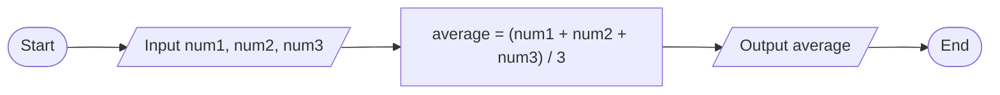

**Mnemonic:** "I-ADD-D" (Input three, ADD them up, Divide by 3)

## Question 2(c) [7 marks]

**Write a python code to show whether the entered number is prime or not.**

**Answer**:

```python
# Program to check if a number is prime
# Input number from user
num = int(input("Enter a number: "))

# Check if number is less than 2
if num < 2:
    print(f"{num} is not a prime number")
else:
    # Initialize is_prime as True
    is_prime = True
    
    # Check from 2 to sqrt(num)
    for i in range(2, int(num**0.5) + 1):
        if num % i == 0:
            is_prime = False
            break
    
    # Display result
    if is_prime:
        print(f"{num} is a prime number")
    else:
        print(f"{num} is not a prime number")
```

**Diagram:**

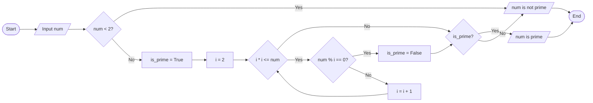

**Mnemonic:** "PRIME" (Positive number, Range check from 2 to √n, If divisible it's Multiple, Else it's prime)

## Question 2(a) OR [3 marks]

**Write down a difference between Flow chart and Algorithm.**

**Answer**:

| Flow Chart | Algorithm |
|------------|-----------|
| **Visual representation** using standard symbols and shapes | **Textual description** using structured language |
| **Easier to understand** due to graphical nature | Requires knowledge of syntax and terminology |
| Shows **logical flow** and relationships clearly | Provides **detailed steps** in sequential order |
| **Time-consuming to create** but easier to follow | **Quicker to draft** but may be harder to interpret |
| More difficult to modify or update | Easier to modify or update |

**Mnemonic:** "VITAL" (Visual vs Textual, Interpretation ease, Time to create, Alteration flexibility, Logical representation)

## Question 2(b) OR [4 marks]

**What is the output of the following code:**

```python
x=10
y=2
print (x*y)
print (x ** y)
print (x//y)
print (x % y)
```

**Answer**:

| Operation | Explanation | Output |
|-----------|-------------|--------|
| x*y | Multiplication: 10 × 2 | 20 |
| x**y | Exponentiation: 10² | 100 |
| x//y | Integer division: 10 ÷ 2 | 5 |
| x%y | Modulus (remainder): 10 ÷ 2 | 0 |

**Mnemonic:** "MEMO" (Multiply, Exponent, Modulo, Operations)

## Question 2(c) OR [7 marks]

**Write a python code to display the following patterns:**

```
A)                    B)
1                    * * * *
1 2                  * * *
1 2 3                * *
1 2 3 4              *
```

**Answer**:

```python
# Pattern A: Number pattern
print("Pattern A:")
for i in range(1, 5):
    for j in range(1, i + 1):
        print(j, end=" ")
    print()

# Pattern B: Star pattern
print("\nPattern B:")
for i in range(4, 0, -1):
    for j in range(i):
        print("*", end=" ")
    print()
```

**Diagram:**

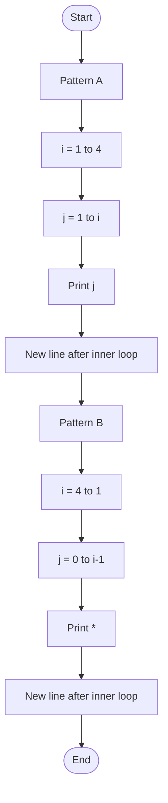

**Mnemonic:** "LOOP-NED" (Loop Outer, Order Pattern, Nested loops, End with newline, Display)

## Question 3(a) [3 marks]

**With the necessary examples describe the use of break statement.**

**Answer**:
Break statement is used to exit or terminate a loop prematurely when a specific condition is met.

**Example:**

```python
# Finding the first odd number in a list
numbers = [2, 4, 6, 7, 8, 10]
for num in numbers:
    if num % 2 != 0:
        print(f"Found odd number: {num}")
        break
    print(f"Checking {num}")
```

**Output:**

```
Checking 2
Checking 4
Checking 6
Found odd number: 7
```

**Mnemonic:** "EXIT" (EXecute until condition, Immediately Terminate)

## Question 3(b) [4 marks]

**Explain if...else statement with suitable example.**

**Answer**:
The if...else statement is a conditional statement that executes different blocks of code based on whether a specified condition evaluates to True or False.

**Syntax:**

```python
if condition:
    # Code to be executed if condition is True
else:
    # Code to be executed if condition is False
```

**Example:**

```python
# Check if a number is even or odd
number = int(input("Enter a number: "))

if number % 2 == 0:
    print(f"{number} is an even number")
else:
    print(f"{number} is an odd number")
```

**Diagram:**


**Mnemonic:** "CITE" (Check condition, If True Execute this, Else execute that)

## Question 3(c) [7 marks]

**Create a User-defined function to print the Fibonacci series of 0 to N numbers where N is an integer number and passed as an argument.**

**Answer**:

```python
# Function to print Fibonacci series
def print_fibonacci(n):
    """
    Print Fibonacci series from 0 to n
    Args:
        n: Upper limit (inclusive)
    """
    # Initialize first two terms
    a, b = 0, 1
    
    # Check if n is valid
    if n < 0:
        print("Please enter a positive number")
        return
    
    # Print Fibonacci series
    print("Fibonacci series up to", n, ":")
    
    if n >= 0:
        print(a, end=" ")  # Print first term
    
    if n >= 1:
        print(b, end=" ")  # Print second term
    
    # Generate and print the rest of the series
    while a + b <= n:
        next_term = a + b
        print(next_term, end=" ")
        a, b = b, next_term

# Test the function
print_fibonacci(55)
```

**Diagram:**

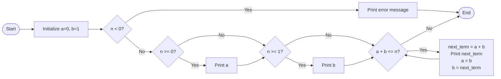

**Mnemonic:** "FIBER" (First terms set, Initialize variables, Build next term, Echo results, Repeat until limit)

## Question 3(a) OR [3 marks]

**With the necessary examples describe the use of continue statement.**

**Answer**:
Continue statement is used to skip the current iteration of a loop and continue with the next iteration.

**Example:**

```python
# Print only odd numbers from 1 to 10
for i in range(1, 11):
    if i % 2 == 0:
        continue  # Skip even numbers
    print(i)
```

**Output:**

```
1
3
5
7
9
```

**Mnemonic:** "SKIP" (Skip current iteration, Keep looping, Ignore remaining statements, Proceed to next iteration)

## Question 3(b) OR [4 marks]

**Explain For loop statement with example.**

**Answer**:
For loop is used to iterate over a sequence (like list, tuple, string) or other iterable objects and execute a block of code for each item in the sequence.

**Syntax:**

```python
for variable in sequence:
    # Code to be executed for each item
```

**Example:**

```python
# Print squares of numbers from 1 to 5
for num in range(1, 6):
    square = num ** 2
    print(f"The square of {num} is {square}")
```

**Output:**

```
The square of 1 is 1
The square of 2 is 4
The square of 3 is 9
The square of 4 is 16
The square of 5 is 25
```

**Diagram:**

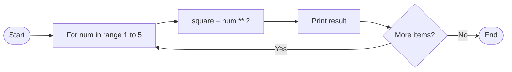

**Mnemonic:** "FIRE" (For each Item, Run commands, Execute until end)

## Question 3(c) OR [7 marks]

**Write a python code that determines whether a given number is an 'Armstrong number' or a palindrome using a user-defined function.**

**Answer**:

```python
# Function to check if a number is Armstrong number
def is_armstrong(num):
    # Convert to string to count digits
    num_str = str(num)
    n = len(num_str)
    
    # Calculate sum of each digit raised to power of total digits
    sum_of_powers = sum(int(digit) ** n for digit in num_str)
    
    # Check if sum equals the original number
    return sum_of_powers == num

# Function to check if a number is a palindrome
def is_palindrome(num):
    # Convert to string
    num_str = str(num)
    
    # Check if string equals its reverse
    return num_str == num_str[::-1]

# Main function to check both conditions
def check_number(num):
    if is_armstrong(num):
        print(f"{num} is an Armstrong number")
    else:
        print(f"{num} is not an Armstrong number")
    
    if is_palindrome(num):
        print(f"{num} is a palindrome")
    else:
        print(f"{num} is not a palindrome")

# Test the function
number = int(input("Enter a number: "))
check_number(number)
```

**Diagram:**

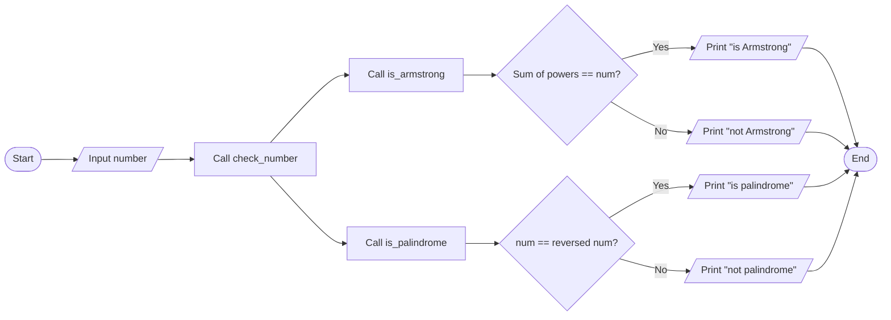

**Mnemonic:** "APC" (Armstrong check: Power sum of digits, Palindrome check: Compare with reverse)

## Question 4(a) [3 marks]

**Develop a python code to identify whether the scanned number is even or odd and print an appropriate message.**

**Answer**:

```python
# Program to check if a number is even or odd
# Input number from user
number = int(input("Enter a number: "))

# Check if number is even or odd
if number % 2 == 0:
    print(f"{number} is an even number")
else:
    print(f"{number} is an odd number")
```

**Diagram:**

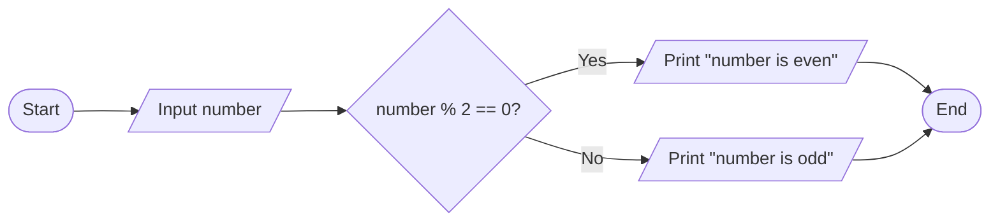

**Mnemonic:** "MODE" (Modulo Operation Determines Even-odd)

## Question 4(b) [4 marks]

**Define function. Explain user define function using suitable example.**

**Answer**:
A function is a block of organized, reusable code that performs a specific task. User-defined functions are functions created by the programmer to perform custom operations.

**Components of a User-defined Function:**

- **def keyword**: Marks the start of function definition
- **Function name**: Identifier for the function
- **Parameters**: Input values (optional)
- **Docstring**: Description of the function (optional)
- **Function body**: Code to be executed
- **Return statement**: Output value (optional)

**Example:**

```python
# User-defined function to calculate area of rectangle
def calculate_area(length, width):
    """
    Calculate area of rectangle
    Args:
        length: Length of rectangle
        width: Width of rectangle
    Returns:
        Area of rectangle
    """
    area = length * width
    return area

# Call the function
result = calculate_area(5, 3)
print(f"Area of rectangle: {result}")
```

**Mnemonic:** "DRAPE" (Define function, Receive parameters, Acquire result, Process data, End with return)

## Question 4(c) [7 marks]

**List out various String operations and explain any three using example.**

**Answer**:
String operations in Python:

| Operation | Description |
|-----------|-------------|
| Concatenation | Joining strings together using + |
| Repetition | Repeating a string using * |
| Indexing | Accessing characters by position |
| Slicing | Extracting a portion of a string |
| Methods (len, upper, lower, etc.) | Built-in functions for string manipulation |
| Membership Testing | Check if a substring exists in a string |
| Formatting | Create formatted strings |
| Escape Sequences | Special characters preceded by \ |

**Three String Operations with Examples:**

1. **String Concatenation:**

```python
first_name = "John"
last_name = "Doe"
full_name = first_name + " " + last_name
print(full_name)  # Output: John Doe
```

2. **String Slicing:**

```python
message = "Python Programming"
print(message[0:6])    # Output: Python
print(message[7:])     # Output: Programming
print(message[-11:])   # Output: Programming
```

3. **String Methods:**

```python
text = "python programming"
print(text.upper())    # Output: PYTHON PROGRAMMING
print(text.capitalize())  # Output: Python programming
print(text.replace("python", "Java"))  # Output: Java programming
```

**Mnemonic:** "CSM" (Concatenate strings, Slice portions, Manipulate with methods)

## Question 4(a) OR [3 marks]

**Create a python code to check positive or negative number.**

**Answer**:

```python
# Program to check if a number is positive or negative
# Input number from user
number = float(input("Enter a number: "))

# Check if number is positive, negative, or zero
if number > 0:
    print(f"{number} is a positive number")
elif number < 0:
    print(f"{number} is a negative number")
else:
    print("The number is zero")
```

**Diagram:**

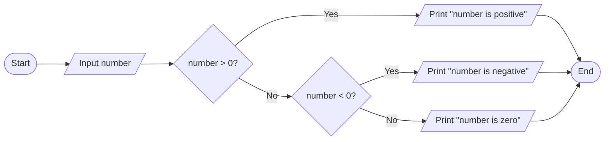

**Mnemonic:** "SIGN" (See If Greater than 0, Negative otherwise)

## Question 4(b) OR [4 marks]

**Explain local and global variables using suitable examples.**

**Answer**:
In Python, variables can have different scopes:

| Variable Type | Description |
|---------------|-------------|
| Local Variable | Defined within a function and accessible only inside that function |
| Global Variable | Defined outside functions and accessible throughout the program |

**Example:**

```python
# Global variable
count = 0  # This is a global variable

def update_count():
    # Local variable
    local_var = 5  # This is a local variable
    
    # Accessing global variable inside function
    global count
    count += 1
    
    print(f"Local variable: {local_var}")
    print(f"Global variable (inside function): {count}")
    
# Call the function
update_count()

# Accessing variables outside function
print(f"Global variable (outside function): {count}")

# This would cause an error if uncommented
# print(local_var)  # NameError: name 'local_var' is not defined
```

**Output:**

```
Local variable: 5
Global variable (inside function): 1
Global variable (outside function): 1
```

**Mnemonic:** "SCOPE" (Some variables Confined to function Only, Program-wide Exposure for others)

## Question 4(c) OR [7 marks]

**List out various List operations and explain any three using example.**

**Answer**:
List operations in Python:

| Operation | Description |
|-----------|-------------|
| Creating Lists | Using square brackets [] |
| Indexing | Accessing elements by position |
| Slicing | Extracting portions of a list |
| Append | Adding elements to the end |
| Insert | Adding elements at specific positions |
| Remove | Removing specific elements |
| Pop | Removing and returning elements |
| Sort | Ordering list elements |
| Reverse | Reversing list order |
| Extend | Combining lists |
| List Comprehensions | Creating lists using expressions |

**Three List Operations with Examples:**

1. **List Indexing and Slicing:**

```python
fruits = ["apple", "banana", "cherry", "orange", "kiwi"]
print(fruits[1])        # Output: banana
print(fruits[-1])       # Output: kiwi
print(fruits[1:4])      # Output: ['banana', 'cherry', 'orange']
```

2. **List Methods (append, insert, remove):**

```python
numbers = [1, 2, 3]
numbers.append(4)       # Add 4 to the end
print(numbers)          # Output: [1, 2, 3, 4]

numbers.insert(0, 0)    # Insert 0 at position 0
print(numbers)          # Output: [0, 1, 2, 3, 4]

numbers.remove(2)       # Remove element with value 2
print(numbers)          # Output: [0, 1, 3, 4]
```

3. **List Comprehensions:**

```python
# Create a list of squares
squares = [x**2 for x in range(1, 6)]
print(squares)  # Output: [1, 4, 9, 16, 25]

# Filter even numbers
numbers = [1, 2, 3, 4, 5, 6, 7, 8, 9, 10]
evens = [x for x in numbers if x % 2 == 0]
print(evens)    # Output: [2, 4, 6, 8, 10]
```

**Mnemonic:** "AIM" (Access with index, Insert/modify elements, Make using comprehensions)

## Question 5(a) [3 marks]

**Write python code to swap given two elements in a list.**

**Answer**:

```python
# Program to swap two elements in a list
def swap_elements(my_list, pos1, pos2):
    """
    Swap elements at positions pos1 and pos2 in the list
    """
    # Check if positions are valid
    if 0 <= pos1 < len(my_list) and 0 <= pos2 < len(my_list):
        # Swap elements
        my_list[pos1], my_list[pos2] = my_list[pos2], my_list[pos1]
        return True
    else:
        return False

# Example usage
numbers = [10, 20, 30, 40, 50]
print("Original list:", numbers)

# Swap elements at positions 1 and 3
if swap_elements(numbers, 1, 3):
    print("After swapping:", numbers)
else:
    print("Invalid positions")
```

**Output:**

```
Original list: [10, 20, 30, 40, 50]
After swapping: [10, 40, 30, 20, 50]
```

**Mnemonic:** "SWAP" (Select positions, Watch boundaries, Assign simultaneously, Print result)

## Question 5(b) [4 marks]

**Explain math module and random module in python using example.**

**Answer**:
Math and random modules provide functions for mathematical operations and random number generation.

**Math Module:**

```python
import math

# Constants
print(math.pi)          # Output: 3.141592653589793
print(math.e)           # Output: 2.718281828459045

# Mathematical functions
print(math.sqrt(16))    # Output: 4.0
print(math.ceil(4.2))   # Output: 5
print(math.floor(4.8))  # Output: 4
print(math.pow(2, 3))   # Output: 8.0
```

**Random Module:**

```python
import random

# Random float between 0 and 1
print(random.random())       # Output: 0.123... (random)

# Random integer within range
print(random.randint(1, 10)) # Output: 7 (random between 1 and 10)

# Random choice from a sequence
colors = ["red", "green", "blue"]
print(random.choice(colors)) # Output: "green" (random)

# Shuffle a list
numbers = [1, 2, 3, 4, 5]
random.shuffle(numbers)
print(numbers)               # Output: [3, 1, 5, 2, 4] (random)
```

**Mnemonic:** "MR-CS" (Math for Calculations, Random for Choice and Shuffling)

## Question 5(c) [7 marks]

**Write a python code to demonstrate tuples functions and operations.**

**Answer**:

```python
# Demonstrating Tuple Functions and Operations

# Creating tuples
empty_tuple = ()
single_item_tuple = (1,)  # Note the comma
mixed_tuple = (1, "Hello", 3.14, True)
nested_tuple = (1, 2, (3, 4))

# Accessing tuple elements
print("Accessing elements:")
print(mixed_tuple[0])      # Output: 1
print(mixed_tuple[-1])     # Output: True
print(nested_tuple[2][0])  # Output: 3

# Tuple slicing
print("\nTuple slicing:")
print(mixed_tuple[1:3])    # Output: ("Hello", 3.14)

# Tuple concatenation
tuple1 = (1, 2, 3)
tuple2 = (4, 5, 6)
tuple3 = tuple1 + tuple2
print("\nConcatenated tuple:", tuple3)  # Output: (1, 2, 3, 4, 5, 6)

# Tuple repetition
repeated_tuple = tuple1 * 3
print("\nRepeated tuple:", repeated_tuple)  # Output: (1, 2, 3, 1, 2, 3, 1, 2, 3)

# Tuple methods
numbers = (1, 2, 3, 2, 4, 2)
print("\nCount of 2:", numbers.count(2))  # Output: 3
print("Index of 3:", numbers.index(3))    # Output: 2

# Tuple unpacking
print("\nTuple unpacking:")
x, y, z = (10, 20, 30)
print(f"x={x}, y={y}, z={z}")  # Output: x=10, y=20, z=30

# Check if an element exists in a tuple
print("\nMembership testing:")
print(3 in numbers)     # Output: True
print(5 in numbers)     # Output: False

# Converting list to tuple and vice versa
my_list = [1, 2, 3]
my_tuple = tuple(my_list)
print("\nList to tuple:", my_tuple)

back_to_list = list(my_tuple)
print("Tuple to list:", back_to_list)
```

**Diagram:**

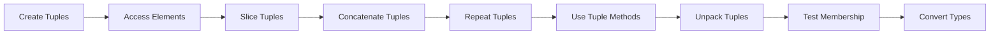

**Mnemonic:** "CASC-RUMTC" (Create, Access, Slice, Concatenate, Repeat, Use methods, Membership test, Tuple conversion)

## Question 5(a) OR [3 marks]

**Write a python code to find the sum of elements in a list.**

**Answer**:

```python
# Program to find the sum of elements in a list
def sum_of_elements(numbers):
    """
    Calculate the sum of all elements in a list
    """
    total = 0
    for num in numbers:
        total += num
    return total

# Example usage
my_list = [10, 20, 30, 40, 50]
print("List:", my_list)
print("Sum of elements:", sum_of_elements(my_list))  # Output: 150

# Alternative using built-in sum() function
print("Sum using built-in function:", sum(my_list))  # Output: 150
```

**Diagram:**

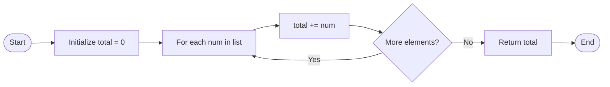

**Mnemonic:** "SITE" (Sum Initialized To zero, Elements added one by one)

## Question 5(b) OR [4 marks]

**Explain the usage of following built in functions:**
**1) Print() 2) Min() 3) Sum() 4) Input()**

**Answer**:

| Function | Purpose | Example | Output |
|----------|---------|---------|--------|
| **print()** | Displays output to the console | `print("Hello World")` | Hello World |
| **min()** | Returns smallest item in an iterable | `min([5, 3, 8, 1])` | 1 |
| **sum()** | Returns sum of all items in an iterable | `sum([1, 2, 3, 4])` | 10 |
| **input()** | Reads input from the user | `name = input("Enter name: ")` | (waits for user input) |

**Example Code:**

```python
# print() function
print("Hello, Python!")  # Basic output
print("a", "b", "c", sep="-")  # Output with separator: a-b-c
print("No newline", end=" ")  # Custom end character
print("on same line")  # Output: No newline on same line

# min() function
numbers = [15, 8, 23, 4, 42]
print("Minimum value:", min(numbers))  # Output: 4
print("Minimum of 5, 2, 9:", min(5, 2, 9))  # Output: 2
chars = "wxyz"
print("Minimum character:", min(chars))  # Output: w

# sum() function
print("Sum of numbers:", sum(numbers))  # Output: 92
print("Sum with start value:", sum(numbers, 10))  # Output: 102

# input() function
user_input = input("Enter something: ")  # Prompts user for input
print("You entered:", user_input)  # Displays user's input
```

**Mnemonic:** "PMSI" (Print to display, Min for smallest, Sum for total, Input for reading)

## Question 5(c) OR [7 marks]

**Write a python code to demonstrate the set functions and operations.**

**Answer**:

```python
# Demonstrating Set Functions and Operations

# Creating sets
empty_set = set()  # Empty set
numbers = {1, 2, 3, 4, 5}
duplicates = {1, 2, 2, 3, 4, 4, 5}  # Duplicates removed automatically
print("Original set:", numbers)
print("Set with duplicates:", duplicates)  # Output: {1, 2, 3, 4, 5}

# Adding elements
numbers.add(6)
print("\nAfter adding 6:", numbers)  # Output: {1, 2, 3, 4, 5, 6}

# Updating with multiple elements
numbers.update([7, 8, 9])
print("After updating:", numbers)  # Output: {1, 2, 3, 4, 5, 6, 7, 8, 9}

# Removing elements
numbers.remove(5)  # Raises error if element not found
print("\nAfter removing 5:", numbers)

numbers.discard(10)  # No error if element not found
print("After discarding 10:", numbers)  # No change

popped = numbers.pop()  # Removes and returns arbitrary element
print("Popped element:", popped)
print("After pop:", numbers)

# Set operations
set1 = {1, 2, 3, 4, 5}
set2 = {4, 5, 6, 7, 8}

# Union
union_set = set1 | set2  # or set1.union(set2)
print("\nUnion:", union_set)  # Output: {1, 2, 3, 4, 5, 6, 7, 8}

# Intersection
intersection_set = set1 & set2  # or set1.intersection(set2)
print("Intersection:", intersection_set)  # Output: {4, 5}

# Difference
difference_set = set1 - set2  # or set1.difference(set2)
print("Difference (set1 - set2):", difference_set)  # Output: {1, 2, 3}

# Symmetric Difference
symmetric_diff = set1 ^ set2  # or set1.symmetric_difference(set2)
print("Symmetric difference:", symmetric_diff)  # Output: {1, 2, 3, 6, 7, 8}

# Subset and Superset
subset = {1, 2}
print("\nIs {1, 2} subset of set1?", subset.issubset(set1))  # Output: True
print("Is set1 superset of {1, 2}?", set1.issuperset(subset))  # Output: True
```

**Diagram:**

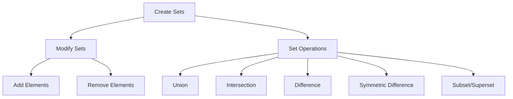

**Mnemonic:** "CARDS-UI" (Create, Add, Remove, Discard elements, Set operations - Union, Intersection)
