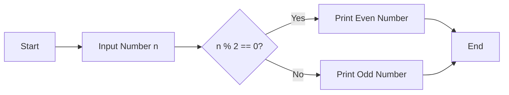
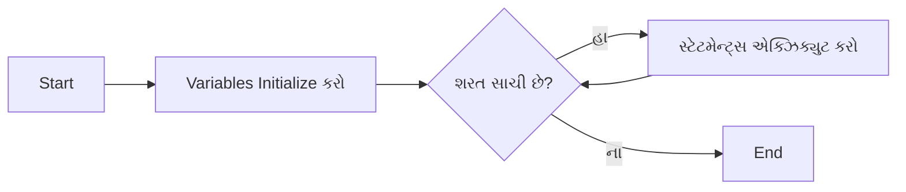
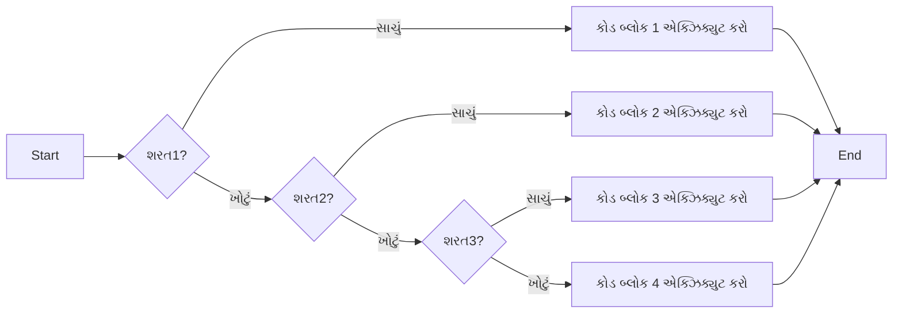

## પ્રશ્ન 1(અ) [3 માર્ક્સ]

**ફ્લોચાર્ટ અને અલ્ગોરિધમના મહત્વની યાદી આપો.**

**જવાબ**:

| ફ્લોચાર્ટનું મહત્વ | અલ્ગોરિધમનું મહત્વ |
|-------------------------|-------------------------|
| પ્રોગ્રામ લોજિકનું દૃશ્ય નિરૂપણ | સમસ્યાને ઉકેલવા માટેનું પગલાંવાર પ્રક્રિયા |
| ભૂલોને સરળતાથી શોધવા અને સુધારવા | ભાષાથી સ્વતંત્ર ઉકેલ અભિગમ |
| જટિલ પ્રક્રિયાઓને સમજવામાં મદદ | પ્રોગ્રામિંગની પાયારૂપ શરૂઆત |
| ટીમના સભ્યો વચ્ચે સંદેશાવ્યવહાર સુધારે | કોડિંગ શરૂ કરતા પહેલા લોજિક નિર્ધારિત કરે |

**મેમરી ટ્રીક:** "VASE નિર્ણયો" - Visualize, Analyze, Sequence, Execute

## પ્રશ્ન 1(બ) [4 માર્ક્સ]

**દાખલ કરેલ સંખ્યા ઈવન કે ઓડ છે તે શોધવા માટે ફ્લોચાર્ટ દોરો.**

**જવાબ**:



**મુખ્ય પગલાં:**

- **ડેટા એકત્રીકરણ**: વપરાશકર્તા પાસેથી નંબર મેળવો
- **મોડ્યુલો ઓપરેશન**: 2 વડે ભાગીને શેષ તપાસો
- **શરતી આઉટપુટ**: શેષના આધારે પરિણામ દર્શાવો

**મેમરી ટ્રીક:** "MODE" - Modulo Operation Determines Evenness

## પ્રશ્ન 1(ક) [7 માર્ક્સ]

**બધા લોજિકલ ઓપરેટરોની યાદી બનાવો અને પાયથોન કોડનું ઉદાહરણ આપીને દરેકને સમજાવો.**

**જવાબ**:

| ઓપરેટર | વર્ણન | ઉદાહરણ | આઉટપુટ |
|----------|-------------|---------|--------|
| `and` | બંને સ્ટેટમેન્ટ સાચા હોય તો True રિટર્ન કરે | `x = 5; print(x > 3 and x < 10)` | `True` |
| `or` | બે સ્ટેટમેન્ટમાંથી એક સાચું હોય તો True રિટર્ન કરે | `x = 5; print(x > 10 or x == 5)` | `True` |
| `not` | પરિણામને ઉલટાવે, જો પરિણામ સાચું હોય તો False રિટર્ન કરે | `x = 5; print(not(x > 3))` | `False` |

**કોડ ઉદાહરણ:**

```python
# લોજિકલ AND ઉદાહરણ
age = 25
income = 50000
print("લોન પાત્રતા:", age > 18 and income > 30000)  # True

# લોજિકલ OR ઉદાહરણ
has_credit_card = False
has_cash = True
print("ખરીદી કરી શકે છે:", has_credit_card or has_cash)  # True

# લોજિકલ NOT ઉદાહરણ
is_holiday = False
print("આજે કામ કરવું જોઈએ:", not is_holiday)  # True
```

**મેમરી ટ્રીક:** "AON સ્પષ્ટતા" - And, Or, Not લોજિકલ સ્પષ્ટતા માટે

## પ્રશ્ન 1(ક) OR [7 માર્ક્સ]

**એક પાયથોન પ્રોગ્રામ લખો કરો જે આપેલ ડેટા પર સાદા વ્યાજ અને ચક્રવૃદ્ધિ વ્યાજની ગણતરી કરી શકે.**

**જવાબ**:

```python
# સાદા અને ચક્રવૃદ્ધિ વ્યાજની ગણતરી માટેનો પ્રોગ્રામ

# ઇનપુટ મૂલ્યો
principal = float(input("મૂળ રકમ દાખલ કરો: "))
rate = float(input("વ્યાજ દર દાખલ કરો (% માં): "))
time = float(input("સમય અવધિ દાખલ કરો (વર્ષોમાં): "))

# સાદા વ્યાજની ગણતરી
simple_interest = (principal * rate * time) / 100

# ચક્રવૃદ્ધિ વ્યાજની ગણતરી
compound_interest = principal * ((1 + rate/100) ** time - 1)

# પરિણામો દર્શાવો
print("સાદું વ્યાજ:", round(simple_interest, 2))
print("ચક્રવૃદ્ધિ વ્યાજ:", round(compound_interest, 2))
```

**મુખ્ય સૂત્રો:**

- **સાદું વ્યાજ (SI)**: મૂળ રકમ × દર × સમય / 100
- **ચક્રવૃદ્ધિ વ્યાજ (CI)**: મૂળ રકમ × ((1 + દર/100)^સમય - 1)

**મેમરી ટ્રીક:** "PRT નાણાં વૃદ્ધિ" - Principal, Rate, Time નાણાંની વૃદ્ધિ

## પ્રશ્ન 2(અ) [3 માર્ક્સ]

**આપેલ ત્રણ નંબરોમાંથી ન્યૂનતમ સંખ્યા શોધવા માટે પાયથોન પ્રોગ્રામ બનાવો.**

**જવાબ**:

```python
# ત્રણ નંબરોમાંથી ન્યૂનતમ શોધવાનો પ્રોગ્રામ

# ત્રણ નંબર ઇનપુટ લો
num1 = float(input("પ્રથમ નંબર દાખલ કરો: "))
num2 = float(input("બીજો નંબર દાખલ કરો: "))
num3 = float(input("ત્રીજો નંબર દાખલ કરો: "))

# બિલ્ટ-ઇન min() ફંક્શનનો ઉપયોગ કરીને ન્યૂનતમ શોધો
minimum = min(num1, num2, num3)

# પરિણામ દર્શાવો
print("ન્યૂનતમ નંબર છે:", minimum)
```

**મેમરી ટ્રીક:** "MIN શોધે ન્યૂનતમ" - Minimum Is Numerically શોધાય ન્યૂનતમ સાથે

## પ્રશ્ન 2(બ) [4 માર્ક્સ]

**સ્યુડોકોડ વ્યાખ્યાયિત કરો. x, y અને z ત્રણમાંથી સૌથી મોટી સંખ્યા શોધવા માટે સ્યુડોકોડ લખો.**

**જવાબ**:

| સ્યુડોકોડની વ્યાખ્યા |
|-----------------------|
| કમ્પ્યુટર પ્રોગ્રામે શું કરવું જોઈએ તેનું વિગતવાર અને વાંચી શકાય તેવું વર્ણન, જે પ્રોગ્રામિંગ ભાષાને બદલે ઔપચારિક શૈલીમાં લખાયેલી કુદરતી ભાષામાં વ્યક્ત કરવામાં આવે છે. |

**ત્રણ નંબરોમાંથી સૌથી મોટો શોધવા માટે સ્યુડોકોડ:**

```
BEGIN
    INPUT x, y, z
    SET largest = x
    
    IF y > largest THEN
        SET largest = y
    END IF
    
    IF z > largest THEN
        SET largest = z
    END IF
    
    OUTPUT "સૌથી મોટો નંબર છે: ", largest
END
```

**મેમરી ટ્રીક:** "PIE લખાણ" - Program Ideas Expressed સરળ લખાણમાં

## પ્રશ્ન 2(ક) [7 માર્ક્સ]

**પાયથોનમાં વાઈલ લૂપને તેના સિન્ટેક્સ, ફ્લોચાર્ટ અને પાયથોન કોડના ઉદાહરણ સાથે સમજાવો.**

**જવાબ**:

**સિન્ટેક્સ:**

```python
while શરત:
    # કોડ જે એક્ઝિક્યુટ કરવાનો છે
```

**ફ્લોચાર્ટ:**



**કોડ ઉદાહરણ:**

```python
# પ્રથમ 5 કુદરતી સંખ્યાઓ while લૂપનો ઉપયોગ કરીને પ્રિન્ટ કરો
count = 1

while count <= 5:
    print(count)
    count += 1  # કાઉન્ટર વધારો

# આઉટપુટ:
# 1
# 2
# 3
# 4
# 5
```

**મુખ્ય લક્ષણો:**

- **એન્ટ્રી કંટ્રોલ**: લૂપ એક્ઝિક્યુશન પહેલાં શરત ચકાસવામાં આવે છે
- **ઇનિશિયલાઇઝેશન**: લૂપ પહેલાં વેરિએબલ્સ સેટ કરવામાં આવે છે
- **અપડેશન**: લૂપની અંદર વેરિએબલ્સ અપડેટ કરવામાં આવે છે
- **ટર્મિનેશન**: શરત ખોટી થાય ત્યારે લૂપ બહાર નીકળે છે

**મેમરી ટ્રીક:** "IUTE લૂપ" - Initialize, Update, Test for Exit

## પ્રશ્ન 2(અ) OR [3 માર્ક્સ]

**પાયથોનમાં કન્ટિન્યુ સ્ટેટમેન્ટનું ટૂંકમાં વર્ણન કરો.**

**જવાબ**:

| પાયથોનમાં કન્ટિન્યુ સ્ટેટમેન્ટ |
|------------------------------|
| કન્ટિન્યુ સ્ટેટમેન્ટ લૂપના વર્તમાન ઇટરેશનને છોડી દે છે અને આગલા ઇટરેશનથી ચાલુ રાખે છે |
| જ્યારે એનકાઉન્ટર થાય, ત્યારે કન્ટિન્યુ સ્ટેટમેન્ટ પછીનો લૂપનો કોડ છોડી દેવામાં આવે છે |
| ચોક્કસ શરતોને છોડીને લૂપને ચાલુ રાખવા માટે ઉપયોગી છે |

**કોડ ઉદાહરણ:**

```python
# બેકી સંખ્યાઓ પ્રિન્ટ કરવાનું છોડી દો
for i in range(1, 6):
    if i % 2 == 0:
        continue
    print(i)  # માત્ર 1, 3, 5 પ્રિન્ટ થાય
```

**મેમરી ટ્રીક:** "SKIP આગળ" - Skip Keeping Iteration Process

## પ્રશ્ન 2(બ) OR [4 માર્ક્સ]

**નીચેના કોડનું આઉટપુટ શું હશે?**

```python
x=8
y=2
print (x*y)
print (x ** y)
print (x % y)
print(x>y)
```

**જવાબ**:

| ઓપરેશન | પરિણામ | સમજૂતી |
|-----------|--------|-------------|
| `x*y` | `16` | ગુણાકાર: 8 × 2 = 16 |
| `x**y` | `64` | પાવર: 8² = 64 |
| `x%y` | `0` | મોડ્યુલો (શેષ): 8 ÷ 2 = 4 શેષ 0 |
| `x>y` | `True` | તુલના: 8 > 2 સાચું છે |

**મેમરી ટ્રીક:** "MEMO" - Multiply, Exponent, Modulo, Operator comparison

## પ્રશ્ન 2(ક) OR [7 માર્ક્સ]

**પાયથોનમાં ઈફ-ઈએલઈએફ-એલ્સ લેડરને તેના સિન્ટેક્સ, ફ્લોચાર્ટ અને પાયથોન કોડના ઉદાહરણ સાથે સમજાવો.**

**જવાબ**:

**સિન્ટેક્સ:**

```python
if શરત1:
    # કોડ બ્લોક 1
elif શરત2:
    # કોડ બ્લોક 2
elif શરત3:
    # કોડ બ્લોક 3
else:
    # કોડ બ્લોક 4
```

**ફ્લોચાર્ટ:**



**કોડ ઉદાહરણ:**

```python
# માર્ક્સના આધારે ગ્રેડની ગણતરી
marks = 75

if marks >= 90:
    grade = "A+"
elif marks >= 80:
    grade = "A"
elif marks >= 70:
    grade = "B"
elif marks >= 60:
    grade = "C"
else:
    grade = "D"

print("ગ્રેડ:", grade)  # આઉટપુટ: ગ્રેડ: B
```

**મુખ્ય લક્ષણો:**

- **અનુક્રમિક મૂલ્યાંકન**: શરતો ઉપરથી નીચે તપાસવામાં આવે છે
- **અનન્ય એક્ઝિક્યુશન**: માત્ર એક બ્લોક એક્ઝિક્યુટ થાય છે
- **ડિફોલ્ટ એક્શન**: જો કોઈ શરત સાચી ન હોય તો else બ્લોક એક્ઝિક્યુટ થાય છે

**મેમરી ટ્રીક:** "SEEP લોજિક" - Sequential Evaluation with Exclusive Path

## પ્રશ્ન 3(અ) [3 માર્ક્સ]

**લૂપ્સનો ઉપયોગ કરીને 1 થી 20 વચ્ચેની એકી સંખ્યાઓ છાપવા માટે પાયથોન પ્રોગ્રામ લખો.**

**જવાબ**:

```python
# 1 થી 20 વચ્ચેની એકી સંખ્યાઓ છાપવાનો પ્રોગ્રામ

# range અને step સાથે for લૂપનો ઉપયોગ
for number in range(1, 21, 2):
    print(number, end=" ")

# આઉટપુટ: 1 3 5 7 9 11 13 15 17 19
```

**વૈકલ્પિક અભિગમ:**

```python
# if શરત સાથે for લૂપનો ઉપયોગ
for number in range(1, 21):
    if number % 2 != 0:
        print(number, end=" ")
```

**મેમરી ટ્રીક:** "STEO" - Skip Two, Extract Odds

## પ્રશ્ન 3(બ) [4 માર્ક્સ]

**નેસ્ટેડ ઈફ સ્ટેટમેન્ટને સંક્ષિપ્તમાં સમજાવો.**

**જવાબ**:

| નેસ્ટેડ ઈફ સ્ટેટમેન્ટ |
|---------------------|
| બીજા if સ્ટેટમેન્ટની અંદર એક if સ્ટેટમેન્ટ |
| વધુ જટિલ શરતી લોજિકની મંજૂરી આપે છે |
| બાહ્ય if સાચું હોય ત્યારે જ આંતરિક if મૂલ્યાંકન કરવામાં આવે છે |
| નેસ્ટિંગના ઘણા સ્તરો હોઈ શકે છે |

**કોડ ઉદાહરણ:**

```python
age = 25
income = 50000

if age > 18:
    print("પુખ્ત")
    if income > 30000:
        print("ક્રેડિટ કાર્ડ માટે પાત્ર")
    else:
        print("ક્રેડિટ કાર્ડ માટે અપાત્ર")
else:
    print("સગીર")
```

**મેમરી ટ્રીક:** "LION" - Layered If-statements Operating Nested

## પ્રશ્ન 3(ક) [7 માર્ક્સ]

**યુઝર ડિફાઈન ફંક્શનનો ઉપયોગ કરીને દાખલ કરેલ નંબર 'આર્મસ્ટ્રોંગ નંબર' અથવા પેલિન્ડ્રોમ છે તે તપાસવા માટે પ્રોગ્રામ લખો એ જેમાં કૉલિંગ ફંક્શનમાં આર્ગ્યુમેંટ તરીકે નંબર આપવામા આવે છે.**

**જવાબ**:

```python
# આર્મસ્ટ્રોંગ નંબર અથવા પેલિન્ડ્રોમ તપાસવાનો પ્રોગ્રામ

def check_number(num):
    # આર્મસ્ટ્રોંગ નંબર તપાસો
    temp = num
    digits = len(str(num))
    sum = 0
    
    while temp > 0:
        digit = temp % 10
        sum += digit ** digits
        temp //= 10
    
    is_armstrong = (sum == num)
    
    # પેલિન્ડ્રોમ તપાસો
    is_palindrome = (str(num) == str(num)[::-1])
    
    # પરિણામો પાછા આપો
    return is_armstrong, is_palindrome

# વપરાશકર્તા પાસેથી ઇનપુટ લો
number = int(input("એક નંબર દાખલ કરો: "))

# ફંક્શન કૉલ કરો અને પરિણામો દર્શાવો
armstrong, palindrome = check_number(number)

if armstrong:
    print(number, "એક આર્મસ્ટ્રોંગ નંબર છે")
else:
    print(number, "આર્મસ્ટ્રોંગ નંબર નથી")
    
if palindrome:
    print(number, "એક પેલિન્ડ્રોમ છે")
else:
    print(number, "પેલિન્ડ્રોમ નથી")
```

**આર્મસ્ટ્રોંગ ઉદાહરણો:**

- 153: 1³ + 5³ + 3³ = 1 + 125 + 27 = 153 ✓
- 370: 3³ + 7³ + 0³ = 27 + 343 + 0 = 370 ✓

**મેમરી ટ્રીક:** "APTEST" - Armstrong Palindrome Test Equal Sum Test

## પ્રશ્ન 3(અ) OR [3 માર્ક્સ]

**૧ થી ૧૦૦ સુધી નો સરવાળો શોધવા માટે પાયથોન પ્રોગ્રામ લખો.**

**જવાબ**:

```python
# 1 થી 100 સુધીની સંખ્યાઓનો સરવાળો શોધવાનો પ્રોગ્રામ

# પદ્ધતિ 1: લૂપનો ઉપયોગ
total = 0
for num in range(1, 101):
    total += num
print("લૂપનો ઉપયોગ કરીને સરવાળો:", total)

# પદ્ધતિ 2: સૂત્ર n(n+1)/2 નો ઉપયોગ
n = 100
sum_formula = n * (n + 1) // 2
print("સૂત્રનો ઉપયોગ કરીને સરવાળો:", sum_formula)

# આઉટપુટ: 
# લૂપનો ઉપયોગ કરીને સરવાળો: 5050
# સૂત્રનો ઉપયોગ કરીને સરવાળો: 5050
```

**મેમરી ટ્રીક:** "SUM સૂત્ર" - Sum Using Mathematical સૂત્ર

## પ્રશ્ન 3(બ) OR [4 માર્ક્સ]

**નીચેની પેટર્ન છાપવા માટે પાયથોન પ્રોગ્રામ લખો.**

```
1
2 3
4 5 6
7 8 9 10
```

**જવાબ**:

```python
# સંખ્યા પેટર્ન છાપવાનો પ્રોગ્રામ

num = 1
for i in range(1, 5):  # 4 પંક્તિઓ
    for j in range(i):  # પંક્તિ નંબર જેટલા કોલમ
        print(num, end=" ")
        num += 1
    print()  # દરેક પંક્તિ પછી નવી લાઈન
```

**પેટર્ન લોજિક:**

- **પંક્તિ 1**: 1 સંખ્યા (1)
- **પંક્તિ 2**: 2 સંખ્યાઓ (2, 3)
- **પંક્તિ 3**: 3 સંખ્યાઓ (4, 5, 6)
- **પંક્તિ 4**: 4 સંખ્યાઓ (7, 8, 9, 10)

**મેમરી ટ્રીક:** "CNIR" - Counter Number Increases with Rows

## પ્રશ્ન 3(ક) OR [7 માર્ક્સ]

**ફંક્શનનો ઉપયોગ કરીને પ્રોગ્રામ લખો જે દાખલ કરેલ નંબરને ઉલટાવે**

**જવાબ**:

```python
# દાખલ કરેલ મૂલ્યને ઉલટાવવા માટે ફંક્શન ઉપયોગ કરતો પ્રોગ્રામ

def reverse_number(num):
    """સંખ્યાને ઉલટાવવા માટેનું ફંક્શન"""
    return int(str(num)[::-1])

def reverse_string(text):
    """સ્ટ્રિંગને ઉલટાવવા માટેનું ફંક્શન"""
    return text[::-1]

# મુખ્ય પ્રોગ્રામ
def main():
    choice = input("તમે શું ઉલટાવવા માંગો છો? (n માટે નંબર, s માટે સ્ટ્રિંગ): ")
    
    if choice.lower() == 'n':
        num = int(input("એક નંબર દાખલ કરો: "))
        print("ઉલટાવેલ નંબર:", reverse_number(num))
    elif choice.lower() == 's':
        text = input("એક સ્ટ્રિંગ દાખલ કરો: ")
        print("ઉલટાવેલ સ્ટ્રિંગ:", reverse_string(text))
    else:
        print("અમાન્ય પસંદગી!")

# મુખ્ય ફંક્શન કૉલ કરો
main()
```

**નંબર ઉલટાવવા માટે વૈકલ્પિક પદ્ધતિ:**

```python
def reverse_number_algorithm(num):
    reversed_num = 0
    while num > 0:
        digit = num % 10
        reversed_num = reversed_num * 10 + digit
        num //= 10
    return reversed_num
```

**મેમરી ટ્રીક:** "FLIP અંકો" - Function Logic Inverts Position of અંકો

## પ્રશ્ન 4(અ) [3 માર્ક્સ]

**યોગ્ય પાયથોન કોડ ઉદાહરણ સાથે પાયથોન મેથ મોડ્યુલનું વર્ણન કરો.**

**જવાબ**:

| પાયથોન મેથ મોડ્યુલની વિશેષતાઓ |
|----------------------------|
| ગાણિતિક ફંક્શન્સ અને સ્થિરાંકો પ્રદાન કરે છે |
| ત્રિકોણમિતિય, લોગરિધમિક અને અન્ય ફંક્શન્સ શામેલ છે |
| pi અને e જેવા ગાણિતિક સ્થિરાંકો ધરાવે છે |
| ઉપયોગ કરતા પહેલા import કરવું જરૂરી છે |

**કોડ ઉદાહરણ:**

```python
import math

# સ્થિરાંકો
print("pi નું મૂલ્ય:", math.pi)  # 3.141592653589793
print("e નું મૂલ્ય:", math.e)    # 2.718281828459045

# મૂળભૂત ગાણિતિક ફંક્શન્સ
print("16 નો વર્ગમૂળ:", math.sqrt(16))  # 4.0
print("5 ની ઘાત 3:", math.pow(5, 3))  # 125.0

# ત્રિકોણમિતિય ફંક્શન્સ (રેડિયન)
print("90° નો સાઇન:", math.sin(math.pi/2))  # 1.0
print("0° નો કોસાઇન:", math.cos(0))  # 1.0

# લોગરિધમિક ફંક્શન્સ
print("100 નો આધાર 10 લોગ:", math.log10(100))  # 2.0
print("e નો નેચરલ લોગ:", math.log(math.e))  # 1.0
```

**મેમરી ટ્રીક:** "CALM ઓપરેશન્સ" - Constants And Logarithmic Mathematical ઓપરેશન્સ

## પ્રશ્ન 4(બ) [4 માર્ક્સ]

**વેરીએબલના સ્કોપને સમજાવતો પાયથોન પ્રોગ્રામ લખો.**

**જવાબ**:

```python
# પાયથોનમાં વેરીએબલ સ્કોપ દર્શાવતો પ્રોગ્રામ

# ગ્લોબલ વેરીએબલ
global_var = "હું ગ્લોબલ છું"

def demonstration():
    # લોકલ વેરીએબલ
    local_var = "હું લોકલ છું"
    
    # ગ્લોબલ વેરીએબલ એક્સેસ કરવું
    print("ફંક્શનની અંદર - ગ્લોબલ વેરીએબલ:", global_var)
    
    # લોકલ વેરીએબલ એક્સેસ કરવું
    print("ફંક્શનની અંદર - લોકલ વેરીએબલ:", local_var)
    
    # ગ્લોબલ નામ ધરાવતું લોકલ વેરીએબલ બનાવવું
    global_var = "હું ગ્લોબલ નામવાળો લોકલ છું"
    print("ફંક્શનની અંદર - શેડોડ ગ્લોબલ:", global_var)

# ફંક્શન કૉલ
demonstration()

# ગ્લોબલ વેરીએબલ એક્સેસ કરવું
print("ફંક્શનની બહાર - ગ્લોબલ વેરીએબલ:", global_var)

# લોકલ વેરીએબલ એક્સેસ કરવાનો પ્રયાસ ભૂલ ઉત્પન્ન કરશે
# print("ફંક્શનની બહાર - લોકલ વેરીએબલ:", local_var)  # ભૂલ!
```

**આઉટપુટ:**

```
ફંક્શનની અંદર - ગ્લોબલ વેરીએબલ: હું ગ્લોબલ છું
ફંક્શનની અંદર - લોકલ વેરીએબલ: હું લોકલ છું
ફંક્શનની અંદર - શેડોડ ગ્લોબલ: હું ગ્લોબલ નામવાળો લોકલ છું
ફંક્શનની બહાર - ગ્લોબલ વેરીએબલ: હું ગ્લોબલ છું
```

**મેમરી ટ્રીક:** "GLOVES" - Global Local Variable Encapsulation System

## પ્રશ્ન 4(ક) [7 માર્ક્સ]

**લિસ્ટ પદ્ધતિઓ અને તેના બિલ્ટ-ઇન કાયો સમજાવો**

**જવાબ**:

| પદ્ધતિ/ફંક્શન | વર્ણન | ઉદાહરણ | આઉટપુટ |
|-----------------|-------------|---------|--------|
| `append()` | અંતે એલિમેન્ટ ઉમેરે છે | `fruits = ['apple']; fruits.append('banana'); print(fruits)` | `['apple', 'banana']` |
| `insert()` | ચોક્કસ પોઝિશન પર એલિમેન્ટ ઉમેરે | `nums = [1, 3]; nums.insert(1, 2); print(nums)` | `[1, 2, 3]` |
| `remove()` | ચોક્કસ આઈટમ દૂર કરે | `colors = ['red', 'blue']; colors.remove('red'); print(colors)` | `['blue']` |
| `pop()` | ચોક્કસ ઇન્ડેક્સ પર આઈટમ દૂર કરે | `letters = ['a', 'b', 'c']; x = letters.pop(1); print(x, letters)` | `b ['a', 'c']` |
| `clear()` | બધા એલિમેન્ટ્સ દૂર કરે | `items = [1, 2]; items.clear(); print(items)` | `[]` |
| `len()` | એલિમેન્ટ્સની સંખ્યા પાછી આપે | `print(len([1, 2, 3]))` | `3` |
| `sorted()` | સૉર્ટેડ લિસ્ટ પાછી આપે | `print(sorted([3, 1, 2]))` | `[1, 2, 3]` |
| `max()/min()` | મહત્તમ/લઘુત્તમ મૂલ્ય પાછું આપે | `print(max([5, 10, 3]), min([5, 10, 3]))` | `10 3` |

**કોડ ઉદાહરણ:**

```python
# લિસ્ટ બનાવવી
my_list = [3, 1, 4, 1, 5]
print("મૂળ:", my_list)

# એલિમેન્ટ્સ ઉમેરવા
my_list.append(9)
print("append પછી:", my_list)

my_list.insert(2, 7)
print("insert પછી:", my_list)

# એલિમેન્ટ્સ દૂર કરવા
my_list.remove(1)  # પ્રથમ 1 દૂર કરે છે
print("remove પછી:", my_list)

popped = my_list.pop()  # છેલ્લું એલિમેન્ટ દૂર કરે અને પાછું આપે
print("pop કરેલું મૂલ્ય:", popped)
print("pop પછી:", my_list)

# અન્ય ઓપરેશન્સ
print("લંબાઈ:", len(my_list))
print("સૉર્ટેડ:", sorted(my_list))
print("સરવાળો:", sum(my_list))
print("1 ની સંખ્યા:", my_list.count(1))
```

**મેમરી ટ્રીક:** "LISP ઓપરેશન્સ" - List Insert Sort Pop ઓપરેશન્સ

## પ્રશ્ન 4(અ) OR [3 માર્ક્સ]

**પાયથોન સ્ટાન્ડર્ડ લાઇબ્રેરી ગાણિતિક કાયોની સૂચિ બનાવો.**

**જવાબ**:

| ગાણિતિક ફંક્શન | વર્ણન | ઉદાહરણ |
|----------------------|-------------|---------|
| `abs()` | નિરપેક્ષ મૂલ્ય પાછું આપે | `abs(-5)` → `5` |
| `round()` | નજીકના પૂર્ણાંક સુધી ગોળ કરે | `round(3.7)` → `4` |
| `max()` | સૌથી મોટી આઈટમ પાછી આપે | `max(1, 5, 3)` → `5` |
| `min()` | સૌથી નાની આઈટમ પાછી આપે | `min(1, 5, 3)` → `1` |
| `sum()` | ઇટરેબલની આઈટમ્સનો સરવાળો કરે | `sum([1, 2, 3])` → `6` |
| `pow()` | x ને y ની ઘાત પાછી આપે | `pow(2, 3)` → `8` |
| `divmod()` | ભાગફળ અને શેષ પાછા આપે | `divmod(7, 2)` → `(3, 1)` |

**math મોડ્યુલમાંથી વધારાના:**

- `math.sqrt()`: વર્ગમૂળ
- `math.floor()`: નીચે ગોળ કરે
- `math.ceil()`: ઉપર ગોળ કરે
- `math.factorial()`: ફેક્ટોરિયલ
- `math.gcd()`: મહત્તમ સામાન્ય અવયવ

**મેમરી ટ્રીક:** "SMART ગણતરી" - Standard Mathematical Arithmetic Routines and Tools

## પ્રશ્ન 4(બ) OR [4 માર્ક્સ]

**પાયથોનમાં બિલ્ટ ઇન ફંક્શન સમજાવો.**

**જવાબ**:

| પાયથોનમાં બિલ્ટ-ઇન ફંક્શન્સ |
|------------------------------|
| કોઈપણ મોડ્યુલ ઇમ્પોર્ટ કર્યા વિના પાયથોનમાં ઉપલબ્ધ પ્રી-ડિફાઇન્ડ ફંક્શન્સ |
| કોઈપણ પ્રીફિક્સ વિના સીધા જ કૉલ કરી શકાય છે |
| સામાન્ય ઓપરેશન્સ કરવા માટે ડિઝાઇન કરેલ છે |
| ઉદાહરણોમાં print(), len(), type(), input(), range() શામેલ છે |

**કેટેગરીઓ સાથે ઉદાહરણો:**

```python
# ટાઇપ કન્વર્ઝન ફંક્શન્સ
print(int("10"))       # 10
print(float("10.5"))   # 10.5
print(str(10))         # "10"
print(list("abc"))     # ['a', 'b', 'c']

# ગાણિતિક ફંક્શન્સ
print(abs(-7))         # 7
print(round(3.7))      # 4
print(max(5, 10, 3))   # 10

# કલેક્શન પ્રોસેસિંગ
print(len("hello"))    # 5
print(sorted([3,1,2])) # [1, 2, 3]
print(sum([1, 2, 3]))  # 6
```

**મેમરી ટ્રીક:** "EPIC ફંક્શન્સ" - Embedded Python Integrated Core ફંક્શન્સ

## પ્રશ્ન 4(ક) OR [7 માર્ક્સ]

**વાક્યમાં રહેલ સ્વરો, વ્યંજન, અપરકેસ, લોઅરકેસ અક્ષરોની સંખ્યા ગણવા અને દર્શાવવા માટે પાયથોન પ્રોગ્રામ લખો.**

**જવાબ**:

```python
# સ્ટ્રિંગમાં સ્વરો, વ્યંજન, અપરકેસ, લોઅરકેસ ગણતરી માટેનો પ્રોગ્રામ

def analyze_string(text):
    # કાઉન્ટર્સ ઇનિશિયલાઇઝ કરો
    vowels = 0
    consonants = 0
    uppercase = 0
    lowercase = 0
    
    # સ્વરો ડિફાઇન કરો
    vowel_set = {'a', 'e', 'i', 'o', 'u'}
    
    # દરેક અક્ષરનું વિશ્લેષણ
    for char in text:
        # તપાસો કે શું અક્ષર છે
        if char.isalpha():
            # કેસ તપાસો
            if char.isupper():
                uppercase += 1
            else:
                lowercase += 1
                
            # તપાસો કે સ્વર છે (કેસ-સેન્સિટિવ)
            if char.lower() in vowel_set:
                vowels += 1
            else:
                consonants += 1
    
    # પરિણામો પાછા આપો
    return vowels, consonants, uppercase, lowercase

# ઇનપુટ લો
text = input("એક સ્ટ્રિંગ દાખલ કરો: ")

# ગણતરી મેળવો
vowels, consonants, uppercase, lowercase = analyze_string(text)

# પરિણામો દર્શાવો
print("સ્વરોની સંખ્યા:", vowels)
print("વ્યંજનોની સંખ્યા:", consonants)
print("અપરકેસ અક્ષરોની સંખ્યા:", uppercase)
print("લોઅરકેસ અક્ષરોની સંખ્યા:", lowercase)
```

**ઉદાહરણ:**

- ઇનપુટ: "Hello World!"
- આઉટપુટ:
  - સ્વરો: 3 (e, o, o)
  - વ્યંજનો: 7 (H, l, l, W, r, l, d)
  - અપરકેસ: 2 (H, W)
  - લોઅરકેસ: 8 (e, l, l, o, o, r, l, d)

**મેમરી ટ્રીક:** "VOCAL વિશ્લેષણ" - Vowels Or Consonants And Letter case

## પ્રશ્ન 5(અ) [3 માર્ક્સ]

**લિસ્ટ મા આપેલ બે એલીમેંટ ને સ્વેપ કરવા માટે પાયથોન કોડ લખો.**

**જવાબ**:

```python
# લિસ્ટમાં બે એલિમેન્ટ્સ સ્વેપ કરવાનો પ્રોગ્રામ

def swap_elements(lst, pos1, pos2):
    """લિસ્ટમાં બે એલિમેન્ટ્સ સ્વેપ કરવા માટેનું ફંક્શન"""
    lst[pos1], lst[pos2] = lst[pos2], lst[pos1]
    return lst

# ઉદાહરણ ઉપયોગ
my_list = [10, 20, 30, 40, 50]
print("મૂળ લિસ્ટ:", my_list)

# પોઝિશન 1 અને 3 પરના એલિમેન્ટ્સ સ્વેપ કરો
result = swap_elements(my_list, 1, 3)
print("પોઝિશન 1 અને 3 પરના એલિમેન્ટ્સ સ્વેપ કર્યા પછી:", result)

# આઉટપુટ:
# મૂળ લિસ્ટ: [10, 20, 30, 40, 50]
# પોઝિશન 1 અને 3 પરના એલિમેન્ટ્સ સ્વેપ કર્યા પછી: [10, 40, 30, 20, 50]
```

**મેમરી ટ્રીક:** "STEP લોજિક" - Swap Two Elements with Python લોજિક

## પ્રશ્ન 5(બ) [4 માર્ક્સ]

**આપેલ સ્ટ્રિંગમાં સબસ્ટ્રિંગ હાજર છે કે કેમ તે તપાસવા માટે પાયથોન પ્રોગ્રામ લખો.**

**જવાબ**:

```python
# સ્ટ્રિંગમાં સબસ્ટ્રિંગની હાજરી તપાસવાનો પ્રોગ્રામ

def check_substring(main_string, sub_string):
    """સ્ટ્રિંગમાં સબસ્ટ્રિંગની હાજરી તપાસવા માટેનું ફંક્શન"""
    if sub_string in main_string:
        return True
    else:
        return False

# વપરાશકર્તા પાસેથી ઇનપુટ લો
main_string = input("મુખ્ય સ્ટ્રિંગ દાખલ કરો: ")
sub_string = input("શોધવાની સબસ્ટ્રિંગ દાખલ કરો: ")

# તપાસો અને પરિણામ દર્શાવો
if check_substring(main_string, sub_string):
    print(f"'{sub_string}' '{main_string}' માં હાજર છે")
else:
    print(f"'{sub_string}' '{main_string}' માં હાજર નથી")
```

**find() પદ્ધતિનો ઉપયોગ કરીને વૈકલ્પિક રીત:**

```python
def check_substring_find(main_string, sub_string):
    """સબસ્ટ્રિંગ તપાસવા માટે find પદ્ધતિનો ઉપયોગ"""
    position = main_string.find(sub_string)
    return position != -1  # જો સબસ્ટ્રિંગ મળી હોય તો True પાછું આપે
```

**મેમરી ટ્રીક:** "FIND પદ્ધતિ" - Find IN Directly with પદ્ધતિઓ

## પ્રશ્ન 5(ક) [7 માર્ક્સ]

**ટપલ ઓપરેશન, ફંકશન અને મેથડ સમજાવો.**

**જવાબ**:

| ઓપરેશન/ફંક્શન/મેથડ | વર્ણન | ઉદાહરણ | આઉટપુટ |
|--------------------------|-------------|---------|--------|
| **બનાવટ** | કૌંસ સાથે ટપલ બનાવવું | `t = (1, 2, 3)` | `(1, 2, 3)` |
| **ઇન્ડેક્સિંગ** | ટપલ એલિમેન્ટ્સ એક્સેસ કરવા | `t[1]` | `2` |
| **સ્લાઇસિંગ** | ટપલનો સબસેટ મેળવવો | `t[1:3]` | `(2, 3)` |
| **કેટેનેશન** | બે ટપલ જોડવા | `(1, 2) + (3, 4)` | `(1, 2, 3, 4)` |
| **રિપિટેશન** | ટપલ એલિમેન્ટ્સ રિપીટ કરવા | `(1, 2) * 2` | `(1, 2, 1, 2)` |
| **મેમ્બરશિપ** | એલિમેન્ટ છે કે નહીં તે તપાસવું | `3 in (1, 2, 3)` | `True` |
| **len()** | આઇટમ્સની સંખ્યા મેળવવી | `len((1, 2, 3))` | `3` |
| **min()/max()** | લઘુત્તમ/મહત્તમ મૂલ્ય શોધવું | `min((3, 1, 2))` | `1` |
| **count()** | મૂલ્યની સંખ્યા ગણવી | `(1, 2, 1).count(1)` | `2` |
| **index()** | મૂલ્યની પોઝિશન શોધવી | `(1, 2, 3).index(2)` | `1` |
| **sorted()** | ટપલમાંથી સૉર્ટેડ લિસ્ટ પાછી આપે | `sorted((3, 1, 2))` | `[1, 2, 3]` |

**કોડ ઉદાહરણ:**

```python
# ટપલ બનાવવું
my_tuple = (3, 1, 4, 1, 5, 9)
print("મૂળ ટપલ:", my_tuple)

# એલિમેન્ટ્સ એક્સેસ કરવા
print("પ્રથમ એલિમેન્ટ:", my_tuple[0])
print("છેલ્લું એલિમેન્ટ:", my_tuple[-1])
print("સ્લાઇસ (1:4):", my_tuple[1:4])

# ઓપરેશન્સ
tuple2 = (2, 7)
combined = my_tuple + tuple2
print("જોડાયેલું:", combined)

repeated = tuple2 * 3
print("રિપીટ કરેલું:", repeated)

# ફંક્શન્સ અને મેથડ્સ
print("લંબાઈ:", len(my_tuple))
print("1 ની સંખ્યા:", my_tuple.count(1))
print("4 નો ઇન્ડેક્સ:", my_tuple.index(4))
print("ન્યૂનતમ મૂલ્ય:", min(my_tuple))
print("મહત્તમ મૂલ્ય:", max(my_tuple))
print("સૉર્ટેડ:", sorted(my_tuple))  # લિસ્ટ પાછી આપે

# અનપેકિંગ
a, b, c, *rest = my_tuple
print("અનપેક કરેલું:", a, b, c, rest)
```

**મેમરી ટ્રીક:** "ICONS" - Immutable Collection Operations, Numbering, and Searching

## પ્રશ્ન 5(અ) OR [3 માર્ક્સ]

**લિસ્ટ મા આપેલ એલીમેંટ નો સરવાળો શોધવા માટે પાયથોન પ્રોગ્રામ લખો.**

**જવાબ**:

```python
# લિસ્ટના એલિમેન્ટ્સનો સરવાળો શોધવાનો પ્રોગ્રામ

def sum_of_list(numbers):
    """લિસ્ટના બધા એલિમેન્ટ્સનો સરવાળો શોધવા માટેનું ફંક્શન"""
    total = 0
    for num in numbers:
        total += num
    return total

# વપરાશકર્તા ઇનપુટ સાથે ઉદાહરણ
num_elements = int(input("એલિમેન્ટ્સની સંખ્યા દાખલ કરો: "))
my_list = []

# વપરાશકર્તા પાસેથી એલિમેન્ટ્સ લો
for i in range(num_elements):
    element = float(input(f"એલિમેન્ટ {i+1} દાખલ કરો: "))
    my_list.append(element)

# ફંક્શનનો ઉપયોગ કરીને સરવાળો ગણો
result1 = sum_of_list(my_list)
print("કસ્ટમ ફંક્શનનો ઉપયોગ કરીને સરવાળો:", result1)

# બિલ્ટ-ઇન sum() ફંક્શનનો ઉપયોગ કરીને સરવાળો ગણો
result2 = sum(my_list)
print("બિલ્ટ-ઇન ફંક્શનનો ઉપયોગ કરીને સરવાળો:", result2)
```

**મેમરી ટ્રીક:** "SALT" - Sum All List Together

## પ્રશ્ન 5(બ) OR [4 માર્ક્સ]

**સેટ ફંકશન અને ઓપરેશન દર્શાવવા માટે એક પ્રોગ્રામ લખો.**

**જવાબ**:

```python
# સેટ ફંક્શન અને ઓપરેશન્સ દર્શાવતો પ્રોગ્રામ

# સેટ બનાવવા
set1 = {1, 2, 3, 4, 5}
set2 = {4, 5, 6, 7, 8}

print("સેટ 1:", set1)
print("સેટ 2:", set2)

# સેટ ઓપરેશન્સ
print("\nસેટ ઓપરેશન્સ:")
print("યુનિયન:", set1 | set2)  # વૈકલ્પિક: set1.union(set2)
print("ઇન્ટરસેક્શન:", set1 & set2)  # વૈકલ્પિક: set1.intersection(set2)
print("ડિફરન્સ (set1-set2):", set1 - set2)  # વૈકલ્પિક: set1.difference(set2)
print("સિમેટ્રિક ડિફરન્સ:", set1 ^ set2)  # વૈકલ્પિક: set1.symmetric_difference(set2)

# સેટ મેથડ્સ
print("\nસેટ મેથડ્સ:")
set3 = set1.copy()
print("સેટ1ની કૉપી:", set3)

set3.add(6)
print("6 ઉમેર્યા પછી:", set3)

set3.remove(1)
print("1 દૂર કર્યા પછી:", set3)

set3.discard(10)  # જો એલિમેન્ટ ન હોય તો કોઈ ભૂલ નહીં
print("10 ડિસ્કાર્ડ કર્યા પછી:", set3)

popped = set3.pop()
print("પોપ કરેલું એલિમેન્ટ:", popped)
print("પોપ પછી:", set3)

set3.clear()
print("ક્લિયર કર્યા પછી:", set3)
```

**મેમરી ટ્રીક:** "COSI મેથડ્સ" - Create, Operate, Search, Investigate with સેટ મેથડ્સ

## પ્રશ્ન 5(ક) OR [7 માર્ક્સ]

**ડિક્શનેરી ફંક્શન અને ઓપરેશન સમજાવવા માટે પાયથોન પ્રોગામ લખો.**

**જવાબ**:

```python
# ડિક્શનેરી ફંક્શન અને ઓપરેશન્સ દર્શાવતો પ્રોગ્રામ

# ડિક્શનેરી બનાવવી
student = {
    'name': 'John',
    'roll_no': 101,
    'marks': 85,
    'subjects': ['Python', 'Math', 'English']
}

print("મૂળ ડિક્શનેરી:", student)

# એલિમેન્ટ્સ એક્સેસ કરવા
print("\nએલિમેન્ટ્સ એક્સેસ કરવા:")
print("નામ:", student['name'])
print("માર્ક્સ:", student['marks'])

# get() વાપરવું - સુરક્ષિત એક્સેસ પદ્ધતિ
print("રોલ નંબર (get વાપરીને):", student.get('roll_no'))
print("સરનામું (get વાપરીને):", student.get('address', 'ઉપલબ્ધ નથી'))  # જો કી ન મળે તો ડિફોલ્ટ વેલ્યુ

# મૂલ્યો સુધારવા
print("\nડિક્શનેરી સુધારવી:")
student['marks'] = 90
print("માર્ક્સ અપડેટ કર્યા પછી:", student)

# નવી કી-વેલ્યુ જોડી ઉમેરવી
student['address'] = 'New York'
print("સરનામું ઉમેર્યા પછી:", student)

# આઇટમ્સ દૂર કરવી
print("\nઆઇટમ્સ દૂર કરવી:")
removed_value = student.pop('address')
print("દૂર કરેલું મૂલ્ય:", removed_value)
print("pop() પછી:", student)

# છેલ્લે ઉમેરાયેલી આઇટમ દૂર કરવી
last_item = student.popitem()
print("છેલ્લે દૂર કરેલી આઇટમ:", last_item)
print("popitem() પછી:", student)

# ડિક્શનેરી મેથડ્સ
print("\nડિક્શનેરી મેથડ્સ:")
print("કીઝ:", list(student.keys()))
print("વેલ્યુઝ:", list(student.values()))
print("આઇટમ્સ:", list(student.items()))
```

**મુખ્ય ઓપરેશન્સ:**

- **એક્સેસ**: કી અથવા get() મેથડનો ઉપયોગ કરીને
- **મોડિફાય**: અસ્તિત્વમાં રહેલી કીને નવું મૂલ્ય આપવું
- **એડ**: નવી કીને મૂલ્ય આપવું
- **રિમૂવ**: pop(), popitem(), અથવા del સ્ટેટમેન્ટનો ઉપયોગ કરીને
- **ઇટરેટ**: કીઝ, વેલ્યુઝ, અથવા આઇટમ્સ દ્વારા

**મેમરી ટ્રીક:** "ACME ડિક્શનેરી" - Access, Create, Modify, Extract from ડિક્શનેરી
