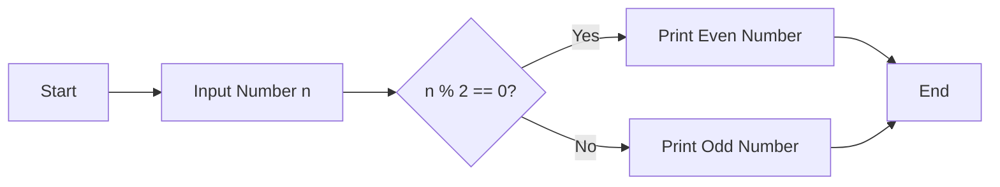
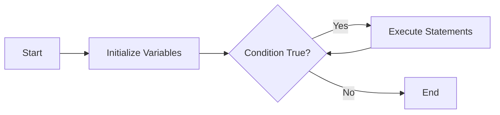
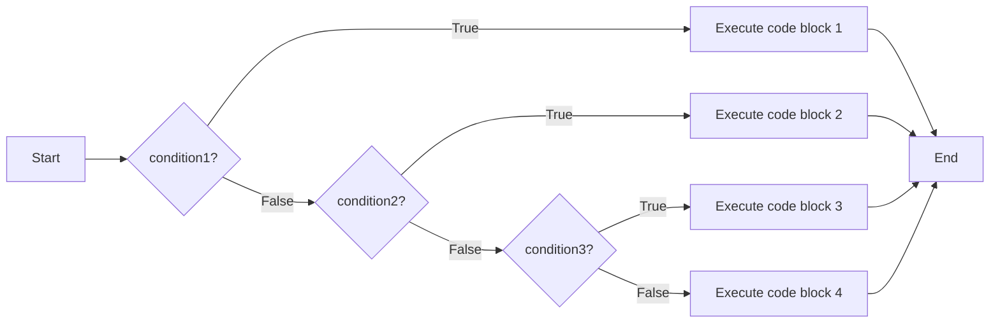

## Question 1(a) [3 marks]

**Lists the Importance of flowchart and algorithm**

**Answer**:

| Importance of Flowchart | Importance of Algorithm |
|-------------------------|-------------------------|
| Visual representation of program logic | Step-by-step procedure to solve a problem |
| Easier to debug and identify errors | Language-independent solution approach |
| Helps in understanding complex processes | Serves as a foundation for programming |
| Improves communication among team members | Defines logic before coding begins |

**Mnemonic:** "VASE Decisions" - Visualize, Analyze, Sequence, Execute

## Question 1(b) [4 marks]

**Draw a flowchart to find the entered number is even or odd.**

**Answer**:



**Key Steps:**

- **Input collection**: Get number from user
- **Modulo operation**: Divide by 2 and check remainder
- **Conditional output**: Display result based on remainder

**Mnemonic:** "MODE" - Modulo Operation Determines Evenness

## Question 1(c) [7 marks]

**List out all Logical operators and explain each by giving python code example.**

**Answer**:

| Operator | Description | Example | Output |
|----------|-------------|---------|--------|
| `and` | Returns True if both statements are true | `x = 5; print(x > 3 and x < 10)` | `True` |
| `or` | Returns True if one of the statements is true | `x = 5; print(x > 10 or x == 5)` | `True` |
| `not` | Reverse the result, returns False if result is true | `x = 5; print(not(x > 3))` | `False` |

**Code Example:**

```python
# Logical AND example
age = 25
income = 50000
print("Loan eligibility:", age > 18 and income > 30000)  # True

# Logical OR example
has_credit_card = False
has_cash = True
print("Can purchase:", has_credit_card or has_cash)  # True

# Logical NOT example
is_holiday = False
print("Should work today:", not is_holiday)  # True
```

**Mnemonic:** "AON Clarity" - And, Or, Not for logical clarity

## Question 1(c) OR [7 marks]

**Develop a Program that can calculate simple interest and compound interest on given data.**

**Answer**:

```python
# Program to calculate Simple and Compound Interest

# Input values
principal = float(input("Enter principal amount: "))
rate = float(input("Enter rate of interest (in %): "))
time = float(input("Enter time period (in years): "))

# Calculate Simple Interest
simple_interest = (principal * rate * time) / 100

# Calculate Compound Interest
compound_interest = principal * ((1 + rate/100) ** time - 1)

# Display results
print("Simple Interest:", round(simple_interest, 2))
print("Compound Interest:", round(compound_interest, 2))
```

**Key Formulas:**

- **Simple Interest (SI)**: Principal × Rate × Time / 100
- **Compound Interest (CI)**: Principal × ((1 + Rate/100)^Time - 1)

**Mnemonic:** "PRT Money Grows" - Principal, Rate, Time make money grow

## Question 2(a) [3 marks]

**Create a Program to find a minimum number among the given three numbers.**

**Answer**:

```python
# Program to find minimum of three numbers

# Input three numbers
num1 = float(input("Enter first number: "))
num2 = float(input("Enter second number: "))
num3 = float(input("Enter third number: "))

# Find minimum using built-in min() function
minimum = min(num1, num2, num3)

# Display result
print("Minimum number is:", minimum)
```

**Mnemonic:** "MIN Finds Least" - Minimum Is Numerically Found with Least

## Question 2(b) [4 marks]

**Define pseudocode. Write pseudocode to find Largest of three numbers x, y and z.**

**Answer**:

| Pseudocode Definition |
|-----------------------|
| A detailed yet readable description of what a computer program must do, expressed in a formally-styled natural language rather than in a programming language. |

**Pseudocode for finding largest of three numbers:**

```
BEGIN
    INPUT x, y, z
    SET largest = x
    
    IF y > largest THEN
        SET largest = y
    END IF
    
    IF z > largest THEN
        SET largest = z
    END IF
    
    OUTPUT "Largest number is: ", largest
END
```

**Mnemonic:** "PIE Writing" - Program Ideas Expressed in simple writing

## Question 2(c) [7 marks]

**Explain While loop in python with its syntax, flowchart and with python code example.**

**Answer**:

**Syntax:**

```python
while condition:
    # code to be executed
```

**Flowchart:**



**Code Example:**

```python
# Print first 5 natural numbers using while loop
count = 1

while count <= 5:
    print(count)
    count += 1  # Increment counter

# Output:
# 1
# 2
# 3
# 4
# 5
```

**Key Characteristics:**

- **Entry controlled**: Condition checked before loop execution
- **Initialization**: Variables set before the loop
- **Updation**: Variables updated inside the loop
- **Termination**: Loop exits when condition becomes False

**Mnemonic:** "IUTE Loop" - Initialize, Update, Test for Exit

## Question 2(a) OR [3 marks]

**Describe continue statement in python in brief.**

**Answer**:

| Continue Statement in Python |
|------------------------------|
| The continue statement skips the current iteration of a loop and continues with the next iteration |
| When encountered, the code inside the loop following the continue statement is skipped |
| Useful for skipping specific conditions while keeping the loop running |

**Code Example:**

```python
# Skip printing even numbers
for i in range(1, 6):
    if i % 2 == 0:
        continue
    print(i)  # Prints only 1, 3, 5
```

**Mnemonic:** "SKIP Ahead" - Skip Keeping Iteration Process

## Question 2(b) OR [4 marks]

**What is the output of the following code:**

```python
x=8
y=2
print (x*y)
print (x ** y)
print (x % y)
print(x>y)
```

**Answer**:

| Operation | Result | Explanation |
|-----------|--------|-------------|
| `x*y` | `16` | Multiplication: 8 × 2 = 16 |
| `x**y` | `64` | Exponentiation: 8² = 64 |
| `x%y` | `0` | Modulo (remainder): 8 ÷ 2 = 4 with remainder 0 |
| `x>y` | `True` | Comparison: 8 > 2 is True |

**Mnemonic:** "MEMO" - Multiply, Exponent, Modulo, Operator comparison

## Question 2(c) OR [7 marks]

**Explain if-elif-else Ladder in python with its syntax, flowchart and with python code example.**

**Answer**:

**Syntax:**

```python
if condition1:
    # code block 1
elif condition2:
    # code block 2
elif condition3:
    # code block 3
else:
    # code block 4
```

**Flowchart:**



**Code Example:**

```python
# Grade calculation based on marks
marks = 75

if marks >= 90:
    grade = "A+"
elif marks >= 80:
    grade = "A"
elif marks >= 70:
    grade = "B"
elif marks >= 60:
    grade = "C"
else:
    grade = "D"

print("Grade:", grade)  # Output: Grade: B
```

**Key Characteristics:**

- **Sequential evaluation**: Conditions checked from top to bottom
- **Exclusive execution**: Only one block executes
- **Default action**: Else block executes if no conditions are True

**Mnemonic:** "SEEP Logic" - Sequential Evaluation with Exclusive Path

## Question 3(a) [3 marks]

**Write a Python program to print odd numbers between 1 to 20 using loops.**

**Answer**:

```python
# Program to print odd numbers between 1 to 20

# Using for loop with range and step
for number in range(1, 21, 2):
    print(number, end=" ")

# Output: 1 3 5 7 9 11 13 15 17 19
```

**Alternate approach:**

```python
# Using for loop with if condition
for number in range(1, 21):
    if number % 2 != 0:
        print(number, end=" ")
```

**Mnemonic:** "STEO" - Skip Two, Extract Odds

## Question 3(b) [4 marks]

**Explain Nested if statement in brief.**

**Answer**:

| Nested if Statement |
|---------------------|
| An if statement inside another if statement |
| Allows for more complex conditional logic |
| Inner if only evaluated when outer if is True |
| Can have multiple levels of nesting |

**Code Example:**

```python
age = 25
income = 50000

if age > 18:
    print("Adult")
    if income > 30000:
        print("Eligible for credit card")
    else:
        print("Not eligible for credit card")
else:
    print("Minor")
```

**Mnemonic:** "LION" - Layered If-statements Operating Nested

## Question 3(c) [7 marks]

**Using a user-defined function write a Program to check entered number is an 'Armstrong number' or a palindrome in which number is passed as argument in calling function.**

**Answer**:

```python
# Program to check Armstrong number or palindrome

def check_number(num):
    # Check if Armstrong number
    # An Armstrong number is one where sum of each digit raised to power of
    # total digits equals the original number
    temp = num
    digits = len(str(num))
    sum = 0
    
    while temp > 0:
        digit = temp % 10
        sum += digit ** digits
        temp //= 10
    
    is_armstrong = (sum == num)
    
    # Check if palindrome
    # A palindrome reads the same backward as forward
    is_palindrome = (str(num) == str(num)[::-1])
    
    # Return results
    return is_armstrong, is_palindrome

# Get input from user
number = int(input("Enter a number: "))

# Call function and display results
armstrong, palindrome = check_number(number)

if armstrong:
    print(number, "is an Armstrong number")
else:
    print(number, "is not an Armstrong number")
    
if palindrome:
    print(number, "is a Palindrome")
else:
    print(number, "is not a Palindrome")
```

**Armstrong Examples:**

- 153: 1³ + 5³ + 3³ = 1 + 125 + 27 = 153 ✓
- 370: 3³ + 7³ + 0³ = 27 + 343 + 0 = 370 ✓

**Palindrome Examples:**

- 121: Same forward and backward ✓
- 123: Not same backward (321) ✗

**Mnemonic:** "APTEST" - Armstrong Palindrome Test Equal Sum Test

## Question 3(a) OR [3 marks]

**Write a python program to find sum of 1 to 100.**

**Answer**:

```python
# Program to find sum of numbers from 1 to 100

# Method 1: Using loop
total = 0
for num in range(1, 101):
    total += num
print("Sum using loop:", total)

# Method 2: Using formula n(n+1)/2
n = 100
sum_formula = n * (n + 1) // 2
print("Sum using formula:", sum_formula)

# Output: 
# Sum using loop: 5050
# Sum using formula: 5050
```

**Mnemonic:** "SUM Formula" - Sum Using Mathematical Formula

## Question 3(b) OR [4 marks]

**Write a python program to print the following pattern.**

```
1
2 3
4 5 6
7 8 9 10
```

**Answer**:

```python
# Program to print the number pattern

num = 1
for i in range(1, 5):  # 4 rows
    for j in range(i):  # columns equal to row number
        print(num, end=" ")
        num += 1
    print()  # New line after each row
```

**Pattern Logic:**

- **Row 1**: 1 number (1)
- **Row 2**: 2 numbers (2, 3)
- **Row 3**: 3 numbers (4, 5, 6)
- **Row 4**: 4 numbers (7, 8, 9, 10)

**Mnemonic:** "CNIR" - Counter Number Increases with Rows

## Question 3(c) OR [7 marks]

**Write a Program using the function that reverses the entered value.**

**Answer**:

```python
# Program to reverse entered value using functions

def reverse_number(num):
    """Function to reverse an integer number"""
    return int(str(num)[::-1])

def reverse_string(text):
    """Function to reverse a string"""
    return text[::-1]

# Main program
def main():
    choice = input("What do you want to reverse? (n for number, s for string): ")
    
    if choice.lower() == 'n':
        num = int(input("Enter a number: "))
        print("Reversed number:", reverse_number(num))
    elif choice.lower() == 's':
        text = input("Enter a string: ")
        print("Reversed string:", reverse_string(text))
    else:
        print("Invalid choice!")

# Call the main function
main()
```

**Alternate Method for Number Reversal:**

```python
def reverse_number_algorithm(num):
    reversed_num = 0
    while num > 0:
        digit = num % 10
        reversed_num = reversed_num * 10 + digit
        num //= 10
    return reversed_num
```

**Mnemonic:** "FLIP Digits" - Function Logic Inverts Position of Digits

## Question 4(a) [3 marks]

**Describe python math module with proper python code example.**

**Answer**:

| Python Math Module Features |
|----------------------------|
| Provides mathematical functions and constants |
| Includes trigonometric, logarithmic, and other functions |
| Contains mathematical constants like pi and e |
| Requires import before use |

**Code Example:**

```python
import math

# Constants
print("Value of pi:", math.pi)  # 3.141592653589793
print("Value of e:", math.e)    # 2.718281828459045

# Basic math functions
print("Square root of 16:", math.sqrt(16))  # 4.0
print("5 raised to power 3:", math.pow(5, 3))  # 125.0

# Trigonometric functions (radians)
print("Sine of 90°:", math.sin(math.pi/2))  # 1.0
print("Cosine of 0°:", math.cos(0))  # 1.0

# Logarithmic functions
print("Log base 10 of 100:", math.log10(100))  # 2.0
print("Natural log of e:", math.log(math.e))  # 1.0
```

**Mnemonic:** "CALM Operations" - Constants And Logarithmic Mathematical Operations

## Question 4(b) [4 marks]

**Write a python program that explains scope of variable.**

**Answer**:

```python
# Program to demonstrate variable scope in Python

# Global variable
global_var = "I am global"

def demonstration():
    # Local variable
    local_var = "I am local"
    
    # Accessing global variable
    print("Inside function - Global variable:", global_var)
    
    # Accessing local variable
    print("Inside function - Local variable:", local_var)
    
    # Creating a variable with same name as global
    global_var = "I am local with global name"
    print("Inside function - Shadowed global:", global_var)

# Function call
demonstration()

# Accessing global variable
print("Outside function - Global variable:", global_var)

# Trying to access local variable would cause error
# print("Outside function - Local variable:", local_var)  # Error!
```

**Output:**

```
Inside function - Global variable: I am global
Inside function - Local variable: I am local
Inside function - Shadowed global: I am local with global name
Outside function - Global variable: I am global
```

**Mnemonic:** "GLOVES" - Global Local Variable Encapsulation System

## Question 4(c) [7 marks]

**Explain List Methods and its built-in Functions**

**Answer**:

| Method/Function | Description | Example | Output |
|-----------------|-------------|---------|--------|
| `append()` | Adds an element at the end | `fruits = ['apple']; fruits.append('banana'); print(fruits)` | `['apple', 'banana']` |
| `insert()` | Adds element at specified position | `nums = [1, 3]; nums.insert(1, 2); print(nums)` | `[1, 2, 3]` |
| `remove()` | Removes specified item | `colors = ['red', 'blue']; colors.remove('red'); print(colors)` | `['blue']` |
| `pop()` | Removes item at specified index | `letters = ['a', 'b', 'c']; x = letters.pop(1); print(x, letters)` | `b ['a', 'c']` |
| `clear()` | Removes all elements | `items = [1, 2]; items.clear(); print(items)` | `[]` |
| `len()` | Returns number of elements | `print(len([1, 2, 3]))` | `3` |
| `sorted()` | Returns sorted list | `print(sorted([3, 1, 2]))` | `[1, 2, 3]` |
| `max()/min()` | Returns max/min value | `print(max([5, 10, 3]), min([5, 10, 3]))` | `10 3` |

**Code Example:**

```python
# Create a list
my_list = [3, 1, 4, 1, 5]
print("Original:", my_list)

# Add elements
my_list.append(9)
print("After append:", my_list)

my_list.insert(2, 7)
print("After insert:", my_list)

# Remove elements
my_list.remove(1)  # Removes first occurrence of 1
print("After remove:", my_list)

popped = my_list.pop()  # Removes & returns last element
print("Popped value:", popped)
print("After pop:", my_list)

# Other operations
print("Length:", len(my_list))
print("Sorted:", sorted(my_list))
print("Sum:", sum(my_list))
print("Count of 1:", my_list.count(1))
```

**Mnemonic:** "LISP Operations" - List Insert Sort Pop Operations

## Question 4(a) OR [3 marks]

**List out Python standard library mathematical functions.**

**Answer**:

| Mathematical Function | Description | Example |
|----------------------|-------------|---------|
| `abs()` | Returns absolute value | `abs(-5)` → `5` |
| `round()` | Rounds to nearest integer | `round(3.7)` → `4` |
| `max()` | Returns largest item | `max(1, 5, 3)` → `5` |
| `min()` | Returns smallest item | `min(1, 5, 3)` → `1` |
| `sum()` | Adds items of iterable | `sum([1, 2, 3])` → `6` |
| `pow()` | Returns x to power y | `pow(2, 3)` → `8` |
| `divmod()` | Returns quotient and remainder | `divmod(7, 2)` → `(3, 1)` |

**Additional from math module:**

- `math.sqrt()`: Square root
- `math.floor()`: Rounds down
- `math.ceil()`: Rounds up
- `math.factorial()`: Factorial of a number
- `math.gcd()`: Greatest common divisor

**Mnemonic:** "SMART Calculations" - Standard Mathematical Arithmetic Routines and Tools

## Question 4(b) OR [4 marks]

**Explain built in function in python.**

**Answer**:

| Built-in Functions in Python |
|------------------------------|
| Pre-defined functions available in Python without importing any module |
| Called directly without any prefix |
| Designed to perform common operations |
| Examples include print(), len(), type(), input(), range() |

**Categories with Examples:**

```python
# Type conversion functions
print(int("10"))       # 10
print(float("10.5"))   # 10.5
print(str(10))         # "10"
print(list("abc"))     # ['a', 'b', 'c']

# Math functions
print(abs(-7))         # 7
print(round(3.7))      # 4
print(max(5, 10, 3))   # 10

# Collection processing
print(len("hello"))    # 5
print(sorted([3,1,2])) # [1, 2, 3]
print(sum([1, 2, 3]))  # 6
```

**Mnemonic:** "EPIC Functions" - Embedded Python Integrated Core Functions

## Question 4(c) OR [7 marks]

**Write a Python Program to count and display the number of vowels, consonants, uppercase, lowercase characters in a string.**

**Answer**:

```python
# Program to count vowels, consonants, uppercase and lowercase characters

def analyze_string(text):
    # Initialize counters
    vowels = 0
    consonants = 0
    uppercase = 0
    lowercase = 0
    
    # Define vowels
    vowel_set = {'a', 'e', 'i', 'o', 'u'}
    
    # Analyze each character
    for char in text:
        # Check if alphabetic
        if char.isalpha():
            # Check case
            if char.isupper():
                uppercase += 1
            else:
                lowercase += 1
                
            # Check if vowel (case-insensitive)
            if char.lower() in vowel_set:
                vowels += 1
            else:
                consonants += 1
    
    # Return results
    return vowels, consonants, uppercase, lowercase

# Get input
text = input("Enter a string: ")

# Get counts
vowels, consonants, uppercase, lowercase = analyze_string(text)

# Display results
print("Number of vowels:", vowels)
print("Number of consonants:", consonants)
print("Number of uppercase characters:", uppercase)
print("Number of lowercase characters:", lowercase)
```

**Example:**

- Input: "Hello World!"
- Output:
  - Vowels: 3 (e, o, o)
  - Consonants: 7 (H, l, l, W, r, l, d)
  - Uppercase: 2 (H, W)
  - Lowercase: 8 (e, l, l, o, o, r, l, d)

**Mnemonic:** "VOCAL Analysis" - Vowels Or Consonants And Letter case

## Question 5(a) [3 marks]

**Write a python code to swap given two elements in a list.**

**Answer**:

```python
# Program to swap two elements in a list

def swap_elements(lst, pos1, pos2):
    """Function to swap two elements in a list"""
    lst[pos1], lst[pos2] = lst[pos2], lst[pos1]
    return lst

# Example usage
my_list = [10, 20, 30, 40, 50]
print("Original list:", my_list)

# Swap elements at positions 1 and 3
result = swap_elements(my_list, 1, 3)
print("After swapping elements at positions 1 and 3:", result)

# Output:
# Original list: [10, 20, 30, 40, 50]
# After swapping elements at positions 1 and 3: [10, 40, 30, 20, 50]
```

**Mnemonic:** "STEP Logic" - Swap Two Elements with Python Logic

## Question 5(b) [4 marks]

**Write a python Program to check if a substring is present in a given string.**

**Answer**:

```python
# Program to check if a substring is present in a string

def check_substring(main_string, sub_string):
    """Function to check if a substring exists in a string"""
    if sub_string in main_string:
        return True
    else:
        return False

# Get input from user
main_string = input("Enter the main string: ")
sub_string = input("Enter the substring to find: ")

# Check and display result
if check_substring(main_string, sub_string):
    print(f"'{sub_string}' is present in '{main_string}'")
else:
    print(f"'{sub_string}' is not present in '{main_string}'")
```

**Alternate method using find():**

```python
def check_substring_find(main_string, sub_string):
    """Using find method to check substring"""
    position = main_string.find(sub_string)
    return position != -1  # Returns True if substring found
```

**Mnemonic:** "FIND Method" - Find IN Directly with Methods

## Question 5(c) [7 marks]

**Explain tuple Operations, Functions and Methods**

**Answer**:

| Operation/Function/Method | Description | Example | Output |
|--------------------------|-------------|---------|--------|
| **Creation** | Create tuples with parentheses | `t = (1, 2, 3)` | `(1, 2, 3)` |
| **Indexing** | Access tuple elements | `t[1]` | `2` |
| **Slicing** | Get subset of tuple | `t[1:3]` | `(2, 3)` |
| **Concatenation** | Join two tuples | `(1, 2) + (3, 4)` | `(1, 2, 3, 4)` |
| **Repetition** | Repeat tuple elements | `(1, 2) * 2` | `(1, 2, 1, 2)` |
| **Membership** | Check if element exists | `3 in (1, 2, 3)` | `True` |
| **len()** | Get number of items | `len((1, 2, 3))` | `3` |
| **min()/max()** | Find min/max value | `min((3, 1, 2))` | `1` |
| **count()** | Count occurrences of value | `(1, 2, 1).count(1)` | `2` |
| **index()** | Find position of value | `(1, 2, 3).index(2)` | `1` |
| **sorted()** | Return sorted list from tuple | `sorted((3, 1, 2))` | `[1, 2, 3]` |

**Code Example:**

```python
# Create a tuple
my_tuple = (3, 1, 4, 1, 5, 9)
print("Original tuple:", my_tuple)

# Accessing elements
print("First element:", my_tuple[0])
print("Last element:", my_tuple[-1])
print("Slice (1:4):", my_tuple[1:4])

# Operations
tuple2 = (2, 7)
combined = my_tuple + tuple2
print("Concatenated:", combined)

repeated = tuple2 * 3
print("Repeated:", repeated)

# Functions and methods
print("Length:", len(my_tuple))
print("Count of 1:", my_tuple.count(1))
print("Index of 4:", my_tuple.index(4))
print("Min value:", min(my_tuple))
print("Max value:", max(my_tuple))
print("Sorted:", sorted(my_tuple))  # Returns a list

# Unpacking
a, b, c, *rest = my_tuple
print("Unpacked:", a, b, c, rest)
```

**Mnemonic:** "ICONS" - Immutable Collection Operations, Numbering, and Searching

## Question 5(a) OR [3 marks]

**Write a python program find the sum of elements in a list.**

**Answer**:

```python
# Program to find sum of elements in a list

def sum_of_list(numbers):
    """Function to find sum of all elements in a list"""
    total = 0
    for num in numbers:
        total += num
    return total

# Example with user input
num_elements = int(input("Enter the number of elements: "))
my_list = []

# Get elements from user
for i in range(num_elements):
    element = float(input(f"Enter element {i+1}: "))
    my_list.append(element)

# Calculate sum using function
result1 = sum_of_list(my_list)
print("Sum using custom function:", result1)

# Calculate sum using built-in sum() function
result2 = sum(my_list)
print("Sum using built-in function:", result2)
```

**Mnemonic:** "SALT" - Sum All List Together

## Question 5(b) OR [4 marks]

**Write a Program to demonstrate the set functions and operations.**

**Answer**:

```python
# Program to demonstrate set functions and operations

# Creating sets
set1 = {1, 2, 3, 4, 5}
set2 = {4, 5, 6, 7, 8}

print("Set 1:", set1)
print("Set 2:", set2)

# Set operations
print("\nSet Operations:")
print("Union:", set1 | set2)  # Alternative: set1.union(set2)
print("Intersection:", set1 & set2)  # Alternative: set1.intersection(set2)
print("Difference (set1-set2):", set1 - set2)  # Alternative: set1.difference(set2)
print("Symmetric Difference:", set1 ^ set2)  # Alternative: set1.symmetric_difference(set2)

# Set methods
print("\nSet Methods:")
set3 = set1.copy()
print("Copy of set1:", set3)

set3.add(6)
print("After adding 6:", set3)

set3.remove(1)
print("After removing 1:", set3)

set3.discard(10)  # No error if element doesn't exist
print("After discarding 10:", set3)

popped = set3.pop()
print("Popped element:", popped)
print("After pop:", set3)

set3.clear()
print("After clear:", set3)

# Check subset/superset
print("\nSubset/Superset:")
subset = {4, 5}
print(f"Is {subset} subset of {set1}?", subset.issubset(set1))
print(f"Is {set1} superset of {subset}?", set1.issuperset(subset))
```

**Mnemonic:** "COSI Methods" - Create, Operate, Search, Investigate with Set Methods

## Question 5(c) OR [7 marks]

**Write a Program to demonstrate the dictionaries functions and operations.**

**Answer**:

```python
# Program to demonstrate dictionary functions and operations

# Creating a dictionary
student = {
    'name': 'John',
    'roll_no': 101,
    'marks': 85,
    'subjects': ['Python', 'Math', 'English']
}

print("Original Dictionary:", student)

# Accessing elements
print("\nAccessing Elements:")
print("Name:", student['name'])
print("Marks:", student['marks'])

# Using get() - safer access method
print("Roll Number (using get):", student.get('roll_no'))
print("Address (using get):", student.get('address', 'Not available'))  # Default value if key not found

# Modifying values
print("\nModifying Dictionary:")
student['marks'] = 90
print("After updating marks:", student)

# Adding new key-value pairs
student['address'] = 'New York'
print("After adding address:", student)

# Removing items
print("\nRemoving Items:")
removed_value = student.pop('address')
print("Removed value:", removed_value)
print("After pop():", student)

# Removing last inserted item
last_item = student.popitem()
print("Last removed item:", last_item)
print("After popitem():", student)

# Dictionary methods
print("\nDictionary Methods:")
print("Keys:", list(student.keys()))
print("Values:", list(student.values()))
print("Items:", list(student.items()))

# Creating a copy
student_copy = student.copy()
print("\nCopy of dictionary:", student_copy)

# Clearing the dictionary
student.clear()
print("After clear():", student)

# Creating dictionary with dict() constructor
new_dict = dict(name='Alice', age=20, city='Boston')
print("\nCreated with dict() constructor:", new_dict)

# Dictionary comprehension example
squares = {x: x**2 for x in range(1, 6)}
print("\nDictionary comprehension result:", squares)
```

**Key Operations:**

- **Access**: Using key or get() method
- **Modify**: Assign new value to existing key
- **Add**: Assign value to new key
- **Remove**: Using pop(), popitem(), or del statement
- **Iterate**: Through keys, values, or items

**Mnemonic:** "ACME Dictionary" - Access, Create, Modify, Extract from Dictionary
