## પ્રશ્ન 1(a) [3 ગુણ]

**આપેલ નંબર પોઝિટિવ છે કે નેગેટિવ તે તપાસવા માટે સ્યૂડો કોડ લખો**

**જવાબ**:

```
BEGIN
    Input number
    IF number > 0 THEN
        Display "Number is positive"
    ELSE IF number < 0 THEN
        Display "Number is negative"
    ELSE
        Display "Number is zero"
    END IF
END
```

**મેમરી ટ્રીક:** "શૂન્ય સાથે સરખાવો"

## પ્રશ્ન 1(b) [4 ગુણ]

**એલ્ગોરિધમ વ્યાખ્યાયિત કરો અને ત્રણ નંબર માંથી મહત્તમ નંબર શોધવાનો એલ્ગોરિધમ બનાવો.**

**જવાબ**:

**Algorithm વ્યાખ્યા**: એલ્ગોરિધમ એટલે ચોક્કસ સમસ્યાને ઉકેલવા માટે અથવા ગણતરી કરવા માટે બનાવેલ સ્ટેપ-બાય-સ્ટેપ પ્રક્રિયા અથવા નિયમોનો સેટ.

**ત્રણ નંબરમાંથી મહત્તમ શોધવાનો એલ્ગોરિધમ**:

```
BEGIN
    Input num1, num2, num3
    Set max = num1
    IF num2 > max THEN
        Set max = num2
    END IF
    IF num3 > max THEN
        Set max = num3
    END IF
    Display max
END
```

**ડાયાગ્રામ**:

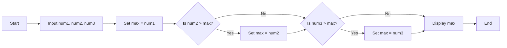

**મેમરી ટ્રીક:** "સરખામણી અને બદલો"

## પ્રશ્ન 1(c) [7 ગુણ]

**તાપમાન ના સેલ્સિયસ ને ફેરનહાઇટ માં કન્વર્ટ કરવાનો પાયથોન કોડ લખો.**

**જવાબ**:

```python
# સેલ્સિયસથી ફેરનહાઇટ રૂપાંતરનો પ્રોગ્રામ

# યુઝર પાસેથી સેલ્સિયસ તાપમાન મેળવો
celsius = float(input("સેલ્સિયસમાં તાપમાન દાખલ કરો: "))

# સૂત્ર વાપરીને ફેરનહાઇટમાં રૂપાંતરિત કરો: F = (C * 9/5) + 32
fahrenheit = (celsius * 9/5) + 32

# પરિણામ દર્શાવો
print(f"{celsius}°C એ {fahrenheit}°F ની બરાબર છે")
```

**ટેબલ: તાપમાન રૂપાંતરણ**:

| ઘટક | વર્ણન |
|-----------|-------------|
| **ઇનપુટ** | સેલ્સિયસમાં તાપમાન |
| **સૂત્ર** | F = (C × 9/5) + 32 |
| **આઉટપુટ** | ફેરનહાઇટમાં તાપમાન |

**મેમરી ટ્રીક:** "9થી ગુણાકાર, 5થી ભાગાકાર, 32 ઉમેરો"

## પ્રશ્ન 1(c OR) [7 ગુણ]

**કંપેરિઝન ઓપરેટર નું લિસ્ટ આપો અને દરેકને પાયથોન કોડના ઉદાહરણ સાથે સમજાવો.**

**જવાબ**:

**ટેબલ: પાયથોન કંપેરિઝન ઓપરેટર્સ**

| ઓપરેટર | વર્ણન | ઉદાહરણ | પરિણામ |
|----------|-------------|---------|--------|
| **==** | બરાબર છે | `5 == 5` | `True` |
| **!=** | બરાબર નથી | `5 != 6` | `True` |
| **>** | કરતાં મોટું | `6 > 3` | `True` |
| **<** | કરતાં નાનું | `3 < 6` | `True` |
| **>=** | કરતાં મોટું અથવા બરાબર | `5 >= 5` | `True` |
| **<=** | કરતાં નાનું અથવા બરાબર | `5 <= 5` | `True` |

**કોડ ઉદાહરણ**:

```python
# પાયથોન કંપેરિઝન ઓપરેટર્સ ઉદાહરણ
a = 10
b = 5

# બરાબર છે
print(f"{a} == {b}: {a == b}")  # False

# બરાબર નથી
print(f"{a} != {b}: {a != b}")  # True

# કરતાં મોટું
print(f"{a} > {b}: {a > b}")    # True

# કરતાં નાનું
print(f"{a} < {b}: {a < b}")    # False

# કરતાં મોટું અથવા બરાબર
print(f"{a} >= {b}: {a >= b}")  # True

# કરતાં નાનું અથવા બરાબર
print(f"{a} <= {b}: {a <= b}")  # False
```

**મેમરી ટ્રીક:** "સરખાવો" (સમાન, રિલેશનલ, ખાસ સરખામણી, અસમાનતા, વધુ ઓછું)

## પ્રશ્ન 2(a) [3 ગુણ]

**પાયથોન ના ડેટા ટાઇપ સમજાવો.**

**જવાબ**:

**ટેબલ: પાયથોન ડેટા ટાઇપ્સ**

| ડેટા ટાઇપ | વર્ણન | ઉદાહરણ |
|-----------|-------------|---------|
| **int** | પૂર્ણાંક મૂલ્યો | `x = 10` |
| **float** | દશાંશ બિંદુ મૂલ્યો | `y = 10.5` |
| **str** | ટેક્સ્ટ અથવા અક્ષર મૂલ્યો | `name = "Python"` |
| **bool** | તાર્કિક મૂલ્યો (True/False) | `is_valid = True` |
| **list** | ક્રમબદ્ધ, બદલી શકાય તેવો સંગ્રહ | `nums = [1, 2, 3]` |
| **tuple** | ક્રમબદ્ધ, ન બદલી શકાય તેવો સંગ્રહ | `point = (5, 10)` |
| **dict** | કી-વેલ્યુ જોડી | `student = {"name": "John"}` |

**મેમરી ટ્રીક:** "NIFTY SLD" (નંબર્સ, ઇન્ટીજર્સ, ફ્લોટ્સ, ટેક્સ્ટ, યસ/નો, સીક્વન્સીસ, લિસ્ટ્સ, ડિક્શનરીઝ)

## પ્રશ્ન 2(b) [4 ગુણ]

**Nested If પાયથોન કોડ ના ઉદાહરણ સાથે સમજાવો.**

**જવાબ**:

**Nested if**: એક conditional statement ની અંદર બીજું conditional statement લખવાને nested if કહેવામાં આવે છે. તે ઘણી શરતોને ક્રમમાં તપાસવાની મંજૂરી આપે છે.

```python
# નંબર પોઝિટિવ, નેગેટિવ કે શૂન્ય છે તે ચકાસવા માટેનો nested if ઉદાહરણ
# અને જો પોઝિટિવ હોય, તો તે સમ છે કે વિષમ તે ચકાસો

num = int(input("એક નંબર દાખલ કરો: "))

if num > 0:
    print("પોઝિટિવ નંબર")
    # nested if જે ચકાસે છે કે પોઝિટિવ નંબર સમ છે કે વિષમ
    if num % 2 == 0:
        print("સમ નંબર")
    else:
        print("વિષમ નંબર")
elif num < 0:
    print("નેગેટિવ નંબર")
else:
    print("શૂન્ય")
```

**ડાયાગ્રામ**:

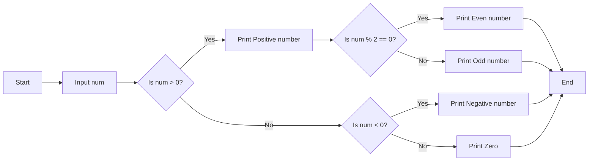

**મેમરી ટ્રીક:** "ચેક અંદર ચેક"

## પ્રશ્ન 2(c) [7 ગુણ]

**ઉદાહરણ સાથે વિવિધ પ્રકારના પસંદગી/નિર્ણય લેવાના ફ્લો-ઓફ-કંટ્રોલ સ્ટ્રક્ચર ઉપયોગ સમજાવો**

**જવાબ**:

**ટેબલ: પાયથોનમાં સિલેક્શન કંટ્રોલ સ્ટ્રક્ચર્સ**

| સ્ટ્રક્ચર | હેતુ | વપરાશ |
|-----------|---------|----------|
| **if** | શરત સાચી હોય ત્યારે કોડ ચલાવવા | સરળ શરત ચકાસણી |
| **if-else** | સાચી શરત માટે એક કોડ, ખોટી માટે બીજો | દ્વિ નિર્ણય લેવા |
| **if-elif-else** | ઘણી શરતો ચકાસવી | ઘણા સંભવિત પરિણામો |
| **Nested if** | શરત અંદર બીજી શરત | જટિલ શ્રેણીબદ્ધ નિર્ણયો |
| **Ternary operator** | એક લાઇન if-else | સરળ શરતી નિયુક્તિ |

**કોડ ઉદાહરણ**:

```python
# વિવિધ સિલેક્શન સ્ટ્રક્ચર્સનું ઉદાહરણ
score = int(input("તમારો સ્કોર દાખલ કરો: "))

# સાદું if
if score >= 90:
    print("ઉત્તમ!")

# if-else
if score >= 60:
    print("તમે પાસ થયા છો.")
else:
    print("તમે નાપાસ થયા છો.")

# if-elif-else
if score >= 90:
    grade = "A"
elif score >= 80:
    grade = "B"
elif score >= 70:
    grade = "C"
elif score >= 60:
    grade = "D"
else:
    grade = "F"
print(f"તમારો ગ્રેડ {grade} છે")

# Ternary operator
result = "પાસ" if score >= 60 else "નાપાસ"
print(result)
```

**મેમરી ટ્રીક:** "SCENE" (સિમ્પલ if, કન્ડિશન્સ વિથ else, Elif ફોર મલ્ટિપલ, Nested ફોર કોમ્પ્લેક્સ, એક્સપ્રેસ વિથ ટર્નરી)

## પ્રશ્ન 2(a) [3 ગુણ] - OR ઓપ્શન

**વેરિયેબલ વ્યાખ્યાયિત કરવાના નિયમો લિસ્ટ કરો.**

**જવાબ**:

**ટેબલ: પાયથોનમાં વેરિએબલ્સ વ્યાખ્યાયિત કરવાના નિયમો**

| નિયમ | વર્ણન | ઉદાહરણ |
|------|-------------|---------|
| **અક્ષર અથવા અન્ડરસ્કોરથી શરૂ કરો** | પ્રથમ અક્ષર એક લેટર અથવા અન્ડરસ્કોર હોવો જોઈએ | `name = "John"`, `_count = 10` |
| **કોઈ ખાસ અક્ષરો નહીં** | માત્ર અક્ષરો, અંકો અને અન્ડરસ્કોર માન્ય | `user_name` (માન્ય), `user-name` (અમાન્ય) |
| **કેસ સેન્સિટિવ** | મોટા અક્ષરો અને નાના અક્ષરો અલગ | `age` અને `Age` અલગ વેરિએબલ્સ છે |
| **રિઝર્વ્ડ કીવર્ડ્સ નહીં** | પાયથોન કીવર્ડ્સને વેરિએબલ નામ તરીકે ઉપયોગ ન કરી શકાય | `if`, `for`, `while`, વગેરે ઉપયોગ ન કરી શકાય |
| **સ્પેસ નહીં** | સ્પેસને બદલે અન્ડરસ્કોર વાપરો | `first_name` (`first name` નહીં) |

**મેમરી ટ્રીક:** "SILKS" (શરૂઆત યોગ્ય રીતે, ઇગ્નોર સ્પેશિયલ કેરેક્ટર, લૂક એટ કેસ, કીવર્ડ્સ અવોઇડ, સ્પેસ નોટ અલાઉડ)

## પ્રશ્ન 2(b) [4 ગુણ] - OR ઓપ્શન

**ફોર લૂપ ને જરૂરી ઉદાહરણ સાથે સમજાવો.**

**જવાબ**:

**પાયથોનમાં For Loop**: for લૂપનો ઉપયોગ કોઈ sequence (લિસ્ટ, ટપલ, સ્ટ્રીંગ) અથવા અન્ય iterable ઓબ્જેક્ટ પર પુનરાવર્તન કરવા માટે થાય છે. તે sequence ના દરેક આઇટમ માટે કોડનો એક બ્લોક ચલાવે છે.

```python
# પાયથોનમાં for લૂપનો ઉદાહરણ
# લિસ્ટના દરેક એલિમેન્ટને પ્રિન્ટ કરવા
fruits = ["apple", "banana", "cherry"]
for fruit in fruits:
    print(fruit)

# range ફંક્શનનો for લૂપ સાથે ઉપયોગ
print("1 થી 5 સુધીના નંબર:")
for i in range(1, 6):
    print(i)

# સ્ટ્રિંગ સાથે for લૂપનો ઉપયોગ
name = "Python"
for char in name:
    print(char)
```

**ડાયાગ્રામ**:

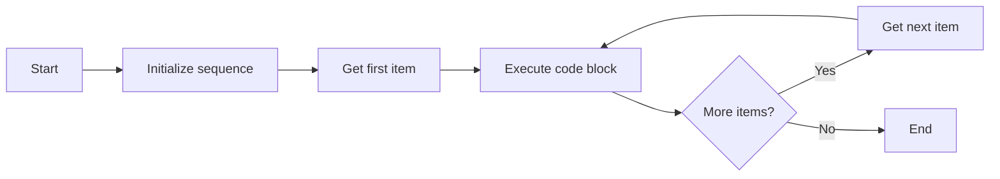

**મેમરી ટ્રીક:** "ITEM" (Iterate Through Each Member) - દરેક સભ્ય પર પુનરાવર્તન કરો

## પ્રશ્ન 2(c) [7 ગુણ] - OR ઓપ્શન

**Break અને continue સ્ટેટમેન્ટને સંક્ષિપ્તમાં સમજાવો.**

**જવાબ**:

**ટેબલ: Break અને Continue સ્ટેટમેન્ટ્સ**

| સ્ટેટમેન્ટ | હેતુ | અસર |
|-----------|---------|--------|
| **break** | લૂપમાંથી તરત જ બહાર નીકળો | વર્તમાન લૂપને અટકાવે છે અને લૂપ પછીના સ્ટેટમેન્ટ પર કંટ્રોલ ટ્રાન્સફર કરે છે |
| **continue** | વર્તમાન પુનરાવર્તન છોડી દો | લૂપના આગલા પુનરાવર્તન પર જાય છે, continue સ્ટેટમેન્ટ પછીના કોઈપણ કોડને છોડી દે છે |

**કોડ ઉદાહરણ**:

```python
# Break સ્ટેટમેન્ટ ઉદાહરણ
print("Break ઉદાહરણ:")
for i in range(1, 11):
    if i == 6:
        print("i =", i, "પર લૂપ તોડીએ છીએ")
        break
    print(i, end=" ")
print("\nલૂપ સમાપ્ત થઈ")

# Continue સ્ટેટમેન્ટ ઉદાહરણ
print("\nContinue ઉદાહરણ:")
for i in range(1, 11):
    if i % 2 == 0:
        continue
    print(i, end=" ")
print("\nમાત્ર વિષમ નંબરો પ્રિન્ટ થયા")
```

**ડાયાગ્રામ**:

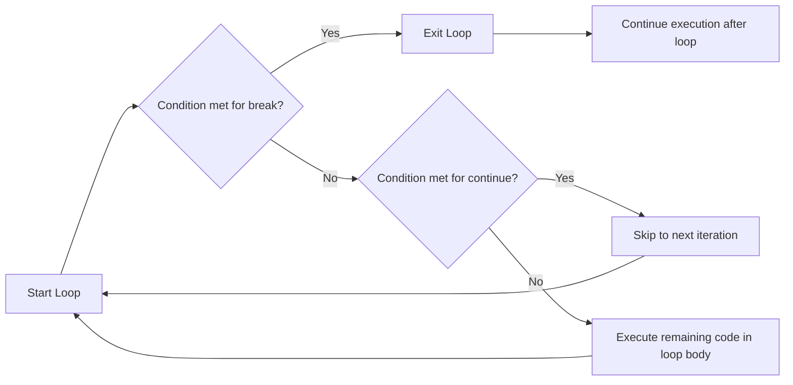

**મેમરી ટ્રીક:** "EXIT SKIP" (EXIT with break, SKIP with continue) - બ્રેક સાથે બહાર નીકળો, કન્ટિન્યુ સાથે છોડી દો

## પ્રશ્ન 3(a) [3 ગુણ]

**1 થી 10 નંબર ને લૂપથી પ્રિન્ટ કરવા માટેનો પાયથન કોડ બનાવો.**

**જવાબ**:

```python
# 1 થી 10 સુધીના નંબર પ્રિન્ટ કરવા for લૂપનો ઉપયોગ
print("for લૂપનો ઉપયોગ કરીને:")
for i in range(1, 11):
    print(i, end=" ")

print("\n\nwhile લૂપનો ઉપયોગ કરીને:")
# 1 થી 10 સુધીના નંબર પ્રિન્ટ કરવા while લૂપનો ઉપયોગ
counter = 1
while counter <= 10:
    print(counter, end=" ")
    counter += 1
```

**ટેબલ: લૂપ અભિગમ**

| અભિગમ | ફાયદો |
|----------|-----------|
| **range સાથે For લૂપ** | સરળ, સંક્ષિપ્ત, આપોઆપ કાઉન્ટર મેનેજ કરે છે |
| **While લૂપ** | જટિલ શરતો માટે વધુ લવચીક |

**મેમરી ટ્રીક:** "COUNT UP" (Counter દરેક પુનરાવર્તનમાં અપડેટ થાય છે)

## પ્રશ્ન 3(b) [4 ગુણ]

**નીચેની પેટર્ન પ્રિન્ટ કરવા માટેનો પાયથન કોડ લખો.**

```
*
**
***
****
*****
```

**જવાબ**:

```python
# for લૂપનો ઉપયોગ કરીને સ્ટાર પેટર્ન પ્રિન્ટ કરો
rows = 5

for i in range(1, rows + 1):
    # દરેક રો માં i જેટલા સ્ટાર પ્રિન્ટ કરો
    print("*" * i)
```

**વૈકલ્પિક ઉકેલ નેસ્ટેડ લૂપ્સ સાથે**:

```python
# નેસ્ટેડ લૂપ્સનો ઉપયોગ કરીને સ્ટાર પેટર્ન પ્રિન્ટ કરો
rows = 5

for i in range(1, rows + 1):
    for j in range(1, i + 1):
        print("*", end="")
    print()  # દરેક રો પછી ન્યુ લાઇન
```

**ડાયાગ્રામ**:

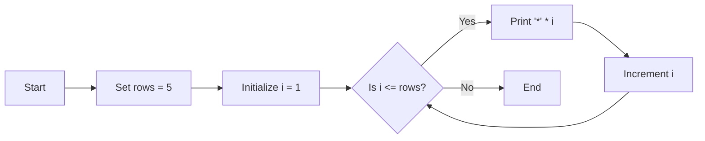

**મેમરી ટ્રીક:** "RISE UP" (Row Increases, Stars Expand Upward Progressively) - રો વધે છે, સ્ટાર ઊપર તરફ વિસ્તરે છે

## પ્રશ્ન 3(c) [7 ગુણ]

**આપેલા નંબર નો factorial શોધવા માટેનું યુઝર ડિફાઇન ફંક્શન બનાવો.**

**જવાબ**:

```python
# આપેલા નંબરનો ફેક્ટોરિયલ શોધવા માટેનું ફંક્શન
def factorial(n):
    # ઇનપુટ માન્ય છે કે નહીં તે ચકાસો
    if not isinstance(n, int) or n < 0:
        return "અમાન્ય ઇનપુટ. કૃપા કરીને નોન-નેગેટિવ ઇન્ટીજર દાખલ કરો."
    
    # બેઝ કેસ: 0 અથવા 1 નો ફેક્ટોરિયલ 1 છે
    if n == 0 or n == 1:
        return 1
    
    # ઇટરેશન વાપરીને ફેક્ટોરિયલ ગણતરી
    result = 1
    for i in range(2, n + 1):
        result *= i
    
    return result

# ફંક્શન ટેસ્ટ કરો
number = int(input("ફેક્ટોરિયલ શોધવા માટે એક નંબર દાખલ કરો: "))
print(f"{number} નો ફેક્ટોરિયલ {factorial(number)} છે")
```

**ડાયાગ્રામ**:

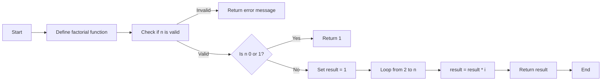

**ટેબલ: ફેક્ટોરિયલ ઉદાહરણો**

| નંબર | ગણતરી | ફેક્ટોરિયલ |
|--------|-------------|-----------|
| 0 | 0! = 1 | 1 |
| 1 | 1! = 1 | 1 |
| 3 | 3! = 3 × 2 × 1 | 6 |
| 5 | 5! = 5 × 4 × 3 × 2 × 1 | 120 |

**મેમરી ટ્રીક:** "1 સુધી ગુણાકાર કરો" (બધા આંકડાને 1 સુધી ગુણાકાર કરો)

## પ્રશ્ન 3(a) [3 ગુણ] - OR ઓપ્શન

**1 થી N માંથી odd અને even નંબર શોધવાનો પાયથન કોડ બનાવો.**

**જવાબ**:

```python
# 1 થી N સુધીના odd અને even નંબર શોધવાનો પ્રોગ્રામ

# યુઝર પાસેથી ઇનપુટ લો
N = int(input("N ની કિંમત દાખલ કરો: "))

print("1 થી", N, "સુધીના even નંબર છે:")
for i in range(1, N + 1):
    if i % 2 == 0:
        print(i, end=" ")

print("\n1 થી", N, "સુધીના odd નંબર છે:")
for i in range(1, N + 1):
    if i % 2 != 0:
        print(i, end=" ")
```

**ટેબલ: Even અને Odd ચેક**

| નંબર | ચેક | પ્રકાર |
|--------|-------|------|
| Even નંબર | `number % 2 == 0` | 2, 4, 6, ... |
| Odd નંબર | `number % 2 != 0` | 1, 3, 5, ... |

**મેમરી ટ્રીક:** "MOD-2" (Modulo 2 જે even કે odd નક્કી કરે છે)

## પ્રશ્ન 3(b) [4 ગુણ] - OR ઓપ્શન

**Nested લિસ્ટ અને તેના એલિમેન્ટ ડિસ્પ્લે કરવા માટેનો પાયથન કોડ બનાવો.**

**જવાબ**:

```python
# Nested લિસ્ટ બનાવવા અને ડિસ્પ્લે કરવાનો પ્રોગ્રામ

# Nested લિસ્ટ બનાવો
nested_list = [
    [1, 2, 3],
    [4, 5, 6],
    [7, 8, 9]
]

# Nested લિસ્ટ ડિસ્પ્લે કરો
print("Nested લિસ્ટ:", nested_list)

# Nested લૂપ્સનો ઉપયોગ કરીને દરેક એલિમેન્ટ ડિસ્પ્લે કરો
print("\nNested લિસ્ટના એલિમેન્ટ્સ:")
for i in range(len(nested_list)):
    for j in range(len(nested_list[i])):
        print(f"nested_list[{i}][{j}] = {nested_list[i][j]}")

# enumerate નો ઉપયોગ કરીને વૈકલ્પિક રીત
print("\nenumerate નો ઉપયોગ કરીને:")
for i, inner_list in enumerate(nested_list):
    for j, value in enumerate(inner_list):
        print(f"પોઝિશન ({i}, {j}): {value}")
```

**ડાયાગ્રામ**:

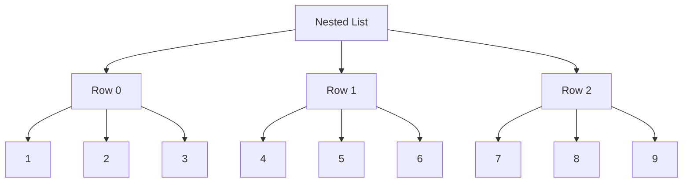

**મેમરી ટ્રીક:** "ROWS COLS" (રો અને કોલમ માળખું બનાવે છે)

## પ્રશ્ન 3(c) [7 ગુણ] - OR ઓપ્શન

**Local અને Global વેરિયેબલ ઉદાહરણ સાથે સમજાવો.**

**જવાબ**:

**ટેબલ: Local vs Global વેરિએબલ્સ**

| પ્રકાર | સ્કોપ | એક્સેસિબિલિટી | ઘોષણા |
|------|-------|---------------|-------------|
| **Local વેરિએબલ્સ** | માત્ર જે ફંક્શનમાં ઘોષિત થયા છે ત્યાં | માત્ર ઘોષિત કરનાર ફંક્શનની અંદર | ફંક્શનની અંદર |
| **Global વેરિએબલ્સ** | સમગ્ર પ્રોગ્રામમાં | બધા ફંક્શન એક્સેસ કરી શકે | કોઈપણ ફંક્શનની બહાર |

**કોડ ઉદાહરણ**:

```python
# Global વેરિએબલ
total = 0

def add_numbers(a, b):
    # Local વેરિએબલ્સ
    sum_result = a + b
    print(f"Local વેરિએબલ sum_result: {sum_result}")
    
    # Global વેરિએબલ એક્સેસ કરવું
    print(f"Global વેરિએબલ total મોડિફિકેશન પહેલાં: {total}")
    
    # ફંક્શનની અંદર Global વેરિએબલ મોડિફાય કરવા
    global total
    total = sum_result
    print(f"Global વેરિએબલ total મોડિફિકેશન પછી: {total}")
    
    return sum_result

# મુખ્ય પ્રોગ્રામ
x = 5  # મુખ્ય પ્રોગ્રામમાં Local
y = 10  # મુખ્ય પ્રોગ્રામમાં Local

result = add_numbers(x, y)
print(f"પરિણામ: {result}")
print(f"અપડેટેડ global total: {total}")

# આ ભૂલ આપશે કારણ કે sum_result એ add_numbers માટે Local છે
# print(sum_result)  # NameError: name 'sum_result' is not defined
```

**ડાયાગ્રામ**:

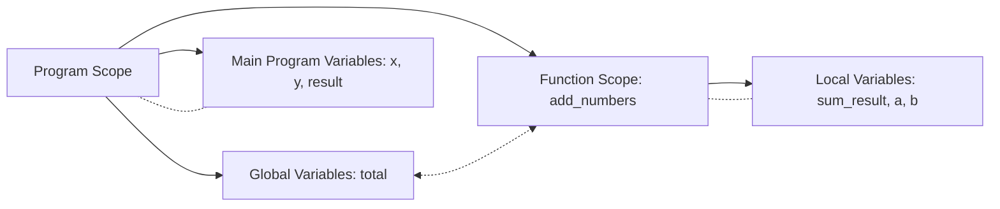

**મેમરી ટ્રીક:** "GLOBAL SEES ALL" (Global વેરિએબલ્સ બધે જોઈ શકે છે)

## પ્રશ્ન 4(a) [3 ગુણ]

**પાયથન ની સ્ટાન્ડર્ડ લાઇબ્રેરી ના મેથેમેટિકલ ફંક્શન લિસ્ટ કરો.**

**જવાબ**:

**ટેબલ: પાયથોન Math મોડ્યુલ ફંક્શન્સ**

| ફંક્શન | વર્ણન | ઉદાહરણ |
|----------|-------------|---------|
| **abs()** | એબ્સોલ્યુટ વેલ્યુ આપે છે | `abs(-5)` → `5` |
| **pow()** | x ને y ની ઘાત આપે છે | `pow(2, 3)` → `8` |
| **max()** | સૌથી મોટી વેલ્યુ આપે છે | `max(5, 10, 15)` → `15` |
| **min()** | સૌથી નાની વેલ્યુ આપે છે | `min(5, 10, 15)` → `5` |
| **round()** | નજીકના પૂર્ણાંક સુધી રાઉન્ડ કરે છે | `round(4.6)` → `5` |
| **math.sqrt()** | વર્ગમૂળ | `math.sqrt(16)` → `4.0` |
| **math.sin()** | સાઇન ફંક્શન | `math.sin(math.pi/2)` → `1.0` |

**મેમરી ટ્રીક:** "PEARS Math" (Power, Exponents, Arithmetic, Roots, Sine functions in Math)

## પ્રશ્ન 4(b) [4 ગુણ]

**પાયથન મોડ્યુલ કોડ સાથે સમજાવો.**

**જવાબ**:

**મોડ્યુલ**: પાયથોનમાં મોડ્યુલ એટલે પાયથોન વ્યાખ્યાઓ અને સ્ટેટમેન્ટ્સ ધરાવતી ફાઇલ. ફાઇલનું નામ .py સફિક્સ સાથેનું મોડ્યુલનું નામ છે.

```python
# math મોડ્યુલના ઉપયોગનું ઉદાહરણ
import math

# math મોડ્યુલમાંથી ગાણિતિક ફંક્શન્સનો ઉપયોગ
radius = 5
area = math.pi * math.pow(radius, 2)
print(f"ત્રિજ્યા {radius} વાળા વર્તુળનું ક્ષેત્રફળ {area:.2f} છે")

# વિવિધ import ટેકનિક્સનો ઉપયોગ
from math import sqrt, sin
angle = math.pi / 4
print(f"25 નું વર્ગમૂળ {sqrt(25)} છે")
print(f"{angle} રેડિયન્સનો સાઇન {sin(angle):.4f} છે")

# alias સાથે import
import random as rnd
random_number = rnd.randint(1, 100)
print(f"1 અને 100 વચ્ચેનો રેન્ડમ નંબર: {random_number}")
```

**ટેબલ: મોડ્યુલ Import ટેકનિક્સ**

| પદ્ધતિ | સિન્ટેક્સ | ઉદાહરણ |
|--------|--------|---------|
| **આખો મોડ્યુલ import કરો** | `import module_name` | `import math` |
| **ચોક્કસ આઇટમ્સ import કરો** | `from module_name import item1, item2` | `from math import sqrt, sin` |
| **alias સાથે import કરો** | `import module_name as alias` | `import random as rnd` |

**મેમરી ટ્રીક:** "CODE-LIB" (Code Libraries for reuse) - ફરીથી ઉપયોગ માટે કોડ લાઇબ્રેરીઓ

## પ્રશ્ન 4(c) [7 ગુણ]

**એક પાયથન પ્રોગ્રામ લખો જે નિર્ધારિત કરે છે કે આપેલ નંબર 'આર્મસ્ટ્રોંગ નંબર' છે કે વપરાશકર્તા-વ્યાખ્યાયિત કાર્યનો ઉપયોગ કરીને પેલિન્ડ્રોમ છે.**

**જવાબ**:

```python
# નંબર આર્મસ્ટ્રોંગ છે કે નહીં તે ચેક કરવા માટેનું ફંક્શન
def is_armstrong(num):
    # અંકોની સંખ્યા ગણવા માટે નંબરને સ્ટ્રિંગમાં રૂપાંતરિત કરો
    num_str = str(num)
    n = len(num_str)
    
    # દરેક અંકને અંકોની સંખ્યાની ઘાત સુધી ઉગામેલા સરવાળાની ગણતરી
    armstrong_sum = 0
    for digit in num_str:
        armstrong_sum += int(digit) ** n
    
    # ચેક કરો કે સરવાળો મૂળ નંબર સાથે મેળ ખાય છે
    return armstrong_sum == num

# નંબર પેલિન્ડ્રોમ છે કે નહીં તે ચેક કરવા માટેનું ફંક્શન
def is_palindrome(num):
    # નંબરને સ્ટ્રિંગમાં રૂપાંતરિત કરો અને ચેક કરો કે તે આગળથી અને પાછળથી એક સરખો વંચાય છે
    num_str = str(num)
    return num_str == num_str[::-1]

# મુખ્ય પ્રોગ્રામ
number = int(input("એક નંબર દાખલ કરો: "))

# ચેક કરો કે નંબર આર્મસ્ટ્રોંગ છે કે નહીં
if is_armstrong(number):
    print(f"{number} એક આર્મસ્ટ્રોંગ નંબર છે")
else:
    print(f"{number} આર્મસ્ટ્રોંગ નંબર નથી")

# ચેક કરો કે નંબર પેલિન્ડ્રોમ છે કે નહીં
if is_palindrome(number):
    print(f"{number} એક પેલિન્ડ્રોમ છે")
else:
    print(f"{number} પેલિન્ડ્રોમ નથી")
```

**ટેબલ: ઉદાહરણો**

| નંબર | આર્મસ્ટ્રોંગ ચેક | પેલિન્ડ્રોમ ચેક |
|--------|----------------|-----------------|
| 153 | 1³ + 5³ + 3³ = 1 + 125 + 27 = 153 ✓ | 153 ≠ 351 ✗ |
| 121 | 1³ + 2³ + 1³ = 1 + 8 + 1 = 10 ≠ 121 ✗ | 121 = 121 ✓ |
| 1634 | 1⁴ + 6⁴ + 3⁴ + 4⁴ = 1 + 1296 + 81 + 256 = 1634 ✓ | 1634 ≠ 4361 ✗ |

**ડાયાગ્રામ**:

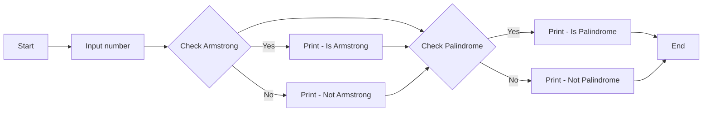

**મેમરી ટ્રીક:** "SAME SUM" (SAME આગળ-પાછળ પેલિન્ડ્રોમ માટે, SUM ઘાતના અંકોનો આર્મસ્ટ્રોંગ માટે)

## પ્રશ્ન 4(a) [3 ગુણ] - OR ઓપ્શન

**પાયથોનમાં બિલ્ટ ઇન ફંક્શન સમજાવો.**

**જવાબ**:

**Built-in Functions**: આ ફંક્શન્સ પાયથોનના સ્ટાન્ડર્ડ લાઇબ્રેરીનો ભાગ છે અને કોઈપણ મોડ્યુલ import કર્યા વિના ઉપલબ્ધ છે.

**ટેબલ: સામાન્ય પાયથોન Built-in Functions**

| ફંક્શન | હેતુ | ઉદાહરણ |
|----------|---------|---------|
| **print()** | આઉટપુટ ડિસ્પ્લે | `print("Hello")` |
| **input()** | યુઝર ઇનપુટ લે | `name = input("Name: ")` |
| **len()** | ઓબ્જેક્ટની લંબાઈ આપે | `len([1, 2, 3])` → `3` |
| **type()** | ઓબ્જેક્ટનો પ્રકાર આપે | `type(5)` → `<class 'int'>` |
| **int(), float(), str()** | ચોક્કસ પ્રકારમાં રૂપાંતર | `int("5")` → `5` |
| **range()** | સીક્વન્સ જનરેટ કરે | `list(range(3))` → `[0, 1, 2]` |
| **sum()** | સરવાળો ગણે | `sum([1, 2, 3])` → `6` |

**મેમરી ટ્રીક:** "PITS LCR" (Print, Input, Type, Sum, Len, Convert, Range)

## પ્રશ્ન 4(b) [4 ગુણ] - OR ઓપ્શન

**એક પાયથોન કોડનું ઉદાહરણ આપીને પાયથોન મેથ મોડ્યુલનું વર્ણન કરો.**

**જવાબ**:

**પાયથોન Math મોડ્યુલ**: math મોડ્યુલ C સ્ટાન્ડર્ડ દ્વારા વ્યાખ્યાયિત ગાણિતિક ફંક્શન્સની એક્સેસ પ્રદાન કરે છે.

```python
# math મોડ્યુલનો ઉપયોગ કરતો ઉદાહરણ
import math

# મૂળભૂત સ્થિરાંકો
print(f"pi ની કિંમત: {math.pi}")
print(f"e ની કિંમત: {math.e}")

# ત્રિકોણમિતિ ફંક્શન્સ (આર્ગ્યુમેન્ટ રેડિયન્સમાં)
angle = math.pi / 3  # 60 ડિગ્રી
print(f"{angle:.2f} રેડિયન્સનો સાઇન: {math.sin(angle):.4f}")
print(f"{angle:.2f} રેડિયન્સનો કોસાઇન: {math.cos(angle):.4f}")
print(f"{angle:.2f} રેડિયન્સનો ટેન્જન્ટ: {math.tan(angle):.4f}")

# લોગરિધમિક અને એક્સપોનેન્શિયલ ફંક્શન્સ
x = 10
print(f"{x} નો નેચરલ લોગરિધમ: {math.log(x):.4f}")
print(f"{x} નો લોગરિધમ બેઝ 10: {math.log10(x):.4f}")
print(f"e ની {x} ઘાત: {math.exp(x):.4f}")

# અન્ય ફંક્શન્સ
print(f"25 નું વર્ગમૂળ: {math.sqrt(25)}")
print(f"4.3 નો સીલિંગ: {math.ceil(4.3)}")
print(f"4.7 નો ફ્લોર: {math.floor(4.7)}")
```

**ટેબલ: Math મોડ્યુલ કેટેગરીઝ**

| કેટેગરી | ફંક્શન્સ |
|----------|-----------|
| **સ્થિરાંકો** | `math.pi`, `math.e` |
| **ત્રિકોણમિતિ** | `sin()`, `cos()`, `tan()` |
| **લોગરિધમિક** | `log()`, `log10()`, `exp()` |
| **ન્યુમેરિક** | `sqrt()`, `ceil()`, `floor()` |

**મેમરી ટ્રીક:** "PENT" (Pi/constants, Exponents, Numbers, Trigonometry)

## પ્રશ્ન 4(c) [7 ગુણ] - OR ઓપ્શન

**પાયથોનમાં વેરીએબલના અવકાશનો કોન્સેપ્ટ સમજાવો અને પાયથોન પ્રોગ્રામમાં વૈશ્વિક અને સ્થાનિક વેરીએબલ કોન્સેપ્ટ લાગુ કરો.**

**જવાબ**:

**પાયથોનમાં વેરિએબલનો સ્કોપ**: વેરિએબલનો સ્કોપ નક્કી કરે છે કે પ્રોગ્રામમાં ક્યાં વેરિએબલ એક્સેસિબલ કે દેખાય છે.

**ટેબલ: વેરિએબલ સ્કોપના પ્રકારો**

| સ્કોપ | વર્ણન | એક્સેસ |
|-------|-------------|--------|
| **Local** | ફંક્શનની અંદર વ્યાખ્યાયિત વેરિએબલ્સ | માત્ર ફંક્શનની અંદર |
| **Global** | ટોપ લેવલ પર વ્યાખ્યાયિત વેરિએબલ્સ | સમગ્ર પ્રોગ્રામમાં |
| **Enclosing** | નેસ્ટેડ ફંક્શન્સના બાહ્ય ફંક્શનના વેરિએબલ્સ | બાહ્ય અને અંદરના ફંક્શનમાં |
| **Built-in** | પાયથોનમાં પહેલેથી વ્યાખ્યાયિત વેરિએબલ્સ | સમગ્ર પ્રોગ્રામમાં |

**કોડ ઉદાહરણ**:

```python
# વેરિએબલ સ્કોપ ડેમોન્સ્ટ્રેશન

# Global વેરિએબલ
count = 0

def outer_function():
    # Enclosing સ્કોપ વેરિએબલ
    name = "Python"
    
    def inner_function():
        # Local વેરિએબલ
        age = 30
        # Global વેરિએબલ એક્સેસ કરવું
        global count
        count += 1
        # Enclosing વેરિએબલ એક્સેસ કરવું
        print(f"inner_function ની અંદર: name is {name}")
        print(f"inner_function ની અંદર: age is {age}")
        print(f"inner_function ની અંદર: count is {count}")
    
    # outer_function માટે Local વેરિએબલ
    language = "Programming"
    print(f"outer_function ની અંદર: name is {name}")
    print(f"outer_function ની અંદર: language is {language}")
    print(f"outer_function ની અંદર: count is {count}")
    
    # ઇનર ફંક્શન કોલ કરો
    inner_function()
    
    # આ ભૂલ આપશે - age એ inner_function માટે Local છે
    # print(age)

# મુખ્ય પ્રોગ્રામ
print(f"Global સ્કોપ: count is {count}")
outer_function()
print(f"ફંક્શન કોલ પછી Global સ્કોપ: count is {count}")

# આ ભૂલ આપશે - તેઓ ફંક્શન્સ માટે Local છે
# print(name)
# print(language)
```

**ડાયાગ્રામ**:

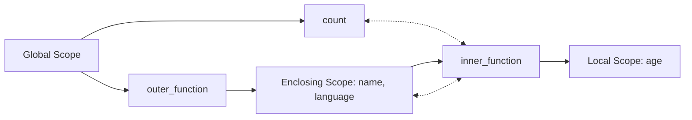

**મેમરી ટ્રીક:** "LEGB" (Local, Enclosing, Global, Built-in - સ્કોપ લુકઅપનો ક્રમ)

## પ્રશ્ન 5(a) [3 ગુણ]

**આપેલ સૂચિમાં બે ઘટકોને સ્વેપ કરવા માટે પાયથોન પ્રોગ્રામ બનાવો.**

**જવાબ**:

```python
# લિસ્ટમાં બે એલિમેન્ટ્સ સ્વેપ કરવાનો પ્રોગ્રામ

# એક લિસ્ટ બનાવો
my_list = [10, 20, 30, 40, 50]
print("મૂળ લિસ્ટ:", my_list)

# સ્વેપ કરવા માટેની પોઝિશન મેળવો
pos1 = int(input("પ્રથમ પોઝિશન દાખલ કરો (ઇન્ડેક્સ 0 થી શરૂ થાય છે): "))
pos2 = int(input("બીજી પોઝિશન દાખલ કરો (ઇન્ડેક્સ 0 થી શરૂ થાય છે): "))

# ટેમ્પરરી વેરિએબલનો ઉપયોગ કરીને એલિમેન્ટ્સ સ્વેપ કરો
if 0 <= pos1 < len(my_list) and 0 <= pos2 < len(my_list):
    # સ્વેપિંગ
    temp = my_list[pos1]
    my_list[pos1] = my_list[pos2]
    my_list[pos2] = temp
    
    print(f"પોઝિશન {pos1} અને {pos2} પર એલિમેન્ટ્સ સ્વેપ કર્યા પછી લિસ્ટ:", my_list)
else:
    print("અમાન્ય પોઝિશન! પોઝિશન લિસ્ટની રેન્જની અંદર હોવી જોઈએ.")
```

**વૈકલ્પિક પદ્ધતિ**:

```python
# પાયથોનની tuple અનપેકિંગનો ઉપયોગ કરીને સ્વેપ (વધુ પાયથોનિક)
if 0 <= pos1 < len(my_list) and 0 <= pos2 < len(my_list):
    my_list[pos1], my_list[pos2] = my_list[pos2], my_list[pos1]
    print(f"પોઝિશન {pos1} અને {pos2} પર એલિમેન્ટ્સ સ્વેપ કર્યા પછી લિસ્ટ:", my_list)
```

**ટેબલ: સ્વેપિંગ પદ્ધતિઓ**

| પદ્ધતિ | કોડ |
|--------|------|
| **ટેમ્પ વેરિએબલનો ઉપયોગ** | `temp = a; a = b; b = temp` |
| **પાયથોન ટપલ અનપેકિંગ** | `a, b = b, a` |

**મેમરી ટ્રીક:** "TEMP SWAP" (ટેમ્પરરી વેરિએબલ સલામત સ્વેપિંગમાં મદદ કરે છે)

## પ્રશ્ન 5(b) [4 ગુણ]

**ઉદાહરણ આપીને નેસ્ટેડ લિસ્ટ સમજાવો**

**જવાબ**:

**Nested List**: Nested list એટલે એવી લિસ્ટ જેના એલિમેન્ટ્સ તરીકે અન્ય લિસ્ટ હોય, જે મલ્ટી-ડાયમેન્શનલ ડેટા સ્ટ્રક્ચર બનાવે છે.

```python
# Nested list બનાવવી (3x3 મેટ્રિક્સ)
matrix = [
    [1, 2, 3],
    [4, 5, 6],
    [7, 8, 9]
]

# એલિમેન્ટ્સ એક્સેસ કરવા
print("સંપૂર્ણ મેટ્રિક્સ:", matrix)
print("પ્રથમ રો:", matrix[0])
print("રો 1, કોલમ 2 પર એલિમેન્ટ:", matrix[0][1])  # આઉટપુટ: 2

# એલિમેન્ટ્સ મોડિફાય કરવા
matrix[1][1] = 50
print("મોડિફિકેશન પછી મેટ્રિક્સ:", matrix)

# Nested list પર પુનરાવર્તન
print("\nમેટ્રિક્સ પ્રિન્ટ કરી રહ્યા છીએ:")
for row in matrix:
    for element in row:
        print(element, end=" ")
    print()  # દરેક રો પછી નવી લાઇન
```

**ડાયાગ્રામ**:

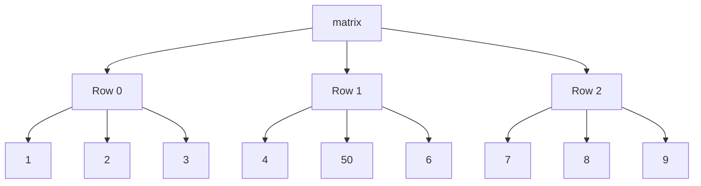

**ટેબલ: Nested List ઓપરેશન્સ**

| ઓપરેશન | સિન્ટેક્સ | ઉદાહરણ |
|-----------|--------|---------|
| **એલિમેન્ટ એક્સેસ** | `list[row][col]` | `matrix[0][1]` |
| **એલિમેન્ટ મોડિફાય** | `list[row][col] = new_value` | `matrix[1][1] = 50` |
| **નવી રો ઉમેરવી** | `list.append([...])` | `matrix.append([10, 11, 12])` |

**મેમરી ટ્રીક:** "MARS" (Matrix Access with Row and column Structure) - મેટ્રિક્સ એક્સેસ રો અને કોલમ માળખા સાથે

## પ્રશ્ન 5(c) [7 ગુણ]

**ઉદાહરણો સાથે સ્ટ્રિંગ ઓપરેશન્સ સમજાવો**

**જવાબ**:

**ટેબલ: પાયથોનમાં સ્ટ્રિંગ ઓપરેશન્સ**

| ઓપરેશન | વર્ણન | ઉદાહરણ |
|-----------|-------------|---------|
| **કન્કેટેનેશન** | સ્ટ્રિંગ્સ જોડવી | `"Hello" + " World"` → `"Hello World"` |
| **રિપિટિશન** | સ્ટ્રિંગ્સ પુનરાવર્તિત કરવી | `"Python" * 3` → `"PythonPythonPython"` |
| **સ્લાઇસિંગ** | સબસ્ટ્રિંગ એક્સટ્રેક્ટ | `"Python"[1:4]` → `"yth"` |
| **ઇન્ડેક્સિંગ** | એક્સેસ કેરેક્ટર | `"Python"[0]` → `"P"` |
| **લેન્થ** | કેરેક્ટર્સ ગણો | `len("Python")` → `6` |
| **મેમ્બરશિપ** | ચેક કરો કે હાજર છે | `"P" in "Python"` → `True` |
| **કમ્પેરિઝન** | સ્ટ્રિંગ્સ સરખાવો | `"apple" < "banana"` → `True` |

**કોડ ઉદાહરણ**:

```python
# સ્ટ્રિંગ ઓપરેશન્સ ડેમોન્સ્ટ્રેશન
text = "Python Programming"

# ઇન્ડેક્સિંગ
print("પ્રથમ કેરેક્ટર:", text[0])
print("છેલ્લી કેરેક્ટર:", text[-1])

# સ્લાઇસિંગ
print("પ્રથમ શબ્દ:", text[:6])
print("બીજો શબ્દ:", text[7:])
print("મધ્યના કેરેક્ટર્સ:", text[3:10])
print("રિવર્સ:", text[::-1])

# સ્ટ્રિંગ મેથડ્સ
print("અપરકેસ:", text.upper())
print("લોવરકેસ:", text.lower())
print("'P' ને 'J' સાથે બદલો:", text.replace("P", "J"))
print("સ્પેસ દ્વારા સ્પ્લિટ:", text.split())
print("'m' ની ગણતરી:", text.count('m'))
print("'gram' શોધો:", text.find("gram"))

# ચેક ઓપરેશન્સ
print("આલ્ફાન્યુમેરિક છે?", text.isalnum())
print("'Py' થી શરૂ થાય છે?", text.startswith("Py"))
print("'ing' થી સમાપ્ત થાય છે?", text.endswith("ing"))
```

**ડાયાગ્રામ**:

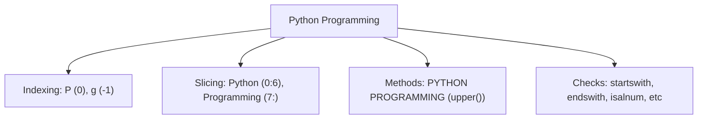

**મેમરી ટ્રીક:** "SCREAM" (Slice, Concat, Replace, Extract, Access, Methods)

## પ્રશ્ન 5(a) [3 ગુણ] - OR ઓપ્શન

**આપેલ સૂચિમાં તમામ ઘટકોનો સરવાળો શોધવા માટે પાયથોન પ્રોગ્રામ બનાવો.**

**જવાબ**:

```python
# લિસ્ટમાં બધા એલિમેન્ટ્સનો સરવાળો શોધવાનો પ્રોગ્રામ

# પદ્ધતિ 1: બિલ્ટ-ઈન sum() ફંક્શનનો ઉપયોગ
def sum_list_builtin(numbers):
    return sum(numbers)

# પદ્ધતિ 2: લૂપનો ઉપયોગ
def sum_list_loop(numbers):
    total = 0
    for num in numbers:
        total += num
    return total

# સેમ્પલ લિસ્ટ બનાવો
my_list = [10, 20, 30, 40, 50]
print("લિસ્ટ:", my_list)

# બિલ્ટ-ઈન ફંક્શનનો ઉપયોગ કરીને સરવાળો ગણો
print("બિલ્ટ-ઈન ફંક્શનનો ઉપયોગ કરીને સરવાળો:", sum_list_builtin(my_list))

# લૂપનો ઉપયોગ કરીને સરવાળો ગણો
print("લૂપનો ઉપયોગ કરીને સરવાળો:", sum_list_loop(my_list))
```

**ટેબલ: સરવાળા પદ્ધતિઓની તુલના**

| પદ્ધતિ | ફાયદો |
|--------|-----------|
| **બિલ્ટ-ઈન sum()** | સરળ, કાર્યક્ષમ, ઝડપી |
| **લૂપ અભિગમ** | કસ્ટમ સમિંગ લોજિક માટે કામ કરે છે |

**મેમરી ટ્રીક:** "ADD ALL" (દરેક એલિમેન્ટને ઉમેરો)

## પ્રશ્ન 5(b) [4 ગુણ] - OR ઓપ્શન

**પાયથોન લિસ્ટમાં ઈન્ડેક્સીંગ અને સ્લાઇસિંગ ઓપરેશન્સ સમજાવો**

**જવાબ**:

**ટેબલ: ઇન્ડેક્સિંગ અને સ્લાઇસિંગ ઓપરેશન્સ**

| ઓપરેશન | સિન્ટેક્સ | વર્ણન | ઉદાહરણ |
|-----------|--------|-------------|---------|
| **પોઝિટિવ ઇન્ડેક્સિંગ** | `list[i]` | પોઝિશન i પર આઇટમ એક્સેસ કરો (0-બેઝ્ડ) | `fruits[0]` → પ્રથમ આઇટમ |
| **નેગેટિવ ઇન્ડેક્સિંગ** | `list[-i]` | અંતથી આઇટમ એક્સેસ કરો (-1 છેલ્લું છે) | `fruits[-1]` → છેલ્લી આઇટમ |
| **બેઝિક સ્લાઇસિંગ** | `list[start:end]` | start થી end-1 સુધીના આઇટમ્સ | `fruits[1:3]` → 1,2 પરના આઇટમ્સ |
| **સ્ટેપ સાથે સ્લાઇસ** | `list[start:end:step]` | step ના અંતરાલ સાથે આઇટમ્સ | `nums[1:6:2]` → 1,3,5 પરના આઇટમ્સ |
| **ઇન્ડિસીસ છોડવા** | `list[:end]`, `list[start:]` | શરૂઆતથી અથવા અંત સુધી | `fruits[:3]` → પ્રથમ 3 આઇટમ્સ |
| **નેગેટિવ સ્લાઇસિંગ** | `list[-start:-end]` | અંતથી સ્લાઇસ | `fruits[-3:-1]` → 3જી અને 2જી છેલ્લી |
| **રિવર્સ** | `list[::-1]` | લિસ્ટ રિવર્સ કરો | `fruits[::-1]` → લિસ્ટ રિવર્સમાં |

**કોડ ઉદાહરણ**:

```python
# ઇન્ડેક્સિંગ અને સ્લાઇસિંગ ડેમોન્સ્ટ્રેશન
fruits = ["apple", "banana", "cherry", "date", "elderberry", "fig"]
print("મૂળ લિસ્ટ:", fruits)

# ઇન્ડેક્સિંગ
print("\nઇન્ડેક્સિંગ ઉદાહરણો:")
print("પ્રથમ આઇટમ:", fruits[0])  # apple
print("છેલ્લી આઇટમ:", fruits[-1])  # fig
print("ત્રીજી આઇટમ:", fruits[2])  # cherry

# સ્લાઇસિંગ
print("\nસ્લાઇસિંગ ઉદાહરણો:")
print("પ્રથમ ત્રણ આઇટમ્સ:", fruits[:3])  # ['apple', 'banana', 'cherry']
print("છેલ્લી ત્રણ આઇટમ્સ:", fruits[-3:])  # ['date', 'elderberry', 'fig']
print("મધ્યની આઇટમ્સ:", fruits[2:4])  # ['cherry', 'date']
print("દરેક બીજી આઇટમ:", fruits[::2])  # ['apple', 'cherry', 'elderberry']
print("રિવર્સ લિસ્ટ:", fruits[::-1])  # ['fig', 'elderberry', 'date', 'cherry', 'banana', 'apple']
```

**ડાયાગ્રામ**:

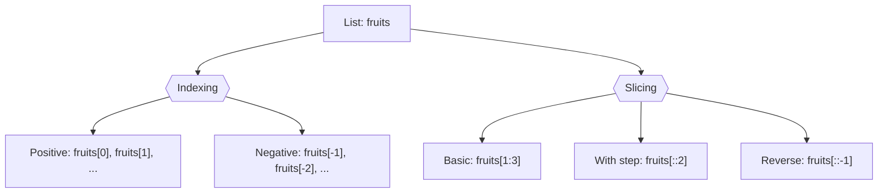

**મેમરી ટ્રીક:** "START-END-STEP" (સ્લાઇસિંગ સિન્ટેક્સ: [start:end:step])

## પ્રશ્ન 5(c) [7 ગુણ] - OR ઓપ્શન

**જરૂરી ઉદાહરણ સાથે tuple ને ટૂંકમાં સમજાવો.**

**જવાબ**:

**Tuple**: Tuple એ એલિમેન્ટ્સનો ક્રમબદ્ધ, અપરિવર્તનીય સંગ્રહ છે. એકવાર બનાવ્યા પછી, એલિમેન્ટ્સ બદલી શકાતા નથી.

**ટેબલ: Tuple vs List**

| ફીચર | Tuple | List |
|---------|-------|------|
| **સિન્ટેક્સ** | `(item1, item2)` | `[item1, item2]` |
| **પરિવર્તનશીલતા** | Immutable (બદલી શકાતી નથી) | Mutable (બદલી શકાય છે) |
| **પરફોર્મન્સ** | ઝડપી | ધીમું |
| **ઉપયોગ કેસ** | ફિક્સ્ડ ડેટા, ડિક્શનરી કીઝ | ડેટા જેને મોડિફિકેશનની જરૂર પડે |
| **મેથડ્સ** | ઓછી મેથડ્સ | ઘણી મેથડ્સ |

**કોડ ઉદાહરણ**:

```python
# Tuples બનાવવા
empty_tuple = ()
single_item_tuple = (1,)  # સિંગલ આઇટમ માટે કોમા જરૂરી છે
mixed_tuple = (1, "Hello", 3.14, True)
nested_tuple = (1, 2, (3, 4), 5)

# Tuple એલિમેન્ટ્સ એક્સેસ કરવા
print("પ્રથમ આઇટમ:", mixed_tuple[0])  # 1
print("છેલ્લી આઇટમ:", mixed_tuple[-1])  # True
print("Nested tuple એલિમેન્ટ:", nested_tuple[2][0])  # 3

# Tuple સ્લાઇસિંગ
print("પ્રથમ બે આઇટમ્સ:", mixed_tuple[:2])  # (1, "Hello")

# Tuple અનપેકિંગ
a, b, c, d = mixed_tuple
print("અનપેક કરેલી વેલ્યુઝ:", a, b, c, d)

# Tuple મેથડ્સ
print("1 ની ગણતરી:", mixed_tuple.count(1))  # 1
print("'Hello' નો ઇન્ડેક્સ:", mixed_tuple.index("Hello"))  # 1

# Tuple ઓપરેશન્સ
combined_tuple = mixed_tuple + nested_tuple
repeated_tuple = mixed_tuple * 2
print("કોમ્બાઇન્ડ tuple:", combined_tuple)
print("રિપીટેડ tuple:", repeated_tuple)

# આ ભૂલ આપશે કારણ કે tuples immutable છે
# mixed_tuple[0] = 100  # TypeError: 'tuple' object does not support item assignment
```

**ડાયાગ્રામ**:

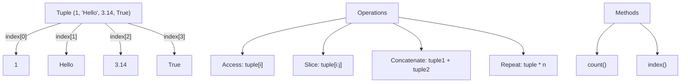

**મેમરી ટ્રીક:** "IPAC" (Immutable, Parentheses, Access only, Cannot modify) - અપરિવર્તનીય, કૌંસ, માત્ર એક્સેસ, મોડિફાય ન કરી શકાય
