## Question 1(a) [3 marks]

**Write a pseudocode to check the given number is positive or negative.**

**Answer**:

```
BEGIN
    Input number
    IF number > 0 THEN
        Display "Number is positive"
    ELSE IF number < 0 THEN
        Display "Number is negative"
    ELSE
        Display "Number is zero"
    END IF
END
```

**Mnemonic:** "Compare Zero"

## Question 1(b) [4 marks]

**Define Algorithm and Design it for Finding maximum from given three Numbers.**

**Answer**:

**Algorithm Definition**: An algorithm is a step-by-step procedure or set of rules designed to solve a specific problem or perform a computation.

**Algorithm for Finding Maximum of Three Numbers**:

```
BEGIN
    Input num1, num2, num3
    Set max = num1
    IF num2 > max THEN
        Set max = num2
    END IF
    IF num3 > max THEN
        Set max = num3
    END IF
    Display max
END
```

**Diagram**:

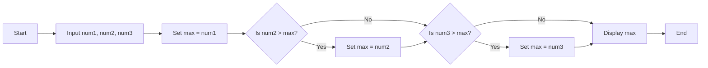

**Mnemonic:** "Compare and Replace"

## Question 1(c) [7 marks]

**Develop a Python code to convert Temperature parameter from Celsius to Fahrenheit.**

**Answer**:

```python
# Program to convert Celsius to Fahrenheit

# Get the Celsius temperature from user
celsius = float(input("Enter temperature in Celsius: "))

# Convert to Fahrenheit using the formula: F = (C * 9/5) + 32
fahrenheit = (celsius * 9/5) + 32

# Display the result
print(f"{celsius}°C is equal to {fahrenheit}°F")
```

**Table: Temperature Conversion**:

| Component | Description |
|-----------|-------------|
| **Input** | Temperature in Celsius |
| **Formula** | F = (C × 9/5) + 32 |
| **Output** | Temperature in Fahrenheit |

**Mnemonic:** "Multiply by 9, divide by 5, add 32"

## Question 1(c OR) [7 marks]

**List out all comparison operators and explain each by giving python code example.**

**Answer**:

**Table: Python Comparison Operators**

| Operator | Description | Example | Result |
|----------|-------------|---------|--------|
| **==** | Equal to | `5 == 5` | `True` |
| **!=** | Not equal to | `5 != 6` | `True` |
| **>** | Greater than | `6 > 3` | `True` |
| **<** | Less than | `3 < 6` | `True` |
| **>=** | Greater than or equal to | `5 >= 5` | `True` |
| **<=** | Less than or equal to | `5 <= 5` | `True` |

**Code Example**:

```python
# Python comparison operators example
a = 10
b = 5

# Equal to
print(f"{a} == {b}: {a == b}")  # False

# Not equal to
print(f"{a} != {b}: {a != b}")  # True

# Greater than
print(f"{a} > {b}: {a > b}")    # True

# Less than
print(f"{a} < {b}: {a < b}")    # False

# Greater than or equal to
print(f"{a} >= {b}: {a >= b}")  # True

# Less than or equal to
print(f"{a} <= {b}: {a <= b}")  # False
```

**Mnemonic:** "CLEAN" (Compare, Less than, Equal to, Above, Not equal)

## Question 2(a) [3 marks]

**Describe data types in python with its examples.**

**Answer**:

**Table: Python Data Types**

| Data Type | Description | Example |
|-----------|-------------|---------|
| **int** | Integer values | `x = 10` |
| **float** | Decimal point values | `y = 10.5` |
| **str** | Text or character values | `name = "Python"` |
| **bool** | Logical values (True/False) | `is_valid = True` |
| **list** | Ordered, mutable collection | `nums = [1, 2, 3]` |
| **tuple** | Ordered, immutable collection | `point = (5, 10)` |
| **dict** | Key-value pairs | `student = {"name": "John"}` |

**Mnemonic:** "NIFTY SLD" (Numbers, Integers, Floats, Text, Yes/No, Sequences, Lists, Dictionaries)

## Question 2(b) [4 marks]

**Explain Nested if in python with python code example.**

**Answer**:

**Nested if**: A conditional statement inside another conditional statement is called a nested if. It allows checking for multiple conditions in sequence.

```python
# Nested if example to check if a number is positive, negative, or zero
# And if positive, check if it's even or odd

num = int(input("Enter a number: "))

if num > 0:
    print("Positive number")
    # Nested if to check if the positive number is even or odd
    if num % 2 == 0:
        print("Even number")
    else:
        print("Odd number")
elif num < 0:
    print("Negative number")
else:
    print("Zero")
```

**Diagram**:

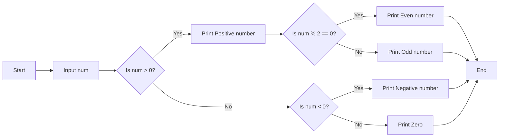

**Mnemonic:** "Check Inside Check"

## Question 2(c) [7 marks]

**Write use of different types of selection / decision making flow of control structures with example.**

**Answer**:

**Table: Selection Control Structures in Python**

| Structure | Purpose | Use Case |
|-----------|---------|----------|
| **if** | Execute code when condition is true | Simple condition check |
| **if-else** | Execute one code for true condition, another for false | Binary decision making |
| **if-elif-else** | Multiple condition checking | Multiple possible outcomes |
| **Nested if** | Condition checking inside another condition | Complex hierarchical decisions |
| **Ternary operator** | One-line if-else | Simple conditional assignment |

**Code Example**:

```python
# Example of different selection structures
score = int(input("Enter your score: "))

# Simple if
if score >= 90:
    print("Excellent!")

# if-else
if score >= 60:
    print("You passed.")
else:
    print("You failed.")

# if-elif-else
if score >= 90:
    grade = "A"
elif score >= 80:
    grade = "B"
elif score >= 70:
    grade = "C"
elif score >= 60:
    grade = "D"
else:
    grade = "F"
print(f"Your grade is {grade}")

# Ternary operator
result = "Pass" if score >= 60 else "Fail"
print(result)
```

**Mnemonic:** "SCENE" (Simple if, Conditions with else, Elif for multiple, Nested for complex, Express with ternary)

## Question 2(a) [3 marks] - OR Option

**List out rules for defining variables in python.**

**Answer**:

**Table: Rules for Defining Variables in Python**

| Rule | Description | Example |
|------|-------------|---------|
| **Start with letter or underscore** | First character must be a letter or underscore | `name = "John"`, `_count = 10` |
| **No special characters** | Only letters, numbers, and underscores allowed | `user_name` (valid), `user-name` (invalid) |
| **Case sensitive** | Uppercase and lowercase are different | `age` and `Age` are different variables |
| **No reserved keywords** | Cannot use Python keywords as variable names | Cannot use `if`, `for`, `while`, etc. |
| **No spaces** | Use underscores instead of spaces | `first_name` instead of `first name` |

**Mnemonic:** "SILKS" (Start properly, Ignore special chars, Look at case, Keywords avoided, Spaces not allowed)

## Question 2(b) [4 marks] - OR Option

**Explain For loop in python with necessary python code example.**

**Answer**:

**For Loop in Python**: A for loop is used to iterate over a sequence (list, tuple, string) or other iterable objects. It executes a block of code for each item in the sequence.

```python
# Example of for loop in Python
# Printing each element in a list
fruits = ["apple", "banana", "cherry"]
for fruit in fruits:
    print(fruit)

# Using range function with for loop
print("Numbers from 1 to 5:")
for i in range(1, 6):
    print(i)

# Using for loop with string
name = "Python"
for char in name:
    print(char)
```

**Diagram**:

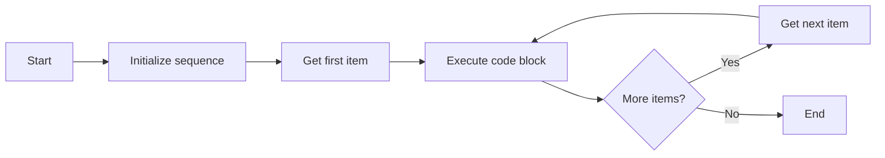

**Mnemonic:** "ITEM" (Iterate Through Each Member)

## Question 2(c) [7 marks] - OR Option

**Describe Break and continue statement in python in brief.**

**Answer**:

**Table: Break and Continue Statements**

| Statement | Purpose | Effect |
|-----------|---------|--------|
| **break** | Exit the loop immediately | Terminates the current loop and transfers control to the statement following the loop |
| **continue** | Skip the current iteration | Jumps to the next iteration of the loop, skipping any code after the continue statement |

**Code Example**:

```python
# Break statement example
print("Break example:")
for i in range(1, 11):
    if i == 6:
        print("Breaking the loop at i =", i)
        break
    print(i, end=" ")
print("\nLoop ended")

# Continue statement example
print("\nContinue example:")
for i in range(1, 11):
    if i % 2 == 0:
        continue
    print(i, end=" ")
print("\nOnly odd numbers were printed")
```

**Diagram**:

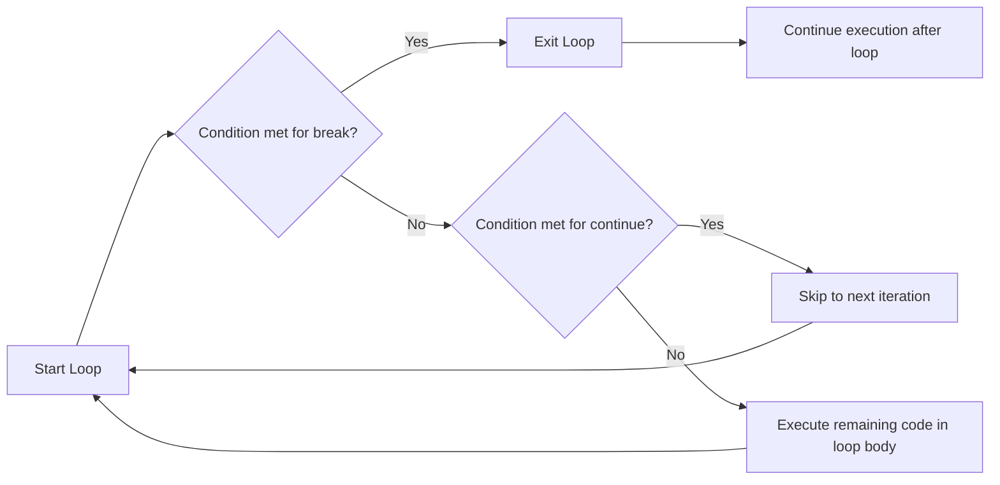

**Mnemonic:** "EXIT SKIP" (EXIT with break, SKIP with continue)

## Question 3(a) [3 marks]

**Develop a python program to print 1 to 10 numbers using loops.**

**Answer**:

```python
# Using for loop to print numbers from 1 to 10
print("Using for loop:")
for i in range(1, 11):
    print(i, end=" ")

print("\n\nUsing while loop:")
# Using while loop to print numbers from 1 to 10
counter = 1
while counter <= 10:
    print(counter, end=" ")
    counter += 1
```

**Table: Loop Approaches**

| Approach | Advantage |
|----------|-----------|
| **For loop with range** | Simple, concise, automatically manages counter |
| **While loop** | More flexible for complex conditions |

**Mnemonic:** "COUNT UP" (Counter Updates in each iteration)

## Question 3(b) [4 marks]

**Develop a python program to print following pattern using loop.**

```
*
**
***
****
*****
```

**Answer**:

```python
# Print star pattern using for loop
rows = 5

for i in range(1, rows + 1):
    # Print i stars in each row
    print("*" * i)
```

**Alternative solution with nested loops**:

```python
# Print star pattern using nested loops
rows = 5

for i in range(1, rows + 1):
    for j in range(1, i + 1):
        print("*", end="")
    print()  # New line after each row
```

**Diagram**:

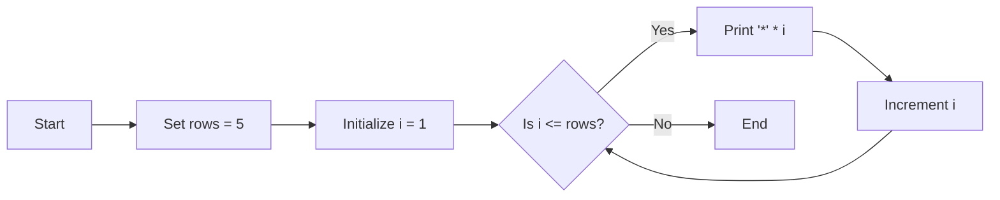

**Mnemonic:** "RISE UP" (Row Increases, Stars Expand Upward Progressively)

## Question 3(c) [7 marks]

**Create a user define function to find factorial of the given number.**

**Answer**:

```python
# Function to find factorial of a given number
def factorial(n):
    # Check if input is valid
    if not isinstance(n, int) or n < 0:
        return "Invalid input. Please enter a non-negative integer."
    
    # Base case: factorial of 0 or 1 is 1
    if n == 0 or n == 1:
        return 1
    
    # Calculate factorial using iteration
    result = 1
    for i in range(2, n + 1):
        result *= i
    
    return result

# Test the function
number = int(input("Enter a number to find its factorial: "))
print(f"Factorial of {number} is {factorial(number)}")
```

**Diagram**:

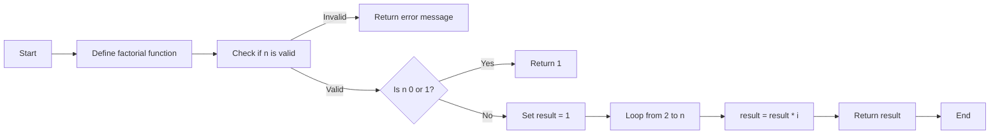

**Table: Factorial Examples**

| Number | Calculation | Factorial |
|--------|-------------|-----------|
| 0 | 0! = 1 | 1 |
| 1 | 1! = 1 | 1 |
| 3 | 3! = 3 × 2 × 1 | 6 |
| 5 | 5! = 5 × 4 × 3 × 2 × 1 | 120 |

**Mnemonic:** "Multiply Down To One" (Multiply all integers down to 1)

## Question 3(a) [3 marks] - OR Option

**Develop a python code to find odd and even numbers from 1 to N using loops.**

**Answer**:

```python
# Program to find odd and even numbers from 1 to N

# Get input from user
N = int(input("Enter the value of N: "))

print("Even numbers from 1 to", N, "are:")
for i in range(1, N + 1):
    if i % 2 == 0:
        print(i, end=" ")

print("\nOdd numbers from 1 to", N, "are:")
for i in range(1, N + 1):
    if i % 2 != 0:
        print(i, end=" ")
```

**Table: Even and Odd Check**

| Number | Check | Type |
|--------|-------|------|
| Even numbers | `number % 2 == 0` | 2, 4, 6, ... |
| Odd numbers | `number % 2 != 0` | 1, 3, 5, ... |

**Mnemonic:** "MOD-2" (Modulo 2 determines odd or even)

## Question 3(b) [4 marks] - OR Option

**Develop a code to create nested list and display elements.**

**Answer**:

```python
# Program to create and display nested list

# Create a nested list
nested_list = [
    [1, 2, 3],
    [4, 5, 6],
    [7, 8, 9]
]

# Display the nested list
print("Nested List:", nested_list)

# Display each element using nested loops
print("\nElements of the nested list:")
for i in range(len(nested_list)):
    for j in range(len(nested_list[i])):
        print(f"nested_list[{i}][{j}] = {nested_list[i][j]}")

# Alternative way to display using enumerate
print("\nUsing enumerate:")
for i, inner_list in enumerate(nested_list):
    for j, value in enumerate(inner_list):
        print(f"Position ({i}, {j}): {value}")
```

**Diagram**:

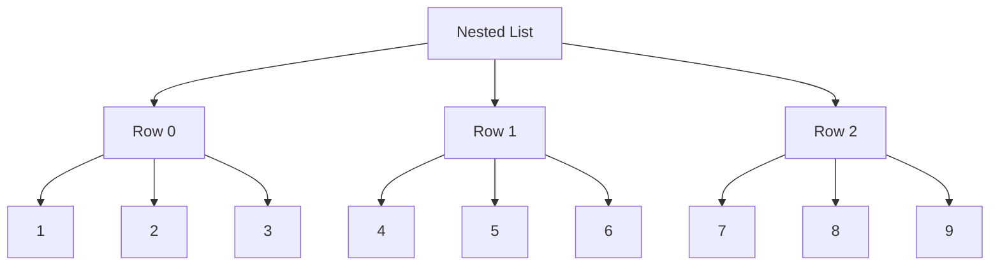

**Mnemonic:** "ROWS COLS" (Rows and Columns form the structure)

## Question 3(c) [7 marks] - OR Option

**Explain local and global variables using examples.**

**Answer**:

**Table: Local vs Global Variables**

| Type | Scope | Accessibility | Declaration |
|------|-------|---------------|-------------|
| **Local Variables** | Only within the function where declared | Only inside declaring function | Inside a function |
| **Global Variables** | Throughout the program | All functions can access | Outside any function |

**Code Example**:

```python
# Global variable
total = 0

def add_numbers(a, b):
    # Local variables
    sum_result = a + b
    print(f"Local variable sum_result: {sum_result}")
    
    # Accessing global variable
    print(f"Global variable total before modification: {total}")
    
    # To modify global variable within function
    global total
    total = sum_result
    print(f"Global variable total after modification: {total}")
    
    return sum_result

# Main program
x = 5  # Local to main program
y = 10  # Local to main program

result = add_numbers(x, y)
print(f"Result: {result}")
print(f"Updated global total: {total}")

# This would cause an error because sum_result is local to add_numbers
# print(sum_result)  # NameError: name 'sum_result' is not defined
```

**Diagram**:

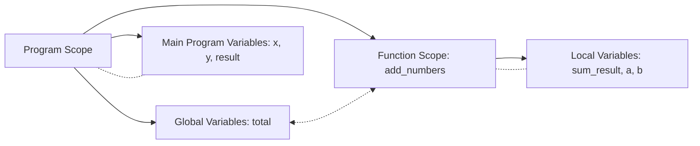

**Mnemonic:** "GLOBAL SEES ALL" (Global variables are visible everywhere)

## Question 4(a) [3 marks]

**List out Python standard library mathematical functions.**

**Answer**:

**Table: Python Math Module Functions**

| Function | Description | Example |
|----------|-------------|---------|
| **abs()** | Returns absolute value | `abs(-5)` → `5` |
| **pow()** | Returns x to power y | `pow(2, 3)` → `8` |
| **max()** | Returns largest value | `max(5, 10, 15)` → `15` |
| **min()** | Returns smallest value | `min(5, 10, 15)` → `5` |
| **round()** | Rounds to nearest integer | `round(4.6)` → `5` |
| **math.sqrt()** | Square root | `math.sqrt(16)` → `4.0` |
| **math.sin()** | Sine function | `math.sin(math.pi/2)` → `1.0` |

**Mnemonic:** "PEARS Math" (Power, Exponents, Arithmetic, Roots, Sine functions in Math)

## Question 4(b) [4 marks]

**Explain Module in python with example python code of it.**

**Answer**:

**Module**: A module in Python is a file containing Python definitions and statements. The file name is the module name with the suffix .py added.

```python
# Example of using math module
import math

# Using mathematical functions from math module
radius = 5
area = math.pi * math.pow(radius, 2)
print(f"Area of circle with radius {radius} is {area:.2f}")

# Using different import techniques
from math import sqrt, sin
angle = math.pi / 4
print(f"Square root of 25 is {sqrt(25)}")
print(f"Sine of {angle} radians is {sin(angle):.4f}")

# Importing with alias
import random as rnd
random_number = rnd.randint(1, 100)
print(f"Random number between 1 and 100: {random_number}")
```

**Table: Module Import Techniques**

| Method | Syntax | Example |
|--------|--------|---------|
| **Import entire module** | `import module_name` | `import math` |
| **Import specific items** | `from module_name import item1, item2` | `from math import sqrt, sin` |
| **Import with alias** | `import module_name as alias` | `import random as rnd` |

**Mnemonic:** "CODE-LIB" (Code Libraries for reuse)

## Question 4(c) [7 marks]

**Write a Program that determines whether a given number is an 'Armstrong number' or a palindrome using a user-defined function.**

**Answer**:

```python
# Function to check if a number is an Armstrong number
def is_armstrong(num):
    # Convert number to string to count digits
    num_str = str(num)
    n = len(num_str)
    
    # Calculate sum of each digit raised to power of number of digits
    armstrong_sum = 0
    for digit in num_str:
        armstrong_sum += int(digit) ** n
    
    # Check if sum equals the original number
    return armstrong_sum == num

# Function to check if a number is a palindrome
def is_palindrome(num):
    # Convert number to string and check if it reads the same forwards and backwards
    num_str = str(num)
    return num_str == num_str[::-1]

# Main program
number = int(input("Enter a number: "))

# Check if the number is an Armstrong number
if is_armstrong(number):
    print(f"{number} is an Armstrong number")
else:
    print(f"{number} is not an Armstrong number")

# Check if the number is a palindrome
if is_palindrome(number):
    print(f"{number} is a palindrome")
else:
    print(f"{number} is not a palindrome")
```

**Table: Examples**

| Number | Armstrong Check | Palindrome Check |
|--------|----------------|-----------------|
| 153 | 1³ + 5³ + 3³ = 1 + 125 + 27 = 153 ✓ | 153 ≠ 351 ✗ |
| 121 | 1³ + 2³ + 1³ = 1 + 8 + 1 = 10 ≠ 121 ✗ | 121 = 121 ✓ |
| 1634 | 1⁴ + 6⁴ + 3⁴ + 4⁴ = 1 + 1296 + 81 + 256 = 1634 ✓ | 1634 ≠ 4361 ✗ |

**Diagram**:

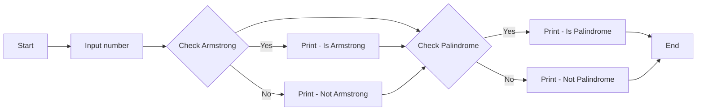

**Mnemonic:** "SAME SUM" (SAME forwards and backwards for palindrome, SUM of powered digits for Armstrong)

## Question 4(a) [3 marks] - OR Option

**Explain built in functions in python.**

**Answer**:

**Built-in Functions**: These are functions that are part of Python's standard library and available without importing any module.

**Table: Common Python Built-in Functions**

| Function | Purpose | Example |
|----------|---------|---------|
| **print()** | Display output | `print("Hello")` |
| **input()** | Get user input | `name = input("Name: ")` |
| **len()** | Return object length | `len([1, 2, 3])` → `3` |
| **type()** | Return object type | `type(5)` → `<class 'int'>` |
| **int(), float(), str()** | Convert to specific type | `int("5")` → `5` |
| **range()** | Generate sequence | `list(range(3))` → `[0, 1, 2]` |
| **sum()** | Calculate sum | `sum([1, 2, 3])` → `6` |

**Mnemonic:** "PITS LCR" (Print, Input, Type, Sum, Len, Convert, Range)

## Question 4(b) [4 marks] - OR Option

**Describe python math module by giving one python code example.**

**Answer**:

**Python Math Module**: The math module provides access to mathematical functions defined by the C standard.

```python
# Example using math module
import math

# Basic constants
print(f"Value of pi: {math.pi}")
print(f"Value of e: {math.e}")

# Trigonometric functions (argument in radians)
angle = math.pi / 3  # 60 degrees
print(f"Sine of {angle:.2f} radians: {math.sin(angle):.4f}")
print(f"Cosine of {angle:.2f} radians: {math.cos(angle):.4f}")
print(f"Tangent of {angle:.2f} radians: {math.tan(angle):.4f}")

# Logarithmic and exponential functions
x = 10
print(f"Natural logarithm of {x}: {math.log(x):.4f}")
print(f"Logarithm base 10 of {x}: {math.log10(x):.4f}")
print(f"e raised to power {x}: {math.exp(x):.4f}")

# Other functions
print(f"Square root of 25: {math.sqrt(25)}")
print(f"Ceiling of 4.3: {math.ceil(4.3)}")
print(f"Floor of 4.7: {math.floor(4.7)}")
```

**Table: Math Module Categories**

| Category | Functions |
|----------|-----------|
| **Constants** | `math.pi`, `math.e` |
| **Trigonometric** | `sin()`, `cos()`, `tan()` |
| **Logarithmic** | `log()`, `log10()`, `exp()` |
| **Numeric** | `sqrt()`, `ceil()`, `floor()` |

**Mnemonic:** "PENT" (Pi/constants, Exponents, Numbers, Trigonometry)

## Question 4(c) [7 marks] - OR Option

**Explain concept of scope of variable in Python and Apply global and local variable concepts in python program.**

**Answer**:

**Scope of Variables in Python**: The scope of a variable determines where in the program a variable is accessible or visible.

**Table: Variable Scope Types**

| Scope | Description | Access |
|-------|-------------|--------|
| **Local** | Variables defined inside a function | Only within the function |
| **Global** | Variables defined at the top level | Throughout the program |
| **Enclosing** | Variables in outer function of nested functions | In the outer and inner function |
| **Built-in** | Pre-defined variables in Python | Throughout the program |

**Code Example**:

```python
# Variable scope demonstration

# Global variable
count = 0

def outer_function():
    # Enclosing scope variable
    name = "Python"
    
    def inner_function():
        # Local variable
        age = 30
        # Accessing global variable
        global count
        count += 1
        # Accessing enclosing variable
        print(f"Inside inner_function: name is {name}")
        print(f"Inside inner_function: age is {age}")
        print(f"Inside inner_function: count is {count}")
    
    # Local variable to outer_function
    language = "Programming"
    print(f"Inside outer_function: name is {name}")
    print(f"Inside outer_function: language is {language}")
    print(f"Inside outer_function: count is {count}")
    
    # Call inner function
    inner_function()
    
    # This would cause an error - age is local to inner_function
    # print(age)

# Main program
print(f"Global scope: count is {count}")
outer_function()
print(f"Global scope after function call: count is {count}")

# These would cause errors - they are local to functions
# print(name)
# print(language)
```

**Diagram**:

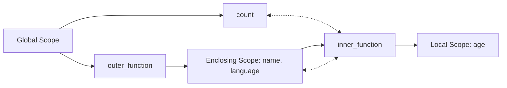

**Mnemonic:** "LEGB" (Local, Enclosing, Global, Built-in - order of scope lookup)

## Question 5(a) [3 marks]

**Develop a python program to swap two elements in given list**

**Answer**:

```python
# Program to swap two elements in a list

# Create a list
my_list = [10, 20, 30, 40, 50]
print("Original list:", my_list)

# Get positions to swap
pos1 = int(input("Enter first position (index starts from 0): "))
pos2 = int(input("Enter second position (index starts from 0): "))

# Swap elements using a temporary variable
if 0 <= pos1 < len(my_list) and 0 <= pos2 < len(my_list):
    # Swapping
    temp = my_list[pos1]
    my_list[pos1] = my_list[pos2]
    my_list[pos2] = temp
    
    print(f"List after swapping elements at positions {pos1} and {pos2}:", my_list)
else:
    print("Invalid positions! Positions should be within list range.")
```

**Alternative method**:

```python
# Swap using Python's tuple unpacking (more pythonic)
if 0 <= pos1 < len(my_list) and 0 <= pos2 < len(my_list):
    my_list[pos1], my_list[pos2] = my_list[pos2], my_list[pos1]
    print(f"List after swapping elements at positions {pos1} and {pos2}:", my_list)
```

**Table: Swapping Methods**

| Method | Code |
|--------|------|
| **Using temp variable** | `temp = a; a = b; b = temp` |
| **Python tuple unpacking** | `a, b = b, a` |

**Mnemonic:** "TEMP SWAP" (Temporary variable helps safe swapping)

## Question 5(b) [4 marks]

**Explain nested list by giving example.**

**Answer**:

**Nested List**: A nested list is a list that contains other lists as its elements, creating a multi-dimensional data structure.

```python
# Creating a nested list (3x3 matrix)
matrix = [
    [1, 2, 3],
    [4, 5, 6],
    [7, 8, 9]
]

# Accessing elements
print("Complete matrix:", matrix)
print("First row:", matrix[0])
print("Element at row 1, column 2:", matrix[0][1])  # Output: 2

# Modifying elements
matrix[1][1] = 50
print("Matrix after modification:", matrix)

# Iterating through a nested list
print("\nPrinting the matrix:")
for row in matrix:
    for element in row:
        print(element, end=" ")
    print()  # New line after each row
```

**Diagram**:

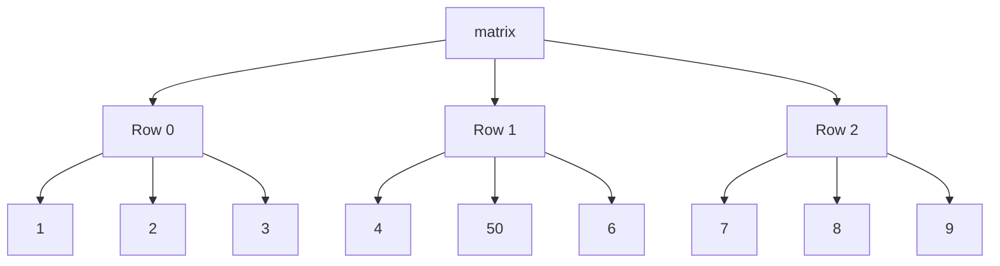

**Table: Nested List Operations**

| Operation | Syntax | Example |
|-----------|--------|---------|
| **Access element** | `list[row][col]` | `matrix[0][1]` |
| **Modify element** | `list[row][col] = new_value` | `matrix[1][1] = 50` |
| **Add new row** | `list.append([...])` | `matrix.append([10, 11, 12])` |

**Mnemonic:** "MARS" (Matrix Access with Row and column Structure)

## Question 5(c) [7 marks]

**Explain string operations with examples.**

**Answer**:

**Table: String Operations in Python**

| Operation | Description | Example |
|-----------|-------------|---------|
| **Concatenation** | Joining strings | `"Hello" + " World"` → `"Hello World"` |
| **Repetition** | Repeating strings | `"Python" * 3` → `"PythonPythonPython"` |
| **Slicing** | Extract substring | `"Python"[1:4]` → `"yth"` |
| **Indexing** | Access character | `"Python"[0]` → `"P"` |
| **Length** | Count characters | `len("Python")` → `6` |
| **Membership** | Check if present | `"P" in "Python"` → `True` |
| **Comparison** | Compare strings | `"apple" < "banana"` → `True` |

**Code Example**:

```python
# String operations demonstration
text = "Python Programming"

# Indexing
print("First character:", text[0])
print("Last character:", text[-1])

# Slicing
print("First word:", text[:6])
print("Second word:", text[7:])
print("Middle characters:", text[3:10])
print("Reverse:", text[::-1])

# String methods
print("Uppercase:", text.upper())
print("Lowercase:", text.lower())
print("Replace 'P' with 'J':", text.replace("P", "J"))
print("Split by space:", text.split())
print("Count 'm':", text.count('m'))
print("Find 'gram':", text.find("gram"))

# Check operations
print("Is alphanumeric?", text.isalnum())
print("Starts with 'Py'?", text.startswith("Py"))
print("Ends with 'ing'?", text.endswith("ing"))
```

**Diagram**:

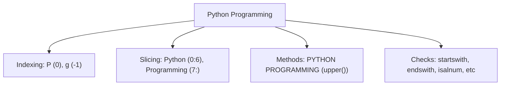

**Mnemonic:** "SCREAM" (Slice, Concat, Replace, Extract, Access, Methods)

## Question 5(a) [3 marks] - OR Option

**Develop a python program to find sum of all elements in given list**

**Answer**:

```python
# Program to find sum of all elements in a list

# Method 1: Using built-in sum() function
def sum_list_builtin(numbers):
    return sum(numbers)

# Method 2: Using a loop
def sum_list_loop(numbers):
    total = 0
    for num in numbers:
        total += num
    return total

# Create a sample list
my_list = [10, 20, 30, 40, 50]
print("List:", my_list)

# Calculate sum using built-in function
print("Sum using built-in function:", sum_list_builtin(my_list))

# Calculate sum using loop
print("Sum using loop:", sum_list_loop(my_list))
```

**Table: Sum Methods Comparison**

| Method | Advantage |
|--------|-----------|
| **Built-in sum()** | Simple, efficient, fast |
| **Loop approach** | Works for custom summing logic |

**Mnemonic:** "ADD ALL" (Add All elements in sequence)

## Question 5(b) [4 marks] - OR Option

**Explain indexing and slicing operations in python list**

**Answer**:

**Table: Indexing and Slicing Operations**

| Operation | Syntax | Description | Example |
|-----------|--------|-------------|---------|
| **Positive Indexing** | `list[i]` | Access item at position i (0-based) | `fruits[0]` → first item |
| **Negative Indexing** | `list[-i]` | Access item from end (-1 is last) | `fruits[-1]` → last item |
| **Basic Slicing** | `list[start:end]` | Items from start to end-1 | `fruits[1:3]` → items at 1,2 |
| **Slice with Step** | `list[start:end:step]` | Items with interval of step | `nums[1:6:2]` → items at 1,3,5 |
| **Omitting Indices** | `list[:end]`, `list[start:]` | From beginning or to end | `fruits[:3]` → first 3 items |
| **Negative Slicing** | `list[-start:-end]` | Slice from end | `fruits[-3:-1]` → 3rd and 2nd last |
| **Reverse** | `list[::-1]` | Reverse the list | `fruits[::-1]` → list in reverse |

**Code Example**:

```python
# Indexing and slicing demonstration
fruits = ["apple", "banana", "cherry", "date", "elderberry", "fig"]
print("Original list:", fruits)

# Indexing
print("\nIndexing examples:")
print("First item:", fruits[0])  # apple
print("Last item:", fruits[-1])  # fig
print("Third item:", fruits[2])  # cherry

# Slicing
print("\nSlicing examples:")
print("First three items:", fruits[:3])  # ['apple', 'banana', 'cherry']
print("Last three items:", fruits[-3:])  # ['date', 'elderberry', 'fig']
print("Middle items:", fruits[2:4])  # ['cherry', 'date']
print("Every second item:", fruits[::2])  # ['apple', 'cherry', 'elderberry']
print("Reversed list:", fruits[::-1])  # ['fig', 'elderberry', 'date', 'cherry', 'banana', 'apple']
```

**Diagram**:

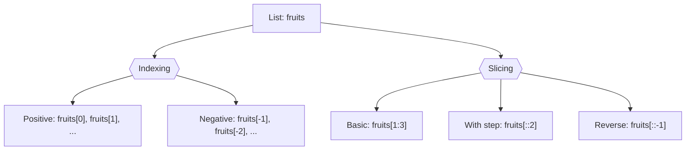

**Mnemonic:** "START-END-STEP" (Slicing syntax: [start:end:step])

## Question 5(c) [7 marks] - OR Option

**Explain tuple in brief with necessary example.**

**Answer**:

**Tuple**: A tuple is an ordered, immutable collection of elements. Once created, the elements cannot be changed.

**Table: Tuple vs List**

| Feature | Tuple | List |
|---------|-------|------|
| **Syntax** | `(item1, item2)` | `[item1, item2]` |
| **Mutability** | Immutable (cannot change) | Mutable (can change) |
| **Performance** | Faster | Slower |
| **Use Case** | Fixed data, dictionary keys | Data that needs modification |
| **Methods** | Few methods | Many methods |

**Code Example**:

```python
# Creating tuples
empty_tuple = ()
single_item_tuple = (1,)  # Comma is necessary for single item
mixed_tuple = (1, "Hello", 3.14, True)
nested_tuple = (1, 2, (3, 4), 5)

# Accessing tuple elements
print("First item:", mixed_tuple[0])  # 1
print("Last item:", mixed_tuple[-1])  # True
print("Nested tuple element:", nested_tuple[2][0])  # 3

# Slicing tuple
print("First two items:", mixed_tuple[:2])  # (1, "Hello")

# Tuple unpacking
a, b, c, d = mixed_tuple
print("Unpacked values:", a, b, c, d)

# Tuple methods
print("Count of 1:", mixed_tuple.count(1))  # 1
print("Index of 'Hello':", mixed_tuple.index("Hello"))  # 1

# Tuple operations
combined_tuple = mixed_tuple + nested_tuple
repeated_tuple = mixed_tuple * 2
print("Combined tuple:", combined_tuple)
print("Repeated tuple:", repeated_tuple)

# This will cause error as tuples are immutable
# mixed_tuple[0] = 100  # TypeError: 'tuple' object does not support item assignment
```

**Diagram**:

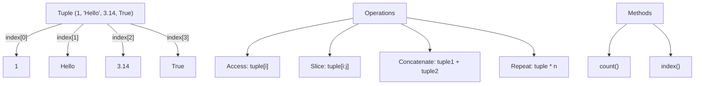

**Mnemonic:** "IPAC" (Immutable, Parentheses, Access only, Cannot modify)
