## પ્રશ્ન 1(a) [3 ગુણ]

**ફ્લોચાર્ટને વ્યાખ્યાયિત કરો અને ફ્લોચાર્ટના કોઈપણ ચાર પ્રતીકોની સૂચિ બનાવો.**

**જવાબ**:
ફ્લોચાર્ટ એ એક પ્રક્રિયા, એલ્ગોરિધમ અથવા પ્રોગ્રામમાં પગલાંઓના ક્રમને દર્શાવવા માટે માનક પ્રતીકોનો ઉપયોગ કરતું ચિત્રાત્મક પ્રતિનિધિત્વ છે.

**સામાન્ય ફ્લોચાર્ટ પ્રતીકો:**

| પ્રતીક | નામ | હેતુ |
| --- | --- | --- |
| લંબગોળ/ગોળાકાર આયત | Terminal/Start/End | પ્રક્રિયાની શરૂઆત અથવા અંત દર્શાવે છે |
| આયત | Process | ગણતરી અથવા ડેટા પ્રોસેસિંગનું પ્રતિનિધિત્વ કરે છે |
| હીરા આકાર | Decision | શરતી શાખાના બિંદુને દર્શાવે છે |
| સમાંતર ચતુષ્કોણ | Input/Output | ડેટા ઈનપુટ અથવા આઉટપુટનું પ્રતિનિધિત્વ કરે છે |

**મેમરી ટ્રીક:** "TP-DI" (Terminal-Process-Decision-Input/Output)

## પ્રશ્ન 1(b) [4 ગુણ]

**પાયથોનમાં વિવિધ ડેટા પ્રકારોની યાદી બનાવો. કોઈપણ ત્રણ ડેટા પ્રકારો ઉદાહરણ સાથે સમજાવો.**

**જવાબ**:
પાયથોનના ડેટા પ્રકારો વિવિધ પ્રકારની ડેટા કિંમતોને વર્ગીકૃત કરે છે.

| ડેટા પ્રકાર | વર્ણન | ઉદાહરણ |
| --- | --- | --- |
| Integer | દશાંશ બિંદુઓ વિનાના સંપૂર્ણ સંખ્યાઓ | `x = 10` |
| Float | દશાંશ બિંદુઓ સાથેની સંખ્યાઓ | `y = 3.14` |
| String | અક્ષરોની શ્રેણી | `name = "Python"` |
| Boolean | સાચું અથવા ખોટું મૂલ્યો | `is_valid = True` |
| List | ક્રમબદ્ધ, પરિવર્તનશીલ સંગ્રહ | `colors = ["red", "green"]` |
| Tuple | ક્રમબદ્ધ, અપરિવર્તનીય સંગ્રહ | `point = (5, 10)` |
| Dictionary | કી-વેલ્યુ જોડીઓ | `person = {"name": "John"}` |
| Set | અવ્યવસ્થિત અનન્ય આઈટમોનો સંગ્રહ | `unique = {1, 2, 3}` |

**Integer:** દશાંશ બિંદુઓ વિનાની સંપૂર્ણ સંખ્યાઓનું પ્રતિનિધિત્વ કરે છે.

```python
age = 25
count = -10
```

**String:** અવતરણ ચિહ્નોમાં બંધ અક્ષરોના ક્રમનું પ્રતિનિધિત્વ કરે છે.

```python
name = "Python"
message = 'Hello World'
```

**List:** વિવિધ પ્રકારની વસ્તુઓનો ક્રમબદ્ધ, પરિવર્તનશીલ સંગ્રહ.

```python
numbers = [1, 2, 3, 4]
mixed = [1, "Python", True, 3.14]
```

**મેમરી ટ્રીક:** "FIBS-LTDS" (Float-Integer-Boolean-String-List-Tuple-Dictionary-Set)

## પ્રશ્ન 1(c) [7 ગુણ]

**પ્રથમ વીસ સમાન પ્રાકૃતિક સંખ્યાઓના સરવાળાની ગણતરી કરવા માટે ફ્લોચાર્ટ ડિઝાઈન કરો.**

**જવાબ**:

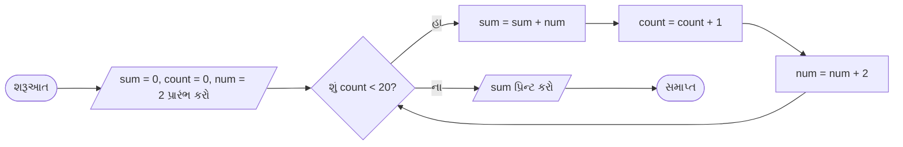

**સમજૂતી:**

- **ચલોનો પ્રારંભ**: sum=0, count=0 (મળેલ સમ સંખ્યાઓને ટ્રેક કરવા માટે), num=2 (પ્રથમ સમ સંખ્યા)
- **લૂપ શરત**: 20 સમ સંખ્યાઓ મળે ત્યાં સુધી ચાલુ રાખો
- **પ્રક્રિયા**: વર્તમાન સમ સંખ્યાને સરવાળામાં ઉમેરો
- **અપડેટ**: કાઉન્ટર વધારો અને આગળની સમ સંખ્યા પર જાઓ
- **આઉટપુટ**: લૂપ પૂર્ણ થાય ત્યારે અંતિમ સરવાળો પ્રિન્ટ કરો

**મેમરી ટ્રીક:** "SCNL-20" (Sum-Count-Number-Loop until 20)

## પ્રશ્ન 1(c) અથવા [7 ગુણ]

**1 થી 20 ની વચ્ચેની વિષમ સંખ્યાઓ પ્રિન્ટ કરવા માટે એલ્ગોરિધમ બનાવો.**

**જવાબ**:

**એલ્ગોરિધમ:**

1. ચલ num = 1 (પ્રથમ વિષમ સંખ્યાથી શરૂ કરીને) પ્રારંભ કરો
2. જ્યાં સુધી num ≤ 20, પગલાં 3-5 કરો
3. num ની કિંમત પ્રિન્ટ કરો
4. num ને 2 વધારો (આગળની વિષમ સંખ્યા મેળવવા માટે)
5. પગલું 2 થી પુનરાવર્તન કરો
6. સમાપ્ત

**આકૃતિ:**

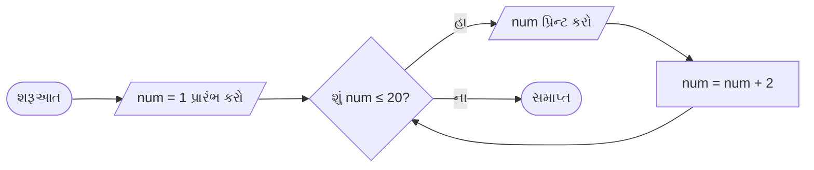

**કોડ અમલીકરણ:**

```python
# 1 થી 20 સુધીની વિષમ સંખ્યાઓ પ્રિન્ટ કરો
num = 1
while num <= 20:
    print(num)
    num += 2
```

**મેમરી ટ્રીક:** "SOLO-20" (Start Odd Loop Output until 20)

## પ્રશ્ન 2(a) [3 ગુણ]

**પાયથોનના સભ્યપદ ઓપરેટર વિશે ચર્ચા કરો.**

**જવાબ**:
પાયથોનમાં સભ્યપદ ઓપરેટરનો ઉપયોગ કોઈ મૂલ્ય અથવા ચલ અનુક્રમમાં અસ્તિત્વમાં છે કે નહીં તેનું પરીક્ષણ કરવા માટે થાય છે.

**સભ્યપદ ઓપરેટરની સારણી:**

| ઓપરેટર | વર્ણન | ઉદાહરણ | આઉટપુટ |
| --- | --- | --- | --- |
| `in` | જો મૂલ્ય અનુક્રમમાં અસ્તિત્વમાં હોય તો True પરત કરે છે | `5 in [1,2,5]` | `True` |
| `not in` | જો મૂલ્ય અસ્તિત્વમાં ન હોય તો True પરત કરે છે | `4 not in [1,2,5]` | `True` |

**સામાન્ય ઉપયોગ:**

- લિસ્ટમાં તત્વ અસ્તિત્વમાં છે કે નહીં તેની તપાસ કરવી: `if item in my_list:`
- શબ્દકોશમાં કી અસ્તિત્વમાં છે કે નહીં તેની તપાસ કરવી: `if key in my_dict:`
- સબસ્ટ્રિંગ અસ્તિત્વમાં છે કે નહીં તેની તપાસ કરવી: `if "py" in "python":`

**મેમરી ટ્રીક:** "IM-NOT" (In Membership - NOT in Membership)

## પ્રશ્ન 2(b) [4 ગુણ]

**continue અને break સ્ટેટમેન્ટની જરૂરિયાત સમજાવો.**

**જવાબ**:

| સ્ટેટમેન્ટ | હેતુ | ઉપયોગ કેસ | ઉદાહરણ |
| --- | --- | --- | --- |
| `break` | લૂપને તાત્કાલિક સમાપ્ત કરે છે | જ્યારે શરત પૂરી થાય ત્યારે લૂપમાંથી બહાર નીકળો | તત્વ શોધવું |
| `continue` | વર્તમાન પુનરાવર્તનને છોડી આગળના પર જાય છે | અમુક મૂલ્યોને છોડી આગળ વધવું | ફિલ્ટરિંગ મૂલ્યો |

**Break સ્ટેટમેન્ટ:**

- **હેતુ**: તાત્કાલિક લૂપમાંથી બહાર નીકળે છે
- **ક્યારે ઉપયોગ કરવો**: જ્યારે જરૂરી શરત હાંસલ થાય અને વધુ પ્રક્રિયાની જરૂર ન હોય
- **ઉદાહરણ**: લિસ્ટમાં ચોક્કસ તત્વ શોધવું

```python
for num in range(1, 10):
    if num == 5:
        print("Found 5!")
        break
    print(num)
```

**Continue સ્ટેટમેન્ટ:**

- **હેતુ**: વર્તમાન પુનરાવર્તનને છોડી આગળના પર જાય છે
- **ક્યારે ઉપયોગ કરવો**: જ્યારે અમુક મૂલ્યોને છોડવાના હોય પરંતુ લૂપ ચાલુ રાખવાનો હોય
- **ઉદાહરણ**: લૂપમાં સમ સંખ્યાઓને છોડવી

```python
for num in range(1, 10):
    if num % 2 == 0:
        continue
    print(num)  # માત્ર વિષમ સંખ્યાઓ પ્રિન્ટ કરે છે
```

**મેમરી ટ્રીક:** "BS-CE" (Break Stops, Continue Excepts)

## પ્રશ્ન 2(c) [7 ગુણ]

**યુઝર તરફથી ઇનપુટ તરીકે લેવામાં આવેલા ચાર વિષયના ગુણના આધારે કુલ અને સરેરાશ ગુણની ગણતરી કરવા માટે એક પ્રોગ્રામ બનાવો.**

**જવાબ**:

```python
# કુલ અને સરેરાશ ગુણની ગણતરી કરવાનો પ્રોગ્રામ
# ચાર વિષયો માટે ગુણ ઇનપુટ લો
subject1 = float(input("વિષય 1 માટે ગુણ દાખલ કરો: "))
subject2 = float(input("વિષય 2 માટે ગુણ દાખલ કરો: "))
subject3 = float(input("વિષય 3 માટે ગુણ દાખલ કરો: "))
subject4 = float(input("વિષય 4 માટે ગુણ દાખલ કરો: "))

# કુલ અને સરેરાશની ગણતરી કરો
total_marks = subject1 + subject2 + subject3 + subject4
average_marks = total_marks / 4

# પરિણામો પ્રદર્શિત કરો
print(f"કુલ ગુણ: {total_marks}")
print(f"સરેરાશ ગુણ: {average_marks}")
```

**આકૃતિ:**

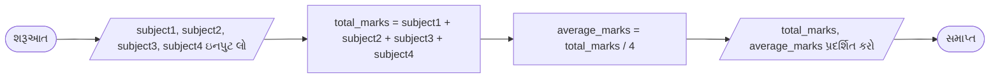

**સમજૂતી:**

- **ઇનપુટ**: યુઝર પાસેથી ચાર વિષયોના ગુણ મેળવો
- **પ્રક્રિયા**: બધા વિષયના ગુણને ઉમેરીને કુલ અને વિષયોની સંખ્યા વડે ભાગીને સરેરાશની ગણતરી કરો
- **આઉટપુટ**: કુલ અને સરેરાશ ગુણ પ્રદર્શિત કરો

**મેમરી ટ્રીક:** "IAPO" (Input-Add-Process-Output)

## પ્રશ્ન 2(a) અથવા [3 ગુણ]

**અસાઇનમેન્ટ ઓપરેટર પર ટૂંકી નોંધ લખો.**

**જવાબ**:
પાયથોનમાં અસાઇનમેન્ટ ઓપરેટરનો ઉપયોગ ચલોને મૂલ્યો સોંપવા માટે થાય છે.

| ઓપરેટર | નામ | વર્ણન | ઉદાહરણ |
| --- | --- | --- | --- |
| `=` | સરળ અસાઇનમેન્ટ | જમણા ઓપરન્ડ મૂલ્યને ડાબા ઓપરન્ડને સોંપે છે | `x = 10` |
| `+=` | ઉમેરો અને સોંપો | જમણા ઓપરન્ડને ડાબામાં ઉમેરે અને પરિણામ સોંપે છે | `x += 5` (`x = x + 5` સમાન) |
| `-=` | બાદ કરો અને સોંપો | જમણા ઓપરન્ડને ડાબામાંથી બાદ કરે અને સોંપે છે | `x -= 3` (`x = x - 3` સમાન) |
| `*=` | ગુણાકાર અને સોંપો | ડાબાને જમણા વડે ગુણાકાર કરે અને સોંપે છે | `x *= 2` (`x = x * 2` સમાન) |
| `/=` | ભાગાકાર અને સોંપો | ડાબાને જમણા વડે ભાગે અને સોંપે છે | `x /= 4` (`x = x / 4` સમાન) |

**મિશ્રિત અસાઇનમેન્ટ ઓપરેટર** અંકગણિતીય ઓપરેશન અને અસાઇનમેન્ટને જોડે છે, જેથી કોડ વધુ સંક્ષિપ્ત અને વાંચવા યોગ્ય બને છે.

**મેમરી ટ્રીક:** "SAME" (Simple Assignment Makes Easy)

## પ્રશ્ન 2(b) અથવા [4 ગુણ]

**for લૂપનો ઉપયોગ સિન્ટેક્સ, ફ્લોચાર્ટ અને ઉદાહરણ આપીને સમજાવો.**

**જવાબ**:

**For લૂપનો સિન્ટેક્સ:**

```python
for variable in sequence:
    # કોડ બ્લોક જે અમલમાં મૂકવાનો છે
```

**ફ્લોચાર્ટ:**

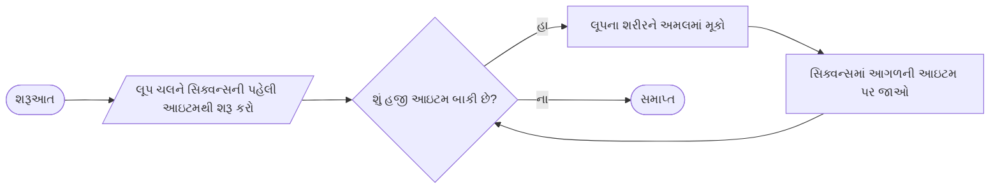

**ઉદાહરણ:**

```python
# 1 થી 5 સુધીની સંખ્યાઓના વર્ગ પ્રિન્ટ કરો
for num in range(1, 6):
    square = num ** 2
    print(f"{num} નો વર્ગ = {square}")
```

પાયથોનમાં `for` લૂપનો ઉપયોગ સિક્વન્સ (લિસ્ટ, ટપલ, સ્ટ્રિંગ, વગેરે) અથવા અન્ય ઇટરેબલ ઓબ્જેક્ટ્સ પર ચોક્કસ પુનરાવર્તન માટે થાય છે. તે ખાસ કરીને ત્યારે ઉપયોગી છે જ્યારે તમે પુનરાવર્તનોની સંખ્યા અગાઉથી જાણતા હો.

**મેમરી ટ્રીક:** "SIFE" (Sequence Iteration For Each item)

## પ્રશ્ન 2(c) અથવા [7 ગુણ]

**યુઝર દ્વારા આપેલ નંબરનો વર્ગ અને ઘન શોધવા માટે કોડ વિકસાવો.**

**જવાબ**:

```python
# નંબરનો વર્ગ અને ઘન શોધવાનો પ્રોગ્રામ
# યુઝર પાસેથી નંબર ઇનપુટ લો
num = float(input("એક નંબર દાખલ કરો: "))

# વર્ગ અને ઘનની ગણતરી કરો
square = num ** 2
cube = num ** 3

# પરિણામો પ્રદર્શિત કરો
print(f"દાખલ કરેલ નંબર: {num}")
print(f"{num} નો વર્ગ: {square}")
print(f"{num} નો ઘન: {cube}")
```

**આકૃતિ:**


**સમજૂતી:**

- **ઇનપુટ**: યુઝર પાસેથી નંબર મેળવો
- **પ્રક્રિયા**: 2ની ઘાત પર ઉઠાવીને વર્ગ, 3ની ઘાત પર ઉઠાવીને ઘનની ગણતરી કરો
- **આઉટપુટ**: ઇનપુટ નંબર, તેનો વર્ગ અને ઘન પ્રદર્શિત કરો

**મેમરી ટ્રીક:** "ISCO" (Input-Square-Cube-Output)

## પ્રશ્ન 3(a) [3 ગુણ]

**if-elif-else સ્ટેટમેન્ટને ફ્લોચાર્ટ અને યોગ્ય ઉદાહરણ સાથે સમજાવો.**

**જવાબ**:
પાયથોનમાં if-elif-else સ્ટેટમેન્ટ એ એવી શરતી ક્રિયા માટે છે જ્યાં ઘણા અભિવ્યક્તિઓનું મૂલ્યાંકન કરવામાં આવે છે.

**ફ્લોચાર્ટ:**

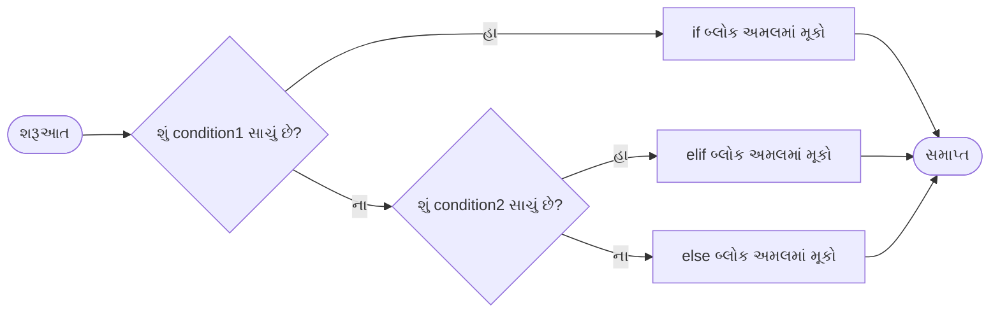

**ઉદાહરણ:**

```python
# ગુણ આધારિત ગ્રેડ આપવું
marks = 75

if marks >= 90:
    grade = "A"
elif marks >= 80:
    grade = "B"
elif marks >= 70:
    grade = "C"
elif marks >= 60:
    grade = "D"
else:
    grade = "F"

print(f"તમારો ગ્રેડ: {grade}")
```

**મેમરી ટ્રીક:** "CITE" (Check If Then Else)

## પ્રશ્ન 3(b) [4 ગુણ]

**યુઝર ડિફાઇન ફંકશન વ્યાખ્યાયિત કરો અને કેવી રીતે યુસર ડિફાઇન ફંકશન કોલ કરવું તે યોગ્ય ઉદાહરણ આપીને સમજાવો.**

**જવાબ**:

**ફંકશન વ્યાખ્યા અને કોલિંગ:**

| પાસું | સિન્ટેક્સ | હેતુ |
| --- | --- | --- |
| વ્યાખ્યા | `def function_name(parameters):` | પુન:ઉપયોગી કોડનો બ્લોક બનાવે છે |
| ફંકશન બોડી | ઇન્ડેન્ટેડ કોડ બ્લોક | ફંકશનનો લોજિક ધરાવે છે |
| રિટર્ન સ્ટેટમેન્ટ | `return [expression]` | કૉલરને મૂલ્ય પાછું મોકલે છે |
| ફંકશન કોલ | `function_name(arguments)` | ફંકશન કોડ ચલાવે છે |

**ફંકશન વ્યાખ્યાયિત અને કોલ કરવાનું ઉદાહરણ:**

```python
# લંબચોરસનો ક્ષેત્રફળ ગણવા માટે ફંકશન વ્યાખ્યાયિત કરો
def calculate_area(length, width):
    """આપેલ લંબાઈ અને પહોળાઈ સાથે લંબચોરસનો ક્ષેત્રફળ ગણો"""
    area = length * width
    return area

# ફંકશન કોલ કરો
result = calculate_area(5, 3)
print(f"લંબચોરસનો ક્ષેત્રફળ: {result}")
```

**સમજૂતી:**

- **ફંકશન વ્યાખ્યા**: `def` કીવર્ડનો ઉપયોગ કરીને ફંકશન નામ અને પેરામીટર્સ સાથે
- **ડોક્યુમેન્ટેશન**: ફંકશનનું વર્ણન કરતું વૈકલ્પિક ડોકસ્ટ્રિંગ
- **ફંકશન બોડી**: કાર્ય કરતો કોડ
- **રીટર્ન સ્ટેટમેન્ટ**: કૉલરને પરિણામ પાછું મોકલે છે
- **ફંકશન કોલ**: ફંકશન ચલાવવા માટે આર્ગ્યુમેન્ટ્સ પસાર કરો

**મેમરી ટ્રીક:** "DBRCA" (Define-Body-Return-Call-Arguments)

## પ્રશ્ન 3(c) [7 ગુણ]

**આપેલ નંબરનો ફેક્ટોરીયલ શોધવા માટે કોડ વિકસાવો.**

**જવાબ**:

```python
# નંબરનો ફેક્ટોરીયલ શોધવાનો પ્રોગ્રામ
# યુઝર પાસેથી નંબર ઇનપુટ લો
num = int(input("એક સકારાત્મક પૂર્ણાંક દાખલ કરો: "))

# ફેક્ટોરીયલ પ્રારંભ કરો
factorial = 1

# તપાસો કે નંબર નકારાત્મક, શૂન્ય કે સકારાત્મક છે
if num < 0:
    print("નકારાત્મક સંખ્યાઓ માટે ફેક્ટોરીયલ અસ્તિત્વમાં નથી")
elif num == 0:
    print("0 નો ફેક્ટોરીયલ 1 છે")
else:
    # ફેક્ટોરીયલની ગણતરી કરો
    for i in range(1, num + 1):
        factorial *= i
    print(f"{num} નો ફેક્ટોરીયલ {factorial} છે")
```

**આકૃતિ:**

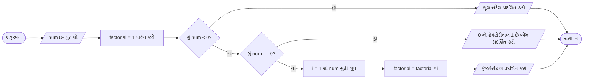

**સમજૂતી:**

- **ઇનપુટ**: યુઝર પાસેથી નંબર મેળવો
- **ચકાસણી**: તપાસો કે નંબર નકારાત્મક (ફેક્ટોરીયલ વ્યાખ્યાયિત નથી), શૂન્ય (ફેક્ટોરીયલ 1 છે), અથવા સકારાત્મક છે
- **પ્રક્રિયા**: સકારાત્મક નંબરો માટે, ફેક્ટોરીયલને 1 થી num સુધીના દરેક નંબર સાથે ગુણાકાર કરો
- **આઉટપુટ**: ફેક્ટોરીયલ પરિણામ પ્રદર્શિત કરો

**મેમરી ટ્રીક:** "MICE" (Multiply Incrementally, Check Edge-cases)

## પ્રશ્ન 3(a) અથવા [3 ગુણ]

**યોગ્ય ઉદાહરણનો ઉપયોગ કરીને નેસ્ટેડ લૂપ સમજાવો.**

**જવાબ**:
નેસ્ટેડ લૂપ એ એક લૂપની અંદર બીજું લૂપ છે. બાહ્ય લૂપના દરેક પુનરાવર્તન માટે આંતરિક લૂપ તેના બધા પુનરાવર્તનો પૂર્ણ કરે છે.

**આકૃતિ:**

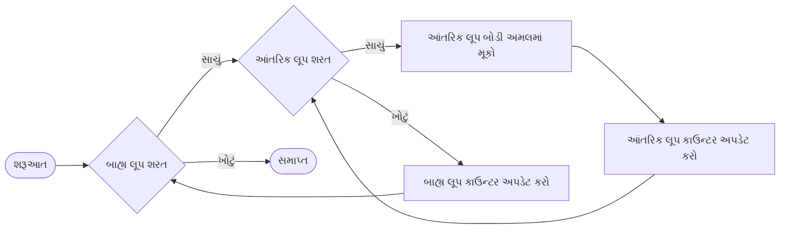

**ઉદાહરણ:**

```python
# 1 થી 3 સુધીના ગુણાકાર કોષ્ટક પ્રિન્ટ કરો
for i in range(1, 4):  # બાહ્ય લૂપ: 1 થી 3
    print(f"{i} માટે ગુણાકાર કોષ્ટક:")
    for j in range(1, 6):  # આંતરિક લૂપ: 1 થી 5
        print(f"{i} x {j} = {i*j}")
    print()  # દરેક કોષ્ટક પછી ખાલી લાઇન
```

**મેમરી ટ્રીક:** "LOFI" (Loop Outside, Finish Inside)

## પ્રશ્ન 3(b) અથવા [4 ગુણ]

**ફંકશન હેન્ડલિંગમાં રિટર્ન સ્ટેટમેન્ટ સમજાવો.**

**જવાબ**:

| પાસું | વર્ણન | ઉદાહરણ |
| --- | --- | --- |
| હેતુ | કૉલરને મૂલ્ય પાછું મોકલો | `return result` |
| મલ્ટિપલ રિટર્ન | ટપલ તરીકે ઘણા મૂલ્યો પાછા મોકલો | `return x, y, z` |
| અર્લી એક્ઝિટ | અંત પહેલા ફંકશનમાંથી બહાર નીકળો | `if error: return None` |
| નો રિટર્ન | ફંકશન મૂળભૂત રીતે None પાછું મોકલે છે | `def show(): print("Hi")` |

પાયથોન ફંકશનોમાં `return` સ્ટેટમેન્ટ:

1. ફંકશન એક્ઝિક્યુશન સમાપ્ત કરે છે
2. ફંકશન કૉલરને મૂલ્ય પાછું મોકલે છે
3. ઘણા મૂલ્યો (ટપલ તરીકે) પાછા મોકલી શકે છે
4. વૈકલ્પિક છે (જો છોડવામાં આવે, તો ફંકશન None પાછું મોકલે છે)

**ઉદાહરણ:**

```python
def calculate_circle(radius):
    """વર્તુળનું ક્ષેત્રફળ અને પરિધિ ગણો"""
    if radius < 0:
        return None  # અમાન્ય ઇનપુટ માટે અર્લી એક્ઝિટ
    
    area = 3.14 * radius ** 2
    circumference = 2 * 3.14 * radius
    
    return area, circumference  # ઘણા મૂલ્યો પાછા મોકલો
    
# ફંકશન કોલ
result = calculate_circle(5)
print(f"ક્ષેત્રફળ અને પરિધિ: {result}")
```

**મેમરી ટ્રીક:** "TERM" (Terminate Execution, Return Multiple values)

## પ્રશ્ન 3(c) અથવા [7 ગુણ]

**લૂપ કોન્સેપ્ટનો ઉપયોગ કરીને નીચેની પેટર્ન દર્શાવવા માટે એક પ્રોગ્રામ બનાવો**

```
A
AB
ABC
ABCD
ABCDE
```

**જવાબ**:

```python
# અક્ષર પેટર્ન પ્રિન્ટ કરવાનો પ્રોગ્રામ
# પ્રથમ પેટર્ન: A થી E ત્રિકોણ આકારમાં

# પંક્તિઓ (1 થી 5) દ્વારા લૂપ કરો
for i in range(1, 6):
    # દરેક પંક્તિ માટે, 'A' થી જરૂરી અક્ષર સુધીના અક્ષરો પ્રિન્ટ કરો
    for j in range(i):
        # 'A' ની ASCII કિંમત 65 છે, અનુગામી અક્ષરો મેળવવા માટે j ઉમેરો
        print(chr(65 + j), end="")
    # દરેક પંક્તિ પછી આગળની લાઇન પર જાઓ
    print()
```

**આકૃતિ:**

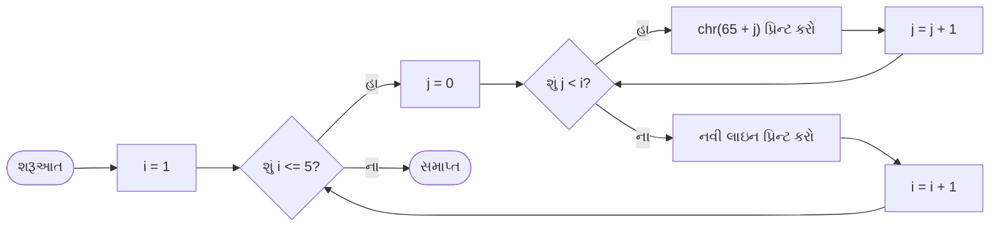

**સમજૂતી:**

- **બાહ્ય લૂપ**: પંક્તિઓની સંખ્યા (1 થી 5) નિયંત્રિત કરે છે
- **આંતરિક લૂપ**: દરેક પંક્તિ i માટે, 'A' થી શરૂ કરીને i અક્ષરો પ્રિન્ટ કરે છે
- **અક્ષર જનરેશન**: ASCII મૂલ્ય રૂપાંતર (chr(65+j) 'A', 'B', વગેરે આપે છે)
- **આઉટપુટ ફોર્મેટિંગ**: દરેક પંક્તિ માટે end="" નો ઉપયોગ કરીને અક્ષરો એક જ લાઇનમાં પ્રિન્ટ કરવા

**મેમરી ટ્રીક:** "OICE" (Outer-Inner-Character-Endline)

## પ્રશ્ન 4(a) [3 ગુણ]

**નીચેના બિલ્ટ-ઈન ફંકશનો યોગ્ય ઉદાહરણ સાથે વર્ણન કરો.**
**i) max() ii) input() iii) pow()**

**જવાબ**:

| ફંકશન | હેતુ | સિન્ટેક્સ | ઉદાહરણ |
| --- | --- | --- | --- |
| `max()` | ઇટરેબલમાં સૌથી મોટી વસ્તુ અથવા બે અથવા વધુ આર્ગ્યુમેન્ટમાંથી સૌથી મોટી વસ્તુ પાછી મોકલે છે | `max(iterable)` અથવા `max(arg1, arg2, ...)` | `max([1, 5, 3])` `5` પાછું મોકલે છે |
| `input()` | ઇનપુટમાંથી એક લાઇન વાંચે છે અને સ્ટ્રિંગ તરીકે પાછી મોકલે છે | `input([prompt])` | `input("નામ દાખલ કરો: ")` |
| `pow()` | x ને y ની ઘાત પર ઉઠાવેલું પાછું મોકલે છે | `pow(x, y)` | `pow(2, 3)` `8` પાછું મોકલે છે |

**કોડમાં ઉદાહરણો:**

```python
# max() ફંકશન ઉદાહરણ
numbers = [10, 5, 20, 15]
maximum = max(numbers)
print(f"મહત્તમ મૂલ્ય: {maximum}")  # આઉટપુટ: મહત્તમ મૂલ્ય: 20

# input() ફંકશન ઉદાહરણ
name = input("તમારું નામ દાખલ કરો: ")
print(f"નમસ્તે, {name}!")

# pow() ફંકશન ઉદાહરણ
result = pow(2, 4)
print(f"2 ને 4 ની ઘાત પર ઉઠાવતા: {result}")  # આઉટપુટ: 2 ને 4 ની ઘાત પર ઉઠાવતા: 16
```

**મેમરી ટ્રીક:** "MIP" (Max-Input-Power)

## પ્રશ્ન 4(b) [4 ગુણ]

**યોગ્ય ઉદાહરણ આપીને સ્ટ્રિંગના સ્લાઇસિંગને સમજાવો.**

**જવાબ**:

પાયથોનમાં સ્ટ્રિંગ સ્લાઇસિંગનો ઉપયોગ સ્ટ્રિંગમાંથી સબસ્ટ્રિંગ બહાર કાઢવા માટે થાય છે.

**સિન્ટેક્સ:** `string[start:end:step]`

| પેરામીટર | વર્ણન | ડિફોલ્ટ | ઉદાહરણ |
| --- | --- | --- | --- |
| `start` | પ્રારંભિક ઇન્ડેક્સ (સમાવેશીત) | 0 | `"Python"[1:]` → `"ython"` |
| `end` | અંતિમ ઇન્ડેક્સ (અસમાવેશીત) | સ્ટ્રિંગની લંબાઈ | `"Python"[:3]` → `"Pyt"` |
| `step` | અક્ષરો વચ્ચે વધારો | 1 | `"Python"[::2]` → `"Pto"` |

**ઉદાહરણો:**

```python
text = "Python Programming"

# મૂળભૂત સ્લાઇસિંગ
print(text[0:6])     # આઉટપુટ: "Python"
print(text[7:])      # આઉટપુટ: "Programming"
print(text[:6])      # આઉટપુટ: "Python"

# સ્ટેપ સાથે
print(text[::2])     # આઉટપુટ: "Pto rgamn"
print(text[0:10:2])  # આઉટપુટ: "Pto r"

# નકારાત્મક ઇન્ડિસેસ (અંતથી ગણતરી)
print(text[-11:])    # આઉટપુટ: "Programming"
print(text[:-12])    # આઉટપુટ: "Python"

# સ્ટ્રિંગને ઉલટાવો
print(text[::-1])    # આઉટપુટ: "gnimmargorP nohtyP"
```

**મેમરી ટ્રીક:** "SES" (Start-End-Step)

## પ્રશ્ન 4(c) [7 ગુણ]

**1 થી 7 ની વચ્ચેની તમામ વિષમ સંખ્યાઓના ક્યુબને પ્રિન્ટ કરતું યુઝર ડિફાઇન ફંકશન બનાવો.**

**જવાબ**:

```python
# શ્રેણીમાં વિષમ સંખ્યાઓના ક્યુબ પ્રિન્ટ કરવાનું ફંકશન
def print_odd_cubes(start, end):
    """
    શરૂઆત અને અંત (સમાવેશીત) વચ્ચેની બધી વિષમ સંખ્યાઓના ક્યુબ પ્રિન્ટ કરો
    """
    print(f"{start} અને {end} વચ્ચેની વિષમ સંખ્યાઓના ક્યુબ:")
    
    # શ્રેણી દ્વારા લૂપ કરો
    for num in range(start, end + 1):
        # તપાસો કે નંબર વિષમ છે કે નહીં
        if num % 2 != 0:
            # ક્યુબની ગણતરી કરો અને પ્રિન્ટ કરો
            cube = num ** 3
            print(f"{num} નો ક્યુબ {cube} છે")

# 1 થી 7 સુધીના વિષમ ક્યુબ પ્રિન્ટ કરવા માટે ફંકશન કોલ કરો
print_odd_cubes(1, 7)
```

**આકૃતિ:**

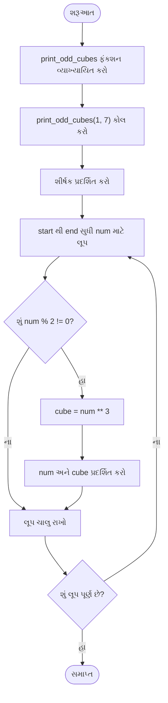

**સમજૂતી:**

- **ફંકશન વ્યાખ્યા**: શ્રેણીમાં વિષમ સંખ્યાઓને પ્રોસેસ કરવા માટે ફંકશન બનાવો
- **લૂપ**: શરૂઆતથી અંત સુધીના નંબરો પર પુનરાવર્તન કરો
- **શરત**: મોડ્યુલો ઓપરેટરનો ઉપયોગ કરીને તપાસો કે નંબર વિષમ છે કે નહીં
- **પ્રોસેસિંગ**: વિષમ સંખ્યાઓના ક્યુબની ગણતરી કરો
- **આઉટપુટ**: દરેક વિષમ સંખ્યા અને તેનો ક્યુબ પ્રદર્શિત કરો

**મેમરી ટ્રીક:** "FLOOP" (Function-Loop-Odd-Output-Power)

## પ્રશ્ન 4(a) અથવા [3 ગુણ]

**વિવિધ ફંકશનો સાથે random મોડ્યુલ સમજાવો.**

**જવાબ**:

પાયથોનમાં random મોડ્યુલ રેન્ડમ નંબર જનરેટ કરવા અને રેન્ડમ પસંદગીઓ કરવા માટે ફંકશનો પ્રદાન કરે છે.

| ફંકશન | વર્ણન | ઉદાહરણ | પરિણામ |
| --- | --- | --- | --- |
| `random()` | 0 અને 1 વચ્ચે રેન્ડમ ફ્લોટ પાછું મોકલે છે | `random.random()` | `0.7134346335849448` |
| `randint(a, b)` | a અને b (સમાવેશીત) વચ્ચે રેન્ડમ પૂર્ણાંક પાછું મોકલે છે | `random.randint(1, 10)` | `7` |
| `choice(seq)` | સિક્વન્સમાંથી રેન્ડમ તત્વ પાછું મોકલે છે | `random.choice(['red', 'green', 'blue'])` | `'green'` |
| `shuffle(seq)` | સિક્વન્સને ઇન-પ્લેસ શફલ કરે છે | `random.shuffle(my_list)` | કોઈ રિટર્ન મૂલ્ય નહીં |
| `sample(seq, k)` | સિક્વન્સમાંથી k અનન્ય રેન્ડમ તત્વો પાછા મોકલે છે | `random.sample(range(1, 30), 5)` | `[3, 12, 21, 7, 25]` |

**ઉદાહરણ:**

```python
import random

# 0 અને 1 વચ્ચે રેન્ડમ ફ્લોટ જનરેટ કરો
print(random.random())  

# 1 અને 10 વચ્ચે રેન્ડમ પૂર્ણાંક જનરેટ કરો
print(random.randint(1, 10))  

# લિસ્ટમાંથી રેન્ડમ તત્વ પસંદ કરો
colors = ["red", "green", "blue", "yellow"]
print(random.choice(colors))  

# ઇન-પ્લેસ લિસ્ટને શફલ કરો
random.shuffle(colors)
print(colors)  

# 2 અનન્ય રેન્ડમ તત્વો પસંદ કરો
print(random.sample(colors, 2))  
```

**મેમરી ટ્રીક:** "RICES" (Random-Integer-Choice-Elements-Shuffle)

## પ્રશ્ન 4(b) અથવા [4 ગુણ]

**નીચેના લિસ્ટ ફંકશનોની ચર્ચા કરો.**
**i. len() ii. sum() iii. sort() iv. index()**

**જવાબ**:

| ફંકશન | હેતુ | સિન્ટેક્સ | ઉદાહરણ | આઉટપુટ |
| --- | --- | --- | --- | --- |
| `len()` | લિસ્ટમાં આઇટમોની સંખ્યા પાછી મોકલે છે | `len(list)` | `len([1, 2, 3])` | `3` |
| `sum()` | લિસ્ટની બધી આઇટમોનો સરવાળો પાછો મોકલે છે | `sum(list)` | `sum([1, 2, 3])` | `6` |
| `sort()` | લિસ્ટને ઇન-પ્લેસ સોર્ટ કરે છે | `list.sort()` | `[3, 1, 2].sort()` | None (મૂળને સંશોધિત કરે છે) |
| `index()` | પ્રથમ ઘટનાનો ઇન્ડેક્સ પાછો મોકલે છે | `list.index(value)` | `[10, 20, 30].index(20)` | `1` |

**ઉદાહરણો:**

```python
# len() ફંકશન
numbers = [5, 10, 15, 20, 25]
print(f"લિસ્ટની લંબાઈ: {len(numbers)}")  # આઉટપુટ: 5

# sum() ફંકશન
print(f"બધી આઇટમોનો સરવાળો: {sum(numbers)}")  # આઉટપુટ: 75

# sort() ફંકશન
mixed = [3, 1, 4, 2]
mixed.sort()  # ઇન-પ્લેસ સોર્ટ થાય છે
print(f"સોર્ટેડ લિસ્ટ: {mixed}")  # આઉટપુટ: [1, 2, 3, 4]
mixed.sort(reverse=True)
print(f"રિવર્સ સોર્ટેડ: {mixed}")  # આઉટપુટ: [4, 3, 2, 1]

# index() ફંકશન
fruits = ["apple", "banana", "cherry", "apple"]
print(f"'banana' નો ઇન્ડેક્સ: {fruits.index('banana')}")  # આઉટપુટ: 1
```

**મેમરી ટ્રીક:** "LSSI" (Length-Sum-Sort-Index)

## પ્રશ્ન 4(c) અથવા [7 ગુણ]

**0 થી N સંખ્યાઓની ફિબોનાક્કી શ્રેણીને પ્રિન્ટ કરવા માટે યુઝર-ડિફાઇન ફંકશન બનાવો. (જ્યાં N એક પૂર્ણાંક સંખ્યા છે અને આર્ગ્યુમેન્ટ તરીકે પસાર થાય છે)**

**જવાબ**:

```python
# N સુધીની ફિબોનાક્કી શ્રેણીને પ્રિન્ટ કરવાનું ફંકશન
def print_fibonacci(n):
    """
    n પદો સુધીની ફિબોનાક્કી શ્રેણી પ્રિન્ટ કરો
    જ્યાં 0મું પદ 0 અને 1લું પદ 1 છે
    """
    # તપાસો કે ઇનપુટ માન્ય છે
    if n < 0:
        print("કૃપા કરીને એક સકારાત્મક પૂર્ણાંક દાખલ કરો")
        return
    
    # પ્રથમ બે પદોને પ્રારંભ કરો
    a, b = 0, 1
    count = 0
    
    print(f"{n} પદો સુધીની ફિબોનાક્કી શ્રેણી:")
    
    # ફિબોનાક્કી શ્રેણી પ્રિન્ટ કરો
    while count < n:
        print(a, end=" ")
        # આગળના પુનરાવર્તન માટે ચલો અપડેટ કરો
        next_term = a + b
        a = b
        b = next_term
        count += 1
```

**આકૃતિ:**

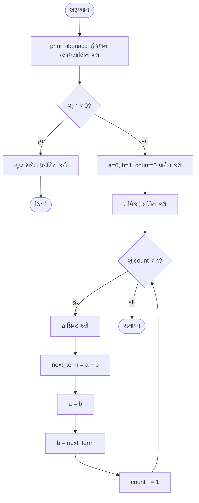

**સમજૂતી:**

- **ઇનપુટ વેલિડેશન**: તપાસો કે N એક માન્ય સકારાત્મક પૂર્ણાંક છે
- **ચલો પ્રારંભ કરો**: પ્રથમ બે ફિબોનાક્કી પદો સેટ કરો
- **શ્રેણી પ્રિન્ટ કરો**: ફિબોનાક્કી નંબરોને પ્રિન્ટ કરવા માટે લૂપ
- **પદો અપડેટ કરો**: આગળના પદની ગણતરી કરો અને આગળના પુનરાવર્તન માટે મૂલ્યો શિફ્ટ કરો
- **સમાપ્તિ**: જ્યારે કાઉન્ટ N સુધી પહોંચે ત્યારે અટકો

**મેમરી ટ્રીક:** "FIST" (Fibonacci-Initialize-Shift-Terminate)

## પ્રશ્ન 5(a) [3 ગુણ]

**આપેલ સ્ટ્રિંગ મેથડ્સ સમજાવો:**
**i. count() ii. upper() iii. replace()**

**જવાબ**:

| મેથડ | હેતુ | સિન્ટેક્સ | ઉદાહરણ | આઉટપુટ |
| --- | --- | --- | --- | --- |
| `count()` | સબસ્ટ્રિંગની ઘટનાઓની ગણતરી કરે છે | `str.count(substring)` | `"hello".count("l")` | `2` |
| `upper()` | સ્ટ્રિંગને અપરકેસમાં રૂપાંતરિત કરે છે | `str.upper()` | `"hello".upper()` | `"HELLO"` |
| `replace()` | સબસ્ટ્રિંગની બધી ઘટનાઓને બદલે છે | `str.replace(old, new)` | `"hello".replace("l", "r")` | `"herro"` |

**ઉદાહરણો:**

```python
text = "Python programming is fun and Python is easy to learn"

# count() મેથડ
print(f"'Python' ની ગણતરી: {text.count('Python')}")  # આઉટપુટ: 2
print(f"'is' ની ગણતરી: {text.count('is')}")  # આઉટપુટ: 2

# upper() મેથડ
print(f"અપરકેસ: {text.upper()}")  # આઉટપુટ: "PYTHON PROGRAMMING IS FUN AND PYTHON IS EASY TO LEARN"

# replace() મેથડ
print(f"'Python' ને 'Java' સાથે બદલો: {text.replace('Python', 'Java')}")
# આઉટપુટ: "Java programming is fun and Java is easy to learn"
```

**મેમરી ટ્રીક:** "CUR" (Count-Upper-Replace)

## પ્રશ્ન 5(b) [4 ગુણ]

**ટપલ ઓપરેશન ઉદાહરણ સાથે સમજાવો.**

**જવાબ**:

પાયથોનમાં ટપલ્સ એ ક્રમમાં રહેલા, અપરિવર્તનીય સંગ્રહો છે જે કૌંસમાં બંધ થાય છે.

| ઓપરેશન | વર્ણન | ઉદાહરણ | પરિણામ |
| --- | --- | --- | --- |
| સર્જન | મૂલ્યો સાથે ટપલ વ્યાખ્યાયિત કરો | `t = (1, 2, 3)` | 3 આઇટમો સાથે ટપલ |
| ઇન્ડેક્સિંગ | સ્થિતિ દ્વારા આઇટમને એક્સેસ કરો | `t[0]` | `1` |
| સ્લાઇસિંગ | ટપલનો ભાગ બહાર કાઢો | `t[1:3]` | `(2, 3)` |
| કેટેનેશન | બે ટપલ્સને જોડો | `t1 + t2` | સંયુક્ત ટપલ |
| રિપિટિશન | ટપલ તત્વોને પુનરાવર્તિત કરો | `t * 2` | ડુપ્લિકેટેડ તત્વો |

**ઉદાહરણો:**

```python
# ટપલ બનાવો
fruits = ("apple", "banana", "cherry")
print(f"ફળોનું ટપલ: {fruits}")

# ટપલ આઇટમોને એક્સેસ કરો
print(f"પ્રથમ ફળ: {fruits[0]}")  # આઉટપુટ: "apple"
print(f"છેલ્લું ફળ: {fruits[-1]}")  # આઉટપુટ: "cherry"

# ટપલ સ્લાઇસિંગ
print(f"પ્રથમ બે ફળો: {fruits[:2]}")  # આઉટપુટ: ("apple", "banana")

# ટપલ કેટેનેશન
more_fruits = ("orange", "kiwi")
all_fruits = fruits + more_fruits
print(f"બધા ફળો: {all_fruits}")  # આઉટપુટ: ("apple", "banana", "cherry", "orange", "kiwi")

# ટપલ રિપિટિશન
duplicated = fruits * 2
print(f"ડુપ્લિકેટેડ: {duplicated}")  # આઉટપુટ: ("apple", "banana", "cherry", "apple", "banana", "cherry")

# ટપલ ફંકશનો
print(f"લંબાઈ: {len(fruits)}")  # આઉટપુટ: 3
print(f"મહત્તમ: {max(fruits)}")  # આઉટપુટ: "cherry" (મૂળાક્ષર તુલના)
print(f"ન્યૂનતમ: {min(fruits)}")  # આઉટપુટ: "apple" (મૂળાક્ષર તુલના)
```

**મેમરી ટ્રીક:** "ICSM" (Immutable-Create-Slice-Merge)

## પ્રશ્ન 5(c) [7 ગુણ]

**બે સેટ બનાવવા અને આ બનાવેલા સેટ સાથે આપેલ ઓપરેશન કરવા માટે કોડ વિકસાવો:**
**i) સેટ પર યુનિયન ઓપરેશન**
**ii) સેટ પર ઇન્ટરસેક્શન ઓપરેશન**
**iii) સેટ પર ડિફરન્સ ઓપરેશન**
**iv) બે સેટનો સિમેટ્રિક ડિફરન્સ**

**જવાબ**:

```python
# સેટ ઓપરેશન દર્શાવવાનો પ્રોગ્રામ

# બે સેટ બનાવો
set_A = {1, 2, 3, 4, 5}
set_B = {4, 5, 6, 7, 8}

print(f"સેટ A: {set_A}")
print(f"સેટ B: {set_B}")

# i) યુનિયન ઓપરેશન (A ∪ B)
# A અથવા B અથવા બંનેમાં હાજર તત્વો
union_result = set_A.union(set_B)  # અથવા set_A | set_B
print(f"\ni) A અને B નો યુનિયન (A ∪ B): {union_result}")

# ii) ઇન્ટરસેક્શન ઓપરેશન (A ∩ B)
# A અને B બંનેમાં હાજર તત્વો
intersection_result = set_A.intersection(set_B)  # અથવા set_A & set_B
print(f"ii) A અને B નો ઇન્ટરસેક્શન (A ∩ B): {intersection_result}")

# iii) ડિફરન્સ ઓપરેશન (A - B)
# A માં હાજર પરંતુ B માં નહીં એવા તત્વો
difference_result = set_A.difference(set_B)  # અથવા set_A - set_B
print(f"iii) ડિફરન્સ (A - B): {difference_result}")

# વૈકલ્પિક ડિફરન્સ (B - A)
difference_alt = set_B.difference(set_A)  # અથવા set_B - set_A
print(f"    ડિફરન્સ (B - A): {difference_alt}")

# iv) સિમેટ્રિક ડિફરન્સ (A △ B)
# A અથવા B માં હાજર પરંતુ બંનેમાં નહીં એવા તત્વો
symmetric_difference = set_A.symmetric_difference(set_B)  # અથવા set_A ^ set_B
print(f"iv) સિમેટ્રિક ડિફરન્સ (A △ B): {symmetric_difference}")
```

**આકૃતિ:**

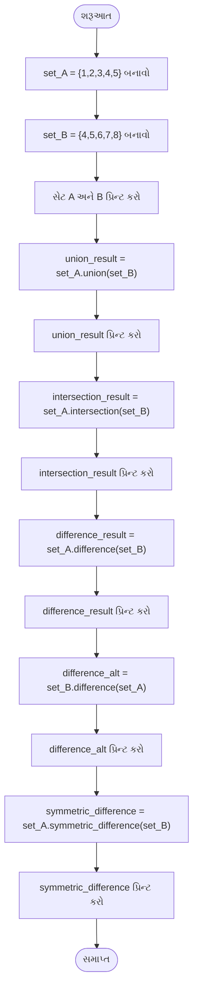

**સમજૂતી:**

- **યુનિયન**: ડુપ્લિકેટ વિના બંને સેટના બધા તત્વો (1, 2, 3, 4, 5, 6, 7, 8)
- **ઇન્ટરસેક્શન**: બંને સેટમાં સામાન્ય તત્વો (4, 5)
- **ડિફરન્સ (A-B)**: A માં પરંતુ B માં નહીં એવા તત્વો (1, 2, 3)
- **ડિફરન્સ (B-A)**: B માં પરંતુ A માં નહીં એવા તત્વો (6, 7, 8)
- **સિમેટ્રિક ડિફરન્સ**: A અથવા B માં પરંતુ બંનેમાં નહીં એવા તત્વો (1, 2, 3, 6, 7, 8)

**મેમરી ટ્રીક:** "UIDS" (Union-Intersection-Difference-Symmetric)

## પ્રશ્ન 5(a) અથવા [3 ગુણ]

**લિસ્ટને વ્યાખ્યાયિત કરો અને તે પાયથોનમાં કેવી રીતે બનાવવામાં આવે છે?**

**જવાબ**:
પાયથોનમાં લિસ્ટ એ ક્રમબદ્ધ, પરિવર્તનશીલ વસ્તુઓનો સંગ્રહ છે જે વિવિધ ડેટા પ્રકારોના હોઈ શકે છે, જે ચોરસ કૌંસમાં બંધ હોય છે.

**લિસ્ટ સર્જન પદ્ધતિઓની સારણી:**

| પદ્ધતિ | વર્ણન | ઉદાહરણ |
| --- | --- | --- |
| લિટરલ | ચોરસ કૌંસનો ઉપયોગ કરીને બનાવો | `my_list = [1, 2, 3]` |
| કન્સ્ટ્રક્ટર | list() ફંકશનનો ઉપયોગ કરીને બનાવો | `my_list = list((1, 2, 3))` |
| કોમ્પ્રિહેન્શન | એક લાઇન એક્સપ્રેશનનો ઉપયોગ કરીને બનાવો | `my_list = [x for x in range(5)]` |
| ઇટરેબલથી | અન્ય ઇટરેબલ્સને લિસ્ટમાં રૂપાંતરિત કરો | `my_list = list("abc")` |
| ખાલી લિસ્ટ | ખાલી લિસ્ટ બનાવો અને પછીથી ઉમેરો | `my_list = []` |

**ઉદાહરણો:**

```python
# લિટરલ્સનો ઉપયોગ કરીને લિસ્ટ બનાવો
numbers = [1, 2, 3, 4, 5]
mixed = [1, "hello", 3.14, True]

# list() કન્સ્ટ્રક્ટરનો ઉપયોગ કરીને બનાવો
tuple_to_list = list((10, 20, 30))
string_to_list = list("Python")

# લિસ્ટ કોમ્પ્રિહેન્શનનો ઉપયોગ કરીને બનાવો
squares = [x**2 for x in range(1, 6)]

# ખાલી લિસ્ટ બનાવો અને મૂલ્યો ઉમેરો
empty_list = []
empty_list.append("first")
empty_list.append("second")

print(f"સંખ્યાઓ: {numbers}")
print(f"મિશ્ર: {mixed}")
print(f"ટપલથી: {tuple_to_list}")
print(f"સ્ટ્રિંગથી: {string_to_list}")
print(f"વર્ગો: {squares}")
print(f"નિર્મિત લિસ્ટ: {empty_list}")
```

**મેમરી ટ્રીક:** "LCMIE" (Literal-Constructor-Mixed-Iterable-Empty)

## પ્રશ્ન 5(b) અથવા [4 ગુણ]

**ડિક્શનરી બિલ્ટ-ઇન ફંકશન અને મેથડ્સ સમજાવો.**

**જવાબ**:

ડિક્શનરી એ કર્લી બ્રેસિઝ `{}` માં બંધ કી-વેલ્યુ જોડીઓનો સંગ્રહ છે.

| ફંકશન/મેથડ | વર્ણન | ઉદાહરણ | પરિણામ |
| --- | --- | --- | --- |
| `dict()` | ડિક્શનરી બનાવે છે | `dict(name='John', age=25)` | `{'name': 'John', 'age': 25}` |
| `len()` | આઇટમોની સંખ્યા પાછી મોકલે છે | `len(my_dict)` | પૂર્ણાંક ગણતરી |
| `keys()` | બધી કીનું વ્યૂ પાછું મોકલે છે | `my_dict.keys()` | ડિક્શનરી વ્યૂ ઓબ્જેક્ટ |
| `values()` | બધા મૂલ્યોનું વ્યૂ પાછું મોકલે છે | `my_dict.values()` | ડિક્શનરી વ્યૂ ઓબ્જેક્ટ |
| `items()` | (કી, મૂલ્ય) જોડીઓનું વ્યૂ પાછું મોકલે છે | `my_dict.items()` | ડિક્શનરી વ્યૂ ઓબ્જેક્ટ |
| `get()` | કી માટે મૂલ્ય, અથવા ડિફોલ્ટ પાછું મોકલે છે | `my_dict.get('key', 'default')` | મૂલ્ય અથવા ડિફોલ્ટ |
| `update()` | બીજા ડિક્શનરીથી કી/મૂલ્યો સાથે ડિક્શનરી અપડેટ કરે છે | `my_dict.update(other_dict)` | None (ઇન-પ્લેસ અપડેટ કરે છે) |
| `pop()` | કી સાથેની આઇટમ દૂર કરે છે અને મૂલ્ય પાછું મોકલે છે | `my_dict.pop('key')` | દૂર કરેલી આઇટમનું મૂલ્ય |

**ઉદાહરણો:**

```python
# ડિક્શનરી બનાવો
student = {
    'name': 'John',
    'age': 20,
    'courses': ['Math', 'Science']
}

# બિલ્ટ-ઇન ફંકશનો
print(f"લંબાઈ: {len(student)}")  # આઉટપુટ: 3

# ડિક્શનરી મેથડ્સ
print(f"કીઝ: {student.keys()}")
print(f"વેલ્યુઝ: {student.values()}")
print(f"આઇટમ્સ: {student.items()}")

# ડિફોલ્ટ સાથે get મેથડ
print(f"ગ્રેડ મેળવો (ડિફોલ્ટ સાથે): {student.get('grade', 'N/A')}")

# ડિક્શનરી અપડેટ કરો
student.update({'grade': 'A', 'age': 21})
print(f"અપડેટ પછી: {student}")

# પોપ મેથડ
removed_item = student.pop('age')
print(f"દૂર કરેલી આઇટમ: {removed_item}")
print(f"પોપ પછી: {student}")
```

**મેમરી ટ્રીક:** "LKVIGUP" (Length-Keys-Values-Items-Get-Update-Pop)

## પ્રશ્ન 5(c) અથવા [7 ગુણ]

**1 થી 50 શ્રેણીમાં અવિભાજ્ય અને સંયુક્ત સંખ્યાઓની સૂચિ બનાવવા માટે પાયથોન કોડ વિકસાવો.**

**જવાબ**:

```python
# 1 થી 50 સુધી અવિભાજ્ય અને સંયુક્ત સંખ્યાઓની સૂચિ બનાવવાનો પ્રોગ્રામ

def is_prime(num):
    """
    સંખ્યા અવિભાજ્ય છે કે નહીં તે તપાસો
    અવિભાજ્ય હોય તો True, અન્યથા False પાછું મોકલે છે
    """
    # 1 અવિભાજ્ય સંખ્યા નથી
    if num <= 1:
        return False
    
    # 2 અવિભાજ્ય સંખ્યા છે
    if num == 2:
        return True
    
    # 2 થી મોટી બેકી સંખ્યાઓ અવિભાજ્ય નથી
    if num % 2 == 0:
        return False
    
    # num ના વર્ગમૂળ સુધીના વિષમ ભાજકોની તપાસ કરો
    # (ઓપ્ટિમાઇઝેશન: આપણે માત્ર sqrt(num) સુધી તપાસવાની જરૂર છે)
    for i in range(3, int(num**0.5) + 1, 2):
        if num % i == 0:
            return False
    
    return True

# અવિભાજ્ય અને સંયુક્ત સંખ્યાઓ માટે ખાલી લિસ્ટ પ્રારંભ કરો
prime_numbers = []
non_prime_numbers = []

# 1 થી 50 સુધીની દરેક સંખ્યાની તપાસ કરો
for num in range(1, 51):
    if is_prime(num):
        prime_numbers.append(num)
    else:
        non_prime_numbers.append(num)

# પરિણામો પ્રદર્શિત કરો
print(f"1 થી 50 સુધીની અવિભાજ્ય સંખ્યાઓ: {prime_numbers}")
print(f"1 થી 50 સુધીની સંયુક્ત સંખ્યાઓ: {non_prime_numbers}")
```

**આકૃતિ:**

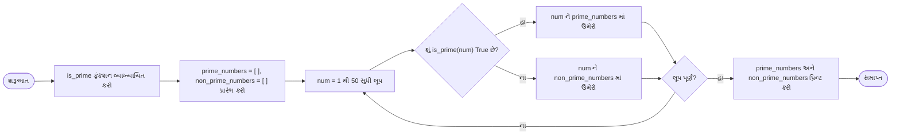

**સમજૂતી:**

- **હેલ્પર ફંકશન**: `is_prime()` કાર્યક્ષમ રીતે તપાસે છે કે સંખ્યા અવિભાજ્ય છે કે નહીં
- **ઓપ્ટિમાઇઝેશન**: સંખ્યાના વર્ગમૂળ સુધી જ વિભાજ્યતા તપાસે છે
- **વર્ગીકરણ**: સંખ્યાઓને અવિભાજ્ય અથવા સંયુક્ત સૂચિમાં વર્ગીકૃત કરે છે
- **આઉટપુટ**: અંતે બંને સૂચિઓ પ્રદર્શિત કરે છે

**અવિભાજ્ય સંખ્યાઓ (1 થી 50):** 2, 3, 5, 7, 11, 13, 17, 19, 23, 29, 31, 37, 41, 43, 47
**સંયુક્ત સંખ્યાઓ (1 થી 50):** 1, 4, 6, 8, 9, 10, 12, 14, 15, 16, 18, 20, 21, 22, 24, 25, 26, 27, 28, 30, 32, 33, 34, 35, 36, 38, 39, 40, 42, 44, 45, 46, 48, 49, 50

**મેમરી ટ્રીક:** "POEMS" (Prime-Optimization-Efficient-Modulo-Sorting)
