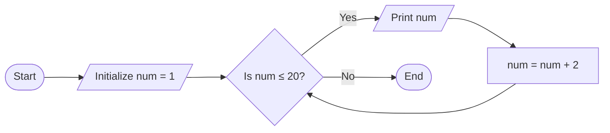

## Question 1(a) [3 marks]

**Define flowchart and list out the any four symbols of flowchart.**

**Answer**:
A flowchart is a diagrammatic representation that uses standard symbols to illustrate the sequence of steps in a process, algorithm, or program.

**Common Flowchart Symbols:**

| Symbol | Name | Purpose |
| --- | --- | --- |
| Oval/Rounded Rectangle | Terminal/Start/End | Indicates start or end of a process |
| Rectangle | Process | Represents computation or data processing |
| Diamond | Decision | Shows conditional branching point |
| Parallelogram | Input/Output | Represents data input or output |

**Mnemonic:** "TP-DI" (Terminal-Process-Decision-Input/Output)

## Question 1(b) [4 marks]

**List out various data types in python. Explain any three data types with example.**

**Answer**:
Python data types categorize different types of data values.

| Data Type | Description | Example |
| --- | --- | --- |
| Integer | Whole numbers without decimals | `x = 10` |
| Float | Numbers with decimal points | `y = 3.14` |
| String | Sequence of characters | `name = "Python"` |
| Boolean | True or False values | `is_valid = True` |
| List | Ordered, mutable collection | `colors = ["red", "green"]` |
| Tuple | Ordered, immutable collection | `point = (5, 10)` |
| Dictionary | Key-value pairs | `person = {"name": "John"}` |
| Set | Unordered collection of unique items | `unique = {1, 2, 3}` |

**Integer:** Represents whole numbers without decimal points.

```python
age = 25
count = -10
```

**String:** Represents sequence of characters enclosed in quotes.

```python
name = "Python"
message = 'Hello World'
```

**List:** Ordered, mutable collection of items that can be of different types.

```python
numbers = [1, 2, 3, 4]
mixed = [1, "Python", True, 3.14]
```

**Mnemonic:** "FIBS-LTDS" (Float-Integer-Boolean-String-List-Tuple-Dictionary-Set)

## Question 1(c) [7 marks]

**Design a flowchart to calculate the sum of first twenty even natural numbers.**

**Answer**:


**Explanation:**

- **Initialize variables**: Set sum=0, count=0 (to track even numbers found), num=2 (first even number)
- **Loop condition**: Continue until we've found 20 even numbers
- **Process**: Add current even number to sum
- **Update**: Increase counter and move to next even number
- **Output**: Print the final sum when loop completes

**Mnemonic:** "SCNL-20" (Sum-Count-Number-Loop until 20)

## Question 1(c) OR [7 marks]

**Create an algorithm to print odd numbers between 1 to 20.**

**Answer**:

**Algorithm:**

1. Initialize a variable num = 1 (starting with first odd number)
2. While num ≤ 20, do steps 3-5
3. Print the value of num
4. Increment num by 2 (to get next odd number)
5. Repeat from step 2
6. End

**Diagram:**



**Code Implementation:**

```python
# Print odd numbers between 1 to 20
num = 1
while num <= 20:
    print(num)
    num += 2
```

**Mnemonic:** "SOLO-20" (Start Odd Loop Output until 20)

## Question 2(a) [3 marks]

**Discuss the membership operator of python.**

**Answer**:
Membership operators in Python are used to test if a value or variable exists in a sequence.

**Table of Membership Operators:**

| Operator | Description | Example | Output |
| --- | --- | --- | --- |
| `in` | Returns True if a value exists in sequence | `5 in [1,2,5]` | `True` |
| `not in` | Returns True if a value doesn't exist | `4 not in [1,2,5]` | `True` |

**Common Usage:**

- Checking if an element exists in a list: `if item in my_list:`
- Checking if a key exists in dictionary: `if key in my_dict:`
- Checking if a substring exists: `if "py" in "python":`

**Mnemonic:** "IM-NOT" (In Membership - NOT in Membership)

## Question 2(b) [4 marks]

**Explain the need for continue and break statements.**

**Answer**:

| Statement | Purpose | Use Case | Example |
| --- | --- | --- | --- |
| `break` | Terminates the loop immediately | Exit loop when a condition is met | Finding an element |
| `continue` | Skips current iteration and jumps to next | Skip processing for certain values | Filtering values |

**Break Statement:**

- **Purpose**: Immediately exits the loop
- **When to use**: When the required condition is achieved and further processing is unnecessary
- **Example**: Finding a specific element in a list

```python
for num in range(1, 10):
    if num == 5:
        print("Found 5!")
        break
    print(num)
```

**Continue Statement:**

- **Purpose**: Skips the current iteration and proceeds to the next
- **When to use**: When certain values should be skipped but the loop should continue
- **Example**: Skipping even numbers in a loop

```python
for num in range(1, 10):
    if num % 2 == 0:
        continue
    print(num)  # Prints only odd numbers
```

**Mnemonic:** "BS-CE" (Break Stops, Continue Excepts)

## Question 2(c) [7 marks]

**Create a program to calculate total and average marks based on four subject marks taken as input from user.**

**Answer**:

```python
# Program to calculate total and average marks
# Input marks for four subjects
subject1 = float(input("Enter marks for subject 1: "))
subject2 = float(input("Enter marks for subject 2: "))
subject3 = float(input("Enter marks for subject 3: "))
subject4 = float(input("Enter marks for subject 4: "))

# Calculate total and average
total_marks = subject1 + subject2 + subject3 + subject4
average_marks = total_marks / 4

# Display results
print(f"Total marks: {total_marks}")
print(f"Average marks: {average_marks}")
```

**Diagram:**


**Explanation:**

- **Input**: Get marks for four subjects from user
- **Process**: Calculate total by adding all subject marks and average by dividing total by number of subjects
- **Output**: Display total and average marks

**Mnemonic:** "IAPO" (Input-Add-Process-Output)

## Question 2(a) OR [3 marks]

**Write a short note on assignment operator.**

**Answer**:
The assignment operator in Python is used to assign values to variables.

| Operator | Name | Description | Example |
| --- | --- | --- | --- |
| `=` | Simple Assignment | Assigns right operand value to left operand | `x = 10` |
| `+=` | Add AND | Adds right operand to left and assigns result | `x += 5` (same as `x = x + 5`) |
| `-=` | Subtract AND | Subtracts right operand from left and assigns | `x -= 3` (same as `x = x - 3`) |
| `*=` | Multiply AND | Multiplies left by right and assigns result | `x *= 2` (same as `x = x * 2`) |
| `/=` | Divide AND | Divides left by right and assigns result | `x /= 4` (same as `x = x / 4`) |

**Compound assignment operators** combine an arithmetic operation with assignment, making code more concise and readable.

**Mnemonic:** "SAME" (Simple Assignment Makes Easy)

## Question 2(b) OR [4 marks]

**Explain the use of for loop by giving syntax, flowchart and example.**

**Answer**:

**Syntax of For Loop:**

```python
for variable in sequence:
    # code block to be executed
```

**Flowchart:**


**Example:**

```python
# Print squares of numbers from 1 to 5
for num in range(1, 6):
    square = num ** 2
    print(f"{num} squared = {square}")
```

The `for` loop in Python is used for definite iteration over a sequence (list, tuple, string, etc.) or other iterable objects. It's particularly useful when you know the number of iterations in advance.

**Mnemonic:** "SIFE" (Sequence Iteration For Each item)

## Question 2(c) OR [7 marks]

**Develop a code to find the square and cube of a given number from user.**

**Answer**:

```python
# Program to find square and cube of a number
# Input number from user
num = float(input("Enter a number: "))

# Calculate square and cube
square = num ** 2
cube = num ** 3

# Display results
print(f"The number entered is: {num}")
print(f"Square of {num} is: {square}")
print(f"Cube of {num} is: {cube}")
```

**Diagram:**


**Explanation:**

- **Input**: Get a number from user
- **Process**: Calculate square by raising to power 2, cube by raising to power 3
- **Output**: Display the input number, its square and cube

**Mnemonic:** "ISCO" (Input-Square-Cube-Output)

## Question 3(a) [3 marks]

**Explain if-elif-else statement with flowchart and suitable example.**

**Answer**:
The if-elif-else statement in Python allows for conditional execution where multiple expressions are evaluated.

**Flowchart:**


**Example:**

```python
# Grade assignment based on marks
marks = 75

if marks >= 90:
    grade = "A"
elif marks >= 80:
    grade = "B"
elif marks >= 70:
    grade = "C"
elif marks >= 60:
    grade = "D"
else:
    grade = "F"

print(f"Your grade is: {grade}")
```

**Mnemonic:** "CITE" (Check If Then Else)

## Question 3(b) [4 marks]

**Explain how to define and call user defined function by giving suitable example.**

**Answer**:

**Function Definition and Calling:**

| Aspect | Syntax | Purpose |
| --- | --- | --- |
| Definition | `def function_name(parameters):` | Creates a reusable block of code |
| Function Body | Indented code block | Contains the function's logic |
| Return Statement | `return [expression]` | Sends a value back to the caller |
| Function Call | `function_name(arguments)` | Executes the function code |

**Example of Defining and Calling a Function:**

```python
# Define a function to calculate area of rectangle
def calculate_area(length, width):
    """Calculate area of a rectangle with given length and width"""
    area = length * width
    return area

# Call the function
result = calculate_area(5, 3)
print(f"Area of rectangle: {result}")
```

**Explanation:**

- **Function Definition**: Use `def` keyword followed by function name and parameters
- **Documentation**: Optional docstring describing the function
- **Function Body**: Code that performs the task
- **Return Statement**: Sends result back to caller
- **Function Call**: Pass arguments to execute the function

**Mnemonic:** "DBRCA" (Define-Body-Return-Call-Arguments)

## Question 3(c) [7 marks]

**Develop a code to find the factorial of a given number.**

**Answer**:

```python
# Program to find factorial of a number
# Input number from user
num = int(input("Enter a positive integer: "))

# Initialize factorial
factorial = 1

# Check if number is negative, zero or positive
if num < 0:
    print("Factorial doesn't exist for negative numbers")
elif num == 0:
    print("Factorial of 0 is 1")
else:
    # Calculate factorial
    for i in range(1, num + 1):
        factorial *= i
    print(f"Factorial of {num} is {factorial}")
```

**Diagram:**


**Explanation:**

- **Input**: Get a number from user
- **Check**: Validate if number is negative (factorial not defined), zero (factorial is 1), or positive
- **Process**: For positive numbers, multiply factorial by each number from 1 to num
- **Output**: Display the factorial result

**Mnemonic:** "MICE" (Multiply Incrementally, Check Edge-cases)

## Question 3(a) OR [3 marks]

**Explain nested loop using suitable example.**

**Answer**:
A nested loop is a loop inside another loop. The inner loop completes all its iterations for each iteration of the outer loop.

**Diagram:**


**Example:**

```python
# Print multiplication table from 1 to 3
for i in range(1, 4):  # Outer loop: 1 to 3
    print(f"Multiplication table for {i}:")
    for j in range(1, 6):  # Inner loop: 1 to 5
        print(f"{i} x {j} = {i*j}")
    print()  # Empty line after each table
```

**Mnemonic:** "LOFI" (Loop Outside, Finish Inside)

## Question 3(b) OR [4 marks]

**Explain return statement in function handling.**

**Answer**:

| Aspect | Description | Example |
| --- | --- | --- |
| Purpose | Send value back to caller | `return result` |
| Multiple Returns | Return multiple values as tuple | `return x, y, z` |
| Early Exit | Exit function before end | `if error: return None` |
| No Return | Function returns None by default | `def show(): print("Hi")` |

The `return` statement in Python functions:

1. Terminates the function execution
2. Passes a value back to the function caller
3. Can return multiple values (as tuple)
4. Is optional (if omitted, function returns None)

**Example:**

```python
def calculate_circle(radius):
    """Calculate area and circumference of a circle"""
    if radius < 0:
        return None  # Early exit for invalid input
    
    area = 3.14 * radius ** 2
    circumference = 2 * 3.14 * radius
    
    return area, circumference  # Return multiple values
    
# Function call
result = calculate_circle(5)
print(f"Area and circumference: {result}")
```

**Mnemonic:** "TERM" (Terminate Execution, Return Multiple values)

## Question 3(c) OR [7 marks]

**Create a program to display the following patterns using loop concept**

```
A
AB
ABC
ABCD
ABCDE
```

**Answer**:

```python
# Program to print character pattern
# First pattern: A to E in triangle form

# Loop through rows (1 to 5)
for i in range(1, 6):
    # For each row, print characters from 'A' to required letter
    for j in range(i):
        # ASCII value of 'A' is 65, add j to get successive letters
        print(chr(65 + j), end="")
    # Move to next line after each row
    print()
```

**Diagram:**


**Explanation:**

- **Outer loop**: Controls the number of rows (1 to 5)
- **Inner loop**: For each row i, prints i characters starting from 'A'
- **Character generation**: Using ASCII value conversion (chr(65+j) gives 'A', 'B', etc.)
- **Output formatting**: Using end="" to print characters in same line for each row

**Mnemonic:** "OICE" (Outer-Inner-Character-Endline)

## Question 4(a) [3 marks]

**Describe following built-in functions with suitable example.**
**i) max() ii) input() iii) pow()**

**Answer**:

| Function | Purpose | Syntax | Example |
| --- | --- | --- | --- |
| `max()` | Returns largest item in an iterable or largest of two or more arguments | `max(iterable)` or `max(arg1, arg2, ...)` | `max([1, 5, 3])` returns `5` |
| `input()` | Reads a line from input and returns as string | `input([prompt])` | `input("Enter name: ")` |
| `pow()` | Returns x to power y | `pow(x, y)` | `pow(2, 3)` returns `8` |

**Examples in code:**

```python
# max() function example
numbers = [10, 5, 20, 15]
maximum = max(numbers)
print(f"Maximum value: {maximum}")  # Output: Maximum value: 20

# input() function example
name = input("Enter your name: ")
print(f"Hello, {name}!")

# pow() function example
result = pow(2, 4)
print(f"2 raised to power 4 is: {result}")  # Output: 2 raised to power 4 is: 16
```

**Mnemonic:** "MIP" (Max-Input-Power)

## Question 4(b) [4 marks]

**Explain slicing of string by giving suitable example.**

**Answer**:

String slicing in Python is used to extract a substring from a string.

**Syntax:** `string[start:end:step]`

| Parameter | Description | Default | Example |
| --- | --- | --- | --- |
| `start` | Starting index (inclusive) | 0 | `"Python"[1:]` → `"ython"` |
| `end` | Ending index (exclusive) | Length of string | `"Python"[:3]` → `"Pyt"` |
| `step` | Increment between characters | 1 | `"Python"[::2]` → `"Pto"` |

**Examples:**

```python
text = "Python Programming"

# Basic slicing
print(text[0:6])     # Output: "Python"
print(text[7:])      # Output: "Programming"
print(text[:6])      # Output: "Python"

# With step
print(text[::2])     # Output: "Pto rgamn"
print(text[0:10:2])  # Output: "Pto r"

# Negative indices (count from end)
print(text[-11:])    # Output: "Programming"
print(text[:-12])    # Output: "Python"

# Reverse a string
print(text[::-1])    # Output: "gnimmargorP nohtyP"
```

**Mnemonic:** "SES" (Start-End-Step)

## Question 4(c) [7 marks]

**Create a user defined function which prints cube of all the odd numbers between 1 to 7.**

**Answer**:

```python
# Function to print cube of odd numbers in a range
def print_odd_cubes(start, end):
    """
    Print cube of all odd numbers between start and end (inclusive)
    """
    print(f"Cubes of odd numbers between {start} and {end}:")
    
    # Loop through the range
    for num in range(start, end + 1):
        # Check if number is odd
        if num % 2 != 0:
            # Calculate and print cube
            cube = num ** 3
            print(f"Cube of {num} is {cube}")

# Call the function to print odd cubes from 1 to 7
print_odd_cubes(1, 7)
```

**Diagram:**


**Explanation:**

- **Function Definition**: Create a function to process odd numbers in a range
- **Loop**: Iterate through numbers from start to end
- **Condition**: Check if number is odd using modulo operator
- **Processing**: Calculate cube of odd numbers
- **Output**: Display each odd number and its cube

**Mnemonic:** "FLOOP" (Function-Loop-Odd-Output-Power)

## Question 4(a) OR [3 marks]

**Explain random module with various functions.**

**Answer**:

The random module in Python provides functions for generating random numbers and making random selections.

| Function | Description | Example | Result |
| --- | --- | --- | --- |
| `random()` | Returns random float between 0 and 1 | `random.random()` | `0.7134346335849448` |
| `randint(a, b)` | Returns random integer between a and b (inclusive) | `random.randint(1, 10)` | `7` |
| `choice(seq)` | Returns random element from sequence | `random.choice(['red', 'green', 'blue'])` | `'green'` |
| `shuffle(seq)` | Shuffles a sequence in-place | `random.shuffle(my_list)` | No return value |
| `sample(seq, k)` | Returns k unique random elements from sequence | `random.sample(range(1, 30), 5)` | `[3, 12, 21, 7, 25]` |

**Example:**

```python
import random

# Generate random float between 0 and 1
print(random.random())  

# Generate random integer between 1 and 10
print(random.randint(1, 10))  

# Select random element from list
colors = ["red", "green", "blue", "yellow"]
print(random.choice(colors))  

# Shuffle a list in-place
random.shuffle(colors)
print(colors)  

# Select 2 unique random elements
print(random.sample(colors, 2))  
```

**Mnemonic:** "RICES" (Random-Integer-Choice-Elements-Shuffle)

## Question 4(b) OR [4 marks]

**Discuss the following list functions.**
**i. len() ii. sum() iii. sort() iv. index()**

**Answer**:

| Function | Purpose | Syntax | Example | Output |
| --- | --- | --- | --- | --- |
| `len()` | Returns number of items in list | `len(list)` | `len([1, 2, 3])` | `3` |
| `sum()` | Returns sum of all items in list | `sum(list)` | `sum([1, 2, 3])` | `6` |
| `sort()` | Sorts list in-place | `list.sort()` | `[3, 1, 2].sort()` | None (modifies original) |
| `index()` | Returns index of first occurrence | `list.index(value)` | `[10, 20, 30].index(20)` | `1` |

**Examples:**

```python
# len() function
numbers = [5, 10, 15, 20, 25]
print(f"Length of list: {len(numbers)}")  # Output: 5

# sum() function
print(f"Sum of all items: {sum(numbers)}")  # Output: 75

# sort() function
mixed = [3, 1, 4, 2]
mixed.sort()  # Sorts in-place
print(f"Sorted list: {mixed}")  # Output: [1, 2, 3, 4]
mixed.sort(reverse=True)
print(f"Reverse sorted: {mixed}")  # Output: [4, 3, 2, 1]

# index() function
fruits = ["apple", "banana", "cherry", "apple"]
print(f"Index of 'banana': {fruits.index('banana')}")  # Output: 1
```

**Mnemonic:** "LSSI" (Length-Sum-Sort-Index)

## Question 4(c) OR [7 marks]

**Create a user-defined function to print the Fibonacci series of 0 to N numbers. (Where N is an integer number and passed as an argument)**

**Answer**:

```python
# Function to print Fibonacci series up to N
def print_fibonacci(n):
    """
    Print Fibonacci series up to n terms
    Where 0th term is 0 and 1st term is 1
    """
    # Check if input is valid
    if n < 0:
        print("Please enter a positive integer")
        return
    
    # Initialize first two terms
    a, b = 0, 1
    count = 0
    
    print(f"Fibonacci series up to {n} terms:")
    
    # Print Fibonacci series
    while count < n:
        print(a, end=" ")
        # Update variables for next iteration
        next_term = a + b
        a = b
        b = next_term
        count += 1
```

**Diagram:**


**Explanation:**

- **Input Validation**: Check if N is a valid positive integer
- **Initialize Variables**: Set first two Fibonacci terms
- **Print Series**: Loop to print Fibonacci numbers
- **Update Terms**: Calculate next term and shift values for next iteration
- **Termination**: Stop when count reaches N

**Mnemonic:** "FIST" (Fibonacci-Initialize-Shift-Terminate)

## Question 5(a) [3 marks]

**Explain given string methods:**
**i. count() ii. upper() iii. replace()**

**Answer**:

| Method | Purpose | Syntax | Example | Output |
| --- | --- | --- | --- | --- |
| `count()` | Counts occurrences of substring | `str.count(substring)` | `"hello".count("l")` | `2` |
| `upper()` | Converts string to uppercase | `str.upper()` | `"hello".upper()` | `"HELLO"` |
| `replace()` | Replaces all occurrences of a substring | `str.replace(old, new)` | `"hello".replace("l", "r")` | `"herro"` |

**Examples:**

```python
text = "Python programming is fun and Python is easy to learn"

# count() method
print(f"Count of 'Python': {text.count('Python')}")  # Output: 2
print(f"Count of 'is': {text.count('is')}")  # Output: 2

# upper() method
print(f"Uppercase: {text.upper()}")  # Output: "PYTHON PROGRAMMING IS FUN AND PYTHON IS EASY TO LEARN"

# replace() method
print(f"Replace 'Python' with 'Java': {text.replace('Python', 'Java')}")
# Output: "Java programming is fun and Java is easy to learn"
```

**Mnemonic:** "CUR" (Count-Upper-Replace)

## Question 5(b) [4 marks]

**Explain tuple operation with example.**

**Answer**:

Tuples in Python are ordered, immutable collections enclosed in parentheses.

| Operation | Description | Example | Result |
| --- | --- | --- | --- |
| Creation | Define tuple with values | `t = (1, 2, 3)` | Tuple with 3 items |
| Indexing | Access item by position | `t[0]` | `1` |
| Slicing | Extract portion of tuple | `t[1:3]` | `(2, 3)` |
| Concatenation | Join two tuples | `t1 + t2` | Combined tuple |
| Repetition | Repeat tuple elements | `t * 2` | Duplicated elements |

**Examples:**

```python
# Create a tuple
fruits = ("apple", "banana", "cherry")
print(f"Fruits tuple: {fruits}")

# Access tuple items
print(f"First fruit: {fruits[0]}")  # Output: "apple"
print(f"Last fruit: {fruits[-1]}")  # Output: "cherry"

# Tuple slicing
print(f"First two fruits: {fruits[:2]}")  # Output: ("apple", "banana")

# Tuple concatenation
more_fruits = ("orange", "kiwi")
all_fruits = fruits + more_fruits
print(f"All fruits: {all_fruits}")  # Output: ("apple", "banana", "cherry", "orange", "kiwi")

# Tuple repetition
duplicated = fruits * 2
print(f"Duplicated: {duplicated}")  # Output: ("apple", "banana", "cherry", "apple", "banana", "cherry")

# Tuple functions
print(f"Length: {len(fruits)}")  # Output: 3
print(f"Max: {max(fruits)}")  # Output: "cherry" (alphabetical comparison)
print(f"Min: {min(fruits)}")  # Output: "apple" (alphabetical comparison)
```

**Mnemonic:** "ICSM" (Immutable-Create-Slice-Merge)

## Question 5(c) [7 marks]

**Develop a code to create two set and perform given operations with those created set:**
**i) Union Operation on Sets**
**ii) Intersection Operation on Sets**
**iii) Difference Operation on Sets**
**iv) Symmetric Difference of Two Sets**

**Answer**:

```python
# Program to demonstrate set operations

# Create two sets
set_A = {1, 2, 3, 4, 5}
set_B = {4, 5, 6, 7, 8}

print(f"Set A: {set_A}")
print(f"Set B: {set_B}")

# i) Union Operation (A ∪ B)
# Elements present in either A or B or both
union_result = set_A.union(set_B)  # OR set_A | set_B
print(f"\ni) Union of A and B (A ∪ B): {union_result}")

# ii) Intersection Operation (A ∩ B)
# Elements present in both A and B
intersection_result = set_A.intersection(set_B)  # OR set_A & set_B
print(f"ii) Intersection of A and B (A ∩ B): {intersection_result}")

# iii) Difference Operation (A - B)
# Elements present in A but not in B
difference_result = set_A.difference(set_B)  # OR set_A - set_B
print(f"iii) Difference (A - B): {difference_result}")

# Alternative difference (B - A)
difference_alt = set_B.difference(set_A)  # OR set_B - set_A
print(f"    Difference (B - A): {difference_alt}")

# iv) Symmetric Difference (A △ B)
# Elements present in A or B but not in both
symmetric_difference = set_A.symmetric_difference(set_B)  # OR set_A ^ set_B
print(f"iv) Symmetric Difference (A △ B): {symmetric_difference}")
```

**Diagram:**


**Explanation:**

- **Union**: All elements from both sets without duplicates (1, 2, 3, 4, 5, 6, 7, 8)
- **Intersection**: Common elements in both sets (4, 5)
- **Difference (A-B)**: Elements in A but not in B (1, 2, 3)
- **Difference (B-A)**: Elements in B but not in A (6, 7, 8)
- **Symmetric Difference**: Elements in either A or B but not in both (1, 2, 3, 6, 7, 8)

**Mnemonic:** "UIDS" (Union-Intersection-Difference-Symmetric)

## Question 5(a) OR [3 marks]

**Define list and how it is created in python?**

**Answer**:
A list in Python is an ordered, mutable collection of items that can be of different data types, enclosed in square brackets.

**Table of List Creation Methods:**

| Method | Description | Example |
| --- | --- | --- |
| Literal | Create using square brackets | `my_list = [1, 2, 3]` |
| Constructor | Create using list() function | `my_list = list((1, 2, 3))` |
| Comprehension | Create using a single line expression | `my_list = [x for x in range(5)]` |
| From iterable | Convert other iterables to list | `my_list = list("abc")` |
| Empty list | Create empty list and append later | `my_list = []` |

**Examples:**

```python
# Create list using literals
numbers = [1, 2, 3, 4, 5]
mixed = [1, "hello", 3.14, True]

# Create using list() constructor
tuple_to_list = list((10, 20, 30))
string_to_list = list("Python")

# Create using list comprehension
squares = [x**2 for x in range(1, 6)]

# Create empty list and add values
empty_list = []
empty_list.append("first")
empty_list.append("second")

print(f"Numbers: {numbers}")
print(f"Mixed: {mixed}")
print(f"From tuple: {tuple_to_list}")
print(f"From string: {string_to_list}")
print(f"Squares: {squares}")
print(f"Built list: {empty_list}")
```

**Mnemonic:** "LCMIE" (Literal-Constructor-Mixed-Iterable-Empty)

## Question 5(b) OR [4 marks]

**Explain dictionary built-in function and methods.**

**Answer**:

Dictionary is a collection of key-value pairs enclosed in curly braces `{}`.

| Function/Method | Description | Example | Result |
| --- | --- | --- | --- |
| `dict()` | Creates a dictionary | `dict(name='John', age=25)` | `{'name': 'John', 'age': 25}` |
| `len()` | Returns number of items | `len(my_dict)` | Integer count |
| `keys()` | Returns view of all keys | `my_dict.keys()` | Dictionary view object |
| `values()` | Returns view of all values | `my_dict.values()` | Dictionary view object |
| `items()` | Returns view of (key, value) pairs | `my_dict.items()` | Dictionary view object |
| `get()` | Returns value for key, or default | `my_dict.get('key', 'default')` | Value or default |
| `update()` | Updates dict with keys/values from another | `my_dict.update(other_dict)` | None (updates in-place) |
| `pop()` | Removes item with key and returns value | `my_dict.pop('key')` | Value of removed item |

**Examples:**

```python
# Create a dictionary
student = {
    'name': 'John',
    'age': 20,
    'courses': ['Math', 'Science']
}

# Built-in functions
print(f"Length: {len(student)}")  # Output: 3

# Dictionary methods
print(f"Keys: {student.keys()}")
print(f"Values: {student.values()}")
print(f"Items: {student.items()}")

# Get method with default
print(f"Get grade (with default): {student.get('grade', 'N/A')}")

# Update dictionary
student.update({'grade': 'A', 'age': 21})
print(f"After update: {student}")

# Pop method
removed_item = student.pop('age')
print(f"Removed item: {removed_item}")
print(f"After pop: {student}")
```

**Mnemonic:** "LKVIGUP" (Length-Keys-Values-Items-Get-Update-Pop)

## Question 5(c) OR [7 marks]

**Develop python code to create list of prime and non-prime numbers in range 1 to 50.**

**Answer**:

```python
# Program to create list of prime and non-prime numbers from 1 to 50

def is_prime(num):
    """
    Check if a number is prime
    Returns True if prime, False otherwise
    """
    # 1 is not a prime number
    if num <= 1:
        return False
    
    # 2 is a prime number
    if num == 2:
        return True
    
    # Even numbers greater than 2 are not prime
    if num % 2 == 0:
        return False
    
    # Check odd divisors up to square root of num
    # (optimization: we only need to check up to sqrt(num))
    for i in range(3, int(num**0.5) + 1, 2):
        if num % i == 0:
            return False
    
    return True

# Initialize empty lists for prime and non-prime numbers
prime_numbers = []
non_prime_numbers = []

# Check each number from 1 to 50
for num in range(1, 51):
    if is_prime(num):
        prime_numbers.append(num)
    else:
        non_prime_numbers.append(num)

# Display results
print(f"Prime numbers from 1 to 50: {prime_numbers}")
print(f"Non-prime numbers from 1 to 50: {non_prime_numbers}")
```

**Diagram:**


**Explanation:**

- **Helper Function**: `is_prime()` efficiently checks if a number is prime
- **Optimization**: Only checks divisibility up to square root of number
- **Classification**: Sort numbers into prime or non-prime lists
- **Output**: Display both lists at the end

**Prime numbers (from 1 to 50):** 2, 3, 5, 7, 11, 13, 17, 19, 23, 29, 31, 37, 41, 43, 47
**Non-prime numbers (from 1 to 50):** 1, 4, 6, 8, 9, 10, 12, 14, 15, 16, 18, 20, 21, 22, 24, 25, 26, 27, 28, 30, 32, 33, 34, 35, 36, 38, 39, 40, 42, 44, 45, 46, 48, 49, 50

**Mnemonic:** "POEMS" (Prime-Optimization-Efficient-Modulo-Sorting)
