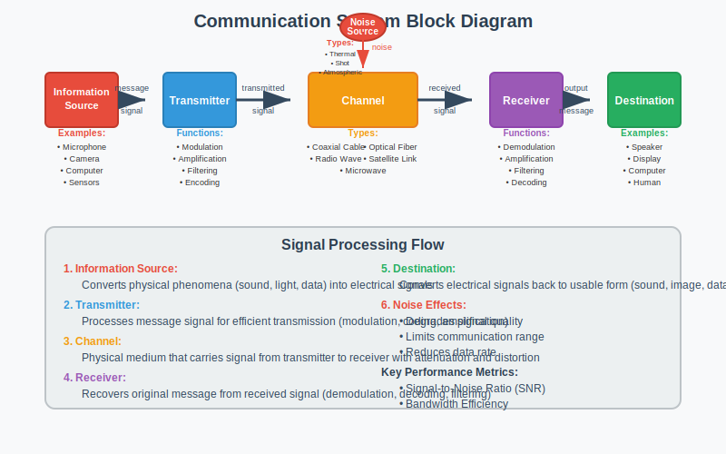
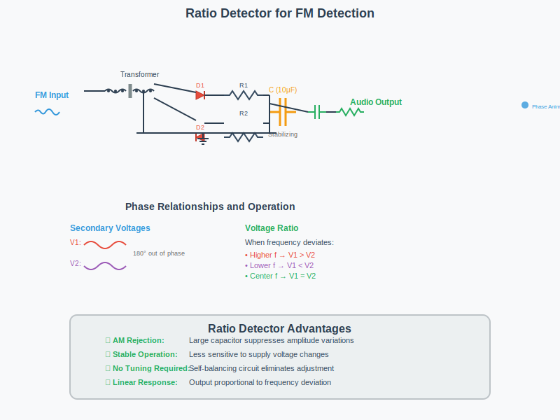
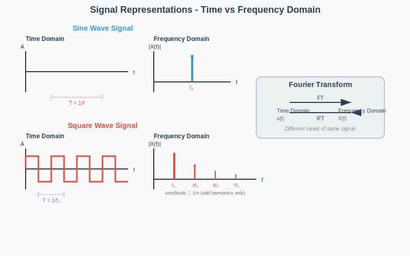
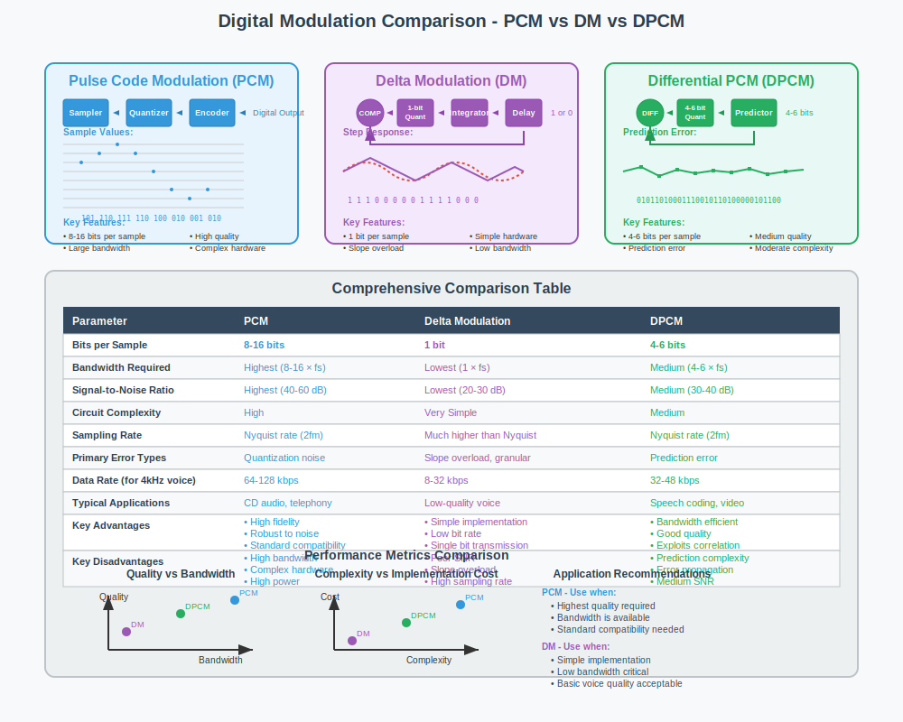

## Question 1(a) [3 marks]

**મોડ્યુલેશનની વ્યાખ્યા આપો અને તેની જરૂરિયત સમજાવો.**

**Answer**:
મોડ્યુલેશન એ ઉચ્ચ આવૃત્તિની કેરિયર સિગ્નલના એક અથવા વધુ ગુણધર્મોને માહિતી ધરાવતા મોડ્યુલેટિંગ સિગ્નલ સાથે બદલવાની પ્રક્રિયા છે.

**Table: મોડ્યુલેશનની જરૂરિયત**

| જરૂરિયાત | સમજૂતી |
|----------|---------|
| **એન્ટેના સાઈઝ ઘટાડવા** | આવૃત્તિ વધારીને વ્યવહારિક એન્ટેના સાઈઝ (λ/4) મેળવવા |
| **સિગ્નલ પ્રસારણ** | ઉચ્ચ આવૃત્તિઓ વાતાવરણમાં વધુ દૂર સુધી પ્રવાસ કરે છે |
| **મલ્ટિપ્લેક્સિંગ** | એક સાથે ઘણા સિગ્નલ્સને ટ્રાન્સમિટ કરવાની મંજૂરી આપે છે |
| **દખલગીરી ઘટાડવી** | સિગ્નલને ઓછા નોઈઝ/ઇન્ટરફેરન્સવાળા બેન્ડમાં શિફ્ટ કરે છે |
| **બેન્ડવિડ્થ ફાળવણી** | વિવિધ સેવાઓ દ્વારા સ્પેક્ટ્રમના કાર્યક્ષમ ઉપયોગને સક્ષમ બનાવે છે |

**મેમરી ટ્રીક:** "ASPIM" - Antenna size, Signal propagation, Proper multiplexing, Interference reduction, Manage bandwidth

## Question 1(b) [4 marks]

**કોમ્યુનીકેશન સિસ્ટમનો બ્લોક ડાયાગ્રામ દોરો  અને સમજાવો.**

**Answer**:
કોમ્યુનિકેશન સિસ્ટમ માહિતીને સ્ત્રોતથી ચેનલ મારફતે ગંતવ્ય સુધી પહોંચાડે છે.

**Table: કોમ્યુનિકેશન સિસ્ટમના ઘટકો**

| ઘટક | કાર્ય |
|------|------|
| **માહિતી સ્ત્રોત** | ટ્રાન્સમિટ કરવા માટેનો સંદેશ ઉત્પન્ન કરે છે (અવાજ, વિડિઓ, ડેટા) |
| **ટ્રાન્સમીટર** | સંદેશને યોગ્ય સિગ્નલમાં રૂપાંતરિત કરે છે (મોડ્યુલેશન, કોડિંગ) |
| **ચેનલ** | માધ્યમ જેમાં સિગ્નલ પ્રવાસ કરે છે (તાર, ફાઇબર, હવા) |
| **નોઈઝ સ્ત્રોત** | અવાંછિત સિગ્નલ જે ટ્રાન્સમિટ કરેલા સિગ્નલને બગાડે છે |
| **રીસીવર** | પ્રાપ્ત સિગ્નલમાંથી મૂળ સંદેશ કાઢે છે (ડીમોડ્યુલેશન) |
| **ગંતવ્ય** | જ્યાં સંદેશ પહોંચાડવામાં આવે છે (માનવ, મશીન) |

**મેમરી ટ્રીક:** "I Try Communicating Neatly, Receive Data" (I-T-C-N-R-D)

## Question 1(c) [7 marks]

**એમ્પ્લિટ્યુડ મોડ્યુલેશન માટેનાં વોલ્ટેજનુ સુત્ર તારવો.**

**Answer**:
એમ્પ્લિટ્યુડ મોડ્યુલેશન કેરિયર સિગ્નલની એમ્પ્લિટ્યુડને મેસેજ સિગ્નલના પ્રમાણમાં બદલે છે.

**ગાણિતિક ડેરિવેશન:**

- ધારો કે કેરિયર સિગ્નલ: c(t) = Ac cos(ωct)
- મેસેજ સિગ્નલ: m(t) = Am cos(ωmt)
- AM સિગ્નલ: s(t) = Ac[1 + μ·m(t)/Am]cos(ωct)
- જ્યાં μ = મોડ્યુલેશન ઇન્ડેક્સ = Am/Ac
- m(t) ને સબ્સ્ટિટ્યુટ કરતા: s(t) = Ac[1 + μ·cos(ωmt)]cos(ωct)
- વિસ્તારીને: s(t) = Ac·cos(ωct) + μ·Ac·cos(ωmt)·cos(ωct)
- આઇડેન્ટિટી (cos A·cos B) વાપરીને: s(t) = Ac·cos(ωct) + (μ·Ac/2)[cos(ωc+ωm)t + cos(ωc-ωm)t]

**Diagram: ટાઈમ ડોમેનમાં AM સિગ્નલ**

**મેમરી ટ્રીક:** "CAMDS" - Carrier Amplitude Modulated by Data Signal

## Question 1(c) OR [7 marks]

**AM માં ટોટલ પાવરનુ સુત્ર તારવો તથા DSB અને SSBમાં થતા પાવર સેવિંગની ગણતરી કરો.**

**Answer**:
મોડ્યુલેશન ઇન્ડેક્સ μ વાળા AM સિગ્નલ માટે, કુલ પાવર કેરિયર પાવર અને સાઇડબેન્ડ પાવરનો સમાવેશ કરે છે.

**Table: AM માં પાવર ડિસ્ટ્રિબ્યુશન**

| ઘટક | પાવર ફોર્મ્યુલા | કુલ પાવરની ટકાવારી |
|------|----------------|-------------------|
| કેરિયર | Pc = Ac²/2 | 1/(1+μ²/2) × 100% |
| અપર સાઇડબેન્ડ | PUSB = Pc·μ²/4 | (μ²/4)/(1+μ²/2) × 100% |
| લોઅર સાઇડબેન્ડ | PLSB = Pc·μ²/4 | (μ²/4)/(1+μ²/2) × 100% |
| કુલ | PT = Pc(1+μ²/2) | 100% |

**પાવર સેવિંગ્સ ગણતરી:**

- DSB-SC માં: 100% કેરિયર દબાવવાથી = (Pc/PT)×100% = 1/(1+μ²/2)×100%
  - μ = 1 માટે: સેવિંગ = 2/3×100% = 66.67%
- SSB માં: એક સાઇડબેન્ડ + કેરિયર દબાવવાથી = (Pc+PLSB)/PT×100% = (1+μ²/4)/(1+μ²/2)×100%
  - μ = 1 માટે: સેવિંગ = 5/6×100% = 83.33%

**મેમરી ટ્રીક:** "CAPS" - Carrier And Power in Sidebands

## Question 2(a) [3 marks]

**રેડિયો રીસીવરમાં ઇમેજ ફ્રીક્વન્સીને વ્યાખ્યાયિત કરો અને તેને યોગ્ય ઉદાહરણ સાથે સમજાવો.**

**Answer**:
ઇમેજ ફ્રીક્વન્સી એ અનચાહતી આવૃત્તિ છે જે સુપરહેટેરોડાઇન રિસીવરમાં ઇચ્છિત સિગ્નલની જેમ જ IF (ઇન્ટરમીડિયેટ ફ્રીક્વન્સી) ઉત્પન્ન કરી શકે છે.

**Table: ઇમેજ ફ્રીક્વન્સી**

| પેરામીટર | ફોર્મ્યુલા | ઉદાહરણ |
|----------|-----------|---------|
| **ઇચ્છિત સિગ્નલ** | fs | 100 MHz |
| **લોકલ ઓસિલેટર** | fLO | 110 MHz |
| **IF** | fIF = fLO - fs | 10 MHz |
| **ઇમેજ ફ્રીક્વન્સી** | fimage = fLO + fIF | 120 MHz |

જો 100 MHz અને 120 MHz બંને સિગ્નલ મોજૂદ હોય, તો બંને 10 MHz IF ઉત્પન્ન કરશે, જેનાથી દખલ થશે.

**મેમરી ટ્રીક:** "LIDS" - Local oscillator plus/minus IF gives Desired signal and Signal image

## Question 2(b) [4 marks]

**એન્વેલપ ડિટેક્ટરનો બ્લોક ડાયાગ્રામ દોરો અને સમજાવો.**

**Answer**:
એન્વેલપ ડિટેક્ટર AM વેવમાંથી એન્વેલપને અનુસરીને મોડ્યુલેટિંગ સિગ્નલ કાઢે છે.

**Table: એન્વેલપ ડિટેક્ટર ઘટકો**

| ઘટક | કાર્ય |
|------|------|
| **ડાયોડ** | AM સિગ્નલને રેક્ટિફાય કરે છે (પોઝિટિવ હાફ પસાર કરે છે) |
| **કેપેસિટર** | રેક્ટિફાઇડ સિગ્નલની પીક વેલ્યુ સુધી ચાર્જ થાય છે |
| **રેસિસ્ટર** | RC ટાઇમ કોન્સ્ટન્ટ સાથે કેપેસિટરને ડિસ્ચાર્જ કરે છે |
| **RC વેલ્યુ** | 1/ωm < RC < 1/ωc (જ્યાં ωm મેસેજ ફ્રીક્વન્સી છે, ωc કેરિયર છે) |

**મેમરી ટ્રીક:** "DRCT" - Diode Rectifies, Capacitor Tracks

## Question 2(c) [7 marks]

**AM રેડીયો રિસિવરનો બ્લોક ડાયાગ્રામ દોરો અને દરેક બ્લોકનુ કાર્ય વિગતવાર સમજાવો.**

**Answer**:
AM રિસીવર રેડિયો સિગ્નલને ઓડિયો આઉટપુટમાં રૂપાંતરિત કરે છે.

**Table: AM રિસીવરના બ્લોક્સ**

| બ્લોક | કાર્ય |
|-------|------|
| **એન્ટેના** | હવામાંથી ઇલેક્ટ્રોમેગ્નેટિક સિગ્નલ પકડે છે |
| **RF એમ્પ્લિફાયર** | નબળા RF સિગ્નલને એમ્પ્લિફાય કરે છે, સિલેક્ટિવિટી પ્રદાન કરે છે |
| **લોકલ ઓસિલેટર** | ઇનકમિંગ સિગ્નલ સાથે મિક્સ કરવા માટે ફ્રીક્વન્સી ઉત્પન્ન કરે છે |
| **મિક્સર** | RF અને ઓસિલેટર સિગ્નલને જોડીને IF ઉત્પન્ન કરે છે |
| **IF એમ્પ્લિફાયર** | ફિક્સ્ડ IF સિગ્નલને ઉચ્ચ ગેઇન સાથે એમ્પ્લિફાય કરે છે |
| **ડિટેક્ટર** | AM કેરિયરમાંથી ઓડિયો સિગ્નલ કાઢે છે |
| **AF એમ્પ્લિફાયર** | સ્પીકર ચલાવવા માટે ઓડિયો સિગ્નલ પાવર વધારે છે |
| **સ્પીકર** | ઇલેક્ટ્રિકલ સિગ્નલને અવાજમાં રૂપાંતરિત કરે છે |

**મેમરી ટ્રીક:** "ARMLIDAS" - Antenna Receives, Mixer Links Input and Detector, Audio to Speaker

## Question 2(a) OR [3 marks]

**રેડીયો રીસિવર ની કોઈ પણ ચાર લાક્ષણીકતાઓ વ્યાખ્યાયીત કરો.**

**Answer**:

**Table: રેડિયો રિસીવરની લાક્ષણિકતાઓ**

| લાક્ષણિકતા | વ્યાખ્યા |
|------------|---------|
| **સેન્સિટિવિટી** | માનક આઉટપુટ ઉત્પન્ન કરતી ન્યૂનતમ સિગ્નલ સ્ટ્રેન્થ |
| **સિલેક્ટિવિટી** | ઇચ્છિત સિગ્નલને અડજાસન્ટ ચેનલોથી અલગ કરવાની ક્ષમતા |
| **ફિડેલિટી** | મૂળ મોડ્યુલેટિંગ સિગ્નલને ચોકસાઈથી પુનઃઉત્પાદિત કરવાની ક્ષમતા |
| **ઇમેજ રિજેક્શન** | ઇમેજ ફ્રીક્વન્સી સિગ્નલને નકારવાની ક્ષમતા |
| **સિગ્નલ-ટુ-નોઇઝ રેશિયો** | ઇચ્છિત સિગ્નલ પાવરનો નોઇઝ પાવર સાથેનો ગુણોત્તર |

**મેમરી ટ્રીક:** "SSFIS" - Super Sensitive Fidelity with Image Suppression

## Question 2(b) OR [4 marks]

**FM ડીટેક્શન માટેની રેશિયો ડીટેક્ટર સર્કિટ સમજાવો.**

**Answer**:
રેશિયો ડિટેક્ટર FM સિગ્નલમાંથી એમ્પ્લિટ્યુડ વેરિએશન્સને અવગણીને ઓડિયો કાઢે છે.

**Table: રેશિયો ડિટેક્ટર ઘટકો**

| ઘટક | કાર્ય |
|------|------|
| **ટ્રાન્સફોર્મર** | ફ્રીક્વન્સી ડેવિએશનના પ્રમાણમાં ફેઝ શિફ્ટ ઉત્પન્ન કરે છે |
| **ડાયોડ્સ** | વોલ્ટેજ રેશિયો ઉત્પન્ન કરવા માટે વિરુદ્ધ ધ્રુવતા સાથે ગોઠવાયેલા છે |
| **સ્ટેબિલાઇઝિંગ કેપેસિટર** | AM વેરિએશન્સને દબાવવા માટે મોટી વેલ્યુ (10μF) |
| **RC નેટવર્ક** | વોલ્ટેજના રેશિયોમાંથી ઓડિયો સિગ્નલ કાઢે છે |

**મેમરી ટ્રીક:** "RADS" - Ratio detector Avoids Disturbance from Strength variations

## Question 2(c) OR [7 marks]

**સુપર હેટરોડાઈન રીસિવર નો બ્લોક ડાયાગ્રામ દોરો અને વિગતવાર સમજુતિ આપો.**

**Answer**:
સુપરહેટરોડાઇન રિસીવર બધા ઇનકમિંગ RF સિગ્નલને બેટર એમ્પ્લિફિકેશન માટે ફિક્સ્ડ IF માં રૂપાંતરિત કરે છે.

**Table: સુપરહેટરોડાઇન રિસીવર ઘટકો**

| બ્લોક | કાર્ય |
|-------|------|
| **એન્ટેના** | RF સિગ્નલ પકડે છે |
| **RF એમ્પ્લિફાયર** | ઇચ્છિત ફ્રીક્વન્સી બેન્ડને એમ્પ્લિફાય અને પસંદ કરે છે |
| **લોકલ ઓસિલેટર** | IF વેલ્યુ દ્વારા સિગ્નલની ઉપર/નીચે ફ્રીક્વન્સી ઉત્પન્ન કરે છે |
| **મિક્સર** | IF ઉત્પન્ન કરવા માટે સિગ્નલ અને ઓસિલેટરને હેટરોડાઇન કરે છે |
| **IF એમ્પ્લિફાયર** | ફિક્સ્ડ ફ્રીક્વન્સી પર મોટાભાગનો ગેઇન અને સિલેક્ટિવિટી પ્રદાન કરે છે |
| **ડિટેક્ટર** | મૂળ મોડ્યુલેટિંગ સિગ્નલ પુનઃપ્રાપ્ત કરે છે |
| **AGC** | ઓટોમેટિક ગેઇન કંટ્રોલ - સ્થિર આઉટપુટ લેવલ જાળવે છે |
| **AF એમ્પ્લિફાયર** | સ્પીકર ચલાવવા માટે ઓડિયો એમ્પ્લિફાય કરે છે |
| **સ્પીકર** | ઇલેક્ટ્રિકલ સિગ્નલને અવાજમાં રૂપાંતરિત કરે છે |

**મેમરી ટ્રીક:** "ARMLIADS" - Antenna Receives, Mixer Links, Intermediate Amplifies, Detector Separates

## Question 3(a) [3 marks]

**નિચે આપેલા સિગ્નલનુ ટાઈમ અને ફ્રીક્વંસી ડોમેઈનમાં દોરો ૧.એનાલોગ સિગ્નલ (સાઈન) ૨.ડિજિટલ સિગ્નલ (સ્ક્વેર)**

**Answer**:

**Table: સિગ્નલ રેપ્રેઝન્ટેશન**

| સિગ્નલ ટાઇપ | ટાઇમ ડોમેઇન | ફ્રીક્વન્સી ડોમેઇન |
|-------------|-------------|-----------------|
| **સાઇન વેવ** | સાઇન્યુસોઇડલ કર્વ | ફ્રીક્વન્સી f પર સિંગલ સ્પાઇક |
| **સ્ક્વેર વેવ** | અલ્ટરનેટિંગ લેવલ્સ | ફંડામેન્ટલ અને ઓડ હાર્મોનિક્સ (1/n પેટર્ન) |

**Diagram: સિગ્નલ રેપ્રેઝન્ટેશન**

**મેમરી ટ્રીક:** "SOFT" - Sine has One Frequency, square has Timeless harmonics

## Question 3(b) [4 marks]

**સેમ્પલિંગ થિયોરમ સમજાવો.**

**Answer**:
સેમ્પલિંગ થિયરમ સેમ્પલમાંથી અચૂક સિગ્નલ પુનઃનિર્માણ માટેની શરતો જણાવે છે.

**Table: સેમ્પલિંગ થિયોરમ**

| પાસું | વર્ણન |
|------|------|
| **સ્ટેટમેન્ટ** | સિગ્નલને સંપૂર્ણપણે પુનઃનિર્માણ કરવા માટે, સેમ્પલિંગ ફ્રીક્વન્સી સિગ્નલમાં સૌથી ઉંચી ફ્રીક્વન્સીની ઓછામાં ઓછી બે ગણી હોવી જોઈએ |
| **નાઇક્વિસ્ટ રેટ** | fs ≥ 2fmax (ન્યૂનતમ સેમ્પલિંગ ફ્રીક્વન્સી) |
| **અલાયસિંગ** | વિકૃતિ જે નાઇક્વિસ્ટ રેટથી નીચે સેમ્પલિંગ કરવાથી થાય છે |
| **ઉદાહરણ** | અવાજ (300-3400 Hz) માટે, fs ≥ 6.8 kHz (સામાન્ય રીતે 8 kHz) |

**Diagram: અલાયસિંગ ઇફેક્ટ**

**મેમરી ટ્રીક:** "SNAP" - Sample at Nyquist And Prevent aliasing

## Question 3(c) [7 marks]

**PAM, PPM અને PWM સમજાવો.**

**Answer**:
આ પલ્સ મોડ્યુલેશન ટેકનિક્સ છે જ્યાં પલ્સના પેરામિટરને બદલવામાં આવે છે.

**Table: પલ્સ મોડ્યુલેશન પ્રકારો**

| પ્રકાર | ફુલ ફોર્મ | બદલાયેલ પેરામિટર | લાક્ષણિકતાઓ |
|-------|-----------|------------------|------------|
| **PAM** | પલ્સ એમ્પ્લિટ્યુડ મોડ્યુલેશન | એમ્પ્લિટ્યુડ | એનાલોગ સિગ્નલનું સીધું સેમ્પલિંગ |
| **PPM** | પલ્સ પોઝિશન મોડ્યુલેશન | પોઝિશન/ટાઇમ | PAM કરતાં બેટર નોઇઝ ઇમ્યુનિટી |
| **PWM** | પલ્સ વિડ્થ મોડ્યુલેશન | વિડ્થ/અવધિ | શ્રેષ્ઠ નોઇઝ ઇમ્યુનિટી, કંટ્રોલ સિસ્ટમ્સમાં વ્યાપકપણે વપરાય છે |

**Diagram: પલ્સ મોડ્યુલેશન ટેકનિક્સ**

**મેમરી ટ્રીક:** "AAA-PPW" - Amplitude, Position, Width are modulated in PAM, PPM, PWM

## Question 3(a) OR [3 marks]

**નાઈક્વિસ્ટ રેટની વ્યાખ્યા આપી સમજાવો.**

**Answer**:
નાઇક્વિસ્ટ રેટ એ અચૂક સિગ્નલ પુનઃનિર્માણ માટે જરૂરી ન્યૂનતમ સેમ્પલિંગ ફ્રીક્વન્સી છે.

**Table: નાઇક્વિસ્ટ રેટ**

| પાસું | વર્ણન |
|------|------|
| **વ્યાખ્યા** | અલાયસિંગ ટાળવા માટે જરૂરી ન્યૂનતમ સેમ્પલિંગ ફ્રીક્વન્સી (fs = 2fmax) |
| **અસરો** | નાઇક્વિસ્ટ રેટથી નીચે સેમ્પલિંગ કરવાથી અપરિવર્તનીય વિકૃતિ થાય છે |
| **ફોર્મ્યુલા** | fs ≥ 2fmax જ્યાં fmax સિગ્નલમાં સૌથી ઉંચી ફ્રીક્વન્સી છે |
| **એપ્લિકેશન** | CD ઓડિયો: 20 kHz ઓડિયો માટે 44.1 kHz સેમ્પલિંગ |

**મેમરી ટ્રીક:** "TANS" - Twice As Needed for Sampling

## Question 3(b) OR [4 marks]

**ક્વોન્ટાઈઝેશન પ્રોસેસ વિગતવાર સમજાવો.**

**Answer**:
ક્વોન્ટાઇઝેશન એનાલોગ-ટુ-ડિજિટલ કન્વર્ઝનમાં સેમ્પલ કરેલા મૂલ્યોને ડિસ્ક્રીટ એમ્પ્લિટ્યુડ લેવલ્સ આપે છે.

**Table: ક્વોન્ટાઇઝેશન પ્રોસેસ**

| સ્ટેપ | વર્ણન |
|------|------|
| **સેમ્પલિંગ** | કન્ટિન્યુઅસ સિગ્નલમાંથી ડિસ્ક્રીટ-ટાઇમ સેમ્પલ લેવાય છે |
| **લેવલ એસાઇનમેન્ટ** | દરેક સેમ્પલને નજીકના ક્વોન્ટાઇઝેશન લેવલમાં એસાઇન કરવામાં આવે છે |
| **ક્વોન્ટાઇઝેશન એરર** | વાસ્તવિક અને ક્વોન્ટાઇઝ કરેલા મૂલ્ય વચ્ચેનો તફાવત |
| **ક્વોન્ટાઇઝેશન નોઇઝ** | સિગ્નલમાં ત્રુટિઓની આંકડાકીય અસર |
| **રિઝોલ્યુશન** | બિટ્સની સંખ્યા દ્વારા નક્કી થાય છે (n બિટ્સ માટે 2ⁿ લેવલ્સ) |

**Diagram: ક્વોન્ટાઇઝેશન પ્રોસેસ**

**મેમરી ટ્રીક:** "SLERN" - Sample, Level assign, Error occurs, Resolution determines Noise

## Question 3(c) OR [7 marks]

**આઈડિયલ, નેચરલ અને ફ્લેટ ટોપ સેમ્પલિંગ સમજાવો.**

**Answer**:
આ સેમ્પલિંગ પ્રક્રિયાના વિવિધ વ્યવહારિક અમલીકરણો છે.

**Table: સેમ્પલિંગ પ્રકારોની તુલના**

| પ્રકાર | વર્ણન | લાક્ષણિકતાઓ | ગાણિતિક રજૂઆત |
|------|------|-------------|--------------|
| **આઇડિયલ** | શૂન્ય વિડ્થ પર તત્કાલિક સેમ્પલ્સ | સૈદ્ધાંતિક કન્સેપ્ટ, ભૌતિક રીતે વાસ્તવિક નથી | s(t) = m(t) × ∑δ(t-nTs) |
| **નેચરલ** | સેમ્પલ્સ પલ્સ ટ્રેનને મોડ્યુલેટ કરે છે | એનાલોગ સ્વિચનો ઉપયોગ કરીને વ્યવહારિક અમલીકરણ | s(t) = m(t) × p(t) |
| **ફ્લેટ-ટોપ** | આગલા સેમ્પલ સુધી સેમ્પલનું મૂલ્ય જાળવે છે | અમલીકરણ માટે સૌથી સરળ, સેમ્પલ-એન્ડ-હોલ્ડ સર્કિટ | s(t) = ∑m(nTs)[u(t-nTs)-u(t-(n+1)Ts)] |

**Diagram: સેમ્પલિંગ પ્રકારો**

**મેમરી ટ્રીક:** "INF" - Ideal is theoretical, Natural is practical, Flat-top holds values

## Question 4(a) [3 marks]

**PCMનાં ફાયદાઓ અને ગેરફાયદફાઓ લખો.**

**Answer**:

**Table: PCM ફાયદા અને ગેરફાયદા**

| ફાયદા | ગેરફાયદા |
|-------|----------|
| **ઉચ્ચ નોઇઝ ઇમ્યુનિટી** | વધારે બેન્ડવિડ્થની જરૂર પડે છે |
| **બેટર સિગ્નલ ક્વોલિટી** | જટિલ સર્કિટરી |
| **ડિજિટલ સિસ્ટમ્સ સાથે સુસંગત** | ક્વોન્ટાઇઝેશન નોઇઝ |
| **સુરક્ષિત કોમ્યુનિકેશન શક્ય** | ઉચ્ચ પાવર વપરાશ |
| **ડિગ્રેડેશન વિના રીજનરેટ થઈ શકે છે** | સિન્ક્રોનાઇઝેશનની જરૂર પડે છે |

**Diagram: PCM ફાયદા અને ગેરફાયદા**

**મેમરી ટ્રીક:** "NICHE" vs "BCQPS" - Noise immunity, Integration, Complex circuitry, Higher bandwidth, Error correction vs Bandwidth, Cost, Quantization, Power, Synchronization

## Question 4(b) [4 marks]

**ડેલ્ટા મોડ્યુલેશનનો બ્લોક ડાયાગ્રામ દોરો અને સમજાવો.**

**Answer**:
ડેલ્ટા મોડ્યુલેશન 1-બિટ ક્વોન્ટાઇઝેશનનો ઉપયોગ કરીને માત્ર સિગ્નલ લેવલમાં ફેરફારને ટ્રાન્સમિટ કરે છે.

**Table: ડેલ્ટા મોડ્યુલેશન ઘટકો**

| બ્લોક | કાર્ય |
|-------|------|
| **કમ્પેરેટર** | ઇનપુટને પ્રેડિક્ટેડ વેલ્યુ સાથે સરખાવે છે |
| **1-બિટ ક્વોન્ટાઇઝર** | જો તફાવત પોઝિટિવ હોય તો 1, નેગેટિવ હોય તો 0 આઉટપુટ કરે છે |
| **ઇન્ટિગ્રેટર** | ઇનપુટને ટ્રેક કરવા માટે સ્ટેપ વેલ્યુઓને એકત્રિત કરે છે |
| **ડિલે** | તુલના માટે અગાઉનો આઉટપુટ પ્રદાન કરે છે |

**મેમરી ટ્રીક:** "CQID" - Compare, Quantize with 1-bit, Integrate, Delay

## Question 4(c) [7 marks]

**PCM, DM અને DPCM ને સરખાવો.**

**Answer**:

**Table: ડિજિટલ મોડ્યુલેશન ટેકનિક્સની તુલના**

| પેરામિટર | PCM | DM | DPCM |
|----------|-----|----|----|
| **સેમ્પલ દીઠ બિટ્સ** | 8-16 બિટ્સ | 1 બિટ | 4-6 બિટ્સ |
| **બેન્ડવિડ્થ** | સૌથી વધુ | સૌથી ઓછી | મધ્યમ |
| **સિગ્નલ-ટુ-નોઇઝ રેશિયો** | સૌથી વધુ | સૌથી ઓછો | મધ્યમ |
| **સર્કિટ જટિલતા** | ઉચ્ચ | સરળ | મધ્યમ |
| **સેમ્પલિંગ રેટ** | નાઇક્વિસ્ટ | નાઇક્વિસ્ટનો ગુણક | નાઇક્વિસ્ટ |
| **એરર ટાઇપ્સ** | ક્વોન્ટાઇઝેશન એરર | સ્લોપ ઓવરલોડ, ગ્રેન્યુલર નોઇઝ | પ્રેડિક્શન એરર |
| **એપ્લિકેશન્સ** | CD ઓડિયો, ડિજિટલ ટેલિફોની | ઓછી-ક્વોલિટી વૉઇસ | સ્પીચ, વિડિયો કોડિંગ |

**મેમરી ટ્રીક:** "PCM-DM-DPCM: More Bits Better Quality, More Complexity Needed"

## Question 4(a) OR [3 marks]

**DPCM સમજાવો.**

**Answer**:
ડિફરેન્શિયલ પલ્સ કોડ મોડ્યુલેશન વાસ્તવિક અને પ્રિડિક્ટેડ સેમ્પલ વચ્ચેના તફાવતને એન્કોડ કરે છે.

**Table: DPCM લાક્ષણિકતાઓ**

| પાસું | વર્ણન |
|------|------|
| **મૂળભૂત સિદ્ધાંત** | વાસ્તવિક અને પ્રિડિક્ટેડ મૂલ્ય વચ્ચેના તફાવતને એન્કોડ કરે છે |
| **પ્રિડિક્ટર** | વર્તમાન મૂલ્યની આગાહી કરવા માટે અગાઉના સેમ્પલ્સનો ઉપયોગ કરે છે |
| **ફાયદો** | PCM કરતાં ઓછા બિટ્સની જરૂર પડે છે (કોરિલેશનનો ઉપયોગ કરે છે) |
| **બિટ રેટ ઘટાડો** | PCM ની તુલનામાં સામાન્ય રીતે 25-50% |
| **એપ્લિકેશન્સ** | સ્પીચ કોડિંગ, ઇમેજ કમ્પ્રેશન |

**મેમરી ટ્રીક:** "DPCM: Difference Predicted, Correlation Matters"

## Question 4(b) OR [4 marks]

**ડેલ્ટા મોડ્યુલેશનનાં ફાયદાઓ અને ગેરફાયદાઓ લખો.**

**Answer**:

**Table: ડેલ્ટા મોડ્યુલેશન - ફાયદા અને ગેરફાયદા**

| ફાયદા | ગેરફાયદા |
|-------|----------|
| **સરળ અમલીકરણ** | સ્લોપ ઓવરલોડ ડિસ્ટોર્શન |
| **નીચો બિટ રેટ** | ઓછી એમ્પ્લિટ્યુડ પર ગ્રેન્યુલર નોઇઝ |
| **સિંગલ બિટ ટ્રાન્સમિશન** | મર્યાદિત ડાયનેમિક રેન્જ |
| **ચેનલ એરર સામે મજબૂત** | ઉચ્ચ સેમ્પલિંગ રેટની જરૂર પડે છે |
| **ઓછી જટિલતા વાળું હાર્ડવેર** | PCM કરતાં નીચો SNR |

**મેમરી ટ્રીક:** "SLSRL" vs "SGLSH" - Simple, Low bit-rate, Single bit, Robust, Low cost vs Slope overload, Granular noise, Limited range, Sampling high, SNR low

## Question 4(c) OR [7 marks]

**બેઝિક PCM-TDM સિસ્ટમનો બ્લોક ડાયાગ્રામ સમજાવો.**

**Answer**:
PCM-TDM મલ્ટિપલ ડિજિટાઇઝ્ડ સિગ્નલ્સને એક સિંગલ હાઇ-સ્પીડ ચેનલમાં જોડે છે.

**Table: PCM-TDM સિસ્ટમ ઘટકો**

| બ્લોક | કાર્ય |
|-------|------|
| **PCM એન્કોડર** | એનાલોગ સિગ્નલને ડિજિટલમાં રૂપાંતરિત કરે છે (સેમ્પલિંગ, ક્વોન્ટાઇઝેશન, કોડિંગ) |
| **TDM મલ્ટિપ્લેક્સર** | મલ્ટિપલ PCM સ્ટ્રીમ્સને સિંગલ હાઇ-સ્પીડ સ્ટ્રીમમાં જોડે છે |
| **ટ્રાન્સમિશન ચેનલ** | સિગ્નલ ટ્રાન્સમિશન માટેનું માધ્યમ |
| **TDM ડીમલ્ટિપ્લેક્સર** | ટાઇમ-મલ્ટિપ્લેક્સ્ડ સ્ટ્રીમને પાછા વ્યક્તિગત ચેનલ્સમાં અલગ કરે છે |
| **PCM ડિકોડર** | ડિજિટલને પાછું એનાલોગમાં રૂપાંતરિત કરે છે (ડિકોડિંગ, ફિલ્ટરિંગ) |
| **સિન્ક્રોનાઇઝેશન** | ક્લોક અને ફ્રેમ સિન્ક સિગ્નલ્સ યોગ્ય ડીમલ્ટિપ્લેક્સિંગ સુનિશ્ચિત કરે છે |
| **ફ્રેમ સ્ટ્રક્ચર** | બધા ચેનલ્સના સેમ્પલ્સ અને સિન્ક બિટ્સ ધરાવે છે |

**મેમરી ટ્રીક:** "PETDSF" - PCM Encodes, TDM combines, Digital transmits, Separation occurs, Frames synchronize

## Question 5(a) [3 marks]

**અડેપ્ટિવ ડેલ્ટા મોડ્યુલેશન સમજાવો.**

**Answer**:
અડેપ્ટિવ ડેલ્ટા મોડ્યુલેશન સિગ્નલની લાક્ષણિકતાઓના આધારે સ્ટેપ સાઇઝને એડજસ્ટ કરે છે.

**Table: અડેપ્ટિવ ડેલ્ટા મોડ્યુલેશન**

| ફીચર | વર્ણન |
|-------|------|
| **મૂળભૂત સિદ્ધાંત** | સિગ્નલના સ્લોપ અનુસાર સ્ટેપ સાઇઝ બદલે છે |
| **સ્ટેપ સાઇઝ કંટ્રોલ** | જ્યારે સમાન બિટ પેટર્ન રિપીટ થાય (સિગ્નલ ઝડપથી બદલાઈ રહ્યો હોય) ત્યારે વધારો કરે છે |
| **ફાયદા** | ઘટાડેલ સ્લોપ ઓવરલોડ અને ગ્રેન્યુલર નોઇઝ |
| **અમલીકરણ** | બિટ પેટર્ન શોધવા માટે શિફ્ટ રજિસ્ટરનો ઉપયોગ કરે છે |
| **પરફોર્મન્સ** | સ્ટાન્ડર્ડ DM કરતાં બેટર SNR |

**Diagram: સ્ટેપ સાઇઝ એડેપ્ટેશન**

**મેમરી ટ્રીક:** "ASSG" - Adaptive Step Size Gives better performance

## Question 5(b) [4 marks]

**ટર્મ વ્યાખ્યાયિત કરો ૧.રેડિએશન પેટર્ન ૨.એન્ટેના ગેઈન**

**Answer**:

**Table: એન્ટેના ટર્મ્સ**

| ટર્મ | વ્યાખ્યા | લાક્ષણિકતાઓ |
|------|---------|------------|
| **રેડિએશન પેટર્ન** | સ્પેસમાં એન્ટેનાના રેડિએશન પ્રોપર્ટીઝની ગ્રાફિકલ રજૂઆત | રેડિએટેડ પાવરની દિશાત્મક નિર્ભરતા દર્શાવે છે |
| **એન્ટેના ગેઇન** | ચોક્કસ દિશામાં રેડિયો એનર્જીને નિર્દેશિત કરવા અથવા કેન્દ્રિત કરવાની એન્ટેનાની ક્ષમતાનું માપ | dB માં વ્યક્ત, આઇસોટ્રોપિક રેડિએટરની (dBi) સરખામણી |

**Diagram: રેડિએશન પેટર્ન ટાઇપ્સ**

**મેમરી ટ્રીક:** "RPGD" - Radiation Pattern shows Gain Direction

## Question 5(c) [7 marks]

**બેઝ સ્ટેશન અને મોબાઈલ સ્ટેશન એન્ટેના સમજાવો.**

**Answer**:
વાયરલેસ કોમ્યુનિકેશન સિસ્ટમ્સમાં વિવિધ એન્ટેના ડિઝાઇન વિવિધ હેતુઓ માટે સેવા આપે છે.

**Table: બેઝ સ્ટેશન અને મોબાઇલ સ્ટેશન એન્ટેનાની તુલના**

| પેરામિટર | બેઝ સ્ટેશન એન્ટેના | મોબાઇલ સ્ટેશન એન્ટેના |
|----------|-------------------|----------------------|
| **ઊંચાઈ** | 15-50 મીટર | 2 મીટરથી ઓછી |
| **ગેઇન** | ઉચ્ચ (10-20 dBi) | નીચો (0-3 dBi) |
| **પેટર્ન** | સેક્ટોરલ (120° સેક્ટર્સ) | ઓમ્નિડાયરેક્શનલ |
| **સાઇઝ** | મોટા એરે | કોમ્પેક્ટ, ઇન્ટિગ્રેટેડ |
| **પ્રકારો** | પેનલ, યાગી, કોલિનિયર | મોનોપોલ, PIFA, ચિપ |
| **પોલરાઇઝેશન** | વર્ટિકલ, ક્રોસ-પોલરાઇઝ્ડ | સામાન્ય રીતે વર્ટિકલ |
| **બીમફોર્મિંગ** | વારંવાર વપરાય છે | મૂળભૂત ડિવાઇસમાં ભાગ્યે જ |
| **ડાયવર્સિટી** | સ્પેસ/પોલરાઇઝેશન ડાયવર્સિટી | ભાગ્યે જ અમલીકરણ |

**Diagram: એન્ટેના ટાઇપ્સ**

**મેમરી ટ્રીક:** "BHPSTBD" - Base stations Have Power, Size, Tower mounting, Beamforming, Diversity

## Question 5(a) OR [3 marks]

**HF, VHF and UHF માટેની ફ્રીક્વન્સી રેન્જ લખો.**

**Answer**:

**Table: ફ્રીક્વન્સી બેન્ડ્સ**

| બેન્ડ | ફ્રીક્વન્સી રેન્જ | વેવલેન્થ | નોંધપાત્ર એપ્લિકેશન્સ |
|------|-----------------|----------|---------------------|
| **HF** | 3-30 MHz | 100-10 m | શોર્ટવેવ રેડિયો, એમેચ્યોર રેડિયો, એવિએશન |
| **VHF** | 30-300 MHz | 10-1 m | FM રેડિયો, TV ચેનલ્સ 2-13, એર ટ્રાફિક |
| **UHF** | 300-3000 MHz | 1-0.1 m | TV ચેનલ્સ 14-83, મોબાઇલ ફોન્સ, Wi-Fi |

**Diagram: ફ્રીક્વન્સી બેન્ડ્સ**

**મેમરી ટ્રીક:** "3-30-300-3000" - દરેક બેન્ડ 10 MHz ની પાવરના 3 ગણાથી શરૂ થાય છે

## Question 5(b) OR [4 marks]

**ટર્મ વ્યાખ્યાયિત કરો ૧.એન્ટેના ડાઈરેક્ટીવીટી ૨.પોલરાઈઝેશન.**

**Answer**:

**Table: એન્ટેના પ્રોપર્ટીઝ**

| ટર્મ | વ્યાખ્યા | લાક્ષણિકતાઓ |
|------|---------|------------|
| **ડાયરેક્ટિવિટી** | આપેલી દિશામાં રેડિઆશન ઇન્ટેન્સિટીનો સરેરાશ રેડિઆશન ઇન્ટેન્સિટી સાથેનો ગુણોત્તર | dBi માં માપવામાં આવે છે, એન્ટેનાના ફોકસને દર્શાવે છે |
| **પોલરાઇઝેશન** | રેડિએટેડ વેવના ઇલેક્ટ્રિક ફિલ્ડ વેક્ટરનું ઓરિએન્ટેશન | લિનિયર (વર્ટિકલ/હોરિઝોન્ટલ), સર્ક્યુલર, ઇલિપ્ટિકલ |

**Diagram: એન્ટેના ડાયરેક્ટિવિટી અને પોલરાઇઝેશન**

**મેમરી ટ્રીક:** "DIVE POLE" - DIrectivity shows Vector Excellence, POLarization shows Electric field

## Question 5(c) OR [7 marks]

**ગ્રાઉન્ડ વેવ અને સ્કાય વેવ પ્રોપોગેશન વિગતવાર સમજાવો.**

**Answer**:
આ નીચલા વાતાવરણમાં રેડિયો વેવ પ્રોપોગેશનના બે પ્રાથમિક મોડ છે.

**Table: વેવ પ્રોપોગેશન તુલના**

| પેરામિટર | ગ્રાઉન્ડ વેવ | સ્પેસ વેવ |
|----------|-----------|----------|
| **ફ્રીક્વન્સી રેન્જ** | 2 MHz થી નીચે | 30 MHz થી ઉપર |
| **ડિસ્ટન્સ કવરેજ** | 100-300 km | લાઇન-ઓફ-સાઇટ + ડિફ્રેક્શન સુધી મર્યાદિત |
| **પાથ** | પૃથ્વીના વક્રતાને અનુસરે છે | ડાયરેક્ટ અને ગ્રાઉન્ડ-રિફ્લેક્ટેડ પાથ |
| **મેકેનિઝમ** | પૃથ્વીની સપાટીની આસપાસ ડિફ્રેક્શન | લાઇન-ઓફ-સાઇટ પ્રોપોગેશન વિથ રિફ્લેક્શન |
| **એટેન્યુએશન** | ઉચ્ચ (ફ્રીક્વન્સી સાથે વધે છે) | VHF/UHF રેન્જમાં ઓછું |
| **પોલરાઇઝેશન** | વર્ટિકલ પોલરાઇઝેશન પસંદગીયુક્ત | વર્ટિકલ અને હોરિઝોન્ટલ બંને વાપરી શકાય |
| **એપ્લિકેશન્સ** | AM બ્રોડકાસ્ટિંગ, નેવિગેશન બીકન્સ | TV, FM રેડિયો, માઇક્રોવેવ લિંક્સ |
| **અસર કરતા પરિબળો** | ગ્રાઉન્ડ કન્ડક્ટિવિટી, ટેરેન | એન્ટેના ઊંચાઈ, ટેરેન, અવરોધો |

**Diagram: ગ્રાઉન્ડ વેવ vs સ્પેસ વેવ પ્રોપોગેશન**

**ગ્રાઉન્ડ વેવ પ્રોપોગેશન:**

- પૃથ્વીની સપાટી સાથે પ્રવાસ કરે છે
- અંતર સાથે સિગ્નલ સ્ટ્રેન્થ ઘટે છે
- જમીન કરતાં સમુદ્ર પર બેટર પ્રોપોગેશન
- ગ્રાઉન્ડ કન્ડક્ટિવિટી અને ડાયલેક્ટ્રિક કોન્સ્ટન્ટથી અસર થાય છે
- AM બ્રોડકાસ્ટિંગ, મેરિટાઇમ કોમ્યુનિકેશન માટે ઉપયોગ થાય છે

**સ્પેસ વેવ પ્રોપોગેશન:**

- ડાયરેક્ટ વેવ અને ગ્રાઉન્ડ-રિફ્લેક્ટેડ વેવનો સમાવેશ કરે છે
- એટ્મોસ્ફેરિક રિફ્રેક્શન દ્વારા રેન્જ વિસ્તારિત થાય છે
- રેન્જ ફોર્મ્યુલા: d = √(2Rh) જ્યાં R પૃથ્વીની ત્રિજ્યા છે, h એન્ટેનાની ઊંચાઈ છે
- અવરોધો ઉપર ડિફ્રેક્શનથી અસર થાય છે
- લાઇન-ઓફ-સાઇટ કોમ્યુનિકેશન જેમ કે TV, FM, માઇક્રોવેવ લિંક્સ માટે ઉપયોગ થાય છે

**મેમરી ટ્રીક:** "GAFFS" - Ground Adheres to earth, Follows surface, Frequencies low, Short wavelengths
