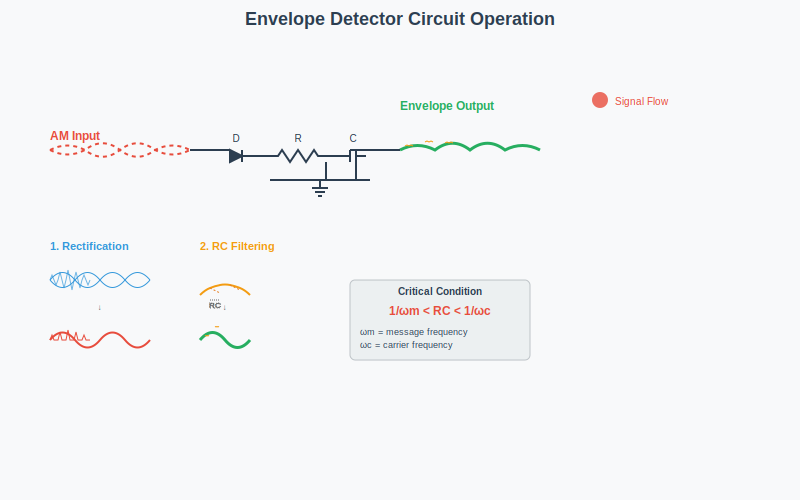
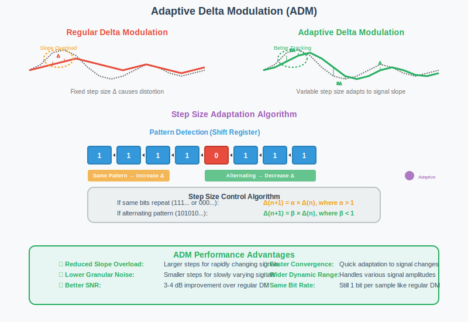
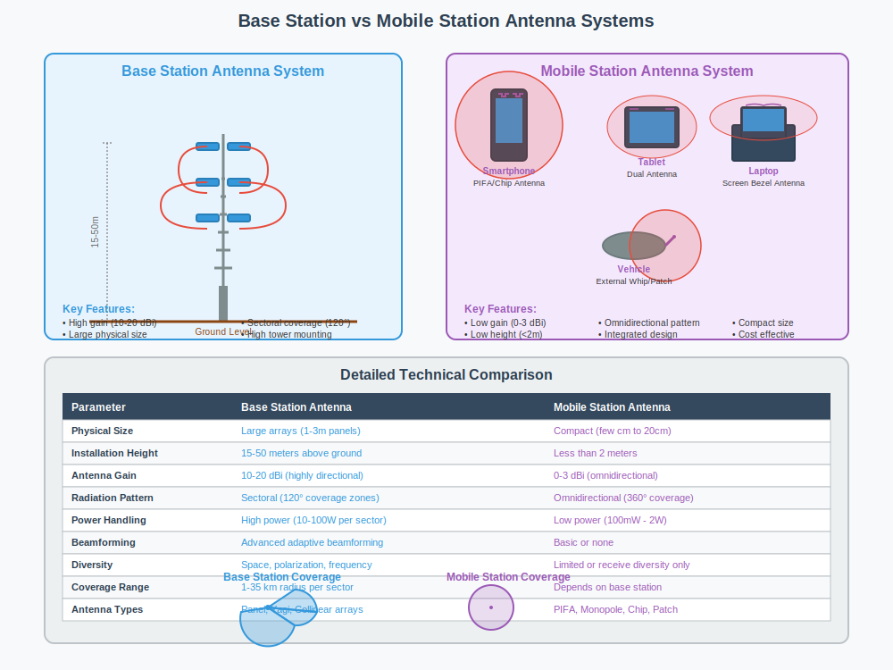

## Question 1(a) [3 marks]

**Define modulation and explain its need.**

**Answer**:
Modulation is the process of varying one or more properties of a high-frequency carrier signal with a modulating signal containing information.

**Table: Need for Modulation**

| Need | Explanation |
|------|-------------|
| **Antenna Size Reduction** | Allows practical antenna size (λ/4) by increasing frequency |
| **Signal Propagation** | Higher frequencies travel farther through atmosphere |
| **Multiplexing** | Allows multiple signals to be transmitted simultaneously |
| **Interference Reduction** | Shifts signal to band with less noise/interference |
| **Bandwidth Allocation** | Enables efficient spectrum usage by different services |

**Mnemonic:** "ASPIM" - Antenna size, Signal propagation, Proper multiplexing, Interference reduction, Manage bandwidth

## Question 1(b) [4 marks]

**Draw & explain block diagram of Communication system**

**Answer**:
A communication system transfers information from source to destination through a channel.


**Table: Communication System Components**

| Component | Function |
|-----------|----------|
| **Information Source** | Produces message to be transmitted (voice, video, data) |
| **Transmitter** | Converts message to suitable signals (modulation, coding) |
| **Channel** | Medium through which signals travel (wire, fiber, air) |
| **Noise Source** | Unwanted signals that corrupt the transmitted signal |
| **Receiver** | Extracts original message from received signal (demodulation) |
| **Destination** | Where the message is delivered (human, machine) |

**Mnemonic:** "I Try Communicating Neatly, Receive Data" (I-T-C-N-R-D)

## Question 1(c) [7 marks]

**Derive voltage equation for Amplitude modulation.**

**Answer**:
Amplitude modulation varies the amplitude of carrier signal proportionally to the message signal.

**Mathematical Derivation:**

- Let carrier signal be: c(t) = Ac cos(ωct)
- Message signal: m(t) = Am cos(ωmt)
- AM signal: s(t) = Ac[1 + μ·m(t)/Am]cos(ωct)
- Where μ = modulation index = Am/Ac
- Substituting m(t): s(t) = Ac[1 + μ·cos(ωmt)]cos(ωct)
- Expanding: s(t) = Ac·cos(ωct) + μ·Ac·cos(ωmt)·cos(ωct)
- Using identity (cos A·cos B): s(t) = Ac·cos(ωct) + (μ·Ac/2)[cos(ωc+ωm)t + cos(ωc-ωm)t]

**Diagram: AM Signal in Time Domain**


**Mnemonic:** "CAMDS" - Carrier Amplitude Modulated by Data Signal

## Question 1(c) OR [7 marks]

**Derive the equation for total power in AM, calculate percentage of power savings in DSB and SSB.**

**Answer**:
For an AM signal with modulation index μ, the total power consists of carrier power and sideband power.

**Table: Power Distribution in AM**

| Component | Power Formula | Percentage of Total Power |
|-----------|---------------|---------------------------|
| Carrier | Pc = Ac²/2 | 1/(1+μ²/2) × 100% |
| Upper Sideband | PUSB = Pc·μ²/4 | (μ²/4)/(1+μ²/2) × 100% |
| Lower Sideband | PLSB = Pc·μ²/4 | (μ²/4)/(1+μ²/2) × 100% |
| Total | PT = Pc(1+μ²/2) | 100% |

**Power Savings Calculation:**

- In DSB-SC: 100% carrier suppression = (Pc/PT)×100% = 1/(1+μ²/2)×100%
  - For μ = 1: Saving = 2/3×100% = 66.67%
- In SSB: One sideband + carrier suppression = (Pc+PLSB)/PT×100% = (1+μ²/4)/(1+μ²/2)×100%
  - For μ = 1: Saving = 5/6×100% = 83.33%

**Mnemonic:** "CAPS" - Carrier And Power in Sidebands

## Question 2(a) [3 marks]

**Define Image frequency in a radio receiver and explain it with suitable example.**

**Answer**:
Image frequency is an unwanted frequency that can produce the same IF (Intermediate Frequency) as the desired signal in a superheterodyne receiver.

**Table: Image Frequency**

| Parameter | Formula | Example |
|-----------|---------|---------|
| **Desired Signal** | fs | 100 MHz |
| **Local Oscillator** | fLO | 110 MHz |
| **IF** | fIF = fLO - fs | 10 MHz |
| **Image Frequency** | fimage = fLO + fIF | 120 MHz |

If both 100 MHz and 120 MHz signals exist, both will produce 10 MHz IF, causing interference.

**Mnemonic:** "LIDS" - Local oscillator plus/minus IF gives Desired signal and Signal image

## Question 2(b) [4 marks]

**Draw and explain block diagram for envelope detector.**

**Answer**:
Envelope detector extracts the modulating signal from AM wave by following the envelope.


**Table: Envelope Detector Components**

| Component | Function |
|-----------|----------|
| **Diode** | Rectifies the AM signal (passes positive half) |
| **Capacitor** | Charges to peak value of rectified signal |
| **Resistor** | Discharges capacitor with time constant RC |
| **RC Value** | 1/ωm < RC < 1/ωc (where ωm is message frequency, ωc is carrier) |

**Mnemonic:** "DRCT" - Diode Rectifies, Capacitor Tracks

## Question 2(c) [7 marks]

**Draw block diagram of AM radio receiver and explain working of each block.**

**Answer**:
AM receiver converts radio signal to audio output.


**Table: AM Receiver Blocks**

| Block | Function |
|-------|----------|
| **Antenna** | Captures electromagnetic signals from air |
| **RF Amplifier** | Amplifies weak RF signals, provides selectivity |
| **Local Oscillator** | Generates frequency to mix with incoming signal |
| **Mixer** | Combines RF and oscillator signals to produce IF |
| **IF Amplifier** | Amplifies fixed IF signal with high gain |
| **Detector** | Extracts audio signal from AM carrier |
| **AF Amplifier** | Boosts audio signal power to drive speaker |
| **Speaker** | Converts electrical signal to sound |

**Mnemonic:** "ARMLIDAS" - Antenna Receives, Mixer Links Input and Detector, Audio to Speaker

## Question 2(a) OR [3 marks]

**Define any FOUR characteristics of radio receiver.**

**Answer**:

**Table: Radio Receiver Characteristics**

| Characteristic | Definition |
|----------------|------------|
| **Sensitivity** | Minimum signal strength that produces standard output |
| **Selectivity** | Ability to separate desired signal from adjacent channels |
| **Fidelity** | Accuracy of reproducing original modulating signal |
| **Image Rejection** | Ability to reject image frequency signals |
| **Signal-to-Noise Ratio** | Ratio of desired signal power to noise power |

**Mnemonic:** "SSFIS" - Super Sensitive Fidelity with Image Suppression

## Question 2(b) OR [4 marks]

**Explain Ratio detector circuit for FM detection.**

**Answer**:
Ratio detector extracts audio from FM signals while rejecting amplitude variations.




**Table: Ratio Detector Components**

| Component | Function |
|-----------|----------|
| **Transformer** | Creates phase shifts proportional to frequency deviation |
| **Diodes** | Arranged in opposite polarity to produce voltage ratio |
| **Stabilizing Capacitor** | Large value (10μF) to suppress AM variations |
| **RC Network** | Extracts the audio signal from ratio of voltages |

**Mnemonic:** "RADS" - Ratio detector Avoids Disturbance from Strength variations

## Question 2(c) OR [7 marks]

**Draw and explain block diagram of super heterodyne receiver.**

**Answer**:
Superheterodyne receiver converts all incoming RF to fixed IF for better amplification.


**Table: Superheterodyne Receiver Components**

| Block | Function |
|-------|----------|
| **Antenna** | Captures RF signals |
| **RF Amplifier** | Amplifies and selects desired frequency band |
| **Local Oscillator** | Generates frequency above/below signal by IF value |
| **Mixer** | Heterodynes signal and oscillator to produce IF |
| **IF Amplifier** | Provides most gain and selectivity at fixed frequency |
| **Detector** | Recovers original modulating signal |
| **AGC** | Automatic Gain Control - maintains constant output level |
| **AF Amplifier** | Amplifies audio to drive speaker |
| **Speaker** | Converts electrical signal to sound |

**Mnemonic:** "ARMLIADS" - Antenna Receives, Mixer Links, Intermediate Amplifies, Detector Separates

## Question 3(a) [3 marks]

**Draw the Time and frequency domain representation of the below signals. 1. Analog signal (sine) 2. Digital signal (square).**

**Answer**:

**Table: Signal Representations**

| Signal Type | Time Domain | Frequency Domain |
|-------------|-------------|------------------|
| **Sine Wave** | Sinusoidal curve | Single spike at frequency f |
| **Square Wave** | Alternating levels | Fundamental and odd harmonics (1/n pattern) |

**Diagram: Signal Representations**


```goat
                  Time Domain                     Frequency Domain
Sine     /\      /\      /\          |
Wave    /  \    /  \    /  \         |            ^
       /    \  /    \  /    \        |            |
      /      \/      \/      \       |            |
------------------------------       |     -------+-------+--------
                                     |            f₀      
                                     |
Square  ____      ____               |            ^
Wave   |    |    |    |              |            |
       |    |    |    |              |            |  ^     ^
_______|    |____|    |______        |     -------+--+-----+------
                                     |            f₀ 3f₀   5f₀
```

**Mnemonic:** "SOFT" - Sine has One Frequency, square has Timeless harmonics

## Question 3(b) [4 marks]

**Explain sampling theorem.**

**Answer**:
Sampling theorem states the conditions for accurate signal reconstruction from samples.

**Table: Sampling Theorem**

| Aspect | Description |
|--------|-------------|
| **Statement** | To reconstruct a signal perfectly, sampling frequency must be at least twice the highest frequency in signal |
| **Nyquist Rate** | fs ≥ 2fmax (minimum sampling frequency) |
| **Aliasing** | Distortion that occurs when sampling below Nyquist rate |
| **Example** | For voice (300-3400 Hz), fs ≥ 6.8 kHz (typically 8 kHz) |

**Diagram: Aliasing Effect**


```goat
                        
  Original               Proper Sampling           Undersampling (Aliasing)
    /\      /\            *       *                  *           *  
   /  \    /  \                                                   
  /    \  /    \           *       *                 *           * 
 /      \/      \                                                 
----------------------    ----------------           ----------------
```

**Mnemonic:** "SNAP" - Sample at Nyquist And Prevent aliasing

## Question 3(c) [7 marks]

**Explain PAM, PPM and PWM.**

**Answer**:
These are pulse modulation techniques where a parameter of pulse is varied.

**Table: Pulse Modulation Types**

| Type | Full Form | Parameter Varied | Characteristics |
|------|-----------|------------------|----------------|
| **PAM** | Pulse Amplitude Modulation | Amplitude | Direct sampling of analog signal |
| **PPM** | Pulse Position Modulation | Position/Time | Better noise immunity than PAM |
| **PWM** | Pulse Width Modulation | Width/Duration | Superior noise immunity, widely used in control systems |

**Diagram: Pulse Modulation Techniques**


```goat
Message:   /\/\/\

PAM:      _   _    __  _
         | | | |  |  || |
         |_| |_|  |__||_|

PPM:      _   _    _    _    _    _
         | | | |  | |  | |  | |  | |
         |_| |_|  |_|  |_|  |_|  |_|
         <-->     <----><->  <---->

PWM:      __      ___         _
         |  |    |   |       | |
         |__|    |___|       |_|
```

**Mnemonic:** "AAA-PPW" - Amplitude, Position, Width are modulated in PAM, PPM, PWM

## Question 3(a) OR [3 marks]

**Define Nyquist rate and explain.**

**Answer**:
Nyquist rate is the minimum sampling frequency required for accurate signal reconstruction.

**Table: Nyquist Rate**

| Aspect | Description |
|--------|-------------|
| **Definition** | Minimum sampling frequency needed to avoid aliasing (fs = 2fmax) |
| **Implications** | Sampling below Nyquist rate causes irreversible distortion |
| **Formula** | fs ≥ 2fmax where fmax is highest frequency in signal |
| **Application** | CD audio: 44.1 kHz sampling for 20 kHz audio |

**Mnemonic:** "TANS" - Twice As Needed for Sampling

## Question 3(b) OR [4 marks]

**Explain quantization process.**

**Answer**:
Quantization assigns discrete amplitude levels to sampled values in analog-to-digital conversion.

**Table: Quantization Process**

| Step | Description |
|------|-------------|
| **Sampling** | Discrete-time samples taken from continuous signal |
| **Level Assignment** | Each sample assigned to nearest quantization level |
| **Quantization Error** | Difference between actual and quantized value |
| **Quantization Noise** | Statistical effect of errors in signal |
| **Resolution** | Determined by number of bits (2ⁿ levels for n bits) |

**Diagram: Quantization Process**

```goat
Analog   /\      /\
Signal  /  \    /  \
       /    \  /    \

Sampled   *  *    *  *
Signal       *       *

          -------------
          |           |
Quantized  *--*    *--*
Signal        *       *
          |           |
          -------------
```

**Mnemonic:** "SLERN" - Sample, Level assign, Error occurs, Resolution determines Noise

## Question 3(c) OR [7 marks]

**Explain Ideal, Natural and Flat top sampling.**

**Answer**:
These are different practical implementations of sampling process.

**Table: Sampling Types Comparison**

| Type | Description | Characteristics | Mathematical Representation |
|------|-------------|-----------------|----------------------------|
| **Ideal** | Instantaneous samples at zero width | Theoretical concept, not physically realizable | s(t) = m(t) × ∑δ(t-nTs) |
| **Natural** | Samples modulate pulse train | Practical implementation using analog switch | s(t) = m(t) × p(t) |
| **Flat-top** | Holds sample value until next sample | Easiest to implement, sample-and-hold circuit | s(t) = ∑m(nTs)[u(t-nTs)-u(t-(n+1)Ts)] |

**Diagram: Sampling Types**

```goat
Original:   /\/\/\

Ideal:      |  |  |  |  |

Natural:    _   _   _   _
           | | | | | | | |
           |_| |_| |_| |_|

Flat-top:   _____ _____ _____
           |     |     |     |
           |_____|_____|_____|
```

**Mnemonic:** "INF" - Ideal is theoretical, Natural is practical, Flat-top holds values

## Question 4(a) [3 marks]

**List the advantages and disadvantages of PCM.**

**Answer**:

**Table: PCM Advantages and Disadvantages**

| Advantages | Disadvantages |
|------------|---------------|
| **High noise immunity** | Requires higher bandwidth |
| **Better signal quality** | Complex circuitry |
| **Compatible with digital systems** | Quantization noise |
| **Secure communication possible** | Higher power consumption |
| **Can be regenerated without degradation** | Synchronization required |

**Mnemonic:** "NICHE" vs "BCQPS" - Noise immunity, Integration, Complex circuitry, Higher bandwidth, Error correction vs Bandwidth, Cost, Quantization, Power, Synchronization

## Question 4(b) [4 marks]

**Draw and Explain Block Diagram of Delta Modulation.**

**Answer**:
Delta modulation transmits only changes in signal level using 1-bit quantization.


**Table: Delta Modulation Components**

| Block | Function |
|-------|----------|
| **Comparator** | Compares input with predicted value |
| **1-bit Quantizer** | Outputs 1 if difference positive, 0 if negative |
| **Integrator** | Accumulates step values to track input |
| **Delay** | Provides previous output for comparison |

**Mnemonic:** "CQID" - Compare, Quantize with 1-bit, Integrate, Delay

## Question 4(c) [7 marks]

**Compare PCM, DM and DPCM.**

**Answer**:

**Table: Comparison of Digital Modulation Techniques**

| Parameter | PCM | DM | DPCM |
|-----------|-----|----|----|
| **Bits per sample** | 8-16 bits | 1 bit | 4-6 bits |
| **Bandwidth** | Highest | Lowest | Medium |
| **Signal-to-Noise Ratio** | Highest | Lowest | Medium |
| **Circuit Complexity** | High | Simple | Medium |
| **Sampling Rate** | Nyquist | Multiple of Nyquist | Nyquist |
| **Error Types** | Quantization error | Slope overload, granular noise | Prediction error |
| **Applications** | CD audio, digital telephony | Low-quality voice | Speech, video coding |

**Mnemonic:** "PCM-DM-DPCM: More Bits Better Quality, More Complexity Needed"

## Question 4(a) OR [3 marks]

**Explain DPCM.**

**Answer**:
Differential Pulse Code Modulation encodes difference between actual and predicted sample.

**Table: DPCM Characteristics**

| Aspect | Description |
|--------|-------------|
| **Basic Principle** | Encodes difference between actual and predicted value |
| **Predictor** | Uses previous samples to predict current value |
| **Advantage** | Requires fewer bits than PCM (exploits correlation) |
| **Bit Rate Reduction** | Typically 25-50% compared to PCM |
| **Applications** | Speech coding, image compression |

**Mnemonic:** "DPCM: Difference Predicted, Correlation Matters"

## Question 4(b) OR [4 marks]

**List the advantages and disadvantages of Delta Modulation.**

**Answer**:

**Table: Delta Modulation - Pros and Cons**

| Advantages | Disadvantages |
|------------|---------------|
| **Simple implementation** | Slope overload distortion |
| **Low bit rate** | Granular noise at low amplitudes |
| **Single bit transmission** | Limited dynamic range |
| **Robust against channel errors** | Higher sampling rate required |
| **Low complexity hardware** | Lower SNR than PCM |

**Mnemonic:** "SLSRL" vs "SGLSH" - Simple, Low bit-rate, Single bit, Robust, Low cost vs Slope overload, Granular noise, Limited range, Sampling high, SNR low

## Question 4(c) OR [7 marks]

**Explain Block diagram of basic PCM-TDM system.**

**Answer**:
PCM-TDM combines multiple digitized signals into a single high-speed channel.


**Table: PCM-TDM System Components**

| Block | Function |
|-------|----------|
| **PCM Encoder** | Converts analog signal to digital (sampling, quantization, coding) |
| **TDM Multiplexer** | Combines multiple PCM streams into single high-speed stream |
| **Transmission Channel** | Medium for signal transmission |
| **TDM Demultiplexer** | Separates time-multiplexed stream back into individual channels |
| **PCM Decoder** | Converts digital back to analog (decoding, filtering) |
| **Synchronization** | Clock and frame sync signals ensure proper demultiplexing |
| **Frame Structure** | Contains samples from all channels plus sync bits |

**Mnemonic:** "PETDSF" - PCM Encodes, TDM combines, Digital transmits, Separation occurs, Frames synchronize

## Question 5(a) [3 marks]

**Explain Adaptive Delta modulation.**

**Answer**:
Adaptive Delta Modulation adjusts step size based on signal characteristics.

**Table: Adaptive Delta Modulation**

| Feature | Description |
|---------|-------------|
| **Basic Principle** | Varies step size according to signal slope |
| **Step Size Control** | Increases when same bit pattern repeats (signal changing rapidly) |
| **Advantages** | Reduced slope overload and granular noise |
| **Implementation** | Uses shift register to detect bit patterns |
| **Performance** | Better SNR than standard DM |

**Diagram: Step Size Adaptation**


```goat
Signal:   /\      /\
         /  \    /  \
        /    \  /    \

Steps:   _                  Larger steps
        / \                for steep slopes
       /   \___            
      /        \__         Smaller steps
     /            \___     for flat regions
```

**Mnemonic:** "ASSG" - Adaptive Step Size Gives better performance

## Question 5(b) [4 marks]

**Define the terms 1. Radiation Pattern 2. Antenna gain.**

**Answer**:

**Table: Antenna Terms**

| Term | Definition | Characteristics |
|------|------------|----------------|
| **Radiation Pattern** | Graphical representation of radiation properties of antenna in space | Shows directional dependencies of radiated power |
| **Antenna Gain** | Measure of antenna's ability to direct or concentrate radio energy in a particular direction | Expressed in dB, compared to isotropic radiator (dBi) |

**Diagram: Radiation Pattern Types**



```goat
                  y                      y
                  ^                      ^
                  |                      |
         .........|.........    *********|*********
         *        |        *    *        |        *
         *        |        *    *        |        *
         *        +------->x    *        +------->x
         *                 *    *                 *
         *                 *    *                 *
         *******************    ...................
         
      Omnidirectional         Directional
```

**Mnemonic:** "RPGD" - Radiation Pattern shows Gain Direction

## Question 5(c) [7 marks]

**Explain Base station antenna and Mobile station antenna.**

**Answer**:
Different antenna designs serve different purposes in wireless communication systems.

**Table: Comparison of Base Station and Mobile Station Antennas**

| Parameter | Base Station Antenna | Mobile Station Antenna |
|-----------|----------------------|------------------------|
| **Height** | 15-50 meters | Less than 2 meters |
| **Gain** | Higher (10-20 dBi) | Lower (0-3 dBi) |
| **Pattern** | Sectoral (120° sectors) | Omnidirectional |
| **Size** | Larger arrays | Compact, integrated |
| **Types** | Panel, Yagi, Collinear | Monopole, PIFA, chip |
| **Polarization** | Vertical, cross-polarized | Typically vertical |
| **Beamforming** | Often used | Rarely used in basic devices |
| **Diversity** | Space/polarization diversity | Rarely implemented |

**Diagram: Antenna Types**


```goat
Base Station:                  Mobile Station:
  
    |     |                         |
    |     |                         |
   /|     |\                       /|\
  / |     | \                      / \
 /__|_____|__\                    /___\
     |     |
```

**Mnemonic:** "BHPSTBD" - Base stations Have Power, Size, Tower mounting, Beamforming, Diversity

## Question 5(a) OR [3 marks]

**Write down range of frequencies for HF, VHF and UHF.**

**Answer**:

**Table: Frequency Bands**

| Band | Frequency Range | Wavelength | Notable Applications |
|------|-----------------|------------|----------------------|
| **HF** | 3-30 MHz | 100-10 m | Shortwave radio, amateur radio, aviation |
| **VHF** | 30-300 MHz | 10-1 m | FM radio, TV channels 2-13, air traffic |
| **UHF** | 300-3000 MHz | 1-0.1 m | TV channels 14-83, mobile phones, Wi-Fi |

**Mnemonic:** "3-30-300-3000" - Each band starts at 3 times a power of 10 MHz

## Question 5(b) OR [4 marks]

**Define the terms 1. Antenna Directivity 2. Polarization.**

**Answer**:

**Table: Antenna Properties**

| Term | Definition | Characteristics |
|------|------------|----------------|
| **Directivity** | Ratio of radiation intensity in a given direction to average radiation intensity | Measured in dBi, indicates focus of antenna |
| **Polarization** | Orientation of electric field vector of radiated wave | Linear (vertical/horizontal), circular, elliptical |

**Diagram: Polarization Types**



```goat
Vertical:     Horizontal:     Circular:
   
    |             ----            /|\ 
    |             ----             |
    |             ----            \|/
    |             ----            /|\
```

**Mnemonic:** "DIVE POLE" - DIrectivity shows Vector Excellence, POLarization shows Electric field

## Question 5(c) OR [7 marks]

**Explain Ground wave propagation and Space wave propagation in detail.**

**Answer**:
These are two primary modes of radio wave propagation in the lower atmosphere.

**Table: Wave Propagation Comparison**

| Parameter | Ground Wave | Space Wave |
|-----------|-------------|------------|
| **Frequency Range** | Below 2 MHz | Above 30 MHz |
| **Distance Coverage** | 100-300 km | Limited to line-of-sight + diffraction |
| **Path** | Follows earth's curvature | Direct and ground-reflected paths |
| **Mechanism** | Diffraction around earth's surface | Line-of-sight propagation with reflection |
| **Attenuation** | Higher (increases with frequency) | Lower at VHF/UHF ranges |
| **Polarization** | Vertical polarization preferred | Both vertical and horizontal usable |
| **Applications** | AM broadcasting, navigation beacons | TV, FM radio, microwave links |
| **Factors Affecting** | Ground conductivity, terrain | Antenna height, terrain, obstacles |

**Diagram: Ground Wave vs Space Wave Propagation**

```goat
                                      /
                                     /  Direct
      Transmitter                   /      Wave         Receiver
          |                        /                       |
          |                       /                        |
          |                      /                         |
          |                     /                          |
          |                    /                           |
          |                   /                            |
         /|\ - - - - - - - - - - - - - - - - - - - - - - -/|\
          |        Ground Wave                             |
          |                                                |
    =====================================================
                  Earth Surface
```

**Ground Wave Propagation:**

- Travels along earth's surface
- Signal strength decreases with distance
- Better propagation over sea than land
- Affected by ground conductivity and dielectric constant
- Used for AM broadcasting, maritime communication

**Space Wave Propagation:**

- Consists of direct wave and ground-reflected wave
- Range extended by atmospheric refraction
- Range formula: d = √(2Rh) where R is earth's radius, h is antenna height
- Affected by diffraction over obstacles
- Used for line-of-sight communications like TV, FM, microwave links

**Mnemonic:** "GAFFS" - Ground Adheres to earth, Follows surface, Frequencies low, Short wavelengths
