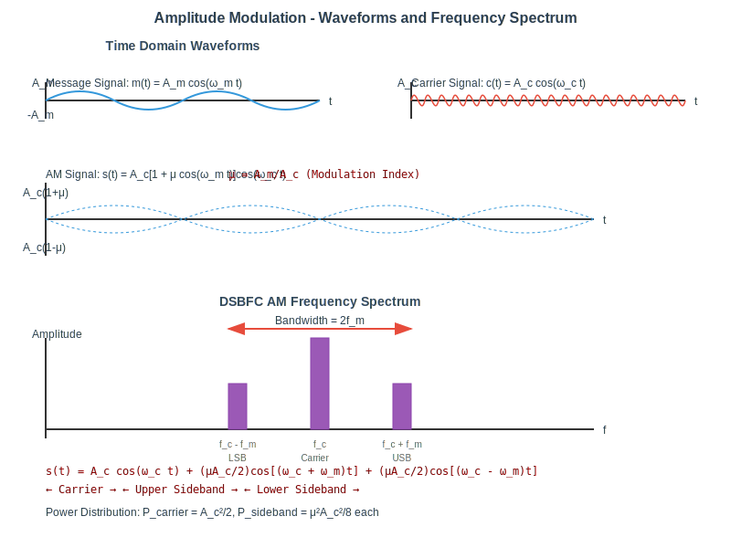
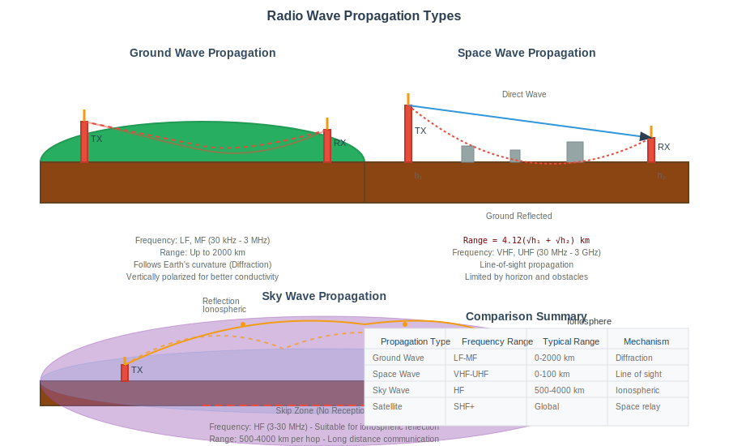
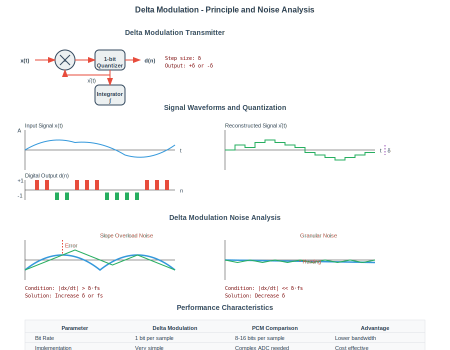
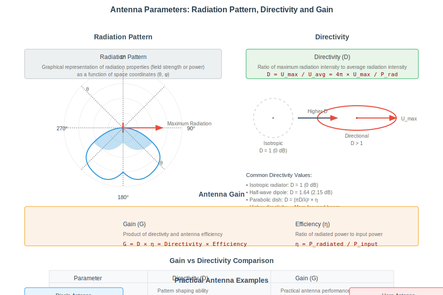

## પ્રશ્ન 1(અ) [3 marks]

**AM, FM અને PM ને વ્યાખ્યાયિત કરો.**

**જવાબ**:

| મોડ્યુલેશન પ્રકાર | વ્યાખ્યા |
|----------------|------------|
| **AM (Amplitude Modulation)** | એવી પ્રક્રિયા જેમાં કેરિઅર સિગ્નલનું amplitude, મેસેજ સિગ્નલના તાત્કાલિક amplitude અનુસાર બદલાય છે |
| **FM (Frequency Modulation)** | એવી પ્રક્રિયા જેમાં કેરિઅર સિગ્નલની frequency, મેસેજ સિગ્નલના તાત્કાલિક amplitude અનુસાર બદલાય છે |
| **PM (Phase Modulation)** | એવી પ્રક્રિયા જેમાં કેરિઅર સિગ્નલનો phase, મેસેજ સિગ્નલના તાત્કાલિક amplitude અનુસાર બદલાય છે |

**મેમરી ટ્રીક:** "AFaP" - "Amplitude, Frequency અને Phase" એ ત્રણ પરામિતિઓ છે જે મોડ્યુલેશન દરમિયાન બદલાય છે.

## પ્રશ્ન 1(બ) [4 marks]

**કોમ્યુનિકેશન સિસ્ટમનો બ્લોક ડાયાગ્રામ સમજાવો.**

**જવાબ**:


**કોમ્યુનિકેશન સિસ્ટમના ઘટકો:**

- **માહિતી સ્ત્રોત**: સંદેશાનું ઉત્પાદન કરે છે
- **ટ્રાન્સમીટર**: સંદેશને પ્રસારણ માટે યોગ્ય સિગ્નલમાં રૂપાંતરિત કરે છે
- **ચેનલ**: માધ્યમ જેના દ્વારા સિગ્નલ્સ પ્રવાસ કરે છે
- **રિસીવર**: પ્રાપ્ત સિગ્નલમાંથી મૂળ સંદેશ કાઢે છે
- **ગંતવ્ય**: વ્યક્તિ/ઉપકરણ જેના માટે સંદેશ છે
- **નોઇઝ સ્ત્રોત**: અવાંછિત સિગ્નલ્સ જે પ્રસારિત સિગ્નલમાં દખલ કરે છે

**મેમરી ટ્રીક:** "માદરચગ" - "માહિતી, ટ્રાન્સમીટર, દાખલ, રિસીવર, ચેનલ, ગંતવ્ય"

## પ્રશ્ન 1(ક) [7 marks]

**AM મોડ્યુલેશન વેવફોર્મ સાથે સમજાવો અને મોડ્યુલેટેડ સિગ્નલ માટે વોલ્ટેજ સમીકરણ મેળવો. DSBFC AM ફ્રીક્વન્સી સ્પેક્ટ્રમ દોરો.**

**જવાબ**:

Amplitude Modulation એ એવી પ્રક્રિયા છે જેમાં ઉચ્ચ આવૃત્તિવાળા કેરિયર વેવનું amplitude મોડ્યુલેટિંગ સિગ્નલના તાત્કાલિક મૂલ્ય અનુસાર બદલાય છે.

**વેવફોર્મ અને સમીકરણ:**



**AM સમીકરણનું તારણ:**

- કેરિયર સિગ્નલ: c(t) = Ac cos(ωc·t)
- મોડ્યુલેટિંગ સિગ્નલ: m(t) = Am cos(ωm·t)
- મોડ્યુલેશન ઇન્ડેક્સ: μ = Am/Ac
- AM સિગ્નલ: s(t) = Ac[1 + μ·cos(ωm·t)]cos(ωc·t)
- વિસ્તરણ: s(t) = Ac·cos(ωc·t) + μ·Ac/2·cos[(ωc+ωm)t] + μ·Ac/2·cos[(ωc-ωm)t]

**DSBFC AM ફ્રીકવન્સી સ્પેક્ટ્રમ:**


**મુખ્ય બિંદુઓ:**

- **LSB (લોઅર સાઇડબેન્ડ)**: fc-fm પર સ્થિત
- **USB (અપર સાઇડબેન્ડ)**: fc+fm પર સ્થિત
- **બેન્ડવિડ્થ**: 2fm (ઉચ્ચતમ મોડ્યુલેટિંગ આવૃત્તિનો બે ગણો)

**મેમરી ટ્રીક:** "બે ઓળ સાથે" - DSBFC AM બંને સાઇડબેન્ડ્સ વહન કરે છે.

## પ્રશ્ન 1(ક OR) [7 marks]

**AM માં કુલ પાવર માટે સમીકરણ મેળવો, DSB અને SSB માં પાવર બચતની ટકાવારીની ગણતરી કરો.**

**જવાબ**:

**AM માં કુલ પાવર:**

AM સિગ્નલ s(t) = Ac[1 + μ·cos(ωm·t)]cos(ωc·t) માટે


**પાવર ગણતરી:**

- કેરિયર પાવર: Pc = Ac²/2
- દરેક સાઇડબેન્ડમાં પાવર: PUSB = PLSB = Pc·μ²/4
- કુલ સાઇડબેન્ડ પાવર: PUSB + PLSB = Pc·μ²/2
- કુલ પાવર: Pt = Pc + PUSB + PLSB = Pc(1 + μ²/2)

**પાવર બચત:**

| મોડ્યુલેશન | પાવર વિતરણ | પાવર બચત |
|------------|-------------------|---------------|
| DSBFC AM | કેરિયર + બંને સાઇડબેન્ડ્સ વાપરે છે | 0% (સંદર્ભ) |
| SSBSC AM | ફક્ત એક સાઇડબેન્ડ, કેરિયર નહીં | (2 - μ²/2)/(1 + μ²/2) × 100% |

μ = 1 માટે, SSBSC લગભગ 85% પાવર બચાવે છે, DSBFC ની તુલનામાં.

**મેમરી ટ્રીક:** "SSB કેરિયર કાપી પાવર બચાવે"

## પ્રશ્ન 2(અ) [3 marks]

**AM અને FM ની સરખામણી કરો.**

**જવાબ**:

| પેરામીટર | AM | FM |
|-----------|----|----|
| **વ્યાખ્યા** | કેરિયરનું amplitude મેસેજ સિગ્નલ સાથે બદલાય છે | કેરિયરની frequency મેસેજ સિગ્નલ સાથે બદલાય છે |
| **બેન્ડવિડ્થ** | 2 × મેસેજ આવૃત્તિ | 2 × (Δf + fm) |
| **નોઇઝ ઇમ્યુનિટી** | નબળી (નોઇઝ amplitude ને અસર કરે છે) | ઉત્તમ (નોઇઝ મુખ્યત્વે amplitude ને અસર કરે છે) |
| **પાવર કાર્યક્ષમતા** | નીચી (કેરિયરમાં મોટાભાગનો પાવર) | ઉંચી (બધો પ્રસારિત પાવર માહિતી ધરાવે છે) |
| **સર્કિટ જટિલતા** | સરળ, સસ્તી | જટિલ, મોંઘી |

**મેમરી ટ્રીક:** "AM પાવર નિમ્ન, FM નોઇઝ સામે રક્ષિત"

## પ્રશ્ન 2(બ) [4 marks]

**એન્વેલપ ડિટેક્ટર માટે બ્લોક ડાયાગ્રામ દોરો અને સમજાવો.**

**જવાબ**:


**એન્વેલપ ડિટેક્ટરના ઘટકો:**

- **ડાયોડ**: AM સિગ્નલને રેક્ટિફાઇ કરે છે (એક દિશામાં પ્રવાહને મંજૂરી આપે છે)
- **RC સર્કિટ**: R અને C મૂલ્યો એવી રીતે પસંદ કરેલા હોય કે:
  - RC >> 1/fc (કેરિયર આવૃત્તિને ફિલ્ટર કરવા)
  - RC << 1/fm (એન્વેલપને અનુસરવા)

**કાર્ય પદ્ધતિ:**

1. ડાયોડ કેરિયરના પોઝિટિવ અર્ધચક્રો દરમિયાન વહન કરે છે
2. કેપેસિટર પીક વેલ્યુ સુધી ચાર્જ થાય છે
3. જ્યારે ઇનપુટ ઘટે છે, ત્યારે કેપેસિટર રેઝિસ્ટર દ્વારા ડિસ્ચાર્જ થાય છે
4. આઉટપુટ AM સિગ્નલના એન્વેલપને અનુસરે છે

**મેમરી ટ્રીક:** "ડિરેક" - "ડિટેક્ષન, રેક્ટિફિકેશન અને કનેક્શન" દ્વારા શોધ.

## પ્રશ્ન 2(ક) [7 marks]

**FM રેડિયો રીસીવર નો બ્લોક ડાયાગ્રામ દોરો અને દરેક બ્લોકની કામગીરી સમજાવો.**

**જવાબ**:


**દરેક બ્લોકની કામગીરી:**

- **એન્ટેના**: FM બ્રોડકાસ્ટ સિગ્નલ્સ (88-108 MHz) પ્રાપ્ત કરે છે
- **RF એમ્પ્લિફાયર**: નબળા RF સિગ્નલ્સને એમ્પ્લિફાય કરે છે, સિલેક્ટિવિટી પ્રદાન કરે છે
- **મિક્સર અને લોકલ ઓસિલેટર**: હેટરોડાયનિંગનો ઉપયોગ કરીને RF ને ફિક્સ્ડ IF (10.7 MHz) માં રૂપાંતરિત કરે છે
- **IF એમ્પ્લિફાયર**: રિસીવરનો મોટાભાગનો ગેઇન અને સિલેક્ટિવિટી પ્રદાન કરે છે
- **લિમિટર**: FM સિગ્નલમાંથી amplitude વેરિએશન દૂર કરે છે
- **FM ડિટેક્ટર**: આવૃત્તિ વેરિએશનને ઓડિયોમાં રૂપાંતરિત કરે છે (રેશિયો ડિટેક્ટર/PLL નો ઉપયોગ કરે છે)
- **ઓડિયો એમ્પ્લિફાયર**: રિકવર થયેલ ઓડિયો સિગ્નલને એમ્પ્લિફાય કરે છે
- **સ્પીકર**: ઇલેક્ટ્રિકલ સિગ્નલ્સને ધ્વનિમાં રૂપાંતરિત કરે છે

**મેમરી ટ્રીક:** "અરે મલિઓસ" - "એન્ટેના, RF, મિક્સર, લિમિટર, IF, ઓસિલેટર, સિગ્નલ"

## પ્રશ્ન 2(અ OR) [3 marks]

**વ્યાખ્યાયિત કરો Sensitivity, Selectivity, Fidelity.**

**જવાબ**:

| પેરામીટર | વ્યાખ્યા |
|-----------|------------|
| **Sensitivity** | નબળા સિગ્નલ્સને એમ્પ્લિફાય કરવાની રિસીવરની ક્ષમતા (μV માં માપવામાં આવે છે) |
| **Selectivity** | ઇચ્છિત સિગ્નલને અડોસપડોસના સિગ્નલોથી અલગ કરવાની ક્ષમતા |
| **Fidelity** | મૂળ સિગ્નલને વિકૃતિ વિના પુનઃઉત્પાદિત કરવાની ક્ષમતા |

**મેમરી ટ્રીક:** "SSF" - "Select Signals Faithfully" (સિગ્નલ્સને સારી રીતે પસંદ કરો)

## પ્રશ્ન 2(બ OR) [4 marks]

**FM માટે રેશિયો ડિટેક્ટર સમજાવો.**

**જવાબ**:


**રેશિયો ડિટેક્ટરની કાર્યપદ્ધતિ:**

- શ્રેણીમાં બે ડાયોડ સાથે બેલેન્સ્ડ સર્કિટનો ઉપયોગ કરે છે
- મોટો સ્ટેબિલાઇઝિંગ કેપેસિટર વોલ્ટેજનો સરવાળો સ્થિર રાખે છે
- આઉટપુટ વોલ્ટેજ આવૃત્તિ વિચલન સાથે પ્રમાણસર હોય છે
- સ્વાભાવિક રીતે amplitude વેરિએશન પ્રત્યે અસંવેદનશીલ (લિમિટરની જરૂર નથી)
- ડિસ્ક્રિમિનેટર કરતાં ઇમ્પલ્સ નોઇઝ પ્રત્યે ઓછું સંવેદનશીલ

**મેમરી ટ્રીક:** "RADS" - "રેશિયો ડિટેક્ટર દ્વારા અવાજ સ્થિર કરો"

## પ્રશ્ન 2(ક OR) [7 marks]

**AM રેડિયો રીસીવરનો બ્લોક ડાયાગ્રામ દોરો અને દરેક બ્લોકની કામગીરી સમજાવો.**

**જવાબ**:


**દરેક બ્લોકની કામગીરી:**

- **એન્ટેના**: AM બ્રોડકાસ્ટ સિગ્નલ્સ (535-1605 kHz) ઇન્ટરસેપ્ટ કરે છે
- **RF એમ્પ્લિફાયર**: સારા SNR સાથે નબળા RF સિગ્નલ્સને એમ્પ્લિફાય કરે છે
- **મિક્સર અને લોકલ ઓસિલેટર**: RF ને ફિક્સ્ડ IF (455 kHz) માં રૂપાંતરિત કરે છે
- **IF એમ્પ્લિફાયર**: 455 kHz પર મોટાભાગનો ગેઇન અને સિલેક્ટિવિટી પ્રદાન કરે છે
- **ડિટેક્ટર**: AM સિગ્નલમાંથી ઓડિયો એક્સટ્રેક્ટ કરે છે (એન્વેલપ ડિટેક્ટર)
- **AGC (ઓટોમેટિક ગેઇન કંટ્રોલ)**: આઉટપુટ લેવલને સ્થિર રાખે છે
- **ઓડિયો એમ્પ્લિફાયર**: ડિટેક્ટ કરેલા ઓડિયોને સ્પીકર ચલાવવા માટે બૂસ્ટ કરે છે
- **સ્પીકર**: ઇલેક્ટ્રિકલ સિગ્નલ્સને ધ્વનિ તરંગોમાં રૂપાંતરિત કરે છે

**મેમરી ટ્રીક:** "એમિડાસ" - "એન્ટેના, મિક્સ, IF, ડિટેક્ટ, ઓડિયો, સ્પીક"

## પ્રશ્ન 3(અ) [3 marks]

**Nyquist criteria વર્ણન કરો.**

**જવાબ**:

**નાઇક્વીસ્ટ ક્રાયટેરિયા**: સિગ્નલને તેના સેમ્પલ્સમાંથી સચોટપણે રીકન્સ્ટ્રક્ટ કરવા માટે, સેમ્પલિંગ આવૃત્તિ (fs) સિગ્નલમાં હાજર ઉચ્ચતમ આવૃત્તિ (fmax) કરતાં ઓછામાં ઓછી બમણી હોવી જોઇએ.

| પેરામીટર | ફોર્મ્યુલા | વિવરણ |
|-----------|---------|-------------|
| **નાઇક્વીસ્ટ રેટ** | fs ≥ 2fmax | જરૂરી ન્યૂનતમ સેમ્પલિંગ રેટ |
| **નાઇક્વીસ્ટ ઇન્ટરવલ** | Ts ≤ 1/2fmax | સેમ્પલ્સ વચ્ચેનો મહત્તમ સમય |

**જો ઉલ્લંઘન થાય તો પરિણામ**: એલિયાસિંગ થાય છે - ઉચ્ચ આવૃત્તિઓ સેમ્પલ્ડ સિગ્નલમાં નીચી આવૃત્તિઓ તરીકે દેખાય છે.

**મેમરી ટ્રીક:** "બે ગણી લો એલિયાસિંગ ટાળવા"

## પ્રશ્ન 3(બ) [4 marks]

**Sample and Hold સર્કિટ વેવફોર્મ સાથે સમજાવો.**

**જવાબ**:


**સેમ્પલ એન્ડ હોલ્ડ સર્કિટ ઓપરેશન:**

- **ઇલેક્ટ્રોનિક સ્વિચ**: સેમ્પલિંગ દરમિયાન થોડો સમય બંધ થાય છે
- **કેપેસિટર**: સેમ્પલ કરેલા વોલ્ટેજને સ્ટોર કરે છે
- **બફર એમ્પ્લિફાયર**: ઉચ્ચ ઇનપુટ અવરોધ અને નીચો આઉટપુટ અવરોધ પ્રદાન કરે છે

**વેવફોર્મ:**

```
એનાલોગ ઇનપુટ: ~~~
ક્લોક:        ‾|_|‾|_|‾|_|‾|_|‾
આઉટપુટ:       ‾‾|____|‾‾‾|____|‾‾
```

**એપ્લિકેશન્સ:**

- એનાલોગ-ટુ-ડિજિટલ કન્વર્ઝન
- ડેટા એક્વિઝિશન સિસ્ટમ્સ
- પલ્સ એમ્પ્લિટ્યુડ મોડ્યુલેશન

**મેમરી ટ્રીક:** "સ્કેબ" - "સ્વિચ, કેપેસિટર અને બફર"

## પ્રશ્ન 3(ક) [7 marks]

**વ્યાખ્યાયિત કરો quantization અને uniform and non-uniform quantization સમજાવો.**

**જવાબ**:

**ક્વોન્ટિઝેશન**: ઇનપુટના મોટા સેટને નાના સેટના ડિસ્ક્રીટ આઉટપુટ વેલ્યુમાં મેપિંગ કરવાની પ્રક્રિયા.


**યુનિફોર્મ ક્વોન્ટિઝેશન વિરુદ્ધ નોન-યુનિફોર્મ ક્વોન્ટિઝેશન:**

| પેરામીટર | યુનિફોર્મ ક્વોન્ટિઝેશન | નોન-યુનિફોર્મ ક્વોન્ટિઝેશન |
|-----------|---------------------|--------------------------|
| **સ્ટેપ સાઇઝ** | સમગ્ર રેન્જમાં સરખી | બદલાતી રહે છે (નાના સિગ્નલ્સ માટે નાની) |
| **લક્ષણ** | લિનિયર | નોન-લિનિયર (લોગેરિધમિક/એક્સપોનેન્શિયલ) |
| **SNR** | નાના સિગ્નલ્સ માટે ખરાબ | નાના સિગ્નલ્સ માટે સારા |
| **ઇમ્પ્લિમેન્ટેશન** | સરળ | જટિલ (કોમ્પાન્ડિંગ જરૂરી) |
| **એપ્લિકેશન** | સરળ સિગ્નલ્સ, ઇમેજિસ | સ્પીચ, ઓડિયો (μ-law, A-law) |

**ક્વોન્ટિઝેશન એરર:**

- મૂળ અને ક્વોન્ટાઇઝ્ડ સિગ્નલ વચ્ચેનો તફાવત
- મહત્તમ એરર = ±Q/2 (જ્યાં Q ક્વોન્ટિઝેશન સ્ટેપ સાઇઝ છે)
- રીકન્સ્ટ્રક્ટેડ સિગ્નલમાં ક્વોન્ટિઝેશન નોઇઝ તરીકે દેખાય છે

**મેમરી ટ્રીક:** "સરન" - "સરખા સ્ટેપ્સ, નાની સ્ટેપ્સ નાના સિગ્નલ્સ માટે"

## પ્રશ્ન 3(અ OR) [3 marks]

**સમજાવો aliasing error અને તેને કેવી રીતે દૂર કરવું.**

**જવાબ**:

**એલિયાસિંગ એરર**: વિકૃતિ જે ત્યારે થાય છે જ્યારે સિગ્નલને તેના ઉચ્ચતમ આવૃત્તિ ઘટકના બે ગણા કરતાં ઓછા દરે સેમ્પલ કરવામાં આવે છે.


**એલિયાસિંગ દૂર કરવાના ઉપાય:**

- સેમ્પલિંગ પહેલાં એન્ટી-એલિયાસિંગ ફિલ્ટર (લો-પાસ) વાપરવું
- નાઇક્વીસ્ટ રેટ કરતાં સેમ્પલિંગ રેટ વધારવી (fs > 2fmax)
- સેમ્પલિંગ પહેલાં ઇનપુટ સિગ્નલની બેન્ડવિડ્થ મર્યાદિત કરવી

**મેમરી ટ્રીક:** "વધવ" - "વધારો, ધીમા, વિલ્ટર"

## પ્રશ્ન 3(બ OR) [4 marks]

**ટાઇમ ડોમેન અને ફ્રીક્વન્સી ડોમેનમાં નીચેના સિગ્નલ દોરો:**
**1) Sawtooth signal**
**2) Pulse signal**

**જવાબ**:

**Sawtooth Signal:**

ટાઇમ ડોમેન:

```goat
    /|  /|  /|  /|
   / | / | / | / |
  /  |/  |/  |/  |
     T   2T  3T
```

ફ્રીક્વન્સી ડોમેન:

```goat
    |
    |
    |\
    | \
    |  \
    |   \
    |____\____________
    0  f0 2f0 3f0 4f0
```

**Pulse Signal:**

ટાઇમ ડોમેન:

```goat
    |‾|     |‾|     |‾|
    | |     | |     | |
____|_|_____|_|_____|_|____
    T       2T      3T
```

ફ્રીક્વન્સી ડોમેન:

```goat
    |
    |    sinc function
    |\       /\
    | \     /  \
    |  \___/    \____
    |
    |___________________
    0   f0    2f0    3f0
```

**મેમરી ટ્રીક:** "સોડા" - "સોટૂથનો ડાઉન સ્લોપ, sinc function"

## પ્રશ્ન 3(ક OR) [7 marks]

**વેવફોર્મ સાથે PAM, PWM અને PPM ની સરખામણી કરો.**

**જવાબ**:

| પેરામીટર | PAM | PWM | PPM |
|-----------|-----|-----|-----|
| **પૂરું નામ** | Pulse Amplitude Modulation | Pulse Width Modulation | Pulse Position Modulation |
| **બદલાતો પેરામીટર** | પલ્સની એમ્પ્લિટ્યુડ | પલ્સની પહોળાઈ/અવધિ | પલ્સની સ્થિતિ/સમય |
| **નોઇઝ ઇમ્યુનિટી** | નબળી | સારી | ઉત્તમ |
| **બેન્ડવિડ્થ** | ઓછી | વધારે | સૌથી વધારે |
| **પાવર કાર્યક્ષમતા** | નીચી | મધ્યમ | ઉંચી |
| **ડીમોડ્યુલેશન** | સરળ | મધ્યમ | જટિલ |

**વેવફોર્મ્સ:**

```
મેસેજ:     /\/\/\

PAM:        ‖  ‖   ‖ ‖  ‖   ‖
            ‖  ‖   ‖ ‖  ‖   ‖

PWM:        ‖‖‖ ‖‖  ‖ ‖‖‖ ‖‖  ‖
                    
PPM:        ‖  ‖   ‖ ‖  ‖   ‖
            |--|---||-|--|---||
```

**મેમરી ટ્રીક:** "ઊપસ" - "ઊંચાઈ, પહોળાઈ, સ્થિતિ"

## પ્રશ્ન 4(અ) [3 marks]

**સમજાવો Space wave propagation.**

**જવાબ**:

**સ્પેસ વેવ પ્રોપેગેશન**: એવું મોડ જ્યાં રેડિયો તરંગો નીચલા વાતાવરણ (ટ્રોપોસ્ફિયર) મારફતે સીધા અથવા જમીન પરાવર્તન દ્વારા પ્રવાસ કરે છે.




**લક્ષણો:**

- આવૃત્તિ રેન્જ: VHF, UHF (30 MHz - 3 GHz)
- સીધી લાઇન-ઓફ-સાઇટ અંતર સુધી મર્યાદિત
- રેન્જ = 4.12(√h₁ + √h₂) km (જ્યાં h₁, h₂ = મીટરમાં ઊંચાઈઓ)
- ભૂમિ, ઇમારતો અને વાતાવરણીય પરિસ્થિતિઓથી પ્રભાવિત

**મેમરી ટ્રીક:** "સીધે સીધા" - "સીધી લાઇન જમીન ઉપર"

## પ્રશ્ન 4(બ) [4 marks]

**ડિફરન્શિયલ પીસીએમ (ડીપીસીએમ) ટ્રાન્સમીટરનું કાર્ય સમજાવો.**

**જવાબ**:


**DPCM ટ્રાન્સમીટરની કાર્યપદ્ધતિ:**

- **પ્રેડિક્ટર**: અગાઉના સેમ્પલ્સના આધારે વર્તમાન સેમ્પલનો અંદાજ લગાવે છે
- **સબટ્રેક્ટર**: વાસ્તવિક અને અનુમાનિત મૂલ્ય વચ્ચેનો તફાવત ગણે છે
- **ક્વોન્ટાઇઝર**: તફાવત સિગ્નલને ડિસ્ક્રીટ લેવલમાં રૂપાંતરિત કરે છે
- **એન્કોડર**: ક્વોન્ટાઇઝ્ડ મૂલ્યોને બાઇનરી કોડમાં રૂપાંતરિત કરે છે
- **ફીડબેક લૂપ**: રિસીવર તેને જોશે તે રીતે સિગ્નલ પુનઃનિર્માણ કરે છે

**ફાયદો**: ફક્ત તફાવત સિગ્નલ પ્રસારિત થાય છે, જેને ઓછા બિટ્સની જરૂર પડે છે

**મેમરી ટ્રીક:** "પતાએ" - "પ્રેડિક્ટર, તફાવત, એન્કોડ"

## પ્રશ્ન 4(ક) [7 marks]

**વિગતોમાં ડેલ્ટા મોડ્યુલેટર સમજાવો, slop overload noise અને granular noise પણ સમજાવો.**

**જવાબ**:

**ડેલ્ટા મોડ્યુલેશન (DM)**: ડિફરન્શિયલ PCM નું સૌથી સરળ સ્વરૂપ જ્યાં તફાવત સિગ્નલને માત્ર 1 બિટ સાથે એન્કોડ કરવામાં આવે છે.




**કાર્ય સિદ્ધાંત:**

- ઇનપુટ સિગ્નલની અગાઉના આઉટપુટના ઇન્ટીગ્રેટેડ વર્ઝન સાથે તુલના કરે છે
- જો ઇનપુટ > ઇન્ટીગ્રેટેડ વેલ્યુ: 1 પ્રસારિત કરે
- જો ઇનપુટ < ઇન્ટીગ્રેટેડ વેલ્યુ: 0 પ્રસારિત કરે
- સ્ટેપ સાઇઝ (δ) ફિક્સ્ડ હોય છે

**ડેલ્ટા મોડ્યુલેશનમાં નોઇઝ:**

| નોઇઝનો પ્રકાર | કારણ | ઉપાય |
|---------------|-------|----------|
| **સ્લોપ ઓવરલોડ નોઇઝ** | ઇનપુટ સિગ્નલ δ ટ્રેક કરી શકે તેના કરતાં ઝડપથી બદલાય છે | સ્ટેપ સાઇઝ અથવા સેમ્પલિંગ ફ્રીક્વન્સી વધારો |
| **ગ્રેન્યુલર નોઇઝ** | ધીમે ધીમે બદલાતા સિગ્નલ્સ માટે સ્ટેપ સાઇઝ ખૂબ મોટી છે | સ્ટેપ સાઇઝ ઘટાડો |

**મેમરી ટ્રીક:** "સ્લોગ્રે" - "સ્લોપ અને ગ્રેન્યુલર ડેલ્ટામાં"

## પ્રશ્ન 4(અ OR) [3 marks]

**સમજાવો Ground wave propagation.**

**જવાબ**:

**ગ્રાઉન્ડ વેવ પ્રોપેગેશન**: રેડિયો તરંગ પ્રસારણ જે પૃથ્વીની વક્રતાને અનુસરે છે.


**લક્ષણો:**

- આવૃત્તિ રેન્જ: LF, MF (30 kHz - 3 MHz)
- પૃથ્વીની સપાટી સાથે પ્રસરે છે (ઊભી રીતે ધ્રુવીકરણ)
- રેન્જ ટ્રાન્સમીટર પાવર, જમીન વાહકતા, આવૃત્તિ પર આધાર રાખે છે
- સિગ્નલની તાકાત અંતર અને આવૃત્તિ સાથે ઘટે છે
- AM બ્રોડકાસ્ટિંગ, મરીન કોમ્યુનિકેશન માટે વપરાય છે

**મેમરી ટ્રીક:** "જઅઆ" - "જમીન આગળ આવે અને અનુસરે"

## પ્રશ્ન 4(બ OR) [4 marks]

**ADM ટ્રાન્સમીટર સમજાવો.**

**જવાબ**:

**એડેપ્ટિવ ડેલ્ટા મોડ્યુલેશન (ADM)**: ડીએમનું સુધારેલું સંસ્કરણ જ્યાં સ્ટેપ સાઇઝ સિગ્નલ લક્ષણો અનુસાર બદલાય છે.


**ADM ટ્રાન્સમીટરની કાર્યપદ્ધતિ:**

- **મૂળભૂત ઓપરેશન**: સ્ટાન્ડર્ડ DM જેવું જ
- **સ્ટેપ સાઇઝ કંટ્રોલ**: તાજેતરના આઉટપુટ બિટ્સનું વિશ્લેષણ કરે છે
- **એડેપ્ટેશન લોજિક**:
  - જો સળંગ બિટ્સ સમાન હોય: સ્ટેપ સાઇઝ વધારો
  - જો સળંગ બિટ્સ વૈકલ્પિક હોય: સ્ટેપ સાઇઝ ઘટાડો

**DM કરતા ફાયદાઓ:**

- સ્લોપ ઓવરલોડ અને ગ્રેન્યુલર નોઇઝ બંને ઘટાડે છે
- સિગ્નલ ટ્રેકિંગ વધુ સારું
- SNR માં સુધારો

**મેમરી ટ્રીક:** "સચક" - "સ્ટેપ, ચેક, કોડિંગ"

## પ્રશ્ન 4(ક OR) [7 marks]

**મૂળભૂત PCM-TDM સિસ્ટમનો બ્લોક ડાયાગ્રામ સમજાવો.**

**જવાબ**:

**PCM-TDM સિસ્ટમ**: એક જ ચેનલ પર મલ્ટિપલ ડિજિટલ સિગ્નલ્સ પ્રસારિત કરવા માટે પલ્સ કોડ મોડ્યુલેશનને ટાઇમ ડિવિઝન મલ્ટિપ્લેક્સિંગ સાથે જોડે છે.


**PCM-TDM સિસ્ટમની કાર્યપદ્ધતિ:**

- **ટ્રાન્સમીટર**:
  - મલ્ટિપલ એનાલોગ સિગ્નલ્સ એક સાથે સેમ્પલ થાય છે
  - સેમ્પલ્સ ટાઇમ-મલ્ટિપ્લેક્સ્ડ થઈને સિંગલ સ્ટ્રીમમાં બદલાય છે
  - સ્ટ્રીમ ક્વોન્ટાઇઝ્ડ અને PCM ફોર્મેટમાં એન્કોડેડ થાય છે
  - સિન્ક્રોનાઇઝેશન માટે ફ્રેમિંગ બિટ્સ ઉમેરાય છે
  
- **રિસીવર**:
  - અલાઇનમેન્ટ માટે ફ્રેમ સિન્ક શોધાય છે
  - PCM સ્ટ્રીમ ડિકોડ થઈને સેમ્પલ્સ રિકવર થાય છે
  - ડિમલ્ટિપ્લેક્સર વ્યક્તિગત ચેનલના સેમ્પલ્સને અલગ કરે છે
  - લો-પાસ ફિલ્ટર્સ મૂળ એનાલોગ સિગ્નલ્સનું પુનઃનિર્માણ કરે છે

**મેમરી ટ્રીક:** "સેકોમલ" - "સેમ્પલિંગ, કોડિંગ, અને મલ્ટિપ્લેક્સિંગ"

## પ્રશ્ન 5(અ) [3 marks]

**એન્ટેના માટે રેડિયેશન પેટર્ન, ડાયરેક્ટિવિટી અને ગેઇન વ્યાખ્યાયિત કરો.**

**જવાબ**:



| પેરામીટર | વ્યાખ્યા |
|-----------|------------|
| **રેડિયેશન પેટર્ન** | રેડિયેશન ગુણધર્મોનું (ફિલ્ડ સ્ટ્રેન્થ અથવા પાવર) સ્પેસ કોઓર્ડિનેટ્સના ફંક્શન તરીકે ગ્રાફિકલ રજૂઆત |
| **ડાયરેક્ટિવિટી** | મહત્તમ રેડિયેશન તીવ્રતા અને સરેરાશ રેડિયેશન તીવ્રતાનો ગુણોત્તર |
| **ગેઇન** | ડાયરેક્ટિવિટી અને કાર્યક્ષમતાનો ગુણાકાર (એન્ટેના કાર્યક્ષમતાનું વ્યાવહારિક માપ) |

**સંબંધ**: ગેઇન = ડાયરેક્ટિવિટી × કાર્યક્ષમતા

**મેમરી ટ્રીક:** "રગડ" - "રેડિયેશન, ગેઇન, ડાયરેક્ટિવ"

## પ્રશ્ન 5(બ) [4 marks]

**માઇક્રોસ્ટ્રીપ એન્ટેના સ્કેચ સાથે સમજાવો.**

**જવાબ**:

**માઇક્રોસ્ટ્રીપ (પેચ) એન્ટેના**: ગ્રાઉન્ડ પ્લેન સાથે સબસ્ટ્રેટ પર મેટલ પેચવાળું લો-પ્રોફાઇલ એન્ટેના.


**મુખ્ય લક્ષણો:**

- **પેચ**: સામાન્ય રીતે લંબચોરસ અથવા ગોળાકાર (લંબાઈમાં λ/2)
- **સબસ્ટ્રેટ**: ઓછા-લોસવાળી ડાયલેક્ટ્રિક સામગ્રી (εr = 2.2 થી 12)
- **ફીડિંગ મેથડ્સ**: માઇક્રોસ્ટ્રીપ લાઇન, કોએક્સિયલ પ્રોબ, એપર્ચર કપલિંગ
- **રેડિયેશન**: મુખ્યત્વે પેચના કિનારા પરથી ફ્રિન્જિંગ ફિલ્ડ્સ દ્વારા

**એપ્લિકેશન્સ**: મોબાઇલ ડિવાઇસિસ, GPS, RFID, સેટેલાઇટ કોમ્યુનિકેશન્સ

**મેમરી ટ્રીક:** "પસજ" - "પેચ, સબસ્ટ્રેટ, જમીન"

## પ્રશ્ન 5(ક) [7 marks]

**PCM ટ્રાન્સમીટર અને રીસીવરને વિગતોમાં સમજાવો.**

**જવાબ**:

**PCM (પલ્સ કોડ મોડ્યુલેશન) ટ્રાન્સમીટર:**


**PCM રીસીવર:**


**કાર્ય વિગતો:**

| બ્લોક | કાર્ય |
|-------|----------|
| **એન્ટી-એલિયાસિંગ ફિલ્ટર** | એલિયાસિંગ રોકવા માટે બેન્ડવિડ્થ મર્યાદિત કરે છે |
| **સેમ્પલ & હોલ્ડ** | નિયમિત અંતરાલે સેમ્પલ્સ લે છે |
| **ક્વોન્ટાઇઝર** | ડિસ્ક્રીટ એમ્પ્લિટ્યુડ લેવલ્સ નિયુક્ત કરે છે |
| **એન્કોડર** | લેવલ્સને બાઇનરી કોડમાં રૂપાંતરિત કરે છે |
| **લાઇન કોડર** | ડિજિટલ ડેટાને ટ્રાન્સમિશન ફોર્મેટમાં રૂપાંતરિત કરે છે |
| **રિજનરેટિવ રિપીટર** | સિગ્નલ ક્વોલિટી પુનઃસ્થાપિત કરે છે |
| **ડિકોડર** | બાઇનરીને એમ્પ્લિટ્યુડ લેવલ્સમાં રૂપાંતરિત કરે છે |
| **રિકન્સ્ટ્રક્શન ફિલ્ટર** | સ્ટેરકેસ આઉટપુટને એનાલોગમાં સરળ બનાવે છે |

**મેમરી ટ્રીક:** "સેસ્ક" - "સેમ્પલ, સ્મુધ, કોડ, રીકન્સ્ટ્રક્ટ"

## પ્રશ્ન 5(અ OR) [3 marks]

**સ્કેચ સાથે Dipole એન્ટેના સમજાવો.**

**જવાબ**:

**ડિપોલ એન્ટેના**: સૌથી સરળ અને વ્યાપકપણે વપરાતું એન્ટેના જેમાં બે કન્ડક્ટિંગ એલિમેન્ટ હોય છે.


**મુખ્ય લક્ષણો:**

- **લંબાઈ**: સામાન્ય રીતે λ/2 (હાફ-વેવલેન્થ ડિપોલ)
- **રેડિયેશન પેટર્ન**: એન્ટેના એક્સિસને લંબરૂપે ફિગર-8 પેટર્ન
- **ઇમ્પિડન્સ**: હાફ-વેવ ડિપોલ માટે ~73 Ω
- **પોલરાઇઝેશન**: એન્ટેનાના ઓરિએન્ટેશન જેવું જ

**એપ્લિકેશન્સ**: રેડિયો બ્રોડકાસ્ટિંગ, TV રિસેપ્શન, એમેચ્યોર રેડિયો

**મેમરી ટ્રીક:** "અરે" - "અરધી લંબાઈ, રેડિયેશન એક્સિસ"

## પ્રશ્ન 5(બ OR) [4 marks]

**પેરાબોલિક રિફ્લેક્ટર એન્ટેના સ્કેચ સાથે સમજાવો.**

**જવાબ**:

**પેરાબોલિક રિફ્લેક્ટર એન્ટેના**: ઇલેક્ટ્રોમેગ્નેટિક તરંગોને કેન્દ્રિત કરવા માટે પેરાબોલિક ડિશનો ઉપયોગ કરતું હાઇ-ગેઇન એન્ટેના.


**કાર્ય સિદ્ધાંત:**

- **ફીડ**: પેરાબોલાના ફોકલ પોઇન્ટ પર સ્થિત
- **રિફ્લેક્ટર**: પેરાબોલિક સરફેસ તરંગોને સમાંતર દિશામાં પરાવર્તિત કરે છે
- **રિફ્લેક્શન પ્રોપર્ટી**: ફોકલ પોઇન્ટથી રિફ્લેક્ટર થઈને સમાંતર લાઇન સુધીના તમામ પાથ સમાન છે

**એપ્લિકેશન્સ**:

- સેટેલાઇટ કોમ્યુનિકેશન્સ
- રેડિયો એસ્ટ્રોનોમી
- રડાર સિસ્ટમ્સ
- માઇક્રોવેવ લિંક્સ

**મેમરી ટ્રીક:** "ફપરસ" - "ફોકસ, પેરાબોલા, રિફ્લેક્ટર, સમાંતર"

## પ્રશ્ન 5(ક OR) [7 marks]

**પીસીએમ, ડીએમ, એડીએમ અને ડીપીસીએમની તુલના કરો.**

**જવાબ**:

| પેરામીટર | PCM | DM | ADM | DPCM |
|-----------|-----|----|----|------|
| **પૂરું નામ** | Pulse Code Modulation | Delta Modulation | Adaptive Delta Modulation | Differential PCM |
| **પ્રતિ સેમ્પલ બિટ્સ** | 8-16 બિટ્સ | 1 બિટ | 1 બિટ | 3-4 બિટ્સ |
| **સ્ટેપ સાઇઝ** | ફિક્સ્ડ ક્વોન્ટિઝેશન લેવલ્સ | ફિક્સ્ડ સ્ટેપ સાઇઝ | વેરિએબલ સ્ટેપ સાઇઝ | તફાવતનું ફિક્સ્ડ ક્વોન્ટિઝેશન |
| **બેન્ડવિડ્થની જરૂરીયાત** | સૌથી વધુ | સૌથી ઓછી | ઓછી | મધ્યમ |
| **સિગ્નલ ક્વોલિટી** | ઉત્તમ | નબળાથી મધ્યમ | મધ્યમ | સારી |
| **ઇમ્પ્લિમેન્ટેશન જટિલતા** | મધ્યમ | ખૂબ સરળ | મધ્યમ | જટિલ |
| **એપ્લિકેશન્સ** | ડિજિટલ ઓડિયો, ટેલિફોની | સરળ ટેલિમેટ્રી | વોઇસ કોમ્યુનિકેશન | વિડિયો, સ્પીચ |

**મુખ્ય તફાવતો:**

- **PCM**: એબ્સોલ્યુટ એમ્પ્લિટ્યુડ વેલ્યુ એન્કોડ કરે છે
- **DM**: ફિક્સ્ડ સ્ટેપ સાથે ફક્ત 1-બિટ તફાવત એન્કોડ કરે છે
- **ADM**: સ્ટેપ સાઇઝ એડેપ્ટ કરીને DM સુધારે છે
- **DPCM**: મલ્ટિ-બિટ તફાવત સિગ્નલ એન્કોડ કરે છે

**મેમરી ટ્રીક:** "પડદ" - "PCM, ADM, DM, DPCM"
