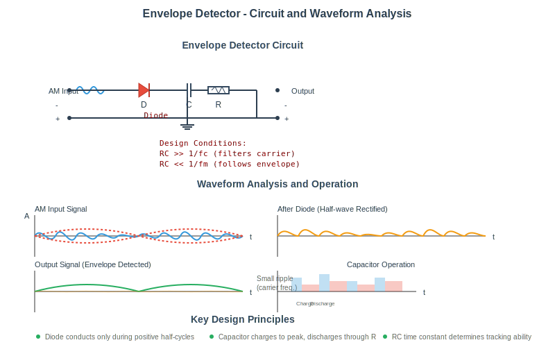
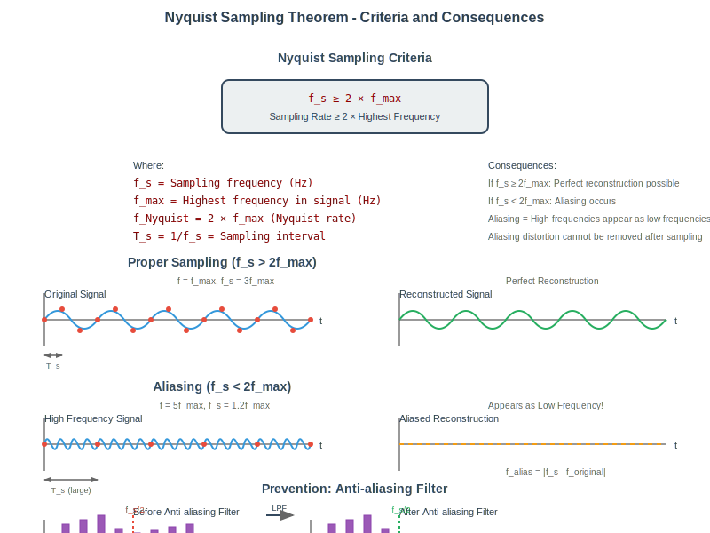
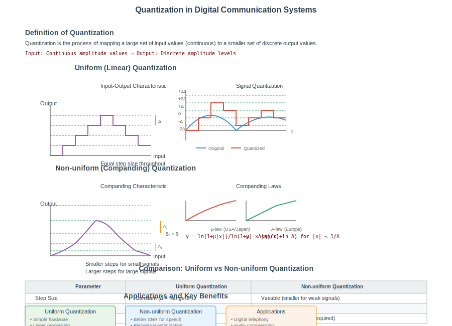

## Question 1(a) [3 marks]

**Define AM, FM and PM.**

**Answer**:

| Modulation Type | Definition |
|----------------|------------|
| **AM (Amplitude Modulation)** | Process where amplitude of carrier signal varies in accordance with the instantaneous amplitude of the message signal |
| **FM (Frequency Modulation)** | Process where frequency of carrier signal varies in accordance with the instantaneous amplitude of the message signal |
| **PM (Phase Modulation)** | Process where phase of carrier signal varies in accordance with the instantaneous amplitude of the message signal |

**Mnemonic:** "AFaP" - "Amplitude, Frequency and Phase" are the three parameters changed during modulation.

## Question 1(b) [4 marks]

**Explain block diagram of communication system.**

**Answer**:


**Components of Communication System:**

- **Information Source**: Produces message to be communicated
- **Transmitter**: Converts message to signals suitable for transmission
- **Channel**: Medium through which signals travel
- **Receiver**: Extracts original message from received signal
- **Destination**: Person/device for whom message is intended
- **Noise Source**: Unwanted signals that interfere with transmitted signal

**Mnemonic:** "I Transmit Communication Reliably Despite Noise"

## Question 1(c) [7 marks]

**Explain Amplitude modulation with waveform and derive voltage equation for modulated signal also Sketch the frequency spectrum of the DSBFC AM.**

**Answer**:

Amplitude Modulation is the process where the amplitude of a high-frequency carrier wave varies according to the instantaneous value of the modulating signal.

**Waveform and Equation:**


**Derivation of AM equation:**

- Carrier signal: c(t) = Ac cos(ωc·t)
- Modulating signal: m(t) = Am cos(ωm·t)
- Modulation Index: μ = Am/Ac
- AM signal: s(t) = Ac[1 + μ·cos(ωm·t)]cos(ωc·t)
- Expanding: s(t) = Ac·cos(ωc·t) + μ·Ac/2·cos[(ωc+ωm)t] + μ·Ac/2·cos[(ωc-ωm)t]

**DSBFC AM Frequency Spectrum:**

```goat
    |
    |        Carrier
    |          |
    |          |
    |          |
    |    LSB   |   USB
    |     |    |    |
    |_____|____|____|_____
         fc-fm fc  fc+fm
```

**Key Points:**

- **LSB (Lower Sideband)**: Located at fc-fm
- **USB (Upper Sideband)**: Located at fc+fm
- **Bandwidth**: 2fm (twice the highest modulating frequency)

**Mnemonic:** "CARrying Two SideBands" - DSBFC AM carries both sidebands.

## Question 1(c OR) [7 marks]

**Derive the equation for total power in AM, calculate percentage of power savings in DSBFC And SSBSC.**

**Answer**:

**Total Power in AM:**

For AM signal s(t) = Ac[1 + μ·cos(ωm·t)]cos(ωc·t)


**Power Calculation:**

- Carrier Power: Pc = Ac²/2
- Power in each sideband: PUSB = PLSB = Pc·μ²/4
- Total Sideband Power: PUSB + PLSB = Pc·μ²/2
- Total Power: Pt = Pc + PUSB + PLSB = Pc(1 + μ²/2)

**Power Savings:**

| Modulation | Power Distribution | Power Savings |
|------------|-------------------|---------------|
| DSBFC AM | Uses carrier + both sidebands | 0% (reference) |
| SSBSC AM | Uses only one sideband, no carrier | (2 - μ²/2)/(1 + μ²/2) × 100% |

For μ = 1, SSBSC saves approximately 85% power compared to DSBFC.

**Mnemonic:** "SSB Saves Power By Cutting Carrier"

## Question 2(a) [3 marks]

**Compare AM and FM.**

**Answer**:

| Parameter | AM | FM |
|-----------|----|----|
| **Definition** | Amplitude of carrier varies with message signal | Frequency of carrier varies with message signal |
| **Bandwidth** | 2 × message frequency | 2 × (Δf + fm) |
| **Noise Immunity** | Poor (noise affects amplitude) | Excellent (noise mainly affects amplitude) |
| **Power Efficiency** | Low (carrier contains most power) | High (all transmitted power contains information) |
| **Circuit Complexity** | Simple, inexpensive | Complex, expensive |

**Mnemonic:** "AM Needs Power, FM Fights Noise"

## Question 2(b) [4 marks]

**Draw and explain block diagram for envelope detector.**

**Answer**:


**Components of Envelope Detector:**

- **Diode**: Rectifies the AM signal (allows current flow in one direction)
- **RC Circuit**: R and C values chosen such that:
  - RC >> 1/fc (to filter carrier frequency)
  - RC << 1/fm (to follow the envelope)

**Working:**

1. Diode conducts during positive half-cycles of carrier
2. Capacitor charges to peak value
3. When input falls, capacitor discharges through resistor
4. Output follows envelope of AM signal

**Mnemonic:** "Detect, Rect, and Connect" - Detection through Rectification and RC connection.

## Question 2(c) [7 marks]

**Draw block diagram of FM radio receiver and explain working of each block.**

**Answer**:


**Working of Each Block:**

- **Antenna**: Receives FM broadcast signals (88-108 MHz)
- **RF Amplifier**: Amplifies weak RF signals, provides selectivity
- **Mixer & Local Oscillator**: Converts RF to fixed IF (10.7 MHz) using heterodyning
- **IF Amplifier**: Provides most of receiver's gain and selectivity
- **Limiter**: Removes amplitude variations from FM signal
- **FM Detector**: Converts frequency variations to audio (uses ratio detector/PLL)
- **Audio Amplifier**: Amplifies recovered audio signal
- **Speaker**: Converts electrical signals to sound

**Mnemonic:** "Really Mighty Instruments Limit Frequency And Make Sound"

## Question 2(a OR) [3 marks]

**Define Sensitivity, Selectivity, Fidelity for radio receiver.**

**Answer**:

| Parameter | Definition |
|-----------|------------|
| **Sensitivity** | Ability of receiver to amplify weak signals (measured in μV) |
| **Selectivity** | Ability to separate desired signal from adjacent signals |
| **Fidelity** | Ability to reproduce the original signal without distortion |

**Mnemonic:** "SSF" - "Select Signals Faithfully"

## Question 2(b OR) [4 marks]

**Explain ratio detector for FM.**

**Answer**:




**Working of Ratio Detector:**

- Uses balanced circuit with two diodes in series
- Large stabilizing capacitor keeps sum of voltages constant
- Output voltage is proportional to frequency deviation
- Inherently insensitive to amplitude variations (no limiter needed)
- Less susceptible to impulse noise than discriminator

**Mnemonic:** "RADS" - "Ratio And Diodes Stabilize"

## Question 2(c OR) [7 marks]

**Draw block diagram of AM radio receiver and explain working of each block.**

**Answer**:


**Working of Each Block:**

- **Antenna**: Intercepts AM broadcast signals (535-1605 kHz)
- **RF Amplifier**: Amplifies weak RF signals with good SNR
- **Mixer & Local Oscillator**: Converts RF to fixed IF (455 kHz)
- **IF Amplifier**: Provides most gain and selectivity at 455 kHz
- **Detector**: Extracts audio from AM signal (envelope detector)
- **AGC (Automatic Gain Control)**: Maintains constant output level
- **Audio Amplifier**: Boosts detected audio to drive speaker
- **Speaker**: Converts electrical signals to sound waves

**Mnemonic:** "ARMIDAS" - "Amplify, Mix, IF, Detect, Audio, Speak"

## Question 3(a) [3 marks]

**Describe the Nyquist criteria.**

**Answer**:

**Nyquist Criteria**: To accurately reconstruct a signal from its samples, the sampling frequency (fs) must be at least twice the highest frequency (fmax) present in the signal.

| Parameter | Formula | Description |
|-----------|---------|-------------|
| **Nyquist Rate** | fs ≥ 2fmax | Minimum sampling rate required |
| **Nyquist Interval** | Ts ≤ 1/2fmax | Maximum time between samples |

**Consequence if violated**: Aliasing occurs - higher frequencies appear as lower frequencies in sampled signal.

**Mnemonic:** "Sample Double to Dodge Aliasing"

## Question 3(b) [4 marks]

**Explain Sample and hold Circuit with Waveform.**

**Answer**:




**Sample and Hold Circuit Operation:**

- **Electronic Switch**: Closes briefly during sampling
- **Capacitor**: Stores sampled voltage
- **Buffer Amplifier**: Provides high input impedance and low output impedance

**Waveform:**


**Applications:**

- Analog-to-Digital Conversion
- Data Acquisition Systems
- Pulse Amplitude Modulation

**Mnemonic:** "SCAB" - "Switch, Capacitor And Buffer"

## Question 3(c) [7 marks]

**Define quantization explain uniform and non-uniform quantization in details.**

**Answer**:

**Quantization**: Process of mapping a large set of input values to a smaller set of discrete output values.




**Uniform Quantization vs Non-uniform Quantization:**

| Parameter | Uniform Quantization | Non-uniform Quantization |
|-----------|---------------------|--------------------------|
| **Step Size** | Equal throughout range | Varies (smaller for small signals) |
| **Characteristic** | Linear | Non-linear (logarithmic/exponential) |
| **SNR** | Poor for small signals | Better for small signals |
| **Implementation** | Simple | Complex (companding required) |
| **Applications** | Simple signals, images | Speech, audio (μ-law, A-law) |

**Quantization Error:**

- Difference between original and quantized signal
- Maximum error = ±Q/2 (where Q is quantization step size)
- Appears as quantization noise in reconstructed signal

**Mnemonic:** "UNIQ" - "UNIform has equal steps, non-uniform Quiets noise"

## Question 3(a OR) [3 marks]

**Explain aliasing error and how to overcome it.**

**Answer**:

**Aliasing Error**: Distortion that occurs when a signal is sampled at a rate lower than twice its highest frequency component.


**How to Overcome Aliasing:**

- Use anti-aliasing filter (low-pass) before sampling
- Increase sampling rate above Nyquist rate (fs > 2fmax)
- Bandlimit the input signal before sampling

**Mnemonic:** "ALIAS" - "Avoid Low sampling by Increasing And Screening"

## Question 3(b OR) [4 marks]

**Draw following signal in time domain and frequency domain:**
**1) Sawtooth signal**
**2) Pulse signal**

**Answer**:

**Sawtooth Signal:**

Time Domain:

```goat
    /|  /|  /|  /|
   / | / | / | / |
  /  |/  |/  |/  |
     T   2T  3T
```

Frequency Domain:

```goat
    |
    |
    |\
    | \
    |  \
    |   \
    |____\____________
    0  f0 2f0 3f0 4f0
```

**Pulse Signal:**

Time Domain:

```goat
    |‾|     |‾|     |‾|
    | |     | |     | |
____|_|_____|_|_____|_|____
    T       2T      3T
```

Frequency Domain:

```goat
    |
    |    sinc function
    |\       /\
    | \     /  \
    |  \___/    \____
    |
    |___________________
    0   f0    2f0    3f0
```

**Mnemonic:** "STPF" - "SawTooth slopes down, Pulse has sinc Function"

## Question 3(c OR) [7 marks]

**Compare PAM, PWM and PPM with waveform.**

**Answer**:

| Parameter | PAM | PWM | PPM |
|-----------|-----|-----|-----|
| **Full Form** | Pulse Amplitude Modulation | Pulse Width Modulation | Pulse Position Modulation |
| **Parameter Varied** | Amplitude of pulses | Width/duration of pulses | Position/timing of pulses |
| **Noise Immunity** | Poor | Good | Excellent |
| **Bandwidth** | Lower | Higher | Highest |
| **Power Efficiency** | Low | Medium | High |
| **Demodulation** | Simple | Moderate | Complex |

**Waveforms:**

```
Message:    /\/\/\

PAM:        ‖  ‖   ‖ ‖  ‖   ‖
            ‖  ‖   ‖ ‖  ‖   ‖

PWM:        ‖‖‖ ‖‖  ‖ ‖‖‖ ‖‖  ‖
                    
PPM:        ‖  ‖   ‖ ‖  ‖   ‖
            |--|---||-|--|---||
```

**Mnemonic:** "APP" - "Amplitude, Pulse-width, Position"

## Question 4(a) [3 marks]

**Explain Space wave propagation.**

**Answer**:

**Space Wave Propagation**: Mode where radio waves travel through lower atmosphere (troposphere) directly or via ground reflection.


**Characteristics:**

- Frequency range: VHF, UHF (30 MHz - 3 GHz)
- Limited to line-of-sight distance
- Range = 4.12(√h₁ + √h₂) km (where h₁, h₂ = heights in meters)
- Affected by terrain, buildings, and atmospheric conditions

**Mnemonic:** "SLOT" - "Straight Line Over Terrain"

## Question 4(b) [4 marks]

**Explain working of Differential PCM (DPCM) transmitter.**

**Answer**:


**Working of DPCM Transmitter:**

- **Predictor**: Estimates current sample based on previous samples
- **Subtractor**: Computes difference between actual and predicted value
- **Quantizer**: Converts difference signal to discrete levels
- **Encoder**: Converts quantized values to binary code
- **Feedback Loop**: Reconstructs signal as receiver would see it

**Advantage**: Only difference signal is transmitted, which requires fewer bits

**Mnemonic:** "SPEQIF" - "Subtract, Predict, Encode, Quantize In Feedback"

## Question 4(c) [7 marks]

**Explain delta modulator in details also explain slop overload noise and granular noise.**

**Answer**:

**Delta Modulation (DM)**: Simplest form of differential PCM where the difference signal is encoded with just 1 bit.


**Working Principle:**

- Compares input signal with integrated version of previous output
- If input > integrated value: transmit 1
- If input < integrated value: transmit 0
- Step size (δ) is fixed

**Noise in Delta Modulation:**

| Type of Noise | Cause | Solution |
|---------------|-------|----------|
| **Slope Overload Noise** | Input signal changes faster than δ can track | Increase step size or sampling frequency |
| **Granular Noise** | Step size too large for slowly varying signals | Decrease step size |

**Mnemonic:** "DOGS" - "Delta modulation has Overload and Granular noiseS"

## Question 4(a OR) [3 marks]

**Explain Ground wave propagation.**

**Answer**:

**Ground Wave Propagation**: Radio wave propagation that follows the curvature of the Earth.


**Characteristics:**

- Frequency range: LF, MF (30 kHz - 3 MHz)
- Propagates along Earth's surface (vertically polarized)
- Range depends on transmitter power, ground conductivity, frequency
- Signal strength decreases with distance and frequency
- Used for AM broadcasting, marine communication

**Mnemonic:** "GEL" - "Ground waves follow Earth at Low frequencies"

## Question 4(b OR) [4 marks]

**Explain ADM transmitter.**

**Answer**:

**Adaptive Delta Modulation (ADM)**: Improved version of DM where step size varies according to signal characteristics.


**Working of ADM Transmitter:**

- **Basic Operation**: Similar to standard DM
- **Step Size Control**: Analyzes recent output bits
- **Adaptation Logic**:
  - If consecutive bits are same: Increase step size
  - If consecutive bits alternate: Decrease step size

**Advantages over DM:**

- Reduces both slope overload and granular noise
- Better signal tracking
- Improved SNR

**Mnemonic:** "ASIC" - "Adapt Step-size, Improve Coding"

## Question 4(c OR) [7 marks]

**Explain Block diagram of basic PCM-TDM system.**

**Answer**:

**PCM-TDM System**: Combines Pulse Code Modulation with Time Division Multiplexing to transmit multiple digital signals over single channel.


**Working of PCM-TDM System:**

- **Transmitter**:
  - Multiple analog signals sampled simultaneously
  - Samples time-multiplexed into single stream
  - Stream quantized and encoded into PCM format
  - Framing bits added for synchronization
  
- **Receiver**:
  - Frame sync detected for alignment
  - PCM stream decoded to recover samples
  - Demultiplexer separates individual channel samples
  - Low-pass filters reconstruct original analog signals

**Mnemonic:** "SAMPLE-CODE-MUX" - Sampling, Coding, and Multiplexing

## Question 5(a) [3 marks]

**Define radiation pattern, Directivity and Gain for antenna.**

**Answer**:


| Parameter | Definition |
|-----------|------------|
| **Radiation Pattern** | Graphical representation of radiation properties (field strength or power) as function of space coordinates |
| **Directivity** | Ratio of maximum radiation intensity to average radiation intensity |
| **Gain** | Product of directivity and efficiency (practical measure of antenna performance) |

**Relationship**: Gain = Directivity × Efficiency

**Mnemonic:** "RDG" - "Radiation Directs with Gain"

## Question 5(b) [4 marks]

**Explain Microstrip Antenna with sketch.**

**Answer**:

**Microstrip (Patch) Antenna**: Low-profile antenna consisting of a metal patch on a substrate with ground plane.


**Key Features:**

- **Patch**: Typically rectangular or circular (λ/2 in length)
- **Substrate**: Low-loss dielectric material (εr = 2.2 to 12)
- **Feeding Methods**: Microstrip line, coaxial probe, aperture coupling
- **Radiation**: Primarily from fringing fields at patch edges

**Applications**: Mobile devices, GPS, RFID, satellite communications

**Mnemonic:** "PSDG" - "Patch on Substrate with Dielectric over Ground"

## Question 5(c) [7 marks]

**Explain PCM transmitter and receiver in details.**

**Answer**:

**PCM (Pulse Code Modulation)** Transmitter:


**PCM Receiver:**


**Working Details:**

| Block | Function |
|-------|----------|
| **Anti-aliasing Filter** | Limits bandwidth to prevent aliasing |
| **Sample & Hold** | Takes samples at regular intervals |
| **Quantizer** | Assigns discrete amplitude levels |
| **Encoder** | Converts levels to binary codes |
| **Line Coder** | Converts digital data to transmission format |
| **Regenerative Repeater** | Restores signal quality |
| **Decoder** | Converts binary to amplitude levels |
| **Reconstruction Filter** | Smoothens staircase output to analog |

**Mnemonic:** "SAFE PCR" - "Sample, Amplify, Filter, Encode, Pulse Code Receiver"

## Question 5(a OR) [3 marks]

**Explain dipole antenna with sketch.**

**Answer**:

**Dipole Antenna**: Simplest and most widely used antenna consisting of two conducting elements.


**Key Characteristics:**

- **Length**: Typically λ/2 (half-wavelength dipole)
- **Radiation Pattern**: Figure-8 pattern perpendicular to antenna axis
- **Impedance**: ~73 Ω for half-wave dipole
- **Polarization**: Same as the orientation of the antenna

**Applications**: Radio broadcasting, TV reception, amateur radio

**Mnemonic:** "HALF" - "Half-wavelength Antenna Leads Field"

## Question 5(b OR) [4 marks]

**Explain parabolic reflector antenna With Sketch.**

**Answer**:

**Parabolic Reflector Antenna**: High-gain antenna using parabolic dish to focus electromagnetic waves.

```mermaid
graph LR
    A[Feed Horn] --> B[Parabolic Reflector]
    B --> C[Focused Beam]
    D[Focal Point] -.-> A
```

**Working Principle:**

- **Feed**: Located at focal point of parabola
- **Reflector**: Parabolic surface reflects waves in parallel direction
- **Reflection Property**: All paths from focal point to reflector to parallel line are equal

**Applications**:

- Satellite communications
- Radio astronomy
- Radar systems
- Microwave links

**Mnemonic:** "PROF" - "Parabola Reflects On Focus"

## Question 5(c OR) [7 marks]

**Compare PCM, DM, ADM and DPCM.**

**Answer**:

| Parameter | PCM | DM | ADM | DPCM |
|-----------|-----|----|----|------|
| **Full Form** | Pulse Code Modulation | Delta Modulation | Adaptive Delta Modulation | Differential PCM |
| **Bits per Sample** | 8-16 bits | 1 bit | 1 bit | 3-4 bits |
| **Step Size** | Fixed quantization levels | Fixed step size | Variable step size | Fixed quantization of difference |
| **Bandwidth Requirement** | Highest | Lowest | Low | Medium |
| **Signal Quality** | Excellent | Poor to moderate | Moderate | Good |
| **Implementation Complexity** | Moderate | Very simple | Moderate | Complex |
| **Applications** | Digital audio, telephony | Simple telemetry | Voice communication | Video, speech |

**Key Differences:**

- **PCM**: Encodes absolute amplitude values
- **DM**: Encodes only 1-bit difference with fixed step
- **ADM**: Improves DM by adapting step size
- **DPCM**: Encodes multi-bit difference signal

**Mnemonic:** "PAID" - "PCM, ADM, Integrate in DPCM"
