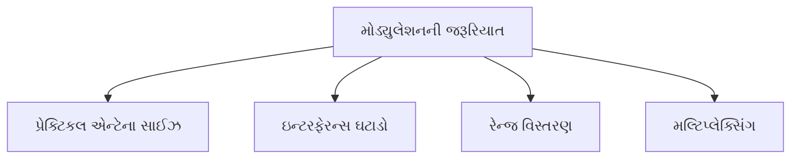
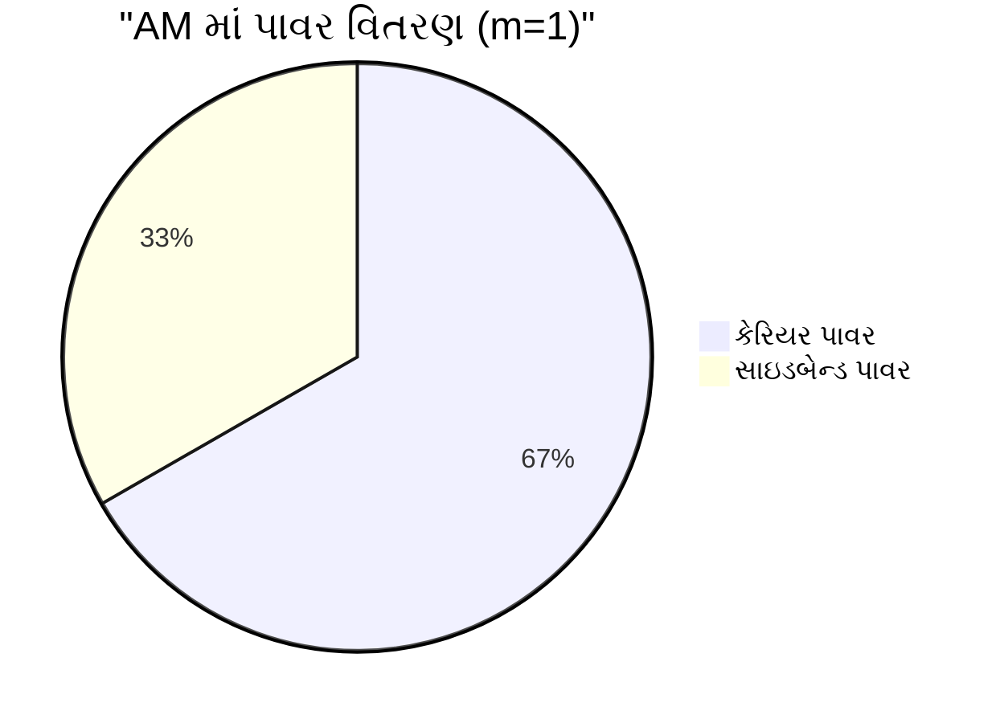
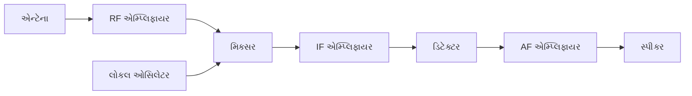
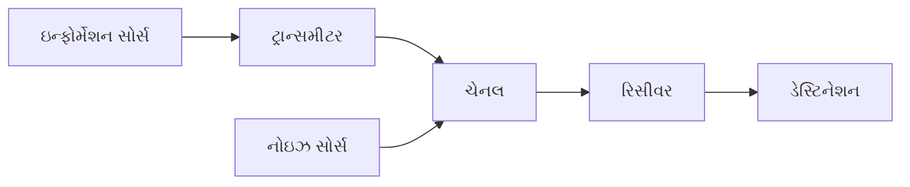
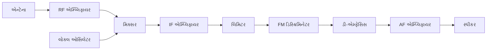
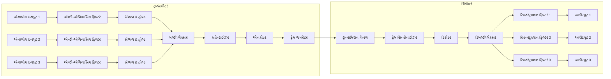
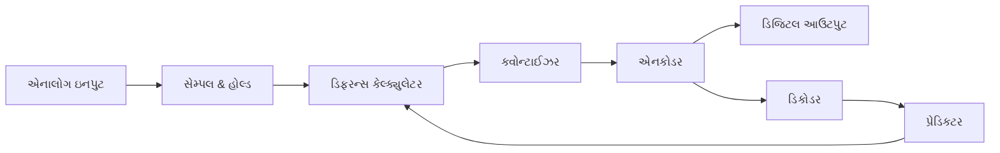
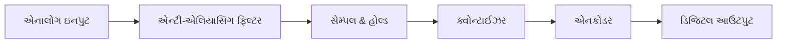

## પ્રશ્ન 1(અ) [3 ગુણ]

**વ્યાખ્યા આપો: (અ) Amplitude Modulation, (બ) Frequency Modulation અને (ક) Phase Modulation**

**જવાબ**:

**કોષ્ટક: મોડ્યુલેશન પ્રકારો**

| મોડ્યુલેશન પ્રકાર | વ્યાખ્યા |
|----------------|------------|
| **Amplitude Modulation (AM)** | એક પ્રક્રિયા જેમાં carrier સિગ્નલનું amplitude, modulating સિગ્નલની ક્ષણિક કિંમત અનુસાર બદલાય છે જ્યારે frequency અચળ રહે છે |
| **Frequency Modulation (FM)** | એક પ્રક્રિયા જેમાં carrier સિગ્નલની frequency, modulating સિગ્નલની ક્ષણિક કિંમત અનુસાર બદલાય છે જ્યારે amplitude અચળ રહે છે |
| **Phase Modulation (PM)** | એક પ્રક્રિયા જેમાં carrier સિગ્નલનો phase, modulating સિગ્નલની ક્ષણિક કિંમત અનુસાર બદલાય છે જ્યારે amplitude અચળ રહે છે |

**મેમરી ટ્રીક:** "A-F-P: Amplitude બદલાય છે, Frequency ખસે છે, Phase સમાયોજિત થાય છે"

## પ્રશ્ન 1(બ) [4 ગુણ]

**મોડ્યુલેશનની જરૂરિયાત સમજાવો.**

**જવાબ**:

**કોષ્ટક: મોડ્યુલેશનની જરૂરિયાત**

| જરૂરિયાત | સમજૂતી |
|------|-------------|
| **પ્રેક્ટિકલ એન્ટેના સાઈઝ** | frequency વધારીને એન્ટેનાનું કદ ઘટાડે છે (એન્ટેના લંબાઈ = λ/4) |
| **ઇન્ટરફેરન્સ ઘટાડો** | અલગ-અલગ frequencies પર એક સાથે ઘણા સિગ્નલો પ્રસારિત કરવાની મંજૂરી આપે છે |
| **રેન્જ વિસ્તરણ** | ઉચ્ચ frequency સિગ્નલો વાતાવરણમાં વધુ દૂર સુધી જાય છે |
| **મલ્ટિપ્લેક્સિંગ** | ઘણા સિગ્નલોને કોમ્યુનિકેશન માધ્યમ શેર કરવા સક્ષમ બનાવે છે |

**આકૃતિ:**



**મેમરી ટ્રીક:** "PIRM: પ્રેક્ટિકલ એન્ટેના, ઇન્ટરફેરન્સ ઘટાડો, રેન્જ વિસ્તરણ, મલ્ટિપ્લેક્સિંગ"

## પ્રશ્ન 1(ક) [7 ગુણ]

**અમ્પ્લિટુડ મોડ્યુલેશનમાં મોડ્યુલેટિંગ સિગ્નલને 3V નું અમ્પ્લિટુડ અને 1 KHz ની ફ્રિક્વન્સી છે જ્યારે કેરિયર સિગ્નલને 10 V નું અમ્પ્લિટુડ અને 30 KHz ની ફ્રિક્વન્સી છે. મોડ્યુલેશન ઇન્ડેક્સ, સાઇડબેન્ડ ફ્રીક્વન્સીઝ અને તેમના અમ્પ્લિટુડ શોધો તેમજ આ AM વેવનું સ્પેક્ટ્રમ દોરો.**

**જવાબ**:

**કોષ્ટક: આપેલ માહિતી**

| પરિમાણ | મોડ્યુલેટિંગ સિગ્નલ | કેરિયર સિગ્નલ |
|-----------|-------------------|---------------|
| અમ્પ્લિટુડ | 3 V | 10 V |
| ફ્રિક્વન્સી | 1 kHz | 30 kHz |

**ગણતરી:**

- **મોડ્યુલેશન ઇન્ડેક્સ (m)** = Am/Ac = 3/10 = 0.3
- **સાઇડબેન્ડ ફ્રિક્વન્સી** = fc ± fm = 30 ± 1 = 29 kHz અને 31 kHz
- **સાઇડબેન્ડ અમ્પ્લિટુડ** = m × Ac/2 = 0.3 × 10/2 = 1.5 V

**આકૃતિ: AM સ્પેક્ટ્રમ**

```goat
                                ┌───┐
                                │   │
                                │   │ 10V
                                │   │
                                │   │
                                │   │
     ┌───┐                      │   │                      ┌───┐
     │   │                      │   │                      │   │
     │   │ 1.5V                 │   │                      │   │ 1.5V
     │   │                      │   │                      │   │
     │   │                      │   │                      │   │
─────┴───┴──────────────────────┴───┴──────────────────────┴───┴─────────▶ f
            29kHz                30kHz                31kHz
         (fc - fm)                 fc               (fc + fm)
```

**મેમરી ટ્રીક:** "LSB-C-USB: લોઅર સાઇડબેન્ડ, કેરિયર, અપર સાઇડબેન્ડ 29-30-31 પર"

## પ્રશ્ન 1(ક) OR [7 ગુણ]

**કેરિયર પાવર અને મોડુલેટેડ સિગ્નલ પાવરના મેથેમેટિકલ ઇક્વેશન તારવો.**

**જવાબ**:

**મેથેમેટિકલ રિલેશન:**

- કેરિયર સિગ્નલ: c(t) = Ac cos(2πfc·t)
- મોડ્યુલેટિંગ સિગ્નલ: m(t) = Am cos(2πfm·t)
- AM સિગ્નલ: s(t) = Ac[1 + m·cos(2πfm·t)]·cos(2πfc·t)

**કોષ્ટક: AM માં પાવર વિતરણ**

| ઘટક | સૂત્ર | Pc ના સંદર્ભમાં |
|-----------|------------|----------------|
| કેરિયર પાવર (Pc) | Ac²/2 | Pc |
| કુલ સાઇડબેન્ડ પાવર (Ps) | m²·Ac²/4 | m²·Pc/2 |
| કુલ AM પાવર (Pt) | Pc(1 + m²/2) | Pc(1 + m²/2) |

**આકૃતિ: પાવર વિતરણ**



- **મોડ્યુલેશન કાર્યક્ષમતા** = Ps/Pt = (m²/2)/(1 + m²/2) × 100%

**મેમરી ટ્રીક:** "કુલ પાવર = કેરિયર પાવર × (1 + m²/2)"

## પ્રશ્ન 2(અ) [3 ગુણ]

**AM અને FM ની સરખામણી કરો.**

**જવાબ**:

**કોષ્ટક: AM અને FM વચ્ચે તુલના**

| પરિમાણ | AM | FM |
|-----------|----|----|
| **મોડ્યુલેશન પરિમાણ** | અમ્પ્લિટુડ બદલાય છે | ફ્રિક્વન્સી બદલાય છે |
| **બેન્ડવિડ્થ** | 2 × fm | 2 × (Δf + fm) |
| **નોઇઝ ઇમ્યુનિટી** | નબળી | ઉત્તમ |
| **પાવર કાર્યક્ષમતા** | નીચી | ઉંચી |
| **સર્કિટ જટિલતા** | સરળ | જટિલ |

**મેમરી ટ્રીક:** "ABNPC: અમ્પ્લિટુડ/બેન્ડવિડ્થ/નોઇઝ/પાવર/જટિલતા તફાવત"

## પ્રશ્ન 2(બ) [4 ગુણ]

**સર્કિટ ડાયાગ્રામની મદદથી એન્વલેપ ડિટેક્ટરને સમજાવો.**

**જવાબ**:

**આકૃતિ: એન્વલેપ ડિટેક્ટર સર્કિટ**

```goat
    ┌─────┐     D     ┌───┬───┐
    │     │     ▶|    │   │   │
AM  │     ├────────┬──┤   │   │  Demodulated
Inpt│     │        │  │   │  ┌┴┐ Output
    │     │        │  │   │  │R│
    └─────┘        │  │   │  │L│
                   │  │   │  └┬┘
                   │  │ C │   │
                   │  │   │   │
                   └──┴───┴───┘
```

**કોષ્ટક: એન્વલેપ ડિટેક્ટર ઘટકો**

| ઘટક | કાર્ય |
|-----------|----------|
| **ડાયોડ (D)** | AM સિગ્નલને રેક્ટિફાય કરે છે અને પોઝિટિવ હાફ સાયકલ મેળવે છે |
| **કેપેસિટર (C)** | ઇનપુટના પીક સુધી ચાર્જ થાય છે, પીક વચ્ચે ચાર્જ જાળવી રાખે છે |
| **રેઝિસ્ટર (RL)** | એન્વેલોપ એક્સટ્રેક્શન માટે યોગ્ય દરે કેપેસિટરને ડિસ્ચાર્જ કરે છે |

**ટાઈમ કોન્સ્ટન્ટ સિલેક્શન:**

- 1/fm << RC << 1/fc (યોગ્ય એન્વેલોપ ડિટેક્શન માટે)

**મેમરી ટ્રીક:** "DCR: ડાયોડ રેક્ટિફાય કરે છે, કેપેસિટર ચાર્જ થાય છે, રેઝિસ્ટર ડિસ્ચાર્જ કરે છે"

## પ્રશ્ન 2(ક) [7 ગુણ]

**સુપરહીટરોડાઈન રીસીવરનો બ્લોક ડાયાગ્રામ દોરો અને સમજાવો.**

**જવાબ**:

**આકૃતિ: સુપરહીટરોડાઈન રીસીવર**



**કોષ્ટક: સુપરહીટરોડાઈન રીસીવર બ્લોક્સના કાર્યો**

| બ્લોક | કાર્ય |
|-------|----------|
| **RF એમ્પ્લિફાયર** | નબળા RF સિગ્નલને એમ્પ્લિફાય કરે છે, સિલેક્ટિવિટી પ્રદાન કરે છે, ઇમેજ ફ્રિક્વન્સીને રદ કરે છે |
| **લોકલ ઓસિલેટર** | મિક્સિંગ માટે ફ્રિક્વન્સી fo = fRF + fIF ઉત્પન્ન કરે છે |
| **મિક્સર** | IF (ઇન્ટરમીડિયેટ ફ્રિક્વન્સી) બનાવવા માટે RF સિગ્નલને લોકલ ઓસિલેટર સાથે જોડે છે |
| **IF એમ્પ્લિફાયર** | ફિક્સ્ડ ફ્રિક્વન્સી પર મોટાભાગના રિસીવર ગેઇન અને સિલેક્ટિવિટી પ્રદાન કરે છે |
| **ડિટેક્ટર** | IF સિગ્નલમાંથી મોડ્યુલેટિંગ સિગ્નલ એક્સટ્રેક્ટ કરે છે |
| **AF એમ્પ્લિફાયર** | સ્પીકર ચલાવવા માટે રિકવર થયેલ ઓડિયોને એમ્પ્લિફાય કરે છે |

**મેમરી ટ્રીક:** "RLMIDS: RF, લોકલ ઓસિલેટર, મિક્સર, IF, ડિટેક્ટર, સ્પીકર"

## પ્રશ્ન 2(અ) OR [3 ગુણ]

**નીચેના શબ્દો વ્યાખ્યાયિત કરો: (અ) Sensitivity અને (બ) Selectivity**

**જવાબ**:

**કોષ્ટક: રિસીવર લક્ષણો**

| શબ્દ | વ્યાખ્યા |
|------|------------|
| **Sensitivity** | નબળા સિગ્નલોને શોધવા અને એમ્પ્લિફાય કરવાની રિસીવરની ક્ષમતા; સ્ટાન્ડર્ડ આઉટપુટ માટે જરૂરી ન્યૂનતમ ઇનપુટ સિગ્નલ સ્ટ્રેન્થ (µV) તરીકે માપવામાં આવે છે |
| **Selectivity** | અડીન ચેનલોથી ઇચ્છિત સિગ્નલને અલગ કરવાની રિસીવરની ક્ષમતા; રેસોનન્ટ ફ્રિક્વન્સી પર રિસ્પોન્સના ઓફ-રેસોનન્ટ ફ્રિક્વન્સી પર રિસ્પોન્સના ગુણોત્તર તરીકે માપવામાં આવે છે |

**આકૃતિ: સિલેક્ટિવિટી કર્વ**

```goat
    │     ▲
    │     │રિસ્પોન્સ
    │     │
    │     │      ┌───┐
    │     │      │   │
    │     │      │   │
    │     │      │   │
    │     │   ┌──┘   └──┐
    │     │ ┌─┘         └─┐
    │     └─┘             └─┐
    └─────────────────────────▶
          f1   fc    f2    ફ્રિક્વન્સી
```

**મેમરી ટ્રીક:** "SS: સિગ્નલ સ્ટ્રેન્થ ફોર સેન્સિટિવિટી, સિગ્નલ સેપરેશન ફોર સિલેક્ટિવિટી"

## પ્રશ્ન 2(બ) OR [4 ગુણ]

**જનરલ કમ્યુનિકેશનના બ્લોક ડાયાગ્રામનું વર્ણન કરો**

**જવાબ**:

**આકૃતિ: જનરલ કમ્યુનિકેશન સિસ્ટમ**



**કોષ્ટક: કમ્યુનિકેશન સિસ્ટમના ઘટકો**

| ઘટક | કાર્ય |
|-----------|----------|
| **ઇન્ફોર્મેશન સોર્સ** | કમ્યુનિકેટ કરવા માટેનો સંદેશ ઉત્પન્ન કરે છે (વૉઇસ, ડેટા, વિડિઓ) |
| **ટ્રાન્સમીટર** | સંદેશને ટ્રાન્સમિશન માટે યોગ્ય સિગ્નલમાં રૂપાંતરિત કરે છે |
| **ચેનલ** | જેના દ્વારા સિગ્નલ પસાર થાય છે તે માધ્યમ (વાયર, ફાઇબર, હવા) |
| **રિસીવર** | મળેલા સિગ્નલમાંથી મૂળ સંદેશ એક્સટ્રેક્ટ કરે છે |
| **ડેસ્ટિનેશન** | જેના માટે સંદેશ અભિપ્રેત છે તે એન્ટિટી |
| **નોઇઝ સોર્સ** | અવાંછિત સિગ્નલો જે સંદેશમાં દખલ કરે છે |

**મેમરી ટ્રીક:** "I-T-C-R-D: ઇન્ફોર્મેશન ટ્રાવેલ્સ કેરફુલી, રીચેસ ડેસ્ટિનેશન"

## પ્રશ્ન 2(ક) OR [7 ગુણ]

**સુપરહીટરોડાઈન FM રીસીવરનો બ્લોક ડાયાગ્રામ દોરો અને સમજાવો.**

**જવાબ**:

**આકૃતિ: સુપરહીટરોડાઈન FM રીસીવર**



**કોષ્ટક: FM રિસીવરમાં વધારાના ઘટકો**

| ઘટક | કાર્ય |
|-----------|----------|
| **લિમિટર** | અમ્પ્લિટુડ વેરિએશન્સ દૂર કરે છે, સ્થિર અમ્પ્લિટુડ સિગ્નલ પ્રદાન કરે છે |
| **FM ડિસ્ક્રિમિનેટર** | ફ્રિક્વન્સી વેરિએશન્સને અમ્પ્લિટુડ વેરિએશન્સમાં રૂપાંતરિત કરે છે (ડિમોડ્યુલેશન) |
| **ડી-એમ્ફેસિસ** | ટ્રાન્સમીટર પર બૂસ્ટ થયેલ ઉચ્ચ ફ્રિક્વન્સીને ઘટાડે છે |

**FM રિસીવરની વિશિષ્ટ બાબતો:**

- વધુ પહોળી બેન્ડવિડ્થ IF એમ્પ્લિફાયર (AM માટે 10 kHz ની સરખામણીમાં 200 kHz) વાપરે છે
- નોઇઝ ઘટાડવા માટે લિમિટર સ્ટેજની જરૂર પડે છે
- FM ડિમોડ્યુલેશન માટે વિશિષ્ટ ડિસ્ક્રિમિનેટર વાપરે છે

**મેમરી ટ્રીક:** "MILD: મિક્સર, IF, લિમિટર, ડિસ્ક્રિમિનેટર - FM રિસેપ્શનમાં મુખ્ય ઘટકો"

## પ્રશ્ન 3(અ) [3 ગુણ]

**વેવફોર્મ ટાઈમ અને ફ્રિક્વન્સી ડોમેન માં દોરો (અ) Impulse અને (બ) Pulse**

**જવાબ**:

**કોષ્ટક: Impulse અને Pulse લક્ષણો**

| સિગ્નલ | ટાઈમ ડોમેન | ફ્રિક્વન્સી ડોમેન |
|--------|-------------|------------------|
| **Impulse** | અનંત સાંકડો સ્પાઇક અનંત અમ્પ્લિટુડ સાથે | ફ્લેટ સ્પેક્ટ્રમ જેમાં બધી ફ્રિક્વન્સી સમાન રીતે હાજર હોય |
| **Pulse** | આયતાકાર આકાર સાથે મર્યાદિત પહોળાઈ અને ઊંચાઈ | Sinc ફંક્શન (sin(x)/x) આકાર |

**આકૃતિ: Impulse અને Pulse**

```goat
ટાઈમ ડોમેન                       ફ્રિક્વન્સી ડોમેન
     
Impulse                          Impulse
    │                                │
    │                                │
    │ ↑                              │───────────────
    │ │                              │
    └─┼─────────▶                    └────────────────▶
      t₀                               f

Pulse                            Pulse
    │                                │
    │  ┌───────┐                     │    ┌─┐
    │  │       │                     │    │ │
    │  │       │                     │  ┌─┘ └─┐  ┌─┐
    └──┴───────┴────▶                └──┴─────┴──┴─┴───▶
       t₀  t₀+T                         f₀  2f₀  3f₀
```

**મેમરી ટ્રીક:** "I-P: Impulse એ Pinpoint સ્પાઇક છે, Pulse ને Persistent પહોળાઈ છે"

## પ્રશ્ન 3(બ) [4 ગુણ]

**અંડર સેમ્પલિંગ અને ક્રિટિકલ સેમ્પલિંગનું વર્ણન કરો**

**જવાબ**:

**કોષ્ટક: સેમ્પલિંગના પ્રકારો**

| સેમ્પલિંગનો પ્રકાર | વર્ણન | અસર |
|------------------|-------------|--------|
| **અંડર સેમ્પલિંગ** | સેમ્પલિંગ ફ્રિક્વન્સી fs < 2fm (નાયક્વિસ્ટ રેટ કરતાં ઓછી) | એલિયાસિંગ થાય છે; સિગ્નલ પુનઃપ્રાપ્ત કરી શકાતો નથી |
| **ક્રિટિકલ સેમ્પલિંગ** | સેમ્પલિંગ ફ્રિક્વન્સી fs = 2fm (ચોક્કસ નાયક્વિસ્ટ રેટ) | સૈદ્ધાંતિક રીતે સંપૂર્ણ પુનર્નિર્માણ શક્ય છે |
| **ઓવર સેમ્પલિંગ** | સેમ્પલિંગ ફ્રિક્વન્સી fs > 2fm (નાયક્વિસ્ટ રેટ કરતાં વધારે) | વધુ સારું પુનર્નિર્માણ, સરળ ફિલ્ટરિંગ |

**આકૃતિ: અંડર સેમ્પલિંગ vs ક્રિટિકલ સેમ્પલિંગ**

```goat
અંડર સેમ્પલિંગ (fs < 2fm)
    │     ┌───┐     ┌───┐     ┌───┐     ┌───┐
    │     │   │     │   │     │   │     │   │
    │─────┘   └─────┘   └─────┘   └─────┘   └────▶
    ↑     ↑     ↑     ↑     ↑
    એલિયાસિંગ થાય છે - સેમ્પલ્સ ખૂબ દૂર છે

ક્રિટિકલ સેમ્પલિંગ (fs = 2fm)
    │     ┌───┐     ┌───┐     ┌───┐     ┌───┐
    │     │   │     │   │     │   │     │   │
    │─────┘   └─────┘   └─────┘   └─────┘   └────▶
    ↑   ↑   ↑   ↑   ↑   ↑   ↑   ↑
    પુનર્નિર્માણ માટે પૂરતા સેમ્પલ્સ છે
```

**મેમરી ટ્રીક:** "UCO: અંડર (fs<2fm), ક્રિટિકલ (fs=2fm), ઓવર (fs>2fm)"

## પ્રશ્ન 3(ક) [7 ગુણ]

**PAM, PWM અને PPM સિગ્નલોને વેવફોર્મ સાથે જણાવો.**

**જવાબ**:

**કોષ્ટક: પલ્સ મોડ્યુલેશન ટેકનિક્સ**

| ટેકનિક | વર્ણન | સિગ્નલનું બદલાતું પરિમાણ |
|-----------|-------------|------------------------|
| **PAM (પલ્સ અમ્પ્લિટુડ મોડ્યુલેશન)** | પલ્સનું અમ્પ્લિટુડ મોડ્યુલેટિંગ સિગ્નલ અનુસાર બદલાય છે | અમ્પ્લિટુડ |
| **PWM (પલ્સ વિડ્થ મોડ્યુલેશન)** | પલ્સની પહોળાઈ/અવધિ મોડ્યુલેટિંગ સિગ્નલ અનુસાર બદલાય છે | પલ્સ પહોળાઈ |
| **PPM (પલ્સ પોઝિશન મોડ્યુલેશન)** | પલ્સની સ્થિતિ/સમય મોડ્યુલેટિંગ સિગ્નલ અનુસાર બદલાય છે | પલ્સ સ્થિતિ |

**આકૃતિ: PAM, PWM, PPM વેવફોર્મ્સ**

```goat
મોડ્યુલેટિંગ સિગ્નલ
    │    ┌───┐
    │   /     \
    │  /       \
    │ /         \        /\
    │/           \      /  \
    │             \    /    \
    │              \  /      \
    └───────────────\/────────────▶

PAM
    │    ┌─┐   ┌┐  ┌┐   ┌─┐
    │    │ │   ││  ││   │ │
    │    │ │   ││  ││   │ │
    │    │ │   ││  ││   │ │
    └────┘ └───┘└──┘└───┘ └────▶

PWM
    │    ┌───┐ ┌─┐ ┌┐  ┌──┐
    │    │   │ │ │ ││  │  │
    │    │   │ │ │ ││  │  │
    │    │   │ │ │ ││  │  │
    └────┘   └─┘ └─┘└──┘  └────▶

PPM
    │    ┌┐    ┌┐   ┌┐    ┌┐
    │    ││    ││   ││    ││
    │    ││    ││   ││    ││
    │    ││    ││   ││    ││
    └────┘└────┘└───┘└────┘└────▶
```

**મેમરી ટ્રીક:** "APP: અમ્પ્લિટુડ, પોઝિશન, પલ્સ-વિડ્થ અનુક્રમે બદલાય છે"

## પ્રશ્ન 3(અ) OR [3 ગુણ]

**સેમ્પલિંગ થીયરમ જણાવો અને સમજાવો.**

**જવાબ**:

**સેમ્પલિંગ થીયરમ સ્ટેટમેન્ટ:**
"બેન્ડ-લિમિટેડ કન્ટિન્યુઅસ-ટાઈમ સિગ્નલને તેના સેમ્પલ્સ દ્વારા સંપૂર્ણપણે રજૂ કરી શકાય છે અને પુનઃપ્રાપ્ત કરી શકાય છે, જો સેમ્પલિંગ ફ્રિક્વન્સી સિગ્નલમાં ઉચ્ચતમ ફ્રિક્વન્સી ઘટકના ઓછામાં ઓછી બે ગણી હોય."

**કોષ્ટક: સેમ્પલિંગ થીયરમના મુખ્ય તત્વો**

| શબ્દ | વર્ણન |
|------|-------------|
| **નાયક્વિસ્ટ રેટ** | જરૂરી ન્યૂનતમ સેમ્પલિંગ ફ્રિક્વન્સી (fs) = 2fm |
| **નાયક્વિસ્ટ ઇન્ટરવલ** | સેમ્પલ્સ વચ્ચેનો મહત્તમ સમય = 1/(2fm) |
| **બેન્ડ-લિમિટેડ સિગ્નલ** | મર્યાદિત ઉચ્ચતમ ફ્રિક્વન્સી ઘટક ધરાવતું સિગ્નલ |

**આકૃતિ: યોગ્ય સેમ્પલિંગ**

```goat
મૂળ સિગ્નલ
    │   ┌───┐
    │  /     \
    │ /       \
    │/         \
    │           \
    │            \
    └─────────────────▶

fs ≥ 2fm પર સેમ્પલ કરેલ
    │   *   *
    │  /|\  |\
    │ / | \ | \
    │/  |  \|  \
    │   |   *   *
    │   |       |
    └───*───────*───▶
```

**મેમરી ટ્રીક:** "2F: ફ્રિક્વન્સીને તેની ઉચ્ચતમ ફ્રિક્વન્સીના ઓછામાં ઓછા બે ગણા પર સેમ્પલ કરવી જોઈએ"

## પ્રશ્ન 3(બ) OR [4 ગુણ]

**કોન્ટાઇજેશન સમજાવો.**

**જવાબ**:

**કોષ્ટક: ક્વોન્ટાઈઝેશન કોન્સેપ્ટ્સ**

| શબ્દ | વર્ણન |
|------|-------------|
| **ક્વોન્ટાઈઝેશન** | સતત અમ્પ્લિટુડ મૂલ્યોને ડિસ્ક્રીટ લેવલ્સમાં રૂપાંતરિત કરવાની પ્રક્રિયા |
| **ક્વોન્ટાઈઝેશન લેવલ્સ** | ઉપયોગમાં લેવાતા ડિસ્ક્રીટ મૂલ્યોની કુલ સંખ્યા (સામાન્ય રીતે 2ⁿ) |
| **ક્વોન્ટાઈઝેશન સ્ટેપ સાઈઝ** | નજીકના લેવલ્સ વચ્ચેનો વોલ્ટેજ તફાવત (Q = Vmax/2ⁿ) |
| **ક્વોન્ટાઈઝેશન એરર** | વાસ્તવિક સિગ્નલ મૂલ્ય અને ક્વોન્ટાઈઝ્ડ મૂલ્ય વચ્ચેનો તફાવત |

**આકૃતિ: ક્વોન્ટાઈઝેશન પ્રક્રિયા**

```goat
કન્ટિન્યુઅસ સિગ્નલ           ક્વોન્ટાઈઝ્ડ સિગ્નલ
    │                           │       
    │   /\                      │   ┌─┐  
    │  /  \                     │   │ │  
    │ /    \      ───────▶      │┌──┘ └──┐
    │/      \                   ││       │
    │        \                  ││       └──┐
    │         \                 ││          │
    └──────────────▶            └───────────────▶
                               ક્વોન્ટાઈઝેશન
                                  લેવલ્સ
```

**મેમરી ટ્રીક:** "LSED: લેવલ્સ, સ્ટેપ સાઈઝ, એરર, ડિસ્ક્રીટ વેલ્યુ"

## પ્રશ્ન 3(ક) OR [7 ગુણ]

**કમ્પાન્ડિંગને વિગતવાર સમજાવો.**

**જવાબ**:

**કોષ્ટક: કમ્પાન્ડિંગ કોન્સેપ્ટ્સ**

| શબ્દ | વર્ણન |
|------|-------------|
| **કમ્પાન્ડિંગ** | COMપ્રેસિંગ + exPANDિંગ; નોન-લિનિયર ક્વોન્ટાઈઝેશન ટેકનિક |
| **કમ્પ્રેશન** | ટ્રાન્સમિશન પહેલા સિગ્નલની અમ્પ્લિટુડ રેન્જ ઘટાડે છે |
| **એક્સપાન્શન** | રિસીવર પર મૂળ અમ્પ્લિટુડ રેન્જ પુનઃસ્થાપિત કરે છે |
| **હેતુ** | ડાયનેમિક રેન્જ જાળવી રાખતી વખતે નબળા સિગ્નલ માટે SNR સુધારે છે |
| **પ્રકારો** | μ-law (ઉત્તર અમેરિકા, જાપાન), A-law (યુરોપ) |

**આકૃતિ: કમ્પાન્ડિંગ પ્રક્રિયા**


**કમ્પાન્ડિંગ લો:**

- **μ-law**: y = sgn(x) × ln(1+μ|x|)/ln(1+μ) જ્યાં μ = 255 USA માં
- **A-law**: y = sgn(x) × A|x|/(1+ln(A)) જ્યારે |x| < 1/A
             y = sgn(x) × (1+ln(A|x|))/(1+ln(A)) જ્યારે 1/A ≤ |x| ≤ 1

**મેમરી ટ્રીક:** "CEQS: કમ્પ્રેસ, એનકોડ, ક્વોન્ટાઈઝ, સેન્ડ; પછી ડિકોડ, એક્સપાન્ડ, રિકવર"

## પ્રશ્ન 4(અ) [3 ગુણ]

**ડેલ્ટા મોડ્યુલેશન સમજાવો**

**જવાબ**:

**કોષ્ટક: ડેલ્ટા મોડ્યુલેશન કોન્સેપ્ટ્સ**

| કોન્સેપ્ટ | વર્ણન |
|---------|-------------|
| **ડેલ્ટા મોડ્યુલેશન** | DPCM નું સૌથી સરળ રૂપ જ્યાં ફક્ત 1-બિટ ક્વોન્ટાઈઝેશન વાપરવામાં આવે છે |
| **સ્ટેપ સાઈઝ** | સિગ્નલને અનુમાનિત કરવામાં ફિક્સ્ડ વધારો/ઘટાડો |
| **આઉટપુટ** | બાઇનરી સ્ટ્રીમ (વધારા માટે 1, ઘટાડા માટે 0) |
| **ફાયદા** | સરળ અમલીકરણ, ઓછી બેન્ડવિડ્થ |

**આકૃતિ: ડેલ્ટા મોડ્યુલેશન**

```goat
ઓરિજિનલ સિગ્નલ    ડેલ્ટા મોડ્યુલેટેડ
                   એપ્રોક્સિમેશન
    │                   │
    │  /\               │    ┌┐┌┐
    │ /  \              │   ┌┘└┘└┐
    │/    \             │  ┌┘    └┐
    │      \            │ ┌┘      └┐
    │       \           │┌┘        └┐
    │        \          ││          │
    └─────────────▶     └───────────────▶
                       
બાઇનરી આઉટપુટ: 1 1 1 1 0 0 0 0 0 0
```

**મેમરી ટ્રીક:** "1B1S: 1-બિટ, 1-સ્ટેપ ટ્રેકિંગ"

## પ્રશ્ન 4(બ) [4 ગુણ]

**PCM ના ફાયદા અને ગેરફાયદા લખો**

**જવાબ**:

**કોષ્ટક: PCM ના ફાયદા અને ગેરફાયદા**

| ફાયદા | ગેરફાયદા |
|------------|---------------|
| **ઉચ્ચ નોઇઝ ઇમ્યુનિટી** | **વધારે બેન્ડવિડ્થની જરૂર પડે છે** |
| **વધુ સારી સિગ્નલ ક્વોલિટી** | **જટિલ સિસ્ટમ અમલીકરણ** |
| **ડિજિટલ સિસ્ટમ સાથે સુસંગત** | **ક્વોન્ટાઈઝેશન નોઇઝ હાજર હોય છે** |
| **સુરક્ષિત ટ્રાન્સમિશન શક્ય છે** | **સિન્ક્રનાઈઝેશનની જરૂર પડે છે** |
| **મલ્ટિપ્લેક્સિંગ ક્ષમતા** | **વધુ પાવરની જરૂરિયાત** |

**આકૃતિ: PCM સિસ્ટમ ઓવરવ્યુ**


**મેમરી ટ્રીક:** "NCSMP: નોઇઝ ઇમ્યુનિટી, કમ્પેટિબલ વિથ ડિજિટલ, સિક્યોર, મલ્ટિપ્લેક્સિંગ, પ્રોસેસિંગ બેનિફિટ્સ"

## પ્રશ્ન 4(ક) [7 ગુણ]

**PCM-TDM સિસ્ટમનો બ્લોક ડાયાગ્રામ દોરો અને સમજાવો.**

**જવાબ**:

**આકૃતિ: PCM-TDM સિસ્ટમ**



**કોષ્ટક: PCM-TDM સિસ્ટમ ઘટકો**

| ઘટક | કાર્ય |
|-----------|----------|
| **એન્ટી-એલિયાસિંગ ફિલ્ટર** | એલિયાસિંગ ટાળવા માટે સિગ્નલ બેન્ડવિડ્થને મર્યાદિત કરે છે |
| **સેમ્પલ & હોલ્ડ** | એનાલોગ મૂલ્ય પકડે છે અને પ્રોસેસિંગ માટે જાળવી રાખે છે |
| **મલ્ટીપ્લેક્સર** | એકલ ટાઇમ ડિવિઝન મલ્ટિપ્લેક્સ્ડ સ્ટ્રીમમાં ઘણા ઇનપુટ ચેનલો જોડે છે |
| **ક્વોન્ટાઈઝર** | સતત સેમ્પલ્સને ડિસ્ક્રીટ મૂલ્યોમાં ફેરવે છે |
| **એનકોડર** | ક્વોન્ટાઈઝ્ડ મૂલ્યોને બાઇનરી કોડમાં રૂપાંતરિત કરે છે |
| **ફ્રેમ જનરેટર** | સિન્ક્રોનાઈઝેશન અને કંટ્રોલ બિટ્સ ઉમેરે છે |
| **ડિમલ્ટીપ્લેક્સર** | જોડાયેલા સિગ્નલને પાછા અલગ-અલગ ચેનલમાં વિભાજિત કરે છે |
| **રિકન્સ્ટ્રક્શન ફિલ્ટર** | એનાલોગ વેવફોર્મ પુનઃપ્રાપ્ત કરવા માટે ડિકોડેડ સિગ્નલને સ્મૂધ કરે છે |

**મેમરી ટ્રીક:** "SAMPLER: સેમ્પલ, એમ્પ્લિફાય, મલ્ટિપ્લેક્સ, પ્રોસેસ, લિમિટ, એનકોડ, રિકન્સ્ટ્રક્ટ"

## પ્રશ્ન 4(અ) OR [3 ગુણ]

**સ્લોપ ઓવરલોડ એરરનું વર્ણન કરો.**

**જવાબ**:

**કોષ્ટક: સ્લોપ ઓવરલોડ એરર**

| કોન્સેપ્ટ | વર્ણન |
|---------|-------------|
| **સ્લોપ ઓવરલોડ એરર** | ઇનપુટ સિગ્નલ DM સ્ટેપ સાઈઝ કરતાં ઝડપથી બદલાય ત્યારે થતી ભૂલ |
| **કારણ** | ડેલ્ટા મોડ્યુલેશનમાં ફિક્સ્ડ સ્ટેપ સાઈઝ ઇનપુટના ઊંચા ઢાળ માટે ખૂબ નાની હોય છે |
| **અસર** | રિકન્સ્ટ્રક્ટેડ સિગ્નલમાં ડિસ્ટોર્શન, ખાસ કરીને ઉચ્ચ ફ્રિક્વન્સી પર |
| **ઉકેલ** | એડેપ્ટિવ ડેલ્ટા મોડ્યુલેશન (વેરિએબલ સ્ટેપ સાઈઝ) |

**આકૃતિ: સ્લોપ ઓવરલોડ એરર**

```goat
ઓરિજિનલ સિગ્નલ vs DM એપ્રોક્સિમેશન
                
    │                  સ્લોપ ઓવરલોડ
    │                      │
    │    /│\              /│\
    │   / │ \            / │ \
    │  /  │  \    vs    /  │  \
    │ /   │   \        /┌─┐│   \
    │/    │    \      /┌┘ └┤    \
    │     │     \    /┌┘   │     \
    │     │      \  /┌┘    │      \
    └─────┴───────\/┴──────┴───────▶
          ઓરિજિનલ     DM એપ્રોક્સિમેશન
```

**મેમરી ટ્રીક:** "SOS: સિગ્નલ ઓવરટેક્સ સ્ટેપ્સ જ્યારે સ્લોપ સ્ટીપ હોય"

## પ્રશ્ન 4(બ) OR [4 ગુણ]

**ડિફરન્શિયલ PCM નું ટ્રાન્સમીટર સમજાવો**

**જવાબ**:

**આકૃતિ: DPCM ટ્રાન્સમીટર**



**કોષ્ટક: DPCM ટ્રાન્સમીટર ઘટકો**

| ઘટક | કાર્ય |
|-----------|----------|
| **સેમ્પલ & હોલ્ડ** | નિયમિત અંતરે એનાલોગ સિગ્નલ પકડે છે |
| **ડિફરન્સ કેલ્ક્યુલેટર** | વર્તમાન સેમ્પલ અને અનુમાનિત મૂલ્ય વચ્ચે એરર ગણે છે |
| **ક્વોન્ટાઈઝર** | એરર સિગ્નલને ડિસ્ક્રીટ લેવલમાં રૂપાંતરિત કરે છે |
| **એનકોડર** | ક્વોન્ટાઈઝ્ડ મૂલ્યોને બાઇનરી કોડમાં રૂપાંતરિત કરે છે |
| **પ્રેડિક્ટર** | અગાઉના મૂલ્યોના આધારે આગામી સેમ્પલનો અંદાજ લગાવે છે |
| **ડિકોડર** | રિસીવરમાં જે હોય તે જ, ફીડબેક લૂપમાં ઉપયોગ થાય છે |

**મુખ્ય ફાયદો:**

- ફક્ત સળંગ સેમ્પલ્સ વચ્ચેનો તફાવત ટ્રાન્સમિટ કરે છે
- સ્ટાન્ડર્ડ PCM ની સરખામણીમાં બિટ રેટ ઘટાડે છે

**મેમરી ટ્રીક:** "SDQEP: સેમ્પલ, ડિફરન્સ, ક્વોન્ટાઈઝ, એનકોડ, પ્રેડિક્ટ"

## પ્રશ્ન 4(ક) OR [7 ગુણ]

**વિગતવાર PCM ટ્રાન્સમીટર સમજાવો**

**જવાબ**:

**આકૃતિ: PCM ટ્રાન્સમીટર**



**કોષ્ટક: PCM ટ્રાન્સમીટર ઘટકોની વિગત**

| ઘટક | કાર્ય | ડિઝાઇન કન્સિડરેશન્સ |
|-----------|----------|------------------------|
| **એન્ટી-એલિયાસિંગ ફિલ્ટર** | ઇનપુટ બેન્ડવિડ્થને fs/2 સુધી મર્યાદિત કરે છે | કટઓફ ફ્રિક્વન્સી < fs/2, શાર્પ રોલ-ઓફ |
| **સેમ્પલ & હોલ્ડ** | ક્ષણિક સિગ્નલ મૂલ્ય પકડે છે | સેમ્પલિંગ રેટ ≥ 2fm, અપર્ચર ટાઈમ << સેમ્પલિંગ પીરિયડ |
| **ક્વોન્ટાઈઝર** | સેમ્પલ અમ્પ્લિટ્યુડને ડિસ્ક્રીટ લેવલમાં અંદાજિત કરે છે | લેવલ્સ = 2ⁿ જ્યાં n = બિટ ડેપ્થ, સામાન્ય રીતે 8-16 બિટ્સ |
| **એનકોડર** | ક્વોન્ટાઈઝ્ડ મૂલ્યોને ડિજિટલ કોડમાં રૂપાંતરિત કરે છે | NRZ, RZ, મેનચેસ્ટર જેવા કોડિંગ સ્કીમ્સ વાપરે છે |
| **લાઈન કોડર** | ટ્રાન્સમિશન માટે બાઇનરી સિક્વન્સ તૈયાર કરે છે | લાંબા અંતર માટે રિજનરેટિવ રિપીટર્સ વાપરી શકે છે |

**સિગ્નલ પ્રોસેસિંગ વિગતો:**

- **ટાઈમ ડોમેન**: Ts = 1/fs અંતરે સેમ્પલિંગ
- **અમ્પ્લિટુડ ડોમેન**: સતત અમ્પ્લિટ્યુડને 2ⁿ ડિસ્ક્રીટ લેવલમાં ક્વોન્ટાઈઝિંગ
- **કોડ ડોમેન**: લેવલ્સને n-બિટ બાઇનરી કોડમાં રૂપાંતરિત કરવું

**મેમરી ટ્રીક:** "SAFE-Q: સેમ્પલ એન્ડ ફિલ્ટર, ધેન એનકોડ આફ્ટર ક્વોન્ટાઈઝિંગ"

## પ્રશ્ન 5(અ) [3 ગુણ]

**PCM અને DMની સરખામણી કરો**

**જવાબ**:

**કોષ્ટક: PCM અને DM વચ્ચે તુલના**

| પરિમાણ | PCM | DM |
|-----------|-----|-----|
| **બિટ રેટ** | ઉચ્ચ (પ્રતિ સેમ્પલ ઘણા બિટ્સ) | નીચો (પ્રતિ સેમ્પલ 1 બિટ) |
| **સર્કિટ જટિલતા** | વધુ જટિલ | સરળ |
| **સિગ્નલ ક્વોલિટી** | સારી | નીચી, સ્લોપ ઓવરલોડ & ગ્રેન્યુલર નોઇઝથી પ્રભાવિત |
| **બેન્ડવિડ્થ** | વધુ પહોળી | સાંકડી |
| **સેમ્પલિંગ રેટ** | ઓછામાં ઓછી 2fm | 2fm કરતાં ઘણી વધારે |

**મેમરી ટ્રીક:** "BCSBS: બિટ રેટ, કમ્પ્લેક્સિટી, સિગ્નલ ક્વોલિટી, બેન્ડવિડ્થ, સેમ્પલિંગ"

## પ્રશ્ન 5(બ) [4 ગુણ]

**વ્યાખ્યા આપો: (અ) Antenna (બ) Radiation pattern (ક) Directivity અને (ડ) Polarization**

**જવાબ**:

**કોષ્ટક: એન્ટેના શબ્દાવલી**

| શબ્દ | વ્યાખ્યા |
|------|------------|
| **એન્ટેના** | ઇલેક્ટ્રિકલ સિગ્નલ્સને ઇલેક્ટ્રોમેગ્નેટિક વેવ્સમાં અને તેનાથી ઉલટું ફેરવતું ઉપકરણ |
| **રેડિએશન પેટર્ન** | અંતરિક્ષ કોઓર્ડિનેટ્સના ફંક્શન તરીકે એન્ટેનાની રેડિએશન પ્રોપર્ટીઝનું ગ્રાફિકલ રેપ્રેઝન્ટેશન |
| **ડિરેક્ટિવિટી** | આપેલી દિશામાં રેડિએશન ઇન્ટેન્સિટીનો સરેરાશ રેડિએશન ઇન્ટેન્સિટી સાથેનો ગુણોત્તર |
| **પોલરાઇઝેશન** | એન્ટેના દ્વારા રેડિએટ થયેલા ઇલેક્ટ્રોમેગ્નેટિક વેવના ઇલેક્ટ્રિક ફિલ્ડ વેક્ટરની ઓરિએન્ટેશન |

**આકૃતિ: રેડિએશન પેટર્ન**

```goat
      │
      │          ┌───┐
      │        ╱       ╲
      │      ╱           ╲
      │    ╱               ╲
      │  ╱                   ╲
      │╱                       ╲
 ─────┼─────────────────────────────▶
      │╲                       ╱
      │  ╲                   ╱
      │    ╲               ╱
      │      ╲           ╱
      │        ╲       ╱
      │          └───┘
      │
```

**મેમરી ટ્રીક:** "ARDP: એન્ટેના રેડિએટ વિથ ડિરેક્ટિવિટી એન્ડ પોલરાઈઝેશન"

## પ્રશ્ન 5(ક) [7 ગુણ]

**સંક્ષિપ્ત નોંધ લખો (અ) સ્માર્ટ એન્ટેના (બ) પેરાબોલિક રિફ્લેક્ટર એન્ટેના**

**જવાબ**:

### (અ) સ્માર્ટ એન્ટેના

**કોષ્ટક: સ્માર્ટ એન્ટેના લક્ષણો**

| વિશેષતા | વર્ણન |
|---------|-------------|
| **વ્યાખ્યા** | બદલાતી પરિસ્થિતિઓ સાથે અનુકૂલિત થવાની ક્ષમતા સાથે એન્ટેના એરે સિગ્નલ પ્રોસેસિંગ |
| **પ્રકારો** | સ્વિચ્ડ બીમ, એડેપ્ટિવ એરે |
| **ફાયદા** | વધારેલી રેન્જ/કવરેજ, ઇન્ટરફેરન્સ ઘટાડો, ક્ષમતા સુધારણા |
| **એપ્લિકેશન્સ** | મોબાઇલ કમ્યુનિકેશન, 5G નેટવર્ક્સ, WiMAX, મિલિટરી સિસ્ટમ્સ |

**આકૃતિ: સ્માર્ટ એન્ટેના સિસ્ટમ**


### (બ) પેરાબોલિક રિફ્લેક્ટર એન્ટેના

**કોષ્ટક: પેરાબોલિક રિફ્લેક્ટર લક્ષણો**

| વિશેષતા | વર્ણન |
|---------|-------------|
| **સ્ટ્રક્ચર** | ફોકલ પોઈન્ટ પર ફીડ એન્ટેના સાથે પેરાબોલિક રિફ્લેક્ટિંગ સરફેસ |
| **ઓપરેશન** | સમાંતર આવતા તરંગોને ફોકલ પોઈન્ટ પર કેન્દ્રિત કરે છે અથવા ફોકલ પોઈન્ટથી સમાંતર બીમ્સમાં રેડિએટ કરે છે |
| **ગેઇન** | ખૂબ ઉચ્ચ દિશાત્મકતા અને ગેઇન |
| **એપ્લિકેશન્સ** | સેટેલાઇટ કમ્યુનિકેશન, રેડિયો એસ્ટ્રોનોમી, રડાર સિસ્ટમ્સ |

**આકૃતિ: પેરાબોલિક રિફ્લેક્ટર**

```goat
                 ╱│╲
             ╱    │    ╲
         ╱        │        ╲
     ╱            │            ╲
 ╱                │                ╲
 ╲                │                ╱
     ╲            │            ╱
         ╲        │        ╱
             ╲    │    ╱
                 ╲│╱
                  X
                  │
                  │
                  ▼
                રિસીવર
             (ફોકલ પોઈન્ટ પર)
```

**મેમરી ટ્રીક:** "PFHS: પેરાબોલિક ફોકસ ગિવ્સ હાઇ સિગ્નલ સ્ટ્રેન્થ"

## પ્રશ્ન 5(અ) OR [3 ગુણ]

**માઇક્રોસ્ટ્રીપ એન્ટેના પર ટૂંકી નોંધ લખો**

**જવાબ**:

**કોષ્ટક: માઇક્રોસ્ટ્રીપ એન્ટેના લક્ષણો**

| વિશેષતા | વર્ણન |
|---------|-------------|
| **સ્ટ્રક્ચર** | ગ્રાઉન્ડ પ્લેન સાથે ડાયલેક્ટ્રિક સબસ્ટ્રેટ પર કન્ડક્ટિવ પેચ |
| **આકાર** | લંબચોરસ, ગોળ, ઈંડાકાર, ત્રિકોણાકાર પેચ |
| **સાઈઝ** | સામાન્ય રીતે λ/2 લંબાઈમાં, ખૂબ પાતળી (h << λ) |
| **ફાયદા** | લો પ્રોફાઇલ, હલકા વજન, ઓછી કિંમત, સરળ ફેબ્રિકેશન, PCB ટેકનોલોજી સાથે સુસંગત |
| **ગેરફાયદા** | ઓછી કાર્યક્ષમતા, સાંકડી બેન્ડવિડ્થ, ઓછી પાવર હેન્ડલિંગ |

**આકૃતિ: માઇક્રોસ્ટ્રીપ પેચ એન્ટેના**

```goat
    ┌─────────────────────┐  ←── પેચ (કોપર)
    │                     │
    │                     │
    │                     │
    └─────────────────────┘
    ┌─────────────────────┐  ←── ડાયલેક્ટ્રિક સબસ્ટ્રેટ
    │                     │      (FR4, PTFE, વગેરે)
    └─────────────────────┘
    ┌─────────────────────┐  ←── ગ્રાઉન્ડ પ્લેન (કોપર)
    └─────────────────────┘
```

**મેમરી ટ્રીક:** "PDGF: પેચ ઓન ડાયલેક્ટ્રિક વિથ ગ્રાઉન્ડ પ્લેન ગિવ્સ ફ્લેટ પ્રોફાઇલ"

## પ્રશ્ન 5(બ) OR [4 ગુણ]

**EM વેવ સ્પેક્ટ્રમ, તેની ફ્રીક્વન્સી રેન્જ અને તેની એપ્લિકેશન્સ સમજાવો.**

**જવાબ**:

**કોષ્ટક: EM વેવ સ્પેક્ટ્રમ અને એપ્લિકેશન્સ**

| બેન્ડ | ફ્રિક્વન્સી રેન્જ | વેવલેન્થ | એપ્લિકેશન્સ |
|------|-----------------|------------|--------------|
| **ELF** | 3 Hz - 30 Hz | 10,000 - 100,000 km | સબમરીન કમ્યુનિકેશન |
| **VLF** | 3 kHz - 30 kHz | 10 - 100 km | નેવિગેશન, ટાઈમ સિગ્નલ્સ |
| **LF** | 30 kHz - 300 kHz | 1 - 10 km | AM રેડિઓ, મેરિટાઈમ રેડિઓ |
| **MF** | 300 kHz - 3 MHz | 100 m - 1 km | AM બ્રોડકાસ્ટિંગ |
| **HF** | 3 MHz - 30 MHz | 10 - 100 m | શોર્ટવેવ રેડિઓ, એમેચ્યોર રેડિઓ |
| **VHF** | 30 MHz - 300 MHz | 1 - 10 m | FM રેડિઓ, TV બ્રોડકાસ્ટિંગ |
| **UHF** | 300 MHz - 3 GHz | 10 cm - 1 m | TV, મોબાઇલ ફોન, WiFi |
| **SHF** | 3 GHz - 30 GHz | 1 - 10 cm | સેટેલાઇટ, રડાર, 5G |
| **EHF** | 30 GHz - 300 GHz | 1 mm - 1 cm | રેડિઓ એસ્ટ્રોનોમી, સિક્યુરિટી સ્કેનિંગ |
| **IR** | 300 GHz - 400 THz | 750 nm - 1 mm | થર્મલ ઇમેજિંગ, રિમોટ કંટ્રોલ |
| **Visible** | 400 THz - 800 THz | 380 - 750 nm | ઓપ્ટિકલ કમ્યુનિકેશન્સ |

**આકૃતિ: EM વેવ સ્પેક્ટ્રમ**


**મેમરી ટ્રીક:** "RVMIXG: રેડિઓ, વિઝિબલ, માઇક્રોવેવ, ઇન્ફ્રારેડ, X-રે, ગામા"

## પ્રશ્ન 5(ક) OR [7 ગુણ]

**સંક્ષિપ્ત નોંધ લખો (અ) Space Wave Propagation અને (બ) Ground Wave Propagation પર સંક્ષિપ્ત નોંધ લખો.**

**જવાબ**:

### (અ) Space Wave Propagation

**કોષ્ટક: Space Wave Propagation લક્ષણો**

| વિશેષતા | વર્ણન |
|---------|-------------|
| **વ્યાખ્યા** | સ્પેસ દ્વારા સીધું વેવ પ્રોપેગેશન, જેમાં લાઇન-ઓફ-સાઇટ અને રિફ્લેક્ટેડ વેવ્સ શામેલ છે |
| **ફ્રિક્વન્સી રેન્જ** | VHF અને ઉપર (>30 MHz) |
| **અંતર** | હોરિઝન દ્વારા મર્યાદિત, સામાન્ય રીતે 50-80 km |
| **પ્રકારો** | ડાયરેક્ટ વેવ, ગ્રાઉન્ડ રિફ્લેક્ટેડ વેવ, ટ્રોપોસ્ફેરિક સ્કેટર, ડક્ટ પ્રોપેગેશન |
| **એપ્લિકેશન્સ** | TV બ્રોડકાસ્ટિંગ, માઇક્રોવેવ લિંક્સ, સેટેલાઇટ કમ્યુનિકેશન |

**આકૃતિ: Space Wave Propagation**

```goat
                    /\/\/\/\/\/\/\/\  ← Troposphere
                   /                \
                  /                  \
                 /                    \
    Transmitter *                       * Receiver
                |                       |
                |                       |
     ___________|_______________________|__________
                     Ground Surface
```

### (બ) Ground Wave Propagation

**કોષ્ટક: Ground Wave Characteristics**

| વિશેષતા | વર્ણન |
|---------|-------------|
| **વ્યાખ્યા** | પૃથ્વીની સપાટી સાથે વેવ પ્રોપેગેશન, પૃથ્વીની વક્રતાને અનુસરે છે |
| **ફ્રિક્વન્સી રેન્જ** | LF, MF (2 MHz સુધી) |
| **અંતર** | ફ્રિક્વન્સી અને પાવર પર આધારિત 1000 km સુધી |
| **મેકેનિઝમ** | વર્ટિકલી પોલરાઇઝ્ડ વેવ કન્ડક્ટિવ અર્થ સરફેસને જોડાય છે |
| **એપ્લિકેશન્સ** | AM રેડિઓ બ્રોડકાસ્ટિંગ, મેરિટાઈમ કમ્યુનિકેશન |

**આકૃતિ: Ground Wave Propagation**

```goat
       ટ્રાન્સમીટર                              રિસીવર
         *                                   *
         |                                   |
         |       ગ્રાઉન્ડ વેવ                     |
     ____|___________________________________|____
         \\\\\\\\\\\\\\\\\\\\\\\\\\\\\\\\\\\\\\\\
                       અર્થ
```

**મેમરી ટ્રીક:** "SHGM: સ્પેસ વેવ્સ ગો હાઇ, ગ્રાઉન્ડ વેવ્સ હગ મીડિયમ સરફેસ"
