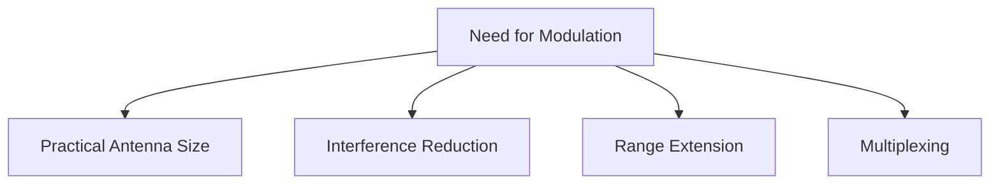
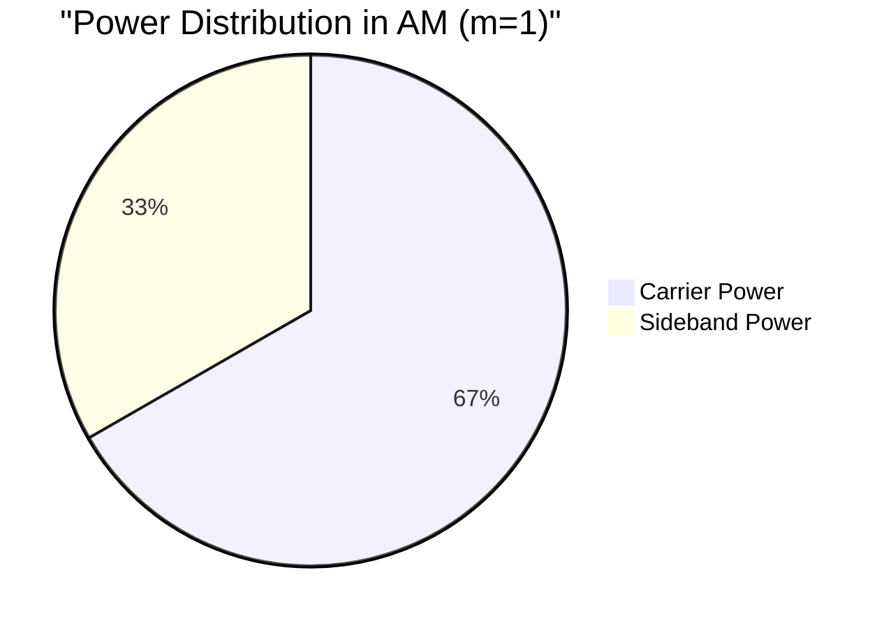
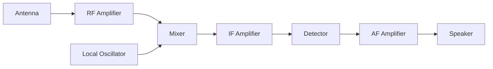
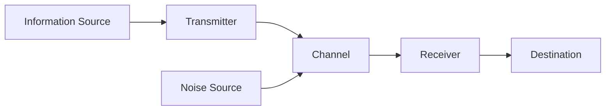
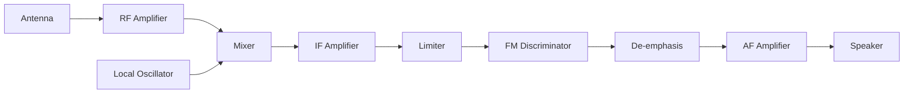
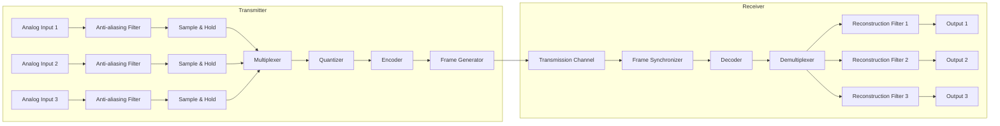
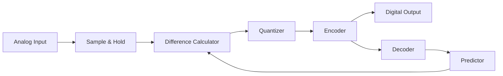

## Question 1(a) [3 marks]

**Define: (A) Amplitude Modulation, (B) Frequency Modulation, and (C) Phase Modulation**

**Answer**:

**Table: Types of Modulation Techniques**

| Modulation Type | Definition |
|----------------|------------|
| **Amplitude Modulation (AM)** | Process where amplitude of carrier signal is varied according to the instantaneous value of modulating signal while frequency remains constant |
| **Frequency Modulation (FM)** | Process where frequency of carrier signal is varied according to the instantaneous value of modulating signal while amplitude remains constant |
| **Phase Modulation (PM)** | Process where phase of carrier signal is varied according to the instantaneous value of modulating signal while amplitude remains constant |

**Mnemonic:** "A-F-P: Amplitude changes, Frequency shifts, Phase adjusts"

## Question 1(b) [4 marks]

**Explain the need for modulation.**

**Answer**:

**Table: Need for Modulation**

| Need | Explanation |
|------|-------------|
| **Practical Antenna Size** | Reduces antenna size by increasing frequency (Antenna length = λ/4) |
| **Interference Reduction** | Allows multiple signals to be transmitted simultaneously on different frequencies |
| **Range Extension** | Higher frequency signals travel farther in atmosphere |
| **Multiplexing** | Enables multiple signals to share communication medium |

**Diagram:**



**Mnemonic:** "PIRM: Practical antennas, Interference reduction, Range extension, Multiplexing"

## Question 1(c) [7 marks]

**A modulating signal has amplitude of 3 V and frequency of 1 KHz is amplitude modulated by a carrier of amplitude 10 V and frequency 30KHz. Find modulation index, frequencies of sideband components and their amplitudes. Also draw the spectrum of AM wave.**

**Answer**:

**Table: Given Information**

| Parameter | Modulating Signal | Carrier Signal |
|-----------|-------------------|---------------|
| Amplitude | 3 V | 10 V |
| Frequency | 1 kHz | 30 kHz |

**Calculations:**

- **Modulation Index (m)** = Am/Ac = 3/10 = 0.3
- **Sideband Frequencies** = fc ± fm = 30 ± 1 = 29 kHz and 31 kHz
- **Sideband Amplitudes** = m × Ac/2 = 0.3 × 10/2 = 1.5 V

**Diagram: AM Spectrum**

```goat
                                ┌───┐
                                │   │
                                │   │ 10V
                                │   │
                                │   │
                                │   │
     ┌───┐                      │   │                      ┌───┐
     │   │                      │   │                      │   │
     │   │ 1.5V                 │   │                      │   │ 1.5V
     │   │                      │   │                      │   │
     │   │                      │   │                      │   │
─────┴───┴──────────────────────┴───┴──────────────────────┴───┴─────────▶ f
            29kHz                30kHz                31kHz
         (fc - fm)                 fc               (fc + fm)
```

**Mnemonic:** "LSB-C-USB: Lower sideband, Carrier, Upper sideband at 29-30-31"

## Question 1(c) OR [7 marks]

**Derive mathematical relation between carrier powers, and modulated signal power for AM.**

**Answer**:

**Mathematical Relation:**

- Carrier signal: c(t) = Ac cos(2πfc·t)
- Modulating signal: m(t) = Am cos(2πfm·t)
- AM signal: s(t) = Ac[1 + m·cos(2πfm·t)]·cos(2πfc·t)

**Table: Power Distribution in AM**

| Component | Expression | In Terms of Pc |
|-----------|------------|----------------|
| Carrier Power (Pc) | Ac²/2 | Pc |
| Total Sideband Power (Ps) | m²·Ac²/4 | m²·Pc/2 |
| Total AM Power (Pt) | Pc(1 + m²/2) | Pc(1 + m²/2) |

**Diagram: Power Distribution**



- **Modulation Efficiency** = Ps/Pt = (m²/2)/(1 + m²/2) × 100%

**Mnemonic:** "Total Power = Carrier Power × (1 + m²/2)"

## Question 2(a) [3 marks]

**Compare AM and FM.**

**Answer**:

**Table: Comparison between AM and FM**

| Parameter | AM | FM |
|-----------|----|----|
| **Modulation Parameter** | Amplitude varies | Frequency varies |
| **Bandwidth** | 2 × fm | 2 × (Δf + fm) |
| **Noise Immunity** | Poor | Excellent |
| **Power Efficiency** | Low | High |
| **Circuit Complexity** | Simple | Complex |

**Mnemonic:** "ABNPC: Amplitude/Bandwidth/Noise/Power/Complexity differences"

## Question 2(b) [4 marks]

**Explain envelope detector with the help of circuit diagram.**

**Answer**:

**Diagram: Envelope Detector Circuit**

```goat
    ┌─────┐     D     ┌───┬───┐
    │     │     ▶|    │   │   │
AM  │     ├────────┬──┤   │   │  Demodulated
Inpt│     │        │  │   │  ┌┴┐ Output
    │     │        │  │   │  │R│
    └─────┘        │  │   │  │L│
                   │  │   │  └┬┘
                   │  │ C │   │
                   │  │   │   │
                   └──┴───┴───┘
```

**Table: Envelope Detector Components**

| Component | Function |
|-----------|----------|
| **Diode (D)** | Rectifies AM signal to extract positive half cycles |
| **Capacitor (C)** | Charges to peak of input, holds charge between peaks |
| **Resistor (RL)** | Discharges capacitor at rate suitable for envelope extraction |

**Time Constant Selection:**

- 1/fm << RC << 1/fc (for proper envelope detection)

**Mnemonic:** "DCR: Diode rectifies, Capacitor charges, Resistor discharges"

## Question 2(c) [7 marks]

**Draw and explain the block diagram of Superheterodyne receiver.**

**Answer**:

**Diagram: Superheterodyne Receiver**



**Table: Functions of Superheterodyne Receiver Blocks**

| Block | Function |
|-------|----------|
| **RF Amplifier** | Amplifies weak RF signal, provides selectivity, rejects image frequency |
| **Local Oscillator** | Generates frequency fo = fRF + fIF for mixing |
| **Mixer** | Combines RF signal with local oscillator to produce IF (Intermediate Frequency) |
| **IF Amplifier** | Provides most of the receiver gain and selectivity at fixed frequency |
| **Detector** | Extracts the modulating signal from the IF signal |
| **AF Amplifier** | Amplifies recovered audio to drive speaker |

**Mnemonic:** "RLMIDS: RF, Local oscillator, Mixer, IF, Detector, Speaker"

## Question 2(a) OR [3 marks]

**Define the followings terms: (A) Sensitivity, and (B) Selectivity**

**Answer**:

**Table: Receiver Characteristics**

| Term | Definition |
|------|------------|
| **Sensitivity** | Ability of receiver to detect and amplify weak signals; measured as minimum input signal strength (µV) needed for standard output |
| **Selectivity** | Ability of receiver to separate desired signal from adjacent channels; measured as ratio of response at resonant frequency to off-resonant frequency |

**Diagram: Selectivity Curve**

```goat
    │     ▲
    │     │Response
    │     │
    │     │      ┌───┐
    │     │      │   │
    │     │      │   │
    │     │      │   │
    │     │   ┌──┘   └──┐
    │     │ ┌─┘         └─┐
    │     └─┘             └─┐
    └─────────────────────────▶
          f1   fc    f2    Frequency
```

**Mnemonic:** "SS: Signal Strength for Sensitivity, Signal Separation for Selectivity"

## Question 2(b) OR [4 marks]

**Describe the block diagram of general communication system.**

**Answer**:

**Diagram: General Communication System**



**Table: Components of Communication System**

| Component | Function |
|-----------|----------|
| **Information Source** | Generates message to be communicated (voice, data, video) |
| **Transmitter** | Converts message into signals suitable for transmission |
| **Channel** | Medium through which signals travel (wire, fiber, air) |
| **Receiver** | Extracts original message from received signals |
| **Destination** | Entity for which message is intended |
| **Noise Source** | Unwanted signals that interfere with the message |

**Mnemonic:** "I-T-C-R-D: Information Travels Carefully, Reaches Destination"

## Question 2(c) OR [7 marks]

**Draw and explain the block diagram of Superheterodyne FM receiver.**

**Answer**:

**Diagram: Superheterodyne FM Receiver**



**Table: Additional Components in FM Receiver**

| Component | Function |
|-----------|----------|
| **Limiter** | Removes amplitude variations, provides constant amplitude signal |
| **FM Discriminator** | Converts frequency variations to amplitude variations (demodulation) |
| **De-emphasis** | Attenuates higher frequencies boosted at transmitter |

**Unique Aspects of FM Receiver:**

- Uses wider bandwidth IF amplifier (200 kHz vs 10 kHz for AM)
- Requires limiter stage for noise reduction
- Employs specialized discriminator for FM demodulation

**Mnemonic:** "MILD: Mixer, IF, Limiter, Discriminator - key components in FM reception"

## Question 3(a) [3 marks]

**Draw the waveform of (A) Impulse (B) Pulse in time and frequency domain**

**Answer**:

**Table: Impulse and Pulse Characteristics**

| Signal | Time Domain | Frequency Domain |
|--------|-------------|------------------|
| **Impulse** | Infinitely narrow spike with infinite amplitude | Flat spectrum with all frequencies equally present |
| **Pulse** | Rectangular shape with finite width and height | Sinc function (sin(x)/x) shape |

**Diagram: Impulse and Pulse**

```goat
Time Domain                      Frequency Domain
     
Impulse                          Impulse
    │                                │
    │                                │
    │ ↑                              │───────────────
    │ │                              │
    └─┼─────────▶                    └────────────────▶
      t₀                               f

Pulse                            Pulse
    │                                │
    │  ┌───────┐                     │    ┌─┐
    │  │       │                     │    │ │
    │  │       │                     │  ┌─┘ └─┐  ┌─┐
    └──┴───────┴────▶                └──┴─────┴──┴─┴───▶
       t₀  t₀+T                         f₀  2f₀  3f₀
```

**Mnemonic:** "I-P: Impulse is a Pinpoint spike, Pulse has Persistent width"

## Question 3(b) [4 marks]

**Describe under sampling and critical sampling**

**Answer**:

**Table: Types of Sampling**

| Type of Sampling | Description | Effect |
|------------------|-------------|--------|
| **Under Sampling** | Sampling frequency fs < 2fm (less than Nyquist rate) | Aliasing occurs; signal cannot be recovered |
| **Critical Sampling** | Sampling frequency fs = 2fm (exactly Nyquist rate) | Theoretically perfect reconstruction possible |
| **Over Sampling** | Sampling frequency fs > 2fm (exceeds Nyquist rate) | Better reconstruction, easier filtering |

**Diagram: Under Sampling vs Critical Sampling**

```goat
Under Sampling (fs < 2fm)
    │     ┌───┐     ┌───┐     ┌───┐     ┌───┐
    │     │   │     │   │     │   │     │   │
    │─────┘   └─────┘   └─────┘   └─────┘   └────▶
    ↑     ↑     ↑     ↑     ↑
    Aliasing occurs - samples too far apart

Critical Sampling (fs = 2fm)
    │     ┌───┐     ┌───┐     ┌───┐     ┌───┐
    │     │   │     │   │     │   │     │   │
    │─────┘   └─────┘   └─────┘   └─────┘   └────▶
    ↑   ↑   ↑   ↑   ↑   ↑   ↑   ↑
    Just enough samples to reconstruct
```

**Mnemonic:** "UCO: Under (fs<2fm), Critical (fs=2fm), Over (fs>2fm)"

## Question 3(c) [7 marks]

**State the PAM, PWM and PPM signals with waveform.**

**Answer**:

**Table: Pulse Modulation Techniques**

| Technique | Description | Signal Parameter Varied |
|-----------|-------------|------------------------|
| **PAM (Pulse Amplitude Modulation)** | Amplitude of pulses varies according to modulating signal | Amplitude |
| **PWM (Pulse Width Modulation)** | Width/duration of pulses varies according to modulating signal | Pulse width |
| **PPM (Pulse Position Modulation)** | Position/timing of pulses varies according to modulating signal | Pulse position |

**Diagram: PAM, PWM, PPM Waveforms**

```goat
Modulating Signal
    │    ┌───┐
    │   /     \
    │  /       \
    │ /         \        /\
    │/           \      /  \
    │             \    /    \
    │              \  /      \
    └───────────────\/────────────▶

PAM
    │    ┌─┐   ┌┐  ┌┐   ┌─┐
    │    │ │   ││  ││   │ │
    │    │ │   ││  ││   │ │
    │    │ │   ││  ││   │ │
    └────┘ └───┘└──┘└───┘ └────▶

PWM
    │    ┌───┐ ┌─┐ ┌┐  ┌──┐
    │    │   │ │ │ ││  │  │
    │    │   │ │ │ ││  │  │
    │    │   │ │ │ ││  │  │
    └────┘   └─┘ └─┘└──┘  └────▶

PPM
    │    ┌┐    ┌┐   ┌┐    ┌┐
    │    ││    ││   ││    ││
    │    ││    ││   ││    ││
    │    ││    ││   ││    ││
    └────┘└────┘└───┘└────┘└────▶
```

**Mnemonic:** "APP: Amplitude, Position, Pulse-width change respectively"

## Question 3(a) OR [3 marks]

**State and explain sampling theorem.**

**Answer**:

**Sampling Theorem Statement:**
"A band-limited continuous-time signal can be completely represented by and reconstructed from its samples, if the sampling frequency is at least twice the highest frequency component in the signal."

**Table: Key Elements of Sampling Theorem**

| Term | Description |
|------|-------------|
| **Nyquist Rate** | Minimum sampling frequency (fs) required = 2fm |
| **Nyquist Interval** | Maximum time between samples = 1/(2fm) |
| **Band-limited Signal** | Signal with finite highest frequency component |

**Diagram: Proper Sampling**

```goat
Original Signal
    │   ┌───┐
    │  /     \
    │ /       \
    │/         \
    │           \
    │            \
    └─────────────────▶

Sampled at fs ≥ 2fm
    │   *   *
    │  /|\  |\
    │ / | \ | \
    │/  |  \|  \
    │   |   *   *
    │   |       |
    └───*───────*───▶
```

**Mnemonic:** "2F: Frequency must be sampled at least Twice its highest Frequency"

## Question 3(b) OR [4 marks]

**Explain Concept of Quantization.**

**Answer**:

**Table: Quantization Concepts**

| Term | Description |
|------|-------------|
| **Quantization** | Process of converting continuous amplitude values into discrete levels |
| **Quantization Levels** | Total number of discrete values used (usually 2ⁿ) |
| **Quantization Step Size** | Voltage difference between adjacent levels (Q = Vmax/2ⁿ) |
| **Quantization Error** | Difference between actual signal value and quantized value |

**Diagram: Quantization Process**

```goat
Continuous Signal           Quantized Signal
    │                           │       
    │   /\                      │   ┌─┐  
    │  /  \                     │   │ │  
    │ /    \      ───────▶      │┌──┘ └──┐
    │/      \                   ││       │
    │        \                  ││       └──┐
    │         \                 ││          │
    └──────────────▶            └───────────────▶
                               Quantization
                                  Levels
```

**Mnemonic:** "LSED: Levels, Step size, Error, Discrete values"

## Question 3(c) OR [7 marks]

**Explain the Companding in detail.**

**Answer**:

**Table: Companding Concepts**

| Term | Description |
|------|-------------|
| **Companding** | COMpressing + exPANDING; non-linear quantization technique |
| **Compression** | Reduces amplitude range of signal before transmission |
| **Expansion** | Restores original amplitude range at receiver |
| **Purpose** | Improves SNR for weak signals while maintaining dynamic range |
| **Types** | μ-law (North America, Japan), A-law (Europe) |

**Diagram: Companding Process**


**Companding Laws:**

- **μ-law**: y = sgn(x) × ln(1+μ|x|)/ln(1+μ) where μ = 255 in USA
- **A-law**: y = sgn(x) × A|x|/(1+ln(A)) for |x| < 1/A
             y = sgn(x) × (1+ln(A|x|))/(1+ln(A)) for 1/A ≤ |x| ≤ 1

**Mnemonic:** "CEQS: Compress, Encode, Quantize, Send; then Decode, Expand, Recover"

## Question 4(a) [3 marks]

**Explain delta modulation**

**Answer**:

**Table: Delta Modulation Concepts**

| Concept | Description |
|---------|-------------|
| **Delta Modulation** | Simplest form of DPCM where only 1-bit quantization is used |
| **Step Size** | Fixed increment/decrement in approximating signal |
| **Output** | Binary stream (1 for increase, 0 for decrease) |
| **Advantages** | Simple implementation, low bandwidth |

**Diagram: Delta Modulation**

```goat
Original Signal    Delta Modulated
                   Approximation
    │                   │
    │  /\               │    ┌┐┌┐
    │ /  \              │   ┌┘└┘└┐
    │/    \             │  ┌┘    └┐
    │      \            │ ┌┘      └┐
    │       \           │┌┘        └┐
    │        \          ││          │
    └─────────────▶     └───────────────▶
                       
Binary Output: 1 1 1 1 0 0 0 0 0 0
```

**Mnemonic:** "1B1S: 1-Bit, 1-Step tracking"

## Question 4(b) [4 marks]

**List out of advantage and disadvantage of PCM.**

**Answer**:

**Table: Advantages and Disadvantages of PCM**

| Advantages | Disadvantages |
|------------|---------------|
| **High noise immunity** | **Requires higher bandwidth** |
| **Better signal quality** | **Complex system implementation** |
| **Compatible with digital systems** | **Quantization noise present** |
| **Secure transmission possible** | **Synchronization required** |
| **Multiplexing capability** | **Higher power requirement** |

**Diagram: PCM System Overview**


**Mnemonic:** "NCSMP: Noise immunity, Compatible with digital, Secure, Multiplexing, Processing benefits"

## Question 4(c) [7 marks]

**Draw and explain block diagram of PCM-TDM system.**

**Answer**:

**Diagram: PCM-TDM System**



**Table: PCM-TDM System Components**

| Component | Function |
|-----------|----------|
| **Anti-aliasing Filter** | Limits signal bandwidth to avoid aliasing |
| **Sample & Hold** | Captures analog value and holds it for processing |
| **Multiplexer** | Combines multiple input channels into single time division multiplexed stream |
| **Quantizer** | Converts continuous samples to discrete values |
| **Encoder** | Converts quantized values to binary code |
| **Frame Generator** | Adds synchronization and control bits |
| **Demultiplexer** | Separates combined signal back into individual channels |
| **Reconstruction Filter** | Smooths the decoded signal to recover analog waveform |

**Mnemonic:** "SAMPLER: Sample, Amplify, Multiplex, Process, Limit, Encode, Reconstruct"

## Question 4(a) OR [3 marks]

**Describe slop overload error.**

**Answer**:

**Table: Slope Overload Error**

| Concept | Description |
|---------|-------------|
| **Slope Overload Error** | Error occurring when input signal changes faster than DM step size can track |
| **Cause** | Fixed step size in Delta Modulation too small for steep input slopes |
| **Effect** | Distortion in reconstructed signal, particularly at high frequencies |
| **Solution** | Adaptive Delta Modulation (variable step size) |

**Diagram: Slope Overload Error**

```goat
Original Signal vs DM Approximation
                
    │                  Slope Overload
    │                      │
    │    /│\              /│\
    │   / │ \            / │ \
    │  /  │  \    vs    /  │  \
    │ /   │   \        /┌─┐│   \
    │/    │    \      /┌┘ └┤    \
    │     │     \    /┌┘   │     \
    │     │      \  /┌┘    │      \
    └─────┴───────\/┴──────┴───────▶
          Original     DM Approximation
```

**Mnemonic:** "SOS: Signal Outpaces Steps when slope is steep"

## Question 4(b) OR [4 marks]

**Explain transmitter of Differential PCM**

**Answer**:

**Diagram: DPCM Transmitter**



**Table: DPCM Transmitter Components**

| Component | Function |
|-----------|----------|
| **Sample & Hold** | Captures analog signal at regular intervals |
| **Difference Calculator** | Computes error between current sample and predicted value |
| **Quantizer** | Converts error signal to discrete levels |
| **Encoder** | Converts quantized values to binary code |
| **Predictor** | Estimates next sample based on previous values |
| **Decoder** | Same as in receiver, used in feedback loop |

**Key Advantage:**

- Transmits only the difference between successive samples
- Reduces bit rate compared to standard PCM

**Mnemonic:** "SDQEP: Sample, Difference, Quantize, Encode, Predict"

## Question 4(c) OR [7 marks]

**Explain in detail PCM transmitter**

**Answer**:

**Diagram: PCM Transmitter**


**Table: PCM Transmitter Components in Detail**

| Component | Function | Design Considerations |
|-----------|----------|------------------------|
| **Anti-aliasing Filter** | Limits input bandwidth to fs/2 | Cutoff frequency < fs/2, sharp roll-off |
| **Sample & Hold** | Captures instantaneous signal value | Sampling rate ≥ 2fm, aperture time << sampling period |
| **Quantizer** | Approximates sample amplitudes to discrete levels | Levels = 2ⁿ where n = bit depth, typically 8-16 bits |
| **Encoder** | Converts quantized values to digital codes | Uses coding schemes like NRZ, RZ, Manchester |
| **Line Coder** | Prepares binary sequence for transmission | May use regenerative repeaters for long distance |

**Signal Processing Details:**

- **Time Domain**: Sampling at intervals Ts = 1/fs
- **Amplitude Domain**: Quantizing continuous amplitudes into 2ⁿ discrete levels
- **Code Domain**: Converting levels to n-bit binary code

**Mnemonic:** "SAFE-Q: Sample And Filter, then Encode after Quantizing"

## Question 5(a) [3 marks]

**Compare PCM and DM**

**Answer**:

**Table: Comparison of PCM and DM**

| Parameter | PCM | DM |
|-----------|-----|-----|
| **Bit Rate** | Higher (multiple bits per sample) | Lower (1 bit per sample) |
| **Circuit Complexity** | More complex | Simpler |
| **Signal Quality** | Better | Lower, suffers from slope overload & granular noise |
| **Bandwidth** | Wider | Narrower |
| **Sampling Rate** | At least 2fm | Much higher than 2fm |

**Mnemonic:** "BCSBS: Bit rate, Complexity, Signal quality, Bandwidth, Sampling"

## Question 5(b) [4 marks]

**Define: (A) Antenna (B) Radiation pattern (C) Directivity and (D) Polarization**

**Answer**:

**Table: Antenna Terminology**

| Term | Definition |
|------|------------|
| **Antenna** | Device that converts electrical signals into electromagnetic waves and vice versa |
| **Radiation Pattern** | Graphical representation of radiation properties of antenna as function of space coordinates |
| **Directivity** | Ratio of radiation intensity in a given direction to average radiation intensity |
| **Polarization** | Orientation of electric field vector of electromagnetic wave radiated by antenna |

**Diagram: Radiation Pattern**

```goat
      │
      │          ┌───┐
      │        ╱       ╲
      │      ╱           ╲
      │    ╱               ╲
      │  ╱                   ╲
      │╱                       ╲
 ─────┼─────────────────────────────▶
      │╲                       ╱
      │  ╲                   ╱
      │    ╲               ╱
      │      ╲           ╱
      │        ╲       ╱
      │          └───┘
      │
```

**Mnemonic:** "ARDP: Antennas Radiate with Directivity and Polarization"

## Question 5(c) [7 marks]

**Write brief note on (A) smart antenna (B) parabolic reflector antenna**

**Answer**:

### (A) Smart Antenna

**Table: Smart Antenna Characteristics**

| Feature | Description |
|---------|-------------|
| **Definition** | Antenna array with signal processing capability to adapt to changing conditions |
| **Types** | Switched beam, Adaptive array |
| **Benefits** | Increased range/coverage, interference reduction, capacity improvement |
| **Applications** | Mobile communications, 5G networks, WiMAX, military systems |

**Diagram: Smart Antenna System**


### (B) Parabolic Reflector Antenna

**Table: Parabolic Reflector Characteristics**

| Feature | Description |
|---------|-------------|
| **Structure** | Feed antenna at focal point with parabolic reflecting surface |
| **Operation** | Focuses parallel incoming waves to focal point or radiates from focal point into parallel beams |
| **Gain** | Very high directivity and gain |
| **Applications** | Satellite communication, radio astronomy, radar systems |

**Diagram: Parabolic Reflector**

```goat
                 ╱│╲
             ╱    │    ╲
         ╱        │        ╲
     ╱            │            ╲
 ╱                │                ╲
 ╲                │                ╱
     ╲            │            ╱
         ╲        │        ╱
             ╲    │    ╱
                 ╲│╱
                  X
                  │
                  │
                  ▼
                Receiver
             (at focal point)
```

**Mnemonic:** "PFHS: Parabolic Focus gives High Signal strength"

## Question 5(a) OR [3 marks]

**Write a short note on Microstrip antenna**

**Answer**:

**Table: Microstrip Antenna Characteristics**

| Feature | Description |
|---------|-------------|
| **Structure** | Conductive patch on dielectric substrate with ground plane |
| **Shape** | Rectangular, circular, elliptical, triangular patches |
| **Size** | Typically λ/2 in length, very thin (h << λ) |
| **Advantages** | Low profile, lightweight, low cost, easy fabrication, compatible with PCB technology |
| **Disadvantages** | Low efficiency, narrow bandwidth, low power handling |

**Diagram: Microstrip Patch Antenna**

```goat
    ┌─────────────────────┐  ←── Patch (Copper)
    │                     │
    │                     │
    │                     │
    └─────────────────────┘
    ┌─────────────────────┐  ←── Dielectric Substrate
    │                     │      (FR4, PTFE, etc.)
    └─────────────────────┘
    ┌─────────────────────┐  ←── Ground Plane (Copper)
    └─────────────────────┘
```

**Mnemonic:** "PDGF: Patch on Dielectric with Ground plane gives Flat profile"

## Question 5(b) OR [4 marks]

**Explain EM wave spectrum, its Frequency ranges and its applications.**

**Answer**:

**Table: EM Wave Spectrum and Applications**

| Band | Frequency Range | Wavelength | Applications |
|------|-----------------|------------|--------------|
| **ELF** | 3 Hz - 30 Hz | 10,000 - 100,000 km | Submarine communication |
| **VLF** | 3 kHz - 30 kHz | 10 - 100 km | Navigation, time signals |
| **LF** | 30 kHz - 300 kHz | 1 - 10 km | AM radio, maritime radio |
| **MF** | 300 kHz - 3 MHz | 100 m - 1 km | AM broadcasting |
| **HF** | 3 MHz - 30 MHz | 10 - 100 m | Shortwave radio, amateur radio |
| **VHF** | 30 MHz - 300 MHz | 1 - 10 m | FM radio, TV broadcasting |
| **UHF** | 300 MHz - 3 GHz | 10 cm - 1 m | TV, mobile phones, WiFi |
| **SHF** | 3 GHz - 30 GHz | 1 - 10 cm | Satellite, radar, 5G |
| **EHF** | 30 GHz - 300 GHz | 1 mm - 1 cm | Radio astronomy, security scanning |
| **IR** | 300 GHz - 400 THz | 750 nm - 1 mm | Thermal imaging, remote control |
| **Visible** | 400 THz - 800 THz | 380 - 750 nm | Optical communications |

**Diagram: EM Wave Spectrum**


**Mnemonic:** "RVMIXG: Radio, Visible, Microwave, Infrared, X-ray, Gamma"

## Question 5(c) OR [7 marks]

**Write brief note on (A) Space Wave Propagation (B) Ground Wave Propagation.**

**Answer**:

### (A) Space Wave Propagation

**Table: Space Wave Propagation Characteristics**

| Feature | Description |
|---------|-------------|
| **Definition** | Direct wave propagation through space, including line-of-sight and reflected waves |
| **Frequency Range** | VHF and above (>30 MHz) |
| **Distance** | Limited by horizon, typically 50-80 km |
| **Types** | Direct wave, Ground reflected wave, Tropospheric scatter, Duct propagation |
| **Applications** | TV broadcasting, microwave links, satellite communication |

**Diagram: Space Wave Propagation**

```goat
                    /\/\/\/\/\/\/\/\  ← Troposphere
                   /                \
                  /                  \
                 /                    \
    Transmitter *                       * Receiver
                |                       |
                |                       |
     ___________|_______________________|__________
                     Ground Surface
```

### (B) Ground Wave Propagation

**Table: Ground Wave Characteristics**

| Feature | Description |
|---------|-------------|
| **Definition** | Wave propagation along Earth's surface, follows curvature of Earth |
| **Frequency Range** | LF, MF (up to 2 MHz) |
| **Distance** | Up to 1000 km depending on frequency and power |
| **Mechanism** | Vertically polarized wave attaches to conductive Earth surface |
| **Applications** | AM radio broadcasting, maritime communication |

**Diagram: Ground Wave Propagation**

```goat
    Transmitter                           Receiver
         *                                   *
         |                                   |
         |       Ground Wave                 |
     ____|___________________________________|____
         \\\\\\\\\\\\\\\\\\\\\\\\\\\\\\\\\\\\\\\\
                       Earth
```

**Mnemonic:** "SHGM: Space waves go High, Ground waves hug Medium surface"
