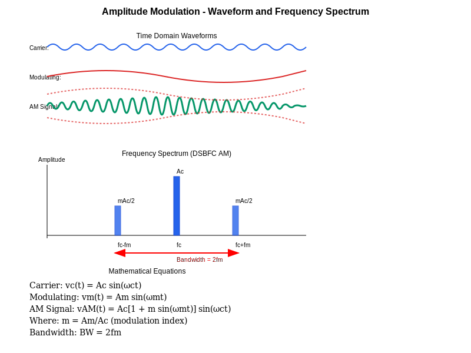
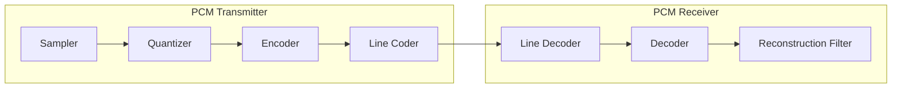
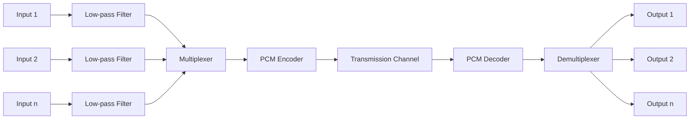
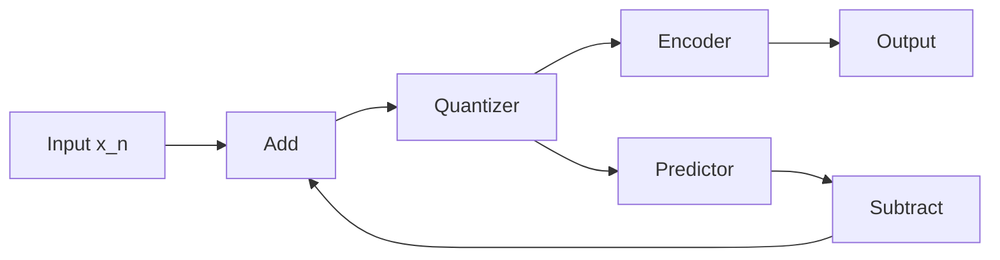
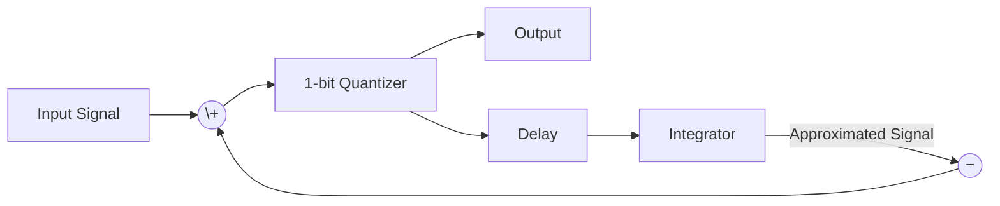
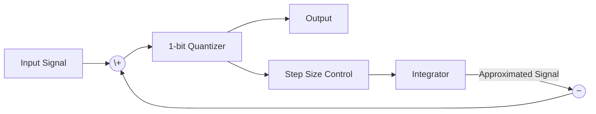

## પ્રશ્ન 1(અ) [3 ગુણ]

**મોડ્યુલેશનશું છે? તેની શું જરૂર છે?**

**જવાબ**:
મોડ્યુલેશન એ એક પ્રક્રિયા છે જેમાં માહિતી ધરાવતા મોડ્યુલેટિંગ સિગ્નલ દ્વારા ઉચ્ચ આવૃત્તિના કેરિયર સિગ્નલના એક અથવા વધુ ગુણધર્મોમાં ફેરફાર કરવામાં આવે છે.

**કોષ્ટક: મોડ્યુલેશનની જરૂરિયાત**

| કારણ | સમજૂતી |
|--------|-------------|
| એન્ટેના સાઇઝ | એન્ટેનાના કદની જરૂરિયાતો ઘટાડે છે (λ = c/f) |
| મલ્ટિપ્લેક્સિંગ | ઘણા સિગ્નલોને સ્પેક્ટ્રમ શેર કરવાની મંજૂરી આપે છે |
| રેન્જ | ટ્રાન્સમિશન અંતર વધારે છે |
| ઇન્ટરફેરન્સ | નોઇઝ ઇન્ટરફેરન્સ ઘટાડે છે |

- **વ્યવહારુ ટ્રાન્સમિશન**: ઓછી આવૃત્તિના માહિતી સિગ્નલને વાયરલેસ ટ્રાન્સમિશન માટે યોગ્ય બનાવે છે
- **સિગ્નલ અલગીકરણ**: વિવિધ સિગ્નલોને એકસાથે ટ્રાન્સમિટ કરવા સક્ષમ બનાવે છે

**મેમરી ટ્રીક:** "RARE Messages" (Range, Antenna, Reduce interference, Enable multiplexing)

## પ્રશ્ન 1(બ) [4 ગુણ]

**AM અને FM ની સરખામણી કરો.**

**જવાબ**:

**કોષ્ટક: AM અને FM વચ્ચેનો તફાવત**

| પરિમાણ | AM (એમ્પલિટ્યૂડ મોડ્યુલેશન) | FM (ફ્રિક્વન્સી મોડ્યુલેશન) |
|-----------|---------------------------|----------------------------|
| બદલાતો પરિમાણ | કેરિયરની એમ્પલિટ્યૂડ | કેરિયરની આવૃત્તિ |
| બેન્ડવિડ્થ | સાંકડી (2 × fm) | વિશાળ (2 × mf × fm) |
| નોઇઝ પ્રતિરક્ષા | નબળી | ઉત્તમ |
| પાવર કાર્યક્ષમતા | ઓછી કાર્યક્ષમ | વધુ કાર્યક્ષમ |
| સર્કિટ જટિલતા | સરળ | જટિલ |
| ગુણવત્તા | મધ્યમ | ઉચ્ચ |
| ઉપયોગો | મધ્યમ વેવ બ્રોડકાસ્ટિંગ | હાઈ-ફિડેલિટી બ્રોડકાસ્ટિંગ |

**મેમરી ટ્રીક:** "BANC-QA" (Bandwidth, Amplitude/frequency, Noise, Complexity, Quality, Applications)

## પ્રશ્ન 1(ક) [7 ગુણ]

**AM મોડ્યુલેશન વેવફોર્મ સાથે સમજાવો અને મોડ્યુલેટેડ સિગ્નલ માટે વોલ્ટેજ સમીકરણ મેળવો. DSBFC AM ફ્રીક્વન્સી સ્પેક્ટ્રમ દોરો.**

**જવાબ**:

એમ્પલિટ્યૂડ મોડ્યુલેશન (AM) એ એક તકનીક છે જેમાં કેરિયર વેવની એમ્પલિટ્યૂડ મોડ્યુલેટિંગ સિગ્નલની તત્કાલીન એમ્પલિટ્યૂડના પ્રમાણમાં બદલાય છે.

**વોલ્ટેજ સમીકરણ:**

- કેરિયર સિગ્નલ: v₁(t) = A₁ sin(ωct)
- મોડ્યુલેટિંગ સિગ્નલ: v₂(t) = A₂ sin(ωmt)
- મોડ્યુલેટેડ સિગ્નલ: v(t) = A₁[1 + m sin(ωmt)] sin(ωct)
- જ્યાં m = A₂/A₁ (મોડ્યુલેશન ઇન્ડેક્સ)

**આકૃતિ: AM વેવફોર્મ**



**DSBFC AM નું ફ્રિક્વન્સી સ્પેક્ટ્રમ**


- **બેન્ડવિડ્થ**: AM સિગ્નલની બેન્ડવિડ્થ 2 × fm છે
- **સાઇડબેન્ડ્સ**: અપર સાઇડબેન્ડ (USB) fc+fm પર અને લોઅર સાઇડબેન્ડ (LSB) fc-fm પર
- **પાવર વિતરણ**: કેરિયર અને બે સાઇડબેન્ડસમાં

**મેમરી ટ્રીક:** "CAM-SIP" (Carrier Amplitude Modified, Sidebands In Pair)

## પ્રશ્ન 1(ક) OR [7 ગુણ]

**AM માં કુલ પાવર માટે સમીકરણ મેળવો, DSB અને SSB માં પાવર બચતની ટકાવારીની ગણતરી કરો.**

**જવાબ**:

**AM માં કુલ પાવરનું વ્યુત્પાદન:**

- AM સિગ્નલ: v(t) = A₁[1 + m sin(ωmt)] sin(ωct)
- કુલ પાવર: P = P₍carrier₎ + P₍sidebands₎
- P₍carrier₎ = A₁²/2
- P₍sidebands₎ = A₁²m²/4

**કોષ્ટક: AM માં પાવર વિતરણ**

| ઘટક | પાવર સમીકરણ | કુલ પાવરની % (m=1) |
|-----------|------------------|------------------------|
| કેરિયર | P₍c₎ = A₁²/2 | 66.67% |
| સાઇડબેન્ડ્સ | P₍s₎ = A₁²m²/4 | 33.33% |
| કુલ | P₍t₎ = A₁²(1+m²/2)/2 | 100% |

**પાવર બચત:**

- **DSB-SC**: 100% કેરિયર પાવર બચે (કુલ પાવરનો 66.67%)
  - માત્ર સાઇડબેન્ડ્સ ટ્રાન્સમિટ થાય છે
  - ટકાવારી બચત = (P₍c₎/P₍t₎) × 100 = 66.67%

- **SSB**: 50% સાઇડબેન્ડ પાવર + 100% કેરિયર પાવર બચે
  - એક સાઇડબેન્ડ + કેરિયર દૂર કરેલ છે
  - ટકાવારી બચત = (P₍c₎ + P₍s₎/2)/P₍t₎ × 100 = 83.33%

**આકૃતિ: પાવર વિતરણ**


**મેમરી ટ્રીક:** "CAST-83" (Carrier And Sideband Transmission, 83% saved in SSB)

## પ્રશ્ન 2(અ) [3 ગુણ]

**વ્યાખ્યાયિત કરો (1) AM માટે મોડ્યુલેશન ઇન્ડેક્સ (2) FM માટે મોડ્યુલેશન ઇન્ડેક્સ.**

**જવાબ**:

**કોષ્ટક: મોડ્યુલેશન ઇન્ડેક્સની વ્યાખ્યાઓ**

| પરિમાણ | AM મોડ્યુલેશન ઇન્ડેક્સ | FM મોડ્યુલેશન ઇન્ડેક્સ |
|-----------|---------------------|---------------------|
| વ્યાખ્યા | મોડ્યુલેટિંગ સિગ્નલની મહત્તમ એમ્પલિટ્યૂડનો કેરિયરની મહત્તમ એમ્પલિટ્યૂડ સાથેનો ગુણોત્તર | ફ્રિક્વન્સી વિચલનનો મોડ્યુલેટિંગ ફ્રિક્વન્સી સાથેનો ગુણોત્તર |
| સૂત્ર | m = Am/Ac | mf = Δf/fm |
| મર્યાદા | 0 ≤ m ≤ 1 (વિકૃતિ ટાળવા માટે) | કોઈ ચોક્કસ ઉપરી મર્યાદા નથી |
| અસર | એમ્પલિટ્યૂડ વેરિએશન અને પાવર વિતરણ નિયંત્રિત કરે છે | બેન્ડવિડ્થ અને સિગ્નલ ગુણવત્તા નક્કી કરે છે |

- **AM મોડ્યુલેશન ઇન્ડેક્સ**: એમ્પલિટ્યૂડ વેરિએશન અને પાવર વિતરણ નિયંત્રિત કરે છે
- **FM મોડ્યુલેશન ઇન્ડેક્સ**: બેન્ડવિડ્થ અને સિગ્નલ ગુણવત્તા નિર્ધારિત કરે છે

**મેમરી ટ્રીક:** "ARM-FDM" (Amplitude Ratio for Modulation, Frequency Deviation for Modulation)

## પ્રશ્ન 2(બ) [4 ગુણ]

**એન્વેલપ ડિટેક્ટર માટે બ્લોક ડાયાગ્રામ દોરો અને સમજાવો.**

**જવાબ**:

**આકૃતિ: એન્વેલપ ડિટેક્ટર**


**કોષ્ટક: ઘટકો અને તેમના કાર્યો**

| ઘટક | કાર્ય |
|-----------|----------|
| ડાયોડ | AM સિગ્નલનું રેક્ટિફિકેશન કરે છે (નકારાત્મક અર્ધ-ચક્રો દૂર કરે છે) |
| RC ફિલ્ટર | રેક્ટિફાઇડ સિગ્નલને સ્મૂધ કરીને એન્વેલપ રિકવર કરે છે |
| લોડ | આઉટપુટ સર્કિટ અને ઇમ્પિડન્સ મેચિંગ પ્રદાન કરે છે |

- **કાર્યપ્રણાલી**: ડાયોડ માત્ર પોઝિટિવ અર્ધ-ચક્રો દરમિયાન કન્ડક્ટ કરે છે
- **સમય અચળાંક**: RC એટલું મોટું હોવું જોઈએ કે રિપલ ન આવે પરંતુ મોડ્યુલેશનને અનુસરવા માટે પૂરતું નાનું હોવું જોઈએ
- **શરત**: RC >> 1/fc પરંતુ RC << 1/fm

**મેમરી ટ્રીક:** "DEER" (Diode Extracts Envelope Representation)

## પ્રશ્ન 2(ક) [7 ગુણ]

**FM રેડિયો રીસીવરનો બ્લોક ડાયાગ્રામ દોરો અને દરેક બ્લોકની કામગીરી સમજાવો.**

**જવાબ**:

**આકૃતિ: FM રેડિયો રીસીવર**


**કોષ્ટક: દરેક બ્લોકનાં કાર્યો**

| બ્લોક | કાર્ય |
|-------|----------|
| એન્ટેના | ઇલેક્ટ્રોમેગ્નેટિક તરંગો મેળવે છે |
| RF એમ્પ્લિફાયર | નબળા RF સિગ્નલ્સ (88-108 MHz) એમ્પ્લિફાય કરે છે |
| મિક્સર | RF ને IF ફ્રિક્વન્સી (10.7 MHz) માં કન્વર્ટ કરે છે |
| લોકલ ઓસિલેટર | મિક્સિંગ માટે ફ્રિક્વન્સી જનરેટ કરે છે (RF+10.7 MHz) |
| IF એમ્પ્લિફાયર | IF સિગ્નલને ફિક્સ્ડ ગેઈન સાથે એમ્પ્લિફાય કરે છે |
| લિમિટર | એમ્પલિટ્યૂડ વેરિએશન્સ દૂર કરે છે |
| FM ડિસ્ક્રિમિનેટર | ફ્રિક્વન્સી વેરિએશન્સને વોલ્ટેજમાં કન્વર્ટ કરે છે |
| ઓડિયો એમ્પ્લિફાયર | રિકવર્ડ ઓડિયો એમ્પ્લિફાય કરે છે |
| સ્પીકર | ઇલેક્ટ્રિકલ થી સાઉન્ડ વેવ્સમાં કન્વર્ટ કરે છે |

- **સુપરહેટરોડાઈન પ્રિન્સિપલ**: ફિક્સ્ડ IF પર સિગ્નલ પ્રોસેસ કરવા ફ્રિક્વન્સી કન્વર્ઝન વાપરે છે
- **વિશિષ્ટ FM ફીચર**: લિમિટર ડિમોડ્યુલેશન પહેલા એમ્પલિટ્યૂડમાં નોઈઝ દૂર કરે છે

**મેમરી ટ્રીક:** "RAMLIDASS" (RF, Amplifier, Mixer, Local oscillator, IF, Discriminator, Audio, Speaker System)

## પ્રશ્ન 2(અ) OR [3 ગુણ]

**ફ્રીક્વન્સી મોડ્યુલેશન અને ફેઝ મોડ્યુલેશન માટે માત્ર વેવફોર્મ દોરો.**

**જવાબ**:

**આકૃતિ: FM અને PM વેવફોર્મ્સ**



**મુખ્ય લક્ષણો:**

- **FM**: જ્યારે મોડ્યુલેટિંગ સિગ્નલ પોઝિટિવ હોય ત્યારે ફ્રિક્વન્સી વધે છે
- **PM**: ફેઝ એમ્પલિટ્યૂડ પરિવર્તન સાથે તરત જ શિફ્ટ થાય છે

**મેમરી ટ્રીક:** "FIP-PAF" (Frequency Increases with Positive signal, Phase Advances with Faster changes)

## પ્રશ્ન 2(બ) OR [4 ગુણ]

**રેડિયો રીસીવરની કોઈ પણ ચાર લાક્ષણિકતાઓને વ્યાખ્યાયિત કરો.**

**જવાબ**:

**કોષ્ટક: રેડિયો રીસીવરની લાક્ષણિકતાઓ**

| લાક્ષણિકતા | વ્યાખ્યા |
|----------------|------------|
| સેન્સિટિવિટી | નબળા સિગ્નલ્સ મેળવવાની ક્ષમતા (μV અથવા dBm માં માપવામાં આવે છે) |
| સિલેક્ટિવિટી | ઇચ્છિત સિગ્નલને આસપાસના ચેનલોથી અલગ કરવાની ક્ષમતા |
| ફિડેલિટી | મૂળ મોડ્યુલેટિંગ સિગ્નલને સચોટતાથી પુનઃઉત્પન્ન કરવાની ક્ષમતા |
| ઈમેજ રિજેક્શન | ઈમેજ ફ્રિક્વન્સી ઇન્ટરફેરન્સને અસ્વીકાર કરવાની ક્ષમતા |

**વધારાની લાક્ષણિકતાઓ:**

- **સિગ્નલ-ટુ-નોઈઝ રેશિયો**: સિગ્નલ પાવરનો નોઈઝ પાવર સાથેનો ગુણોત્તર
- **બેન્ડવિડ્થ**: મેળવી શકાય તેવી ફ્રિક્વન્સીઓની રેન્જ
- **સ્ટેબિલિટી**: ટ્યૂન કરેલી ફ્રિક્વન્સી જાળવી રાખવાની ક્ષમતા

**મેમરી ટ્રીક:** "SFIS-BSS" (Sensitivity, Fidelity, Image rejection, Selectivity - Better Signal Stability)

## પ્રશ્ન 2(ક) OR [7 ગુણ]

**AM રેડિયો રીસીવરનો બ્લોક ડાયાગ્રામ દોરો અને દરેક બ્લોકની કામગીરી સમજાવો.**

**જવાબ**:

**આકૃતિ: AM રેડિયો રીસીવર**


**કોષ્ટક: દરેક બ્લોકનાં કાર્યો**

| બ્લોક | કાર્ય |
|-------|----------|
| એન્ટેના | AM રેડિયો તરંગો પકડે છે |
| RF ટ્યૂનર & એમ્પ્લિફાયર | ઇચ્છિત ફ્રિક્વન્સી પસંદ કરે અને એમ્પ્લિફાય કરે છે |
| મિક્સર | RF સિગ્નલને IF (455 kHz) માં કન્વર્ટ કરે છે |
| લોકલ ઓસિલેટર | મિક્સિંગ માટે ફ્રિક્વન્સી જનરેટ કરે છે (RF+455 kHz) |
| IF એમ્પ્લિફાયર | ફિક્સ્ડ સિલેક્ટિવિટી સાથે IF સિગ્નલ એમ્પ્લિફાય કરે છે |
| ડિટેક્ટર | AM એન્વેલપમાંથી ઓડિયો રિકવર કરે છે |
| AGC | ઓટોમેટિક ગેઈન કંટ્રોલ પ્રદાન કરે છે |
| ઓડિયો એમ્પ્લિફાયર | ઓડિયો સિગ્નલ એમ્પ્લિફાય કરે છે |
| સ્પીકર | ઇલેક્ટ્રિકલ થી સાઉન્ડ વેવ્સમાં કન્વર્ટ કરે છે |

- **સુપરહેટરોડાઈન પ્રિન્સિપલ**: બેટર સિલેક્ટિવિટી માટે ફ્રિક્વન્સી કન્વર્ઝન વાપરે છે
- **AGC ફીડબેક લૂપ**: સિગ્નલ સ્ટ્રેન્થના ફેરફાર છતાં કોન્સ્ટન્ટ આઉટપુટ જાળવે છે

**મેમરી ટ્રીક:** "ARMLESS" (Antenna, RF, Mixer, Local oscillator, Envelope detector, Sound System)

## પ્રશ્ન 3(અ) [3 ગુણ]

**Quantization વ્યાખ્યાયિત કરો. Non uniform quantization સંક્ષિપ્તમાં સમજાવો.**

**જવાબ**:

**ક્વોન્ટાઇઝેશન** એ સતત એમ્પલિટ્યૂડ મૂલ્યોને ડિજિટલ રજૂઆત માટે ડિસ્ક્રીટ લેવલમાં કન્વર્ટ કરવાની પ્રક્રિયા છે.

**કોષ્ટક: નોન-યુનિફોર્મ ક્વોન્ટાઇઝેશન**

| પાસું | વર્ણન |
|--------|-------------|
| વ્યાખ્યા | વિવિધ એમ્પલિટ્યૂડ રેન્જ માટે વિવિધ સ્ટેપ સાઇઝ ફાળવવી |
| ફાયદો | નાના એમ્પલિટ્યૂડ સિગ્નલ્સ માટે ક્વોન્ટાઇઝેશન નોઇઝ ઘટાડે છે |
| અમલીકરણ | કોમ્પેન્ડિંગ (કોમ્પ્રેશન-એક્સપાન્શન) તકનીકોનો ઉપયોગ |
| ઉદાહરણ | ટેલિફોનીમાં વપરાતા μ-law અને A-law કોમ્પેન્ડિંગ |

- **કાર્યસિદ્ધાંત**: ઓછા એમ્પલિટ્યૂડ માટે નાના સ્ટેપ સાઇઝ, ઉચ્ચ એમ્પલિટ્યૂડ માટે મોટા સ્ટેપ
- **અસર**: મજબૂત સિગ્નલ્સના ખર્ચે નબળા સિગ્નલ્સ માટે SNR સુધારે છે

**મેમરી ટ્રીક:** "QUEST-CS" (QUantization with Enhanced Steps - Compressing Small signals)

## પ્રશ્ન 3(બ) [4 ગુણ]

**Sample and Hold સર્કિટ વેવફોર્મ સાથે સમજાવો.**

**જવાબ**:

**આકૃતિ: સેમ્પલ અને હોલ્ડ સર્કિટ**

```goat
    Analog       ┌────────┐      Sampled
    Input ───────│Sample &│─────→Output
                 │ Hold   │
                 └───┬────┘
                     │
    Clock ───────────┘
```

**આકૃતિ: સેમ્પલ અને હોલ્ડ વેવફોર્મ**

```goat
Analog Signal
     /\      /\
    /  \    /  \
   /    \  /    \
  /      \/      \

Clock Pulses
  _   _   _   _   _
 | | | | | | | | | |
 | | | | | | | | | |
 |_| |_| |_| |_| |_|

Sampled Output
     __      __
    |  |    |  |
   _|  |____/  |___
  /                \
```

**સેમ્પલ અને હોલ્ડ ઓપરેશન:**

- **સેમ્પલિંગ મોડ**: સ્વિચ બંધ થાય છે, કેપેસિટર ઇનપુટ વોલ્ટેજ પર ચાર્જ થાય છે
- **હોલ્ડ મોડ**: સ્વિચ ખુલે છે, કેપેસિટર વોલ્ટેજ જાળવે છે
- **પરિમાણો**: એક્વિઝિશન ટાઇમ, એપર્ચર ટાઇમ, હોલ્ડ ટાઇમ, ડ્રૂપ રેટ

**મેમરી ટ્રીક:** "CHASED" (Capacitor Holds Amplitude Samples for Extended Duration)

## પ્રશ્ન 3(ક) [7 ગુણ]

**સેમ્પલિંગ શું છે? સેમ્પલિંગ પ્રકારો સમજાવો.**

**જવાબ**:

**સેમ્પલિંગ** એ કન્ટિન્યુઅસ-ટાઇમ સિગ્નલને નિયમિત અંતરાલે માપ લઈને ડિસ્ક્રીટ-ટાઇમ સિગ્નલમાં રૂપાંતરિત કરવાની પ્રક્રિયા છે.

**કોષ્ટક: સેમ્પલિંગના પ્રકારો**

| પ્રકાર | વર્ણન | લક્ષણો |
|------|-------------|----------------|
| નેચરલ સેમ્પલિંગ | સિગ્નલને રેક્ટેન્ગ્યુલર પલ્સ સાથે ગુણાકાર કરવામાં આવે છે | પલ્સ દરમિયાન મૂળ સિગ્નલની આકૃતિ જાળવે છે |
| ફ્લેટ-ટોપ સેમ્પલિંગ | સેમ્પલ મૂલ્ય સેમ્પલિંગ અંતરાલ દરમિયાન અચળ રહે છે | સ્ટેરકેસ જેવો આઉટપુટ બનાવે છે |
| આદર્શ સેમ્પલિંગ | તાત્કાલિક નમૂનાઓ ઇમ્પલ્સ તરીકે રજૂ થાય છે | શૂન્ય પહોળાઈવાળા પલ્સ સાથે સૈદ્ધાંતિક ખ્યાલ |
| યુનિફોર્મ સેમ્પલિંગ | સમાન સમય અંતરાલે લેવાતા નમૂનાઓ | વ્યવહારમાં સૌથી સામાન્ય |
| નોન-યુનિફોર્મ સેમ્પલિંગ | બદલાતા અંતરાલે લેવાતા નમૂનાઓ | વિશેષ ઉપયોગો માટે વપરાય છે |

**આકૃતિ: સેમ્પલિંગ પ્રકારો**

```goat
Original Signal
     /\      /\
    /  \    /  \
   /    \  /    \
  /      \/      \

Natural Sampling
   _     _     _ 
  | |   | |   | |
  | |/\ | |   | |/\
  |/  \| |   |/  \|

Flat-top Sampling
   ___    ___    
  |   |  |   |   
  |   |__|   |___
```

- **નાયક્વિસ્ટ ક્રાઇટેરિયા**: સેમ્પલિંગ ફ્રિક્વન્સી સિગ્નલમાં સર્વોચ્ચ ફ્રિક્વન્સીના ઓછામાં ઓછી બે ગણી હોવી જોઈએ

**મેમરી ટ્રીક:** "INFUN" (Ideal, Natural, Flat-top, Uniform, Non-uniform)

## પ્રશ્ન 3(અ) OR [3 ગુણ]

**Quantization પ્રક્રિયા અને તેની આવશ્યકતા સમજાવો.**

**જવાબ**:

**ક્વોન્ટાઇઝેશન પ્રક્રિયા** સતત એમ્પલિટ્યૂડ મૂલ્યોને ડિજિટલ રજૂઆત માટે મર્યાદિત ડિસ્ક્રીટ લેવલમાં મેપ કરે છે.

**કોષ્ટક: ક્વોન્ટાઇઝેશન પ્રક્રિયા અને આવશ્યકતા**

| પાસું | વર્ણન |
|--------|-------------|
| પ્રક્રિયા | એમ્પલિટ્યૂડ રેન્જને ડિસ્ક્રીટ લેવલમાં વિભાજીત કરવી |
| આવશ્યકતા | એનાલોગ-ટુ-ડિજિટલ કન્વર્ઝન માટે જરૂરી |
| અસર | ક્વોન્ટાઇઝેશન એરર/નોઇઝ દાખલ કરે છે |
| પરિમાણો | સ્ટેપ સાઇઝ, લેવલની સંખ્યા (n-બિટ માટે 2ⁿ) |

- **સ્ટેપ સાઇઝ ગણતરી**: સ્ટેપ સાઇઝ = (Vmax - Vmin)/2ⁿ
- **ક્વોન્ટાઇઝેશન એરર**: મહત્તમ એરર ±Q/2 છે જ્યાં Q સ્ટેપ સાઇઝ છે
- **ઉપયોગો**: ડિજિટલ કોમ્યુનિકેશન, ઓડિયો/વિડિઓ પ્રોસેસિંગ, ડેટા સ્ટોરેજ

**મેમરી ટ્રીક:** "SEND" (Step-size Establishes Noise in Digitization)

## પ્રશ્ન 3(બ) OR [4 ગુણ]

**સિગ્નલના નમૂના લેવા માટે Nyquist માપદંડ જણાવો અને સમજાવો.**

**જવાબ**:

**નાયક્વિસ્ટ સેમ્પલિંગ થિયરમ** જણાવે છે કે બેન્ડલિમિટેડ સિગ્નલને સંપૂર્ણ રીતે પુનઃનિર્માણ કરવા માટે, સેમ્પલિંગ ફ્રિક્વન્સી સિગ્નલમાં સર્વોચ્ચ ફ્રિક્વન્સી ઘટકના ઓછામાં ઓછી બે ગણી હોવી જોઈએ.

**કોષ્ટક: નાયક્વિસ્ટ માપદંડ**

| પરિમાણ | વર્ણન |
|-----------|-------------|
| માપદંડ | fs ≥ 2fmax |
| નાયક્વિસ્ટ રેટ | 2fmax (લઘુત્તમ સેમ્પલિંગ ફ્રિક્વન્સી) |
| નાયક્વિસ્ટ ઇન્ટરવલ | 1/(2fmax) (મહત્તમ સેમ્પલિંગ પીરિયડ) |
| એલિયાસિંગ | જ્યારે fs < 2fmax થાય ત્યારે ઉદ્ભવે છે |

**આકૃતિ: સેમ્પલિંગની અસરો**

```goat
    Proper Sampling (fs > 2fmax)
    Original: /\/\/\/\
    Samples:  * * * * * * * *
    Result:   /\/\/\/\

    Aliasing (fs < 2fmax)
    Original: /\/\/\/\/\/\/\
    Samples:  *   *   *   *
    Result:   /\/\    (lower frequency)
```

- **અન્ડરસેમ્પલિંગના પરિણામો**: એલિયાસિંગ (ફ્રિક્વન્સી ફોલ્ડિંગ)
- **વ્યવહારિક ઉપયોગ**: સેમ્પલિંગ પહેલા એન્ટી-એલિયાસિંગ ફિલ્ટર્સનો ઉપયોગ

**મેમરી ટ્રીક:** "TRAP-A" (Twice Rate Avoids Problematic Aliasing)

## પ્રશ્ન 3(ક) OR [7 ગુણ]

**PAM, PWM અને PPM વેવફોર્મ સાથે સમજાવો.**

**જવાબ**:

**કોષ્ટક: પલ્સ મોડ્યુલેશન તકનીકો**

| તકનીક | વર્ણન | બદલાતો પરિમાણ | ઉપયોગ |
|-----------|-------------|------------------|-------------|
| PAM | પલ્સ એમ્પલિટ્યૂડ મોડ્યુલેશન | પલ્સની એમ્પલિટ્યૂડ | સિમ્પલ ADC સિસ્ટમ્સ |
| PWM | પલ્સ વિડ્થ મોડ્યુલેશન | પલ્સની પહોળાઈ/સમયગાળો | મોટર કંટ્રોલ, પાવર રેગ્યુલેશન |
| PPM | પલ્સ પોઝિશન મોડ્યુલેશન | પલ્સની સ્થિતિ/ટાઇમિંગ | હાઈ નોઇઝ ઇમ્યુનિટી સિસ્ટમ્સ |

**આકૃતિ: પલ્સ મોડ્યુલેશન વેવફોર્મ્સ**

```goat
Modulating Signal
    /\        /\
   /  \      /  \
  /    \    /    \
 /      \  /      \

PAM
  |  |    |  |    |  |
  |  |    |  |    |  |
  |  |    |  |    |  |
  █  █    █  █    █  █

PWM
  █████    ███    █████
  |    |   | |    |    |
  |    |   | |    |    |
  |    |   | |    |    |

PPM
  █ █ █ █ █ █ █ █
  | | | | | | | |
  | | | | | | | |
  | | | | | | | |
```

- **PAM**: સૌથી સરળ સ્વરૂપ, નોઇઝના સૌથી વધુ સંવેદનશીલ
- **PWM**: બેહતર નોઇઝ ઇમ્યુનિટી, સરળ જનરેશન
- **PPM**: શ્રેષ્ઠ નોઇઝ ઇમ્યુનિટી, ચોક્કસ ટાઇમિંગની જરૂર છે

**મેમરી ટ્રીક:** "AWP-PAW" (Amplitude, Width, Position - Pulse Alteration Ways)

## પ્રશ્ન 4(અ) [3 ગુણ]

**ડેલ્ટા મોડયુલેશન માટે સ્લોપ ઓવરલોડ અને ગ્રૅનુલરનોઈઝ એટલે શું?**

**જવાબ**:

**કોષ્ટક: ડેલ્ટા મોડ્યુલેશનમાં નોઇઝના પ્રકારો**

| નોઇઝ પ્રકાર | વ્યાખ્યા | કારણ | ઉપાય |
|------------|------------|-------|----------|
| સ્લોપ ઓવરલોડ નોઇઝ | જ્યારે સિગ્નલ સ્લોપ સ્ટેપ સાઇઝ ક્ષમતાને ઓળંગી જાય ત્યારે થતી ભૂલ | ઝડપી બદલાતા સિગ્નલ માટે સ્ટેપ સાઇઝ ખૂબ નાની | સ્ટેપ સાઇઝ અથવા સેમ્પલિંગ ફ્રિક્વન્સી વધારવી |
| ગ્રેન્યુલર નોઇઝ | ધીમી ગતિએ બદલાતા સિગ્નલોની આસપાસ સતત હંટિંગને કારણે થતી ભૂલ | ધીમી ગતિએ બદલાતા સિગ્નલો માટે સ્ટેપ સાઇઝ ખૂબ મોટી | સ્ટેપ સાઇઝ ઘટાડવી |

**આકૃતિ: DM નોઇઝ પ્રકારો**

```goat
Slope Overload:
  Actual  /‾‾‾‾
         /
        /
       /      
   ___/       
  /
 /  DM Output (steps can't keep up)

Granular Noise:
  Actual  _________
         
   /‾\/‾\/‾\/‾\/‾\  DM Output (continuous zigzag)
```

**મેમરી ટ્રીક:** "FAST-SLOW" (Fast signals cause Slope overload, SLOW signals cause Granular noise)

## પ્રશ્ન 4(બ) [4 ગુણ]

**TDM ફ્રેમ દોરો અને સમજાવો.**

**જવાબ**:

**આકૃતિ: TDM ફ્રેમ સ્ટ્રક્ચર**

```goat
    ┌───────────────────────────────────┐
    │ FS │ CH1 │ CH2 │ CH3 │...│ CHn │ FS │
    └───────────────────────────────────┘
       |    |     |     |        |     |
       |    |     |     |        |     └── Frame Sync for next frame
       |    |     |     |        └──────── Last channel sample
       |    |     |     └──────────────── Channel 3 sample
       |    |     └───────────────────── Channel 2 sample
       |    └─────────────────────────── Channel 1 sample
       └────────────────────────────────── Frame Synchronization
```

**કોષ્ટક: TDM ફ્રેમ ઘટકો**

| ઘટક | વર્ણન |
|-----------|-------------|
| ફ્રેમ સિન્ક (FS) | ફ્રેમની શરૂઆતને ચિહ્નિત કરતો પેટર્ન |
| ટાઇમ સ્લોટ | એક ચેનલને ફાળવેલો ભાગ |
| ચેનલ સેમ્પલ | ચોક્કસ ચેનલના ડેટા |
| ફ્રેમ લંબાઈ | કુલ સમયગાળો (FS + બધી ચેનલો) |

- **કાર્યસિદ્ધાંત**: વિવિધ ચેનલોને વિવિધ ટાઇમ સ્લોટ ફાળવે છે
- **સિન્ક્રોનાઇઝેશન**: યોગ્ય ડિમલ્ટિપ્લેક્સિંગ માટે આવશ્યક છે
- **પ્રકારો**: સિન્ક્રોનસ TDM (ફિક્સ્ડ સ્લોટ્સ) અને સ્ટેટિસ્ટિકલ TDM (ડાયનેમિક એલોકેશન)

**મેમરી ટ્રીક:** "FAST-Ch" (Frame And Slots for Transmitting Channels)

## પ્રશ્ન 4(ક) [7 ગુણ]

**PCM ટ્રાન્સમીટર અને રીસીવરના દરેક બ્લોકના કાર્યનું વર્ણન કરો, PCM સિસ્ટમનો ઉપયોગીતા, ફાયદા અને નુકસાન આપો.**

**જવાબ**:

**આકૃતિ: PCM સિસ્ટમ**



**કોષ્ટક: PCM બ્લોક કાર્યો**

| બ્લોક | કાર્ય |
|-------|----------|
| સેમ્પલર | એનાલોગ સિગ્નલને PAM સિગ્નલમાં રૂપાંતરિત કરે છે |
| ક્વોન્ટાઇઝર | સેમ્પલ્સને ડિસ્ક્રીટ લેવલ ફાળવે છે |
| એન્કોડર | ક્વોન્ટાઇઝ્ડ લેવલને બાઇનરી કોડમાં રૂપાંતરિત કરે છે |
| લાઇન કોડર | બાઇનરીને ટ્રાન્સમિશન ફોર્મેટમાં કન્વર્ટ કરે છે |
| લાઇન ડિકોડર | મળેલા સિગ્નલમાંથી બાઇનરી પુનઃપ્રાપ્ત કરે છે |
| ડિકોડર | બાઇનરીને ક્વોન્ટાઇઝ્ડ લેવલમાં પાછું કન્વર્ટ કરે છે |
| રિકન્સ્ટ્રક્શન ફિલ્ટર | ડિકોડેડ આઉટપુટને એનાલોગ સિગ્નલમાં સ્મૂધ કરે છે |

**એપ્લિકેશન્સ, ફાયદા અને ગેરફાયદા:**

**કોષ્ટક: PCM સિસ્ટમની લાક્ષણિકતાઓ**

| શ્રેણી | વર્ણન |
|----------|-------------|
| એપ્લિકેશન્સ | ટેલિફોન સિસ્ટમ, CD ઓડિયો, ડિજિટલ TV, મોબાઇલ કોમ્યુનિકેશન |
| ફાયદા | નોઇઝથી સુરક્ષિત, સિગ્નલ રિજનરેશન શક્ય, ડિજિટલ સિસ્ટમ સાથે સુસંગત |
| ગેરફાયદા | વધુ બેન્ડવિડ્થની જરૂર, વધુ જટિલતા, ક્વોન્ટાઇઝેશન નોઇઝ |

**મેમરી ટ્રીક:** "SEQUEL-DR" (Sample, Quantize, Encode - Line code, Decode, Reconstruct)

## પ્રશ્ન 4(અ) OR [3 ગુણ]

**DM અને ADM મોડ્યુલેશન વચ્ચે તફાવત આપો.**

**જવાબ**:

**કોષ્ટક: DM અને ADM વચ્ચેની તુલના**

| પરિમાણ | ડેલ્ટા મોડ્યુલેશન (DM) | એડેપ્ટિવ ડેલ્ટા મોડ્યુલેશન (ADM) |
|-----------|----------------------|--------------------------------|
| સ્ટેપ સાઇઝ | ફિક્સ્ડ | વેરિએબલ (સિગ્નલ સ્લોપને અનુકૂળ) |
| ટ્રેકિંગ ક્ષમતા | મર્યાદિત | બેહતર સિગ્નલ ટ્રેકિંગ |
| નોઇઝ પરફોર્મન્સ | સ્લોપ ઓવરલોડ અને ગ્રેન્યુલર નોઇઝથી પીડાય છે | ઓછી નોઇઝ સમસ્યાઓ |
| જટિલતા | સરળ | વધુ જટિલ |

**આકૃતિ: DM વિરુદ્ધ ADM ટ્રેકિંગ**

```goat
Input Signal:   /‾‾‾‾\
               /      \
              /        \
             /          \

DM Output:   /‾\/‾\/‾\
            /         \/‾\/‾\

ADM Output: /‾‾\/‾‾‾\
           /         \‾‾\/‾‾\
           (larger steps for steep slopes)
```

**મેમરી ટ્રીક:** "FAST-VAR" (Fixed And Simple Tracking vs Variable Adaptive Response)

## પ્રશ્ન 4(બ) OR [4 ગુણ]

**મૂળભૂત PCM-TDM સિસ્ટમનો બ્લોક ડાયાગ્રામ સમજાવો.**

**જવાબ**:

**આકૃતિ: PCM-TDM સિસ્ટમ**



**કોષ્ટક: PCM-TDM સિસ્ટમ ઘટકો**

| ઘટક | કાર્ય |
|-----------|----------|
| લો-પાસ ફિલ્ટર | ઇનપુટ સિગ્નલોની બેન્ડવિડ્થ મર્યાદિત કરે છે |
| મલ્ટિપ્લેક્સર | ટાઇમ સ્લોટમાં ઘણા સિગ્નલો જોડે છે |
| PCM એન્કોડર | ડિજિટલમાં રૂપાંતરિત કરે છે (સેમ્પલ, ક્વોન્ટાઇઝ, એન્કોડ) |
| ટ્રાન્સમિશન ચેનલ | ડિજિટાઇઝ્ડ, મલ્ટિપ્લેક્સ્ડ સિગ્નલ વહન કરે છે |
| PCM ડિકોડર | ક્વોન્ટાઇઝ્ડ સેમ્પલ્સ પુનઃનિર્માણ કરે છે |
| ડિમલ્ટિપ્લેક્સર | ટાઇમ સ્લોટમાંથી ચેનલો અલગ કરે છે |

- **કાર્યસિદ્ધાંત**: ટાઇમ ડિવિઝન મલ્ટિપ્લેક્સિંગને પલ્સ કોડ મોડ્યુલેશન સાથે જોડે છે
- **એપ્લિકેશન્સ**: ડિજિટલ ટેલિફોની, ડિજિટલ ઓડિયો બ્રોડકાસ્ટિંગ, કોમ્યુનિકેશન નેટવર્ક્સ

**મેમરી ટ્રીક:** "FLIMPED" (Filter, Limit, Multiplex, PCM Encode, Decode)

## પ્રશ્ન 4(ક) OR [7 ગુણ]

**DPCM મોડ્યુલેટરને સમીકરણ અને વેવફોર્મ સાથે સમજાવો.**

**જવાબ**:

**ડિફરેન્શિયલ પલ્સ કોડ મોડ્યુલેશન (DPCM)** વર્તમાન સેમ્પલ અને અગાઉના સેમ્પલ્સના આધારે અનુમાનિત મૂલ્ય વચ્ચેના તફાવતને એન્કોડ કરે છે.

**સમીકરણ:**

- એરર સિગ્નલ: e(n) = x(n) - x̂(n)
- જ્યાં x(n) વર્તમાન સેમ્પલ છે, x̂(n) અનુમાનિત સેમ્પલ છે
- અનુમાન: x̂(n) = Σ(aᵢ × x(n-i))
- ટ્રાન્સમિટેડ સિગ્નલ: DPCM આઉટપુટ = Q[e(n)]

**આકૃતિ: DPCM મોડ્યુલેટર**



**આકૃતિ: DPCM વેવફોર્મ**

```goat
Original Samples:
  *   *   *   *   *
  |   |   |   |   |
  |   |   |   |   |
  |   |   |   |   |
  
Predicted Samples:
    o   o   o   o
    |   |   |   |
    |   |   |   |
    |   |   |   |
    
Difference (DPCM):
  ↕   ↕   ↕   ↕   ↕  (smaller values)
```

**કોષ્ટક: DPCM લાક્ષણિકતાઓ**

| ફીચર | વર્ણન |
|---------|-------------|
| ફાયદો | ઘટાડેલો બિટ રેટ (PCMની તુલનામાં 30-50%) |
| અનુમાન | વર્તમાન અનુમાન માટે અગાઉના સેમ્પલ(સ)નો ઉપયોગ |
| જટિલતા | PCM કરતાં વધુ પરંતુ ADPCM કરતાં ઓછી |
| એપ્લિકેશન | સ્પીચ કોડિંગ, ઇમેજ કોમ્પ્રેશન |

**મેમરી ટ્રીક:** "PQED" (Predict, Quantize Error, Encode Difference)

## પ્રશ્ન 5(અ) [3 ગુણ]

**એન્ટેના, રેડિયેશનપેટર્ન અને ધ્રુવીકરણ વ્યાખ્યાયિત કરો.**

**જવાબ**:

**કોષ્ટક: એન્ટેનાની વ્યાખ્યાઓ**

| શબ્દ | વ્યાખ્યા |
|------|------------|
| એન્ટેના | એક ઉપકરણ જે ઇલેક્ટ્રિકલ ઊર્જાને ઇલેક્ટ્રોમેગ્નેટિક તરંગમાં અને તેનાથી વિપરીત રૂપાંતરિત કરે છે |
| રેડિયેશન પેટર્ન | અવકાશ કોઓર્ડિનેટ્સના ફંકશન તરીકે એન્ટેનાના રેડિયેશન ગુણધર્મોનું ગ્રાફિકલ રજૂઆત |
| ધ્રુવીકરણ | એન્ટેના દ્વારા રેડિયેટ કરાયેલા ઇલેક્ટ્રોમેગ્નેટિક તરંગના ઇલેક્ટ્રિક ફીલ્ડ વેક્ટરની ઓરિએન્ટેશન |

**ધ્રુવીકરણના પ્રકારો:**

- **લિનિયર**: ઇલેક્ટ્રિક ફીલ્ડ એક દિશામાં આંદોલિત થાય છે (વર્ટિકલ, હોરિઝોન્ટલ)
- **સર્ક્યુલર**: ઇલેક્ટ્રિક ફીલ્ડ અચળ એમ્પલિટ્યૂડ સાથે ફરે છે (RHCP, LHCP)
- **ઇલિપ્ટિકલ**: ઇલેક્ટ્રિક ફીલ્ડ બદલાતી એમ્પલિટ્યૂડ સાથે ફરે છે

**મેમરી ટ્રીક:** "WAVE-PRO" (Wireless Antenna Validates Electromagnetic Propagation, Radiation, Orientation)

## પ્રશ્ન 5(બ) [4 ગુણ]

**માઇક્રોસ્ટ્રીપ એન્ટેના સ્કેચ સાથે સમજાવો.**

**જવાબ**:

**આકૃતિ: માઇક્રોસ્ટ્રીપ પેચ એન્ટેના**

```goat
    ┌───────────────────┐  ←Patch (radiating element)
    │                   │
    │                   │
    └───────────────────┘
    ┌───────────────────────────────┐
    │                               │  ←Dielectric substrate
    └───────────────────────────────┘
    ┌───────────────────────────────┐
    │                               │  ←Ground plane
    └───────────────────────────────┘
              │
              │ Feed point
              ▼
```

**કોષ્ટક: માઇક્રોસ્ટ્રીપ એન્ટેના ઘટકો**

| ઘટક | કાર્ય |
|-----------|----------|
| પેચ | રેડિયેટિંગ એલિમેન્ટ (સામાન્ય રીતે કોપર) |
| સબસ્ટ્રેટ | પેચ અને ગ્રાઉન્ડ વચ્ચેનું ડાઇલેક્ટ્રિક મટિરિયલ |
| ગ્રાઉન્ડ પ્લેન | તળિયે મેટલ લેયર |
| ફીડ પોઇન્ટ | સિગ્નલ માટે કનેક્શન પોઇન્ટ |

- **કાર્યસિદ્ધાંત**: ધારો પર ફ્રિન્જિંગ ફીલ્ડ્સ રેડિએશન ઉત્પન્ન કરે છે
- **ફાયદા**: લો પ્રોફાઇલ, હળવું વજન, સરળ ફેબ્રિકેશન, PCB સાથે સુસંગત
- **એપ્લિકેશન્સ**: મોબાઇલ ડિવાઇસ, સેટેલાઇટ, એરક્રાફ્ટ, RFID ટેગ્સ

**મેમરી ટ્રીક:** "SPGF" (Substrate, Patch, Ground, Feed)

## પ્રશ્ન 5(ક) [7 ગુણ]

**ડેલ્ટા મોડ્યુલેશન જરૂરી સ્કેચ અને વેવફોર્મ સાથે સમજાવો.**

**જવાબ**:

ડેલ્ટા મોડ્યુલેશન (DM) એ ડિફરેન્શિયલ પલ્સ કોડ મોડ્યુલેશનનું સૌથી સરળ સ્વરૂપ છે જ્યાં ક્રમિક સેમ્પલ્સ વચ્ચેનો તફાવત એક બિટમાં એન્કોડ થાય છે.

**આકૃતિ: ડેલ્ટા મોડ્યુલેટર**



**આકૃતિ: ડેલ્ટા મોડ્યુલેશન વેવફોર્મ**

```goat
Input Signal:
        /‾‾‾‾‾\
       /       \
      /         \
     /           \
    /             \

Clock Pulses:
    ˉ|ˉ|ˉ|ˉ|ˉ|ˉ|ˉ|ˉ|ˉ|ˉ|ˉ|ˉ|ˉ|ˉ|ˉ|ˉ

DM Output (bits):
    1 1 1 1 0 0 0 0 0 1 1 1 0 0 0 0

Step Approximation:
       /‾\/‾\
      /     \
     /       \/‾\
    /           \
```

**કોષ્ટક: ડેલ્ટા મોડ્યુલેશન લાક્ષણિકતાઓ**

| લાક્ષણિકતા | વર્ણન |
|----------------|-------------|
| બિટ રેટ | પ્રતિ સેમ્પલ 1 બિટ |
| સ્ટેપ સાઇઝ | ફિક્સ્ડ (મુખ્ય મર્યાદા) |
| સ્લોપ ઓવરલોડ | જ્યારે સિગ્નલ સ્ટેપ સાઇઝ ટ્રેક કરી શકે તેના કરતાં ઝડપથી બદલાય ત્યારે |
| ગ્રેન્યુલર નોઇઝ | ધીમી ગતિએ બદલાતા સિગ્નલમાં (સતત હંટિંગ) |
| ફાયદા | સરળતા, ઓછો બિટ રેટ |
| ગેરફાયદા | મર્યાદિત ડાયનેમિક રેન્જ, નોઇઝ સમસ્યાઓ |

**મેમરી ટ્રીક:** "SIGN-UP" (SInGle bit, Next step Up or down, Predict)

## પ્રશ્ન 5(અ) OR [3 ગુણ]

**સ્માર્ટ એન્ટેના શું છે? સ્માર્ટ એન્ટેના એપ્લિકેશન આપો.**

**જવાબ**:

**સ્માર્ટ એન્ટેના** એ એક એડેપ્ટિવ એરે સિસ્ટમ છે જે કોમ્યુનિકેશન પરફોર્મન્સ વધારવા માટે ડિજિટલ સિગ્નલ પ્રોસેસિંગ એલ્ગોરિધમનો ઉપયોગ કરીને ડાયનેમિક રીતે તેની રેડિએશન પેટર્ન એડજસ્ટ કરે છે.

**કોષ્ટક: સ્માર્ટ એન્ટેના એપ્લિકેશન્સ**

| એપ્લિકેશન | ફાયદો |
|-------------|---------|
| સેલ્યુલર બેઝ સ્ટેશન્સ | વધેલી ક્ષમતા અને કવરેજ |
| વાયરલેસ LAN | સુધારેલું થ્રૂપુટ અને ઘટેલું ઇન્ટરફેરન્સ |
| સેટેલાઇટ કોમ્યુનિકેશન્સ | બેહતર સિગ્નલ ક્વોલિટી અને પાવર કાર્યક્ષમતા |
| મિલિટરી કોમ્યુનિકેશન્સ | વધેલી સુરક્ષા અને જામ રેસિસ્ટન્સ |
| IoT નેટવર્ક્સ | વિસ્તારિત બેટરી લાઇફ, સુધારેલી કનેક્ટિવિટી |

- **કાર્યસિદ્ધાંત**: ઇચ્છિત યુઝર્સ તરફ સિગ્નલ એનર્જી ફોકસ કરવા બીમફોર્મિંગનો ઉપયોગ કરે છે
- **પ્રકારો**: સ્વિચ્ડ બીમ સિસ્ટમ્સ અને એડેપ્ટિવ એરે સિસ્ટમ્સ

**મેમરી ટ્રીક:** "SWIM-CM" (Smart Wireless In Mobile-Cellular-Military)

## પ્રશ્ન 5(બ) OR [4 ગુણ]

**પેરાબોલિક રિફ્લેક્ટર એન્ટેના સ્કેચ સાથે સમજાવો.**

**જવાબ**:

**આકૃતિ: પેરાબોલિક રિફ્લેક્ટર એન્ટેના**

```goat
                  ╱│╲
               ╱   │  ╲
            ╱      │     ╲
         ╱         │        ╲
      ╱            │           ╲
   ╱               │              ╲
 ╱─────────────────┼─────────────────╲
                   │
                   │
                   ▼
                 Feed
                 Point
```

**કોષ્ટક: પેરાબોલિક રિફ્લેક્ટર ઘટકો**

| ઘટક | કાર્ય |
|-----------|----------|
| પેરાબોલિક ડિશ | સિગ્નલ્સને પરાવર્તિત અને કેન્દ્રિત કરે છે |
| ફીડ હોર્ન | ફોકલ પોઇન્ટ પર સિગ્નલ્સને રેડિયેટ/રિસીવ કરે છે |
| સપોર્ટિંગ સ્ટ્રક્ચર | જ્યોમેટ્રી અને સ્થિરતા જાળવે છે |
| વેવગાઇડ | ફીડ હોર્નને ટ્રાન્સમિટર/રિસીવર સાથે જોડે છે |

- **કાર્યસિદ્ધાંત**: આવતા સમાંતર કિરણો ફોકલ પોઇન્ટ પર પરાવર્તિત થાય છે
- **લાક્ષણિકતાઓ**: ઉચ્ચ ગેઇન, દિશાત્મકતા, સાંકડી બીમવિડ્થ
- **એપ્લિકેશન્સ**: સેટેલાઇટ કોમ્યુનિકેશન, રેડિયો એસ્ટ્રોનોમી, રડાર, માઇક્રોવેવ લિંક્સ

**મેમરી ટ્રીક:** "PFGH" (Parabolic Focus Gives High-gain)

## પ્રશ્ન 5(ક) OR [7 ગુણ]

**એડેપ્ટિવ ડેલ્ટા મોડ્યુલેશન જરૂરી સ્કેચ અને વેવફોર્મ સાથે સમજાવો.**

**જવાબ**:

એડેપ્ટિવ ડેલ્ટા મોડ્યુલેશન (ADM) ઇનપુટ સિગ્નલની લાક્ષણિકતાઓ અનુસાર સ્ટેપ સાઇઝને ડાયનેમિક રીતે એડજસ્ટ કરીને સ્ટાન્ડર્ડ DMમાં સુધારો કરે છે.

**આકૃતિ: એડેપ્ટિવ ડેલ્ટા મોડ્યુલેટર**



**આકૃતિ: ADM વેવફોર્મ**

```goat
Input Signal:
        /‾‾‾‾‾\
       /       \
      /         \
     /           \
    /             \

ADM Output (variable step):
       /‾‾‾\
      /     \
     /       \
    /         \
   /           \
  (larger steps for steep slopes)
```

**કોષ્ટક: ADM લાક્ષણિકતાઓ**

| પાસું | વર્ણન |
|--------|-------------|
| સ્ટેપ સાઇઝ | વેરિએબલ (સિગ્નલ સ્લોપને અનુકૂળ) |
| કંટ્રોલ લોજિક | ક્રમિક સમાન બિટ્સ માટે સ્ટેપ સાઇઝ વધારે છે |
| ફાયદા | ઘટાડેલ સ્લોપ ઓવરલોડ અને ગ્રેન્યુલર નોઇઝ |
| ગેરફાયદા | DM કરતાં વધુ જટિલ |
| એપ્લિકેશન્સ | સ્પીચ કોડિંગ, ટેલિમેટ્રી, ડિજિટલ ટેલિફોની |
| પરફોર્મન્સ | સમાન બિટ રેટ પર DM કરતાં વધુ સારું SNR |

- **સ્ટેપ સાઇઝ એડજસ્ટમેન્ટ**: μ(n) = μ(n-1) × K જો ક્રમિક બિટ્સ સમાન હોય
- **સ્ટેપ સાઇઝ એડજસ્ટમેન્ટ**: μ(n) = μ(n-1) / K જો ક્રમિક બિટ્સ બદલાય

**મેમરી ટ્રીક:** "ADVISED" (ADaptive Variable Increment Step for Enhanced Delta modulation)
