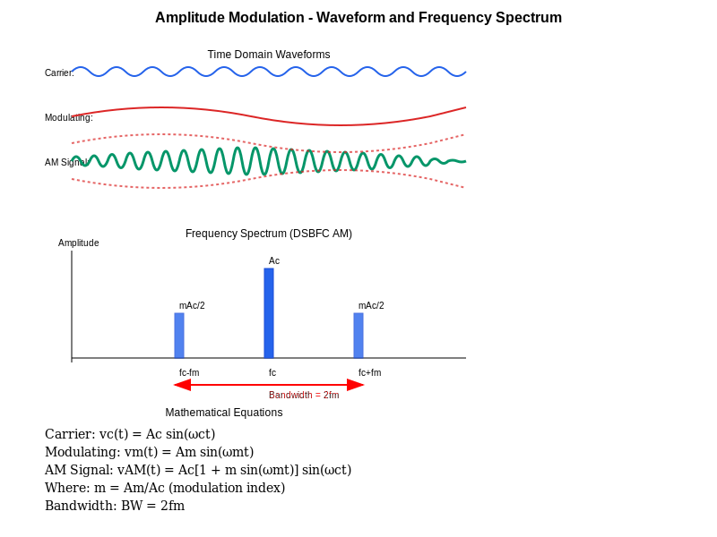
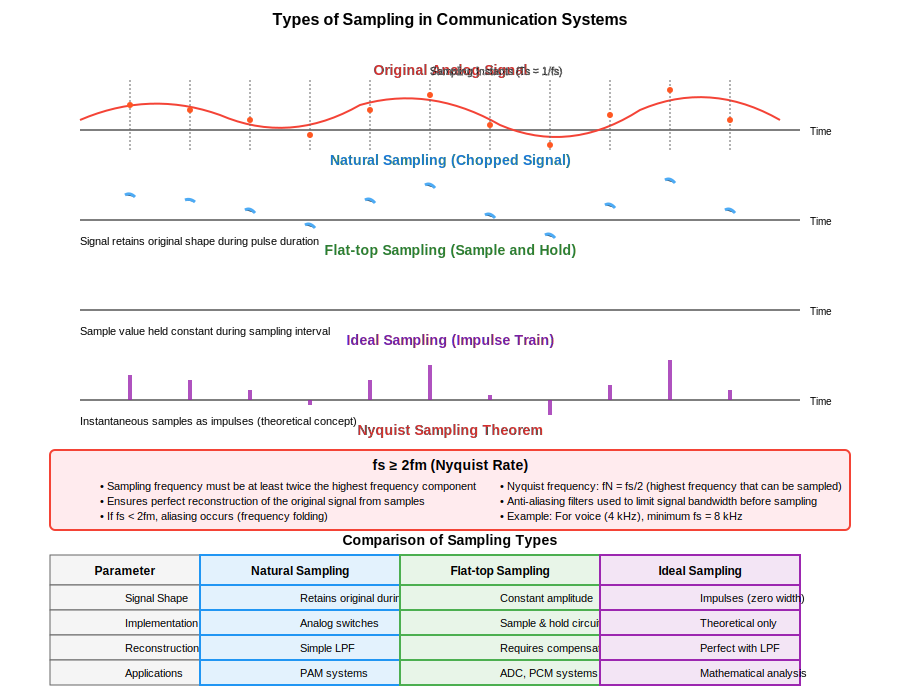
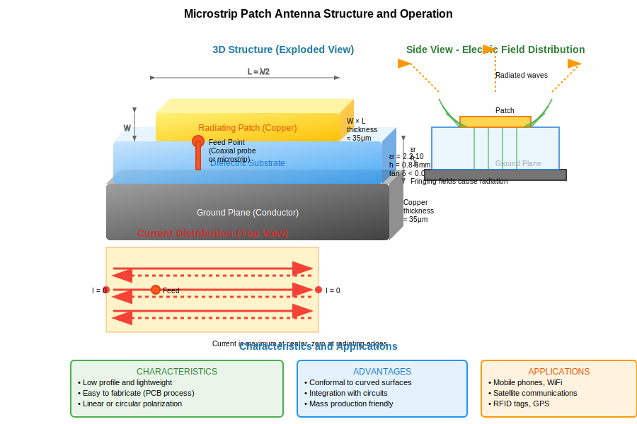

## Question 1(a) [3 marks]

**What is modulation? What is the need of it?**

**Answer**:
Modulation is the process of varying one or more properties of a high-frequency carrier signal with a modulating signal containing information. 

**Table: Need for Modulation**

| Reason | Explanation |
|--------|-------------|
| Antenna Size | Reduces antenna size requirements (λ = c/f) |
| Multiplexing | Allows multiple signals to share the spectrum |
| Range | Increases transmission distance |
| Interference | Reduces noise interference |

- **Practical transmission**: Makes low-frequency information signals suitable for wireless transmission
- **Signal separation**: Enables different signals to be transmitted simultaneously

**Mnemonic:** "RARE Messages" (Range, Antenna, Reduce interference, Enable multiplexing)

**Diagram: Communication System**


## Question 1(b) [4 marks]

**Compare AM and FM.**

**Answer**:

**Table: Comparison between AM and FM**

| Parameter | AM (Amplitude Modulation) | FM (Frequency Modulation) |
|-----------|---------------------------|----------------------------|
| Parameter varied | Amplitude of carrier | Frequency of carrier |
| Bandwidth | Narrow (2 × fm) | Wide (2 × mf × fm) |
| Noise immunity | Poor | Excellent |
| Power efficiency | Less efficient | More efficient |
| Circuit complexity | Simple | Complex |
| Quality | Moderate | High |
| Applications | Medium wave broadcasting | High-fidelity broadcasting |

**Mnemonic:** "BANC-QA" (Bandwidth, Amplitude/frequency, Noise, Complexity, Quality, Applications)

## Question 1(c) [7 marks]

**Explain Amplitude modulation with waveform and derive voltage equation for modulated signal also Sketch the frequency spectrum of the DSBFC AM.**

**Answer**:

Amplitude Modulation (AM) is a technique where the amplitude of a carrier wave is varied in proportion to the instantaneous amplitude of the modulating signal.

**Voltage Equation:**

- Carrier signal: v₁(t) = A₁ sin(ωct)
- Modulating signal: v₂(t) = A₂ sin(ωmt)
- Modulated signal: v(t) = A₁[1 + m sin(ωmt)] sin(ωct)
- Where m = A₂/A₁ (modulation index)

**Diagram: AM Waveform**




```goat
     Carrier
      /\  /\  /\  /\  /\  /\  /\
     /  \/  \/  \/  \/  \/  \/  \
    
    Modulating
     /\              /\
    /  \            /  \
         \        /
          \/    \/
           
    AM Signal
      /\    /\          /\    /\
     /  \  /  \        /  \  /  \
    /    \/    \      /    \/    \
                \    /
                 \  /
                  \/
```

**Frequency Spectrum of DSBFC AM**


```goat
    Amplitude
        |
        |     A₁
        |      ↓
        |      █
        |      
        |m·A₁/2 ↓     ↓
        |      █      █
        |______|______|______|______▶ Frequency
               |      |      |
             fc-fm    fc    fc+fm
```

- **Bandwidth**: The bandwidth of AM signal is 2 × fm
- **Sidebands**: Upper sideband (USB) at fc+fm and Lower sideband (LSB) at fc-fm
- **Power distribution**: In carrier and two sidebands

**Mnemonic:** "CAM-SIP" (Carrier Amplitude Modified, Sidebands In Pair)

## Question 1(c) OR [7 marks]

**Derive the equation for total power in AM, calculate percentage of power savings in DSB and SSB.**

**Answer**:

**Derivation of Total Power in AM:**

- AM signal: v(t) = A₁[1 + m sin(ωmt)] sin(ωct)
- Total power: P = P₍carrier₎ + P₍sidebands₎
- P₍carrier₎ = A₁²/2
- P₍sidebands₎ = A₁²m²/4

**Table: Power Distribution in AM**

| Component | Power Expression | % of Total Power (m=1) |
|-----------|------------------|------------------------|
| Carrier | P₍c₎ = A₁²/2 | 66.67% |
| Sidebands | P₍s₎ = A₁²m²/4 | 33.33% |
| Total | P₍t₎ = A₁²(1+m²/2)/2 | 100% |

**Power Savings:**

- **DSB-SC**: 100% carrier power saved (66.67% of total power)
  - Only sidebands are transmitted
  - Percentage savings = (P₍c₎/P₍t₎) × 100 = 66.67%

- **SSB**: 50% of sideband power + 100% carrier power saved
  - One sideband + carrier removed
  - Percentage savings = (P₍c₎ + P₍s₎/2)/P₍t₎ × 100 = 83.33%

**Diagram: Power Distribution**

```goat
    Power
    ^
    |                       
    |  66.67%               
    |   ┌───┐                
    |   │   │                
    |   │   │   16.67%  16.67%    
    |   │   │   ┌───┐  ┌───┐     
    |   │   │   │   │  │   │     
    └───┴───┴───┴───┴──┴───┴────► Freq
        Carrier   LSB    USB
```

**Mnemonic:** "CAST-83" (Carrier And Sideband Transmission, 83% saved in SSB)

## Question 2(a) [3 marks]

**Define (1) Modulation index for AM (2) Modulation index For FM.**

**Answer**:

**Table: Modulation Index Definitions**

| Parameter | AM Modulation Index | FM Modulation Index |
|-----------|---------------------|---------------------|
| Definition | Ratio of peak amplitude of modulating signal to peak amplitude of carrier | Ratio of frequency deviation to modulating frequency |
| Formula | m = Am/Ac | mf = Δf/fm |
| Range | 0 ≤ m ≤ 1 for no distortion | No specific upper limit |
| Effect | Determines % modulation | Determines bandwidth |

- **AM Modulation Index**: Controls the amplitude variation and power distribution
- **FM Modulation Index**: Determines bandwidth and signal quality

**Mnemonic:** "ARM-FDM" (Amplitude Ratio for Modulation, Frequency Deviation for Modulation)

## Question 2(b) [4 marks]

**Draw and explain block diagram for envelope detector.**

**Answer**:

**Diagram: Envelope Detector**



```goat
    AM Signal                   
     ───────→┌──────┐    ┌──────┐     ┌─────┐     Demodulated
             │      │    │      │     │     │     Output
             │ Diode│───→│ RC   │────→│ Load│───→
             │      │    │Filter│     │     │
             └──────┘    └──────┘     └─────┘
```

**Table: Components and Their Functions**

| Component | Function |
|-----------|----------|
| Diode | Rectifies the AM signal (removes negative half-cycles) |
| RC Filter | Smooths the rectified signal to recover the envelope |
| Load | Provides output circuit and impedance matching |

- **Working principle**: The diode conducts only during positive half-cycles
- **Time constant**: RC must be large enough to prevent ripple but small enough to follow modulation
- **Condition**: RC >> 1/fc but RC << 1/fm

**Mnemonic:** "DEER" (Diode Extracts Envelope Representation)

## Question 2(c) [7 marks]

**Draw block diagram of FM radio receiver and explain working of each block.**

**Answer**:

**Diagram: FM Radio Receiver**




**Table: Functions of Each Block**

| Block | Function |
|-------|----------|
| Antenna | Receives electromagnetic waves |
| RF Amplifier | Amplifies weak RF signals (88-108 MHz) |
| Mixer | Converts RF to IF frequency (10.7 MHz) |
| Local Oscillator | Generates frequency for mixing (RF+10.7 MHz) |
| IF Amplifier | Amplifies IF signal with fixed gain |
| Limiter | Removes amplitude variations |
| FM Discriminator | Converts frequency variations to voltage |
| Audio Amplifier | Amplifies recovered audio |
| Speaker | Converts electrical to sound waves |

- **Superheterodyne principle**: Uses frequency conversion to process signals at fixed IF
- **Distinctive FM feature**: Limiter removes noise in amplitude before demodulation

**Mnemonic:** "RAMLIDASS" (RF, Amplifier, Mixer, Local oscillator, IF, Discriminator, Audio, Speaker System)

## Question 2(a) OR [3 marks]

**Draw only Waveform For frequency modulation and Phase modulation.**

**Answer**:

**Diagram: FM and PM Waveforms**

```goat
Modulating Signal
    ────┐     ┌─────
        │     │     
        │     │     
    ────┘     └─────
        
FM Signal
    /\/\/\     /\/\/\/\/\/\     /\/\/\
   /      \   /            \   /      \
  /        \ /              \ /        \
            
PM Signal
    /\/\/\/\/\  /\/\  /\/\/\/\/\
   /          \/    \/          \
  /                              \
```

**Key Characteristics:**

- **FM**: Frequency increases when modulating signal is positive
- **PM**: Phase shifts immediately with amplitude changes

**Mnemonic:** "FIP-PAF" (Frequency Increases with Positive signal, Phase Advances with Faster changes)

## Question 2(b) OR [4 marks]

**Define any FOUR characteristics of radio receiver.**

**Answer**:

**Table: Characteristics of Radio Receiver**

| Characteristic | Definition |
|----------------|------------|
| Sensitivity | Ability to receive weak signals (measured in μV or dBm) |
| Selectivity | Ability to separate desired signal from adjacent channels |
| Fidelity | Accuracy of reproducing the original modulating signal |
| Image Rejection | Ability to reject image frequency interference |

**Additional characteristics:**

- **Signal-to-Noise Ratio**: Ratio of signal power to noise power
- **Bandwidth**: Range of frequencies that can be received
- **Stability**: Ability to maintain tuned frequency

**Mnemonic:** "SFIS-BSS" (Sensitivity, Fidelity, Image rejection, Selectivity - Better Signal Stability)

## Question 2(c) OR [7 marks]

**Draw block diagram of AM radio receiver and explain working of each block.**

**Answer**:

**Diagram: AM Radio Receiver**


**Table: Functions of Each Block**

| Block | Function |
|-------|----------|
| Antenna | Captures AM radio waves |
| RF Tuner & Amplifier | Selects and amplifies desired frequency |
| Mixer | Converts RF signal to IF (455 kHz) |
| Local Oscillator | Generates frequency for mixing (RF+455 kHz) |
| IF Amplifier | Amplifies IF signal with fixed selectivity |
| Detector | Recovers audio from AM envelope |
| AGC | Provides automatic gain control |
| Audio Amplifier | Amplifies audio signal |
| Speaker | Converts electrical to sound waves |

- **Superheterodyne principle**: Uses frequency conversion for better selectivity
- **AGC feedback loop**: Maintains constant output despite signal strength variations

**Mnemonic:** "ARMLESS" (Antenna, RF, Mixer, Local oscillator, Envelope detector, Sound System)

## Question 3(a) [3 marks]

**Define quantization. Explain non uniform quantization in brief.**

**Answer**:

**Quantization** is the process of converting continuous amplitude values into discrete levels for digital representation.

**Table: Non-uniform Quantization**

| Aspect | Description |
|--------|-------------|
| Definition | Assigning different step sizes for different amplitude ranges |
| Advantage | Reduces quantization noise for small amplitude signals |
| Implementation | Using companding (compression-expansion) techniques |
| Example | μ-law and A-law companding used in telephony |

- **Working principle**: Smaller step sizes for lower amplitudes, larger steps for higher amplitudes
- **Effect**: Improves SNR for weak signals at the expense of strong signals

**Mnemonic:** "QUEST-CS" (QUantization with Enhanced Steps - Compressing Small signals)

## Question 3(b) [4 marks]

**Explain Sample and hold Circuit with Waveform.**

**Answer**:

**Diagram: Sample and Hold Circuit**


```goat
    Analog       ┌───────┐      Sampled
    Input ───────│Sample &│─────→Output
                 │ Hold   │
                 └───┬───┘
                     │
    Clock ───────────┘
```

**Diagram: Sample and Hold Waveform**

```goat
Analog Signal
     /\      /\
    /  \    /  \
   /    \  /    \
  /      \/      \

Clock Pulses
  _   _   _   _   _
 | | | | | | | | | |
 | | | | | | | | | |
 |_| |_| |_| |_| |_|

Sampled Output
     __      __
    |  |    |  |
   _|  |____/  |___
  /                \
```

**Sample and Hold Operation:**

- **Sampling mode**: Switch closes, capacitor charges to input voltage
- **Hold mode**: Switch opens, capacitor maintains voltage
- **Parameters**: Acquisition time, aperture time, hold time, droop rate

**Mnemonic:** "CHASED" (Capacitor Holds Amplitude Samples for Extended Duration)

## Question 3(c) [7 marks]

**What is sampling? Explain types of sampling in brief.**

**Answer**:

**Sampling** is the process of converting a continuous-time signal into a discrete-time signal by taking measurements at regular intervals.

**Table: Types of Sampling**

| Type | Description | Characteristics |
|------|-------------|----------------|
| Natural Sampling | Signal is multiplied with rectangular pulses | Retains original signal shape during pulse |
| Flat-top Sampling | Sample value is held constant during sampling interval | Creates a staircase-like output |
| Ideal Sampling | Instantaneous samples represented as impulses | Theoretical concept with zero width pulses |
| Uniform Sampling | Samples taken at equal time intervals | Most common in practice |
| Non-uniform Sampling | Samples taken at varying intervals | Used for specialized applications |

**Diagram: Sampling Types**



```goat
Original Signal
     /\      /\
    /  \    /  \
   /    \  /    \
  /      \/      \

Natural Sampling
   _     _     _ 
  | |   | |   | |
  | |/\ | |   | |/\
  |/  \| |   |/  \|

Flat-top Sampling
   ___    ___    
  |   |  |   |   
  |   |__|   |___
```

- **Nyquist criterion**: Sampling frequency must be at least twice the highest frequency in the signal

**Mnemonic:** "INFUN" (Ideal, Natural, Flat-top, Uniform, Non-uniform)

## Question 3(a) OR [3 marks]

**Explain quantization process and its necessity.**

**Answer**:

**Quantization Process** maps continuous amplitude values to finite discrete levels for digital representation.

**Table: Quantization Process and Necessity**

| Aspect | Description |
|--------|-------------|
| Process | Dividing amplitude range into discrete levels |
| Necessity | Required for analog-to-digital conversion |
| Effect | Introduces quantization error/noise |
| Parameters | Step size, number of levels (2ⁿ for n-bit) |

- **Step size calculation**: Step size = (Vmax - Vmin)/2ⁿ
- **Quantization error**: Maximum error is ±Q/2 where Q is step size
- **Applications**: Digital communication, audio/video processing, data storage

**Mnemonic:** "SEND" (Step-size Establishes Noise in Digitization)

## Question 3(b) OR [4 marks]

**State and explain Nyquist Criteria for sampling of signal.**

**Answer**:

**Nyquist Sampling Theorem** states that to perfectly reconstruct a bandlimited signal, the sampling frequency must be at least twice the highest frequency component in the signal.

**Table: Nyquist Criteria**

| Parameter | Description |
|-----------|-------------|
| Criterion | fs ≥ 2fmax |
| Nyquist Rate | 2fmax (minimum sampling frequency) |
| Nyquist Interval | 1/(2fmax) (maximum sampling period) |
| Aliasing | Occurs when fs < 2fmax |

**Diagram: Sampling Effects**

```goat
    Proper Sampling (fs > 2fmax)
    Original: /\/\/\/\
    Samples:  * * * * * * * *
    Result:   /\/\/\/\

    Aliasing (fs < 2fmax)
    Original: /\/\/\/\/\/\/\
    Samples:  *   *   *   *
    Result:   /\/\    (lower frequency)
```

- **Consequences of undersampling**: Aliasing (frequency folding)
- **Practical application**: Anti-aliasing filters used before sampling

**Mnemonic:** "TRAP-A" (Twice Rate Avoids Problematic Aliasing)

## Question 3(c) OR [7 marks]

**Explain PAM, PWM and PPM with waveform.**

**Answer**:

**Table: Pulse Modulation Techniques**

| Technique | Description | Parameter Varied | Application |
|-----------|-------------|------------------|-------------|
| PAM | Pulse Amplitude Modulation | Amplitude of pulses | Simple ADC systems |
| PWM | Pulse Width Modulation | Width/duration of pulses | Motor control, power regulation |
| PPM | Pulse Position Modulation | Position/timing of pulses | High noise immunity systems |

**Diagram: Pulse Modulation Waveforms**

```goat
Modulating Signal
    /\        /\
   /  \      /  \
  /    \    /    \
 /      \  /      \

PAM
  |  |    |  |    |  |
  |  |    |  |    |  |
  |  |    |  |    |  |
  █  █    █  █    █  █

PWM
  █████    ███    █████
  |    |   | |    |    |
  |    |   | |    |    |
  |    |   | |    |    |

PPM
  █ █ █ █ █ █ █ █
  | | | | | | | |
  | | | | | | | |
  | | | | | | | |
```

- **PAM**: Simplest form, most susceptible to noise
- **PWM**: Better noise immunity, easy generation
- **PPM**: Best noise immunity, requires precise timing

**Mnemonic:** "AWP-PAW" (Amplitude, Width, Position - Pulse Alteration Ways)

## Question 4(a) [3 marks]

**What is slop overload noise and granular noise in DM?**

**Answer**:

**Table: Noise Types in Delta Modulation**

| Noise Type | Definition | Cause | Solution |
|------------|------------|-------|----------|
| Slope Overload Noise | Error when signal slope exceeds step size capability | Step size too small for rapidly changing signals | Increase step size or sampling frequency |
| Granular Noise | Error due to continuous hunting around slowly varying signals | Step size too large for slowly changing signals | Decrease step size |

**Diagram: DM Noise Types**

```goat
Slope Overload:
  Actual  /‾‾‾‾
         /
        /
       /      
   ___/       
  /
 /  DM Output (steps can't keep up)

Granular Noise:
  Actual  _________
         
   /‾\/‾\/‾\/‾\/‾\  DM Output (continuous zigzag)
```

**Mnemonic:** "FAST-SLOW" (Fast signals cause Slope overload, SLOW signals cause Granular noise)

## Question 4(b) [4 marks]

**Draw and explain TDM frame.**

**Answer**:

**Diagram: TDM Frame Structure**


```goat
    ┌───────────────────────────────────┐
    │ FS │ CH1 │ CH2 │ CH3 │...│ CHn │ FS │
    └───────────────────────────────────┘
       |    |     |     |        |     |
       |    |     |     |        |     └── Frame Sync for next frame
       |    |     |     |        └──────── Last channel sample
       |    |     |     └──────────────── Channel 3 sample
       |    |     └───────────────────── Channel 2 sample
       |    └─────────────────────────── Channel 1 sample
       └────────────────────────────────── Frame Synchronization
```

**Table: TDM Frame Components**

| Component | Description |
|-----------|-------------|
| Frame Sync (FS) | Pattern that marks the start of frame |
| Time Slot | Portion allocated to one channel |
| Channel Sample | Data from a specific channel |
| Frame Length | Total duration (FS + all channels) |

- **Working principle**: Allocates different time slots to different channels
- **Synchronization**: Essential for proper demultiplexing
- **Types**: Synchronous TDM (fixed slots) and Statistical TDM (dynamic allocation)

**Mnemonic:** "FAST-Ch" (Frame And Slots for Transmitting Channels)

## Question 4(c) [7 marks]

**Describe the function of each block of PCM transmitter and Receiver. Give application, advantage and disadvantage of PCM system.**

**Answer**:

**Diagram: PCM System**


**Table: PCM Block Functions**

| Block | Function |
|-------|----------|
| Sampler | Converts analog signal to PAM signal |
| Quantizer | Assigns discrete levels to samples |
| Encoder | Converts quantized levels to binary code |
| Line Coder | Converts binary to transmission format |
| Line Decoder | Recovers binary from received signal |
| Decoder | Converts binary back to quantized levels |
| Reconstruction Filter | Smooths decoded output into analog signal |

**Applications, Advantages and Disadvantages:**

**Table: PCM System Characteristics**

| Category | Description |
|----------|-------------|
| Applications | Telephone systems, CD audio, Digital TV, Mobile communications |
| Advantages | Immune to noise, Signal regeneration possible, Compatible with digital systems |
| Disadvantages | Requires higher bandwidth, Higher complexity, Quantization noise |

**Mnemonic:** "SEQUEL-DR" (Sample, Quantize, Encode - Line code, Decode, Reconstruct)

## Question 4(a) OR [3 marks]

**Give difference between DM and ADM modulation.**

**Answer**:

**Table: Comparison between DM and ADM**

| Parameter | Delta Modulation (DM) | Adaptive Delta Modulation (ADM) |
|-----------|----------------------|--------------------------------|
| Step Size | Fixed | Variable (adapts to signal slope) |
| Tracking Ability | Limited | Better signal tracking |
| Noise Performance | Suffers from slope overload and granular noise | Reduced noise problems |
| Complexity | Simpler | More complex |

**Diagram: DM vs ADM Tracking**

```goat
Input Signal:   /‾‾‾‾\
               /      \
              /        \
             /          \

DM Output:   /‾\/‾\/‾\
            /         \/‾\/‾\

ADM Output: /‾‾\/‾‾‾\
           /         \‾‾\/‾‾\
           (larger steps for steep slopes)
```

**Mnemonic:** "FAST-VAR" (Fixed And Simple Tracking vs Variable Adaptive Response)

## Question 4(b) OR [4 marks]

**Explain Block diagram of basic PCM-TDM system.**

**Answer**:

**Diagram: PCM-TDM System**


**Table: PCM-TDM System Components**

| Component | Function |
|-----------|----------|
| Low-pass Filters | Limit bandwidth of input signals |
| Multiplexer | Combines multiple signals into time slots |
| PCM Encoder | Converts to digital (sample, quantize, encode) |
| Transmission Channel | Carries digitized, multiplexed signal |
| PCM Decoder | Reconstructs quantized samples |
| Demultiplexer | Separates channels from time slots |

- **Working principle**: Combines time division multiplexing with pulse code modulation
- **Applications**: Digital telephony, digital audio broadcasting, communication networks

**Mnemonic:** "FLIMPED" (Filter, Limit, Multiplex, PCM Encode, Decode)

## Question 4(c) OR [7 marks]

**Explain DPCM modulator with equation and waveform.**

**Answer**:

**Differential Pulse Code Modulation (DPCM)** encodes the difference between the current sample and a predicted value based on previous samples.

**Equation:**

- Error signal: e(n) = x(n) - x̂(n)
- Where x(n) is current sample, x̂(n) is predicted sample
- Prediction: x̂(n) = Σ(aᵢ × x(n-i))
- Transmitted signal: DPCM output = Q[e(n)]

**Diagram: DPCM Modulator**


**Diagram: DPCM Waveform**

```goat
Original Samples:
  *   *   *   *   *
  |   |   |   |   |
  |   |   |   |   |
  |   |   |   |   |
  
Predicted Samples:
    o   o   o   o
    |   |   |   |
    |   |   |   |
    |   |   |   |
    
Difference (DPCM):
  ↕   ↕   ↕   ↕   ↕  (smaller values)
```

**Table: DPCM Characteristics**

| Feature | Description |
|---------|-------------|
| Advantage | Reduced bit rate (30-50% compared to PCM) |
| Prediction | Uses previous sample(s) for current prediction |
| Complexity | Higher than PCM but lower than ADPCM |
| Application | Speech coding, image compression |

**Mnemonic:** "PQED" (Predict, Quantize Error, Encode Difference)

## Question 5(a) [3 marks]

**Define Antenna and radiation pattern and polarization.**

**Answer**:

**Table: Antenna Definitions**

| Term | Definition |
|------|------------|
| Antenna | A device that converts electrical energy into electromagnetic waves and vice versa |
| Radiation Pattern | Graphical representation of radiation properties of an antenna as a function of space coordinates |
| Polarization | Orientation of the electric field vector of the electromagnetic wave radiated by the antenna |

**Types of Polarization:**

- **Linear**: Electric field oscillates in one direction (vertical, horizontal)
- **Circular**: Electric field rotates with constant amplitude (RHCP, LHCP)
- **Elliptical**: Electric field rotates with varying amplitude

**Mnemonic:** "WAVE-PRO" (Wireless Antenna Validates Electromagnetic Propagation, Radiation, Orientation)

## Question 5(b) [4 marks]

**Explain Microstrip Antenna with sketch.**

**Answer**:

**Diagram: Microstrip Patch Antenna**



```goat
    ┌───────────────────┐  ←Patch (radiating element)
    │                   │
    │                   │
    └───────────────────┘
    ┌───────────────────────────────┐
    │                               │  ←Dielectric substrate
    └───────────────────────────────┘
    ┌───────────────────────────────┐
    │                               │  ←Ground plane
    └───────────────────────────────┘
              │
              │ Feed point
              ▼
```

**Table: Microstrip Antenna Components**

| Component | Function |
|-----------|----------|
| Patch | Radiating element (usually copper) |
| Substrate | Dielectric material between patch and ground |
| Ground Plane | Metal layer at bottom |
| Feed Point | Connection point for signal |

- **Working principle**: Fringing fields at edges cause radiation
- **Advantages**: Low profile, lightweight, easy fabrication, compatible with PCB
- **Applications**: Mobile devices, satellites, aircraft, RFID tags

**Mnemonic:** "SPGF" (Substrate, Patch, Ground, Feed)

## Question 5(c) [7 marks]

**Explain delta modulation with necessary sketch and waveform.**

**Answer**:

Delta Modulation (DM) is the simplest form of differential pulse code modulation where the difference between successive samples is encoded into a single bit.

**Diagram: Delta Modulator**


**Diagram: Delta Modulation Waveform**

```goat
Input Signal:
        /‾‾‾‾‾\
       /       \
      /         \
     /           \
    /             \

Clock Pulses:
    ˉ|ˉ|ˉ|ˉ|ˉ|ˉ|ˉ|ˉ|ˉ|ˉ|ˉ|ˉ|ˉ|ˉ|ˉ|ˉ

DM Output (bits):
    1 1 1 1 0 0 0 0 0 1 1 1 0 0 0 0

Step Approximation:
       /‾\/‾\
      /     \
     /       \/‾\
    /           \
```

**Table: Delta Modulation Characteristics**

| Characteristic | Description |
|----------------|-------------|
| Bit Rate | 1 bit per sample |
| Step Size | Fixed (major limitation) |
| Slope Overload | Occurs when signal changes faster than step size can track |
| Granular Noise | Occurs in slowly changing signals (continuous hunting) |
| Advantages | Simplicity, low bit rate |
| Disadvantages | Limited dynamic range, noise problems |

**Mnemonic:** "SIGN-UP" (SInGle bit, Next step Up or down, Predict)

## Question 5(a) OR [3 marks]

**What is smart antenna? list application of it.**

**Answer**:

A **Smart Antenna** is an adaptive array system that uses digital signal processing algorithms to dynamically adjust its radiation pattern to enhance communication performance.

**Table: Smart Antenna Applications**

| Application | Benefit |
|-------------|---------|
| Cellular Base Stations | Increased capacity and coverage |
| Wireless LAN | Improved throughput and reduced interference |
| Satellite Communications | Better signal quality and power efficiency |
| Military Communications | Enhanced security and jam resistance |
| IoT Networks | Extended battery life, improved connectivity |

- **Working principle**: Uses beamforming to focus signal energy toward desired users
- **Types**: Switched beam systems and adaptive array systems

**Mnemonic:** "SWIM-CM" (Smart Wireless In Mobile-Cellular-Military)

## Question 5(b) OR [4 marks]

**Explain parabolic reflector antenna With Sketch.**

**Answer**:

**Diagram: Parabolic Reflector Antenna**

```goat
                  ╱│╲
               ╱   │  ╲
            ╱      │     ╲
         ╱         │        ╲
      ╱            │           ╲
   ╱               │              ╲
 ╱─────────────────┼─────────────────╲
                   │
                   │
                   ▼
                 Feed
                 Point
```

**Table: Parabolic Reflector Components**

| Component | Function |
|-----------|----------|
| Parabolic Dish | Reflects and focuses signals |
| Feed Horn | Radiates/receives signals at focal point |
| Supporting Structure | Maintains geometry and stability |
| Waveguide | Connects feed horn to transmitter/receiver |

- **Working principle**: Incoming parallel rays are reflected to focus at focal point
- **Characteristics**: High gain, directivity, narrow beamwidth
- **Applications**: Satellite communication, radio astronomy, radar, microwave links

**Mnemonic:** "PFGH" (Parabolic Focus Gives High-gain)

## Question 5(c) OR [7 marks]

**Explain Adaptive Delta modulation with necessary sketch and waveform.**

**Answer**:

Adaptive Delta Modulation (ADM) improves on standard DM by dynamically adjusting the step size according to the input signal characteristics.

**Diagram: Adaptive Delta Modulator**


**Diagram: ADM Waveform**

```goat
Input Signal:
        /‾‾‾‾‾\
       /       \
      /         \
     /           \
    /             \

ADM Output (variable step):
       /‾‾‾\
      /     \
     /       \
    /         \
   /           \
  (larger steps for steep slopes)
```

**Table: ADM Characteristics**

| Aspect | Description |
|--------|-------------|
| Step Size | Variable (adapts to signal slope) |
| Control Logic | Increases step size for consecutive same bits |
| Advantages | Reduced slope overload and granular noise |
| Disadvantages | More complex than DM |
| Applications | Speech coding, telemetry, digital telephony |
| Performance | Better SNR than DM at same bit rate |

- **Step size adaptation**: μ(n) = μ(n-1) × K if consecutive bits are same
- **Step size adaptation**: μ(n) = μ(n-1) / K if consecutive bits change

**Mnemonic:** "ADVISED" (ADaptive Variable Increment Step for Enhanced Delta modulation)
