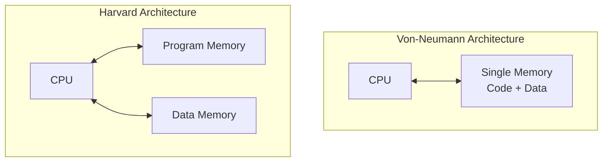
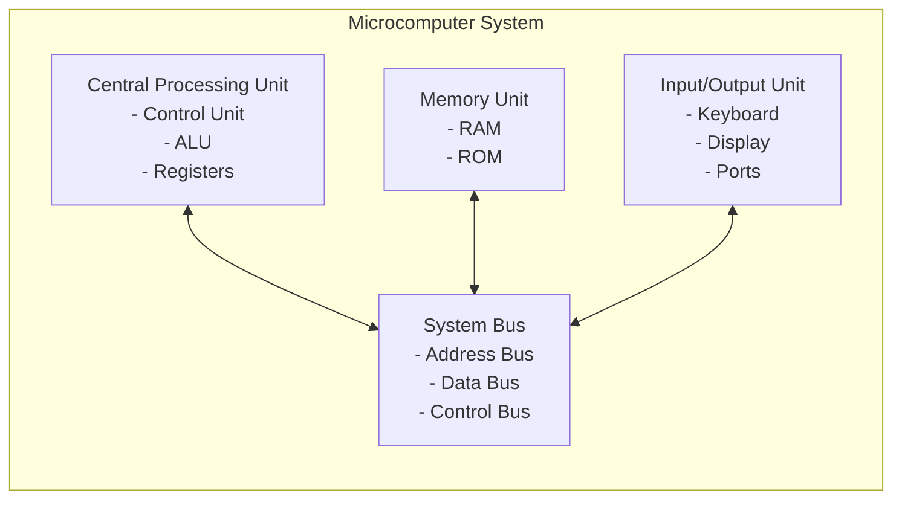
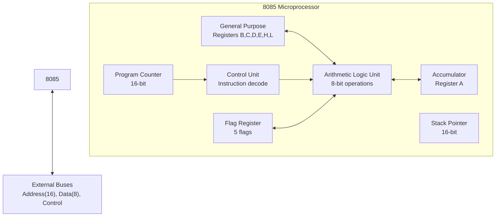
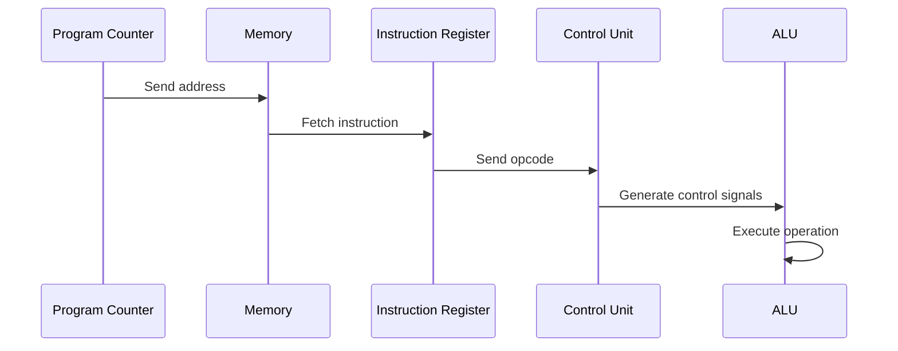
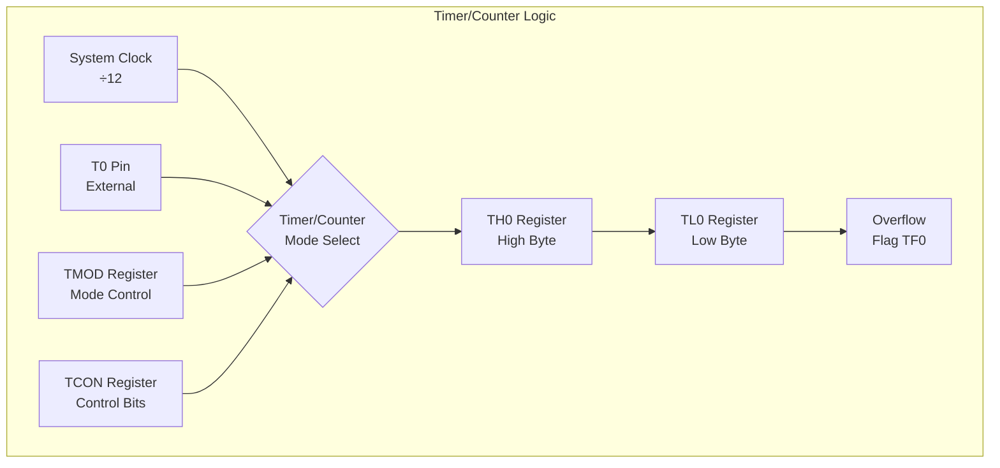
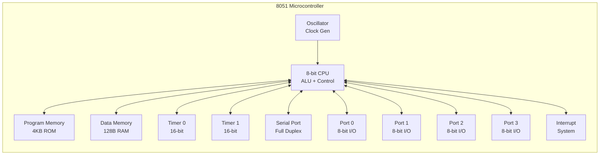

## પ્રશ્ન 1(અ) [3 ગુણ]

**8051 માઇક્રોકંટ્રોલરના સામાન્ય ફીચર્સની યાદી બનાવો.**

**જવાબ**:

**ટેબલ: 8051 માઇક્રોકંટ્રોલરના સામાન્ય ફીચર્સ**

| ફીચર | વર્ણન |
|-------|--------|
| **On-chip Oscillator** | બિલ્ટ-ઇન ક્લોક જનરેટર સર્કિટ |
| **Program Memory** | કોડ સ્ટોરેજ માટે 4KB આંતરિક ROM |
| **Data Memory** | 128 bytes આંતરિક RAM |
| **I/O Ports** | 4 દ્વિદિશીય 8-bit પોર્ટ્સ (P0-P3) |
| **Timers/Counters** | બે 16-bit Timer/Counter યુનિટ્સ |
| **Serial Port** | Full duplex UART કમ્યુનિકેશન |
| **Interrupts** | પ્રાથમિકતા સાથે 5 interrupt સ્રોતો |
| **SFRs** | કંટ્રોલ માટે Special Function Registers |

**મેમરી ટ્રીક:** "On Program Data I/O Timers Serial Interrupts SFRs"

## પ્રશ્ન 1(બ) [4 ગુણ]

**T-State, Machine Cycle, Instruction Cycle અને Opcode ની વ્યાખ્યા આપો.**

**જવાબ**:

**ટેબલ: માઇક્રોપ્રોસેસર ટાઇમિંગ વ્યાખ્યાઓ**

| શબ્દ | વ્યાખ્યા | અવધિ |
|------|---------|-------|
| **T-State** | સિસ્ટમ ક્લોકનો એક સમયગાળો | મૂળભૂત ટાઇમિંગ યુનિટ |
| **Machine Cycle** | એક મેમરી ઓપરેશન પૂરું કરવાનો સમય | 3-6 T-states |
| **Instruction Cycle** | instruction fetch, decode અને execute કરવાનો સમય | 1-4 Machine cycles |
| **Opcode** | instruction પ્રકાર દર્શાવતો operation કોડ | 1-3 bytes |

- **T-State**: માઇક્રોપ્રોસેસર ઓપરેશનનો સૌથી નાનો સમય એકમ
- **Machine Cycle**: મેમરી એક્સેસ માટે અનેક T-states ધરાવે છે
- **Instruction Cycle**: સંપૂર્ણ instruction execution નો સમય
- **Opcode**: વિશિષ્ટ instruction ઓળખતો બાઇનરી કોડ

**મેમરી ટ્રીક:** "Time Machine Instruction Operation"

## પ્રશ્ન 1(ક) [7 ગુણ]

**Von-Neumann અને Harvard Architecture ની સરખામણી કરો.**

**જવાબ**:

**ટેબલ: Von-Neumann vs Harvard Architecture સરખામણી**

| પરિમાણ | Von-Neumann | Harvard |
|---------|-------------|---------|
| **Memory Organization** | કોડ અને ડેટા માટે એક જ મેમરી | કોડ અને ડેટા માટે અલગ મેમરી |
| **Bus Structure** | એક જ bus સિસ્ટમ | ડ્યુઅલ bus સિસ્ટમ |
| **Speed** | bus sharing થી ધીમી | parallel access થી ઝડપી |
| **Cost** | ઓછી કિંમતે અમલીકરણ | ડ્યુઅલ મેમરી થી વધારે કિંમત |
| **Flexibility** | વધારે flexible મેમરી ઉપયોગ | ઓછી flexibility, નિશ્ચિત allocation |
| **Examples** | 8085, x86 processors | 8051, DSP processors |



**મુખ્ય તફાવતો:**

- **Memory Access**: Von-Neumann sequential access, Harvard simultaneous access
- **Performance**: embedded applications માટે Harvard ઝડપી છે
- **Applications**: general computing માટે Von-Neumann, real-time systems માટે Harvard

**મેમરી ટ્રીક:** "Von-Single Harvard-Dual"

## પ્રશ્ન 1(ક) OR [7 ગુણ]

**Microcomputer System ને block diagram સાથે સમજાવો.**

**જવાબ**:

**Microcomputer System ના ઘટકો:**



**ટેબલ: Microcomputer System ના ઘટકો**

| ઘટક | કાર્ય | ઉદાહરણો |
|-----|------|----------|
| **CPU** | કેન્દ્રીય પ્રોસેસિંગ અને નિયંત્રણ | 8085, 8086 |
| **Memory** | પ્રોગ્રામ અને ડેટા સ્ટોરેજ | RAM, ROM, EPROM |
| **I/O Unit** | બાહ્ય દુનિયા સાથે interface | Keyboard, Display |
| **System Bus** | ડેટા ટ્રાન્સફર માર્ગ | Address, Data, Control |

- **CPU**: instructions execute કરે છે અને સિસ્ટમ ઓપરેશન control કરે છે
- **Memory**: પ્રોસેસિંગ માટે programs અને data store કરે છે
- **I/O**: બાહ્ય devices સાથે કમ્યુનિકેશન પૂરું પાડે છે
- **Bus**: ડેટા ટ્રાન્સફર માટે બધા components ને જોડે છે

**મેમરી ટ્રીક:** "CPU Memory I/O Bus"

## પ્રશ્ન 2(અ) [3 ગુણ]

**8085 Microprocessor માં Bus organization દોરો.**

**જવાબ**:

```goat
    +----------+
    |   8085   |
    |   CPU    |
    +----------+
         |
    +----+----+
    |         |
    v         v
+--------+ +--------+
|Address | |  Data  |
|  Bus   | |  Bus   |
|16-bit  | | 8-bit  |
+--------+ +--------+
    |         |
    v         v
+--------+ +--------+
|Memory  | |  I/O   |
|System  | |Devices |
+--------+ +--------+
```

**ટેબલ: 8085 Bus Organization**

| Bus પ્રકાર | Width | કાર્ય |
|------------|-------|------|
| **Address Bus** | 16-bit | મેમરી addressing (64KB) |
| **Data Bus** | 8-bit | ડેટા ટ્રાન્સફર |
| **Control Bus** | Multiple | કંટ્રોલ સિગ્નલ્સ |

**મેમરી ટ્રીક:** "Address Data Control"

## પ્રશ્ન 2(બ) [4 ગુણ]

**8085 માં ઉપયોગમાં લેવાતા Flags ની સૂચી બનાવો અને દરેક flag નું કાર્ય સમજાવો.**

**જવાબ**:

**ટેબલ: 8085 Flags Register**

| Flag | નામ | Bit Position | કાર્ય |
|------|-----|--------------|------|
| **S** | Sign | D7 | પરિણામ નકારાત્મક હોય તો set |
| **Z** | Zero | D6 | પરિણામ શૂન્ય હોય તો set |
| **AC** | Auxiliary Carry | D4 | bit 3 થી 4 માં carry હોય તો set |
| **P** | Parity | D2 | પરિણામમાં even parity હોય તો set |
| **CY** | Carry | D0 | carry/borrow થાય તો set |

```goat
D7  D6  D5  D4  D3  D2  D1  D0
+---+---+---+---+---+---+---+---+
| S | Z | - |AC | - | P | - |CY |
+---+---+---+---+---+---+---+---+
```

- **Sign Flag**: નકારાત્મક પરિણામ દર્શાવે છે (MSB = 1)
- **Zero Flag**: arithmetic પરિણામ શૂન્ય થાય ત્યારે set થાય છે
- **Auxiliary Carry**: BCD arithmetic operations માટે ઉપયોગ થાય છે
- **Parity Flag**: પરિણામમાં 1's ની સમ સંખ્યા તપાસે છે
- **Carry Flag**: arithmetic operations માં overflow દર્શાવે છે

**મેમરી ટ્રીક:** "Sign Zero Auxiliary Parity Carry"

## પ્રશ્ન 2(ક) [7 ગુણ]

**8085 નો Block Diagram દોરો અને સમજાવો.**

**જવાબ**:



**ટેબલ: 8085 Block Components**

| Block | કાર્ય | Size |
|-------|------|------|
| **ALU** | Arithmetic અને logical operations | 8-bit |
| **Accumulator** | operations માટે પ્રાથમિક register | 8-bit |
| **Registers** | ડેટા સ્ટોરેજ (B,C,D,E,H,L) | દરેક 8-bit |
| **Program Counter** | આગલી instruction તરફ point કરે છે | 16-bit |
| **Stack Pointer** | stack ના top તરફ point કરે છે | 16-bit |
| **Control Unit** | Instruction decode અને control | - |

- **Data Flow**: PC દ્વારા instructions fetch, CU દ્વારા decode, ALU માં execute
- **Register Operations**: Accumulator ALU સાથે કાર્ય કરે છે, બીજા registers ડેટા store કરે છે
- **Address Generation**: PC અને SP 16-bit addresses આપે છે
- **Control Signals**: CU timing અને control signals generate કરે છે

**મેમરી ટ્રીક:** "ALU Accumulator Registers Program Stack Control"

## પ્રશ્ન 2(અ) OR [3 ગુણ]

**Microprocessor માં Instruction Fetching, Decoding અને Execution Operation સમજાવો.**

**જવાબ**:



**ટેબલ: Instruction Cycle Phases**

| Phase | Operation | Duration |
|-------|-----------|----------|
| **Fetch** | મેમરીમાંથી instruction મેળવો | 1 machine cycle |
| **Decode** | Instruction opcode નું અર્થઘટન | Execute નો ભાગ |
| **Execute** | જરૂરી operation કરો | 1-3 machine cycles |

**મેમરી ટ્રીક:** "Fetch Decode Execute"

## પ્રશ્ન 2(બ) OR [4 ગુણ]

**8085 માં Lower order Address અને Data lines નું Demultiplexing શું છે? આકૃતિની મદદથી સમજાવો.**

**જવાબ**:

```goat
     8085
+-------------+
|  AD7-AD0    |  Multiplexed
+------+------+  Address/Data
       |
       v
+------+------+
|    ALE      |  Address Latch Enable
+------+------+
       |
       v
+------+------+
|   74LS373   |  Latch IC
+------+------+
   |       |
   v       v
A7-A0    D7-D0
Address   Data
```

**Demultiplexing Process:**

- **ALE Signal**: address અને data ના વિભાજનને control કરે છે
- **Latch IC**: ALE high હોય ત્યારે 74LS373 address store કરે છે
- **Timing**: પહેલા address આવે છે, પછી same lines પર data આવે છે

**ટેબલ: Demultiplexing Components**

| Component | કાર્ય | Timing |
|-----------|------|--------|
| **ALE** | Address Latch Enable signal | T1 દરમિયાન high |
| **74LS373** | Octal latch IC | A7-A0 store કરે છે |
| **AD7-AD0** | Multiplexed lines | પહેલા Address પછી Data |

**મેમરી ટ્રીક:** "Address Latch Enable Demultiplexes Lines"

## પ્રશ્ન 2(ક) OR [7 ગુણ]

**8085 નો Pin Diagram દોરો અને સમજાવો.**

**જવાબ**:

```goat
        8085 PIN DIAGRAM
    +-------------------+
X1  |1               40| VCC
X2  |2               39| HOLD
RST |3               38| HLDA
SOD |4               37| CLK
SID |5               36| RESET IN
TRAP|6               35| READY
RST7|7               34| IO/M
RST6|8               33| S1
RST5|9               32| RD
INTR|10              31| WR
INTA|11              30| ALE
AD0 |12              29| S0
AD1 |13              28| A15
AD2 |14              27| A14
AD3 |15              26| A13
AD4 |16              25| A12
AD5 |17              24| A11
AD6 |18              23| A10
AD7 |19              22| A9
VSS |20              21| A8
    +-------------------+
```

**ટેબલ: 8085 Pin કાર્યો**

| Pin Group | કાર્ય | Count |
|-----------|------|-------|
| **Address Bus** | A8-A15 (ઉચ્ચ ક્રમ) | 8 pins |
| **Address/Data** | AD0-AD7 (Multiplexed) | 8 pins |
| **Control Signals** | ALE, RD, WR, IO/M | 4 pins |
| **Interrupts** | TRAP, RST7.5, RST6.5, RST5.5, INTR | 5 pins |
| **Power** | VCC, VSS | 2 pins |
| **Clock** | X1, X2, CLK | 3 pins |

- **Address Lines**: 16-bit addressing ક્ષમતા (64KB)
- **Data Lines**: 8-bit ડેટા ટ્રાન્સફર
- **Control Lines**: મેમરી અને I/O ઓપરેશન કંટ્રોલ
- **Interrupt Lines**: હાર્ડવેર interrupt handling

**મેમરી ટ્રીક:** "Address Data Control Interrupt Power Clock"

## પ્રશ્ન 3(અ) [3 ગુણ]

**8051 નો IP SFR દોરો અને દરેક bit નું કાર્ય સમજાવો.**

**જવાબ**:

```goat
IP Register (Interrupt Priority) - Address B8H
MSB                           LSB
+---+---+---+----+---+----+----+----+
| - | - | - | PT2| PS| PT1| PX1| PX0|
+---+---+---+----+---+----+----+----+
 D7  D6  D5  D4  D3  D2  D1  D0
```

**ટેબલ: IP Register Bit કાર્યો**

| Bit | નામ | કાર્ય |
|-----|------|------|
| **D4** | PT2 | Timer 2 interrupt priority |
| **D3** | PS | Serial port interrupt priority |
| **D2** | PT1 | Timer 1 interrupt priority |
| **D1** | PX1 | External interrupt 1 priority |
| **D0** | PX0 | External interrupt 0 priority |

- **Priority Levels**: 1 = High priority, 0 = Low priority
- **Default**: બધા interrupts low priority (00H)
- **Usage**: High priority interrupt માટે bit 1 કરો

**મેમરી ટ્રીક:** "Timer2 Serial Timer1 External1 External0"

## પ્રશ્ન 3(બ) [4 ગુણ]

**8051 માટે Timer/Counter Logic diagram દોરો અને સમજાવો.**

**જવાબ**:



**ટેબલ: Timer Components**

| Component | કાર્ય | Size |
|-----------|------|------|
| **TH0/TL0** | Timer 0 high/low byte registers | દરેક 8-bit |
| **TMOD** | Timer mode register | 8-bit |
| **TCON** | Timer control register | 8-bit |
| **TF0** | Timer 0 overflow flag | 1-bit |

- **Clock Source**: આંતરિક (system clock/12) અથવા બાહ્ય (T0 pin)
- **Operation**: લોડ કરેલા મૂલ્યથી FFH સુધી count કરે છે
- **Overflow**: TF0 flag set કરે છે અને interrupt generate કરે છે
- **Modes**: 4 અલગ અલગ timer modes ઉપલબ્ધ છે

**મેમરી ટ્રીક:** "Timer High-Low Mode Control Flag"

## પ્રશ્ન 3(ક) [7 ગુણ]

**8051 નો Block Diagram દોરો અને સમજાવો.**

**જવાબ**:



**ટેબલ: 8051 Block Components**

| Block | કાર્ય | વિશેષતા |
|-------|------|----------|
| **CPU** | કેન્દ્રીય પ્રોસેસિંગ યુનિટ | 8-bit processor |
| **Program Memory** | કોડ સ્ટોરેજ | 4KB આંતરિક ROM |
| **Data Memory** | વેરિયેબલ સ્ટોરેજ | 128 bytes RAM |
| **I/O Ports** | બાહ્ય interface | 4 ports (32 I/O lines) |
| **Timers** | ટાઇમિંગ ઓપરેશન્સ | 2 × 16-bit timers |
| **Serial Port** | કમ્યુનિકેશન | Full duplex UART |
| **Interrupts** | Event handling | 5 interrupt sources |

- **Architecture**: program/data મેમરી માટે અલગ Harvard architecture
- **I/O Capability**: 32 દ્વિદિશીય I/O lines
- **On-chip Features**: Timers, serial port, interrupt system
- **Memory**: ડેટા માટે Von-Neumann, પ્રોગ્રામ માટે Harvard

**મેમરી ટ્રીક:** "CPU Program Data I/O Timer Serial Interrupt"

## પ્રશ્ન 3(અ) OR [3 ગુણ]

**8051 નો PCON SFR દોરો અને દરેક bit નું કાર્ય સમજાવો.**

**જવાબ**:

```goat
PCON Register (Power Control) - Address 87H
MSB                           LSB
+---+---+---+---+---+---+---+---+
|SMOD| - | - | - |GF1|GF0| PD|IDL|
+---+---+---+---+---+---+---+---+
 D7  D6  D5  D4  D3  D2  D1  D0
```

**ટેબલ: PCON Register Bit કાર્યો**

| Bit | નામ | કાર્ય |
|-----|------|------|
| **D7** | SMOD | Serial port mode modifier |
| **D3** | GF1 | General purpose flag bit 1 |
| **D2** | GF0 | General purpose flag bit 0 |
| **D1** | PD | Power down mode control |
| **D0** | IDL | Idle mode control |

- **SMOD**: set થાય ત્યારે serial port baud rate બમણો કરે છે
- **GF1, GF0**: યુઝર-ડિફાઇન્ડ flag bits
- **PD**: power-down mode સક્રિય કરે છે
- **IDL**: idle mode સક્રિય કરે છે

**મેમરી ટ્રીક:** "Serial General Power Idle"

## પ્રશ્ન 3(બ) OR [4 ગુણ]

**8051 Serial communication Mode 1 માં, XTAL=11.0592 MHz માટે, 9600 અને 4800 baud rate મેળવવા માટે TH1 ની કિંમત શોધો.**

**જવાબ**:

**Mode 1 Baud Rate માટે સૂત્ર:**
```
Baud Rate = (2^SMOD/32) × (Timer1 Overflow Rate)
Timer1 Overflow Rate = XTAL/(12 × (256 - TH1))
```

**9600 Baud Rate માટે:**
```
9600 = (1/32) × (11059200/(12 × (256 - TH1)))
9600 = 28800/(256 - TH1)
256 - TH1 = 3
TH1 = 253 = FDH
```

**4800 Baud Rate માટે:**
```
4800 = (1/32) × (11059200/(12 × (256 - TH1)))
4800 = 28800/(256 - TH1)
256 - TH1 = 6
TH1 = 250 = FAH
```

**ટેબલ: Baud Rates માટે TH1 મૂલ્યો**

| Baud Rate | TH1 મૂલ્ય (Hex) | TH1 મૂલ્ય (Decimal) |
|-----------|-----------------|---------------------|
| **9600** | FDH | 253 |
| **4800** | FAH | 250 |

**મેમરી ટ્રીક:** "Higher Baud Higher TH1"

## પ્રશ્ન 4(અ) [3 ગુણ]

**8051 માં LCALL અને LJMP instructions માં શું ફરક છે?**

**જવાબ**:

**ટેબલ: LCALL vs LJMP સરખામણી**

| પરિમાણ | LCALL | LJMP |
|---------|-------|------|
| **Function** | Long subroutine call | Long jump |
| **Stack Usage** | Return address push કરે છે | કોઈ stack operation નથી |
| **Return** | RET instruction જરૂરી | ફક્ત direct jump |
| **Bytes** | 3 bytes | 3 bytes |
| **Address Range** | 16-bit (64KB) | 16-bit (64KB) |
| **PC Action** | Save પછી load | સીધું load |

- **LCALL**: subroutine call કરે છે, return address stack પર save કરે છે
- **LJMP**: specified address પર unconditional jump
- **Stack Impact**: LCALL 2 stack bytes વાપરે છે, LJMP કોઈ વાપરતું નથી
- **Usage**: functions માટે LCALL, program flow control માટે LJMP

**મેમરી ટ્રીક:** "Call Saves Jump Goes"

## પ્રશ્ન 4(બ) [4 ગુણ]

**Timer0 વાપરીને port 1.0 પર square wave generate કરવા માટે 8051 Assembly Language Program લખો.**

**જવાબ**:

```assembly
ORG 0000H           ; શરૂઆતી address
LJMP MAIN           ; મુખ્ય પ્રોગ્રામ પર jump

ORG 0030H           ; મુખ્ય પ્રોગ્રામ શરૂઆત
MAIN:
    MOV TMOD, #01H  ; Timer0 mode1 (16-bit)
    MOV TH0, #HIGH(-50000)  ; High byte લોડ કરો
    MOV TL0, #LOW(-50000)   ; Low byte લોડ કરો
    SETB TR0        ; Timer0 શરૂ કરો

LOOP:
    JNB TF0, LOOP   ; Overflow માટે રાહ જુઓ
    CLR TF0         ; Overflow flag clear કરો
    CPL P1.0        ; P1.0 toggle કરો
    MOV TH0, #HIGH(-50000)  ; Timer reload કરો
    MOV TL0, #LOW(-50000)   ; Timer reload કરો
    SJMP LOOP       ; પુનરાવર્તન

END
```

**પ્રોગ્રામ સમજાવટ:**

- **Timer Setup**: Mode 1 (16-bit timer)
- **Count Value**: વિશિષ્ટ delay માટે -50000
- **Square Wave**: દરેક overflow પર P1.0 toggle કરો
- **Continuous**: Loop square wave જાળવે છે

**મેમરી ટ્રીક:** "Mode Load Start Wait Toggle Reload"

## પ્રશ્ન 4(ક) [7 ગુણ]

**8051 ની કોઈપણ ત્રણ Logical અને ચાર Data Transfer Instructions ઉદાહરણ સાથે સમજાવો.**

**જવાબ**:

**ટેબલ: Logical Instructions**

| Instruction | કાર્ય | ઉદાહરણ | પરિણામ |
|-------------|------|---------|--------|
| **ANL** | Logical AND | ANL A, #0FH | A = A AND 0FH |
| **ORL** | Logical OR | ORL A, #F0H | A = A OR F0H |
| **XRL** | Logical XOR | XRL A, #FFH | A = A XOR FFH |

**ટેબલ: Data Transfer Instructions**

| Instruction | કાર્ય | ઉદાહરણ | ઓપરેશન |
|-------------|------|---------|----------|
| **MOV** | ડેટા move કરો | MOV A, #50H | A માં 50H લોડ કરો |
| **MOVX** | External move | MOVX A, @DPTR | External memory થી લોડ કરો |
| **PUSH** | Stack પર push | PUSH ACC | Accumulator stack પર push |
| **POP** | Stack થી pop | POP ACC | Stack થી accumulator માં pop |

**વિગતવાર ઉદાહરણો:**

```assembly
; Logical Instructions
ANL A, #0FH     ; Upper nibble mask કરો
ORL P1, #80H    ; Port1 નો bit 7 set કરો
XRL A, #FFH     ; Accumulator complement કરો

; Data Transfer Instructions
MOV R0, #30H    ; Immediate data લોડ કરો
MOVX @DPTR, A   ; External memory માં store કરો
PUSH B          ; B register save કરો
POP PSW         ; Status word restore કરો
```

**મેમરી ટ્રીક:** "AND OR XOR Move External Push Pop"

## પ્રશ્ન 4(અ) OR [3 ગુણ]

**Instructions સમજાવો: (i) RRC A (ii) POP (iii) CLR PSW.7**

**જવાબ**:

**ટેબલ: Instruction સમજાવટો**

| Instruction | કાર્ય | ઓપરેશન | ઉદાહરણ |
|-------------|------|----------|---------|
| **RRC A** | Carry દ્વારા જમણે rotate | A→C, C→A(MSB) | A=85H,C=0 → A=42H,C=1 |
| **POP** | Stack થી pop | SP→Register, SP-1 | POP ACC |
| **CLR PSW.7** | PSW નો bit 7 clear | PSW.7 = 0 | CY flag clear |

```goat
RRC A Operation:
પહેલાં: A = [D7 D6 D5 D4 D3 D2 D1 D0] C = [C]
પછી:   A = [C  D7 D6 D5 D4 D3 D2 D1] C = [D0]
```

- **RRC A**: Accumulator ને carry flag દ્વારા જમણે rotate કરે છે
- **POP**: Top stack element ને specified register માં remove કરે છે
- **CLR PSW.7**: Carry flag clear કરે છે (Program Status Word નો bit 7)

**મેમરી ટ્રીક:** "Rotate Pop Clear"

## પ્રશ્ન 4(બ) OR [4 ગુણ]

**30H લોકેશનમાં સેટોર ડેટાને 31H લોકેશનમાં સ્ટોર ડેટાવડે ભાગાકાર કરી શેષને 40h અને ભાગફળને 41h મેમરી લોકેશનમાં સ્ટોર કરવા માટે 8051 નો Assembly Language Program લખો.**

**જવાબ**:

```assembly
ORG 0000H           ; પ્રોગ્રામ શરૂઆત
LJMP MAIN

ORG 0030H
MAIN:
    MOV A, 30H      ; Dividend લોડ કરો
    MOV B, 31H      ; Divisor લોડ કરો
    DIV AB          ; A ને B વડે ભાગો
    MOV 41H, A      ; Quotient સ્ટોર કરો
    MOV 40H, B      ; Remainder સ્ટોર કરો
    SJMP $          ; અહીં રોકો

END
```

**પ્રોગ્રામ સ્ટેપ્સ:**

1. **ડેટા લોડ**: Dividend અને divisor ને A અને B માં move કરો
2. **Division**: DIV AB instruction વાપરો
3. **પરિણામ સ્ટોર**: A માં quotient, B માં remainder
4. **Save**: પરિણામો specified મેમરી લોકેશન્સમાં સ્ટોર કરો

**ટેબલ: DIV AB Instruction**

| પહેલાં | પછી |
|--------|-----|
| A = Dividend | A = Quotient |
| B = Divisor | B = Remainder |

**મેમરી ટ્રીક:** "Load Divide Store"

## પ્રશ્ન 4(ક) OR [7 ગુણ]

**8051 Microcontroller ના Addressing Modes ની યાદી બનાવો અને દરેકને ઉદાહરણ સાથે સમજાવો.**

**જવાબ**:

**ટેબલ: 8051 Addressing Modes**

| Mode | વર્ણન | ઉદાહરણ | સમજાવટ |
|------|-------|---------|---------|
| **Immediate** | Instruction માં ડેટા | MOV A, #50H | A માં 50H લોડ કરો |
| **Register** | Register વાપરો | MOV A, R0 | R0 નો content A માં move કરો |
| **Direct** | મેમરી address સ્પષ્ટ | MOV A, 30H | Address 30H થી લોડ કરો |
| **Indirect** | Register માં address | MOV A, @R0 | R0 માં આવેલા address થી લોડ કરો |
| **Indexed** | Base + offset | MOVC A, @A+DPTR | A = content of (A+DPTR) |
| **Relative** | PC + offset | SJMP HERE | PC સાપેક્ષ jump |
| **Bit** | Bit address | SETB P1.0 | Port 1 નો bit 0 set કરો |

**વિગતવાર ઉદાહરણો:**

```assembly
; Immediate Addressing
MOV A, #25H         ; તુરંત મૂલ્ય 25H લોડ કરો

; Register Addressing  
MOV A, R7           ; Register R7 ને A માં move કરો

; Direct Addressing
MOV A, 40H          ; મેમરી લોકેશન 40H થી લોડ કરો

; Indirect Addressing
MOV R0, #50H        ; R0 address 50H તરફ point કરે છે
MOV A, @R0          ; R0 દ્વારા પોઇન્ટ કરેલા address થી લોડ કરો

; Indexed Addressing
MOV DPTR, #TABLE    ; Lookup table તરફ point કરો
MOVC A, @A+DPTR     ; Table[A] થી લોડ કરો

; Relative Addressing
SJMP NEXT           ; Label NEXT પર jump કરો

; Bit Addressing
SETB P2.5           ; Port 2 નો bit 5 set કરો
```

**મેમરી ટ્રીક:** "Immediate Register Direct Indirect Indexed Relative Bit"

## પ્રશ્ન 5(અ) [3 ગુણ]

**8051 microcontroller સાથે Relay ઇન્ટરફેસિંગ દોરો.**

**જવાબ**:

```goat
    8051 Port Pin
         |
         |
    +----+----+
    |  2.2K   |  Resistor
    +----+----+
         |
    +----+----+  Base
    |  NPN    |  Transistor
    |   BC547 |  
    +----+----+
         |     Collector
         |
    +----+----+
    |  Relay  |  12V Relay
    |  Coil   |
    +----+----+
         |
       +VCC (12V)
    
    Relay Contacts
    +----+----+
    | NO | NC |  Load Connection
    +----+----+
```

**ટેબલ: Interface Components**

| Component | કાર્ય | મૂલ્ય |
|-----------|------|------|
| **Transistor** | Current amplifier | BC547 NPN |
| **Resistor** | Base current limiter | 2.2KΩ |
| **Relay** | Electromagnetic switch | 12V DC |
| **Diode** | Back EMF protection | 1N4007 |

- **Operation**: Port pin HIGH → Transistor ON → Relay energized
- **Protection**: Diode back EMF damage અટકાવે છે
- **Isolation**: Relay electrical isolation પૂરું પાડે છે

**મેમરી ટ્રીક:** "Transistor Resistor Relay Diode"

## પ્રશ્ન 5(બ) [4 ગુણ]

**8051 microcontroller સાથે 7-Segment display ઇન્ટરફેસ કરો અને "1" પ્રિન્ટ કરવાનો પ્રોગ્રામ લખો.**

**જવાબ**:

```goat
    8051 Port 1
P1.0 ----[330Ω]---- a
P1.1 ----[330Ω]---- b  
P1.2 ----[330Ω]---- c
P1.3 ----[330Ω]---- d
P1.4 ----[330Ω]---- e
P1.5 ----[330Ω]---- f
P1.6 ----[330Ω]---- g
P1.7 ----[330Ω]---- dp

    7-Segment Display
     aaaa
    f    b
    f    b
     gggg
    e    c
    e    c
     dddd  dp
```

**"1" Display કરવાનો પ્રોગ્રામ:**

```assembly
ORG 0000H
LJMP MAIN

ORG 0030H
MAIN:
    MOV P1, #06H    ; "1" display કરો (segments b,c ON)
    SJMP $          ; અહીં રોકો

; "1" માટે Pattern: 00000110 = 06H
; ફક્ત segments b અને c ON છે

END
```

**ટેબલ: 7-Segment Display Components**

| Component | કાર્ય | મૂલ્ય |
|-----------|------|------|
| **Current Limiting Resistor** | LED segments ને protect કરે છે | 330Ω |
| **Port Connection** | Digital output control | Port 1 |
| **Display Pattern** | Segment control | Binary pattern |

**મેમરી ટ્રીક:** "Current Limit Segment Pattern"

## પ્રશ્ન 5(ક) [7 ગુણ]

**8051 microcontroller સાથે DAC 0808 ઇન્ટરફેસ કરો અને Square wave generate કરવાનો પ્રોગ્રામ લખો.**

**જવાબ**:

```goat
    8051           DAC0808
Port 2     +---------------+
P2.0 ----->| D0        IOUT|---[10KΩ]---+---> Vout
P2.1 ----->| D1            |            |
P2.2 ----->| D2        IREF|---[10KΩ]---+
P2.3 ----->| D3            |            |
P2.4 ----->| D4         VCC|---(+5V)    |
P2.5 ----->| D5         VEE|---(-5V)    |
P2.6 ----->| D6            |            |
P2.7 ----->| D7         GND|---(GND)    |
           +---------------+            |
                                        |
                                 Op-Amp Buffer
                                      |
                                   Output
```

**Square Wave Generate કરવાનો પ્રોગ્રામ:**

```assembly
ORG 0000H
LJMP MAIN

ORG 0030H
MAIN:
    MOV A, #00H     ; Minimum મૂલ્ય (0V)
    MOV P2, A       ; DAC પર output
    CALL DELAY      ; રાહ જુઓ
    
    MOV A, #0FFH    ; Maximum મૂલ્ય (લગભગ 5V)
    MOV P2, A       ; DAC પર output
    CALL DELAY      ; રાહ જુઓ
    
    SJMP MAIN       ; Square wave માટે પુનરાવર્તન

DELAY:
    MOV R0, #200    ; Delay counter
LOOP1:
    MOV R1, #250    ; Inner loop counter
LOOP2:
    DJNZ R1, LOOP2  ; Inner delay loop
    DJNZ R0, LOOP1  ; Outer delay loop
    RET

END
```

**ટેબલ: DAC Interface Specifications**

| પરિમાણ | મૂલ્ય | કાર્ય |
|---------|------|------|
| **Resolution** | 8-bit | 256 output levels |
| **Reference Voltage** | 5V | Full scale output |
| **Output Range** | 0-5V | Analog voltage range |
| **Interface Type** | Parallel | 8-bit data bus |

**Square Wave Generation:**

- **Low Level**: 00H લગભગ 0V output પેદા કરે છે
- **High Level**: FFH લગભગ 5V output પેદા કરે છે
- **Frequency**: Delay routine ના duration દ્વારા નક્કી થાય છે
- **Output**: DAC output પર સ્વચ્છ analog square wave

**મેમરી ટ્રીક:** "Digital Analog Convert Square"

## પ્રશ્ન 5(અ) OR [3 ગુણ]

**8051 microcontroller સાથે Push button Switch નું Interface.**

**જવાબ**:

```goat
         +5V
          |
          |
     +----+----+
     |   10K   |  Pull-up Resistor
     +----+----+
          |
          +-------- P1.0 (8051 Port Pin)
          |
     +----+----+
     |   SW    |  Push Button Switch
     +----+----+
          |
         GND
```

**ટેબલ: Push Button Interface Components**

| Component | મૂલ્ય | કાર્ય |
|-----------|------|------|
| **Pull-up Resistor** | 10KΩ | Switch ખુલ્લું હોય ત્યારે logic HIGH સુનિશ્ચિત કરે છે |
| **Push Button** | SPST Momentary | User input device |
| **Logic Levels** | HIGH=1, LOW=0 | Switch ખુલ્લું=1, દબાવ્યું=0 |

**Sample Program:**

```assembly
CHECK_SWITCH:
    JB P1.0, SW_RELEASED    ; Switch દબાવ્યું નથી તો jump
    ; Switch દબાવેલું હોય ત્યારનો code અહીં
    CALL SWITCH_PRESSED
    SJMP CHECK_SWITCH

SW_RELEASED:
    ; Switch દબાવ્યું નથી ત્યારનો code અહીં
    SJMP CHECK_SWITCH

SWITCH_PRESSED:
    ; Switch દબાવેલું હોય ત્યારે action
    RET
```

**Operation:**

- **Switch ખુલ્લું**: Pull-up resistor pin ને HIGH (logic 1) બનાવે છે
- **Switch દબાવ્યું**: Pin GND સાથે જોડાય છે, LOW (logic 0) બને છે
- **Debouncing**: વિશ્વસનીય operation માટે software debouncing જરૂરી હોઈ શકે છે

**મેમરી ટ્રીક:** "Pull-up Switch Ground"

## પ્રશ્ન 5(બ) OR [4 ગુણ]

**8051 microcontroller સાથે DC Motor ઇન્ટરફેસ કરો.**

**જવાબ**:

```goat
    8051 Port Pin (P1.0)
         |
    +----+----+
    |   1K    |  Base Resistor
    +----+----+
         |
    +----+----+  Base
    |  NPN    |  Power Transistor
    | TIP122  |  (Darlington)
    +----+----+
         |     Collector
         |
    +----+----+
    |   DC    |  12V DC Motor
    |  Motor  |
    +----+----+
         |
       +VCC (12V)
    
    +----+----+  Freewheeling Diode
    | 1N4007  |  (Motor ની આર પાર)
    +----+----+
```

**Motor Control Program:**

```assembly
MOTOR_ON:
    SETB P1.0       ; Motor ON કરો
    RET

MOTOR_OFF:
    CLR P1.0        ; Motor OFF કરો
    RET

MOTOR_SPEED_CONTROL:
    ; Speed control માટે PWM
    SETB P1.0       ; Motor ON
    CALL DELAY_ON   ; ON time duration
    CLR P1.0        ; Motor OFF  
    CALL DELAY_OFF  ; OFF time duration
    RET

DELAY_ON:
    MOV R0, #100    ; ON time delay
    DJNZ R0, $
    RET

DELAY_OFF:
    MOV R0, #50     ; OFF time delay  
    DJNZ R0, $
    RET
```

**ટેબલ: DC Motor Interface Components**

| Component | કાર્ય | વિશેષતા |
|-----------|------|----------|
| **Power Transistor** | Current amplification | TIP122 (Darlington pair) |
| **Base Resistor** | Current limiting | 1KΩ |
| **Freewheeling Diode** | Back EMF protection | 1N4007 |
| **DC Motor** | Load device | 12V DC Motor |

**Operation Principle:**

- **Motor ON**: Port pin HIGH → Transistor saturated → Motor ચાલે છે
- **Motor OFF**: Port pin LOW → Transistor cut-off → Motor અટકે છે
- **Speed Control**: PWM technique motor ને average power બદલે છે
- **Protection**: Diode transistor ને back EMF થી બચાવે છે

**મેમરી ટ્રીક:** "Transistor Resistor Diode Motor"

## પ્રશ્ન 5(ક) OR [7 ગુણ]

**8051 microcontroller સાથે LCD ઇન્ટરફેસ કરો અને "Hello" display કરવાનો પ્રોગ્રામ લખો.**

**જવાબ**:

```goat
    8051        16x2 LCD Display
Port 2      +-------------------+
P2.0 ------>| D4          VCC   |---(+5V)
P2.1 ------>| D5          VDD   |---(GND)
P2.2 ------>| D6          V0    |---(Contrast Adj)
P2.3 ------>| D7          RS    |<--- P3.0
            |             EN    |<--- P3.1
            |             R/W   |---(GND)
            +-------------------+
```

**સંપૂર્ણ LCD Interface Program:**

```assembly
ORG 0000H
LJMP MAIN

ORG 0030H
MAIN:
    CALL LCD_INIT       ; LCD initialize કરો
    MOV DPTR, #MESSAGE  ; Message string તરફ point કરો
    CALL DISPLAY_STRING ; Message display કરો
    SJMP $              ; Execution અટકાવો

LCD_INIT:
    CALL DELAY_15MS     ; Power on પછી 15ms રાહ જુઓ
    MOV A, #38H         ; Function set: 8-bit mode, 2 lines, 5x7 matrix
    CALL COMMAND_WRITE
    MOV A, #0EH         ; Display on, cursor on, blink off
    CALL COMMAND_WRITE
    MOV A, #01H         ; Display clear કરો
    CALL COMMAND_WRITE
    MOV A, #06H         ; Entry mode: cursor increment, no shift
    CALL COMMAND_WRITE
    RET

COMMAND_WRITE:
    MOV P2, A           ; Data lines (D4-D7) પર command મોકલો
    CLR P3.0            ; Command માટે RS = 0
    SETB P3.1           ; Enable pulse high
    CALL DELAY_1MS
    CLR P3.1            ; Enable pulse low
    CALL DELAY_1MS
    RET

DATA_WRITE:
    MOV P2, A           ; Data lines (D4-D7) પર data મોકલો
    SETB P3.0           ; Data માટે RS = 1
    SETB P3.1           ; Enable pulse high
    CALL DELAY_1MS
    CLR P3.1            ; Enable pulse low
    CALL DELAY_1MS
    RET

DISPLAY_STRING:
    CLR A
    MOVC A, @A+DPTR     ; String માંથી character મેળવો
    JZ STRING_END       ; Zero હોય તો string નો અંત
    CALL DATA_WRITE     ; Character display કરો
    INC DPTR            ; આગલા character તરફ point કરો
    SJMP DISPLAY_STRING ; અંત સુધી ચાલુ રાખો

STRING_END:
    RET

MESSAGE: DB "HELLO", 0  ; Null terminator સાથે message string

DELAY_1MS:
    MOV R0, #4          ; Outer loop counter
DEL1: 
    MOV R1, #250        ; Inner loop counter  
DEL2: 
    DJNZ R1, DEL2       ; Inner delay loop
    DJNZ R0, DEL1       ; Outer delay loop
    RET

DELAY_15MS:
    MOV R2, #15         ; 15ms delay counter
DEL15: 
    CALL DELAY_1MS      ; 1ms delay call કરો
    DJNZ R2, DEL15      ; 15 વખત repeat કરો
    RET

END
```

**ટેબલ: LCD Control Signals**

| Signal | Pin | કાર્ય |
|--------|-----|------|
| **RS** | P3.0 | Register Select (0=Command, 1=Data) |
| **EN** | P3.1 | Data latch માટે enable pulse |
| **R/W** | GND | Read/Write (write માટે GND સાથે tied) |
| **D4-D7** | P2.0-P2.3 | 4-bit data bus (upper nibble) |

**ટેબલ: મહત્વપૂર્ણ LCD Commands**

| Command | Hex Code | કાર્ય |
|---------|----------|------|
| **Function Set** | 38H | 8-bit mode, 2 lines, 5x7 matrix |
| **Display Control** | 0EH | Display ON, cursor ON, blink OFF |
| **Clear Display** | 01H | સંપૂર્ણ display clear કરો |
| **Entry Mode** | 06H | Cursor increment, no display shift |

**LCD Display Process:**

1. **Initialization**: LCD parameters configure કરો અને display clear કરો
2. **Command Mode**: RS=0 સાથે commands મોકલો
3. **Data Mode**: RS=1 સાથે characters મોકલો  
4. **Enable Pulse**: EN signal સાથે data/command latch કરો
5. **String Display**: Null terminator સુધી message characters માં loop કરો

**Character Display Steps:**

- Data mode માટે RS=1 set કરો
- Data bus પર character code મૂકો
- Enable pulse generate કરો (HIGH થી LOW)
- LCD ને process કરવા માટે રાહ જુઓ (1ms delay)
- આગલા character માટે repeat કરો

**મેમરી ટ્રીક:** "Initialize Command Data Enable Display"
